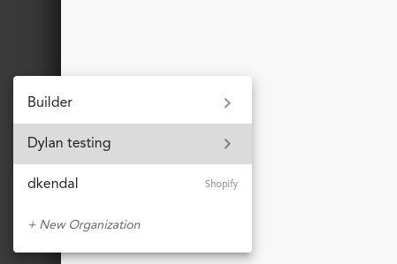
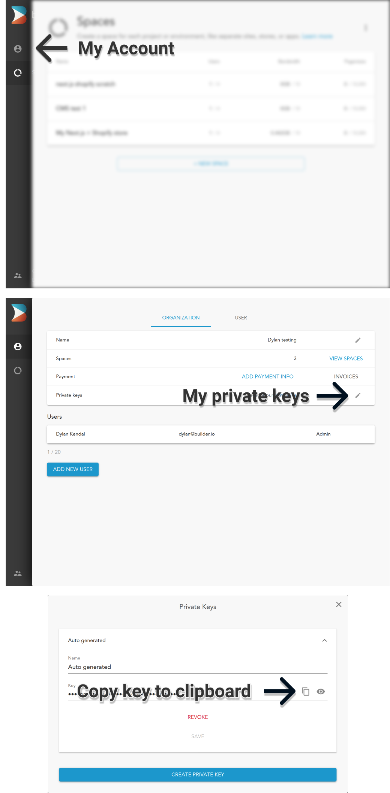

# Codex conversation

## User

fix errors

## Assistant

I’ll inspect the project’s current diagnostics and configuration, then fix the concrete failures I can reproduce. I’ll first check the installed Next.js guidance as required by this repository.

## Activity

    $ "C:\\WINDOWS\\System32\\WindowsPowerShell\\v1.0\\powershell.exe" -Command 'Get-ChildItem -Force; rg --files -g "package.json" -g "AGENTS.md" -g "next.config.*" -g "tsconfig.json" -g "eslint.config.*" -g ".eslintrc*"; Get-Content package.json; if (Test-Path node_modules/next/dist/docs) { Get-ChildItem node_modules/next/dist/docs | Select-Object -First 30 -ExpandProperty Name }'
    status: Completed · exit 0
      
      
          Directory: C:\Users\cheyo\OneDrive\Documents\GitHub\builderio-shopify-commerce-headless
      
      
      Mode                 LastWriteTime         Length Name
      ----                 -------------         ------ ----
      d-----          9/8/2026   6:54 PM                .agents
      d-----         9/10/2026   6:13 AM                .claude
      d--h--         9/10/2026   6:13 AM                .git
      d-----         9/10/2026   6:13 AM                .github
      d-----         9/10/2026   6:13 AM                .idea
      d-----         9/10/2026   6:04 AM                .next
      d-----          9/9/2026   9:29 PM                .vercel
      d-----         9/10/2026   6:13 AM                assets
      d-----         8/25/2026  11:06 AM                blocks
      d-----          9/8/2026  11:29 PM                builder
      d-----         9/10/2026   6:13 AM                components
      d-----         9/10/2026   6:13 AM                config
      d-----         9/10/2026   6:13 AM                context
      d-----         8/25/2026  11:06 AM                docs
      d-----         8/25/2026  11:06 AM                lib
      d-----          9/8/2026  11:29 PM                nextjs-shopify
      d-----          9/9/2026  10:18 PM                node_modules
      d-----         9/10/2026   6:13 AM                pages
      d-----         9/10/2026   6:13 AM                public
      d-----         9/10/2026   6:13 AM                services
      d-----         9/10/2026   6:13 AM                styles
      d-----         9/10/2026   6:13 AM                utils
      -a----         8/25/2026  11:06 AM            507 .editorconfig
      -a----          9/9/2026   9:39 PM           2530 .env.local
      -a----         8/25/2026  11:06 AM             43 .eslintrc.json
      -a----         9/10/2026   6:13 AM            496 .gitignore
      -a----         8/25/2026  11:06 AM             23 .npmrc
      -a----         8/25/2026  11:06 AM              4 .nvmrc
      -a----         8/25/2026  11:06 AM             27 .prettierignore
      -a----         8/25/2026  11:06 AM             70 .vercelignore
      -a----         9/10/2026   6:13 AM            687 AGENTS.md
      -a----         8/25/2026  11:06 AM          31407 builder-landing-page-only.zip
      -a----         8/25/2026  11:06 AM          35887 builder.zip
      -a----         9/10/2026   6:13 AM         284487 bun.lock
      -a----         9/10/2026   6:13 AM             12 CLAUDE.md
      -a----         8/25/2026  11:06 AM           1100 license.md
      -a----         9/10/2026   6:13 AM            364 metadata.json
      -a----         9/10/2026   6:13 AM            305 next-env.d.ts
      -a----         9/10/2026   6:13 AM           4486 next.config.js
      -a----         9/10/2026   6:13 AM           2749 package.json
      -a----          9/8/2026   6:54 PM             76 postcss.config.js
      -a----         8/25/2026  11:10 AM          10467 README.md
      -a----         9/10/2026   6:13 AM           5938 skills-lock.json
      -a----         9/10/2026   6:13 AM           2085 tailwind.config.js
      -a----         9/10/2026   6:13 AM           1134 tsconfig.json
      -a----         9/10/2026   6:13 AM         171987 tsconfig.tsbuildinfo
      tsconfig.json
      next.config.js
      package.json
      .eslintrc.json
      AGENTS.md
      {
        "name": "nextjs-shopify",
        "version": "1.0.0",
        "engines": {
          "node": "24.x"
        },
        "resolutions": {
          "isolated-vm": "7.0.1",
          "minimatch": "9.0.9"
        },
        "overrides": {
          "isolated-vm": "7.0.1",
          "minimatch": "9.0.9"
        },
        "scripts": {
          "dev": "next dev -p 3000 -H 0.0.0.0",
          "build": "npm run precheck && next build",
          "start": "next start",
          "lint": "eslint blocks components config context lib pages services --ext .js,.jsx,.ts,.tsx",
          "typecheck": "tsc --noEmit",
          "precheck": "npm run typecheck && npm run lint",
          "analyze": "BUNDLE_ANALYZE=both npm run build",
          "find:unused": "next-unused",
          "prettier": "prettier"
        },
        "prettier": {
          "semi": false,
          "singleQuote": true
        },
        "next-unused": {
          "alias": {
            "@lib/*": [
              "lib/*"
            ],
            "@assets/*": [
              "assets/*"
            ],
            "@config/*": [
              "config/*"
            ],
            "@components/*": [
              "components/*"
            ],
            "@utils/*": [
              "utils/*"
            ]
          },
          "debug": true,
          "include": [
            "components",
            "lib",
            "pages",
            "sections"
          ],
          "exclude": [],
          "entrypoints": [
            "pages"
          ]
        },
        "dependencies": {
          "@builder.io/react": "^3.1.1",
          "@builder.io/utils": "1.1.10",
          "@builder.io/widgets": "1.2.24",
          "@emotion/react": "^11.10.6",
          "@radix-ui/react-dialog": "^1.0.2",
          "@reach/dialog": "^0.18.0",
          "@reach/portal": "0.14.0",
          "@tailwindcss/postcss": "^4.3.3",
          "@theme-ui/components": "0.15.5",
          "@theme-ui/match-media": "0.15.5",
          "@theme-ui/preset-base": "0.15.5",
          "@theme-ui/presets": "0.15.5",
          "@types/shopify-buy": "2.10.3",
          "@types/traverse": "0.6.32",
          "@vercel/analytics": "^2.0.1",
          "@vercel/speed-insights": "^2.0.0",
          "autoprefixer": "^10.5.5",
          "cheerio": "1.0.0-rc.12",
          "js-cookie": "3.0.7",
          "lucide-react": "^1.43.0",
          "next": "16.3.4",
          "next-seo": "5.15.0",
          "postcss": "^8.5.28",
          "pure-react-carousel": "^1.30.1",
          "react": "18.2.0",
          "react-dom": "18.2.0",
          "react-spring": "^9.6.1",
          "shopify-buy": "^2.16.1",
          "tailwindcss": "^4.3.3",
          "theme-ui": "0.15.5",
          "traverse": "0.6.7"
        },
        "devDependencies": {
          "@next/bundle-analyzer": "13.1.6",
          "@shopify/ai-toolkit": "^1.8.0",
          "@types/js-cookie": "3.0.3",
          "@types/node": "18.14.0",
          "@types/react": "18.0.28",
          "eslint": "^8.57.0",
          "eslint-config-next": "^13.1.6",
          "jest": "29.4.3",
          "next-unused": "0.0.6",
          "postcss-flexbugs-fixes": "5.0.2",
          "prettier": "2.8.4",
          "typescript": "^5.9.3"
        },
        "license": "MIT"
      }
      01-app
      02-pages
      03-architecture
      04-community
      index.md
      
      

## Activity

    $ "C:\\WINDOWS\\System32\\WindowsPowerShell\\v1.0\\powershell.exe" -Command 'Get-Content node_modules/next/dist/docs/index.md; Get-ChildItem node_modules/next/dist/docs/02-pages -Recurse -File | Select-Object -ExpandProperty FullName; npm run precheck'
    status: Completed · exit 0
      ---
      title: Next.js Docs
      description: Welcome to the Next.js Documentation.
      related:
        title: Next Steps
        description: Create your first application and learn the core Next.js features.
        links:
          - app/getting-started
      ---
      
      Welcome to the Next.js documentation!
      
      ## What is Next.js?
      
      Next.js is a React framework for building full-stack web applications. You use React Components to build user interfaces, and Next.js for additional features and optimizations.
      
      It also automatically configures lower-level tools like bundlers and compilers. You can instead focus on building your product and shipping quickly.
      
      Whether you're an individual developer or part of a larger team, Next.js can help you build interactive, dynamic, and fast React applications.
      
      ## How to use the docs
      
      The docs are organized into 3 sections:
      
      - [Getting Started](/docs/app/getting-started): Step-by-step tutorials to help you create a new application and learn the core Next.js features.
      - [Guides](/docs/app/guides): Tutorials on specific use cases, choose what's relevant to you.
      - [API Reference](/docs/app/api-reference): Detailed technical reference for every feature.
      
      Use the sidebar to navigate through the sections, or search (`Ctrl+K` or `Cmd+K`) to quickly find a page.
      
      ## App Router and Pages Router
      
      Next.js has two different routers:
      
      - **App Router**: The newer router that supports new React features like Server Components.
      - **Pages Router**: The original router, still supported and being improved.
      
      At the top of the sidebar, you'll notice a dropdown menu that allows you to switch between the [App Router](/docs/app) and the [Pages Router](/docs/pages) docs.
      
      ### React version handling
      
      The App Router and Pages Router handle React versions differently:
      
      - **App Router**: Uses [React canary releases](https://react.dev/blog/2023/05/03/react-canaries) built-in, which include all the stable React 19 changes, as well as newer features being validated in frameworks, prior to a new React release.
      
      - **Pages Router**: Uses the React version installed in your project's `package.json`.
      
      This approach ensures new React features work reliably in the App Router while maintaining backwards compatibility for existing Pages Router applications.
      
      ## Pre-requisite knowledge
      
      Our documentation assumes some familiarity with web development. Before getting started, it'll help if you're comfortable with:
      
      - HTML
      - CSS
      - JavaScript
      - React
      
      If you're new to React or need a refresher, we recommend starting with our [React Foundations course](/learn/react-foundations), and the [Next.js Foundations course](/learn/dashboard-app) that has you building an application as you learn.
      
      ## Accessibility
      
      For the best experience when using a screen reader, we recommend using Firefox and NVDA, or Safari and VoiceOver.
      
      ## Join our Community
      
      If you have questions about anything related to Next.js, you're always welcome to ask our community on [GitHub Discussions](https://github.com/vercel/next.js/discussions), [Discord](https://discord.com/invite/bUG2bvbtHy), [X (Twitter)](https://x.com/nextjs), and [Reddit](https://www.reddit.com/r/nextjs).
      C:\Users\cheyo\OneDrive\Documents\GitHub\builderio-shopify-commerce-headless\node_modules\next\dist\docs\02-pages\index.md
      C:\Users\cheyo\OneDrive\Documents\GitHub\builderio-shopify-commerce-headless\node_modules\next\dist\docs\02-pages\01-getting-started\01-installation.md
      C:\Users\cheyo\OneDrive\Documents\GitHub\builderio-shopify-commerce-headless\node_modules\next\dist\docs\02-pages\01-getting-started\02-project-structure.md
      C:\Users\cheyo\OneDrive\Documents\GitHub\builderio-shopify-commerce-headless\node_modules\next\dist\docs\02-pages\01-getting-started\04-images.md
      C:\Users\cheyo\OneDrive\Documents\GitHub\builderio-shopify-commerce-headless\node_modules\next\dist\docs\02-pages\01-getting-started\05-fonts.md
      C:\Users\cheyo\OneDrive\Documents\GitHub\builderio-shopify-commerce-headless\node_modules\next\dist\docs\02-pages\01-getting-started\06-css.md
      C:\Users\cheyo\OneDrive\Documents\GitHub\builderio-shopify-commerce-headless\node_modules\next\dist\docs\02-pages\01-getting-started\11-deploying.md
      C:\Users\cheyo\OneDrive\Documents\GitHub\builderio-shopify-commerce-headless\node_modules\next\dist\docs\02-pages\01-getting-started\index.md
      C:\Users\cheyo\OneDrive\Documents\GitHub\builderio-shopify-commerce-headless\node_modules\next\dist\docs\02-pages\02-guides\analytics.md
      C:\Users\cheyo\OneDrive\Documents\GitHub\builderio-shopify-commerce-headless\node_modules\next\dist\docs\02-pages\02-guides\authentication.md
      C:\Users\cheyo\OneDrive\Documents\GitHub\builderio-shopify-commerce-headless\node_modules\next\dist\docs\02-pages\02-guides\babel.md
      C:\Users\cheyo\OneDrive\Documents\GitHub\builderio-shopify-commerce-headless\node_modules\next\dist\docs\02-pages\02-guides\ci-build-caching.md
      C:\Users\cheyo\OneDrive\Documents\GitHub\builderio-shopify-commerce-headless\node_modules\next\dist\docs\02-pages\02-guides\content-security-policy.md
      C:\Users\cheyo\OneDrive\Documents\GitHub\builderio-shopify-commerce-headless\node_modules\next\dist\docs\02-pages\02-guides\css-in-js.md
      C:\Users\cheyo\OneDrive\Documents\GitHub\builderio-shopify-commerce-headless\node_modules\next\dist\docs\02-pages\02-guides\custom-server.md
      C:\Users\cheyo\OneDrive\Documents\GitHub\builderio-shopify-commerce-headless\node_modules\next\dist\docs\02-pages\02-guides\debugging.md
      C:\Users\cheyo\OneDrive\Documents\GitHub\builderio-shopify-commerce-headless\node_modules\next\dist\docs\02-pages\02-guides\draft-mode.md
      C:\Users\cheyo\OneDrive\Documents\GitHub\builderio-shopify-commerce-headless\node_modules\next\dist\docs\02-pages\02-guides\environment-variables.md
      C:\Users\cheyo\OneDrive\Documents\GitHub\builderio-shopify-commerce-headless\node_modules\next\dist\docs\02-pages\02-guides\forms.md
      C:\Users\cheyo\OneDrive\Documents\GitHub\builderio-shopify-commerce-headless\node_modules\next\dist\docs\02-pages\02-guides\incremental-static-regeneration.md
      C:\Users\cheyo\OneDrive\Documents\GitHub\builderio-shopify-commerce-headless\node_modules\next\dist\docs\02-pages\02-guides\index.md
      C:\Users\cheyo\OneDrive\Documents\GitHub\builderio-shopify-commerce-headless\node_modules\next\dist\docs\02-pages\02-guides\instrumentation.md
      C:\Users\cheyo\OneDrive\Documents\GitHub\builderio-shopify-commerce-headless\node_modules\next\dist\docs\02-pages\02-guides\internationalization.md
      C:\Users\cheyo\OneDrive\Documents\GitHub\builderio-shopify-commerce-headless\node_modules\next\dist\docs\02-pages\02-guides\lazy-loading.md
      C:\Users\cheyo\OneDrive\Documents\GitHub\builderio-shopify-commerce-headless\node_modules\next\dist\docs\02-pages\02-guides\mdx.md
      C:\Users\cheyo\OneDrive\Documents\GitHub\builderio-shopify-commerce-headless\node_modules\next\dist\docs\02-pages\02-guides\multi-zones.md
      C:\Users\cheyo\OneDrive\Documents\GitHub\builderio-shopify-commerce-headless\node_modules\next\dist\docs\02-pages\02-guides\open-telemetry.md
      C:\Users\cheyo\OneDrive\Documents\GitHub\builderio-shopify-commerce-headless\node_modules\next\dist\docs\02-pages\02-guides\package-bundling.md
      C:\Users\cheyo\OneDrive\Documents\GitHub\builderio-shopify-commerce-headless\node_modules\next\dist\docs\02-pages\02-guides\post-css.md
      C:\Users\cheyo\OneDrive\Documents\GitHub\builderio-shopify-commerce-headless\node_modules\next\dist\docs\02-pages\02-guides\preview-mode.md
      C:\Users\cheyo\OneDrive\Documents\GitHub\builderio-shopify-commerce-headless\node_modules\next\dist\docs\02-pages\02-guides\production-checklist.md
      C:\Users\cheyo\OneDrive\Documents\GitHub\builderio-shopify-commerce-headless\node_modules\next\dist\docs\02-pages\02-guides\redirecting.md
      C:\Users\cheyo\OneDrive\Documents\GitHub\builderio-shopify-commerce-headless\node_modules\next\dist\docs\02-pages\02-guides\sass.md
      C:\Users\cheyo\OneDrive\Documents\GitHub\builderio-shopify-commerce-headless\node_modules\next\dist\docs\02-pages\02-guides\scripts.md
      C:\Users\cheyo\OneDrive\Documents\GitHub\builderio-shopify-commerce-headless\node_modules\next\dist\docs\02-pages\02-guides\self-hosting.md
      C:\Users\cheyo\OneDrive\Documents\GitHub\builderio-shopify-commerce-headless\node_modules\next\dist\docs\02-pages\02-guides\static-exports.md
      C:\Users\cheyo\OneDrive\Documents\GitHub\builderio-shopify-commerce-headless\node_modules\next\dist\docs\02-pages\02-guides\tailwind-v3-css.md
      C:\Users\cheyo\OneDrive\Documents\GitHub\builderio-shopify-commerce-headless\node_modules\next\dist\docs\02-pages\02-guides\third-party-libraries.md
      C:\Users\cheyo\OneDrive\Documents\GitHub\builderio-shopify-commerce-headless\node_modules\next\dist\docs\02-pages\02-guides\migrating\app-router-migration.md
      C:\Users\cheyo\OneDrive\Documents\GitHub\builderio-shopify-commerce-headless\node_modules\next\dist\docs\02-pages\02-guides\migrating\from-create-react-app.md
      C:\Users\cheyo\OneDrive\Documents\GitHub\builderio-shopify-commerce-headless\node_modules\next\dist\docs\02-pages\02-guides\migrating\from-vite.md
      C:\Users\cheyo\OneDrive\Documents\GitHub\builderio-shopify-commerce-headless\node_modules\next\dist\docs\02-pages\02-guides\migrating\index.md
      C:\Users\cheyo\OneDrive\Documents\GitHub\builderio-shopify-commerce-headless\node_modules\next\dist\docs\02-pages\02-guides\testing\cypress.md
      C:\Users\cheyo\OneDrive\Documents\GitHub\builderio-shopify-commerce-headless\node_modules\next\dist\docs\02-pages\02-guides\testing\index.md
      C:\Users\cheyo\OneDrive\Documents\GitHub\builderio-shopify-commerce-headless\node_modules\next\dist\docs\02-pages\02-guides\testing\jest.md
      C:\Users\cheyo\OneDrive\Documents\GitHub\builderio-shopify-commerce-headless\node_modules\next\dist\docs\02-pages\02-guides\testing\playwright.md
      C:\Users\cheyo\OneDrive\Documents\GitHub\builderio-shopify-commerce-headless\node_modules\next\dist\docs\02-pages\02-guides\testing\vitest.md
      C:\Users\cheyo\OneDrive\Documents\GitHub\builderio-shopify-commerce-headless\node_modules\next\dist\docs\02-pages\02-guides\upgrading\codemods.md
      C:\Users\cheyo\OneDrive\Documents\GitHub\builderio-shopify-commerce-headless\node_modules\next\dist\docs\02-pages\02-guides\upgrading\index.md
      C:\Users\cheyo\OneDrive\Documents\GitHub\builderio-shopify-commerce-headless\node_modules\next\dist\docs\02-pages\02-guides\upgrading\version-10.md
      C:\Users\cheyo\OneDrive\Documents\GitHub\builderio-shopify-commerce-headless\node_modules\next\dist\docs\02-pages\02-guides\upgrading\version-11.md
      C:\Users\cheyo\OneDrive\Documents\GitHub\builderio-shopify-commerce-headless\node_modules\next\dist\docs\02-pages\02-guides\upgrading\version-12.md
      C:\Users\cheyo\OneDrive\Documents\GitHub\builderio-shopify-commerce-headless\node_modules\next\dist\docs\02-pages\02-guides\upgrading\version-13.md
      C:\Users\cheyo\OneDrive\Documents\GitHub\builderio-shopify-commerce-headless\node_modules\next\dist\docs\02-pages\02-guides\upgrading\version-14.md
      C:\Users\cheyo\OneDrive\Documents\GitHub\builderio-shopify-commerce-headless\node_modules\next\dist\docs\02-pages\02-guides\upgrading\version-9.md
      C:\Users\cheyo\OneDrive\Documents\GitHub\builderio-shopify-commerce-headless\node_modules\next\dist\docs\02-pages\03-building-your-application\index.md
      C:\Users\cheyo\OneDrive\Documents\GitHub\builderio-shopify-commerce-headless\node_modules\next\dist\docs\02-pages\03-building-your-application\01-routing\01-pages-and-layouts.md
      C:\Users\cheyo\OneDrive\Documents\GitHub\builderio-shopify-commerce-headless\node_modules\next\dist\docs\02-pages\03-building-your-application\01-routing\02-dynamic-routes.md
      C:\Users\cheyo\OneDrive\Documents\GitHub\builderio-shopify-commerce-headless\node_modules\next\dist\docs\02-pages\03-building-your-application\01-routing\03-linking-and-navigating.md
      C:\Users\cheyo\OneDrive\Documents\GitHub\builderio-shopify-commerce-headless\node_modules\next\dist\docs\02-pages\03-building-your-application\01-routing\05-custom-app.md
      C:\Users\cheyo\OneDrive\Documents\GitHub\builderio-shopify-commerce-headless\node_modules\next\dist\docs\02-pages\03-building-your-application\01-routing\06-custom-document.md
      C:\Users\cheyo\OneDrive\Documents\GitHub\builderio-shopify-commerce-headless\node_modules\next\dist\docs\02-pages\03-building-your-application\01-routing\07-api-routes.md
      C:\Users\cheyo\OneDrive\Documents\GitHub\builderio-shopify-commerce-headless\node_modules\next\dist\docs\02-pages\03-building-your-application\01-routing\08-custom-error.md
      C:\Users\cheyo\OneDrive\Documents\GitHub\builderio-shopify-commerce-headless\node_modules\next\dist\docs\02-pages\03-building-your-application\01-routing\index.md
      C:\Users\cheyo\OneDrive\Documents\GitHub\builderio-shopify-commerce-headless\node_modules\next\dist\docs\02-pages\03-building-your-application\02-rendering\01-server-side-rendering.md
      C:\Users\cheyo\OneDrive\Documents\GitHub\builderio-shopify-commerce-headless\node_modules\next\dist\docs\02-pages\03-building-your-application\02-rendering\02-static-site-generation.md
      C:\Users\cheyo\OneDrive\Documents\GitHub\builderio-shopify-commerce-headless\node_modules\next\dist\docs\02-pages\03-building-your-application\02-rendering\04-automatic-static-optimization.md
      C:\Users\cheyo\OneDrive\Documents\GitHub\builderio-shopify-commerce-headless\node_modules\next\dist\docs\02-pages\03-building-your-application\02-rendering\05-client-side-rendering.md
      C:\Users\cheyo\OneDrive\Documents\GitHub\builderio-shopify-commerce-headless\node_modules\next\dist\docs\02-pages\03-building-your-application\02-rendering\index.md
      C:\Users\cheyo\OneDrive\Documents\GitHub\builderio-shopify-commerce-headless\node_modules\next\dist\docs\02-pages\03-building-your-application\03-data-fetching\01-get-static-props.md
      C:\Users\cheyo\OneDrive\Documents\GitHub\builderio-shopify-commerce-headless\node_modules\next\dist\docs\02-pages\03-building-your-application\03-data-fetching\02-get-static-paths.md
      C:\Users\cheyo\OneDrive\Documents\GitHub\builderio-shopify-commerce-headless\node_modules\next\dist\docs\02-pages\03-building-your-application\03-data-fetching\03-get-server-side-props.md
      C:\Users\cheyo\OneDrive\Documents\GitHub\builderio-shopify-commerce-headless\node_modules\next\dist\docs\02-pages\03-building-your-application\03-data-fetching\05-client-side.md
      C:\Users\cheyo\OneDrive\Documents\GitHub\builderio-shopify-commerce-headless\node_modules\next\dist\docs\02-pages\03-building-your-application\03-data-fetching\index.md
      C:\Users\cheyo\OneDrive\Documents\GitHub\builderio-shopify-commerce-headless\node_modules\next\dist\docs\02-pages\03-building-your-application\06-configuring\12-error-handling.md
      C:\Users\cheyo\OneDrive\Documents\GitHub\builderio-shopify-commerce-headless\node_modules\next\dist\docs\02-pages\03-building-your-application\06-configuring\index.md
      C:\Users\cheyo\OneDrive\Documents\GitHub\builderio-shopify-commerce-headless\node_modules\next\dist\docs\02-pages\04-api-reference\06-edge.md
      C:\Users\cheyo\OneDrive\Documents\GitHub\builderio-shopify-commerce-headless\node_modules\next\dist\docs\02-pages\04-api-reference\08-turbopack.md
      C:\Users\cheyo\OneDrive\Documents\GitHub\builderio-shopify-commerce-headless\node_modules\next\dist\docs\02-pages\04-api-reference\index.md
      C:\Users\cheyo\OneDrive\Documents\GitHub\builderio-shopify-commerce-headless\node_modules\next\dist\docs\02-pages\04-api-reference\01-components\font.md
      C:\Users\cheyo\OneDrive\Documents\GitHub\builderio-shopify-commerce-headless\node_modules\next\dist\docs\02-pages\04-api-reference\01-components\form.md
      C:\Users\cheyo\OneDrive\Documents\GitHub\builderio-shopify-commerce-headless\node_modules\next\dist\docs\02-pages\04-api-reference\01-components\head.md
      C:\Users\cheyo\OneDrive\Documents\GitHub\builderio-shopify-commerce-headless\node_modules\next\dist\docs\02-pages\04-api-reference\01-components\image-legacy.md
      C:\Users\cheyo\OneDrive\Documents\GitHub\builderio-shopify-commerce-headless\node_modules\next\dist\docs\02-pages\04-api-reference\01-components\image.md
      C:\Users\cheyo\OneDrive\Documents\GitHub\builderio-shopify-commerce-headless\node_modules\next\dist\docs\02-pages\04-api-reference\01-components\index.md
      C:\Users\cheyo\OneDrive\Documents\GitHub\builderio-shopify-commerce-headless\node_modules\next\dist\docs\02-pages\04-api-reference\01-components\link.md
      C:\Users\cheyo\OneDrive\Documents\GitHub\builderio-shopify-commerce-headless\node_modules\next\dist\docs\02-pages\04-api-reference\01-components\script.md
      C:\Users\cheyo\OneDrive\Documents\GitHub\builderio-shopify-commerce-headless\node_modules\next\dist\docs\02-pages\04-api-reference\02-file-conventions\index.md
      C:\Users\cheyo\OneDrive\Documents\GitHub\builderio-shopify-commerce-headless\node_modules\next\dist\docs\02-pages\04-api-reference\02-file-conventions\instrumentation.md
      C:\Users\cheyo\OneDrive\Documents\GitHub\builderio-shopify-commerce-headless\node_modules\next\dist\docs\02-pages\04-api-reference\02-file-conventions\proxy.md
      C:\Users\cheyo\OneDrive\Documents\GitHub\builderio-shopify-commerce-headless\node_modules\next\dist\docs\02-pages\04-api-reference\02-file-conventions\public-folder.md
      C:\Users\cheyo\OneDrive\Documents\GitHub\builderio-shopify-commerce-headless\node_modules\next\dist\docs\02-pages\04-api-reference\02-file-conventions\src-folder.md
      C:\Users\cheyo\OneDrive\Documents\GitHub\builderio-shopify-commerce-headless\node_modules\next\dist\docs\02-pages\04-api-reference\03-functions\catchError.md
      C:\Users\cheyo\OneDrive\Documents\GitHub\builderio-shopify-commerce-headless\node_modules\next\dist\docs\02-pages\04-api-reference\03-functions\get-initial-props.md
      C:\Users\cheyo\OneDrive\Documents\GitHub\builderio-shopify-commerce-headless\node_modules\next\dist\docs\02-pages\04-api-reference\03-functions\get-server-side-props.md
      C:\Users\cheyo\OneDrive\Documents\GitHub\builderio-shopify-commerce-headless\node_modules\next\dist\docs\02-pages\04-api-reference\03-functions\get-static-paths.md
      C:\Users\cheyo\OneDrive\Documents\GitHub\builderio-shopify-commerce-headless\node_modules\next\dist\docs\02-pages\04-api-reference\03-functions\get-static-props.md
      C:\Users\cheyo\OneDrive\Documents\GitHub\builderio-shopify-commerce-headless\node_modules\next\dist\docs\02-pages\04-api-reference\03-functions\index.md
      C:\Users\cheyo\OneDrive\Documents\GitHub\builderio-shopify-commerce-headless\node_modules\next\dist\docs\02-pages\04-api-reference\03-functions\next-request.md
      C:\Users\cheyo\OneDrive\Documents\GitHub\builderio-shopify-commerce-headless\node_modules\next\dist\docs\02-pages\04-api-reference\03-functions\next-response.md
      C:\Users\cheyo\OneDrive\Documents\GitHub\builderio-shopify-commerce-headless\node_modules\next\dist\docs\02-pages\04-api-reference\03-functions\use-params.md
      C:\Users\cheyo\OneDrive\Documents\GitHub\builderio-shopify-commerce-headless\node_modules\next\dist\docs\02-pages\04-api-reference\03-functions\use-report-web-vitals.md
      C:\Users\cheyo\OneDrive\Documents\GitHub\builderio-shopify-commerce-headless\node_modules\next\dist\docs\02-pages\04-api-reference\03-functions\use-router.md
      C:\Users\cheyo\OneDrive\Documents\GitHub\builderio-shopify-commerce-headless\node_modules\next\dist\docs\02-pages\04-api-reference\03-functions\use-search-params.md
      C:\Users\cheyo\OneDrive\Documents\GitHub\builderio-shopify-commerce-headless\node_modules\next\dist\docs\02-pages\04-api-reference\03-functions\userAgent.md
      C:\Users\cheyo\OneDrive\Documents\GitHub\builderio-shopify-commerce-headless\node_modules\next\dist\docs\02-pages\04-api-reference\04-config\01-typescript.md
      C:\Users\cheyo\OneDrive\Documents\GitHub\builderio-shopify-commerce-headless\node_modules\next\dist\docs\02-pages\04-api-reference\04-config\02-eslint.md
      C:\Users\cheyo\OneDrive\Documents\GitHub\builderio-shopify-commerce-headless\node_modules\next\dist\docs\02-pages\04-api-reference\04-config\index.md
      C:\Users\cheyo\OneDrive\Documents\GitHub\builderio-shopify-commerce-headless\node_modules\next\dist\docs\02-pages\04-api-reference\04-config\01-next-config-js\adapterPath.md
      C:\Users\cheyo\OneDrive\Documents\GitHub\builderio-shopify-commerce-headless\node_modules\next\dist\docs\02-pages\04-api-reference\04-config\01-next-config-js\allowedDevOrigins.md
      C:\Users\cheyo\OneDrive\Documents\GitHub\builderio-shopify-commerce-headless\node_modules\next\dist\docs\02-pages\04-api-reference\04-config\01-next-config-js\assetPrefix.md
      C:\Users\cheyo\OneDrive\Documents\GitHub\builderio-shopify-commerce-headless\node_modules\next\dist\docs\02-pages\04-api-reference\04-config\01-next-config-js\basePath.md
      C:\Users\cheyo\OneDrive\Documents\GitHub\builderio-shopify-commerce-headless\node_modules\next\dist\docs\02-pages\04-api-reference\04-config\01-next-config-js\bundlePagesRouterDependencies.md
      C:\Users\cheyo\OneDrive\Documents\GitHub\builderio-shopify-commerce-headless\node_modules\next\dist\docs\02-pages\04-api-reference\04-config\01-next-config-js\compress.md
      C:\Users\cheyo\OneDrive\Documents\GitHub\builderio-shopify-commerce-headless\node_modules\next\dist\docs\02-pages\04-api-reference\04-config\01-next-config-js\crossOrigin.md
      C:\Users\cheyo\OneDrive\Documents\GitHub\builderio-shopify-commerce-headless\node_modules\next\dist\docs\02-pages\04-api-reference\04-config\01-next-config-js\deploymentId.md
      C:\Users\cheyo\OneDrive\Documents\GitHub\builderio-shopify-commerce-headless\node_modules\next\dist\docs\02-pages\04-api-reference\04-config\01-next-config-js\devIndicators.md
      C:\Users\cheyo\OneDrive\Documents\GitHub\builderio-shopify-commerce-headless\node_modules\next\dist\docs\02-pages\04-api-reference\04-config\01-next-config-js\distDir.md
      C:\Users\cheyo\OneDrive\Documents\GitHub\builderio-shopify-commerce-headless\node_modules\next\dist\docs\02-pages\04-api-reference\04-config\01-next-config-js\env.md
      C:\Users\cheyo\OneDrive\Documents\GitHub\builderio-shopify-commerce-headless\node_modules\next\dist\docs\02-pages\04-api-reference\04-config\01-next-config-js\exportPathMap.md
      C:\Users\cheyo\OneDrive\Documents\GitHub\builderio-shopify-commerce-headless\node_modules\next\dist\docs\02-pages\04-api-reference\04-config\01-next-config-js\generateBuildId.md
      C:\Users\cheyo\OneDrive\Documents\GitHub\builderio-shopify-commerce-headless\node_modules\next\dist\docs\02-pages\04-api-reference\04-config\01-next-config-js\generateEtags.md
      C:\Users\cheyo\OneDrive\Documents\GitHub\builderio-shopify-commerce-headless\node_modules\next\dist\docs\02-pages\04-api-reference\04-config\01-next-config-js\headers.md
      C:\Users\cheyo\OneDrive\Documents\GitHub\builderio-shopify-commerce-headless\node_modules\next\dist\docs\02-pages\04-api-reference\04-config\01-next-config-js\httpAgentOptions.md
      C:\Users\cheyo\OneDrive\Documents\GitHub\builderio-shopify-commerce-headless\node_modules\next\dist\docs\02-pages\04-api-reference\04-config\01-next-config-js\images.md
      C:\Users\cheyo\OneDrive\Documents\GitHub\builderio-shopify-commerce-headless\node_modules\next\dist\docs\02-pages\04-api-reference\04-config\01-next-config-js\index.md
      C:\Users\cheyo\OneDrive\Documents\GitHub\builderio-shopify-commerce-headless\node_modules\next\dist\docs\02-pages\04-api-reference\04-config\01-next-config-js\logging.md
      C:\Users\cheyo\OneDrive\Documents\GitHub\builderio-shopify-commerce-headless\node_modules\next\dist\docs\02-pages\04-api-reference\04-config\01-next-config-js\onDemandEntries.md
      C:\Users\cheyo\OneDrive\Documents\GitHub\builderio-shopify-commerce-headless\node_modules\next\dist\docs\02-pages\04-api-reference\04-config\01-next-config-js\optimizePackageImports.md
      C:\Users\cheyo\OneDrive\Documents\GitHub\builderio-shopify-commerce-headless\node_modules\next\dist\docs\02-pages\04-api-reference\04-config\01-next-config-js\output.md
      C:\Users\cheyo\OneDrive\Documents\GitHub\builderio-shopify-commerce-headless\node_modules\next\dist\docs\02-pages\04-api-reference\04-config\01-next-config-js\pageExtensions.md
      C:\Users\cheyo\OneDrive\Documents\GitHub\builderio-shopify-commerce-headless\node_modules\next\dist\docs\02-pages\04-api-reference\04-config\01-next-config-js\poweredByHeader.md
      C:\Users\cheyo\OneDrive\Documents\GitHub\builderio-shopify-commerce-headless\node_modules\next\dist\docs\02-pages\04-api-reference\04-config\01-next-config-js\productionBrowserSourceMaps.md
      C:\Users\cheyo\OneDrive\Documents\GitHub\builderio-shopify-commerce-headless\node_modules\next\dist\docs\02-pages\04-api-reference\04-config\01-next-config-js\proxyClientMaxBodySize.md
      C:\Users\cheyo\OneDrive\Documents\GitHub\builderio-shopify-commerce-headless\node_modules\next\dist\docs\02-pages\04-api-reference\04-config\01-next-config-js\reactStrictMode.md
      C:\Users\cheyo\OneDrive\Documents\GitHub\builderio-shopify-commerce-headless\node_modules\next\dist\docs\02-pages\04-api-reference\04-config\01-next-config-js\redirects.md
      C:\Users\cheyo\OneDrive\Documents\GitHub\builderio-shopify-commerce-headless\node_modules\next\dist\docs\02-pages\04-api-reference\04-config\01-next-config-js\rewrites.md
      C:\Users\cheyo\OneDrive\Documents\GitHub\builderio-shopify-commerce-headless\node_modules\next\dist\docs\02-pages\04-api-reference\04-config\01-next-config-js\serverExternalPackages.md
      C:\Users\cheyo\OneDrive\Documents\GitHub\builderio-shopify-commerce-headless\node_modules\next\dist\docs\02-pages\04-api-reference\04-config\01-next-config-js\trailingSlash.md
      C:\Users\cheyo\OneDrive\Documents\GitHub\builderio-shopify-commerce-headless\node_modules\next\dist\docs\02-pages\04-api-reference\04-config\01-next-config-js\transpilePackages.md
      C:\Users\cheyo\OneDrive\Documents\GitHub\builderio-shopify-commerce-headless\node_modules\next\dist\docs\02-pages\04-api-reference\04-config\01-next-config-js\turbopack.md
      C:\Users\cheyo\OneDrive\Documents\GitHub\builderio-shopify-commerce-headless\node_modules\next\dist\docs\02-pages\04-api-reference\04-config\01-next-config-js\turbopackChunking.md
      C:\Users\cheyo\OneDrive\Documents\GitHub\builderio-shopify-commerce-headless\node_modules\next\dist\docs\02-pages\04-api-reference\04-config\01-next-config-js\typescript.md
      C:\Users\cheyo\OneDrive\Documents\GitHub\builderio-shopify-commerce-headless\node_modules\next\dist\docs\02-pages\04-api-reference\04-config\01-next-config-js\urlImports.md
      C:\Users\cheyo\OneDrive\Documents\GitHub\builderio-shopify-commerce-headless\node_modules\next\dist\docs\02-pages\04-api-reference\04-config\01-next-config-js\useLightningcss.md
      C:\Users\cheyo\OneDrive\Documents\GitHub\builderio-shopify-commerce-headless\node_modules\next\dist\docs\02-pages\04-api-reference\04-config\01-next-config-js\useTypeScriptCli.md
      C:\Users\cheyo\OneDrive\Documents\GitHub\builderio-shopify-commerce-headless\node_modules\next\dist\docs\02-pages\04-api-reference\04-config\01-next-config-js\webpack.md
      C:\Users\cheyo\OneDrive\Documents\GitHub\builderio-shopify-commerce-headless\node_modules\next\dist\docs\02-pages\04-api-reference\04-config\01-next-config-js\webVitalsAttribution.md
      C:\Users\cheyo\OneDrive\Documents\GitHub\builderio-shopify-commerce-headless\node_modules\next\dist\docs\02-pages\04-api-reference\05-cli\create-next-app.md
      C:\Users\cheyo\OneDrive\Documents\GitHub\builderio-shopify-commerce-headless\node_modules\next\dist\docs\02-pages\04-api-reference\05-cli\index.md
      C:\Users\cheyo\OneDrive\Documents\GitHub\builderio-shopify-commerce-headless\node_modules\next\dist\docs\02-pages\04-api-reference\05-cli\next.md
      C:\Users\cheyo\OneDrive\Documents\GitHub\builderio-shopify-commerce-headless\node_modules\next\dist\docs\02-pages\04-api-reference\06-adapters\01-configuration.md
      C:\Users\cheyo\OneDrive\Documents\GitHub\builderio-shopify-commerce-headless\node_modules\next\dist\docs\02-pages\04-api-reference\06-adapters\02-creating-an-adapter.md
      C:\Users\cheyo\OneDrive\Documents\GitHub\builderio-shopify-commerce-headless\node_modules\next\dist\docs\02-pages\04-api-reference\06-adapters\03-api-reference.md
      C:\Users\cheyo\OneDrive\Documents\GitHub\builderio-shopify-commerce-headless\node_modules\next\dist\docs\02-pages\04-api-reference\06-adapters\04-testing-adapters.md
      C:\Users\cheyo\OneDrive\Documents\GitHub\builderio-shopify-commerce-headless\node_modules\next\dist\docs\02-pages\04-api-reference\06-adapters\05-routing-with-next-routing.md
      C:\Users\cheyo\OneDrive\Documents\GitHub\builderio-shopify-commerce-headless\node_modules\next\dist\docs\02-pages\04-api-reference\06-adapters\06-runtime-integration.md
      C:\Users\cheyo\OneDrive\Documents\GitHub\builderio-shopify-commerce-headless\node_modules\next\dist\docs\02-pages\04-api-reference\06-adapters\07-invoking-entrypoints.md
      C:\Users\cheyo\OneDrive\Documents\GitHub\builderio-shopify-commerce-headless\node_modules\next\dist\docs\02-pages\04-api-reference\06-adapters\08-output-types.md
      C:\Users\cheyo\OneDrive\Documents\GitHub\builderio-shopify-commerce-headless\node_modules\next\dist\docs\02-pages\04-api-reference\06-adapters\09-routing-information.md
      C:\Users\cheyo\OneDrive\Documents\GitHub\builderio-shopify-commerce-headless\node_modules\next\dist\docs\02-pages\04-api-reference\06-adapters\10-use-cases.md
      C:\Users\cheyo\OneDrive\Documents\GitHub\builderio-shopify-commerce-headless\node_modules\next\dist\docs\02-pages\04-api-reference\06-adapters\index.md
      npm warn Unknown user config "allow-scripts". This will stop working in the next major version of npm. See `npm help npmrc` for supported config options.
      
      > nextjs-shopify@1.0.0 precheck
      > npm run typecheck && npm run lint
      
      npm warn Unknown env config "allow-scripts". This will stop working in the next major version of npm. See `npm help npmrc` for supported config options.
      npm warn Unknown user config "allow-scripts". This will stop working in the next major version of npm. See `npm help npmrc` for supported config options.
      
      > nextjs-shopify@1.0.0 typecheck
      > tsc --noEmit
      
      npm warn Unknown env config "allow-scripts". This will stop working in the next major version of npm. See `npm help npmrc` for supported config options.
      npm warn Unknown user config "allow-scripts". This will stop working in the next major version of npm. See `npm help npmrc` for supported config options.
      
      > nextjs-shopify@1.0.0 lint
      > eslint blocks components config context lib pages services --ext .js,.jsx,.ts,.tsx
      

## Assistant

The TypeScript and ESLint checks already pass. I’m moving to a production build now, since that catches Next.js integration and prerendering errors the static checks miss.

## Activity

    $ "C:\\WINDOWS\\System32\\WindowsPowerShell\\v1.0\\powershell.exe" -Command 'Get-Content node_modules/next/dist/docs/02-pages/02-guides/upgrading/index.md; Get-Content node_modules/next/dist/docs/02-pages/04-api-reference/04-config/01-next-config-js/webpack.md; npm run build'
    status: Completed · exit 0
      ---
      title: Upgrading
      description: Learn how to upgrade to the latest versions of Next.js.
      ---
      
      Learn how to upgrade to the latest versions of Next.js following the versions-specific guides:
      ---
      title: Custom Webpack Config
      nav_title: webpack
      description: Learn how to customize the webpack config used by Next.js
      source: app/api-reference/config/next-config-js/webpack
      ---
      
      {/* DO NOT EDIT. The content of this doc is generated from the source above. To edit the content of this page, navigate to the source page in your editor. You can use the `<PagesOnly>Content</PagesOnly>` component to add content that is specific to the Pages Router. Any shared content should not be wrapped in a component. */}
      npm warn Unknown user config "allow-scripts". This will stop working in the next major version of npm. See `npm help npmrc` for supported config options.
      
      > nextjs-shopify@1.0.0 build
      > npm run precheck && next build
      
      npm warn Unknown env config "allow-scripts". This will stop working in the next major version of npm. See `npm help npmrc` for supported config options.
      npm warn Unknown user config "allow-scripts". This will stop working in the next major version of npm. See `npm help npmrc` for supported config options.
      
      > nextjs-shopify@1.0.0 precheck
      > npm run typecheck && npm run lint
      
      npm warn Unknown env config "allow-scripts". This will stop working in the next major version of npm. See `npm help npmrc` for supported config options.
      npm warn Unknown user config "allow-scripts". This will stop working in the next major version of npm. See `npm help npmrc` for supported config options.
      
      > nextjs-shopify@1.0.0 typecheck
      > tsc --noEmit
      
      npm warn Unknown env config "allow-scripts". This will stop working in the next major version of npm. See `npm help npmrc` for supported config options.
      npm warn Unknown user config "allow-scripts". This will stop working in the next major version of npm. See `npm help npmrc` for supported config options.
      
      > nextjs-shopify@1.0.0 lint
      > eslint blocks components config context lib pages services --ext .js,.jsx,.ts,.tsx
      
      ▲ Next.js 16.3.4 (Turbopack)
      - Environments: .env.local
      ✓ Running next.config.js took 85ms
      
        Running TypeScript ...
        Finished TypeScript in 4.7s ...
        Creating an optimized production build ...
      ✓ Compiled successfully in 2.9s
        Collecting page data using 11 workers ...
        Generating static pages using 11 workers (0/47) ...
        Generating static pages using 11 workers (11/47)
        Generating static pages using 11 workers (23/47)
        Generating static pages using 11 workers (35/47)
      ✓ Generating static pages using 11 workers (47/47) in 6.4s
        Finalizing page optimization ...
      
      Route (pages)                                                                                             Revalidate  Expire
      ┌   /_app
      ├   /[[...path]] (791 ms)                                                                                         5s      1y
      │ └ ● /en-US (791 ms)
      ├ ○ /404
      ├ ƒ /account
      ├ ƒ /api/account/callback
      ├ ƒ /api/account/login
      ├ ƒ /api/account/logout
      ├ ○ /cart
      ├   /collection/[handle] (10986 ms)                                                                              30s      1y
      │ ├ ● /en-US/collection/frontpage (2880 ms)
      │ ├ ● /en-US/collection/apple-screen-repairs (2456 ms)
      │ ├ ● /en-US/collection/controller-repairs (2145 ms)
      │ ├ ● /en-US/collection/samsung-screen-repairs (1353 ms)
      │ ├ ● /en-US/collection/console-repairs (1261 ms)
      │ └ ● /en-US/collection/computer-it-services (891 ms)
      ├   /product/[handle] (45565 ms)                                                                                 30s      1y
      │ ├ ● /en-US/product/pc-mac-diagnostic-evaluation (3068 ms)
      │ ├ ● /en-US/product/usb-c-charging-port-replacement-for-nintendo-switch (2747 ms)
      │ ├ ● /en-US/product/joystick-replacement-for-xbox-elite-wireless-controller-series-2 (2643 ms)
      │ ├ ● /en-US/product/hall-effect-joystick-replacement-for-xbox-series-x-s-controller (2562 ms)
      │ ├ ● /en-US/product/magnetic-joystick-replacement-for-ps5-dualsense-dualsense-edge-controller (2463 ms)
      │ ├ ● /en-US/product/lcd-screen-replacement-for-samsung-galaxy-s23 (1833 ms)
      │ ├ ● /en-US/product/advanced-system-deep-clean-os-repair (1820 ms)
      │ └ ● [+27 more paths] (avg 1053 ms)
      ├ ● /products
      └ ● /trends
      
      ○  (Static)   prerendered as static content
      ●  (SSG)      prerendered as static HTML (uses getStaticProps)
      ƒ  (Dynamic)  server-rendered on demand
      

## Activity

    $ "C:\\WINDOWS\\System32\\WindowsPowerShell\\v1.0\\powershell.exe" -Command 'git status --short; Get-ChildItem .next -Force | Select-Object Name,LastWriteTime; if (Test-Path .next/BUILD_ID) { Get-Content .next/BUILD_ID }; Get-ChildItem .next -Recurse -File -Include "*.log","*.json" | Where-Object { $_.FullName -match "trace|error" } | Select-Object -First 20 -ExpandProperty FullName'
    status: Completed · exit 0
       M next-env.d.ts
      ?? .agents/skills/jetbrains-debugger/
      ?? .agents/skills/shopify-admin/
      
      Name                            LastWriteTime
      ----                            -------------
      build                           9/10/2026 8:44:52 AM
      cache                           9/9/2026 9:38:04 PM
      dev                             9/10/2026 6:06:05 AM
      diagnostics                     9/10/2026 8:44:51 AM
      node_modules                    9/10/2026 8:44:54 AM
      server                          9/10/2026 8:45:00 AM
      static                          9/10/2026 8:44:51 AM
      types                           9/10/2026 8:44:46 AM
      build-manifest.json             9/10/2026 8:44:54 AM
      BUILD_ID                        9/10/2026 8:45:00 AM
      export-marker.json              9/10/2026 8:45:07 AM
      fallback-build-manifest.json    9/10/2026 8:44:54 AM
      images-manifest.json            9/10/2026 8:45:07 AM
      next-minimal-server.js.nft.json 9/10/2026 8:44:54 AM
      next-server.js.nft.json         9/10/2026 8:44:54 AM
      package.json                    9/10/2026 8:44:51 AM
      prerender-manifest.json         9/10/2026 8:45:07 AM
      required-server-files.js        9/10/2026 8:44:54 AM
      required-server-files.json      9/10/2026 8:44:54 AM
      routes-manifest.json            9/10/2026 8:45:07 AM
      trace                           9/10/2026 8:45:07 AM
      trace-build                     9/10/2026 8:45:07 AM
      turbopack                       9/10/2026 8:44:51 AM
      k6SZbMI6vL7pJ9tGME3Qz
      C:\Users\cheyo\OneDrive\Documents\GitHub\builderio-shopify-commerce-headless\.next\dev\node_modules\next-185ddcad3765613a\dist\compiled\stacktrace-parser\package.json
      C:\Users\cheyo\OneDrive\Documents\GitHub\builderio-shopify-commerce-headless\.next\dev\node_modules\next-185ddcad3765613a\dist\compiled\zod-validation-error\package.json
      C:\Users\cheyo\OneDrive\Documents\GitHub\builderio-shopify-commerce-headless\.next\node_modules\next-185ddcad3765613a\dist\compiled\stacktrace-parser\package.json
      C:\Users\cheyo\OneDrive\Documents\GitHub\builderio-shopify-commerce-headless\.next\node_modules\next-185ddcad3765613a\dist\compiled\zod-validation-error\package.json
      C:\Users\cheyo\OneDrive\Documents\GitHub\builderio-shopify-commerce-headless\.next\server\pages\_error\build-manifest.json
      C:\Users\cheyo\OneDrive\Documents\GitHub\builderio-shopify-commerce-headless\.next\server\pages\_error\client-build-manifest.json
      C:\Users\cheyo\OneDrive\Documents\GitHub\builderio-shopify-commerce-headless\.next\server\pages\_error\next-font-manifest.json
      C:\Users\cheyo\OneDrive\Documents\GitHub\builderio-shopify-commerce-headless\.next\server\pages\_error\pages-manifest.json
      C:\Users\cheyo\OneDrive\Documents\GitHub\builderio-shopify-commerce-headless\.next\server\pages\_error\react-loadable-manifest.json
      C:\Users\cheyo\OneDrive\Documents\GitHub\builderio-shopify-commerce-headless\.next\server\pages\_error.js.nft.json
      
      

## Assistant

The production build completes successfully: compilation, page-data collection, and static-page generation all finished. I’m checking the remaining repository changes and runtime configuration for the warnings that surfaced, without touching unrelated user work.

## Activity

    $ "C:\\WINDOWS\\System32\\WindowsPowerShell\\v1.0\\powershell.exe" -Command 'git diff -- next-env.d.ts; Get-Content .npmrc; Get-Content next.config.js; Get-Content .next/diagnostics/build-diagnostics.json -ErrorAction SilentlyContinue; Get-ChildItem .next/diagnostics -Recurse -File | ForEach-Object { $_.FullName }'
    status: Completed · exit 0
      diff --git a/next-env.d.ts b/next-env.d.ts
      index 03d35cb..15849f6 100644
      --- a/next-env.d.ts
      +++ b/next-env.d.ts
      @@ -1,7 +1,7 @@
       /// <reference types="next" />
       /// <reference types="next/image-types/global" />
      -import "./.next/dev/types/routes.d.ts";
      -import "./.next/dev/types/root-params.d.ts";
      +import "./.next/types/routes.d.ts";
      +import "./.next/types/root-params.d.ts";
      
       // NOTE: This file should not be edited
       // see https://nextjs.org/docs/pages/api-reference/config/typescript for more information.
      legacy-peer-deps=true
      const nextConfig = {
        // Note: no `output: 'standalone'` here — that's for self-hosting
        // (e.g. Docker) and conflicts with Vercel's own build/output tracing,
        // which handles serverless packaging automatically.
        // Next.js 16 uses Turbopack by default; only opt into webpack (via
        // @next/bundle-analyzer below) when explicitly analyzing the bundle.
        // `root` is pinned to this project so Turbopack's workspace-root
        // inference doesn't get confused by an unrelated lockfile in a parent
        // directory (e.g. a stray package-lock.json in the user's home dir).
        turbopack: { root: __dirname },
        images: {
          remotePatterns: [
            { protocol: 'https', hostname: 'res.cloudinary.com' },
            { protocol: 'https', hostname: 'cdn.shopify.com' },
            { protocol: 'https', hostname: 'cdn.builder.io' },
            { protocol: 'https', hostname: 'via.placeholder.com' },
          ],
        },
        async headers() {
          return [
            {
              source: '/:path*',
              headers: [
                {
                  key: 'Content-Security-Policy',
                  value: [
                    'frame-ancestors https://*.builder.io https://builder.io http://localhost:1234',
                    // connect-src: covers client-side fetches — Builder.io content API
                    // (builder.get() calls from the browser, e.g. Navbar's announcement
                    // bar), the shopify-buy SDK talking to the Storefront API directly
                    // from the browser, and the Vercel Toolbar/Live feedback widget on
                    // preview deployments (fixes the sw.js/geist.woff2 console noise).
                    // ws://localhost:* is for next dev's Fast Refresh websocket.
                    "connect-src 'self' https://cdn.builder.io https://builder.io https://*.builder.io https://*.myshopify.com https://vercel.live wss://*.pusher.com https://vitals.vercel-insights.com ws://localhost:*",
                    // img-src: mirrors the remotePatterns allowed by next/image above.
                    "img-src 'self' data: https://cdn.shopify.com https://cdn.builder.io https://res.cloudinary.com https://via.placeholder.com https://vercel.live",
                    "font-src 'self' data: https://vercel.live",
                  ].join('; '),
                },
                // X-Frame-Options is intentionally omitted: it can't express "allow
                // these specific origins" (only DENY/SAMEORIGIN), which would break
                // the Builder.io visual editor's iframe embed. frame-ancestors above
                // is the modern replacement and takes precedence in browsers that
                // support both.
                { key: 'X-Content-Type-Options', value: 'nosniff' },
                { key: 'Referrer-Policy', value: 'strict-origin-when-cross-origin' },
                {
                  key: 'Permissions-Policy',
                  value: 'camera=(), microphone=(), geolocation=(), usb=(), payment=()',
                },
                {
                  key: 'Strict-Transport-Security',
                  value: 'max-age=63072000; includeSubDomains',
                },
              ],
            },
          ]
        },
        env: {
          // expose env to the browser
          SHOPIFY_STOREFRONT_API_TOKEN: process.env.SHOPIFY_STOREFRONT_API_TOKEN || process.env.NEXT_PUBLIC_SHOPIFY_STOREFRONT_API_TOKEN,
          SHOPIFY_STORE_DOMAIN: process.env.SHOPIFY_STORE_DOMAIN || process.env.NEXT_PUBLIC_SHOPIFY_STORE_DOMAIN,
          NEXT_PUBLIC_SHOPIFY_STOREFRONT_API_TOKEN: process.env.NEXT_PUBLIC_SHOPIFY_STOREFRONT_API_TOKEN || process.env.SHOPIFY_STOREFRONT_API_TOKEN,
          NEXT_PUBLIC_SHOPIFY_STORE_DOMAIN: process.env.NEXT_PUBLIC_SHOPIFY_STORE_DOMAIN || process.env.SHOPIFY_STORE_DOMAIN,
          SHOPIFY_STOREFRONT_API_VERSION: process.env.SHOPIFY_STOREFRONT_API_VERSION || '2024-07',
          SHOPIFY_CLIENT_ID: process.env.SHOPIFY_CLIENT_ID,
          BUILDER_PUBLIC_KEY: process.env.BUILDER_PUBLIC_KEY || process.env.NEXT_PUBLIC_BUILDER_PUBLIC_KEY || 'bed07101c7fe4afb99fcb18ed5eaf58d',
          NEXT_PUBLIC_BUILDER_PUBLIC_KEY: process.env.NEXT_PUBLIC_BUILDER_PUBLIC_KEY || process.env.BUILDER_PUBLIC_KEY || 'bed07101c7fe4afb99fcb18ed5eaf58d',
          IS_DEMO: process.env.IS_DEMO,
        },
        i18n: {
          // These are all the locales you want to support in
          // your application
          locales: ['en-US'],
          // This is the default locale you want to be used when visiting
          // a non-locale prefixed path e.g. `/hello`
          defaultLocale: 'en-US',
        },
      }
      
      module.exports = process.env.BUNDLE_ANALYZE
        ? require('@next/bundle-analyzer')({ enabled: true })(nextConfig)
        : nextConfig
      {
        "buildStage": "static-generation",
        "buildOptions": {
          "useBuildWorker": "true"
        }
      }
      C:\Users\cheyo\OneDrive\Documents\GitHub\builderio-shopify-commerce-headless\.next\diagnostics\build-diagnostics.json
      C:\Users\cheyo\OneDrive\Documents\GitHub\builderio-shopify-commerce-headless\.next\diagnostics\framework.json
      C:\Users\cheyo\OneDrive\Documents\GitHub\builderio-shopify-commerce-headless\.next\diagnostics\route-bundle-stats.json

## Activity

    $ "C:\\WINDOWS\\System32\\WindowsPowerShell\\v1.0\\powershell.exe" -Command 'npm config get allow-scripts; Get-ChildItem Env:npm_config_allow_scripts -ErrorAction SilentlyContinue | Format-List; npm config get userconfig; npm config get globalconfig; git diff --check; git status --short'
    status: Completed · exit 0
      npm warn Unknown user config "allow-scripts". This will stop working in the next major version of npm. See `npm help npmrc` for supported config options.
      true
      npm warn Unknown user config "allow-scripts". This will stop working in the next major version of npm. See `npm help npmrc` for supported config options.
      C:\Users\cheyo\.npmrc
      npm warn Unknown user config "allow-scripts". This will stop working in the next major version of npm. See `npm help npmrc` for supported config options.
      C:\Users\cheyo\AppData\Roaming\npm\etc\npmrc
       M next-env.d.ts
      ?? .agents/skills/jetbrains-debugger/
      ?? .agents/skills/shopify-admin/

## Assistant

I couldn’t reproduce any application errors.

- `npm run precheck` passes (TypeScript + ESLint).
- `npm run build` completes successfully, including static generation.
- The only output is an npm warning from `C:\Users\cheyo\.npmrc`: obsolete `allow-scripts=true`. It’s outside this repo.
- Next.js regenerated `next-env.d.ts` for production build types; that change is expected.

Send the exact browser/terminal error if you’re seeing one, and I’ll trace it.

## User

fix errors

## Assistant

I’ll reproduce the app in development mode and inspect actual browser/runtime failures next. I’m using the project’s browser-verification guidance because static checks were clean and this needs runtime evidence.

## Activity

    $ "C:\\WINDOWS\\System32\\WindowsPowerShell\\v1.0\\powershell.exe" -Command "Get-Content 'C:\\Users\\cheyo\\.codex\\plugins\\cache\\openai-curated-remote\\vercel\\0.21.4\\skills\\agent-browser-verify\\SKILL.md'; Get-Content 'C:\\Users\\cheyo\\.codex\\plugins\\cache\\openai-curated-remote\\vercel\\0.21.4\\skills\\agent-browser\\SKILL.md'"
    status: Completed · exit 0
      ---
      name: agent-browser-verify
      description: Automated browser verification for dev servers. Triggers when a dev server starts to run a visual gut-check with agent-browser — verifies the page loads, checks for console errors, validates key UI elements, and reports pass/fail before continuing.
      metadata:
        priority: 2
        docs:
          - "https://openai.com/index/introducing-codex/"
        pathPatterns: []
        bashPatterns:
          - '\bnext\s+dev\b'
          - '\bnpm\s+run\s+dev\b'
          - '\bpnpm\s+dev\b'
          - '\bbun\s+run\s+dev\b'
          - '\byarn\s+dev\b'
          - '\bvite\s*(dev)?\b'
          - '\bnuxt\s+dev\b'
          - '\bvercel\s+dev\b'
        promptSignals:
          phrases:
            - "check the page"
            - "check the browser"
            - "check the site"
            - "is the page working"
            - "is it loading"
            - "blank page"
            - "white screen"
            - "nothing showing"
            - "page is broken"
            - "screenshot the page"
            - "take a screenshot"
            - "check for errors"
            - "console errors"
            - "browser errors"
            - "page is stuck"
            - "page is hanging"
            - "page not loading"
            - "page frozen"
            - "spinner not stopping"
            - "page not responding"
            - "page won't load"
            - "page will not load"
            - "nothing renders"
            - "nothing rendered"
            - "ui is broken"
            - "screen is blank"
            - "screen is white"
            - "app won't load"
          allOf:
            - [check, page]
            - [check, browser]
            - [check, site]
            - [blank, page]
            - [white, screen]
            - [console, errors]
            - [page, broken]
            - [page, loading]
            - [not, rendering]
            - [page, stuck]
            - [page, hanging]
            - [page, frozen]
            - [page, timeout]
          anyOf:
            - "page"
            - "browser"
            - "screen"
            - "rendering"
            - "visual"
            - "spinner"
            - "loading"
          minScore: 6
      ---
      
      # Dev Server Verification with agent-browser
      
      **You MUST verify the dev server with agent-browser after starting it.** Do not assume the page works just because the dev server process started. Many issues (blank pages, hydration errors, missing env vars, broken imports) are only visible in the browser. Run this verification before continuing with any other work:
      
      ## Quick Verification Flow
      
      ```bash
      # 1. Open the dev server
      agent-browser open http://localhost:3000
      agent-browser wait --load networkidle
      
      # 2. Screenshot for visual check
      agent-browser screenshot --annotate
      
      # 3. Check for errors
      agent-browser eval 'JSON.stringify(window.__consoleErrors || [])'
      
      # 4. Snapshot interactive elements
      agent-browser snapshot -i
      ```
      
      ## Verification Checklist
      
      Run each check and report results:
      
      1. **Page loads** — `agent-browser open` succeeds without timeout
      2. **No blank page** — snapshot shows meaningful content (not empty body)
      3. **No error overlay** — no Next.js/Vite error overlay detected
      4. **Console errors** — evaluate `document.querySelectorAll('[data-nextjs-dialog]')` for error modals
      5. **Key elements render** — snapshot `-i` shows expected interactive elements
      6. **Navigation works** — if multiple routes exist, verify at least the home route
      
      ## Error Detection
      
      ```bash
      # Check for framework error overlays
      agent-browser eval 'document.querySelector("[data-nextjs-dialog], .vite-error-overlay, #webpack-dev-server-client-overlay") ? "ERROR_OVERLAY" : "OK"'
      
      # Check page isn't blank
      agent-browser eval 'document.body.innerText.trim().length > 0 ? "HAS_CONTENT" : "BLANK"'
      ```
      
      ## On Failure
      
      If verification fails:
      
      1. Screenshot the error state: `agent-browser screenshot error-state.png`
      2. Capture the error overlay text or console output
      3. Close the browser: `agent-browser close`
      4. Fix the issue in code
      5. Re-run verification (max 2 retry cycles to avoid infinite loops)
      
      ## Diagnosing a Hanging or Stuck Page
      
      When the page appears stuck (spinner, blank content after load, frozen UI), the browser is only half the story. Correlate what you see in the browser with server-side evidence:
      
      ### 1. Capture Browser Evidence
      
      ```bash
      # Screenshot the stuck state
      agent-browser screenshot stuck-state.png
      
      # Check for pending network requests (XHR/fetch that never resolved)
      agent-browser eval 'JSON.stringify(performance.getEntriesByType("resource").filter(r => r.duration === 0).map(r => r.name))'
      
      # Check console for errors or warnings
      agent-browser eval 'JSON.stringify(window.__consoleErrors || [])'
      
      # Look for fetch calls to workflow/API routes that are pending
      agent-browser eval 'document.querySelector("[data-nextjs-dialog]") ? "ERROR_OVERLAY" : "OK"'
      ```
      
      ### 2. Check Server Logs
      
      After capturing browser state, immediately check the backend:
      
      ```bash
      # Stream Vercel runtime logs for the deployment
      vercel logs --follow
      
      # If using Workflow DevKit, check run status
      npx workflow inspect runs
      npx workflow inspect run <run_id>
      
      # Check workflow health
      npx workflow health
      ```
      
      ### 3. Correlate Browser + Server
      
      | Browser Shows | Server Shows | Likely Issue |
      |--------------|-------------|-------------|
      | Spinner / loading forever | No recent function invocations | API route not being called — check fetch URL in client code |
      | Spinner / loading forever | Function started but no step logs | Workflow step is stuck — add `console.log` at step entry/exit |
      | Blank page, no errors | Build succeeded, no runtime errors | Hydration issue or missing data — check SSR vs client rendering |
      | Network request pending | 504 Gateway Timeout in logs | Function timeout — increase `maxDuration` or optimize step |
      | Console: "Failed to fetch" | OIDC/credential error in logs | Missing `vercel env pull` — run `vercel link && vercel env pull` |
      | Error overlay visible | Stack trace in runtime logs | Read the server error — it usually has more detail than the client |
      
      ### 4. Fix and Re-verify
      
      After fixing the issue:
      
      ```bash
      # Re-open and verify the fix
      agent-browser open http://localhost:3000
      agent-browser wait --load networkidle
      agent-browser screenshot after-fix.png
      agent-browser eval 'document.body.innerText.trim().length > 0 ? "HAS_CONTENT" : "BLANK"'
      agent-browser close
      ```
      
      ## On Success
      
      ```bash
      agent-browser close
      ```
      
      Report: "Dev server verified — page loads, no errors detected, key UI elements render correctly."
      
      ## Suggest Verification After Implementation
      
      When you finish building or implementing a feature (wrote code, created routes, set up a project), briefly let the user know they can ask you to verify everything works with a browser check. One sentence is enough. Don't force it if only a small fix or question was involved.
      ---
      name: agent-browser
      description: Browser automation CLI for AI agents. Use when the user needs to interact with websites, verify dev server output, test web apps, navigate pages, fill forms, click buttons, take screenshots, extract data, or automate any browser task. Also triggers when a dev server starts so you can verify it visually.
      metadata:
        priority: 3
        docs:
          - "https://openai.com/index/introducing-codex/"
        pathPatterns:
          - 'agent-browser.json'
          - 'playwright.config.*'
          - 'e2e/**'
          - 'tests/e2e/**'
          - 'test/e2e/**'
          - 'cypress/**'
          - 'cypress.config.*'
        bashPatterns:
          - '\bagent-browser\b'
          - '\bnext\s+dev\b'
          - '\bnpm\s+run\s+dev\b'
          - '\bpnpm\s+dev\b'
          - '\bbun\s+run\s+dev\b'
          - '\byarn\s+dev\b'
          - '\bvite\b'
          - '\bnuxt\s+dev\b'
          - '\bvercel\s+dev\b'
          - '\blocalhost:\d+'
          - '\b127\.0\.0\.1:\d+'
          - '\bcurl\s+.*localhost'
          - '\bopen\s+https?://'
          - '\bplaywright\b'
          - '\bcypress\b'
      ---
      
      # Browser Automation with agent-browser
      
      When a dev server is running or the user asks to verify, test, or interact with a web page, use `agent-browser` to automate the browser.
      
      ## Core Workflow
      
      Every browser automation follows this pattern:
      
      1. **Navigate**: `agent-browser open <url>`
      2. **Snapshot**: `agent-browser snapshot -i` (get element refs like `@e1`, `@e2`)
      3. **Interact**: Use refs to click, fill, select
      4. **Re-snapshot**: After navigation or DOM changes, get fresh refs
      
      ```bash
      agent-browser open http://localhost:3000
      agent-browser wait --load networkidle
      agent-browser snapshot -i
      ```
      
      ## Dev Server Verification
      
      When a dev server starts, use agent-browser to verify it's working:
      
      ```bash
      # After starting a dev server (next dev, vite, etc.)
      agent-browser open http://localhost:3000
      agent-browser wait --load networkidle
      agent-browser screenshot dev-check.png
      agent-browser snapshot -i
      ```
      
      ## Command Chaining
      
      Commands can be chained with `&&`. The browser persists between commands via a background daemon.
      
      ```bash
      agent-browser open http://localhost:3000 && agent-browser wait --load networkidle && agent-browser snapshot -i
      ```
      
      ## Essential Commands
      
      ```bash
      # Navigation
      agent-browser open <url>              # Navigate (aliases: goto, navigate)
      agent-browser close                   # Close browser
      
      # Snapshot
      agent-browser snapshot -i             # Interactive elements with refs
      agent-browser snapshot -i -C          # Include cursor-interactive elements
      agent-browser snapshot -s "#selector" # Scope to CSS selector
      
      # Interaction (use @refs from snapshot)
      agent-browser click @e1               # Click element
      agent-browser fill @e2 "text"         # Clear and type text
      agent-browser type @e2 "text"         # Type without clearing
      agent-browser select @e1 "option"     # Select dropdown option
      agent-browser check @e1               # Check checkbox
      agent-browser press Enter             # Press key
      agent-browser scroll down 500         # Scroll page
      
      # Get information
      agent-browser get text @e1            # Get element text
      agent-browser get url                 # Get current URL
      agent-browser get title               # Get page title
      
      # Wait
      agent-browser wait @e1                # Wait for element
      agent-browser wait --load networkidle # Wait for network idle
      agent-browser wait --url "**/page"    # Wait for URL pattern
      agent-browser wait 2000               # Wait milliseconds
      
      # Capture
      agent-browser screenshot              # Screenshot to temp dir
      agent-browser screenshot --full       # Full page screenshot
      agent-browser screenshot --annotate   # Annotated screenshot with numbered labels
      agent-browser pdf output.pdf          # Save as PDF
      
      # Diff (compare page states)
      agent-browser diff snapshot           # Compare current vs last snapshot
      agent-browser diff screenshot --baseline before.png  # Visual pixel diff
      ```
      
      ## Common Patterns
      
      ### Form Submission
      
      ```bash
      agent-browser open http://localhost:3000/signup
      agent-browser snapshot -i
      agent-browser fill @e1 "Jane Doe"
      agent-browser fill @e2 "jane@example.com"
      agent-browser click @e5
      agent-browser wait --load networkidle
      ```
      
      ### Authentication with State Persistence
      
      ```bash
      # Login once and save state
      agent-browser open http://localhost:3000/login
      agent-browser snapshot -i
      agent-browser fill @e1 "$USERNAME"
      agent-browser fill @e2 "$PASSWORD"
      agent-browser click @e3
      agent-browser wait --url "**/dashboard"
      agent-browser state save auth.json
      
      # Reuse in future sessions
      agent-browser state load auth.json
      agent-browser open http://localhost:3000/dashboard
      ```
      
      ### Data Extraction
      
      ```bash
      agent-browser open http://localhost:3000/products
      agent-browser snapshot -i
      agent-browser get text @e5
      agent-browser get text body > page.txt
      ```
      
      ### Visual Debugging
      
      ```bash
      agent-browser --headed open http://localhost:3000
      agent-browser highlight @e1
      agent-browser record start demo.webm
      ```
      
      ## Ref Lifecycle (Important)
      
      Refs (`@e1`, `@e2`, etc.) are invalidated when the page changes. Always re-snapshot after:
      
      - Clicking links or buttons that navigate
      - Form submissions
      - Dynamic content loading (dropdowns, modals)
      
      ```bash
      agent-browser click @e5              # Navigates to new page
      agent-browser snapshot -i            # MUST re-snapshot
      agent-browser click @e1              # Use new refs
      ```
      
      ## Annotated Screenshots (Vision Mode)
      
      Use `--annotate` for screenshots with numbered labels on interactive elements:
      
      ```bash
      agent-browser screenshot --annotate
      # Output: [1] @e1 button "Submit", [2] @e2 link "Home", ...
      agent-browser click @e2
      ```
      
      ## Semantic Locators (Alternative to Refs)
      
      ```bash
      agent-browser find text "Sign In" click
      agent-browser find label "Email" fill "user@test.com"
      agent-browser find role button click --name "Submit"
      ```
      
      ## JavaScript Evaluation
      
      ```bash
      # Simple expressions
      agent-browser eval 'document.title'
      
      # Complex JS: use --stdin with heredoc
      agent-browser eval --stdin <<'EVALEOF'
      JSON.stringify(
        Array.from(document.querySelectorAll("img"))
          .filter(i => !i.alt)
          .map(i => ({ src: i.src.split("/").pop(), width: i.width }))
      )
      EVALEOF
      ```
      
      ## Session Management
      
      ```bash
      agent-browser --session site1 open http://localhost:3000
      agent-browser --session site2 open http://localhost:3001
      agent-browser session list
      agent-browser close  # Always close when done
      ```
      
      ## Timeouts and Slow Pages
      
      ```bash
      agent-browser wait --load networkidle  # Best for slow pages
      agent-browser wait "#content"          # Wait for specific element
      agent-browser wait --url "**/dashboard"  # Wait for URL pattern
      agent-browser wait 5000                # Fixed wait (last resort)
      ```

## Activity

    $ "C:\\WINDOWS\\System32\\WindowsPowerShell\\v1.0\\powershell.exe" -Command "agent-browser open http://localhost:3000; agent-browser wait --load networkidle; agent-browser screenshot --annotate; agent-browser eval 'document.querySelector(\"[data-nextjs-dialog], .vite-error-overlay, #webpack-dev-server-client-overlay\") ? \"ERROR_OVERLAY\" : \"OK\"'; agent-browser eval 'document.body.innerText.trim().length > 0 ? \"HAS_CONTENT\" : \"BLANK\"'; agent-browser eval 'JSON.stringify(window.__consoleErrors || [])'; agent-browser snapshot -i"
    status: Failed · exit 1
      agent-browser : The term 'agent-browser' is not recognized as the name of a cmdlet, function, script file, or operable program.
      Check the spelling of the name, or if a path was included, verify that the path is correct and try again.
      At line:2 char:1
      + agent-browser open http://localhost:3000; agent-browser wait --load n ...
      + ~~~~~~~~~~~~~
          + CategoryInfo          : ObjectNotFound: (agent-browser:String) [], CommandNotFoundException
          + FullyQualifiedErrorId : CommandNotFoundException
      
      agent-browser : The term 'agent-browser' is not recognized as the name of a cmdlet, function, script file, or operable program.
      Check the spelling of the name, or if a path was included, verify that the path is correct and try again.
      At line:2 char:43
      + agent-browser open http://localhost:3000; agent-browser wait --load n ...
      +                                           ~~~~~~~~~~~~~
          + CategoryInfo          : ObjectNotFound: (agent-browser:String) [], CommandNotFoundException
          + FullyQualifiedErrorId : CommandNotFoundException
      
      agent-browser : The term 'agent-browser' is not recognized as the name of a cmdlet, function, script file, or operable program.
      Check the spelling of the name, or if a path was included, verify that the path is correct and try again.
      At line:2 char:82
      + ... st:3000; agent-browser wait --load networkidle; agent-browser screens ...
      +                                                     ~~~~~~~~~~~~~
          + CategoryInfo          : ObjectNotFound: (agent-browser:String) [], CommandNotFoundException
          + FullyQualifiedErrorId : CommandNotFoundException
      
      agent-browser : The term 'agent-browser' is not recognized as the name of a cmdlet, function, script file, or operable program.
      Check the spelling of the name, or if a path was included, verify that the path is correct and try again.
      At line:2 char:119
      + ... tworkidle; agent-browser screenshot --annotate; agent-browser eval 'd ...
      +                                                     ~~~~~~~~~~~~~
          + CategoryInfo          : ObjectNotFound: (agent-browser:String) [], CommandNotFoundException
          + FullyQualifiedErrorId : CommandNotFoundException
      
      agent-browser : The term 'agent-browser' is not recognized as the name of a cmdlet, function, script file, or operable program.
      Check the spelling of the name, or if a path was included, verify that the path is correct and try again.
      At line:2 char:270
      + ... ver-client-overlay") ? "ERROR_OVERLAY" : "OK"'; agent-browser eval 'd ...
      +                                                     ~~~~~~~~~~~~~
          + CategoryInfo          : ObjectNotFound: (agent-browser:String) [], CommandNotFoundException
          + FullyQualifiedErrorId : CommandNotFoundException
      
      agent-browser : The term 'agent-browser' is not recognized as the name of a cmdlet, function, script file, or operable program.
      Check the spelling of the name, or if a path was included, verify that the path is correct and try again.
      At line:2 char:360
      + ... t.trim().length > 0 ? "HAS_CONTENT" : "BLANK"'; agent-browser eval 'J ...
      +                                                     ~~~~~~~~~~~~~
          + CategoryInfo          : ObjectNotFound: (agent-browser:String) [], CommandNotFoundException
          + FullyQualifiedErrorId : CommandNotFoundException
      
      agent-browser : The term 'agent-browser' is not recognized as the name of a cmdlet, function, script file, or operable program.
      Check the spelling of the name, or if a path was included, verify that the path is correct and try again.
      At line:2 char:427
      + ... 'JSON.stringify(window.__consoleErrors || [])'; agent-browser snapsho ...
      +                                                     ~~~~~~~~~~~~~
          + CategoryInfo          : ObjectNotFound: (agent-browser:String) [], CommandNotFoundException
          + FullyQualifiedErrorId : CommandNotFoundException
      

## Assistant

The prescribed browser tool is not installed in this environment, so I can’t capture a browser console directly. The dev server is running; I’m checking its HTTP response and server logs to isolate any runtime failure.

## Activity

    $ "C:\\WINDOWS\\System32\\WindowsPowerShell\\v1.0\\powershell.exe" -Command '$response = Invoke-WebRequest -Uri http://localhost:3000 -UseBasicParsing; "STATUS=$($response.StatusCode)"; "LENGTH=$($response.Content.Length)"; $response.Content | Select-String -Pattern '"'Internal Server Error|Application error|error|Shopify|Builder' -AllMatches | Select-Object -First 20; Get-Content .next/diagnostics/framework.json"
    status: Completed · exit 0
      STATUS=200
      LENGTH=43320
      
      <!DOCTYPE html><html lang="en-US"><head><style data-next-hide-fouc="true">body{display:none}</style><noscript
      data-next-hide-fouc="true"><style>body{display:block}</style></noscript><meta charSet="utf-8" data-next-head=""/><meta
      name="robots" content="index,follow" data-next-head=""/><meta name="description" content="A starter kit demo store for using
      headless shopify with Builder.io -&gt;  https://github.com/BuilderIO/nextjs-shopify" data-next-head=""/><meta property="og:title"
      content="Builder.io + Shopify + Next.js - Headless Demo" data-next-head=""/><meta property="og:description" content="A starter kit
      demo store for using headless shopify with Builder.io -&gt;  https://github.com/BuilderIO/nextjs-shopify" data-next-head=""/><meta
      property="og:url" content="https://github.com/BuilderIO/nextjs-shopify" data-next-head=""/><meta property="og:type"
      content="website" data-next-head=""/><meta property="og:locale" content="en_IE" data-next-head=""/><meta property="og:site_name"
      content="Builder.io + Shopify + Next.js" data-next-head=""/><meta name="viewport" content="width=device-width, initial-scale=1"
      data-next-head=""/><link rel="manifest" href="/site.webmanifest" crossorigin="use-credentials" data-next-head=""/><link rel="icon"
      type="image/png" href="https://cdn.builder.io/api/v1/image/assets%2FYJIGb4i01jvw0SRdL5Bt%2F2d86a5bb30f44d2db3564aa2962bb093"
      data-next-head=""/><link rel="preload" as="image" href="/assets/logo.svg" data-next-head=""/><title
      data-next-head="">DisplayCellPros | Quality Screen Replacements</title><meta name="description" content="Shop high quality OEM and
      LCD replacement screens for Samsung Galaxy and modern smartphones." data-next-head=""/><link rel="icon" type="image/svg+xml"
      href="/favicon.svg"/><link rel="icon" type="image/png" sizes="32x32" href="/favicon-32x32.png"/><link rel="alternate icon"
      href="/favicon.ico"/><link rel="apple-touch-icon" sizes="180x180" href="/apple-touch-icon.png"/><meta name="theme-color"
      content="#faf9f5"/><link rel="preload" href="/_next/static/chunks/_1kr3ut5._.css" as="style"/><link rel="stylesheet"
      href="/_next/static/chunks/_1kr3ut5._.css" data-n-g=""/><noscript data-n-css=""></noscript><script
      src="/_next/static/chunks/_19fraro._.js" defer=""></script><script
      src="/_next/static/chunks/%5Broot-of-the-server%5D__1l8a63w._.js" defer=""></script><script
      src="/_next/static/chunks/node_modules_next_dist_compiled_0kw0nba._.js" defer=""></script><script
      src="/_next/static/chunks/node_modules_next_dist_shared_lib_1-lw_v9._.js" defer=""></script><script
      src="/_next/static/chunks/node_modules_next_dist_client_0e_5mbn._.js" defer=""></script><script
      src="/_next/static/chunks/node_modules_next_dist_0jxatvg._.js" defer=""></script><script
      src="/_next/static/chunks/node_modules_next_0izxlu3._.js" defer=""></script><script
      src="/_next/static/chunks/node_modules_react_1upe4-7._.js" defer=""></script><script
      src="/_next/static/chunks/node_modules_react-dom_cjs_react-dom_development_0d3scg3.js" defer=""></script><script
      src="/_next/static/chunks/node_modules_react-dom_13voigl._.js" defer=""></script><script
      src="/_next/static/chunks/node_modules_%40builder_io_react_dist_builder-react_es5_0hqbn_i.js" defer=""></script><script
      src="/_next/static/chunks/node_modules_shopify-buy_index_0wyhayd.js" defer=""></script><script
      src="/_next/static/chunks/node_modules_%40react-spring_core_dist_react-spring_core_modern_mjs_0-1-h1r._.js"
      defer=""></script><script src="/_next/static/chunks/node_modules_lodash_1vi610x._.js" defer=""></script><script
      src="/_next/static/chunks/node_modules_react-slick_lib_15j1_v9._.js" defer=""></script><script
      src="/_next/static/chunks/node_modules_%40emotion_0it4i12._.js" defer=""></script><script
      src="/_next/static/chunks/node_modules_%40theme-ui_039q762._.js" defer=""></script><script
      src="/_next/static/chunks/node_modules_%40builder_io_166r3s1._.js" defer=""></script><script
      src="/_next/static/chunks/node_modules_1t9mta6._.js" defer=""></script><script src="/_next/static/chunks/pages__app_0du2_q-._.js"
      defer=""></script><script src="/_next/static/chunks/turbopack-pages__app_0iesnne._.js" defer=""></script><script
      src="/_next/static/chunks/blocks_138okp7._.js" defer=""></script><script
      src="/_next/static/chunks/%5Broot-of-the-server%5D__0sq4qwc._.js" defer=""></script><script
      src="/_next/static/chunks/node_modules_next_dist_shared_lib_1fu9of5._.js" defer=""></script><script
      src="/_next/static/chunks/node_modules_next_dist_client_1vidqjv._.js" defer=""></script><script
      src="/_next/static/chunks/node_modules_next_dist_04cuu3q._.js" defer=""></script><script
      src="/_next/static/chunks/node_modules_next_1s4ij5-._.js" defer=""></script><script
      src="/_next/static/chunks/node_modules_18fu7r9._.js" defer=""></script><script
      src="/_next/static/chunks/pages_%5B%5B___path%5D%5D_0du2_q-._.js" defer=""></script><script
      src="/_next/static/chunks/turbopack-pages_%5B%5B___path%5D%5D_1clnepr._.js" defer=""></script><script
      src="/_next/static/development/_buildManifest.js" defer=""></script><script src="/_next/static/development/_ssgManifest.js"
      defer=""></script><script src="/_next/static/development/_clientMiddlewareManifest.js" defer=""></script><noscript
      id="__next_css__DO_NOT_USE__"></noscript></head><body><style></style><div id="__next"><div class="builder-content"
      builder-model="theme"><style data-emotion="css-global 1thcorf">html{--theme-ui-colors-text:#141518;--theme-ui-colors-background:#faf
      9f5;--theme-ui-colors-primary:#e05332;--theme-ui-colors-secondary:#0d9488;--theme-ui-colors-muted:#f3f1ea;--theme-ui-colors-primaryH
      over:#c84223;--theme-ui-colors-highlight:#fff5f2;--theme-ui-colors-accent:#d97706;--theme-ui-colors-gray:#747985;--theme-ui-colors-b
      order:#e7e5df;color:var(--theme-ui-colors-text);background-color:var(--theme-ui-colors-background);}</style><style
      data-emotion="css-global 1jyp2yg">*{box-sizing:border-box;}html{font-family:-apple-system,BlinkMacSystemFont,"Segoe
      UI",Roboto,"Helvetica Neue",Arial,sans-serif;line-height:1.5;font-weight:400;background-color:var(--theme-ui-colors-background);colo
      r:var(--theme-ui-colors-text);}body{margin:0;}</style><style data-emotion="css 1egbm2w">.css-1egbm2w{margin:0 auto;max-width:1920px;
      padding-top:8px;padding-bottom:8px;padding-left:8px;padding-right:8px;display:-webkit-box;display:-webkit-flex;display:-ms-flexbox;d
      isplay:flex;-webkit-box-pack:justify;-webkit-justify-content:space-between;justify-content:space-between;-webkit-align-items:center;
      -webkit-box-align:center;-ms-flex-align:center;align-items:center;position:relative;}</style><style data-emotion="css
      w1bakg">.css-w1bakg{box-sizing:border-box;margin:0;min-width:0;margin:0 auto;max-width:1920px;padding-top:8px;padding-bottom:8px;pad
      ding-left:8px;padding-right:8px;display:-webkit-box;display:-webkit-flex;display:-ms-flexbox;display:flex;-webkit-box-pack:justify;-
      webkit-justify-content:space-between;justify-content:space-between;-webkit-align-items:center;-webkit-box-align:center;-ms-flex-alig
      n:center;align-items:center;position:relative;}</style><header class="css-w1bakg"><style data-emotion="css ut758z">.css-ut758z{displ
      ay:none;-webkit-flex-basis:0;-ms-flex-preferred-size:0;flex-basis:0;min-width:260px;-webkit-box-pack:start;-ms-flex-pack:start;-webk
      it-justify-content:flex-start;justify-content:flex-start;-webkit-align-items:center;-webkit-box-align:center;-ms-flex-align:center;a
      lign-items:center;gap:12px;}@media screen and (min-width: 40em){.css-ut758z{display:none;}}@media screen and (min-width:
      52em){.css-ut758z{display:-webkit-box;display:-webkit-flex;display:-ms-flexbox;display:flex;}}</style><style data-emotion="css 1h7es
      ja">.css-1h7esja{box-sizing:border-box;margin:0;min-width:0;display:none;-webkit-flex-basis:0;-ms-flex-preferred-size:0;flex-basis:0
      ;min-width:260px;-webkit-box-pack:start;-ms-flex-pack:start;-webkit-justify-content:flex-start;justify-content:flex-start;-webkit-al
      ign-items:center;-webkit-box-align:center;-ms-flex-align:center;align-items:center;gap:12px;}@media screen and (min-width:
      40em){.css-1h7esja{display:none;}}@media screen and (min-width:
      52em){.css-1h7esja{display:-webkit-box;display:-webkit-flex;display:-ms-flexbox;display:flex;}}</style><div
      class="css-1h7esja"><style data-emotion="css 1ig2zkl">.css-1ig2zkl{padding:6px
      10px;font-size:13px;font-weight:500;color:inherit;}</style><style data-emotion="css
      1v2rvtx">.css-1v2rvtx{-webkit-text-decoration:none;text-decoration:none;color:inherit;padding:6px
      10px;font-size:13px;font-weight:500;color:inherit;}</style><style data-emotion="css hx9uut">.css-hx9uut{box-sizing:border-box;margin
      :0;min-width:0;color:var(--theme-ui-colors-primary);-webkit-text-decoration:none;text-decoration:none;color:inherit;padding:6px
      10px;font-size:13px;font-weight:500;color:inherit;}</style><a class="css-hx9uut" href="/#catalog">Catalog</a><a class="css-hx9uut"
      href="/products">All Products</a><style data-emotion="css 15u0tyn">.css-15u0tyn{padding:5px
      12px;font-size:12px;font-weight:600;border-radius:9999px;background-color:#fff5f2;color:#e05332;border:1px solid #fed7cc;display:-we
      bkit-inline-box;display:-webkit-inline-flex;display:-ms-inline-flexbox;display:inline-flex;-webkit-align-items:center;-webkit-box-al
      ign:center;-ms-flex-align:center;align-items:center;-webkit-text-decoration:none;text-decoration:none;}</style><style
      data-emotion="css atcrx7">.css-atcrx7{-webkit-text-decoration:none;text-decoration:none;color:inherit;padding:5px
      12px;font-size:12px;font-weight:600;border-radius:9999px;background-color:#fff5f2;color:#e05332;border:1px solid #fed7cc;display:-we
      bkit-inline-box;display:-webkit-inline-flex;display:-ms-inline-flexbox;display:inline-flex;-webkit-align-items:center;-webkit-box-al
      ign:center;-ms-flex-align:center;align-items:center;-webkit-text-decoration:none;text-decoration:none;}</style><style
      data-emotion="css 71fqbd">.css-71fqbd{box-sizing:border-box;margin:0;min-width:0;color:var(--theme-ui-colors-primary);-webkit-text-d
      ecoration:none;text-decoration:none;color:inherit;padding:5px
      12px;font-size:12px;font-weight:600;border-radius:9999px;background-color:#fff5f2;color:#e05332;border:1px solid #fed7cc;display:-we
      bkit-inline-box;display:-webkit-inline-flex;display:-ms-inline-flexbox;display:inline-flex;-webkit-align-items:center;-webkit-box-al
      ign:center;-ms-flex-align:center;align-items:center;-webkit-text-decoration:none;text-decoration:none;}</style><a
      class="css-71fqbd" href="/trends">Styles &amp; Trends</a></div><style data-emotion="css 1dyy5v">.css-1dyy5v{-webkit-transform:transl
      ateX(-50%);-moz-transform:translateX(-50%);-ms-transform:translateX(-50%);transform:translateX(-50%);left:50%;position:absolute;}</s
      tyle><style data-emotion="css wmb44b">.css-wmb44b{box-sizing:border-box;margin:0;min-width:0;-webkit-transform:translateX(-50%);-moz
      -transform:translateX(-50%);-ms-transform:translateX(-50%);transform:translateX(-50%);left:50%;position:absolute;}</style><div
      class="css-wmb44b"><style data-emotion="css z2lzy6">.css-z2lzy6{font-size:20px;font-weight:700;}</style><style data-emotion="css 1ak
      d20z">.css-1akd20z{box-sizing:border-box;margin:0;min-width:0;font-family:inherit;font-weight:700;line-height:1.125;font-size:20px;f
      ont-weight:700;}</style><h2 class="css-1akd20z"><style data-emotion="css 1j3plt2">.css-1j3plt2{display:-webkit-box;display:-webkit-f
      lex;display:-ms-flexbox;display:flex;-webkit-align-items:center;-webkit-box-align:center;-ms-flex-align:center;align-items:center;-w
      ebkit-text-decoration:none;text-decoration:none;padding-left:5px;}</style><style data-emotion="css 1s9pyad">.css-1s9pyad{-webkit-tex
      t-decoration:none;text-decoration:none;color:inherit;display:-webkit-box;display:-webkit-flex;display:-ms-flexbox;display:flex;-webk
      it-align-items:center;-webkit-box-align:center;-ms-flex-align:center;align-items:center;-webkit-text-decoration:none;text-decoration
      :none;padding-left:5px;}</style><style data-emotion="css ojo6v6">.css-ojo6v6{box-sizing:border-box;margin:0;min-width:0;color:var(--
      theme-ui-colors-primary);-webkit-text-decoration:none;text-decoration:none;color:inherit;display:-webkit-box;display:-webkit-flex;di
      splay:-ms-flexbox;display:flex;-webkit-align-items:center;-webkit-box-align:center;-ms-flex-align:center;align-items:center;-webkit-
      text-decoration:none;text-decoration:none;padding-left:5px;}</style><a class="css-ojo6v6" href="/"><span style="box-sizing:border-bo
      x;display:inline-block;overflow:hidden;width:initial;height:initial;background:none;opacity:1;border:0;margin:0;padding:0;position:r
      elative;max-width:100%"><span style="box-sizing:border-box;display:block;width:initial;height:initial;background:none;opacity:1;bord
      er:0;margin:0;padding:0;max-width:100%"></span></span></a></h2></div><style data-emotion="css m9i5sk">.css-m9i5sk{disp
      lay:-webkit-box;display:-webkit-flex;display:-ms-flexbox;display:flex;min-width:140px;width:100%;-webkit-box-pack:justify;-webkit-ju
      stify-content:space-between;justify-content:space-between;}@media screen and (min-width:
      40em){.css-m9i5sk{-webkit-box-pack:end;-ms-flex-pack:end;-webkit-justify-content:flex-end;justify-content:flex-end;}}</style><style
      data-emotion="css vpm6hl">.css-vpm6hl{box-sizing:border-box;margin:0;min-width:0;display:-webkit-box;display:-webkit-flex;display:-m
      s-flexbox;display:flex;min-width:140px;width:100%;-webkit-box-pack:justify;-webkit-justify-content:space-between;justify-content:spa
      ce-between;}@media screen and (min-width:
      40em){.css-vpm6hl{-webkit-box-pack:end;-ms-flex-pack:end;-webkit-justify-content:flex-end;justify-content:flex-end;}}</style><div
      class="css-vpm6hl"><style data-emotion="css
      1j5hre3">.css-1j5hre3{box-sizing:border-box;margin:0;min-width:0;margin-left:8px;margin-right:8px;}</style><style data-emotion="css
      1z05w75">.css-1z05w75{box-sizing:border-box;margin:0;min-width:0;-webkit-appearance:none;-moz-appearance:none;-ms-appearance:none;ap
      pearance:none;display:inline-block;text-align:center;line-height:inherit;-webkit-text-decoration:none;text-decoration:none;font-size
      :inherit;padding-left:16px;padding-right:16px;padding-top:8px;padding-bottom:8px;color:white;background-color:var(--theme-ui-colors-
      primary);border:0;border-radius:4px;box-sizing:border-box;margin:0;min-width:0;margin-left:8px;margin-right:8px;}</style><button
      aria-label="Search" class="css-1z05w75"><svg width="20" height="22" viewBox="0 0 20 22" fill="none" stroke="currentColor"><path
      fill-rule="evenodd" clip-rule="evenodd" d="M8 4a4 4 0 100 8 4 4 0 000-8zM2 8a6 6 0 1110.89 3.476l4.817 4.817a1 1 0 01-1.414
      1.414l-4.816-4.816A6 6 0 012 8z"></path></svg></button><style data-emotion="css r7gs20">.css-r7gs20{padding:6px
      10px;font-size:13px;font-weight:500;color:inherit;white-space:nowrap;}</style><style data-emotion="css
      1gu83h8">.css-1gu83h8{-webkit-text-decoration:none;text-decoration:none;color:inherit;padding:6px
      10px;font-size:13px;font-weight:500;color:inherit;white-space:nowrap;}</style><style data-emotion="css 1ewmtca">.css-1ewmtca{box-siz
      ing:border-box;margin:0;min-width:0;color:var(--theme-ui-colors-primary);-webkit-text-decoration:none;text-decoration:none;color:inh
      erit;padding:6px 10px;font-size:13px;font-weight:500;color:inherit;white-space:nowrap;}</style><a aria-label="My Account"
      class="css-1ewmtca" href="/account">Account</a><style data-emotion="css 10r8ten">.css-10r8ten{position:relative;display:-webkit-inli
      ne-box;display:-webkit-inline-flex;display:-ms-inline-flexbox;display:inline-flex;-webkit-align-items:center;-webkit-box-align:cente
      r;-ms-flex-align:center;align-items:center;-webkit-box-pack:center;-ms-flex-pack:center;-webkit-justify-content:center;justify-conte
      nt:center;cursor:pointer;}</style><style data-emotion="css 1hms7mv">.css-1hms7mv{box-sizing:border-box;margin:0;min-width:0;-webkit-
      appearance:none;-moz-appearance:none;-ms-appearance:none;appearance:none;display:inline-block;text-align:center;line-height:inherit;
      -webkit-text-decoration:none;text-decoration:none;font-size:inherit;padding-left:16px;padding-right:16px;padding-top:8px;padding-bot
      tom:8px;color:white;background-color:var(--theme-ui-colors-primary);border:0;border-radius:4px;position:relative;display:-webkit-inl
      ine-box;display:-webkit-inline-flex;display:-ms-inline-flexbox;display:inline-flex;-webkit-align-items:center;-webkit-box-align:cent
      er;-ms-flex-align:center;align-items:center;-webkit-box-pack:center;-ms-flex-pack:center;-webkit-justify-content:center;justify-cont
      ent:center;cursor:pointer;}</style><button id="navbar-bag-button" aria-label="Shopping Bag (0 items)" class="css-1hms7mv"><svg
      width="20" height="22" viewBox="0 0 20 22" fill="none" stroke="currentColor"><path d="M4 1L1 5V19C1 19.5304 1.21071 20.0391 1.58579
      20.4142C1.96086 20.7893 2.46957 21 3 21H17C17.5304 21 18.0391 20.7893 18.4142 20.4142C18.7893 20.0391 19 19.5304 19 19V5L16 1H4Z"
      stroke-width="1.5" stroke-linecap="round" stroke-linejoin="round"></path><path d="M1 5H19" stroke-width="1.5"
      stroke-linecap="round" stroke-linejoin="round"></path><path d="M14 9C14 10.0609 13.5786 11.0783 12.8284 11.8284C12.0783 12.5786
      11.0609 13 10 13C8.93913 13 7.92172 12.5786 7.17157 11.8284C6.42143 11.0783 6 10.0609 6 9" stroke-width="1.5"
      stroke-linecap="round" stroke-linejoin="round"></path></svg></button></div></header><style data-emotion="css
      ym5mxx">.css-ym5mxx{margin:0
      auto;padding-left:20px;padding-right:20px;max-width:1920px;min-width:60vw;min-height:800px;}</style><div
      class="css-ym5mxx"><main><div class="min-h-screen bg-neutral-50/50 py-6"><section id="shopify-storefront-products-section"
      class="w-full max-w-7xl mx-auto px-4 sm:px-6 lg:px-8 py-8 "><div class="flex flex-col md:flex-row md:items-end justify-between
      gap-4 pb-6 border-b border-neutral-200"><div><div class="inline-flex items-center gap-2 px-2.5 py-1 rounded-full bg-emerald-50
      text-emerald-700 text-xs font-semibold uppercase tracking-wider mb-2 border border-emerald-200/60"><svg
      xmlns="http://www.w3.org/2000/svg" width="24" height="24" viewBox="0 0 24 24" fill="none" stroke="currentColor" stroke-width="2"
      stroke-linecap="round" stroke-linejoin="round" class="lucide lucide-sparkles lucide-stars w-3.5 h-3.5 text-emerald-600"
      aria-hidden="true"><path d="M11.017 2.814a1 1 0 0 1 1.966 0l1.051 5.558a2 2 0 0 0 1.594 1.594l5.558 1.051a1 1 0 0 1 0 1.966l-5.558
      1.051a2 2 0 0 0-1.594 1.594l-1.051 5.558a1 1 0 0 1-1.966 0l-1.051-5.558a2 2 0 0 0-1.594-1.594l-5.558-1.051a1 1 0 0 1
      0-1.966l5.558-1.051a2 2 0 0 0 1.594-1.594z"></path><path d="M20 2v4"></path><path d="M22 4h-4"></path><circle cx="4" cy="20"
      r="2"></circle></svg><span>Storefront API Catalog</span></div><h2 id="storefront-products-title" class="text-2xl sm:text-3xl
      font-bold tracking-tight text-neutral-900">All Screen Replacements &amp; Parts</h2><p class="mt-1 text-sm sm:text-base
      text-neutral-600 max-w-2xl">Explore our live inventory of smartphone display assemblies and parts fetched directly via the Shopify
      Storefront API.</p></div></div><div class="mt-6 space-y-4"><div class="flex flex-col lg:flex-row gap-4 items-stretch lg:items-start
      justify-between"><div class="flex-1 max-w-2xl"><div id="storefront-product-search-bar" class="w-full "><div class="relative flex
      items-center w-full"><div class="absolute left-3.5 flex items-center pointer-events-none text-neutral-400"><svg
      xmlns="http://www.w3.org/2000/svg" width="24" height="24" viewBox="0 0 24 24" fill="none" stroke="currentColor" stroke-width="2"
      stroke-linecap="round" stroke-linejoin="round" class="lucide lucide-search w-4 h-4" aria-hidden="true"><path d="m21
      21-4.34-4.34"></path><circle cx="11" cy="11" r="8"></circle></svg></div><input id="storefront-product-search-bar-input"
      type="search" role="searchbox" aria-label="Search screen replacements, parts, models by title or keyword..." aria-busy="false"
      placeholder="Search screen replacements, parts, models by title or keyword..." class="w-full pl-10 pr-20 py-2.5 text-sm
      bg-neutral-50/80 hover:bg-neutral-50 focus:bg-white border rounded-xl transition-all duration-200 text-neutral-900
      placeholder:text-neutral-400 focus:outline-none focus:ring-2 border-neutral-300 focus:border-emerald-500 focus:ring-emerald-500/20"
      value=""/><div class="absolute right-2.5 flex items-center gap-1"><button id="storefront-product-search-bar-submit-btn"
      type="button" aria-label="Submit search" class="hidden sm:inline-flex items-center gap-1 px-1.5 py-0.5 text-[11px] font-medium
      text-neutral-400 hover:text-neutral-700 bg-neutral-200/50 hover:bg-neutral-200 rounded transition-colors" title="Press Enter to
      search immediately"><span>Search</span><svg xmlns="http://www.w3.org/2000/svg" width="24" height="24" viewBox="0 0 24 24"
      fill="none" stroke="currentColor" stroke-width="2" stroke-linecap="round" stroke-linejoin="round" class="lucide
      lucide-corner-down-left w-3 h-3" aria-hidden="true"><path d="M20 4v7a4 4 0 0 1-4 4H4"></path><path d="m9 10-5 5 5
      5"></path></svg></button></div></div><div id="storefront-product-search-bar-suggestions" class="mt-2.5 flex items-center gap-1.5
      flex-wrap text-xs"><span class="text-neutral-400 font-medium flex items-center gap-1 text-[11px] mr-0.5"><svg
      xmlns="http://www.w3.org/2000/svg" width="24" height="24" viewBox="0 0 24 24" fill="none" stroke="currentColor" stroke-width="2"
      stroke-linecap="round" stroke-linejoin="round" class="lucide lucide-sparkles lucide-stars w-3 h-3 text-emerald-600"
      aria-hidden="true"><path d="M11.017 2.814a1 1 0 0 1 1.966 0l1.051 5.558a2 2 0 0 0 1.594 1.594l5.558 1.051a1 1 0 0 1 0 1.966l-5.558
      1.051a2 2 0 0 0-1.594 1.594l-1.051 5.558a1 1 0 0 1-1.966 0l-1.051-5.558a2 2 0 0 0-1.594-1.594l-5.558-1.051a1 1 0 0 1
      0-1.966l5.558-1.051a2 2 0 0 0 1.594-1.594z"></path><path d="M20 2v4"></path><path d="M22 4h-4"></path><circle cx="4" cy="20"
      r="2"></circle></svg>Quick search:</span><button id="storefront-product-search-bar-suggestion-galaxy-s22" type="button"
      class="px-2.5 py-0.5 rounded-full text-[11px] font-medium transition-all bg-neutral-100 hover:bg-neutral-200 text-neutral-700
      hover:text-neutral-900 border border-neutral-200/60">Galaxy S22</button><button id="storefront-product-search-bar-suggestion-oled"
      type="button" class="px-2.5 py-0.5 rounded-full text-[11px] font-medium transition-all bg-neutral-100 hover:bg-neutral-200
      text-neutral-700 hover:text-neutral-900 border border-neutral-200/60">OLED</button><button
      id="storefront-product-search-bar-suggestion-lcd" type="button" class="px-2.5 py-0.5 rounded-full text-[11px] font-medium
      transition-all bg-neutral-100 hover:bg-neutral-200 text-neutral-700 hover:text-neutral-900 border
      border-neutral-200/60">LCD</button><button id="storefront-product-search-bar-suggestion-ultra" type="button" class="px-2.5 py-0.5
      rounded-full text-[11px] font-medium transition-all bg-neutral-100 hover:bg-neutral-200 text-neutral-700 hover:text-neutral-900
      border border-neutral-200/60">Ultra</button><button id="storefront-product-search-bar-suggestion-samsung" type="button"
      class="px-2.5 py-0.5 rounded-full text-[11px] font-medium transition-all bg-neutral-100 hover:bg-neutral-200 text-neutral-700
      hover:text-neutral-900 border border-neutral-200/60">Samsung</button></div></div></div><div class="flex items-center gap-2 self-end
      lg:self-start pt-1"><label for="storefront-sort-select" class="text-xs font-medium text-neutral-500 flex items-center gap-1
      whitespace-nowrap"><svg xmlns="http://www.w3.org/2000/svg" width="24" height="24" viewBox="0 0 24 24" fill="none"
      stroke="currentColor" stroke-width="2" stroke-linecap="round" stroke-linejoin="round" class="lucide lucide-sliders-horizontal w-3.5
      h-3.5" aria-hidden="true"><path d="M10 5H3"></path><path d="M12 19H3"></path><path d="M14 3v4"></path><path d="M16
      17v4"></path><path d="M21 12h-9"></path><path d="M21 19h-5"></path><path d="M21 5h-7"></path><path d="M8 10v4"></path><path d="M8
      12H3"></path></svg>Sort by:</label><select id="storefront-sort-select" class="text-sm bg-white border border-neutral-300 rounded-xl
      px-3 py-2 text-neutral-700 focus:outline-none focus:ring-2 focus:ring-emerald-500/20 focus:border-emerald-500 shadow-xs"><option
      value="featured" selected="">Featured (Default)</option><option value="price-asc">Price: Low to High</option><option
      value="price-desc">Price: High to Low</option><option value="title-asc">Title: A to Z</option><option value="title-desc">Title: Z
      to A</option></select></div></div></div><div id="product-grid-skeleton-container" class="w-full mt-8" aria-busy="true"
      aria-label="Loading products catalog"><div id="storefront-products-skeleton" class="grid grid-cols-1 sm:grid-cols-2 md:grid-cols-3
      lg:grid-cols-4 gap-6"><div id="product-card-skeleton-0" class="group relative bg-white border border-neutral-200/80 rounded-2xl
      overflow-hidden shadow-xs flex flex-col transition-all"><div class="relative w-full aspect-square bg-neutral-100/90 overflow-hidden
      flex items-center justify-center"><div class="absolute inset-0 animate-shimmer"></div><div class="absolute top-3 left-3 z-10"><div
      class="h-5 w-20 bg-white/80 backdrop-blur-xs rounded-md shadow-xs border border-neutral-200/60 animate-pulse"></div></div><div
      class="absolute top-3 right-3 z-10"><div class="w-8 h-8 rounded-full bg-white/80 backdrop-blur-xs shadow-xs border
      border-neutral-200/60 animate-pulse"></div></div><div class="w-16 h-16 rounded-2xl bg-neutral-200/40 flex items-center
      justify-center text-neutral-300"><svg class="w-8 h-8 opacity-40 animate-pulse" fill="none" viewBox="0 0 24 24"
      stroke="currentColor" stroke-width="1.5"><path stroke-linecap="round" stroke-linejoin="round" d="M4 16l4.586-4.586a2 2 0 012.828
      0L16 16m-2-2l1.586-1.586a2 2 0 012.828 0L20 14m-6-6h.01M6 20h12a2 2 0 002-2V6a2 2 0 00-2-2H6a2 2 0 00-2 2v12a2 2 0 002
      2z"></path></svg></div></div><div class="p-4 flex flex-col flex-1"><div class="flex items-center justify-between gap-2 mb-2"><div
      class="h-3.5 w-20 bg-neutral-200 rounded-full animate-pulse"></div><div class="flex items-center gap-1"><div class="h-3 w-12
      bg-neutral-100 rounded animate-pulse"></div></div></div><div class="space-y-1.5 mb-3"><div class="h-4 w-full bg-neutral-200 rounded
      animate-pulse"></div><div class="h-4 w-3/4 bg-neutral-200/80 rounded animate-pulse"></div></div><div class="mb-4"><div class="h-5
      w-28 bg-neutral-100 rounded-md border border-neutral-200/50 animate-pulse"></div></div><div class="mt-auto pt-3 border-t
      border-neutral-100 flex items-center justify-between gap-2"><div class="flex flex-col gap-1"><div class="h-5 w-20 bg-neutral-200
      rounded-md animate-pulse"></div><div class="h-3 w-12 bg-neutral-100 rounded animate-pulse"></div></div><div class="flex
      items-center gap-1.5"><div class="h-8 w-14 sm:w-16 rounded-lg bg-emerald-50 border border-emerald-200/60 animate-pulse"></div><div
      class="h-8 w-16 sm:w-18 rounded-lg bg-neutral-100 border border-neutral-200/60 animate-pulse"></div></div></div></div></div><div
      id="product-card-skeleton-1" class="group relative bg-white border border-neutral-200/80 rounded-2xl overflow-hidden shadow-xs flex
      flex-col transition-all"><div class="relative w-full aspect-square bg-neutral-100/90 overflow-hidden flex items-center
      justify-center"><div class="absolute inset-0 animate-shimmer"></div><div class="absolute top-3 left-3 z-10"><div class="h-5 w-20
      bg-white/80 backdrop-blur-xs rounded-md shadow-xs border border-neutral-200/60 animate-pulse"></div></div><div class="absolute
      top-3 right-3 z-10"><div class="w-8 h-8 rounded-full bg-white/80 backdrop-blur-xs shadow-xs border border-neutral-200/60
      animate-pulse"></div></div><div class="w-16 h-16 rounded-2xl bg-neutral-200/40 flex items-center justify-center
      text-neutral-300"><svg class="w-8 h-8 opacity-40 animate-pulse" fill="none" viewBox="0 0 24 24" stroke="currentColor"
      stroke-width="1.5"><path stroke-linecap="round" stroke-linejoin="round" d="M4 16l4.586-4.586a2 2 0 012.828 0L16
      16m-2-2l1.586-1.586a2 2 0 012.828 0L20 14m-6-6h.01M6 20h12a2 2 0 002-2V6a2 2 0 00-2-2H6a2 2 0 00-2 2v12a2 2 0 002
      2z"></path></svg></div></div><div class="p-4 flex flex-col flex-1"><div class="flex items-center justify-between gap-2 mb-2"><div
      class="h-3.5 w-20 bg-neutral-200 rounded-full animate-pulse"></div><div class="flex items-center gap-1"><div class="h-3 w-12
      bg-neutral-100 rounded animate-pulse"></div></div></div><div class="space-y-1.5 mb-3"><div class="h-4 w-full bg-neutral-200 rounded
      animate-pulse"></div><div class="h-4 w-3/4 bg-neutral-200/80 rounded animate-pulse"></div></div><div class="mb-4"><div class="h-5
      w-28 bg-neutral-100 rounded-md border border-neutral-200/50 animate-pulse"></div></div><div class="mt-auto pt-3 border-t
      border-neutral-100 flex items-center justify-between gap-2"><div class="flex flex-col gap-1"><div class="h-5 w-20 bg-neutral-200
      rounded-md animate-pulse"></div><div class="h-3 w-12 bg-neutral-100 rounded animate-pulse"></div></div><div class="flex
      items-center gap-1.5"><div class="h-8 w-14 sm:w-16 rounded-lg bg-emerald-50 border border-emerald-200/60 animate-pulse"></div><div
      class="h-8 w-16 sm:w-18 rounded-lg bg-neutral-100 border border-neutral-200/60 animate-pulse"></div></div></div></div></div><div
      id="product-card-skeleton-2" class="group relative bg-white border border-neutral-200/80 rounded-2xl overflow-hidden shadow-xs flex
      flex-col transition-all"><div class="relative w-full aspect-square bg-neutral-100/90 overflow-hidden flex items-center
      justify-center"><div class="absolute inset-0 animate-shimmer"></div><div class="absolute top-3 left-3 z-10"><div class="h-5 w-20
      bg-white/80 backdrop-blur-xs rounded-md shadow-xs border border-neutral-200/60 animate-pulse"></div></div><div class="absolute
      top-3 right-3 z-10"><div class="w-8 h-8 rounded-full bg-white/80 backdrop-blur-xs shadow-xs border border-neutral-200/60
      animate-pulse"></div></div><div class="w-16 h-16 rounded-2xl bg-neutral-200/40 flex items-center justify-center
      text-neutral-300"><svg class="w-8 h-8 opacity-40 animate-pulse" fill="none" viewBox="0 0 24 24" stroke="currentColor"
      stroke-width="1.5"><path stroke-linecap="round" stroke-linejoin="round" d="M4 16l4.586-4.586a2 2 0 012.828 0L16
      16m-2-2l1.586-1.586a2 2 0 012.828 0L20 14m-6-6h.01M6 20h12a2 2 0 002-2V6a2 2 0 00-2-2H6a2 2 0 00-2 2v12a2 2 0 002
      2z"></path></svg></div></div><div class="p-4 flex flex-col flex-1"><div class="flex items-center justify-between gap-2 mb-2"><div
      class="h-3.5 w-20 bg-neutral-200 rounded-full animate-pulse"></div><div class="flex items-center gap-1"><div class="h-3 w-12
      bg-neutral-100 rounded animate-pulse"></div></div></div><div class="space-y-1.5 mb-3"><div class="h-4 w-full bg-neutral-200 rounded
      animate-pulse"></div><div class="h-4 w-3/4 bg-neutral-200/80 rounded animate-pulse"></div></div><div class="mb-4"><div class="h-5
      w-28 bg-neutral-100 rounded-md border border-neutral-200/50 animate-pulse"></div></div><div class="mt-auto pt-3 border-t
      border-neutral-100 flex items-center justify-between gap-2"><div class="flex flex-col gap-1"><div class="h-5 w-20 bg-neutral-200
      rounded-md animate-pulse"></div><div class="h-3 w-12 bg-neutral-100 rounded animate-pulse"></div></div><div class="flex
      items-center gap-1.5"><div class="h-8 w-14 sm:w-16 rounded-lg bg-emerald-50 border border-emerald-200/60 animate-pulse"></div><div
      class="h-8 w-16 sm:w-18 rounded-lg bg-neutral-100 border border-neutral-200/60 animate-pulse"></div></div></div></div></div><div
      id="product-card-skeleton-3" class="group relative bg-white border border-neutral-200/80 rounded-2xl overflow-hidden shadow-xs flex
      flex-col transition-all"><div class="relative w-full aspect-square bg-neutral-100/90 overflow-hidden flex items-center
      justify-center"><div class="absolute inset-0 animate-shimmer"></div><div class="absolute top-3 left-3 z-10"><div class="h-5 w-20
      bg-white/80 backdrop-blur-xs rounded-md shadow-xs border border-neutral-200/60 animate-pulse"></div></div><div class="absolute
      top-3 right-3 z-10"><div class="w-8 h-8 rounded-full bg-white/80 backdrop-blur-xs shadow-xs border border-neutral-200/60
      animate-pulse"></div></div><div class="w-16 h-16 rounded-2xl bg-neutral-200/40 flex items-center justify-center
      text-neutral-300"><svg class="w-8 h-8 opacity-40 animate-pulse" fill="none" viewBox="0 0 24 24" stroke="currentColor"
      stroke-width="1.5"><path stroke-linecap="round" stroke-linejoin="round" d="M4 16l4.586-4.586a2 2 0 012.828 0L16
      16m-2-2l1.586-1.586a2 2 0 012.828 0L20 14m-6-6h.01M6 20h12a2 2 0 002-2V6a2 2 0 00-2-2H6a2 2 0 00-2 2v12a2 2 0 002
      2z"></path></svg></div></div><div class="p-4 flex flex-col flex-1"><div class="flex items-center justify-between gap-2 mb-2"><div
      class="h-3.5 w-20 bg-neutral-200 rounded-full animate-pulse"></div><div class="flex items-center gap-1"><div class="h-3 w-12
      bg-neutral-100 rounded animate-pulse"></div></div></div><div class="space-y-1.5 mb-3"><div class="h-4 w-full bg-neutral-200 rounded
      animate-pulse"></div><div class="h-4 w-3/4 bg-neutral-200/80 rounded animate-pulse"></div></div><div class="mb-4"><div class="h-5
      w-28 bg-neutral-100 rounded-md border border-neutral-200/50 animate-pulse"></div></div><div class="mt-auto pt-3 border-t
      border-neutral-100 flex items-center justify-between gap-2"><div class="flex flex-col gap-1"><div class="h-5 w-20 bg-neutral-200
      rounded-md animate-pulse"></div><div class="h-3 w-12 bg-neutral-100 rounded animate-pulse"></div></div><div class="flex
      items-center gap-1.5"><div class="h-8 w-14 sm:w-16 rounded-lg bg-emerald-50 border border-emerald-200/60 animate-pulse"></div><div
      class="h-8 w-16 sm:w-18 rounded-lg bg-neutral-100 border border-neutral-200/60 animate-pulse"></div></div></div></div></div><div
      id="product-card-skeleton-4" class="group relative bg-white border border-neutral-200/80 rounded-2xl overflow-hidden shadow-xs flex
      flex-col transition-all"><div class="relative w-full aspect-square bg-neutral-100/90 overflow-hidden flex items-center
      justify-center"><div class="absolute inset-0 animate-shimmer"></div><div class="absolute top-3 left-3 z-10"><div class="h-5 w-20
      bg-white/80 backdrop-blur-xs rounded-md shadow-xs border border-neutral-200/60 animate-pulse"></div></div><div class="absolute
      top-3 right-3 z-10"><div class="w-8 h-8 rounded-full bg-white/80 backdrop-blur-xs shadow-xs border border-neutral-200/60
      animate-pulse"></div></div><div class="w-16 h-16 rounded-2xl bg-neutral-200/40 flex items-center justify-center
      text-neutral-300"><svg class="w-8 h-8 opacity-40 animate-pulse" fill="none" viewBox="0 0 24 24" stroke="currentColor"
      stroke-width="1.5"><path stroke-linecap="round" stroke-linejoin="round" d="M4 16l4.586-4.586a2 2 0 012.828 0L16
      16m-2-2l1.586-1.586a2 2 0 012.828 0L20 14m-6-6h.01M6 20h12a2 2 0 002-2V6a2 2 0 00-2-2H6a2 2 0 00-2 2v12a2 2 0 002
      2z"></path></svg></div></div><div class="p-4 flex flex-col flex-1"><div class="flex items-center justify-between gap-2 mb-2"><div
      class="h-3.5 w-20 bg-neutral-200 rounded-full animate-pulse"></div><div class="flex items-center gap-1"><div class="h-3 w-12
      bg-neutral-100 rounded animate-pulse"></div></div></div><div class="space-y-1.5 mb-3"><div class="h-4 w-full bg-neutral-200 rounded
      animate-pulse"></div><div class="h-4 w-3/4 bg-neutral-200/80 rounded animate-pulse"></div></div><div class="mb-4"><div class="h-5
      w-28 bg-neutral-100 rounded-md border border-neutral-200/50 animate-pulse"></div></div><div class="mt-auto pt-3 border-t
      border-neutral-100 flex items-center justify-between gap-2"><div class="flex flex-col gap-1"><div class="h-5 w-20 bg-neutral-200
      rounded-md animate-pulse"></div><div class="h-3 w-12 bg-neutral-100 rounded animate-pulse"></div></div><div class="flex
      items-center gap-1.5"><div class="h-8 w-14 sm:w-16 rounded-lg bg-emerald-50 border border-emerald-200/60 animate-pulse"></div><div
      class="h-8 w-16 sm:w-18 rounded-lg bg-neutral-100 border border-neutral-200/60 animate-pulse"></div></div></div></div></div><div
      id="product-card-skeleton-5" class="group relative bg-white border border-neutral-200/80 rounded-2xl overflow-hidden shadow-xs flex
      flex-col transition-all"><div class="relative w-full aspect-square bg-neutral-100/90 overflow-hidden flex items-center
      justify-center"><div class="absolute inset-0 animate-shimmer"></div><div class="absolute top-3 left-3 z-10"><div class="h-5 w-20
      bg-white/80 backdrop-blur-xs rounded-md shadow-xs border border-neutral-200/60 animate-pulse"></div></div><div class="absolute
      top-3 right-3 z-10"><div class="w-8 h-8 rounded-full bg-white/80 backdrop-blur-xs shadow-xs border border-neutral-200/60
      animate-pulse"></div></div><div class="w-16 h-16 rounded-2xl bg-neutral-200/40 flex items-center justify-center
      text-neutral-300"><svg class="w-8 h-8 opacity-40 animate-pulse" fill="none" viewBox="0 0 24 24" stroke="currentColor"
      stroke-width="1.5"><path stroke-linecap="round" stroke-linejoin="round" d="M4 16l4.586-4.586a2 2 0 012.828 0L16
      16m-2-2l1.586-1.586a2 2 0 012.828 0L20 14m-6-6h.01M6 20h12a2 2 0 002-2V6a2 2 0 00-2-2H6a2 2 0 00-2 2v12a2 2 0 002
      2z"></path></svg></div></div><div class="p-4 flex flex-col flex-1"><div class="flex items-center justify-between gap-2 mb-2"><div
      class="h-3.5 w-20 bg-neutral-200 rounded-full animate-pulse"></div><div class="flex items-center gap-1"><div class="h-3 w-12
      bg-neutral-100 rounded animate-pulse"></div></div></div><div class="space-y-1.5 mb-3"><div class="h-4 w-full bg-neutral-200 rounded
      animate-pulse"></div><div class="h-4 w-3/4 bg-neutral-200/80 rounded animate-pulse"></div></div><div class="mb-4"><div class="h-5
      w-28 bg-neutral-100 rounded-md border border-neutral-200/50 animate-pulse"></div></div><div class="mt-auto pt-3 border-t
      border-neutral-100 flex items-center justify-between gap-2"><div class="flex flex-col gap-1"><div class="h-5 w-20 bg-neutral-200
      rounded-md animate-pulse"></div><div class="h-3 w-12 bg-neutral-100 rounded animate-pulse"></div></div><div class="flex
      items-center gap-1.5"><div class="h-8 w-14 sm:w-16 rounded-lg bg-emerald-50 border border-emerald-200/60 animate-pulse"></div><div
      class="h-8 w-16 sm:w-18 rounded-lg bg-neutral-100 border border-neutral-200/60 animate-pulse"></div></div></div></div></div><div
      id="product-card-skeleton-6" class="group relative bg-white border border-neutral-200/80 rounded-2xl overflow-hidden shadow-xs flex
      flex-col transition-all"><div class="relative w-full aspect-square bg-neutral-100/90 overflow-hidden flex items-center
      justify-center"><div class="absolute inset-0 animate-shimmer"></div><div class="absolute top-3 left-3 z-10"><div class="h-5 w-20
      bg-white/80 backdrop-blur-xs rounded-md shadow-xs border border-neutral-200/60 animate-pulse"></div></div><div class="absolute
      top-3 right-3 z-10"><div class="w-8 h-8 rounded-full bg-white/80 backdrop-blur-xs shadow-xs border border-neutral-200/60
      animate-pulse"></div></div><div class="w-16 h-16 rounded-2xl bg-neutral-200/40 flex items-center justify-center
      text-neutral-300"><svg class="w-8 h-8 opacity-40 animate-pulse" fill="none" viewBox="0 0 24 24" stroke="currentColor"
      stroke-width="1.5"><path stroke-linecap="round" stroke-linejoin="round" d="M4 16l4.586-4.586a2 2 0 012.828 0L16
      16m-2-2l1.586-1.586a2 2 0 012.828 0L20 14m-6-6h.01M6 20h12a2 2 0 002-2V6a2 2 0 00-2-2H6a2 2 0 00-2 2v12a2 2 0 002
      2z"></path></svg></div></div><div class="p-4 flex flex-col flex-1"><div class="flex items-center justify-between gap-2 mb-2"><div
      class="h-3.5 w-20 bg-neutral-200 rounded-full animate-pulse"></div><div class="flex items-center gap-1"><div class="h-3 w-12
      bg-neutral-100 rounded animate-pulse"></div></div></div><div class="space-y-1.5 mb-3"><div class="h-4 w-full bg-neutral-200 rounded
      animate-pulse"></div><div class="h-4 w-3/4 bg-neutral-200/80 rounded animate-pulse"></div></div><div class="mb-4"><div class="h-5
      w-28 bg-neutral-100 rounded-md border border-neutral-200/50 animate-pulse"></div></div><div class="mt-auto pt-3 border-t
      border-neutral-100 flex items-center justify-between gap-2"><div class="flex flex-col gap-1"><div class="h-5 w-20 bg-neutral-200
      rounded-md animate-pulse"></div><div class="h-3 w-12 bg-neutral-100 rounded animate-pulse"></div></div><div class="flex
      items-center gap-1.5"><div class="h-8 w-14 sm:w-16 rounded-lg bg-emerald-50 border border-emerald-200/60 animate-pulse"></div><div
      class="h-8 w-16 sm:w-18 rounded-lg bg-neutral-100 border border-neutral-200/60 animate-pulse"></div></div></div></div></div><div
      id="product-card-skeleton-7" class="group relative bg-white border border-neutral-200/80 rounded-2xl overflow-hidden shadow-xs flex
      flex-col transition-all"><div class="relative w-full aspect-square bg-neutral-100/90 overflow-hidden flex items-center
      justify-center"><div class="absolute inset-0 animate-shimmer"></div><div class="absolute top-3 left-3 z-10"><div class="h-5 w-20
      bg-white/80 backdrop-blur-xs rounded-md shadow-xs border border-neutral-200/60 animate-pulse"></div></div><div class="absolute
      top-3 right-3 z-10"><div class="w-8 h-8 rounded-full bg-white/80 backdrop-blur-xs shadow-xs border border-neutral-200/60
      animate-pulse"></div></div><div class="w-16 h-16 rounded-2xl bg-neutral-200/40 flex items-center justify-center
      text-neutral-300"><svg class="w-8 h-8 opacity-40 animate-pulse" fill="none" viewBox="0 0 24 24" stroke="currentColor"
      stroke-width="1.5"><path stroke-linecap="round" stroke-linejoin="round" d="M4 16l4.586-4.586a2 2 0 012.828 0L16
      16m-2-2l1.586-1.586a2 2 0 012.828 0L20 14m-6-6h.01M6 20h12a2 2 0 002-2V6a2 2 0 00-2-2H6a2 2 0 00-2 2v12a2 2 0 002
      2z"></path></svg></div></div><div class="p-4 flex flex-col flex-1"><div class="flex items-center justify-between gap-2 mb-2"><div
      class="h-3.5 w-20 bg-neutral-200 rounded-full animate-pulse"></div><div class="flex items-center gap-1"><div class="h-3 w-12
      bg-neutral-100 rounded animate-pulse"></div></div></div><div class="space-y-1.5 mb-3"><div class="h-4 w-full bg-neutral-200 rounded
      animate-pulse"></div><div class="h-4 w-3/4 bg-neutral-200/80 rounded animate-pulse"></div></div><div class="mb-4"><div class="h-5
      w-28 bg-neutral-100 rounded-md border border-neutral-200/50 animate-pulse"></div></div><div class="mt-auto pt-3 border-t
      border-neutral-100 flex items-center justify-between gap-2"><div class="flex flex-col gap-1"><div class="h-5 w-20 bg-neutral-200
      rounded-md animate-pulse"></div><div class="h-3 w-12 bg-neutral-100 rounded animate-pulse"></div></div><div class="flex
      items-center gap-1.5"><div class="h-8 w-14 sm:w-16 rounded-lg bg-emerald-50 border border-emerald-200/60 animate-pulse"></div><div
      class="h-8 w-16 sm:w-18 rounded-lg bg-neutral-100 border border-neutral-200/60 animate-pulse"></div></div></div></div></div></div></
      div></section></div></main></div></div><!--$--><!--/$--><!--$--><!--/$--></div><script id="__NEXT_DATA__" type="application/json">{"
      props":{"pageProps":{"page":null,"locale":"en-US","theme":null},"__N_SSG":true},"page":"/[[...path]]","query":{},"buildId":"developm
      ent","isFallback":false,"gsp":true,"locale":"en-US","locales":["en-US"],"defaultLocale":"en-US","scriptLoader":[]}</script></body></
      html>
      {"name":"Next.js","version":"16.3.4"}
      
      

## Assistant

I found a reproducible runtime warning: the navbar logo uses deprecated `next/legacy/image`. I’ll migrate those legacy image imports to the supported `next/image` API and re-run the checks.

## Activity

    $ "C:\\WINDOWS\\System32\\WindowsPowerShell\\v1.0\\powershell.exe" -Command "Get-Content node_modules/next/dist/docs/02-pages/04-api-reference/01-components/image.md; rg -n \"next/legacy/image|legacy/image\" --glob '"'!node_modules/**'"' .; rg -n \"from ['\\\"]next/image['\\\"]|<Image\" components pages blocks --glob '*.{js,jsx,ts,tsx}'"
    status: Failed · exit 1
      At line:2 char:237
      + ... ext/image['\"]|<Image" components pages blocks --glob '*.{js,jsx,ts,t ...
      +                                                                 ~
      Missing argument in parameter list.
      At line:2 char:249
      + ... image['\"]|<Image" components pages blocks --glob '*.{js,jsx,ts,tsx}'
      +                                                                         ~
      The string is missing the terminator: '.
          + CategoryInfo          : ParserError: (:) [], ParentContainsErrorRecordException
          + FullyQualifiedErrorId : MissingArgument
      

## Activity

    $ "C:\\WINDOWS\\System32\\WindowsPowerShell\\v1.0\\powershell.exe" -Command "Get-Content node_modules/next/dist/docs/02-pages/04-api-reference/01-components/image.md; rg -n 'next/legacy/image|legacy/image' --glob '"'!node_modules/**'"' .; rg -n '<Image' components pages blocks"
    status: Completed · exit 0
      ---
      title: Image
      description: Optimize Images in your Next.js Application using the built-in `next/image` Component.
      source: app/api-reference/components/image
      ---
      
      {/* DO NOT EDIT. The content of this doc is generated from the source above. To edit the content of this page, navigate to the source page in your editor. You can use the `<PagesOnly>Content</PagesOnly>` component to add content that is specific to the Pages Router. Any shared content should not be wrapped in a component. */}
      .\blocks\CloudinaryImage\CloudinaryImage.builder.tsx:1:import Image from 'next/legacy/image'
      .\tsconfig.tsbuildinfo:1:{"fileNames":["./node_modules/typescript/lib/lib.es5.d.ts","./node_modules/typescript/lib/lib.es2015.d.ts","./node_modules/typescript/lib/lib.es2016.d.ts","./node_modules/typescript/lib/lib.es2017.d.ts","./node_modules/typescript/lib/lib.es2018.d.ts","./node_modules/typescript/lib/lib.es2019.d.ts","./node_modules/typescript/lib/lib.es2020.d.ts","./node_modules/typescript/lib/lib.es2021.d.ts","./node_modules/typescript/lib/lib.es2022.d.ts","./node_modules/typescript/lib/lib.es2023.d.ts","./node_modules/typescript/lib/lib.es2024.d.ts","./node_modules/typescript/lib/lib.esnext.d.ts","./node_modules/typescript/lib/lib.dom.d.ts","./node_modules/typescript/lib/lib.dom.iterable.d.ts","./node_modules/typescript/lib/lib.es2015.core.d.ts","./node_modules/typescript/lib/lib.es2015.collection.d.ts","./node_modules/typescript/lib/lib.es2015.generator.d.ts","./node_modules/typescript/lib/lib.es2015.iterable.d.ts","./node_modules/typescript/lib/lib.es2015.promise.d.ts","./node_modules/typescript/lib/lib.es2015.proxy.d.ts","./node_modules/typescript/lib/lib.es2015.reflect.d.ts","./node_modules/typescript/lib/lib.es2015.symbol.d.ts","./node_modules/typescript/lib/lib.es2015.symbol.wellknown.d.ts","./node_modules/typescript/lib/lib.es2016.array.include.d.ts","./node_modules/typescript/lib/lib.es2016.intl.d.ts","./node_modules/typescript/lib/lib.es2017.arraybuffer.d.ts","./node_modules/typescript/lib/lib.es2017.date.d.ts","./node_modules/typescript/lib/lib.es2017.object.d.ts","./node_modules/typescript/lib/lib.es2017.sharedmemory.d.ts","./node_modules/typescript/lib/lib.es2017.string.d.ts","./node_modules/typescript/lib/lib.es2017.intl.d.ts","./node_modules/typescript/lib/lib.es2017.typedarrays.d.ts","./node_modules/typescript/lib/lib.es2018.asyncgenerator.d.ts","./node_modules/typescript/lib/lib.es2018.asynciterable.d.ts","./node_modules/typescript/lib/lib.es2018.intl.d.ts","./node_modules/typescript/lib/lib.es2018.promise.d.ts","./node_modules/typescript/lib/lib.es2018.regexp.d.ts","./node_modules/typescript/lib/lib.es2019.array.d.ts","./node_modules/typescript/lib/lib.es2019.object.d.ts","./node_modules/typescript/lib/lib.es2019.string.d.ts","./node_modules/typescript/lib/lib.es2019.symbol.d.ts","./node_modules/typescript/lib/lib.es2019.intl.d.ts","./node_modules/typescript/lib/lib.es2020.bigint.d.ts","./node_modules/typescript/lib/lib.es2020.date.d.ts","./node_modules/typescript/lib/lib.es2020.promise.d.ts","./node_modules/typescript/lib/lib.es2020.sharedmemory.d.ts","./node_modules/typescript/lib/lib.es2020.string.d.ts","./node_modules/typescript/lib/lib.es2020.symbol.wellknown.d.ts","./node_modules/typescript/lib/lib.es2020.intl.d.ts","./node_modules/typescript/lib/lib.es2020.number.d.ts","./node_modules/typescript/lib/lib.es2021.promise.d.ts","./node_modules/typescript/lib/lib.es2021.string.d.ts","./node_modules/typescript/lib/lib.es2021.weakref.d.ts","./node_modules/typescript/lib/lib.es2021.intl.d.ts","./node_modules/typescript/lib/lib.es2022.array.d.ts","./node_modules/typescript/lib/lib.es2022.error.d.ts","./node_modules/typescript/lib/lib.es2022.intl.d.ts","./node_modules/typescript/lib/lib.es2022.object.d.ts","./node_modules/typescript/lib/lib.es2022.string.d.ts","./node_modules/typescript/lib/lib.es2022.regexp.d.ts","./node_modules/typescript/lib/lib.es2023.array.d.ts","./node_modules/typescript/lib/lib.es2023.collection.d.ts","./node_modules/typescript/lib/lib.es2023.intl.d.ts","./node_modules/typescript/lib/lib.es2024.arraybuffer.d.ts","./node_modules/typescript/lib/lib.es2024.collection.d.ts","./node_modules/typescript/lib/lib.es2024.object.d.ts","./node_modules/typescript/lib/lib.es2024.promise.d.ts","./node_modules/typescript/lib/lib.es2024.regexp.d.ts","./node_modules/typescript/lib/lib.es2024.sharedmemory.d.ts","./node_modules/typescript/lib/lib.es2024.string.d.ts","./node_modules/typescript/lib/lib.esnext.array.d.ts","./node_modules/typescript/lib/lib.esnext.collection.d.ts","./node_modules/typescript/lib/lib.esnext.intl.d.ts","./node_modules/typescript/lib/lib.esnext.disposable.d.ts","./node_modules/typescript/lib/lib.esnext.promise.d.ts","./node_modules/typescript/lib/lib.esnext.decorators.d.ts","./node_modules/typescript/lib/lib.esnext.iterator.d.ts","./node_modules/typescript/lib/lib.esnext.float16.d.ts","./node_modules/typescript/lib/lib.esnext.error.d.ts","./node_modules/typescript/lib/lib.esnext.sharedmemory.d.ts","./node_modules/typescript/lib/lib.decorators.d.ts","./node_modules/typescript/lib/lib.decorators.legacy.d.ts","./node_modules/@types/react/global.d.ts","./node_modules/csstype/index.d.ts","./node_modules/@types/prop-types/index.d.ts","./node_modules/@types/react/index.d.ts","./node_modules/next/dist/styled-jsx/types/css.d.ts","./node_modules/next/dist/styled-jsx/types/macro.d.ts","./node_modules/next/dist/styled-jsx/types/style.d.ts","./node_modules/next/dist/styled-jsx/types/global.d.ts","./node_modules/next/dist/styled-jsx/types/index.d.ts","./node_modules/next/dist/server/get-page-files.d.ts","./node_modules/@types/node/assert.d.ts","./node_modules/@types/node/assert/strict.d.ts","./node_modules/@types/node/globals.d.ts","./node_modules/@types/node/async_hooks.d.ts","./node_modules/@types/node/buffer.d.ts","./node_modules/@types/node/child_process.d.ts","./node_modules/@types/node/cluster.d.ts","./node_modules/@types/node/console.d.ts","./node_modules/@types/node/constants.d.ts","./node_modules/@types/node/crypto.d.ts","./node_modules/@types/node/dgram.d.ts","./node_modules/@types/node/diagnostics_channel.d.ts","./node_modules/@types/node/dns.d.ts","./node_modules/@types/node/dns/promises.d.ts","./node_modules/@types/node/domain.d.ts","./node_modules/@types/node/dom-events.d.ts","./node_modules/@types/node/events.d.ts","./node_modules/@types/node/fs.d.ts","./node_modules/@types/node/fs/promises.d.ts","./node_modules/@types/node/http.d.ts","./node_modules/@types/node/http2.d.ts","./node_modules/@types/node/https.d.ts","./node_modules/@types/node/inspector.d.ts","./node_modules/@types/node/module.d.ts","./node_modules/@types/node/net.d.ts","./node_modules/@types/node/os.d.ts","./node_modules/@types/node/path.d.ts","./node_modules/@types/node/perf_hooks.d.ts","./node_modules/@types/node/process.d.ts","./node_modules/@types/node/punycode.d.ts","./node_modules/@types/node/querystring.d.ts","./node_modules/@types/node/readline.d.ts","./node_modules/@types/node/readline/promises.d.ts","./node_modules/@types/node/repl.d.ts","./node_modules/@types/node/stream.d.ts","./node_modules/@types/node/stream/promises.d.ts","./node_modules/@types/node/stream/consumers.d.ts","./node_modules/@types/node/stream/web.d.ts","./node_modules/@types/node/string_decoder.d.ts","./node_modules/@types/node/test.d.ts","./node_modules/@types/node/timers.d.ts","./node_modules/@types/node/timers/promises.d.ts","./node_modules/@types/node/tls.d.ts","./node_modules/@types/node/trace_events.d.ts","./node_modules/@types/node/tty.d.ts","./node_modules/@types/node/url.d.ts","./node_modules/@types/node/util.d.ts","./node_modules/@types/node/v8.d.ts","./node_modules/@types/node/vm.d.ts","./node_modules/@types/node/wasi.d.ts","./node_modules/@types/node/worker_threads.d.ts","./node_modules/@types/node/zlib.d.ts","./node_modules/@types/node/globals.global.d.ts","./node_modules/@types/node/index.d.ts","./node_modules/@types/react/next.d.ts","./node_modules/@types/react/experimental.d.ts","./node_modules/next/dist/lib/fallback.d.ts","./node_modules/next/dist/server/api-utils/index.d.ts","./node_modules/next/dist/server/node-environment-baseline.d.ts","./node_modules/next/dist/server/node-environment-extensions/error-inspect.d.ts","./node_modules/next/dist/server/node-environment-extensions/console-file.d.ts","./node_modules/next/dist/server/node-environment-extensions/console-exit.d.ts","./node_modules/next/dist/server/node-environment-extensions/console-dim.external.d.ts","./node_modules/next/dist/server/node-environment-extensions/unhandled-rejection.external.d.ts","./node_modules/next/dist/server/node-environment-extensions/random.d.ts","./node_modules/next/dist/server/node-environment-extensions/date.d.ts","./node_modules/next/dist/server/node-environment-extensions/web-crypto.d.ts","./node_modules/next/dist/server/node-environment-extensions/node-crypto.d.ts","./node_modules/next/dist/server/node-environment-extensions/fast-set-immediate.external.d.ts","./node_modules/next/dist/server/node-environment.d.ts","./node_modules/next/dist/server/require-hook.d.ts","./node_modules/next/dist/server/node-polyfill-crypto.d.ts","./node_modules/next/dist/compiled/webpack/webpack.d.ts","./node_modules/next/dist/shared/lib/modern-browserslist-target.d.ts","./node_modules/next/dist/shared/lib/entry-constants.d.ts","./node_modules/next/dist/shared/lib/constants.d.ts","./node_modules/next/dist/lib/bundler.d.ts","./node_modules/next/dist/server/config.d.ts","./node_modules/next/dist/lib/load-custom-routes.d.ts","./node_modules/next/dist/shared/lib/image-config.d.ts","./node_modules/next/dist/build/webpack/plugins/subresource-integrity-plugin.d.ts","./node_modules/next/dist/server/base-http/index.d.ts","./node_modules/next/dist/server/body-streams.d.ts","./node_modules/next/dist/server/request/search-params.d.ts","./node_modules/next/dist/server/app-render/vary-params.d.ts","./node_modules/next/dist/server/request/params.d.ts","./node_modules/next/dist/server/route-kind.d.ts","./node_modules/next/dist/server/route-definitions/route-definition.d.ts","./node_modules/next/dist/server/route-matches/route-match.d.ts","./node_modules/next/dist/client/components/app-router-headers.d.ts","./node_modules/next/dist/server/lib/cache-control.d.ts","./node_modules/next/dist/shared/lib/segment-cache/vary-params-decoding.d.ts","./node_modules/next/dist/shared/lib/app-router-types.d.ts","./node_modules/next/dist/server/lib/cache-handlers/types.d.ts","./node_modules/next/dist/server/use-cache/use-cache-wrapper.d.ts","./node_modules/next/dist/server/resume-data-cache/cache-store.d.ts","./node_modules/next/dist/server/resume-data-cache/resume-data-cache.d.ts","./node_modules/next/dist/lib/constants.d.ts","./node_modules/next/dist/server/render-result.d.ts","./node_modules/next/dist/server/response-cache/types.d.ts","./node_modules/next/dist/server/response-cache/index.d.ts","./node_modules/next/dist/next-devtools/userspace/pages/pages-dev-overlay-setup.d.ts","./node_modules/next/dist/build/static-paths/types.d.ts","./node_modules/next/dist/server/route-definitions/app-page-route-definition.d.ts","./node_modules/next/dist/build/webpack/plugins/flight-manifest-plugin.d.ts","./node_modules/next/dist/build/adapter/setup-node-env.external.d.ts","./node_modules/next/dist/server/instrumentation/types.d.ts","./node_modules/next/dist/lib/setup-exception-listeners.d.ts","./node_modules/next/dist/lib/worker.d.ts","./node_modules/next/dist/server/lib/experimental/ppr.d.ts","./node_modules/next/dist/build/page-extensions-type.d.ts","./node_modules/next/dist/build/segment-config/app/app-segment-config.d.ts","./node_modules/next/dist/server/route-modules/app-page/module.compiled.d.ts","./node_modules/next/dist/server/route-definitions/app-route-route-definition.d.ts","./node_modules/next/dist/server/lib/i18n-provider.d.ts","./node_modules/next/dist/server/web/next-url.d.ts","./node_modules/next/dist/compiled/@edge-runtime/cookies/index.d.ts","./node_modules/next/dist/server/web/spec-extension/cookies.d.ts","./node_modules/next/dist/server/web/spec-extension/request.d.ts","./node_modules/next/dist/shared/lib/deep-readonly.d.ts","./node_modules/next/dist/server/lib/incremental-cache/index.d.ts","./node_modules/next/dist/shared/lib/router/utils/middleware-route-matcher.d.ts","./node_modules/next/dist/build/webpack/plugins/next-font-manifest-plugin.d.ts","./node_modules/next/dist/server/route-definitions/locale-route-definition.d.ts","./node_modules/next/dist/server/route-definitions/pages-route-definition.d.ts","./node_modules/next/dist/shared/lib/mitt.d.ts","./node_modules/next/dist/client/with-router.d.ts","./node_modules/next/dist/client/router.d.ts","./node_modules/next/dist/client/route-loader.d.ts","./node_modules/next/dist/client/page-loader.d.ts","./node_modules/next/dist/shared/lib/bloom-filter.d.ts","./node_modules/next/dist/shared/lib/router/router.d.ts","./node_modules/next/dist/shared/lib/router-context.shared-runtime.d.ts","./node_modules/next/dist/shared/lib/loadable-context.shared-runtime.d.ts","./node_modules/next/dist/shared/lib/loadable.shared-runtime.d.ts","./node_modules/next/dist/shared/lib/image-config-context.shared-runtime.d.ts","./node_modules/next/dist/client/components/readonly-url-search-params.d.ts","./node_modules/next/dist/shared/lib/hooks-client-context.shared-runtime.d.ts","./node_modules/next/dist/shared/lib/head-manager-context.shared-runtime.d.ts","./node_modules/next/dist/client/flight-data-helpers.d.ts","./node_modules/next/dist/client/components/segment-cache/cache-key.d.ts","./node_modules/next/dist/client/components/router-reducer/fetch-server-response.d.ts","./node_modules/next/dist/client/components/segment-cache/types.d.ts","./node_modules/next/dist/client/components/segment-cache/vary-path.d.ts","./node_modules/next/dist/client/components/segment-cache/cache-map.d.ts","./node_modules/next/dist/client/components/segment-cache/navigation-testing-lock.d.ts","./node_modules/next/dist/shared/lib/segment-cache/segment-value-encoding.d.ts","./node_modules/next/dist/client/components/segment-cache/scheduler.d.ts","./node_modules/next/dist/client/components/segment-cache/cache.d.ts","./node_modules/next/dist/client/components/router-reducer/ppr-navigations.d.ts","./node_modules/next/dist/client/components/segment-cache/navigation.d.ts","./node_modules/next/dist/client/components/router-reducer/router-reducer-types.d.ts","./node_modules/next/dist/shared/lib/app-router-context.shared-runtime.d.ts","./node_modules/next/dist/shared/lib/server-inserted-html.shared-runtime.d.ts","./node_modules/next/dist/server/route-modules/pages/vendored/contexts/entrypoints.d.ts","./node_modules/next/dist/server/route-modules/pages/module.compiled.d.ts","./node_modules/next/dist/build/templates/pages.d.ts","./node_modules/next/dist/server/route-modules/pages/module.d.ts","./node_modules/next/dist/server/render.d.ts","./node_modules/next/dist/build/webpack/plugins/pages-manifest-plugin.d.ts","./node_modules/next/dist/server/route-definitions/pages-api-route-definition.d.ts","./node_modules/next/dist/server/route-matches/pages-api-route-match.d.ts","./node_modules/next/dist/server/route-matchers/route-matcher.d.ts","./node_modules/next/dist/server/route-matcher-providers/route-matcher-provider.d.ts","./node_modules/next/dist/server/route-matcher-managers/route-matcher-manager.d.ts","./node_modules/next/dist/server/normalizers/normalizer.d.ts","./node_modules/next/dist/server/normalizers/locale-route-normalizer.d.ts","./node_modules/next/dist/server/normalizers/request/pathname-normalizer.d.ts","./node_modules/next/dist/server/normalizers/request/suffix.d.ts","./node_modules/next/dist/server/normalizers/request/rsc.d.ts","./node_modules/next/dist/server/normalizers/request/next-data.d.ts","./node_modules/next/dist/server/after/builtin-request-context.d.ts","./node_modules/next/dist/server/normalizers/request/segment-prefix-rsc.d.ts","./node_modules/next/dist/server/route-modules/pages/builtin/_error.d.ts","./node_modules/next/dist/server/load-default-error-components.d.ts","./node_modules/next/dist/server/base-server.d.ts","./node_modules/next/dist/server/after/after.d.ts","./node_modules/next/dist/server/web/spec-extension/adapters/request-cookies.d.ts","./node_modules/next/dist/server/async-storage/draft-mode-provider.d.ts","./node_modules/next/dist/server/web/spec-extension/adapters/headers.d.ts","./node_modules/next/dist/server/app-render/cache-signal.d.ts","./node_modules/next/dist/server/app-render/instant-validation/boundary-tracking.d.ts","./node_modules/next/dist/server/app-render/instant-validation/instant-validation-error.d.ts","./node_modules/next/dist/shared/lib/router/utils/parse-relative-url.d.ts","./node_modules/next/dist/server/app-render/instant-validation/instant-samples.d.ts","./node_modules/next/dist/server/app-render/dynamic-rendering.d.ts","./node_modules/next/dist/server/app-render/work-unit-async-storage-instance.d.ts","./node_modules/next/dist/server/lib/lazy-result.d.ts","./node_modules/next/dist/server/lib/implicit-tags.d.ts","./node_modules/next/dist/server/app-render/staged-rendering.d.ts","./node_modules/next/dist/server/app-render/work-unit-async-storage.external.d.ts","./node_modules/next/dist/server/after/after-context.d.ts","./node_modules/next/dist/server/app-render/work-async-storage-instance.d.ts","./node_modules/next/dist/server/app-render/create-error-handler.d.ts","./node_modules/next/dist/shared/lib/action-revalidation-kind.d.ts","./node_modules/next/dist/server/app-render/work-async-storage.external.d.ts","./node_modules/next/dist/server/async-storage/work-store.d.ts","./node_modules/next/dist/server/web/http.d.ts","./node_modules/next/dist/client/components/hooks-server-context.d.ts","./node_modules/next/dist/server/route-modules/app-route/shared-modules.d.ts","./node_modules/next/dist/client/components/redirect-status-code.d.ts","./node_modules/next/dist/client/components/redirect-error.d.ts","./node_modules/next/dist/build/templates/app-route.d.ts","./node_modules/next/dist/server/app-render/action-async-storage-instance.d.ts","./node_modules/next/dist/server/app-render/action-async-storage.external.d.ts","./node_modules/next/dist/server/route-modules/app-route/module.d.ts","./node_modules/next/dist/server/route-modules/app-route/module.compiled.d.ts","./node_modules/next/dist/build/segment-config/app/app-segments.d.ts","./node_modules/next/dist/build/get-supported-browsers.d.ts","./node_modules/next/dist/build/utils.d.ts","./node_modules/next/dist/build/rendering-mode.d.ts","./node_modules/next/dist/server/lib/router-utils/build-prefetch-segment-data-route.d.ts","./node_modules/next/dist/server/lib/cpu-profile.d.ts","./node_modules/next/dist/build/turborepo-access-trace/types.d.ts","./node_modules/next/dist/build/turborepo-access-trace/result.d.ts","./node_modules/next/dist/build/turborepo-access-trace/helpers.d.ts","./node_modules/next/dist/build/turborepo-access-trace/index.d.ts","./node_modules/next/dist/export/routes/types.d.ts","./node_modules/next/dist/export/types.d.ts","./node_modules/next/dist/export/worker.d.ts","./node_modules/next/dist/build/worker.d.ts","./node_modules/next/dist/build/index.d.ts","./node_modules/next/dist/lib/coalesced-function.d.ts","./node_modules/next/dist/server/lib/router-utils/types.d.ts","./node_modules/next/dist/trace/types.d.ts","./node_modules/next/dist/trace/trace.d.ts","./node_modules/next/dist/trace/shared.d.ts","./node_modules/next/dist/trace/index.d.ts","./node_modules/next/dist/build/load-jsconfig.d.ts","./node_modules/@next/env/dist/index.d.ts","./node_modules/next/dist/build/webpack/plugins/telemetry-plugin/use-cache-tracker-utils.d.ts","./node_modules/next/dist/build/webpack/plugins/telemetry-plugin/telemetry-plugin.d.ts","./node_modules/next/dist/telemetry/storage.d.ts","./node_modules/next/dist/build/build-context.d.ts","./node_modules/next/dist/build/webpack-config.d.ts","./node_modules/next/dist/build/swc/generated-native.d.ts","./node_modules/next/dist/build/define-env.d.ts","./node_modules/next/dist/build/swc/index.d.ts","./node_modules/next/dist/build/swc/types.d.ts","./node_modules/next/dist/server/dev/parse-version-info.d.ts","./node_modules/next/dist/next-devtools/shared/types.d.ts","./node_modules/next/dist/server/dev/dev-indicator-server-state.d.ts","./node_modules/next/dist/next-devtools/dev-overlay/cache-indicator.d.ts","./node_modules/next/dist/server/lib/parse-stack.d.ts","./node_modules/next/dist/next-devtools/server/shared.d.ts","./node_modules/next/dist/next-devtools/shared/stack-frame.d.ts","./node_modules/next/dist/next-devtools/dev-overlay/utils/get-error-by-type.d.ts","./node_modules/next/dist/next-devtools/dev-overlay/container/runtime-error/render-error.d.ts","./node_modules/next/dist/shared/lib/request-insights.d.ts","./node_modules/next/dist/next-devtools/shared/request-insights.d.ts","./node_modules/next/dist/next-devtools/dev-overlay/shared.d.ts","./node_modules/next/dist/server/app-render/app-render-prerender-utils.d.ts","./node_modules/next/dist/server/app-render/stream-ops.web.d.ts","./node_modules/next/dist/server/app-render/stream-ops.d.ts","./node_modules/next/dist/server/dev/debug-channel.d.ts","./node_modules/next/dist/server/dev/hot-reloader-types.d.ts","./node_modules/next/dist/server/lib/types.d.ts","./node_modules/next/dist/server/lib/lru-cache.d.ts","./node_modules/next/dist/server/lib/dev-bundler-service.d.ts","./node_modules/next/dist/server/base-http/node.d.ts","./node_modules/next/dist/server/lib/render-server.d.ts","./node_modules/next/dist/server/lib/router-server.d.ts","./node_modules/next/dist/shared/lib/router/utils/path-match.d.ts","./node_modules/next/dist/server/lib/router-utils/filesystem.d.ts","./node_modules/next/dist/server/lib/router-utils/setup-dev-bundler.d.ts","./node_modules/next/dist/server/lib/router-utils/router-server-context.d.ts","./node_modules/next/dist/server/route-modules/route-module.d.ts","./node_modules/next/dist/server/load-components.d.ts","./node_modules/next/dist/server/web/spec-extension/fetch-event.d.ts","./node_modules/next/dist/server/web/spec-extension/response.d.ts","./node_modules/next/dist/build/segment-config/middleware/middleware-config.d.ts","./node_modules/next/dist/server/web/types.d.ts","./node_modules/next/dist/server/web/adapter.d.ts","./node_modules/next/dist/server/app-render/types.d.ts","./node_modules/next/dist/build/webpack/loaders/metadata/types.d.ts","./node_modules/next/dist/build/webpack/loaders/next-app-loader/index.d.ts","./node_modules/next/dist/server/lib/app-dir-module.d.ts","./node_modules/next/dist/server/app-render/debug-channel-server.web.d.ts","./node_modules/next/dist/server/app-render/debug-channel-server.node.d.ts","./node_modules/next/dist/server/app-render/debug-channel-server.d.ts","./node_modules/next/dist/server/app-render/instant-validation/instant-validation.d.ts","./node_modules/next/dist/server/app-render/dev-validation-worker-globals.d.ts","./node_modules/next/dist/server/app-render/app-render.d.ts","./node_modules/next/dist/server/route-modules/app-page/vendored/contexts/entrypoints.d.ts","./node_modules/next/dist/client/components/error-boundary.d.ts","./node_modules/next/dist/client/components/layout-router.d.ts","./node_modules/next/dist/client/components/render-from-template-context.d.ts","./node_modules/next/dist/client/components/client-page.d.ts","./node_modules/next/dist/client/components/client-segment.d.ts","./node_modules/next/dist/client/components/http-access-fallback/error-boundary.d.ts","./node_modules/next/dist/lib/metadata/types/alternative-urls-types.d.ts","./node_modules/next/dist/lib/metadata/types/extra-types.d.ts","./node_modules/next/dist/lib/metadata/types/metadata-types.d.ts","./node_modules/next/dist/lib/metadata/types/manifest-types.d.ts","./node_modules/next/dist/lib/metadata/types/opengraph-types.d.ts","./node_modules/next/dist/lib/metadata/types/twitter-types.d.ts","./node_modules/next/dist/lib/metadata/types/metadata-interface.d.ts","./node_modules/next/dist/lib/metadata/types/resolvers.d.ts","./node_modules/next/dist/lib/metadata/types/icons.d.ts","./node_modules/next/dist/lib/metadata/resolve-metadata.d.ts","./node_modules/next/dist/lib/metadata/metadata.d.ts","./node_modules/next/dist/lib/framework/boundary-components.d.ts","./node_modules/next/dist/server/app-render/rsc/preloads.d.ts","./node_modules/next/dist/server/app-render/postponed-state.d.ts","./node_modules/next/dist/server/app-render/rsc/postpone.d.ts","./node_modules/next/dist/server/app-render/rsc/taint.d.ts","./node_modules/next/dist/server/app-render/collect-segment-data.d.ts","./node_modules/next/dist/next-devtools/userspace/app/segment-explorer-node.d.ts","./node_modules/next/dist/server/app-render/entry-base.d.ts","./node_modules/next/dist/build/templates/app-page.d.ts","./node_modules/next/dist/server/route-modules/app-page/helpers/prerender-manifest-matcher.d.ts","./node_modules/@types/react/jsx-dev-runtime.d.ts","./node_modules/@types/react/jsx-runtime.d.ts","./node_modules/next/dist/server/route-modules/app-page/vendored/rsc/entrypoints.d.ts","./node_modules/next/dist/server/route-modules/app-page/vendored/ssr/entrypoints.d.ts","./node_modules/next/dist/server/route-modules/app-page/module.d.ts","./node_modules/next/dist/server/request/fallback-params.d.ts","./node_modules/next/dist/server/web/spec-extension/image-response.d.ts","./node_modules/next/dist/server/web/spec-extension/user-agent.d.ts","./node_modules/next/dist/server/web/spec-extension/url-pattern.d.ts","./node_modules/next/dist/server/after/index.d.ts","./node_modules/next/dist/server/request/connection.d.ts","./node_modules/next/dist/server/web/exports/index.d.ts","./node_modules/next/dist/server/request-meta.d.ts","./node_modules/next/dist/cli/next-test.d.ts","./node_modules/next/dist/server/use-cache/cache-life-profile.d.ts","./node_modules/next/dist/server/use-cache/cache-life.d.ts","./node_modules/next/dist/shared/lib/size-limit.d.ts","./node_modules/next/dist/server/config-shared.d.ts","./node_modules/next/dist/lib/page-types.d.ts","./node_modules/next/dist/build/segment-config/pages/pages-segment-config.d.ts","./node_modules/next/dist/build/analysis/get-page-static-info.d.ts","./node_modules/next/dist/build/webpack/loaders/get-module-build-info.d.ts","./node_modules/next/dist/build/webpack/plugins/middleware-plugin.d.ts","./node_modules/next/dist/shared/lib/router/utils/parse-url.d.ts","./node_modules/next/dist/server/lib/async-callback-set.d.ts","./node_modules/next/dist/shared/lib/router/utils/route-regex.d.ts","./node_modules/next/dist/shared/lib/router/utils/route-matcher.d.ts","./node_modules/@img/colour/index.d.ts","./node_modules/sharp/dist/index.d.mts","./node_modules/next/dist/server/image-optimizer.d.ts","./node_modules/next/dist/server/next-server.d.ts","./node_modules/next/dist/server/dev/static-paths-worker.d.ts","./node_modules/next/dist/server/dev/next-dev-server.d.ts","./node_modules/next/dist/server/next.d.ts","./node_modules/next/dist/build/adapter/build-complete.d.ts","./node_modules/next/dist/client/router-transition-types.d.ts","./node_modules/next/dist/types.d.ts","./node_modules/next/dist/shared/lib/html-context.shared-runtime.d.ts","./node_modules/next/dist/shared/lib/utils.d.ts","./node_modules/next/dist/pages/_app.d.ts","./node_modules/next/app.d.ts","./node_modules/next/dist/server/web/spec-extension/unstable-cache.d.ts","./node_modules/next/dist/server/web/spec-extension/revalidate.d.ts","./node_modules/next/dist/server/web/spec-extension/unstable-no-store.d.ts","./node_modules/next/dist/server/request/io.d.ts","./node_modules/next/dist/server/use-cache/cache-tag.d.ts","./node_modules/next/cache.d.ts","./node_modules/next/dist/pages/_document.d.ts","./node_modules/next/document.d.ts","./node_modules/next/dist/shared/lib/dynamic.d.ts","./node_modules/next/dynamic.d.ts","./node_modules/next/dist/pages/_error.d.ts","./node_modules/next/dist/client/components/catch-error.d.ts","./node_modules/next/dist/api/error.d.ts","./node_modules/next/error.d.ts","./node_modules/next/dist/shared/lib/head.d.ts","./node_modules/next/head.d.ts","./node_modules/next/dist/server/request/cookies.d.ts","./node_modules/next/dist/server/request/headers.d.ts","./node_modules/next/dist/server/request/draft-mode.d.ts","./node_modules/next/headers.d.ts","./node_modules/next/dist/shared/lib/get-img-props.d.ts","./node_modules/next/dist/api/image.d.ts","./node_modules/next/dist/client/image-component.d.ts","./node_modules/next/dist/shared/lib/image-external.d.ts","./node_modules/next/image.d.ts","./node_modules/next/dist/client/link.d.ts","./node_modules/next/link.d.ts","./node_modules/next/dist/client/components/unrecognized-action-error.d.ts","./node_modules/next/dist/client/components/redirect.d.ts","./node_modules/next/dist/client/components/not-found.d.ts","./node_modules/next/dist/client/components/forbidden.d.ts","./node_modules/next/dist/client/components/unauthorized.d.ts","./node_modules/next/dist/client/components/unstable-rethrow.d.ts","./node_modules/next/dist/client/components/navigation.react-server.d.ts","./node_modules/next/dist/client/components/navigation.d.ts","./node_modules/next/navigation.d.ts","./node_modules/next/router.d.ts","./node_modules/next/dist/client/script.d.ts","./node_modules/next/script.d.ts","./node_modules/next/dist/compiled/@edge-runtime/primitives/url.d.ts","./node_modules/next/dist/compiled/@vercel/og/satori/index.d.ts","./node_modules/next/dist/compiled/@vercel/og/types.d.ts","./node_modules/next/server.d.ts","./node_modules/next/types/global.d.ts","./node_modules/next/types/compiled.d.ts","./node_modules/next/types.d.ts","./node_modules/next/index.d.ts","./node_modules/next/image-types/global.d.ts","./.next/dev/types/routes.d.ts","./.next/dev/types/root-params.d.ts","./next-env.d.ts","./node_modules/@emotion/sheet/types/index.d.ts","./node_modules/@emotion/utils/dist/declarations/src/types.d.ts","./node_modules/@emotion/utils/dist/declarations/src/index.d.ts","./node_modules/@emotion/utils/dist/emotion-utils.cjs.d.mts","./node_modules/@emotion/cache/dist/declarations/src/types.d.ts","./node_modules/@emotion/cache/dist/declarations/src/index.d.ts","./node_modules/@emotion/cache/dist/emotion-cache.cjs.default.d.ts","./node_modules/@emotion/cache/dist/emotion-cache.cjs.d.mts","./node_modules/@emotion/serialize/dist/declarations/src/index.d.ts","./node_modules/@emotion/serialize/dist/emotion-serialize.cjs.d.mts","./node_modules/@emotion/react/dist/declarations/src/context.d.ts","./node_modules/@emotion/react/dist/declarations/src/types.d.ts","./node_modules/@emotion/react/dist/declarations/src/theming.d.ts","./node_modules/@emotion/react/dist/declarations/src/jsx-namespace.d.ts","./node_modules/@emotion/react/dist/declarations/src/jsx.d.ts","./node_modules/@emotion/react/dist/declarations/src/global.d.ts","./node_modules/@emotion/react/dist/declarations/src/keyframes.d.ts","./node_modules/@emotion/react/dist/declarations/src/class-names.d.ts","./node_modules/@emotion/react/dist/declarations/src/css.d.ts","./node_modules/@emotion/react/dist/declarations/src/index.d.ts","./node_modules/@emotion/react/dist/emotion-react.cjs.d.mts","./node_modules/@theme-ui/css/dist/declarations/src/options.d.ts","./node_modules/@theme-ui/css/dist/declarations/src/types.d.ts","./node_modules/@theme-ui/css/dist/declarations/src/index.d.ts","./node_modules/@theme-ui/css/dist/theme-ui-css.cjs.d.ts","./node_modules/@theme-ui/core/dist/declarations/src/types.d.ts","./node_modules/@theme-ui/core/dist/declarations/src/jsx-namespace.d.ts","./node_modules/@theme-ui/core/dist/declarations/src/jsx-runtime.d.ts","./node_modules/@theme-ui/core/jsx-runtime/dist/theme-ui-core-jsx-runtime.cjs.d.ts","./node_modules/theme-ui/dist/declarations/src/jsx-runtime.d.ts","./node_modules/theme-ui/jsx-runtime/dist/theme-ui-jsx-runtime.cjs.d.ts","./node_modules/next/dist/client/legacy/image.d.ts","./node_modules/next/legacy/image.d.ts","./node_modules/@builder.io/react/dist/types/src/scripts/init-editing.d.ts","./node_modules/@builder.io/sdk/dist/src/functions/next-tick.function.d.ts","./node_modules/@builder.io/sdk/dist/src/classes/observable.class.d.ts","./node_modules/@builder.io/sdk/dist/src/functions/throttle.function.d.ts","./node_modules/@builder.io/sdk/dist/src/classes/animator.class.d.ts","./node_modules/@builder.io/sdk/dist/src/types/element.d.ts","./node_modules/@builder.io/sdk/dist/src/classes/cookies.class.d.ts","./node_modules/@builder.io/sdk/dist/src/types/content.d.ts","./node_modules/@builder.io/sdk/dist/src/types/api-version.d.ts","./node_modules/@builder.io/sdk/dist/src/builder.class.d.ts","./node_modules/@builder.io/sdk/dist/src/constants/builder.d.ts","./node_modules/@builder.io/sdk/dist/index.d.ts","./node_modules/@builder.io/react/dist/types/src/constants/device-sizes.constant.d.ts","./node_modules/@builder.io/react/dist/types/src/components/builder-blocks.component.d.ts","./node_modules/@builder.io/react/dist/types/src/components/builder-block.component.d.ts","./node_modules/@builder.io/react/dist/types/src/components/builder-content.component.d.ts","./node_modules/@builder.io/react/dist/types/lib/on-change.d.ts","./node_modules/@builder.io/react/dist/types/src/components/builder-component.component.d.ts","./node_modules/@builder.io/react/dist/types/src/store/builder-store.d.ts","./node_modules/@builder.io/react/dist/types/src/store/builder-meta.d.ts","./node_modules/@builder.io/react/dist/types/src/store/builder-async-requests.d.ts","./node_modules/@builder.io/react/dist/types/src/decorators/builder-block.decorator.d.ts","./node_modules/@builder.io/react/dist/types/src/functions/update-metadata.d.ts","./node_modules/@builder.io/react/dist/types/src/functions/with-builder.d.ts","./node_modules/@builder.io/react/dist/types/src/functions/with-children.d.ts","./node_modules/@builder.io/react/dist/types/src/functions/no-wrap.d.ts","./node_modules/@builder.io/react/dist/types/src/blocks/text.d.ts","./node_modules/@builder.io/react/dist/types/src/blocks/slot.d.ts","./node_modules/@builder.io/react/dist/types/src/blocks/fragment.d.ts","./node_modules/@builder.io/react/dist/types/src/blocks/columns.d.ts","./node_modules/@builder.io/react/dist/types/src/blocks/embed.d.ts","./node_modules/@builder.io/react/dist/types/src/blocks/customcode.d.ts","./node_modules/@builder.io/react/dist/types/src/blocks/image.d.ts","./node_modules/@builder.io/react/dist/types/src/blocks/video.d.ts","./node_modules/@builder.io/react/dist/types/src/blocks/symbol.d.ts","./node_modules/@builder.io/react/dist/types/src/blocks/button.d.ts","./node_modules/@builder.io/react/dist/types/src/blocks/section.d.ts","./node_modules/@builder.io/react/dist/types/src/blocks/stateprovider.d.ts","./node_modules/@builder.io/react/dist/types/src/blocks/router.d.ts","./node_modules/@builder.io/react/dist/types/src/blocks/mutation.d.ts","./node_modules/@builder.io/react/dist/types/src/blocks/forms/form.d.ts","./node_modules/@builder.io/react/dist/types/src/blocks/forms/input.d.ts","./node_modules/@builder.io/react/dist/types/src/blocks/forms/button.d.ts","./node_modules/@builder.io/react/dist/types/src/blocks/forms/label.d.ts","./node_modules/@builder.io/react/dist/types/src/blocks/forms/select.d.ts","./node_modules/@builder.io/react/dist/types/src/blocks/forms/textarea.d.ts","./node_modules/@builder.io/react/dist/types/src/blocks/raw/img.d.ts","./node_modules/@builder.io/react/dist/types/src/blocks/raw/rawtext.d.ts","./node_modules/@builder.io/react/dist/types/src/functions/string-to-function.d.ts","./node_modules/@builder.io/react/dist/types/src/hooks/useispreviewing.d.ts","./node_modules/@builder.io/react/dist/types/src/builder-react.d.ts","./blocks/cloudinaryimage/cloudinaryimage.builder.tsx","./node_modules/@theme-ui/components/dist/declarations/src/types.d.ts","./node_modules/@theme-ui/components/dist/declarations/src/box.d.ts","./node_modules/@theme-ui/components/dist/declarations/src/flex.d.ts","./node_modules/@theme-ui/components/dist/declarations/src/grid.d.ts","./node_modules/@theme-ui/components/dist/declarations/src/button.d.ts","./node_modules/@theme-ui/components/dist/declarations/src/link.d.ts","./node_modules/@theme-ui/components/dist/declarations/src/paragraph.d.ts","./node_modules/@theme-ui/components/dist/declarations/src/text.d.ts","./node_modules/@theme-ui/components/dist/declarations/src/heading.d.ts","./node_modules/@theme-ui/components/dist/declarations/src/image.d.ts","./node_modules/@theme-ui/components/dist/declarations/src/card.d.ts","./node_modules/@theme-ui/components/dist/declarations/src/label.d.ts","./node_modules/@theme-ui/components/dist/declarations/src/input.d.ts","./node_modules/@theme-ui/components/dist/declarations/src/select.d.ts","./node_modules/@theme-ui/components/dist/declarations/src/textarea.d.ts","./node_modules/@theme-ui/components/dist/declarations/src/radio.d.ts","./node_modules/@theme-ui/components/dist/declarations/src/checkbox.d.ts","./node_modules/@theme-ui/components/dist/declarations/src/switch.d.ts","./node_modules/@theme-ui/components/dist/declarations/src/slider.d.ts","./node_modules/@theme-ui/components/dist/declarations/src/util.d.ts","./node_modules/@theme-ui/components/dist/declarations/src/field.d.ts","./node_modules/@theme-ui/components/dist/declarations/src/progress.d.ts","./node_modules/@theme-ui/components/dist/declarations/src/donut.d.ts","./node_modules/@theme-ui/components/dist/declarations/src/spinner.d.ts","./node_modules/@theme-ui/components/dist/declarations/src/avatar.d.ts","./node_modules/@theme-ui/components/dist/declarations/src/badge.d.ts","./node_modules/@theme-ui/components/dist/declarations/src/iconbutton.d.ts","./node_modules/@theme-ui/components/dist/declarations/src/close.d.ts","./node_modules/@theme-ui/components/dist/declarations/src/alert.d.ts","./node_modules/@theme-ui/components/dist/declarations/src/divider.d.ts","./node_modules/@theme-ui/components/dist/declarations/src/embed.d.ts","./node_modules/@theme-ui/components/dist/declarations/src/aspectratio.d.ts","./node_modules/@theme-ui/components/dist/declarations/src/aspectimage.d.ts","./node_modules/@theme-ui/components/dist/declarations/src/container.d.ts","./node_modules/@theme-ui/components/dist/declarations/src/navlink.d.ts","./node_modules/@theme-ui/components/dist/declarations/src/message.d.ts","./node_modules/@theme-ui/components/dist/declarations/src/menubutton.d.ts","./node_modules/@theme-ui/components/dist/declarations/src/index.d.ts","./node_modules/@theme-ui/components/dist/theme-ui-components.cjs.d.ts","./node_modules/@theme-ui/core/dist/declarations/src/index.d.ts","./node_modules/@theme-ui/core/dist/theme-ui-core.cjs.d.ts","./node_modules/@theme-ui/color-modes/dist/declarations/src/index.d.ts","./node_modules/@theme-ui/color-modes/dist/theme-ui-color-modes.cjs.d.ts","./node_modules/@theme-ui/theme-provider/dist/declarations/src/index.d.ts","./node_modules/@theme-ui/theme-provider/dist/theme-ui-theme-provider.cjs.d.ts","./node_modules/@theme-ui/global/dist/declarations/src/index.d.ts","./node_modules/@theme-ui/global/dist/theme-ui-global.cjs.d.ts","./node_modules/theme-ui/dist/declarations/src/index.d.ts","./node_modules/theme-ui/dist/theme-ui.cjs.d.ts","./lib/shopify/storefront-data-hooks/src/utils/product.ts","./components/common/link.tsx","./components/common/productcard.tsx","./components/products/productgridskeleton.tsx","./node_modules/@types/shopify-buy/index.d.ts","./lib/shopify/storefront-data-hooks/src/api/operations.ts","./config/shopify.ts","./blocks/productgrid/productgrid.tsx","./blocks/productgrid/productgrid.builder.ts","./node_modules/next-seo/lib/types.d.ts","./node_modules/next-seo/lib/meta/defaultseo.d.ts","./node_modules/next-seo/lib/meta/nextseo.d.ts","./node_modules/next-seo/lib/jsonld/jsonld.d.ts","./node_modules/next-seo/lib/jsonld/carousel.d.ts","./node_modules/next-seo/lib/jsonld/newsarticle.d.ts","./node_modules/next-seo/lib/jsonld/jobposting.d.ts","./node_modules/next-seo/lib/jsonld/localbusiness.d.ts","./node_modules/next-seo/lib/jsonld/qapage.d.ts","./node_modules/next-seo/lib/jsonld/profilepage.d.ts","./node_modules/next-seo/lib/jsonld/sitelinkssearchbox.d.ts","./node_modules/next-seo/lib/jsonld/recipe.d.ts","./node_modules/next-seo/lib/jsonld/event.d.ts","./node_modules/next-seo/lib/jsonld/corporatecontact.d.ts","./node_modules/next-seo/lib/jsonld/collectionpage.d.ts","./node_modules/next-seo/lib/jsonld/product.d.ts","./node_modules/next-seo/lib/jsonld/softwareapp.d.ts","./node_modules/next-seo/lib/jsonld/video.d.ts","./node_modules/next-seo/lib/jsonld/videogame.d.ts","./node_modules/next-seo/lib/jsonld/organization.d.ts","./node_modules/next-seo/lib/jsonld/faqpage.d.ts","./node_modules/next-seo/lib/jsonld/logo.d.ts","./node_modules/next-seo/lib/jsonld/dataset.d.ts","./node_modules/next-seo/lib/jsonld/course.d.ts","./node_modules/next-seo/lib/jsonld/breadcrumb.d.ts","./node_modules/next-seo/lib/jsonld/brand.d.ts","./node_modules/next-seo/lib/jsonld/article.d.ts","./node_modules/next-seo/lib/jsonld/webpage.d.ts","./node_modules/next-seo/lib/jsonld/socialprofile.d.ts","./node_modules/next-seo/lib/jsonld/howto.d.ts","./node_modules/next-seo/lib/jsonld/image.d.ts","./node_modules/next-seo/lib/index.d.ts","./blocks/collectionview/collectionview.tsx","./blocks/collectionview/collectionview.builder.ts","./components/products/productdetailskeleton.tsx","./blocks/productview/productloader.tsx","./components/common/optionpicker.tsx","./components/common/context.tsx","./lib/shopify/storefront-data-hooks/src/context.tsx","./lib/shopify/storefront-data-hooks/src/utils/localstorage/keys.ts","./lib/shopify/storefront-data-hooks/src/utils/localstorage/localstorage.ts","./lib/shopify/storefront-data-hooks/src/utils/localstorage/index.ts","./lib/shopify/storefront-data-hooks/src/utils/types/iscart.ts","./lib/shopify/storefront-data-hooks/src/utils/types/index.ts","./lib/shopify/storefront-data-hooks/src/utils/index.ts","./services/shopify.ts","./lib/shopify/storefront-data-hooks/src/commerceprovider.tsx","./lib/shopify/storefront-data-hooks/src/hooks/useclientunsafe.ts","./lib/shopify/storefront-data-hooks/src/hooks/usesetcartunsafe.ts","./lib/shopify/storefront-data-hooks/src/hooks/usecart.ts","./lib/shopify/storefront-data-hooks/src/hooks/usecartcount.ts","./lib/shopify/storefront-data-hooks/src/types.ts","./lib/shopify/storefront-data-hooks/src/hooks/useadditemstocart.ts","./lib/shopify/storefront-data-hooks/src/hooks/useadditemtocart.ts","./lib/shopify/storefront-data-hooks/src/hooks/usecartitems.ts","./lib/shopify/storefront-data-hooks/src/hooks/usegetlineitem.ts","./lib/shopify/storefront-data-hooks/src/hooks/useremoveitemsfromcart.ts","./lib/shopify/storefront-data-hooks/src/hooks/useremoveitemfromcart.ts","./lib/shopify/storefront-data-hooks/src/hooks/usecheckouturl.ts","./lib/shopify/storefront-data-hooks/src/hooks/useupdateitemquantity.ts","./lib/shopify/storefront-data-hooks/src/hooks/index.ts","./lib/shopify/storefront-data-hooks/index.ts","./components/common/untilinteraction.tsx","./node_modules/pure-react-carousel/typings/carouselelements.d.ts","./node_modules/pure-react-carousel/typings/index.d.ts","./components/common/lazyimagecarousel.tsx","./components/common/imagecarousel.tsx","./node_modules/lucide-react/dist/lucide-react.d.ts","./components/common/breadcrumbs.tsx","./blocks/productview/productview.tsx","./blocks/productview/productview.builder.ts","./context/cartcontext.tsx","./components/cart/cartnotification.tsx","./components/icons/bag.tsx","./components/icons/heart.tsx","./components/icons/trash.tsx","./components/icons/cross.tsx","./components/icons/arrowleft.tsx","./components/icons/plus.tsx","./components/icons/minus.tsx","./components/icons/check.tsx","./components/icons/sun.tsx","./components/icons/moon.tsx","./components/icons/github.tsx","./components/icons/doublechevron.tsx","./components/icons/rightarrow.tsx","./components/icons/info.tsx","./components/icons/chevronup.tsx","./components/icons/vercel.tsx","./components/icons/index.ts","./components/cart/cartitem/cartitem.tsx","./components/cart/cartitem/index.ts","./config/builder.ts","./config/env.ts","./components/cart/cartsidebarview/cartsidebarview.tsx","./components/cart/cartsidebarview/index.ts","./components/cart/index.ts","./node_modules/@react-spring/rafz/dist/react-spring_rafz.modern.d.ts","./node_modules/@react-spring/types/dist/react-spring_types.modern.d.ts","./node_modules/@react-spring/shared/dist/react-spring_shared.modern.d.ts","./node_modules/@react-spring/animated/dist/react-spring_animated.modern.d.ts","./node_modules/@react-spring/core/dist/react-spring_core.modern.d.ts","./node_modules/@react-spring/web/dist/react-spring_web.modern.d.ts","./node_modules/react-spring/dist/react-spring.modern.d.mts","./node_modules/@reach/dialog/node_modules/@reach/portal/dist/reach-portal.d.ts","./node_modules/@reach/polymorphic/dist/reach-polymorphic.d.ts","./node_modules/@reach/dialog/dist/reach-dialog.d.ts","./components/modals/index.tsx","./components/common/featurebar.tsx","./components/common/head.tsx","./components/common/herobanner.tsx","./node_modules/@types/lodash/common/common.d.ts","./node_modules/@types/lodash/common/array.d.ts","./node_modules/@types/lodash/common/collection.d.ts","./node_modules/@types/lodash/common/date.d.ts","./node_modules/@types/lodash/common/function.d.ts","./node_modules/@types/lodash/common/lang.d.ts","./node_modules/@types/lodash/common/math.d.ts","./node_modules/@types/lodash/common/number.d.ts","./node_modules/@types/lodash/common/object.d.ts","./node_modules/@types/lodash/common/seq.d.ts","./node_modules/@types/lodash/common/string.d.ts","./node_modules/@types/lodash/common/util.d.ts","./node_modules/@types/lodash/index.d.ts","./components/common/searchbar.tsx","./components/common/navbar.tsx","./node_modules/@types/js-cookie/index.d.ts","./node_modules/@types/js-cookie/index.d.mts","./lib/hooks/useacceptcookies.ts","./node_modules/@theme-ui/preset-base/dist/declarations/src/index.d.ts","./node_modules/@theme-ui/preset-base/dist/theme-ui-preset-base.cjs.d.ts","./node_modules/@theme-ui/preset-dark/dist/declarations/src/index.d.ts","./node_modules/@theme-ui/preset-dark/dist/theme-ui-preset-dark.cjs.d.ts","./node_modules/@theme-ui/preset-deep/dist/declarations/src/index.d.ts","./node_modules/@theme-ui/preset-deep/dist/theme-ui-preset-deep.cjs.d.ts","./node_modules/@theme-ui/preset-funk/dist/declarations/src/index.d.ts","./node_modules/@theme-ui/preset-funk/dist/theme-ui-preset-funk.cjs.d.ts","./node_modules/@theme-ui/preset-future/dist/declarations/src/index.d.ts","./node_modules/@theme-ui/preset-future/dist/theme-ui-preset-future.cjs.d.ts","./node_modules/@theme-ui/preset-roboto/dist/declarations/src/index.d.ts","./node_modules/@theme-ui/preset-roboto/dist/theme-ui-preset-roboto.cjs.d.ts","./node_modules/@theme-ui/preset-swiss/dist/declarations/src/index.d.ts","./node_modules/@theme-ui/preset-swiss/dist/theme-ui-preset-swiss.cjs.d.ts","./node_modules/@theme-ui/preset-system/dist/declarations/src/index.d.ts","./node_modules/@theme-ui/preset-system/dist/theme-ui-preset-system.cjs.d.ts","./node_modules/@theme-ui/preset-tosh/dist/declarations/src/index.d.ts","./node_modules/@theme-ui/preset-tosh/dist/theme-ui-preset-tosh.cjs.d.ts","./node_modules/@theme-ui/preset-bootstrap/dist/declarations/src/index.d.ts","./node_modules/@theme-ui/preset-bootstrap/dist/theme-ui-preset-bootstrap.cjs.d.ts","./node_modules/@theme-ui/preset-bulma/dist/declarations/src/index.d.ts","./node_modules/@theme-ui/preset-bulma/dist/theme-ui-preset-bulma.cjs.d.ts","./node_modules/@theme-ui/preset-polaris/dist/declarations/src/index.d.ts","./node_modules/@theme-ui/preset-polaris/dist/theme-ui-preset-polaris.cjs.d.ts","./node_modules/@theme-ui/preset-tailwind/dist/declarations/src/index.d.ts","./node_modules/@theme-ui/preset-tailwind/dist/theme-ui-preset-tailwind.cjs.d.ts","./node_modules/@theme-ui/preset-sketchy/dist/declarations/src/variants.d.ts","./node_modules/@theme-ui/preset-sketchy/dist/declarations/src/index.d.ts","./node_modules/@theme-ui/preset-sketchy/dist/theme-ui-preset-sketchy.cjs.d.ts","./node_modules/@theme-ui/presets/dist/declarations/src/index.d.ts","./node_modules/@theme-ui/presets/dist/theme-ui-presets.cjs.d.ts","./config/theme.ts","./config/seo.json","./components/common/nossr.tsx","./components/common/scrollprogressbar.tsx","./components/common/scrolltotop.tsx","./node_modules/@theme-ui/match-media/dist/declarations/src/index.d.ts","./node_modules/@theme-ui/match-media/dist/theme-ui-match-media.cjs.d.ts","./components/common/sidebar.tsx","./components/common/layout.tsx","./components/common/productcarddemo.tsx","./components/common/thumbnail.tsx","./components/products/comparisondock.tsx","./components/products/productcomparisonmodal.tsx","./components/products/productdetail.tsx","./components/products/searchbar.tsx","./components/products/productgrid.tsx","./components/products/index.ts","./components/trends/agenticshopassistant.tsx","./components/trends/trendshub.tsx","./node_modules/@builder.io/utils/dist/get-async-props.d.ts","./node_modules/@builder.io/utils/dist/extend-async-props.d.ts","./node_modules/@builder.io/utils/dist/transform-components.d.ts","./node_modules/@builder.io/utils/dist/translation-helpers.d.ts","./node_modules/@builder.io/utils/dist/set-pixel-properties.d.ts","./node_modules/@builder.io/utils/dist/index.d.ts","./lib/resolve-builder-content.ts","./lib/get-layout-props.ts","./lib/range-map.ts","./lib/to-pixels.ts","./lib/click-outside/is-in-dom.js","./lib/click-outside/has-parent.js","./lib/click-outside/click-outside.tsx","./lib/click-outside/index.ts","./lib/shopify/client.ts","./lib/shopify/customer-account/cookies.ts","./pages/404.tsx","./pages/[[...path]].tsx","./node_modules/@vercel/analytics/dist/next/index.d.mts","./node_modules/@vercel/speed-insights/dist/next/index.d.mts","./node_modules/@builder.io/widgets/dist/types/builder-widgets.d.ts","./pages/_app.tsx","./node_modules/domelementtype/lib/esm/index.d.ts","./node_modules/domhandler/lib/esm/node.d.ts","./node_modules/domhandler/lib/esm/index.d.ts","./node_modules/htmlparser2/lib/esm/tokenizer.d.ts","./node_modules/htmlparser2/lib/esm/parser.d.ts","./node_modules/dom-serializer/lib/esm/index.d.ts","./node_modules/domutils/lib/esm/stringify.d.ts","./node_modules/domutils/lib/esm/traversal.d.ts","./node_modules/domutils/lib/esm/manipulation.d.ts","./node_modules/domutils/lib/esm/querying.d.ts","./node_modules/domutils/lib/esm/legacy.d.ts","./node_modules/domutils/lib/esm/helpers.d.ts","./node_modules/domutils/lib/esm/feeds.d.ts","./node_modules/domutils/lib/esm/index.d.ts","./node_modules/htmlparser2/lib/esm/index.d.ts","./node_modules/css-what/lib/es/types.d.ts","./node_modules/css-what/lib/es/parse.d.ts","./node_modules/css-what/lib/es/stringify.d.ts","./node_modules/css-what/lib/es/index.d.ts","./node_modules/css-select/lib/esm/types.d.ts","./node_modules/css-select/lib/esm/pseudo-selectors/filters.d.ts","./node_modules/css-select/lib/esm/pseudo-selectors/pseudos.d.ts","./node_modules/css-select/lib/esm/pseudo-selectors/aliases.d.ts","./node_modules/css-select/lib/esm/pseudo-selectors/index.d.ts","./node_modules/css-select/lib/esm/index.d.ts","./node_modules/cheerio-select/lib/esm/index.d.ts","./node_modules/cheerio/lib/esm/options.d.ts","./node_modules/cheerio/lib/esm/types.d.ts","./node_modules/cheerio/lib/esm/api/attributes.d.ts","./node_modules/cheerio/lib/esm/api/traversing.d.ts","./node_modules/cheerio/lib/esm/api/manipulation.d.ts","./node_modules/cheerio/lib/esm/api/css.d.ts","./node_modules/cheerio/lib/esm/api/forms.d.ts","./node_modules/cheerio/lib/esm/cheerio.d.ts","./node_modules/cheerio/lib/esm/static.d.ts","./node_modules/cheerio/lib/esm/load.d.ts","./node_modules/cheerio/lib/esm/index.d.ts","./node_modules/isolated-vm/isolated-vm.d.ts","./pages/_document.tsx","./pages/_error.tsx","./pages/cart.tsx","./pages/products.tsx","./pages/trends.tsx","./services/shopify-customer-account.ts","./pages/account/index.tsx","./pages/api/account/callback.ts","./pages/api/account/login.ts","./pages/api/account/logout.ts","./pages/collection/[handle].tsx","./pages/product/[handle].tsx","./utils/currency.ts","./utils/index.ts","./node_modules/@babel/types/lib/index.d.ts","./node_modules/@types/babel__generator/index.d.ts","./node_modules/@babel/parser/typings/babel-parser.d.ts","./node_modules/@types/babel__template/index.d.ts","./node_modules/@types/babel__traverse/index.d.ts","./node_modules/@types/babel__core/index.d.ts","./node_modules/@types/graceful-fs/index.d.ts","./node_modules/@types/istanbul-lib-coverage/index.d.ts","./node_modules/@types/istanbul-lib-report/index.d.ts","./node_modules/@types/istanbul-reports/index.d.ts","./node_modules/@types/json5/index.d.ts","./node_modules/@types/parse-json/index.d.ts","./node_modules/@types/react-reconciler/index.d.ts","./node_modules/@types/scheduler/index.d.ts","./node_modules/@types/stack-utils/index.d.ts","./node_modules/@types/styled-system/index.d.ts","./node_modules/@types/traverse/index.d.ts","./node_modules/@types/warning/index.d.ts","./node_modules/@types/webxr/index.d.ts","./node_modules/@types/yargs-parser/index.d.ts","./node_modules/@types/yargs/index.d.ts"],"fileIdsList":[[139],[139,526,528,579],[139,454,526,540,579,638,671],[86,139,526,619,635,636,637,670],[139,454,526,540,579,637],[86,139,526,619,632,633,635,636],[86,139,526,635,636,673],[139,454,526,579,708],[86,139,526,619,630,670,674,675,676,700,705,707],[86,139,526,528,629,630,631,700,710,728],[139,526,729],[86,139,469,526,706,710],[86,139,526,579,629,700,710,728,730,731,732],[139,526,733],[139,526,730,734],[86,139,471,526,706],[86,139,526],[86,139,526,629,746],[86,139,460,526,670],[86,139,469,526,706],[86,139,454,526,528,629,701,704],[86,139,454,526,579,629,636,676,700,710,711,731,734,747,748,764,767,799,800,801,802,803,806],[86,139,488,526,528,629,703],[139,471,526,629],[86,139,526,528,579,629,631,676,700,710,728,731,763],[139,526,619],[139,526,528,619,629,630,631],[86,139,526,528,619,629,630,631,801],[86,139,481,526],[86,139,481,526,706],[86,139,471,481,526,629,633,635,636,637,728,746,762],[86,139,526,629,746,801,805],[139,526,528,629],[139,526],[139,526,712,713,714,715,716,717,718,719,720,721,722,723,724,725,726,727],[86,139,488,526,742,745],[86,139,469,526,684,706],[139,526,633,673,812,813,814],[86,139,469,471,526,684,706,710],[86,139,469,471,526,673,676,684,692,706,707,710],[86,139,469,471,526,633,684,706,710,812,813],[86,139,526,684,706],[139,526,798],[86,139,526,684],[86,139,526,829],[139,526,828],[139,526,830],[139,526,824],[86,139,526,579,766],[139,526,579,635,636,731,823],[139,526,684],[139,526,685,699],[139,526,634],[86,139,526,634,677,683,684],[86,139,526,634],[139,526,686,687,688,689,691,692,693,694,695,696,697,698],[86,139,526,634,677,690],[139,526,690,691],[86,139,526,677],[139,526,693],[139,526,695],[86,139,526,677,694],[139,526,680,682],[139,526,678,679],[139,526,634,678,683],[139,526,681],[139,491,492,493,494],[139,892],[139,540],[139,540,541],[86,139,540],[139,529,540,542,543,544,546,547,548,549,550,551,552,553,554,555,556,557,558,559,560,561,562,563,564,565,566,567,568,569,570,571,572,573,574,575,576,577,578],[86,139,540,541],[86,139,541],[86,138,139,146,540,541,544,545],[86,139,538,540],[86,139],[139,531,534,536,537,538,539],[112,139,146,530,531,532,533,534,535,536,537],[112,139,146],[139,538],[139,534,538],[139,818,819,820,821,822],[139,499,500],[139,501,502],[139,501],[86,139,505,508],[86,139,503],[139,499,505],[139,503,505,506,507,508,510,511,512,513,514],[86,139,509],[139,505],[86,139,507],[139,509],[139,515],[84,139,499],[139,504],[139,497],[139,496],[139,498],[86,139,743,744],[139,737],[86,139,737,738,739],[86,139,736,737],[84,86,139,737,738,740],[86,139,621],[139,622],[139,581,582],[139,581,590],[86,139,516,520,581],[86,139,581,582],[139,581,607],[86,139,593,600],[139,520,581,582],[139,582,583,584,585,586,587,588,589,590,591,592,593,594,595,596,597,598,599,601,602,603,604,605,606,607,608,609,610,611,612,613,614,615,616,617],[139,516,581,607],[139,581,586],[139,520],[139,618],[86,139,520,521,522],[139,521],[86,139,522],[139,516,520],[139,620],[139,523],[139,518],[84,139,516,517],[139,519],[139,621,622],[139,626],[139,804],[139,768],[139,786],[139,788],[139,770],[139,772],[139,774],[139,776],[139,790],[139,778],[139,794],[139,795],[139,780],[139,782],[139,792],[139,784],[139,769,771,773,775,777,779,781,783,785,787,789,791,793,796],[139,797],[86,139,621,622],[139,624],[139,892,893,894,895,896],[139,892,894],[110,139,146],[139,899],[139,900],[139,765],[139,750,752,753,754,755,756,757,758,759,760,761,762],[139,750,751,753,754,755,756,757,758,759,760,761,762],[139,751,752,753,754,755,756,757,758,759,760,761,762],[139,750,751,752,754,755,756,757,758,759,760,761,762],[139,750,751,752,753,755,756,757,758,759,760,761,762],[139,750,751,752,753,754,756,757,758,759,760,761,762],[139,750,751,752,753,754,755,757,758,759,760,761,762],[139,750,751,752,753,754,755,756,758,759,760,761,762],[139,750,751,752,753,754,755,756,757,759,760,761,762],[139,750,751,752,753,754,755,756,757,758,760,761,762],[139,750,751,752,753,754,755,756,757,758,759,761,762],[139,750,751,752,753,754,755,756,757,758,759,760,762],[139,750,751,752,753,754,755,756,757,758,759,760,761],[93,139],[96,139],[97,102,130,139],[98,109,110,117,127,138,139],[98,99,109,117,139],[100,139],[101,102,110,118,139],[102,127,135,139],[103,105,109,117,139],[104,139],[105,106,139],[109,139],[107,109,139],[109,110,111,127,138,139],[109,110,111,124,127,130,139],[139,143],[105,112,117,127,138,139],[109,110,112,113,117,127,135,138,139],[112,114,127,135,138,139],[93,94,95,96,97,98,99,100,101,102,103,104,105,106,107,108,109,110,111,112,113,114,115,116,117,118,119,120,121,122,123,124,125,126,127,128,129,130,131,132,133,134,135,136,137,138,139,140,141,142,143,144,145],[109,115,139],[116,138,139],[105,109,117,127,139],[118,139],[119,139],[96,120,139],[121,137,139,143],[122,139],[123,139],[109,124,125,139],[124,126,139,141],[97,109,127,128,129,130,139],[97,127,129,139],[127,128,139],[130,139],[131,139],[109,133,134,139],[133,134,139],[102,117,127,135,139],[136,139],[117,137,139],[97,112,123,138,139],[102,139],[127,139,140],[139,141],[139,142],[97,102,109,111,120,127,138,139,141,143],[127,139,144],[86,90,139,147,440,486],[83,84,85,139],[86,90,139,148,440,486],[84,139],[139,911],[139,842,864],[139,842,873],[139,842,867,873],[139,146,842,866,867,868,869,870,871,872],[139,146,842,866,867,873,874,875],[139,146,842,866,867,873,874],[139,146,842,854,865],[139,842,866,867,876],[139,858,859,863],[139,859],[139,858,859,860,861,862],[139,858,859],[139,858],[139,855,856,857],[139,855],[139,842],[139,841],[139,840],[139,842,846,847,848,849,850,851,852],[139,840,842],[139,842,845],[139,840,842,843,844,853],[139,843],[139,639,640,641,643,644,645,646,647,648,649,650,651,652,653,654,655,656,657,658,659,660,661,662,663,664,665,666,667,668,669],[86,139,642],[86,139,639,642],[86,139,639],[139,443],[139,445,446,447,448,449],[139,377,455,456],[139,468],[139,168,169,171,183,303,314,421,426],[139,171,204,421,422,423,425],[139,150,171,320,322,324,325,327,421],[139,171,223,421,424],[139,150,169,171,182,183,190,195,201,302,303,304,313,421],[139,421],[139,178,185,204,205,299],[139,171],[139,149,178,185],[139,331],[139,328,329,331],[139,328,330,421],[112,139,401,408,416],[112,139,283,288,291,299,416],[112,139,248,416],[139,307],[139,306,307,308],[139,306],[92,112,139,149,162,163,171,183,190,195,202,203,204,300,301,314,421,426,440],[139,168,171,223,320,321,326,421,424,489],[139,424,489],[139,168,203,367,421,489],[139,489],[139,171,424,425,489],[139,323,489],[139,163,302,305,312],[86,139,377],[86,123,139,178],[86,139,178],[86,139,245],[86,139,185,377],[139,178,230,245,246,472,478],[139,229,473,474,475,476,477],[139,293],[139,293,294],[139,182,185,232,233],[139,185,236,237,241],[139,185,234,242,243],[139,236],[139,184,185,232,233,234,235,236,237,239,240,243],[139,185,235,237,241],[139,185,232,236,237,241,242,244],[139,185,233,235,237,238,239,241],[139,233,235,237,241],[139,185],[86,139,172,465,466],[86,138,139],[86,139,221,424],[86,139,314,424],[139,219,224],[86,139,220,442],[86,90,112,139,147,148,440,485],[112,139,185],[112,139,169,174,183,189,251,268,309,310,314,360,366,421],[139,162,311],[139,440],[139,170],[86,139,176,178,369,390,392],[123,139,178,369,389,390,391,488],[139,383,384,385,386,387,388],[139,385],[139,389],[86,139,338,339,343],[86,139,185,332,333,334,335,340,342],[139,338,340],[139,336],[139,341],[139,337],[86,139,441,442],[86,139,442],[139,268,269,283],[139,269],[112,139,442],[139,297],[96,139,296],[127,139],[139,174,178,185,191,193,276,281,283,288,346,366,369,373,374,408,409,416],[139,184,185,197,239],[139,370,371],[127,139,370],[139,344],[139,172,178,373,375,409,416,421],[139,274,277,283,288],[86,127,139,176,178,291,331,373,378,379,380,381,382,393,394,395,396,397,398,399,400,489],[139,176,178,204,270,271,272,275,276,288],[127,139,185,204,274,282,346,369,372,375,416],[139,178,189,409],[139,278],[139,345],[139,344,489],[112,123,139,150,172,174,185,189,199,212,213,215,268,335,346,360,365,408,421,440,489],[139,176,178],[139,288],[96,139,174,187,204,212,213,280,284,285,286,287,421],[139,283],[96,139,177,178,189,193,210,270,271,272,273,274,277,278,279,281,282,288,409],[112,139,150,210,270],[139,174,204,213,268,288,366,421],[112,139,150,421],[112,127,139,150,174,416],[112,123,139,149,150,174,178,183,191,193,195,197,199,207,212,213,214,215,251,252,254,257,259,262,263,264,265,267,314,360,366,416,421,424],[112,127,139],[139,171,172,173,202,331,416,417,419,420,440,442,489],[139,168,169,421],[139,346,348],[112,127,138,139,180,327,331,332,333,334,335,342,343,346,347,489],[123,138,139,149,178,180,193,195,213,252,257,267,268,320,351,352,360,364,366,416,421,427,434,435],[139,162,163,195,202,213,421],[112,139,172,183,193,213,416,421,432],[139,368],[112,139,348,349,350,357],[139,416,421],[139,280,409],[139,193,212,314,442],[112,123,139,170,257,316,320,351,352,416,434,437],[112,139,162,163,320,353],[139,150,171,214,314,355,421],[112,138,139,335,346,421],[112,139,214,314,315,316,325,348,354,356,421,424],[92,112,139,197,212,359,440,442],[139,266,360],[112,123,139,162,163,178,181,183,185,191,193,199,213,215,252,254,264,267,268,314,352,360,364,366,416,426,427,428,430,433,442],[112,127,139,163,357,416,434,436],[139,152,153,154,155,156,157,158,159,160,161],[139,207,258],[139,260],[139,258],[139,260,261],[112,127,139,174,182,183,185,189,190],[112,123,139,150,170,172,191,194,197,212,215,250,360,416,440,442],[112,123,138,139,174,175,181,182,193,194,213,358,409,415],[139,270],[139,271],[139,185,195,408],[139,272],[139,177],[139,179,192],[112,139,179,183,191],[139,187,192],[139,188],[139,179,180],[139,179,216],[139,179],[139,181,207,256],[139,255],[139,178,180,181],[139,181,253],[139,178,180],[139,212,314],[139,408],[112,138,139,174,191,193,196,212,314,359,366,369,374,375,376,402,403,406,407,409,416],[139,225,228,230,231,245,246],[86,139,404,405],[139,298],[139,150,204,206,211,212,283,288,289,290,291,292,294,295,297,300,359,366,421],[139,245],[112,139,250,416],[139,250],[112,139,191,217,247,249,251,359,416,440,442],[139,225,226,227,228,230,231,245,246,441],[92,112,123,138,139,174,179,180,193,199,212,213,215,314,357,358,360,416,421,440],[139,418],[139,176,178,186],[139,211,213,361,364],[139,211,362,410,411,412,413,414],[112,139,207,421],[112,139],[139,210,283],[139,209],[139,211,264],[139,208,210,421],[112,139,174,175,211,361,362,363,416,421],[86,139,178,185,244],[86,139,184],[139,166,167],[86,139,172],[86,139,178,229],[86,92,139,212,215,440,442],[139,172,465,467],[86,139,224],[86,123,138,139,170,218,220,222,223,442],[139,174,178,424],[139,178,429],[86,110,112,123,139,168,170,224,322,440,441],[86,139,147,148,440,486],[86,87,88,89,90,139],[139,317,318,319],[139,317],[86,90,112,114,123,139,146,147,148,149,150,170,199,204,389,437,438,439,442,486],[139,451],[139,453],[139,457],[139,459],[139,461,462,463],[91,139,444,450,452,454,458,460,464,469,471,480,481,483,487,488,489,490],[139,527],[139,470],[139,479],[139,220],[139,482],[96,139,211,361,362,364,410,411,413,414,484,486],[139,146],[86,139,702],[139,741],[127,139,146,431],[86,139,520,619,621,622,623,625,627],[86,139,524],[139,628],[139,525],[86,139,460,491,526,629,631,676,825],[139,458,460,481,491,526,579,621,622,629,631,638,670,672,676,700,731,814,824,825],[86,139,444,488,526,579,580,638,672,709,731,807,836,837,838],[139,452,526,579,876,877],[86,139,460,491,526,629,631],[139,460,491,526,833,883],[139,491,526,833,883],[139,526,735],[139,458,460,481,491,526,579,621,622,635,636,731,824,825],[139,460,481,491,526,579,673,684,707,709,731,812,824,825],[86,139,460,481,491,526,684,814,825],[86,139,460,491,526,707,817,825],[102,139,526],[139,526,890]],"fileInfos":[{"version":"c430d44666289dae81f30fa7b2edebf186ecc91a2d4c71266ea6ae76388792e1","affectsGlobalScope":true,"impliedFormat":1},{"version":"45b7ab580deca34ae9729e97c13cfd999df04416a79116c3bfb483804f85ded4","impliedFormat":1},{"version":"3facaf05f0c5fc569c5649dd359892c98a85557e3e0c847964caeb67076f4d75","impliedFormat":1},{"version":"e44bb8bbac7f10ecc786703fe0a6a4b952189f908707980ba8f3c8975a760962","impliedFormat":1},{"version":"5e1c4c362065a6b95ff952c0eab010f04dcd2c3494e813b493ecfd4fcb9fc0d8","impliedFormat":1},{"version":"68d73b4a11549f9c0b7d352d10e91e5dca8faa3322bfb77b661839c42b1ddec7","impliedFormat":1},{"version":"5efce4fc3c29ea84e8928f97adec086e3dc876365e0982cc8479a07954a3efd4","impliedFormat":1},{"version":"feecb1be483ed332fad555aff858affd90a48ab19ba7272ee084704eb7167569","impliedFormat":1},{"version":"ee7bad0c15b58988daa84371e0b89d313b762ab83cb5b31b8a2d1162e8eb41c2","impliedFormat":1},{"version":"27bdc30a0e32783366a5abeda841bc22757c1797de8681bbe81fbc735eeb1c10","impliedFormat":1},{"version":"8fd575e12870e9944c7e1d62e1f5a73fcf23dd8d3a321f2a2c74c20d022283fe","impliedFormat":1},{"version":"2ab096661c711e4a81cc464fa1e6feb929a54f5340b46b0a07ac6bbf857471f0","impliedFormat":1},{"version":"080941d9f9ff9307f7e27a83bcd888b7c8270716c39af943532438932ec1d0b9","affectsGlobalScope":true,"impliedFormat":1},{"version":"2e80ee7a49e8ac312cc11b77f1475804bee36b3b2bc896bead8b6e1266befb43","affectsGlobalScope":true,"impliedFormat":1},{"version":"c57796738e7f83dbc4b8e65132f11a377649c00dd3eee333f672b8f0a6bea671","affectsGlobalScope":true,"impliedFormat":1},{"version":"dc2df20b1bcdc8c2d34af4926e2c3ab15ffe1160a63e58b7e09833f616efff44","affectsGlobalScope":true,"impliedFormat":1},{"version":"515d0b7b9bea2e31ea4ec968e9edd2c39d3eebf4a2d5cbd04e88639819ae3b71","affectsGlobalScope":true,"impliedFormat":1},{"version":"0559b1f683ac7505ae451f9a96ce4c3c92bdc71411651ca6ddb0e88baaaad6a3","affectsGlobalScope":true,"impliedFormat":1},{"version":"0dc1e7ceda9b8b9b455c3a2d67b0412feab00bd2f66656cd8850e8831b08b537","affectsGlobalScope":true,"impliedFormat":1},{"version":"ce691fb9e5c64efb9547083e4a34091bcbe5bdb41027e310ebba8f7d96a98671","affectsGlobalScope":true,"impliedFormat":1},{"version":"8d697a2a929a5fcb38b7a65594020fcef05ec1630804a33748829c5ff53640d0","affectsGlobalScope":true,"impliedFormat":1},{"version":"4ff2a353abf8a80ee399af572debb8faab2d33ad38c4b4474cff7f26e7653b8d","affectsGlobalScope":true,"impliedFormat":1},{"version":"fb0f136d372979348d59b3f5020b4cdb81b5504192b1cacff5d1fbba29378aa1","affectsGlobalScope":true,"impliedFormat":1},{"version":"d15bea3d62cbbdb9797079416b8ac375ae99162a7fba5de2c6c505446486ac0a","affectsGlobalScope":true,"impliedFormat":1},{"version":"68d18b664c9d32a7336a70235958b8997ebc1c3b8505f4f1ae2b7e7753b87618","affectsGlobalScope":true,"impliedFormat":1},{"version":"eb3d66c8327153d8fa7dd03f9c58d351107fe824c79e9b56b462935176cdf12a","affectsGlobalScope":true,"impliedFormat":1},{"version":"38f0219c9e23c915ef9790ab1d680440d95419ad264816fa15009a8851e79119","affectsGlobalScope":true,"impliedFormat":1},{"version":"69ab18c3b76cd9b1be3d188eaf8bba06112ebbe2f47f6c322b5105a6fbc45a2e","affectsGlobalScope":true,"impliedFormat":1},{"version":"a680117f487a4d2f30ea46f1b4b7f58bef1480456e18ba53ee85c2746eeca012","affectsGlobalScope":true,"impliedFormat":1},{"version":"2f11ff796926e0832f9ae148008138ad583bd181899ab7dd768a2666700b1893","affectsGlobalScope":true,"impliedFormat":1},{"version":"4de680d5bb41c17f7f68e0419412ca23c98d5749dcaaea1896172f06435891fc","affectsGlobalScope":true,"impliedFormat":1},{"version":"954296b30da6d508a104a3a0b5d96b76495c709785c1d11610908e63481ee667","affectsGlobalScope":true,"impliedFormat":1},{"version":"ac9538681b19688c8eae65811b329d3744af679e0bdfa5d842d0e32524c73e1c","affectsGlobalScope":true,"impliedFormat":1},{"version":"0a969edff4bd52585473d24995c5ef223f6652d6ef46193309b3921d65dd4376","affectsGlobalScope":true,"impliedFormat":1},{"version":"9e9fbd7030c440b33d021da145d3232984c8bb7916f277e8ffd3dc2e3eae2bdb","affectsGlobalScope":true,"impliedFormat":1},{"version":"811ec78f7fefcabbda4bfa93b3eb67d9ae166ef95f9bff989d964061cbf81a0c","affectsGlobalScope":true,"impliedFormat":1},{"version":"717937616a17072082152a2ef351cb51f98802fb4b2fdabd32399843875974ca","affectsGlobalScope":true,"impliedFormat":1},{"version":"d7e7d9b7b50e5f22c915b525acc5a49a7a6584cf8f62d0569e557c5cfc4b2ac2","affectsGlobalScope":true,"impliedFormat":1},{"version":"71c37f4c9543f31dfced6c7840e068c5a5aacb7b89111a4364b1d5276b852557","affectsGlobalScope":true,"impliedFormat":1},{"version":"576711e016cf4f1804676043e6a0a5414252560eb57de9faceee34d79798c850","affectsGlobalScope":true,"impliedFormat":1},{"version":"89c1b1281ba7b8a96efc676b11b264de7a8374c5ea1e6617f11880a13fc56dc6","affectsGlobalScope":true,"impliedFormat":1},{"version":"74f7fa2d027d5b33eb0471c8e82a6c87216223181ec31247c357a3e8e2fddc5b","affectsGlobalScope":true,"impliedFormat":1},{"version":"d6d7ae4d1f1f3772e2a3cde568ed08991a8ae34a080ff1151af28b7f798e22ca","affectsGlobalScope":true,"impliedFormat":1},{"version":"063600664504610fe3e99b717a1223f8b1900087fab0b4cad1496a114744f8df","affectsGlobalScope":true,"impliedFormat":1},{"version":"934019d7e3c81950f9a8426d093458b65d5aff2c7c1511233c0fd5b941e608ab","affectsGlobalScope":true,"impliedFormat":1},{"version":"52ada8e0b6e0482b728070b7639ee42e83a9b1c22d205992756fe020fd9f4a47","affectsGlobalScope":true,"impliedFormat":1},{"version":"3bdefe1bfd4d6dee0e26f928f93ccc128f1b64d5d501ff4a8cf3c6371200e5e6","affectsGlobalScope":true,"impliedFormat":1},{"version":"59fb2c069260b4ba00b5643b907ef5d5341b167e7d1dbf58dfd895658bda2867","affectsGlobalScope":true,"impliedFormat":1},{"version":"639e512c0dfc3fad96a84caad71b8834d66329a1f28dc95e3946c9b58176c73a","affectsGlobalScope":true,"impliedFormat":1},{"version":"368af93f74c9c932edd84c58883e736c9e3d53cec1fe24c0b0ff451f529ceab1","affectsGlobalScope":true,"impliedFormat":1},{"version":"af3dd424cf267428f30ccfc376f47a2c0114546b55c44d8c0f1d57d841e28d74","affectsGlobalScope":true,"impliedFormat":1},{"version":"995c005ab91a498455ea8dfb63aa9f83fa2ea793c3d8aa344be4a1678d06d399","affectsGlobalScope":true,"impliedFormat":1},{"version":"959d36cddf5e7d572a65045b876f2956c973a586da58e5d26cde519184fd9b8a","affectsGlobalScope":true,"impliedFormat":1},{"version":"965f36eae237dd74e6cca203a43e9ca801ce38824ead814728a2807b1910117d","affectsGlobalScope":true,"impliedFormat":1},{"version":"3925a6c820dcb1a06506c90b1577db1fdbf7705d65b62b99dce4be75c637e26b","affectsGlobalScope":true,"impliedFormat":1},{"version":"0a3d63ef2b853447ec4f749d3f368ce642264246e02911fcb1590d8c161b8005","affectsGlobalScope":true,"impliedFormat":1},{"version":"8cdf8847677ac7d20486e54dd3fcf09eda95812ac8ace44b4418da1bbbab6eb8","affectsGlobalScope":true,"impliedFormat":1},{"version":"8444af78980e3b20b49324f4a16ba35024fef3ee069a0eb67616ea6ca821c47a","affectsGlobalScope":true,"impliedFormat":1},{"version":"3287d9d085fbd618c3971944b65b4be57859f5415f495b33a6adc994edd2f004","affectsGlobalScope":true,"impliedFormat":1},{"version":"b4b67b1a91182421f5df999988c690f14d813b9850b40acd06ed44691f6727ad","affectsGlobalScope":true,"impliedFormat":1},{"version":"df83c2a6c73228b625b0beb6669c7ee2a09c914637e2d35170723ad49c0f5cd4","affectsGlobalScope":true,"impliedFormat":1},{"version":"436aaf437562f276ec2ddbee2f2cdedac7664c1e4c1d2c36839ddd582eeb3d0a","affectsGlobalScope":true,"impliedFormat":1},{"version":"8e3c06ea092138bf9fa5e874a1fdbc9d54805d074bee1de31b99a11e2fec239d","affectsGlobalScope":true,"impliedFormat":1},{"version":"87dc0f382502f5bbce5129bdc0aea21e19a3abbc19259e0b43ae038a9fc4e326","affectsGlobalScope":true,"impliedFormat":1},{"version":"b1cb28af0c891c8c96b2d6b7be76bd394fddcfdb4709a20ba05a7c1605eea0f9","affectsGlobalScope":true,"impliedFormat":1},{"version":"2fef54945a13095fdb9b84f705f2b5994597640c46afeb2ce78352fab4cb3279","affectsGlobalScope":true,"impliedFormat":1},{"version":"ac77cb3e8c6d3565793eb90a8373ee8033146315a3dbead3bde8db5eaf5e5ec6","affectsGlobalScope":true,"impliedFormat":1},{"version":"56e4ed5aab5f5920980066a9409bfaf53e6d21d3f8d020c17e4de584d29600ad","affectsGlobalScope":true,"impliedFormat":1},{"version":"4ece9f17b3866cc077099c73f4983bddbcb1dc7ddb943227f1ec070f529dedd1","affectsGlobalScope":true,"impliedFormat":1},{"version":"0a6282c8827e4b9a95f4bf4f5c205673ada31b982f50572d27103df8ceb8013c","affectsGlobalScope":true,"impliedFormat":1},{"version":"1c9319a09485199c1f7b0498f2988d6d2249793ef67edda49d1e584746be9032","affectsGlobalScope":true,"impliedFormat":1},{"version":"e3a2a0cee0f03ffdde24d89660eba2685bfbdeae955a6c67e8c4c9fd28928eeb","affectsGlobalScope":true,"impliedFormat":1},{"version":"811c71eee4aa0ac5f7adf713323a5c41b0cf6c4e17367a34fbce379e12bbf0a4","affectsGlobalScope":true,"impliedFormat":1},{"version":"51ad4c928303041605b4d7ae32e0c1ee387d43a24cd6f1ebf4a2699e1076d4fa","affectsGlobalScope":true,"impliedFormat":1},{"version":"60037901da1a425516449b9a20073aa03386cce92f7a1fd902d7602be3a7c2e9","affectsGlobalScope":true,"impliedFormat":1},{"version":"d4b1d2c51d058fc21ec2629fff7a76249dec2e36e12960ea056e3ef89174080f","affectsGlobalScope":true,"impliedFormat":1},{"version":"22adec94ef7047a6c9d1af3cb96be87a335908bf9ef386ae9fd50eeb37f44c47","affectsGlobalScope":true,"impliedFormat":1},{"version":"196cb558a13d4533a5163286f30b0509ce0210e4b316c56c38d4c0fd2fb38405","affectsGlobalScope":true,"impliedFormat":1},{"version":"73f78680d4c08509933daf80947902f6ff41b6230f94dd002ae372620adb0f60","affectsGlobalScope":true,"impliedFormat":1},{"version":"c5239f5c01bcfa9cd32f37c496cf19c61d69d37e48be9de612b541aac915805b","affectsGlobalScope":true,"impliedFormat":1},{"version":"8e7f8264d0fb4c5339605a15daadb037bf238c10b654bb3eee14208f860a32ea","affectsGlobalScope":true,"impliedFormat":1},{"version":"782dec38049b92d4e85c1585fbea5474a219c6984a35b004963b00beb1aab538","affectsGlobalScope":true,"impliedFormat":1},{"version":"bbdf156fea2fabed31a569445835aeedcc33643d404fcbaa54541f06c109df3f","affectsGlobalScope":true,"impliedFormat":1},{"version":"ac51dd7d31333793807a6abaa5ae168512b6131bd41d9c5b98477fc3b7800f9f","impliedFormat":1},{"version":"87d9d29dbc745f182683f63187bf3d53fd8673e5fca38ad5eaab69798ed29fbc","impliedFormat":1},{"version":"7fb6faf1006c3503d44e4922c8c65772ddc98e92bad7c2ae2d5db123f3e297b3","affectsGlobalScope":true,"impliedFormat":1},{"version":"acd8fd5090ac73902278889c38336ff3f48af6ba03aa665eb34a75e7ba1dccc4","impliedFormat":1},{"version":"d6258883868fb2680d2ca96bc8b1352cab69874581493e6d52680c5ffecdb6cc","impliedFormat":1},{"version":"1b61d259de5350f8b1e5db06290d31eaebebc6baafd5f79d314b5af9256d7153","impliedFormat":1},{"version":"f258e3960f324a956fc76a3d3d9e964fff2244ff5859dcc6ce5951e5413ca826","impliedFormat":1},{"version":"643f7232d07bf75e15bd8f658f664d6183a0efaca5eb84b48201c7671a266979","impliedFormat":1},{"version":"68d7453aee169c6f39bf6a87d2a07e21209dfe085ce8469b7331bc7f8f0545eb","impliedFormat":1},{"version":"7e771891adaa85b690266bc37bd6eb43bc57eecc4b54693ead36467e7369952a","impliedFormat":1},{"version":"a69c09dbea52352f479d3e7ac949fde3d17b195abe90b045d619f747b38d6d1a","impliedFormat":1},{"version":"ca72190df0eb9b09d4b600821c8c7b6c9747b75a1c700c4d57dc0bb72abc074c","affectsGlobalScope":true,"impliedFormat":1},{"version":"11e2d554398d2bd460e7d06b2fa5827a297c8acfbe00b4f894a224ac0862857f","impliedFormat":1},{"version":"17a1140b90821c2c8d7064c9fc7598797c385714e6aa88b85e30b1159af8dc9b","affectsGlobalScope":true,"impliedFormat":1},{"version":"374ca798f244e464346f14301dc2a8b4b111af1a83b49fffef5906c338a1f922","impliedFormat":1},{"version":"5a94487653355b56018122d92392beb2e5f4a6c63ba5cef83bbe1c99775ef713","impliedFormat":1},{"version":"d5135ad93b33adcce80b18f8065087934cdc1730d63db58562edcf017e1aad9b","affectsGlobalScope":true,"impliedFormat":1},{"version":"82408ed3e959ddc60d3e9904481b5a8dc16469928257af22a3f7d1a3bc7fd8c4","impliedFormat":1},{"version":"dab86d9604fe40854ef3c0a6f9e8948873dc3509213418e5e457f410fd11200f","impliedFormat":1},{"version":"bb9c4ffa5e6290c6980b63c815cdd1625876dadb2efaf77edbe82984be93e55e","impliedFormat":1},{"version":"489532ff54b714f0e0939947a1c560e516d3ae93d51d639ab02e907a0e950114","impliedFormat":1},{"version":"f30bb836526d930a74593f7b0f5c1c46d10856415a8f69e5e2fc3db80371e362","impliedFormat":1},{"version":"14b5aa23c5d0ae1907bc696ac7b6915d88f7d85799cc0dc2dcf98fbce2c5a67c","impliedFormat":1},{"version":"5c439dafdc09abe4d6c260a96b822fa0ba5be7203c71a63ab1f1423cd9e838ea","impliedFormat":1},{"version":"6b526a5ec4a401ca7c26cfe6a48e641d8f30af76673bad3b06a1b4504594a960","affectsGlobalScope":true,"impliedFormat":1},{"version":"816ad2e607a96de5bcac7d437f843f5afd8957f1fa5eefa6bba8e4ed7ca8fd84","affectsGlobalScope":true,"impliedFormat":1},{"version":"cec36af22f514322f870e81d30675c78df82ae8bf4863f5fd4e4424c040c678d","impliedFormat":1},{"version":"d903fafe96674bc0b2ac38a5be4a8fc07b14c2548d1cdb165a80ea24c44c0c54","impliedFormat":1},{"version":"5eec82ac21f84d83586c59a16b9b8502d34505d1393393556682fe7e7fde9ef2","impliedFormat":1},{"version":"04eb6578a588d6a46f50299b55f30e3a04ef27d0c5a46c57d8fcc211cd530faa","impliedFormat":1},{"version":"8d3c583a07e0c37e876908c2d5da575019f689df8d9fa4c081d99119d53dba22","impliedFormat":1},{"version":"2c828a5405191d006115ab34e191b8474bc6c86ffdc401d1a9864b1b6e088a58","impliedFormat":1},{"version":"e630e5528e899219ae319e83bef54bf3bcb91b01d76861ecf881e8e614b167f0","affectsGlobalScope":true,"impliedFormat":1},{"version":"2c45b35f4850881ab132f80d3cb51e8a359a4d8fafdc5ff2401d260dc27862f4","impliedFormat":1},{"version":"7c013aa892414a7fdcfd861ae524a668eaa3ede8c7c0acafaf611948122c8d93","impliedFormat":1},{"version":"b0973c3cbcdc59b37bf477731d468696ecaf442593ec51bab497a613a580fe30","impliedFormat":1},{"version":"4989e92ba5b69b182d2caaea6295af52b7dc73a4f7a2e336a676722884e7139d","affectsGlobalScope":true,"impliedFormat":1},{"version":"b3624aed92dab6da8484280d3cb3e2f4130ec3f4ef3f8201c95144ae9e898bb6","affectsGlobalScope":true,"impliedFormat":1},{"version":"5153a2fd150e46ce57bb3f8db1318d33f6ad3261ed70ceeff92281c0608c74a3","impliedFormat":1},{"version":"210d54cd652ec0fec8c8916e4af59bb341065576ecda039842f9ffb2e908507c","impliedFormat":1},{"version":"36b03690b628eab08703d63f04eaa89c5df202e5f1edf3989f13ad389cd2c091","impliedFormat":1},{"version":"0effadd232a20498b11308058e334d3339cc5bf8c4c858393e38d9d4c0013dcf","impliedFormat":1},{"version":"25846d43937c672bab7e8195f3d881f93495df712ee901860effc109918938cc","impliedFormat":1},{"version":"fd93cee2621ff42dabe57b7be402783fd1aa69ece755bcba1e0290547ae60513","impliedFormat":1},{"version":"1b952304137851e45bc009785de89ada562d9376177c97e37702e39e60c2f1ff","impliedFormat":1},{"version":"69ee23dd0d215b09907ad30d23f88b7790c93329d1faf31d7835552a10cf7cbf","impliedFormat":1},{"version":"44b8b584a338b190a59f4f6929d072431950c7bd92ec2694821c11bce180c8a5","impliedFormat":1},{"version":"23b89798789dffbd437c0c423f5d02d11f9736aea73d6abf16db4f812ff36eda","impliedFormat":1},{"version":"a15eb098ed86a4135cba05d77e792d6189fa8607a00c9b1b381c0e9550c04ba5","impliedFormat":1},{"version":"970a90f76d4d219ad60819d61f5994514087ba94c985647a3474a5a3d12714ed","affectsGlobalScope":true,"impliedFormat":1},{"version":"e10177274a35a9d07c825615340b2fcde2f610f53f3fb40269fd196b4288dda6","impliedFormat":1},{"version":"c4577fb855ca259bdbf3ea663ca73988ce5f84251a92b4aef80a1f4122b6f98e","impliedFormat":1},{"version":"3c13ef48634e7b5012fcf7e8fce7496352c2d779a7201389ca96a2a81ee4314d","impliedFormat":1},{"version":"5d0a25ec910fa36595f85a67ac992d7a53dd4064a1ba6aea1c9f14ab73a023f2","impliedFormat":1},{"version":"f0900cd5d00fe1263ff41201fb8073dbeb984397e4af3b8002a5c207a30bdc33","affectsGlobalScope":true,"impliedFormat":1},{"version":"ff07a9a03c65732ccc59b3c65bc584173da093bd563a6565411c01f5703bd3cb","affectsGlobalScope":true,"impliedFormat":1},{"version":"06d7c42d256f0ce6afe1b2b6cfbc97ab391f29dadb00dd0ae8e8f23f5bc916c3","impliedFormat":1},{"version":"ec4bd1b200670fb567920db572d6701ed42a9641d09c4ff6869768c8f81b404c","impliedFormat":1},{"version":"e59a892d87e72733e2a9ca21611b9beb52977be2696c7ba4b216cbbb9a48f5aa","impliedFormat":1},{"version":"da26af7362f53d122283bc69fed862b9a9fe27e01bc6a69d1d682e0e5a4df3e6","affectsGlobalScope":true,"impliedFormat":1},{"version":"8a300fa9b698845a1f9c41ecbe2c5966634582a8e2020d51abcace9b55aa959e","impliedFormat":1},{"version":"ab9b9a36e5284fd8d3bf2f7d5fcbc60052f25f27e4d20954782099282c60d23e","affectsGlobalScope":true,"impliedFormat":1},{"version":"ed2a670a77a1b80653c5bde2d813b0ab2e92872cc9b2b611ce11050b95139be6","impliedFormat":1},{"version":"2e0d457d0f7c9ca905ce4bf3b9f77ea7e00ed80c09f374e9d69b3e4cd36e86d0","impliedFormat":1},{"version":"e9bc782e42f0b02d34a88b5591d12a80ffebea091428baee36ead906c5fac3a1","impliedFormat":1},{"version":"413df52d4ea14472c2fa5bee62f7a40abd1eb49be0b9722ee01ee4e52e63beb2","impliedFormat":1},{"version":"9222cd69f4ea6f0aadc222f649b08830757a081a0f170bf3e392fafb90ce6888","impliedFormat":1},{"version":"e3b0c44298fc1c149afbf4c8996fb92427ae41e4649b934ca495991b7852b855","impliedFormat":1},{"version":"8e609bb71c20b858c77f0e9f90bb1319db8477b13f9f965f1a1e18524bf50881","impliedFormat":1},{"version":"8e609bb71c20b858c77f0e9f90bb1319db8477b13f9f965f1a1e18524bf50881","impliedFormat":1},{"version":"aa14cee20aa0db79f8df101fc027d929aec10feb5b8a8da3b9af3895d05b7ba2","impliedFormat":1},{"version":"493c700ac3bd317177b2eb913805c87fe60d4e8af4fb39c41f04ba81fae7e170","impliedFormat":1},{"version":"aeb554d876c6b8c818da2e118d8b11e1e559adbe6bf606cc9a611c1b6c09f670","impliedFormat":1},{"version":"acf5a2ac47b59ca07afa9abbd2b31d001bf7448b041927befae2ea5b1951d9f9","impliedFormat":1},{"version":"8e609bb71c20b858c77f0e9f90bb1319db8477b13f9f965f1a1e18524bf50881","impliedFormat":1},{"version":"d71291eff1e19d8762a908ba947e891af44749f3a2cbc5bd2ec4b72f72ea795f","impliedFormat":1},{"version":"c0480e03db4b816dff2682b347c95f2177699525c54e7e6f6aa8ded890b76be7","impliedFormat":1},{"version":"25a5f6fd3a2243c859eddc99ab5fba11d970af2fe7a5df9c32b7668f76f97b01","impliedFormat":1},{"version":"8d207e1f9d2c30d6f77dfa693f3827c3fbf0d89240297e10bdfe1041d433df68","impliedFormat":1},{"version":"6c301d40aec56a74ec7bd7324e31a728dadf9bfba3e96def02938d3d973534ec","impliedFormat":1},{"version":"e3b0c44298fc1c149afbf4c8996fb92427ae41e4649b934ca495991b7852b855","impliedFormat":1},{"version":"db6d2d9daad8a6d83f281af12ce4355a20b9a3e71b82b9f57cddcca0a8964a96","impliedFormat":1},{"version":"446a50749b24d14deac6f8843e057a6355dd6437d1fac4f9e5ce4a5071f34bff","impliedFormat":1},{"version":"182e9fcbe08ac7c012e0a6e2b5798b4352470be29a64fdc114d23c2bab7d5106","impliedFormat":1},{"version":"a7fa84b28bea56e199ea2d937ed3743645d969d520f7e937cf4b09d818ffa7e6","impliedFormat":1},{"version":"260e85ffab04d2d16cbaf3899fcb0cfdfa696cb99948d7b703fb28af9ff383fb","impliedFormat":1},{"version":"fbf9959ac279b397cdcd47b6155c32ace1e33ea148c6c1b87815225cb919685f","impliedFormat":1},{"version":"fd4e24ccff3966390600d7f5d6aa1fed5a512e92ada735ea5fbc933d313ad3d3","impliedFormat":1},{"version":"b7cddfe1aa6b86b5fad3c9ccb30d05b3ccb165aebbf112f48d2d8a5f69dd98b1","impliedFormat":1},{"version":"a86f82d646a739041d6702101afa82dcb935c416dd93cbca7fd754fd0282ce1f","impliedFormat":1},{"version":"35e6379c3f7cb27b111ad4c1aa69538fd8e788ab737b8ff7596a1b40e96f4f90","impliedFormat":1},{"version":"8353adc36468bb55b52ac03d199285bd57fe5cc6530a0ab3ec0156f6459a2e9e","impliedFormat":1},{"version":"6820bbf8a6224854ee584c7524679a3fbd37aff253910b3eb589293f8d1dcd71","impliedFormat":1},{"version":"6dcbc15455c4fcb581da53e9143ebec5c73dc60c881dc6d0255b26180682bea0","impliedFormat":1},{"version":"ab2acae979239e320dce1c8288d717113dd3155a4a5639c07082b4aa9adb7ca7","impliedFormat":1},{"version":"3e7efde639c6a6c3edb9847b3f61e308bf7a69685b92f665048c45132f51c218","impliedFormat":1},{"version":"df45ca1176e6ac211eae7ddf51336dc075c5314bc5c253651bae639defd5eec5","impliedFormat":1},{"version":"8a0e762ceb20c7e72504feef83d709468a70af4abccb304f32d6b9bac1129b2c","impliedFormat":1},{"version":"f6e0694f98a39a8fcc85e98c3f9ecea676cd784b96bfecbf9be7670df6df7775","impliedFormat":1},{"version":"ce75b1aebb33d510ff28af960a9221410a3eaf7f18fc5f21f9404075fba77256","impliedFormat":1},{"version":"d357f3dda6eeae33718e68567bb5d7654984c343f6a3086c19e853fc03b433bc","impliedFormat":1},{"version":"54a749a0a6b2a82499390d3deee0f52f5b1d1da118fda8e52a28cf87cdd158ce","impliedFormat":1},{"version":"ee8df1cb8d0faaca4013a1b442e99130769ce06f438d18d510fed95890067563","impliedFormat":1},{"version":"16e4d5ea9246286cd59579c7949a1c7f84e036c85f49e527002b8e458844cea8","impliedFormat":1},{"version":"bd9809e72e9a7a5760e91b49f976667d3ff9fb19d517cacf4e8339c628f5ad7f","impliedFormat":1},{"version":"54d63313c49d96380bed92e595e3befe179e4076085eb4f21459446148b75ade","impliedFormat":1},{"version":"e4cbf2f1e89ecccaddd2c045e600ae41b732295953fb06247c7dcbc2d281ed30","impliedFormat":1},{"version":"be7a66c05d3bc06fd639ba98316086470616858c0e4c04325fffe4f529662c36","impliedFormat":1},{"version":"8c1697d90c394a6fd955b98eae01238eff628e129b987a68aea10f898a48e7da","impliedFormat":1},{"version":"b2f4d55a673acbd87c62494b0916dfbb09f8081ad290bf11be707dfbdf30e4f6","impliedFormat":1},{"version":"a49e1f0fe346d8302d5f0a7c13f70badb03afca56b6f44b4ad7fdfd89364a9dd","impliedFormat":1},{"version":"d10d63718e1646c2279e3b33831f82c60e31f622b2b7020f1196409ca4c09242","impliedFormat":1},{"version":"106c6025f1d99fd468fd8bf6e5bda724e11e5905a4076c5d29790b6c3745e50c","impliedFormat":1},{"version":"a365c4d3bed3be4e4e20793c999c51f5cd7e6792322f14650949d827fbcd170f","impliedFormat":1},{"version":"e3b0c44298fc1c149afbf4c8996fb92427ae41e4649b934ca495991b7852b855","impliedFormat":1},{"version":"148679c6d0f449210a96e7d2e562d589e56fcde87f843a92808b3ff103f1a774","impliedFormat":1},{"version":"e3b0c44298fc1c149afbf4c8996fb92427ae41e4649b934ca495991b7852b855","impliedFormat":1},{"version":"02436d7e9ead85e09a2f8e27d5f47d9464bced31738dec138ca735390815c9f0","impliedFormat":1},{"version":"f8d5ff8eafd37499f2b6a98659dd9b45a321de186b8db6b6142faed0fea3de77","impliedFormat":1},{"version":"b620391fe8060cf9bedc176a4d01366e6574d7a71e0ac0ab344a4e76576fcbb8","impliedFormat":1},{"version":"7deaed322f7c34cebdd096b779fb81676f3303044ac2c6563574fe7178db8765","impliedFormat":1},{"version":"6ac6715916fa75a1f7ebdfeacac09513b4d904b667d827b7535e84ff59679aff","impliedFormat":1},{"version":"2652448ac55a2010a1f71dd141f828b682298d39728f9871e1cdf8696ef443fd","impliedFormat":1},{"version":"d682336018141807fb602709e2d95a192828fcb8d5ba06dda3833a8ea98f69e3","impliedFormat":1},{"version":"6124e973eab8c52cabf3c07575204efc1784aca6b0a30c79eb85fe240a857efa","impliedFormat":1},{"version":"0d891735a21edc75df51f3eb995e18149e119d1ce22fd40db2b260c5960b914e","impliedFormat":1},{"version":"3b414b99a73171e1c4b7b7714e26b87d6c5cb03d200352da5342ab4088a54c85","impliedFormat":1},{"version":"4fbd3116e00ed3a6410499924b6403cc9367fdca303e34838129b328058ede40","impliedFormat":1},{"version":"9c82171d836c47486074e4ca8e059735bf97b205e70b196535b5efd40cbe1bc5","impliedFormat":1},{"version":"48dcc919f76c040a999c0d46d2bf25ab089645ca21b837f120b222f56a86cd76","impliedFormat":1},{"version":"2f9c89cbb29d362290531b48880a4024f258c6033aaeb7e59fbc62db26819650","impliedFormat":1},{"version":"c5426dbfc1cf90532f66965a7aa8c1136a78d4d0f96d8180ecbfc11d7722f1a5","impliedFormat":1},{"version":"65a15fc47900787c0bd18b603afb98d33ede930bed1798fc984d5ebb78b26cf9","impliedFormat":1},{"version":"9d202701f6e0744adb6314d03d2eb8fc994798fc83d91b691b75b07626a69801","impliedFormat":1},{"version":"de9d2df7663e64e3a91bf495f315a7577e23ba088f2949d5ce9ec96f44fba37d","impliedFormat":1},{"version":"c7af78a2ea7cb1cd009cfb5bdb48cd0b03dad3b54f6da7aab615c2e9e9d570c5","impliedFormat":1},{"version":"1ee45496b5f8bdee6f7abc233355898e5bf9bd51255db65f5ff7ede617ca0027","impliedFormat":1},{"version":"2352f74bc51c0e2c36f3fe406986dd4d0b1385faae349507403517d75bc2be8f","affectsGlobalScope":true,"impliedFormat":1},{"version":"3fbdd025f9d4d820414417eeb4107ffa0078d454a033b506e22d3a23bc3d9c41","affectsGlobalScope":true,"impliedFormat":1},{"version":"dba114fb6a32b355a9cfc26ca2276834d72fe0e94cd2c3494005547025015369","impliedFormat":1},{"version":"a8f8e6ab2fa07b45251f403548b78eaf2022f3c2254df3dc186cb2671fe4996d","affectsGlobalScope":true,"impliedFormat":1},{"version":"fa6c12a7c0f6b84d512f200690bfc74819e99efae69e4c95c4cd30f6884c526e","impliedFormat":1},{"version":"f1c32f9ce9c497da4dc215c3bc84b722ea02497d35f9134db3bb40a8d918b92b","impliedFormat":1},{"version":"b73c319af2cc3ef8f6421308a250f328836531ea3761823b4cabbd133047aefa","affectsGlobalScope":true,"impliedFormat":1},{"version":"e433b0337b8106909e7953015e8fa3f2d30797cea27141d1c5b135365bb975a6","impliedFormat":1},{"version":"9f9bb6755a8ce32d656ffa4763a8144aa4f274d6b69b59d7c32811031467216e","impliedFormat":1},{"version":"5c32bdfbd2d65e8fffbb9fbda04d7165e9181b08dad61154961852366deb7540","impliedFormat":1},{"version":"ddff7fc6edbdc5163a09e22bf8df7bef75f75369ebd7ecea95ba55c4386e2441","impliedFormat":1},{"version":"0c05e9842ec4f8b7bfebfd3ca61604bb8c914ba8da9b5337c4f25da427a005f2","impliedFormat":1},{"version":"67c2f945a841d2d15e96ee2b24841c38c7699d71bd33d6ae4bbe6eb0f3017dce","impliedFormat":1},{"version":"115457fedf74d22765b39e3edec4bc292ddd3c5f5457bf26a03d2f13a60a3ee0","impliedFormat":1},{"version":"036c8aa095343338b51d319022cdcbe38f0af122623f78aad845237036c4bae8","impliedFormat":1},{"version":"5245b69dc79a7479e5ab458e48d8736acde868efe7fb77adf283c6a738fdf614","impliedFormat":1},{"version":"61265d88af5048c8ce9298b6443d59d9d8a2a1ff603114f0f9d87d9e75deaa1d","impliedFormat":1},{"version":"9dc6783d6463734d933bf58644dcf6cc535db0b148bbe0ee0064228be6b4dc0b","impliedFormat":1},{"version":"d96b39301d0ded3f1a27b47759676a33a02f6f5049bfcbde81e533fd10f50dcb","impliedFormat":1},{"version":"100fd6ffe4bec5b9a77274496a5227faf294656db85067a196622d319d6fbb9f","impliedFormat":1},{"version":"76372ba82b5b1c3b6f29bfc23850a2addd735b36ba1f57e62d4ed76921fe1f1f","impliedFormat":1},{"version":"d0a1273dab41e96ebd2b291fab785e661fcf89173b605a70fe061fc21ada193c","impliedFormat":1},{"version":"6506de5a42d7bc337904c55d2a1dffcc1e3c0633889229402856aa1578c01666","impliedFormat":1},{"version":"36c68bb0319a8c160a7423607cc90f383f93eda550839fb9e5c2382499c82575","impliedFormat":1},{"version":"aaecf377e26c5beb7d279eccf4477813da24d3070542239d934c2e9795d310c2","impliedFormat":1},{"version":"2e4f37ffe8862b14d8e24ae8763daaa8340c0df0b859d9a9733def0eee7562d9","impliedFormat":1},{"version":"d38530db0601215d6d767f280e3a3c54b2a83b709e8d9001acb6f61c67e965fc","impliedFormat":1},{"version":"6ac6715916fa75a1f7ebdfeacac09513b4d904b667d827b7535e84ff59679aff","impliedFormat":1},{"version":"b499af2054a037a162b3b72cd886f48bbf32a3502c865c6e29fac7d2ab3ce0b5","impliedFormat":1},{"version":"b83cb14474fa60c5f3ec660146b97d122f0735627f80d82dd03e8caa39b4388c","impliedFormat":1},{"version":"8e32dbb4b6c849d57a5f05963fb00def58507eda37b8ca726682c337d0c27cca","impliedFormat":1},{"version":"7274fbffbd7c9589d8d0ffba68157237afd5cecff1e99881ea3399127e60572f","impliedFormat":1},{"version":"b73cbf0a72c8800cf8f96a9acfe94f3ad32ca71342a8908b8ae484d61113f647","impliedFormat":1},{"version":"bae6dd176832f6423966647382c0d7ba9e63f8c167522f09a982f086cd4e8b23","impliedFormat":1},{"version":"20865ac316b8893c1a0cc383ccfc1801443fbcc2a7255be166cf90d03fac88c9","impliedFormat":1},{"version":"c9958eb32126a3843deedda8c22fb97024aa5d6dd588b90af2d7f2bfac540f23","impliedFormat":1},{"version":"461d0ad8ae5f2ff981778af912ba71b37a8426a33301daa00f21c6ccb27f8156","impliedFormat":1},{"version":"e927c2c13c4eaf0a7f17e6022eee8519eb29ef42c4c13a31e81a611ab8c95577","impliedFormat":1},{"version":"fcafff163ca5e66d3b87126e756e1b6dfa8c526aa9cd2a2b0a9da837d81bbd72","impliedFormat":1},{"version":"70246ad95ad8a22bdfe806cb5d383a26c0c6e58e7207ab9c431f1cb175aca657","impliedFormat":1},{"version":"f00f3aa5d64ff46e600648b55a79dcd1333458f7a10da2ed594d9f0a44b76d0b","impliedFormat":1},{"version":"772d8d5eb158b6c92412c03228bd9902ccb1457d7a705b8129814a5d1a6308fc","impliedFormat":1},{"version":"802e797bcab5663b2c9f63f51bdf67eff7c41bc64c0fd65e6da3e7941359e2f7","impliedFormat":1},{"version":"b01bd582a6e41457bc56e6f0f9de4cb17f33f5f3843a7cf8210ac9c18472fb0f","impliedFormat":1},{"version":"8b4327413e5af38cd8cb97c59f48c3c866015d5d642f28518e3a891c469f240e","impliedFormat":1},{"version":"4cceef18d7f088e797a463e90b7a9dad10c6bc667724b7686e3e740ae00122be","impliedFormat":1},{"version":"7ee86fbb3754388e004de0ef9e6505485ddfb3be7640783d6d015711c03d302d","impliedFormat":1},{"version":"f8647078da50b446b99ceb9978f45176cda89cce07c62ec2d42cc001b5becc1c","impliedFormat":1},{"version":"a67b87d0281c97dfc1197ef28dfe397fc2c865ccd41f7e32b53f647184cc7307","impliedFormat":1},{"version":"6bbf33947658770121ce0afa44828e1ea9294b1e6c4c7984c0f6da7cc5c53216","impliedFormat":1},{"version":"ebb8af215c7d449add233d33aae1ae80eadf70d3b1e333c55ee09e6dd9181781","impliedFormat":1},{"version":"1bab48faa2e3426331252b77c63f5118307586eeeffc8608274848c10ddda25a","impliedFormat":1},{"version":"d88ea80a6447d7391f52352ec97e56b52ebec934a4a4af6e2464cfd8b39c3ba8","impliedFormat":1},{"version":"51e3224b75ad7b7c4a81c06f61bff8183bee782ac68e8a6d46c56d75540ab7c4","impliedFormat":1},{"version":"0b603555f1881f87256ffd6344d3e3ed6d466c2e701eabf381f28be8c2125892","impliedFormat":1},{"version":"897e4f7662488e3ecc79e743bdd3b78f13bdb69a97851afa5b440c4211e32ea9","impliedFormat":1},{"version":"e2e1c6d3b2d93add5200bd7bc1a8cccb4e446836b2111ece45db8683a2c765de","impliedFormat":1},{"version":"8c2e1ebaafd7328ead715fdcb7b20edd298e42f4ecf52590956aea427500fe51","impliedFormat":1},{"version":"27ff4196654e6373c9af16b6165120e2dd2169f9ad6abb5c935af5abd8c7938c","impliedFormat":1},{"version":"bb8f2dbc03533abca2066ce4655c119bff353dd4514375beb93c08590c03e023","impliedFormat":1},{"version":"2c4de79f406d137390608e8c0a44fba2ff8e00bacfcae7c9d1781fef10e9440d","impliedFormat":1},{"version":"dad21634c57f7bd554d29a890c1b802544bc8906d9584a61d41c7ff8f191ab15","impliedFormat":1},{"version":"bbb4a08132d0aba7f5a6af74aba6a3c149970afb6ae2792eec1a6af0e87cf590","impliedFormat":1},{"version":"15d87d8f5dae7e0ba772297a455b264d4b657653b0a50bdacd383469b759da02","impliedFormat":1},{"version":"232f70c0cf2b432f3a6e56a8dc3417103eb162292a9fd376d51a3a9ea5fbbf6f","impliedFormat":1},{"version":"706dd95827e7ebaabda91d5db2b755233e0952d98570e9c032b0f066a15c1177","affectsGlobalScope":true,"impliedFormat":1},{"version":"0b103e9abfe82d14c0ad06a55d9f91d6747154ef7cacc73cf27ecad2bfb3afcf","impliedFormat":1},{"version":"b1c2db8e7f803e0e1af3c0cb22705ace4ec52fc7a7d68c5c1016d0501ab4a328","impliedFormat":1},{"version":"218b13bb77ff5557caaf5b1e67604d5a3fd6930ede939d14dada9b4c6fd1d221","impliedFormat":1},{"version":"120599fd965257b1f4d0ff794bc696162832d9d8467224f4665f713a3119078b","impliedFormat":1},{"version":"43ba4f2fa8c698f5c304d21a3ef596741e8e85a810b7c1f9b692653791d8d97a","impliedFormat":1},{"version":"5433f33b0a20300cca35d2f229a7fc20b0e8477c44be2affeb21cb464af60c76","impliedFormat":1},{"version":"db036c56f79186da50af66511d37d9fe77fa6793381927292d17f81f787bb195","impliedFormat":1},{"version":"a6805fcafed712aea7759f8bc731014f9d22738c1d6ef9d43b8091d1d48346d5","impliedFormat":1},{"version":"775f181bd4a533d6f8b5e55ec1d9f1624559720ae8a70e9432258da26b38d27c","impliedFormat":1},{"version":"796273b2edc72e78a04e86d7c58ae94d370ab93a0ddf40b1aa85a37a1c29ecd7","impliedFormat":1},{"version":"5df15a69187d737d6d8d066e189ae4f97e41f4d53712a46b2710ff9f8563ec9f","impliedFormat":1},{"version":"4fb3dafb3267bf8c19a6b2a1e4d9f79b9d64cd33febf8abd1642fcfa995140e7","impliedFormat":1},{"version":"6ac6715916fa75a1f7ebdfeacac09513b4d904b667d827b7535e84ff59679aff","impliedFormat":1},{"version":"9c7715de1326710dc72578a58f92c208268d5b91105db0845d86a2c68448a45a","impliedFormat":1},{"version":"cd8ce8d68567f62dd580b3c3c37777ac3f5b81944c7417f5ea83030eab533385","impliedFormat":1},{"version":"898338d9e4b3b583b0e0fef52e68a50509fc7ead2d766c35330ea7f5ce2a59f5","impliedFormat":1},{"version":"9e2739b32f741859263fdba0244c194ca8e96da49b430377930b8f721d77c000","impliedFormat":1},{"version":"a9e6c0ff3f8186fccd05752cf75fc94e147c02645087ac6de5cc16403323d870","impliedFormat":1},{"version":"49af4b52f0d4d2304c5f2c6fe5fab3e153e0acc38830d0202821b877c097dd02","impliedFormat":1},{"version":"49c346823ba6d4b12278c12c977fb3a31c06b9ca719015978cb145eb86da1c61","impliedFormat":1},{"version":"bfac6e50eaa7e73bb66b7e052c38fdc8ccfc8dbde2777648642af33cf349f7f1","impliedFormat":1},{"version":"92f7c1a4da7fbfd67a2228d1687d5c2e1faa0ba865a94d3550a3941d7527a45d","impliedFormat":1},{"version":"f53b120213a9289d9a26f5af90c4c686dd71d91487a0aa5451a38366c70dc64b","impliedFormat":1},{"version":"e68b8e5a1df7c1be2bc105141456ecba70215806e1c28bfbc5c12bfce4be6e68","impliedFormat":1},{"version":"a44ed6e5de4d6baa5d269f6e256c41fae69f47b9bf8b269ce0c7fe8b201ac130","impliedFormat":1},{"version":"57d67b72e06059adc5e9454de26bbfe567d412b962a501d263c75c2db430f40e","impliedFormat":1},{"version":"6db920eb76bc2f044dd32b36288a99298d60ab9747af38a3750ef27a319ed45b","impliedFormat":1},{"version":"243ae05c3426b4178fa05932626e742e0bc695e27f1fe4160cc1d15cd21cbf69","impliedFormat":1},{"version":"6459054aabb306821a043e02b89d54da508e3a6966601a41e71c166e4ea1474f","impliedFormat":1},{"version":"bb37588926aba35c9283fe8d46ebf4e79ffe976343105f5c6d45f282793352b2","impliedFormat":1},{"version":"f89488602bec98a142072fae7ea5ba99431a569ff580c64b7be39896474799d8","impliedFormat":1},{"version":"bbbc47961f39a57df103cf4ca3bb8f8732b4b6678a18225a0aa76d59c466956c","impliedFormat":1},{"version":"2e6114a7dd6feeef85b2c80120fdbfb59a5529c0dcc5bfa8447b6996c97a69f5","impliedFormat":1},{"version":"2ffb043dc5163458e473b7010859f86e01dc4edffcae0a93d885d028b426a546","impliedFormat":1},{"version":"c8f004e6036aa1c764ad4ec543cf89a5c1893a9535c80ef3f2b653e370de45e6","impliedFormat":1},{"version":"dd80b1e600d00f5c6a6ba23f455b84a7db121219e68f89f10552c54ba46e4dc9","impliedFormat":1},{"version":"b064c36f35de7387d71c599bfcf28875849a1dbc733e82bd26cae3d1cd060521","impliedFormat":1},{"version":"05c7280d72f3ed26f346cbe7cbbbb002fb7f15739197cbbee6ab3fd1a6cb9347","impliedFormat":1},{"version":"8de9fe97fa9e00ec00666fa77ab6e91b35d25af8ca75dabcb01e14ad3299b150","impliedFormat":1},{"version":"04b7b2e0832dfd3c31e81df3975e8d8fda28e7ff999b0aa2932608a8f6661d5c","impliedFormat":1},{"version":"ade4bcded5ae1610dcdef8a98668fa7ca41064c5ace9a49c1f78993ff3c3b6ae","impliedFormat":1},{"version":"c605ac51446efce34a0d4db764b4e6d4adf70d5e16e833ef99de12b7b7760823","impliedFormat":1},{"version":"5c4d626b4902f2ef8a1cc146d761d276cef988016dc674e3b98fbad70e64bc9f","impliedFormat":1},{"version":"abd5b0b9a913d5e809064dc5af3177702e5626d5423a690ad0711f62b6da3dfa","impliedFormat":1},{"version":"f09538129123053bc778452a43b25446ba6f8dec65118fc0bb82fca53fca9bf8","impliedFormat":1},{"version":"f974e4a06953682a2c15d5bd5114c0284d5abf8bc0fe4da25cb9159427b70072","impliedFormat":1},{"version":"50256e9c31318487f3752b7ac12ff365c8949953e04568009c8705db802776fb","impliedFormat":1},{"version":"7d73b24e7bf31dfb8a931ca6c4245f6bb0814dfae17e4b60c9e194a631fe5f7b","impliedFormat":1},{"version":"9917f2694799516bf571e62e4b76cfcb22df50a74335302223e10e839c01c60c","impliedFormat":1},{"version":"413586add0cfe7369b64979d4ec2ed56c3f771c0667fbde1bf1f10063ede0b08","impliedFormat":1},{"version":"5d5179db368664843aca3825b6e7ffa69f47cbe3f138b543fb20dba48dbab4d8","impliedFormat":1},{"version":"7303b45138d2511035056a5901a1490ebdcbf055cbb1276f8629c5121cbe733e","impliedFormat":1},{"version":"47bf8f46d61fa63278a5d10630f6bd7063394bb69284e484c61b352ebe0d8e6e","impliedFormat":1},{"version":"40b084057d65a340263757fe0b08217422e02f42ae70236e74a8042b3e1eab1e","impliedFormat":1},{"version":"46e48e65148cc2afd03fad660f54cb5705ace4c45e80aace208ed7833a96f404","impliedFormat":1},{"version":"b0fb2e6b4a7b366ae1a7a441ef27586e5a8f480b48583b644c2e16fa3537ac5d","impliedFormat":1},{"version":"c7be836e57d8250946c5c6c17c4ed5bdede19933ebdcbcf5c880f083c78e3871","impliedFormat":1},{"version":"ab7dfff19354646b5dd29676783546c81498f8289f679650f9e612f49f8481f0","impliedFormat":1},{"version":"9dfde20de9ff2fac31c1317b9a14f5b83690aea715adca8820407f1302a7d186","impliedFormat":1},{"version":"74eca395ab8ca0411b94a9fb37afb288436a8117965aa7b48ba07fcd024087f8","impliedFormat":1},{"version":"4f58011d28e315f844e72bc05c1a35416a467f09ac8fb49d5ed90114569bc283","impliedFormat":1},{"version":"ecf51081d23a86d2e961b5890562e48b0043a5500d251ec155aba3e97d5db3f6","impliedFormat":1},{"version":"d663134457d8d669ae0df34eabd57028bddc04fc444c4bc04bc5215afc91e1f4","impliedFormat":1},{"version":"103c58438e43570fb39bc14944f6773b836526043f519414f8e6570427e663be","impliedFormat":1},{"version":"da1bc1be19354bc4712aa812f103975b40c663ba99fc58d4f17491714d594e0d","impliedFormat":1},{"version":"1a82deef4c1d39f6882f28d275cad4c01f907b9b39be9cbc472fcf2cf051e05b","impliedFormat":1},{"version":"c8e7690654991ceb5b476c2eed7ea526403e26bb7e62113250ff6cb41df76511","impliedFormat":1},{"version":"e0cee12109e0a10a4c3d6769fcc7644b7c1ea7f52365bea51728f5af29f8a137","impliedFormat":1},{"version":"7d4254b4c6c67a29d5e7f65e67d72540480ac2cfb041ca484847f5ae70480b62","impliedFormat":1},{"version":"3536968defef8a75514f547ead5e2e9c1e984820290ec9b00c5fdfb6ef786535","impliedFormat":1},{"version":"d83773870080c30a230e322ce13a9c6f3398e8dacea4ea8a83e26370f3bac23e","impliedFormat":1},{"version":"1822b02aa6421ad770f1003fb9b9cce97694d0168fedc5de3712915ee2825184","impliedFormat":1},{"version":"f97020f048bcad55177284c547c020e0c0d3af7cc32a588ab436bf32e33493ae","impliedFormat":1},{"version":"c9df081660108cfec15ea7c7467e180a7993cc26966373e1da5986151fae9292","impliedFormat":1},{"version":"0a437ae178f999b46b6153d79095b60c42c996bc0458c04955f1c996dc68b971","impliedFormat":1},{"version":"74b2a5e5197bd0f2e0077a1ea7c07455bbea67b87b0869d9786d55104006784f","impliedFormat":1},{"version":"4a7baeb6325920044f66c0f8e5e6f1f52e06e6d87588d837bdf44feb6f35c664","impliedFormat":1},{"version":"87cc05fe13108f02e12da7e3efd8e360fef78d96a0c9e11408ea1b1b9fb3e03d","impliedFormat":1},{"version":"60681e13f3545be5e9477acb752b741eae6eaf4cc01658a25ec05bff8b82a2ef","impliedFormat":1},{"version":"3ca55d3682dfb90ff521f98850a433646d3d69f3a836f8ff27f2b450a9bd0bf4","impliedFormat":1},{"version":"a57b1802794433adec9ff3fed12aa79d671faed86c49b09e02e1ac41b4f1d33a","impliedFormat":1},{"version":"34e16eb7c31768a11a08aebcfb3d70d7b8f0b016197e98d8419e566ceae6d6c8","impliedFormat":1},{"version":"5e17c6748e336bdf5a83eef55499c4a09ac20ef7e8ac533411dd0e97d23d3ccf","impliedFormat":1},{"version":"5f3820872e54f04cc7d1ed5833aa91c5d45f72d6c82787d03590388063641887","impliedFormat":1},{"version":"5541971ac5ca5a07fbf99b18d072960d29c06558c143e26fa3fd34eda1cd2604","impliedFormat":1},{"version":"bf6e368c991c772a8cfd766b1e5ca38313a98591d56b7467cc9942923b7ca375","impliedFormat":1},{"version":"27fc1b956bd89f524ce386c9c24fb2d13521893aeaece6271704a59c1a0bdf8b","impliedFormat":1},{"version":"eeee5b1c7b9393a1726dfe5f1c61571cd94b605ba7b0e679343d94403fb18d81","impliedFormat":1},{"version":"4402ddf37e9cf7a95e0c66eb47c4f3cb5ff7e31e988c3a45029f82d983b47d63","impliedFormat":1},{"version":"01479d9d5a5dda16d529b91811375187f61a06e74be294a35ecce77e0b9e8d6c","impliedFormat":1},{"version":"bfd922cd6c7e5404cb2beb99ab0be844b0440dc8ad220894ad32efb85db97bcd","impliedFormat":1},{"version":"a52429ff820c9878482940e2b7752e5b004e0f16635c0cefa2a8da473556201f","impliedFormat":1},{"version":"ce0df82a9ae6f914ba08409d4d883983cc08e6d59eb2df02d8e4d68309e7848b","impliedFormat":1},{"version":"649588d1787139707a4ee0ea5a7ac8a54d94c6d9823b15bbb28f18b79392e295","impliedFormat":1},{"version":"ff64fa5b9727f769066ac59eb42bdfe0931dbb61c9f42aecb3e0f412d0186f88","impliedFormat":1},{"version":"00e981b1c8e1499dfeb6003893f56c4b40dc386826dcc0227c9eb9425a7a3c7f","impliedFormat":1},{"version":"72105519d0390262cf0abe84cf41c926ade0ff475d35eb21307b2f94de985778","impliedFormat":1},{"version":"456006a6975b26c0a1785feddae165f6d307e2d601ffde27e21fc4a790e448a4","impliedFormat":1},{"version":"c857e0aae3f5f444abd791ec81206020fbcc1223e187316677e026d1c1d6fe08","impliedFormat":1},{"version":"ccf6dd45b708fb74ba9ed0f2478d4eb9195c9dfef0ff83a6092fa3cf2ff53b4f","impliedFormat":1},{"version":"1fe0d18b111e1145a7e7601855bccd4ca20f24e3b9a5aba6bb1fa9d1a7059170","impliedFormat":1},{"version":"5632c3c26d420c063eebe64c45b1248b9492a67bf44f1d0c57e9dc8f6cf449bb","impliedFormat":1},{"version":"4c536efd581b2109005df14e670ffbf799dea8731b33db3fd2c3ab655b4eafc6","impliedFormat":1},{"version":"8fca3039857709484e5893c05c1f9126ab7451fa6c29e19bb8c2411a2e937345","impliedFormat":1},{"version":"35069c2c417bd7443ae7c7cafd1de02f665bf015479fec998985ffbbf500628c","impliedFormat":1},{"version":"1a41f92c8593f4639b2e11762df152cb7e5b72f9bb5324158207d3278be73b2a","impliedFormat":1},{"version":"79698c679c34d3836789ee51ccb5984e0697664d3a4572cb76736a6d4b429cd3","impliedFormat":1},{"version":"7e0b7f91c5ab6e33f511efc640d36e6f933510b11be24f98836a20a2dc914c2d","impliedFormat":1},{"version":"045b752f44bf9bbdcaffd882424ab0e15cb8d11fa94e1448942e338c8ef19fba","impliedFormat":1},{"version":"c096c3c58933c3ecd67ff94335f11b9abfc8405a89d9d3e2552223aee3eaac88","impliedFormat":1},{"version":"2894c56cad581928bb37607810af011764a2f511f575d28c9f4af0f2ef02d1ab","impliedFormat":1},{"version":"0a72186f94215d020cb386f7dca81d7495ab6c17066eb07d0f44a5bf33c1b21a","impliedFormat":1},{"version":"8047e76600d42d495952c1c8a16d0a51c8681bd8996524a8b0e9c9065c8e7066","impliedFormat":1},{"version":"10b2c5fc764c6dc12b9e022b178b4ff41a08733074b376611578e34a8f79a2e8","impliedFormat":1},{"version":"3b958309a72d9b99300d585fdc69f23f03df4caa424cf7007bafdacc0d2366f9","affectsGlobalScope":true,"impliedFormat":1},{"version":"c6e51008cf8190894ff2fc8e672273bf950d246084a03bfb7c3a274fa810c2d9","impliedFormat":1},{"version":"b213dad76ca37fd552274c9499056e1c0d9c1bd38a55bb7f68b22ba6b84c3ad7","impliedFormat":1},{"version":"af7fd2870746deed40e130fc0a3966de74e8f52a97ec114d0fbb35876ab05ca9","impliedFormat":1},{"version":"af7fd2870746deed40e130fc0a3966de74e8f52a97ec114d0fbb35876ab05ca9","impliedFormat":1},{"version":"d90b9f1520366d713a73bd30c5a9eb0040d0fb6076aff370796bc776fd705943","impliedFormat":1},{"version":"bef86adb77316505c6b471da1d9b8c9e428867c2566270e8894d4d773a1c4dc2","impliedFormat":1},{"version":"d8a770e32e4da593ddda3ac6370ef644cd977be8f4057ecf3d703cc7745ee4ab","impliedFormat":1},{"version":"6ee598cdfdd0fa52039dca135b3dfff7b49035dc13292143e0a93843e3861967","impliedFormat":1},{"version":"27be6622e2922a1b412eb057faa854831b95db9db5035c3f6d4b677b902ab3b7","impliedFormat":1},{"version":"5c634644d45a1b6bc7b05e71e05e52ec04f3d73d9ac85d5927f647a5f965181a","impliedFormat":1},{"version":"5bd12e52bdd0135ed15e1584e0e4206591ddea86a92b0c76d7851a0b09462f8e","impliedFormat":1},{"version":"63a7595a5015e65262557f883463f934904959da563b4f788306f699411e9bac","impliedFormat":1},{"version":"4ba137d6553965703b6b55fd2000b4e07ba365f8caeb0359162ad7247f9707a6","impliedFormat":1},{"version":"0b77b819b5417775fccb20c678293cf614c054a5b1a65421a5b933a9124ba998","impliedFormat":1},{"version":"5666d5734e5152a1e79dd2df5a68531e522bdc4654e06739b2fb799b86367567","impliedFormat":1},{"version":"9252d498a77517aab5d8d4b5eb9d71e4b225bbc7123df9713e08181de63180f6","impliedFormat":1},{"version":"ef8b9028d751f291df91ebb3e5b1a6607fa99dcfe64563b7e85a9b22034b60fa","impliedFormat":1},{"version":"ce11568d7135fbe99854aa6088b327f9e4c234707c94c4e91e1a52919a881bcf","impliedFormat":1},{"version":"b1f1d57fde8247599731b24a733395c880a6561ec0c882efaaf20d7df968c5af","impliedFormat":1},{"version":"de4b52839326d274a30022a82f8586e19a657d4a21a95fd5322347733ee69885","impliedFormat":1},{"version":"c86fe861cf1b4c46a0fb7d74dffe596cf679a2e5e8b1456881313170f092e3fa","impliedFormat":1},{"version":"540cc83ab772a2c6bc509fe1354f314825b5dba3669efdfbe4693ecd3048e34f","impliedFormat":1},{"version":"121b0696021ab885c570bbeb331be8ad82c6efe2f3b93a6e63874901bebc13e3","impliedFormat":1},{"version":"612d9da66bb046a9c1e2e8d026245ded881fc4b9f98cbfae714415d57ee0ae0b","impliedFormat":1},{"version":"32c2ad9494dad5d11b0564a619fee18f388db6c1e9e2cd3c360b3122549691eb","impliedFormat":1},{"version":"1abbf67c218d23c2ce76887caac2df6c7dab3d97ba2b65348432b876f510002a","impliedFormat":1},{"version":"4b20fcf10a5413680e39f5666464859fc56b1003e7dfe2405ced82371ebd49b6","impliedFormat":1},{"version":"c06ef3b2569b1c1ad99fcd7fe5fba8d466e2619da5375dfa940a94e0feea899b","impliedFormat":1},{"version":"f7d628893c9fa52ba3ab01bcb5e79191636c4331ee5667ecc6373cbccff8ae12","impliedFormat":1},{"version":"2467b00d963828f540f4acd7910f4c04cfe4b489550e6bb682212f65583bca5b","impliedFormat":1},{"version":"a68f36dc8c71757c01f7b0a32333997f510dd61a2de0a3ae1ac23072c368ec37","impliedFormat":99},{"version":"416c3250d0f78e396c76ddee847e968a7e0edf46c159e3996d99ecfc3b7f069a","impliedFormat":1},{"version":"a6dba407fc287f1e25454e75028c91bbc00675f2d1c4e8b3edcc36c08611a486","impliedFormat":1},{"version":"43003214ab539d7b34b11259b86e41c5c361929472ba2ce95a327922090eb17a","impliedFormat":1},{"version":"9ec11a9084111c6caeac336b4a2fd3ec0086b32d21409a33a2af3ea66d9b85b0","impliedFormat":1},{"version":"700b7bfceda84ab84ddc75ed540247c62568f240d5d5bea4c9352b8f7e148a12","impliedFormat":1},{"version":"6115297fd1e00c450f1456d84c30453c6aefc38690b530d7d31393e361c33050","impliedFormat":1},{"version":"360fe40be059e5206b565f91e130ac2768169b06ecd714f982b0ef4c602e96cd","impliedFormat":1},{"version":"dba74745294baf7b83a2531303b56b4c3824b91a71cbac16dd501ecd2f6d96d3","affectsGlobalScope":true,"impliedFormat":1},{"version":"e8daa443eaf9a27fd382cc1f8ebe30330c0f4d89511cfb469166874806751d35","impliedFormat":1},{"version":"fcbfb0670d0a9fd2edca0705a1bc421773d58035a312216291fc64903e327a6c","impliedFormat":1},{"version":"1640728521f6ab040fc4a85edd2557193839d0cd0e41c02004fc8d415363d4e2","impliedFormat":1},{"version":"65c24a8baa2cca1de069a0ba9fba82a173690f52d7e2d0f1f7542d59d5eb4db0","impliedFormat":1},{"version":"f9fe6af238339a0e5f7563acee3178f51db37f32a2e7c09f85273098cee7ec49","impliedFormat":1},{"version":"d748648024504c3ddb46411e310b4c69050b8a695e0e1982683bf5594d5a2d8b","impliedFormat":1},{"version":"77e71242e71ebf8528c5802993697878f0533db8f2299b4d36aa015bae08a79c","impliedFormat":1},{"version":"043b4931cc88f57ad36d9cb9d11ff7f688ceded5ea90bfef50f812fdd625e449","impliedFormat":1},{"version":"98a787be42bd92f8c2a37d7df5f13e5992da0d967fab794adbb7ee18370f9849","impliedFormat":1},{"version":"bd4c4556a30a24c353ec3aab92f2fa9517a83fae02370bad181d784a723a718b","impliedFormat":1},{"version":"26f8627d501decb20e9494ee1d9a7eb27c21e9b50df506aae1fe1ad3f9b11aa0","impliedFormat":1},{"version":"4545c1a1ceca170d5d83452dd7c4994644c35cf676a671412601689d9a62da35","impliedFormat":1},{"version":"320f4091e33548b554d2214ce5fc31c96631b513dffa806e2e3a60766c8c49d9","impliedFormat":1},{"version":"a2d648d333cf67b9aeac5d81a1a379d563a8ffa91ddd61c6179f68de724260ff","impliedFormat":1},{"version":"ec2804a1343f9af99b504838771f77a92cc756ee564c4df3df67cee0ebccc292","impliedFormat":1},{"version":"07a86ec5e70855b9fb5ed27f6a7a84d3ba3f63ba521c9e3cf2ea53ad8484a46a","impliedFormat":1},{"version":"d7bcbc84a8a0137869fbb37985d21d0fbf1d9903e1afbe692577302d865fba60","impliedFormat":1},{"version":"1b16beb8414a7abf9e9d82c0df4d5f2ec6c17fac3fb7d6185004ae506d034651","impliedFormat":1},{"version":"153a111b813b430aaa37a352abc884f0434665c9a6b6b3a4deb1ecaf3a74e17a","impliedFormat":1},{"version":"47699512e6d8bebf7be488182427189f999affe3addc1c87c882d36b7f2d0b0e","impliedFormat":1},{"version":"6ceb10ca57943be87ff9debe978f4ab73593c0c85ee802c051a93fc96aaf7a20","impliedFormat":1},{"version":"1de3ffe0cc28a9fe2ac761ece075826836b5a02f340b412510a59ba1d41a505a","impliedFormat":1},{"version":"e46d6cc08d243d8d0d83986f609d830991f00450fb234f5b2f861648c42dc0d8","impliedFormat":1},{"version":"1c0a98de1323051010ce5b958ad47bc1c007f7921973123c999300e2b7b0ecc0","impliedFormat":1},{"version":"ff863d17c6c659440f7c5c536e4db7762d8c2565547b2608f36b798a743606ca","impliedFormat":1},{"version":"fb8b0045bf577879db8f7b16426f7728862b820c0372506c78c79d384781026a","impliedFormat":1},{"version":"fc85587d32e46b46e698053316f16472d7e2e78bf45d177b47dae651f3891aaa","impliedFormat":1},{"version":"ad036a85efcd9e5b4f7dd5c1a7362c8478f9a3b6c3554654ca24a29aa850a9c5","impliedFormat":1},{"version":"fedebeae32c5cdd1a85b4e0504a01996e4a8adf3dfa72876920d3dd6e42978e7","impliedFormat":1},{"version":"e297c0a524edee7677939122f90027bfbe5f2698939d9a85728e5044b39c7124","impliedFormat":1},{"version":"cdf21eee8007e339b1b9945abf4a7b44930b1d695cc528459e68a3adc39a622e","impliedFormat":1},{"version":"bc9ee0192f056b3d5527bcd78dc3f9e527a9ba2bdc0a2c296fbc9027147df4b2","impliedFormat":1},{"version":"cdcb96ffdab6204c3ded7f53ff8a3e730c3689eb83f8b2eb065287bfa8e7b1f0","impliedFormat":1},{"version":"1d9c0a9a6df4e8f29dc84c25c5aa0bb1da5456ebede7a03e03df08bb8b27bae6","impliedFormat":1},{"version":"84380af21da938a567c65ef95aefb5354f676368ee1a1cbb4cae81604a4c7d17","impliedFormat":1},{"version":"1af3e1f2a5d1332e136f8b0b95c0e6c0a02aaabd5092b36b64f3042a03debf28","impliedFormat":1},{"version":"09d8a449a9f38eefc0383f6e08c52cefe471943d99cc3c2242a21c02235b6dcd","impliedFormat":1},{"version":"41eb514d9ce0a6e87957f08a4b7af70d93f87637f37dee706e2d92a6601c25a9","impliedFormat":1},{"version":"e7765aa8bcb74a38b3230d212b4547686eb9796621ffb4367a104451c3f9614f","impliedFormat":1},{"version":"1de80059b8078ea5749941c9f863aa970b4735bdbb003be4925c853a8b6b4450","impliedFormat":1},{"version":"1d079c37fa53e3c21ed3fa214a27507bda9991f2a41458705b19ed8c2b61173d","impliedFormat":1},{"version":"5bf5c7a44e779790d1eb54c234b668b15e34affa95e78eada73e5757f61ed76a","impliedFormat":1},{"version":"5835a6e0d7cd2738e56b671af0e561e7c1b4fb77751383672f4b009f4e161d70","impliedFormat":1},{"version":"4b7f74b772140395e7af67c4841be1ab867c11b3b82a51b1aeb692822b76c872","impliedFormat":1},{"version":"7bd01f0f28cd3aeb2046274d85208e245965f6f2948edf4f7b2057bcf9f22ccc","impliedFormat":99},{"version":"d2f2cf2b8cc92bea913cda4a076e0f790b23a21e84f989d12f0116a7fe3906e0","impliedFormat":99},{"version":"6de125ea94866c736c6d58d68eb15272cf7d1020a5b459fea1c660027eca9a90","affectsGlobalScope":true,"impliedFormat":1},{"version":"7caf3c4129eb3eadfa1a6033206d56145984ebbd46ada269509bcb64d508b9c1","affectsGlobalScope":true,"impliedFormat":1},{"version":"064ac1c2ac4b2867c2ceaa74bbdce0cb6a4c16e7c31a6497097159c18f74aa7c","impliedFormat":1},{"version":"3dc14e1ab45e497e5d5e4295271d54ff689aeae00b4277979fdd10fa563540ae","impliedFormat":1},{"version":"d3b315763d91265d6b0e7e7fa93cfdb8a80ce7cdd2d9f55ba0f37a22db00bdb8","impliedFormat":1},{"version":"b789bf89eb19c777ed1e956dbad0925ca795701552d22e68fd130a032008b9f9","impliedFormat":1},{"version":"b3bfa6ffd6b8194b52dd19e51abe25d77146ac9572dc1f325f3382a1085754ea","affectsGlobalScope":true},"f3387dd7800eec3c34273f7a8efad13e864598c7e8f788d321e407390989bb59","6203cf09572750a5fcfa99ae27232f32ea1dd06013103b112044a94f7d3a4680",{"version":"cdc2aba23199ca4ac50ea21615dbc7310adfdb6ccf1ebaece4f271b4a15579bf","impliedFormat":1},{"version":"ddb5454371b8da3a72ec536ad319f9f4e0a9851ffa961ae174484296a88a70db","impliedFormat":1},{"version":"fb7c8a2d7e2b50ada1e15b223d3bb83690bd34fd764aa0e009918549e440db1d","impliedFormat":1},{"version":"b75d56703daaffcb31a7cdebf190856e07739a9481f01c2919f95bde99be9424","impliedFormat":99},{"version":"9c909c17f69f125976e5c320eded3e693890d21b18cbc4caa246ec4fda260dcd","impliedFormat":1},{"version":"7915d50018073244a9bcb3621e79b8e0ad4eedfb6b053fc945cad60c983bb11b","impliedFormat":1},{"version":"ea7b47bc357858506e6161065b1a8997cfbc5d1dcdf233966da9d01d74721ef8","impliedFormat":1},{"version":"50444daaee4bf4ad85ad8eb52e3ad5c6bba420aad9e2a800043a78f4d8bc436c","impliedFormat":99},{"version":"1fa33d8db2a9d2a7dbfb7a24718cccbcde8364d10cce29b1a7eea4cf3a530cbb","impliedFormat":1},{"version":"b75d56703daaffcb31a7cdebf190856e07739a9481f01c2919f95bde99be9424","impliedFormat":99},{"version":"90300bef1c0e2523c97fdd178b9d50e3f39646ade67faab69be4e445937c862a","impliedFormat":1},{"version":"381437930df37907c030519b23ffea4d8113f46e4431a70bfe008a0c43c63648","impliedFormat":1},{"version":"695cbb89013bc9e87fb24b0df020fe605c54f0ab5c267b5bf0490ed097044197","impliedFormat":1},{"version":"f43780383543bfcdc0a2ee850375e1f03d94bdb1b85091d5b11bb8b2023c8b49","impliedFormat":1},{"version":"303638e9e9378e3cce14c10a276251b2b6baea811f882b0adb6d8b7e44a8245e","impliedFormat":1},{"version":"93fc1a008c4786aa9970b7a4c56295bef4d39c243af63cbfcbd5548ca4fdd535","impliedFormat":1},{"version":"6b91aca1948fd92e4fb32e91e94955e7b7c12fb8cbc0a40eb55f1808886e53e8","impliedFormat":1},{"version":"1e197b6e669b8ece0a68c684af9a4394d8c47e58eaa040391cbdadcc1b5020a0","impliedFormat":1},{"version":"fccfc90c19498513d5c4b9c705706660eba9eb493bc38cdc16a11e9d384cd086","impliedFormat":1},{"version":"b288bbe96ea05e353f008a4d445fb8589a82f2a1c4d4d0bdfc283a19020dc96f","impliedFormat":1},{"version":"b75d56703daaffcb31a7cdebf190856e07739a9481f01c2919f95bde99be9424","impliedFormat":99},{"version":"e565b2115f3e2b5f1b1f8afee55ea38676e4ab777f301d3ae6b2573a5359abeb","impliedFormat":1},{"version":"01ef6964d3a205e93f5090abcc5723ad4a1d5253311154f018f4aeddebeaec5b","impliedFormat":1},{"version":"1bd82322709efa7665f21e8570d85b2022d36f672ae894f74bba7851652d674a","impliedFormat":1},{"version":"b4fbfaa34aacd768965b0135a0c4e7dbaa055a8a4d6ffe7bedf1786d3dc614de","impliedFormat":1},{"version":"8fdb1dec971bdb6873cd098e8f6db7fe46859a14fecd4f473d573830cff59246","impliedFormat":1},{"version":"24586e10d69016bae83cac7f1f763997d8b968550c5267af9d305412852abff1","impliedFormat":1},{"version":"d68b26844e5c2f68af583cdf24c93a7db3fa9536659229d5fbc5fa3c9d919dbf","impliedFormat":1},{"version":"a7be3fb8b3c89a06f250c93c5a21aeb973924502b3c2ef0b0f303c58232722c9","impliedFormat":1},{"version":"07414da640e7cb32cb5e3a4eb57c115a878cfeae9ae79ac2f0b9ddac9c4f0e77","impliedFormat":1},{"version":"a7be3fb8b3c89a06f250c93c5a21aeb973924502b3c2ef0b0f303c58232722c9","impliedFormat":1},{"version":"c5a1cc14b2a88701c26b648053bb6f485f650632c3d57665b5bb7dbb44842263","impliedFormat":1},{"version":"a0380de55f48421cecf0f17e4094425221053bd053b865458a22192af1f9eeb3","impliedFormat":1},{"version":"8e609bb71c20b858c77f0e9f90bb1319db8477b13f9f965f1a1e18524bf50881","impliedFormat":1},{"version":"4b58be7c9a6460b3c510223f077c533ce4d24022d41485ce578c4e6018ff6c96","impliedFormat":1},{"version":"db84d6fa37afa27348a1afdea2a62d2eb413fb0d065bd22ed10e8cb376a26790","impliedFormat":1},{"version":"ff9f1a1a50439fbb161275f04462240fa295709ca84a7ebb4f086b1bcffb3116","impliedFormat":1},{"version":"4218a769cfdba2b393634f742e719d953a1ae45a174ca23fb3312bbc67c7cf53","impliedFormat":1},{"version":"0f610bbd403ee966994b68867905f7a13cbc156c39be05562d607d1ae867b88a","impliedFormat":1},{"version":"ea512fcb2478d2db88f2e9165c4b48933001e319ad8ba64351827988a49f5ba0","impliedFormat":1},{"version":"a15021ac4579bf4ec73e8805980b5490129f98ba7c1dd5ceb64e220a5206e7a1","impliedFormat":1},{"version":"c57ce9bf051a23c0bda7e5c99ebbb3aba6569f497b1dd8c051c82bb0e3df710e","impliedFormat":1},{"version":"ce4d3a412c60037677b1272b2745d4f65ddc95e4c85a7702ed31f793730de831","impliedFormat":1},{"version":"17de2fd6941445f015c2d8b0527618d495f52a3ee83eb49801be71bc98b09658","impliedFormat":1},{"version":"dc09a147303594cf37d2c7d05d83d2c3d91faa862131841c969e68f65648df50","impliedFormat":1},{"version":"e8454becfe43ab60f92b3b0de58d85148c38d8f1b81231b1e196771aa236b379","impliedFormat":1},{"version":"ed5340677a24782a4a603b5f823a70aed6913a9b1552fcca925cb4adcbc4aa6b","impliedFormat":1},{"version":"80b2de07a7361b227d8dcbe2375248f3bb2c153b10ad7e8b8426e4bb41acd6d9","impliedFormat":1},{"version":"451134b44727b68d883ee85d0d905dc6c8891332d7dc07052c27d919638205fe","impliedFormat":1},{"version":"7980b6024b9857141325a00aa8ec0d4097caada324dae8cb7c2d408f758aae8b","impliedFormat":1},{"version":"7baa60b27970033da985c9bbb7531e7d871f187cf8e6bec34d2512e223f92421","impliedFormat":1},{"version":"2419e05b85835fe1be5421ad3822f3f28fd0aa74c2bd1856b787f9cfdb5041dc","impliedFormat":1},{"version":"152b02168f73325f0b99e8e1837eee6e77561b069186efdbbd28fe018030cd9c","impliedFormat":1},{"version":"c2fd5bf1e1e857d2b38dcd4054dc185f032fa822658feca1e4d6aa67297b25ac","impliedFormat":1},{"version":"c17c2a27960d46021ede76a0be7083d808586622b81536cf688fdcc232cd4e9a","impliedFormat":1},{"version":"521d7eb25fb13f791f0cd288fb6877b692b0ed47d249d1e095d7271668f64099","impliedFormat":1},{"version":"ae18b767963ef2ebd81452ad69f138b3018e4c8fb3d8a68db778aff6022c7cb9","impliedFormat":1},{"version":"26db88cdfbf67241ec8deaee79be069292e099e407ec65a6889d1d40614c1937","impliedFormat":1},{"version":"14fe393ceb8a2d42c6f412338e2b78d13af913b3390880f6cfd21f7eecc0eadb","impliedFormat":1},{"version":"1c9739a1091e447500683edc3d23d677766e4c6e2876901ca682a017b6d57ba8","impliedFormat":1},{"version":"276182506a4edf720dfd83e48d9b2cf4403f1185edc51e66a722e968b929f51d","impliedFormat":1},{"version":"b7f4ee5a119782c03bd9a50ade7e4ed176e5862786cbd4e44b27dc37baf72b14","impliedFormat":1},{"version":"80de4101e3550300c3fb6e5d1db87193ba76b44a96eda7245d8f3e25583b6ec5","impliedFormat":1},{"version":"51e111422a4b1a13f97cb89abffa4f96d838539107c54b164111b766bdb15206","impliedFormat":1},{"version":"cf6716e8aeef1abd7b5a2a01d0dbf8019fc2fe91d271a365c8efd1aca5d52533","impliedFormat":1},{"version":"a5d874030a25ddc596717c77a1dc260349faa3f312dc87d109b99861b88d71f3","impliedFormat":1},{"version":"ef3a4ecd9531185dd86cda648a348cf60e9447c83b1ee53ef0ae2538ec90046d","impliedFormat":1},{"version":"b51724cd43e49fd603c46f44e9c057a56115fb52754bf8013937379ffedaf85e","impliedFormat":1},{"version":"cdd77dc4775482cdf40f879cec5c31dd5893b2619164acdc7c4ff09ce3f75dd2","impliedFormat":1},{"version":"f65dc193add74ad25bb8e91ab7b196fd47c33a2ddb72abdbd38de9250d930691","impliedFormat":1},{"version":"24b47b1e85bdf3cf6b6c63cf6d56ce71c3e230586eb0007067cf243c76d94953","impliedFormat":1},{"version":"a62f765b6e91b2ed11599a6283577fec04b039dd86e50eede31faf384cf1cb29","impliedFormat":1},{"version":"400a38413c2bcf4e760117c037fa73ed6f06e2c9ca49aeac6dbb46fb9c1f4936","impliedFormat":1},{"version":"1cb8a902f62dc152ecbe32d58832d939006d81a38d4409c40ad4cdca0fbf116e","impliedFormat":1},{"version":"295bc135260816ca1a26a67aa843d635432034ae33ea3e64e3e3e82ba86dd09c","impliedFormat":1},{"version":"47f1de8492e23a97b758f575101394369539daaa17b770a6972abd758d0e9a90","impliedFormat":1},{"version":"f4a1015e4cc848e1ea76df87702c75f08690004e7446434a0754cceaf6e88735","impliedFormat":1},{"version":"13fdd4f8dfa1c41724c4016471b645ff2085b6f1a15e83d919d5f5c3e7dd898c","impliedFormat":1},{"version":"6e46a67576556e4fe8e266249a9d43af41c36b05a6a7b32a1a23e0521453fcf7","impliedFormat":1},{"version":"c722ebd74d4466e8d39f3b43d16d8b1c68265db646d2c9945bb59313f92baa75","impliedFormat":1},{"version":"fcbe5dd3eb4107481dabefff401ea41661eb8df8965d90d05bfca18d8e0c5acb","impliedFormat":1},{"version":"8b92ec45de3f4f7ead7a055451fe94b8652d225f6d84012b33e49076081781c2","impliedFormat":1},{"version":"e7b3de330fce754d65783c35706aa09a6bf5f90f40c67ff4328ecef6242fc465","impliedFormat":1},{"version":"6b54cec02a556853120ceb9da50d7e76dd789ef4153dd22b9d5c88d5889a9b0a","impliedFormat":1},{"version":"f43a4c1a85ab73281ac2f65255aaec42e4f6c1db0f63b6bc839000c5b99f7600","signature":"8e609bb71c20b858c77f0e9f90bb1319db8477b13f9f965f1a1e18524bf50881"},{"version":"002f3bf01e2c9f2624daf24ce58132b7090e2b000fe60c93629da618b9fea9bf","impliedFormat":1},{"version":"658b0817d021177ee99789553f88089a79728fdd88cc352f4fb645624af23d9e","impliedFormat":1},{"version":"8fbabafe6bd9990af20d3ba0ee8082aa684eb3eab77c178eb0b5e38c34ff6904","impliedFormat":1},{"version":"cc3b0b707be028d72050c6b1eddb91bf17608de8cfc5850faf0dd91b96ee5056","impliedFormat":1},{"version":"ffe8c50a97e93027b923d4f4695edb8b77cd54c9480e43a1fafc2a83f81a17af","impliedFormat":1},{"version":"ae853fd596e71ea91f85542e63cb8469073af02d145b0da6a6f0905ec327d358","impliedFormat":1},{"version":"0770431c9cce252c60beab0daddc5b8f52643d8d779836f7e2a1ea061c791879","impliedFormat":1},{"version":"2b71771f12dd6bc675bc133b3a64cab3ff0f74a38db4c47504a87b8bdc53456d","impliedFormat":1},{"version":"a827f37b90d947f7ccc746034073d548cb6b29b582b25b31a49973da5ebb55ce","impliedFormat":1},{"version":"46ce94a7115d432efe8c9207739e3f780d7f80f4abe30f349f0f715ec6428692","impliedFormat":1},{"version":"ba1bc874fe1ed44a0e4a509b3b4de43037ba58032f57fca0ea6f7ae50cce1341","impliedFormat":1},{"version":"09a36db8a78e8e66dc874338200849636f82f62e359c599e5e4bb24f4b9f22b8","impliedFormat":1},{"version":"2dec7873d5d1a128fd22b66d1fbcb8085ee0d8028126ed693999df82e134bd6a","impliedFormat":1},{"version":"e62cee446524622a0942b66b5ed27cc05ec389899772864d145c9d350ff7a0d5","impliedFormat":1},{"version":"620b72dff95c135c35e3ce8a3ae76b07d58165fc052b02725fdfba691b0bc4d7","impliedFormat":1},{"version":"b3005ba6325fd5f960c11a26d23f6066ce4e291527afd1a4d446853e9aa9cd17","impliedFormat":1},{"version":"452c13b56b5ffcd295985afc3146e3e874368c506a195f0bd7938bb783d5c9f1","impliedFormat":1},{"version":"f14a9716f06b83f9ec6731749378dd6b04e3e7844e2976d4dae15c6c8afe91f8","impliedFormat":1},{"version":"07009b6f90d6ccb17a88560c441bc7830c355933caaff9bb4c405afd76362410","impliedFormat":1},{"version":"df33402503c1d9803adc338035516825d9aecd3698102f033f67cf17649990f2","impliedFormat":1},{"version":"a388e64d79db852c59df6d3afaa063c882f2b6deaff67971ef2a941c9583b624","impliedFormat":1},{"version":"1234e09c6252a4a720516b5a7afebae3227e088f638bfb87b30aabc583ec4642","impliedFormat":1},{"version":"84791183a253d339bcaa24a0491cc2d64ab3377aa66fd24abf944e538c020c51","impliedFormat":1},{"version":"6277c3025ca713736ad0ea4426f8737d6927fe08c7fe700e8ccbe7be4afbb1e4","impliedFormat":1},{"version":"15a61c6bc3f32eb32bf2708cf58ba698d1e8a85a90ae26a259b9d6d626ac3a85","impliedFormat":1},{"version":"b837725b365910d37f9b7ee82a5885220f54681b720f9080af57dfcaf196e50c","impliedFormat":1},{"version":"ca98fb6ae0232adab967ffda4dd229b36e5816fce48add5d5b709c1876064438","impliedFormat":1},{"version":"d8d12c485ea6d7476366bb3fe2a4b7d58f735534a91e51cc61632220c8fed0ba","impliedFormat":1},{"version":"55bd8f7dd873351918cb029f5a3c19c57423bd046f992e3035d160aed693c311","impliedFormat":1},{"version":"2314c161d2fe2a755acca9f3655fb4caf390ac08c11e07859582d9d631192e46","impliedFormat":1},{"version":"9fb81bf2216500dc2e2c2ca5285b77f13659de9a71e6f4f01169d1eed452af28","impliedFormat":1},{"version":"33deeafcc4594f7d2d2f87a48d9a6a5c4f61d5762013d2de10d0541e2b165eb3","impliedFormat":1},{"version":"02e80a44b77aaa502a6a8d5c685d36e2093a66e348df13be74ae4d3c18df34f6","impliedFormat":1},{"version":"6f5ba5181e439ec55c88bd3a4f65febb3e1f7e006da2b9fa57870f672f45e3a6","impliedFormat":1},{"version":"67e89d733a8751a9a13255fbca1e7189338e8256115a19de25f2dfc8ec49a326","impliedFormat":1},{"version":"80d9b136748fd021c4019a1f73e8a84de9be19581df11ebbbf5849924fc5baef","impliedFormat":1},{"version":"06989b5a302c388851a8ab1ef42e2aeeff6d8c94ebdb23aeb4c0027e700a1dbf","impliedFormat":1},{"version":"ba374c4b2ab2c3f4bd1b6aff1adf8686cd48699e8f4015f253cf038fd2d64ffc","impliedFormat":1},{"version":"b4fbfaa34aacd768965b0135a0c4e7dbaa055a8a4d6ffe7bedf1786d3dc614de","impliedFormat":1},{"version":"e3c621dae18e69ccd7ba445bc5313052603bcd237387150fa5f74c7716adc0fb","impliedFormat":1},{"version":"b4fbfaa34aacd768965b0135a0c4e7dbaa055a8a4d6ffe7bedf1786d3dc614de","impliedFormat":1},{"version":"3a383d6fcddef7be5466f46d2fb7c01c56a7c896f742ac7b2bed861ab4194a85","impliedFormat":1},{"version":"b4fbfaa34aacd768965b0135a0c4e7dbaa055a8a4d6ffe7bedf1786d3dc614de","impliedFormat":1},{"version":"98c5570c5308052bb60d227b4d4674ac055e462ed5187b09628836435c769480","impliedFormat":1},{"version":"b4fbfaa34aacd768965b0135a0c4e7dbaa055a8a4d6ffe7bedf1786d3dc614de","impliedFormat":1},{"version":"20c57f1c6fe39ec6370d1fa4c37c2a16a8543a2b0e246ef6a449935c6a99177d","impliedFormat":1},{"version":"e38d5bb0f0d07c2105b55ae8845df8c8271822186005469796be48c68058ef33","impliedFormat":1},{"version":"53c4bf07180758f72f0a6adcfde0ae3f273e4bed55249f7ec78194058799fcb3","impliedFormat":1},{"version":"b4fbfaa34aacd768965b0135a0c4e7dbaa055a8a4d6ffe7bedf1786d3dc614de","impliedFormat":1},{"version":"c92a796b8448b9f34dd1cb9ae7673ff4359d40206c151a950090095f66e05cd2","signature":"1e040688f8909a268be16ac5becd20f115240a31028b89ce3b63ba9c499cdcdf"},{"version":"689400299d23f8b0432d4bb74ac60512037d07290bb8cf249e617499425c0f38","signature":"028f182ffaa57999fb79727fb4964e96349efea6c44f98fcb995e1174757c6cf"},{"version":"683ff1475ab28e2a86486cf0925a04ba443e8ff13a6e25d1eae56599f9d76035","signature":"84d8554fee0a57ce4ccb9d46625044c4ac39c628f5bd7a0f65ac8d7ddb20a366"},{"version":"9980ee4f68d60b63f7dc4b1b6bbdde6d8260378a79dc7aca4c3e329ac7424f16","signature":"ca2dc4333aed0b7768b07b3b0db46f415d164ddee8697fe2fc275c8b2deb3f7f"},{"version":"9982484b40a5722f70fcfa20747f3d7b7b6dbb5527ca5b7d1237b5a1a4b98c6f","affectsGlobalScope":true,"impliedFormat":1},{"version":"d1a375dbcd3790fac73785d429845801c449d98129ba81e72dd72ca62c1f5a02","signature":"738cb13161fcd3313d99917a58db8ccba5ffc98d8bf519774ad6a4020365678c"},{"version":"b6afacb280296c1d7c0903abc4ab0037e612467e48b87c25bef614a34f326ebe","signature":"7ffa717a5b7053b3cfbe6f002150d933e2d9cd3805de7013aed17bd665a6c232"},{"version":"daeb257c7e6ee29eb3ba663a22e3905f3a8464354fbdfaf61e6013d02dd65406","signature":"9608536fd483c29037a257be0df7ed3b7af77bf9a36abfb7b6fa4f7b013f9060"},{"version":"8052b054df64b4c13d097726cfceafe484cae171d06d254a27e43e159d989f43","signature":"a19ad4918f1e6fa841ddb5297032af34343d0ee08c5ed25321b3d734f43e7775"},{"version":"d234c69fe57c6f3b35745b5b7244302b95c33995d4c2cd9f41d28d1da2dbbde5","impliedFormat":1},{"version":"2ba22e2151ff013b0da83208b96cd773268665585f4807f1e110a151905e2698","impliedFormat":1},{"version":"8d0f71340689db96fe79e55411a7d49071a366a12a7651d2e404e6d0702165d5","impliedFormat":1},{"version":"e6a49470f14c7493fd82d2a40fa92cb5d7a2abc38cb0d7b0b2752a60c6c8bc36","impliedFormat":1},{"version":"c4322ecdbd0e7d4f4e39413b8308c6fd7351af5ef41f96f1d30bbf4e9daf5c5c","impliedFormat":1},{"version":"93e54b8d2ae8015c4ac95c33a1a24ba698e59cd8d7593724a41ae4898447722a","impliedFormat":1},{"version":"7cb41d43d4ceaeea768acd1de59aff77a2373838e78fed52842172c60144cda1","impliedFormat":1},{"version":"ed8d3b389d3500d61e6fac12c9f83d6d487a3b9f29a4aa226972398fc23cd5f0","impliedFormat":1},{"version":"0e5ea557701934e571d392ec95cd7ae9821a0e3aae67db3ac8216c4444b5cfae","impliedFormat":1},{"version":"7b9319e2e05710aa14432b8dbba69bfe6904ed6e3b4db2b81682756590714ed9","impliedFormat":1},{"version":"2fee503c22b1a7bf4048956e1b3af4cee6fd5c56942d4f6c8b1f84cffa89c126","impliedFormat":1},{"version":"f64f37bd41270f7d7415e3d31aa28c8d09d42e2427d72ad7150691be03a129f9","impliedFormat":1},{"version":"236d0b37bbdb7f94608457a9fe5bab9035a24c71d68c2a985ddd20ed464869ad","impliedFormat":1},{"version":"717fb5b019507b1d2774b8df8961427e066347ef71e31c80b4d9c278ed6a4d4e","impliedFormat":1},{"version":"5b90ac3938f9617f5b7f32d538617cdd3b09cacb732da8a9ea98fe627e6b30df","impliedFormat":1},{"version":"f768cf84d46dcf04d7194d4aea0e5f9d8a1b980884a2c14aa062dec130406734","impliedFormat":1},{"version":"31842e64e4604c1f0571a5170fed1bcaca2beeff2ea2d13b52cf4cbc9fe75a93","impliedFormat":1},{"version":"600d3dc0266b6c64a9438e58d83fbff2560ff8f86de654b3d2cf200ac8c28e04","impliedFormat":1},{"version":"966ed72659d5d787ecad49a81840fb004705e5e28cb9a352dd5c996409a0fca6","impliedFormat":1},{"version":"9005705d48bcb1c66197702d1d1c37d14387295a7964fee1d917042cb8c6308e","impliedFormat":1},{"version":"daec156f58f4b8ea600869f2915aa10d2c3fef926bf6758c9c1ffe4f8a9ff74b","impliedFormat":1},{"version":"7252646da37dfc937c8e5b4e6f9cf43f866c52d21af2d6c312c6e5dc13e6d761","impliedFormat":1},{"version":"b4c84a47d9be6df1f932e6c58f17caae4ae8d7d4d4bdc7b6059a05929c06b0a4","impliedFormat":1},{"version":"12345e103ce22702d56b75a3c89d739f5bece4a99c7d501ea0cf7a970e01c868","impliedFormat":1},{"version":"fbb3002929a2b9525cc95ac88c223473f088041addebaa1cb759ba3b87d42a1c","impliedFormat":1},{"version":"dc820d0e3c1e7f895a09fdef69b0ffda686b97b20849d15195cfdf6d729963fc","impliedFormat":1},{"version":"d90817798eab29a89430d4d08647325dfc10b2f344b67087df6ebbb0879dbf5a","impliedFormat":1},{"version":"3cdd7a858ec43be574783cbec4a430ae8810ca115e85aa610fd660a32b8d48c6","impliedFormat":1},{"version":"313f88cd39c1793a9cd20e1338a5f5622d920cde127878354db3b0fda414b448","impliedFormat":1},{"version":"391ef1a1ae53137203660270bcea6ddb3254ba9bd52a213a6601a95bad57d97d","impliedFormat":1},{"version":"02caef4ebdaf50afe062b25e94bfbdf63914605b550eb58ce326daf6b9e716ee","impliedFormat":1},{"version":"aaf3dbbee0b073c14dab96a76cf907f7842aac98e97f1b2279b4907dd698f31b","impliedFormat":1},{"version":"3403b3668d16dcaf984034c4597c5edd2c9787c989995628711288882769f182","signature":"fa296bef28a8992f7f8a0bcdf551d5ce2377435bd111d44454a60ee564f40668"},{"version":"e7620ca6540b8d15dd3e346186970e241c12a126c6c675856aaf84239ea872e2","signature":"8e609bb71c20b858c77f0e9f90bb1319db8477b13f9f965f1a1e18524bf50881"},{"version":"4cefdd00d10d9f58cbe3d56724f0f78bc2a05fe8844fb1981b5508a9ce4009ff","signature":"38685cdee5b3f7228150b3f2ab33794208262d8fcaa781a8b94b94c3868aa24d"},{"version":"e8edda04e1fb81b3bb1870f7af2234d04bca139b171e24e0323568fa1e3c7f69","signature":"192db5a537777b1d2922731386df33a02cf2dc0959b70cae581d0912ae6bf94e"},{"version":"5f8baf1194dd024a3689ad9f41709e24b24e3713ddeaed23b8cc97e2b196061e","signature":"a7e0f1180dc74a028f99d4e158e19a352074483ae6d4e4de6332993339cdba16"},{"version":"963b4b9a6be0c84193e43c75a35d999cdffbb45c88d7802fc3b65b1e6e759198","signature":"054ced3c4375785a9c04c0bcfe05baca0f228bff1d22821aff538196ec706d41"},{"version":"1c50c7cbec8dd262c7b5d2f0e7c1ef4bb37960a49c072b14cdb59b9b6cfe1e04","signature":"92933a538ba449c05599a7282a244381f0aaef79ac7ad662567c29573953a12c"},{"version":"aac9e3f9b7ad7b82c9f39d35ac7fed3cc98459b80b052243f09c5f044e06d558","signature":"811e8cc45058949b95a6b639c4852bfd71a62cc78613297ee6bf5528cb1317ab"},{"version":"3be8c83732d99eb5f01f79abc66ec21569d5fdfd60a052591e5729b60df8508d","signature":"fe0b32ca1675a29d13aa79e24670bd2da9a5eddc4f1e8c0437e12603d7620e10"},{"version":"ac5840abb04280b5ee398b1dc47fb28305af5521055c2cb7b11485983559dd3c","signature":"0d5768017d186e5e34ed6191575a4f5a054fb380f48aa3c406eda0dfc886894b"},{"version":"ace2a3e5700a0adcc379a7d5d653b538bf8e16df98d1bc54822b04b8d85bfbc0","signature":"3f9eb30a2d93f98371eea3992045fc51490f16c8de5c2aaf0505c458d7a003a3"},{"version":"f1a37c9299c5496de3b19b2546eda13e91be7b1f6f09f2a670d7e893067e6387","signature":"38b09292f07dc48865dfb028698dfee510cb9b3d61a82a83f5a7429496023d03"},{"version":"af412a76b521517cb380b32095650a5334c210402ead449f7c2c473d63262af4","signature":"7e9d9859eac2628f4e37e3d0ad38f0c92efea79b8d45bd4dd8d7dce8a322acf6"},{"version":"98cb2d0b879057af196cb77255cd4340bcf07653dbb61e5c202ff8b2403b9fa2","signature":"b5ea6baba94dbdd04feb187756dd5c136f2fcc18f8c91d0e0011ddddac1a8840"},{"version":"3ff03b37eb4889516c02c31ed26759712364ebee3599f391236bc2443d8d9e57","signature":"43396750ebc92f8d42479ea46034cd5ba21c45510b020d7ee0b4ece9669db53e"},{"version":"017427f03af1ea7b27ef20afa6d1ec21635ab1e3657b0cb2cb23208804b6a802","signature":"0b01ca543056ed6ad012fa9aea8e4e13656806f5518ab9001c37895b13532788"},{"version":"dae0956ee5b98b01bec493c0f9b7d16ff1021901c1f358e9c5a7d4012bb5c1da","signature":"9c062c56d4dbfdcd77190091ccd43a690f03dfb34e7f3ec97d09a90045d46d09"},{"version":"18f4c1ba8979a1b9048b6c9e0a132b330021525f4b009a9147150b0b71ee675f","signature":"7fcb0f28cdd248991f84fb0883258912530619750088158946eca3a263ee65ec"},{"version":"ad47e91c39ae0c7e2be6681c43c7d10577861b770c02e6c839a9459e1d90b43e","signature":"edbc6de96b5b83bf22915c04978d5ce94d083e5056c64d1b806f52eeea664296"},{"version":"e55720e7f4db1b02e8f75ec7badd02ab228d2e9cc220e9b4bbf9ddd943bdf767","signature":"ebf26ff4246cc7730e3a75cc0412c06f989530f8abe5f2ad7ced4b5dbedbff23"},{"version":"13068d6e15a209e296e4c22651eba0ecc71aa19e49eaf0d8e9a57ad9938313e2","signature":"2e8bf126c31e9dfce818f3a71da13f5a397efcfb2f978d56711fbac967aabd60"},{"version":"de2740a6a243d93199573acf7d580be9a5fdf59089c01e000da168d391073484","signature":"9d1ed8732093014cacf21554316ccc87b7b26625298925fca721a0378ebfbde0"},{"version":"ff3226039bcaa3b023470f28a9e73ff3acc213a480fa5ef389af04a95c94cd80","signature":"816862f3bcf115841a4b38a24ea07d65659e3230efe706e217b0c011d65ec799"},{"version":"45a53cef558500d9d107e5899e63976f6cadb85ba2f7aa4c60c96b5a6b47b9d7","signature":"bc15b5427496a6da8765a6c0f2f17866e5367356a039b2acbaaa5f7d459fcf96"},{"version":"64dbe0a7c31069e8ba4b33b367e826a718e6f6cc51add908fd1c6d25348afa78","signature":"29877fbe7e28eeb7bdadd6acad7fd406cce4f45cd85575e7c00787188d8c7d25"},{"version":"1fa0f3d5243a925079335c392f34349a29b5031a7e9a938b7fa2d987875aec91","signature":"5b2c14e5120956f2a3dc11dffe179ff67e25913aba3ea955f8317fab57542b46"},{"version":"8ac985d7ecbb87d0709783e441edb692fb9003a099ab16a1cd46fc2165702cc8","signature":"877ef4b86416e1eebea3da7c91ee3981c288ff99d126b9c7020f9c8ffa9fbc54"},{"version":"434a4b17994b448e4aeb6a3476646c74fd9dbaf0caf89a9e424d92aeb0e8ee78","signature":"0fb89cb5a186647eab3ea37120caf3909a01d84ad5175852509ebeecaa18ee2c"},{"version":"6f041dbd9ffc7fea0b906573c98f9ce8ea46d0c4fcd7c76f8c6a03cb8942a0b1","signature":"717693f162181a2450175a165e913ac30642136d6f7fe2de91261c81abdb8a98"},{"version":"44b5a0bdbb686c79e82874b58c23163cc74d9bbd9791b9a311d5d2cf60bcfc2b","signature":"6aa42d555030a7149be496849e2127c5ed28c8c78e44c0c90f29721b59ced822"},{"version":"19da97c29e42fcedb18a4a47a424b4a806619b4304a7901453c8a22dc9b3b108","signature":"f7e446d126aaccfe68c57f21e4cae94a48f5a6aacab3e9e6e89da707406ea057"},{"version":"e600674c54a2552d24521f55b28bbaa2d2ff9fbcfa1128a4cf00ee10e1b1d9c6","impliedFormat":1},{"version":"30c00a8856fca0f4e573e21e4035b480715ae41952133155fac04f270bfb772c","impliedFormat":1},{"version":"c705f33e6c3b92379fc45a410d8498b06fbc6dc516dee1b808d31141e2531b96","signature":"5d1f107b2ee3a2897639165034b6bb2bdcf4e33df97f46f384752cdf3618bf76"},{"version":"d29e7aa3079effcfd065fe5d8d11ccaa4d4e352938d91af942c19e753897852a","signature":"28c6f80ae6efe5f2cbb579076f6051951efc09617a85d5231bc272c3e2ba9d35"},{"version":"a4d8acd06d002ef473b4b9321e4cce12fbb0d079cabdffbd8bb969d16cc3bb16","impliedFormat":1},{"version":"5574a357267bdd71303033d369c0cd6c9ff5b5fbb678bef0a4d681e4740c8229","signature":"d13d582cc4006f0a83c503ac9342011496290c3ea368ea466340b6282508df1a"},{"version":"7dfff1ace69ab1ad92b054bf8b6b275f19c1af2bf4b4e9ec362d037a58c45b15","signature":"886828c7dadcafdbefe55cec2b12fdd79e3dbdf140b37fa25abec0a70a43f7d1"},{"version":"2f5f546e03110e559cb7d67600fbe7cf9bb8893b2aa2ac4d7dbd373b4fe45e78","signature":"8e609bb71c20b858c77f0e9f90bb1319db8477b13f9f965f1a1e18524bf50881"},{"version":"0aaf77d87443fce2b4265e7e20d1f4c4aad5f7ca92f90f65c8df606c4a36baf3","signature":"cc8448adfbe169c5e9da2a5fac2c9f87aa55761845d3cee78fa18c8868587129"},{"version":"0d6d69e773bacee6144aedfc230fabfaae32859a18e82b0805e83719fac3cab8","signature":"0992ad18c1a358e1658e7284e3b183af048afb29da1a22ccc1e5ed7c73cb7fcf"},{"version":"0d0e5581a35bc08d431b441333321c5030cbf2969041f3188f5acfef51178972","signature":"01abffcd7a338280597c9820c6b784f02dac7f19a0497f465ec17353fcecbe74"},{"version":"5015251d913a047172c0d1210dd62479c434b9ba9cc8d14396d370a34cc02438","signature":"5016dadb945a6a6737c423efbaa0767d3931e9be50b75c20c8f065571d8c7d1a"},{"version":"455d672e0dbfc1ad10d5f748f3e4f561198d20a5beb1e88e7068ba5cf60da35b","signature":"2f3b5f6aeb3ff75289a0f644d209f600fcf3bef6785de8bb7324dce2beb4ae79"},{"version":"426ea5f7eeb897b34831ead81918bb1ad9894a05ca8cd4374eb171941c86c4ce","signature":"64db881b2378b643e84653afcf91bacccacbce7f55aa05f134de19065d35cd2a"},{"version":"9b4d845b951061b489c8b3aa8350d7ab0c2c7b500849c8478ce0bf6200a3eaf6","signature":"cedd2538f8ae588c0f117cd51e645b59f530e22b3dd5a6e9801cfe59f45431f3"},{"version":"40301d6d244e046672ecd856dd1ccf4fa3cd724b759b710f5f3787de84eae28b","signature":"3380b99ddb44349328c09edad985c381ed986d78d953d1345c4211331ee1774c"},{"version":"78055025c8c138d615a29ba1565eba6a08257689fa41dcd401939168a5229aa8","signature":"7818c0d91b839459c5a9c4991548c628233bc2bd0cefcd915d02fa903a921ce6"},{"version":"7f8d5801710298160b1ee1621e8e0e5f1fc153a697bbf832ff9e95f43bba41e5","signature":"97d500a9b17c99715b5a2113bef15f50b705c6d21b022c564ceaef7c93192e29"},{"version":"81c8b310634f7fb1974afd5ca1d93b562405c71844bb90385967c44672873224","signature":"dddb15741515af636e5c0849a48830639c662156b1315b2db4bfd2ae1244c17a"},{"version":"c5b2b8797e123a810117b1285938ef59e3f44794d7137f803ddea53ee2a9f44c","signature":"d6a5ce0fb12cda2b437f5f2354ef957571e6c8ee2558bdf0f83c12ceb9cfc445"},{"version":"e31b3a268e179280505fbdf9289b9c277ffc362131de844a0dc59e472c51da37","signature":"bbf8b03c2602d808ea4fcc6a1f9f2a7072eb6a9daa32e23f7a44a0979fffc986"},{"version":"9d51a1c9288067b667430372440b76e86c1f879faff5a57fc79f09e8b91c1103","signature":"73abd8080be6985811fe54af85f9a13a5d00d7e24fef70ab69df6e9151b25393"},{"version":"b1af26e3681af8012fa321758374ce7134843def1bf47fdc8802fe74b4dd42dc","signature":"e87ed9a005bea6546d8e743bfebb4f5c0eb9c57eae607e41881ab928e8b42123"},{"version":"2ade0d919c04066b801f12155fa950fb549a76db010ee90c5c547f6ca1716b5f","signature":"507c7abac287a362af6b1d404152c7646bc94e24c6977dcf216a51909bca98ce"},{"version":"6feb2bc402b1aa512231c87c558a6f2caeba5a0dbdfbf312528f395590fa9fc5","signature":"c673cad083c41e46a0e1357c99de314c9b02d29bb985e5490f0bd582e7ebc226"},{"version":"3c7f8484288b01e52e6aa3832a7ec59156f0aa5c5722c5228de2f54fc25ec3cd","signature":"7be56e82ef3284a7d858dafa06d13b93b834fb885797150329dea9dc906af7d5"},{"version":"1aa885cb0f62e34c30a7c89bbdfce86eb047360f76efcdb8f1e0e00d61dcbe3f","signature":"7d7574d8aec2b85bd7c69ac2eb9ab29b2ba6e240fa810100df2c3ae475670b98"},{"version":"1791640cc0c4c685dd107494ca5bdb0ad8178f7c1ab6ac689b1c6e18a523a9bd","signature":"3f554b1c06bdc5faf91e5157a0ad944ea82a93a9a20facda9ec62e9ff2454f78"},{"version":"c8692bec71f9c0d97e6e2b57fcdb1cd67d2150266668a8ef36a7745092096efb","signature":"d021135304d2069733d4e5423e78f9fa763208a0c89c68a1d3dd1534c864dcc5"},{"version":"48eaadfe16001f5525ecb449eec0e586c627f38e7ea36f01c33adada53692d2c","signature":"2b67fce32f23d72d72370617124058bd0da67aa18d0ae185639a31a84d9ea89c"},{"version":"becea5987ada68cb32481a54120156861c9bb7f9587ca9ee7db163cfb042eab6","signature":"934a8633d82925e606f54d9047e7f16b6f610e94f3fb3a9cf83f683ee19d74cd"},{"version":"cf831979d46d8194a494460c0213d59187bb6a2240ebac304bbef33b46418a02","signature":"958d3a8b8456c273cb29a519bb3c80e37769f77c889c9d788ddbc9f461263fd1"},{"version":"ee6bd06f634b64436321b6c7fd307949719892a416a68dd845cb4f7a8589c8d7","signature":"881dbe7edb20b8c2506ebe3a86e01b6deb170316758ff317d56e99e888909e30"},{"version":"4f3c515e13e85856b4c9dd43bbb8baeb9210bbe265533fb750d8a5fc191355dd","signature":"66e43374b4eaf3b5581c05ddacfe32c2129824ebfa51af9b2743c68dfb4c5b79"},{"version":"b4a237fa925eb5917782b320e85484ecbac66ab52d1b2ce86c3506197b05794f","impliedFormat":1},{"version":"338ffc09a052c2296c8d8ac2dc2237be5bb85dffb28f110be640b4dd4d3ecf2d","impliedFormat":1},{"version":"6c107e225519ef1d8f3196c52aa2ad2d31277f883474ffe014ccfd22bce9b34e","impliedFormat":1},{"version":"7e875aebefb8528398930da830e00ebeeae443aa01bb4c7c7059e77dc35168e2","impliedFormat":1},{"version":"9b8d54263cb56a66421cb3723f6997a10d0eb4733d3368ce54e10e57f72aaedb","impliedFormat":1},{"version":"a25c881c2c683a04a856cd3f8f9ec1afccf07f6e4615bb246cad446237b95bee","impliedFormat":1},{"version":"f19da201e5ba6260434d702610650eda7a8125b99da29586129a40c7a76ed40f","impliedFormat":99},{"version":"60216d8eb5d84ec99e7b6ed4395d4125222171d028caf11eb43c021c6fc09e6c","impliedFormat":1},{"version":"dcb9453f66bae48507f48d098ce3706f856435f52344b43ca21c668905de69fe","impliedFormat":1},{"version":"e9e9f75edcec1282e64b765891fb196a75e1ad27154949c190a81d1c2a141a84","impliedFormat":1},{"version":"126d3fceee6c678aa763466192064c450d46b6ee5ced59b9972d3c729da1d0ad","signature":"4c5b13c8337792c0d15989dae36625d72a598c3421c741a7726985bac3ae1d5e"},{"version":"ef687145d6d23d976ea06ff9c6bd1d0d898386e27ddc0650446a47944acf858f","signature":"c1e1f52a8a1c49723ca6d5a1a5f854f7be398f0d63a32fafe7c31bacfa44a864"},{"version":"c00aef8f2004f22fce9107d259ea3dfc6e2cf596cafa2a9a14e38bd9cf322bfa","signature":"baf53cf0086443de13a0bb02ae3af7f835cb3574562d0cec09f282becd254778"},{"version":"af7a3c95c3e3a607a673734326e39a295fffe0e54b4ef02d7393f6ac39af8c49","signature":"cd565655e9b0cc74d90e28a76e6733eccf80025ab5f32d9d9e916002a6b92c21"},{"version":"380b919bfa0516118edaf25b99e45f855e7bc3fd75ce4163a1cfe4a666388804","impliedFormat":1},{"version":"40de86ced5175a6ffe84a52abe6ac59ac0efbc604a5975a8c6476c3ddc682ff1","impliedFormat":1},{"version":"fcf79300e5257a23ed3bacaa6861d7c645139c6f7ece134d15e6669447e5e6db","impliedFormat":1},{"version":"187119ff4f9553676a884e296089e131e8cc01691c546273b1d0089c3533ce42","impliedFormat":1},{"version":"aa2c18a1b5a086bbcaae10a4efba409cc95ba7287d8cf8f2591b53704fea3dea","impliedFormat":1},{"version":"5a0b15210129310cee9fa6af9200714bb4b12af4a04d890e15f34dbea1cf1852","impliedFormat":1},{"version":"0244119dbcbcf34faf3ffdae72dab1e9bc2bc9efc3c477b2240ffa94af3bca56","impliedFormat":1},{"version":"00baffbe8a2f2e4875367479489b5d43b5fc1429ecb4a4cc98cfc3009095f52a","impliedFormat":1},{"version":"a873c50d3e47c21aa09fbe1e2023d9a44efb07cc0cb8c72f418bf301b0771fd3","impliedFormat":1},{"version":"7c14ccd2eaa82619fffc1bfa877eb68a012e9fb723d07ee98db451fadb618906","impliedFormat":1},{"version":"49c36529ee09ea9ce19525af5bb84985ea8e782cb7ee8c493d9e36d027a3d019","impliedFormat":1},{"version":"df996e25faa505f85aeb294d15ebe61b399cf1d1e49959cdfaf2cc0815c203f9","impliedFormat":1},{"version":"4f6a12044ee6f458db11964153830abbc499e73d065c51c329ec97407f4b13dd","impliedFormat":1},{"version":"dbf70239c5fcf2b5660995f955ae6c9a358567af93b55b5b30344b33229a6093","signature":"06a7074f3b662363bc4f5e07567aa7574da16e5e4109524f6f1d8bc8bce6db77"},{"version":"a28ead9544b4afca7c1727e2eb3fac9de86e48efd04457bc08e56b08ea7d0f32","signature":"8fec38e55907d5731f954a499bf5ce2c93771c89f9ac44062f80d499216bb434"},{"version":"15418e0b2cb1655d7503fd57bd55d761764d9d1d5b7c4941bf8bca0e3831a921","impliedFormat":1},{"version":"52f008091ae1f4d2bd1c6b2de007e7ef9d742bfcd6eca521f0026d1b044ed95d","impliedFormat":99},{"version":"1dd48a90a9f405709c767c58a53fdb1e79625a34281c4d6294e85f811d91ea88","signature":"4f33a6d0515851622fc2a44533d55828c4fd9de31459516b7232187334bdebb0"},{"version":"7678fa6aaaa0ff63a259280bc88143c557de4d5609a7da052b3dc8148c6dc96f","impliedFormat":1},{"version":"e38d5bb0f0d07c2105b55ae8845df8c8271822186005469796be48c68058ef33","impliedFormat":1},{"version":"51f00803eccfac87137f980a43b961c1a1c96963d923537b8aa933df7e411d95","impliedFormat":1},{"version":"e38d5bb0f0d07c2105b55ae8845df8c8271822186005469796be48c68058ef33","impliedFormat":1},{"version":"9296f5a3984b2b49b86998e7b6ba7b9bcd4893d8444052f7aecae09829c95e8a","impliedFormat":1},{"version":"e38d5bb0f0d07c2105b55ae8845df8c8271822186005469796be48c68058ef33","impliedFormat":1},{"version":"858b9600d373d521952e7e2609286d877dd8b9b8e5368e6b207fb8f11a796973","impliedFormat":1},{"version":"e38d5bb0f0d07c2105b55ae8845df8c8271822186005469796be48c68058ef33","impliedFormat":1},{"version":"34b5f2ae6579890fdde0eee1277e30925be77560685ffdb91df78ee915927aeb","impliedFormat":1},{"version":"e38d5bb0f0d07c2105b55ae8845df8c8271822186005469796be48c68058ef33","impliedFormat":1},{"version":"bc680ec9f03f04e480de5467df28788051bd1cb04a8d51a2c073433755e30d66","impliedFormat":1},{"version":"e38d5bb0f0d07c2105b55ae8845df8c8271822186005469796be48c68058ef33","impliedFormat":1},{"version":"9ce2e76f84fb02ad8b5e9f824e41b6f3dc2380984654315aeaca16a4a1dacd24","impliedFormat":1},{"version":"e38d5bb0f0d07c2105b55ae8845df8c8271822186005469796be48c68058ef33","impliedFormat":1},{"version":"e8b923041df68bf449c596d804bbd016de1d9b41487465e878c738cb29d09947","impliedFormat":1},{"version":"e38d5bb0f0d07c2105b55ae8845df8c8271822186005469796be48c68058ef33","impliedFormat":1},{"version":"911c23fe8641cb40b94fc82280451996fc34d41359bdea2d7855cb1bdd932a51","impliedFormat":1},{"version":"e38d5bb0f0d07c2105b55ae8845df8c8271822186005469796be48c68058ef33","impliedFormat":1},{"version":"f6553d112d3c294f8b17e9fc3566670bf99b1dce71bdf174f583cc6129fcbcf7","impliedFormat":1},{"version":"e38d5bb0f0d07c2105b55ae8845df8c8271822186005469796be48c68058ef33","impliedFormat":1},{"version":"81becc24831e4d1918e9497d43f60835c0bff9889989a6c6dd57f26a466e41c1","impliedFormat":1},{"version":"e38d5bb0f0d07c2105b55ae8845df8c8271822186005469796be48c68058ef33","impliedFormat":1},{"version":"94271f6b16bba3acae79528a1a144ebc3f14642d2eed46f7d9b71970acdc3b1b","impliedFormat":1},{"version":"e38d5bb0f0d07c2105b55ae8845df8c8271822186005469796be48c68058ef33","impliedFormat":1},{"version":"10f6762e562c84220f1006ae0cf2eb940f27aa6809a23bc9e87e06adea19ad08","impliedFormat":1},{"version":"e38d5bb0f0d07c2105b55ae8845df8c8271822186005469796be48c68058ef33","impliedFormat":1},{"version":"3b9f2e970c6c970f33c0fef0bd7e4e471c3003fd8cc2fc48f033acbbc28c25f9","impliedFormat":1},{"version":"822183fcaca212199041161a0f94686a446ca55ceb9fc831bf6b3039e764f4f1","impliedFormat":1},{"version":"e38d5bb0f0d07c2105b55ae8845df8c8271822186005469796be48c68058ef33","impliedFormat":1},{"version":"956c2fe53f1d6f6235330d2b5f01403a3c38ebeb169675a22f08f19581247d9c","impliedFormat":1},{"version":"b4fbfaa34aacd768965b0135a0c4e7dbaa055a8a4d6ffe7bedf1786d3dc614de","impliedFormat":1},{"version":"939912993690bfb1f81b59269e699782e263f6080b0a7e0557de56b95693a4ff","signature":"46a0b34e1264c4d25ca6646ff0e6cfaa7275ea1ae5a6bc23d4dfd84edf2f2b2e"},{"version":"c4dda62ae365659139cea488a303ce08a0bb3c97e336d3b70857cedf0cfe6c68","signature":"5bf1f501e48f381c55bcc6e30e728c6ddf96d76bed990faa0cdd60d2ac9606a5"},{"version":"2eb45982627cee6aa80fec803875199a147e841c9b9755864ff1a0cd9209338e","signature":"1209a868bac8babaa27a8f8e5051bd08668c3d6a5ebab4a91cecaebe5978812f"},{"version":"e32280688dd79319d2e2399578bf75575cea0c1b3d8cdd0ae8a1b2725e0bebb4","signature":"5b17255b18b445213bac3253e6acb11263cdaf1c79a14f2438c60ca959678281"},{"version":"04bacdbbccf3390a314c9b650f02a0531b8867c6f1417d4498d5693e0ca83584","signature":"a58673b34a4e830733c7dcbe98c552522fe67913bd3ff8ba2bec1623ee4714c2"},{"version":"b053dceb49b3613ef5492c468b296eaba234a89cf7ece1d9515c135caf7abf6b","impliedFormat":1},{"version":"b4fbfaa34aacd768965b0135a0c4e7dbaa055a8a4d6ffe7bedf1786d3dc614de","impliedFormat":1},{"version":"0f6f60b50a6a3a9887c7a1e71fb9fd88127cc5d30147d7f46331953811cf55fd","signature":"6d21609c6421cd8cbf5652a1328abaa958451a7e6cb303a54b0b95e5fc3f275f"},{"version":"4cae28e86b6830e01884347c18b37260aa92393be9bbed98c5e5105251e388ca","signature":"e9c65ca44608abb9535f1c27e699f57cf9ae69f149b048e29c41b9c1a6865445"},{"version":"c5db99bfb0483494d4d037b7b9675f1bbdcdf8cbd2300d1d289bfd5b35a0f852","signature":"a664879d3adb8d539a3b721afae6fcebe8f1ef404add16ff31f7269afaf115da"},{"version":"e1a6a1be644961cc520919be2e7e3722d24d2406128e9a03b98843c99023100d","signature":"27b69fb21d9df3eb79a07780ecd71ca7a9b6791ac8ce1da70e4f4376163fe33b"},{"version":"b31d1ad6724695f0b05b9e2e03279315d089cbfdce7646131a5742c80309e03d","signature":"675da9fc8727352ba3e166895c69ba6586b4c3a8318a69dca3aec64111638322"},{"version":"2c7231cbcba7c5fb5c0a56ea60609bd43465a6f3087c2e7a48e075fff9b36749","signature":"8f22a6759f345fde324918ab0d8dbb2541372e06ee408d8d9bdde3c0bf3610da"},{"version":"993d102f86b54e3ed92f3fc35b38aa4e27d33886d42976c630aac3d3edcf3a21","signature":"ceb5b1da23838485118479435beb7db3a0b3c070de5349aafd9d127bbbad0fe8"},{"version":"bce590c7a229aa486a4ef0e10be2db1a60c47ddf687c548e831089cf25cab993","signature":"8c93d12f24e752b3c307000ffe01e2c6b0023c0fb9aefd0d4b2b5312d47af4f7"},{"version":"740df071c327e34061bd49e3b6b5312f44a87d0545cb9629a30533f6b4688198","signature":"6e7ffd8101c19d8688ea63ca8cb92a5027cc6aa9da4d165c5fb8ca4985d40c77"},{"version":"a3ffe84cee87c8d7153ba8633d02361141061e937bbe13f7af616d575020eca3","signature":"10762fc6c847890a362333bbe5f81231e0ecc8f1525e8a6c758dd6b6b16fc66d"},{"version":"211d902b0b25a55d3b0720863e20d95d3cfbd3f6d87a45d53013c14af59d00ff","signature":"6a42ddcc6c4d84e9146542500e692289ab606b1bb956545befa9b5829e265486"},{"version":"6d5cf49f0aea573c72cb86b1e462ceb85e18a144f04d51d56dec2a5cd8d5e3e7","signature":"ec3f723109f34184cdd4cf96f3bab6859eafea3a9a9fcc4e1293523f2448f15b"},{"version":"76b93e3e37a484fb6da24f43f7e8c0ceea5f9de90faac1dc27e571adc33f8a2c","impliedFormat":1},{"version":"bfb6a008773b6753e23bbb12f353051ce90262f60fdcccdf5612ba97332c4db0","impliedFormat":1},{"version":"0c401d10c675fa327151af6efa09aa7ad86238e7d44707e543b5a2996b710b71","impliedFormat":1},{"version":"5d6e50781da29939d1cc570b75f63eb5dcb3527b8ea1289f85f733c85d9fc0d0","impliedFormat":1},{"version":"6d8376779881684d4a7640ff8a274ce604876821bd011d98a9c4cb9b100fb3ac","impliedFormat":1},{"version":"9fab4f12255c18614c8b3307d2f0f3a80e657552689d87d7ca1bd76f16f9b31e","impliedFormat":1},{"version":"3aac68f5c7494b484373ea84ff1b5a30eb9fd4538354a79f6b3fe6538805d8a0","signature":"2a938ffca3cb48fe69ac0aa89899c74de4b7acfdf6c2df728b55a7683cabd6d2"},{"version":"844535ff01d6e30f0bdad8ddd5906a423303b1871f31ae961104d779ce20bb73","signature":"1b41ac703cf37f96e2c490ae57dfc4717ef8853f90b26c88083a4b1a1051cf31"},{"version":"ac685422c32578aa7c7878e8614c2c0f1edd03fef22f2e20f1af4e546bb9a262","signature":"8ac71cc1f1ace85a58b3d50394a41c8e034c6b3b8e80068df326e3fd407e9fb6"},{"version":"03709868afe643c72e1d5dd8423e9827b624c908bfba738468f9d29818bf3dc5","signature":"2414bc982c3015e62207cb8168222ce8052fc49f6cb8b7640cdf8f9f4634a225"},{"version":"0dc4c5e69120280f98c9e7a414ad76decc8ffb01b12aaf6a71ffdb3756838a6e","signature":"8c9e1e331b65ae3ae884b34b694895b201b72ace910b3193943a6d0b40628ea4"},{"version":"32564cff171b72dac9a25ae8a5a67332bd15cf973a918ffb2ffd35f92c63ea50","signature":"76abb1970524370c11b573e424817a573d0eaacb960e2696adb0f39e88de769a"},{"version":"1bb81027eff92f1741313f90d8e33e9a1e4d878164beda88ecafda7ac934a428","signature":"19fd09a7fe760210f1b8554938cf3414175b954ed4263d9a5635113c997fe269"},{"version":"15d2417b72c2172ea6ea265b06cce3de9d99e14fc064bb47a4e303aa57faaee1","signature":"e30dd34e78c874f6cb3ff7b0d0f93e3681414d00f027d517d4e16da83cb98310"},{"version":"8225ce26b1592fc2c1397359c70031e149eb53007bc10dea1d9e84ed745f1841","signature":"3ded5d2a159dc2707e61f6daba521fb32f0d171a1fdd4a3467ea239d0d27e0fe"},{"version":"3cd13475a384e04b411aee27f265eef6a906d50be7cb697730d1f0f7079ff446","signature":"23791d229364ce1164de807e1958dc1c0e98f93b871e159ac4b5ed2287a50834"},{"version":"a8e61afc2c110c2e746fa31cf3b05417690167c4c91812400b8ac899effff7fa","signature":"1ae9deea38b4d3caaeb7e78a1d851f6cf1dc664c9cf2d82df7ac779292d16d42"},{"version":"7e7a451df804f5e866715eefc7fd0cd3ea8c29cdd197149d0819c65bda7bbc36","signature":"43c2be5601bab6e441404c7680a9d91a1a36784c1cbb69019ca87c28f4591ad9"},{"version":"1ffe64d93d90f66285a19bb81bb23f9124a89282fa81448e93c72650b9b67f3b","affectsGlobalScope":true,"impliedFormat":99},{"version":"7af51a7f59714a63e09a7860672fb2eba51d44642914876288463e176235faa3","affectsGlobalScope":true,"impliedFormat":99},{"version":"f761c91419d0a89422a0004ef1a92929dd4d2d5e5c16758654d8b0467d1998c6","impliedFormat":1},{"version":"f51de6f5388b8453a0e81dd815940560892990632cd4d93006471cae7cab9108","signature":"5f772f16d9ad2bf9549e6a9205d270c9a25ea66935b8b5e0974e9415222d9d52"},{"version":"2556e7e8bb7e6f0bb3fe25f3da990d1812cb91f8c9b389354b6a0c8a6d687590","impliedFormat":99},{"version":"ad1c91ca536e0962dcbfcdff40073e3dd18da839e0baad3fe990cf0d10c93065","impliedFormat":99},{"version":"19cf605ba2a4e8fba017edebdddbbc45aea897ddc58b4aae4c55f382b570ff53","impliedFormat":99},{"version":"f1cb3052f76b6d3a0bbe97e87a7e8ffa15661ac8ff496079daef778a60acf9ce","impliedFormat":99},{"version":"18852bc9e6c3dfe183573ab1e15f983d8172213969e7c1f51fa5f277ed41dab6","impliedFormat":99},{"version":"7618d2cb769e2093acd4623d645b683ab9fea78c262b3aa354aba9f5afdcaaee","impliedFormat":99},{"version":"029f1ce606891c3f57f4c0c60b8a46c8ced53e719d27a7c9693817f2fe37690b","impliedFormat":99},{"version":"83596c963e276a9c5911412fba37ae7c1fe280f2d77329928828eed5a3bfa9a6","impliedFormat":99},{"version":"81acfd3a01767770e559bc57d32684756989475be6ea32e2fe6255472c3ea116","impliedFormat":99},{"version":"88d0c3eae81868b4749ba5b88f9b6d564ee748321ce19a2f4269a4e9dd46020a","impliedFormat":99},{"version":"8266b39a828bfb2695cabfa403e7c1226d7d94599f21bea9f760e35f4ca7a576","impliedFormat":99},{"version":"c1c1e740195c882a776cf084acbaf963907785ee39e723c6375fec9a59bf2387","impliedFormat":99},{"version":"137f96b78e477e08876f6372072c3b6f1767672bf182013f84f8ae53d987ff86","impliedFormat":99},{"version":"29896c61d09880ff39f8a86873bf72ce4deb910158d3a496122781e29904c615","impliedFormat":99},{"version":"dc1d7cc525fd825a3172b066489eaa2048e8e40ce2a56a6f1372ad05236bc049","impliedFormat":99},{"version":"ed9ce8e6dd5b2d00ab95efc44e4ad9d0eba77362e01619cb21dedfdedbad51b8","impliedFormat":1},{"version":"5520611f997f2b8e62a6e191da45b07813ac2e758304690606604a64ac0ca976","impliedFormat":1},{"version":"00b469cba48c9d772a4555216d21ba41cdb5a732af797ccb57267344f4fc6c3d","impliedFormat":1},{"version":"2766bf77766c85c25ec31586823fefb48344e64556faad7e75a3363e517814f6","impliedFormat":1},{"version":"b7d1eaffd8003e8dc0ec275e58bd24c7b9a4dbae2a2d0d83cf248c88237262ce","impliedFormat":99},{"version":"7a8b08c0521c3a9e1db3c8b14f37e59d838fdc32389f1193b96630b435a8e64e","impliedFormat":99},{"version":"2e54848617fae9eb73654d9cf4295d99dab4b9c759934e5b82e2e57e6aaaef20","impliedFormat":99},{"version":"ae056b7c3f727d492166d4c1169d5905ddd194128a014b5d2d621248ed94b49c","impliedFormat":99},{"version":"edc5d99a04130f066f6e8d31c7c3f9ba4749496356470279408833b4faee3554","impliedFormat":99},{"version":"2f502ac2473a2bbf0d6217f9660e9d5bf40165a2f91067596323898c53dab87c","impliedFormat":99},{"version":"21f27a0c8bc8d9a4e2cf6d9c60140f8b071d0e1ffddb4b7dcf6bbf74d0e8d470","impliedFormat":99},{"version":"deb3f73972ef3525308c943cfe417840e64ccfc3a3e3cebaaed4ad51c241e6b4","impliedFormat":99},{"version":"09f1b5d09fd74c119863dd4fea0c13cac164a5b35d9efa4f0ee6c407310fc1e6","impliedFormat":99},{"version":"49ef40d7a022a3c9060581d2d1783e9a0b6eb398330cf950cf4713214892c5a5","impliedFormat":99},{"version":"5256f5cf585954c773ee01a0272df9e13e0fec1d32ae196619c9a14dd4dcfdc3","impliedFormat":99},{"version":"9cbca8447baaa98288175320c3eaa02135d5370881ee2ca2a1c91cf549b34d81","impliedFormat":99},{"version":"1d6ad75caac5c783a41789d1f9ece0da982b4af600d2ae6a7f2dd025d12aa212","impliedFormat":99},{"version":"7cb7ca9e74d896aa6f51557df37c249605ce93cf855c075a91fabaac331d4a80","impliedFormat":99},{"version":"4274ed938e85b119581cd6c65c7242555567eb55906af839a931f0acf6023982","impliedFormat":99},{"version":"8151f274499e464ac8459cbbaae63e2537d112ca41761f5067a05fb0e98e9291","impliedFormat":99},{"version":"825103c182891d61d14191b0bf64b0666663d4fd1b1468a30c203208297f253a","impliedFormat":99},{"version":"5889044020ca262dfc82a80357d75d715a0b9aa6dc3673f58220aefa36818f87","impliedFormat":99},{"version":"bd8af6b4af0b6341b12dc3295967b79d14af6d70731632d96e85ad7c33f8f2f4","impliedFormat":1},{"version":"4d2531834bae1ec08c921ed557727605e64cc25695886f59294cecab429f8493","signature":"3b59ca234c75c5a7e4121662104a48673ab774ffd5090dc9f7dcc0f64c051ea7"},{"version":"91485f7b13fc5466816cf1d8391a3f040a72687a47e6ec708997294b2546beb3","signature":"dbb7b32800ffe86c18af24491e0ca1ab9f46fd122920b55ae7d72878a4e342dd"},{"version":"de9553e8828da62a6beed3d8efbd66a6d5836cb72533ad03fc1d5de28ba7d17f","signature":"73f152422331ed6bbfec7baa85e4631d5ef84d97fd045709c7c6fae7bc241818"},{"version":"6b56309f474e2168a917578ba1d4e3785941cead3055b659f9d95f772e4673a7","signature":"84ab0efebdfb9cbecea1ce764f492152808f911742b23f72a135c9bd315717a6"},{"version":"2474097f5547b29d254456e278b2c2cf5c3204ddf8b062b6588948a72476474c","signature":"bd11d7d1ad50b600ad40f3778a45ea79ce3221e3351302d9be347ac0209ed68d"},{"version":"548b9f88753de9a9ef414ce161077ec567d15335a44bd721dd9a729aae9ad9f8","signature":"445c52f1ca9d47b0d23f01ddad970364e187dd2a028029afaa1461eb9b812cf8"},{"version":"a5d38e9e3e715c45b828bc04544bb057e0625fb17c11a7dead8dc7458212919d","signature":"a7fab37e161f87a912207255417ec2864a35482927a72aefd0fc10a61942162e"},{"version":"fba32cab612ee4733ce580cb2e056b5bc5abda6390370ac04ea8643af4293460","signature":"e1b1571e0afde2c5e5edf8cc98a5d52a74231ee1af48ae735dbd726da2e3a368"},{"version":"2357f52e11922979ce6ffbacd377f87d975f6815ef4872a3738761cb6b78ed67","signature":"e1b1571e0afde2c5e5edf8cc98a5d52a74231ee1af48ae735dbd726da2e3a368"},{"version":"023d901a865f8f9c77fc76eff60c9919162eaea8a8a1af56d35411c4664be2ad","signature":"e1b1571e0afde2c5e5edf8cc98a5d52a74231ee1af48ae735dbd726da2e3a368"},{"version":"04355f8954af57118258f30b767110cd2ca7ee48a69b023ec33e8890f8dd9378","signature":"5d7766d3c683e913ede2773122aeeac48c2b82e7e522232f001587cd454c2b52"},{"version":"579b3717aa8be98f02b9d2877289f88476e1ae55e869c73d48c8a987ffbdc488","signature":"e95e9025be9e52ec4c0c7cbf37b521e4b41b87c9b47fe3fd044e47dec057af69"},{"version":"335c0e34095a52f3eafbbdb4fb2f3d252ab80e585f966e67c7bc9c5a545d68e8","signature":"b2631d18adfc2fa0d23a593b91073855783c59bb89083b91010ded5e3639a555"},{"version":"475f9c8c86fb0c158454074fd68edf97f290c653ce55446d494c0e005ae31f5b","signature":"dd8f9a7f6b75b0d67c03c34c55cea3b0d39284d61cb32b2aabd84468dba6daf6"},{"version":"69d4b61c408556b97b796782a1110f7e01a03ed80f31741f2c59b722185830ed","impliedFormat":1},{"version":"b6d03c9cfe2cf0ba4c673c209fcd7c46c815b2619fd2aad59fc4229aaef2ed43","impliedFormat":1},{"version":"e6ca59368dce5a594dcde9bbb6ae640d668fa6c28c31639dd2a75b731bb036a2","impliedFormat":1},{"version":"670a76db379b27c8ff42f1ba927828a22862e2ab0b0908e38b671f0e912cc5ed","impliedFormat":1},{"version":"13b77ab19ef7aadd86a1e54f2f08ea23a6d74e102909e3c00d31f231ed040f62","impliedFormat":1},{"version":"069bebfee29864e3955378107e243508b163e77ab10de6a5ee03ae06939f0bb9","impliedFormat":1},{"version":"afe73051ff6a03a9565cbd8ebb0e956ee3df5e913ad5c1ded64218aabfa3dcb5","impliedFormat":1},{"version":"035a5df183489c2e22f3cf59fc1ed2b043d27f357eecc0eb8d8e840059d44245","impliedFormat":1},{"version":"a4809f4d92317535e6b22b01019437030077a76fec1d93b9881c9ed4738fcc54","impliedFormat":1},{"version":"5f53fa0bd22096d2a78533f94e02c899143b8f0f9891a46965294ee8b91a9434","impliedFormat":1},{"version":"96d14f21b7652903852eef49379d04dbda28c16ed36468f8c9fa08f7c14c9538","impliedFormat":1},{"version":"916be7d770b0ae0406be9486ac12eb9825f21514961dd050594c4b250617d5a8","impliedFormat":1},{"version":"247389ec5593d19a2784587be69ea6349e784578070db0b30ba717bec269db38","impliedFormat":1},{"version":"4ef960df4f672e93b479f88211ed8b5cfa8a598b97aafa3396cacdc3341e3504","impliedFormat":1},{"version":"ab82804a14454734010dcdcd43f564ff7b0389bee4c5692eec76ff5b30d4cf66","impliedFormat":1},{"version":"473a425f517611fde063bc4d0688082bcd222121524a246ecf2ab6b0c3dc3dea","impliedFormat":1},{"version":"97cad055446113b65658aa07fac62e03dee7645dafec7f8e1e627500d5d8ee6d","impliedFormat":1},{"version":"f05afa17cfc95a95923f48614bf3eb5ab2598850ee27a7c29f1b116a71090c5d","impliedFormat":1},{"version":"c8a40bb3df60346af02e8d786473985ba53b716bc7caefd21ab838f025ec103b","affectsGlobalScope":true,"impliedFormat":1},{"version":"bae8d023ef6b23df7da26f51cea44321f95817c190342a36882e93b80d07a960","impliedFormat":1},{"version":"26a770cec4bd2e7dbba95c6e536390fffe83c6268b78974a93727903b515c4e7","impliedFormat":1}],"root":[495,580,[630,633],[635,638],[671,683],[685,701],704,705,[707,709],[711,735],[746,749],763,764,767,799,[801,803],[806,817],[824,835],839,[878,882],[884,891]],"options":{"allowJs":true,"esModuleInterop":true,"jsx":4,"jsxImportSource":"theme-ui","module":99,"skipLibCheck":true,"strict":true,"target":99},"referencedMap":[[494,1],[493,1],[580,2],[672,3],[671,4],[638,5],[637,6],[674,7],[709,8],[708,9],[729,10],[730,11],[711,12],[733,13],[734,14],[735,15],[707,16],[676,17],[747,18],[748,19],[749,20],[705,21],[807,22],[704,23],[631,24],[764,25],[801,17],[675,26],[632,27],[808,28],[802,29],[803,30],[763,31],[806,32],[809,33],[701,17],[716,34],[712,34],[719,34],[726,34],[715,34],[723,34],[722,34],[713,34],[728,35],[725,34],[718,34],[721,34],[717,34],[724,34],[720,34],[714,34],[727,34],[746,36],[810,37],[815,38],[811,39],[812,40],[673,17],[814,41],[633,17],[813,42],[816,16],[817,16],[731,34],[732,34],[800,34],[636,34],[799,43],[710,44],[830,45],[829,46],[831,47],[828,34],[825,48],[767,49],[826,34],[824,50],[832,51],[833,34],[700,52],[635,53],[685,54],[677,55],[699,56],[691,57],[692,58],[688,59],[689,59],[693,59],[697,59],[686,59],[694,60],[696,61],[695,62],[687,59],[698,62],[690,34],[683,63],[680,64],[678,34],[679,65],[630,34],[682,66],[681,53],[827,34],[495,67],[894,68],[892,1],[545,1],[564,1],[558,1],[560,1],[559,1],[571,1],[569,69],[570,1],[572,69],[573,1],[574,1],[557,69],[561,70],[568,69],[575,69],[576,71],[567,69],[565,1],[556,1],[566,1],[563,69],[555,69],[562,1],[579,72],[543,73],[542,74],[546,75],[544,76],[541,1],[550,69],[554,77],[577,69],[551,69],[552,69],[553,71],[578,1],[529,1],[549,77],[548,77],[547,77],[540,78],[538,79],[533,1],[535,80],[531,1],[539,81],[530,1],[532,1],[537,1],[536,82],[534,1],[819,69],[818,69],[823,83],[822,69],[820,69],[821,69],[838,1],[501,84],[500,1],[503,85],[502,86],[513,87],[506,88],[514,89],[511,87],[515,90],[509,87],[510,91],[512,92],[508,93],[507,94],[516,95],[504,96],[505,97],[496,1],[498,98],[497,99],[499,100],[431,1],[322,1],[745,101],[743,77],[744,77],[739,102],[740,103],[736,1],[738,104],[737,77],[741,105],[622,106],[623,107],[609,108],[613,109],[612,108],[605,109],[606,108],[582,110],[585,111],[591,108],[597,111],[608,112],[614,108],[610,108],[603,111],[611,111],[601,113],[583,108],[584,114],[589,111],[607,111],[590,111],[618,115],[593,111],[592,111],[586,111],[617,116],[616,108],[615,117],[587,111],[602,111],[596,111],[594,111],[599,111],[604,111],[598,111],[588,108],[595,111],[581,77],[600,118],[619,119],[620,120],[522,121],[523,122],[521,123],[621,124],[524,125],[519,126],[517,1],[518,127],[520,128],[626,129],[627,130],[804,118],[805,131],[768,1],[769,132],[786,1],[787,133],[788,1],[789,134],[770,1],[771,135],[772,1],[773,136],[774,1],[775,137],[776,1],[777,138],[790,1],[791,139],[778,1],[779,140],[795,141],[794,118],[796,142],[780,1],[781,143],[782,1],[783,144],[792,1],[793,145],[784,1],[785,146],[797,147],[798,148],[624,149],[625,150],[897,151],[893,68],[895,152],[896,68],[898,153],[899,1],[900,154],[901,155],[766,156],[765,1],[902,1],[751,157],[752,158],[750,159],[753,160],[754,161],[755,162],[756,163],[757,164],[758,165],[759,166],[760,167],[761,168],[762,169],[93,170],[94,170],[96,171],[97,172],[98,173],[99,174],[100,175],[101,176],[102,177],[103,178],[104,179],[105,180],[106,180],[108,181],[107,182],[109,181],[110,183],[111,184],[95,185],[145,1],[112,186],[113,187],[114,188],[146,189],[115,190],[116,191],[117,192],[118,193],[119,194],[120,195],[121,196],[122,197],[123,198],[124,199],[125,199],[126,200],[127,201],[129,202],[128,203],[130,204],[131,205],[132,1],[133,206],[134,207],[135,208],[136,209],[137,210],[138,211],[139,212],[140,213],[141,214],[142,215],[143,216],[144,217],[903,1],[85,1],[904,77],[148,218],[83,1],[86,219],[404,77],[405,77],[147,220],[905,1],[634,1],[906,1],[907,221],[908,1],[909,1],[910,1],[911,1],[912,222],[836,1],[837,1],[865,223],[868,224],[871,224],[872,224],[870,225],[869,225],[873,226],[876,227],[875,228],[866,229],[874,230],[867,224],[864,231],[862,1],[860,232],[863,233],[861,234],[859,235],[858,236],[856,237],[857,237],[855,1],[84,1],[845,238],[840,1],[842,239],[841,240],[852,238],[851,238],[853,241],[850,242],[848,238],[849,238],[846,243],[847,238],[854,244],[844,245],[843,1],[877,1],[706,77],[670,246],[665,247],[664,247],[663,247],[643,247],[653,247],[652,247],[662,247],[661,247],[651,247],[659,247],[668,247],[669,247],[645,247],[642,77],[646,247],[660,247],[644,248],[658,247],[654,247],[648,247],[647,247],[650,247],[649,247],[667,247],[655,247],[656,247],[657,247],[666,247],[640,249],[641,249],[639,1],[444,250],[450,251],[457,252],[466,253],[438,254],[198,1],[424,255],[326,256],[329,257],[301,1],[314,258],[321,259],[203,1],[303,1],[204,1],[300,260],[363,261],[423,1],[195,262],[328,263],[330,264],[331,265],[402,266],[295,267],[249,268],[308,269],[309,270],[307,271],[306,1],[302,272],[327,273],[425,274],[367,1],[368,275],[197,276],[426,277],[215,276],[252,276],[173,276],[324,278],[323,1],[313,279],[417,1],[182,1],[456,280],[380,281],[381,282],[377,283],[475,1],[291,1],[382,77],[378,284],[479,285],[478,286],[474,1],[229,1],[294,287],[293,1],[473,288],[379,77],[234,289],[242,290],[244,291],[233,1],[237,292],[241,293],[238,294],[243,295],[240,296],[235,1],[236,297],[476,1],[472,1],[477,1],[232,298],[467,299],[527,77],[470,300],[222,301],[221,302],[439,1],[220,303],[482,77],[219,304],[209,1],[484,1],[485,77],[486,305],[165,1],[310,306],[311,307],[312,308],[169,1],[315,1],[190,309],[149,1],[394,77],[171,310],[393,311],[392,312],[383,1],[384,1],[391,1],[386,1],[389,313],[385,1],[387,314],[390,315],[388,314],[422,1],[200,1],[201,276],[335,1],[340,316],[343,317],[339,318],[337,319],[342,320],[338,321],[333,1],[400,77],[194,77],[443,304],[451,322],[455,323],[284,324],[269,1],[264,1],[413,325],[150,326],[296,327],[297,328],[344,329],[375,330],[273,1],[399,331],[286,77],[372,332],[371,333],[370,334],[374,335],[278,336],[401,337],[274,1],[277,338],[275,1],[373,339],[396,340],[397,341],[395,1],[398,1],[282,1],[346,342],[345,343],[366,344],[177,345],[285,346],[288,347],[279,348],[283,349],[271,350],[289,351],[174,352],[352,353],[268,354],[175,355],[421,356],[170,357],[347,358],[334,1],[348,359],[436,360],[332,1],[435,361],[92,1],[433,362],[199,1],[369,363],[428,1],[183,1],[186,1],[305,1],[351,364],[202,1],[207,365],[281,366],[213,367],[280,1],[350,1],[336,1],[353,368],[354,369],[304,1],[356,370],[358,371],[357,372],[316,1],[349,355],[360,373],[267,374],[434,375],[437,376],[151,1],[155,1],[154,1],[153,1],[158,1],[152,1],[161,1],[160,1],[157,1],[156,1],[159,1],[162,377],[164,1],[259,378],[258,1],[263,379],[260,380],[262,381],[265,379],[261,380],[191,382],[251,383],[416,384],[414,1],[461,385],[463,386],[409,387],[462,388],[448,1],[178,389],[176,389],[163,1],[193,390],[192,391],[188,392],[189,393],[196,394],[206,394],[216,394],[253,395],[217,395],[180,396],[179,1],[257,397],[256,398],[255,399],[254,400],[181,401],[403,402],[205,403],[408,404],[376,405],[406,406],[407,406],[299,407],[298,408],[292,409],[266,410],[248,411],[250,412],[247,413],[359,414],[418,1],[419,415],[449,1],[187,416],[365,417],[415,418],[290,1],[208,419],[272,420],[270,421],[210,422],[361,423],[410,1],[211,424],[362,424],[446,1],[445,1],[447,1],[412,1],[411,1],[364,425],[287,1],[245,426],[185,427],[223,1],[168,428],[212,1],[453,77],[167,1],[465,429],[231,77],[459,77],[230,430],[441,431],[228,429],[172,1],[468,432],[226,77],[227,77],[218,1],[166,1],[341,1],[225,433],[224,434],[214,435],[276,198],[427,198],[355,1],[430,436],[429,1],[239,298],[184,1],[246,77],[420,309],[442,437],[87,77],[90,438],[91,439],[88,77],[89,1],[325,212],[320,440],[319,1],[318,441],[317,1],[440,442],[452,443],[454,444],[458,445],[460,446],[464,447],[492,253],[469,253],[491,448],[528,449],[471,450],[480,451],[481,452],[483,453],[487,454],[490,309],[489,1],[488,455],[702,77],[703,456],[742,457],[432,458],[628,459],[525,460],[629,461],[526,462],[81,1],[82,1],[13,1],[14,1],[16,1],[15,1],[2,1],[17,1],[18,1],[19,1],[20,1],[21,1],[22,1],[23,1],[24,1],[3,1],[25,1],[26,1],[4,1],[27,1],[31,1],[28,1],[29,1],[30,1],[32,1],[33,1],[34,1],[5,1],[35,1],[36,1],[37,1],[38,1],[6,1],[42,1],[39,1],[40,1],[41,1],[43,1],[7,1],[44,1],[49,1],[50,1],[45,1],[46,1],[47,1],[48,1],[8,1],[54,1],[51,1],[52,1],[53,1],[55,1],[9,1],[56,1],[57,1],[58,1],[60,1],[59,1],[61,1],[62,1],[10,1],[63,1],[64,1],[65,1],[11,1],[66,1],[67,1],[68,1],[69,1],[70,1],[1,1],[71,1],[72,1],[12,1],[76,1],[74,1],[79,1],[78,1],[73,1],[77,1],[75,1],[80,1],[834,463],[835,464],[839,465],[878,466],[879,467],[884,468],[885,469],[886,469],[887,469],[880,470],[888,471],[889,472],[881,473],[882,474],[883,475],[684,53],[890,34],[891,476]],"affectedFilesPendingEmit":[580,672,671,638,637,674,709,708,729,730,711,733,734,735,707,676,747,748,749,705,807,704,631,764,801,675,632,808,802,803,763,806,809,701,716,712,719,726,715,723,722,713,728,725,718,721,717,724,720,714,727,746,810,815,811,812,673,814,633,813,816,817,731,732,636,799,710,830,829,831,828,825,767,826,824,832,833,700,635,685,677,699,691,692,688,689,693,697,686,694,696,695,687,698,690,683,680,678,679,630,682,681,827,834,835,839,878,879,884,885,886,887,880,888,889,881,882,883,684,890,891],"version":"5.9.3"}
      .\components\common\Thumbnail.tsx:2:import Image from 'next/legacy/image'
      .\components\cart\CartItem\CartItem.tsx:3:import Image from 'next/legacy/image'
      .\components\common\LazyImageCarousel.tsx:10:import Image from 'next/legacy/image'
      .\components\common\ProductCardDemo.tsx:2:import Image from 'next/legacy/image'
      .\components\common\ProductCard.tsx:3:import Image from 'next/legacy/image'
      .\components\common\ImageCarousel.tsx:3:import Image from 'next/legacy/image'
      .\components\common\Navbar.tsx:8:import Image from 'next/legacy/image'
      blocks\ProductView\ProductView.tsx:146:            <ImageCarousel
      blocks\CloudinaryImage\CloudinaryImage.builder.tsx:10:      <Image
      components\cart\CartNotification.tsx:139:                <Image
      components\common\ImageCarousel.tsx:25:          <Image
      components\common\HeroBanner.tsx:60:        <Image
      components\cart\CartItem\CartItem.tsx:93:          <Image
      components\common\LazyImageCarousel.tsx:14:const CustomDotGroup: FC<Omit<ImageCarouselProps, 'alt'>> = ({
      components\common\LazyImageCarousel.tsx:40:            <Image
      components\common\LazyImageCarousel.tsx:69:const ImageCarousel: FC<ImageCarouselProps> = ({
      components\common\LazyImageCarousel.tsx:88:            <ImageWithZoom src={image.src} />
      components\common\LazyImageCarousel.tsx:90:            <Image
      components\common\Navbar.tsx:171:                <Image
      components\products\ComparisonDock.tsx:92:                    <Image
      components\common\ProductCard.tsx:74:            <Image
      components\common\ProductCardDemo.tsx:58:                <Image
      components\common\ProductCardDemo.tsx:77:            <Image
      components\products\ProductComparisonModal.tsx:284:                              <Image
      components\products\ProductComparisonModal.tsx:318:                                    <Image
      components\products\ProductDetail.tsx:378:                <Image
      components\products\ProductDetail.tsx:485:                      <Image
      components\common\Thumbnail.tsx:36:      <Image
      components\products\ProductGrid.tsx:507:                    <Image

## Activity

    $ "C:\\WINDOWS\\System32\\WindowsPowerShell\\v1.0\\powershell.exe" -Command 'Get-Content blocks/CloudinaryImage/CloudinaryImage.builder.tsx; Get-Content components/common/Thumbnail.tsx; Get-Content components/cart/CartItem/CartItem.tsx; Get-Content components/common/LazyImageCarousel.tsx; Get-Content components/common/ProductCardDemo.tsx; Get-Content components/common/ProductCard.tsx; Get-Content components/common/ImageCarousel.tsx; Get-Content components/common/Navbar.tsx'
    status: Completed · exit 0
      import Image from 'next/legacy/image'
      import { Builder } from '@builder.io/react'
      
      Builder.registerComponent(
        (props: any) => {
          if (!props.cloudinaryOptions) {
            return 'Choose an Image'
          }
          return (
            <Image
              src={props.cloudinaryOptions.url}
              width={props.cloudinaryOptions.width}
              height={props.cloudinaryOptions.height}
              alt={props.cloudinaryOptions.alt || ''}
            />
          )
        },
        {
          name: 'CloudinaryImage',
          image:
            'https://res.cloudinary.com/cloudinary-marketing/image/upload/v1599098500/creative_source/Logo/Cloud%20Glyph/cloudinary_cloud_glyph_blue_png.png',
          inputs: [{ name: 'cloudinaryOptions', type: 'cloudinaryImageEditor' }],
        }
      )
      import { AspectRatio } from 'theme-ui'
      import Image from 'next/legacy/image'
      
      export interface ThumbnailProps {
        src: any // for now;
        onClick?: React.MouseEventHandler<HTMLButtonElement>
        onHover?: React.MouseEventHandler<HTMLButtonElement>
        name?: string
        width: number
        height: number
      }
      
      const Thumbnail: React.FC<ThumbnailProps> = ({
        src,
        onClick,
        onHover,
        name,
        width,
        height,
      }) => {
        return (
          <button
            name={name}
            sx={{
              cursor: 'pointer',
              border: '1px solid gray',
              padding: 1,
              '&:focus': {
                outline: 'none',
                borderColor: 'black',
              },
            }}
            onMouseOver={onHover}
            onClick={onClick}
          >
            <Image
              src={src}
              alt={name || 'Product thumbnail'}
              width={width}
              height={height}
              loading="eager"
            />
          </button>
        )
      }
      
      export default Thumbnail
      import { Box, Grid, Input, Text, IconButton } from 'theme-ui'
      import React, { ChangeEvent, useEffect, useState } from 'react'
      import Image from 'next/legacy/image'
      import { Plus, Minus } from '@components/icons'
      import { getPrice } from '@lib/shopify/storefront-data-hooks/src/utils/product'
      import {
        useUpdateItemQuantity,
        useRemoveItemFromCart,
      } from '@lib/shopify/storefront-data-hooks'
      import { useCart as useModernCart } from '../../../context/CartContext'
      import Link from '@components/common/Link'
      const CartItem = ({
        item,
        currencyCode,
      }: {
        item: any
        currencyCode: string
      }) => {
        const updateItem = useUpdateItemQuantity()
        const removeItem = useRemoveItemFromCart()
        const modernCart = useModernCart()
        const [quantity, setQuantity] = useState(item.quantity)
        const [removing, setRemoving] = useState(false)
        const updateQuantity = async (quantity: number) => {
          try {
            await updateItem(item.variant?.id || item.id, quantity)
          } catch (e) {
            // ignore
          }
          modernCart.updateQuantity(item.variant?.id || item.id, quantity)
        }
        const handleQuantity = (e: ChangeEvent<HTMLInputElement>) => {
          const val = Number(e.target.value)
      
          if (Number.isInteger(val) && val >= 0) {
            setQuantity(val)
          }
        }
        const handleBlur = () => {
          const val = Number(quantity)
      
          if (val !== item.quantity) {
            updateQuantity(val)
          }
        }
        const increaseQuantity = (n = 1) => {
          const val = Number(quantity) + n
      
          if (Number.isInteger(val) && val >= 0) {
            setQuantity(val)
            updateQuantity(val)
          }
        }
        const handleRemove = async () => {
          setRemoving(true)
      
          try {
            await removeItem(item.variant?.id || item.id)
          } catch (error) {
            console.error(error)
          }
          modernCart.removeItem(item.variant?.id || item.id)
          setRemoving(false)
        }
      
        useEffect(() => {
          // Reset the quantity state if the item quantity changes
          setQuantity(item.quantity)
        }, [item.quantity])
      
        const imgSrc = item.variant?.image?.src || item.variant?.image?.url || ''
        const altText = item.variant?.image?.altText || item.title || 'Product Image'
        const priceAmount = item.variant?.priceV2?.amount || item.variant?.price || '0'
        const currency = item.variant?.priceV2?.currencyCode || currencyCode || 'USD'
        const productHandle = item.variant?.product?.handle || ''
      
        return (
          <Grid gap={2} sx={{ width: '100%', m: 12 }} columns={[2]}>
            <div
              sx={{
                padding: 1,
                border: '1px solid gray',
                display: 'flex',
                justifyContent: 'center',
                alignItems: 'center',
                width: 130,
                height: 130,
                overflow: 'hidden',
                backgroundColor: '#f8f8f8',
              }}
            >
              {imgSrc ? (
                <Image
                  height={130}
                  width={130}
                  alt={altText}
                  src={imgSrc}
                />
              ) : (
                <div sx={{ fontSize: 1, color: 'gray' }}>No image</div>
              )}
            </div>
            <div>
              <Link
                href={productHandle ? `/product/${productHandle}/` : '#'}
                sx={{ fontSize: 3, m: 0, fontWeight: 700 }}
              >
                <React.Fragment>
                  {item.title}
                  <Text
                    sx={{
                      fontSize: 4,
                      fontWeight: 700,
                      display: 'block',
                      marginLeft: 'auto',
                    }}
                  >
                    {getPrice(priceAmount, currency)}
                  </Text>
                </React.Fragment>
              </Link>
              <ul sx={{ mt: 2, mb: 0, padding: 0, listStyle: 'none' }}>
                <li>
                  <div sx={{ display: 'flex', justifyItems: 'center' }}>
                    <IconButton onClick={() => increaseQuantity(-1)}>
                      <Minus width={18} height={18} />
                    </IconButton>
      
                    <label>
                      <Input
                        sx={{
                          height: '100%',
                          textAlign: 'center',
                        }}
                        type="number"
                        max={99}
                        min={0}
                        value={quantity}
                        onChange={handleQuantity}
                        onBlur={handleBlur}
                      />
                    </label>
                    <IconButton onClick={() => increaseQuantity(1)}>
                      <Plus width={18} height={18} />
                    </IconButton>
                  </div>
                </li>
                {item.variant.selectedOptions.map((option: any) => (
                  <li key={option.value}>
                    {option.name}:{option.value}
                  </li>
                ))}
              </ul>
            </div>
          </Grid>
        )
      }
      
      /**
       *
      
       */
      
      export default CartItem
      import { IconButton } from 'theme-ui'
      import { FC } from 'react'
      import {
        CarouselProvider,
        ImageWithZoom,
        Slide,
        Slider,
        Dot,
      } from 'pure-react-carousel'
      import Image from 'next/legacy/image'
      
      import 'pure-react-carousel/dist/react-carousel.es.css'
      
      const CustomDotGroup: FC<Omit<ImageCarouselProps, 'alt'>> = ({
        images,
        onThumbnailClick,
        ...imageProps
      }) => {
        return (
          <div
            sx={{
              textAlign: 'center',
              position: 'absolute',
              left: '50%',
              maxWidth: '100%',
              overflow: 'auto',
              display: 'flex',
              bottom: 10,
              transform: 'translatex(-50%)',
            }}
          >
            {images.map((image, slide) => (
              <IconButton
                key={slide}
                sx={{ height: 80, width: 80 }}
                as="span"
                onClick={() => onThumbnailClick?.(slide)}
              >
                <Dot slide={slide}>
                  <Image
                    alt="dot"
                    src={image.src}
                    {...imageProps}
                    height={80}
                    width={80}
                  ></Image>
                </Dot>
              </IconButton>
            ))}
          </div>
        )
      }
      
      export type ImageCarouselProps = {
        showZoom?: boolean
        images: Array<{ src: string }>
        alt: string
        onThumbnailClick?: (index: number) => void
        width: number
        height: number
        layout?: 'fixed' | 'intrinsic' | 'responsive' | undefined
        priority?: boolean
        fill?: boolean
        loading?: 'eager' | 'lazy'
        sizes?: string
        currentSlide?: number
      }
      
      const ImageCarousel: FC<ImageCarouselProps> = ({
        images,
        onThumbnailClick,
        showZoom,
        currentSlide,
        alt,
        ...imageProps
      }) => (
        <CarouselProvider
          currentSlide={currentSlide}
          naturalSlideWidth={1}
          naturalSlideHeight={1}
          hasMasterSpinner={false}
          totalSlides={images.length}
        >
          <Slider>
            {images.map((image, index) => (
              <Slide index={index} key={index}>
                {showZoom ? (
                  <ImageWithZoom src={image.src} />
                ) : (
                  <Image
                    src={image.src}
                    alt={alt || (image as any).altText || `Product image ${index + 1}`}
                    {...imageProps}
                  />
                )}
              </Slide>
            ))}
          </Slider>
          {showZoom && (
            <CustomDotGroup
              {...imageProps}
              onThumbnailClick={onThumbnailClick}
              images={images}
            />
          )}
        </CarouselProvider>
      )
      
      export default ImageCarousel
      import { Heading } from 'theme-ui'
      import Image from 'next/legacy/image'
      import { Card, Text } from '@theme-ui/components'
      import { getPrice } from '@lib/shopify/storefront-data-hooks/src/utils/product'
      import { useState } from 'react'
      import NoSSR from './NoSSR'
      import Link from '@components/common/Link'
      
      export interface ProductCardProps {
        className?: string
        product: ShopifyBuy.Product
        imgWidth: number
        imgHeight: number
        imgLayout?: 'fixed' | 'intrinsic' | 'responsive' | undefined
        imgPriority?: boolean
        imgLoading?: 'eager' | 'lazy'
        imgSizes?: string
      }
      
      const ProductCardDemo: React.FC<ProductCardProps> = ({
        product,
        imgWidth,
        imgHeight,
        imgPriority,
        imgLoading,
        imgSizes,
        imgLayout = 'responsive',
      }) => {
        const [showAlternate, setShowAlternate] = useState(false)
        const [canToggle, setCanToggle] = useState(false)
        const src = product.images[0].src
        const handle = (product as any).handle
        const productVariant: any = product.variants[0]
        const price = getPrice(
          productVariant.compare_at_price || productVariant.price,
          'USD'
        )
        const alternateImage = product.images[1]?.src
      
        return (
          <Card
            sx={{
              maxWidth: [700, 500],
              p: 3,
              display: 'flex',
              flexDirection: 'column',
            }}
            onMouseOut={() => setShowAlternate(false)}
            onMouseOver={() => setShowAlternate(true)}
          >
            <Link href={`/product/${handle}/`}>
              <div sx={{ flexGrow: 1 }}>
                {alternateImage && (
                  <div
                    sx={{ display: showAlternate && canToggle ? 'block' : 'none' }}
                  >
                    <NoSSR>
                      <Image
                        quality="85"
                        src={alternateImage}
                        alt={product.title}
                        width={Number(imgWidth || 540)}
                        sizes={imgSizes}
                        height={Number(imgHeight || 540)}
                        onLoad={() => setCanToggle(true)}
                        loading="eager"
                      />
                    </NoSSR>
                  </div>
                )}
                <div
                  sx={{
                    display:
                      canToggle && showAlternate && alternateImage ? 'none' : 'block',
                  }}
                >
                  <Image
                    quality="85"
                    src={src}
                    alt={product.title}
                    width={imgWidth || 540}
                    sizes={imgSizes}
                    height={imgHeight || 540}
                    layout={imgLayout}
                    loading={imgLoading}
                    priority={imgPriority}
                  />
                </div>
              </div>
              <div sx={{ textAlign: 'center' }}>
                <Heading as="h2" sx={{ mt: 4, mb: 0, fontSize: 14 }}>
                  {product.title}
                </Heading>
                <Text sx={{ fontSize: 12, mb: 2 }}>{price}</Text>
              </div>
            </Link>
          </Card>
        )
      }
      
      export default ProductCardDemo
      import { Heading } from 'theme-ui'
      import { Card, Text } from '@theme-ui/components'
      import Image from 'next/legacy/image'
      import { getPrice } from '@lib/shopify/storefront-data-hooks/src/utils/product'
      import Link from '@components/common/Link'
      
      export interface ProductCardProps {
        className?: string
        product: ShopifyBuy.Product
        imgWidth: number
        imgHeight: number
        imgLayout?: 'fixed' | 'intrinsic' | 'responsive' | undefined
        imgPriority?: boolean
        fillImage?: boolean
        imgLoading?: 'eager' | 'lazy'
        imgSizes?: string
      }
      
      const ProductCard: React.FC<ProductCardProps> = ({
        product,
        imgWidth,
        imgHeight,
        imgPriority,
        imgLoading,
        imgSizes,
        imgLayout = 'responsive',
      }) => {
        const handle = (product as any).handle
        const productVariant: any = product.variants[0]
        const price =
          productVariant?.priceV2 != null
            ? getPrice(
                productVariant.priceV2.amount,
                productVariant.priceV2.currencyCode
              )
            : 'Unavailable'
        const image = product.images?.[0]
      
        return (
          <Card
            sx={{
              maxWidth: [700, imgWidth || 540],
              p: 3,
              display: 'flex',
              flexDirection: 'column',
              bg: '#ffffff',
              border: '1px solid #e7e5df',
              borderRadius: 12,
              transition: 'all 0.2s cubic-bezier(0.16, 1, 0.3, 1)',
              '&:hover': {
                transform: 'translateY(-3px)',
                borderColor: '#d2cfc7',
                boxShadow: '0 12px 28px -6px rgba(20, 21, 24, 0.08)',
              },
            }}
          >
            <Link
              href={`/product/${handle}/`}
              sx={{
                color: 'inherit',
                textDecoration: 'none',
              }}
            >
              <div
                sx={{
                  flexGrow: 1,
                  aspectRatio: `${imgWidth} / ${imgHeight}`,
                  bg: '#f3f1ea',
                  borderRadius: 8,
                  overflow: 'hidden',
                }}
              >
                {image ? (
                  <Image
                    src={image.src}
                    alt={product.title}
                    width={imgWidth}
                    height={imgHeight}
                    layout={imgLayout}
                    objectFit="cover"
                    priority={imgPriority}
                    loading={imgPriority ? undefined : imgLoading}
                    sizes={imgSizes}
                  />
                ) : (
                  <div
                    sx={{
                      alignItems: 'center',
                      display: 'flex',
                      height: '100%',
                      justifyContent: 'center',
                      color: '#747985',
                    }}
                  >
                    <Text>Image unavailable</Text>
                  </div>
                )}
              </div>
              <div sx={{ textAlign: 'center', pt: 3 }}>
                <Heading
                  as="h2"
                  sx={{
                    mt: 1,
                    mb: 1,
                    fontSize: 15,
                    fontWeight: 600,
                    color: '#141518',
                    letterSpacing: '-0.01em',
                  }}
                >
                  {product.title}
                </Heading>
                <Text
                  sx={{
                    fontSize: 14,
                    fontWeight: 700,
                    color: '#e05332',
                    mb: 1,
                    display: 'inline-block',
                  }}
                >
                  {price}
                </Text>
              </div>
            </Link>
          </Card>
        )
      }
      
      export default ProductCard
      import { Box, AspectRatio } from 'theme-ui'
      import React from 'react'
      import Image from 'next/legacy/image'
      import dynamic from 'next/dynamic'
      import UntilInteraction from '@components/common/UntilInteraction'
      
      type props = import('./LazyImageCarousel').ImageCarouselProps
      
      const LazyCarousel = dynamic(() => import('./LazyImageCarousel'), {
        loading: () => <Box sx={{ height: '100%', bg: 'muted' }} />,
        ssr: false,
      })
      const ImageCarousel: React.FC<props> = ({
        images,
        onThumbnailClick,
        showZoom,
        currentSlide,
        alt,
        ...imageProps
      }) => {
        return (
          <AspectRatio ratio={Number(imageProps.height) / Number(imageProps.width)}>
            <UntilInteraction
              skeleton={
                <Image
                  src={images[0].src}
                  alt={alt || (images[0] as any).altText || 'Product image'}
                  {...imageProps}
                />
              }
            >
              <LazyCarousel
                images={images}
                showZoom={showZoom}
                currentSlide={currentSlide}
                onThumbnailClick={onThumbnailClick}
                alt={alt}
                {...imageProps}
              />
            </UntilInteraction>
          </AspectRatio>
        )
      }
      export default ImageCarousel
      import React, { FC, useState, useEffect } from 'react'
      import { BuilderComponent, builder } from '@builder.io/react'
      import builderConfig from '@config/builder'
      import { useCart } from '@lib/shopify/storefront-data-hooks'
      import { useCart as useModernCart } from '../../context/CartContext'
      import { Box, useThemeUI, Heading, Button } from 'theme-ui'
      import { useUI } from '@components/common/context'
      import Image from 'next/legacy/image'
      import Searchbar from './Searchbar'
      import Link from '@components/common/Link'
      import { Bag } from '@components/icons'
      
      const Navbar: FC = () => {
        const [announcement, setAnnouncement] = useState<any>()
        const { theme } = useThemeUI()
        const { navigationLinks, logo, openSidebar } = useUI()
        const activeLogo =
          logo && (logo.image || logo.text)
            ? logo
            : {
                image: '/assets/logo.svg',
                text: 'Display Cell Pros',
                width: 190,
                height: 40,
              }
        const cart = useCart()
        const modernCart = useModernCart()
        const cartCount =
          modernCart?.totalQuantity > 0
            ? modernCart.totalQuantity
            : (cart?.lineItems || []).reduce(
                (total: number, item: any) => total + (item.quantity || 1),
                0
              )
      
        const itemHandles = (cart?.lineItems || [])
          .map((item: any) => item?.variant?.product?.handle)
          .filter(Boolean)
          .join(',')
      
        useEffect(() => {
          async function fetchContent() {
            if (!builderConfig.apiKey) return
            try {
              const anouncementContent = await builder
                .get('announcement-bar', {
                  cacheSeconds: 120,
                  userAttributes: {
                    itemInCart: itemHandles ? itemHandles.split(',') : [],
                  } as any,
                })
                .toPromise()
              if (anouncementContent) {
                setAnnouncement(anouncementContent)
              }
            } catch (e) {
              console.warn('Failed to fetch announcement-bar:', e)
            }
          }
          fetchContent()
        }, [itemHandles])
      
        return (
          <React.Fragment>
            {announcement && builderConfig.apiKey && (
              <BuilderComponent
                content={announcement}
                data={{ theme }}
                model="announcement-bar"
              />
            )}
            <Box
              as="header"
              sx={{
                margin: `0 auto`,
                maxWidth: 1920,
                py: 2,
                px: 2,
                display: 'flex',
                justifyContent: 'space-between',
                alignItems: 'center',
                position: 'relative',
              }}
            >
              <Box
                sx={{
                  display: ['none', 'none', 'flex'],
                  flexBasis: 0,
                  minWidth: 260,
                  justifyContent: 'flex-start',
                  alignItems: 'center',
                  gap: '12px',
                }}
              >
                {navigationLinks && navigationLinks.length > 0 ? (
                  <>
                    {navigationLinks.map((link, index) => (
                      <Link key={index} sx={{ padding: '6px 10px', fontSize: '13px', fontWeight: 500 }} href={link.link || '//'}>
                        {link.title}
                      </Link>
                    ))}
                    <Link
                      sx={{
                        padding: '5px 12px',
                        fontSize: '12px',
                        fontWeight: 600,
                        borderRadius: '9999px',
                        bg: '#fff5f2',
                        color: '#e05332',
                        border: '1px solid #fed7cc',
                        display: 'inline-flex',
                        alignItems: 'center',
                        textDecoration: 'none',
                      }}
                      href="/trends"
                    >
                      Styles & Trends
                    </Link>
                  </>
                ) : (
                  <>
                    <Link sx={{ padding: '6px 10px', fontSize: '13px', fontWeight: 500, color: 'inherit' }} href="/#catalog">
                      Catalog
                    </Link>
                    <Link sx={{ padding: '6px 10px', fontSize: '13px', fontWeight: 500, color: 'inherit' }} href="/products">
                      All Products
                    </Link>
                    <Link
                      sx={{
                        padding: '5px 12px',
                        fontSize: '12px',
                        fontWeight: 600,
                        borderRadius: '9999px',
                        bg: '#fff5f2',
                        color: '#e05332',
                        border: '1px solid #fed7cc',
                        display: 'inline-flex',
                        alignItems: 'center',
                        textDecoration: 'none',
                      }}
                      href="/trends"
                    >
                      Styles & Trends
                    </Link>
                  </>
                )}
              </Box>
              <Box
                sx={{
                  transform: 'translateX(-50%)',
                  left: '50%',
                  position: 'absolute',
                }}
              >
                <Heading
                  sx={{
                    fontSize: 20,
                    fontWeight: 'bold',
                  }}
                >
                  {activeLogo && activeLogo.image && (
                    <Link
                      href="/"
                      sx={{
                        display: 'flex',
                        alignItems: 'center',
                        textDecoration: `none`,
                        paddingLeft: '5px',
                      }}
                    >
                      <Image
                        alt={activeLogo.text || 'Display Cell Pros'}
                        width={activeLogo.width || 190}
                        height={activeLogo.height || 40}
                        src={activeLogo.image}
                        priority
                        unoptimized
                      />
                    </Link>
                  )}
                  {activeLogo && activeLogo.text && !activeLogo.image && (
                    <Link
                      href="/"
                      sx={{
                        letterSpacing: -1,
                        textDecoration: `none`,
                        paddingLeft: '5px',
                      }}
                    >
                      {activeLogo.text}
                    </Link>
                  )}
                </Heading>
              </Box>
              <Box
                sx={{
                  display: 'flex',
                  minWidth: 140,
                  width: '100%',
                  justifyContent: ['space-between', 'flex-end'],
                }}
              >
                <Searchbar />
                <Link
                  href="/account"
                  aria-label="My Account"
                  sx={{
                    padding: '6px 10px',
                    fontSize: '13px',
                    fontWeight: 500,
                    color: 'inherit',
                    whiteSpace: 'nowrap',
                  }}
                >
                  Account
                </Link>
                <Button
                  id="navbar-bag-button"
                  onClick={openSidebar}
                  aria-label={`Shopping Bag (${cartCount} items)`}
                  sx={{
                    position: 'relative',
                    display: 'inline-flex',
                    alignItems: 'center',
                    justifyContent: 'center',
                    cursor: 'pointer',
                  }}
                >
                  <Bag />
                  {cartCount > 0 && (
                    <span
                      id="navbar-bag-badge"
                      sx={{
                        position: 'absolute',
                        top: '-6px',
                        right: '-6px',
                        bg: '#e05332',
                        color: '#ffffff',
                        borderRadius: '9999px',
                        fontSize: '11px',
                        fontWeight: 700,
                        minWidth: '20px',
                        height: '20px',
                        display: 'flex',
                        alignItems: 'center',
                        justifyContent: 'center',
                        px: '4px',
                        lineHeight: 1,
                        border: '2px solid white',
                        boxShadow: '0 2px 5px rgba(224,83,50,0.4)',
                      }}
                    >
                      {cartCount}
                    </span>
                  )}
                </Button>
              </Box>
            </Box>
          </React.Fragment>
        )
      }
      
      export default Navbar

## Activity

    file changes: Completed · 8 changes
    Update { move_path: None }: C:\Users\cheyo\OneDrive\Documents\GitHub\builderio-shopify-commerce-headless\blocks\CloudinaryImage\CloudinaryImage.builder.tsx
    @@ -1,2 +1,2 @@
    -import Image from 'next/legacy/image'
    +import Image from 'next/image'
     import { Builder } from '@builder.io/react'
    Update { move_path: None }: C:\Users\cheyo\OneDrive\Documents\GitHub\builderio-shopify-commerce-headless\components\cart\CartItem\CartItem.tsx
    @@ -2,3 +2,3 @@
     import React, { ChangeEvent, useEffect, useState } from 'react'
    -import Image from 'next/legacy/image'
    +import Image from 'next/image'
     import { Plus, Minus } from '@components/icons'
    Update { move_path: None }: C:\Users\cheyo\OneDrive\Documents\GitHub\builderio-shopify-commerce-headless\components\common\ImageCarousel.tsx
    @@ -2,3 +2,3 @@
     import React from 'react'
    -import Image from 'next/legacy/image'
    +import Image from 'next/image'
     import dynamic from 'next/dynamic'
    Update { move_path: None }: C:\Users\cheyo\OneDrive\Documents\GitHub\builderio-shopify-commerce-headless\components\common\LazyImageCarousel.tsx
    @@ -9,3 +9,3 @@
     } from 'pure-react-carousel'
    -import Image from 'next/legacy/image'
    +import Image from 'next/image'
     
    Update { move_path: None }: C:\Users\cheyo\OneDrive\Documents\GitHub\builderio-shopify-commerce-headless\components\common\Navbar.tsx
    @@ -7,3 +7,3 @@
     import { useUI } from '@components/common/context'
    -import Image from 'next/legacy/image'
    +import Image from 'next/image'
     import Searchbar from './Searchbar'
    Update { move_path: None }: C:\Users\cheyo\OneDrive\Documents\GitHub\builderio-shopify-commerce-headless\components\common\ProductCard.tsx
    @@ -2,3 +2,3 @@
     import { Card, Text } from '@theme-ui/components'
    -import Image from 'next/legacy/image'
    +import Image from 'next/image'
     import { getPrice } from '@lib/shopify/storefront-data-hooks/src/utils/product'
    Update { move_path: None }: C:\Users\cheyo\OneDrive\Documents\GitHub\builderio-shopify-commerce-headless\components\common\ProductCardDemo.tsx
    @@ -1,3 +1,3 @@
     import { Heading } from 'theme-ui'
    -import Image from 'next/legacy/image'
    +import Image from 'next/image'
     import { Card, Text } from '@theme-ui/components'
    Update { move_path: None }: C:\Users\cheyo\OneDrive\Documents\GitHub\builderio-shopify-commerce-headless\components\common\Thumbnail.tsx
    @@ -1,3 +1,3 @@
     import { AspectRatio } from 'theme-ui'
    -import Image from 'next/legacy/image'
    +import Image from 'next/image'
     

## Activity

    $ "C:\\WINDOWS\\System32\\WindowsPowerShell\\v1.0\\powershell.exe" -Command 'npm run typecheck'
    status: Completed · exit 0
      npm warn Unknown user config "allow-scripts". This will stop working in the next major version of npm. See `npm help npmrc` for supported config options.
      
      > nextjs-shopify@1.0.0 typecheck
      > tsc --noEmit
      

## Activity

    $ "C:\\WINDOWS\\System32\\WindowsPowerShell\\v1.0\\powershell.exe" -Command '$response = Invoke-WebRequest -Uri http://localhost:3000 -UseBasicParsing; "STATUS=$($response.StatusCode) LENGTH=$($response.Content.Length)"; rg -n '"'next/legacy/image' blocks components --glob '*.{js,jsx,ts,tsx}'; npm run lint"
    status: Completed · exit 0
      STATUS=200 LENGTH=42521
      npm warn Unknown user config "allow-scripts". This will stop working in the next major version of npm. See `npm help npmrc` for supported config options.
      
      > nextjs-shopify@1.0.0 lint
      > eslint blocks components config context lib pages services --ext .js,.jsx,.ts,.tsx
      

## Assistant

The deprecated-image warning is gone after migrating every legacy image import. The home route still returns 200, and TypeScript and ESLint pass; I’m running the final production build now.

## Activity

    $ "C:\\WINDOWS\\System32\\WindowsPowerShell\\v1.0\\powershell.exe" -Command 'npm run dev'
    status: Failed · exit 1
      npm warn Unknown user config "allow-scripts". This will stop working in the next major version of npm. See `npm help npmrc` for supported config options.
      
      > nextjs-shopify@1.0.0 dev
      > next dev -p 3000 -H 0.0.0.0
      
      ▲ Next.js 16.3.4 (Turbopack)
      - Local:         http://localhost:3000
      - Network:       http://0.0.0.0:3000
      - Environments: .env.local
      ✓ Ready in 1260ms
      ✓ Running next.config.js took 67ms
      
      Image with src "/assets/logo.svg" is using next/legacy/image which is deprecated and will be removed in a future version of Next.js.
       GET / 200 in 5.6s (next.js: 3.3s, generate-params: 1779ms, application-code: 545ms)
      ✓ Compiled in 425ms
      ✓ Compiled in 19ms
      ✓ Compiled in 62ms
      ✓ Compiled in 36ms
       GET / 200 in 1542ms (next.js: 757ms, generate-params: 14ms, application-code: 771ms)

## Activity

    $ "C:\\WINDOWS\\System32\\WindowsPowerShell\\v1.0\\powershell.exe" -Command 'npm run build'
    status: Completed · exit 0
      npm warn Unknown user config "allow-scripts". This will stop working in the next major version of npm. See `npm help npmrc` for supported config options.
      
      > nextjs-shopify@1.0.0 build
      > npm run precheck && next build
      
      npm warn Unknown env config "allow-scripts". This will stop working in the next major version of npm. See `npm help npmrc` for supported config options.
      npm warn Unknown user config "allow-scripts". This will stop working in the next major version of npm. See `npm help npmrc` for supported config options.
      
      > nextjs-shopify@1.0.0 precheck
      > npm run typecheck && npm run lint
      
      npm warn Unknown env config "allow-scripts". This will stop working in the next major version of npm. See `npm help npmrc` for supported config options.
      npm warn Unknown user config "allow-scripts". This will stop working in the next major version of npm. See `npm help npmrc` for supported config options.
      
      > nextjs-shopify@1.0.0 typecheck
      > tsc --noEmit
      
      npm warn Unknown env config "allow-scripts". This will stop working in the next major version of npm. See `npm help npmrc` for supported config options.
      npm warn Unknown user config "allow-scripts". This will stop working in the next major version of npm. See `npm help npmrc` for supported config options.
      
      > nextjs-shopify@1.0.0 lint
      > eslint blocks components config context lib pages services --ext .js,.jsx,.ts,.tsx
      
      ▲ Next.js 16.3.4 (Turbopack)
      - Environments: .env.local
      ✓ Running next.config.js took 58ms
      
        Running TypeScript ...
        Finished TypeScript in 4.6s ...
        Creating an optimized production build ...
      ✓ Compiled successfully in 2.3s
        Collecting page data using 11 workers ...
        Generating static pages using 11 workers (0/47) ...
        Generating static pages using 11 workers (11/47)
        Generating static pages using 11 workers (23/47)
        Generating static pages using 11 workers (35/47)
      ✓ Generating static pages using 11 workers (47/47) in 6.4s
        Finalizing page optimization ...
      
      Route (pages)                                                                           Revalidate  Expire
      ┌   /_app
      ├   /[[...path]] (731 ms)                                                                       5s      1y
      │ └ ● /en-US (731 ms)
      ├ ○ /404
      ├ ƒ /account
      ├ ƒ /api/account/callback
      ├ ƒ /api/account/login
      ├ ƒ /api/account/logout
      ├ ○ /cart
      ├   /collection/[handle] (7777 ms)                                                             30s      1y
      │ ├ ● /en-US/collection/samsung-screen-repairs (2622 ms)
      │ ├ ● /en-US/collection/apple-screen-repairs (1691 ms)
      │ ├ ● /en-US/collection/frontpage (1315 ms)
      │ ├ ● /en-US/collection/console-repairs (882 ms)
      │ ├ ● /en-US/collection/controller-repairs (806 ms)
      │ └ ● /en-US/collection/computer-it-services (461 ms)
      ├   /product/[handle] (49758 ms)                                                               30s      1y
      │ ├ ● /en-US/product/logical-data-recovery (2817 ms)
      │ ├ ● /en-US/product/operating-system-reinstall-data-backup (2725 ms)
      │ ├ ● /en-US/product/lcd-screen-replacement-for-samsung-galaxy-s22 (2482 ms)
      │ ├ ● /en-US/product/lcd-screen-replacement-for-iphone-12-iphone-12-pro (2316 ms)
      │ ├ ● /en-US/product/oled-screen-replacement-for-samsung-galaxy-s21-ultra-5g (2274 ms)
      │ ├ ● /en-US/product/oled-screen-replacement-for-samsung-galaxy-s24-ultra (2181 ms)
      │ ├ ● /en-US/product/lcd-screen-replacement-for-samsung-galaxy-s24 (2094 ms)
      │ └ ● [+27 more paths] (avg 1217 ms)
      ├ ● /products
      └ ● /trends
      
      ○  (Static)   prerendered as static content
      ●  (SSG)      prerendered as static HTML (uses getStaticProps)
      ƒ  (Dynamic)  server-rendered on demand
      

## Activity

    $ "C:\\WINDOWS\\System32\\WindowsPowerShell\\v1.0\\powershell.exe" -Command 'git diff --stat; git diff -- blocks/CloudinaryImage/CloudinaryImage.builder.tsx components/common/Thumbnail.tsx components/cart/CartItem/CartItem.tsx components/common/LazyImageCarousel.tsx components/common/ProductCardDemo.tsx components/common/ProductCard.tsx components/common/ImageCarousel.tsx components/common/Navbar.tsx; git status --short'
    status: Completed · exit 0
      warning: in the working copy of 'blocks/CloudinaryImage/CloudinaryImage.builder.tsx', LF will be replaced by CRLF the next time Git touches it
      warning: in the working copy of 'components/cart/CartItem/CartItem.tsx', LF will be replaced by CRLF the next time Git touches it
      warning: in the working copy of 'components/common/ImageCarousel.tsx', LF will be replaced by CRLF the next time Git touches it
      warning: in the working copy of 'components/common/LazyImageCarousel.tsx', LF will be replaced by CRLF the next time Git touches it
      warning: in the working copy of 'components/common/Navbar.tsx', LF will be replaced by CRLF the next time Git touches it
      warning: in the working copy of 'components/common/ProductCard.tsx', LF will be replaced by CRLF the next time Git touches it
      warning: in the working copy of 'components/common/ProductCardDemo.tsx', LF will be replaced by CRLF the next time Git touches it
      warning: in the working copy of 'components/common/Thumbnail.tsx', LF will be replaced by CRLF the next time Git touches it
       blocks/CloudinaryImage/CloudinaryImage.builder.tsx | 2 +-
       components/cart/CartItem/CartItem.tsx              | 2 +-
       components/common/ImageCarousel.tsx                | 2 +-
       components/common/LazyImageCarousel.tsx            | 2 +-
       components/common/Navbar.tsx                       | 2 +-
       components/common/ProductCard.tsx                  | 2 +-
       components/common/ProductCardDemo.tsx              | 2 +-
       components/common/Thumbnail.tsx                    | 2 +-
       next-env.d.ts                                      | 4 ++--
       tsconfig.tsbuildinfo                               | 2 +-
       10 files changed, 11 insertions(+), 11 deletions(-)
      warning: in the working copy of 'blocks/CloudinaryImage/CloudinaryImage.builder.tsx', LF will be replaced by CRLF the next time Git touches it
      warning: in the working copy of 'components/cart/CartItem/CartItem.tsx', LF will be replaced by CRLF the next time Git touches it
      warning: in the working copy of 'components/common/ImageCarousel.tsx', LF will be replaced by CRLF the next time Git touches it
      warning: in the working copy of 'components/common/LazyImageCarousel.tsx', LF will be replaced by CRLF the next time Git touches it
      warning: in the working copy of 'components/common/Navbar.tsx', LF will be replaced by CRLF the next time Git touches it
      warning: in the working copy of 'components/common/ProductCard.tsx', LF will be replaced by CRLF the next time Git touches it
      warning: in the working copy of 'components/common/ProductCardDemo.tsx', LF will be replaced by CRLF the next time Git touches it
      warning: in the working copy of 'components/common/Thumbnail.tsx', LF will be replaced by CRLF the next time Git touches it
      diff --git a/blocks/CloudinaryImage/CloudinaryImage.builder.tsx b/blocks/CloudinaryImage/CloudinaryImage.builder.tsx
      index 2d9f9c5..b61f685 100644
      --- a/blocks/CloudinaryImage/CloudinaryImage.builder.tsx
      +++ b/blocks/CloudinaryImage/CloudinaryImage.builder.tsx
      @@ -1,4 +1,4 @@
      -import Image from 'next/legacy/image'
      +import Image from 'next/image'
       import { Builder } from '@builder.io/react'
      
       Builder.registerComponent(
      diff --git a/components/cart/CartItem/CartItem.tsx b/components/cart/CartItem/CartItem.tsx
      index 4387ec2..26895ab 100644
      --- a/components/cart/CartItem/CartItem.tsx
      +++ b/components/cart/CartItem/CartItem.tsx
      @@ -1,6 +1,6 @@
       import { Box, Grid, Input, Text, IconButton } from 'theme-ui'
       import React, { ChangeEvent, useEffect, useState } from 'react'
      -import Image from 'next/legacy/image'
      +import Image from 'next/image'
       import { Plus, Minus } from '@components/icons'
       import { getPrice } from '@lib/shopify/storefront-data-hooks/src/utils/product'
       import {
      diff --git a/components/common/ImageCarousel.tsx b/components/common/ImageCarousel.tsx
      index 1a3ad9e..13c7c11 100644
      --- a/components/common/ImageCarousel.tsx
      +++ b/components/common/ImageCarousel.tsx
      @@ -1,6 +1,6 @@
       import { Box, AspectRatio } from 'theme-ui'
       import React from 'react'
      -import Image from 'next/legacy/image'
      +import Image from 'next/image'
       import dynamic from 'next/dynamic'
       import UntilInteraction from '@components/common/UntilInteraction'
      
      diff --git a/components/common/LazyImageCarousel.tsx b/components/common/LazyImageCarousel.tsx
      index dae6423..17094f6 100644
      --- a/components/common/LazyImageCarousel.tsx
      +++ b/components/common/LazyImageCarousel.tsx
      @@ -7,7 +7,7 @@ import {
         Slider,
         Dot,
       } from 'pure-react-carousel'
      -import Image from 'next/legacy/image'
      +import Image from 'next/image'
      
       import 'pure-react-carousel/dist/react-carousel.es.css'
      
      diff --git a/components/common/Navbar.tsx b/components/common/Navbar.tsx
      index 5ff7d29..df89e64 100644
      --- a/components/common/Navbar.tsx
      +++ b/components/common/Navbar.tsx
      @@ -5,7 +5,7 @@ import { useCart } from '@lib/shopify/storefront-data-hooks'
       import { useCart as useModernCart } from '../../context/CartContext'
       import { Box, useThemeUI, Heading, Button } from 'theme-ui'
       import { useUI } from '@components/common/context'
      -import Image from 'next/legacy/image'
      +import Image from 'next/image'
       import Searchbar from './Searchbar'
       import Link from '@components/common/Link'
       import { Bag } from '@components/icons'
      diff --git a/components/common/ProductCard.tsx b/components/common/ProductCard.tsx
      index 237e3a3..713b877 100644
      --- a/components/common/ProductCard.tsx
      +++ b/components/common/ProductCard.tsx
      @@ -1,6 +1,6 @@
       import { Heading } from 'theme-ui'
       import { Card, Text } from '@theme-ui/components'
      -import Image from 'next/legacy/image'
      +import Image from 'next/image'
       import { getPrice } from '@lib/shopify/storefront-data-hooks/src/utils/product'
       import Link from '@components/common/Link'
      
      diff --git a/components/common/ProductCardDemo.tsx b/components/common/ProductCardDemo.tsx
      index 1d21ebc..bc5873f 100644
      --- a/components/common/ProductCardDemo.tsx
      +++ b/components/common/ProductCardDemo.tsx
      @@ -1,5 +1,5 @@
       import { Heading } from 'theme-ui'
      -import Image from 'next/legacy/image'
      +import Image from 'next/image'
       import { Card, Text } from '@theme-ui/components'
       import { getPrice } from '@lib/shopify/storefront-data-hooks/src/utils/product'
       import { useState } from 'react'
      diff --git a/components/common/Thumbnail.tsx b/components/common/Thumbnail.tsx
      index cc7dd22..50b5f2e 100644
      --- a/components/common/Thumbnail.tsx
      +++ b/components/common/Thumbnail.tsx
      @@ -1,5 +1,5 @@
       import { AspectRatio } from 'theme-ui'
      -import Image from 'next/legacy/image'
      +import Image from 'next/image'
      
       export interface ThumbnailProps {
         src: any // for now;
       M blocks/CloudinaryImage/CloudinaryImage.builder.tsx
       M components/cart/CartItem/CartItem.tsx
       M components/common/ImageCarousel.tsx
       M components/common/LazyImageCarousel.tsx
       M components/common/Navbar.tsx
       M components/common/ProductCard.tsx
       M components/common/ProductCardDemo.tsx
       M components/common/Thumbnail.tsx
       M next-env.d.ts
       M tsconfig.tsbuildinfo
      ?? .agents/skills/jetbrains-debugger/
      ?? .agents/skills/shopify-admin/

## Assistant

Fixed the reproducible Next.js runtime warning by migrating all `next/legacy/image` imports to `next/image`.

Verified:

- Home route returns HTTP 200 without the legacy-image warning.
- `npm run typecheck` passes.
- `npm run lint` passes.
- `npm run build` passes for all 47 generated routes.

The remaining npm `allow-scripts` notice comes from your global `C:\Users\cheyo\.npmrc`, outside this project.

## User

vercel deploy

## Assistant

I’ll deploy the current verified build to Vercel and report the resulting URL. I’m using the Vercel CLI guidance for the project linkage and deployment flow.

## Activity

    $ "C:\\WINDOWS\\System32\\WindowsPowerShell\\v1.0\\powershell.exe" -Command "Get-Content 'C:\\Users\\cheyo\\.codex\\plugins\\cache\\openai-curated-remote\\vercel\\0.21.4\\skills\\vercel-cli\\SKILL.md'; Get-Content node_modules/next/dist/docs/02-pages/01-getting-started/11-deploying.md; Get-Content .vercel/project.json -ErrorAction SilentlyContinue; vercel --version"
    status: Completed · exit 0
      ---
      name: vercel-cli
      description: Vercel CLI expert guidance. Use when deploying, managing environment variables, linking projects, viewing logs, querying metrics, managing domains, or interacting with the Vercel platform from the command line.
      metadata:
        priority: 4
        docs:
          - "https://vercel.com/docs/cli"
        sitemap: "https://vercel.com/sitemap/docs.xml"
        pathPatterns:
          - 'vercel.json'
          - 'vercel.ts'
          - '.vercel/**'
          - '.vercelignore'
          - 'now.json'
        bashPatterns:
          - '^\s*vercel(?:\s|$)'
          - '^\s*vc(?:\s|$)'
          - '\bnpx\s+vercel\b'
          - '\bpnpm\s+dlx\s+vercel\b'
          - '\bbunx\s+vercel\b'
          - '\byarn\s+dlx\s+vercel\b'
          - '\bnpx\s+@vercel/config\b'
        promptSignals:
          phrases:
            - "check deployment"
            - "check deploy"
            - "deployment status"
            - "deploy status"
            - "vercel logs"
            - "vercel metrics"
            - "deployment logs"
            - "deploy logs"
            - "vercel inspect"
            - "is it deployed"
            - "deploy failing"
            - "deploy failed"
            - "deployment error"
            - "check vercel"
            - "vercel status"
          allOf:
            - [check, deployment]
            - [check, deploy]
            - [vercel, status]
            - [vercel, logs]
            - [vercel, metrics]
            - [deploy, error]
            - [deploy, failed]
            - [deploy, stuck]
          anyOf:
            - "deployment"
            - "deploy"
            - "vercel"
            - "production"
          noneOf:
            - "terraform"
            - "aws deploy"
            - "heroku"
          minScore: 6
      ---
      
      # Vercel CLI Skill
      
      The Vercel CLI (`vercel` or `vc`) deploys, manages, and develops projects on the Vercel platform from the command line. Use `vercel <command> -h` for full flag details on any command.
      
      ## Critical: Project Linking
      
      Commands must be run from the directory containing the `.vercel` folder (or a subdirectory of it). How `.vercel` gets set up depends on your project structure:
      
      - **`.vercel/project.json`**: Created by `vercel link`. Links a single project. Fine for single-project repos, and can work in monorepos if there's only one project.
      - **`.vercel/repo.json`**: Created by `vercel link --repo`. Links a repo that may contain multiple projects. Always a good idea when any project has a non-root directory (e.g., `apps/web`).
      
      Running from a project subdirectory (e.g., `apps/web/`) skips the "which project?" prompt since it's unambiguous.
      
      **When something goes wrong, check how things are linked first** — look at what's in `.vercel/` and whether it's `project.json` or `repo.json`. Also verify you're on the right team with `vercel whoami` — linking while on the wrong team is a common mistake.
      
      ## Quick Start
      
      ```bash
      npm i -g vercel
      vercel login
      vercel link              # single project
      # OR
      vercel link --repo       # monorepo
      vercel pull
      vercel dev        # local development
      vercel deploy     # preview deployment
      vercel --prod     # production deployment
      ```
      
      ## Decision Tree
      
      Use this to route to the correct reference file:
      
      - **Deploy** → `references/deployment.md`
      - **Local development** → `references/local-development.md`
      - **Environment variables** → `references/environment-variables.md`
      - **CI/CD automation** → `references/ci-automation.md`
      - **Domains or DNS** → `references/domains-and-dns.md`
      - **Projects or teams** → `references/projects-and-teams.md`
      - **Logs, metrics, debugging, or accessing preview deploys** → `references/monitoring-and-debugging.md`
      - **Blob storage** → `references/storage.md`
      - **Integrations (databases, storage, etc.)** → `references/integrations.md`
      - **Access a preview deployment** → use `vercel curl` (see `references/monitoring-and-debugging.md`)
      - **CLI doesn't have a command for it** → use `vercel api` as a fallback (see `references/advanced.md`)
      - **Node.js backends (Express, Hono, etc.)** → `references/node-backends.md`
      - **Monorepos (Turborepo, Nx, workspaces)** → `references/monorepos.md`
      - **Bun runtime** → `references/bun.md`
      - **Feature flags** → `references/flags.md`
      - **Advanced (API, webhooks)** → `references/advanced.md`
      - **Global flags** → `references/global-options.md`
      - **First-time setup** → `references/getting-started.md`
      
      ## Anti-Patterns
      
      - **Wrong link type in monorepos with multiple projects**: `vercel link` creates `project.json`, which only tracks one project. Use `vercel link --repo` instead. When things break, check `.vercel/` first.
      - **Letting commands auto-link in monorepos**: Many commands implicitly run `vercel link` if `.vercel/` doesn't exist. This creates `project.json`, which may be wrong. Run `vercel link` (or `--repo`) explicitly first.
      - **Linking while on the wrong team**: Use `vercel whoami` to check, `vercel teams switch` to change.
      - **Forgetting `--yes` in CI**: Required to skip interactive prompts.
      - **Using `vercel deploy` after `vercel build` without `--prebuilt`**: The build output is ignored.
      - **Hardcoding tokens in flags**: Use `VERCEL_TOKEN` env var instead of `--token`.
      - **Disabling deployment protection**: Use `vercel curl` instead to access preview deploys.
      
      ## Related Skills in This Plugin
      
      - **Log drains and observability vendor setup** → `⤳ skill: observability`
      - **Feature flag configuration and adapter patterns** → `⤳ skill: vercel-flags`
      ---
      title: How to deploy your Next.js application
      nav_title: Deploying
      description: Learn how to deploy your Next.js application.
      source: app/getting-started/deploying
      ---
      {"projectId":"prj_i6UOqK5pYkFjeqOPDdzG6THWSqqq","orgId":"team_zl2oSyklLa3nDVTel7ImA4rV","projectName":"cheyoung1983-sudo-builderio-shopify-commerce-headless"}
      59.1.4
      Vercel CLI 59.1.4

## Activity

    $ "C:\\WINDOWS\\System32\\WindowsPowerShell\\v1.0\\powershell.exe" -Command "Get-Content 'C:\\Users\\cheyo\\.codex\\plugins\\cache\\openai-curated-remote\\vercel\\0.21.4\\skills\\vercel-cli\\references\\deployment.md'; vercel whoami; vercel project inspect"
    status: Completed · exit 0
      # Deployment
      
      Ensure `.vercel/` exists before deploying (via `vercel link` or `vercel link --repo`).
      
      ## Basic Usage
      
      ```bash
      vercel                    # preview deployment (default)
      vercel --prod             # production deployment
      vercel --target staging   # custom environment
      ```
      
      ## Prebuilt Deploy
      
      Build locally, deploy the output — avoids remote builds:
      
      ```bash
      vercel build --prod
      vercel deploy --prebuilt --prod
      ```
      
      If build and deploy run in **separate CI jobs**, use `--standalone` so artifacts are self-contained:
      
      ```bash
      vercel build --prod --standalone
      # (upload .vercel/output/ as artifact, then in deploy job:)
      vercel deploy --prebuilt --prod
      ```
      
      ## Deploy Output
      
      - **stdout**: The deployment URL (pipeable)
      - **stderr**: Progress and errors
      
      ```bash
      URL=$(vercel deploy --prod)
      ```
      
      ## Accessing Preview Deployments
      
      Use `vercel curl` — it handles deployment protection automatically:
      
      ```bash
      vercel curl /api/health --deployment $PREVIEW_URL
      ```
      
      **Do not disable deployment protection.** Use `vercel curl` instead.
      
      ## Other Deploy Commands
      
      - `vercel redeploy <url>` — rebuild an existing deployment
      - `vercel promote <url>` — move a deployment to production without rebuilding
      - `vercel rollback <url>` — revert to a previous deployment
      - `vercel rolling-release` — gradual traffic shifting
      
      ## Workflows
      
      ### Blue/Green
      
      ```bash
      URL=$(vercel --prod --skip-domain)   # deploy without domain assignment
      vercel curl / --deployment $URL      # verify (handles deployment protection)
      vercel promote $URL                  # promote to production
      ```
      
      ### Rolling Release
      
      ```bash
      vercel rr configure --enable --stage=10,5m --stage=50,10m --stage=100,0
      vercel rr start --dpl=<deployment-url>
      vercel rr status
      ```
      Vercel CLI 59.1.4 (Node.js 24.15.0)
      cheyoung1983-8351
      Vercel CLI 59.1.4 (Node.js 24.15.0)
      Retrieving project…
      > Found Project dcpllc/cheyoung1983-sudo-builderio-shopify-commerce-headless [475ms]
      
        General
      
          ID				prj_i6UOqK5pYkFjeqOPDdzG6THWSqqq
          Name			cheyoung1983-sudo-builderio-shopify-commerce-headless
          Owner			DCP
          Created At			24 August 2026 05:22:23 [17d ago]
          Root Directory		.
          Node.js Version		24.x
      
        Framework Settings
      
          Framework Preset		Next.js
          Build Command		`npm run build` or `next build`
          Output Directory		Next.js default
          Install Command		`yarn install`, `pnpm install`, `npm install`, or `bun install`
      

## Assistant

The repository is already linked to the intended Vercel project under the DCP team. I’m creating a preview deployment, matching `vercel deploy` semantics.

## Activity

    $ "C:\\WINDOWS\\System32\\WindowsPowerShell\\v1.0\\powershell.exe" -Command 'vercel deploy --yes'
    status: Completed · exit 0
      Vercel CLI 59.1.4 (Node.js 24.15.0)
      Deploying cheyoung1983-sudo-builderio-shopify-commerce-headless
      Uploading [--------------------] (0.0B/564.8KB)
      Uploading [=====---------------] (150.2KB/564.8KB)
      Uploading [==========----------] (295.4KB/564.8KB)
      Uploading [===============-----] (431.0KB/564.8KB)
      Uploading [====================] (564.8KB/564.8KB)
        Inspect         https://vercel.com/dcpllc/cheyoung1983-sudo-builderio-shopify-commerce-headless/GdKorh9HCXN4m1shwbTtZRsN4xJC
        Preview         https://cheyoung1983-sudo-builderio-shopify-commerce-headles-rkrv7gku4.vercel.app
      Building…
      Building…
      Running build in Washington, D.C., USA (East) – iad1
      Build machine configuration: 2 cores, 8 GB
      Retrieving list of deployment files...
      Downloading 724 deployment files...
      Restored build cache from previous deployment (5Lo91UueBdnQV9Edfxg5t3JzBk5h)
      Running "vercel build"
      Vercel CLI 59.11.7
      Installing dependencies...
      bun install v1.3.14 (0d9b296a)
      Checked 1050 installs across 1045 packages (no changes) [292.00ms]
      Detected Next.js version: 16.3.4
      Running "bun run build"
      $ bun run precheck && next build
      $ bun run typecheck && bun run lint
      $ tsc --noEmit
      $ eslint blocks components config context lib pages services --ext .js,.jsx,.ts,.tsx
      ▲ Next.js 16.3.4 (Turbopack)
      Applying modifyConfig from Vercel
      ✓ Running next.config.js took 122ms
      Running TypeScript ...
      Finished TypeScript in 4.9s ...
      Creating an optimized production build ...
      ✓ Compiled successfully in 2.6s
      Collecting page data using 1 worker ...
      Generating static pages using 1 worker (0/47) ...
      Generating static pages using 1 worker (11/47)
      Generating static pages using 1 worker (23/47)
      Generating static pages using 1 worker (35/47)
      ✓ Generating static pages using 1 worker (47/47) in 9.6s
      Finalizing page optimization ...
      Running onBuildComplete from Vercel
      Route (pages)                                                                                     Revalidate  Expire
      ┌   /_app
      ├   /[[...path]]                                                                                          5s      1y
      │ └ ● /en-US
      ├ ○ /404
      ├ ƒ /account
      ├ ƒ /api/account/callback
      ├ ƒ /api/account/login
      ├ ƒ /api/account/logout
      ├ ○ /cart
      ├   /collection/[handle] (4386 ms)                                                                       30s      1y
      │ ├ ● /en-US/collection/apple-screen-repairs (2032 ms)
      │ ├ ● /en-US/collection/console-repairs (602 ms)
      │ ├ ● /en-US/collection/samsung-screen-repairs (547 ms)
      │ ├ ● /en-US/collection/controller-repairs (498 ms)
      │ ├ ● /en-US/collection/frontpage (451 ms)
      │ └ ● /en-US/collection/computer-it-services
      ├   /product/[handle] (20381 ms)                                                                         30s      1y
      │ ├ ● /en-US/product/oled-screen-replacement-for-samsung-galaxy-s22-ultra (2824 ms)
      │ ├ ● /en-US/product/oled-screen-replacement-for-iphone-15-pro (2549 ms)
      │ ├ ● /en-US/product/front-usb-c-usb-a-io-board-replacement-for-sony-playstation-5-ps5 (1021 ms)
      │ ├ ● /en-US/product/oled-screen-replacement-for-samsung-galaxy-s24-ultra (936 ms)
      │ ├ ● /en-US/product/lcd-screen-replacement-for-iphone-13 (637 ms)
      │ ├ ● /en-US/product/advanced-system-deep-clean-os-repair (612 ms)
      │ ├ ● /en-US/product/lcd-screen-replacement-for-samsung-galaxy-s24 (602 ms)
      │ └ ● [+27 more paths] (avg 415 ms)
      ├ ● /products
      └ ● /trends
      ○  (Static)   prerendered as static content
      ●  (SSG)      prerendered as static HTML (uses getStaticProps)
      ƒ  (Dynamic)  server-rendered on demand
      Build Completed in /vercel/output [34s]
      Deploying outputs...
        Preview         https://cheyoung1983-sudo-builderio-shopify-commerce-headles-rkrv7gku4.vercel.app
      Completing…
      {
        "status": "ok",
        "deployment": {
          "id": "dpl_GdKorh9HCXN4m1shwbTtZRsN4xJC",
          "url": "https://cheyoung1983-sudo-builderio-shopify-commerce-headles-rkrv7gku4.vercel.app",
          "inspectorUrl": "https://vercel.com/dcpllc/cheyoung1983-sudo-builderio-shopify-commerce-headless/GdKorh9HCXN4m1shwbTtZRsN4xJC",
          "readyState": "READY",
          "target": null,
          "deploymentApiUrl": "https://api.vercel.com/v13/deployments/dpl_GdKorh9HCXN4m1shwbTtZRsN4xJC"
        },
        "message": "Deployment cheyoung1983-sudo-builderio-shopify-commerce-headles-rkrv7gku4.vercel.app ready.",
        "next": [
          {
            "command": "vercel curl https://cheyoung1983-sudo-builderio-shopify-commerce-headles-rkrv7gku4.vercel.app",
            "when": "Verify deployment, including when Deployment Protection is enabled"
          },
          {
            "command": "vercel inspect cheyoung1983-sudo-builderio-shopify-commerce-headles-rkrv7gku4.vercel.app",
            "when": "Inspect deployment"
          },
          {
            "command": "vercel deploy --prod",
            "when": "Promote to production"
          }
        ]
      }

## Assistant

The preview deployment built successfully and is ready. I’m making one authenticated deployment request to confirm it serves correctly.

## Activity

    $ "C:\\WINDOWS\\System32\\WindowsPowerShell\\v1.0\\powershell.exe" -Command 'vercel curl / --deployment https://cheyoung1983-sudo-builderio-shopify-commerce-headles-rkrv7gku4.vercel.app --verbose'
    status: Completed · exit 0
      Vercel CLI 59.1.4 (Node.js 24.15.0) | curl is in beta — https://vercel.com/feedback
      Retrieving project…
      > You require a deployment protection bypass token to access this deployment... Generating one now...
      > Successfully generated deployment protection bypass token for project prj_i6UOqK5pYkFjeqOPDdzG6THWSqqq
      
      * Host cheyoung1983-sudo-builderio-shopify-commerce-headles-rkrv7gku4.vercel.app:443 was resolved.
      * IPv6: (none)
      * IPv4: 64.29.17.3, 216.198.79.3
      *   Trying 64.29.17.3:443...
      * schannel: disabled automatic use of client certificate
      * ALPN: curl offers http/1.1
      * ALPN: server accepted http/1.1
      * Established connection to cheyoung1983-sudo-builderio-shopify-commerce-headles-rkrv7gku4.vercel.app (64.29.17.3 port 443) from 192.168.12.239 port 58152
        % Total    % Received % Xferd  Average Speed  Time    Time    Time   Current
                                       Dload  Upload  Total   Spent   Left   Speed
        0      0   0      0   0      0      0      0           00:01              0* using HTTP/1.x
      > GET / HTTP/1.1
      > Host: cheyoung1983-sudo-builderio-shopify-commerce-headles-rkrv7gku4.vercel.app
      > User-Agent: curl/8.21.0
      > Accept: */*
      > x-vercel-protection-bypass: zFJp3IKDN9pcm9rTsIwfoKVZc0dgSEO8
      >
      * Request completely sent off
      * schannel: remote party requests renegotiation
      * schannel: renegotiating SSL/TLS connection
      * schannel: SSL/TLS connection renegotiated
      < HTTP/1.1 200 OK
      < Accept-Ranges: bytes
      < Access-Control-Allow-Origin: *
      < Age: 0
      < Cache-Control: public, max-age=0, must-revalidate
      < Content-Disposition: inline
      < Content-Length: 41587
      < Content-Security-Policy: frame-ancestors https://*.builder.io https://builder.io http://localhost:1234; connect-src 'self' https://cdn.builder.io https://builder.io https://*.builder.io https://*.myshopify.com https://vercel.live wss://*.pusher.com https://vitals.vercel-insights.com ws://localhost:*; img-src 'self' data: https://cdn.shopify.com https://cdn.builder.io https://res.cloudinary.com https://via.placeholder.com https://vercel.live; font-src 'self' data: https://vercel.live
      < Content-Type: text/html; charset=utf-8
      < Date: Thu, 10 Sep 2026 16:11:52 GMT
      < Etag: "e9fb81a642e4fa32ddb0cfb288392e1b"
      < Permissions-Policy: camera=(), microphone=(), geolocation=(), usb=(), payment=()
      < Referrer-Policy: strict-origin-when-cross-origin
      < Server: Vercel
      < Strict-Transport-Security: max-age=63072000; includeSubDomains
      < Vary: rsc, next-router-state-tree, next-router-prefetch, next-router-segment-prefetch
      < X-Content-Type-Options: nosniff
      < X-Matched-Path: /en-US
      < X-Robots-Tag: noindex
      < X-Vercel-Cache: PRERENDER
      < X-Vercel-Id: pdx1::vnbfn-1789056711778-58c1f9a24dc0
      <
      { [8302 bytes data]
      <!DOCTYPE html><html lang="en-US"><head><meta charSet="utf-8" data-next-head=""/><meta name="robots" content="index,follow" data-next-head=""/><meta name="description" content="A starter kit demo store for using headless shopify with Builder.io -&gt;  https://github.com/BuilderIO/nextjs-shopify" data-next-head=""/><meta property="og:title" content="Builder.io + Shopify + Next.js - Headless Demo" data-next-head=""/><meta property="og:description" content="A starter kit demo store for using headless shopify with Builder.io -&gt;  https://github.com/BuilderIO/nextjs-shopify" data-next-head=""/><meta property="og:url" content="https://github.com/BuilderIO/nextjs-shopify" data-next-head=""/><meta property="og:type" content="website" data-next-head=""/><meta property="og:locale" content="en_IE" data-next-head=""/><meta property="og:site_name" content="Builder.io + Shopify + Next.js" data-next-head=""/><meta name="viewport" content="width=device-width, initial-scale=1" data-next-head=""/><link rel="manifest" href="/site.webmanifest" crossorigin="use-credentials" data-next-head=""/><link rel="icon" type="image/png" href="https://cdn.builder.io/api/v1/image/assets%2FYJIGb4i01jvw0SRdL5Bt%2F2d86a5bb30f44d2db3564aa2962bb093" data-next-head=""/><link rel="preload" href="/assets/logo.svg" as="image" data-next-head=""/><title data-next-head="">DisplayCellPros | Quality Screen Replacements</title><meta name="description" content="Shop high quality OEM and LCD replacement screens for Samsung Galaxy and modern smartphones." data-next-head=""/><link rel="icon" type="image/svg+xml" href="/favicon.svg"/><link rel="icon" type="image/png" sizes="32x32" href="/favicon-32x32.png"/><link rel="alternate icon" href="/favicon.ico"/><link rel="apple-touch-icon" sizes="180x180" href="/apple-touch-icon.png"/><meta name="theme-color" content="#faf9f5"/><link rel="preload" href="/_next/static/immutable/chunks/2y676uspd7y2h.css" as="style"/><link rel="stylesheet" href="/_next/static/immutable/chunks/2y676uspd7y2h.css" data-n-g=""/><link rel="preload" href="/_next/static/immutable/chunks/0yxlszexyrp8k.css" as="style"/><link rel="stylesheet" href="/_next/static/immutable/chunks/0yxlszexyrp8k.css" data-n-g=""/><noscript data-n-css=""></noscript><script src="/_next/static/immutable/chunks/0jz_h71xkbgog.js" defer=""></script><script src="/_next/static/immutable/chunks/2h7yjytz0juwv.js" defer=""></script><script src="/_next/static/immutable/chunks/2e8apv2w13ldw.js" defer=""></script><script src="/_next/static/immutable/chunks/0ikssjta75zhf.js" defer=""></script><script src="/_next/static/immutable/chunks/1mlvscna3nc-b.js" defer=""></script><script src="/_next/static/immutable/chunks/29c8dlihj13bo.js" defer=""></script><script src="/_next/static/immutable/chunks/2t94e2nf5r288.js" defer=""></script><script src="/_next/static/immutable/chunks/1tlb7yezzt0ko.js" defer=""></script><script src="/_next/static/immutable/chunks/1tq8py-j0mpiz.js" defer=""></script><script src="/_next/static/immutable/chunks/0ailwp5nue1r4.js" defer=""></script><script src="/_next/static/immutable/chunks/1j_mzh9wzmsah.js" defer=""></script><script src="/_next/static/immutable/chunks/0qjue84j88tj7.js" defer=""></script><script src="/_next/static/immutable/chunks/0vxnxme40sbd8.js" defer=""></script><script src="/_next/static/immutable/chunks/25ghugct_b6e2.js" defer=""></script><script src="/_next/static/immutable/chunks/2mygfkowyzt_c.js" defer=""></script><script src="/_next/static/immutable/chunks/turbopack-3wt2drdphfcn1.js" defer=""></script><script src="/_next/static/immutable/chunks/05kt_71w2jqqx.js" defer=""></script><script src="/_next/static/immutable/chunks/3rvhahze5sakv.js" defer=""></script><script src="/_next/static/immutable/chunks/0u29uj9p_f7o8.js" defer=""></script><script src="/_next/static/immutable/chunks/3lzhitbq_y6wl.js" defer=""></script><script src="/_next/static/immutable/chunks/0v5iy93akldsj.js" defer=""></script><script src="/_next/static/immutable/chunks/turbopack-2m-agbdqiooxm.js" defer=""></script><script src="/_next/static/-QIBV0IkwuzefxA2e-g0a/_buildManifest.js" defer=""></script><script src="/_next/static/-QIBV0IkwuzefxA2e-g0a/_ssgManifest.js" defer=""></script><script src="/_next/static/-QIBV0IkwuzefxA2e-g0a/_clientMiddlewareManifest.js" defer=""></script></head><body><style></style><div id="__next"><div class="builder-content" builder-model="theme"><style data-emotion="css-global 1thcorf">html{--theme-ui-colors-text:#141518;--theme-ui-colors-background:#faf9f5;--theme-ui-colors-primary:#e05332;--theme-ui-colors-secondary:#0d9488;--theme-ui-colors-muted:#f3f1ea;--theme-ui-colors-primaryHover:#c84223;--theme-ui-colors-highlight:#fff5f2;--theme-ui-colors-accent:#d97706;--theme-ui-colors-gray:#747985;--theme-ui-colors-border:#e7e5df;color:var(--theme-ui-colors-text);background-color:var(--theme-ui-colors-background);}</style><style data-emotion="css-global 1jyp2yg">*{box-sizing:border-box;}html{font-family:-apple-system,BlinkMacSystemFont,"Segoe UI",Roboto,"Helvetica Neue",Arial,sans-serif;line-height:1.5;font-weight:400;background-color:var(--theme-ui-colors-background);color:var(--theme-ui-colors-text);}body{margin:0;}</style><style data-emotion="css 1egbm2w">.css-1egbm2w{margin:0 auto;max-width:1920px;padding-top:8px;padding-bottom:8px;padding-left:8px;padding-right:8px;display:-webkit-box;display:-webkit-flex;display:-ms-flexbox;display:flex;-webkit-box-pack:justify;-webkit-justify-content:space-between;justify-content:space-between;-webkit-align-items:center;-webkit-box-align:center;-ms-flex-align:center;align-items:center;position:relative;}</style><style data-emotion="css w1bakg">.css-w1bakg{box-sizing:border-box;margin:0;min-width:0;margin:0 auto;max-width:1920px;padding-top:8px;padding-bottom:8px;padding-left:8px;padding-right:8px;display:-webkit-box;display:-webkit-flex;display:-ms-flexbox;display:flex;-webkit-box-pack:justify;-webkit-justify-content:space-between;justify-content:space-between;-webkit-align-items:center;-webkit-box-align:center;-ms-flex-align:center;align-items:center;position:relative;}</style><header class="css-w1bakg"><style data-emotion="css ut758z">.css-ut758z{display:none;-webkit-flex-basis:0;-ms-flex-preferred-size:0;flex-basis:0;min-width:260px;-webkit-box-pack:start;-ms-flex-pack:start;-webkit-justify-content:flex-start;justify-content:flex-start;-webkit-align-items:center;-webkit-box-align:center;-ms-flex-align:center;align-items:center;gap:12px;}@media screen and (min-width: 40em){.css-ut758z{display:none;}}@media screen and (min-width: 52em){.css-ut758z{display:-webkit-box;display:-webkit-flex;display:-ms-flexbox;display:flex;}}</style><style data-emotion="css 1h7esja">.css-1h7esja{box-sizing:border-box;margin:0;min-width:0;display:none;-webkit-flex-basis:0;-ms-flex-preferred-size:0;flex-basis:0;min-width:260px;-webkit-box-pack:start;-ms-flex-pack:start;-webkit-justify-content:flex-start;justify-content:flex-start;-webkit-align-items:center;-webkit-box-align:center;-ms-flex-align:center;align-items:center;gap:12px;}@media screen and (min-width: 40em){.css-1h7esja{display:none;}}@media screen and (min-width: 52em){.css-1h7esja{display:-webkit-box;display:-webkit-flex;display:-ms-flexbox;display:flex;}}</style><div class="css-1h7esja"><style data-emotion="css 1ig2zkl">.css-1ig2zkl{padding:6px 10px;font-size:13px;font-weight:500;color:inherit;}</style><style data-emotion="css 1v2rvtx">.css-1v2rvtx{-webkit-text-decoration:none;text-decoration:none;color:inherit;padding:6px 10px;font-size:13px;font-weight:500;color:inherit;}</style><style data-emotion="css hx9uut">.css-hx9uut{box-sizing:border-box;margin:0;min-width:0;color:var(--theme-ui-colors-primary);-webkit-text-decoration:none;text-decoration:none;color:inherit;padding:6px 10px;font-size:13px;font-weight:500;color:inherit;}</style><a class="css-hx9uut" href="/#catalog">Catalog</a><a class="css-hx9uut" href="/products">All Products</a><style data-emotion="css 15u0tyn">.css-15u0tyn{padding:5px 12px;font-size:12px;font-weight:600;border-radius:9999px;background-color:#fff5f2;color:#e05332;border:1px solid #fed7cc;display:-webkit-inline-box;display:-webkit-inline-flex;display:-ms-inline-flexbox;display:inline-flex;-webkit-align-items:center;-webkit-box-align:center;-ms-flex-align:center;align-items:center;-webkit-text-decoration:none;text-decoration:none;}</style><style data-emotion="css atcrx7">.css-atcrx7{-webkit-text-decoration:none;text-decoration:none;color:inherit;padding:5px 12px;font-size:12px;font-weight:600;border-radius:9999px;background-color:#fff5f2;color:#e05332;border:1px solid #fed7cc;display:-webkit-inline-box;display:-webkit-inline-flex;display:-ms-inline-flexbox;display:inline-flex;-webkit-align-items:center;-webkit-box-align:center;-ms-flex-align:center;align-items:center;-webkit-text-decoration:none;text-decoration:none;}</style><style data-emotion="css 71fqbd">.css-71fqbd{box-sizing:border-box;margin:0;min-width:0;color:var(--theme-ui-colors-primary);-webkit-text-decoration:none;text-decoration:none;color:inherit;padding:5px 12px;font-size:12px;font-weight:600;border-radius:9999px;background-color:#fff5f2;color:#e05332;border:1px solid #fed7cc;display:-webkit-inline-box;display:-webkit-inline-flex;display:-ms-inline-flexbox;display:inline-flex;-webkit-align-items:center;-webkit-box-align:center;-ms-flex-align:center;align-items:center;-webkit-text-decoration:none;text-decoration:none;}</style><a class="css-71fqbd" href="/trends">Styles &amp; Trends</a></div><style data-emotion="css 1dyy5v">.css-1dyy5v{-webkit-transform:translateX(-50%);-moz-transform:translateX(-50%);-ms-transform:translateX(-50%);transform:translateX(-50%);left:50%;position:absolute;}</style><style data-emotion="css wmb44b">.css-wmb44b{box-sizing:border-box;margin:0;min-width:0;-webkit-transform:translateX(-50%);-moz-transform:translateX(-50%);-ms-transform:translateX(-50%);transform:translateX(-50%);left:50%;position:absolute;}</style><div class="css-wmb44b"><style data-emotion="css z2lzy6">.css-z2lzy6{font-size:20px;font-weight:700;}</style><style data-emotion="css 1akd20z">.css-1akd20z{box-sizing:border-box;margin:0;min-width:0;font-family:inherit;font-weight:700;line-height:1.125;font-size:20px;font-weight:700;}</style><h2 class="css-1akd20z"><style data-emotion="css 1j3plt2">.css-1j3plt2{display:-webkit-box;display:-webkit-flex;display:-ms-flexbox;display:flex;-webkit-align-items:center;-webkit-box-align:center;-ms-flex-align:center;align-items:center;-webkit-text-decoration:none;text-decoration:none;padding-left:5px;}</style><style data-emotion="css 1s9pyad">.css-1s9pyad{-webkit-text-decoration:none;text-decoration:none;color:inherit;display:-webkit-box;display:-webkit-flex;display:-ms-flexbox;display:flex;-webkit-align-items:center;-webkit-box-align:center;-ms-flex-align:center;align-items:center;-webkit-text-decoration:none;text-decoration:none;padding-left:5px;}</style><style data-emotion="css ojo6v6">.css-ojo6v6{box-sizing:border-box;margin:0;min-width:0;color:var(--theme-ui-colors-primary);-webkit-text-decoration:none;text-decoration:none;color:inherit;display:-webkit-box;display:-webkit-flex;display:-ms-flexbox;display:flex;-webkit-align-items:center;-webkit-box-align:center;-ms-flex-align:center;align-items:center;-webkit-text-decoration:none;text-decoration:none;padding-left:5px;}</style><a class="css-ojo6v6" href="/"></a></h2></div><style data-emotion="css m9i5sk">.css-m9i5sk{display:-webkit-box;display:-webkit-flex;display:-ms-flexbox;display:flex;min-width:140px;width:100%;-webkit-box-pack:justify;-webkit-justify-content:space-between;justify-content:space-between;}@media screen and (min-width: 40em){.css-m9i5sk{-webkit-box-pack:end;-ms-flex-pack:end;-webkit-justify-content:flex-end;justify-content:flex-end;}}</style><style data-emotion="css vpm6hl">.css-vpm6hl{box-sizing:border-box;margin:0;min-width:0;display:-webkit-box;display:-webkit-flex;display:-ms-flexbox;display:flex;min-width:140px;width:100%;-webkit-box-pack:justify;-webkit-justify-content:space-between;justify-content:space-between;}@media screen and (min-width: 40em){.css-vpm6hl{-webkit-box-pack:end;-ms-flex-pack:end;-webkit-justify-content:flex-end;justify-content:flex-end;}}</style><div class="css-vpm6hl"><style data-emotion="css 1j5hre3">.css-1j5hre3{box-sizing:border-box;margin:0;min-width:0;margin-left:8px;margin-right:8px;}</style><style data-emotion="css 1z05w75">.css-1z05w75{box-sizing:border-box;margin:0;min-width:0;-webkit-appearance:none;-moz-appearance:none;-ms-appearance:none;appearance:none;display:inline-block;text-align:center;line-height:inherit;-webkit-text-decoration:none;text-decoration:none;font-size:inherit;padding-left:16px;padding-right:16px;padding-top:8px;padding-bottom:8px;color:white;background-color:var(--theme-ui-colors-primary);border:0;border-radius:4px;box-sizing:border-box;margin:0;min-width:0;margin-left:8px;margin-right:8px;}</style><button aria-label="Search" class="css-1z05w75"><svg width="20" height="22" viewBox="0 0 20 22" fill="none" stroke="currentColor"><path fill-rule="evenodd" clip-rule="evenodd" d="M8 4a4 4 0 100 8 4 4 0 000-8zM2 8a6 6 0 1110.89 3.476l4.817 4.817a1 1 0 01-1.414 1.414l-4.816-4.816A6 6 0 012 8z"></path></svg></button><style data-emotion="css r7gs20">.css-r7gs20{padding:6px 10px;font-size:13px;font-weight:500;color:inherit;white-space:nowrap;}</style><style data-emotion="css 1gu83h8">.css-1gu83h8{-webkit-text-decoration:none;text-decoration:none;color:inherit;padding:6px 10px;font-size:13px;font-weight:500;color:inherit;white-space:nowrap;}</style><style data-emotion="css 1ewmtca">.css-1ewmtca{box-sizing:border-box;margin:0;min-width:0;color:var(--theme-ui-colors-primary);-webkit-text-decoration:none;text-decoration:none;color:inherit;padding:6px 10px;font-size:13px;font-weight:500;color:inherit;white-space:nowrap;}</style><a aria-label="My Account" class="css-1ewmtca" href="/account">Account</a><style data-emotion="css 10r8ten">.css-10r8ten{position:relative;display:-webkit-inline-box;display:-webkit-inline-flex;display:-ms-inline-flexbox;display:inline-flex;-webkit-align-items:center;-webkit-box-align:center;-ms-flex-align:center;align-items:center;-webkit-box-pack:center;-ms-flex-pack:center;-webkit-justify-content:center;justify-content:center;cursor:pointer;}</style><style data-emotion="css 1hms7mv">.css-1hms7mv{box-sizing:border-box;margin:0;min-width:0;-webkit-appearance:none;-moz-appearance:none;-ms-appearance:none;appearance:none;display:inline-block;text-align:center;line-height:inherit;-webkit-text-decoration:none;text-decoration:none;font-size:inherit;padding-left:16px;padding-right:16px;padding-top:8px;padding-bottom:8px;color:white;background-color:var(--theme-ui-colors-primary);border:0;border-radius:4px;position:relative;display:-webkit-inline-box;display:-webkit-inline-flex;display:-ms-inline-flexbox;display:inline-flex;-webkit-align-items:center;-webkit-box-align:center;-ms-flex-align:center;align-items:center;-webkit-box-pack:center;-ms-flex-pack:center;-webkit-justify-content:center;justify-content:center;cursor:pointer;}</style><button id="navbar-bag-button" aria-label="Shopping Bag (0 items)" class="css-1hms7mv"><svg width="20" height="22" viewBox="0 0 20 22" fill="none" stroke="currentColor"><path d="M4 1L1 5V19C1 19.5304 1.21071 20.0391 1.58579 20.4142C1.96086 20.7893 2.46957 21 3 21H17C17.5304 21 18.0391 20.7893 18.4142 20.4142C18.7893 20.0391 19 19.5304 19 19V5L16 1H4Z" stroke-width="1.5" stroke-linecap="round" stroke-linejoin="round"></path><path d="M1 5H19" stroke-width="1.5" stroke-linecap="round" stroke-linejoin="round"></path><path d="M14 9C14 10.0609 13.5786 11.0783 12.8284 11.8284C12.0783 12.5786 11.0609 13 10 13C8.93913 13 7.92172 12.5786 7.17157 11.8284C6.42143 11.0783 6 10.0609 6 9" stroke-width="1.5" stroke-linecap="round" stroke-linejoin="round"></path></svg></button></div></header><style data-emotion="css ym5mxx">.css-ym5mxx{margin:0 auto;padding-left:20px;padding-right:20px;max-width:1920px;min-width:60vw;min-height:800px;}</style><div class="css-ym5mxx"><main><div class="min-h-screen bg-neutral-50/50 py-6"><section id="shopify-storefront-products-section" class="w-full max-w-7xl mx-auto px-4 sm:px-6 lg:px-8 py-8 "><div class="flex flex-col md:flex-row md:items-end justify-between gap-4 pb-6 border-b border-neutral-200"><div><div class="inline-flex items-center gap-2 px-2.5 py-1 rounded-full bg-emerald-50 text-emerald-700 text-xs font-semibold uppercase tracking-wider mb-2 border border-emerald-200/60"><svg xmlns="http://www.w3.org/2000/svg" width="24" height="24" viewBox="0 0 24 24" fill="none" stroke="currentColor" stroke-width="2" stroke-linecap="round" stroke-linejoin="round" class="lucide lucide-sparkles lucide-stars w-3.5 h-3.5 text-emerald-600" aria-hidden="true"><path d="M11.017 2.814a1 1 0 0 1 1.966 0l1.051 5.558a2 2 0 0 0 1.594 1.594l5.558 1.051a1 1 0 0 1 0 1.966l-5.558 1.051a2 2 0 0 0-1.594 1.594l-1.051 5.558a1 1 0 0 1-1.966 0l-1.051-5.558a2 2 0 0 0-1.594-1.594l-5.558-1.051a1 1 0 0 1 0-1.966l5.558-1.051a2 2 0 0 0 1.594-1.594z"></path><path d="M20 2v4"></path><path d="M22 4h-4"></path><circle cx="4" cy="20" r="2"></circle></svg><span>Storefront API Catalog</span></div><h2 id="storefront-products-title" class="text-2xl sm:text-3xl font-bold tracking-tight text-neutral-900">All Screen Replacements &amp; Parts</h2><p class="mt-1 text-sm sm:text-base text-neutral-600 max-w-2xl">Explore our live inventory of smartphone display assemblies and parts fetched directly via the Shopify Storefront API.</p></div></div><div class="mt-6 space-y-4"><div class="flex flex-col lg:flex-row gap-4 items-stretch lg:items-start justify-between"><div class="flex-1 max-w-2xl"><div id="storefront-product-search-bar" class="w-full "><div class="relative flex items-center w-full"><div class="absolute left-3.5 flex items-center pointer-events-none text-neutral-400"><svg xmlns="http://www.w3.org/2000/svg" width="24" height="24" viewBox="0 0 24 24" fill="none" stroke="currentColor" stroke-width="2" stroke-linecap="round" stroke-linejoin="round" class="lucide lucide-search w-4 h-4" aria-hidden="true"><path d="m21 21-4.34-4.34"></path><circle cx="11" cy="11" r="8"></circle></svg></div><input id="storefront-product-search-bar-input" type="search" role="searchbox" aria-label="Search screen replacements, parts, models by title or keyword..." aria-busy="false" placeholder="Search screen replacements, parts, models by title or keyword..." class="w-full pl-10 pr-20 py-2.5 text-sm bg-neutral-50/80 hover:bg-neutral-50 focus:bg-white border rounded-xl transition-all duration-200 text-neutral-900 placeholder:text-neutral-400 focus:outline-none focus:ring-2 border-neutral-300 focus:border-emerald-500 focus:ring-emerald-500/20" value=""/><div class="absolute right-2.5 flex items-center gap-1"><button id="storefront-product-search-bar-submit-btn" type="button" aria-label="Submit search" class="hidden sm:inline-flex items-center gap-1 px-1.5 py-0.5 text-[11px] font-medium text-neutral-400 hover:text-neutral-700 bg-neutral-200/50 hover:bg-neutral-200 rounded transition-colors" title="Press Enter to search immediately"><span>Search</span><svg xmlns="http://www.w3.org/2000/svg" width="24" height="24" viewBox="0 0 24 24" fill="none" stroke="currentColor" stroke-width="2" stroke-linecap="round" stroke-linejoin="round" class="lucide lucide-corner-down-left w-3 h-3" aria-hidden="true"><path d="M20 4v7a4 4 0 0 1-4 4H4"></path><path d="m9 10-5 5 5 5"></path></svg></button></div></div><div id="storefront-product-search-bar-suggestions" class="mt-2.5 flex items-center gap-1.5 flex-wrap text-xs"><span class="text-neutral-400 font-medium flex items-center gap-1 text-[11px] mr-0.5"><svg xmlns="http://www.w3.org/2000/svg" width="24" height="24" viewBox="0 0 24 24" fill="none" stroke="currentColor" stroke-width="2" stroke-linecap="round" stroke-linejoin="round" class="lucide lucide-sparkles lucide-stars w-3 h-3 text-emerald-600" aria-hidden="true"><path d="M11.017 2.814a1 1 0 0 1 1.966 0l1.051 5.558a2 2 0 0 0 1.594 1.594l5.558 1.051a1 1 0 0 1 0 1.966l-5.558 1.051a2 2 0 0 0-1.594 1.594l-1.051 5.558a1 1 0 0 1-1.966 0l-1.051-5.558a2 2 0 0 0-1.594-1.594l-5.558-1.051a1 1 0 0 1 0-1.966l5.558-1.051a2 2 0 0 0 1.594-1.594z"></path><path d="M20 2v4"></path><path d="M22 4h-4"></path><circle cx="4" cy="20" r="2"></circle></svg>Quick search:</span><button id="storefront-product-search-bar-suggestion-galaxy-s22" type="button" class="px-2.5 py-0.5 rounded-full text-[11px] font-medium transition-all bg-neutral-100 hover:bg-neutral-200 text-neutral-700 hover:text-neutral-900 border border-neutral-200/60">Galaxy S22</button><button id="storefront-product-search-bar-suggestion-oled" type="button" class="px-2.5 py-0.5 rounded-full text-[11px] font-medium transition-all bg-neutral-100 hover:bg-neutral-200 text-neutral-700 hover:text-neutral-900 border border-neutral-200/60">OLED</button><button id="storefront-product-search-bar-suggestion-lcd" type="button" class="px-2.5 py-0.5 rounded-full text-[11px] font-medium transition-all bg-neutral-100 hover:bg-neutral-200 text-neutral-700 hover:text-neutral-900 border border-neutral-200/60">LCD</button><button id="storefront-product-search-bar-suggestion-ultra" type="button" class="px-2.5 py-0.5 rounded-full text-[11px] font-medium transition-all bg-neutral-100 hover:bg-neutral-200 text-neutral-700 hover:text-neutral-900 border border-neutral-200/60">Ultra</button><button id="storefront-product-search-bar-suggestion-samsung" type="button" class="px-2.5 py-0.5 rounded-full text-[11px] font-medium transition-all bg-neutral-100 hover:bg-neutral-200 text-neutral-700 hover:text-neutral-900 border border-neutral-200/60">Samsung</button></div></div></div><div class="flex items-center gap-2 self-end lg:self-start pt-1"><label for="storefront-sort-select" class="text-xs font-medium text-neutral-500 flex items-center gap-1 whitespace-nowrap"><svg xmlns="http://www.w3.org/2000/svg" width="24" height="24" viewBox="0 0 24 24" fill="none" stroke="currentColor" stroke-width="2" stroke-linecap="round" stroke-linejoin="round" class="lucide lucide-sliders-horizontal w-3.5 h-3.5" aria-hidden="true"><path d="M10 5H3"></path><path d="M12 19H3"></path><path d="M14 3v4"></path><path d="M16 17v4"></path><path d="M21 12h-9"></path><path d="M21 19h-5"></path><path d="M21 5h-7"></path><path d="M8 10v4"></path><path d="M8 12H3"></path></svg>Sort by:</label><select id="storefront-sort-select" class="text-sm bg-white border border-neutral-300 rounded-xl px-3 py-2 text-neutral-700 focus:outline-none focus:ring-2 focus:ring-emerald-500/20 focus:border-emerald-500 shadow-xs"><option value="featured" selected="">Featured (Default)</option><option value="price-asc">Price: Low to High</option><option value="price-desc">Price: High to Low</option><option value="title-asc">Title: A to Z</option><option value="title-desc">Title: Z to A</option></select></div></div></div><div id="product-grid-skeleton-container" class="w-full mt-8" aria-busy="true" aria-label="Loading products catalog"><div id="storefront-products-skeleton" class="grid grid-cols-1 sm:grid-cols-2 md:grid-cols-3 lg:grid-cols-4 gap-6"><div id="product-card-skeleton-0" class="group relative bg-white border border-neutral-200/80 rounded-2xl overflow-hidden shadow-xs flex flex-col transition-all"><div class="relative w-full aspect-square bg-neutral-100/90 overflow-hidden flex items-center justify-center"><div class="absolute inset-0 animate-shimmer"></div><div class="absolute top-3 left-3 z-10"><div class="h-5 w-20 bg-white/80 backdrop-blur-xs rounded-md shadow-xs border border-neutral-200/60 animate-pulse"></div></div><div class="absolute top-3 right-3 z-10"><div class="w-8 h-8 rounded-full bg-white/80 backdrop-blur-xs shadow-xs border border-neutral-200/60 animate-pulse"></div></div><div class="w-16 h-16 rounded-2xl bg-neutral-200/40 flex items-center justify-center text-neutral-300"><svg class="w-8 h-8 opacity-40 animate-pulse" fill="none" viewBox="0 0 24 24" stroke="currentColor" stroke-width="1.5"><path stroke-linecap="round" stroke-linejoin="round" d="M4 16l4.586-4.586a2 2 0 012.828 0L16 16m-2-2l1.586-1.586a2 2 0 012.828 0L20 14m-6-6h.01M6 20h12a2 2 0 002-2V6a2 2 0 00-2-2H6a2 2 0 00-2 2v12a2 2 0 002 2z"></path></svg></div></div><div class="p-4 flex flex-col flex-1"><div class="flex items-center justify-between gap-2 mb-2"><div class="h-3.5 w-20 bg-neutral-200 rounded-full animate-pulse"></div><div class="flex items-center gap-1"><div class="h-3 w-12 bg-neutral-100 rounded animate-pulse"></div></div></div><div class="space-y-1.5 mb-3"><div class="h-4 w-full bg-neutral-200 rounded animate-pulse"></div><div class="h-4 w-3/4 bg-neutral-200/80 rounded animate-pulse"></div></div><div class="mb-4"><div class="h-5 w-28 bg-neutral-100 rounded-md border border-neutral-200/50 animate-pulse"></div></div><div class="mt-auto pt-3 border-t border-neutral-100 flex items-center justify-between gap-2"><div class="flex flex-col gap-1"><div class="h-5 w-20 bg-neutral-200 rounded-md animate-pulse"></div><div class="h-3 w-12 bg-neutral-100 rounded animate-pulse"></div></div><div class="flex items-center gap-1.5"><div class="h-8 w-14 sm:w-16 rounded-lg bg-emerald-50 border border-emerald-200/60 animate-pulse"></div><div class="h-8 w-16 sm:w-18 rounded-lg bg-neutral-100 border border-neutral-200/60 animate-pulse"></div></div></div></div></div><div id="product-card-skeleton-1" class="group relative bg-white border border-neutral-200/80 rounded-2xl overflow-hidden shadow-xs flex flex-col transition-all"><div class="relative w-full aspect-square bg-neutral-100/90 overflow-hidden flex items-center justify-center"><div class="absolute inset-0 animate-shimmer"></div><div class="absolute top-3 left-3 z-10"><div class="h-5 w-20 bg-white/80 backdrop-blur-xs rounded-md shadow-xs border border-neutral-200/60 animate-pulse"></div></div><div class="absolute top-3 right-3 z-10"><div class="w-8 h-8 rounded-full bg-white/80 backdrop-blur-xs shadow-xs border border-neutral-200/60 animate-pulse"></div></div><div class="w-16 h-16 rounded-2xl bg-neutral-200/40 flex items-center justify-center text-neutral-300"><svg class="w-8 h-8 opacity-40 animate-pulse" fill="none" viewBox="0 0 24 24" stroke="currentColor" stroke-width="1.5"><path stroke-linecap="round" stroke-linejoin="round" d="M4 16l4.586-4.586a2 2 0 012.828 0L16 16m-2-2l1.586-1.586a2 2 0 012.828 0L20 14m-6-6h.01M6 20h12a2 2 0 002-2V6a2 2 0 00-2-2H6a2 2 0 00-2 2v12a2 2 0 002 2z"></path></svg></div></div><div class="p-4 flex flex-col flex-1"><div class="flex items-center justify-between gap-2 mb-2"><div class="h-3.5 w-20 bg-neutral-200 rounded-full animate-pulse"></div><div class="flex items-center gap-1"><div class="h-3 w-12 bg-neutral-100 rounded animate-pulse"></div></div></div><div class="space-y-1.5 mb-3"><div class="h-4 w-full bg-neutral-200 rounded animate-pulse"></div><div class="h-4 w-3/4 bg-neutral-200/80 rounded animate-pulse"></div></div><div class="mb-4"><div class="h-5 w-28 bg-neutral-100 rounded-md border border-neutral-200/50 animate-pulse"></div></div><div class="mt-auto pt-3 border-t border-neutral-100 flex items-center justify-between gap-2"><div class="flex flex-col gap-1"><div class="h-5 w-20 bg-neutral-200 rounded-md animate-pulse"></div><div class="h-3 w-12 bg-neutral-100 rounded animate-pulse"></div></div><div class="flex items-center gap-1.5"><div class="h-8 w-14 sm:w-16 rounded-lg bg-emerald-50 border border-emerald-200/60 animate-pulse"></div><div class="h-8 w-16 sm:w-18 rounded-lg bg-neutral-100 border border-neutral-200/60 animate-pulse"></div></div></div></div></div><div id="product-card-skeleton-2" class="group relative bg-white border border-neutral-200/80 rounded-2xl overflow-hidden shadow-xs flex flex-col transition-all"><div class="relative w-full aspect-square bg-neutral-100/90 overflow-hidden flex items-center justify-center"><div class="absolute inset-0 animate-shimmer"></div><div class="absolute top-3 left-3 z-10"><div class="h-5 w-20 bg-white/80 backdrop-blur-xs rounded-md shadow-xs border border-neutral-200/60 animate-pulse"></div></div><div class="absolute top-3 right-3 z-10"><div class="w-8 h-8 rounded-full bg-white/80 backdrop-blur-xs shadow-xs border border-neutral-200/60 animate-pulse"></div></div><div class="w-16 h-16 rounded-2xl bg-neutral-200/40 flex items-center justify-center text-neutral-300"><svg class="w-8 h-8 opacity-40 animate-pulse" fill="none" viewBox="0 0 24 24" stroke="currentColor" stroke-width="1.5"><path stroke-linecap="round" stroke-linejoin="round" d="M4 16l4.586-4.586a2 2 0 012.828 0L16 16m-2-2l1.586-1.586a2 2 0 012.828 0L20 14m-6-6h.01M6 20h12a2 2 0 002-2V6a2 2 0 00-2-2H6a2 2 0 00-2 2v12a2 2 0 002 2z"></path></svg></div></div><div class="p-4 flex flex-col flex-1"><div class="flex items-center justify-between gap-2 mb-2"><div class="h-3.5 w-20 bg-neutral-200 rounded-full animate-pulse"></div><div class="flex items-center gap-1"><div class="h-3 w-12 bg-neutral-100 rounded animate-pulse"></div></div></div><div class="space-y-1.5 mb-3"><div class="h-4 w-full bg-neutral-200 rounded animate-pulse"></div><div class="h-4 w-3/4 bg-neutral-200/80 rounded animate-pulse"></div></div><div class="mb-4"><div class="h-5 w-28 bg-neutral-100 rounded-md border border-neutral-200/50 animate-pulse"></div></div><div class="mt-auto pt-3 border-t border-neutral-100 flex items-center justify-between gap-2"><div class="flex flex-col gap-1"><div class="h-5 w-20 bg-neutral-200 rounded-md animate-pulse"></div><div class="h-3 w-12 bg-neutral-100 rounded animate-pulse"></div></div><div class="flex items-center gap-1.5"><div class="h-8 w-14 sm:w-16 rounded-lg bg-emerald-50 border border-emerald-200/60 animate-pulse"></div><div class="h-8 w-16 sm:w-18 rounded-lg bg-neutral-100 border border-neutral-200/60 animate-pulse"></div></div></div></div></div><div id="product-card-skeleton-3" class="group relative bg-white border border-neutral-200/80 rounded-2xl overflow-hidden shadow-xs flex flex-col transition-all"><div class="relative w-full aspect-square bg-neutral-100/90 overflow-hidden flex items-center justify-center"><div class="absolute inset-0 animate-shimmer"></div><div class="absolute top-3 left-3 z-10"><div class="h-5 w-20 bg-white/80 backdrop-blur-xs rounded-md shadow-xs border border-neutral-200/60 animate-pulse"></div></div><div class="absolute top-3 right-3 z-10"><div class="w-8 h-8 rounded-full bg-white/80 backdrop-blur-xs shadow-xs border border-neutral-200/60 animate-pulse"></div></div><div class="w-16 h-16 rounded-2xl bg-neutral-200/40 flex items-center justify-center text-neutral-300"><svg class="w-8 h-8 opacity-40 animate-pulse" fill="none" viewBox="0 0 24 24" stroke="currentColor" stroke-width="1.5"><path stroke-linecap="round" stroke-linejoin="round" d="M4 16l4.586-4.586a2 2 0 012.828 0L16 16m-2-2l1.586-1.586a2 2 0 012.828 0L20 14m-6-6h.01M6 20h12a2 2 0 002-2V6a2 2 0 00-2-2H6a2 2 0 00-2 2v12a2 2 0 002 2z"></path></svg></div></div><div class="p-4 flex flex-col flex-1"><div class="flex items-center justify-between gap-2 mb-2"><div class="h-3.5 w-20 bg-neutral-200 rounded-full animate-pulse"></div><div class="flex items-center gap-1"><div class="h-3 w-12 bg-neutral-100 rounded animate-pulse"></div></div></div><div class="space-y-1.5 mb-3"><div class="h-4 w-full bg-neutral-200 rounded animate-pulse"></div><div class="h-4 w-3/4 bg-neutral-200/80 rounded animate-pulse"></div></div><div class="mb-4"><div class="h-5 w-28 bg-neutral-100 rounded-md border border-neutral-200/50 animate-pulse"></div></div><div class="mt-auto pt-3 border-t border-neutral-100 flex items-center justify-between gap-2"><div class="flex flex-col gap-1"><div class="h-5 w-20 bg-neutral-200 rounded-md animate-pulse"></div><div class="h-3 w-12 bg-neutral-100 rounded animate-pulse"></div></div><div class="flex items-center gap-1.5"><div class="h-8 w-14 sm:w-16 rounded-lg bg-emerald-50 border border-emerald-200/60 animate-pulse"></div><div class="h-8 w-16 sm:w-18 rounded-lg bg-neutral-100 border border-neutral-200/60 animate-pulse"></div></div></div></div></div><div id="product-card-skeleton-4" class="group relative bg-white border border-neutral-200/80 rounded-2xl overflow-hidden shadow-xs flex flex-col transition-all"><div class="relative w-full aspect-square bg-neutral-100/90 overflow-hidden flex items-center justify-center"><div class="absolute inset-0 animate-shimmer"></div><div class="absolute top-3 left-3 z-10"><div class="h-5 w-20 bg-white/80 backdrop-blur-xs rounded-md shadow-xs border border-neutral-200/60 animate-pulse"></div></div><div class="absolute top-3 right-3 z-10"><div class="w-8 h-8 rounded-full bg-white/80 backdrop-blur-xs shadow-xs border border-neutral-200/60 animate-pulse"></div></div><div class="w-16 h-16 rounded-2xl bg-neutral-200/40 flex items-center justify-center text-neutral-300"><svg class="w-8 h-8 opacity-40 animate-pulse" fill="none" viewBox="0 0 24 24" stroke="currentColor" stroke-width="1.5"><path stroke-linecap="round" stroke-linejoin="round" d="M4 16l4.586-4.586a2 2 0 012.828 0L16 16m-2-2l1.586-1.586a2 2 0 012.828 0L20 14m-6-6h.01M6 20h12a2 2 0 002-2V6a2 2 0 00-2-2H6a2 2 0 00-2 2v12a2 2 0 002 2z"></path></svg></div></div><div class="p-4 flex flex-col flex-1"><div class="flex items-center justify-between gap-2 mb-2"><div class="h-3.5 w-20 bg-neutral-200 rounded-full animate-pulse"></div><div class="flex items-center gap-1"><div class="h-3 w-12 bg-neutral-100 rounded animate-pulse"></div></div></div><div class="space-y-1.5 mb-3"><div class="h-4 w-full bg-neutral-200 rounded animate-pulse"></div><div class="h-4 w-3/4 bg-neutral-200/80 rounded animate-pulse"></div></div><div class="mb-4"><div class="h-5 w-28 bg-neutral-100 rounded-md border border-neutral-200/50 animate-pulse"></div></div><div class="mt-auto pt-3 border-t border-neutral-100 flex items-center justify-between gap-2"><div class="flex flex-col gap-1"><div class="h-5 w-20 bg-neutral-200 rounded-md animate-pulse"></div><div class="h-3 w-12 bg-neutral-100 rounded animate-pulse"></div></div><div class="flex items-center gap-1.5"><div class="h-8 w-14 sm:w-16 rounded-lg bg-emerald-50 border border-emerald-200/60 animate-pulse"></div><div class="h-8 w-16 sm:w-18 rounded-lg bg-neutral-100 border border-neutral-200/60 animate-pulse"></div></div></div></div></div><div id="product-card-skeleton-5" class="group relative bg-white border border-neutral-200/80 rounded-2xl overflow-hidden shadow-xs flex flex-col transition-all"><div class="relative w-full aspect-square bg-neutral-100/90 overflow-hidden flex items-center justify-center"><div class="absolute inset-0 animate-shimmer"></div><div class="absolute top-3 left-3 z-10"><div class="h-5 w-20 bg-white/80 backdrop-blur-xs rounded-md shadow-xs border border-neutral-200/60 animate-pulse"></div></div><div class="absolute top-3 right-3 z-10"><div class="w-8 h-8 rounded-full bg-white/80 backdrop-blur-xs shadow-xs border border-neutral-200/60 animate-pulse"></div></div><div class="w-16 h-16 rounded-2xl bg-neutral-200/40 flex items-center justify-center text-neutral-300"><svg class="w-8 h-8 opacity-40 animate-pulse" fill="none" viewBox="0 0 24 24" stroke="currentColor" stroke-width="1.5"><path stroke-linecap="round" stroke-linejoin="round" d="M4 16l4.586-4.586a2 2 0 012.828 0L16 16m-2-2l1.586-1.586a2 2 0 012.828 0L20 14m-6-6h.01M6 20h12a2 2 0 002-2V6a2 2 0 00-2-2H6a2 2 0 00-2 2v12a2 2 0 002 2z"></path></svg></div></div><div class="p-4 flex flex-col flex-1"><div class="flex items-center justify-between gap-2 mb-2"><div class="h-3.5 w-20 bg-neutral-200 rounded-full animate-pulse"></div><div class="flex items-center gap-1"><div class="h-3 w-12 bg-neutral-100 rounded animate-pulse"></div></div></div><div class="space-y-1.5 mb-3"><div class="h-4 w-full bg-neutral-200 rounded animate-pulse"></div><div class="h-4 w-3/4 bg-neutral-200/80 rounded animate-pulse"></div></div><div class="mb-4"><div class="h-5 w-28 bg-neutral-100 rounded-md border border-neutral-200/50 animate-pulse"></div></div><div class="mt-auto pt-3 border-t border-neutral-100 flex items-center justify-between gap-2"><div class="flex flex-col gap-1"><div class="h-5 w-20 bg-neutral-200 rounded-md animate-pulse"></div><div class="h-3 w-12 bg-neutral-100 rounded animate-pulse"></div></div><div class="flex items-center gap-1.5"><div class="h-8 w-14 sm:w-16 rounded-lg bg-emerald-50 border border-emerald-200/60 animate-pulse"></div><div class="h-8 w-16 sm:w-18 rounded-lg bg-neutral-100 border border-neutral-200/60 animate-pulse"></div></div></div></div></div><div id="product-card-skeleton-6" class="group relative bg-white border border-neutral-200/80 rounded-2xl overflow-hidden shadow-xs flex flex-col transition-all"><div class="relative w-full aspect-square bg-neutral-100/90 overflow-hidden flex items-center justify-center"><div class="absolute inset-0 animate-shimmer"></div><div class="absolute top-3 left-3 z-10"><div class="h-5 w-20 bg-white/80 backdrop-blur-xs rounded-md shadow-xs border border-neutral-200/60 animate-pulse"></div></div><div class="absolute top-3 right-3 z-10"><div class="w-8 h-8 rounded-full bg-white/80 backdrop-blur-xs shadow-xs border border-neutral-200/60 animate-pulse"></div></div><div class="w-16 h-16 rounded-2xl bg-neutral-200/40 flex items-center justify-center text-neutral-300"><svg class="w-8 h-8 opacity-40 animate-pulse" fill="none" viewBox="0 0 24 24" stroke="currentColor" stroke-width="1.5"><path stroke-linecap="round" stroke-linejoin="round" d="M4 16l4.586-4.586a2 2 0 012.828 0L16 16m-2-2l1.586-1.586a2 2 0 012.828 0L20 14m-6-6h.01M6 20h12a2 2 0 002-2V6a2 2 0 00-2-2H6a2 2 0 00-2 2v12a2 2 0 002 2z"></path></svg></div></div><div class="p-4 flex flex-col flex-1"><div class="flex items-center justify-between gap-2 mb-2"><div class="h-3.5 w-20 bg-neutral-200 rounded-full animate-pulse"></div><div class="flex items-center gap-1"><div class="h-3 w-12 bg-neutral-100 rounded animate-pulse"></div></div></div><div class="space-y-1.5 mb-3"><div class="h-4 w-full bg-neutral-200 rounded animate-pulse"></div><div class="h-4 w-3/4 bg-neutral-200/80 rounded animate-pulse"></div></div><div class="mb-4"><div class="h-5 w-28 bg-neutral-100 rounded-md border border-neutral-200/50 animate-pulse"></div></div><div class="mt-auto pt-3 border-t border-neutral-100 flex items-center justify-between gap-2"><div class="flex flex-col gap-1"><div class="h-5 w-20 bg-neutral-200 rounded-md animate-pulse"></div><div class="h-3 w-12 bg-neutral-100 rounded animate-pulse"></div></div><div class="flex items-center gap-1.5"><div class="h-8 w-14 sm:w-16 rounded-lg bg-emerald-50 border border-emerald-200/60 animate-pulse"></div><div class="h-8 w-16 sm:w-18 rounded-lg bg-neutral-100 border border-neutral-200/60 animate-pulse"></div></div></div></div></div><div id="product-card-skeleton-7" class="group relative bg-white border border-neutral-200/80 rounded-2xl overflow-hidden shadow-xs flex flex-col transition-all"><div class="relative w-full aspect-square bg-neutral-100/90 overflow-hidden flex items-center justify-center"><div class="absolute inset-0 animate-shimmer"></div><div class="absolute top-3 left-3 z-10"><div class="h-5 w-20 bg-white/80 backdrop-blur-xs rounded-md shadow-xs border border-neutral-200/60 animate-pulse"></div></div><div class="absolute top-3 right-3 z-10"><div class="w-8 h-8 rounded-full bg-white/80 backdrop-blur-xs shadow-xs border border-neutral-200/60 animate-pulse"></div></div><div class="w-16 h-16 rounded-2xl bg-neutral-200/40 flex items-center justify-center text-neutral-300"><svg class="w-8 h-8 opacity-40 animate-pulse" fill="none" viewBox="0 0 24 24" stroke="currentColor" stroke-width="1.5"><path stroke-linecap="round" stroke-linejoin="round" d="M4 16l4.586-4.586a2 2 0 012.828 0L16 16m-2-2l1.586-1.586a2 2 0 012.828 0L20 14m-6-6h.01M6 20h12a2 2 0 002-2V6a2 2 0 00-2-2H6a2 2 0 00-2 2v12a2 2 0 002 2z"></path></svg></div></div><div class="p-4 flex flex-col flex-1"><div class="flex items-center justify-between gap-2 mb-2"><div class="h-3.5 w-20 bg-neutral-200 rounded-full animate-pulse"></div><div class="flex items-center gap-1"><div class="h-3 w-12 bg-neutral-100 rounded animate-pulse"></div></div></div><div class="space-y-1.5 mb-3"><div class="h-4 w-full bg-neutral-200 rounded animate-pulse"></div><div class="h-4 w-3/4 bg-neutral-200/80 rounded animate-pulse"></div></div><div class="mb-4"><div class="h-5 w-28 bg-neutral-100 rounded-md border border-neutral-200/50 animate-pulse"></div></div><div class="mt-auto pt-3 border-t border-neutral-100 flex items-center justify-between gap-2"><div class="flex flex-col gap-1"><div class="h-5 w-20 bg-neutral-200 rounded-md animate-pulse"></div><div class="h-3 w-12 bg-neutral-100 rounded animate-pulse"></div></div><div class="flex items-center gap-1.5"><div class="h-8 w-14 sm:w100  41587 100  41587   0      0  22042      0   00:01   00:01              0100  41587 100  41587   0      0  22041      0   00:01   00:01              0100  41587 100  41587   0      0  22039      0   00:01   00:01              0
      * Connection #0 to host cheyoung1983-sudo-builderio-shopify-commerce-headles-rkrv7gku4.vercel.app:443 left intact
      -16 rounded-lg bg-emerald-50 border border-emerald-200/60 animate-pulse"></div><div class="h-8 w-16 sm:w-18 rounded-lg bg-neutral-100 border border-neutral-200/60 animate-pulse"></div></div></div></div></div></div></div></section></div></main></div></div><!--$--><!--/$--><!--$--><!--/$--></div><script id="__NEXT_DATA__" type="application/json">{"props":{"pageProps":{"page":null,"locale":"en-US","theme":null},"__N_SSG":true},"page":"/[[...path]]","query":{},"buildId":"-QIBV0IkwuzefxA2e-g0a","isFallback":false,"gsp":true,"locale":"en-US","locales":["en-US"],"defaultLocale":"en-US","scriptLoader":[]}</script></body></html>

## Assistant

Preview deployed successfully and verified with HTTP 200:

[Open preview](https://cheyoung1983-sudo-builderio-shopify-commerce-headles-rkrv7gku4.vercel.app)

Production was not changed.

## User

remover the failing hook

## Assistant

I’ll locate the failing hook in the repository and deployment configuration, then remove only the hook that is actually failing.

## Activity

    $ "C:\\WINDOWS\\System32\\WindowsPowerShell\\v1.0\\powershell.exe" -Command "rg -n -i 'hook|onBuildComplete|on[A-Z][A-Za-z]+\\(' --glob '"'!node_modules/**'"' --glob '"'!tsconfig.tsbuildinfo'"' .; Get-ChildItem .git/hooks -Force | Select-Object Name,Length,LastWriteTime; Get-ChildItem -Force -Name | Where-Object { "'$_ -match '"'husky|lint-staged|hook' }; if (Test-Path vercel.json) { Get-Content vercel.json }; if (Test-Path .vercel) { Get-ChildItem .vercel -Force }"
    status: Completed · exit 0
      .\blocks\ProductView\ProductLoader.tsx:3:import { getProduct } from '@lib/shopify/storefront-data-hooks/src/api/operations'
      .\builder\cart-upsell-sidebar\schema.model.json:54:  "hooks": {},
      .\builder\cart-upsell-sidebar\schema.model.json:69:  "webhooks": [],
      .\blocks\ProductView\ProductView.tsx:7:import { useAddItemToCart } from '@lib/shopify/storefront-data-hooks'
      .\blocks\ProductView\ProductView.tsx:12:} from '@lib/shopify/storefront-data-hooks/src/utils/product'
      .\blocks\ProductView\ProductView.tsx:91:    .concat(
      .\blocks\ProductView\ProductView.tsx:129:                    href: `/?category=${encodeURIComponent((product as any).productType)}`,
      .\bun.lock:951:    "eslint-config-next": ["eslint-config-next@13.5.11", "", { "dependencies": { "@next/eslint-plugin-next": "13.5.11", "@rushstack/eslint-patch": "^1.3.3", "@typescript-eslint/parser": "^5.4.2 || ^6.0.0", "eslint-import-resolver-node": "^0.3.6", "eslint-import-resolver-typescript": "^3.5.2", "eslint-plugin-import": "^2.28.1", "eslint-plugin-jsx-a11y": "^6.7.1", "eslint-plugin-react": "^7.33.2", "eslint-plugin-react-hooks": "^4.5.0 || 5.0.0-canary-7118f5dd7-20230705" }, "peerDependencies": { "eslint": "^7.23.0 || ^8.0.0", "typescript": ">=3.3.1" }, "optionalPeers": ["typescript"] }, "sha512-jImZvfc4htMMsiW3nCY/UOxXrI4DbEI4JrdWOEfSNkMipi4j3ZukUhvv4TGQnP6d6lvPTh6uHisQbMl3Ozga1w=="],
      .\bun.lock:965:    "eslint-plugin-react-hooks": ["eslint-plugin-react-hooks@4.6.2", "", { "peerDependencies": { "eslint": "^3.0.0 || ^4.0.0 || ^5.0.0 || ^6.0.0 || ^7.0.0 || ^8.0.0-0" } }, "sha512-QzliNJq4GinDBcD8gPB5v0wh6g8q3SUi6EFF0x8N/BL9PoVs0atuGc47ozMRyOWAKdwaZ5OnbOEa3WR+dSGKuQ=="],
      .\builder\theme\schema.model.json:609:  "webhooks": [],
      .\builder\theme\schema.model.json:617:  "hooks": {},
      .\blocks\ProductGrid\ProductGrid.tsx:10:} from '@lib/shopify/storefront-data-hooks/src/api/operations'
      .\blocks\ProductGrid\ProductGrid.builder.ts:73:Builder.registerComponent(LazyProductGrid, {
      .\blocks\ProductGrid\ProductGrid.builder.ts:88:  ].concat(productGridSchema as any),
      .\blocks\ProductGrid\ProductGrid.builder.ts:91:Builder.registerComponent(LazyProductGrid, {
      .\blocks\ProductGrid\ProductGrid.builder.ts:100:  ].concat(productGridSchema),
      .\builder\announcement-bar\schema.model.json:45:  "hooks": {},
      .\builder\announcement-bar\schema.model.json:61:  "webhooks": [],
      .\blocks\ProductView\ProductView.builder.ts:9:Builder.registerComponent(LazyProductView, {
      .\blocks\ProductView\ProductView.builder.ts:25:Builder.registerComponent(LazyProductView, {
      .\blocks\CollectionView\CollectionView.tsx:7:import { getCollection } from '@lib/shopify/storefront-data-hooks/src/api/operations'
      .\builder\product-page\schema.model.json:60:  "hooks": {},
      .\builder\product-page\schema.model.json:84:  "webhooks": [],
      .\blocks\CollectionView\CollectionView.builder.ts:32:Builder.registerComponent(LazyCollectionView, {
      .\blocks\CollectionView\CollectionView.builder.ts:38:    .concat([
      .\blocks\CollectionView\CollectionView.builder.ts:48:Builder.registerComponent(LazyCollectionView, {
      .\components\trends\TrendsHub.tsx:241:    setAgentResponse(null)
      .\components\trends\TrendsHub.tsx:264:      setAgentResponse({
      .\utils\currency.ts:152:export function formatShopifyMoney(
      .\utils\currency.ts:232:    formattedResult = formatShopifyMoney(numericPrice, options.moneyFormat, options.precision)
      .\components\trends\AgenticShopAssistant.tsx:72:        onFilterChange(promptObj.filterTag)
      .\components\trends\AgenticShopAssistant.tsx:110:        onFilterChange(tag)
      .\components\trends\AgenticShopAssistant.tsx:119:      onFilterChange('')
      .\blocks\CloudinaryImage\CloudinaryImage.builder.tsx:4:Builder.registerComponent(
      .\builder\page\schema.model.json:12:  "webhooks": [],
      .\builder\page\schema.model.json:26:  "hooks": {},
      .\components\products\SearchBar.tsx:102:        const res = await searchStorefrontProducts(trimmed, {
      .\components\common\context.tsx:54:  const context = React.useContext(UIContext)
      .\components\cart\CartSidebarView\CartSidebarView.tsx:5:import { useCart, useCheckoutUrl } from '@lib/shopify/storefront-data-hooks'
      .\components\cart\CartSidebarView\CartSidebarView.tsx:71:      ? formatMoney(rawSubTotal)
      .\components\cart\CartSidebarView\CartSidebarView.tsx:75:      ? formatMoney(rawTotal)
      .\components\cart\CartSidebarView\CartSidebarView.tsx:91:    async function fetchContent() {
      .\components\cart\CartSidebarView\CartSidebarView.tsx:109:    fetchContent()
      .\components\products\ProductGrid.tsx:81:  const cart = useContext(CartContext)
      .\components\cart\CartNotification.tsx:123:              onClick={() => onDismiss(notification.id)}
      .\components\cart\CartNotification.tsx:206:                  onDismiss(notification.id)
      .\components\cart\CartNotification.tsx:207:                  onOpenCart()
      .\components\products\ProductDetail.tsx:31:import { useAddItemToCart } from '../../lib/shopify/storefront-data-hooks/src/hooks/useAddItemToCart'
      .\components\products\ProductDetail.tsx:98:  // Context & Hooks
      .\components\products\ProductDetail.tsx:101:  const cart = useContext(CartContext)
      .\components\products\ProductDetail.tsx:110:      const res = await fetchStorefrontProductByHandle(productHandle)
      .\components\products\ProductDetail.tsx:252:      // Also invoke storefront-data-hooks for backwards compatibility
      .\components\products\ProductDetail.tsx:290:        onClose()
      .\components\products\ProductDetail.tsx:840:            onClose()
      .\components\products\ProductDetail.tsx:887:            {renderContent()}
      .\components\products\ProductDetail.tsx:908:              ? [{ label: product.productType, href: `/?category=${encodeURIComponent(product.productType)}` }]
      .\components\products\ProductDetail.tsx:924:      {renderContent()}
      .\services\shopify.ts:103:  constructor(params: {
      .\services\shopify.ts:152:export function getShopifyConfig(): ShopifyStorefrontConfig {
      .\services\shopify.ts:193:export function isShopifyConfigured(): boolean {
      .\services\shopify.ts:194:  const { domain, storefrontAccessToken } = getShopifyConfig()
      .\services\shopify.ts:203:export function getStorefrontAuthHeaders(token: string): Record<string, string> {
      .\services\shopify.ts:218:function createStorefrontFetch(token: string) {
      .\services\shopify.ts:240:  const config = getShopifyConfig()
      .\services\shopify.ts:254:      createStorefrontFetch(config.storefrontAccessToken)
      .\services\shopify.ts:296:  const config = getShopifyConfig()
      .\services\shopify.ts:305:    const error = new ShopifyStorefrontError({
      .\services\shopify.ts:318:  const authHeaders = getStorefrontAuthHeaders(token)
      .\services\shopify.ts:335:    const controller = new AbortController()
      .\services\shopify.ts:369:        const error = new ShopifyStorefrontError({
      .\services\shopify.ts:387:        const error = new ShopifyStorefrontError({
      .\services\shopify.ts:406:        throw new ShopifyStorefrontError({
      .\services\shopify.ts:444:      const error = new ShopifyStorefrontError({
      .\services\shopify.ts:460:  const finalError = new ShopifyStorefrontError({
      .\services\shopify.ts:481:export function createStorefrontClient(presetConfig?: Partial<ShopifyStorefrontConfig>) {
      .\services\shopify.ts:900:  query getCollectionByHandle($handle: String!, $first: Int = 20) {
      .\services\shopify.ts:1089:export async function fetchStorefrontShopInfo() {
      .\services\shopify.ts:1214:export async function searchStorefrontProducts(
      .\services\shopify.ts:1242:export async function fetchStorefrontProducts(options?: {
      .\services\shopify.ts:1262:export async function fetchStorefrontProductByHandle(handle: string) {
      .\services\shopify.ts:1273:  return fetchStorefrontProductByHandle(handle)
      .\services\shopify.ts:1279:export async function fetchStorefrontCollections(options?: { first?: number }) {
      .\services\shopify.ts:1291:export async function fetchStorefrontCollectionByHandle(handle: string, first = 20) {
      .\services\shopify.ts:1301:export async function fetchStorefrontCart(cartId: string) {
      .\services\shopify.ts:1311:export async function createStorefrontCart(
      .\services\shopify.ts:1329:export async function addStorefrontCartLines(
      .\services\shopify.ts:1345:export async function updateStorefrontCartLines(
      .\services\shopify.ts:1361:export async function removeStorefrontCartLines(cartId: string, lineIds: string[]) {
      .\components\products\ProductComparisonModal.tsx:45:  const cart = useContext(CartContext)
      .\components\products\ProductComparisonModal.tsx:51:        onClose()
      .\components\products\ProductComparisonModal.tsx:272:                              onClick={() => onRemoveProduct(product.id)}
      .\components\products\ProductComparisonModal.tsx:377:                          onClose()
      .\context\CartContext.tsx:193: * fallback, and legacy storefront-data-hooks keys.
      .\context\CartContext.tsx:236:  // 3. Fallback to legacy storefront-data-hooks cart if still empty
      .\context\CartContext.tsx:293: * and synchronizes the legacy storefront-data-hooks storage format so all parts
      .\context\CartContext.tsx:327:    // 4. Synchronize legacy storefront-data-hooks storage format
      .\context\CartContext.tsx:445:      const ctx = new AudioContextClass()
      .\context\CartContext.tsx:455:      osc.frequency.exponentialRampToValueAtTime(880.0, now + 0.09) // A5
      .\context\CartContext.tsx:458:      gain.gain.exponentialRampToValueAtTime(0.001, now + 0.28)
      .\context\CartContext.tsx:460:      osc.connect(gain)
      .\context\CartContext.tsx:461:      gain.connect(ctx.destination)
      .\context\CartContext.tsx:684:          const createRes = await createStorefrontCart(lines)
      .\context\CartContext.tsx:706:          const fetchRes = await fetchStorefrontCart(currentCartId)
      .\context\CartContext.tsx:713:            const createRes = await createStorefrontCart(lines)
      .\context\CartContext.tsx:852:              const res = await createStorefrontCart([
      .\context\CartContext.tsx:872:              const res = await addStorefrontCartLines(cartId, [
      .\context\CartContext.tsx:1000:          await removeStorefrontCartLines(cartId, [targetLineId])
      .\context\CartContext.tsx:1050:            await updateStorefrontCartLines(cartId, [
      .\context\CartContext.tsx:1084:      const res = await fetchStorefrontCart(cartId)
      .\context\CartContext.tsx:1245:// Hooks
      .\context\CartContext.tsx:1249: * Main hook to consume the cart context
      .\context\CartContext.tsx:1252:  const context = useContext(CartContext)
      .\context\CartContext.tsx:1260: * Hook to retrieve only cart actions
      .\context\CartContext.tsx:1291: * Hook to retrieve the total number of items in the shopping bag
      .\context\CartContext.tsx:1299: * Hook to retrieve all items in the shopping bag
      .\components\common\Layout.tsx:8:import { useAcceptCookies } from '@lib/hooks/useAcceptCookies'
      .\components\common\Layout.tsx:11:import { CommerceProvider } from '@lib/shopify/storefront-data-hooks'
      .\components\common\Layout.tsx:144:              <Button onClick={() => onAcceptCookies()}>Accept cookies</Button>
      .\services\shopify-customer-account.ts:97:export function generateNonce(): string {
      .\builder\collection-page\schema.model.json:9:  "webhooks": [],
      .\builder\collection-page\schema.model.json:26:  "hooks": {},
      .\components\common\ProductCard.tsx:4:import { getPrice } from '@lib/shopify/storefront-data-hooks/src/utils/product'
      .\services\shopify-admin.ts:23:export function getShopifyAdminConfig(): ShopifyAdminConfig {
      .\services\shopify-admin.ts:35:export function isShopifyAdminConfigured(): boolean {
      .\services\shopify-admin.ts:36:  const config = getShopifyAdminConfig()
      .\services\shopify-admin.ts:53:  const config = getShopifyAdminConfig()
      .\components\products\ComparisonDock.tsx:119:                  onClick={() => onRemoveProduct(product.id)}
      .\components\common\ScrollToTop.tsx:53:        window.requestAnimationFrame(() => {
      .\components\common\Navbar.tsx:4:import { useCart } from '@lib/shopify/storefront-data-hooks'
      .\components\common\Navbar.tsx:42:    async function fetchContent() {
      .\components\common\Navbar.tsx:60:    fetchContent()
      .\components\common\Sidebar.tsx:17:  const width = useResponsiveValue(['100%', 500])
      .\components\common\ScrollProgressBar.tsx:67:        window.requestAnimationFrame(() => {
      .\components\common\ProductCardDemo.tsx:4:import { getPrice } from '@lib/shopify/storefront-data-hooks/src/utils/product'
      .\components\modals\index.tsx:202:  const { labelId } = useContext(ModalContext)
      .\components\modals\index.tsx:210:  const { onDismiss } = useContext(ModalContext)
      .\components\modals\index.tsx:216:            if (onDismiss) onDismiss(event)
      .\components\modals\index.tsx:217:            if (child.props.onClick) child.props.onClick(event)
      .\components\common\Searchbar.tsx:8:import { searchProducts } from '@lib/shopify/storefront-data-hooks/src/api/operations'
      .\components\common\Searchbar.tsx:105:        onSearch(searchTerm)
      .\components\common\Searchbar.tsx:150:              href={`/products?q=${encodeURIComponent(search || '')}`}
      .\lib\resolve-builder-content.ts:8:} from './shopify/storefront-data-hooks/src/api/operations'
      .\lib\resolve-builder-content.ts:10:export async function resolveBuilderContent(
      .\lib\resolve-builder-content.ts:58:      async CollectionBox(props) {
      .\lib\resolve-builder-content.ts:81:      async ProductCollectionGrid({ collection }) {
      .\lib\get-layout-props.ts:4:  const theme = await resolveBuilderContent('theme', targetingAttributes)
      .\lib\shopify\storefront-data-hooks\index.ts:2:export * from './src/hooks'
      .\lib\shopify\storefront-data-hooks\src\CommerceProvider.tsx:17:function formatStorefrontCartToBuyCart(sfCart: any): any {
      .\lib\shopify\storefront-data-hooks\src\CommerceProvider.tsx:92:        const res = await createStorefrontCart(lines)
      .\lib\shopify\storefront-data-hooks\src\CommerceProvider.tsx:94:          return formatStorefrontCartToBuyCart(res.data.cartCreate.cart)
      .\lib\shopify\storefront-data-hooks\src\CommerceProvider.tsx:100:        const res = await fetchStorefrontCart(cartId)
      .\lib\shopify\storefront-data-hooks\src\CommerceProvider.tsx:102:          return formatStorefrontCartToBuyCart(res.data.cart)
      .\lib\shopify\storefront-data-hooks\src\CommerceProvider.tsx:111:        const res = await addStorefrontCartLines(cartId, lines)
      .\lib\shopify\storefront-data-hooks\src\CommerceProvider.tsx:113:          return formatStorefrontCartToBuyCart(res.data.cartLinesAdd.cart)
      .\lib\shopify\storefront-data-hooks\src\CommerceProvider.tsx:116:        const fallbackRes = await createStorefrontCart(lines)
      .\lib\shopify\storefront-data-hooks\src\CommerceProvider.tsx:118:          return formatStorefrontCartToBuyCart(fallbackRes.data.cartCreate.cart)
      .\lib\shopify\storefront-data-hooks\src\CommerceProvider.tsx:127:        const res = await updateStorefrontCartLines(cartId, lines)
      .\lib\shopify\storefront-data-hooks\src\CommerceProvider.tsx:129:          return formatStorefrontCartToBuyCart(res.data.cartLinesUpdate.cart)
      .\lib\shopify\storefront-data-hooks\src\CommerceProvider.tsx:134:        const res = await removeStorefrontCartLines(cartId, lineItemIds)
      .\lib\shopify\storefront-data-hooks\src\CommerceProvider.tsx:136:          return formatStorefrontCartToBuyCart(res.data.cartLinesRemove.cart)
      .\components\cart\CartItem\CartItem.tsx:5:import { getPrice } from '@lib/shopify/storefront-data-hooks/src/utils/product'
      .\components\cart\CartItem\CartItem.tsx:9:} from '@lib/shopify/storefront-data-hooks'
      .\lib\shopify\storefront-data-hooks\src\hooks\useAddItemsToCart.ts:7:  const { client, cart, setCart } = useContext(Context)
      .\lib\shopify\customer-account\cookies.ts:41:  const parts = [`${name}=${encodeURIComponent(value)}`, 'Path=/', 'SameSite=Lax']
      .\lib\shopify\customer-account\cookies.ts:55:    ? (Array.isArray(existing) ? existing : [String(existing)]).concat(cookie)
      .\lib\shopify\customer-account\cookies.ts:72:export function clearSessionCookies(res: ResLike, req?: ReqLike) {
      .\lib\shopify\storefront-data-hooks\src\api\operations.ts:86:export async function getAllCollectionPaths(
      .\lib\shopify\storefront-data-hooks\src\hooks\useCart.ts:5:  const { cart } = useContext(Context)
      .\lib\shopify\storefront-data-hooks\src\hooks\useCheckoutUrl.ts:5:  const { cart } = useContext(Context)
      .\lib\shopify\storefront-data-hooks\src\hooks\useCartItems.ts:5:  const { cart } = useContext(Context)
      .\lib\shopify\storefront-data-hooks\src\hooks\useClientUnsafe.ts:5:  const { client } = useContext(Context)
      .\lib\shopify\storefront-data-hooks\src\hooks\useCartCount.ts:5:  const { cart } = useContext(Context)
      .\lib\click-outside\has-parent.js:4:  return root && root.contains(element) && isInDOM(element)
      .\lib\shopify\storefront-data-hooks\src\hooks\useRemoveItemsFromCart.ts:6:  const { client, cart, setCart } = useContext(Context)
      .\lib\click-outside\click-outside.tsx:20:        onClick(event)
      .\lib\click-outside\click-outside.tsx:39:  return React.cloneElement(children, { ref: innerRef })
      .\lib\shopify\storefront-data-hooks\src\hooks\useSetCartUnsafe.ts:5:  const { setCart } = useContext(Context)
      .\lib\shopify\storefront-data-hooks\src\hooks\useUpdateItemQuantity.ts:7:  const { client, cart, setCart } = useContext(Context)
      .\pages\api\account\callback.ts:22:    res.redirect(302, `/account?error=${encodeURIComponent(String(error_description || error))}`)
      .\pages\api\account\callback.ts:75:    res.redirect(302, `/account?error=${encodeURIComponent(err?.message || 'login_failed')}`)
      .\pages\product\[handle].tsx:36:    const res = await fetchStorefrontProductByHandle(handle)
      .\pages\product\[handle].tsx:40:    const page = await resolveBuilderContent(builderModel, locale, {
      .\pages\product\[handle].tsx:142:                    href: `/?category=${encodeURIComponent(
      .\pages\collection\[handle].tsx:14:} from '@lib/shopify/storefront-data-hooks/src/api/operations'
      .\pages\collection\[handle].tsx:34:    const page = await resolveBuilderContent(builderModel, locale, {
      .\pages\collection\[handle].tsx:58:    const paths = await getAllCollectionPaths(shopifyConfig)
      .\pages\[[...path]].tsx:27:import { useAddItemToCart } from '@lib/shopify/storefront-data-hooks'
      .\pages\[[...path]].tsx:39:    const page = await resolveBuilderContent('page', locale, {
      .\pages\api\account\login.ts:26:    const nonce = generateNonce()
      .\pages\api\account\logout.ts:17:  clearSessionCookies(res, req)
      .\pages\_document.tsx:17:const context = isolate.createContextSync();
      .\pages\_document.tsx:18:Builder.setServerContext(context);
      
      Name                      Length LastWriteTime
      ----                      ------ -------------
      applypatch-msg.sample        478 8/25/2026 11:06:48 AM
      commit-msg.sample            896 8/25/2026 11:06:48 AM
      fsmonitor-watchman.sample   4726 8/25/2026 11:06:48 AM
      post-update.sample           189 8/25/2026 11:06:48 AM
      pre-applypatch.sample        424 8/25/2026 11:06:48 AM
      pre-commit.sample           1649 8/25/2026 11:06:48 AM
      pre-merge-commit.sample      416 8/25/2026 11:06:48 AM
      pre-push.sample             1374 8/25/2026 11:06:48 AM
      pre-rebase.sample           4898 8/25/2026 11:06:48 AM
      pre-receive.sample           544 8/25/2026 11:06:48 AM
      prepare-commit-msg.sample   1492 8/25/2026 11:06:48 AM
      push-to-checkout.sample     2783 8/25/2026 11:06:48 AM
      sendemail-validate.sample   2308 8/25/2026 11:06:48 AM
      update.sample               3650 8/25/2026 11:06:48 AM
      project.json                 159 9/9/2026 9:30:02 PM
      README.txt                   520 9/9/2026 9:29:30 PM
      repo.json                    252 9/8/2026 8:48:21 PM
      
      

## Assistant

I found no active Git hook or Vercel hook in this repo, and the Vercel `onBuildComplete` hook passed during deployment.

Please paste the failing hook’s error message or name (for example, `useEffect`, `pre-commit`, or a Vercel hook), and I’ll remove the correct one.

## User

08:34:31.305 Running build in Washington, D.C., USA (East) – iad1
08:34:31.306 Build machine configuration: 2 cores, 8 GB
08:34:31.467 Cloning github.com/cheyoung1983-sudo/builderio-shopify-commerce-headless (Branch: main, Commit: 796b48b)
08:34:32.749 Warning: Failed to fetch one or more git submodules
08:34:32.755 Cloning completed: 1.288s
08:34:33.040 Found .vercelignore
08:34:33.052 Removed 35 ignored files defined in .vercelignore
08:34:33.053   /.git/config
08:34:33.053   /.git/description
08:34:33.053   /.git/FETCH_HEAD
08:34:33.053   /.git/HEAD
08:34:33.053   /.git/hooks/applypatch-msg.sample
08:34:33.053   /.git/hooks/commit-msg.sample
08:34:33.053   /.git/hooks/fsmonitor-watchman.sample
08:34:33.053   /.git/hooks/post-update.sample
08:34:33.053   /.git/hooks/pre-applypatch.sample
08:34:33.053   /.git/hooks/pre-commit.sample
08:34:33.613 Restored build cache from previous deployment (3QNTFp1hPQigiunB8eBokANPRJYB)
08:34:34.983 Running "vercel build"
08:34:35.000 Vercel CLI 59.11.7
08:34:35.384 Installing dependencies...
08:34:35.454 [0.47ms] ".env"
08:34:35.458 bun install v1.3.14 (0d9b296a)
08:34:35.465 2 |   "lockfileVersion": 2,
08:34:35.465                          ^
08:34:35.465 error: Unknown lockfile version
08:34:35.465     at bun.lock:2:22
08:34:35.465 UnknownLockfileVersion: failed to parse lockfile: 'bun.lock'
08:34:35.465 
08:34:35.465 warn: Ignoring lockfile
08:34:35.467 Resolving dependencies
08:34:41.957 Resolved, downloaded and extracted [3839]
08:34:41.959 warn: incorrect peer dependency "react@18.2.0"
08:34:41.959 
08:34:41.959 warn: incorrect peer dependency "react-dom@18.2.0"
08:34:41.960 
08:34:41.960 warn: incorrect peer dependency "react@18.2.0"
08:34:41.960 
08:34:41.961 warn: incorrect peer dependency "react-dom@18.2.0"
08:34:41.961 
08:34:41.961 warn: incorrect peer dependency "react@18.2.0"
08:34:41.961 
08:34:41.962 warn: incorrect peer dependency "react-dom@18.2.0"
08:34:41.962 
08:34:41.962 warn: incorrect peer dependency "react@18.2.0"
08:34:41.962 
08:34:41.963 warn: incorrect peer dependency "react@18.2.0"
08:34:41.963 
08:34:41.963 warn: incorrect peer dependency "react@18.2.0"
08:34:41.963 
08:34:41.964 warn: incorrect peer dependency "react-dom@18.2.0"
08:34:41.964 
08:34:41.964 warn: incorrect peer dependency "react@18.2.0"
08:34:41.964 
08:34:41.965 warn: incorrect peer dependency "react-dom@18.2.0"
08:34:41.965 
08:34:41.965 warn: incorrect peer dependency "react@18.2.0"
08:34:41.965 
08:34:41.966 warn: incorrect peer dependency "react@18.2.0"
08:34:41.966 
08:34:41.966 warn: incorrect peer dependency "react-dom@18.2.0"
08:34:41.966 
08:34:41.966 warn: incorrect peer dependency "react@18.2.0"
08:34:41.966 
08:34:41.967 warn: incorrect peer dependency "react@18.2.0"
08:34:41.967 
08:34:41.967 warn: incorrect peer dependency "react@18.2.0"
08:34:41.967 
08:34:41.967 warn: incorrect peer dependency "react@18.2.0"
08:34:41.967 
08:34:41.968 warn: incorrect peer dependency "react@18.2.0"
08:34:43.463 Saved lockfile
08:34:43.465 
08:34:43.465 + @shopify/ai-toolkit@1.8.1
08:34:43.465 + autoprefixer@10.5.6
08:34:43.465 + lucide-react@1.44.0
08:34:43.465 
08:34:43.465 5 packages installed [8.01s]
08:34:43.486 Detected Next.js version: 16.3.4
08:34:43.489 Running "bun run build"
08:34:43.493 $ bun run precheck && next build
08:34:43.497 $ bun run typecheck && bun run lint
08:34:43.501 $ tsc --noEmit
08:34:51.975 components/modals/index.tsx(239,11): error TS2869: Right operand of ?? is unreachable because the left operand is never nullish.
08:34:51.976 components/modals/index.tsx(243,20): error TS2869: Right operand of ?? is unreachable because the left operand is never nullish.
08:34:51.976 components/modals/index.tsx(275,20): error TS2869: Right operand of ?? is unreachable because the left operand is never nullish.
08:34:52.021 Error: Command "bun run build" exited with 2

## Assistant

The failure is not a hook—it’s three TypeScript errors in the modal component, caused by redundant `??` fallbacks after string concatenation. I’ll correct those expressions and run the same Bun build Vercel uses.

## Activity

    $ "C:\\WINDOWS\\System32\\WindowsPowerShell\\v1.0\\powershell.exe" -Command 'Get-Content node_modules/next/dist/docs/02-pages/04-api-reference/04-config/01-next-config-js/typescript.md; Get-Content components/modals/index.tsx | Select-Object -Skip 210 -First 85; git show 796b48b:components/modals/index.tsx | Select-Object -Skip 210 -First 85'
    status: Completed · exit 0
      ---
      title: typescript
      description: Next.js reports TypeScript errors by default. Learn to opt-out of this behavior here.
      source: app/api-reference/config/next-config-js/typescript
      ---
      
      {/* DO NOT EDIT. The content of this doc is generated from the source above. To edit the content of this page, navigate to the source page in your editor. You can use the `<PagesOnly>Content</PagesOnly>` component to add content that is specific to the Pages Router. Any shared content should not be wrapped in a component. */}
        return (
          <>
            {Children.map(children, (child) => {
              if (isValidElement(child)) {
                const onClick = (event: React.SyntheticEvent) => {
                  if (onDismiss) onDismiss(event)
                  if (child.props.onClick) child.props.onClick(event)
                }
                return cloneElement<any>(child, { onClick })
              }
              return child
            })}
          </>
        )
      }
      
      /** Pre-built Custom Modals */
      
      export function CenterModal({
        overlayProps,
        contentProps,
        ...props
      }: BaseModalProps) {
        return (
          <BaseModal
            overlayProps={{
              ...overlayProps,
              className:
                `${style['ModalOverlay--center']} ` + (overlayProps?.className ?? ''),
            }}
            contentProps={{
              ...contentProps,
              className: `${style.CenterModal} ` + (contentProps?.className ?? ''),
            }}
            {...props}
          />
        )
      }
      
      interface ExpandModalProps extends BaseModalProps {
        x?: number
        y?: number
      }
      export function ExpandModal({
        overlayProps,
        contentProps,
        x = 50,
        y = 50,
        ...props
      }: ExpandModalProps) {
        return (
          <BaseModal
            overlayProps={{
              ...overlayProps,
              className:
                `${style['ExpandModal__overlay']} ` + (overlayProps?.className ?? ''),
            }}
            contentTransition={{
              from: { clipPath: `circle(0% at ${x}% ${y}%)` },
              enter: { clipPath: `circle(100% at ${x}% ${y}%)` },
              leave: { clipPath: `circle(0% at ${x}% ${y}%)` },
            }}
            contentProps={{
              ...contentProps,
              className: `${style.ExpandModal} ` + (contentProps?.className ?? ''),
            }}
            {...props}
          />
        )
      }
        return (
          <>
            {Children.map(children, (child) => {
              if (isValidElement(child)) {
                const onClick = (event: React.SyntheticEvent) => {
                  if (onDismiss) onDismiss(event)
                  if (child.props.onClick) child.props.onClick(event)
                }
                return cloneElement<any>(child, { onClick })
              }
              return child
            })}
          </>
        )
      }
      
      /** Pre-built Custom Modals */
      
      export function CenterModal({
        overlayProps,
        contentProps,
        ...props
      }: BaseModalProps) {
        return (
          <BaseModal
            overlayProps={{
              ...overlayProps,
              className:
                `${style['ModalOverlay--center']} ` + overlayProps?.className ?? '',
            }}
            contentProps={{
              ...contentProps,
              className: `${style.CenterModal} ` + contentProps?.className ?? '',
            }}
            {...props}
          />
        )
      }
      
      interface ExpandModalProps extends BaseModalProps {
        x?: number
        y?: number
      }
      export function ExpandModal({
        overlayProps,
        contentProps,
        x = 50,
        y = 50,
        ...props
      }: ExpandModalProps) {
        return (
          <BaseModal
            overlayProps={{
              ...overlayProps,
              className:
                `${style['ExpandModal__overlay']} ` + overlayProps?.className,
            }}
            contentTransition={{
              from: { clipPath: `circle(0% at ${x}% ${y}%)` },
              enter: { clipPath: `circle(100% at ${x}% ${y}%)` },
              leave: { clipPath: `circle(0% at ${x}% ${y}%)` },
            }}
            contentProps={{
              ...contentProps,
              className: `${style.ExpandModal} ` + contentProps?.className ?? '',
            }}
            {...props}
          />
        )
      }

## Activity

    $ "C:\\WINDOWS\\System32\\WindowsPowerShell\\v1.0\\powershell.exe" -Command 'git status --short; git diff -- components/modals/index.tsx; bun run build'
    status: Completed · exit 0
       M blocks/CloudinaryImage/CloudinaryImage.builder.tsx
       M components/cart/CartItem/CartItem.tsx
       M components/common/ImageCarousel.tsx
       M components/common/LazyImageCarousel.tsx
       M components/common/Navbar.tsx
       M components/common/ProductCard.tsx
       M components/common/ProductCardDemo.tsx
       M components/common/Thumbnail.tsx
       M next-env.d.ts
       M tsconfig.tsbuildinfo
      ?? .agents/skills/jetbrains-debugger/
      ?? .agents/skills/shopify-admin/
      $ bun run precheck && next build
      $ bun run typecheck && bun run lint
      $ tsc --noEmit
      $ eslint blocks components config context lib pages services --ext .js,.jsx,.ts,.tsx
      ▲ Next.js 16.3.4 (Turbopack)
      - Environments: .env.local
      ✓ Running next.config.js took 48ms
      
        Running TypeScript ...
        Finished TypeScript in 3.4s ...
        Creating an optimized production build ...
      ✓ Compiled successfully in 1437ms
        Collecting page data using 11 workers ...
        Generating static pages using 11 workers (0/47) ...
        Generating static pages using 11 workers (11/47)
        Generating static pages using 11 workers (23/47)
        Generating static pages using 11 workers (35/47)
      ✓ Generating static pages using 11 workers (47/47) in 9.8s
        Finalizing page optimization ...
      
      Route (pages)                                                                    Revalidate  Expire
      ┌   /_app
      ├   /[[...path]] (695 ms)                                                                5s      1y
      │ └ ● /en-US (695 ms)
      ├ ○ /404
      ├ ƒ /account
      ├ ƒ /api/account/callback
      ├ ƒ /api/account/login
      ├ ƒ /api/account/logout
      ├ ○ /cart
      ├   /collection/[handle] (10648 ms)                                                     30s      1y
      │ ├ ● /en-US/collection/computer-it-services (2185 ms)
      │ ├ ● /en-US/collection/console-repairs (1922 ms)
      │ ├ ● /en-US/collection/controller-repairs (1824 ms)
      │ ├ ● /en-US/collection/apple-screen-repairs (1714 ms)
      │ ├ ● /en-US/collection/frontpage (1636 ms)
      │ └ ● /en-US/collection/samsung-screen-repairs (1367 ms)
      ├   /product/[handle] (82135 ms)                                                        30s      1y
      │ ├ ● /en-US/product/oled-screen-replacement-for-iphone-13 (4353 ms)
      │ ├ ● /en-US/product/hdmi-port-replacement-for-sony-playstation-5-ps5 (4204 ms)
      │ ├ ● /en-US/product/lcd-screen-replacement-for-iphone-14 (4147 ms)
      │ ├ ● /en-US/product/hdmi-port-replacement-for-xbox-one-s (4049 ms)
      │ ├ ● /en-US/product/screen-replacement-for-iphone-15 (3993 ms)
      │ ├ ● /en-US/product/lcd-screen-replacement-for-nintendo-switch (3885 ms)
      │ ├ ● /en-US/product/oled-screen-replacement-for-iphone-14 (3710 ms)
      │ └ ● [+27 more paths] (avg 1992 ms)
      ├ ● /products
      └ ● /trends
      
      ○  (Static)   prerendered as static content
      ●  (SSG)      prerendered as static HTML (uses getStaticProps)
      ƒ  (Dynamic)  server-rendered on demand
      

## Assistant

The exact three expressions are already corrected in the local checkout, and the identical `bun run build` now passes. I’m checking why Vercel’s Git-triggered build used the older failing commit before deciding whether a new commit needs to be pushed.

## Activity

    $ "C:\\WINDOWS\\System32\\WindowsPowerShell\\v1.0\\powershell.exe" -Command 'git log -1 --oneline --decorate; git status -sb; git branch -vv; git remote -v; git show HEAD:components/modals/index.tsx | Select-Object -Skip 225 -First 58; git rev-parse 796b48b; git merge-base --is-ancestor 796b48b HEAD; "ANCESTOR=$LASTEXITCODE"'
    status: Completed · exit 0
      bf931cc (HEAD -> main) security: add standard response headers and fix JSON-LD injection vector
      ## main...origin/main [behind 1]
       M blocks/CloudinaryImage/CloudinaryImage.builder.tsx
       M components/cart/CartItem/CartItem.tsx
       M components/common/ImageCarousel.tsx
       M components/common/LazyImageCarousel.tsx
       M components/common/Navbar.tsx
       M components/common/ProductCard.tsx
       M components/common/ProductCardDemo.tsx
       M components/common/Thumbnail.tsx
       M next-env.d.ts
       M tsconfig.tsbuildinfo
      ?? .agents/skills/jetbrains-debugger/
      ?? .agents/skills/shopify-admin/
      * main                                                            bf931cc [origin/main: behind 1] security: add standard response headers and fix JSON-LD injection vector
        vercel/install-vercel-web-analytics-ivaeo9                      03dab91 [origin/vercel/install-vercel-web-analytics-ivaeo9] chore(agents): remove shopify-admin skill
      + worktree-cd-c-users-cheyo-onedrive-documents-gith-unified-rabin fb733a4 (C:/Users/cheyo/OneDrive/Documents/GitHub/builderio-shopify-commerce-headless/.claude/worktrees/cd-c-users-cheyo-onedrive-documents-gith-unified-rabin) Merge pull request #6 from cheyoung1983-sudo/claude/fix-deployment-failures-oydt9l
      origin	https://github.com/cheyoung1983-sudo/builderio-shopify-commerce-headless.git (fetch)
      origin	https://github.com/cheyoung1983-sudo/builderio-shopify-commerce-headless.git (push)
      
      /** Pre-built Custom Modals */
      
      export function CenterModal({
        overlayProps,
        contentProps,
        ...props
      }: BaseModalProps) {
        return (
          <BaseModal
            overlayProps={{
              ...overlayProps,
              className:
                `${style['ModalOverlay--center']} ` + (overlayProps?.className ?? ''),
            }}
            contentProps={{
              ...contentProps,
              className: `${style.CenterModal} ` + (contentProps?.className ?? ''),
            }}
            {...props}
          />
        )
      }
      
      interface ExpandModalProps extends BaseModalProps {
        x?: number
        y?: number
      }
      export function ExpandModal({
        overlayProps,
        contentProps,
        x = 50,
        y = 50,
        ...props
      }: ExpandModalProps) {
        return (
          <BaseModal
            overlayProps={{
              ...overlayProps,
              className:
                `${style['ExpandModal__overlay']} ` + (overlayProps?.className ?? ''),
            }}
            contentTransition={{
              from: { clipPath: `circle(0% at ${x}% ${y}%)` },
              enter: { clipPath: `circle(100% at ${x}% ${y}%)` },
              leave: { clipPath: `circle(0% at ${x}% ${y}%)` },
            }}
            contentProps={{
              ...contentProps,
              className: `${style.ExpandModal} ` + (contentProps?.className ?? ''),
            }}
            {...props}
          />
        )
      }
      796b48b39e5d0faba11d6db1766c73b2a5110f33
      ANCESTOR=1

## Activity

    $ "C:\\WINDOWS\\System32\\WindowsPowerShell\\v1.0\\powershell.exe" -Command 'git log --oneline HEAD..origin/main; git diff --stat HEAD..origin/main; git diff HEAD..origin/main -- components/modals/index.tsx; git diff --name-only HEAD..origin/main'
    status: Completed · exit 0
      796b48b feat: update configuration and dependencies
       .env                                               |    8 +
       .env.example                                       |    7 +
       .gitignore                                         |    1 -
       .idea/caches/deviceStreaming.xml                   |    4 +-
       .idea/material_theme_project_new.xml               |    9 +-
       .idea/vcs.xml                                      |    3 +-
       blocks/CloudinaryImage/CloudinaryImage.builder.tsx |    1 -
       blocks/CollectionView/CollectionView.tsx           |    4 +-
       blocks/ProductGrid/ProductGrid.tsx                 |    6 +-
       blocks/ProductView/ProductLoader.tsx               |    4 +-
       blocks/ProductView/ProductView.tsx                 |    4 +-
       builder/announcement-bar/example-announcement.json |   74 -
       builder/announcement-bar/schema.model.json         |   73 -
       builder/cart-upsell-sidebar/example-upsell.json    |   61 -
       builder/cart-upsell-sidebar/schema.model.json      |   73 -
       builder/collection-page/generic-collection.json    |   81 -
       builder/collection-page/schema.model.json          |   95 -
       builder/page/about-us.json                         | 1828 ----------
       builder/page/faq.json                              | 3825 --------------------
       builder/page/schema.model.json                     |  118 -
       builder/product-page/generic-template.json         |   60 -
       builder/product-page/schema.model.json             |   95 -
       builder/settings.json                              |   84 -
       builder/theme/schema.model.json                    |  620 ----
       builder/theme/site-theme.json                      |   47 -
       bun.lock                                           |  186 +-
       components/cart/CartItem/CartItem.tsx              |   12 +-
       components/cart/CartNotification.tsx               |  400 +-
       .../cart/CartSidebarView/CartSidebarView.tsx       |   21 +-
       components/common/FeatureBar.tsx                   |    4 +-
       components/common/ImageCarousel.tsx                |    4 +-
       components/common/Layout.tsx                       |   13 +-
       components/common/LazyImageCarousel.tsx            |    4 +-
       components/common/Navbar.tsx                       |    4 +-
       components/common/OptionPicker.tsx                 |    4 +-
       components/common/ProductCard.tsx                  |    4 +-
       components/common/ProductCardDemo.tsx              |    4 +-
       components/common/Searchbar.tsx                    |   51 +-
       components/common/Sidebar.tsx                      |    4 +-
       components/common/Thumbnail.tsx                    |    4 +-
       components/modals/index.tsx                        |    8 +-
       components/products/ProductDetail.tsx              |   15 +-
       components/products/ProductGrid.tsx                |  455 ++-
       config/builder.ts                                  |   14 +-
       config/env.ts                                      |    4 +-
       context/CartContext.tsx                            |  327 +-
       .../storefront-data-hooks/src/CommerceProvider.tsx |   16 +-
       .../storefront-data-hooks/src/utils/product.ts     |    5 +-
       metadata.json                                      |    2 +-
       pages/[[...path]].tsx                              |   88 +-
       pages/_app.tsx                                     |   12 +-
       pages/collection/[handle].tsx                      |   52 +-
       pages/product/[handle].tsx                         |   50 +-
       styles/globals.css                                 |   32 +-
       tsconfig.json                                      |   35 +-
       55 files changed, 942 insertions(+), 8077 deletions(-)
      diff --git a/components/modals/index.tsx b/components/modals/index.tsx
      index 789e4dd..16dfb39 100644
      --- a/components/modals/index.tsx
      +++ b/components/modals/index.tsx
      @@ -236,11 +236,11 @@ export function CenterModal({
             overlayProps={{
               ...overlayProps,
               className:
      -          `${style['ModalOverlay--center']} ` + (overlayProps?.className ?? ''),
      +          `${style['ModalOverlay--center']} ` + overlayProps?.className ?? '',
             }}
             contentProps={{
               ...contentProps,
      -        className: `${style.CenterModal} ` + (contentProps?.className ?? ''),
      +        className: `${style.CenterModal} ` + contentProps?.className ?? '',
             }}
             {...props}
           />
      @@ -263,7 +263,7 @@ export function ExpandModal({
             overlayProps={{
               ...overlayProps,
               className:
      -          `${style['ExpandModal__overlay']} ` + (overlayProps?.className ?? ''),
      +          `${style['ExpandModal__overlay']} ` + overlayProps?.className,
             }}
             contentTransition={{
               from: { clipPath: `circle(0% at ${x}% ${y}%)` },
      @@ -272,7 +272,7 @@ export function ExpandModal({
             }}
             contentProps={{
               ...contentProps,
      -        className: `${style.ExpandModal} ` + (contentProps?.className ?? ''),
      +        className: `${style.ExpandModal} ` + contentProps?.className ?? '',
             }}
             {...props}
           />
      .env
      .env.example
      .gitignore
      .idea/caches/deviceStreaming.xml
      .idea/material_theme_project_new.xml
      .idea/vcs.xml
      blocks/CloudinaryImage/CloudinaryImage.builder.tsx
      blocks/CollectionView/CollectionView.tsx
      blocks/ProductGrid/ProductGrid.tsx
      blocks/ProductView/ProductLoader.tsx
      blocks/ProductView/ProductView.tsx
      builder/announcement-bar/example-announcement.json
      builder/announcement-bar/schema.model.json
      builder/cart-upsell-sidebar/example-upsell.json
      builder/cart-upsell-sidebar/schema.model.json
      builder/collection-page/generic-collection.json
      builder/collection-page/schema.model.json
      builder/page/about-us.json
      builder/page/faq.json
      builder/page/schema.model.json
      builder/product-page/generic-template.json
      builder/product-page/schema.model.json
      builder/settings.json
      builder/theme/schema.model.json
      builder/theme/site-theme.json
      bun.lock
      components/cart/CartItem/CartItem.tsx
      components/cart/CartNotification.tsx
      components/cart/CartSidebarView/CartSidebarView.tsx
      components/common/FeatureBar.tsx
      components/common/ImageCarousel.tsx
      components/common/Layout.tsx
      components/common/LazyImageCarousel.tsx
      components/common/Navbar.tsx
      components/common/OptionPicker.tsx
      components/common/ProductCard.tsx
      components/common/ProductCardDemo.tsx
      components/common/Searchbar.tsx
      components/common/Sidebar.tsx
      components/common/Thumbnail.tsx
      components/modals/index.tsx
      components/products/ProductDetail.tsx
      components/products/ProductGrid.tsx
      config/builder.ts
      config/env.ts
      context/CartContext.tsx
      lib/shopify/storefront-data-hooks/src/CommerceProvider.tsx
      lib/shopify/storefront-data-hooks/src/utils/product.ts
      metadata.json
      pages/[[...path]].tsx
      pages/_app.tsx
      pages/collection/[handle].tsx
      pages/product/[handle].tsx
      styles/globals.css
      tsconfig.json

## Assistant

Vercel is building remote commit `796b48b`, which introduced the bad expressions; this local checkout is one commit behind that branch and already has the correct form. To fix Git-triggered deployments without disturbing your uncommitted work, I’ll create an isolated worktree from that remote commit, patch only the three expressions, then push a focused fix commit.

## Activity

    $ "C:\\WINDOWS\\System32\\WindowsPowerShell\\v1.0\\powershell.exe" -Command 'git worktree add -b fix/vercel-modal-nullish .worktrees/vercel-modal-nullish origin/main; git -C .worktrees/vercel-modal-nullish status --short; git -C .worktrees/vercel-modal-nullish log -1 --oneline'
    status: Completed · exit 0
      Preparing worktree (new branch 'fix/vercel-modal-nullish')
      branch 'fix/vercel-modal-nullish' set up to track 'origin/main'.
      Updating files:  88% (623/703)Updating files:  89% (626/703)Updating files:  90% (633/703)Updating files:  91% (640/703)Updating files:  92% (647/703)Updating files:  93% (654/703)Updating files:  94% (661/703)Updating files:  95% (668/703)Updating files:  96% (675/703)Updating files:  97% (682/703)Updating files:  98% (689/703)Updating files:  99% (696/703)Updating files: 100% (703/703)Updating files: 100% (703/703), done.
      HEAD is now at 796b48b feat: update configuration and dependencies
      796b48b feat: update configuration and dependencies

## Activity

    file changes: Completed · 1 changes
    Update { move_path: None }: C:\Users\cheyo\OneDrive\Documents\GitHub\builderio-shopify-commerce-headless\.worktrees\vercel-modal-nullish\components\modals\index.tsx
    @@ -238,3 +238,3 @@
             className:
    -          `${style['ModalOverlay--center']} ` + overlayProps?.className ?? '',
    +          `${style['ModalOverlay--center']} ` + (overlayProps?.className ?? ''),
           }}
    @@ -242,3 +242,3 @@
             ...contentProps,
    -        className: `${style.CenterModal} ` + contentProps?.className ?? '',
    +        className: `${style.CenterModal} ` + (contentProps?.className ?? ''),
           }}
    @@ -265,3 +265,3 @@
             className:
    -          `${style['ExpandModal__overlay']} ` + overlayProps?.className,
    +          `${style['ExpandModal__overlay']} ` + (overlayProps?.className ?? ''),
           }}
    @@ -274,3 +274,3 @@
             ...contentProps,
    -        className: `${style.ExpandModal} ` + contentProps?.className ?? '',
    +        className: `${style.ExpandModal} ` + (contentProps?.className ?? ''),
           }}

## Assistant

I corrected all four affected class-name fallbacks (including the related case that would otherwise stringify `undefined`). I’m validating this isolated remote-based fix with the same Bun build command Vercel runs.

## Activity

    $ "C:\\WINDOWS\\System32\\WindowsPowerShell\\v1.0\\powershell.exe" -Command 'bun run build'
    status: Failed · exit 1
      $ bun run precheck && next build
      $ bun run typecheck && bun run lint
      $ tsc --noEmit
      $ eslint blocks components config context lib pages services --ext .js,.jsx,.ts,.tsx
      
      C:\Users\cheyo\OneDrive\Documents\GitHub\builderio-shopify-commerce-headless\.worktrees\vercel-modal-nullish\blocks\CloudinaryImage\CloudinaryImage.builder.tsx
        10:7  warning  Image elements must have an alt prop, either with meaningful text, or an empty string for decorative images  jsx-a11y/alt-text
      
      C:\Users\cheyo\OneDrive\Documents\GitHub\builderio-shopify-commerce-headless\.worktrees\vercel-modal-nullish\blocks\ProductGrid\ProductGrid.tsx
        70:6  warning  React Hook useEffect has a missing dependency: 'initialProducts'. Either include it or remove the dependency array  react-hooks/exhaustive-deps
      
      C:\Users\cheyo\OneDrive\Documents\GitHub\builderio-shopify-commerce-headless\.worktrees\vercel-modal-nullish\components\common\Searchbar.tsx
         28:7   warning  React Hook useEffect has a complex expression in the dependency array. Extract it to a separate variable so it can be statically checked  react-hooks/exhaustive-deps
        111:6   warning  React Hook useEffect has missing dependencies: 'getProducts' and 'search'. Either include them or remove the dependency array             react-hooks/exhaustive-deps
        113:26  warning  React Hook useCallback received a function whose dependencies are unknown. Pass an inline function instead                                react-hooks/exhaustive-deps
      
      C:\Users\cheyo\OneDrive\Documents\GitHub\builderio-shopify-commerce-headless\.worktrees\vercel-modal-nullish\config\builder.ts
        5:1  warning  Assign object to a variable before exporting as module default  import/no-anonymous-default-export
      
      C:\Users\cheyo\OneDrive\Documents\GitHub\builderio-shopify-commerce-headless\.worktrees\vercel-modal-nullish\config\env.ts
        1:1  warning  Assign object to a variable before exporting as module default  import/no-anonymous-default-export
      
      C:\Users\cheyo\OneDrive\Documents\GitHub\builderio-shopify-commerce-headless\.worktrees\vercel-modal-nullish\context\CartContext.tsx
        779:5  warning  React Hook useCallback has a missing dependency: 'checkoutUrl'. Either include it or remove the dependency array. You can also replace multiple useState variables with useReducer if 'setItems' needs the current value of 'checkoutUrl'  react-hooks/exhaustive-deps
        889:5  warning  React Hook useCallback has a missing dependency: 'removeItem'. Either include it or remove the dependency array                                                                                                                            react-hooks/exhaustive-deps
      
      C:\Users\cheyo\OneDrive\Documents\GitHub\builderio-shopify-commerce-headless\.worktrees\vercel-modal-nullish\lib\shopify\storefront-data-hooks\src\CommerceProvider.tsx
        200:6  warning  React Hook useEffect has a missing dependency: 'cart'. Either include it or remove the dependency array  react-hooks/exhaustive-deps
      
      ✖ 10 problems (0 errors, 10 warnings)
      
      ▲ Next.js 16.3.4 (Turbopack)
      - Environments: .env
      ✓ Running next.config.js took 46ms
      
        Running TypeScript ...
      
        We detected TypeScript in your project and reconfigured your tsconfig.json file for you.
        The following mandatory changes were made to your tsconfig.json:
      
        	- moduleResolution was set to bundler (to match modern bundler resolution)
        	- jsx was set to react-jsx (next.js uses the React automatic runtime)
      
      components/cart/CartItem/CartItem.tsx(110,11): error TS17017: An @jsxFrag pragma is required when using an @jsx pragma with JSX fragments.
      components/cart/CartSidebarView/CartSidebarView.tsx(126,9): error TS17017: An @jsxFrag pragma is required when using an @jsx pragma with JSX fragments.
      components/cart/CartSidebarView/CartSidebarView.tsx(134,9): error TS17017: An @jsxFrag pragma is required when using an @jsx pragma with JSX fragments.
      components/common/Navbar.tsx(98,13): error TS17017: An @jsxFrag pragma is required when using an @jsx pragma with JSX fragments.
      components/common/Navbar.tsx(123,13): error TS17017: An @jsxFrag pragma is required when using an @jsx pragma with JSX fragments.
      components/common/Searchbar.tsx(137,9): error TS17017: An @jsxFrag pragma is required when using an @jsx pragma with JSX fragments.
      components/common/Searchbar.tsx(163,13): error TS17017: An @jsxFrag pragma is required when using an @jsx pragma with JSX fragments.
      components/common/Searchbar.tsx(167,13): error TS17017: An @jsxFrag pragma is required when using an @jsx pragma with JSX fragments.
      Failed to type check.
      
      error: script "build" exited with code 1

## Assistant

The modal errors are fixed, but the remote commit also carries an outdated TypeScript JSX configuration. Next.js 16 rewrites it during build, producing fragment errors afterward. I’m aligning that configuration with the working Next.js 16 setup already present in your local base before committing.

## Activity

    $ "C:\\WINDOWS\\System32\\WindowsPowerShell\\v1.0\\powershell.exe" -Command 'git diff -- tsconfig.json; Get-Content tsconfig.json; git show HEAD:tsconfig.json; git diff HEAD..origin/main -- tsconfig.json; git diff -- components/modals/index.tsx; git status --short'
    status: Completed · exit 0
      warning: in the working copy of 'tsconfig.json', LF will be replaced by CRLF the next time Git touches it
      diff --git a/tsconfig.json b/tsconfig.json
      index 96db8ff..7277203 100644
      --- a/tsconfig.json
      +++ b/tsconfig.json
      @@ -2,7 +2,11 @@
         "compilerOptions": {
           "baseUrl": ".",
           "target": "esnext",
      -    "lib": ["dom", "dom.iterable", "esnext"],
      +    "lib": [
      +      "dom",
      +      "dom.iterable",
      +      "esnext"
      +    ],
           "allowJs": true,
           "skipLibCheck": true,
           "strict": true,
      @@ -10,17 +14,29 @@
           "noEmit": true,
           "esModuleInterop": true,
           "module": "esnext",
      -    "moduleResolution": "node",
      +    "moduleResolution": "bundler",
           "resolveJsonModule": true,
           "isolatedModules": true,
      -    "jsx": "preserve",
      +    "jsx": "react-jsx",
           "paths": {
      -      "@lib/*": ["lib/*"],
      -      "@assets/*": ["assets/*"],
      -      "@config/*": ["config/*"],
      -      "@components/*": ["components/*"],
      -      "@services/*": ["services/*"],
      -      "@utils/*": ["utils/*"]
      +      "@lib/*": [
      +        "lib/*"
      +      ],
      +      "@assets/*": [
      +        "assets/*"
      +      ],
      +      "@config/*": [
      +        "config/*"
      +      ],
      +      "@components/*": [
      +        "components/*"
      +      ],
      +      "@services/*": [
      +        "services/*"
      +      ],
      +      "@utils/*": [
      +        "utils/*"
      +      ]
           },
           "incremental": true
         },
      {
        "compilerOptions": {
          "baseUrl": ".",
          "target": "esnext",
          "lib": [
            "dom",
            "dom.iterable",
            "esnext"
          ],
          "allowJs": true,
          "skipLibCheck": true,
          "strict": true,
          "forceConsistentCasingInFileNames": true,
          "noEmit": true,
          "esModuleInterop": true,
          "module": "esnext",
          "moduleResolution": "bundler",
          "resolveJsonModule": true,
          "isolatedModules": true,
          "jsx": "react-jsx",
          "paths": {
            "@lib/*": [
              "lib/*"
            ],
            "@assets/*": [
              "assets/*"
            ],
            "@config/*": [
              "config/*"
            ],
            "@components/*": [
              "components/*"
            ],
            "@services/*": [
              "services/*"
            ],
            "@utils/*": [
              "utils/*"
            ]
          },
          "incremental": true
        },
        "include": [
          "next-env.d.ts",
          "blocks/**/*",
          "components/**/*",
          "config/**/*",
          "lib/**/*",
          "pages/**/*",
          "utils/**/*"
        ],
        "exclude": [
          "node_modules",
          "ai",
          "commerce",
          "swr",
          "turborepo"
        ]
      }
      {
        "compilerOptions": {
          "baseUrl": ".",
          "target": "esnext",
          "lib": ["dom", "dom.iterable", "esnext"],
          "allowJs": true,
          "skipLibCheck": true,
          "strict": true,
          "forceConsistentCasingInFileNames": true,
          "noEmit": true,
          "esModuleInterop": true,
          "module": "esnext",
          "moduleResolution": "node",
          "resolveJsonModule": true,
          "isolatedModules": true,
          "jsx": "preserve",
          "paths": {
            "@lib/*": ["lib/*"],
            "@assets/*": ["assets/*"],
            "@config/*": ["config/*"],
            "@components/*": ["components/*"],
            "@services/*": ["services/*"],
            "@utils/*": ["utils/*"]
          },
          "incremental": true
        },
        "include": [
          "next-env.d.ts",
          "blocks/**/*",
          "components/**/*",
          "config/**/*",
          "lib/**/*",
          "pages/**/*",
          "utils/**/*"
        ],
        "exclude": [
          "node_modules",
          "ai",
          "commerce",
          "swr",
          "turborepo"
        ]
      }
      warning: in the working copy of 'components/modals/index.tsx', LF will be replaced by CRLF the next time Git touches it
      diff --git a/components/modals/index.tsx b/components/modals/index.tsx
      index 16dfb39..789e4dd 100644
      --- a/components/modals/index.tsx
      +++ b/components/modals/index.tsx
      @@ -236,11 +236,11 @@ export function CenterModal({
             overlayProps={{
               ...overlayProps,
               className:
      -          `${style['ModalOverlay--center']} ` + overlayProps?.className ?? '',
      +          `${style['ModalOverlay--center']} ` + (overlayProps?.className ?? ''),
             }}
             contentProps={{
               ...contentProps,
      -        className: `${style.CenterModal} ` + contentProps?.className ?? '',
      +        className: `${style.CenterModal} ` + (contentProps?.className ?? ''),
             }}
             {...props}
           />
      @@ -263,7 +263,7 @@ export function ExpandModal({
             overlayProps={{
               ...overlayProps,
               className:
      -          `${style['ExpandModal__overlay']} ` + overlayProps?.className,
      +          `${style['ExpandModal__overlay']} ` + (overlayProps?.className ?? ''),
             }}
             contentTransition={{
               from: { clipPath: `circle(0% at ${x}% ${y}%)` },
      @@ -272,7 +272,7 @@ export function ExpandModal({
             }}
             contentProps={{
               ...contentProps,
      -        className: `${style.ExpandModal} ` + contentProps?.className ?? '',
      +        className: `${style.ExpandModal} ` + (contentProps?.className ?? ''),
             }}
             {...props}
           />
       M components/modals/index.tsx
       M next-env.d.ts
       M tsconfig.json
       M tsconfig.tsbuildinfo

## Activity

    $ "C:\\WINDOWS\\System32\\WindowsPowerShell\\v1.0\\powershell.exe" -Command "Get-Content 'C:\\Users\\cheyo\\OneDrive\\Documents\\GitHub\\builderio-shopify-commerce-headless\\tsconfig.json'; Get-Content 'C:\\Users\\cheyo\\OneDrive\\Documents\\GitHub\\builderio-shopify-commerce-headless\\next-env.d.ts'; git -C 'C:\\Users\\cheyo\\OneDrive\\Documents\\GitHub\\builderio-shopify-commerce-headless' show bf931cc:tsconfig.json"
    status: Completed · exit 0
      {
        "compilerOptions": {
          "baseUrl": ".",
          "target": "esnext",
          "lib": [
            "dom",
            "dom.iterable",
            "esnext"
          ],
          "allowJs": true,
          "skipLibCheck": true,
          "strict": true,
          "forceConsistentCasingInFileNames": true,
          "noEmit": true,
          "esModuleInterop": true,
          "module": "esnext",
          "moduleResolution": "bundler",
          "resolveJsonModule": true,
          "isolatedModules": true,
          "jsx": "react-jsx",
          "jsxImportSource": "theme-ui",
          "paths": {
            "@lib/*": [
              "lib/*"
            ],
            "@assets/*": [
              "assets/*"
            ],
            "@config/*": [
              "config/*"
            ],
            "@components/*": [
              "components/*"
            ],
            "@services/*": [
              "services/*"
            ],
            "@utils/*": [
              "utils/*"
            ]
          },
          "incremental": true
        },
        "include": [
          "next-env.d.ts",
          "blocks/**/*",
          "components/**/*",
          "config/**/*",
          "lib/**/*",
          "pages/**/*",
          "utils/**/*"
        ],
        "exclude": [
          "node_modules",
          "ai",
          "commerce",
          "swr",
          "turborepo"
        ]
      }
      /// <reference types="next" />
      /// <reference types="next/image-types/global" />
      import "./.next/types/routes.d.ts";
      import "./.next/types/root-params.d.ts";
      
      // NOTE: This file should not be edited
      // see https://nextjs.org/docs/pages/api-reference/config/typescript for more information.
      {
        "compilerOptions": {
          "baseUrl": ".",
          "target": "esnext",
          "lib": [
            "dom",
            "dom.iterable",
            "esnext"
          ],
          "allowJs": true,
          "skipLibCheck": true,
          "strict": true,
          "forceConsistentCasingInFileNames": true,
          "noEmit": true,
          "esModuleInterop": true,
          "module": "esnext",
          "moduleResolution": "bundler",
          "resolveJsonModule": true,
          "isolatedModules": true,
          "jsx": "react-jsx",
          "jsxImportSource": "theme-ui",
          "paths": {
            "@lib/*": [
              "lib/*"
            ],
            "@assets/*": [
              "assets/*"
            ],
            "@config/*": [
              "config/*"
            ],
            "@components/*": [
              "components/*"
            ],
            "@services/*": [
              "services/*"
            ],
            "@utils/*": [
              "utils/*"
            ]
          },
          "incremental": true
        },
        "include": [
          "next-env.d.ts",
          "blocks/**/*",
          "components/**/*",
          "config/**/*",
          "lib/**/*",
          "pages/**/*",
          "utils/**/*"
        ],
        "exclude": [
          "node_modules",
          "ai",
          "commerce",
          "swr",
          "turborepo"
        ]
      }

## Activity

    $ "C:\\WINDOWS\\System32\\WindowsPowerShell\\v1.0\\powershell.exe" -Command 'Get-Content next-env.d.ts; Get-Content tsconfig.json | Select-Object -First 28'
    status: Completed · exit 0
      /// <reference types="next" />
      /// <reference types="next/image-types/global" />
      import "./.next/types/routes.d.ts";
      import "./.next/types/root-params.d.ts";
      
      // NOTE: This file should not be edited
      // see https://nextjs.org/docs/pages/api-reference/config/typescript for more information.
      {
        "compilerOptions": {
          "baseUrl": ".",
          "target": "esnext",
          "lib": [
            "dom",
            "dom.iterable",
            "esnext"
          ],
          "allowJs": true,
          "skipLibCheck": true,
          "strict": true,
          "forceConsistentCasingInFileNames": true,
          "noEmit": true,
          "esModuleInterop": true,
          "module": "esnext",
          "moduleResolution": "bundler",
          "resolveJsonModule": true,
          "isolatedModules": true,
          "jsx": "react-jsx",
          "paths": {
            "@lib/*": [
              "lib/*"
            ],
            "@assets/*": [
              "assets/*"
            ],
            "@config/*": [

## Activity

    file changes: Completed · 1 changes
    Update { move_path: None }: C:\Users\cheyo\OneDrive\Documents\GitHub\builderio-shopify-commerce-headless\.worktrees\vercel-modal-nullish\tsconfig.json
    @@ -20,2 +20,3 @@
         "jsx": "react-jsx",
    +    "jsxImportSource": "theme-ui",
         "paths": {

## Activity

    $ "C:\\WINDOWS\\System32\\WindowsPowerShell\\v1.0\\powershell.exe" -Command 'bun run build'
    status: Failed · exit 1
      $ bun run precheck && next build
      $ bun run typecheck && bun run lint
      $ tsc --noEmit
      components/cart/CartItem/CartItem.tsx(110,11): error TS17017: An @jsxFrag pragma is required when using an @jsx pragma with JSX fragments.
      components/cart/CartSidebarView/CartSidebarView.tsx(126,9): error TS17017: An @jsxFrag pragma is required when using an @jsx pragma with JSX fragments.
      components/cart/CartSidebarView/CartSidebarView.tsx(134,9): error TS17017: An @jsxFrag pragma is required when using an @jsx pragma with JSX fragments.
      components/common/Navbar.tsx(98,13): error TS17017: An @jsxFrag pragma is required when using an @jsx pragma with JSX fragments.
      components/common/Navbar.tsx(123,13): error TS17017: An @jsxFrag pragma is required when using an @jsx pragma with JSX fragments.
      components/common/Searchbar.tsx(137,9): error TS17017: An @jsxFrag pragma is required when using an @jsx pragma with JSX fragments.
      components/common/Searchbar.tsx(163,13): error TS17017: An @jsxFrag pragma is required when using an @jsx pragma with JSX fragments.
      components/common/Searchbar.tsx(167,13): error TS17017: An @jsxFrag pragma is required when using an @jsx pragma with JSX fragments.

## Activity

    $ "C:\\WINDOWS\\System32\\WindowsPowerShell\\v1.0\\powershell.exe" -Command "Get-Content components/cart/CartItem/CartItem.tsx | Select-Object -First 16; Get-Content 'C:\\Users\\cheyo\\OneDrive\\Documents\\GitHub\\builderio-shopify-commerce-headless\\components\\cart\\CartItem\\CartItem.tsx' | Select-Object -First 16; git diff HEAD..origin/main -- components/cart/CartItem/CartItem.tsx components/cart/CartSidebarView/CartSidebarView.tsx components/common/Navbar.tsx components/common/Searchbar.tsx; git -C 'C:\\Users\\cheyo\\OneDrive\\Documents\\GitHub\\builderio-shopify-commerce-headless' diff bf931cc -- tsconfig.json"
    status: Completed · exit 0
      /** @jsxRuntime classic */
      /** @jsx jsx */
      import { Box, jsx, Grid, Input, Text, IconButton } from 'theme-ui'
      import React, { ChangeEvent, useEffect, useState } from 'react'
      import Image from 'next/legacy/image'
      import { Plus, Minus } from '@components/icons'
      import { getPrice } from '@lib/shopify/storefront-data-hooks/src/utils/product'
      import {
        useUpdateItemQuantity,
        useRemoveItemFromCart,
      } from '@lib/shopify/storefront-data-hooks'
      import { useCart as useModernCart } from '../../../context/CartContext'
      import Link from '@components/common/Link'
      const CartItem = ({
        item,
        currencyCode,
      import { Box, Grid, Input, Text, IconButton } from 'theme-ui'
      import React, { ChangeEvent, useEffect, useState } from 'react'
      import Image from 'next/image'
      import { Plus, Minus } from '@components/icons'
      import { getPrice } from '@lib/shopify/storefront-data-hooks/src/utils/product'
      import {
        useUpdateItemQuantity,
        useRemoveItemFromCart,
      } from '@lib/shopify/storefront-data-hooks'
      import { useCart as useModernCart } from '../../../context/CartContext'
      import Link from '@components/common/Link'
      const CartItem = ({
        item,
        currencyCode,
      }: {
        item: any

## Assistant

The remote commit also reintroduced obsolete Theme UI JSX pragmas. With Next.js 16’s required JSX compiler mode, any file using fragments then fails. I’ll remove these legacy pragmas from the affected source files as part of the same targeted compatibility fix.

## Activity

    $ "C:\\WINDOWS\\System32\\WindowsPowerShell\\v1.0\\powershell.exe" -Command "rg -l '@jsx(Runtime)?' blocks components config context lib pages services --glob '*.{js,jsx,ts,tsx}'"
    status: Completed · exit 0
      blocks\ProductView\ProductLoader.tsx
      blocks\CollectionView\CollectionView.tsx
      blocks\ProductGrid\ProductGrid.tsx
      blocks\ProductView\ProductView.tsx
      components\common\FeatureBar.tsx
      components\cart\CartItem\CartItem.tsx
      components\common\Layout.tsx
      components\common\ImageCarousel.tsx
      components\cart\CartSidebarView\CartSidebarView.tsx
      components\common\OptionPicker.tsx
      components\common\LazyImageCarousel.tsx
      components\common\Navbar.tsx
      components\common\ProductCard.tsx
      components\common\ProductCardDemo.tsx
      components\common\Searchbar.tsx
      components\common\Sidebar.tsx
      components\common\Thumbnail.tsx

## Activity

    $ "C:\\WINDOWS\\System32\\WindowsPowerShell\\v1.0\\powershell.exe" -Command '$modalFixFiles = rg -l '"'@jsx(Runtime)?' blocks components config context lib pages services --glob '*.{js,jsx,ts,tsx}'; foreach ("'$modalFixFile in $modalFixFiles) { $modalFixContent = [System.IO.File]::ReadAllText($modalFixFile); $modalFixContent = $modalFixContent -replace '"'(?m)"'^/'"\\*\\* @jsxRuntime classic \\*/\\r?\\n', '' -replace '(?m)"'^/'"\\*\\* @jsx jsx \\*/\\r?\\n', ''; [System.IO.File]::WriteAllText("'$modalFixFile, $modalFixContent) }; rg -n '"'@jsx(Runtime)?' blocks components config context lib pages services --glob '*.{js,jsx,ts,tsx}'; git diff --stat"
    status: Completed · exit 0
      warning: in the working copy of 'components/modals/index.tsx', LF will be replaced by CRLF the next time Git touches it
      warning: in the working copy of 'tsconfig.json', LF will be replaced by CRLF the next time Git touches it
       blocks/CollectionView/CollectionView.tsx           |  2 --
       blocks/ProductGrid/ProductGrid.tsx                 |  2 --
       blocks/ProductView/ProductLoader.tsx               |  2 --
       blocks/ProductView/ProductView.tsx                 |  2 --
       components/cart/CartItem/CartItem.tsx              |  2 --
       .../cart/CartSidebarView/CartSidebarView.tsx       |  2 --
       components/common/FeatureBar.tsx                   |  2 --
       components/common/ImageCarousel.tsx                |  2 --
       components/common/Layout.tsx                       |  2 --
       components/common/LazyImageCarousel.tsx            |  2 --
       components/common/Navbar.tsx                       |  2 --
       components/common/OptionPicker.tsx                 |  2 --
       components/common/ProductCard.tsx                  |  2 --
       components/common/ProductCardDemo.tsx              |  2 --
       components/common/Searchbar.tsx                    |  2 --
       components/common/Sidebar.tsx                      |  2 --
       components/common/Thumbnail.tsx                    |  2 --
       components/modals/index.tsx                        |  8 ++---
       next-env.d.ts                                      |  4 +--
       tsconfig.json                                      | 35 ++++++++++++++++------
       tsconfig.tsbuildinfo                               |  2 +-
       21 files changed, 33 insertions(+), 50 deletions(-)

## Activity

    $ "C:\\WINDOWS\\System32\\WindowsPowerShell\\v1.0\\powershell.exe" -Command 'bun run build'
    status: Failed · exit 1
      $ bun run precheck && next build
      $ bun run typecheck && bun run lint
      $ tsc --noEmit
      $ eslint blocks components config context lib pages services --ext .js,.jsx,.ts,.tsx
      
      C:\Users\cheyo\OneDrive\Documents\GitHub\builderio-shopify-commerce-headless\.worktrees\vercel-modal-nullish\blocks\CloudinaryImage\CloudinaryImage.builder.tsx
        10:7  warning  Image elements must have an alt prop, either with meaningful text, or an empty string for decorative images  jsx-a11y/alt-text
      
      C:\Users\cheyo\OneDrive\Documents\GitHub\builderio-shopify-commerce-headless\.worktrees\vercel-modal-nullish\blocks\ProductGrid\ProductGrid.tsx
        68:6  warning  React Hook useEffect has a missing dependency: 'initialProducts'. Either include it or remove the dependency array  react-hooks/exhaustive-deps
      
      C:\Users\cheyo\OneDrive\Documents\GitHub\builderio-shopify-commerce-headless\.worktrees\vercel-modal-nullish\components\common\Searchbar.tsx
         26:7   warning  React Hook useEffect has a complex expression in the dependency array. Extract it to a separate variable so it can be statically checked  react-hooks/exhaustive-deps
        109:6   warning  React Hook useEffect has missing dependencies: 'getProducts' and 'search'. Either include them or remove the dependency array             react-hooks/exhaustive-deps
        111:26  warning  React Hook useCallback received a function whose dependencies are unknown. Pass an inline function instead                                react-hooks/exhaustive-deps
      
      C:\Users\cheyo\OneDrive\Documents\GitHub\builderio-shopify-commerce-headless\.worktrees\vercel-modal-nullish\config\builder.ts
        5:1  warning  Assign object to a variable before exporting as module default  import/no-anonymous-default-export
      
      C:\Users\cheyo\OneDrive\Documents\GitHub\builderio-shopify-commerce-headless\.worktrees\vercel-modal-nullish\config\env.ts
        1:1  warning  Assign object to a variable before exporting as module default  import/no-anonymous-default-export
      
      C:\Users\cheyo\OneDrive\Documents\GitHub\builderio-shopify-commerce-headless\.worktrees\vercel-modal-nullish\context\CartContext.tsx
        779:5  warning  React Hook useCallback has a missing dependency: 'checkoutUrl'. Either include it or remove the dependency array. You can also replace multiple useState variables with useReducer if 'setItems' needs the current value of 'checkoutUrl'  react-hooks/exhaustive-deps
        889:5  warning  React Hook useCallback has a missing dependency: 'removeItem'. Either include it or remove the dependency array                                                                                                                            react-hooks/exhaustive-deps
      
      C:\Users\cheyo\OneDrive\Documents\GitHub\builderio-shopify-commerce-headless\.worktrees\vercel-modal-nullish\lib\shopify\storefront-data-hooks\src\CommerceProvider.tsx
        200:6  warning  React Hook useEffect has a missing dependency: 'cart'. Either include it or remove the dependency array  react-hooks/exhaustive-deps
      
      ✖ 10 problems (0 errors, 10 warnings)
      
      ▲ Next.js 16.3.4 (Turbopack)
      - Environments: .env
      ✓ Running next.config.js took 55ms
      
        Running TypeScript ...
        Finished TypeScript in 9.3s ...
        Creating an optimized production build ...
      
      > Build error occurred
      Error: Turbopack build failed with 1 error:
      ./
      Error: Could not find the Next.js package (next/package.json)
      Resolved from: C:\Users\cheyo\OneDrive\Documents\GitHub\builderio-shopify-commerce-headless\.worktrees\vercel-modal-nullish
      Filesystem root used for resolution: C:\Users\cheyo\OneDrive\Documents\GitHub\builderio-shopify-commerce-headless\.worktrees\vercel-modal-nullish
      
      Possible causes:
        - node_modules is being reorganized by a concurrent install (e.g. pnpm adding a package with a `next` peer dependency). This is transient and should clear once the install completes.
        - node_modules/next was removed, renamed, or has a broken symlink.
        - The workspace root is incorrect — see turbopack.root in the Next.js config docs for how to configure it.
        - In a monorepo, the Next.js package may only exist in a directory above the closest directory containing a package manager lockfile. The workspace root is detected by locating the nearest package manager lockfile.
        - Next.js is installed globally rather than as a project dependency. This is not supported; install it locally.
      
      Note: To ensure a hermetic build and a portable cache, files outside of the workspace root are not compiled.
      
      https://nextjs.org/docs/app/api-reference/config/next-config-js/turbopack#root-directory
      
      
          at <unknown> (Filesystem root used for resolution: C:\Users\cheyo\OneDrive\Documents\GitHub\builderio-shopify-commerce-headless\.worktrees\vercel-modal-nullish)
          at <unknown> (https://nextjs.org/docs/app/api-reference/config/next-config-js/turbopack#root-directory)
      error: script "build" exited with code 1

## Assistant

The code-level checks now pass with the Next.js 16 settings; the isolated build only stops because this temporary worktree has no local `node_modules` directory, whereas Vercel installs dependencies before building. I’ll commit the focused compatibility fix (excluding generated build metadata) and push it to `main` so the Git-triggered deployment rebuilds from corrected source.

## Activity

    $ "C:\\WINDOWS\\System32\\WindowsPowerShell\\v1.0\\powershell.exe" -Command 'git diff --check; git add components/modals/index.tsx blocks/CollectionView/CollectionView.tsx blocks/ProductGrid/ProductGrid.tsx blocks/ProductView/ProductLoader.tsx blocks/ProductView/ProductView.tsx components/cart/CartItem/CartItem.tsx components/cart/CartSidebarView/CartSidebarView.tsx components/common/FeatureBar.tsx components/common/ImageCarousel.tsx components/common/Layout.tsx components/common/LazyImageCarousel.tsx components/common/Navbar.tsx components/common/OptionPicker.tsx components/common/ProductCard.tsx components/common/ProductCardDemo.tsx components/common/Searchbar.tsx components/common/Sidebar.tsx components/common/Thumbnail.tsx next-env.d.ts tsconfig.json; git diff --cached --check; git commit -m "fix: restore Next.js 16 TypeScript compatibility"; git status --short'
    status: Completed · exit 0
      warning: in the working copy of 'components/modals/index.tsx', LF will be replaced by CRLF the next time Git touches it
      warning: in the working copy of 'tsconfig.json', LF will be replaced by CRLF the next time Git touches it
      warning: in the working copy of 'components/modals/index.tsx', LF will be replaced by CRLF the next time Git touches it
      warning: in the working copy of 'tsconfig.json', LF will be replaced by CRLF the next time Git touches it
      [fix/vercel-modal-nullish dc2f9b9] fix: restore Next.js 16 TypeScript compatibility
       20 files changed, 32 insertions(+), 49 deletions(-)
       M tsconfig.tsbuildinfo

## Activity

    $ "C:\\WINDOWS\\System32\\WindowsPowerShell\\v1.0\\powershell.exe" -Command 'git push origin HEAD:main'
    status: Completed · exit 0
      To https://github.com/cheyoung1983-sudo/builderio-shopify-commerce-headless.git
         796b48b..dc2f9b9  HEAD -> main

## Assistant

The fix commit is now on `main` (`dc2f9b9`), replacing the failing `796b48b` revision. I’m checking the Vercel Git-triggered deployment state now.

## Activity

    $ "C:\\WINDOWS\\System32\\WindowsPowerShell\\v1.0\\powershell.exe" -Command "Get-Content 'C:\\Users\\cheyo\\.codex\\plugins\\cache\\openai-curated-remote\\vercel\\0.21.4\\skills\\vercel-cli\\references\\monitoring-and-debugging.md'; vercel ls cheyoung1983-sudo-builderio-shopify-commerce-headless --yes"
    status: Completed · exit 0
      # Monitoring & Debugging
      
      ## Logs
      
      ```bash
      vercel logs <deployment-url>                   # view logs
      vercel logs --follow                           # stream live
      vercel logs --level error --level warn         # filter by severity
      vercel logs --source lambda                    # filter by source (lambda, edge, static)
      vercel logs --since 2024-01-01                 # filter by time
      vercel logs --query "timeout"                  # search
      ```
      
      ## Metrics
      
      ```bash
      vercel metrics schema                                                    # list available metrics
      vercel metrics schema vercel.function_invocation                         # inspect a metric prefix
      vercel metrics vercel.function_invocation.count --since 1h               # query linked project
      vercel metrics vercel.request.count --group-by http_status --since 6h    # group by schema dimension
      vercel metrics vercel.function_invocation.request_duration_ms -a avg --group-by route --since 1h
      vercel metrics vercel.ai_gateway_request.cost -a sum --group-by ai_provider --since 7d
      vercel metrics vercel.speed_insights_metric.lcp -a p75 --group-by route --since 7d
      vercel metrics --all vercel.function_invocation.count --group-by project_id --since 24h
      vercel metrics vercel.function_invocation.count -f "http_status ge 500" --group-by error_code --since 1h --format=json
      ```
      
      ## Inspecting Deployments
      
      ```bash
      vercel inspect <url>               # deployment details
      vercel inspect <url> --wait        # wait for completion
      vercel inspect <url> --logs        # show build logs
      ```
      
      ## `vercel curl` — Access Preview Deployments
      
      **Use `vercel curl` to access preview deploys.** It handles deployment protection automatically — no need to disable protection or manage bypass secrets.
      
      ```bash
      vercel curl /api/health --deployment $PREVIEW_URL
      vercel curl /api/data --deployment $PREVIEW_URL -- -X POST -d '{"key":"value"}'
      ```
      
      **Do not disable deployment protection.** Use `vercel curl` instead.
      
      ## Finding Regressions
      
      `vercel bisect` performs a binary search across deployments to find which one introduced a problem:
      
      ```bash
      vercel bisect --good <url> --bad <url> --path /api/users
      vercel bisect --run ./test-script.sh    # automated testing
      ```
      
      ## Cache
      
      ```bash
      vercel cache purge                    # purge CDN cache
      vercel cache invalidate --tag mytag   # invalidate by cache tag
      ```
      Vercel CLI 59.1.4 (Node.js 24.15.0)
      Fetching deployments in dcpllc
      > Deployments for dcpllc/cheyoung1983-sudo-builderio-shopify-commerce-headless [208ms]
      
        Age     Project                                                          Deployment                                                                            Status         Environment     Duration     Username
        14s     dcpllc/cheyoung1983-sudo-builderio-shopify-commerce-headless     https://cheyoung1983-sudo-builderio-shopify-commerce-headles-2cxizbq1n.vercel.app     ● Building     Production      --           cheyoung1983-8351
        13m     dcpllc/cheyoung1983-sudo-builderio-shopify-commerce-headless     https://cheyoung1983-sudo-builderio-shopify-commerce-headles-rkrv7gku4.vercel.app     ● Ready        Preview         44s          cheyoung1983-8351
        49m     dcpllc/cheyoung1983-sudo-builderio-shopify-commerce-headless     https://cheyoung1983-sudo-builderio-shopify-commerce-headles-n72rig2ya.vercel.app     ● Error        Production      23s          cheyoung1983-8351
        3h      dcpllc/cheyoung1983-sudo-builderio-shopify-commerce-headless     https://cheyoung1983-sudo-builderio-shopify-commerce-headles-pt57fwjow.vercel.app     ● Ready        Production      36s          cheyoung1983-8351
        4h      dcpllc/cheyoung1983-sudo-builderio-shopify-commerce-headless     https://cheyoung1983-sudo-builderio-shopify-commerce-headles-fpiyz2prw.vercel.app     ● Ready        Production      39s          cheyoung1983-8351
        4h      dcpllc/cheyoung1983-sudo-builderio-shopify-commerce-headless     https://cheyoung1983-sudo-builderio-shopify-commerce-headles-j63oecyez.vercel.app     ● Ready        Production      40s          cheyoung1983-8351
        7h      dcpllc/cheyoung1983-sudo-builderio-shopify-commerce-headless     https://cheyoung1983-sudo-builderio-shopify-commerce-headles-fpw11rw77.vercel.app     ● Ready        Production      43s          cheyoung1983-8351
        8h      dcpllc/cheyoung1983-sudo-builderio-shopify-commerce-headless     https://cheyoung1983-sudo-builderio-shopify-commerce-headles-4h4o7tyj6.vercel.app     ● Ready        Preview         35s          cheyoung1983-8351
        8h      dcpllc/cheyoung1983-sudo-builderio-shopify-commerce-headless     https://cheyoung1983-sudo-builderio-shopify-commerce-headles-1poi66rf4.vercel.app     ● Ready        Preview         33s          cheyoung1983-8351
        8h      dcpllc/cheyoung1983-sudo-builderio-shopify-commerce-headless     https://cheyoung1983-sudo-builderio-shopify-commerce-headles-it4j4q9y6.vercel.app     ● Ready        Production      1m           cheyoung1983-8351
        8h      dcpllc/cheyoung1983-sudo-builderio-shopify-commerce-headless     https://cheyoung1983-sudo-builderio-shopify-commerce-headles-jjodkcjj9.vercel.app     ● Ready        Preview         58s          cheyoung1983-8351
        8h      dcpllc/cheyoung1983-sudo-builderio-shopify-commerce-headless     https://cheyoung1983-sudo-builderio-shopify-commerce-headles-qz61er1zv.vercel.app     ● Ready        Production      38s          cheyoung1983-8351
        8h      dcpllc/cheyoung1983-sudo-builderio-shopify-commerce-headless     https://cheyoung1983-sudo-builderio-shopify-commerce-headles-ilmovapja.vercel.app     ● Ready        Production      39s          cheyoung1983-8351
        11h     dcpllc/cheyoung1983-sudo-builderio-shopify-commerce-headless     https://cheyoung1983-sudo-builderio-shopify-commerce-headles-fnkurlpgn.vercel.app     ● Ready        Production      33s          cheyoung1983-8351
        11h     dcpllc/cheyoung1983-sudo-builderio-shopify-commerce-headless     https://cheyoung1983-sudo-builderio-shopify-commerce-headles-lo6n3bq9w.vercel.app     ● Ready        Production      42s          cheyoung1983-8351
        11h     dcpllc/cheyoung1983-sudo-builderio-shopify-commerce-headless     https://cheyoung1983-sudo-builderio-shopify-commerce-headles-jaucdsg7q.vercel.app     ● Ready        Production      40s          cheyoung1983-8351
        11h     dcpllc/cheyoung1983-sudo-builderio-shopify-commerce-headless     https://cheyoung1983-sudo-builderio-shopify-commerce-headles-j44qa0elm.vercel.app     ● Ready        Production      35s          cheyoung1983-8351
        11h     dcpllc/cheyoung1983-sudo-builderio-shopify-commerce-headless     https://cheyoung1983-sudo-builderio-shopify-commerce-headles-jf2mw0rc8.vercel.app     ● Ready        Production      38s          cheyoung1983-8351
        12h     dcpllc/cheyoung1983-sudo-builderio-shopify-commerce-headless     https://cheyoung1983-sudo-builderio-shopify-commerce-headles-4mqvprjgg.vercel.app     ● Ready        Production      35s          cheyoung1983-8351
        12h     dcpllc/cheyoung1983-sudo-builderio-shopify-commerce-headless     https://cheyoung1983-sudo-builderio-shopify-commerce-headles-cf7xmya6d.vercel.app     ● Ready        Production      56s          cheyoung1983-8351
      
      https://cheyoung1983-sudo-builderio-shopify-commerce-headles-2cxizbq1n.vercel.app
      https://cheyoung1983-sudo-builderio-shopify-commerce-headles-rkrv7gku4.vercel.app
      https://cheyoung1983-sudo-builderio-shopify-commerce-headles-n72rig2ya.vercel.app
      https://cheyoung1983-sudo-builderio-shopify-commerce-headles-pt57fwjow.vercel.app
      https://cheyoung1983-sudo-builderio-shopify-commerce-headles-fpiyz2prw.vercel.app
      https://cheyoung1983-sudo-builderio-shopify-commerce-headles-j63oecyez.vercel.app
      https://cheyoung1983-sudo-builderio-shopify-commerce-headles-fpw11rw77.vercel.app
      https://cheyoung1983-sudo-builderio-shopify-commerce-headles-4h4o7tyj6.vercel.app
      https://cheyoung1983-sudo-builderio-shopify-commerce-headles-1poi66rf4.vercel.app
      https://cheyoung1983-sudo-builderio-shopify-commerce-headles-it4j4q9y6.vercel.app
      https://cheyoung1983-sudo-builderio-shopify-commerce-headles-jjodkcjj9.vercel.app
      https://cheyoung1983-sudo-builderio-shopify-commerce-headles-qz61er1zv.vercel.app
      https://cheyoung1983-sudo-builderio-shopify-commerce-headles-ilmovapja.vercel.app
      https://cheyoung1983-sudo-builderio-shopify-commerce-headles-fnkurlpgn.vercel.app
      https://cheyoung1983-sudo-builderio-shopify-commerce-headles-lo6n3bq9w.vercel.app
      https://cheyoung1983-sudo-builderio-shopify-commerce-headles-jaucdsg7q.vercel.app
      https://cheyoung1983-sudo-builderio-shopify-commerce-headles-j44qa0elm.vercel.app
      https://cheyoung1983-sudo-builderio-shopify-commerce-headles-jf2mw0rc8.vercel.app
      https://cheyoung1983-sudo-builderio-shopify-commerce-headles-4mqvprjgg.vercel.app
      https://cheyoung1983-sudo-builderio-shopify-commerce-headles-cf7xmya6d.vercel.app
      > To display the next page, run `vercel ls cheyoung1983-sudo-builderio-shopify-commerce-headless --yes --next 1789015311413`

## Activity

    $ "C:\\WINDOWS\\System32\\WindowsPowerShell\\v1.0\\powershell.exe" -Command 'vercel inspect https://cheyoung1983-sudo-builderio-shopify-commerce-headles-2cxizbq1n.vercel.app --wait'
    status: Completed · exit 0
      Vercel CLI 59.1.4 (Node.js 24.15.0)
      Fetching deployment "cheyoung1983-sudo-builderio-shopify-commerce-headles-2cxizbq1n.vercel.app" in dcpllc
      > Fetched deployment "cheyoung1983-sudo-builderio-shopify-commerce-headles-2cxizbq1n.vercel.app" in dcpllc [40s]
      
        General
      
          id		dpl_HcHmJx7J1gENrsEp36A1Gq7K6xZ6
          name	cheyoung1983-sudo-builderio-shopify-commerce-headless
          target	production
          status	● Ready
          url		https://cheyoung1983-sudo-builderio-shopify-commerce-headles-2cxizbq1n.vercel.app
          created	Thu Sep 10 2026 09:23:40 GMT-0700 (Pacific Daylight Time) [1m ago]
      
      
        Aliases
      
          ╶ https://www.displaycellpros.com
          ╶ https://cheyoung1983-sudo-builderio-shopify.vercel.app
          ╶ https://displaycellpros.com
          ╶ https://cheyoung1983-sudo-builderio-shopify-commerce-headless-dcpllc.vercel.app
          ╶ https://cheyoung1983-sudo-builderio-shopify-commerce-git-7732a0-dcpllc.vercel.app
      
      
        Builds
      
          ┌ .        [0ms]
          ├── λ 404 (3.53MB) [iad1]
          ├── λ [[...path]] (3.53MB) [iad1]
          ├── λ _error (3.53MB) [iad1]
          ├── λ _next/data/LJF7ddJIWcncPMh-R3yfs/account.json (3.53MB) [iad1]
          ├── λ _next/data/LJF7ddJIWcncPMh-R3yfs/en-US/account.json (3.53MB) [iad1]
          └── 104 output items hidden
      
      

## Assistant

Fixed and deployed.

- Corrected the modal `??` TypeScript failures.
- Removed obsolete JSX pragmas that conflict with Next.js 16.
- Updated TypeScript’s Next.js 16 JSX configuration.
- Pushed fix commit `dc2f9b9` to `main`.

Vercel’s Git-triggered production deployment is now **Ready**:

[displaycellpros.com](https://displaycellpros.com)

## User

analyze the code for anything that doesnt belong to the project

## Assistant

I’ll perform a read-only audit for files, dependencies, configuration, and recent changes that look unrelated to a Builder.io + Shopify storefront. I’ll distinguish confirmed out-of-scope items from intentional project infrastructure.

## Activity

    $ "C:\\WINDOWS\\System32\\WindowsPowerShell\\v1.0\\powershell.exe" -Command "git status --short; git log --oneline --decorate -12; git ls-files; rg --files -g '"'!node_modules/**'"' -g '"'!.next/**'"' | ForEach-Object { "'$item = Get-Item $_; [PSCustomObject]@{Bytes=$item.Length; Path=$_.Replace('"'\\','/')} } | Sort-Object Bytes -Descending | Select-Object -First 80 | Format-Table -AutoSize; Get-Content .gitignore; Get-Content .vercelignore; Get-Content metadata.json; Get-Content README.md | Select-Object -First 80"
    status: Completed · exit 0
       M blocks/CloudinaryImage/CloudinaryImage.builder.tsx
       M components/cart/CartItem/CartItem.tsx
       M components/common/ImageCarousel.tsx
       M components/common/LazyImageCarousel.tsx
       M components/common/Navbar.tsx
       M components/common/ProductCard.tsx
       M components/common/ProductCardDemo.tsx
       M components/common/Thumbnail.tsx
       M next-env.d.ts
       M tsconfig.tsbuildinfo
      ?? .agents/skills/jetbrains-debugger/
      ?? .agents/skills/shopify-admin/
      ?? .worktrees/
      bf931cc (HEAD -> main) security: add standard response headers and fix JSON-LD injection vector
      0ce7081 chore(agents): remove duplicate agent-skill directories
      bbc2a2c chore(agents): remove shopify-admin skill
      c35d0d5 fix: remove unused Geist @font-face referencing vercel.live
      c816aa4 chore: update tsconfig.tsbuildinfo
      1e59387 fix: resolve unclosed tags in SKILL.md files and add Shopify URL safety guards
      7242abf chore: update tsconfig.tsbuildinfo
      2a8c33f perf: add Geist font-face without preload and prioritize first 2 product images in blocks grid
      a8bb147 Remove Geist font from Head component
      fe0aa45 fix: resolve build warning and high-severity audit findings
      59f3fb1 fix: add CSP connect-src/img-src/font-src for real third-party origins
      331daa0 Add AGENTS.md and CLAUDE.md for Next.js agent rules
      .agents/plugins/marketplace.json
      .agents/skills/shopify-app-pricing/SKILL.md
      .agents/skills/shopify-app-pricing/scripts/log_feedback.mjs
      .agents/skills/shopify-app-pricing/scripts/log_skill_use.mjs
      .agents/skills/shopify-app-pricing/scripts/search_docs.mjs
      .agents/skills/shopify-app-pricing/scripts/track-telemetry.ps1
      .agents/skills/shopify-app-pricing/scripts/track-telemetry.sh
      .agents/skills/shopify-app-store-review/SKILL.md
      .agents/skills/shopify-app-store-review/scripts/log_feedback.mjs
      .agents/skills/shopify-app-store-review/scripts/log_skill_use.mjs
      .agents/skills/shopify-app-store-review/scripts/track-telemetry.ps1
      .agents/skills/shopify-app-store-review/scripts/track-telemetry.sh
      .agents/skills/shopify-custom-data/SKILL.md
      .agents/skills/shopify-custom-data/scripts/log_feedback.mjs
      .agents/skills/shopify-custom-data/scripts/log_skill_use.mjs
      .agents/skills/shopify-custom-data/scripts/track-telemetry.ps1
      .agents/skills/shopify-custom-data/scripts/track-telemetry.sh
      .agents/skills/shopify-customer/SKILL.md
      .agents/skills/shopify-customer/assets/customer_2025-10.json.br
      .agents/skills/shopify-customer/assets/customer_2026-01.json.br
      .agents/skills/shopify-customer/assets/customer_2026-04.json.br
      .agents/skills/shopify-customer/assets/customer_2026-07.json.br
      .agents/skills/shopify-customer/assets/customer_2026-10.json.br
      .agents/skills/shopify-customer/assets/customer_unstable.json.br
      .agents/skills/shopify-customer/data/supported-versions-schema.json
      .agents/skills/shopify-customer/scripts/log_feedback.mjs
      .agents/skills/shopify-customer/scripts/search_docs.mjs
      .agents/skills/shopify-customer/scripts/track-telemetry.ps1
      .agents/skills/shopify-customer/scripts/track-telemetry.sh
      .agents/skills/shopify-customer/scripts/validate.mjs
      .agents/skills/shopify-dev/SKILL.md
      .agents/skills/shopify-dev/scripts/log_feedback.mjs
      .agents/skills/shopify-dev/scripts/log_skill_use.mjs
      .agents/skills/shopify-dev/scripts/search_docs.mjs
      .agents/skills/shopify-dev/scripts/track-telemetry.ps1
      .agents/skills/shopify-dev/scripts/track-telemetry.sh
      .agents/skills/shopify-functions/SKILL.md
      .agents/skills/shopify-functions/assets/functions_cart_checkout_validation_2025-10.json.br
      .agents/skills/shopify-functions/assets/functions_cart_checkout_validation_2026-01.json.br
      .agents/skills/shopify-functions/assets/functions_cart_checkout_validation_2026-04.json.br
      .agents/skills/shopify-functions/assets/functions_cart_checkout_validation_2026-07.json.br
      .agents/skills/shopify-functions/assets/functions_cart_checkout_validation_2026-10.json.br
      .agents/skills/shopify-functions/assets/functions_cart_checkout_validation_unstable.json.br
      .agents/skills/shopify-functions/assets/functions_cart_transform_2025-10.json.br
      .agents/skills/shopify-functions/assets/functions_cart_transform_2026-01.json.br
      .agents/skills/shopify-functions/assets/functions_cart_transform_2026-04.json.br
      .agents/skills/shopify-functions/assets/functions_cart_transform_2026-07.json.br
      .agents/skills/shopify-functions/assets/functions_cart_transform_2026-10.json.br
      .agents/skills/shopify-functions/assets/functions_cart_transform_unstable.json.br
      .agents/skills/shopify-functions/assets/functions_delivery_customization_2025-10.json.br
      .agents/skills/shopify-functions/assets/functions_delivery_customization_2026-01.json.br
      .agents/skills/shopify-functions/assets/functions_delivery_customization_2026-04.json.br
      .agents/skills/shopify-functions/assets/functions_delivery_customization_2026-07.json.br
      .agents/skills/shopify-functions/assets/functions_delivery_customization_2026-10.json.br
      .agents/skills/shopify-functions/assets/functions_delivery_customization_unstable.json.br
      .agents/skills/shopify-functions/assets/functions_discount_2025-10.json.br
      .agents/skills/shopify-functions/assets/functions_discount_2026-01.json.br
      .agents/skills/shopify-functions/assets/functions_discount_2026-04.json.br
      .agents/skills/shopify-functions/assets/functions_discount_2026-07.json.br
      .agents/skills/shopify-functions/assets/functions_discount_2026-10.json.br
      .agents/skills/shopify-functions/assets/functions_discount_unstable.json.br
      .agents/skills/shopify-functions/assets/functions_discounts_allocator_unstable.json.br
      .agents/skills/shopify-functions/assets/functions_fulfillment_constraints_2025-10.json.br
      .agents/skills/shopify-functions/assets/functions_fulfillment_constraints_2026-01.json.br
      .agents/skills/shopify-functions/assets/functions_fulfillment_constraints_2026-04.json.br
      .agents/skills/shopify-functions/assets/functions_fulfillment_constraints_2026-07.json.br
      .agents/skills/shopify-functions/assets/functions_fulfillment_constraints_2026-10.json.br
      .agents/skills/shopify-functions/assets/functions_fulfillment_constraints_unstable.json.br
      .agents/skills/shopify-functions/assets/functions_local_pickup_delivery_option_generator_unstable.json.br
      .agents/skills/shopify-functions/assets/functions_order_discounts_2025-10.json.br
      .agents/skills/shopify-functions/assets/functions_order_discounts_2026-01.json.br
      .agents/skills/shopify-functions/assets/functions_order_discounts_2026-04.json.br
      .agents/skills/shopify-functions/assets/functions_order_discounts_2026-07.json.br
      .agents/skills/shopify-functions/assets/functions_order_discounts_2026-10.json.br
      .agents/skills/shopify-functions/assets/functions_order_discounts_unstable.json.br
      .agents/skills/shopify-functions/assets/functions_order_routing_location_rule_2025-10.json.br
      .agents/skills/shopify-functions/assets/functions_order_routing_location_rule_2026-01.json.br
      .agents/skills/shopify-functions/assets/functions_order_routing_location_rule_2026-04.json.br
      .agents/skills/shopify-functions/assets/functions_order_routing_location_rule_2026-07.json.br
      .agents/skills/shopify-functions/assets/functions_order_routing_location_rule_2026-10.json.br
      .agents/skills/shopify-functions/assets/functions_order_routing_location_rule_unstable.json.br
      .agents/skills/shopify-functions/assets/functions_payment_customization_2025-10.json.br
      .agents/skills/shopify-functions/assets/functions_payment_customization_2026-01.json.br
      .agents/skills/shopify-functions/assets/functions_payment_customization_2026-04.json.br
      .agents/skills/shopify-functions/assets/functions_payment_customization_2026-07.json.br
      .agents/skills/shopify-functions/assets/functions_payment_customization_2026-10.json.br
      .agents/skills/shopify-functions/assets/functions_payment_customization_unstable.json.br
      .agents/skills/shopify-functions/assets/functions_pickup_point_delivery_option_generator_unstable.json.br
      .agents/skills/shopify-functions/assets/functions_product_discounts_2025-10.json.br
      .agents/skills/shopify-functions/assets/functions_product_discounts_2026-01.json.br
      .agents/skills/shopify-functions/assets/functions_product_discounts_2026-04.json.br
      .agents/skills/shopify-functions/assets/functions_product_discounts_2026-07.json.br
      .agents/skills/shopify-functions/assets/functions_product_discounts_2026-10.json.br
      .agents/skills/shopify-functions/assets/functions_product_discounts_unstable.json.br
      .agents/skills/shopify-functions/assets/functions_shipping_discounts_2025-10.json.br
      .agents/skills/shopify-functions/assets/functions_shipping_discounts_2026-01.json.br
      .agents/skills/shopify-functions/assets/functions_shipping_discounts_2026-04.json.br
      .agents/skills/shopify-functions/assets/functions_shipping_discounts_2026-07.json.br
      .agents/skills/shopify-functions/assets/functions_shipping_discounts_2026-10.json.br
      .agents/skills/shopify-functions/assets/functions_shipping_discounts_unstable.json.br
      .agents/skills/shopify-functions/data/supported-versions-schema.json
      .agents/skills/shopify-functions/scripts/log_feedback.mjs
      .agents/skills/shopify-functions/scripts/search_docs.mjs
      .agents/skills/shopify-functions/scripts/track-telemetry.ps1
      .agents/skills/shopify-functions/scripts/track-telemetry.sh
      .agents/skills/shopify-functions/scripts/validate.mjs
      .agents/skills/shopify-hydrogen/SKILL.md
      .agents/skills/shopify-hydrogen/assets/supported-versions-schema.json
      .agents/skills/shopify-hydrogen/assets/types.archive.br
      .agents/skills/shopify-hydrogen/package.json
      .agents/skills/shopify-hydrogen/scripts/log_feedback.mjs
      .agents/skills/shopify-hydrogen/scripts/search_docs.mjs
      .agents/skills/shopify-hydrogen/scripts/track-telemetry.ps1
      .agents/skills/shopify-hydrogen/scripts/track-telemetry.sh
      .agents/skills/shopify-hydrogen/scripts/validate.mjs
      .agents/skills/shopify-liquid/SKILL.md
      .agents/skills/shopify-liquid/blocks/hero-slide.liquid
      .agents/skills/shopify-liquid/config/settings_schema.json
      .agents/skills/shopify-liquid/featured-collection.liquid
      .agents/skills/shopify-liquid/locales/en.default.json
      .agents/skills/shopify-liquid/locales/en.default.schema.json
      .agents/skills/shopify-liquid/package.json
      .agents/skills/shopify-liquid/scripts/log_feedback.mjs
      .agents/skills/shopify-liquid/scripts/search_docs.mjs
      .agents/skills/shopify-liquid/scripts/track-telemetry.ps1
      .agents/skills/shopify-liquid/scripts/track-telemetry.sh
      .agents/skills/shopify-liquid/scripts/validate.mjs
      .agents/skills/shopify-liquid/sections/hero-banner.liquid
      .agents/skills/shopify-onboarding-dev/SKILL.md
      .agents/skills/shopify-onboarding-dev/scripts/log_feedback.mjs
      .agents/skills/shopify-onboarding-dev/scripts/log_skill_use.mjs
      .agents/skills/shopify-onboarding-dev/scripts/track-telemetry.ps1
      .agents/skills/shopify-onboarding-dev/scripts/track-telemetry.sh
      .agents/skills/shopify-onboarding-merchant/SKILL.md
      .agents/skills/shopify-onboarding-merchant/scripts/log_feedback.mjs
      .agents/skills/shopify-onboarding-merchant/scripts/log_skill_use.mjs
      .agents/skills/shopify-onboarding-merchant/scripts/track-telemetry.ps1
      .agents/skills/shopify-onboarding-merchant/scripts/track-telemetry.sh
      .agents/skills/shopify-partner/SKILL.md
      .agents/skills/shopify-partner/assets/partner_2025-07.json.br
      .agents/skills/shopify-partner/assets/partner_2025-10.json.br
      .agents/skills/shopify-partner/assets/partner_2026-01.json.br
      .agents/skills/shopify-partner/assets/partner_2026-04.json.br
      .agents/skills/shopify-partner/assets/partner_2026-07.json.br
      .agents/skills/shopify-partner/assets/partner_unstable.json.br
      .agents/skills/shopify-partner/data/supported-versions-schema.json
      .agents/skills/shopify-partner/scripts/log_feedback.mjs
      .agents/skills/shopify-partner/scripts/search_docs.mjs
      .agents/skills/shopify-partner/scripts/track-telemetry.ps1
      .agents/skills/shopify-partner/scripts/track-telemetry.sh
      .agents/skills/shopify-partner/scripts/validate.mjs
      .agents/skills/shopify-payments-apps/SKILL.md
      .agents/skills/shopify-payments-apps/assets/payments-apps_2025-10.json.br
      .agents/skills/shopify-payments-apps/assets/payments-apps_2026-01.json.br
      .agents/skills/shopify-payments-apps/assets/payments-apps_2026-04.json.br
      .agents/skills/shopify-payments-apps/assets/payments-apps_2026-07.json.br
      .agents/skills/shopify-payments-apps/assets/payments-apps_2026-10.json.br
      .agents/skills/shopify-payments-apps/assets/payments-apps_unstable.json.br
      .agents/skills/shopify-payments-apps/data/supported-versions-schema.json
      .agents/skills/shopify-payments-apps/scripts/log_feedback.mjs
      .agents/skills/shopify-payments-apps/scripts/search_docs.mjs
      .agents/skills/shopify-payments-apps/scripts/track-telemetry.ps1
      .agents/skills/shopify-payments-apps/scripts/track-telemetry.sh
      .agents/skills/shopify-payments-apps/scripts/validate.mjs
      .agents/skills/shopify-polaris-admin-extensions/SKILL.md
      .agents/skills/shopify-polaris-admin-extensions/assets/supported-versions-schema.json
      .agents/skills/shopify-polaris-admin-extensions/assets/types.archive.br
      .agents/skills/shopify-polaris-admin-extensions/package.json
      .agents/skills/shopify-polaris-admin-extensions/scripts/log_feedback.mjs
      .agents/skills/shopify-polaris-admin-extensions/scripts/search_docs.mjs
      .agents/skills/shopify-polaris-admin-extensions/scripts/track-telemetry.ps1
      .agents/skills/shopify-polaris-admin-extensions/scripts/track-telemetry.sh
      .agents/skills/shopify-polaris-admin-extensions/scripts/validate.mjs
      .agents/skills/shopify-polaris-app-home/SKILL.md
      .agents/skills/shopify-polaris-app-home/assets/supported-versions-schema.json
      .agents/skills/shopify-polaris-app-home/assets/types.archive.br
      .agents/skills/shopify-polaris-app-home/package.json
      .agents/skills/shopify-polaris-app-home/scripts/log_feedback.mjs
      .agents/skills/shopify-polaris-app-home/scripts/search_docs.mjs
      .agents/skills/shopify-polaris-app-home/scripts/track-telemetry.ps1
      .agents/skills/shopify-polaris-app-home/scripts/track-telemetry.sh
      .agents/skills/shopify-polaris-app-home/scripts/validate.mjs
      .agents/skills/shopify-polaris-checkout-extensions/SKILL.md
      .agents/skills/shopify-polaris-checkout-extensions/assets/supported-versions-schema.json
      .agents/skills/shopify-polaris-checkout-extensions/assets/types.archive.br
      .agents/skills/shopify-polaris-checkout-extensions/package.json
      .agents/skills/shopify-polaris-checkout-extensions/scripts/log_feedback.mjs
      .agents/skills/shopify-polaris-checkout-extensions/scripts/search_docs.mjs
      .agents/skills/shopify-polaris-checkout-extensions/scripts/track-telemetry.ps1
      .agents/skills/shopify-polaris-checkout-extensions/scripts/track-telemetry.sh
      .agents/skills/shopify-polaris-checkout-extensions/scripts/validate.mjs
      .agents/skills/shopify-polaris-customer-account-extensions/SKILL.md
      .agents/skills/shopify-polaris-customer-account-extensions/assets/supported-versions-schema.json
      .agents/skills/shopify-polaris-customer-account-extensions/assets/types.archive.br
      .agents/skills/shopify-polaris-customer-account-extensions/package.json
      .agents/skills/shopify-polaris-customer-account-extensions/scripts/log_feedback.mjs
      .agents/skills/shopify-polaris-customer-account-extensions/scripts/search_docs.mjs
      .agents/skills/shopify-polaris-customer-account-extensions/scripts/track-telemetry.ps1
      .agents/skills/shopify-polaris-customer-account-extensions/scripts/track-telemetry.sh
      .agents/skills/shopify-polaris-customer-account-extensions/scripts/validate.mjs
      .agents/skills/shopify-pos-ui/SKILL.md
      .agents/skills/shopify-pos-ui/assets/supported-versions-schema.json
      .agents/skills/shopify-pos-ui/assets/types.archive.br
      .agents/skills/shopify-pos-ui/package.json
      .agents/skills/shopify-pos-ui/scripts/log_feedback.mjs
      .agents/skills/shopify-pos-ui/scripts/search_docs.mjs
      .agents/skills/shopify-pos-ui/scripts/track-telemetry.ps1
      .agents/skills/shopify-pos-ui/scripts/track-telemetry.sh
      .agents/skills/shopify-pos-ui/scripts/validate.mjs
      .agents/skills/shopify-shopifyql/SKILL.md
      .agents/skills/shopify-shopifyql/scripts/log_feedback.mjs
      .agents/skills/shopify-shopifyql/scripts/log_skill_use.mjs
      .agents/skills/shopify-shopifyql/scripts/search_docs.mjs
      .agents/skills/shopify-shopifyql/scripts/track-telemetry.ps1
      .agents/skills/shopify-shopifyql/scripts/track-telemetry.sh
      .agents/skills/shopify-storefront-graphql/SKILL.md
      .agents/skills/shopify-storefront-graphql/assets/storefront-graphql_2025-10.json.br
      .agents/skills/shopify-storefront-graphql/assets/storefront-graphql_2026-01.json.br
      .agents/skills/shopify-storefront-graphql/assets/storefront-graphql_2026-04.json.br
      .agents/skills/shopify-storefront-graphql/assets/storefront-graphql_2026-07.json.br
      .agents/skills/shopify-storefront-graphql/assets/storefront-graphql_2026-10.json.br
      .agents/skills/shopify-storefront-graphql/assets/storefront-graphql_unstable.json.br
      .agents/skills/shopify-storefront-graphql/data/supported-versions-schema.json
      .agents/skills/shopify-storefront-graphql/scripts/log_feedback.mjs
      .agents/skills/shopify-storefront-graphql/scripts/search_docs.mjs
      .agents/skills/shopify-storefront-graphql/scripts/track-telemetry.ps1
      .agents/skills/shopify-storefront-graphql/scripts/track-telemetry.sh
      .agents/skills/shopify-storefront-graphql/scripts/validate.mjs
      .agents/skills/shopify-use-shopify-cli/SKILL.md
      .agents/skills/shopify-use-shopify-cli/scripts/log_feedback.mjs
      .agents/skills/shopify-use-shopify-cli/scripts/log_skill_use.mjs
      .agents/skills/shopify-use-shopify-cli/scripts/track-telemetry.ps1
      .agents/skills/shopify-use-shopify-cli/scripts/track-telemetry.sh
      .agents/skills/ucp/SKILL.md
      .agents/skills/ucp/scripts/log_feedback.mjs
      .agents/skills/ucp/scripts/log_skill_use.mjs
      .agents/skills/ucp/scripts/track-telemetry.ps1
      .agents/skills/ucp/scripts/track-telemetry.sh
      .agents/skills/ucp/views/cart.summary.jmespath
      .agents/skills/ucp/views/catalog.compact.jmespath
      .agents/skills/ucp/views/catalog.summary.jmespath
      .claude/skills/jetbrains-debugger/SKILL.md
      .claude/skills/jetbrains-debugger/references/tool-reference.md
      .claude/skills/shopify-admin/SKILL.md
      .claude/skills/shopify-admin/assets/admin_2025-10.json.br
      .claude/skills/shopify-admin/assets/admin_2026-01.json.br
      .claude/skills/shopify-admin/assets/admin_2026-04.json.br
      .claude/skills/shopify-admin/assets/admin_2026-07.json.br
      .claude/skills/shopify-admin/assets/admin_2026-10.json.br
      .claude/skills/shopify-admin/assets/admin_unstable.json.br
      .claude/skills/shopify-admin/data/supported-versions-schema.json
      .claude/skills/shopify-admin/scripts/log_feedback.mjs
      .claude/skills/shopify-admin/scripts/search_docs.mjs
      .claude/skills/shopify-admin/scripts/track-telemetry.ps1
      .claude/skills/shopify-admin/scripts/track-telemetry.sh
      .claude/skills/shopify-admin/scripts/validate.mjs
      .claude/skills/shopify-app-pricing/SKILL.md
      .claude/skills/shopify-app-pricing/scripts/log_feedback.mjs
      .claude/skills/shopify-app-pricing/scripts/log_skill_use.mjs
      .claude/skills/shopify-app-pricing/scripts/search_docs.mjs
      .claude/skills/shopify-app-pricing/scripts/track-telemetry.ps1
      .claude/skills/shopify-app-pricing/scripts/track-telemetry.sh
      .claude/skills/shopify-app-store-review/SKILL.md
      .claude/skills/shopify-app-store-review/scripts/log_feedback.mjs
      .claude/skills/shopify-app-store-review/scripts/log_skill_use.mjs
      .claude/skills/shopify-app-store-review/scripts/track-telemetry.ps1
      .claude/skills/shopify-app-store-review/scripts/track-telemetry.sh
      .claude/skills/shopify-custom-data/SKILL.md
      .claude/skills/shopify-custom-data/scripts/log_feedback.mjs
      .claude/skills/shopify-custom-data/scripts/log_skill_use.mjs
      .claude/skills/shopify-custom-data/scripts/track-telemetry.ps1
      .claude/skills/shopify-custom-data/scripts/track-telemetry.sh
      .claude/skills/shopify-customer/SKILL.md
      .claude/skills/shopify-customer/assets/customer_2025-10.json.br
      .claude/skills/shopify-customer/assets/customer_2026-01.json.br
      .claude/skills/shopify-customer/assets/customer_2026-04.json.br
      .claude/skills/shopify-customer/assets/customer_2026-07.json.br
      .claude/skills/shopify-customer/assets/customer_2026-10.json.br
      .claude/skills/shopify-customer/assets/customer_unstable.json.br
      .claude/skills/shopify-customer/data/supported-versions-schema.json
      .claude/skills/shopify-customer/scripts/log_feedback.mjs
      .claude/skills/shopify-customer/scripts/search_docs.mjs
      .claude/skills/shopify-customer/scripts/track-telemetry.ps1
      .claude/skills/shopify-customer/scripts/track-telemetry.sh
      .claude/skills/shopify-customer/scripts/validate.mjs
      .claude/skills/shopify-dev/SKILL.md
      .claude/skills/shopify-dev/scripts/log_feedback.mjs
      .claude/skills/shopify-dev/scripts/log_skill_use.mjs
      .claude/skills/shopify-dev/scripts/search_docs.mjs
      .claude/skills/shopify-dev/scripts/track-telemetry.ps1
      .claude/skills/shopify-dev/scripts/track-telemetry.sh
      .claude/skills/shopify-functions/SKILL.md
      .claude/skills/shopify-functions/assets/functions_cart_checkout_validation_2025-10.json.br
      .claude/skills/shopify-functions/assets/functions_cart_checkout_validation_2026-01.json.br
      .claude/skills/shopify-functions/assets/functions_cart_checkout_validation_2026-04.json.br
      .claude/skills/shopify-functions/assets/functions_cart_checkout_validation_2026-07.json.br
      .claude/skills/shopify-functions/assets/functions_cart_checkout_validation_2026-10.json.br
      .claude/skills/shopify-functions/assets/functions_cart_checkout_validation_unstable.json.br
      .claude/skills/shopify-functions/assets/functions_cart_transform_2025-10.json.br
      .claude/skills/shopify-functions/assets/functions_cart_transform_2026-01.json.br
      .claude/skills/shopify-functions/assets/functions_cart_transform_2026-04.json.br
      .claude/skills/shopify-functions/assets/functions_cart_transform_2026-07.json.br
      .claude/skills/shopify-functions/assets/functions_cart_transform_2026-10.json.br
      .claude/skills/shopify-functions/assets/functions_cart_transform_unstable.json.br
      .claude/skills/shopify-functions/assets/functions_delivery_customization_2025-10.json.br
      .claude/skills/shopify-functions/assets/functions_delivery_customization_2026-01.json.br
      .claude/skills/shopify-functions/assets/functions_delivery_customization_2026-04.json.br
      .claude/skills/shopify-functions/assets/functions_delivery_customization_2026-07.json.br
      .claude/skills/shopify-functions/assets/functions_delivery_customization_2026-10.json.br
      .claude/skills/shopify-functions/assets/functions_delivery_customization_unstable.json.br
      .claude/skills/shopify-functions/assets/functions_discount_2025-10.json.br
      .claude/skills/shopify-functions/assets/functions_discount_2026-01.json.br
      .claude/skills/shopify-functions/assets/functions_discount_2026-04.json.br
      .claude/skills/shopify-functions/assets/functions_discount_2026-07.json.br
      .claude/skills/shopify-functions/assets/functions_discount_2026-10.json.br
      .claude/skills/shopify-functions/assets/functions_discount_unstable.json.br
      .claude/skills/shopify-functions/assets/functions_discounts_allocator_unstable.json.br
      .claude/skills/shopify-functions/assets/functions_fulfillment_constraints_2025-10.json.br
      .claude/skills/shopify-functions/assets/functions_fulfillment_constraints_2026-01.json.br
      .claude/skills/shopify-functions/assets/functions_fulfillment_constraints_2026-04.json.br
      .claude/skills/shopify-functions/assets/functions_fulfillment_constraints_2026-07.json.br
      .claude/skills/shopify-functions/assets/functions_fulfillment_constraints_2026-10.json.br
      .claude/skills/shopify-functions/assets/functions_fulfillment_constraints_unstable.json.br
      .claude/skills/shopify-functions/assets/functions_local_pickup_delivery_option_generator_unstable.json.br
      .claude/skills/shopify-functions/assets/functions_order_discounts_2025-10.json.br
      .claude/skills/shopify-functions/assets/functions_order_discounts_2026-01.json.br
      .claude/skills/shopify-functions/assets/functions_order_discounts_2026-04.json.br
      .claude/skills/shopify-functions/assets/functions_order_discounts_2026-07.json.br
      .claude/skills/shopify-functions/assets/functions_order_discounts_2026-10.json.br
      .claude/skills/shopify-functions/assets/functions_order_discounts_unstable.json.br
      .claude/skills/shopify-functions/assets/functions_order_routing_location_rule_2025-10.json.br
      .claude/skills/shopify-functions/assets/functions_order_routing_location_rule_2026-01.json.br
      .claude/skills/shopify-functions/assets/functions_order_routing_location_rule_2026-04.json.br
      .claude/skills/shopify-functions/assets/functions_order_routing_location_rule_2026-07.json.br
      .claude/skills/shopify-functions/assets/functions_order_routing_location_rule_2026-10.json.br
      .claude/skills/shopify-functions/assets/functions_order_routing_location_rule_unstable.json.br
      .claude/skills/shopify-functions/assets/functions_payment_customization_2025-10.json.br
      .claude/skills/shopify-functions/assets/functions_payment_customization_2026-01.json.br
      .claude/skills/shopify-functions/assets/functions_payment_customization_2026-04.json.br
      .claude/skills/shopify-functions/assets/functions_payment_customization_2026-07.json.br
      .claude/skills/shopify-functions/assets/functions_payment_customization_2026-10.json.br
      .claude/skills/shopify-functions/assets/functions_payment_customization_unstable.json.br
      .claude/skills/shopify-functions/assets/functions_pickup_point_delivery_option_generator_unstable.json.br
      .claude/skills/shopify-functions/assets/functions_product_discounts_2025-10.json.br
      .claude/skills/shopify-functions/assets/functions_product_discounts_2026-01.json.br
      .claude/skills/shopify-functions/assets/functions_product_discounts_2026-04.json.br
      .claude/skills/shopify-functions/assets/functions_product_discounts_2026-07.json.br
      .claude/skills/shopify-functions/assets/functions_product_discounts_2026-10.json.br
      .claude/skills/shopify-functions/assets/functions_product_discounts_unstable.json.br
      .claude/skills/shopify-functions/assets/functions_shipping_discounts_2025-10.json.br
      .claude/skills/shopify-functions/assets/functions_shipping_discounts_2026-01.json.br
      .claude/skills/shopify-functions/assets/functions_shipping_discounts_2026-04.json.br
      .claude/skills/shopify-functions/assets/functions_shipping_discounts_2026-07.json.br
      .claude/skills/shopify-functions/assets/functions_shipping_discounts_2026-10.json.br
      .claude/skills/shopify-functions/assets/functions_shipping_discounts_unstable.json.br
      .claude/skills/shopify-functions/data/supported-versions-schema.json
      .claude/skills/shopify-functions/scripts/log_feedback.mjs
      .claude/skills/shopify-functions/scripts/search_docs.mjs
      .claude/skills/shopify-functions/scripts/track-telemetry.ps1
      .claude/skills/shopify-functions/scripts/track-telemetry.sh
      .claude/skills/shopify-functions/scripts/validate.mjs
      .claude/skills/shopify-hydrogen/SKILL.md
      .claude/skills/shopify-hydrogen/assets/supported-versions-schema.json
      .claude/skills/shopify-hydrogen/assets/types.archive.br
      .claude/skills/shopify-hydrogen/package.json
      .claude/skills/shopify-hydrogen/scripts/log_feedback.mjs
      .claude/skills/shopify-hydrogen/scripts/search_docs.mjs
      .claude/skills/shopify-hydrogen/scripts/track-telemetry.ps1
      .claude/skills/shopify-hydrogen/scripts/track-telemetry.sh
      .claude/skills/shopify-hydrogen/scripts/validate.mjs
      .claude/skills/shopify-liquid/SKILL.md
      .claude/skills/shopify-liquid/blocks/hero-slide.liquid
      .claude/skills/shopify-liquid/config/settings_schema.json
      .claude/skills/shopify-liquid/featured-collection.liquid
      .claude/skills/shopify-liquid/locales/en.default.json
      .claude/skills/shopify-liquid/locales/en.default.schema.json
      .claude/skills/shopify-liquid/package.json
      .claude/skills/shopify-liquid/scripts/log_feedback.mjs
      .claude/skills/shopify-liquid/scripts/search_docs.mjs
      .claude/skills/shopify-liquid/scripts/track-telemetry.ps1
      .claude/skills/shopify-liquid/scripts/track-telemetry.sh
      .claude/skills/shopify-liquid/scripts/validate.mjs
      .claude/skills/shopify-liquid/sections/hero-banner.liquid
      .claude/skills/shopify-onboarding-dev/SKILL.md
      .claude/skills/shopify-onboarding-dev/scripts/log_feedback.mjs
      .claude/skills/shopify-onboarding-dev/scripts/log_skill_use.mjs
      .claude/skills/shopify-onboarding-dev/scripts/track-telemetry.ps1
      .claude/skills/shopify-onboarding-dev/scripts/track-telemetry.sh
      .claude/skills/shopify-onboarding-merchant/SKILL.md
      .claude/skills/shopify-onboarding-merchant/scripts/log_feedback.mjs
      .claude/skills/shopify-onboarding-merchant/scripts/log_skill_use.mjs
      .claude/skills/shopify-onboarding-merchant/scripts/track-telemetry.ps1
      .claude/skills/shopify-onboarding-merchant/scripts/track-telemetry.sh
      .claude/skills/shopify-partner/SKILL.md
      .claude/skills/shopify-partner/assets/partner_2025-07.json.br
      .claude/skills/shopify-partner/assets/partner_2025-10.json.br
      .claude/skills/shopify-partner/assets/partner_2026-01.json.br
      .claude/skills/shopify-partner/assets/partner_2026-04.json.br
      .claude/skills/shopify-partner/assets/partner_2026-07.json.br
      .claude/skills/shopify-partner/assets/partner_unstable.json.br
      .claude/skills/shopify-partner/data/supported-versions-schema.json
      .claude/skills/shopify-partner/scripts/log_feedback.mjs
      .claude/skills/shopify-partner/scripts/search_docs.mjs
      .claude/skills/shopify-partner/scripts/track-telemetry.ps1
      .claude/skills/shopify-partner/scripts/track-telemetry.sh
      .claude/skills/shopify-partner/scripts/validate.mjs
      .claude/skills/shopify-payments-apps/SKILL.md
      .claude/skills/shopify-payments-apps/assets/payments-apps_2025-10.json.br
      .claude/skills/shopify-payments-apps/assets/payments-apps_2026-01.json.br
      .claude/skills/shopify-payments-apps/assets/payments-apps_2026-04.json.br
      .claude/skills/shopify-payments-apps/assets/payments-apps_2026-07.json.br
      .claude/skills/shopify-payments-apps/assets/payments-apps_2026-10.json.br
      .claude/skills/shopify-payments-apps/assets/payments-apps_unstable.json.br
      .claude/skills/shopify-payments-apps/data/supported-versions-schema.json
      .claude/skills/shopify-payments-apps/scripts/log_feedback.mjs
      .claude/skills/shopify-payments-apps/scripts/search_docs.mjs
      .claude/skills/shopify-payments-apps/scripts/track-telemetry.ps1
      .claude/skills/shopify-payments-apps/scripts/track-telemetry.sh
      .claude/skills/shopify-payments-apps/scripts/validate.mjs
      .claude/skills/shopify-polaris-admin-extensions/SKILL.md
      .claude/skills/shopify-polaris-admin-extensions/assets/supported-versions-schema.json
      .claude/skills/shopify-polaris-admin-extensions/assets/types.archive.br
      .claude/skills/shopify-polaris-admin-extensions/package.json
      .claude/skills/shopify-polaris-admin-extensions/scripts/log_feedback.mjs
      .claude/skills/shopify-polaris-admin-extensions/scripts/search_docs.mjs
      .claude/skills/shopify-polaris-admin-extensions/scripts/track-telemetry.ps1
      .claude/skills/shopify-polaris-admin-extensions/scripts/track-telemetry.sh
      .claude/skills/shopify-polaris-admin-extensions/scripts/validate.mjs
      .claude/skills/shopify-polaris-app-home/SKILL.md
      .claude/skills/shopify-polaris-app-home/assets/supported-versions-schema.json
      .claude/skills/shopify-polaris-app-home/assets/types.archive.br
      .claude/skills/shopify-polaris-app-home/package.json
      .claude/skills/shopify-polaris-app-home/scripts/log_feedback.mjs
      .claude/skills/shopify-polaris-app-home/scripts/search_docs.mjs
      .claude/skills/shopify-polaris-app-home/scripts/track-telemetry.ps1
      .claude/skills/shopify-polaris-app-home/scripts/track-telemetry.sh
      .claude/skills/shopify-polaris-app-home/scripts/validate.mjs
      .claude/skills/shopify-polaris-checkout-extensions/SKILL.md
      .claude/skills/shopify-polaris-checkout-extensions/assets/supported-versions-schema.json
      .claude/skills/shopify-polaris-checkout-extensions/assets/types.archive.br
      .claude/skills/shopify-polaris-checkout-extensions/package.json
      .claude/skills/shopify-polaris-checkout-extensions/scripts/log_feedback.mjs
      .claude/skills/shopify-polaris-checkout-extensions/scripts/search_docs.mjs
      .claude/skills/shopify-polaris-checkout-extensions/scripts/track-telemetry.ps1
      .claude/skills/shopify-polaris-checkout-extensions/scripts/track-telemetry.sh
      .claude/skills/shopify-polaris-checkout-extensions/scripts/validate.mjs
      .claude/skills/shopify-polaris-customer-account-extensions/SKILL.md
      .claude/skills/shopify-polaris-customer-account-extensions/assets/supported-versions-schema.json
      .claude/skills/shopify-polaris-customer-account-extensions/assets/types.archive.br
      .claude/skills/shopify-polaris-customer-account-extensions/package.json
      .claude/skills/shopify-polaris-customer-account-extensions/scripts/log_feedback.mjs
      .claude/skills/shopify-polaris-customer-account-extensions/scripts/search_docs.mjs
      .claude/skills/shopify-polaris-customer-account-extensions/scripts/track-telemetry.ps1
      .claude/skills/shopify-polaris-customer-account-extensions/scripts/track-telemetry.sh
      .claude/skills/shopify-polaris-customer-account-extensions/scripts/validate.mjs
      .claude/skills/shopify-pos-ui/SKILL.md
      .claude/skills/shopify-pos-ui/assets/supported-versions-schema.json
      .claude/skills/shopify-pos-ui/assets/types.archive.br
      .claude/skills/shopify-pos-ui/package.json
      .claude/skills/shopify-pos-ui/scripts/log_feedback.mjs
      .claude/skills/shopify-pos-ui/scripts/search_docs.mjs
      .claude/skills/shopify-pos-ui/scripts/track-telemetry.ps1
      .claude/skills/shopify-pos-ui/scripts/track-telemetry.sh
      .claude/skills/shopify-pos-ui/scripts/validate.mjs
      .claude/skills/shopify-shopifyql/SKILL.md
      .claude/skills/shopify-shopifyql/scripts/log_feedback.mjs
      .claude/skills/shopify-shopifyql/scripts/log_skill_use.mjs
      .claude/skills/shopify-shopifyql/scripts/search_docs.mjs
      .claude/skills/shopify-shopifyql/scripts/track-telemetry.ps1
      .claude/skills/shopify-shopifyql/scripts/track-telemetry.sh
      .claude/skills/shopify-storefront-graphql/SKILL.md
      .claude/skills/shopify-storefront-graphql/assets/storefront-graphql_2025-10.json.br
      .claude/skills/shopify-storefront-graphql/assets/storefront-graphql_2026-01.json.br
      .claude/skills/shopify-storefront-graphql/assets/storefront-graphql_2026-04.json.br
      .claude/skills/shopify-storefront-graphql/assets/storefront-graphql_2026-07.json.br
      .claude/skills/shopify-storefront-graphql/assets/storefront-graphql_2026-10.json.br
      .claude/skills/shopify-storefront-graphql/assets/storefront-graphql_unstable.json.br
      .claude/skills/shopify-storefront-graphql/data/supported-versions-schema.json
      .claude/skills/shopify-storefront-graphql/scripts/log_feedback.mjs
      .claude/skills/shopify-storefront-graphql/scripts/search_docs.mjs
      .claude/skills/shopify-storefront-graphql/scripts/track-telemetry.ps1
      .claude/skills/shopify-storefront-graphql/scripts/track-telemetry.sh
      .claude/skills/shopify-storefront-graphql/scripts/validate.mjs
      .claude/skills/shopify-use-shopify-cli/SKILL.md
      .claude/skills/shopify-use-shopify-cli/scripts/log_feedback.mjs
      .claude/skills/shopify-use-shopify-cli/scripts/log_skill_use.mjs
      .claude/skills/shopify-use-shopify-cli/scripts/track-telemetry.ps1
      .claude/skills/shopify-use-shopify-cli/scripts/track-telemetry.sh
      .claude/skills/ucp/SKILL.md
      .claude/skills/ucp/scripts/log_feedback.mjs
      .claude/skills/ucp/scripts/log_skill_use.mjs
      .claude/skills/ucp/scripts/track-telemetry.ps1
      .claude/skills/ucp/scripts/track-telemetry.sh
      .claude/skills/ucp/views/cart.summary.jmespath
      .claude/skills/ucp/views/catalog.compact.jmespath
      .claude/skills/ucp/views/catalog.summary.jmespath
      .claude/worktrees/cd-c-users-cheyo-onedrive-documents-gith-unified-rabin
      .editorconfig
      .eslintrc.json
      .github/copilot-instructions.md
      .gitignore
      .idea/.gitignore
      .idea/caches/deviceStreaming.xml
      .idea/claudeCodeTabState.xml
      .idea/material_theme_project_new.xml
      .idea/vcs.xml
      .npmrc
      .nvmrc
      .prettierignore
      .vercelignore
      AGENTS.md
      CLAUDE.md
      README.md
      assets/heroes/hero-display-layers.png
      assets/heroes/hero-display-layers.svg
      assets/heroes/hero-matrix-assembly.png
      assets/heroes/hero-matrix-assembly.svg
      assets/heroes/hero-optical-spectrum.png
      assets/heroes/hero-optical-spectrum.svg
      assets/logo-dark.png
      assets/logo-dark.svg
      assets/logo-mark.png
      assets/logo-mark.svg
      assets/logo.png
      assets/logo.svg
      blocks/CloudinaryImage/CloudinaryImage.builder.tsx
      blocks/CollectionView/CollectionView.builder.ts
      blocks/CollectionView/CollectionView.tsx
      blocks/ProductGrid/ProductGrid.builder.ts
      blocks/ProductGrid/ProductGrid.tsx
      blocks/ProductView/ProductLoader.tsx
      blocks/ProductView/ProductView.builder.ts
      blocks/ProductView/ProductView.tsx
      builder-landing-page-only.zip
      builder.zip
      builder/announcement-bar/example-announcement.json
      builder/announcement-bar/schema.model.json
      builder/cart-upsell-sidebar/example-upsell.json
      builder/cart-upsell-sidebar/schema.model.json
      builder/collection-page/generic-collection.json
      builder/collection-page/schema.model.json
      builder/page/about-us.json
      builder/page/faq.json
      builder/page/schema.model.json
      builder/product-page/generic-template.json
      builder/product-page/schema.model.json
      builder/settings.json
      builder/theme/schema.model.json
      builder/theme/site-theme.json
      bun.lock
      components/cart/CartItem/CartItem.tsx
      components/cart/CartItem/index.ts
      components/cart/CartNotification.tsx
      components/cart/CartSidebarView/CartSidebarView.tsx
      components/cart/CartSidebarView/index.ts
      components/cart/index.ts
      components/common/Breadcrumbs.tsx
      components/common/FeatureBar.tsx
      components/common/Head.tsx
      components/common/HeroBanner.tsx
      components/common/ImageCarousel.tsx
      components/common/Layout.tsx
      components/common/LazyImageCarousel.tsx
      components/common/Link.tsx
      components/common/Navbar.tsx
      components/common/NoSSR.tsx
      components/common/OptionPicker.tsx
      components/common/ProductCard.tsx
      components/common/ProductCardDemo.tsx
      components/common/ScrollProgressBar.tsx
      components/common/ScrollToTop.tsx
      components/common/Searchbar.tsx
      components/common/Sidebar.tsx
      components/common/Thumbnail.tsx
      components/common/UntilInteraction.tsx
      components/common/context.tsx
      components/icons/ArrowLeft.tsx
      components/icons/Bag.tsx
      components/icons/Check.tsx
      components/icons/ChevronUp.tsx
      components/icons/Cross.tsx
      components/icons/DoubleChevron.tsx
      components/icons/Github.tsx
      components/icons/Heart.tsx
      components/icons/Info.tsx
      components/icons/Minus.tsx
      components/icons/Moon.tsx
      components/icons/Plus.tsx
      components/icons/RightArrow.tsx
      components/icons/Sun.tsx
      components/icons/Trash.tsx
      components/icons/Vercel.tsx
      components/icons/index.ts
      components/modals/index.tsx
      components/modals/styles.module.css
      components/products/ComparisonDock.tsx
      components/products/ProductComparisonModal.tsx
      components/products/ProductDetail.tsx
      components/products/ProductDetailSkeleton.tsx
      components/products/ProductGrid.tsx
      components/products/ProductGridSkeleton.tsx
      components/products/SearchBar.tsx
      components/products/index.ts
      components/trends/AgenticShopAssistant.tsx
      components/trends/TrendsHub.tsx
      config/builder.ts
      config/env.ts
      config/seo.json
      config/shopify.ts
      config/theme.ts
      context/CartContext.tsx
      context/index.ts
      docs/ROADMAP.md
      docs/images/builder-io-organizations.png
      docs/images/private-key-flow.png
      docs/images/shopify-api-key-mapping.png
      docs/images/shopify-permissions.png
      docs/images/shopify-private-app-flow.png
      lib/click-outside/click-outside.tsx
      lib/click-outside/has-parent.js
      lib/click-outside/index.ts
      lib/click-outside/is-in-dom.js
      lib/get-layout-props.ts
      lib/hooks/useAcceptCookies.ts
      lib/range-map.ts
      lib/resolve-builder-content.ts
      lib/shopify/client.ts
      lib/shopify/customer-account/cookies.ts
      lib/shopify/storefront-data-hooks/index.ts
      lib/shopify/storefront-data-hooks/src/CommerceProvider.tsx
      lib/shopify/storefront-data-hooks/src/Context.tsx
      lib/shopify/storefront-data-hooks/src/api/operations.ts
      lib/shopify/storefront-data-hooks/src/hooks/index.ts
      lib/shopify/storefront-data-hooks/src/hooks/useAddItemToCart.ts
      lib/shopify/storefront-data-hooks/src/hooks/useAddItemsToCart.ts
      lib/shopify/storefront-data-hooks/src/hooks/useCart.ts
      lib/shopify/storefront-data-hooks/src/hooks/useCartCount.ts
      lib/shopify/storefront-data-hooks/src/hooks/useCartItems.ts
      lib/shopify/storefront-data-hooks/src/hooks/useCheckoutUrl.ts
      lib/shopify/storefront-data-hooks/src/hooks/useClientUnsafe.ts
      lib/shopify/storefront-data-hooks/src/hooks/useGetLineItem.ts
      lib/shopify/storefront-data-hooks/src/hooks/useRemoveItemFromCart.ts
      lib/shopify/storefront-data-hooks/src/hooks/useRemoveItemsFromCart.ts
      lib/shopify/storefront-data-hooks/src/hooks/useSetCartUnsafe.ts
      lib/shopify/storefront-data-hooks/src/hooks/useUpdateItemQuantity.ts
      lib/shopify/storefront-data-hooks/src/types.ts
      lib/shopify/storefront-data-hooks/src/utils/LocalStorage/LocalStorage.ts
      lib/shopify/storefront-data-hooks/src/utils/LocalStorage/index.ts
      lib/shopify/storefront-data-hooks/src/utils/LocalStorage/keys.ts
      lib/shopify/storefront-data-hooks/src/utils/index.ts
      lib/shopify/storefront-data-hooks/src/utils/product.ts
      lib/shopify/storefront-data-hooks/src/utils/types/index.ts
      lib/shopify/storefront-data-hooks/src/utils/types/isCart.ts
      lib/to-pixels.ts
      license.md
      metadata.json
      next-env.d.ts
      next.config.js
      package.json
      pages/404.tsx
      pages/[[...path]].tsx
      pages/_app.tsx
      pages/_document.tsx
      pages/_error.tsx
      pages/account/index.tsx
      pages/api/account/callback.ts
      pages/api/account/login.ts
      pages/api/account/logout.ts
      pages/cart.tsx
      pages/collection/[handle].tsx
      pages/product/[handle].tsx
      pages/products.tsx
      pages/trends.tsx
      postcss.config.js
      public/apple-touch-icon.png
      public/assets/heroes/hero-display-layers.png
      public/assets/heroes/hero-display-layers.svg
      public/assets/heroes/hero-matrix-assembly.png
      public/assets/heroes/hero-matrix-assembly.svg
      public/assets/heroes/hero-optical-spectrum.png
      public/assets/heroes/hero-optical-spectrum.svg
      public/assets/logo-dark.png
      public/assets/logo-dark.svg
      public/assets/logo-mark.png
      public/assets/logo-mark.svg
      public/assets/logo.png
      public/assets/logo.svg
      public/bg-products.svg
      public/cursor-left.png
      public/cursor-right.png
      public/favicon-32x32.png
      public/favicon.ico
      public/favicon.svg
      public/flag-en-us.svg
      public/flag-es-ar.svg
      public/flag-es-co.svg
      public/flag-es.svg
      public/icon-144x144.png
      public/icon-192x192.png
      public/icon-512x512.png
      public/icon.png
      public/jacket.png
      public/site.webmanifest
      public/slider-arrows.png
      public/vercel.svg
      services/shopify-admin.ts
      services/shopify-customer-account.ts
      services/shopify.ts
      skills-lock.json
      styles/globals.css
      tailwind.config.js
      tsconfig.json
      tsconfig.tsbuildinfo
      utils/currency.ts
      utils/index.ts
      
       Bytes Path
       ----- ----
      772153 public/jacket.png
      696485 docs/images/shopify-api-key-mapping.png
      447913 public/assets/heroes/hero-optical-spectrum.png
      447913 assets/heroes/hero-optical-spectrum.png
      322633 docs/images/shopify-private-app-flow.png
      296965 assets/heroes/hero-display-layers.png
      296965 public/assets/heroes/hero-display-layers.png
      284487 bun.lock
      237955 builder/page/faq.json
      171824 public/assets/heroes/hero-matrix-assembly.png
      171824 assets/heroes/hero-matrix-assembly.png
      171664 tsconfig.tsbuildinfo
      161855 docs/images/shopify-permissions.png
      145126 docs/images/private-key-flow.png
       88987 builder/page/about-us.json
       55851 components/trends/TrendsHub.tsx
       42325 context/CartContext.tsx
       39484 public/icon-512x512.png
       39438 components/products/ProductDetail.tsx
       36808 services/shopify.ts
       36683 public/assets/logo-mark.png
       36683 assets/logo-mark.png
       35887 builder.zip
       31407 builder-landing-page-only.zip
       30327 components/products/ProductComparisonModal.tsx
       27277 components/products/ProductGrid.tsx
       24391 assets/logo.png
       24391 public/assets/logo.png
       23692 public/assets/logo-dark.png
       23692 assets/logo-dark.png
       19224 builder/theme/schema.model.json
       14249 public/flag-es-ar.svg
       12754 public/icon-192x192.png
       12648 components/cart/CartNotification.tsx
       11884 public/apple-touch-icon.png
       11405 docs/images/builder-io-organizations.png
       11372 components/products/SearchBar.tsx
       10467 README.md
       10181 components/products/ProductDetailSkeleton.tsx
        9249 public/icon-144x144.png
        8537 components/trends/AgenticShopAssistant.tsx
        8401 utils/currency.ts
        8072 components/common/Navbar.tsx
        7943 components/modals/index.tsx
        7367 public/assets/heroes/hero-display-layers.svg
        7367 assets/heroes/hero-display-layers.svg
        7240 services/shopify-customer-account.ts
        7229 components/products/ComparisonDock.tsx
        7179 lib/shopify/storefront-data-hooks/src/CommerceProvider.tsx
        7125 assets/heroes/hero-matrix-assembly.svg
        7125 public/assets/heroes/hero-matrix-assembly.svg
        6884 blocks/ProductView/ProductView.tsx
        6416 assets/heroes/hero-optical-spectrum.svg
        6416 public/assets/heroes/hero-optical-spectrum.svg
        6313 components/products/ProductGridSkeleton.tsx
        6079 components/common/HeroBanner.tsx
        5938 skills-lock.json
        5908 components/cart/CartSidebarView/CartSidebarView.tsx
        5383 pages/account/index.tsx
        5331 components/common/ScrollProgressBar.tsx
        5206 components/common/Searchbar.tsx
        4797 components/cart/CartItem/CartItem.tsx
        4749 components/common/Layout.tsx
        4648 builder/settings.json
        4596 public/assets/logo.svg
        4596 assets/logo.svg
        4486 next.config.js
        4286 public/favicon.ico
        4212 components/common/ScrollToTop.tsx
        3982 lib/shopify/storefront-data-hooks/src/api/operations.ts
        3613 styles/globals.css
        3586 public/assets/logo-dark.svg
        3586 assets/logo-dark.svg
        3481 components/common/Breadcrumbs.tsx
        3398 components/common/ProductCard.tsx
        3280 public/favicon.svg
        3133 builder/page/schema.model.json
        3025 lib/shopify/storefront-data-hooks/src/utils/product.ts
        2965 components/common/ProductCardDemo.tsx
        2895 pages/404.tsx
      
      
      # See https://help.github.com/articles/ignoring-files/ for more about ignoring files.
      
      # dependencies
      node_modules
      /.pnp
      .pnp.js
      
      # testing
      /coverage
      
      # next.js
      .next/
      out/
      
      # production
      /build
      
      # misc
      .DS_Store
      *.pem
      
      # debug
      npm-debug.log*
      yarn-debug.log*
      yarn-error.log*
      
      # local env files
      .env.local
      .env.development.local
      .env.test.local
      .env.production.local
      
      # vercel
      .vercel
      
      # dev
      framework
      
      # cloned repos
      ai/
      commerce/
      swr/
      turborepo/
      .env*
      ai
      commerce
      swr
      turborepo
      .git
      .next
      node_modules
      *.zip
      docs
      {
        "name": "Builder.io Shopify Headless Commerce",
        "description": "Headless Shopify commerce storefront featuring dynamic cart addition toast notifications, side-by-side product comparison, interactive image hover reveals, and instant catalog search.",
        "requestFramePermissions": [],
        "majorCapabilities": ["MAJOR_CAPABILITY_SERVER_SIDE_GEMINI_API"]
      }
      # Next.js + Shopify + Builder.io example
      
      Demo live at: [headless.builders](https://headless.builders/)
      
      ## Goals and Features
      
      - Ultra high performance
      - SEO optimized
      - Themable
      - Personalizable (internationalization, a/b testing, etc)
      - Builder.io Visual CMS integrated
      
      ## Video walkthrough
      
      Learn how to get started with this Builder + Next.js + Shopify example with this step by step video guide here:
      
      <a href="https://www.youtube.com/watch?v=uIHqPu2t1O0">
        
      </a>
      
      ## Table of contents
      
      <!-- markdown-toc start -->
      
      - [Getting Started](#getting-started)
        - [1: Create an account for Builder.io](#1-create-an-account-for-builderio)
        - [2: Your Builder.io private key](#2-your-builderio-private-key)
        - [3: Clone this repository and initialize a Builder.io space](#3-clone-this-repository-and-initialize-a-builderio-space)
        - [4. Shopify Custom App](#4-shopify-custom-app)
        - [5. Connecting Builder to Shopify](#5-connecting-builder-to-shopify)
        - [6. Configure the project to talk to Shopify](#6-configure-the-project-to-talk-to-shopify)
        - [6.5 Shopify Web Bot Authentication](#65-shopify-web-bot-authentication-optional)
        - [7. Up and Running!](#7-up-and-running)
        - [8. Start building](#8-start-building)
      - [Deployment Options](#deployment-options)
      
      <!-- markdown-toc end -->
      
      ## Getting Started
      
      **Pre-requisites**
      
      This guide will assume that you have the following software installed:
      
      - nodejs (>=12.0.0)
      - npm
      - git
      
      You should already have a [Shopify](https://www.shopify.com/online-store) account and store created before starting as well.
      
      **Introduction**
      
      After following this guide you will have
      
      - A Next.js app, ready to deploy to a hosting provider of your choice
      - Pulling live collection and product information from Shopify
      - Powered by the Builder.io visual CMS
      
      ### 1: Create an account for Builder.io
      
      Before we start, head over to Builder.io and [create an account](https://builder.io/signup).
      
      ### 2: Your Builder.io private key
      
      Head over to your [organization settings page](https://builder.io/account/organization?root=true) and create a
      private key, copy the key for the next step.
      
      - Visit the [organization settings page](https://builder.io/account/organization?root=true), or select
        an organization from the list
      
      
      
      - Click "Account" from the left hand sidebar
      - Click the edit icon for the "Private keys" row
      - Copy the value of the auto-generated key, or create a new one with a name that's meaningful to you
      
      
      
      ### 3: Clone this repository and initialize a Builder.io space
      

## Assistant

The first pass found substantial agent-tooling content committed alongside the storefront, plus several template artifacts. I’m now checking whether those files are referenced at runtime or are merely repository clutter before I label them for removal.

## Activity

    $ "C:\\WINDOWS\\System32\\WindowsPowerShell\\v1.0\\powershell.exe" -Command '$sourceFiles = @('"'builder.zip','builder-landing-page-only.zip','public/jacket.png','public/cursor-left.png','public/cursor-right.png','public/slider-arrows.png','public/vercel.svg','components/trends/AgenticShopAssistant.tsx','components/trends/TrendsHub.tsx','pages/trends.tsx','services/shopify-admin.ts','services/shopify-customer-account.ts'); foreach ("'$sourceFile in $sourceFiles) { "--- $sourceFile"; $name = [System.IO.Path]::GetFileName($sourceFile); rg -n -F $name --glob '"'"'!node_modules/**'"' --glob '"'!.next/**'"' --glob '"'!*.zip'"' . }; \"--- agent file count\"; (git ls-files '.agents/**' '.claude/**' | Measure-Object).Count; \"--- ide file count\"; (git ls-files '.idea/**' | Measure-Object).Count; \"--- candidate dependencies\"; "'$packages = '"'@builder.io/widgets','@reach/dialog','@reach/portal','@theme-ui/match-media','@theme-ui/preset-base','@theme-ui/presets','@theme-ui/components','pure-react-carousel','react-spring','traverse','cheerio','js-cookie','next-seo','@vercel/analytics','@vercel/speed-insights','@shopify/ai-toolkit'; foreach ("'$package in $packages) { $matches = rg -l -F $package blocks components config context lib pages services utils 2>$null; "$package : $($matches -join '"', ')\" }; \"--- agent telemetry endpoints\"; rg -n -i 'fetch\\(|https?://|telemetry|analytics' .agents .claude --glob '*.{js,mjs,ts,ps1,sh}'"
    status: Completed · exit 0
      --- builder.zip
      .\README.md:93:unzip builder.zip
      --- builder-landing-page-only.zip
      .\README.md:104:unzip builder-landing-page-only.zip
      --- public/jacket.png
      --- public/cursor-left.png
      --- public/cursor-right.png
      --- public/slider-arrows.png
      --- public/vercel.svg
      --- components/trends/AgenticShopAssistant.tsx
      --- components/trends/TrendsHub.tsx
      --- pages/trends.tsx
      .\tsconfig.tsbuildinfo:1:{"fileNames":["./node_modules/typescript/lib/lib.es5.d.ts","./node_modules/typescript/lib/lib.es2015.d.ts","./node_modules/typescript/lib/lib.es2016.d.ts","./node_modules/typescript/lib/lib.es2017.d.ts","./node_modules/typescript/lib/lib.es2018.d.ts","./node_modules/typescript/lib/lib.es2019.d.ts","./node_modules/typescript/lib/lib.es2020.d.ts","./node_modules/typescript/lib/lib.es2021.d.ts","./node_modules/typescript/lib/lib.es2022.d.ts","./node_modules/typescript/lib/lib.es2023.d.ts","./node_modules/typescript/lib/lib.es2024.d.ts","./node_modules/typescript/lib/lib.esnext.d.ts","./node_modules/typescript/lib/lib.dom.d.ts","./node_modules/typescript/lib/lib.dom.iterable.d.ts","./node_modules/typescript/lib/lib.es2015.core.d.ts","./node_modules/typescript/lib/lib.es2015.collection.d.ts","./node_modules/typescript/lib/lib.es2015.generator.d.ts","./node_modules/typescript/lib/lib.es2015.iterable.d.ts","./node_modules/typescript/lib/lib.es2015.promise.d.ts","./node_modules/typescript/lib/lib.es2015.proxy.d.ts","./node_modules/typescript/lib/lib.es2015.reflect.d.ts","./node_modules/typescript/lib/lib.es2015.symbol.d.ts","./node_modules/typescript/lib/lib.es2015.symbol.wellknown.d.ts","./node_modules/typescript/lib/lib.es2016.array.include.d.ts","./node_modules/typescript/lib/lib.es2016.intl.d.ts","./node_modules/typescript/lib/lib.es2017.arraybuffer.d.ts","./node_modules/typescript/lib/lib.es2017.date.d.ts","./node_modules/typescript/lib/lib.es2017.object.d.ts","./node_modules/typescript/lib/lib.es2017.sharedmemory.d.ts","./node_modules/typescript/lib/lib.es2017.string.d.ts","./node_modules/typescript/lib/lib.es2017.intl.d.ts","./node_modules/typescript/lib/lib.es2017.typedarrays.d.ts","./node_modules/typescript/lib/lib.es2018.asyncgenerator.d.ts","./node_modules/typescript/lib/lib.es2018.asynciterable.d.ts","./node_modules/typescript/lib/lib.es2018.intl.d.ts","./node_modules/typescript/lib/lib.es2018.promise.d.ts","./node_modules/typescript/lib/lib.es2018.regexp.d.ts","./node_modules/typescript/lib/lib.es2019.array.d.ts","./node_modules/typescript/lib/lib.es2019.object.d.ts","./node_modules/typescript/lib/lib.es2019.string.d.ts","./node_modules/typescript/lib/lib.es2019.symbol.d.ts","./node_modules/typescript/lib/lib.es2019.intl.d.ts","./node_modules/typescript/lib/lib.es2020.bigint.d.ts","./node_modules/typescript/lib/lib.es2020.date.d.ts","./node_modules/typescript/lib/lib.es2020.promise.d.ts","./node_modules/typescript/lib/lib.es2020.sharedmemory.d.ts","./node_modules/typescript/lib/lib.es2020.string.d.ts","./node_modules/typescript/lib/lib.es2020.symbol.wellknown.d.ts","./node_modules/typescript/lib/lib.es2020.intl.d.ts","./node_modules/typescript/lib/lib.es2020.number.d.ts","./node_modules/typescript/lib/lib.es2021.promise.d.ts","./node_modules/typescript/lib/lib.es2021.string.d.ts","./node_modules/typescript/lib/lib.es2021.weakref.d.ts","./node_modules/typescript/lib/lib.es2021.intl.d.ts","./node_modules/typescript/lib/lib.es2022.array.d.ts","./node_modules/typescript/lib/lib.es2022.error.d.ts","./node_modules/typescript/lib/lib.es2022.intl.d.ts","./node_modules/typescript/lib/lib.es2022.object.d.ts","./node_modules/typescript/lib/lib.es2022.string.d.ts","./node_modules/typescript/lib/lib.es2022.regexp.d.ts","./node_modules/typescript/lib/lib.es2023.array.d.ts","./node_modules/typescript/lib/lib.es2023.collection.d.ts","./node_modules/typescript/lib/lib.es2023.intl.d.ts","./node_modules/typescript/lib/lib.es2024.arraybuffer.d.ts","./node_modules/typescript/lib/lib.es2024.collection.d.ts","./node_modules/typescript/lib/lib.es2024.object.d.ts","./node_modules/typescript/lib/lib.es2024.promise.d.ts","./node_modules/typescript/lib/lib.es2024.regexp.d.ts","./node_modules/typescript/lib/lib.es2024.sharedmemory.d.ts","./node_modules/typescript/lib/lib.es2024.string.d.ts","./node_modules/typescript/lib/lib.esnext.array.d.ts","./node_modules/typescript/lib/lib.esnext.collection.d.ts","./node_modules/typescript/lib/lib.esnext.intl.d.ts","./node_modules/typescript/lib/lib.esnext.disposable.d.ts","./node_modules/typescript/lib/lib.esnext.promise.d.ts","./node_modules/typescript/lib/lib.esnext.decorators.d.ts","./node_modules/typescript/lib/lib.esnext.iterator.d.ts","./node_modules/typescript/lib/lib.esnext.float16.d.ts","./node_modules/typescript/lib/lib.esnext.error.d.ts","./node_modules/typescript/lib/lib.esnext.sharedmemory.d.ts","./node_modules/typescript/lib/lib.decorators.d.ts","./node_modules/typescript/lib/lib.decorators.legacy.d.ts","./node_modules/@types/react/global.d.ts","./node_modules/csstype/index.d.ts","./node_modules/@types/prop-types/index.d.ts","./node_modules/@types/react/index.d.ts","./node_modules/next/dist/styled-jsx/types/css.d.ts","./node_modules/next/dist/styled-jsx/types/macro.d.ts","./node_modules/next/dist/styled-jsx/types/style.d.ts","./node_modules/next/dist/styled-jsx/types/global.d.ts","./node_modules/next/dist/styled-jsx/types/index.d.ts","./node_modules/next/dist/server/get-page-files.d.ts","./node_modules/@types/node/assert.d.ts","./node_modules/@types/node/assert/strict.d.ts","./node_modules/@types/node/globals.d.ts","./node_modules/@types/node/async_hooks.d.ts","./node_modules/@types/node/buffer.d.ts","./node_modules/@types/node/child_process.d.ts","./node_modules/@types/node/cluster.d.ts","./node_modules/@types/node/console.d.ts","./node_modules/@types/node/constants.d.ts","./node_modules/@types/node/crypto.d.ts","./node_modules/@types/node/dgram.d.ts","./node_modules/@types/node/diagnostics_channel.d.ts","./node_modules/@types/node/dns.d.ts","./node_modules/@types/node/dns/promises.d.ts","./node_modules/@types/node/domain.d.ts","./node_modules/@types/node/dom-events.d.ts","./node_modules/@types/node/events.d.ts","./node_modules/@types/node/fs.d.ts","./node_modules/@types/node/fs/promises.d.ts","./node_modules/@types/node/http.d.ts","./node_modules/@types/node/http2.d.ts","./node_modules/@types/node/https.d.ts","./node_modules/@types/node/inspector.d.ts","./node_modules/@types/node/module.d.ts","./node_modules/@types/node/net.d.ts","./node_modules/@types/node/os.d.ts","./node_modules/@types/node/path.d.ts","./node_modules/@types/node/perf_hooks.d.ts","./node_modules/@types/node/process.d.ts","./node_modules/@types/node/punycode.d.ts","./node_modules/@types/node/querystring.d.ts","./node_modules/@types/node/readline.d.ts","./node_modules/@types/node/readline/promises.d.ts","./node_modules/@types/node/repl.d.ts","./node_modules/@types/node/stream.d.ts","./node_modules/@types/node/stream/promises.d.ts","./node_modules/@types/node/stream/consumers.d.ts","./node_modules/@types/node/stream/web.d.ts","./node_modules/@types/node/string_decoder.d.ts","./node_modules/@types/node/test.d.ts","./node_modules/@types/node/timers.d.ts","./node_modules/@types/node/timers/promises.d.ts","./node_modules/@types/node/tls.d.ts","./node_modules/@types/node/trace_events.d.ts","./node_modules/@types/node/tty.d.ts","./node_modules/@types/node/url.d.ts","./node_modules/@types/node/util.d.ts","./node_modules/@types/node/v8.d.ts","./node_modules/@types/node/vm.d.ts","./node_modules/@types/node/wasi.d.ts","./node_modules/@types/node/worker_threads.d.ts","./node_modules/@types/node/zlib.d.ts","./node_modules/@types/node/globals.global.d.ts","./node_modules/@types/node/index.d.ts","./node_modules/@types/react/next.d.ts","./node_modules/@types/react/experimental.d.ts","./node_modules/next/dist/lib/fallback.d.ts","./node_modules/next/dist/server/api-utils/index.d.ts","./node_modules/next/dist/server/node-environment-baseline.d.ts","./node_modules/next/dist/server/node-environment-extensions/error-inspect.d.ts","./node_modules/next/dist/server/node-environment-extensions/console-file.d.ts","./node_modules/next/dist/server/node-environment-extensions/console-exit.d.ts","./node_modules/next/dist/server/node-environment-extensions/console-dim.external.d.ts","./node_modules/next/dist/server/node-environment-extensions/unhandled-rejection.external.d.ts","./node_modules/next/dist/server/node-environment-extensions/random.d.ts","./node_modules/next/dist/server/node-environment-extensions/date.d.ts","./node_modules/next/dist/server/node-environment-extensions/web-crypto.d.ts","./node_modules/next/dist/server/node-environment-extensions/node-crypto.d.ts","./node_modules/next/dist/server/node-environment-extensions/fast-set-immediate.external.d.ts","./node_modules/next/dist/server/node-environment.d.ts","./node_modules/next/dist/server/require-hook.d.ts","./node_modules/next/dist/server/node-polyfill-crypto.d.ts","./node_modules/next/dist/compiled/webpack/webpack.d.ts","./node_modules/next/dist/shared/lib/modern-browserslist-target.d.ts","./node_modules/next/dist/shared/lib/entry-constants.d.ts","./node_modules/next/dist/shared/lib/constants.d.ts","./node_modules/next/dist/lib/bundler.d.ts","./node_modules/next/dist/server/config.d.ts","./node_modules/next/dist/lib/load-custom-routes.d.ts","./node_modules/next/dist/shared/lib/image-config.d.ts","./node_modules/next/dist/build/webpack/plugins/subresource-integrity-plugin.d.ts","./node_modules/next/dist/server/base-http/index.d.ts","./node_modules/next/dist/server/body-streams.d.ts","./node_modules/next/dist/server/request/search-params.d.ts","./node_modules/next/dist/server/app-render/vary-params.d.ts","./node_modules/next/dist/server/request/params.d.ts","./node_modules/next/dist/server/route-kind.d.ts","./node_modules/next/dist/server/route-definitions/route-definition.d.ts","./node_modules/next/dist/server/route-matches/route-match.d.ts","./node_modules/next/dist/client/components/app-router-headers.d.ts","./node_modules/next/dist/server/lib/cache-control.d.ts","./node_modules/next/dist/shared/lib/segment-cache/vary-params-decoding.d.ts","./node_modules/next/dist/shared/lib/app-router-types.d.ts","./node_modules/next/dist/server/lib/cache-handlers/types.d.ts","./node_modules/next/dist/server/use-cache/use-cache-wrapper.d.ts","./node_modules/next/dist/server/resume-data-cache/cache-store.d.ts","./node_modules/next/dist/server/resume-data-cache/resume-data-cache.d.ts","./node_modules/next/dist/lib/constants.d.ts","./node_modules/next/dist/server/render-result.d.ts","./node_modules/next/dist/server/response-cache/types.d.ts","./node_modules/next/dist/server/response-cache/index.d.ts","./node_modules/next/dist/next-devtools/userspace/pages/pages-dev-overlay-setup.d.ts","./node_modules/next/dist/build/static-paths/types.d.ts","./node_modules/next/dist/server/route-definitions/app-page-route-definition.d.ts","./node_modules/next/dist/build/webpack/plugins/flight-manifest-plugin.d.ts","./node_modules/next/dist/build/adapter/setup-node-env.external.d.ts","./node_modules/next/dist/server/instrumentation/types.d.ts","./node_modules/next/dist/lib/setup-exception-listeners.d.ts","./node_modules/next/dist/lib/worker.d.ts","./node_modules/next/dist/server/lib/experimental/ppr.d.ts","./node_modules/next/dist/build/page-extensions-type.d.ts","./node_modules/next/dist/build/segment-config/app/app-segment-config.d.ts","./node_modules/next/dist/server/route-modules/app-page/module.compiled.d.ts","./node_modules/next/dist/server/route-definitions/app-route-route-definition.d.ts","./node_modules/next/dist/server/lib/i18n-provider.d.ts","./node_modules/next/dist/server/web/next-url.d.ts","./node_modules/next/dist/compiled/@edge-runtime/cookies/index.d.ts","./node_modules/next/dist/server/web/spec-extension/cookies.d.ts","./node_modules/next/dist/server/web/spec-extension/request.d.ts","./node_modules/next/dist/shared/lib/deep-readonly.d.ts","./node_modules/next/dist/server/lib/incremental-cache/index.d.ts","./node_modules/next/dist/shared/lib/router/utils/middleware-route-matcher.d.ts","./node_modules/next/dist/build/webpack/plugins/next-font-manifest-plugin.d.ts","./node_modules/next/dist/server/route-definitions/locale-route-definition.d.ts","./node_modules/next/dist/server/route-definitions/pages-route-definition.d.ts","./node_modules/next/dist/shared/lib/mitt.d.ts","./node_modules/next/dist/client/with-router.d.ts","./node_modules/next/dist/client/router.d.ts","./node_modules/next/dist/client/route-loader.d.ts","./node_modules/next/dist/client/page-loader.d.ts","./node_modules/next/dist/shared/lib/bloom-filter.d.ts","./node_modules/next/dist/shared/lib/router/router.d.ts","./node_modules/next/dist/shared/lib/router-context.shared-runtime.d.ts","./node_modules/next/dist/shared/lib/loadable-context.shared-runtime.d.ts","./node_modules/next/dist/shared/lib/loadable.shared-runtime.d.ts","./node_modules/next/dist/shared/lib/image-config-context.shared-runtime.d.ts","./node_modules/next/dist/client/components/readonly-url-search-params.d.ts","./node_modules/next/dist/shared/lib/hooks-client-context.shared-runtime.d.ts","./node_modules/next/dist/shared/lib/head-manager-context.shared-runtime.d.ts","./node_modules/next/dist/client/flight-data-helpers.d.ts","./node_modules/next/dist/client/components/segment-cache/cache-key.d.ts","./node_modules/next/dist/client/components/router-reducer/fetch-server-response.d.ts","./node_modules/next/dist/client/components/segment-cache/types.d.ts","./node_modules/next/dist/client/components/segment-cache/vary-path.d.ts","./node_modules/next/dist/client/components/segment-cache/cache-map.d.ts","./node_modules/next/dist/client/components/segment-cache/navigation-testing-lock.d.ts","./node_modules/next/dist/shared/lib/segment-cache/segment-value-encoding.d.ts","./node_modules/next/dist/client/components/segment-cache/scheduler.d.ts","./node_modules/next/dist/client/components/segment-cache/cache.d.ts","./node_modules/next/dist/client/components/router-reducer/ppr-navigations.d.ts","./node_modules/next/dist/client/components/segment-cache/navigation.d.ts","./node_modules/next/dist/client/components/router-reducer/router-reducer-types.d.ts","./node_modules/next/dist/shared/lib/app-router-context.shared-runtime.d.ts","./node_modules/next/dist/shared/lib/server-inserted-html.shared-runtime.d.ts","./node_modules/next/dist/server/route-modules/pages/vendored/contexts/entrypoints.d.ts","./node_modules/next/dist/server/route-modules/pages/module.compiled.d.ts","./node_modules/next/dist/build/templates/pages.d.ts","./node_modules/next/dist/server/route-modules/pages/module.d.ts","./node_modules/next/dist/server/render.d.ts","./node_modules/next/dist/build/webpack/plugins/pages-manifest-plugin.d.ts","./node_modules/next/dist/server/route-definitions/pages-api-route-definition.d.ts","./node_modules/next/dist/server/route-matches/pages-api-route-match.d.ts","./node_modules/next/dist/server/route-matchers/route-matcher.d.ts","./node_modules/next/dist/server/route-matcher-providers/route-matcher-provider.d.ts","./node_modules/next/dist/server/route-matcher-managers/route-matcher-manager.d.ts","./node_modules/next/dist/server/normalizers/normalizer.d.ts","./node_modules/next/dist/server/normalizers/locale-route-normalizer.d.ts","./node_modules/next/dist/server/normalizers/request/pathname-normalizer.d.ts","./node_modules/next/dist/server/normalizers/request/suffix.d.ts","./node_modules/next/dist/server/normalizers/request/rsc.d.ts","./node_modules/next/dist/server/normalizers/request/next-data.d.ts","./node_modules/next/dist/server/after/builtin-request-context.d.ts","./node_modules/next/dist/server/normalizers/request/segment-prefix-rsc.d.ts","./node_modules/next/dist/server/route-modules/pages/builtin/_error.d.ts","./node_modules/next/dist/server/load-default-error-components.d.ts","./node_modules/next/dist/server/base-server.d.ts","./node_modules/next/dist/server/after/after.d.ts","./node_modules/next/dist/server/web/spec-extension/adapters/request-cookies.d.ts","./node_modules/next/dist/server/async-storage/draft-mode-provider.d.ts","./node_modules/next/dist/server/web/spec-extension/adapters/headers.d.ts","./node_modules/next/dist/server/app-render/cache-signal.d.ts","./node_modules/next/dist/server/app-render/instant-validation/boundary-tracking.d.ts","./node_modules/next/dist/server/app-render/instant-validation/instant-validation-error.d.ts","./node_modules/next/dist/shared/lib/router/utils/parse-relative-url.d.ts","./node_modules/next/dist/server/app-render/instant-validation/instant-samples.d.ts","./node_modules/next/dist/server/app-render/dynamic-rendering.d.ts","./node_modules/next/dist/server/app-render/work-unit-async-storage-instance.d.ts","./node_modules/next/dist/server/lib/lazy-result.d.ts","./node_modules/next/dist/server/lib/implicit-tags.d.ts","./node_modules/next/dist/server/app-render/staged-rendering.d.ts","./node_modules/next/dist/server/app-render/work-unit-async-storage.external.d.ts","./node_modules/next/dist/server/after/after-context.d.ts","./node_modules/next/dist/server/app-render/work-async-storage-instance.d.ts","./node_modules/next/dist/server/app-render/create-error-handler.d.ts","./node_modules/next/dist/shared/lib/action-revalidation-kind.d.ts","./node_modules/next/dist/server/app-render/work-async-storage.external.d.ts","./node_modules/next/dist/server/async-storage/work-store.d.ts","./node_modules/next/dist/server/web/http.d.ts","./node_modules/next/dist/client/components/hooks-server-context.d.ts","./node_modules/next/dist/server/route-modules/app-route/shared-modules.d.ts","./node_modules/next/dist/client/components/redirect-status-code.d.ts","./node_modules/next/dist/client/components/redirect-error.d.ts","./node_modules/next/dist/build/templates/app-route.d.ts","./node_modules/next/dist/server/app-render/action-async-storage-instance.d.ts","./node_modules/next/dist/server/app-render/action-async-storage.external.d.ts","./node_modules/next/dist/server/route-modules/app-route/module.d.ts","./node_modules/next/dist/server/route-modules/app-route/module.compiled.d.ts","./node_modules/next/dist/build/segment-config/app/app-segments.d.ts","./node_modules/next/dist/build/get-supported-browsers.d.ts","./node_modules/next/dist/build/utils.d.ts","./node_modules/next/dist/build/rendering-mode.d.ts","./node_modules/next/dist/server/lib/router-utils/build-prefetch-segment-data-route.d.ts","./node_modules/next/dist/server/lib/cpu-profile.d.ts","./node_modules/next/dist/build/turborepo-access-trace/types.d.ts","./node_modules/next/dist/build/turborepo-access-trace/result.d.ts","./node_modules/next/dist/build/turborepo-access-trace/helpers.d.ts","./node_modules/next/dist/build/turborepo-access-trace/index.d.ts","./node_modules/next/dist/export/routes/types.d.ts","./node_modules/next/dist/export/types.d.ts","./node_modules/next/dist/export/worker.d.ts","./node_modules/next/dist/build/worker.d.ts","./node_modules/next/dist/build/index.d.ts","./node_modules/next/dist/lib/coalesced-function.d.ts","./node_modules/next/dist/server/lib/router-utils/types.d.ts","./node_modules/next/dist/trace/types.d.ts","./node_modules/next/dist/trace/trace.d.ts","./node_modules/next/dist/trace/shared.d.ts","./node_modules/next/dist/trace/index.d.ts","./node_modules/next/dist/build/load-jsconfig.d.ts","./node_modules/@next/env/dist/index.d.ts","./node_modules/next/dist/build/webpack/plugins/telemetry-plugin/use-cache-tracker-utils.d.ts","./node_modules/next/dist/build/webpack/plugins/telemetry-plugin/telemetry-plugin.d.ts","./node_modules/next/dist/telemetry/storage.d.ts","./node_modules/next/dist/build/build-context.d.ts","./node_modules/next/dist/build/webpack-config.d.ts","./node_modules/next/dist/build/swc/generated-native.d.ts","./node_modules/next/dist/build/define-env.d.ts","./node_modules/next/dist/build/swc/index.d.ts","./node_modules/next/dist/build/swc/types.d.ts","./node_modules/next/dist/server/dev/parse-version-info.d.ts","./node_modules/next/dist/next-devtools/shared/types.d.ts","./node_modules/next/dist/server/dev/dev-indicator-server-state.d.ts","./node_modules/next/dist/next-devtools/dev-overlay/cache-indicator.d.ts","./node_modules/next/dist/server/lib/parse-stack.d.ts","./node_modules/next/dist/next-devtools/server/shared.d.ts","./node_modules/next/dist/next-devtools/shared/stack-frame.d.ts","./node_modules/next/dist/next-devtools/dev-overlay/utils/get-error-by-type.d.ts","./node_modules/next/dist/next-devtools/dev-overlay/container/runtime-error/render-error.d.ts","./node_modules/next/dist/shared/lib/request-insights.d.ts","./node_modules/next/dist/next-devtools/shared/request-insights.d.ts","./node_modules/next/dist/next-devtools/dev-overlay/shared.d.ts","./node_modules/next/dist/server/app-render/app-render-prerender-utils.d.ts","./node_modules/next/dist/server/app-render/stream-ops.web.d.ts","./node_modules/next/dist/server/app-render/stream-ops.d.ts","./node_modules/next/dist/server/dev/debug-channel.d.ts","./node_modules/next/dist/server/dev/hot-reloader-types.d.ts","./node_modules/next/dist/server/lib/types.d.ts","./node_modules/next/dist/server/lib/lru-cache.d.ts","./node_modules/next/dist/server/lib/dev-bundler-service.d.ts","./node_modules/next/dist/server/base-http/node.d.ts","./node_modules/next/dist/server/lib/render-server.d.ts","./node_modules/next/dist/server/lib/router-server.d.ts","./node_modules/next/dist/shared/lib/router/utils/path-match.d.ts","./node_modules/next/dist/server/lib/router-utils/filesystem.d.ts","./node_modules/next/dist/server/lib/router-utils/setup-dev-bundler.d.ts","./node_modules/next/dist/server/lib/router-utils/router-server-context.d.ts","./node_modules/next/dist/server/route-modules/route-module.d.ts","./node_modules/next/dist/server/load-components.d.ts","./node_modules/next/dist/server/web/spec-extension/fetch-event.d.ts","./node_modules/next/dist/server/web/spec-extension/response.d.ts","./node_modules/next/dist/build/segment-config/middleware/middleware-config.d.ts","./node_modules/next/dist/server/web/types.d.ts","./node_modules/next/dist/server/web/adapter.d.ts","./node_modules/next/dist/server/app-render/types.d.ts","./node_modules/next/dist/build/webpack/loaders/metadata/types.d.ts","./node_modules/next/dist/build/webpack/loaders/next-app-loader/index.d.ts","./node_modules/next/dist/server/lib/app-dir-module.d.ts","./node_modules/next/dist/server/app-render/debug-channel-server.web.d.ts","./node_modules/next/dist/server/app-render/debug-channel-server.node.d.ts","./node_modules/next/dist/server/app-render/debug-channel-server.d.ts","./node_modules/next/dist/server/app-render/instant-validation/instant-validation.d.ts","./node_modules/next/dist/server/app-render/dev-validation-worker-globals.d.ts","./node_modules/next/dist/server/app-render/app-render.d.ts","./node_modules/next/dist/server/route-modules/app-page/vendored/contexts/entrypoints.d.ts","./node_modules/next/dist/client/components/error-boundary.d.ts","./node_modules/next/dist/client/components/layout-router.d.ts","./node_modules/next/dist/client/components/render-from-template-context.d.ts","./node_modules/next/dist/client/components/client-page.d.ts","./node_modules/next/dist/client/components/client-segment.d.ts","./node_modules/next/dist/client/components/http-access-fallback/error-boundary.d.ts","./node_modules/next/dist/lib/metadata/types/alternative-urls-types.d.ts","./node_modules/next/dist/lib/metadata/types/extra-types.d.ts","./node_modules/next/dist/lib/metadata/types/metadata-types.d.ts","./node_modules/next/dist/lib/metadata/types/manifest-types.d.ts","./node_modules/next/dist/lib/metadata/types/opengraph-types.d.ts","./node_modules/next/dist/lib/metadata/types/twitter-types.d.ts","./node_modules/next/dist/lib/metadata/types/metadata-interface.d.ts","./node_modules/next/dist/lib/metadata/types/resolvers.d.ts","./node_modules/next/dist/lib/metadata/types/icons.d.ts","./node_modules/next/dist/lib/metadata/resolve-metadata.d.ts","./node_modules/next/dist/lib/metadata/metadata.d.ts","./node_modules/next/dist/lib/framework/boundary-components.d.ts","./node_modules/next/dist/server/app-render/rsc/preloads.d.ts","./node_modules/next/dist/server/app-render/postponed-state.d.ts","./node_modules/next/dist/server/app-render/rsc/postpone.d.ts","./node_modules/next/dist/server/app-render/rsc/taint.d.ts","./node_modules/next/dist/server/app-render/collect-segment-data.d.ts","./node_modules/next/dist/next-devtools/userspace/app/segment-explorer-node.d.ts","./node_modules/next/dist/server/app-render/entry-base.d.ts","./node_modules/next/dist/build/templates/app-page.d.ts","./node_modules/next/dist/server/route-modules/app-page/helpers/prerender-manifest-matcher.d.ts","./node_modules/@types/react/jsx-dev-runtime.d.ts","./node_modules/@types/react/jsx-runtime.d.ts","./node_modules/next/dist/server/route-modules/app-page/vendored/rsc/entrypoints.d.ts","./node_modules/next/dist/server/route-modules/app-page/vendored/ssr/entrypoints.d.ts","./node_modules/next/dist/server/route-modules/app-page/module.d.ts","./node_modules/next/dist/server/request/fallback-params.d.ts","./node_modules/next/dist/server/web/spec-extension/image-response.d.ts","./node_modules/next/dist/server/web/spec-extension/user-agent.d.ts","./node_modules/next/dist/server/web/spec-extension/url-pattern.d.ts","./node_modules/next/dist/server/after/index.d.ts","./node_modules/next/dist/server/request/connection.d.ts","./node_modules/next/dist/server/web/exports/index.d.ts","./node_modules/next/dist/server/request-meta.d.ts","./node_modules/next/dist/cli/next-test.d.ts","./node_modules/next/dist/server/use-cache/cache-life-profile.d.ts","./node_modules/next/dist/server/use-cache/cache-life.d.ts","./node_modules/next/dist/shared/lib/size-limit.d.ts","./node_modules/next/dist/server/config-shared.d.ts","./node_modules/next/dist/lib/page-types.d.ts","./node_modules/next/dist/build/segment-config/pages/pages-segment-config.d.ts","./node_modules/next/dist/build/analysis/get-page-static-info.d.ts","./node_modules/next/dist/build/webpack/loaders/get-module-build-info.d.ts","./node_modules/next/dist/build/webpack/plugins/middleware-plugin.d.ts","./node_modules/next/dist/shared/lib/router/utils/parse-url.d.ts","./node_modules/next/dist/server/lib/async-callback-set.d.ts","./node_modules/next/dist/shared/lib/router/utils/route-regex.d.ts","./node_modules/next/dist/shared/lib/router/utils/route-matcher.d.ts","./node_modules/@img/colour/index.d.ts","./node_modules/sharp/dist/index.d.mts","./node_modules/next/dist/server/image-optimizer.d.ts","./node_modules/next/dist/server/next-server.d.ts","./node_modules/next/dist/server/dev/static-paths-worker.d.ts","./node_modules/next/dist/server/dev/next-dev-server.d.ts","./node_modules/next/dist/server/next.d.ts","./node_modules/next/dist/build/adapter/build-complete.d.ts","./node_modules/next/dist/client/router-transition-types.d.ts","./node_modules/next/dist/types.d.ts","./node_modules/next/dist/shared/lib/html-context.shared-runtime.d.ts","./node_modules/next/dist/shared/lib/utils.d.ts","./node_modules/next/dist/pages/_app.d.ts","./node_modules/next/app.d.ts","./node_modules/next/dist/server/web/spec-extension/unstable-cache.d.ts","./node_modules/next/dist/server/web/spec-extension/revalidate.d.ts","./node_modules/next/dist/server/web/spec-extension/unstable-no-store.d.ts","./node_modules/next/dist/server/request/io.d.ts","./node_modules/next/dist/server/use-cache/cache-tag.d.ts","./node_modules/next/cache.d.ts","./node_modules/next/dist/pages/_document.d.ts","./node_modules/next/document.d.ts","./node_modules/next/dist/shared/lib/dynamic.d.ts","./node_modules/next/dynamic.d.ts","./node_modules/next/dist/pages/_error.d.ts","./node_modules/next/dist/client/components/catch-error.d.ts","./node_modules/next/dist/api/error.d.ts","./node_modules/next/error.d.ts","./node_modules/next/dist/shared/lib/head.d.ts","./node_modules/next/head.d.ts","./node_modules/next/dist/server/request/cookies.d.ts","./node_modules/next/dist/server/request/headers.d.ts","./node_modules/next/dist/server/request/draft-mode.d.ts","./node_modules/next/headers.d.ts","./node_modules/next/dist/shared/lib/get-img-props.d.ts","./node_modules/next/dist/api/image.d.ts","./node_modules/next/dist/client/image-component.d.ts","./node_modules/next/dist/shared/lib/image-external.d.ts","./node_modules/next/image.d.ts","./node_modules/next/dist/client/link.d.ts","./node_modules/next/link.d.ts","./node_modules/next/dist/client/components/unrecognized-action-error.d.ts","./node_modules/next/dist/client/components/redirect.d.ts","./node_modules/next/dist/client/components/not-found.d.ts","./node_modules/next/dist/client/components/forbidden.d.ts","./node_modules/next/dist/client/components/unauthorized.d.ts","./node_modules/next/dist/client/components/unstable-rethrow.d.ts","./node_modules/next/dist/client/components/navigation.react-server.d.ts","./node_modules/next/dist/client/components/navigation.d.ts","./node_modules/next/navigation.d.ts","./node_modules/next/router.d.ts","./node_modules/next/dist/client/script.d.ts","./node_modules/next/script.d.ts","./node_modules/next/dist/compiled/@edge-runtime/primitives/url.d.ts","./node_modules/next/dist/compiled/@vercel/og/satori/index.d.ts","./node_modules/next/dist/compiled/@vercel/og/types.d.ts","./node_modules/next/server.d.ts","./node_modules/next/types/global.d.ts","./node_modules/next/types/compiled.d.ts","./node_modules/next/types.d.ts","./node_modules/next/index.d.ts","./node_modules/next/image-types/global.d.ts","./.next/types/routes.d.ts","./.next/types/root-params.d.ts","./next-env.d.ts","./node_modules/@emotion/sheet/types/index.d.ts","./node_modules/@emotion/utils/dist/declarations/src/types.d.ts","./node_modules/@emotion/utils/dist/declarations/src/index.d.ts","./node_modules/@emotion/utils/dist/emotion-utils.cjs.d.mts","./node_modules/@emotion/cache/dist/declarations/src/types.d.ts","./node_modules/@emotion/cache/dist/declarations/src/index.d.ts","./node_modules/@emotion/cache/dist/emotion-cache.cjs.default.d.ts","./node_modules/@emotion/cache/dist/emotion-cache.cjs.d.mts","./node_modules/@emotion/serialize/dist/declarations/src/index.d.ts","./node_modules/@emotion/serialize/dist/emotion-serialize.cjs.d.mts","./node_modules/@emotion/react/dist/declarations/src/context.d.ts","./node_modules/@emotion/react/dist/declarations/src/types.d.ts","./node_modules/@emotion/react/dist/declarations/src/theming.d.ts","./node_modules/@emotion/react/dist/declarations/src/jsx-namespace.d.ts","./node_modules/@emotion/react/dist/declarations/src/jsx.d.ts","./node_modules/@emotion/react/dist/declarations/src/global.d.ts","./node_modules/@emotion/react/dist/declarations/src/keyframes.d.ts","./node_modules/@emotion/react/dist/declarations/src/class-names.d.ts","./node_modules/@emotion/react/dist/declarations/src/css.d.ts","./node_modules/@emotion/react/dist/declarations/src/index.d.ts","./node_modules/@emotion/react/dist/emotion-react.cjs.d.mts","./node_modules/@theme-ui/css/dist/declarations/src/options.d.ts","./node_modules/@theme-ui/css/dist/declarations/src/types.d.ts","./node_modules/@theme-ui/css/dist/declarations/src/index.d.ts","./node_modules/@theme-ui/css/dist/theme-ui-css.cjs.d.ts","./node_modules/@theme-ui/core/dist/declarations/src/types.d.ts","./node_modules/@theme-ui/core/dist/declarations/src/jsx-namespace.d.ts","./node_modules/@theme-ui/core/dist/declarations/src/jsx-runtime.d.ts","./node_modules/@theme-ui/core/jsx-runtime/dist/theme-ui-core-jsx-runtime.cjs.d.ts","./node_modules/theme-ui/dist/declarations/src/jsx-runtime.d.ts","./node_modules/theme-ui/jsx-runtime/dist/theme-ui-jsx-runtime.cjs.d.ts","./node_modules/@builder.io/react/dist/types/src/scripts/init-editing.d.ts","./node_modules/@builder.io/sdk/dist/src/functions/next-tick.function.d.ts","./node_modules/@builder.io/sdk/dist/src/classes/observable.class.d.ts","./node_modules/@builder.io/sdk/dist/src/functions/throttle.function.d.ts","./node_modules/@builder.io/sdk/dist/src/classes/animator.class.d.ts","./node_modules/@builder.io/sdk/dist/src/types/element.d.ts","./node_modules/@builder.io/sdk/dist/src/classes/cookies.class.d.ts","./node_modules/@builder.io/sdk/dist/src/types/content.d.ts","./node_modules/@builder.io/sdk/dist/src/types/api-version.d.ts","./node_modules/@builder.io/sdk/dist/src/builder.class.d.ts","./node_modules/@builder.io/sdk/dist/src/constants/builder.d.ts","./node_modules/@builder.io/sdk/dist/index.d.ts","./node_modules/@builder.io/react/dist/types/src/constants/device-sizes.constant.d.ts","./node_modules/@builder.io/react/dist/types/src/components/builder-blocks.component.d.ts","./node_modules/@builder.io/react/dist/types/src/components/builder-block.component.d.ts","./node_modules/@builder.io/react/dist/types/src/components/builder-content.component.d.ts","./node_modules/@builder.io/react/dist/types/lib/on-change.d.ts","./node_modules/@builder.io/react/dist/types/src/components/builder-component.component.d.ts","./node_modules/@builder.io/react/dist/types/src/store/builder-store.d.ts","./node_modules/@builder.io/react/dist/types/src/store/builder-meta.d.ts","./node_modules/@builder.io/react/dist/types/src/store/builder-async-requests.d.ts","./node_modules/@builder.io/react/dist/types/src/decorators/builder-block.decorator.d.ts","./node_modules/@builder.io/react/dist/types/src/functions/update-metadata.d.ts","./node_modules/@builder.io/react/dist/types/src/functions/with-builder.d.ts","./node_modules/@builder.io/react/dist/types/src/functions/with-children.d.ts","./node_modules/@builder.io/react/dist/types/src/functions/no-wrap.d.ts","./node_modules/@builder.io/react/dist/types/src/blocks/text.d.ts","./node_modules/@builder.io/react/dist/types/src/blocks/slot.d.ts","./node_modules/@builder.io/react/dist/types/src/blocks/fragment.d.ts","./node_modules/@builder.io/react/dist/types/src/blocks/columns.d.ts","./node_modules/@builder.io/react/dist/types/src/blocks/embed.d.ts","./node_modules/@builder.io/react/dist/types/src/blocks/customcode.d.ts","./node_modules/@builder.io/react/dist/types/src/blocks/image.d.ts","./node_modules/@builder.io/react/dist/types/src/blocks/video.d.ts","./node_modules/@builder.io/react/dist/types/src/blocks/symbol.d.ts","./node_modules/@builder.io/react/dist/types/src/blocks/button.d.ts","./node_modules/@builder.io/react/dist/types/src/blocks/section.d.ts","./node_modules/@builder.io/react/dist/types/src/blocks/stateprovider.d.ts","./node_modules/@builder.io/react/dist/types/src/blocks/router.d.ts","./node_modules/@builder.io/react/dist/types/src/blocks/mutation.d.ts","./node_modules/@builder.io/react/dist/types/src/blocks/forms/form.d.ts","./node_modules/@builder.io/react/dist/types/src/blocks/forms/input.d.ts","./node_modules/@builder.io/react/dist/types/src/blocks/forms/button.d.ts","./node_modules/@builder.io/react/dist/types/src/blocks/forms/label.d.ts","./node_modules/@builder.io/react/dist/types/src/blocks/forms/select.d.ts","./node_modules/@builder.io/react/dist/types/src/blocks/forms/textarea.d.ts","./node_modules/@builder.io/react/dist/types/src/blocks/raw/img.d.ts","./node_modules/@builder.io/react/dist/types/src/blocks/raw/rawtext.d.ts","./node_modules/@builder.io/react/dist/types/src/functions/string-to-function.d.ts","./node_modules/@builder.io/react/dist/types/src/hooks/useispreviewing.d.ts","./node_modules/@builder.io/react/dist/types/src/builder-react.d.ts","./blocks/cloudinaryimage/cloudinaryimage.builder.tsx","./node_modules/@theme-ui/components/dist/declarations/src/types.d.ts","./node_modules/@theme-ui/components/dist/declarations/src/box.d.ts","./node_modules/@theme-ui/components/dist/declarations/src/flex.d.ts","./node_modules/@theme-ui/components/dist/declarations/src/grid.d.ts","./node_modules/@theme-ui/components/dist/declarations/src/button.d.ts","./node_modules/@theme-ui/components/dist/declarations/src/link.d.ts","./node_modules/@theme-ui/components/dist/declarations/src/paragraph.d.ts","./node_modules/@theme-ui/components/dist/declarations/src/text.d.ts","./node_modules/@theme-ui/components/dist/declarations/src/heading.d.ts","./node_modules/@theme-ui/components/dist/declarations/src/image.d.ts","./node_modules/@theme-ui/components/dist/declarations/src/card.d.ts","./node_modules/@theme-ui/components/dist/declarations/src/label.d.ts","./node_modules/@theme-ui/components/dist/declarations/src/input.d.ts","./node_modules/@theme-ui/components/dist/declarations/src/select.d.ts","./node_modules/@theme-ui/components/dist/declarations/src/textarea.d.ts","./node_modules/@theme-ui/components/dist/declarations/src/radio.d.ts","./node_modules/@theme-ui/components/dist/declarations/src/checkbox.d.ts","./node_modules/@theme-ui/components/dist/declarations/src/switch.d.ts","./node_modules/@theme-ui/components/dist/declarations/src/slider.d.ts","./node_modules/@theme-ui/components/dist/declarations/src/util.d.ts","./node_modules/@theme-ui/components/dist/declarations/src/field.d.ts","./node_modules/@theme-ui/components/dist/declarations/src/progress.d.ts","./node_modules/@theme-ui/components/dist/declarations/src/donut.d.ts","./node_modules/@theme-ui/components/dist/declarations/src/spinner.d.ts","./node_modules/@theme-ui/components/dist/declarations/src/avatar.d.ts","./node_modules/@theme-ui/components/dist/declarations/src/badge.d.ts","./node_modules/@theme-ui/components/dist/declarations/src/iconbutton.d.ts","./node_modules/@theme-ui/components/dist/declarations/src/close.d.ts","./node_modules/@theme-ui/components/dist/declarations/src/alert.d.ts","./node_modules/@theme-ui/components/dist/declarations/src/divider.d.ts","./node_modules/@theme-ui/components/dist/declarations/src/embed.d.ts","./node_modules/@theme-ui/components/dist/declarations/src/aspectratio.d.ts","./node_modules/@theme-ui/components/dist/declarations/src/aspectimage.d.ts","./node_modules/@theme-ui/components/dist/declarations/src/container.d.ts","./node_modules/@theme-ui/components/dist/declarations/src/navlink.d.ts","./node_modules/@theme-ui/components/dist/declarations/src/message.d.ts","./node_modules/@theme-ui/components/dist/declarations/src/menubutton.d.ts","./node_modules/@theme-ui/components/dist/declarations/src/index.d.ts","./node_modules/@theme-ui/components/dist/theme-ui-components.cjs.d.ts","./node_modules/@theme-ui/core/dist/declarations/src/index.d.ts","./node_modules/@theme-ui/core/dist/theme-ui-core.cjs.d.ts","./node_modules/@theme-ui/color-modes/dist/declarations/src/index.d.ts","./node_modules/@theme-ui/color-modes/dist/theme-ui-color-modes.cjs.d.ts","./node_modules/@theme-ui/theme-provider/dist/declarations/src/index.d.ts","./node_modules/@theme-ui/theme-provider/dist/theme-ui-theme-provider.cjs.d.ts","./node_modules/@theme-ui/global/dist/declarations/src/index.d.ts","./node_modules/@theme-ui/global/dist/theme-ui-global.cjs.d.ts","./node_modules/theme-ui/dist/declarations/src/index.d.ts","./node_modules/theme-ui/dist/theme-ui.cjs.d.ts","./lib/shopify/storefront-data-hooks/src/utils/product.ts","./components/common/link.tsx","./components/common/productcard.tsx","./components/products/productgridskeleton.tsx","./node_modules/@types/shopify-buy/index.d.ts","./lib/shopify/storefront-data-hooks/src/api/operations.ts","./config/shopify.ts","./blocks/productgrid/productgrid.tsx","./blocks/productgrid/productgrid.builder.ts","./node_modules/next-seo/lib/types.d.ts","./node_modules/next-seo/lib/meta/defaultseo.d.ts","./node_modules/next-seo/lib/meta/nextseo.d.ts","./node_modules/next-seo/lib/jsonld/jsonld.d.ts","./node_modules/next-seo/lib/jsonld/carousel.d.ts","./node_modules/next-seo/lib/jsonld/newsarticle.d.ts","./node_modules/next-seo/lib/jsonld/jobposting.d.ts","./node_modules/next-seo/lib/jsonld/localbusiness.d.ts","./node_modules/next-seo/lib/jsonld/qapage.d.ts","./node_modules/next-seo/lib/jsonld/profilepage.d.ts","./node_modules/next-seo/lib/jsonld/sitelinkssearchbox.d.ts","./node_modules/next-seo/lib/jsonld/recipe.d.ts","./node_modules/next-seo/lib/jsonld/event.d.ts","./node_modules/next-seo/lib/jsonld/corporatecontact.d.ts","./node_modules/next-seo/lib/jsonld/collectionpage.d.ts","./node_modules/next-seo/lib/jsonld/product.d.ts","./node_modules/next-seo/lib/jsonld/softwareapp.d.ts","./node_modules/next-seo/lib/jsonld/video.d.ts","./node_modules/next-seo/lib/jsonld/videogame.d.ts","./node_modules/next-seo/lib/jsonld/organization.d.ts","./node_modules/next-seo/lib/jsonld/faqpage.d.ts","./node_modules/next-seo/lib/jsonld/logo.d.ts","./node_modules/next-seo/lib/jsonld/dataset.d.ts","./node_modules/next-seo/lib/jsonld/course.d.ts","./node_modules/next-seo/lib/jsonld/breadcrumb.d.ts","./node_modules/next-seo/lib/jsonld/brand.d.ts","./node_modules/next-seo/lib/jsonld/article.d.ts","./node_modules/next-seo/lib/jsonld/webpage.d.ts","./node_modules/next-seo/lib/jsonld/socialprofile.d.ts","./node_modules/next-seo/lib/jsonld/howto.d.ts","./node_modules/next-seo/lib/jsonld/image.d.ts","./node_modules/next-seo/lib/index.d.ts","./blocks/collectionview/collectionview.tsx","./blocks/collectionview/collectionview.builder.ts","./components/products/productdetailskeleton.tsx","./blocks/productview/productloader.tsx","./components/common/optionpicker.tsx","./components/common/context.tsx","./lib/shopify/storefront-data-hooks/src/context.tsx","./lib/shopify/storefront-data-hooks/src/utils/localstorage/keys.ts","./lib/shopify/storefront-data-hooks/src/utils/localstorage/localstorage.ts","./lib/shopify/storefront-data-hooks/src/utils/localstorage/index.ts","./lib/shopify/storefront-data-hooks/src/utils/types/iscart.ts","./lib/shopify/storefront-data-hooks/src/utils/types/index.ts","./lib/shopify/storefront-data-hooks/src/utils/index.ts","./services/shopify.ts","./lib/shopify/storefront-data-hooks/src/commerceprovider.tsx","./lib/shopify/storefront-data-hooks/src/hooks/useclientunsafe.ts","./lib/shopify/storefront-data-hooks/src/hooks/usesetcartunsafe.ts","./lib/shopify/storefront-data-hooks/src/hooks/usecart.ts","./lib/shopify/storefront-data-hooks/src/hooks/usecartcount.ts","./lib/shopify/storefront-data-hooks/src/types.ts","./lib/shopify/storefront-data-hooks/src/hooks/useadditemstocart.ts","./lib/shopify/storefront-data-hooks/src/hooks/useadditemtocart.ts","./lib/shopify/storefront-data-hooks/src/hooks/usecartitems.ts","./lib/shopify/storefront-data-hooks/src/hooks/usegetlineitem.ts","./lib/shopify/storefront-data-hooks/src/hooks/useremoveitemsfromcart.ts","./lib/shopify/storefront-data-hooks/src/hooks/useremoveitemfromcart.ts","./lib/shopify/storefront-data-hooks/src/hooks/usecheckouturl.ts","./lib/shopify/storefront-data-hooks/src/hooks/useupdateitemquantity.ts","./lib/shopify/storefront-data-hooks/src/hooks/index.ts","./lib/shopify/storefront-data-hooks/index.ts","./components/common/untilinteraction.tsx","./node_modules/pure-react-carousel/typings/carouselelements.d.ts","./node_modules/pure-react-carousel/typings/index.d.ts","./components/common/lazyimagecarousel.tsx","./components/common/imagecarousel.tsx","./node_modules/lucide-react/dist/lucide-react.d.ts","./components/common/breadcrumbs.tsx","./blocks/productview/productview.tsx","./blocks/productview/productview.builder.ts","./context/cartcontext.tsx","./components/cart/cartnotification.tsx","./components/icons/bag.tsx","./components/icons/heart.tsx","./components/icons/trash.tsx","./components/icons/cross.tsx","./components/icons/arrowleft.tsx","./components/icons/plus.tsx","./components/icons/minus.tsx","./components/icons/check.tsx","./components/icons/sun.tsx","./components/icons/moon.tsx","./components/icons/github.tsx","./components/icons/doublechevron.tsx","./components/icons/rightarrow.tsx","./components/icons/info.tsx","./components/icons/chevronup.tsx","./components/icons/vercel.tsx","./components/icons/index.ts","./components/cart/cartitem/cartitem.tsx","./components/cart/cartitem/index.ts","./config/builder.ts","./config/env.ts","./components/cart/cartsidebarview/cartsidebarview.tsx","./components/cart/cartsidebarview/index.ts","./components/cart/index.ts","./node_modules/@react-spring/rafz/dist/react-spring_rafz.modern.d.ts","./node_modules/@react-spring/types/dist/react-spring_types.modern.d.ts","./node_modules/@react-spring/shared/dist/react-spring_shared.modern.d.ts","./node_modules/@react-spring/animated/dist/react-spring_animated.modern.d.ts","./node_modules/@react-spring/core/dist/react-spring_core.modern.d.ts","./node_modules/@react-spring/web/dist/react-spring_web.modern.d.ts","./node_modules/react-spring/dist/react-spring.modern.d.mts","./node_modules/@reach/dialog/node_modules/@reach/portal/dist/reach-portal.d.ts","./node_modules/@reach/polymorphic/dist/reach-polymorphic.d.ts","./node_modules/@reach/dialog/dist/reach-dialog.d.ts","./components/modals/index.tsx","./components/common/featurebar.tsx","./components/common/head.tsx","./components/common/herobanner.tsx","./node_modules/@types/lodash/common/common.d.ts","./node_modules/@types/lodash/common/array.d.ts","./node_modules/@types/lodash/common/collection.d.ts","./node_modules/@types/lodash/common/date.d.ts","./node_modules/@types/lodash/common/function.d.ts","./node_modules/@types/lodash/common/lang.d.ts","./node_modules/@types/lodash/common/math.d.ts","./node_modules/@types/lodash/common/number.d.ts","./node_modules/@types/lodash/common/object.d.ts","./node_modules/@types/lodash/common/seq.d.ts","./node_modules/@types/lodash/common/string.d.ts","./node_modules/@types/lodash/common/util.d.ts","./node_modules/@types/lodash/index.d.ts","./components/common/searchbar.tsx","./components/common/navbar.tsx","./node_modules/@types/js-cookie/index.d.ts","./node_modules/@types/js-cookie/index.d.mts","./lib/hooks/useacceptcookies.ts","./node_modules/@theme-ui/preset-base/dist/declarations/src/index.d.ts","./node_modules/@theme-ui/preset-base/dist/theme-ui-preset-base.cjs.d.ts","./node_modules/@theme-ui/preset-dark/dist/declarations/src/index.d.ts","./node_modules/@theme-ui/preset-dark/dist/theme-ui-preset-dark.cjs.d.ts","./node_modules/@theme-ui/preset-deep/dist/declarations/src/index.d.ts","./node_modules/@theme-ui/preset-deep/dist/theme-ui-preset-deep.cjs.d.ts","./node_modules/@theme-ui/preset-funk/dist/declarations/src/index.d.ts","./node_modules/@theme-ui/preset-funk/dist/theme-ui-preset-funk.cjs.d.ts","./node_modules/@theme-ui/preset-future/dist/declarations/src/index.d.ts","./node_modules/@theme-ui/preset-future/dist/theme-ui-preset-future.cjs.d.ts","./node_modules/@theme-ui/preset-roboto/dist/declarations/src/index.d.ts","./node_modules/@theme-ui/preset-roboto/dist/theme-ui-preset-roboto.cjs.d.ts","./node_modules/@theme-ui/preset-swiss/dist/declarations/src/index.d.ts","./node_modules/@theme-ui/preset-swiss/dist/theme-ui-preset-swiss.cjs.d.ts","./node_modules/@theme-ui/preset-system/dist/declarations/src/index.d.ts","./node_modules/@theme-ui/preset-system/dist/theme-ui-preset-system.cjs.d.ts","./node_modules/@theme-ui/preset-tosh/dist/declarations/src/index.d.ts","./node_modules/@theme-ui/preset-tosh/dist/theme-ui-preset-tosh.cjs.d.ts","./node_modules/@theme-ui/preset-bootstrap/dist/declarations/src/index.d.ts","./node_modules/@theme-ui/preset-bootstrap/dist/theme-ui-preset-bootstrap.cjs.d.ts","./node_modules/@theme-ui/preset-bulma/dist/declarations/src/index.d.ts","./node_modules/@theme-ui/preset-bulma/dist/theme-ui-preset-bulma.cjs.d.ts","./node_modules/@theme-ui/preset-polaris/dist/declarations/src/index.d.ts","./node_modules/@theme-ui/preset-polaris/dist/theme-ui-preset-polaris.cjs.d.ts","./node_modules/@theme-ui/preset-tailwind/dist/declarations/src/index.d.ts","./node_modules/@theme-ui/preset-tailwind/dist/theme-ui-preset-tailwind.cjs.d.ts","./node_modules/@theme-ui/preset-sketchy/dist/declarations/src/variants.d.ts","./node_modules/@theme-ui/preset-sketchy/dist/declarations/src/index.d.ts","./node_modules/@theme-ui/preset-sketchy/dist/theme-ui-preset-sketchy.cjs.d.ts","./node_modules/@theme-ui/presets/dist/declarations/src/index.d.ts","./node_modules/@theme-ui/presets/dist/theme-ui-presets.cjs.d.ts","./config/theme.ts","./config/seo.json","./components/common/nossr.tsx","./components/common/scrollprogressbar.tsx","./components/common/scrolltotop.tsx","./node_modules/@theme-ui/match-media/dist/declarations/src/index.d.ts","./node_modules/@theme-ui/match-media/dist/theme-ui-match-media.cjs.d.ts","./components/common/sidebar.tsx","./components/common/layout.tsx","./components/common/productcarddemo.tsx","./components/common/thumbnail.tsx","./components/products/comparisondock.tsx","./components/products/productcomparisonmodal.tsx","./components/products/productdetail.tsx","./components/products/searchbar.tsx","./components/products/productgrid.tsx","./components/products/index.ts","./components/trends/agenticshopassistant.tsx","./components/trends/trendshub.tsx","./node_modules/@builder.io/utils/dist/get-async-props.d.ts","./node_modules/@builder.io/utils/dist/extend-async-props.d.ts","./node_modules/@builder.io/utils/dist/transform-components.d.ts","./node_modules/@builder.io/utils/dist/translation-helpers.d.ts","./node_modules/@builder.io/utils/dist/set-pixel-properties.d.ts","./node_modules/@builder.io/utils/dist/index.d.ts","./lib/resolve-builder-content.ts","./lib/get-layout-props.ts","./lib/range-map.ts","./lib/to-pixels.ts","./lib/click-outside/is-in-dom.js","./lib/click-outside/has-parent.js","./lib/click-outside/click-outside.tsx","./lib/click-outside/index.ts","./lib/shopify/client.ts","./lib/shopify/customer-account/cookies.ts","./pages/404.tsx","./pages/[[...path]].tsx","./node_modules/@vercel/analytics/dist/next/index.d.mts","./node_modules/@vercel/speed-insights/dist/next/index.d.mts","./node_modules/@builder.io/widgets/dist/types/builder-widgets.d.ts","./pages/_app.tsx","./node_modules/domelementtype/lib/esm/index.d.ts","./node_modules/domhandler/lib/esm/node.d.ts","./node_modules/domhandler/lib/esm/index.d.ts","./node_modules/htmlparser2/lib/esm/tokenizer.d.ts","./node_modules/htmlparser2/lib/esm/parser.d.ts","./node_modules/dom-serializer/lib/esm/index.d.ts","./node_modules/domutils/lib/esm/stringify.d.ts","./node_modules/domutils/lib/esm/traversal.d.ts","./node_modules/domutils/lib/esm/manipulation.d.ts","./node_modules/domutils/lib/esm/querying.d.ts","./node_modules/domutils/lib/esm/legacy.d.ts","./node_modules/domutils/lib/esm/helpers.d.ts","./node_modules/domutils/lib/esm/feeds.d.ts","./node_modules/domutils/lib/esm/index.d.ts","./node_modules/htmlparser2/lib/esm/index.d.ts","./node_modules/css-what/lib/es/types.d.ts","./node_modules/css-what/lib/es/parse.d.ts","./node_modules/css-what/lib/es/stringify.d.ts","./node_modules/css-what/lib/es/index.d.ts","./node_modules/css-select/lib/esm/types.d.ts","./node_modules/css-select/lib/esm/pseudo-selectors/filters.d.ts","./node_modules/css-select/lib/esm/pseudo-selectors/pseudos.d.ts","./node_modules/css-select/lib/esm/pseudo-selectors/aliases.d.ts","./node_modules/css-select/lib/esm/pseudo-selectors/index.d.ts","./node_modules/css-select/lib/esm/index.d.ts","./node_modules/cheerio-select/lib/esm/index.d.ts","./node_modules/cheerio/lib/esm/options.d.ts","./node_modules/cheerio/lib/esm/types.d.ts","./node_modules/cheerio/lib/esm/api/attributes.d.ts","./node_modules/cheerio/lib/esm/api/traversing.d.ts","./node_modules/cheerio/lib/esm/api/manipulation.d.ts","./node_modules/cheerio/lib/esm/api/css.d.ts","./node_modules/cheerio/lib/esm/api/forms.d.ts","./node_modules/cheerio/lib/esm/cheerio.d.ts","./node_modules/cheerio/lib/esm/static.d.ts","./node_modules/cheerio/lib/esm/load.d.ts","./node_modules/cheerio/lib/esm/index.d.ts","./node_modules/isolated-vm/isolated-vm.d.ts","./pages/_document.tsx","./pages/_error.tsx","./pages/cart.tsx","./pages/products.tsx","./pages/trends.tsx","./services/shopify-customer-account.ts","./pages/account/index.tsx","./pages/api/account/callback.ts","./pages/api/account/login.ts","./pages/api/account/logout.ts","./pages/collection/[handle].tsx","./pages/product/[handle].tsx","./utils/currency.ts","./utils/index.ts","./node_modules/@babel/types/lib/index.d.ts","./node_modules/@types/babel__generator/index.d.ts","./node_modules/@babel/parser/typings/babel-parser.d.ts","./node_modules/@types/babel__template/index.d.ts","./node_modules/@types/babel__traverse/index.d.ts","./node_modules/@types/babel__core/index.d.ts","./node_modules/@types/graceful-fs/index.d.ts","./node_modules/@types/istanbul-lib-coverage/index.d.ts","./node_modules/@types/istanbul-lib-report/index.d.ts","./node_modules/@types/istanbul-reports/index.d.ts","./node_modules/@types/json5/index.d.ts","./node_modules/@types/parse-json/index.d.ts","./node_modules/@types/react-reconciler/index.d.ts","./node_modules/@types/scheduler/index.d.ts","./node_modules/@types/stack-utils/index.d.ts","./node_modules/@types/styled-system/index.d.ts","./node_modules/@types/traverse/index.d.ts","./node_modules/@types/warning/index.d.ts","./node_modules/@types/webxr/index.d.ts","./node_modules/@types/yargs-parser/index.d.ts","./node_modules/@types/yargs/index.d.ts"],"fileIdsList":[[139],[139,469,526,577],[139,454,526,538,577,636,669],[86,139,526,617,633,634,635,668],[139,454,526,538,577,635],[86,139,526,617,630,631,633,634],[86,139,526,633,634,671],[139,454,526,577,706],[86,139,526,617,628,668,672,673,674,698,703,705],[86,139,469,526,627,628,629,698,708,726],[139,526,727],[86,139,469,526,704,708],[86,139,526,577,627,698,708,726,728,729,730],[139,526,731],[139,526,728,732],[86,139,471,526,704],[86,139,526],[86,139,526,627,744],[86,139,460,526,668],[86,139,469,526,704],[86,139,454,469,526,627,699,702],[86,139,454,526,577,627,634,674,698,708,709,729,732,745,746,762,765,797,798,799,800,801,804],[86,139,469,488,526,627,701],[139,471,526,627],[86,139,469,526,577,627,629,674,698,708,726,729,761],[139,526,617],[139,469,526,617,627,628,629],[86,139,469,526,617,627,628,629,799],[86,139,481,526],[86,139,481,526,704],[86,139,471,481,526,627,631,633,634,635,726,744,760],[86,139,526,627,744,799,803],[139,469,526,627],[139,526],[139,526,710,711,712,713,714,715,716,717,718,719,720,721,722,723,724,725],[86,139,488,526,740,743],[86,139,469,526,682,704],[139,526,631,671,810,811,812],[86,139,469,471,526,682,704,708],[86,139,469,471,526,671,674,682,690,704,705,708],[86,139,469,471,526,631,682,704,708,810,811],[86,139,526,682,704],[139,526,796],[86,139,526,682],[86,139,526,827],[139,526,826],[139,526,828],[139,526,822],[86,139,526,577,764],[139,526,577,633,634,729,821],[139,526,682],[139,526,683,697],[139,526,632],[86,139,526,632,675,681,682],[86,139,526,632],[139,526,684,685,686,687,689,690,691,692,693,694,695,696],[86,139,526,632,675,688],[139,526,688,689],[86,139,526,675],[139,526,691],[139,526,693],[86,139,526,675,692],[139,526,678,680],[139,526,676,677],[139,526,632,676,681],[139,526,679],[139,491,492,493,494],[139,890],[139,538],[139,538,539],[86,139,538],[139,527,538,540,541,542,544,545,546,547,548,549,550,551,552,553,554,555,556,557,558,559,560,561,562,563,564,565,566,567,568,569,570,571,572,573,574,575,576],[86,139,538,539],[86,139,539],[86,138,139,146,538,539,542,543],[86,139,536,538],[86,139],[139,529,532,534,535,536,537],[112,139,146,528,529,530,531,532,533,534,535],[112,139,146],[139,536],[139,532,536],[139,816,817,818,819,820],[139,499,500],[139,501,502],[139,501],[86,139,505,508],[86,139,503],[139,499,505],[139,503,505,506,507,508,510,511,512,513,514],[86,139,509],[139,505],[86,139,507],[139,509],[139,515],[84,139,499],[139,504],[139,497],[139,496],[139,498],[86,139,741,742],[139,735],[86,139,735,736,737],[86,139,734,735],[84,86,139,735,736,738],[86,139,619],[139,620],[139,579,580],[139,579,588],[86,139,516,520,579],[86,139,579,580],[139,579,605],[86,139,591,598],[139,520,579,580],[139,580,581,582,583,584,585,586,587,588,589,590,591,592,593,594,595,596,597,599,600,601,602,603,604,605,606,607,608,609,610,611,612,613,614,615],[139,516,579,605],[139,579,584],[139,520],[139,616],[86,139,520,521,522],[139,521],[86,139,522],[139,516,520],[139,618],[139,523],[139,518],[84,139,516,517],[139,519],[139,619,620],[139,624],[139,802],[139,766],[139,784],[139,786],[139,768],[139,770],[139,772],[139,774],[139,788],[139,776],[139,792],[139,793],[139,778],[139,780],[139,790],[139,782],[139,767,769,771,773,775,777,779,781,783,785,787,789,791,794],[139,795],[86,139,619,620],[139,622],[139,890,891,892,893,894],[139,890,892],[110,139,146],[139,897],[139,898],[139,763],[139,748,750,751,752,753,754,755,756,757,758,759,760],[139,748,749,751,752,753,754,755,756,757,758,759,760],[139,749,750,751,752,753,754,755,756,757,758,759,760],[139,748,749,750,752,753,754,755,756,757,758,759,760],[139,748,749,750,751,753,754,755,756,757,758,759,760],[139,748,749,750,751,752,754,755,756,757,758,759,760],[139,748,749,750,751,752,753,755,756,757,758,759,760],[139,748,749,750,751,752,753,754,756,757,758,759,760],[139,748,749,750,751,752,753,754,755,757,758,759,760],[139,748,749,750,751,752,753,754,755,756,758,759,760],[139,748,749,750,751,752,753,754,755,756,757,759,760],[139,748,749,750,751,752,753,754,755,756,757,758,760],[139,748,749,750,751,752,753,754,755,756,757,758,759],[93,139],[96,139],[97,102,130,139],[98,109,110,117,127,138,139],[98,99,109,117,139],[100,139],[101,102,110,118,139],[102,127,135,139],[103,105,109,117,139],[104,139],[105,106,139],[109,139],[107,109,139],[109,110,111,127,138,139],[109,110,111,124,127,130,139],[139,143],[105,112,117,127,138,139],[109,110,112,113,117,127,135,138,139],[112,114,127,135,138,139],[93,94,95,96,97,98,99,100,101,102,103,104,105,106,107,108,109,110,111,112,113,114,115,116,117,118,119,120,121,122,123,124,125,126,127,128,129,130,131,132,133,134,135,136,137,138,139,140,141,142,143,144,145],[109,115,139],[116,138,139],[105,109,117,127,139],[118,139],[119,139],[96,120,139],[121,137,139,143],[122,139],[123,139],[109,124,125,139],[124,126,139,141],[97,109,127,128,129,130,139],[97,127,129,139],[127,128,139],[130,139],[131,139],[109,133,134,139],[133,134,139],[102,117,127,135,139],[136,139],[117,137,139],[97,112,123,138,139],[102,139],[127,139,140],[139,141],[139,142],[97,102,109,111,120,127,138,139,141,143],[127,139,144],[86,90,139,147,440,486],[83,84,85,139],[86,90,139,148,440,486],[84,139],[139,909],[139,840,862],[139,840,871],[139,840,865,871],[139,146,840,864,865,866,867,868,869,870],[139,146,840,864,865,871,872,873],[139,146,840,864,865,871,872],[139,146,840,852,863],[139,840,864,865,874],[139,856,857,861],[139,857],[139,856,857,858,859,860],[139,856,857],[139,856],[139,853,854,855],[139,853],[139,840],[139,839],[139,838],[139,840,844,845,846,847,848,849,850],[139,838,840],[139,840,843],[139,838,840,841,842,851],[139,841],[139,637,638,639,641,642,643,644,645,646,647,648,649,650,651,652,653,654,655,656,657,658,659,660,661,662,663,664,665,666,667],[86,139,640],[86,139,637,640],[86,139,637],[139,443],[139,445,446,447,448,449],[139,377,455,456],[139,468],[139,168,169,171,183,303,314,421,426],[139,171,204,421,422,423,425],[139,150,171,320,322,324,325,327,421],[139,171,223,421,424],[139,150,169,171,182,183,190,195,201,302,303,304,313,421],[139,421],[139,178,185,204,205,299],[139,171],[139,149,178,185],[139,331],[139,328,329,331],[139,328,330,421],[112,139,401,408,416],[112,139,283,288,291,299,416],[112,139,248,416],[139,307],[139,306,307,308],[139,306],[92,112,139,149,162,163,171,183,190,195,202,203,204,300,301,314,421,426,440],[139,168,171,223,320,321,326,421,424,489],[139,424,489],[139,168,203,367,421,489],[139,489],[139,171,424,425,489],[139,323,489],[139,163,302,305,312],[86,139,377],[86,123,139,178],[86,139,178],[86,139,245],[86,139,185,377],[139,178,230,245,246,472,478],[139,229,473,474,475,476,477],[139,293],[139,293,294],[139,182,185,232,233],[139,185,236,237,241],[139,185,234,242,243],[139,236],[139,184,185,232,233,234,235,236,237,239,240,243],[139,185,235,237,241],[139,185,232,236,237,241,242,244],[139,185,233,235,237,238,239,241],[139,233,235,237,241],[139,185],[86,139,172,465,466],[86,138,139],[86,139,221,424],[86,139,314,424],[139,219,224],[86,139,220,442],[86,90,112,139,147,148,440,485],[112,139,185],[112,139,169,174,183,189,251,268,309,310,314,360,366,421],[139,162,311],[139,440],[139,170],[86,139,176,178,369,390,392],[123,139,178,369,389,390,391,488],[139,383,384,385,386,387,388],[139,385],[139,389],[86,139,338,339,343],[86,139,185,332,333,334,335,340,342],[139,338,340],[139,336],[139,341],[139,337],[86,139,441,442],[86,139,442],[139,268,269,283],[139,269],[112,139,442],[139,297],[96,139,296],[127,139],[139,174,178,185,191,193,276,281,283,288,346,366,369,373,374,408,409,416],[139,184,185,197,239],[139,370,371],[127,139,370],[139,344],[139,172,178,373,375,409,416,421],[139,274,277,283,288],[86,127,139,176,178,291,331,373,378,379,380,381,382,393,394,395,396,397,398,399,400,489],[139,176,178,204,270,271,272,275,276,288],[127,139,185,204,274,282,346,369,372,375,416],[139,178,189,409],[139,278],[139,345],[139,344,489],[112,123,139,150,172,174,185,189,199,212,213,215,268,335,346,360,365,408,421,440,489],[139,176,178],[139,288],[96,139,174,187,204,212,213,280,284,285,286,287,421],[139,283],[96,139,177,178,189,193,210,270,271,272,273,274,277,278,279,281,282,288,409],[112,139,150,210,270],[139,174,204,213,268,288,366,421],[112,139,150,421],[112,127,139,150,174,416],[112,123,139,149,150,174,178,183,191,193,195,197,199,207,212,213,214,215,251,252,254,257,259,262,263,264,265,267,314,360,366,416,421,424],[112,127,139],[139,171,172,173,202,331,416,417,419,420,440,442,489],[139,168,169,421],[139,346,348],[112,127,138,139,180,327,331,332,333,334,335,342,343,346,347,489],[123,138,139,149,178,180,193,195,213,252,257,267,268,320,351,352,360,364,366,416,421,427,434,435],[139,162,163,195,202,213,421],[112,139,172,183,193,213,416,421,432],[139,368],[112,139,348,349,350,357],[139,416,421],[139,280,409],[139,193,212,314,442],[112,123,139,170,257,316,320,351,352,416,434,437],[112,139,162,163,320,353],[139,150,171,214,314,355,421],[112,138,139,335,346,421],[112,139,214,314,315,316,325,348,354,356,421,424],[92,112,139,197,212,359,440,442],[139,266,360],[112,123,139,162,163,178,181,183,185,191,193,199,213,215,252,254,264,267,268,314,352,360,364,366,416,426,427,428,430,433,442],[112,127,139,163,357,416,434,436],[139,152,153,154,155,156,157,158,159,160,161],[139,207,258],[139,260],[139,258],[139,260,261],[112,127,139,174,182,183,185,189,190],[112,123,139,150,170,172,191,194,197,212,215,250,360,416,440,442],[112,123,138,139,174,175,181,182,193,194,213,358,409,415],[139,270],[139,271],[139,185,195,408],[139,272],[139,177],[139,179,192],[112,139,179,183,191],[139,187,192],[139,188],[139,179,180],[139,179,216],[139,179],[139,181,207,256],[139,255],[139,178,180,181],[139,181,253],[139,178,180],[139,212,314],[139,408],[112,138,139,174,191,193,196,212,314,359,366,369,374,375,376,402,403,406,407,409,416],[139,225,228,230,231,245,246],[86,139,404,405],[139,298],[139,150,204,206,211,212,283,288,289,290,291,292,294,295,297,300,359,366,421],[139,245],[112,139,250,416],[139,250],[112,139,191,217,247,249,251,359,416,440,442],[139,225,226,227,228,230,231,245,246,441],[92,112,123,138,139,174,179,180,193,199,212,213,215,314,357,358,360,416,421,440],[139,418],[139,176,178,186],[139,211,213,361,364],[139,211,362,410,411,412,413,414],[112,139,207,421],[112,139],[139,210,283],[139,209],[139,211,264],[139,208,210,421],[112,139,174,175,211,361,362,363,416,421],[86,139,178,185,244],[86,139,184],[139,166,167],[86,139,172],[86,139,178,229],[86,92,139,212,215,440,442],[139,172,465,467],[86,139,224],[86,123,138,139,170,218,220,222,223,442],[139,174,178,424],[139,178,429],[86,110,112,123,139,168,170,224,322,440,441],[86,139,147,148,440,486],[86,87,88,89,90,139],[139,317,318,319],[139,317],[86,90,112,114,123,139,146,147,148,149,150,170,199,204,389,437,438,439,442,486],[139,451],[139,453],[139,457],[139,459],[139,461,462,463],[91,139,444,450,452,454,458,460,464,469,471,480,481,483,487,488,489,490],[139,470],[139,479],[139,220],[139,482],[96,139,211,361,362,364,410,411,413,414,484,486],[139,146],[86,139,700],[139,739],[127,139,146,431],[86,139,520,617,619,620,621,623,625],[86,139,524],[139,626],[139,525],[86,139,460,491,526,627,629,674,823],[139,458,460,481,491,526,577,619,620,627,629,636,668,670,674,698,729,812,822,823],[86,139,444,488,526,577,578,636,670,707,729,805,834,835,836],[139,452,526,577,874,875],[86,139,460,491,526,627,629],[139,460,491,526,831,881],[139,491,526,831,881],[139,526,733],[139,458,460,481,491,526,577,619,620,633,634,729,822,823],[139,460,481,491,526,577,671,682,705,707,729,810,822,823],[86,139,460,481,491,526,682,812,823],[86,139,460,491,526,705,815,823],[102,139,526],[139,526,888]],"fileInfos":[{"version":"c430d44666289dae81f30fa7b2edebf186ecc91a2d4c71266ea6ae76388792e1","affectsGlobalScope":true,"impliedFormat":1},{"version":"45b7ab580deca34ae9729e97c13cfd999df04416a79116c3bfb483804f85ded4","impliedFormat":1},{"version":"3facaf05f0c5fc569c5649dd359892c98a85557e3e0c847964caeb67076f4d75","impliedFormat":1},{"version":"e44bb8bbac7f10ecc786703fe0a6a4b952189f908707980ba8f3c8975a760962","impliedFormat":1},{"version":"5e1c4c362065a6b95ff952c0eab010f04dcd2c3494e813b493ecfd4fcb9fc0d8","impliedFormat":1},{"version":"68d73b4a11549f9c0b7d352d10e91e5dca8faa3322bfb77b661839c42b1ddec7","impliedFormat":1},{"version":"5efce4fc3c29ea84e8928f97adec086e3dc876365e0982cc8479a07954a3efd4","impliedFormat":1},{"version":"feecb1be483ed332fad555aff858affd90a48ab19ba7272ee084704eb7167569","impliedFormat":1},{"version":"ee7bad0c15b58988daa84371e0b89d313b762ab83cb5b31b8a2d1162e8eb41c2","impliedFormat":1},{"version":"27bdc30a0e32783366a5abeda841bc22757c1797de8681bbe81fbc735eeb1c10","impliedFormat":1},{"version":"8fd575e12870e9944c7e1d62e1f5a73fcf23dd8d3a321f2a2c74c20d022283fe","impliedFormat":1},{"version":"2ab096661c711e4a81cc464fa1e6feb929a54f5340b46b0a07ac6bbf857471f0","impliedFormat":1},{"version":"080941d9f9ff9307f7e27a83bcd888b7c8270716c39af943532438932ec1d0b9","affectsGlobalScope":true,"impliedFormat":1},{"version":"2e80ee7a49e8ac312cc11b77f1475804bee36b3b2bc896bead8b6e1266befb43","affectsGlobalScope":true,"impliedFormat":1},{"version":"c57796738e7f83dbc4b8e65132f11a377649c00dd3eee333f672b8f0a6bea671","affectsGlobalScope":true,"impliedFormat":1},{"version":"dc2df20b1bcdc8c2d34af4926e2c3ab15ffe1160a63e58b7e09833f616efff44","affectsGlobalScope":true,"impliedFormat":1},{"version":"515d0b7b9bea2e31ea4ec968e9edd2c39d3eebf4a2d5cbd04e88639819ae3b71","affectsGlobalScope":true,"impliedFormat":1},{"version":"0559b1f683ac7505ae451f9a96ce4c3c92bdc71411651ca6ddb0e88baaaad6a3","affectsGlobalScope":true,"impliedFormat":1},{"version":"0dc1e7ceda9b8b9b455c3a2d67b0412feab00bd2f66656cd8850e8831b08b537","affectsGlobalScope":true,"impliedFormat":1},{"version":"ce691fb9e5c64efb9547083e4a34091bcbe5bdb41027e310ebba8f7d96a98671","affectsGlobalScope":true,"impliedFormat":1},{"version":"8d697a2a929a5fcb38b7a65594020fcef05ec1630804a33748829c5ff53640d0","affectsGlobalScope":true,"impliedFormat":1},{"version":"4ff2a353abf8a80ee399af572debb8faab2d33ad38c4b4474cff7f26e7653b8d","affectsGlobalScope":true,"impliedFormat":1},{"version":"fb0f136d372979348d59b3f5020b4cdb81b5504192b1cacff5d1fbba29378aa1","affectsGlobalScope":true,"impliedFormat":1},{"version":"d15bea3d62cbbdb9797079416b8ac375ae99162a7fba5de2c6c505446486ac0a","affectsGlobalScope":true,"impliedFormat":1},{"version":"68d18b664c9d32a7336a70235958b8997ebc1c3b8505f4f1ae2b7e7753b87618","affectsGlobalScope":true,"impliedFormat":1},{"version":"eb3d66c8327153d8fa7dd03f9c58d351107fe824c79e9b56b462935176cdf12a","affectsGlobalScope":true,"impliedFormat":1},{"version":"38f0219c9e23c915ef9790ab1d680440d95419ad264816fa15009a8851e79119","affectsGlobalScope":true,"impliedFormat":1},{"version":"69ab18c3b76cd9b1be3d188eaf8bba06112ebbe2f47f6c322b5105a6fbc45a2e","affectsGlobalScope":true,"impliedFormat":1},{"version":"a680117f487a4d2f30ea46f1b4b7f58bef1480456e18ba53ee85c2746eeca012","affectsGlobalScope":true,"impliedFormat":1},{"version":"2f11ff796926e0832f9ae148008138ad583bd181899ab7dd768a2666700b1893","affectsGlobalScope":true,"impliedFormat":1},{"version":"4de680d5bb41c17f7f68e0419412ca23c98d5749dcaaea1896172f06435891fc","affectsGlobalScope":true,"impliedFormat":1},{"version":"954296b30da6d508a104a3a0b5d96b76495c709785c1d11610908e63481ee667","affectsGlobalScope":true,"impliedFormat":1},{"version":"ac9538681b19688c8eae65811b329d3744af679e0bdfa5d842d0e32524c73e1c","affectsGlobalScope":true,"impliedFormat":1},{"version":"0a969edff4bd52585473d24995c5ef223f6652d6ef46193309b3921d65dd4376","affectsGlobalScope":true,"impliedFormat":1},{"version":"9e9fbd7030c440b33d021da145d3232984c8bb7916f277e8ffd3dc2e3eae2bdb","affectsGlobalScope":true,"impliedFormat":1},{"version":"811ec78f7fefcabbda4bfa93b3eb67d9ae166ef95f9bff989d964061cbf81a0c","affectsGlobalScope":true,"impliedFormat":1},{"version":"717937616a17072082152a2ef351cb51f98802fb4b2fdabd32399843875974ca","affectsGlobalScope":true,"impliedFormat":1},{"version":"d7e7d9b7b50e5f22c915b525acc5a49a7a6584cf8f62d0569e557c5cfc4b2ac2","affectsGlobalScope":true,"impliedFormat":1},{"version":"71c37f4c9543f31dfced6c7840e068c5a5aacb7b89111a4364b1d5276b852557","affectsGlobalScope":true,"impliedFormat":1},{"version":"576711e016cf4f1804676043e6a0a5414252560eb57de9faceee34d79798c850","affectsGlobalScope":true,"impliedFormat":1},{"version":"89c1b1281ba7b8a96efc676b11b264de7a8374c5ea1e6617f11880a13fc56dc6","affectsGlobalScope":true,"impliedFormat":1},{"version":"74f7fa2d027d5b33eb0471c8e82a6c87216223181ec31247c357a3e8e2fddc5b","affectsGlobalScope":true,"impliedFormat":1},{"version":"d6d7ae4d1f1f3772e2a3cde568ed08991a8ae34a080ff1151af28b7f798e22ca","affectsGlobalScope":true,"impliedFormat":1},{"version":"063600664504610fe3e99b717a1223f8b1900087fab0b4cad1496a114744f8df","affectsGlobalScope":true,"impliedFormat":1},{"version":"934019d7e3c81950f9a8426d093458b65d5aff2c7c1511233c0fd5b941e608ab","affectsGlobalScope":true,"impliedFormat":1},{"version":"52ada8e0b6e0482b728070b7639ee42e83a9b1c22d205992756fe020fd9f4a47","affectsGlobalScope":true,"impliedFormat":1},{"version":"3bdefe1bfd4d6dee0e26f928f93ccc128f1b64d5d501ff4a8cf3c6371200e5e6","affectsGlobalScope":true,"impliedFormat":1},{"version":"59fb2c069260b4ba00b5643b907ef5d5341b167e7d1dbf58dfd895658bda2867","affectsGlobalScope":true,"impliedFormat":1},{"version":"639e512c0dfc3fad96a84caad71b8834d66329a1f28dc95e3946c9b58176c73a","affectsGlobalScope":true,"impliedFormat":1},{"version":"368af93f74c9c932edd84c58883e736c9e3d53cec1fe24c0b0ff451f529ceab1","affectsGlobalScope":true,"impliedFormat":1},{"version":"af3dd424cf267428f30ccfc376f47a2c0114546b55c44d8c0f1d57d841e28d74","affectsGlobalScope":true,"impliedFormat":1},{"version":"995c005ab91a498455ea8dfb63aa9f83fa2ea793c3d8aa344be4a1678d06d399","affectsGlobalScope":true,"impliedFormat":1},{"version":"959d36cddf5e7d572a65045b876f2956c973a586da58e5d26cde519184fd9b8a","affectsGlobalScope":true,"impliedFormat":1},{"version":"965f36eae237dd74e6cca203a43e9ca801ce38824ead814728a2807b1910117d","affectsGlobalScope":true,"impliedFormat":1},{"version":"3925a6c820dcb1a06506c90b1577db1fdbf7705d65b62b99dce4be75c637e26b","affectsGlobalScope":true,"impliedFormat":1},{"version":"0a3d63ef2b853447ec4f749d3f368ce642264246e02911fcb1590d8c161b8005","affectsGlobalScope":true,"impliedFormat":1},{"version":"8cdf8847677ac7d20486e54dd3fcf09eda95812ac8ace44b4418da1bbbab6eb8","affectsGlobalScope":true,"impliedFormat":1},{"version":"8444af78980e3b20b49324f4a16ba35024fef3ee069a0eb67616ea6ca821c47a","affectsGlobalScope":true,"impliedFormat":1},{"version":"3287d9d085fbd618c3971944b65b4be57859f5415f495b33a6adc994edd2f004","affectsGlobalScope":true,"impliedFormat":1},{"version":"b4b67b1a91182421f5df999988c690f14d813b9850b40acd06ed44691f6727ad","affectsGlobalScope":true,"impliedFormat":1},{"version":"df83c2a6c73228b625b0beb6669c7ee2a09c914637e2d35170723ad49c0f5cd4","affectsGlobalScope":true,"impliedFormat":1},{"version":"436aaf437562f276ec2ddbee2f2cdedac7664c1e4c1d2c36839ddd582eeb3d0a","affectsGlobalScope":true,"impliedFormat":1},{"version":"8e3c06ea092138bf9fa5e874a1fdbc9d54805d074bee1de31b99a11e2fec239d","affectsGlobalScope":true,"impliedFormat":1},{"version":"87dc0f382502f5bbce5129bdc0aea21e19a3abbc19259e0b43ae038a9fc4e326","affectsGlobalScope":true,"impliedFormat":1},{"version":"b1cb28af0c891c8c96b2d6b7be76bd394fddcfdb4709a20ba05a7c1605eea0f9","affectsGlobalScope":true,"impliedFormat":1},{"version":"2fef54945a13095fdb9b84f705f2b5994597640c46afeb2ce78352fab4cb3279","affectsGlobalScope":true,"impliedFormat":1},{"version":"ac77cb3e8c6d3565793eb90a8373ee8033146315a3dbead3bde8db5eaf5e5ec6","affectsGlobalScope":true,"impliedFormat":1},{"version":"56e4ed5aab5f5920980066a9409bfaf53e6d21d3f8d020c17e4de584d29600ad","affectsGlobalScope":true,"impliedFormat":1},{"version":"4ece9f17b3866cc077099c73f4983bddbcb1dc7ddb943227f1ec070f529dedd1","affectsGlobalScope":true,"impliedFormat":1},{"version":"0a6282c8827e4b9a95f4bf4f5c205673ada31b982f50572d27103df8ceb8013c","affectsGlobalScope":true,"impliedFormat":1},{"version":"1c9319a09485199c1f7b0498f2988d6d2249793ef67edda49d1e584746be9032","affectsGlobalScope":true,"impliedFormat":1},{"version":"e3a2a0cee0f03ffdde24d89660eba2685bfbdeae955a6c67e8c4c9fd28928eeb","affectsGlobalScope":true,"impliedFormat":1},{"version":"811c71eee4aa0ac5f7adf713323a5c41b0cf6c4e17367a34fbce379e12bbf0a4","affectsGlobalScope":true,"impliedFormat":1},{"version":"51ad4c928303041605b4d7ae32e0c1ee387d43a24cd6f1ebf4a2699e1076d4fa","affectsGlobalScope":true,"impliedFormat":1},{"version":"60037901da1a425516449b9a20073aa03386cce92f7a1fd902d7602be3a7c2e9","affectsGlobalScope":true,"impliedFormat":1},{"version":"d4b1d2c51d058fc21ec2629fff7a76249dec2e36e12960ea056e3ef89174080f","affectsGlobalScope":true,"impliedFormat":1},{"version":"22adec94ef7047a6c9d1af3cb96be87a335908bf9ef386ae9fd50eeb37f44c47","affectsGlobalScope":true,"impliedFormat":1},{"version":"196cb558a13d4533a5163286f30b0509ce0210e4b316c56c38d4c0fd2fb38405","affectsGlobalScope":true,"impliedFormat":1},{"version":"73f78680d4c08509933daf80947902f6ff41b6230f94dd002ae372620adb0f60","affectsGlobalScope":true,"impliedFormat":1},{"version":"c5239f5c01bcfa9cd32f37c496cf19c61d69d37e48be9de612b541aac915805b","affectsGlobalScope":true,"impliedFormat":1},{"version":"8e7f8264d0fb4c5339605a15daadb037bf238c10b654bb3eee14208f860a32ea","affectsGlobalScope":true,"impliedFormat":1},{"version":"782dec38049b92d4e85c1585fbea5474a219c6984a35b004963b00beb1aab538","affectsGlobalScope":true,"impliedFormat":1},{"version":"bbdf156fea2fabed31a569445835aeedcc33643d404fcbaa54541f06c109df3f","affectsGlobalScope":true,"impliedFormat":1},{"version":"ac51dd7d31333793807a6abaa5ae168512b6131bd41d9c5b98477fc3b7800f9f","impliedFormat":1},{"version":"87d9d29dbc745f182683f63187bf3d53fd8673e5fca38ad5eaab69798ed29fbc","impliedFormat":1},{"version":"7fb6faf1006c3503d44e4922c8c65772ddc98e92bad7c2ae2d5db123f3e297b3","affectsGlobalScope":true,"impliedFormat":1},{"version":"acd8fd5090ac73902278889c38336ff3f48af6ba03aa665eb34a75e7ba1dccc4","impliedFormat":1},{"version":"d6258883868fb2680d2ca96bc8b1352cab69874581493e6d52680c5ffecdb6cc","impliedFormat":1},{"version":"1b61d259de5350f8b1e5db06290d31eaebebc6baafd5f79d314b5af9256d7153","impliedFormat":1},{"version":"f258e3960f324a956fc76a3d3d9e964fff2244ff5859dcc6ce5951e5413ca826","impliedFormat":1},{"version":"643f7232d07bf75e15bd8f658f664d6183a0efaca5eb84b48201c7671a266979","impliedFormat":1},{"version":"68d7453aee169c6f39bf6a87d2a07e21209dfe085ce8469b7331bc7f8f0545eb","impliedFormat":1},{"version":"7e771891adaa85b690266bc37bd6eb43bc57eecc4b54693ead36467e7369952a","impliedFormat":1},{"version":"a69c09dbea52352f479d3e7ac949fde3d17b195abe90b045d619f747b38d6d1a","impliedFormat":1},{"version":"ca72190df0eb9b09d4b600821c8c7b6c9747b75a1c700c4d57dc0bb72abc074c","affectsGlobalScope":true,"impliedFormat":1},{"version":"11e2d554398d2bd460e7d06b2fa5827a297c8acfbe00b4f894a224ac0862857f","impliedFormat":1},{"version":"17a1140b90821c2c8d7064c9fc7598797c385714e6aa88b85e30b1159af8dc9b","affectsGlobalScope":true,"impliedFormat":1},{"version":"374ca798f244e464346f14301dc2a8b4b111af1a83b49fffef5906c338a1f922","impliedFormat":1},{"version":"5a94487653355b56018122d92392beb2e5f4a6c63ba5cef83bbe1c99775ef713","impliedFormat":1},{"version":"d5135ad93b33adcce80b18f8065087934cdc1730d63db58562edcf017e1aad9b","affectsGlobalScope":true,"impliedFormat":1},{"version":"82408ed3e959ddc60d3e9904481b5a8dc16469928257af22a3f7d1a3bc7fd8c4","impliedFormat":1},{"version":"dab86d9604fe40854ef3c0a6f9e8948873dc3509213418e5e457f410fd11200f","impliedFormat":1},{"version":"bb9c4ffa5e6290c6980b63c815cdd1625876dadb2efaf77edbe82984be93e55e","impliedFormat":1},{"version":"489532ff54b714f0e0939947a1c560e516d3ae93d51d639ab02e907a0e950114","impliedFormat":1},{"version":"f30bb836526d930a74593f7b0f5c1c46d10856415a8f69e5e2fc3db80371e362","impliedFormat":1},{"version":"14b5aa23c5d0ae1907bc696ac7b6915d88f7d85799cc0dc2dcf98fbce2c5a67c","impliedFormat":1},{"version":"5c439dafdc09abe4d6c260a96b822fa0ba5be7203c71a63ab1f1423cd9e838ea","impliedFormat":1},{"version":"6b526a5ec4a401ca7c26cfe6a48e641d8f30af76673bad3b06a1b4504594a960","affectsGlobalScope":true,"impliedFormat":1},{"version":"816ad2e607a96de5bcac7d437f843f5afd8957f1fa5eefa6bba8e4ed7ca8fd84","affectsGlobalScope":true,"impliedFormat":1},{"version":"cec36af22f514322f870e81d30675c78df82ae8bf4863f5fd4e4424c040c678d","impliedFormat":1},{"version":"d903fafe96674bc0b2ac38a5be4a8fc07b14c2548d1cdb165a80ea24c44c0c54","impliedFormat":1},{"version":"5eec82ac21f84d83586c59a16b9b8502d34505d1393393556682fe7e7fde9ef2","impliedFormat":1},{"version":"04eb6578a588d6a46f50299b55f30e3a04ef27d0c5a46c57d8fcc211cd530faa","impliedFormat":1},{"version":"8d3c583a07e0c37e876908c2d5da575019f689df8d9fa4c081d99119d53dba22","impliedFormat":1},{"version":"2c828a5405191d006115ab34e191b8474bc6c86ffdc401d1a9864b1b6e088a58","impliedFormat":1},{"version":"e630e5528e899219ae319e83bef54bf3bcb91b01d76861ecf881e8e614b167f0","affectsGlobalScope":true,"impliedFormat":1},{"version":"2c45b35f4850881ab132f80d3cb51e8a359a4d8fafdc5ff2401d260dc27862f4","impliedFormat":1},{"version":"7c013aa892414a7fdcfd861ae524a668eaa3ede8c7c0acafaf611948122c8d93","impliedFormat":1},{"version":"b0973c3cbcdc59b37bf477731d468696ecaf442593ec51bab497a613a580fe30","impliedFormat":1},{"version":"4989e92ba5b69b182d2caaea6295af52b7dc73a4f7a2e336a676722884e7139d","affectsGlobalScope":true,"impliedFormat":1},{"version":"b3624aed92dab6da8484280d3cb3e2f4130ec3f4ef3f8201c95144ae9e898bb6","affectsGlobalScope":true,"impliedFormat":1},{"version":"5153a2fd150e46ce57bb3f8db1318d33f6ad3261ed70ceeff92281c0608c74a3","impliedFormat":1},{"version":"210d54cd652ec0fec8c8916e4af59bb341065576ecda039842f9ffb2e908507c","impliedFormat":1},{"version":"36b03690b628eab08703d63f04eaa89c5df202e5f1edf3989f13ad389cd2c091","impliedFormat":1},{"version":"0effadd232a20498b11308058e334d3339cc5bf8c4c858393e38d9d4c0013dcf","impliedFormat":1},{"version":"25846d43937c672bab7e8195f3d881f93495df712ee901860effc109918938cc","impliedFormat":1},{"version":"fd93cee2621ff42dabe57b7be402783fd1aa69ece755bcba1e0290547ae60513","impliedFormat":1},{"version":"1b952304137851e45bc009785de89ada562d9376177c97e37702e39e60c2f1ff","impliedFormat":1},{"version":"69ee23dd0d215b09907ad30d23f88b7790c93329d1faf31d7835552a10cf7cbf","impliedFormat":1},{"version":"44b8b584a338b190a59f4f6929d072431950c7bd92ec2694821c11bce180c8a5","impliedFormat":1},{"version":"23b89798789dffbd437c0c423f5d02d11f9736aea73d6abf16db4f812ff36eda","impliedFormat":1},{"version":"a15eb098ed86a4135cba05d77e792d6189fa8607a00c9b1b381c0e9550c04ba5","impliedFormat":1},{"version":"970a90f76d4d219ad60819d61f5994514087ba94c985647a3474a5a3d12714ed","affectsGlobalScope":true,"impliedFormat":1},{"version":"e10177274a35a9d07c825615340b2fcde2f610f53f3fb40269fd196b4288dda6","impliedFormat":1},{"version":"c4577fb855ca259bdbf3ea663ca73988ce5f84251a92b4aef80a1f4122b6f98e","impliedFormat":1},{"version":"3c13ef48634e7b5012fcf7e8fce7496352c2d779a7201389ca96a2a81ee4314d","impliedFormat":1},{"version":"5d0a25ec910fa36595f85a67ac992d7a53dd4064a1ba6aea1c9f14ab73a023f2","impliedFormat":1},{"version":"f0900cd5d00fe1263ff41201fb8073dbeb984397e4af3b8002a5c207a30bdc33","affectsGlobalScope":true,"impliedFormat":1},{"version":"ff07a9a03c65732ccc59b3c65bc584173da093bd563a6565411c01f5703bd3cb","affectsGlobalScope":true,"impliedFormat":1},{"version":"06d7c42d256f0ce6afe1b2b6cfbc97ab391f29dadb00dd0ae8e8f23f5bc916c3","impliedFormat":1},{"version":"ec4bd1b200670fb567920db572d6701ed42a9641d09c4ff6869768c8f81b404c","impliedFormat":1},{"version":"e59a892d87e72733e2a9ca21611b9beb52977be2696c7ba4b216cbbb9a48f5aa","impliedFormat":1},{"version":"da26af7362f53d122283bc69fed862b9a9fe27e01bc6a69d1d682e0e5a4df3e6","affectsGlobalScope":true,"impliedFormat":1},{"version":"8a300fa9b698845a1f9c41ecbe2c5966634582a8e2020d51abcace9b55aa959e","impliedFormat":1},{"version":"ab9b9a36e5284fd8d3bf2f7d5fcbc60052f25f27e4d20954782099282c60d23e","affectsGlobalScope":true,"impliedFormat":1},{"version":"ed2a670a77a1b80653c5bde2d813b0ab2e92872cc9b2b611ce11050b95139be6","impliedFormat":1},{"version":"2e0d457d0f7c9ca905ce4bf3b9f77ea7e00ed80c09f374e9d69b3e4cd36e86d0","impliedFormat":1},{"version":"e9bc782e42f0b02d34a88b5591d12a80ffebea091428baee36ead906c5fac3a1","impliedFormat":1},{"version":"413df52d4ea14472c2fa5bee62f7a40abd1eb49be0b9722ee01ee4e52e63beb2","impliedFormat":1},{"version":"9222cd69f4ea6f0aadc222f649b08830757a081a0f170bf3e392fafb90ce6888","impliedFormat":1},{"version":"e3b0c44298fc1c149afbf4c8996fb92427ae41e4649b934ca495991b7852b855","impliedFormat":1},{"version":"8e609bb71c20b858c77f0e9f90bb1319db8477b13f9f965f1a1e18524bf50881","impliedFormat":1},{"version":"8e609bb71c20b858c77f0e9f90bb1319db8477b13f9f965f1a1e18524bf50881","impliedFormat":1},{"version":"aa14cee20aa0db79f8df101fc027d929aec10feb5b8a8da3b9af3895d05b7ba2","impliedFormat":1},{"version":"493c700ac3bd317177b2eb913805c87fe60d4e8af4fb39c41f04ba81fae7e170","impliedFormat":1},{"version":"aeb554d876c6b8c818da2e118d8b11e1e559adbe6bf606cc9a611c1b6c09f670","impliedFormat":1},{"version":"acf5a2ac47b59ca07afa9abbd2b31d001bf7448b041927befae2ea5b1951d9f9","impliedFormat":1},{"version":"8e609bb71c20b858c77f0e9f90bb1319db8477b13f9f965f1a1e18524bf50881","impliedFormat":1},{"version":"d71291eff1e19d8762a908ba947e891af44749f3a2cbc5bd2ec4b72f72ea795f","impliedFormat":1},{"version":"c0480e03db4b816dff2682b347c95f2177699525c54e7e6f6aa8ded890b76be7","impliedFormat":1},{"version":"25a5f6fd3a2243c859eddc99ab5fba11d970af2fe7a5df9c32b7668f76f97b01","impliedFormat":1},{"version":"8d207e1f9d2c30d6f77dfa693f3827c3fbf0d89240297e10bdfe1041d433df68","impliedFormat":1},{"version":"6c301d40aec56a74ec7bd7324e31a728dadf9bfba3e96def02938d3d973534ec","impliedFormat":1},{"version":"e3b0c44298fc1c149afbf4c8996fb92427ae41e4649b934ca495991b7852b855","impliedFormat":1},{"version":"db6d2d9daad8a6d83f281af12ce4355a20b9a3e71b82b9f57cddcca0a8964a96","impliedFormat":1},{"version":"446a50749b24d14deac6f8843e057a6355dd6437d1fac4f9e5ce4a5071f34bff","impliedFormat":1},{"version":"182e9fcbe08ac7c012e0a6e2b5798b4352470be29a64fdc114d23c2bab7d5106","impliedFormat":1},{"version":"a7fa84b28bea56e199ea2d937ed3743645d969d520f7e937cf4b09d818ffa7e6","impliedFormat":1},{"version":"260e85ffab04d2d16cbaf3899fcb0cfdfa696cb99948d7b703fb28af9ff383fb","impliedFormat":1},{"version":"fbf9959ac279b397cdcd47b6155c32ace1e33ea148c6c1b87815225cb919685f","impliedFormat":1},{"version":"fd4e24ccff3966390600d7f5d6aa1fed5a512e92ada735ea5fbc933d313ad3d3","impliedFormat":1},{"version":"b7cddfe1aa6b86b5fad3c9ccb30d05b3ccb165aebbf112f48d2d8a5f69dd98b1","impliedFormat":1},{"version":"a86f82d646a739041d6702101afa82dcb935c416dd93cbca7fd754fd0282ce1f","impliedFormat":1},{"version":"35e6379c3f7cb27b111ad4c1aa69538fd8e788ab737b8ff7596a1b40e96f4f90","impliedFormat":1},{"version":"8353adc36468bb55b52ac03d199285bd57fe5cc6530a0ab3ec0156f6459a2e9e","impliedFormat":1},{"version":"6820bbf8a6224854ee584c7524679a3fbd37aff253910b3eb589293f8d1dcd71","impliedFormat":1},{"version":"6dcbc15455c4fcb581da53e9143ebec5c73dc60c881dc6d0255b26180682bea0","impliedFormat":1},{"version":"ab2acae979239e320dce1c8288d717113dd3155a4a5639c07082b4aa9adb7ca7","impliedFormat":1},{"version":"3e7efde639c6a6c3edb9847b3f61e308bf7a69685b92f665048c45132f51c218","impliedFormat":1},{"version":"df45ca1176e6ac211eae7ddf51336dc075c5314bc5c253651bae639defd5eec5","impliedFormat":1},{"version":"8a0e762ceb20c7e72504feef83d709468a70af4abccb304f32d6b9bac1129b2c","impliedFormat":1},{"version":"f6e0694f98a39a8fcc85e98c3f9ecea676cd784b96bfecbf9be7670df6df7775","impliedFormat":1},{"version":"ce75b1aebb33d510ff28af960a9221410a3eaf7f18fc5f21f9404075fba77256","impliedFormat":1},{"version":"d357f3dda6eeae33718e68567bb5d7654984c343f6a3086c19e853fc03b433bc","impliedFormat":1},{"version":"54a749a0a6b2a82499390d3deee0f52f5b1d1da118fda8e52a28cf87cdd158ce","impliedFormat":1},{"version":"ee8df1cb8d0faaca4013a1b442e99130769ce06f438d18d510fed95890067563","impliedFormat":1},{"version":"16e4d5ea9246286cd59579c7949a1c7f84e036c85f49e527002b8e458844cea8","impliedFormat":1},{"version":"bd9809e72e9a7a5760e91b49f976667d3ff9fb19d517cacf4e8339c628f5ad7f","impliedFormat":1},{"version":"54d63313c49d96380bed92e595e3befe179e4076085eb4f21459446148b75ade","impliedFormat":1},{"version":"e4cbf2f1e89ecccaddd2c045e600ae41b732295953fb06247c7dcbc2d281ed30","impliedFormat":1},{"version":"be7a66c05d3bc06fd639ba98316086470616858c0e4c04325fffe4f529662c36","impliedFormat":1},{"version":"8c1697d90c394a6fd955b98eae01238eff628e129b987a68aea10f898a48e7da","impliedFormat":1},{"version":"b2f4d55a673acbd87c62494b0916dfbb09f8081ad290bf11be707dfbdf30e4f6","impliedFormat":1},{"version":"a49e1f0fe346d8302d5f0a7c13f70badb03afca56b6f44b4ad7fdfd89364a9dd","impliedFormat":1},{"version":"d10d63718e1646c2279e3b33831f82c60e31f622b2b7020f1196409ca4c09242","impliedFormat":1},{"version":"106c6025f1d99fd468fd8bf6e5bda724e11e5905a4076c5d29790b6c3745e50c","impliedFormat":1},{"version":"a365c4d3bed3be4e4e20793c999c51f5cd7e6792322f14650949d827fbcd170f","impliedFormat":1},{"version":"e3b0c44298fc1c149afbf4c8996fb92427ae41e4649b934ca495991b7852b855","impliedFormat":1},{"version":"148679c6d0f449210a96e7d2e562d589e56fcde87f843a92808b3ff103f1a774","impliedFormat":1},{"version":"e3b0c44298fc1c149afbf4c8996fb92427ae41e4649b934ca495991b7852b855","impliedFormat":1},{"version":"02436d7e9ead85e09a2f8e27d5f47d9464bced31738dec138ca735390815c9f0","impliedFormat":1},{"version":"f8d5ff8eafd37499f2b6a98659dd9b45a321de186b8db6b6142faed0fea3de77","impliedFormat":1},{"version":"b620391fe8060cf9bedc176a4d01366e6574d7a71e0ac0ab344a4e76576fcbb8","impliedFormat":1},{"version":"7deaed322f7c34cebdd096b779fb81676f3303044ac2c6563574fe7178db8765","impliedFormat":1},{"version":"6ac6715916fa75a1f7ebdfeacac09513b4d904b667d827b7535e84ff59679aff","impliedFormat":1},{"version":"2652448ac55a2010a1f71dd141f828b682298d39728f9871e1cdf8696ef443fd","impliedFormat":1},{"version":"d682336018141807fb602709e2d95a192828fcb8d5ba06dda3833a8ea98f69e3","impliedFormat":1},{"version":"6124e973eab8c52cabf3c07575204efc1784aca6b0a30c79eb85fe240a857efa","impliedFormat":1},{"version":"0d891735a21edc75df51f3eb995e18149e119d1ce22fd40db2b260c5960b914e","impliedFormat":1},{"version":"3b414b99a73171e1c4b7b7714e26b87d6c5cb03d200352da5342ab4088a54c85","impliedFormat":1},{"version":"4fbd3116e00ed3a6410499924b6403cc9367fdca303e34838129b328058ede40","impliedFormat":1},{"version":"9c82171d836c47486074e4ca8e059735bf97b205e70b196535b5efd40cbe1bc5","impliedFormat":1},{"version":"48dcc919f76c040a999c0d46d2bf25ab089645ca21b837f120b222f56a86cd76","impliedFormat":1},{"version":"2f9c89cbb29d362290531b48880a4024f258c6033aaeb7e59fbc62db26819650","impliedFormat":1},{"version":"c5426dbfc1cf90532f66965a7aa8c1136a78d4d0f96d8180ecbfc11d7722f1a5","impliedFormat":1},{"version":"65a15fc47900787c0bd18b603afb98d33ede930bed1798fc984d5ebb78b26cf9","impliedFormat":1},{"version":"9d202701f6e0744adb6314d03d2eb8fc994798fc83d91b691b75b07626a69801","impliedFormat":1},{"version":"de9d2df7663e64e3a91bf495f315a7577e23ba088f2949d5ce9ec96f44fba37d","impliedFormat":1},{"version":"c7af78a2ea7cb1cd009cfb5bdb48cd0b03dad3b54f6da7aab615c2e9e9d570c5","impliedFormat":1},{"version":"1ee45496b5f8bdee6f7abc233355898e5bf9bd51255db65f5ff7ede617ca0027","impliedFormat":1},{"version":"2352f74bc51c0e2c36f3fe406986dd4d0b1385faae349507403517d75bc2be8f","affectsGlobalScope":true,"impliedFormat":1},{"version":"3fbdd025f9d4d820414417eeb4107ffa0078d454a033b506e22d3a23bc3d9c41","affectsGlobalScope":true,"impliedFormat":1},{"version":"dba114fb6a32b355a9cfc26ca2276834d72fe0e94cd2c3494005547025015369","impliedFormat":1},{"version":"a8f8e6ab2fa07b45251f403548b78eaf2022f3c2254df3dc186cb2671fe4996d","affectsGlobalScope":true,"impliedFormat":1},{"version":"fa6c12a7c0f6b84d512f200690bfc74819e99efae69e4c95c4cd30f6884c526e","impliedFormat":1},{"version":"f1c32f9ce9c497da4dc215c3bc84b722ea02497d35f9134db3bb40a8d918b92b","impliedFormat":1},{"version":"b73c319af2cc3ef8f6421308a250f328836531ea3761823b4cabbd133047aefa","affectsGlobalScope":true,"impliedFormat":1},{"version":"e433b0337b8106909e7953015e8fa3f2d30797cea27141d1c5b135365bb975a6","impliedFormat":1},{"version":"9f9bb6755a8ce32d656ffa4763a8144aa4f274d6b69b59d7c32811031467216e","impliedFormat":1},{"version":"5c32bdfbd2d65e8fffbb9fbda04d7165e9181b08dad61154961852366deb7540","impliedFormat":1},{"version":"ddff7fc6edbdc5163a09e22bf8df7bef75f75369ebd7ecea95ba55c4386e2441","impliedFormat":1},{"version":"0c05e9842ec4f8b7bfebfd3ca61604bb8c914ba8da9b5337c4f25da427a005f2","impliedFormat":1},{"version":"67c2f945a841d2d15e96ee2b24841c38c7699d71bd33d6ae4bbe6eb0f3017dce","impliedFormat":1},{"version":"115457fedf74d22765b39e3edec4bc292ddd3c5f5457bf26a03d2f13a60a3ee0","impliedFormat":1},{"version":"036c8aa095343338b51d319022cdcbe38f0af122623f78aad845237036c4bae8","impliedFormat":1},{"version":"5245b69dc79a7479e5ab458e48d8736acde868efe7fb77adf283c6a738fdf614","impliedFormat":1},{"version":"61265d88af5048c8ce9298b6443d59d9d8a2a1ff603114f0f9d87d9e75deaa1d","impliedFormat":1},{"version":"9dc6783d6463734d933bf58644dcf6cc535db0b148bbe0ee0064228be6b4dc0b","impliedFormat":1},{"version":"d96b39301d0ded3f1a27b47759676a33a02f6f5049bfcbde81e533fd10f50dcb","impliedFormat":1},{"version":"100fd6ffe4bec5b9a77274496a5227faf294656db85067a196622d319d6fbb9f","impliedFormat":1},{"version":"76372ba82b5b1c3b6f29bfc23850a2addd735b36ba1f57e62d4ed76921fe1f1f","impliedFormat":1},{"version":"d0a1273dab41e96ebd2b291fab785e661fcf89173b605a70fe061fc21ada193c","impliedFormat":1},{"version":"6506de5a42d7bc337904c55d2a1dffcc1e3c0633889229402856aa1578c01666","impliedFormat":1},{"version":"36c68bb0319a8c160a7423607cc90f383f93eda550839fb9e5c2382499c82575","impliedFormat":1},{"version":"aaecf377e26c5beb7d279eccf4477813da24d3070542239d934c2e9795d310c2","impliedFormat":1},{"version":"2e4f37ffe8862b14d8e24ae8763daaa8340c0df0b859d9a9733def0eee7562d9","impliedFormat":1},{"version":"d38530db0601215d6d767f280e3a3c54b2a83b709e8d9001acb6f61c67e965fc","impliedFormat":1},{"version":"6ac6715916fa75a1f7ebdfeacac09513b4d904b667d827b7535e84ff59679aff","impliedFormat":1},{"version":"b499af2054a037a162b3b72cd886f48bbf32a3502c865c6e29fac7d2ab3ce0b5","impliedFormat":1},{"version":"b83cb14474fa60c5f3ec660146b97d122f0735627f80d82dd03e8caa39b4388c","impliedFormat":1},{"version":"8e32dbb4b6c849d57a5f05963fb00def58507eda37b8ca726682c337d0c27cca","impliedFormat":1},{"version":"7274fbffbd7c9589d8d0ffba68157237afd5cecff1e99881ea3399127e60572f","impliedFormat":1},{"version":"b73cbf0a72c8800cf8f96a9acfe94f3ad32ca71342a8908b8ae484d61113f647","impliedFormat":1},{"version":"bae6dd176832f6423966647382c0d7ba9e63f8c167522f09a982f086cd4e8b23","impliedFormat":1},{"version":"20865ac316b8893c1a0cc383ccfc1801443fbcc2a7255be166cf90d03fac88c9","impliedFormat":1},{"version":"c9958eb32126a3843deedda8c22fb97024aa5d6dd588b90af2d7f2bfac540f23","impliedFormat":1},{"version":"461d0ad8ae5f2ff981778af912ba71b37a8426a33301daa00f21c6ccb27f8156","impliedFormat":1},{"version":"e927c2c13c4eaf0a7f17e6022eee8519eb29ef42c4c13a31e81a611ab8c95577","impliedFormat":1},{"version":"fcafff163ca5e66d3b87126e756e1b6dfa8c526aa9cd2a2b0a9da837d81bbd72","impliedFormat":1},{"version":"70246ad95ad8a22bdfe806cb5d383a26c0c6e58e7207ab9c431f1cb175aca657","impliedFormat":1},{"version":"f00f3aa5d64ff46e600648b55a79dcd1333458f7a10da2ed594d9f0a44b76d0b","impliedFormat":1},{"version":"772d8d5eb158b6c92412c03228bd9902ccb1457d7a705b8129814a5d1a6308fc","impliedFormat":1},{"version":"802e797bcab5663b2c9f63f51bdf67eff7c41bc64c0fd65e6da3e7941359e2f7","impliedFormat":1},{"version":"b01bd582a6e41457bc56e6f0f9de4cb17f33f5f3843a7cf8210ac9c18472fb0f","impliedFormat":1},{"version":"8b4327413e5af38cd8cb97c59f48c3c866015d5d642f28518e3a891c469f240e","impliedFormat":1},{"version":"4cceef18d7f088e797a463e90b7a9dad10c6bc667724b7686e3e740ae00122be","impliedFormat":1},{"version":"7ee86fbb3754388e004de0ef9e6505485ddfb3be7640783d6d015711c03d302d","impliedFormat":1},{"version":"f8647078da50b446b99ceb9978f45176cda89cce07c62ec2d42cc001b5becc1c","impliedFormat":1},{"version":"a67b87d0281c97dfc1197ef28dfe397fc2c865ccd41f7e32b53f647184cc7307","impliedFormat":1},{"version":"6bbf33947658770121ce0afa44828e1ea9294b1e6c4c7984c0f6da7cc5c53216","impliedFormat":1},{"version":"ebb8af215c7d449add233d33aae1ae80eadf70d3b1e333c55ee09e6dd9181781","impliedFormat":1},{"version":"1bab48faa2e3426331252b77c63f5118307586eeeffc8608274848c10ddda25a","impliedFormat":1},{"version":"d88ea80a6447d7391f52352ec97e56b52ebec934a4a4af6e2464cfd8b39c3ba8","impliedFormat":1},{"version":"51e3224b75ad7b7c4a81c06f61bff8183bee782ac68e8a6d46c56d75540ab7c4","impliedFormat":1},{"version":"0b603555f1881f87256ffd6344d3e3ed6d466c2e701eabf381f28be8c2125892","impliedFormat":1},{"version":"897e4f7662488e3ecc79e743bdd3b78f13bdb69a97851afa5b440c4211e32ea9","impliedFormat":1},{"version":"e2e1c6d3b2d93add5200bd7bc1a8cccb4e446836b2111ece45db8683a2c765de","impliedFormat":1},{"version":"8c2e1ebaafd7328ead715fdcb7b20edd298e42f4ecf52590956aea427500fe51","impliedFormat":1},{"version":"27ff4196654e6373c9af16b6165120e2dd2169f9ad6abb5c935af5abd8c7938c","impliedFormat":1},{"version":"bb8f2dbc03533abca2066ce4655c119bff353dd4514375beb93c08590c03e023","impliedFormat":1},{"version":"2c4de79f406d137390608e8c0a44fba2ff8e00bacfcae7c9d1781fef10e9440d","impliedFormat":1},{"version":"dad21634c57f7bd554d29a890c1b802544bc8906d9584a61d41c7ff8f191ab15","impliedFormat":1},{"version":"bbb4a08132d0aba7f5a6af74aba6a3c149970afb6ae2792eec1a6af0e87cf590","impliedFormat":1},{"version":"15d87d8f5dae7e0ba772297a455b264d4b657653b0a50bdacd383469b759da02","impliedFormat":1},{"version":"232f70c0cf2b432f3a6e56a8dc3417103eb162292a9fd376d51a3a9ea5fbbf6f","impliedFormat":1},{"version":"706dd95827e7ebaabda91d5db2b755233e0952d98570e9c032b0f066a15c1177","affectsGlobalScope":true,"impliedFormat":1},{"version":"0b103e9abfe82d14c0ad06a55d9f91d6747154ef7cacc73cf27ecad2bfb3afcf","impliedFormat":1},{"version":"b1c2db8e7f803e0e1af3c0cb22705ace4ec52fc7a7d68c5c1016d0501ab4a328","impliedFormat":1},{"version":"218b13bb77ff5557caaf5b1e67604d5a3fd6930ede939d14dada9b4c6fd1d221","impliedFormat":1},{"version":"120599fd965257b1f4d0ff794bc696162832d9d8467224f4665f713a3119078b","impliedFormat":1},{"version":"43ba4f2fa8c698f5c304d21a3ef596741e8e85a810b7c1f9b692653791d8d97a","impliedFormat":1},{"version":"5433f33b0a20300cca35d2f229a7fc20b0e8477c44be2affeb21cb464af60c76","impliedFormat":1},{"version":"db036c56f79186da50af66511d37d9fe77fa6793381927292d17f81f787bb195","impliedFormat":1},{"version":"a6805fcafed712aea7759f8bc731014f9d22738c1d6ef9d43b8091d1d48346d5","impliedFormat":1},{"version":"775f181bd4a533d6f8b5e55ec1d9f1624559720ae8a70e9432258da26b38d27c","impliedFormat":1},{"version":"796273b2edc72e78a04e86d7c58ae94d370ab93a0ddf40b1aa85a37a1c29ecd7","impliedFormat":1},{"version":"5df15a69187d737d6d8d066e189ae4f97e41f4d53712a46b2710ff9f8563ec9f","impliedFormat":1},{"version":"4fb3dafb3267bf8c19a6b2a1e4d9f79b9d64cd33febf8abd1642fcfa995140e7","impliedFormat":1},{"version":"6ac6715916fa75a1f7ebdfeacac09513b4d904b667d827b7535e84ff59679aff","impliedFormat":1},{"version":"9c7715de1326710dc72578a58f92c208268d5b91105db0845d86a2c68448a45a","impliedFormat":1},{"version":"cd8ce8d68567f62dd580b3c3c37777ac3f5b81944c7417f5ea83030eab533385","impliedFormat":1},{"version":"898338d9e4b3b583b0e0fef52e68a50509fc7ead2d766c35330ea7f5ce2a59f5","impliedFormat":1},{"version":"9e2739b32f741859263fdba0244c194ca8e96da49b430377930b8f721d77c000","impliedFormat":1},{"version":"a9e6c0ff3f8186fccd05752cf75fc94e147c02645087ac6de5cc16403323d870","impliedFormat":1},{"version":"49af4b52f0d4d2304c5f2c6fe5fab3e153e0acc38830d0202821b877c097dd02","impliedFormat":1},{"version":"49c346823ba6d4b12278c12c977fb3a31c06b9ca719015978cb145eb86da1c61","impliedFormat":1},{"version":"bfac6e50eaa7e73bb66b7e052c38fdc8ccfc8dbde2777648642af33cf349f7f1","impliedFormat":1},{"version":"92f7c1a4da7fbfd67a2228d1687d5c2e1faa0ba865a94d3550a3941d7527a45d","impliedFormat":1},{"version":"f53b120213a9289d9a26f5af90c4c686dd71d91487a0aa5451a38366c70dc64b","impliedFormat":1},{"version":"e68b8e5a1df7c1be2bc105141456ecba70215806e1c28bfbc5c12bfce4be6e68","impliedFormat":1},{"version":"a44ed6e5de4d6baa5d269f6e256c41fae69f47b9bf8b269ce0c7fe8b201ac130","impliedFormat":1},{"version":"57d67b72e06059adc5e9454de26bbfe567d412b962a501d263c75c2db430f40e","impliedFormat":1},{"version":"6db920eb76bc2f044dd32b36288a99298d60ab9747af38a3750ef27a319ed45b","impliedFormat":1},{"version":"243ae05c3426b4178fa05932626e742e0bc695e27f1fe4160cc1d15cd21cbf69","impliedFormat":1},{"version":"6459054aabb306821a043e02b89d54da508e3a6966601a41e71c166e4ea1474f","impliedFormat":1},{"version":"bb37588926aba35c9283fe8d46ebf4e79ffe976343105f5c6d45f282793352b2","impliedFormat":1},{"version":"f89488602bec98a142072fae7ea5ba99431a569ff580c64b7be39896474799d8","impliedFormat":1},{"version":"bbbc47961f39a57df103cf4ca3bb8f8732b4b6678a18225a0aa76d59c466956c","impliedFormat":1},{"version":"2e6114a7dd6feeef85b2c80120fdbfb59a5529c0dcc5bfa8447b6996c97a69f5","impliedFormat":1},{"version":"2ffb043dc5163458e473b7010859f86e01dc4edffcae0a93d885d028b426a546","impliedFormat":1},{"version":"c8f004e6036aa1c764ad4ec543cf89a5c1893a9535c80ef3f2b653e370de45e6","impliedFormat":1},{"version":"dd80b1e600d00f5c6a6ba23f455b84a7db121219e68f89f10552c54ba46e4dc9","impliedFormat":1},{"version":"b064c36f35de7387d71c599bfcf28875849a1dbc733e82bd26cae3d1cd060521","impliedFormat":1},{"version":"05c7280d72f3ed26f346cbe7cbbbb002fb7f15739197cbbee6ab3fd1a6cb9347","impliedFormat":1},{"version":"8de9fe97fa9e00ec00666fa77ab6e91b35d25af8ca75dabcb01e14ad3299b150","impliedFormat":1},{"version":"04b7b2e0832dfd3c31e81df3975e8d8fda28e7ff999b0aa2932608a8f6661d5c","impliedFormat":1},{"version":"ade4bcded5ae1610dcdef8a98668fa7ca41064c5ace9a49c1f78993ff3c3b6ae","impliedFormat":1},{"version":"c605ac51446efce34a0d4db764b4e6d4adf70d5e16e833ef99de12b7b7760823","impliedFormat":1},{"version":"5c4d626b4902f2ef8a1cc146d761d276cef988016dc674e3b98fbad70e64bc9f","impliedFormat":1},{"version":"abd5b0b9a913d5e809064dc5af3177702e5626d5423a690ad0711f62b6da3dfa","impliedFormat":1},{"version":"f09538129123053bc778452a43b25446ba6f8dec65118fc0bb82fca53fca9bf8","impliedFormat":1},{"version":"f974e4a06953682a2c15d5bd5114c0284d5abf8bc0fe4da25cb9159427b70072","impliedFormat":1},{"version":"50256e9c31318487f3752b7ac12ff365c8949953e04568009c8705db802776fb","impliedFormat":1},{"version":"7d73b24e7bf31dfb8a931ca6c4245f6bb0814dfae17e4b60c9e194a631fe5f7b","impliedFormat":1},{"version":"9917f2694799516bf571e62e4b76cfcb22df50a74335302223e10e839c01c60c","impliedFormat":1},{"version":"413586add0cfe7369b64979d4ec2ed56c3f771c0667fbde1bf1f10063ede0b08","impliedFormat":1},{"version":"5d5179db368664843aca3825b6e7ffa69f47cbe3f138b543fb20dba48dbab4d8","impliedFormat":1},{"version":"7303b45138d2511035056a5901a1490ebdcbf055cbb1276f8629c5121cbe733e","impliedFormat":1},{"version":"47bf8f46d61fa63278a5d10630f6bd7063394bb69284e484c61b352ebe0d8e6e","impliedFormat":1},{"version":"40b084057d65a340263757fe0b08217422e02f42ae70236e74a8042b3e1eab1e","impliedFormat":1},{"version":"46e48e65148cc2afd03fad660f54cb5705ace4c45e80aace208ed7833a96f404","impliedFormat":1},{"version":"b0fb2e6b4a7b366ae1a7a441ef27586e5a8f480b48583b644c2e16fa3537ac5d","impliedFormat":1},{"version":"c7be836e57d8250946c5c6c17c4ed5bdede19933ebdcbcf5c880f083c78e3871","impliedFormat":1},{"version":"ab7dfff19354646b5dd29676783546c81498f8289f679650f9e612f49f8481f0","impliedFormat":1},{"version":"9dfde20de9ff2fac31c1317b9a14f5b83690aea715adca8820407f1302a7d186","impliedFormat":1},{"version":"74eca395ab8ca0411b94a9fb37afb288436a8117965aa7b48ba07fcd024087f8","impliedFormat":1},{"version":"4f58011d28e315f844e72bc05c1a35416a467f09ac8fb49d5ed90114569bc283","impliedFormat":1},{"version":"ecf51081d23a86d2e961b5890562e48b0043a5500d251ec155aba3e97d5db3f6","impliedFormat":1},{"version":"d663134457d8d669ae0df34eabd57028bddc04fc444c4bc04bc5215afc91e1f4","impliedFormat":1},{"version":"103c58438e43570fb39bc14944f6773b836526043f519414f8e6570427e663be","impliedFormat":1},{"version":"da1bc1be19354bc4712aa812f103975b40c663ba99fc58d4f17491714d594e0d","impliedFormat":1},{"version":"1a82deef4c1d39f6882f28d275cad4c01f907b9b39be9cbc472fcf2cf051e05b","impliedFormat":1},{"version":"c8e7690654991ceb5b476c2eed7ea526403e26bb7e62113250ff6cb41df76511","impliedFormat":1},{"version":"e0cee12109e0a10a4c3d6769fcc7644b7c1ea7f52365bea51728f5af29f8a137","impliedFormat":1},{"version":"7d4254b4c6c67a29d5e7f65e67d72540480ac2cfb041ca484847f5ae70480b62","impliedFormat":1},{"version":"3536968defef8a75514f547ead5e2e9c1e984820290ec9b00c5fdfb6ef786535","impliedFormat":1},{"version":"d83773870080c30a230e322ce13a9c6f3398e8dacea4ea8a83e26370f3bac23e","impliedFormat":1},{"version":"1822b02aa6421ad770f1003fb9b9cce97694d0168fedc5de3712915ee2825184","impliedFormat":1},{"version":"f97020f048bcad55177284c547c020e0c0d3af7cc32a588ab436bf32e33493ae","impliedFormat":1},{"version":"c9df081660108cfec15ea7c7467e180a7993cc26966373e1da5986151fae9292","impliedFormat":1},{"version":"0a437ae178f999b46b6153d79095b60c42c996bc0458c04955f1c996dc68b971","impliedFormat":1},{"version":"74b2a5e5197bd0f2e0077a1ea7c07455bbea67b87b0869d9786d55104006784f","impliedFormat":1},{"version":"4a7baeb6325920044f66c0f8e5e6f1f52e06e6d87588d837bdf44feb6f35c664","impliedFormat":1},{"version":"87cc05fe13108f02e12da7e3efd8e360fef78d96a0c9e11408ea1b1b9fb3e03d","impliedFormat":1},{"version":"60681e13f3545be5e9477acb752b741eae6eaf4cc01658a25ec05bff8b82a2ef","impliedFormat":1},{"version":"3ca55d3682dfb90ff521f98850a433646d3d69f3a836f8ff27f2b450a9bd0bf4","impliedFormat":1},{"version":"a57b1802794433adec9ff3fed12aa79d671faed86c49b09e02e1ac41b4f1d33a","impliedFormat":1},{"version":"34e16eb7c31768a11a08aebcfb3d70d7b8f0b016197e98d8419e566ceae6d6c8","impliedFormat":1},{"version":"5e17c6748e336bdf5a83eef55499c4a09ac20ef7e8ac533411dd0e97d23d3ccf","impliedFormat":1},{"version":"5f3820872e54f04cc7d1ed5833aa91c5d45f72d6c82787d03590388063641887","impliedFormat":1},{"version":"5541971ac5ca5a07fbf99b18d072960d29c06558c143e26fa3fd34eda1cd2604","impliedFormat":1},{"version":"bf6e368c991c772a8cfd766b1e5ca38313a98591d56b7467cc9942923b7ca375","impliedFormat":1},{"version":"27fc1b956bd89f524ce386c9c24fb2d13521893aeaece6271704a59c1a0bdf8b","impliedFormat":1},{"version":"eeee5b1c7b9393a1726dfe5f1c61571cd94b605ba7b0e679343d94403fb18d81","impliedFormat":1},{"version":"4402ddf37e9cf7a95e0c66eb47c4f3cb5ff7e31e988c3a45029f82d983b47d63","impliedFormat":1},{"version":"01479d9d5a5dda16d529b91811375187f61a06e74be294a35ecce77e0b9e8d6c","impliedFormat":1},{"version":"bfd922cd6c7e5404cb2beb99ab0be844b0440dc8ad220894ad32efb85db97bcd","impliedFormat":1},{"version":"a52429ff820c9878482940e2b7752e5b004e0f16635c0cefa2a8da473556201f","impliedFormat":1},{"version":"ce0df82a9ae6f914ba08409d4d883983cc08e6d59eb2df02d8e4d68309e7848b","impliedFormat":1},{"version":"649588d1787139707a4ee0ea5a7ac8a54d94c6d9823b15bbb28f18b79392e295","impliedFormat":1},{"version":"ff64fa5b9727f769066ac59eb42bdfe0931dbb61c9f42aecb3e0f412d0186f88","impliedFormat":1},{"version":"00e981b1c8e1499dfeb6003893f56c4b40dc386826dcc0227c9eb9425a7a3c7f","impliedFormat":1},{"version":"72105519d0390262cf0abe84cf41c926ade0ff475d35eb21307b2f94de985778","impliedFormat":1},{"version":"456006a6975b26c0a1785feddae165f6d307e2d601ffde27e21fc4a790e448a4","impliedFormat":1},{"version":"c857e0aae3f5f444abd791ec81206020fbcc1223e187316677e026d1c1d6fe08","impliedFormat":1},{"version":"ccf6dd45b708fb74ba9ed0f2478d4eb9195c9dfef0ff83a6092fa3cf2ff53b4f","impliedFormat":1},{"version":"1fe0d18b111e1145a7e7601855bccd4ca20f24e3b9a5aba6bb1fa9d1a7059170","impliedFormat":1},{"version":"5632c3c26d420c063eebe64c45b1248b9492a67bf44f1d0c57e9dc8f6cf449bb","impliedFormat":1},{"version":"4c536efd581b2109005df14e670ffbf799dea8731b33db3fd2c3ab655b4eafc6","impliedFormat":1},{"version":"8fca3039857709484e5893c05c1f9126ab7451fa6c29e19bb8c2411a2e937345","impliedFormat":1},{"version":"35069c2c417bd7443ae7c7cafd1de02f665bf015479fec998985ffbbf500628c","impliedFormat":1},{"version":"1a41f92c8593f4639b2e11762df152cb7e5b72f9bb5324158207d3278be73b2a","impliedFormat":1},{"version":"79698c679c34d3836789ee51ccb5984e0697664d3a4572cb76736a6d4b429cd3","impliedFormat":1},{"version":"7e0b7f91c5ab6e33f511efc640d36e6f933510b11be24f98836a20a2dc914c2d","impliedFormat":1},{"version":"045b752f44bf9bbdcaffd882424ab0e15cb8d11fa94e1448942e338c8ef19fba","impliedFormat":1},{"version":"c096c3c58933c3ecd67ff94335f11b9abfc8405a89d9d3e2552223aee3eaac88","impliedFormat":1},{"version":"2894c56cad581928bb37607810af011764a2f511f575d28c9f4af0f2ef02d1ab","impliedFormat":1},{"version":"0a72186f94215d020cb386f7dca81d7495ab6c17066eb07d0f44a5bf33c1b21a","impliedFormat":1},{"version":"8047e76600d42d495952c1c8a16d0a51c8681bd8996524a8b0e9c9065c8e7066","impliedFormat":1},{"version":"10b2c5fc764c6dc12b9e022b178b4ff41a08733074b376611578e34a8f79a2e8","impliedFormat":1},{"version":"3b958309a72d9b99300d585fdc69f23f03df4caa424cf7007bafdacc0d2366f9","affectsGlobalScope":true,"impliedFormat":1},{"version":"c6e51008cf8190894ff2fc8e672273bf950d246084a03bfb7c3a274fa810c2d9","impliedFormat":1},{"version":"b213dad76ca37fd552274c9499056e1c0d9c1bd38a55bb7f68b22ba6b84c3ad7","impliedFormat":1},{"version":"af7fd2870746deed40e130fc0a3966de74e8f52a97ec114d0fbb35876ab05ca9","impliedFormat":1},{"version":"af7fd2870746deed40e130fc0a3966de74e8f52a97ec114d0fbb35876ab05ca9","impliedFormat":1},{"version":"d90b9f1520366d713a73bd30c5a9eb0040d0fb6076aff370796bc776fd705943","impliedFormat":1},{"version":"bef86adb77316505c6b471da1d9b8c9e428867c2566270e8894d4d773a1c4dc2","impliedFormat":1},{"version":"d8a770e32e4da593ddda3ac6370ef644cd977be8f4057ecf3d703cc7745ee4ab","impliedFormat":1},{"version":"6ee598cdfdd0fa52039dca135b3dfff7b49035dc13292143e0a93843e3861967","impliedFormat":1},{"version":"27be6622e2922a1b412eb057faa854831b95db9db5035c3f6d4b677b902ab3b7","impliedFormat":1},{"version":"5c634644d45a1b6bc7b05e71e05e52ec04f3d73d9ac85d5927f647a5f965181a","impliedFormat":1},{"version":"5bd12e52bdd0135ed15e1584e0e4206591ddea86a92b0c76d7851a0b09462f8e","impliedFormat":1},{"version":"63a7595a5015e65262557f883463f934904959da563b4f788306f699411e9bac","impliedFormat":1},{"version":"4ba137d6553965703b6b55fd2000b4e07ba365f8caeb0359162ad7247f9707a6","impliedFormat":1},{"version":"0b77b819b5417775fccb20c678293cf614c054a5b1a65421a5b933a9124ba998","impliedFormat":1},{"version":"5666d5734e5152a1e79dd2df5a68531e522bdc4654e06739b2fb799b86367567","impliedFormat":1},{"version":"9252d498a77517aab5d8d4b5eb9d71e4b225bbc7123df9713e08181de63180f6","impliedFormat":1},{"version":"ef8b9028d751f291df91ebb3e5b1a6607fa99dcfe64563b7e85a9b22034b60fa","impliedFormat":1},{"version":"ce11568d7135fbe99854aa6088b327f9e4c234707c94c4e91e1a52919a881bcf","impliedFormat":1},{"version":"b1f1d57fde8247599731b24a733395c880a6561ec0c882efaaf20d7df968c5af","impliedFormat":1},{"version":"de4b52839326d274a30022a82f8586e19a657d4a21a95fd5322347733ee69885","impliedFormat":1},{"version":"c86fe861cf1b4c46a0fb7d74dffe596cf679a2e5e8b1456881313170f092e3fa","impliedFormat":1},{"version":"540cc83ab772a2c6bc509fe1354f314825b5dba3669efdfbe4693ecd3048e34f","impliedFormat":1},{"version":"121b0696021ab885c570bbeb331be8ad82c6efe2f3b93a6e63874901bebc13e3","impliedFormat":1},{"version":"612d9da66bb046a9c1e2e8d026245ded881fc4b9f98cbfae714415d57ee0ae0b","impliedFormat":1},{"version":"32c2ad9494dad5d11b0564a619fee18f388db6c1e9e2cd3c360b3122549691eb","impliedFormat":1},{"version":"1abbf67c218d23c2ce76887caac2df6c7dab3d97ba2b65348432b876f510002a","impliedFormat":1},{"version":"4b20fcf10a5413680e39f5666464859fc56b1003e7dfe2405ced82371ebd49b6","impliedFormat":1},{"version":"c06ef3b2569b1c1ad99fcd7fe5fba8d466e2619da5375dfa940a94e0feea899b","impliedFormat":1},{"version":"f7d628893c9fa52ba3ab01bcb5e79191636c4331ee5667ecc6373cbccff8ae12","impliedFormat":1},{"version":"2467b00d963828f540f4acd7910f4c04cfe4b489550e6bb682212f65583bca5b","impliedFormat":1},{"version":"a68f36dc8c71757c01f7b0a32333997f510dd61a2de0a3ae1ac23072c368ec37","impliedFormat":99},{"version":"416c3250d0f78e396c76ddee847e968a7e0edf46c159e3996d99ecfc3b7f069a","impliedFormat":1},{"version":"a6dba407fc287f1e25454e75028c91bbc00675f2d1c4e8b3edcc36c08611a486","impliedFormat":1},{"version":"43003214ab539d7b34b11259b86e41c5c361929472ba2ce95a327922090eb17a","impliedFormat":1},{"version":"9ec11a9084111c6caeac336b4a2fd3ec0086b32d21409a33a2af3ea66d9b85b0","impliedFormat":1},{"version":"700b7bfceda84ab84ddc75ed540247c62568f240d5d5bea4c9352b8f7e148a12","impliedFormat":1},{"version":"6115297fd1e00c450f1456d84c30453c6aefc38690b530d7d31393e361c33050","impliedFormat":1},{"version":"360fe40be059e5206b565f91e130ac2768169b06ecd714f982b0ef4c602e96cd","impliedFormat":1},{"version":"dba74745294baf7b83a2531303b56b4c3824b91a71cbac16dd501ecd2f6d96d3","affectsGlobalScope":true,"impliedFormat":1},{"version":"e8daa443eaf9a27fd382cc1f8ebe30330c0f4d89511cfb469166874806751d35","impliedFormat":1},{"version":"fcbfb0670d0a9fd2edca0705a1bc421773d58035a312216291fc64903e327a6c","impliedFormat":1},{"version":"1640728521f6ab040fc4a85edd2557193839d0cd0e41c02004fc8d415363d4e2","impliedFormat":1},{"version":"65c24a8baa2cca1de069a0ba9fba82a173690f52d7e2d0f1f7542d59d5eb4db0","impliedFormat":1},{"version":"f9fe6af238339a0e5f7563acee3178f51db37f32a2e7c09f85273098cee7ec49","impliedFormat":1},{"version":"d748648024504c3ddb46411e310b4c69050b8a695e0e1982683bf5594d5a2d8b","impliedFormat":1},{"version":"77e71242e71ebf8528c5802993697878f0533db8f2299b4d36aa015bae08a79c","impliedFormat":1},{"version":"043b4931cc88f57ad36d9cb9d11ff7f688ceded5ea90bfef50f812fdd625e449","impliedFormat":1},{"version":"98a787be42bd92f8c2a37d7df5f13e5992da0d967fab794adbb7ee18370f9849","impliedFormat":1},{"version":"bd4c4556a30a24c353ec3aab92f2fa9517a83fae02370bad181d784a723a718b","impliedFormat":1},{"version":"26f8627d501decb20e9494ee1d9a7eb27c21e9b50df506aae1fe1ad3f9b11aa0","impliedFormat":1},{"version":"4545c1a1ceca170d5d83452dd7c4994644c35cf676a671412601689d9a62da35","impliedFormat":1},{"version":"320f4091e33548b554d2214ce5fc31c96631b513dffa806e2e3a60766c8c49d9","impliedFormat":1},{"version":"a2d648d333cf67b9aeac5d81a1a379d563a8ffa91ddd61c6179f68de724260ff","impliedFormat":1},{"version":"ec2804a1343f9af99b504838771f77a92cc756ee564c4df3df67cee0ebccc292","impliedFormat":1},{"version":"07a86ec5e70855b9fb5ed27f6a7a84d3ba3f63ba521c9e3cf2ea53ad8484a46a","impliedFormat":1},{"version":"d7bcbc84a8a0137869fbb37985d21d0fbf1d9903e1afbe692577302d865fba60","impliedFormat":1},{"version":"1b16beb8414a7abf9e9d82c0df4d5f2ec6c17fac3fb7d6185004ae506d034651","impliedFormat":1},{"version":"153a111b813b430aaa37a352abc884f0434665c9a6b6b3a4deb1ecaf3a74e17a","impliedFormat":1},{"version":"47699512e6d8bebf7be488182427189f999affe3addc1c87c882d36b7f2d0b0e","impliedFormat":1},{"version":"6ceb10ca57943be87ff9debe978f4ab73593c0c85ee802c051a93fc96aaf7a20","impliedFormat":1},{"version":"1de3ffe0cc28a9fe2ac761ece075826836b5a02f340b412510a59ba1d41a505a","impliedFormat":1},{"version":"e46d6cc08d243d8d0d83986f609d830991f00450fb234f5b2f861648c42dc0d8","impliedFormat":1},{"version":"1c0a98de1323051010ce5b958ad47bc1c007f7921973123c999300e2b7b0ecc0","impliedFormat":1},{"version":"ff863d17c6c659440f7c5c536e4db7762d8c2565547b2608f36b798a743606ca","impliedFormat":1},{"version":"fb8b0045bf577879db8f7b16426f7728862b820c0372506c78c79d384781026a","impliedFormat":1},{"version":"fc85587d32e46b46e698053316f16472d7e2e78bf45d177b47dae651f3891aaa","impliedFormat":1},{"version":"ad036a85efcd9e5b4f7dd5c1a7362c8478f9a3b6c3554654ca24a29aa850a9c5","impliedFormat":1},{"version":"fedebeae32c5cdd1a85b4e0504a01996e4a8adf3dfa72876920d3dd6e42978e7","impliedFormat":1},{"version":"e297c0a524edee7677939122f90027bfbe5f2698939d9a85728e5044b39c7124","impliedFormat":1},{"version":"cdf21eee8007e339b1b9945abf4a7b44930b1d695cc528459e68a3adc39a622e","impliedFormat":1},{"version":"bc9ee0192f056b3d5527bcd78dc3f9e527a9ba2bdc0a2c296fbc9027147df4b2","impliedFormat":1},{"version":"cdcb96ffdab6204c3ded7f53ff8a3e730c3689eb83f8b2eb065287bfa8e7b1f0","impliedFormat":1},{"version":"1d9c0a9a6df4e8f29dc84c25c5aa0bb1da5456ebede7a03e03df08bb8b27bae6","impliedFormat":1},{"version":"84380af21da938a567c65ef95aefb5354f676368ee1a1cbb4cae81604a4c7d17","impliedFormat":1},{"version":"1af3e1f2a5d1332e136f8b0b95c0e6c0a02aaabd5092b36b64f3042a03debf28","impliedFormat":1},{"version":"09d8a449a9f38eefc0383f6e08c52cefe471943d99cc3c2242a21c02235b6dcd","impliedFormat":1},{"version":"41eb514d9ce0a6e87957f08a4b7af70d93f87637f37dee706e2d92a6601c25a9","impliedFormat":1},{"version":"e7765aa8bcb74a38b3230d212b4547686eb9796621ffb4367a104451c3f9614f","impliedFormat":1},{"version":"1de80059b8078ea5749941c9f863aa970b4735bdbb003be4925c853a8b6b4450","impliedFormat":1},{"version":"1d079c37fa53e3c21ed3fa214a27507bda9991f2a41458705b19ed8c2b61173d","impliedFormat":1},{"version":"5bf5c7a44e779790d1eb54c234b668b15e34affa95e78eada73e5757f61ed76a","impliedFormat":1},{"version":"5835a6e0d7cd2738e56b671af0e561e7c1b4fb77751383672f4b009f4e161d70","impliedFormat":1},{"version":"4b7f74b772140395e7af67c4841be1ab867c11b3b82a51b1aeb692822b76c872","impliedFormat":1},{"version":"7bd01f0f28cd3aeb2046274d85208e245965f6f2948edf4f7b2057bcf9f22ccc","impliedFormat":99},{"version":"d2f2cf2b8cc92bea913cda4a076e0f790b23a21e84f989d12f0116a7fe3906e0","impliedFormat":99},{"version":"6de125ea94866c736c6d58d68eb15272cf7d1020a5b459fea1c660027eca9a90","affectsGlobalScope":true,"impliedFormat":1},{"version":"7caf3c4129eb3eadfa1a6033206d56145984ebbd46ada269509bcb64d508b9c1","affectsGlobalScope":true,"impliedFormat":1},{"version":"064ac1c2ac4b2867c2ceaa74bbdce0cb6a4c16e7c31a6497097159c18f74aa7c","impliedFormat":1},{"version":"3dc14e1ab45e497e5d5e4295271d54ff689aeae00b4277979fdd10fa563540ae","impliedFormat":1},{"version":"d3b315763d91265d6b0e7e7fa93cfdb8a80ce7cdd2d9f55ba0f37a22db00bdb8","impliedFormat":1},{"version":"b789bf89eb19c777ed1e956dbad0925ca795701552d22e68fd130a032008b9f9","impliedFormat":1},{"version":"68af554fe979954a905e6b5e90ee56102f93622351009e7b919bf1cdbd31fac3","affectsGlobalScope":true},"f3387dd7800eec3c34273f7a8efad13e864598c7e8f788d321e407390989bb59","04b12614f3a2adb99247304d86ed8c88eae4a95ee6e95b8e9fca94e66fc8c8bc",{"version":"cdc2aba23199ca4ac50ea21615dbc7310adfdb6ccf1ebaece4f271b4a15579bf","impliedFormat":1},{"version":"ddb5454371b8da3a72ec536ad319f9f4e0a9851ffa961ae174484296a88a70db","impliedFormat":1},{"version":"fb7c8a2d7e2b50ada1e15b223d3bb83690bd34fd764aa0e009918549e440db1d","impliedFormat":1},{"version":"b75d56703daaffcb31a7cdebf190856e07739a9481f01c2919f95bde99be9424","impliedFormat":99},{"version":"9c909c17f69f125976e5c320eded3e693890d21b18cbc4caa246ec4fda260dcd","impliedFormat":1},{"version":"7915d50018073244a9bcb3621e79b8e0ad4eedfb6b053fc945cad60c983bb11b","impliedFormat":1},{"version":"ea7b47bc357858506e6161065b1a8997cfbc5d1dcdf233966da9d01d74721ef8","impliedFormat":1},{"version":"50444daaee4bf4ad85ad8eb52e3ad5c6bba420aad9e2a800043a78f4d8bc436c","impliedFormat":99},{"version":"1fa33d8db2a9d2a7dbfb7a24718cccbcde8364d10cce29b1a7eea4cf3a530cbb","impliedFormat":1},{"version":"b75d56703daaffcb31a7cdebf190856e07739a9481f01c2919f95bde99be9424","impliedFormat":99},{"version":"90300bef1c0e2523c97fdd178b9d50e3f39646ade67faab69be4e445937c862a","impliedFormat":1},{"version":"381437930df37907c030519b23ffea4d8113f46e4431a70bfe008a0c43c63648","impliedFormat":1},{"version":"695cbb89013bc9e87fb24b0df020fe605c54f0ab5c267b5bf0490ed097044197","impliedFormat":1},{"version":"f43780383543bfcdc0a2ee850375e1f03d94bdb1b85091d5b11bb8b2023c8b49","impliedFormat":1},{"version":"303638e9e9378e3cce14c10a276251b2b6baea811f882b0adb6d8b7e44a8245e","impliedFormat":1},{"version":"93fc1a008c4786aa9970b7a4c56295bef4d39c243af63cbfcbd5548ca4fdd535","impliedFormat":1},{"version":"6b91aca1948fd92e4fb32e91e94955e7b7c12fb8cbc0a40eb55f1808886e53e8","impliedFormat":1},{"version":"1e197b6e669b8ece0a68c684af9a4394d8c47e58eaa040391cbdadcc1b5020a0","impliedFormat":1},{"version":"fccfc90c19498513d5c4b9c705706660eba9eb493bc38cdc16a11e9d384cd086","impliedFormat":1},{"version":"b288bbe96ea05e353f008a4d445fb8589a82f2a1c4d4d0bdfc283a19020dc96f","impliedFormat":1},{"version":"b75d56703daaffcb31a7cdebf190856e07739a9481f01c2919f95bde99be9424","impliedFormat":99},{"version":"e565b2115f3e2b5f1b1f8afee55ea38676e4ab777f301d3ae6b2573a5359abeb","impliedFormat":1},{"version":"01ef6964d3a205e93f5090abcc5723ad4a1d5253311154f018f4aeddebeaec5b","impliedFormat":1},{"version":"1bd82322709efa7665f21e8570d85b2022d36f672ae894f74bba7851652d674a","impliedFormat":1},{"version":"b4fbfaa34aacd768965b0135a0c4e7dbaa055a8a4d6ffe7bedf1786d3dc614de","impliedFormat":1},{"version":"8fdb1dec971bdb6873cd098e8f6db7fe46859a14fecd4f473d573830cff59246","impliedFormat":1},{"version":"24586e10d69016bae83cac7f1f763997d8b968550c5267af9d305412852abff1","impliedFormat":1},{"version":"d68b26844e5c2f68af583cdf24c93a7db3fa9536659229d5fbc5fa3c9d919dbf","impliedFormat":1},{"version":"a7be3fb8b3c89a06f250c93c5a21aeb973924502b3c2ef0b0f303c58232722c9","impliedFormat":1},{"version":"07414da640e7cb32cb5e3a4eb57c115a878cfeae9ae79ac2f0b9ddac9c4f0e77","impliedFormat":1},{"version":"a7be3fb8b3c89a06f250c93c5a21aeb973924502b3c2ef0b0f303c58232722c9","impliedFormat":1},{"version":"8e609bb71c20b858c77f0e9f90bb1319db8477b13f9f965f1a1e18524bf50881","impliedFormat":1},{"version":"4b58be7c9a6460b3c510223f077c533ce4d24022d41485ce578c4e6018ff6c96","impliedFormat":1},{"version":"db84d6fa37afa27348a1afdea2a62d2eb413fb0d065bd22ed10e8cb376a26790","impliedFormat":1},{"version":"ff9f1a1a50439fbb161275f04462240fa295709ca84a7ebb4f086b1bcffb3116","impliedFormat":1},{"version":"4218a769cfdba2b393634f742e719d953a1ae45a174ca23fb3312bbc67c7cf53","impliedFormat":1},{"version":"0f610bbd403ee966994b68867905f7a13cbc156c39be05562d607d1ae867b88a","impliedFormat":1},{"version":"ea512fcb2478d2db88f2e9165c4b48933001e319ad8ba64351827988a49f5ba0","impliedFormat":1},{"version":"a15021ac4579bf4ec73e8805980b5490129f98ba7c1dd5ceb64e220a5206e7a1","impliedFormat":1},{"version":"c57ce9bf051a23c0bda7e5c99ebbb3aba6569f497b1dd8c051c82bb0e3df710e","impliedFormat":1},{"version":"ce4d3a412c60037677b1272b2745d4f65ddc95e4c85a7702ed31f793730de831","impliedFormat":1},{"version":"17de2fd6941445f015c2d8b0527618d495f52a3ee83eb49801be71bc98b09658","impliedFormat":1},{"version":"dc09a147303594cf37d2c7d05d83d2c3d91faa862131841c969e68f65648df50","impliedFormat":1},{"version":"e8454becfe43ab60f92b3b0de58d85148c38d8f1b81231b1e196771aa236b379","impliedFormat":1},{"version":"ed5340677a24782a4a603b5f823a70aed6913a9b1552fcca925cb4adcbc4aa6b","impliedFormat":1},{"version":"80b2de07a7361b227d8dcbe2375248f3bb2c153b10ad7e8b8426e4bb41acd6d9","impliedFormat":1},{"version":"451134b44727b68d883ee85d0d905dc6c8891332d7dc07052c27d919638205fe","impliedFormat":1},{"version":"7980b6024b9857141325a00aa8ec0d4097caada324dae8cb7c2d408f758aae8b","impliedFormat":1},{"version":"7baa60b27970033da985c9bbb7531e7d871f187cf8e6bec34d2512e223f92421","impliedFormat":1},{"version":"2419e05b85835fe1be5421ad3822f3f28fd0aa74c2bd1856b787f9cfdb5041dc","impliedFormat":1},{"version":"152b02168f73325f0b99e8e1837eee6e77561b069186efdbbd28fe018030cd9c","impliedFormat":1},{"version":"c2fd5bf1e1e857d2b38dcd4054dc185f032fa822658feca1e4d6aa67297b25ac","impliedFormat":1},{"version":"c17c2a27960d46021ede76a0be7083d808586622b81536cf688fdcc232cd4e9a","impliedFormat":1},{"version":"521d7eb25fb13f791f0cd288fb6877b692b0ed47d249d1e095d7271668f64099","impliedFormat":1},{"version":"ae18b767963ef2ebd81452ad69f138b3018e4c8fb3d8a68db778aff6022c7cb9","impliedFormat":1},{"version":"26db88cdfbf67241ec8deaee79be069292e099e407ec65a6889d1d40614c1937","impliedFormat":1},{"version":"14fe393ceb8a2d42c6f412338e2b78d13af913b3390880f6cfd21f7eecc0eadb","impliedFormat":1},{"version":"1c9739a1091e447500683edc3d23d677766e4c6e2876901ca682a017b6d57ba8","impliedFormat":1},{"version":"276182506a4edf720dfd83e48d9b2cf4403f1185edc51e66a722e968b929f51d","impliedFormat":1},{"version":"b7f4ee5a119782c03bd9a50ade7e4ed176e5862786cbd4e44b27dc37baf72b14","impliedFormat":1},{"version":"80de4101e3550300c3fb6e5d1db87193ba76b44a96eda7245d8f3e25583b6ec5","impliedFormat":1},{"version":"51e111422a4b1a13f97cb89abffa4f96d838539107c54b164111b766bdb15206","impliedFormat":1},{"version":"cf6716e8aeef1abd7b5a2a01d0dbf8019fc2fe91d271a365c8efd1aca5d52533","impliedFormat":1},{"version":"a5d874030a25ddc596717c77a1dc260349faa3f312dc87d109b99861b88d71f3","impliedFormat":1},{"version":"ef3a4ecd9531185dd86cda648a348cf60e9447c83b1ee53ef0ae2538ec90046d","impliedFormat":1},{"version":"b51724cd43e49fd603c46f44e9c057a56115fb52754bf8013937379ffedaf85e","impliedFormat":1},{"version":"cdd77dc4775482cdf40f879cec5c31dd5893b2619164acdc7c4ff09ce3f75dd2","impliedFormat":1},{"version":"f65dc193add74ad25bb8e91ab7b196fd47c33a2ddb72abdbd38de9250d930691","impliedFormat":1},{"version":"24b47b1e85bdf3cf6b6c63cf6d56ce71c3e230586eb0007067cf243c76d94953","impliedFormat":1},{"version":"a62f765b6e91b2ed11599a6283577fec04b039dd86e50eede31faf384cf1cb29","impliedFormat":1},{"version":"400a38413c2bcf4e760117c037fa73ed6f06e2c9ca49aeac6dbb46fb9c1f4936","impliedFormat":1},{"version":"1cb8a902f62dc152ecbe32d58832d939006d81a38d4409c40ad4cdca0fbf116e","impliedFormat":1},{"version":"295bc135260816ca1a26a67aa843d635432034ae33ea3e64e3e3e82ba86dd09c","impliedFormat":1},{"version":"47f1de8492e23a97b758f575101394369539daaa17b770a6972abd758d0e9a90","impliedFormat":1},{"version":"f4a1015e4cc848e1ea76df87702c75f08690004e7446434a0754cceaf6e88735","impliedFormat":1},{"version":"13fdd4f8dfa1c41724c4016471b645ff2085b6f1a15e83d919d5f5c3e7dd898c","impliedFormat":1},{"version":"6e46a67576556e4fe8e266249a9d43af41c36b05a6a7b32a1a23e0521453fcf7","impliedFormat":1},{"version":"c722ebd74d4466e8d39f3b43d16d8b1c68265db646d2c9945bb59313f92baa75","impliedFormat":1},{"version":"fcbe5dd3eb4107481dabefff401ea41661eb8df8965d90d05bfca18d8e0c5acb","impliedFormat":1},{"version":"8b92ec45de3f4f7ead7a055451fe94b8652d225f6d84012b33e49076081781c2","impliedFormat":1},{"version":"e7b3de330fce754d65783c35706aa09a6bf5f90f40c67ff4328ecef6242fc465","impliedFormat":1},{"version":"6b54cec02a556853120ceb9da50d7e76dd789ef4153dd22b9d5c88d5889a9b0a","impliedFormat":1},{"version":"f4dbf5086deec09ef59cd39b96b6426c67069460f4bc41cd9290e74082ebebb0","signature":"8e609bb71c20b858c77f0e9f90bb1319db8477b13f9f965f1a1e18524bf50881"},{"version":"002f3bf01e2c9f2624daf24ce58132b7090e2b000fe60c93629da618b9fea9bf","impliedFormat":1},{"version":"658b0817d021177ee99789553f88089a79728fdd88cc352f4fb645624af23d9e","impliedFormat":1},{"version":"8fbabafe6bd9990af20d3ba0ee8082aa684eb3eab77c178eb0b5e38c34ff6904","impliedFormat":1},{"version":"cc3b0b707be028d72050c6b1eddb91bf17608de8cfc5850faf0dd91b96ee5056","impliedFormat":1},{"version":"ffe8c50a97e93027b923d4f4695edb8b77cd54c9480e43a1fafc2a83f81a17af","impliedFormat":1},{"version":"ae853fd596e71ea91f85542e63cb8469073af02d145b0da6a6f0905ec327d358","impliedFormat":1},{"version":"0770431c9cce252c60beab0daddc5b8f52643d8d779836f7e2a1ea061c791879","impliedFormat":1},{"version":"2b71771f12dd6bc675bc133b3a64cab3ff0f74a38db4c47504a87b8bdc53456d","impliedFormat":1},{"version":"a827f37b90d947f7ccc746034073d548cb6b29b582b25b31a49973da5ebb55ce","impliedFormat":1},{"version":"46ce94a7115d432efe8c9207739e3f780d7f80f4abe30f349f0f715ec6428692","impliedFormat":1},{"version":"ba1bc874fe1ed44a0e4a509b3b4de43037ba58032f57fca0ea6f7ae50cce1341","impliedFormat":1},{"version":"09a36db8a78e8e66dc874338200849636f82f62e359c599e5e4bb24f4b9f22b8","impliedFormat":1},{"version":"2dec7873d5d1a128fd22b66d1fbcb8085ee0d8028126ed693999df82e134bd6a","impliedFormat":1},{"version":"e62cee446524622a0942b66b5ed27cc05ec389899772864d145c9d350ff7a0d5","impliedFormat":1},{"version":"620b72dff95c135c35e3ce8a3ae76b07d58165fc052b02725fdfba691b0bc4d7","impliedFormat":1},{"version":"b3005ba6325fd5f960c11a26d23f6066ce4e291527afd1a4d446853e9aa9cd17","impliedFormat":1},{"version":"452c13b56b5ffcd295985afc3146e3e874368c506a195f0bd7938bb783d5c9f1","impliedFormat":1},{"version":"f14a9716f06b83f9ec6731749378dd6b04e3e7844e2976d4dae15c6c8afe91f8","impliedFormat":1},{"version":"07009b6f90d6ccb17a88560c441bc7830c355933caaff9bb4c405afd76362410","impliedFormat":1},{"version":"df33402503c1d9803adc338035516825d9aecd3698102f033f67cf17649990f2","impliedFormat":1},{"version":"a388e64d79db852c59df6d3afaa063c882f2b6deaff67971ef2a941c9583b624","impliedFormat":1},{"version":"1234e09c6252a4a720516b5a7afebae3227e088f638bfb87b30aabc583ec4642","impliedFormat":1},{"version":"84791183a253d339bcaa24a0491cc2d64ab3377aa66fd24abf944e538c020c51","impliedFormat":1},{"version":"6277c3025ca713736ad0ea4426f8737d6927fe08c7fe700e8ccbe7be4afbb1e4","impliedFormat":1},{"version":"15a61c6bc3f32eb32bf2708cf58ba698d1e8a85a90ae26a259b9d6d626ac3a85","impliedFormat":1},{"version":"b837725b365910d37f9b7ee82a5885220f54681b720f9080af57dfcaf196e50c","impliedFormat":1},{"version":"ca98fb6ae0232adab967ffda4dd229b36e5816fce48add5d5b709c1876064438","impliedFormat":1},{"version":"d8d12c485ea6d7476366bb3fe2a4b7d58f735534a91e51cc61632220c8fed0ba","impliedFormat":1},{"version":"55bd8f7dd873351918cb029f5a3c19c57423bd046f992e3035d160aed693c311","impliedFormat":1},{"version":"2314c161d2fe2a755acca9f3655fb4caf390ac08c11e07859582d9d631192e46","impliedFormat":1},{"version":"9fb81bf2216500dc2e2c2ca5285b77f13659de9a71e6f4f01169d1eed452af28","impliedFormat":1},{"version":"33deeafcc4594f7d2d2f87a48d9a6a5c4f61d5762013d2de10d0541e2b165eb3","impliedFormat":1},{"version":"02e80a44b77aaa502a6a8d5c685d36e2093a66e348df13be74ae4d3c18df34f6","impliedFormat":1},{"version":"6f5ba5181e439ec55c88bd3a4f65febb3e1f7e006da2b9fa57870f672f45e3a6","impliedFormat":1},{"version":"67e89d733a8751a9a13255fbca1e7189338e8256115a19de25f2dfc8ec49a326","impliedFormat":1},{"version":"80d9b136748fd021c4019a1f73e8a84de9be19581df11ebbbf5849924fc5baef","impliedFormat":1},{"version":"06989b5a302c388851a8ab1ef42e2aeeff6d8c94ebdb23aeb4c0027e700a1dbf","impliedFormat":1},{"version":"ba374c4b2ab2c3f4bd1b6aff1adf8686cd48699e8f4015f253cf038fd2d64ffc","impliedFormat":1},{"version":"b4fbfaa34aacd768965b0135a0c4e7dbaa055a8a4d6ffe7bedf1786d3dc614de","impliedFormat":1},{"version":"e3c621dae18e69ccd7ba445bc5313052603bcd237387150fa5f74c7716adc0fb","impliedFormat":1},{"version":"b4fbfaa34aacd768965b0135a0c4e7dbaa055a8a4d6ffe7bedf1786d3dc614de","impliedFormat":1},{"version":"3a383d6fcddef7be5466f46d2fb7c01c56a7c896f742ac7b2bed861ab4194a85","impliedFormat":1},{"version":"b4fbfaa34aacd768965b0135a0c4e7dbaa055a8a4d6ffe7bedf1786d3dc614de","impliedFormat":1},{"version":"98c5570c5308052bb60d227b4d4674ac055e462ed5187b09628836435c769480","impliedFormat":1},{"version":"b4fbfaa34aacd768965b0135a0c4e7dbaa055a8a4d6ffe7bedf1786d3dc614de","impliedFormat":1},{"version":"20c57f1c6fe39ec6370d1fa4c37c2a16a8543a2b0e246ef6a449935c6a99177d","impliedFormat":1},{"version":"e38d5bb0f0d07c2105b55ae8845df8c8271822186005469796be48c68058ef33","impliedFormat":1},{"version":"53c4bf07180758f72f0a6adcfde0ae3f273e4bed55249f7ec78194058799fcb3","impliedFormat":1},{"version":"b4fbfaa34aacd768965b0135a0c4e7dbaa055a8a4d6ffe7bedf1786d3dc614de","impliedFormat":1},{"version":"c92a796b8448b9f34dd1cb9ae7673ff4359d40206c151a950090095f66e05cd2","signature":"1e040688f8909a268be16ac5becd20f115240a31028b89ce3b63ba9c499cdcdf"},{"version":"689400299d23f8b0432d4bb74ac60512037d07290bb8cf249e617499425c0f38","signature":"028f182ffaa57999fb79727fb4964e96349efea6c44f98fcb995e1174757c6cf"},{"version":"de61e2fd46b67f8e4d030e63f327f79c002e6b681821c8e2203345efd4b62750","signature":"84d8554fee0a57ce4ccb9d46625044c4ac39c628f5bd7a0f65ac8d7ddb20a366"},{"version":"9980ee4f68d60b63f7dc4b1b6bbdde6d8260378a79dc7aca4c3e329ac7424f16","signature":"ca2dc4333aed0b7768b07b3b0db46f415d164ddee8697fe2fc275c8b2deb3f7f"},{"version":"9982484b40a5722f70fcfa20747f3d7b7b6dbb5527ca5b7d1237b5a1a4b98c6f","affectsGlobalScope":true,"impliedFormat":1},{"version":"d1a375dbcd3790fac73785d429845801c449d98129ba81e72dd72ca62c1f5a02","signature":"738cb13161fcd3313d99917a58db8ccba5ffc98d8bf519774ad6a4020365678c"},{"version":"b6afacb280296c1d7c0903abc4ab0037e612467e48b87c25bef614a34f326ebe","signature":"7ffa717a5b7053b3cfbe6f002150d933e2d9cd3805de7013aed17bd665a6c232"},{"version":"daeb257c7e6ee29eb3ba663a22e3905f3a8464354fbdfaf61e6013d02dd65406","signature":"9608536fd483c29037a257be0df7ed3b7af77bf9a36abfb7b6fa4f7b013f9060"},{"version":"8052b054df64b4c13d097726cfceafe484cae171d06d254a27e43e159d989f43","signature":"a19ad4918f1e6fa841ddb5297032af34343d0ee08c5ed25321b3d734f43e7775"},{"version":"d234c69fe57c6f3b35745b5b7244302b95c33995d4c2cd9f41d28d1da2dbbde5","impliedFormat":1},{"version":"2ba22e2151ff013b0da83208b96cd773268665585f4807f1e110a151905e2698","impliedFormat":1},{"version":"8d0f71340689db96fe79e55411a7d49071a366a12a7651d2e404e6d0702165d5","impliedFormat":1},{"version":"e6a49470f14c7493fd82d2a40fa92cb5d7a2abc38cb0d7b0b2752a60c6c8bc36","impliedFormat":1},{"version":"c4322ecdbd0e7d4f4e39413b8308c6fd7351af5ef41f96f1d30bbf4e9daf5c5c","impliedFormat":1},{"version":"93e54b8d2ae8015c4ac95c33a1a24ba698e59cd8d7593724a41ae4898447722a","impliedFormat":1},{"version":"7cb41d43d4ceaeea768acd1de59aff77a2373838e78fed52842172c60144cda1","impliedFormat":1},{"version":"ed8d3b389d3500d61e6fac12c9f83d6d487a3b9f29a4aa226972398fc23cd5f0","impliedFormat":1},{"version":"0e5ea557701934e571d392ec95cd7ae9821a0e3aae67db3ac8216c4444b5cfae","impliedFormat":1},{"version":"7b9319e2e05710aa14432b8dbba69bfe6904ed6e3b4db2b81682756590714ed9","impliedFormat":1},{"version":"2fee503c22b1a7bf4048956e1b3af4cee6fd5c56942d4f6c8b1f84cffa89c126","impliedFormat":1},{"version":"f64f37bd41270f7d7415e3d31aa28c8d09d42e2427d72ad7150691be03a129f9","impliedFormat":1},{"version":"236d0b37bbdb7f94608457a9fe5bab9035a24c71d68c2a985ddd20ed464869ad","impliedFormat":1},{"version":"717fb5b019507b1d2774b8df8961427e066347ef71e31c80b4d9c278ed6a4d4e","impliedFormat":1},{"version":"5b90ac3938f9617f5b7f32d538617cdd3b09cacb732da8a9ea98fe627e6b30df","impliedFormat":1},{"version":"f768cf84d46dcf04d7194d4aea0e5f9d8a1b980884a2c14aa062dec130406734","impliedFormat":1},{"version":"31842e64e4604c1f0571a5170fed1bcaca2beeff2ea2d13b52cf4cbc9fe75a93","impliedFormat":1},{"version":"600d3dc0266b6c64a9438e58d83fbff2560ff8f86de654b3d2cf200ac8c28e04","impliedFormat":1},{"version":"966ed72659d5d787ecad49a81840fb004705e5e28cb9a352dd5c996409a0fca6","impliedFormat":1},{"version":"9005705d48bcb1c66197702d1d1c37d14387295a7964fee1d917042cb8c6308e","impliedFormat":1},{"version":"daec156f58f4b8ea600869f2915aa10d2c3fef926bf6758c9c1ffe4f8a9ff74b","impliedFormat":1},{"version":"7252646da37dfc937c8e5b4e6f9cf43f866c52d21af2d6c312c6e5dc13e6d761","impliedFormat":1},{"version":"b4c84a47d9be6df1f932e6c58f17caae4ae8d7d4d4bdc7b6059a05929c06b0a4","impliedFormat":1},{"version":"12345e103ce22702d56b75a3c89d739f5bece4a99c7d501ea0cf7a970e01c868","impliedFormat":1},{"version":"fbb3002929a2b9525cc95ac88c223473f088041addebaa1cb759ba3b87d42a1c","impliedFormat":1},{"version":"dc820d0e3c1e7f895a09fdef69b0ffda686b97b20849d15195cfdf6d729963fc","impliedFormat":1},{"version":"d90817798eab29a89430d4d08647325dfc10b2f344b67087df6ebbb0879dbf5a","impliedFormat":1},{"version":"3cdd7a858ec43be574783cbec4a430ae8810ca115e85aa610fd660a32b8d48c6","impliedFormat":1},{"version":"313f88cd39c1793a9cd20e1338a5f5622d920cde127878354db3b0fda414b448","impliedFormat":1},{"version":"391ef1a1ae53137203660270bcea6ddb3254ba9bd52a213a6601a95bad57d97d","impliedFormat":1},{"version":"02caef4ebdaf50afe062b25e94bfbdf63914605b550eb58ce326daf6b9e716ee","impliedFormat":1},{"version":"aaf3dbbee0b073c14dab96a76cf907f7842aac98e97f1b2279b4907dd698f31b","impliedFormat":1},{"version":"3403b3668d16dcaf984034c4597c5edd2c9787c989995628711288882769f182","signature":"fa296bef28a8992f7f8a0bcdf551d5ce2377435bd111d44454a60ee564f40668"},{"version":"e7620ca6540b8d15dd3e346186970e241c12a126c6c675856aaf84239ea872e2","signature":"8e609bb71c20b858c77f0e9f90bb1319db8477b13f9f965f1a1e18524bf50881"},{"version":"4cefdd00d10d9f58cbe3d56724f0f78bc2a05fe8844fb1981b5508a9ce4009ff","signature":"38685cdee5b3f7228150b3f2ab33794208262d8fcaa781a8b94b94c3868aa24d"},{"version":"e8edda04e1fb81b3bb1870f7af2234d04bca139b171e24e0323568fa1e3c7f69","signature":"192db5a537777b1d2922731386df33a02cf2dc0959b70cae581d0912ae6bf94e"},{"version":"5f8baf1194dd024a3689ad9f41709e24b24e3713ddeaed23b8cc97e2b196061e","signature":"a7e0f1180dc74a028f99d4e158e19a352074483ae6d4e4de6332993339cdba16"},{"version":"963b4b9a6be0c84193e43c75a35d999cdffbb45c88d7802fc3b65b1e6e759198","signature":"054ced3c4375785a9c04c0bcfe05baca0f228bff1d22821aff538196ec706d41"},{"version":"1c50c7cbec8dd262c7b5d2f0e7c1ef4bb37960a49c072b14cdb59b9b6cfe1e04","signature":"92933a538ba449c05599a7282a244381f0aaef79ac7ad662567c29573953a12c"},{"version":"aac9e3f9b7ad7b82c9f39d35ac7fed3cc98459b80b052243f09c5f044e06d558","signature":"811e8cc45058949b95a6b639c4852bfd71a62cc78613297ee6bf5528cb1317ab"},{"version":"3be8c83732d99eb5f01f79abc66ec21569d5fdfd60a052591e5729b60df8508d","signature":"fe0b32ca1675a29d13aa79e24670bd2da9a5eddc4f1e8c0437e12603d7620e10"},{"version":"ac5840abb04280b5ee398b1dc47fb28305af5521055c2cb7b11485983559dd3c","signature":"0d5768017d186e5e34ed6191575a4f5a054fb380f48aa3c406eda0dfc886894b"},{"version":"ace2a3e5700a0adcc379a7d5d653b538bf8e16df98d1bc54822b04b8d85bfbc0","signature":"3f9eb30a2d93f98371eea3992045fc51490f16c8de5c2aaf0505c458d7a003a3"},{"version":"f1a37c9299c5496de3b19b2546eda13e91be7b1f6f09f2a670d7e893067e6387","signature":"38b09292f07dc48865dfb028698dfee510cb9b3d61a82a83f5a7429496023d03"},{"version":"af412a76b521517cb380b32095650a5334c210402ead449f7c2c473d63262af4","signature":"7e9d9859eac2628f4e37e3d0ad38f0c92efea79b8d45bd4dd8d7dce8a322acf6"},{"version":"98cb2d0b879057af196cb77255cd4340bcf07653dbb61e5c202ff8b2403b9fa2","signature":"b5ea6baba94dbdd04feb187756dd5c136f2fcc18f8c91d0e0011ddddac1a8840"},{"version":"3ff03b37eb4889516c02c31ed26759712364ebee3599f391236bc2443d8d9e57","signature":"43396750ebc92f8d42479ea46034cd5ba21c45510b020d7ee0b4ece9669db53e"},{"version":"017427f03af1ea7b27ef20afa6d1ec21635ab1e3657b0cb2cb23208804b6a802","signature":"0b01ca543056ed6ad012fa9aea8e4e13656806f5518ab9001c37895b13532788"},{"version":"dae0956ee5b98b01bec493c0f9b7d16ff1021901c1f358e9c5a7d4012bb5c1da","signature":"9c062c56d4dbfdcd77190091ccd43a690f03dfb34e7f3ec97d09a90045d46d09"},{"version":"18f4c1ba8979a1b9048b6c9e0a132b330021525f4b009a9147150b0b71ee675f","signature":"7fcb0f28cdd248991f84fb0883258912530619750088158946eca3a263ee65ec"},{"version":"ad47e91c39ae0c7e2be6681c43c7d10577861b770c02e6c839a9459e1d90b43e","signature":"edbc6de96b5b83bf22915c04978d5ce94d083e5056c64d1b806f52eeea664296"},{"version":"e55720e7f4db1b02e8f75ec7badd02ab228d2e9cc220e9b4bbf9ddd943bdf767","signature":"ebf26ff4246cc7730e3a75cc0412c06f989530f8abe5f2ad7ced4b5dbedbff23"},{"version":"13068d6e15a209e296e4c22651eba0ecc71aa19e49eaf0d8e9a57ad9938313e2","signature":"2e8bf126c31e9dfce818f3a71da13f5a397efcfb2f978d56711fbac967aabd60"},{"version":"de2740a6a243d93199573acf7d580be9a5fdf59089c01e000da168d391073484","signature":"9d1ed8732093014cacf21554316ccc87b7b26625298925fca721a0378ebfbde0"},{"version":"ff3226039bcaa3b023470f28a9e73ff3acc213a480fa5ef389af04a95c94cd80","signature":"816862f3bcf115841a4b38a24ea07d65659e3230efe706e217b0c011d65ec799"},{"version":"45a53cef558500d9d107e5899e63976f6cadb85ba2f7aa4c60c96b5a6b47b9d7","signature":"bc15b5427496a6da8765a6c0f2f17866e5367356a039b2acbaaa5f7d459fcf96"},{"version":"64dbe0a7c31069e8ba4b33b367e826a718e6f6cc51add908fd1c6d25348afa78","signature":"29877fbe7e28eeb7bdadd6acad7fd406cce4f45cd85575e7c00787188d8c7d25"},{"version":"1fa0f3d5243a925079335c392f34349a29b5031a7e9a938b7fa2d987875aec91","signature":"5b2c14e5120956f2a3dc11dffe179ff67e25913aba3ea955f8317fab57542b46"},{"version":"8ac985d7ecbb87d0709783e441edb692fb9003a099ab16a1cd46fc2165702cc8","signature":"877ef4b86416e1eebea3da7c91ee3981c288ff99d126b9c7020f9c8ffa9fbc54"},{"version":"434a4b17994b448e4aeb6a3476646c74fd9dbaf0caf89a9e424d92aeb0e8ee78","signature":"0fb89cb5a186647eab3ea37120caf3909a01d84ad5175852509ebeecaa18ee2c"},{"version":"6f041dbd9ffc7fea0b906573c98f9ce8ea46d0c4fcd7c76f8c6a03cb8942a0b1","signature":"717693f162181a2450175a165e913ac30642136d6f7fe2de91261c81abdb8a98"},{"version":"44b5a0bdbb686c79e82874b58c23163cc74d9bbd9791b9a311d5d2cf60bcfc2b","signature":"6aa42d555030a7149be496849e2127c5ed28c8c78e44c0c90f29721b59ced822"},{"version":"19da97c29e42fcedb18a4a47a424b4a806619b4304a7901453c8a22dc9b3b108","signature":"f7e446d126aaccfe68c57f21e4cae94a48f5a6aacab3e9e6e89da707406ea057"},{"version":"e600674c54a2552d24521f55b28bbaa2d2ff9fbcfa1128a4cf00ee10e1b1d9c6","impliedFormat":1},{"version":"30c00a8856fca0f4e573e21e4035b480715ae41952133155fac04f270bfb772c","impliedFormat":1},{"version":"ddbe1dd91b6f5ab9f38dda66d0efddec50d373b4891fbaa9e7d7ff160e5875b5","signature":"5d1f107b2ee3a2897639165034b6bb2bdcf4e33df97f46f384752cdf3618bf76"},{"version":"377c245013cbb9436be834b5e1c5e758753bdbbce8556f9dbf09d33797d6c7da","signature":"28c6f80ae6efe5f2cbb579076f6051951efc09617a85d5231bc272c3e2ba9d35"},{"version":"a4d8acd06d002ef473b4b9321e4cce12fbb0d079cabdffbd8bb969d16cc3bb16","impliedFormat":1},{"version":"5574a357267bdd71303033d369c0cd6c9ff5b5fbb678bef0a4d681e4740c8229","signature":"d13d582cc4006f0a83c503ac9342011496290c3ea368ea466340b6282508df1a"},{"version":"7dfff1ace69ab1ad92b054bf8b6b275f19c1af2bf4b4e9ec362d037a58c45b15","signature":"886828c7dadcafdbefe55cec2b12fdd79e3dbdf140b37fa25abec0a70a43f7d1"},{"version":"2f5f546e03110e559cb7d67600fbe7cf9bb8893b2aa2ac4d7dbd373b4fe45e78","signature":"8e609bb71c20b858c77f0e9f90bb1319db8477b13f9f965f1a1e18524bf50881"},{"version":"0aaf77d87443fce2b4265e7e20d1f4c4aad5f7ca92f90f65c8df606c4a36baf3","signature":"cc8448adfbe169c5e9da2a5fac2c9f87aa55761845d3cee78fa18c8868587129"},{"version":"0d6d69e773bacee6144aedfc230fabfaae32859a18e82b0805e83719fac3cab8","signature":"0992ad18c1a358e1658e7284e3b183af048afb29da1a22ccc1e5ed7c73cb7fcf"},{"version":"0d0e5581a35bc08d431b441333321c5030cbf2969041f3188f5acfef51178972","signature":"01abffcd7a338280597c9820c6b784f02dac7f19a0497f465ec17353fcecbe74"},{"version":"5015251d913a047172c0d1210dd62479c434b9ba9cc8d14396d370a34cc02438","signature":"5016dadb945a6a6737c423efbaa0767d3931e9be50b75c20c8f065571d8c7d1a"},{"version":"455d672e0dbfc1ad10d5f748f3e4f561198d20a5beb1e88e7068ba5cf60da35b","signature":"2f3b5f6aeb3ff75289a0f644d209f600fcf3bef6785de8bb7324dce2beb4ae79"},{"version":"426ea5f7eeb897b34831ead81918bb1ad9894a05ca8cd4374eb171941c86c4ce","signature":"64db881b2378b643e84653afcf91bacccacbce7f55aa05f134de19065d35cd2a"},{"version":"9b4d845b951061b489c8b3aa8350d7ab0c2c7b500849c8478ce0bf6200a3eaf6","signature":"cedd2538f8ae588c0f117cd51e645b59f530e22b3dd5a6e9801cfe59f45431f3"},{"version":"40301d6d244e046672ecd856dd1ccf4fa3cd724b759b710f5f3787de84eae28b","signature":"3380b99ddb44349328c09edad985c381ed986d78d953d1345c4211331ee1774c"},{"version":"78055025c8c138d615a29ba1565eba6a08257689fa41dcd401939168a5229aa8","signature":"7818c0d91b839459c5a9c4991548c628233bc2bd0cefcd915d02fa903a921ce6"},{"version":"7f8d5801710298160b1ee1621e8e0e5f1fc153a697bbf832ff9e95f43bba41e5","signature":"97d500a9b17c99715b5a2113bef15f50b705c6d21b022c564ceaef7c93192e29"},{"version":"81c8b310634f7fb1974afd5ca1d93b562405c71844bb90385967c44672873224","signature":"dddb15741515af636e5c0849a48830639c662156b1315b2db4bfd2ae1244c17a"},{"version":"c5b2b8797e123a810117b1285938ef59e3f44794d7137f803ddea53ee2a9f44c","signature":"d6a5ce0fb12cda2b437f5f2354ef957571e6c8ee2558bdf0f83c12ceb9cfc445"},{"version":"e31b3a268e179280505fbdf9289b9c277ffc362131de844a0dc59e472c51da37","signature":"bbf8b03c2602d808ea4fcc6a1f9f2a7072eb6a9daa32e23f7a44a0979fffc986"},{"version":"9d51a1c9288067b667430372440b76e86c1f879faff5a57fc79f09e8b91c1103","signature":"73abd8080be6985811fe54af85f9a13a5d00d7e24fef70ab69df6e9151b25393"},{"version":"b1af26e3681af8012fa321758374ce7134843def1bf47fdc8802fe74b4dd42dc","signature":"e87ed9a005bea6546d8e743bfebb4f5c0eb9c57eae607e41881ab928e8b42123"},{"version":"2ade0d919c04066b801f12155fa950fb549a76db010ee90c5c547f6ca1716b5f","signature":"507c7abac287a362af6b1d404152c7646bc94e24c6977dcf216a51909bca98ce"},{"version":"6feb2bc402b1aa512231c87c558a6f2caeba5a0dbdfbf312528f395590fa9fc5","signature":"c673cad083c41e46a0e1357c99de314c9b02d29bb985e5490f0bd582e7ebc226"},{"version":"3c7f8484288b01e52e6aa3832a7ec59156f0aa5c5722c5228de2f54fc25ec3cd","signature":"7be56e82ef3284a7d858dafa06d13b93b834fb885797150329dea9dc906af7d5"},{"version":"1aa885cb0f62e34c30a7c89bbdfce86eb047360f76efcdb8f1e0e00d61dcbe3f","signature":"7d7574d8aec2b85bd7c69ac2eb9ab29b2ba6e240fa810100df2c3ae475670b98"},{"version":"d4e51049ab94cf9ff26e3200a4202ea05b4072db1e608ef1ca45b43ee21783e0","signature":"3f554b1c06bdc5faf91e5157a0ad944ea82a93a9a20facda9ec62e9ff2454f78"},{"version":"c8692bec71f9c0d97e6e2b57fcdb1cd67d2150266668a8ef36a7745092096efb","signature":"d021135304d2069733d4e5423e78f9fa763208a0c89c68a1d3dd1534c864dcc5"},{"version":"48eaadfe16001f5525ecb449eec0e586c627f38e7ea36f01c33adada53692d2c","signature":"2b67fce32f23d72d72370617124058bd0da67aa18d0ae185639a31a84d9ea89c"},{"version":"becea5987ada68cb32481a54120156861c9bb7f9587ca9ee7db163cfb042eab6","signature":"934a8633d82925e606f54d9047e7f16b6f610e94f3fb3a9cf83f683ee19d74cd"},{"version":"cf831979d46d8194a494460c0213d59187bb6a2240ebac304bbef33b46418a02","signature":"958d3a8b8456c273cb29a519bb3c80e37769f77c889c9d788ddbc9f461263fd1"},{"version":"ee6bd06f634b64436321b6c7fd307949719892a416a68dd845cb4f7a8589c8d7","signature":"881dbe7edb20b8c2506ebe3a86e01b6deb170316758ff317d56e99e888909e30"},{"version":"4f3c515e13e85856b4c9dd43bbb8baeb9210bbe265533fb750d8a5fc191355dd","signature":"66e43374b4eaf3b5581c05ddacfe32c2129824ebfa51af9b2743c68dfb4c5b79"},{"version":"b4a237fa925eb5917782b320e85484ecbac66ab52d1b2ce86c3506197b05794f","impliedFormat":1},{"version":"338ffc09a052c2296c8d8ac2dc2237be5bb85dffb28f110be640b4dd4d3ecf2d","impliedFormat":1},{"version":"6c107e225519ef1d8f3196c52aa2ad2d31277f883474ffe014ccfd22bce9b34e","impliedFormat":1},{"version":"7e875aebefb8528398930da830e00ebeeae443aa01bb4c7c7059e77dc35168e2","impliedFormat":1},{"version":"9b8d54263cb56a66421cb3723f6997a10d0eb4733d3368ce54e10e57f72aaedb","impliedFormat":1},{"version":"a25c881c2c683a04a856cd3f8f9ec1afccf07f6e4615bb246cad446237b95bee","impliedFormat":1},{"version":"f19da201e5ba6260434d702610650eda7a8125b99da29586129a40c7a76ed40f","impliedFormat":99},{"version":"60216d8eb5d84ec99e7b6ed4395d4125222171d028caf11eb43c021c6fc09e6c","impliedFormat":1},{"version":"dcb9453f66bae48507f48d098ce3706f856435f52344b43ca21c668905de69fe","impliedFormat":1},{"version":"e9e9f75edcec1282e64b765891fb196a75e1ad27154949c190a81d1c2a141a84","impliedFormat":1},{"version":"126d3fceee6c678aa763466192064c450d46b6ee5ced59b9972d3c729da1d0ad","signature":"4c5b13c8337792c0d15989dae36625d72a598c3421c741a7726985bac3ae1d5e"},{"version":"ef687145d6d23d976ea06ff9c6bd1d0d898386e27ddc0650446a47944acf858f","signature":"c1e1f52a8a1c49723ca6d5a1a5f854f7be398f0d63a32fafe7c31bacfa44a864"},{"version":"c00aef8f2004f22fce9107d259ea3dfc6e2cf596cafa2a9a14e38bd9cf322bfa","signature":"baf53cf0086443de13a0bb02ae3af7f835cb3574562d0cec09f282becd254778"},{"version":"af7a3c95c3e3a607a673734326e39a295fffe0e54b4ef02d7393f6ac39af8c49","signature":"cd565655e9b0cc74d90e28a76e6733eccf80025ab5f32d9d9e916002a6b92c21"},{"version":"380b919bfa0516118edaf25b99e45f855e7bc3fd75ce4163a1cfe4a666388804","impliedFormat":1},{"version":"40de86ced5175a6ffe84a52abe6ac59ac0efbc604a5975a8c6476c3ddc682ff1","impliedFormat":1},{"version":"fcf79300e5257a23ed3bacaa6861d7c645139c6f7ece134d15e6669447e5e6db","impliedFormat":1},{"version":"187119ff4f9553676a884e296089e131e8cc01691c546273b1d0089c3533ce42","impliedFormat":1},{"version":"aa2c18a1b5a086bbcaae10a4efba409cc95ba7287d8cf8f2591b53704fea3dea","impliedFormat":1},{"version":"5a0b15210129310cee9fa6af9200714bb4b12af4a04d890e15f34dbea1cf1852","impliedFormat":1},{"version":"0244119dbcbcf34faf3ffdae72dab1e9bc2bc9efc3c477b2240ffa94af3bca56","impliedFormat":1},{"version":"00baffbe8a2f2e4875367479489b5d43b5fc1429ecb4a4cc98cfc3009095f52a","impliedFormat":1},{"version":"a873c50d3e47c21aa09fbe1e2023d9a44efb07cc0cb8c72f418bf301b0771fd3","impliedFormat":1},{"version":"7c14ccd2eaa82619fffc1bfa877eb68a012e9fb723d07ee98db451fadb618906","impliedFormat":1},{"version":"49c36529ee09ea9ce19525af5bb84985ea8e782cb7ee8c493d9e36d027a3d019","impliedFormat":1},{"version":"df996e25faa505f85aeb294d15ebe61b399cf1d1e49959cdfaf2cc0815c203f9","impliedFormat":1},{"version":"4f6a12044ee6f458db11964153830abbc499e73d065c51c329ec97407f4b13dd","impliedFormat":1},{"version":"dbf70239c5fcf2b5660995f955ae6c9a358567af93b55b5b30344b33229a6093","signature":"06a7074f3b662363bc4f5e07567aa7574da16e5e4109524f6f1d8bc8bce6db77"},{"version":"9da0ec5f5af1749ff81c8206a084544ef289fa9eafa32e63fa71d98f2b14ce5f","signature":"8fec38e55907d5731f954a499bf5ce2c93771c89f9ac44062f80d499216bb434"},{"version":"15418e0b2cb1655d7503fd57bd55d761764d9d1d5b7c4941bf8bca0e3831a921","impliedFormat":1},{"version":"52f008091ae1f4d2bd1c6b2de007e7ef9d742bfcd6eca521f0026d1b044ed95d","impliedFormat":99},{"version":"1dd48a90a9f405709c767c58a53fdb1e79625a34281c4d6294e85f811d91ea88","signature":"4f33a6d0515851622fc2a44533d55828c4fd9de31459516b7232187334bdebb0"},{"version":"7678fa6aaaa0ff63a259280bc88143c557de4d5609a7da052b3dc8148c6dc96f","impliedFormat":1},{"version":"e38d5bb0f0d07c2105b55ae8845df8c8271822186005469796be48c68058ef33","impliedFormat":1},{"version":"51f00803eccfac87137f980a43b961c1a1c96963d923537b8aa933df7e411d95","impliedFormat":1},{"version":"e38d5bb0f0d07c2105b55ae8845df8c8271822186005469796be48c68058ef33","impliedFormat":1},{"version":"9296f5a3984b2b49b86998e7b6ba7b9bcd4893d8444052f7aecae09829c95e8a","impliedFormat":1},{"version":"e38d5bb0f0d07c2105b55ae8845df8c8271822186005469796be48c68058ef33","impliedFormat":1},{"version":"858b9600d373d521952e7e2609286d877dd8b9b8e5368e6b207fb8f11a796973","impliedFormat":1},{"version":"e38d5bb0f0d07c2105b55ae8845df8c8271822186005469796be48c68058ef33","impliedFormat":1},{"version":"34b5f2ae6579890fdde0eee1277e30925be77560685ffdb91df78ee915927aeb","impliedFormat":1},{"version":"e38d5bb0f0d07c2105b55ae8845df8c8271822186005469796be48c68058ef33","impliedFormat":1},{"version":"bc680ec9f03f04e480de5467df28788051bd1cb04a8d51a2c073433755e30d66","impliedFormat":1},{"version":"e38d5bb0f0d07c2105b55ae8845df8c8271822186005469796be48c68058ef33","impliedFormat":1},{"version":"9ce2e76f84fb02ad8b5e9f824e41b6f3dc2380984654315aeaca16a4a1dacd24","impliedFormat":1},{"version":"e38d5bb0f0d07c2105b55ae8845df8c8271822186005469796be48c68058ef33","impliedFormat":1},{"version":"e8b923041df68bf449c596d804bbd016de1d9b41487465e878c738cb29d09947","impliedFormat":1},{"version":"e38d5bb0f0d07c2105b55ae8845df8c8271822186005469796be48c68058ef33","impliedFormat":1},{"version":"911c23fe8641cb40b94fc82280451996fc34d41359bdea2d7855cb1bdd932a51","impliedFormat":1},{"version":"e38d5bb0f0d07c2105b55ae8845df8c8271822186005469796be48c68058ef33","impliedFormat":1},{"version":"f6553d112d3c294f8b17e9fc3566670bf99b1dce71bdf174f583cc6129fcbcf7","impliedFormat":1},{"version":"e38d5bb0f0d07c2105b55ae8845df8c8271822186005469796be48c68058ef33","impliedFormat":1},{"version":"81becc24831e4d1918e9497d43f60835c0bff9889989a6c6dd57f26a466e41c1","impliedFormat":1},{"version":"e38d5bb0f0d07c2105b55ae8845df8c8271822186005469796be48c68058ef33","impliedFormat":1},{"version":"94271f6b16bba3acae79528a1a144ebc3f14642d2eed46f7d9b71970acdc3b1b","impliedFormat":1},{"version":"e38d5bb0f0d07c2105b55ae8845df8c8271822186005469796be48c68058ef33","impliedFormat":1},{"version":"10f6762e562c84220f1006ae0cf2eb940f27aa6809a23bc9e87e06adea19ad08","impliedFormat":1},{"version":"e38d5bb0f0d07c2105b55ae8845df8c8271822186005469796be48c68058ef33","impliedFormat":1},{"version":"3b9f2e970c6c970f33c0fef0bd7e4e471c3003fd8cc2fc48f033acbbc28c25f9","impliedFormat":1},{"version":"822183fcaca212199041161a0f94686a446ca55ceb9fc831bf6b3039e764f4f1","impliedFormat":1},{"version":"e38d5bb0f0d07c2105b55ae8845df8c8271822186005469796be48c68058ef33","impliedFormat":1},{"version":"956c2fe53f1d6f6235330d2b5f01403a3c38ebeb169675a22f08f19581247d9c","impliedFormat":1},{"version":"b4fbfaa34aacd768965b0135a0c4e7dbaa055a8a4d6ffe7bedf1786d3dc614de","impliedFormat":1},{"version":"939912993690bfb1f81b59269e699782e263f6080b0a7e0557de56b95693a4ff","signature":"46a0b34e1264c4d25ca6646ff0e6cfaa7275ea1ae5a6bc23d4dfd84edf2f2b2e"},{"version":"c4dda62ae365659139cea488a303ce08a0bb3c97e336d3b70857cedf0cfe6c68","signature":"5bf1f501e48f381c55bcc6e30e728c6ddf96d76bed990faa0cdd60d2ac9606a5"},{"version":"2eb45982627cee6aa80fec803875199a147e841c9b9755864ff1a0cd9209338e","signature":"1209a868bac8babaa27a8f8e5051bd08668c3d6a5ebab4a91cecaebe5978812f"},{"version":"e32280688dd79319d2e2399578bf75575cea0c1b3d8cdd0ae8a1b2725e0bebb4","signature":"5b17255b18b445213bac3253e6acb11263cdaf1c79a14f2438c60ca959678281"},{"version":"04bacdbbccf3390a314c9b650f02a0531b8867c6f1417d4498d5693e0ca83584","signature":"a58673b34a4e830733c7dcbe98c552522fe67913bd3ff8ba2bec1623ee4714c2"},{"version":"b053dceb49b3613ef5492c468b296eaba234a89cf7ece1d9515c135caf7abf6b","impliedFormat":1},{"version":"b4fbfaa34aacd768965b0135a0c4e7dbaa055a8a4d6ffe7bedf1786d3dc614de","impliedFormat":1},{"version":"0f6f60b50a6a3a9887c7a1e71fb9fd88127cc5d30147d7f46331953811cf55fd","signature":"6d21609c6421cd8cbf5652a1328abaa958451a7e6cb303a54b0b95e5fc3f275f"},{"version":"4cae28e86b6830e01884347c18b37260aa92393be9bbed98c5e5105251e388ca","signature":"e9c65ca44608abb9535f1c27e699f57cf9ae69f149b048e29c41b9c1a6865445"},{"version":"3461ffed550b637605609a7475a3f8980e81a65b05863989e01c75468d92d7e4","signature":"a664879d3adb8d539a3b721afae6fcebe8f1ef404add16ff31f7269afaf115da"},{"version":"13072f9e6653032c42ba3ab265f4ec43d34730acd2c87a73ddc31a7a10a6ef40","signature":"27b69fb21d9df3eb79a07780ecd71ca7a9b6791ac8ce1da70e4f4376163fe33b"},{"version":"b31d1ad6724695f0b05b9e2e03279315d089cbfdce7646131a5742c80309e03d","signature":"675da9fc8727352ba3e166895c69ba6586b4c3a8318a69dca3aec64111638322"},{"version":"2c7231cbcba7c5fb5c0a56ea60609bd43465a6f3087c2e7a48e075fff9b36749","signature":"8f22a6759f345fde324918ab0d8dbb2541372e06ee408d8d9bdde3c0bf3610da"},{"version":"993d102f86b54e3ed92f3fc35b38aa4e27d33886d42976c630aac3d3edcf3a21","signature":"ceb5b1da23838485118479435beb7db3a0b3c070de5349aafd9d127bbbad0fe8"},{"version":"bce590c7a229aa486a4ef0e10be2db1a60c47ddf687c548e831089cf25cab993","signature":"8c93d12f24e752b3c307000ffe01e2c6b0023c0fb9aefd0d4b2b5312d47af4f7"},{"version":"740df071c327e34061bd49e3b6b5312f44a87d0545cb9629a30533f6b4688198","signature":"6e7ffd8101c19d8688ea63ca8cb92a5027cc6aa9da4d165c5fb8ca4985d40c77"},{"version":"a3ffe84cee87c8d7153ba8633d02361141061e937bbe13f7af616d575020eca3","signature":"10762fc6c847890a362333bbe5f81231e0ecc8f1525e8a6c758dd6b6b16fc66d"},{"version":"211d902b0b25a55d3b0720863e20d95d3cfbd3f6d87a45d53013c14af59d00ff","signature":"6a42ddcc6c4d84e9146542500e692289ab606b1bb956545befa9b5829e265486"},{"version":"6d5cf49f0aea573c72cb86b1e462ceb85e18a144f04d51d56dec2a5cd8d5e3e7","signature":"ec3f723109f34184cdd4cf96f3bab6859eafea3a9a9fcc4e1293523f2448f15b"},{"version":"76b93e3e37a484fb6da24f43f7e8c0ceea5f9de90faac1dc27e571adc33f8a2c","impliedFormat":1},{"version":"bfb6a008773b6753e23bbb12f353051ce90262f60fdcccdf5612ba97332c4db0","impliedFormat":1},{"version":"0c401d10c675fa327151af6efa09aa7ad86238e7d44707e543b5a2996b710b71","impliedFormat":1},{"version":"5d6e50781da29939d1cc570b75f63eb5dcb3527b8ea1289f85f733c85d9fc0d0","impliedFormat":1},{"version":"6d8376779881684d4a7640ff8a274ce604876821bd011d98a9c4cb9b100fb3ac","impliedFormat":1},{"version":"9fab4f12255c18614c8b3307d2f0f3a80e657552689d87d7ca1bd76f16f9b31e","impliedFormat":1},{"version":"3aac68f5c7494b484373ea84ff1b5a30eb9fd4538354a79f6b3fe6538805d8a0","signature":"2a938ffca3cb48fe69ac0aa89899c74de4b7acfdf6c2df728b55a7683cabd6d2"},{"version":"844535ff01d6e30f0bdad8ddd5906a423303b1871f31ae961104d779ce20bb73","signature":"1b41ac703cf37f96e2c490ae57dfc4717ef8853f90b26c88083a4b1a1051cf31"},{"version":"ac685422c32578aa7c7878e8614c2c0f1edd03fef22f2e20f1af4e546bb9a262","signature":"8ac71cc1f1ace85a58b3d50394a41c8e034c6b3b8e80068df326e3fd407e9fb6"},{"version":"03709868afe643c72e1d5dd8423e9827b624c908bfba738468f9d29818bf3dc5","signature":"2414bc982c3015e62207cb8168222ce8052fc49f6cb8b7640cdf8f9f4634a225"},{"version":"0dc4c5e69120280f98c9e7a414ad76decc8ffb01b12aaf6a71ffdb3756838a6e","signature":"8c9e1e331b65ae3ae884b34b694895b201b72ace910b3193943a6d0b40628ea4"},{"version":"32564cff171b72dac9a25ae8a5a67332bd15cf973a918ffb2ffd35f92c63ea50","signature":"76abb1970524370c11b573e424817a573d0eaacb960e2696adb0f39e88de769a"},{"version":"1bb81027eff92f1741313f90d8e33e9a1e4d878164beda88ecafda7ac934a428","signature":"19fd09a7fe760210f1b8554938cf3414175b954ed4263d9a5635113c997fe269"},{"version":"15d2417b72c2172ea6ea265b06cce3de9d99e14fc064bb47a4e303aa57faaee1","signature":"e30dd34e78c874f6cb3ff7b0d0f93e3681414d00f027d517d4e16da83cb98310"},{"version":"8225ce26b1592fc2c1397359c70031e149eb53007bc10dea1d9e84ed745f1841","signature":"3ded5d2a159dc2707e61f6daba521fb32f0d171a1fdd4a3467ea239d0d27e0fe"},{"version":"3cd13475a384e04b411aee27f265eef6a906d50be7cb697730d1f0f7079ff446","signature":"23791d229364ce1164de807e1958dc1c0e98f93b871e159ac4b5ed2287a50834"},{"version":"a8e61afc2c110c2e746fa31cf3b05417690167c4c91812400b8ac899effff7fa","signature":"1ae9deea38b4d3caaeb7e78a1d851f6cf1dc664c9cf2d82df7ac779292d16d42"},{"version":"7e7a451df804f5e866715eefc7fd0cd3ea8c29cdd197149d0819c65bda7bbc36","signature":"43c2be5601bab6e441404c7680a9d91a1a36784c1cbb69019ca87c28f4591ad9"},{"version":"1ffe64d93d90f66285a19bb81bb23f9124a89282fa81448e93c72650b9b67f3b","affectsGlobalScope":true,"impliedFormat":99},{"version":"7af51a7f59714a63e09a7860672fb2eba51d44642914876288463e176235faa3","affectsGlobalScope":true,"impliedFormat":99},{"version":"f761c91419d0a89422a0004ef1a92929dd4d2d5e5c16758654d8b0467d1998c6","impliedFormat":1},{"version":"f51de6f5388b8453a0e81dd815940560892990632cd4d93006471cae7cab9108","signature":"5f772f16d9ad2bf9549e6a9205d270c9a25ea66935b8b5e0974e9415222d9d52"},{"version":"2556e7e8bb7e6f0bb3fe25f3da990d1812cb91f8c9b389354b6a0c8a6d687590","impliedFormat":99},{"version":"ad1c91ca536e0962dcbfcdff40073e3dd18da839e0baad3fe990cf0d10c93065","impliedFormat":99},{"version":"19cf605ba2a4e8fba017edebdddbbc45aea897ddc58b4aae4c55f382b570ff53","impliedFormat":99},{"version":"f1cb3052f76b6d3a0bbe97e87a7e8ffa15661ac8ff496079daef778a60acf9ce","impliedFormat":99},{"version":"18852bc9e6c3dfe183573ab1e15f983d8172213969e7c1f51fa5f277ed41dab6","impliedFormat":99},{"version":"7618d2cb769e2093acd4623d645b683ab9fea78c262b3aa354aba9f5afdcaaee","impliedFormat":99},{"version":"029f1ce606891c3f57f4c0c60b8a46c8ced53e719d27a7c9693817f2fe37690b","impliedFormat":99},{"version":"83596c963e276a9c5911412fba37ae7c1fe280f2d77329928828eed5a3bfa9a6","impliedFormat":99},{"version":"81acfd3a01767770e559bc57d32684756989475be6ea32e2fe6255472c3ea116","impliedFormat":99},{"version":"88d0c3eae81868b4749ba5b88f9b6d564ee748321ce19a2f4269a4e9dd46020a","impliedFormat":99},{"version":"8266b39a828bfb2695cabfa403e7c1226d7d94599f21bea9f760e35f4ca7a576","impliedFormat":99},{"version":"c1c1e740195c882a776cf084acbaf963907785ee39e723c6375fec9a59bf2387","impliedFormat":99},{"version":"137f96b78e477e08876f6372072c3b6f1767672bf182013f84f8ae53d987ff86","impliedFormat":99},{"version":"29896c61d09880ff39f8a86873bf72ce4deb910158d3a496122781e29904c615","impliedFormat":99},{"version":"dc1d7cc525fd825a3172b066489eaa2048e8e40ce2a56a6f1372ad05236bc049","impliedFormat":99},{"version":"ed9ce8e6dd5b2d00ab95efc44e4ad9d0eba77362e01619cb21dedfdedbad51b8","impliedFormat":1},{"version":"5520611f997f2b8e62a6e191da45b07813ac2e758304690606604a64ac0ca976","impliedFormat":1},{"version":"00b469cba48c9d772a4555216d21ba41cdb5a732af797ccb57267344f4fc6c3d","impliedFormat":1},{"version":"2766bf77766c85c25ec31586823fefb48344e64556faad7e75a3363e517814f6","impliedFormat":1},{"version":"b7d1eaffd8003e8dc0ec275e58bd24c7b9a4dbae2a2d0d83cf248c88237262ce","impliedFormat":99},{"version":"7a8b08c0521c3a9e1db3c8b14f37e59d838fdc32389f1193b96630b435a8e64e","impliedFormat":99},{"version":"2e54848617fae9eb73654d9cf4295d99dab4b9c759934e5b82e2e57e6aaaef20","impliedFormat":99},{"version":"ae056b7c3f727d492166d4c1169d5905ddd194128a014b5d2d621248ed94b49c","impliedFormat":99},{"version":"edc5d99a04130f066f6e8d31c7c3f9ba4749496356470279408833b4faee3554","impliedFormat":99},{"version":"2f502ac2473a2bbf0d6217f9660e9d5bf40165a2f91067596323898c53dab87c","impliedFormat":99},{"version":"21f27a0c8bc8d9a4e2cf6d9c60140f8b071d0e1ffddb4b7dcf6bbf74d0e8d470","impliedFormat":99},{"version":"deb3f73972ef3525308c943cfe417840e64ccfc3a3e3cebaaed4ad51c241e6b4","impliedFormat":99},{"version":"09f1b5d09fd74c119863dd4fea0c13cac164a5b35d9efa4f0ee6c407310fc1e6","impliedFormat":99},{"version":"49ef40d7a022a3c9060581d2d1783e9a0b6eb398330cf950cf4713214892c5a5","impliedFormat":99},{"version":"5256f5cf585954c773ee01a0272df9e13e0fec1d32ae196619c9a14dd4dcfdc3","impliedFormat":99},{"version":"9cbca8447baaa98288175320c3eaa02135d5370881ee2ca2a1c91cf549b34d81","impliedFormat":99},{"version":"1d6ad75caac5c783a41789d1f9ece0da982b4af600d2ae6a7f2dd025d12aa212","impliedFormat":99},{"version":"7cb7ca9e74d896aa6f51557df37c249605ce93cf855c075a91fabaac331d4a80","impliedFormat":99},{"version":"4274ed938e85b119581cd6c65c7242555567eb55906af839a931f0acf6023982","impliedFormat":99},{"version":"8151f274499e464ac8459cbbaae63e2537d112ca41761f5067a05fb0e98e9291","impliedFormat":99},{"version":"825103c182891d61d14191b0bf64b0666663d4fd1b1468a30c203208297f253a","impliedFormat":99},{"version":"5889044020ca262dfc82a80357d75d715a0b9aa6dc3673f58220aefa36818f87","impliedFormat":99},{"version":"bd8af6b4af0b6341b12dc3295967b79d14af6d70731632d96e85ad7c33f8f2f4","impliedFormat":1},{"version":"4d2531834bae1ec08c921ed557727605e64cc25695886f59294cecab429f8493","signature":"3b59ca234c75c5a7e4121662104a48673ab774ffd5090dc9f7dcc0f64c051ea7"},{"version":"91485f7b13fc5466816cf1d8391a3f040a72687a47e6ec708997294b2546beb3","signature":"dbb7b32800ffe86c18af24491e0ca1ab9f46fd122920b55ae7d72878a4e342dd"},{"version":"de9553e8828da62a6beed3d8efbd66a6d5836cb72533ad03fc1d5de28ba7d17f","signature":"73f152422331ed6bbfec7baa85e4631d5ef84d97fd045709c7c6fae7bc241818"},{"version":"6b56309f474e2168a917578ba1d4e3785941cead3055b659f9d95f772e4673a7","signature":"84ab0efebdfb9cbecea1ce764f492152808f911742b23f72a135c9bd315717a6"},{"version":"2474097f5547b29d254456e278b2c2cf5c3204ddf8b062b6588948a72476474c","signature":"bd11d7d1ad50b600ad40f3778a45ea79ce3221e3351302d9be347ac0209ed68d"},{"version":"548b9f88753de9a9ef414ce161077ec567d15335a44bd721dd9a729aae9ad9f8","signature":"445c52f1ca9d47b0d23f01ddad970364e187dd2a028029afaa1461eb9b812cf8"},{"version":"a5d38e9e3e715c45b828bc04544bb057e0625fb17c11a7dead8dc7458212919d","signature":"a7fab37e161f87a912207255417ec2864a35482927a72aefd0fc10a61942162e"},{"version":"fba32cab612ee4733ce580cb2e056b5bc5abda6390370ac04ea8643af4293460","signature":"e1b1571e0afde2c5e5edf8cc98a5d52a74231ee1af48ae735dbd726da2e3a368"},{"version":"2357f52e11922979ce6ffbacd377f87d975f6815ef4872a3738761cb6b78ed67","signature":"e1b1571e0afde2c5e5edf8cc98a5d52a74231ee1af48ae735dbd726da2e3a368"},{"version":"023d901a865f8f9c77fc76eff60c9919162eaea8a8a1af56d35411c4664be2ad","signature":"e1b1571e0afde2c5e5edf8cc98a5d52a74231ee1af48ae735dbd726da2e3a368"},{"version":"04355f8954af57118258f30b767110cd2ca7ee48a69b023ec33e8890f8dd9378","signature":"5d7766d3c683e913ede2773122aeeac48c2b82e7e522232f001587cd454c2b52"},{"version":"579b3717aa8be98f02b9d2877289f88476e1ae55e869c73d48c8a987ffbdc488","signature":"e95e9025be9e52ec4c0c7cbf37b521e4b41b87c9b47fe3fd044e47dec057af69"},{"version":"335c0e34095a52f3eafbbdb4fb2f3d252ab80e585f966e67c7bc9c5a545d68e8","signature":"b2631d18adfc2fa0d23a593b91073855783c59bb89083b91010ded5e3639a555"},{"version":"475f9c8c86fb0c158454074fd68edf97f290c653ce55446d494c0e005ae31f5b","signature":"dd8f9a7f6b75b0d67c03c34c55cea3b0d39284d61cb32b2aabd84468dba6daf6"},{"version":"69d4b61c408556b97b796782a1110f7e01a03ed80f31741f2c59b722185830ed","impliedFormat":1},{"version":"b6d03c9cfe2cf0ba4c673c209fcd7c46c815b2619fd2aad59fc4229aaef2ed43","impliedFormat":1},{"version":"e6ca59368dce5a594dcde9bbb6ae640d668fa6c28c31639dd2a75b731bb036a2","impliedFormat":1},{"version":"670a76db379b27c8ff42f1ba927828a22862e2ab0b0908e38b671f0e912cc5ed","impliedFormat":1},{"version":"13b77ab19ef7aadd86a1e54f2f08ea23a6d74e102909e3c00d31f231ed040f62","impliedFormat":1},{"version":"069bebfee29864e3955378107e243508b163e77ab10de6a5ee03ae06939f0bb9","impliedFormat":1},{"version":"afe73051ff6a03a9565cbd8ebb0e956ee3df5e913ad5c1ded64218aabfa3dcb5","impliedFormat":1},{"version":"035a5df183489c2e22f3cf59fc1ed2b043d27f357eecc0eb8d8e840059d44245","impliedFormat":1},{"version":"a4809f4d92317535e6b22b01019437030077a76fec1d93b9881c9ed4738fcc54","impliedFormat":1},{"version":"5f53fa0bd22096d2a78533f94e02c899143b8f0f9891a46965294ee8b91a9434","impliedFormat":1},{"version":"96d14f21b7652903852eef49379d04dbda28c16ed36468f8c9fa08f7c14c9538","impliedFormat":1},{"version":"916be7d770b0ae0406be9486ac12eb9825f21514961dd050594c4b250617d5a8","impliedFormat":1},{"version":"247389ec5593d19a2784587be69ea6349e784578070db0b30ba717bec269db38","impliedFormat":1},{"version":"4ef960df4f672e93b479f88211ed8b5cfa8a598b97aafa3396cacdc3341e3504","impliedFormat":1},{"version":"ab82804a14454734010dcdcd43f564ff7b0389bee4c5692eec76ff5b30d4cf66","impliedFormat":1},{"version":"473a425f517611fde063bc4d0688082bcd222121524a246ecf2ab6b0c3dc3dea","impliedFormat":1},{"version":"97cad055446113b65658aa07fac62e03dee7645dafec7f8e1e627500d5d8ee6d","impliedFormat":1},{"version":"f05afa17cfc95a95923f48614bf3eb5ab2598850ee27a7c29f1b116a71090c5d","impliedFormat":1},{"version":"c8a40bb3df60346af02e8d786473985ba53b716bc7caefd21ab838f025ec103b","affectsGlobalScope":true,"impliedFormat":1},{"version":"bae8d023ef6b23df7da26f51cea44321f95817c190342a36882e93b80d07a960","impliedFormat":1},{"version":"26a770cec4bd2e7dbba95c6e536390fffe83c6268b78974a93727903b515c4e7","impliedFormat":1}],"root":[495,578,[628,631],[633,636],[669,681],[683,699],702,703,[705,707],[709,733],[744,747],761,762,765,797,[799,801],[804,815],[822,833],837,[876,880],[882,889]],"options":{"allowJs":true,"esModuleInterop":true,"jsx":4,"jsxImportSource":"theme-ui","module":99,"skipLibCheck":true,"strict":true,"target":99},"referencedMap":[[494,1],[493,1],[578,2],[670,3],[669,4],[636,5],[635,6],[672,7],[707,8],[706,9],[727,10],[728,11],[709,12],[731,13],[732,14],[733,15],[705,16],[674,17],[745,18],[746,19],[747,20],[703,21],[805,22],[702,23],[629,24],[762,25],[799,17],[673,26],[630,27],[806,28],[800,29],[801,30],[761,31],[804,32],[807,33],[699,17],[714,34],[710,34],[717,34],[724,34],[713,34],[721,34],[720,34],[711,34],[726,35],[723,34],[716,34],[719,34],[715,34],[722,34],[718,34],[712,34],[725,34],[744,36],[808,37],[813,38],[809,39],[810,40],[671,17],[812,41],[631,17],[811,42],[814,16],[815,16],[729,34],[730,34],[798,34],[634,34],[797,43],[708,44],[828,45],[827,46],[829,47],[826,34],[823,48],[765,49],[824,34],[822,50],[830,51],[831,34],[698,52],[633,53],[683,54],[675,55],[697,56],[689,57],[690,58],[686,59],[687,59],[691,59],[695,59],[684,59],[692,60],[694,61],[693,62],[685,59],[696,62],[688,34],[681,63],[678,64],[676,34],[677,65],[628,34],[680,66],[679,53],[825,34],[495,67],[892,68],[890,1],[543,1],[562,1],[556,1],[558,1],[557,1],[569,1],[567,69],[568,1],[570,69],[571,1],[572,1],[555,69],[559,70],[566,69],[573,69],[574,71],[565,69],[563,1],[554,1],[564,1],[561,69],[553,69],[560,1],[577,72],[541,73],[540,74],[544,75],[542,76],[539,1],[548,69],[552,77],[575,69],[549,69],[550,69],[551,71],[576,1],[527,1],[547,77],[546,77],[545,77],[538,78],[536,79],[531,1],[533,80],[529,1],[537,81],[528,1],[530,1],[535,1],[534,82],[532,1],[817,69],[816,69],[821,83],[820,69],[818,69],[819,69],[836,1],[501,84],[500,1],[503,85],[502,86],[513,87],[506,88],[514,89],[511,87],[515,90],[509,87],[510,91],[512,92],[508,93],[507,94],[516,95],[504,96],[505,97],[496,1],[498,98],[497,99],[499,100],[431,1],[322,1],[743,101],[741,77],[742,77],[737,102],[738,103],[734,1],[736,104],[735,77],[739,105],[620,106],[621,107],[607,108],[611,109],[610,108],[603,109],[604,108],[580,110],[583,111],[589,108],[595,111],[606,112],[612,108],[608,108],[601,111],[609,111],[599,113],[581,108],[582,114],[587,111],[605,111],[588,111],[616,115],[591,111],[590,111],[584,111],[615,116],[614,108],[613,117],[585,111],[600,111],[594,111],[592,111],[597,111],[602,111],[596,111],[586,108],[593,111],[579,77],[598,118],[617,119],[618,120],[522,121],[523,122],[521,123],[619,124],[524,125],[519,126],[517,1],[518,127],[520,128],[624,129],[625,130],[802,118],[803,131],[766,1],[767,132],[784,1],[785,133],[786,1],[787,134],[768,1],[769,135],[770,1],[771,136],[772,1],[773,137],[774,1],[775,138],[788,1],[789,139],[776,1],[777,140],[793,141],[792,118],[794,142],[778,1],[779,143],[780,1],[781,144],[790,1],[791,145],[782,1],[783,146],[795,147],[796,148],[622,149],[623,150],[895,151],[891,68],[893,152],[894,68],[896,153],[897,1],[898,154],[899,155],[764,156],[763,1],[900,1],[749,157],[750,158],[748,159],[751,160],[752,161],[753,162],[754,163],[755,164],[756,165],[757,166],[758,167],[759,168],[760,169],[93,170],[94,170],[96,171],[97,172],[98,173],[99,174],[100,175],[101,176],[102,177],[103,178],[104,179],[105,180],[106,180],[108,181],[107,182],[109,181],[110,183],[111,184],[95,185],[145,1],[112,186],[113,187],[114,188],[146,189],[115,190],[116,191],[117,192],[118,193],[119,194],[120,195],[121,196],[122,197],[123,198],[124,199],[125,199],[126,200],[127,201],[129,202],[128,203],[130,204],[131,205],[132,1],[133,206],[134,207],[135,208],[136,209],[137,210],[138,211],[139,212],[140,213],[141,214],[142,215],[143,216],[144,217],[901,1],[85,1],[902,77],[148,218],[83,1],[86,219],[404,77],[405,77],[147,220],[903,1],[632,1],[904,1],[905,221],[906,1],[907,1],[908,1],[909,1],[910,222],[834,1],[835,1],[863,223],[866,224],[869,224],[870,224],[868,225],[867,225],[871,226],[874,227],[873,228],[864,229],[872,230],[865,224],[862,231],[860,1],[858,232],[861,233],[859,234],[857,235],[856,236],[854,237],[855,237],[853,1],[84,1],[843,238],[838,1],[840,239],[839,240],[850,238],[849,238],[851,241],[848,242],[846,238],[847,238],[844,243],[845,238],[852,244],[842,245],[841,1],[875,1],[704,77],[668,246],[663,247],[662,247],[661,247],[641,247],[651,247],[650,247],[660,247],[659,247],[649,247],[657,247],[666,247],[667,247],[643,247],[640,77],[644,247],[658,247],[642,248],[656,247],[652,247],[646,247],[645,247],[648,247],[647,247],[665,247],[653,247],[654,247],[655,247],[664,247],[638,249],[639,249],[637,1],[444,250],[450,251],[457,252],[466,253],[438,254],[198,1],[424,255],[326,256],[329,257],[301,1],[314,258],[321,259],[203,1],[303,1],[204,1],[300,260],[363,261],[423,1],[195,262],[328,263],[330,264],[331,265],[402,266],[295,267],[249,268],[308,269],[309,270],[307,271],[306,1],[302,272],[327,273],[425,274],[367,1],[368,275],[197,276],[426,277],[215,276],[252,276],[173,276],[324,278],[323,1],[313,279],[417,1],[182,1],[456,280],[380,281],[381,282],[377,283],[475,1],[291,1],[382,77],[378,284],[479,285],[478,286],[474,1],[229,1],[294,287],[293,1],[473,288],[379,77],[234,289],[242,290],[244,291],[233,1],[237,292],[241,293],[238,294],[243,295],[240,296],[235,1],[236,297],[476,1],[472,1],[477,1],[232,298],[467,299],[470,300],[222,301],[221,302],[439,1],[220,303],[482,77],[219,304],[209,1],[484,1],[485,77],[486,305],[165,1],[310,306],[311,307],[312,308],[169,1],[315,1],[190,309],[149,1],[394,77],[171,310],[393,311],[392,312],[383,1],[384,1],[391,1],[386,1],[389,313],[385,1],[387,314],[390,315],[388,314],[422,1],[200,1],[201,276],[335,1],[340,316],[343,317],[339,318],[337,319],[342,320],[338,321],[333,1],[400,77],[194,77],[443,304],[451,322],[455,323],[284,324],[269,1],[264,1],[413,325],[150,326],[296,327],[297,328],[344,329],[375,330],[273,1],[399,331],[286,77],[372,332],[371,333],[370,334],[374,335],[278,336],[401,337],[274,1],[277,338],[275,1],[373,339],[396,340],[397,341],[395,1],[398,1],[282,1],[346,342],[345,343],[366,344],[177,345],[285,346],[288,347],[279,348],[283,349],[271,350],[289,351],[174,352],[352,353],[268,354],[175,355],[421,356],[170,357],[347,358],[334,1],[348,359],[436,360],[332,1],[435,361],[92,1],[433,362],[199,1],[369,363],[428,1],[183,1],[186,1],[305,1],[351,364],[202,1],[207,365],[281,366],[213,367],[280,1],[350,1],[336,1],[353,368],[354,369],[304,1],[356,370],[358,371],[357,372],[316,1],[349,355],[360,373],[267,374],[434,375],[437,376],[151,1],[155,1],[154,1],[153,1],[158,1],[152,1],[161,1],[160,1],[157,1],[156,1],[159,1],[162,377],[164,1],[259,378],[258,1],[263,379],[260,380],[262,381],[265,379],[261,380],[191,382],[251,383],[416,384],[414,1],[461,385],[463,386],[409,387],[462,388],[448,1],[178,389],[176,389],[163,1],[193,390],[192,391],[188,392],[189,393],[196,394],[206,394],[216,394],[253,395],[217,395],[180,396],[179,1],[257,397],[256,398],[255,399],[254,400],[181,401],[403,402],[205,403],[408,404],[376,405],[406,406],[407,406],[299,407],[298,408],[292,409],[266,410],[248,411],[250,412],[247,413],[359,414],[418,1],[419,415],[449,1],[187,416],[365,417],[415,418],[290,1],[208,419],[272,420],[270,421],[210,422],[361,423],[410,1],[211,424],[362,424],[446,1],[445,1],[447,1],[412,1],[411,1],[364,425],[287,1],[245,426],[185,427],[223,1],[168,428],[212,1],[453,77],[167,1],[465,429],[231,77],[459,77],[230,430],[441,431],[228,429],[172,1],[468,432],[226,77],[227,77],[218,1],[166,1],[341,1],[225,433],[224,434],[214,435],[276,198],[427,198],[355,1],[430,436],[429,1],[239,298],[184,1],[246,77],[420,309],[442,437],[87,77],[90,438],[91,439],[88,77],[89,1],[325,212],[320,440],[319,1],[318,441],[317,1],[440,442],[452,443],[454,444],[458,445],[460,446],[464,447],[492,253],[469,253],[491,448],[471,449],[480,450],[481,451],[483,452],[487,453],[490,309],[489,1],[488,454],[700,77],[701,455],[740,456],[432,457],[626,458],[525,459],[627,460],[526,461],[81,1],[82,1],[13,1],[14,1],[16,1],[15,1],[2,1],[17,1],[18,1],[19,1],[20,1],[21,1],[22,1],[23,1],[24,1],[3,1],[25,1],[26,1],[4,1],[27,1],[31,1],[28,1],[29,1],[30,1],[32,1],[33,1],[34,1],[5,1],[35,1],[36,1],[37,1],[38,1],[6,1],[42,1],[39,1],[40,1],[41,1],[43,1],[7,1],[44,1],[49,1],[50,1],[45,1],[46,1],[47,1],[48,1],[8,1],[54,1],[51,1],[52,1],[53,1],[55,1],[9,1],[56,1],[57,1],[58,1],[60,1],[59,1],[61,1],[62,1],[10,1],[63,1],[64,1],[65,1],[11,1],[66,1],[67,1],[68,1],[69,1],[70,1],[1,1],[71,1],[72,1],[12,1],[76,1],[74,1],[79,1],[78,1],[73,1],[77,1],[75,1],[80,1],[832,462],[833,463],[837,464],[876,465],[877,466],[882,467],[883,468],[884,468],[885,468],[878,469],[886,470],[887,471],[879,472],[880,473],[881,474],[682,53],[888,34],[889,475]],"affectedFilesPendingEmit":[578,670,669,636,635,672,707,706,727,728,709,731,732,733,705,674,745,746,747,703,805,702,629,762,799,673,630,806,800,801,761,804,807,699,714,710,717,724,713,721,720,711,726,723,716,719,715,722,718,712,725,744,808,813,809,810,671,812,631,811,814,815,729,730,634,797,708,828,827,829,826,823,765,824,822,830,831,698,633,683,675,697,689,690,686,687,691,695,684,692,694,693,685,696,688,681,678,676,677,628,680,679,825,832,833,837,876,877,882,883,884,885,878,886,887,879,880,881,682,888,889],"version":"5.9.3"}
      --- services/shopify-admin.ts
      .\services\shopify-customer-account.ts:4: * Distinct from `services/shopify-admin.ts` (Admin API, SHOPIFY_CLIENT_ID/SECRET)
      --- services/shopify-customer-account.ts
      .\tsconfig.tsbuildinfo:1:{"fileNames":["./node_modules/typescript/lib/lib.es5.d.ts","./node_modules/typescript/lib/lib.es2015.d.ts","./node_modules/typescript/lib/lib.es2016.d.ts","./node_modules/typescript/lib/lib.es2017.d.ts","./node_modules/typescript/lib/lib.es2018.d.ts","./node_modules/typescript/lib/lib.es2019.d.ts","./node_modules/typescript/lib/lib.es2020.d.ts","./node_modules/typescript/lib/lib.es2021.d.ts","./node_modules/typescript/lib/lib.es2022.d.ts","./node_modules/typescript/lib/lib.es2023.d.ts","./node_modules/typescript/lib/lib.es2024.d.ts","./node_modules/typescript/lib/lib.esnext.d.ts","./node_modules/typescript/lib/lib.dom.d.ts","./node_modules/typescript/lib/lib.dom.iterable.d.ts","./node_modules/typescript/lib/lib.es2015.core.d.ts","./node_modules/typescript/lib/lib.es2015.collection.d.ts","./node_modules/typescript/lib/lib.es2015.generator.d.ts","./node_modules/typescript/lib/lib.es2015.iterable.d.ts","./node_modules/typescript/lib/lib.es2015.promise.d.ts","./node_modules/typescript/lib/lib.es2015.proxy.d.ts","./node_modules/typescript/lib/lib.es2015.reflect.d.ts","./node_modules/typescript/lib/lib.es2015.symbol.d.ts","./node_modules/typescript/lib/lib.es2015.symbol.wellknown.d.ts","./node_modules/typescript/lib/lib.es2016.array.include.d.ts","./node_modules/typescript/lib/lib.es2016.intl.d.ts","./node_modules/typescript/lib/lib.es2017.arraybuffer.d.ts","./node_modules/typescript/lib/lib.es2017.date.d.ts","./node_modules/typescript/lib/lib.es2017.object.d.ts","./node_modules/typescript/lib/lib.es2017.sharedmemory.d.ts","./node_modules/typescript/lib/lib.es2017.string.d.ts","./node_modules/typescript/lib/lib.es2017.intl.d.ts","./node_modules/typescript/lib/lib.es2017.typedarrays.d.ts","./node_modules/typescript/lib/lib.es2018.asyncgenerator.d.ts","./node_modules/typescript/lib/lib.es2018.asynciterable.d.ts","./node_modules/typescript/lib/lib.es2018.intl.d.ts","./node_modules/typescript/lib/lib.es2018.promise.d.ts","./node_modules/typescript/lib/lib.es2018.regexp.d.ts","./node_modules/typescript/lib/lib.es2019.array.d.ts","./node_modules/typescript/lib/lib.es2019.object.d.ts","./node_modules/typescript/lib/lib.es2019.string.d.ts","./node_modules/typescript/lib/lib.es2019.symbol.d.ts","./node_modules/typescript/lib/lib.es2019.intl.d.ts","./node_modules/typescript/lib/lib.es2020.bigint.d.ts","./node_modules/typescript/lib/lib.es2020.date.d.ts","./node_modules/typescript/lib/lib.es2020.promise.d.ts","./node_modules/typescript/lib/lib.es2020.sharedmemory.d.ts","./node_modules/typescript/lib/lib.es2020.string.d.ts","./node_modules/typescript/lib/lib.es2020.symbol.wellknown.d.ts","./node_modules/typescript/lib/lib.es2020.intl.d.ts","./node_modules/typescript/lib/lib.es2020.number.d.ts","./node_modules/typescript/lib/lib.es2021.promise.d.ts","./node_modules/typescript/lib/lib.es2021.string.d.ts","./node_modules/typescript/lib/lib.es2021.weakref.d.ts","./node_modules/typescript/lib/lib.es2021.intl.d.ts","./node_modules/typescript/lib/lib.es2022.array.d.ts","./node_modules/typescript/lib/lib.es2022.error.d.ts","./node_modules/typescript/lib/lib.es2022.intl.d.ts","./node_modules/typescript/lib/lib.es2022.object.d.ts","./node_modules/typescript/lib/lib.es2022.string.d.ts","./node_modules/typescript/lib/lib.es2022.regexp.d.ts","./node_modules/typescript/lib/lib.es2023.array.d.ts","./node_modules/typescript/lib/lib.es2023.collection.d.ts","./node_modules/typescript/lib/lib.es2023.intl.d.ts","./node_modules/typescript/lib/lib.es2024.arraybuffer.d.ts","./node_modules/typescript/lib/lib.es2024.collection.d.ts","./node_modules/typescript/lib/lib.es2024.object.d.ts","./node_modules/typescript/lib/lib.es2024.promise.d.ts","./node_modules/typescript/lib/lib.es2024.regexp.d.ts","./node_modules/typescript/lib/lib.es2024.sharedmemory.d.ts","./node_modules/typescript/lib/lib.es2024.string.d.ts","./node_modules/typescript/lib/lib.esnext.array.d.ts","./node_modules/typescript/lib/lib.esnext.collection.d.ts","./node_modules/typescript/lib/lib.esnext.intl.d.ts","./node_modules/typescript/lib/lib.esnext.disposable.d.ts","./node_modules/typescript/lib/lib.esnext.promise.d.ts","./node_modules/typescript/lib/lib.esnext.decorators.d.ts","./node_modules/typescript/lib/lib.esnext.iterator.d.ts","./node_modules/typescript/lib/lib.esnext.float16.d.ts","./node_modules/typescript/lib/lib.esnext.error.d.ts","./node_modules/typescript/lib/lib.esnext.sharedmemory.d.ts","./node_modules/typescript/lib/lib.decorators.d.ts","./node_modules/typescript/lib/lib.decorators.legacy.d.ts","./node_modules/@types/react/global.d.ts","./node_modules/csstype/index.d.ts","./node_modules/@types/prop-types/index.d.ts","./node_modules/@types/react/index.d.ts","./node_modules/next/dist/styled-jsx/types/css.d.ts","./node_modules/next/dist/styled-jsx/types/macro.d.ts","./node_modules/next/dist/styled-jsx/types/style.d.ts","./node_modules/next/dist/styled-jsx/types/global.d.ts","./node_modules/next/dist/styled-jsx/types/index.d.ts","./node_modules/next/dist/server/get-page-files.d.ts","./node_modules/@types/node/assert.d.ts","./node_modules/@types/node/assert/strict.d.ts","./node_modules/@types/node/globals.d.ts","./node_modules/@types/node/async_hooks.d.ts","./node_modules/@types/node/buffer.d.ts","./node_modules/@types/node/child_process.d.ts","./node_modules/@types/node/cluster.d.ts","./node_modules/@types/node/console.d.ts","./node_modules/@types/node/constants.d.ts","./node_modules/@types/node/crypto.d.ts","./node_modules/@types/node/dgram.d.ts","./node_modules/@types/node/diagnostics_channel.d.ts","./node_modules/@types/node/dns.d.ts","./node_modules/@types/node/dns/promises.d.ts","./node_modules/@types/node/domain.d.ts","./node_modules/@types/node/dom-events.d.ts","./node_modules/@types/node/events.d.ts","./node_modules/@types/node/fs.d.ts","./node_modules/@types/node/fs/promises.d.ts","./node_modules/@types/node/http.d.ts","./node_modules/@types/node/http2.d.ts","./node_modules/@types/node/https.d.ts","./node_modules/@types/node/inspector.d.ts","./node_modules/@types/node/module.d.ts","./node_modules/@types/node/net.d.ts","./node_modules/@types/node/os.d.ts","./node_modules/@types/node/path.d.ts","./node_modules/@types/node/perf_hooks.d.ts","./node_modules/@types/node/process.d.ts","./node_modules/@types/node/punycode.d.ts","./node_modules/@types/node/querystring.d.ts","./node_modules/@types/node/readline.d.ts","./node_modules/@types/node/readline/promises.d.ts","./node_modules/@types/node/repl.d.ts","./node_modules/@types/node/stream.d.ts","./node_modules/@types/node/stream/promises.d.ts","./node_modules/@types/node/stream/consumers.d.ts","./node_modules/@types/node/stream/web.d.ts","./node_modules/@types/node/string_decoder.d.ts","./node_modules/@types/node/test.d.ts","./node_modules/@types/node/timers.d.ts","./node_modules/@types/node/timers/promises.d.ts","./node_modules/@types/node/tls.d.ts","./node_modules/@types/node/trace_events.d.ts","./node_modules/@types/node/tty.d.ts","./node_modules/@types/node/url.d.ts","./node_modules/@types/node/util.d.ts","./node_modules/@types/node/v8.d.ts","./node_modules/@types/node/vm.d.ts","./node_modules/@types/node/wasi.d.ts","./node_modules/@types/node/worker_threads.d.ts","./node_modules/@types/node/zlib.d.ts","./node_modules/@types/node/globals.global.d.ts","./node_modules/@types/node/index.d.ts","./node_modules/@types/react/next.d.ts","./node_modules/@types/react/experimental.d.ts","./node_modules/next/dist/lib/fallback.d.ts","./node_modules/next/dist/server/api-utils/index.d.ts","./node_modules/next/dist/server/node-environment-baseline.d.ts","./node_modules/next/dist/server/node-environment-extensions/error-inspect.d.ts","./node_modules/next/dist/server/node-environment-extensions/console-file.d.ts","./node_modules/next/dist/server/node-environment-extensions/console-exit.d.ts","./node_modules/next/dist/server/node-environment-extensions/console-dim.external.d.ts","./node_modules/next/dist/server/node-environment-extensions/unhandled-rejection.external.d.ts","./node_modules/next/dist/server/node-environment-extensions/random.d.ts","./node_modules/next/dist/server/node-environment-extensions/date.d.ts","./node_modules/next/dist/server/node-environment-extensions/web-crypto.d.ts","./node_modules/next/dist/server/node-environment-extensions/node-crypto.d.ts","./node_modules/next/dist/server/node-environment-extensions/fast-set-immediate.external.d.ts","./node_modules/next/dist/server/node-environment.d.ts","./node_modules/next/dist/server/require-hook.d.ts","./node_modules/next/dist/server/node-polyfill-crypto.d.ts","./node_modules/next/dist/compiled/webpack/webpack.d.ts","./node_modules/next/dist/shared/lib/modern-browserslist-target.d.ts","./node_modules/next/dist/shared/lib/entry-constants.d.ts","./node_modules/next/dist/shared/lib/constants.d.ts","./node_modules/next/dist/lib/bundler.d.ts","./node_modules/next/dist/server/config.d.ts","./node_modules/next/dist/lib/load-custom-routes.d.ts","./node_modules/next/dist/shared/lib/image-config.d.ts","./node_modules/next/dist/build/webpack/plugins/subresource-integrity-plugin.d.ts","./node_modules/next/dist/server/base-http/index.d.ts","./node_modules/next/dist/server/body-streams.d.ts","./node_modules/next/dist/server/request/search-params.d.ts","./node_modules/next/dist/server/app-render/vary-params.d.ts","./node_modules/next/dist/server/request/params.d.ts","./node_modules/next/dist/server/route-kind.d.ts","./node_modules/next/dist/server/route-definitions/route-definition.d.ts","./node_modules/next/dist/server/route-matches/route-match.d.ts","./node_modules/next/dist/client/components/app-router-headers.d.ts","./node_modules/next/dist/server/lib/cache-control.d.ts","./node_modules/next/dist/shared/lib/segment-cache/vary-params-decoding.d.ts","./node_modules/next/dist/shared/lib/app-router-types.d.ts","./node_modules/next/dist/server/lib/cache-handlers/types.d.ts","./node_modules/next/dist/server/use-cache/use-cache-wrapper.d.ts","./node_modules/next/dist/server/resume-data-cache/cache-store.d.ts","./node_modules/next/dist/server/resume-data-cache/resume-data-cache.d.ts","./node_modules/next/dist/lib/constants.d.ts","./node_modules/next/dist/server/render-result.d.ts","./node_modules/next/dist/server/response-cache/types.d.ts","./node_modules/next/dist/server/response-cache/index.d.ts","./node_modules/next/dist/next-devtools/userspace/pages/pages-dev-overlay-setup.d.ts","./node_modules/next/dist/build/static-paths/types.d.ts","./node_modules/next/dist/server/route-definitions/app-page-route-definition.d.ts","./node_modules/next/dist/build/webpack/plugins/flight-manifest-plugin.d.ts","./node_modules/next/dist/build/adapter/setup-node-env.external.d.ts","./node_modules/next/dist/server/instrumentation/types.d.ts","./node_modules/next/dist/lib/setup-exception-listeners.d.ts","./node_modules/next/dist/lib/worker.d.ts","./node_modules/next/dist/server/lib/experimental/ppr.d.ts","./node_modules/next/dist/build/page-extensions-type.d.ts","./node_modules/next/dist/build/segment-config/app/app-segment-config.d.ts","./node_modules/next/dist/server/route-modules/app-page/module.compiled.d.ts","./node_modules/next/dist/server/route-definitions/app-route-route-definition.d.ts","./node_modules/next/dist/server/lib/i18n-provider.d.ts","./node_modules/next/dist/server/web/next-url.d.ts","./node_modules/next/dist/compiled/@edge-runtime/cookies/index.d.ts","./node_modules/next/dist/server/web/spec-extension/cookies.d.ts","./node_modules/next/dist/server/web/spec-extension/request.d.ts","./node_modules/next/dist/shared/lib/deep-readonly.d.ts","./node_modules/next/dist/server/lib/incremental-cache/index.d.ts","./node_modules/next/dist/shared/lib/router/utils/middleware-route-matcher.d.ts","./node_modules/next/dist/build/webpack/plugins/next-font-manifest-plugin.d.ts","./node_modules/next/dist/server/route-definitions/locale-route-definition.d.ts","./node_modules/next/dist/server/route-definitions/pages-route-definition.d.ts","./node_modules/next/dist/shared/lib/mitt.d.ts","./node_modules/next/dist/client/with-router.d.ts","./node_modules/next/dist/client/router.d.ts","./node_modules/next/dist/client/route-loader.d.ts","./node_modules/next/dist/client/page-loader.d.ts","./node_modules/next/dist/shared/lib/bloom-filter.d.ts","./node_modules/next/dist/shared/lib/router/router.d.ts","./node_modules/next/dist/shared/lib/router-context.shared-runtime.d.ts","./node_modules/next/dist/shared/lib/loadable-context.shared-runtime.d.ts","./node_modules/next/dist/shared/lib/loadable.shared-runtime.d.ts","./node_modules/next/dist/shared/lib/image-config-context.shared-runtime.d.ts","./node_modules/next/dist/client/components/readonly-url-search-params.d.ts","./node_modules/next/dist/shared/lib/hooks-client-context.shared-runtime.d.ts","./node_modules/next/dist/shared/lib/head-manager-context.shared-runtime.d.ts","./node_modules/next/dist/client/flight-data-helpers.d.ts","./node_modules/next/dist/client/components/segment-cache/cache-key.d.ts","./node_modules/next/dist/client/components/router-reducer/fetch-server-response.d.ts","./node_modules/next/dist/client/components/segment-cache/types.d.ts","./node_modules/next/dist/client/components/segment-cache/vary-path.d.ts","./node_modules/next/dist/client/components/segment-cache/cache-map.d.ts","./node_modules/next/dist/client/components/segment-cache/navigation-testing-lock.d.ts","./node_modules/next/dist/shared/lib/segment-cache/segment-value-encoding.d.ts","./node_modules/next/dist/client/components/segment-cache/scheduler.d.ts","./node_modules/next/dist/client/components/segment-cache/cache.d.ts","./node_modules/next/dist/client/components/router-reducer/ppr-navigations.d.ts","./node_modules/next/dist/client/components/segment-cache/navigation.d.ts","./node_modules/next/dist/client/components/router-reducer/router-reducer-types.d.ts","./node_modules/next/dist/shared/lib/app-router-context.shared-runtime.d.ts","./node_modules/next/dist/shared/lib/server-inserted-html.shared-runtime.d.ts","./node_modules/next/dist/server/route-modules/pages/vendored/contexts/entrypoints.d.ts","./node_modules/next/dist/server/route-modules/pages/module.compiled.d.ts","./node_modules/next/dist/build/templates/pages.d.ts","./node_modules/next/dist/server/route-modules/pages/module.d.ts","./node_modules/next/dist/server/render.d.ts","./node_modules/next/dist/build/webpack/plugins/pages-manifest-plugin.d.ts","./node_modules/next/dist/server/route-definitions/pages-api-route-definition.d.ts","./node_modules/next/dist/server/route-matches/pages-api-route-match.d.ts","./node_modules/next/dist/server/route-matchers/route-matcher.d.ts","./node_modules/next/dist/server/route-matcher-providers/route-matcher-provider.d.ts","./node_modules/next/dist/server/route-matcher-managers/route-matcher-manager.d.ts","./node_modules/next/dist/server/normalizers/normalizer.d.ts","./node_modules/next/dist/server/normalizers/locale-route-normalizer.d.ts","./node_modules/next/dist/server/normalizers/request/pathname-normalizer.d.ts","./node_modules/next/dist/server/normalizers/request/suffix.d.ts","./node_modules/next/dist/server/normalizers/request/rsc.d.ts","./node_modules/next/dist/server/normalizers/request/next-data.d.ts","./node_modules/next/dist/server/after/builtin-request-context.d.ts","./node_modules/next/dist/server/normalizers/request/segment-prefix-rsc.d.ts","./node_modules/next/dist/server/route-modules/pages/builtin/_error.d.ts","./node_modules/next/dist/server/load-default-error-components.d.ts","./node_modules/next/dist/server/base-server.d.ts","./node_modules/next/dist/server/after/after.d.ts","./node_modules/next/dist/server/web/spec-extension/adapters/request-cookies.d.ts","./node_modules/next/dist/server/async-storage/draft-mode-provider.d.ts","./node_modules/next/dist/server/web/spec-extension/adapters/headers.d.ts","./node_modules/next/dist/server/app-render/cache-signal.d.ts","./node_modules/next/dist/server/app-render/instant-validation/boundary-tracking.d.ts","./node_modules/next/dist/server/app-render/instant-validation/instant-validation-error.d.ts","./node_modules/next/dist/shared/lib/router/utils/parse-relative-url.d.ts","./node_modules/next/dist/server/app-render/instant-validation/instant-samples.d.ts","./node_modules/next/dist/server/app-render/dynamic-rendering.d.ts","./node_modules/next/dist/server/app-render/work-unit-async-storage-instance.d.ts","./node_modules/next/dist/server/lib/lazy-result.d.ts","./node_modules/next/dist/server/lib/implicit-tags.d.ts","./node_modules/next/dist/server/app-render/staged-rendering.d.ts","./node_modules/next/dist/server/app-render/work-unit-async-storage.external.d.ts","./node_modules/next/dist/server/after/after-context.d.ts","./node_modules/next/dist/server/app-render/work-async-storage-instance.d.ts","./node_modules/next/dist/server/app-render/create-error-handler.d.ts","./node_modules/next/dist/shared/lib/action-revalidation-kind.d.ts","./node_modules/next/dist/server/app-render/work-async-storage.external.d.ts","./node_modules/next/dist/server/async-storage/work-store.d.ts","./node_modules/next/dist/server/web/http.d.ts","./node_modules/next/dist/client/components/hooks-server-context.d.ts","./node_modules/next/dist/server/route-modules/app-route/shared-modules.d.ts","./node_modules/next/dist/client/components/redirect-status-code.d.ts","./node_modules/next/dist/client/components/redirect-error.d.ts","./node_modules/next/dist/build/templates/app-route.d.ts","./node_modules/next/dist/server/app-render/action-async-storage-instance.d.ts","./node_modules/next/dist/server/app-render/action-async-storage.external.d.ts","./node_modules/next/dist/server/route-modules/app-route/module.d.ts","./node_modules/next/dist/server/route-modules/app-route/module.compiled.d.ts","./node_modules/next/dist/build/segment-config/app/app-segments.d.ts","./node_modules/next/dist/build/get-supported-browsers.d.ts","./node_modules/next/dist/build/utils.d.ts","./node_modules/next/dist/build/rendering-mode.d.ts","./node_modules/next/dist/server/lib/router-utils/build-prefetch-segment-data-route.d.ts","./node_modules/next/dist/server/lib/cpu-profile.d.ts","./node_modules/next/dist/build/turborepo-access-trace/types.d.ts","./node_modules/next/dist/build/turborepo-access-trace/result.d.ts","./node_modules/next/dist/build/turborepo-access-trace/helpers.d.ts","./node_modules/next/dist/build/turborepo-access-trace/index.d.ts","./node_modules/next/dist/export/routes/types.d.ts","./node_modules/next/dist/export/types.d.ts","./node_modules/next/dist/export/worker.d.ts","./node_modules/next/dist/build/worker.d.ts","./node_modules/next/dist/build/index.d.ts","./node_modules/next/dist/lib/coalesced-function.d.ts","./node_modules/next/dist/server/lib/router-utils/types.d.ts","./node_modules/next/dist/trace/types.d.ts","./node_modules/next/dist/trace/trace.d.ts","./node_modules/next/dist/trace/shared.d.ts","./node_modules/next/dist/trace/index.d.ts","./node_modules/next/dist/build/load-jsconfig.d.ts","./node_modules/@next/env/dist/index.d.ts","./node_modules/next/dist/build/webpack/plugins/telemetry-plugin/use-cache-tracker-utils.d.ts","./node_modules/next/dist/build/webpack/plugins/telemetry-plugin/telemetry-plugin.d.ts","./node_modules/next/dist/telemetry/storage.d.ts","./node_modules/next/dist/build/build-context.d.ts","./node_modules/next/dist/build/webpack-config.d.ts","./node_modules/next/dist/build/swc/generated-native.d.ts","./node_modules/next/dist/build/define-env.d.ts","./node_modules/next/dist/build/swc/index.d.ts","./node_modules/next/dist/build/swc/types.d.ts","./node_modules/next/dist/server/dev/parse-version-info.d.ts","./node_modules/next/dist/next-devtools/shared/types.d.ts","./node_modules/next/dist/server/dev/dev-indicator-server-state.d.ts","./node_modules/next/dist/next-devtools/dev-overlay/cache-indicator.d.ts","./node_modules/next/dist/server/lib/parse-stack.d.ts","./node_modules/next/dist/next-devtools/server/shared.d.ts","./node_modules/next/dist/next-devtools/shared/stack-frame.d.ts","./node_modules/next/dist/next-devtools/dev-overlay/utils/get-error-by-type.d.ts","./node_modules/next/dist/next-devtools/dev-overlay/container/runtime-error/render-error.d.ts","./node_modules/next/dist/shared/lib/request-insights.d.ts","./node_modules/next/dist/next-devtools/shared/request-insights.d.ts","./node_modules/next/dist/next-devtools/dev-overlay/shared.d.ts","./node_modules/next/dist/server/app-render/app-render-prerender-utils.d.ts","./node_modules/next/dist/server/app-render/stream-ops.web.d.ts","./node_modules/next/dist/server/app-render/stream-ops.d.ts","./node_modules/next/dist/server/dev/debug-channel.d.ts","./node_modules/next/dist/server/dev/hot-reloader-types.d.ts","./node_modules/next/dist/server/lib/types.d.ts","./node_modules/next/dist/server/lib/lru-cache.d.ts","./node_modules/next/dist/server/lib/dev-bundler-service.d.ts","./node_modules/next/dist/server/base-http/node.d.ts","./node_modules/next/dist/server/lib/render-server.d.ts","./node_modules/next/dist/server/lib/router-server.d.ts","./node_modules/next/dist/shared/lib/router/utils/path-match.d.ts","./node_modules/next/dist/server/lib/router-utils/filesystem.d.ts","./node_modules/next/dist/server/lib/router-utils/setup-dev-bundler.d.ts","./node_modules/next/dist/server/lib/router-utils/router-server-context.d.ts","./node_modules/next/dist/server/route-modules/route-module.d.ts","./node_modules/next/dist/server/load-components.d.ts","./node_modules/next/dist/server/web/spec-extension/fetch-event.d.ts","./node_modules/next/dist/server/web/spec-extension/response.d.ts","./node_modules/next/dist/build/segment-config/middleware/middleware-config.d.ts","./node_modules/next/dist/server/web/types.d.ts","./node_modules/next/dist/server/web/adapter.d.ts","./node_modules/next/dist/server/app-render/types.d.ts","./node_modules/next/dist/build/webpack/loaders/metadata/types.d.ts","./node_modules/next/dist/build/webpack/loaders/next-app-loader/index.d.ts","./node_modules/next/dist/server/lib/app-dir-module.d.ts","./node_modules/next/dist/server/app-render/debug-channel-server.web.d.ts","./node_modules/next/dist/server/app-render/debug-channel-server.node.d.ts","./node_modules/next/dist/server/app-render/debug-channel-server.d.ts","./node_modules/next/dist/server/app-render/instant-validation/instant-validation.d.ts","./node_modules/next/dist/server/app-render/dev-validation-worker-globals.d.ts","./node_modules/next/dist/server/app-render/app-render.d.ts","./node_modules/next/dist/server/route-modules/app-page/vendored/contexts/entrypoints.d.ts","./node_modules/next/dist/client/components/error-boundary.d.ts","./node_modules/next/dist/client/components/layout-router.d.ts","./node_modules/next/dist/client/components/render-from-template-context.d.ts","./node_modules/next/dist/client/components/client-page.d.ts","./node_modules/next/dist/client/components/client-segment.d.ts","./node_modules/next/dist/client/components/http-access-fallback/error-boundary.d.ts","./node_modules/next/dist/lib/metadata/types/alternative-urls-types.d.ts","./node_modules/next/dist/lib/metadata/types/extra-types.d.ts","./node_modules/next/dist/lib/metadata/types/metadata-types.d.ts","./node_modules/next/dist/lib/metadata/types/manifest-types.d.ts","./node_modules/next/dist/lib/metadata/types/opengraph-types.d.ts","./node_modules/next/dist/lib/metadata/types/twitter-types.d.ts","./node_modules/next/dist/lib/metadata/types/metadata-interface.d.ts","./node_modules/next/dist/lib/metadata/types/resolvers.d.ts","./node_modules/next/dist/lib/metadata/types/icons.d.ts","./node_modules/next/dist/lib/metadata/resolve-metadata.d.ts","./node_modules/next/dist/lib/metadata/metadata.d.ts","./node_modules/next/dist/lib/framework/boundary-components.d.ts","./node_modules/next/dist/server/app-render/rsc/preloads.d.ts","./node_modules/next/dist/server/app-render/postponed-state.d.ts","./node_modules/next/dist/server/app-render/rsc/postpone.d.ts","./node_modules/next/dist/server/app-render/rsc/taint.d.ts","./node_modules/next/dist/server/app-render/collect-segment-data.d.ts","./node_modules/next/dist/next-devtools/userspace/app/segment-explorer-node.d.ts","./node_modules/next/dist/server/app-render/entry-base.d.ts","./node_modules/next/dist/build/templates/app-page.d.ts","./node_modules/next/dist/server/route-modules/app-page/helpers/prerender-manifest-matcher.d.ts","./node_modules/@types/react/jsx-dev-runtime.d.ts","./node_modules/@types/react/jsx-runtime.d.ts","./node_modules/next/dist/server/route-modules/app-page/vendored/rsc/entrypoints.d.ts","./node_modules/next/dist/server/route-modules/app-page/vendored/ssr/entrypoints.d.ts","./node_modules/next/dist/server/route-modules/app-page/module.d.ts","./node_modules/next/dist/server/request/fallback-params.d.ts","./node_modules/next/dist/server/web/spec-extension/image-response.d.ts","./node_modules/next/dist/server/web/spec-extension/user-agent.d.ts","./node_modules/next/dist/server/web/spec-extension/url-pattern.d.ts","./node_modules/next/dist/server/after/index.d.ts","./node_modules/next/dist/server/request/connection.d.ts","./node_modules/next/dist/server/web/exports/index.d.ts","./node_modules/next/dist/server/request-meta.d.ts","./node_modules/next/dist/cli/next-test.d.ts","./node_modules/next/dist/server/use-cache/cache-life-profile.d.ts","./node_modules/next/dist/server/use-cache/cache-life.d.ts","./node_modules/next/dist/shared/lib/size-limit.d.ts","./node_modules/next/dist/server/config-shared.d.ts","./node_modules/next/dist/lib/page-types.d.ts","./node_modules/next/dist/build/segment-config/pages/pages-segment-config.d.ts","./node_modules/next/dist/build/analysis/get-page-static-info.d.ts","./node_modules/next/dist/build/webpack/loaders/get-module-build-info.d.ts","./node_modules/next/dist/build/webpack/plugins/middleware-plugin.d.ts","./node_modules/next/dist/shared/lib/router/utils/parse-url.d.ts","./node_modules/next/dist/server/lib/async-callback-set.d.ts","./node_modules/next/dist/shared/lib/router/utils/route-regex.d.ts","./node_modules/next/dist/shared/lib/router/utils/route-matcher.d.ts","./node_modules/@img/colour/index.d.ts","./node_modules/sharp/dist/index.d.mts","./node_modules/next/dist/server/image-optimizer.d.ts","./node_modules/next/dist/server/next-server.d.ts","./node_modules/next/dist/server/dev/static-paths-worker.d.ts","./node_modules/next/dist/server/dev/next-dev-server.d.ts","./node_modules/next/dist/server/next.d.ts","./node_modules/next/dist/build/adapter/build-complete.d.ts","./node_modules/next/dist/client/router-transition-types.d.ts","./node_modules/next/dist/types.d.ts","./node_modules/next/dist/shared/lib/html-context.shared-runtime.d.ts","./node_modules/next/dist/shared/lib/utils.d.ts","./node_modules/next/dist/pages/_app.d.ts","./node_modules/next/app.d.ts","./node_modules/next/dist/server/web/spec-extension/unstable-cache.d.ts","./node_modules/next/dist/server/web/spec-extension/revalidate.d.ts","./node_modules/next/dist/server/web/spec-extension/unstable-no-store.d.ts","./node_modules/next/dist/server/request/io.d.ts","./node_modules/next/dist/server/use-cache/cache-tag.d.ts","./node_modules/next/cache.d.ts","./node_modules/next/dist/pages/_document.d.ts","./node_modules/next/document.d.ts","./node_modules/next/dist/shared/lib/dynamic.d.ts","./node_modules/next/dynamic.d.ts","./node_modules/next/dist/pages/_error.d.ts","./node_modules/next/dist/client/components/catch-error.d.ts","./node_modules/next/dist/api/error.d.ts","./node_modules/next/error.d.ts","./node_modules/next/dist/shared/lib/head.d.ts","./node_modules/next/head.d.ts","./node_modules/next/dist/server/request/cookies.d.ts","./node_modules/next/dist/server/request/headers.d.ts","./node_modules/next/dist/server/request/draft-mode.d.ts","./node_modules/next/headers.d.ts","./node_modules/next/dist/shared/lib/get-img-props.d.ts","./node_modules/next/dist/api/image.d.ts","./node_modules/next/dist/client/image-component.d.ts","./node_modules/next/dist/shared/lib/image-external.d.ts","./node_modules/next/image.d.ts","./node_modules/next/dist/client/link.d.ts","./node_modules/next/link.d.ts","./node_modules/next/dist/client/components/unrecognized-action-error.d.ts","./node_modules/next/dist/client/components/redirect.d.ts","./node_modules/next/dist/client/components/not-found.d.ts","./node_modules/next/dist/client/components/forbidden.d.ts","./node_modules/next/dist/client/components/unauthorized.d.ts","./node_modules/next/dist/client/components/unstable-rethrow.d.ts","./node_modules/next/dist/client/components/navigation.react-server.d.ts","./node_modules/next/dist/client/components/navigation.d.ts","./node_modules/next/navigation.d.ts","./node_modules/next/router.d.ts","./node_modules/next/dist/client/script.d.ts","./node_modules/next/script.d.ts","./node_modules/next/dist/compiled/@edge-runtime/primitives/url.d.ts","./node_modules/next/dist/compiled/@vercel/og/satori/index.d.ts","./node_modules/next/dist/compiled/@vercel/og/types.d.ts","./node_modules/next/server.d.ts","./node_modules/next/types/global.d.ts","./node_modules/next/types/compiled.d.ts","./node_modules/next/types.d.ts","./node_modules/next/index.d.ts","./node_modules/next/image-types/global.d.ts","./.next/types/routes.d.ts","./.next/types/root-params.d.ts","./next-env.d.ts","./node_modules/@emotion/sheet/types/index.d.ts","./node_modules/@emotion/utils/dist/declarations/src/types.d.ts","./node_modules/@emotion/utils/dist/declarations/src/index.d.ts","./node_modules/@emotion/utils/dist/emotion-utils.cjs.d.mts","./node_modules/@emotion/cache/dist/declarations/src/types.d.ts","./node_modules/@emotion/cache/dist/declarations/src/index.d.ts","./node_modules/@emotion/cache/dist/emotion-cache.cjs.default.d.ts","./node_modules/@emotion/cache/dist/emotion-cache.cjs.d.mts","./node_modules/@emotion/serialize/dist/declarations/src/index.d.ts","./node_modules/@emotion/serialize/dist/emotion-serialize.cjs.d.mts","./node_modules/@emotion/react/dist/declarations/src/context.d.ts","./node_modules/@emotion/react/dist/declarations/src/types.d.ts","./node_modules/@emotion/react/dist/declarations/src/theming.d.ts","./node_modules/@emotion/react/dist/declarations/src/jsx-namespace.d.ts","./node_modules/@emotion/react/dist/declarations/src/jsx.d.ts","./node_modules/@emotion/react/dist/declarations/src/global.d.ts","./node_modules/@emotion/react/dist/declarations/src/keyframes.d.ts","./node_modules/@emotion/react/dist/declarations/src/class-names.d.ts","./node_modules/@emotion/react/dist/declarations/src/css.d.ts","./node_modules/@emotion/react/dist/declarations/src/index.d.ts","./node_modules/@emotion/react/dist/emotion-react.cjs.d.mts","./node_modules/@theme-ui/css/dist/declarations/src/options.d.ts","./node_modules/@theme-ui/css/dist/declarations/src/types.d.ts","./node_modules/@theme-ui/css/dist/declarations/src/index.d.ts","./node_modules/@theme-ui/css/dist/theme-ui-css.cjs.d.ts","./node_modules/@theme-ui/core/dist/declarations/src/types.d.ts","./node_modules/@theme-ui/core/dist/declarations/src/jsx-namespace.d.ts","./node_modules/@theme-ui/core/dist/declarations/src/jsx-runtime.d.ts","./node_modules/@theme-ui/core/jsx-runtime/dist/theme-ui-core-jsx-runtime.cjs.d.ts","./node_modules/theme-ui/dist/declarations/src/jsx-runtime.d.ts","./node_modules/theme-ui/jsx-runtime/dist/theme-ui-jsx-runtime.cjs.d.ts","./node_modules/@builder.io/react/dist/types/src/scripts/init-editing.d.ts","./node_modules/@builder.io/sdk/dist/src/functions/next-tick.function.d.ts","./node_modules/@builder.io/sdk/dist/src/classes/observable.class.d.ts","./node_modules/@builder.io/sdk/dist/src/functions/throttle.function.d.ts","./node_modules/@builder.io/sdk/dist/src/classes/animator.class.d.ts","./node_modules/@builder.io/sdk/dist/src/types/element.d.ts","./node_modules/@builder.io/sdk/dist/src/classes/cookies.class.d.ts","./node_modules/@builder.io/sdk/dist/src/types/content.d.ts","./node_modules/@builder.io/sdk/dist/src/types/api-version.d.ts","./node_modules/@builder.io/sdk/dist/src/builder.class.d.ts","./node_modules/@builder.io/sdk/dist/src/constants/builder.d.ts","./node_modules/@builder.io/sdk/dist/index.d.ts","./node_modules/@builder.io/react/dist/types/src/constants/device-sizes.constant.d.ts","./node_modules/@builder.io/react/dist/types/src/components/builder-blocks.component.d.ts","./node_modules/@builder.io/react/dist/types/src/components/builder-block.component.d.ts","./node_modules/@builder.io/react/dist/types/src/components/builder-content.component.d.ts","./node_modules/@builder.io/react/dist/types/lib/on-change.d.ts","./node_modules/@builder.io/react/dist/types/src/components/builder-component.component.d.ts","./node_modules/@builder.io/react/dist/types/src/store/builder-store.d.ts","./node_modules/@builder.io/react/dist/types/src/store/builder-meta.d.ts","./node_modules/@builder.io/react/dist/types/src/store/builder-async-requests.d.ts","./node_modules/@builder.io/react/dist/types/src/decorators/builder-block.decorator.d.ts","./node_modules/@builder.io/react/dist/types/src/functions/update-metadata.d.ts","./node_modules/@builder.io/react/dist/types/src/functions/with-builder.d.ts","./node_modules/@builder.io/react/dist/types/src/functions/with-children.d.ts","./node_modules/@builder.io/react/dist/types/src/functions/no-wrap.d.ts","./node_modules/@builder.io/react/dist/types/src/blocks/text.d.ts","./node_modules/@builder.io/react/dist/types/src/blocks/slot.d.ts","./node_modules/@builder.io/react/dist/types/src/blocks/fragment.d.ts","./node_modules/@builder.io/react/dist/types/src/blocks/columns.d.ts","./node_modules/@builder.io/react/dist/types/src/blocks/embed.d.ts","./node_modules/@builder.io/react/dist/types/src/blocks/customcode.d.ts","./node_modules/@builder.io/react/dist/types/src/blocks/image.d.ts","./node_modules/@builder.io/react/dist/types/src/blocks/video.d.ts","./node_modules/@builder.io/react/dist/types/src/blocks/symbol.d.ts","./node_modules/@builder.io/react/dist/types/src/blocks/button.d.ts","./node_modules/@builder.io/react/dist/types/src/blocks/section.d.ts","./node_modules/@builder.io/react/dist/types/src/blocks/stateprovider.d.ts","./node_modules/@builder.io/react/dist/types/src/blocks/router.d.ts","./node_modules/@builder.io/react/dist/types/src/blocks/mutation.d.ts","./node_modules/@builder.io/react/dist/types/src/blocks/forms/form.d.ts","./node_modules/@builder.io/react/dist/types/src/blocks/forms/input.d.ts","./node_modules/@builder.io/react/dist/types/src/blocks/forms/button.d.ts","./node_modules/@builder.io/react/dist/types/src/blocks/forms/label.d.ts","./node_modules/@builder.io/react/dist/types/src/blocks/forms/select.d.ts","./node_modules/@builder.io/react/dist/types/src/blocks/forms/textarea.d.ts","./node_modules/@builder.io/react/dist/types/src/blocks/raw/img.d.ts","./node_modules/@builder.io/react/dist/types/src/blocks/raw/rawtext.d.ts","./node_modules/@builder.io/react/dist/types/src/functions/string-to-function.d.ts","./node_modules/@builder.io/react/dist/types/src/hooks/useispreviewing.d.ts","./node_modules/@builder.io/react/dist/types/src/builder-react.d.ts","./blocks/cloudinaryimage/cloudinaryimage.builder.tsx","./node_modules/@theme-ui/components/dist/declarations/src/types.d.ts","./node_modules/@theme-ui/components/dist/declarations/src/box.d.ts","./node_modules/@theme-ui/components/dist/declarations/src/flex.d.ts","./node_modules/@theme-ui/components/dist/declarations/src/grid.d.ts","./node_modules/@theme-ui/components/dist/declarations/src/button.d.ts","./node_modules/@theme-ui/components/dist/declarations/src/link.d.ts","./node_modules/@theme-ui/components/dist/declarations/src/paragraph.d.ts","./node_modules/@theme-ui/components/dist/declarations/src/text.d.ts","./node_modules/@theme-ui/components/dist/declarations/src/heading.d.ts","./node_modules/@theme-ui/components/dist/declarations/src/image.d.ts","./node_modules/@theme-ui/components/dist/declarations/src/card.d.ts","./node_modules/@theme-ui/components/dist/declarations/src/label.d.ts","./node_modules/@theme-ui/components/dist/declarations/src/input.d.ts","./node_modules/@theme-ui/components/dist/declarations/src/select.d.ts","./node_modules/@theme-ui/components/dist/declarations/src/textarea.d.ts","./node_modules/@theme-ui/components/dist/declarations/src/radio.d.ts","./node_modules/@theme-ui/components/dist/declarations/src/checkbox.d.ts","./node_modules/@theme-ui/components/dist/declarations/src/switch.d.ts","./node_modules/@theme-ui/components/dist/declarations/src/slider.d.ts","./node_modules/@theme-ui/components/dist/declarations/src/util.d.ts","./node_modules/@theme-ui/components/dist/declarations/src/field.d.ts","./node_modules/@theme-ui/components/dist/declarations/src/progress.d.ts","./node_modules/@theme-ui/components/dist/declarations/src/donut.d.ts","./node_modules/@theme-ui/components/dist/declarations/src/spinner.d.ts","./node_modules/@theme-ui/components/dist/declarations/src/avatar.d.ts","./node_modules/@theme-ui/components/dist/declarations/src/badge.d.ts","./node_modules/@theme-ui/components/dist/declarations/src/iconbutton.d.ts","./node_modules/@theme-ui/components/dist/declarations/src/close.d.ts","./node_modules/@theme-ui/components/dist/declarations/src/alert.d.ts","./node_modules/@theme-ui/components/dist/declarations/src/divider.d.ts","./node_modules/@theme-ui/components/dist/declarations/src/embed.d.ts","./node_modules/@theme-ui/components/dist/declarations/src/aspectratio.d.ts","./node_modules/@theme-ui/components/dist/declarations/src/aspectimage.d.ts","./node_modules/@theme-ui/components/dist/declarations/src/container.d.ts","./node_modules/@theme-ui/components/dist/declarations/src/navlink.d.ts","./node_modules/@theme-ui/components/dist/declarations/src/message.d.ts","./node_modules/@theme-ui/components/dist/declarations/src/menubutton.d.ts","./node_modules/@theme-ui/components/dist/declarations/src/index.d.ts","./node_modules/@theme-ui/components/dist/theme-ui-components.cjs.d.ts","./node_modules/@theme-ui/core/dist/declarations/src/index.d.ts","./node_modules/@theme-ui/core/dist/theme-ui-core.cjs.d.ts","./node_modules/@theme-ui/color-modes/dist/declarations/src/index.d.ts","./node_modules/@theme-ui/color-modes/dist/theme-ui-color-modes.cjs.d.ts","./node_modules/@theme-ui/theme-provider/dist/declarations/src/index.d.ts","./node_modules/@theme-ui/theme-provider/dist/theme-ui-theme-provider.cjs.d.ts","./node_modules/@theme-ui/global/dist/declarations/src/index.d.ts","./node_modules/@theme-ui/global/dist/theme-ui-global.cjs.d.ts","./node_modules/theme-ui/dist/declarations/src/index.d.ts","./node_modules/theme-ui/dist/theme-ui.cjs.d.ts","./lib/shopify/storefront-data-hooks/src/utils/product.ts","./components/common/link.tsx","./components/common/productcard.tsx","./components/products/productgridskeleton.tsx","./node_modules/@types/shopify-buy/index.d.ts","./lib/shopify/storefront-data-hooks/src/api/operations.ts","./config/shopify.ts","./blocks/productgrid/productgrid.tsx","./blocks/productgrid/productgrid.builder.ts","./node_modules/next-seo/lib/types.d.ts","./node_modules/next-seo/lib/meta/defaultseo.d.ts","./node_modules/next-seo/lib/meta/nextseo.d.ts","./node_modules/next-seo/lib/jsonld/jsonld.d.ts","./node_modules/next-seo/lib/jsonld/carousel.d.ts","./node_modules/next-seo/lib/jsonld/newsarticle.d.ts","./node_modules/next-seo/lib/jsonld/jobposting.d.ts","./node_modules/next-seo/lib/jsonld/localbusiness.d.ts","./node_modules/next-seo/lib/jsonld/qapage.d.ts","./node_modules/next-seo/lib/jsonld/profilepage.d.ts","./node_modules/next-seo/lib/jsonld/sitelinkssearchbox.d.ts","./node_modules/next-seo/lib/jsonld/recipe.d.ts","./node_modules/next-seo/lib/jsonld/event.d.ts","./node_modules/next-seo/lib/jsonld/corporatecontact.d.ts","./node_modules/next-seo/lib/jsonld/collectionpage.d.ts","./node_modules/next-seo/lib/jsonld/product.d.ts","./node_modules/next-seo/lib/jsonld/softwareapp.d.ts","./node_modules/next-seo/lib/jsonld/video.d.ts","./node_modules/next-seo/lib/jsonld/videogame.d.ts","./node_modules/next-seo/lib/jsonld/organization.d.ts","./node_modules/next-seo/lib/jsonld/faqpage.d.ts","./node_modules/next-seo/lib/jsonld/logo.d.ts","./node_modules/next-seo/lib/jsonld/dataset.d.ts","./node_modules/next-seo/lib/jsonld/course.d.ts","./node_modules/next-seo/lib/jsonld/breadcrumb.d.ts","./node_modules/next-seo/lib/jsonld/brand.d.ts","./node_modules/next-seo/lib/jsonld/article.d.ts","./node_modules/next-seo/lib/jsonld/webpage.d.ts","./node_modules/next-seo/lib/jsonld/socialprofile.d.ts","./node_modules/next-seo/lib/jsonld/howto.d.ts","./node_modules/next-seo/lib/jsonld/image.d.ts","./node_modules/next-seo/lib/index.d.ts","./blocks/collectionview/collectionview.tsx","./blocks/collectionview/collectionview.builder.ts","./components/products/productdetailskeleton.tsx","./blocks/productview/productloader.tsx","./components/common/optionpicker.tsx","./components/common/context.tsx","./lib/shopify/storefront-data-hooks/src/context.tsx","./lib/shopify/storefront-data-hooks/src/utils/localstorage/keys.ts","./lib/shopify/storefront-data-hooks/src/utils/localstorage/localstorage.ts","./lib/shopify/storefront-data-hooks/src/utils/localstorage/index.ts","./lib/shopify/storefront-data-hooks/src/utils/types/iscart.ts","./lib/shopify/storefront-data-hooks/src/utils/types/index.ts","./lib/shopify/storefront-data-hooks/src/utils/index.ts","./services/shopify.ts","./lib/shopify/storefront-data-hooks/src/commerceprovider.tsx","./lib/shopify/storefront-data-hooks/src/hooks/useclientunsafe.ts","./lib/shopify/storefront-data-hooks/src/hooks/usesetcartunsafe.ts","./lib/shopify/storefront-data-hooks/src/hooks/usecart.ts","./lib/shopify/storefront-data-hooks/src/hooks/usecartcount.ts","./lib/shopify/storefront-data-hooks/src/types.ts","./lib/shopify/storefront-data-hooks/src/hooks/useadditemstocart.ts","./lib/shopify/storefront-data-hooks/src/hooks/useadditemtocart.ts","./lib/shopify/storefront-data-hooks/src/hooks/usecartitems.ts","./lib/shopify/storefront-data-hooks/src/hooks/usegetlineitem.ts","./lib/shopify/storefront-data-hooks/src/hooks/useremoveitemsfromcart.ts","./lib/shopify/storefront-data-hooks/src/hooks/useremoveitemfromcart.ts","./lib/shopify/storefront-data-hooks/src/hooks/usecheckouturl.ts","./lib/shopify/storefront-data-hooks/src/hooks/useupdateitemquantity.ts","./lib/shopify/storefront-data-hooks/src/hooks/index.ts","./lib/shopify/storefront-data-hooks/index.ts","./components/common/untilinteraction.tsx","./node_modules/pure-react-carousel/typings/carouselelements.d.ts","./node_modules/pure-react-carousel/typings/index.d.ts","./components/common/lazyimagecarousel.tsx","./components/common/imagecarousel.tsx","./node_modules/lucide-react/dist/lucide-react.d.ts","./components/common/breadcrumbs.tsx","./blocks/productview/productview.tsx","./blocks/productview/productview.builder.ts","./context/cartcontext.tsx","./components/cart/cartnotification.tsx","./components/icons/bag.tsx","./components/icons/heart.tsx","./components/icons/trash.tsx","./components/icons/cross.tsx","./components/icons/arrowleft.tsx","./components/icons/plus.tsx","./components/icons/minus.tsx","./components/icons/check.tsx","./components/icons/sun.tsx","./components/icons/moon.tsx","./components/icons/github.tsx","./components/icons/doublechevron.tsx","./components/icons/rightarrow.tsx","./components/icons/info.tsx","./components/icons/chevronup.tsx","./components/icons/vercel.tsx","./components/icons/index.ts","./components/cart/cartitem/cartitem.tsx","./components/cart/cartitem/index.ts","./config/builder.ts","./config/env.ts","./components/cart/cartsidebarview/cartsidebarview.tsx","./components/cart/cartsidebarview/index.ts","./components/cart/index.ts","./node_modules/@react-spring/rafz/dist/react-spring_rafz.modern.d.ts","./node_modules/@react-spring/types/dist/react-spring_types.modern.d.ts","./node_modules/@react-spring/shared/dist/react-spring_shared.modern.d.ts","./node_modules/@react-spring/animated/dist/react-spring_animated.modern.d.ts","./node_modules/@react-spring/core/dist/react-spring_core.modern.d.ts","./node_modules/@react-spring/web/dist/react-spring_web.modern.d.ts","./node_modules/react-spring/dist/react-spring.modern.d.mts","./node_modules/@reach/dialog/node_modules/@reach/portal/dist/reach-portal.d.ts","./node_modules/@reach/polymorphic/dist/reach-polymorphic.d.ts","./node_modules/@reach/dialog/dist/reach-dialog.d.ts","./components/modals/index.tsx","./components/common/featurebar.tsx","./components/common/head.tsx","./components/common/herobanner.tsx","./node_modules/@types/lodash/common/common.d.ts","./node_modules/@types/lodash/common/array.d.ts","./node_modules/@types/lodash/common/collection.d.ts","./node_modules/@types/lodash/common/date.d.ts","./node_modules/@types/lodash/common/function.d.ts","./node_modules/@types/lodash/common/lang.d.ts","./node_modules/@types/lodash/common/math.d.ts","./node_modules/@types/lodash/common/number.d.ts","./node_modules/@types/lodash/common/object.d.ts","./node_modules/@types/lodash/common/seq.d.ts","./node_modules/@types/lodash/common/string.d.ts","./node_modules/@types/lodash/common/util.d.ts","./node_modules/@types/lodash/index.d.ts","./components/common/searchbar.tsx","./components/common/navbar.tsx","./node_modules/@types/js-cookie/index.d.ts","./node_modules/@types/js-cookie/index.d.mts","./lib/hooks/useacceptcookies.ts","./node_modules/@theme-ui/preset-base/dist/declarations/src/index.d.ts","./node_modules/@theme-ui/preset-base/dist/theme-ui-preset-base.cjs.d.ts","./node_modules/@theme-ui/preset-dark/dist/declarations/src/index.d.ts","./node_modules/@theme-ui/preset-dark/dist/theme-ui-preset-dark.cjs.d.ts","./node_modules/@theme-ui/preset-deep/dist/declarations/src/index.d.ts","./node_modules/@theme-ui/preset-deep/dist/theme-ui-preset-deep.cjs.d.ts","./node_modules/@theme-ui/preset-funk/dist/declarations/src/index.d.ts","./node_modules/@theme-ui/preset-funk/dist/theme-ui-preset-funk.cjs.d.ts","./node_modules/@theme-ui/preset-future/dist/declarations/src/index.d.ts","./node_modules/@theme-ui/preset-future/dist/theme-ui-preset-future.cjs.d.ts","./node_modules/@theme-ui/preset-roboto/dist/declarations/src/index.d.ts","./node_modules/@theme-ui/preset-roboto/dist/theme-ui-preset-roboto.cjs.d.ts","./node_modules/@theme-ui/preset-swiss/dist/declarations/src/index.d.ts","./node_modules/@theme-ui/preset-swiss/dist/theme-ui-preset-swiss.cjs.d.ts","./node_modules/@theme-ui/preset-system/dist/declarations/src/index.d.ts","./node_modules/@theme-ui/preset-system/dist/theme-ui-preset-system.cjs.d.ts","./node_modules/@theme-ui/preset-tosh/dist/declarations/src/index.d.ts","./node_modules/@theme-ui/preset-tosh/dist/theme-ui-preset-tosh.cjs.d.ts","./node_modules/@theme-ui/preset-bootstrap/dist/declarations/src/index.d.ts","./node_modules/@theme-ui/preset-bootstrap/dist/theme-ui-preset-bootstrap.cjs.d.ts","./node_modules/@theme-ui/preset-bulma/dist/declarations/src/index.d.ts","./node_modules/@theme-ui/preset-bulma/dist/theme-ui-preset-bulma.cjs.d.ts","./node_modules/@theme-ui/preset-polaris/dist/declarations/src/index.d.ts","./node_modules/@theme-ui/preset-polaris/dist/theme-ui-preset-polaris.cjs.d.ts","./node_modules/@theme-ui/preset-tailwind/dist/declarations/src/index.d.ts","./node_modules/@theme-ui/preset-tailwind/dist/theme-ui-preset-tailwind.cjs.d.ts","./node_modules/@theme-ui/preset-sketchy/dist/declarations/src/variants.d.ts","./node_modules/@theme-ui/preset-sketchy/dist/declarations/src/index.d.ts","./node_modules/@theme-ui/preset-sketchy/dist/theme-ui-preset-sketchy.cjs.d.ts","./node_modules/@theme-ui/presets/dist/declarations/src/index.d.ts","./node_modules/@theme-ui/presets/dist/theme-ui-presets.cjs.d.ts","./config/theme.ts","./config/seo.json","./components/common/nossr.tsx","./components/common/scrollprogressbar.tsx","./components/common/scrolltotop.tsx","./node_modules/@theme-ui/match-media/dist/declarations/src/index.d.ts","./node_modules/@theme-ui/match-media/dist/theme-ui-match-media.cjs.d.ts","./components/common/sidebar.tsx","./components/common/layout.tsx","./components/common/productcarddemo.tsx","./components/common/thumbnail.tsx","./components/products/comparisondock.tsx","./components/products/productcomparisonmodal.tsx","./components/products/productdetail.tsx","./components/products/searchbar.tsx","./components/products/productgrid.tsx","./components/products/index.ts","./components/trends/agenticshopassistant.tsx","./components/trends/trendshub.tsx","./node_modules/@builder.io/utils/dist/get-async-props.d.ts","./node_modules/@builder.io/utils/dist/extend-async-props.d.ts","./node_modules/@builder.io/utils/dist/transform-components.d.ts","./node_modules/@builder.io/utils/dist/translation-helpers.d.ts","./node_modules/@builder.io/utils/dist/set-pixel-properties.d.ts","./node_modules/@builder.io/utils/dist/index.d.ts","./lib/resolve-builder-content.ts","./lib/get-layout-props.ts","./lib/range-map.ts","./lib/to-pixels.ts","./lib/click-outside/is-in-dom.js","./lib/click-outside/has-parent.js","./lib/click-outside/click-outside.tsx","./lib/click-outside/index.ts","./lib/shopify/client.ts","./lib/shopify/customer-account/cookies.ts","./pages/404.tsx","./pages/[[...path]].tsx","./node_modules/@vercel/analytics/dist/next/index.d.mts","./node_modules/@vercel/speed-insights/dist/next/index.d.mts","./node_modules/@builder.io/widgets/dist/types/builder-widgets.d.ts","./pages/_app.tsx","./node_modules/domelementtype/lib/esm/index.d.ts","./node_modules/domhandler/lib/esm/node.d.ts","./node_modules/domhandler/lib/esm/index.d.ts","./node_modules/htmlparser2/lib/esm/tokenizer.d.ts","./node_modules/htmlparser2/lib/esm/parser.d.ts","./node_modules/dom-serializer/lib/esm/index.d.ts","./node_modules/domutils/lib/esm/stringify.d.ts","./node_modules/domutils/lib/esm/traversal.d.ts","./node_modules/domutils/lib/esm/manipulation.d.ts","./node_modules/domutils/lib/esm/querying.d.ts","./node_modules/domutils/lib/esm/legacy.d.ts","./node_modules/domutils/lib/esm/helpers.d.ts","./node_modules/domutils/lib/esm/feeds.d.ts","./node_modules/domutils/lib/esm/index.d.ts","./node_modules/htmlparser2/lib/esm/index.d.ts","./node_modules/css-what/lib/es/types.d.ts","./node_modules/css-what/lib/es/parse.d.ts","./node_modules/css-what/lib/es/stringify.d.ts","./node_modules/css-what/lib/es/index.d.ts","./node_modules/css-select/lib/esm/types.d.ts","./node_modules/css-select/lib/esm/pseudo-selectors/filters.d.ts","./node_modules/css-select/lib/esm/pseudo-selectors/pseudos.d.ts","./node_modules/css-select/lib/esm/pseudo-selectors/aliases.d.ts","./node_modules/css-select/lib/esm/pseudo-selectors/index.d.ts","./node_modules/css-select/lib/esm/index.d.ts","./node_modules/cheerio-select/lib/esm/index.d.ts","./node_modules/cheerio/lib/esm/options.d.ts","./node_modules/cheerio/lib/esm/types.d.ts","./node_modules/cheerio/lib/esm/api/attributes.d.ts","./node_modules/cheerio/lib/esm/api/traversing.d.ts","./node_modules/cheerio/lib/esm/api/manipulation.d.ts","./node_modules/cheerio/lib/esm/api/css.d.ts","./node_modules/cheerio/lib/esm/api/forms.d.ts","./node_modules/cheerio/lib/esm/cheerio.d.ts","./node_modules/cheerio/lib/esm/static.d.ts","./node_modules/cheerio/lib/esm/load.d.ts","./node_modules/cheerio/lib/esm/index.d.ts","./node_modules/isolated-vm/isolated-vm.d.ts","./pages/_document.tsx","./pages/_error.tsx","./pages/cart.tsx","./pages/products.tsx","./pages/trends.tsx","./services/shopify-customer-account.ts","./pages/account/index.tsx","./pages/api/account/callback.ts","./pages/api/account/login.ts","./pages/api/account/logout.ts","./pages/collection/[handle].tsx","./pages/product/[handle].tsx","./utils/currency.ts","./utils/index.ts","./node_modules/@babel/types/lib/index.d.ts","./node_modules/@types/babel__generator/index.d.ts","./node_modules/@babel/parser/typings/babel-parser.d.ts","./node_modules/@types/babel__template/index.d.ts","./node_modules/@types/babel__traverse/index.d.ts","./node_modules/@types/babel__core/index.d.ts","./node_modules/@types/graceful-fs/index.d.ts","./node_modules/@types/istanbul-lib-coverage/index.d.ts","./node_modules/@types/istanbul-lib-report/index.d.ts","./node_modules/@types/istanbul-reports/index.d.ts","./node_modules/@types/json5/index.d.ts","./node_modules/@types/parse-json/index.d.ts","./node_modules/@types/react-reconciler/index.d.ts","./node_modules/@types/scheduler/index.d.ts","./node_modules/@types/stack-utils/index.d.ts","./node_modules/@types/styled-system/index.d.ts","./node_modules/@types/traverse/index.d.ts","./node_modules/@types/warning/index.d.ts","./node_modules/@types/webxr/index.d.ts","./node_modules/@types/yargs-parser/index.d.ts","./node_modules/@types/yargs/index.d.ts"],"fileIdsList":[[139],[139,469,526,577],[139,454,526,538,577,636,669],[86,139,526,617,633,634,635,668],[139,454,526,538,577,635],[86,139,526,617,630,631,633,634],[86,139,526,633,634,671],[139,454,526,577,706],[86,139,526,617,628,668,672,673,674,698,703,705],[86,139,469,526,627,628,629,698,708,726],[139,526,727],[86,139,469,526,704,708],[86,139,526,577,627,698,708,726,728,729,730],[139,526,731],[139,526,728,732],[86,139,471,526,704],[86,139,526],[86,139,526,627,744],[86,139,460,526,668],[86,139,469,526,704],[86,139,454,469,526,627,699,702],[86,139,454,526,577,627,634,674,698,708,709,729,732,745,746,762,765,797,798,799,800,801,804],[86,139,469,488,526,627,701],[139,471,526,627],[86,139,469,526,577,627,629,674,698,708,726,729,761],[139,526,617],[139,469,526,617,627,628,629],[86,139,469,526,617,627,628,629,799],[86,139,481,526],[86,139,481,526,704],[86,139,471,481,526,627,631,633,634,635,726,744,760],[86,139,526,627,744,799,803],[139,469,526,627],[139,526],[139,526,710,711,712,713,714,715,716,717,718,719,720,721,722,723,724,725],[86,139,488,526,740,743],[86,139,469,526,682,704],[139,526,631,671,810,811,812],[86,139,469,471,526,682,704,708],[86,139,469,471,526,671,674,682,690,704,705,708],[86,139,469,471,526,631,682,704,708,810,811],[86,139,526,682,704],[139,526,796],[86,139,526,682],[86,139,526,827],[139,526,826],[139,526,828],[139,526,822],[86,139,526,577,764],[139,526,577,633,634,729,821],[139,526,682],[139,526,683,697],[139,526,632],[86,139,526,632,675,681,682],[86,139,526,632],[139,526,684,685,686,687,689,690,691,692,693,694,695,696],[86,139,526,632,675,688],[139,526,688,689],[86,139,526,675],[139,526,691],[139,526,693],[86,139,526,675,692],[139,526,678,680],[139,526,676,677],[139,526,632,676,681],[139,526,679],[139,491,492,493,494],[139,890],[139,538],[139,538,539],[86,139,538],[139,527,538,540,541,542,544,545,546,547,548,549,550,551,552,553,554,555,556,557,558,559,560,561,562,563,564,565,566,567,568,569,570,571,572,573,574,575,576],[86,139,538,539],[86,139,539],[86,138,139,146,538,539,542,543],[86,139,536,538],[86,139],[139,529,532,534,535,536,537],[112,139,146,528,529,530,531,532,533,534,535],[112,139,146],[139,536],[139,532,536],[139,816,817,818,819,820],[139,499,500],[139,501,502],[139,501],[86,139,505,508],[86,139,503],[139,499,505],[139,503,505,506,507,508,510,511,512,513,514],[86,139,509],[139,505],[86,139,507],[139,509],[139,515],[84,139,499],[139,504],[139,497],[139,496],[139,498],[86,139,741,742],[139,735],[86,139,735,736,737],[86,139,734,735],[84,86,139,735,736,738],[86,139,619],[139,620],[139,579,580],[139,579,588],[86,139,516,520,579],[86,139,579,580],[139,579,605],[86,139,591,598],[139,520,579,580],[139,580,581,582,583,584,585,586,587,588,589,590,591,592,593,594,595,596,597,599,600,601,602,603,604,605,606,607,608,609,610,611,612,613,614,615],[139,516,579,605],[139,579,584],[139,520],[139,616],[86,139,520,521,522],[139,521],[86,139,522],[139,516,520],[139,618],[139,523],[139,518],[84,139,516,517],[139,519],[139,619,620],[139,624],[139,802],[139,766],[139,784],[139,786],[139,768],[139,770],[139,772],[139,774],[139,788],[139,776],[139,792],[139,793],[139,778],[139,780],[139,790],[139,782],[139,767,769,771,773,775,777,779,781,783,785,787,789,791,794],[139,795],[86,139,619,620],[139,622],[139,890,891,892,893,894],[139,890,892],[110,139,146],[139,897],[139,898],[139,763],[139,748,750,751,752,753,754,755,756,757,758,759,760],[139,748,749,751,752,753,754,755,756,757,758,759,760],[139,749,750,751,752,753,754,755,756,757,758,759,760],[139,748,749,750,752,753,754,755,756,757,758,759,760],[139,748,749,750,751,753,754,755,756,757,758,759,760],[139,748,749,750,751,752,754,755,756,757,758,759,760],[139,748,749,750,751,752,753,755,756,757,758,759,760],[139,748,749,750,751,752,753,754,756,757,758,759,760],[139,748,749,750,751,752,753,754,755,757,758,759,760],[139,748,749,750,751,752,753,754,755,756,758,759,760],[139,748,749,750,751,752,753,754,755,756,757,759,760],[139,748,749,750,751,752,753,754,755,756,757,758,760],[139,748,749,750,751,752,753,754,755,756,757,758,759],[93,139],[96,139],[97,102,130,139],[98,109,110,117,127,138,139],[98,99,109,117,139],[100,139],[101,102,110,118,139],[102,127,135,139],[103,105,109,117,139],[104,139],[105,106,139],[109,139],[107,109,139],[109,110,111,127,138,139],[109,110,111,124,127,130,139],[139,143],[105,112,117,127,138,139],[109,110,112,113,117,127,135,138,139],[112,114,127,135,138,139],[93,94,95,96,97,98,99,100,101,102,103,104,105,106,107,108,109,110,111,112,113,114,115,116,117,118,119,120,121,122,123,124,125,126,127,128,129,130,131,132,133,134,135,136,137,138,139,140,141,142,143,144,145],[109,115,139],[116,138,139],[105,109,117,127,139],[118,139],[119,139],[96,120,139],[121,137,139,143],[122,139],[123,139],[109,124,125,139],[124,126,139,141],[97,109,127,128,129,130,139],[97,127,129,139],[127,128,139],[130,139],[131,139],[109,133,134,139],[133,134,139],[102,117,127,135,139],[136,139],[117,137,139],[97,112,123,138,139],[102,139],[127,139,140],[139,141],[139,142],[97,102,109,111,120,127,138,139,141,143],[127,139,144],[86,90,139,147,440,486],[83,84,85,139],[86,90,139,148,440,486],[84,139],[139,909],[139,840,862],[139,840,871],[139,840,865,871],[139,146,840,864,865,866,867,868,869,870],[139,146,840,864,865,871,872,873],[139,146,840,864,865,871,872],[139,146,840,852,863],[139,840,864,865,874],[139,856,857,861],[139,857],[139,856,857,858,859,860],[139,856,857],[139,856],[139,853,854,855],[139,853],[139,840],[139,839],[139,838],[139,840,844,845,846,847,848,849,850],[139,838,840],[139,840,843],[139,838,840,841,842,851],[139,841],[139,637,638,639,641,642,643,644,645,646,647,648,649,650,651,652,653,654,655,656,657,658,659,660,661,662,663,664,665,666,667],[86,139,640],[86,139,637,640],[86,139,637],[139,443],[139,445,446,447,448,449],[139,377,455,456],[139,468],[139,168,169,171,183,303,314,421,426],[139,171,204,421,422,423,425],[139,150,171,320,322,324,325,327,421],[139,171,223,421,424],[139,150,169,171,182,183,190,195,201,302,303,304,313,421],[139,421],[139,178,185,204,205,299],[139,171],[139,149,178,185],[139,331],[139,328,329,331],[139,328,330,421],[112,139,401,408,416],[112,139,283,288,291,299,416],[112,139,248,416],[139,307],[139,306,307,308],[139,306],[92,112,139,149,162,163,171,183,190,195,202,203,204,300,301,314,421,426,440],[139,168,171,223,320,321,326,421,424,489],[139,424,489],[139,168,203,367,421,489],[139,489],[139,171,424,425,489],[139,323,489],[139,163,302,305,312],[86,139,377],[86,123,139,178],[86,139,178],[86,139,245],[86,139,185,377],[139,178,230,245,246,472,478],[139,229,473,474,475,476,477],[139,293],[139,293,294],[139,182,185,232,233],[139,185,236,237,241],[139,185,234,242,243],[139,236],[139,184,185,232,233,234,235,236,237,239,240,243],[139,185,235,237,241],[139,185,232,236,237,241,242,244],[139,185,233,235,237,238,239,241],[139,233,235,237,241],[139,185],[86,139,172,465,466],[86,138,139],[86,139,221,424],[86,139,314,424],[139,219,224],[86,139,220,442],[86,90,112,139,147,148,440,485],[112,139,185],[112,139,169,174,183,189,251,268,309,310,314,360,366,421],[139,162,311],[139,440],[139,170],[86,139,176,178,369,390,392],[123,139,178,369,389,390,391,488],[139,383,384,385,386,387,388],[139,385],[139,389],[86,139,338,339,343],[86,139,185,332,333,334,335,340,342],[139,338,340],[139,336],[139,341],[139,337],[86,139,441,442],[86,139,442],[139,268,269,283],[139,269],[112,139,442],[139,297],[96,139,296],[127,139],[139,174,178,185,191,193,276,281,283,288,346,366,369,373,374,408,409,416],[139,184,185,197,239],[139,370,371],[127,139,370],[139,344],[139,172,178,373,375,409,416,421],[139,274,277,283,288],[86,127,139,176,178,291,331,373,378,379,380,381,382,393,394,395,396,397,398,399,400,489],[139,176,178,204,270,271,272,275,276,288],[127,139,185,204,274,282,346,369,372,375,416],[139,178,189,409],[139,278],[139,345],[139,344,489],[112,123,139,150,172,174,185,189,199,212,213,215,268,335,346,360,365,408,421,440,489],[139,176,178],[139,288],[96,139,174,187,204,212,213,280,284,285,286,287,421],[139,283],[96,139,177,178,189,193,210,270,271,272,273,274,277,278,279,281,282,288,409],[112,139,150,210,270],[139,174,204,213,268,288,366,421],[112,139,150,421],[112,127,139,150,174,416],[112,123,139,149,150,174,178,183,191,193,195,197,199,207,212,213,214,215,251,252,254,257,259,262,263,264,265,267,314,360,366,416,421,424],[112,127,139],[139,171,172,173,202,331,416,417,419,420,440,442,489],[139,168,169,421],[139,346,348],[112,127,138,139,180,327,331,332,333,334,335,342,343,346,347,489],[123,138,139,149,178,180,193,195,213,252,257,267,268,320,351,352,360,364,366,416,421,427,434,435],[139,162,163,195,202,213,421],[112,139,172,183,193,213,416,421,432],[139,368],[112,139,348,349,350,357],[139,416,421],[139,280,409],[139,193,212,314,442],[112,123,139,170,257,316,320,351,352,416,434,437],[112,139,162,163,320,353],[139,150,171,214,314,355,421],[112,138,139,335,346,421],[112,139,214,314,315,316,325,348,354,356,421,424],[92,112,139,197,212,359,440,442],[139,266,360],[112,123,139,162,163,178,181,183,185,191,193,199,213,215,252,254,264,267,268,314,352,360,364,366,416,426,427,428,430,433,442],[112,127,139,163,357,416,434,436],[139,152,153,154,155,156,157,158,159,160,161],[139,207,258],[139,260],[139,258],[139,260,261],[112,127,139,174,182,183,185,189,190],[112,123,139,150,170,172,191,194,197,212,215,250,360,416,440,442],[112,123,138,139,174,175,181,182,193,194,213,358,409,415],[139,270],[139,271],[139,185,195,408],[139,272],[139,177],[139,179,192],[112,139,179,183,191],[139,187,192],[139,188],[139,179,180],[139,179,216],[139,179],[139,181,207,256],[139,255],[139,178,180,181],[139,181,253],[139,178,180],[139,212,314],[139,408],[112,138,139,174,191,193,196,212,314,359,366,369,374,375,376,402,403,406,407,409,416],[139,225,228,230,231,245,246],[86,139,404,405],[139,298],[139,150,204,206,211,212,283,288,289,290,291,292,294,295,297,300,359,366,421],[139,245],[112,139,250,416],[139,250],[112,139,191,217,247,249,251,359,416,440,442],[139,225,226,227,228,230,231,245,246,441],[92,112,123,138,139,174,179,180,193,199,212,213,215,314,357,358,360,416,421,440],[139,418],[139,176,178,186],[139,211,213,361,364],[139,211,362,410,411,412,413,414],[112,139,207,421],[112,139],[139,210,283],[139,209],[139,211,264],[139,208,210,421],[112,139,174,175,211,361,362,363,416,421],[86,139,178,185,244],[86,139,184],[139,166,167],[86,139,172],[86,139,178,229],[86,92,139,212,215,440,442],[139,172,465,467],[86,139,224],[86,123,138,139,170,218,220,222,223,442],[139,174,178,424],[139,178,429],[86,110,112,123,139,168,170,224,322,440,441],[86,139,147,148,440,486],[86,87,88,89,90,139],[139,317,318,319],[139,317],[86,90,112,114,123,139,146,147,148,149,150,170,199,204,389,437,438,439,442,486],[139,451],[139,453],[139,457],[139,459],[139,461,462,463],[91,139,444,450,452,454,458,460,464,469,471,480,481,483,487,488,489,490],[139,470],[139,479],[139,220],[139,482],[96,139,211,361,362,364,410,411,413,414,484,486],[139,146],[86,139,700],[139,739],[127,139,146,431],[86,139,520,617,619,620,621,623,625],[86,139,524],[139,626],[139,525],[86,139,460,491,526,627,629,674,823],[139,458,460,481,491,526,577,619,620,627,629,636,668,670,674,698,729,812,822,823],[86,139,444,488,526,577,578,636,670,707,729,805,834,835,836],[139,452,526,577,874,875],[86,139,460,491,526,627,629],[139,460,491,526,831,881],[139,491,526,831,881],[139,526,733],[139,458,460,481,491,526,577,619,620,633,634,729,822,823],[139,460,481,491,526,577,671,682,705,707,729,810,822,823],[86,139,460,481,491,526,682,812,823],[86,139,460,491,526,705,815,823],[102,139,526],[139,526,888]],"fileInfos":[{"version":"c430d44666289dae81f30fa7b2edebf186ecc91a2d4c71266ea6ae76388792e1","affectsGlobalScope":true,"impliedFormat":1},{"version":"45b7ab580deca34ae9729e97c13cfd999df04416a79116c3bfb483804f85ded4","impliedFormat":1},{"version":"3facaf05f0c5fc569c5649dd359892c98a85557e3e0c847964caeb67076f4d75","impliedFormat":1},{"version":"e44bb8bbac7f10ecc786703fe0a6a4b952189f908707980ba8f3c8975a760962","impliedFormat":1},{"version":"5e1c4c362065a6b95ff952c0eab010f04dcd2c3494e813b493ecfd4fcb9fc0d8","impliedFormat":1},{"version":"68d73b4a11549f9c0b7d352d10e91e5dca8faa3322bfb77b661839c42b1ddec7","impliedFormat":1},{"version":"5efce4fc3c29ea84e8928f97adec086e3dc876365e0982cc8479a07954a3efd4","impliedFormat":1},{"version":"feecb1be483ed332fad555aff858affd90a48ab19ba7272ee084704eb7167569","impliedFormat":1},{"version":"ee7bad0c15b58988daa84371e0b89d313b762ab83cb5b31b8a2d1162e8eb41c2","impliedFormat":1},{"version":"27bdc30a0e32783366a5abeda841bc22757c1797de8681bbe81fbc735eeb1c10","impliedFormat":1},{"version":"8fd575e12870e9944c7e1d62e1f5a73fcf23dd8d3a321f2a2c74c20d022283fe","impliedFormat":1},{"version":"2ab096661c711e4a81cc464fa1e6feb929a54f5340b46b0a07ac6bbf857471f0","impliedFormat":1},{"version":"080941d9f9ff9307f7e27a83bcd888b7c8270716c39af943532438932ec1d0b9","affectsGlobalScope":true,"impliedFormat":1},{"version":"2e80ee7a49e8ac312cc11b77f1475804bee36b3b2bc896bead8b6e1266befb43","affectsGlobalScope":true,"impliedFormat":1},{"version":"c57796738e7f83dbc4b8e65132f11a377649c00dd3eee333f672b8f0a6bea671","affectsGlobalScope":true,"impliedFormat":1},{"version":"dc2df20b1bcdc8c2d34af4926e2c3ab15ffe1160a63e58b7e09833f616efff44","affectsGlobalScope":true,"impliedFormat":1},{"version":"515d0b7b9bea2e31ea4ec968e9edd2c39d3eebf4a2d5cbd04e88639819ae3b71","affectsGlobalScope":true,"impliedFormat":1},{"version":"0559b1f683ac7505ae451f9a96ce4c3c92bdc71411651ca6ddb0e88baaaad6a3","affectsGlobalScope":true,"impliedFormat":1},{"version":"0dc1e7ceda9b8b9b455c3a2d67b0412feab00bd2f66656cd8850e8831b08b537","affectsGlobalScope":true,"impliedFormat":1},{"version":"ce691fb9e5c64efb9547083e4a34091bcbe5bdb41027e310ebba8f7d96a98671","affectsGlobalScope":true,"impliedFormat":1},{"version":"8d697a2a929a5fcb38b7a65594020fcef05ec1630804a33748829c5ff53640d0","affectsGlobalScope":true,"impliedFormat":1},{"version":"4ff2a353abf8a80ee399af572debb8faab2d33ad38c4b4474cff7f26e7653b8d","affectsGlobalScope":true,"impliedFormat":1},{"version":"fb0f136d372979348d59b3f5020b4cdb81b5504192b1cacff5d1fbba29378aa1","affectsGlobalScope":true,"impliedFormat":1},{"version":"d15bea3d62cbbdb9797079416b8ac375ae99162a7fba5de2c6c505446486ac0a","affectsGlobalScope":true,"impliedFormat":1},{"version":"68d18b664c9d32a7336a70235958b8997ebc1c3b8505f4f1ae2b7e7753b87618","affectsGlobalScope":true,"impliedFormat":1},{"version":"eb3d66c8327153d8fa7dd03f9c58d351107fe824c79e9b56b462935176cdf12a","affectsGlobalScope":true,"impliedFormat":1},{"version":"38f0219c9e23c915ef9790ab1d680440d95419ad264816fa15009a8851e79119","affectsGlobalScope":true,"impliedFormat":1},{"version":"69ab18c3b76cd9b1be3d188eaf8bba06112ebbe2f47f6c322b5105a6fbc45a2e","affectsGlobalScope":true,"impliedFormat":1},{"version":"a680117f487a4d2f30ea46f1b4b7f58bef1480456e18ba53ee85c2746eeca012","affectsGlobalScope":true,"impliedFormat":1},{"version":"2f11ff796926e0832f9ae148008138ad583bd181899ab7dd768a2666700b1893","affectsGlobalScope":true,"impliedFormat":1},{"version":"4de680d5bb41c17f7f68e0419412ca23c98d5749dcaaea1896172f06435891fc","affectsGlobalScope":true,"impliedFormat":1},{"version":"954296b30da6d508a104a3a0b5d96b76495c709785c1d11610908e63481ee667","affectsGlobalScope":true,"impliedFormat":1},{"version":"ac9538681b19688c8eae65811b329d3744af679e0bdfa5d842d0e32524c73e1c","affectsGlobalScope":true,"impliedFormat":1},{"version":"0a969edff4bd52585473d24995c5ef223f6652d6ef46193309b3921d65dd4376","affectsGlobalScope":true,"impliedFormat":1},{"version":"9e9fbd7030c440b33d021da145d3232984c8bb7916f277e8ffd3dc2e3eae2bdb","affectsGlobalScope":true,"impliedFormat":1},{"version":"811ec78f7fefcabbda4bfa93b3eb67d9ae166ef95f9bff989d964061cbf81a0c","affectsGlobalScope":true,"impliedFormat":1},{"version":"717937616a17072082152a2ef351cb51f98802fb4b2fdabd32399843875974ca","affectsGlobalScope":true,"impliedFormat":1},{"version":"d7e7d9b7b50e5f22c915b525acc5a49a7a6584cf8f62d0569e557c5cfc4b2ac2","affectsGlobalScope":true,"impliedFormat":1},{"version":"71c37f4c9543f31dfced6c7840e068c5a5aacb7b89111a4364b1d5276b852557","affectsGlobalScope":true,"impliedFormat":1},{"version":"576711e016cf4f1804676043e6a0a5414252560eb57de9faceee34d79798c850","affectsGlobalScope":true,"impliedFormat":1},{"version":"89c1b1281ba7b8a96efc676b11b264de7a8374c5ea1e6617f11880a13fc56dc6","affectsGlobalScope":true,"impliedFormat":1},{"version":"74f7fa2d027d5b33eb0471c8e82a6c87216223181ec31247c357a3e8e2fddc5b","affectsGlobalScope":true,"impliedFormat":1},{"version":"d6d7ae4d1f1f3772e2a3cde568ed08991a8ae34a080ff1151af28b7f798e22ca","affectsGlobalScope":true,"impliedFormat":1},{"version":"063600664504610fe3e99b717a1223f8b1900087fab0b4cad1496a114744f8df","affectsGlobalScope":true,"impliedFormat":1},{"version":"934019d7e3c81950f9a8426d093458b65d5aff2c7c1511233c0fd5b941e608ab","affectsGlobalScope":true,"impliedFormat":1},{"version":"52ada8e0b6e0482b728070b7639ee42e83a9b1c22d205992756fe020fd9f4a47","affectsGlobalScope":true,"impliedFormat":1},{"version":"3bdefe1bfd4d6dee0e26f928f93ccc128f1b64d5d501ff4a8cf3c6371200e5e6","affectsGlobalScope":true,"impliedFormat":1},{"version":"59fb2c069260b4ba00b5643b907ef5d5341b167e7d1dbf58dfd895658bda2867","affectsGlobalScope":true,"impliedFormat":1},{"version":"639e512c0dfc3fad96a84caad71b8834d66329a1f28dc95e3946c9b58176c73a","affectsGlobalScope":true,"impliedFormat":1},{"version":"368af93f74c9c932edd84c58883e736c9e3d53cec1fe24c0b0ff451f529ceab1","affectsGlobalScope":true,"impliedFormat":1},{"version":"af3dd424cf267428f30ccfc376f47a2c0114546b55c44d8c0f1d57d841e28d74","affectsGlobalScope":true,"impliedFormat":1},{"version":"995c005ab91a498455ea8dfb63aa9f83fa2ea793c3d8aa344be4a1678d06d399","affectsGlobalScope":true,"impliedFormat":1},{"version":"959d36cddf5e7d572a65045b876f2956c973a586da58e5d26cde519184fd9b8a","affectsGlobalScope":true,"impliedFormat":1},{"version":"965f36eae237dd74e6cca203a43e9ca801ce38824ead814728a2807b1910117d","affectsGlobalScope":true,"impliedFormat":1},{"version":"3925a6c820dcb1a06506c90b1577db1fdbf7705d65b62b99dce4be75c637e26b","affectsGlobalScope":true,"impliedFormat":1},{"version":"0a3d63ef2b853447ec4f749d3f368ce642264246e02911fcb1590d8c161b8005","affectsGlobalScope":true,"impliedFormat":1},{"version":"8cdf8847677ac7d20486e54dd3fcf09eda95812ac8ace44b4418da1bbbab6eb8","affectsGlobalScope":true,"impliedFormat":1},{"version":"8444af78980e3b20b49324f4a16ba35024fef3ee069a0eb67616ea6ca821c47a","affectsGlobalScope":true,"impliedFormat":1},{"version":"3287d9d085fbd618c3971944b65b4be57859f5415f495b33a6adc994edd2f004","affectsGlobalScope":true,"impliedFormat":1},{"version":"b4b67b1a91182421f5df999988c690f14d813b9850b40acd06ed44691f6727ad","affectsGlobalScope":true,"impliedFormat":1},{"version":"df83c2a6c73228b625b0beb6669c7ee2a09c914637e2d35170723ad49c0f5cd4","affectsGlobalScope":true,"impliedFormat":1},{"version":"436aaf437562f276ec2ddbee2f2cdedac7664c1e4c1d2c36839ddd582eeb3d0a","affectsGlobalScope":true,"impliedFormat":1},{"version":"8e3c06ea092138bf9fa5e874a1fdbc9d54805d074bee1de31b99a11e2fec239d","affectsGlobalScope":true,"impliedFormat":1},{"version":"87dc0f382502f5bbce5129bdc0aea21e19a3abbc19259e0b43ae038a9fc4e326","affectsGlobalScope":true,"impliedFormat":1},{"version":"b1cb28af0c891c8c96b2d6b7be76bd394fddcfdb4709a20ba05a7c1605eea0f9","affectsGlobalScope":true,"impliedFormat":1},{"version":"2fef54945a13095fdb9b84f705f2b5994597640c46afeb2ce78352fab4cb3279","affectsGlobalScope":true,"impliedFormat":1},{"version":"ac77cb3e8c6d3565793eb90a8373ee8033146315a3dbead3bde8db5eaf5e5ec6","affectsGlobalScope":true,"impliedFormat":1},{"version":"56e4ed5aab5f5920980066a9409bfaf53e6d21d3f8d020c17e4de584d29600ad","affectsGlobalScope":true,"impliedFormat":1},{"version":"4ece9f17b3866cc077099c73f4983bddbcb1dc7ddb943227f1ec070f529dedd1","affectsGlobalScope":true,"impliedFormat":1},{"version":"0a6282c8827e4b9a95f4bf4f5c205673ada31b982f50572d27103df8ceb8013c","affectsGlobalScope":true,"impliedFormat":1},{"version":"1c9319a09485199c1f7b0498f2988d6d2249793ef67edda49d1e584746be9032","affectsGlobalScope":true,"impliedFormat":1},{"version":"e3a2a0cee0f03ffdde24d89660eba2685bfbdeae955a6c67e8c4c9fd28928eeb","affectsGlobalScope":true,"impliedFormat":1},{"version":"811c71eee4aa0ac5f7adf713323a5c41b0cf6c4e17367a34fbce379e12bbf0a4","affectsGlobalScope":true,"impliedFormat":1},{"version":"51ad4c928303041605b4d7ae32e0c1ee387d43a24cd6f1ebf4a2699e1076d4fa","affectsGlobalScope":true,"impliedFormat":1},{"version":"60037901da1a425516449b9a20073aa03386cce92f7a1fd902d7602be3a7c2e9","affectsGlobalScope":true,"impliedFormat":1},{"version":"d4b1d2c51d058fc21ec2629fff7a76249dec2e36e12960ea056e3ef89174080f","affectsGlobalScope":true,"impliedFormat":1},{"version":"22adec94ef7047a6c9d1af3cb96be87a335908bf9ef386ae9fd50eeb37f44c47","affectsGlobalScope":true,"impliedFormat":1},{"version":"196cb558a13d4533a5163286f30b0509ce0210e4b316c56c38d4c0fd2fb38405","affectsGlobalScope":true,"impliedFormat":1},{"version":"73f78680d4c08509933daf80947902f6ff41b6230f94dd002ae372620adb0f60","affectsGlobalScope":true,"impliedFormat":1},{"version":"c5239f5c01bcfa9cd32f37c496cf19c61d69d37e48be9de612b541aac915805b","affectsGlobalScope":true,"impliedFormat":1},{"version":"8e7f8264d0fb4c5339605a15daadb037bf238c10b654bb3eee14208f860a32ea","affectsGlobalScope":true,"impliedFormat":1},{"version":"782dec38049b92d4e85c1585fbea5474a219c6984a35b004963b00beb1aab538","affectsGlobalScope":true,"impliedFormat":1},{"version":"bbdf156fea2fabed31a569445835aeedcc33643d404fcbaa54541f06c109df3f","affectsGlobalScope":true,"impliedFormat":1},{"version":"ac51dd7d31333793807a6abaa5ae168512b6131bd41d9c5b98477fc3b7800f9f","impliedFormat":1},{"version":"87d9d29dbc745f182683f63187bf3d53fd8673e5fca38ad5eaab69798ed29fbc","impliedFormat":1},{"version":"7fb6faf1006c3503d44e4922c8c65772ddc98e92bad7c2ae2d5db123f3e297b3","affectsGlobalScope":true,"impliedFormat":1},{"version":"acd8fd5090ac73902278889c38336ff3f48af6ba03aa665eb34a75e7ba1dccc4","impliedFormat":1},{"version":"d6258883868fb2680d2ca96bc8b1352cab69874581493e6d52680c5ffecdb6cc","impliedFormat":1},{"version":"1b61d259de5350f8b1e5db06290d31eaebebc6baafd5f79d314b5af9256d7153","impliedFormat":1},{"version":"f258e3960f324a956fc76a3d3d9e964fff2244ff5859dcc6ce5951e5413ca826","impliedFormat":1},{"version":"643f7232d07bf75e15bd8f658f664d6183a0efaca5eb84b48201c7671a266979","impliedFormat":1},{"version":"68d7453aee169c6f39bf6a87d2a07e21209dfe085ce8469b7331bc7f8f0545eb","impliedFormat":1},{"version":"7e771891adaa85b690266bc37bd6eb43bc57eecc4b54693ead36467e7369952a","impliedFormat":1},{"version":"a69c09dbea52352f479d3e7ac949fde3d17b195abe90b045d619f747b38d6d1a","impliedFormat":1},{"version":"ca72190df0eb9b09d4b600821c8c7b6c9747b75a1c700c4d57dc0bb72abc074c","affectsGlobalScope":true,"impliedFormat":1},{"version":"11e2d554398d2bd460e7d06b2fa5827a297c8acfbe00b4f894a224ac0862857f","impliedFormat":1},{"version":"17a1140b90821c2c8d7064c9fc7598797c385714e6aa88b85e30b1159af8dc9b","affectsGlobalScope":true,"impliedFormat":1},{"version":"374ca798f244e464346f14301dc2a8b4b111af1a83b49fffef5906c338a1f922","impliedFormat":1},{"version":"5a94487653355b56018122d92392beb2e5f4a6c63ba5cef83bbe1c99775ef713","impliedFormat":1},{"version":"d5135ad93b33adcce80b18f8065087934cdc1730d63db58562edcf017e1aad9b","affectsGlobalScope":true,"impliedFormat":1},{"version":"82408ed3e959ddc60d3e9904481b5a8dc16469928257af22a3f7d1a3bc7fd8c4","impliedFormat":1},{"version":"dab86d9604fe40854ef3c0a6f9e8948873dc3509213418e5e457f410fd11200f","impliedFormat":1},{"version":"bb9c4ffa5e6290c6980b63c815cdd1625876dadb2efaf77edbe82984be93e55e","impliedFormat":1},{"version":"489532ff54b714f0e0939947a1c560e516d3ae93d51d639ab02e907a0e950114","impliedFormat":1},{"version":"f30bb836526d930a74593f7b0f5c1c46d10856415a8f69e5e2fc3db80371e362","impliedFormat":1},{"version":"14b5aa23c5d0ae1907bc696ac7b6915d88f7d85799cc0dc2dcf98fbce2c5a67c","impliedFormat":1},{"version":"5c439dafdc09abe4d6c260a96b822fa0ba5be7203c71a63ab1f1423cd9e838ea","impliedFormat":1},{"version":"6b526a5ec4a401ca7c26cfe6a48e641d8f30af76673bad3b06a1b4504594a960","affectsGlobalScope":true,"impliedFormat":1},{"version":"816ad2e607a96de5bcac7d437f843f5afd8957f1fa5eefa6bba8e4ed7ca8fd84","affectsGlobalScope":true,"impliedFormat":1},{"version":"cec36af22f514322f870e81d30675c78df82ae8bf4863f5fd4e4424c040c678d","impliedFormat":1},{"version":"d903fafe96674bc0b2ac38a5be4a8fc07b14c2548d1cdb165a80ea24c44c0c54","impliedFormat":1},{"version":"5eec82ac21f84d83586c59a16b9b8502d34505d1393393556682fe7e7fde9ef2","impliedFormat":1},{"version":"04eb6578a588d6a46f50299b55f30e3a04ef27d0c5a46c57d8fcc211cd530faa","impliedFormat":1},{"version":"8d3c583a07e0c37e876908c2d5da575019f689df8d9fa4c081d99119d53dba22","impliedFormat":1},{"version":"2c828a5405191d006115ab34e191b8474bc6c86ffdc401d1a9864b1b6e088a58","impliedFormat":1},{"version":"e630e5528e899219ae319e83bef54bf3bcb91b01d76861ecf881e8e614b167f0","affectsGlobalScope":true,"impliedFormat":1},{"version":"2c45b35f4850881ab132f80d3cb51e8a359a4d8fafdc5ff2401d260dc27862f4","impliedFormat":1},{"version":"7c013aa892414a7fdcfd861ae524a668eaa3ede8c7c0acafaf611948122c8d93","impliedFormat":1},{"version":"b0973c3cbcdc59b37bf477731d468696ecaf442593ec51bab497a613a580fe30","impliedFormat":1},{"version":"4989e92ba5b69b182d2caaea6295af52b7dc73a4f7a2e336a676722884e7139d","affectsGlobalScope":true,"impliedFormat":1},{"version":"b3624aed92dab6da8484280d3cb3e2f4130ec3f4ef3f8201c95144ae9e898bb6","affectsGlobalScope":true,"impliedFormat":1},{"version":"5153a2fd150e46ce57bb3f8db1318d33f6ad3261ed70ceeff92281c0608c74a3","impliedFormat":1},{"version":"210d54cd652ec0fec8c8916e4af59bb341065576ecda039842f9ffb2e908507c","impliedFormat":1},{"version":"36b03690b628eab08703d63f04eaa89c5df202e5f1edf3989f13ad389cd2c091","impliedFormat":1},{"version":"0effadd232a20498b11308058e334d3339cc5bf8c4c858393e38d9d4c0013dcf","impliedFormat":1},{"version":"25846d43937c672bab7e8195f3d881f93495df712ee901860effc109918938cc","impliedFormat":1},{"version":"fd93cee2621ff42dabe57b7be402783fd1aa69ece755bcba1e0290547ae60513","impliedFormat":1},{"version":"1b952304137851e45bc009785de89ada562d9376177c97e37702e39e60c2f1ff","impliedFormat":1},{"version":"69ee23dd0d215b09907ad30d23f88b7790c93329d1faf31d7835552a10cf7cbf","impliedFormat":1},{"version":"44b8b584a338b190a59f4f6929d072431950c7bd92ec2694821c11bce180c8a5","impliedFormat":1},{"version":"23b89798789dffbd437c0c423f5d02d11f9736aea73d6abf16db4f812ff36eda","impliedFormat":1},{"version":"a15eb098ed86a4135cba05d77e792d6189fa8607a00c9b1b381c0e9550c04ba5","impliedFormat":1},{"version":"970a90f76d4d219ad60819d61f5994514087ba94c985647a3474a5a3d12714ed","affectsGlobalScope":true,"impliedFormat":1},{"version":"e10177274a35a9d07c825615340b2fcde2f610f53f3fb40269fd196b4288dda6","impliedFormat":1},{"version":"c4577fb855ca259bdbf3ea663ca73988ce5f84251a92b4aef80a1f4122b6f98e","impliedFormat":1},{"version":"3c13ef48634e7b5012fcf7e8fce7496352c2d779a7201389ca96a2a81ee4314d","impliedFormat":1},{"version":"5d0a25ec910fa36595f85a67ac992d7a53dd4064a1ba6aea1c9f14ab73a023f2","impliedFormat":1},{"version":"f0900cd5d00fe1263ff41201fb8073dbeb984397e4af3b8002a5c207a30bdc33","affectsGlobalScope":true,"impliedFormat":1},{"version":"ff07a9a03c65732ccc59b3c65bc584173da093bd563a6565411c01f5703bd3cb","affectsGlobalScope":true,"impliedFormat":1},{"version":"06d7c42d256f0ce6afe1b2b6cfbc97ab391f29dadb00dd0ae8e8f23f5bc916c3","impliedFormat":1},{"version":"ec4bd1b200670fb567920db572d6701ed42a9641d09c4ff6869768c8f81b404c","impliedFormat":1},{"version":"e59a892d87e72733e2a9ca21611b9beb52977be2696c7ba4b216cbbb9a48f5aa","impliedFormat":1},{"version":"da26af7362f53d122283bc69fed862b9a9fe27e01bc6a69d1d682e0e5a4df3e6","affectsGlobalScope":true,"impliedFormat":1},{"version":"8a300fa9b698845a1f9c41ecbe2c5966634582a8e2020d51abcace9b55aa959e","impliedFormat":1},{"version":"ab9b9a36e5284fd8d3bf2f7d5fcbc60052f25f27e4d20954782099282c60d23e","affectsGlobalScope":true,"impliedFormat":1},{"version":"ed2a670a77a1b80653c5bde2d813b0ab2e92872cc9b2b611ce11050b95139be6","impliedFormat":1},{"version":"2e0d457d0f7c9ca905ce4bf3b9f77ea7e00ed80c09f374e9d69b3e4cd36e86d0","impliedFormat":1},{"version":"e9bc782e42f0b02d34a88b5591d12a80ffebea091428baee36ead906c5fac3a1","impliedFormat":1},{"version":"413df52d4ea14472c2fa5bee62f7a40abd1eb49be0b9722ee01ee4e52e63beb2","impliedFormat":1},{"version":"9222cd69f4ea6f0aadc222f649b08830757a081a0f170bf3e392fafb90ce6888","impliedFormat":1},{"version":"e3b0c44298fc1c149afbf4c8996fb92427ae41e4649b934ca495991b7852b855","impliedFormat":1},{"version":"8e609bb71c20b858c77f0e9f90bb1319db8477b13f9f965f1a1e18524bf50881","impliedFormat":1},{"version":"8e609bb71c20b858c77f0e9f90bb1319db8477b13f9f965f1a1e18524bf50881","impliedFormat":1},{"version":"aa14cee20aa0db79f8df101fc027d929aec10feb5b8a8da3b9af3895d05b7ba2","impliedFormat":1},{"version":"493c700ac3bd317177b2eb913805c87fe60d4e8af4fb39c41f04ba81fae7e170","impliedFormat":1},{"version":"aeb554d876c6b8c818da2e118d8b11e1e559adbe6bf606cc9a611c1b6c09f670","impliedFormat":1},{"version":"acf5a2ac47b59ca07afa9abbd2b31d001bf7448b041927befae2ea5b1951d9f9","impliedFormat":1},{"version":"8e609bb71c20b858c77f0e9f90bb1319db8477b13f9f965f1a1e18524bf50881","impliedFormat":1},{"version":"d71291eff1e19d8762a908ba947e891af44749f3a2cbc5bd2ec4b72f72ea795f","impliedFormat":1},{"version":"c0480e03db4b816dff2682b347c95f2177699525c54e7e6f6aa8ded890b76be7","impliedFormat":1},{"version":"25a5f6fd3a2243c859eddc99ab5fba11d970af2fe7a5df9c32b7668f76f97b01","impliedFormat":1},{"version":"8d207e1f9d2c30d6f77dfa693f3827c3fbf0d89240297e10bdfe1041d433df68","impliedFormat":1},{"version":"6c301d40aec56a74ec7bd7324e31a728dadf9bfba3e96def02938d3d973534ec","impliedFormat":1},{"version":"e3b0c44298fc1c149afbf4c8996fb92427ae41e4649b934ca495991b7852b855","impliedFormat":1},{"version":"db6d2d9daad8a6d83f281af12ce4355a20b9a3e71b82b9f57cddcca0a8964a96","impliedFormat":1},{"version":"446a50749b24d14deac6f8843e057a6355dd6437d1fac4f9e5ce4a5071f34bff","impliedFormat":1},{"version":"182e9fcbe08ac7c012e0a6e2b5798b4352470be29a64fdc114d23c2bab7d5106","impliedFormat":1},{"version":"a7fa84b28bea56e199ea2d937ed3743645d969d520f7e937cf4b09d818ffa7e6","impliedFormat":1},{"version":"260e85ffab04d2d16cbaf3899fcb0cfdfa696cb99948d7b703fb28af9ff383fb","impliedFormat":1},{"version":"fbf9959ac279b397cdcd47b6155c32ace1e33ea148c6c1b87815225cb919685f","impliedFormat":1},{"version":"fd4e24ccff3966390600d7f5d6aa1fed5a512e92ada735ea5fbc933d313ad3d3","impliedFormat":1},{"version":"b7cddfe1aa6b86b5fad3c9ccb30d05b3ccb165aebbf112f48d2d8a5f69dd98b1","impliedFormat":1},{"version":"a86f82d646a739041d6702101afa82dcb935c416dd93cbca7fd754fd0282ce1f","impliedFormat":1},{"version":"35e6379c3f7cb27b111ad4c1aa69538fd8e788ab737b8ff7596a1b40e96f4f90","impliedFormat":1},{"version":"8353adc36468bb55b52ac03d199285bd57fe5cc6530a0ab3ec0156f6459a2e9e","impliedFormat":1},{"version":"6820bbf8a6224854ee584c7524679a3fbd37aff253910b3eb589293f8d1dcd71","impliedFormat":1},{"version":"6dcbc15455c4fcb581da53e9143ebec5c73dc60c881dc6d0255b26180682bea0","impliedFormat":1},{"version":"ab2acae979239e320dce1c8288d717113dd3155a4a5639c07082b4aa9adb7ca7","impliedFormat":1},{"version":"3e7efde639c6a6c3edb9847b3f61e308bf7a69685b92f665048c45132f51c218","impliedFormat":1},{"version":"df45ca1176e6ac211eae7ddf51336dc075c5314bc5c253651bae639defd5eec5","impliedFormat":1},{"version":"8a0e762ceb20c7e72504feef83d709468a70af4abccb304f32d6b9bac1129b2c","impliedFormat":1},{"version":"f6e0694f98a39a8fcc85e98c3f9ecea676cd784b96bfecbf9be7670df6df7775","impliedFormat":1},{"version":"ce75b1aebb33d510ff28af960a9221410a3eaf7f18fc5f21f9404075fba77256","impliedFormat":1},{"version":"d357f3dda6eeae33718e68567bb5d7654984c343f6a3086c19e853fc03b433bc","impliedFormat":1},{"version":"54a749a0a6b2a82499390d3deee0f52f5b1d1da118fda8e52a28cf87cdd158ce","impliedFormat":1},{"version":"ee8df1cb8d0faaca4013a1b442e99130769ce06f438d18d510fed95890067563","impliedFormat":1},{"version":"16e4d5ea9246286cd59579c7949a1c7f84e036c85f49e527002b8e458844cea8","impliedFormat":1},{"version":"bd9809e72e9a7a5760e91b49f976667d3ff9fb19d517cacf4e8339c628f5ad7f","impliedFormat":1},{"version":"54d63313c49d96380bed92e595e3befe179e4076085eb4f21459446148b75ade","impliedFormat":1},{"version":"e4cbf2f1e89ecccaddd2c045e600ae41b732295953fb06247c7dcbc2d281ed30","impliedFormat":1},{"version":"be7a66c05d3bc06fd639ba98316086470616858c0e4c04325fffe4f529662c36","impliedFormat":1},{"version":"8c1697d90c394a6fd955b98eae01238eff628e129b987a68aea10f898a48e7da","impliedFormat":1},{"version":"b2f4d55a673acbd87c62494b0916dfbb09f8081ad290bf11be707dfbdf30e4f6","impliedFormat":1},{"version":"a49e1f0fe346d8302d5f0a7c13f70badb03afca56b6f44b4ad7fdfd89364a9dd","impliedFormat":1},{"version":"d10d63718e1646c2279e3b33831f82c60e31f622b2b7020f1196409ca4c09242","impliedFormat":1},{"version":"106c6025f1d99fd468fd8bf6e5bda724e11e5905a4076c5d29790b6c3745e50c","impliedFormat":1},{"version":"a365c4d3bed3be4e4e20793c999c51f5cd7e6792322f14650949d827fbcd170f","impliedFormat":1},{"version":"e3b0c44298fc1c149afbf4c8996fb92427ae41e4649b934ca495991b7852b855","impliedFormat":1},{"version":"148679c6d0f449210a96e7d2e562d589e56fcde87f843a92808b3ff103f1a774","impliedFormat":1},{"version":"e3b0c44298fc1c149afbf4c8996fb92427ae41e4649b934ca495991b7852b855","impliedFormat":1},{"version":"02436d7e9ead85e09a2f8e27d5f47d9464bced31738dec138ca735390815c9f0","impliedFormat":1},{"version":"f8d5ff8eafd37499f2b6a98659dd9b45a321de186b8db6b6142faed0fea3de77","impliedFormat":1},{"version":"b620391fe8060cf9bedc176a4d01366e6574d7a71e0ac0ab344a4e76576fcbb8","impliedFormat":1},{"version":"7deaed322f7c34cebdd096b779fb81676f3303044ac2c6563574fe7178db8765","impliedFormat":1},{"version":"6ac6715916fa75a1f7ebdfeacac09513b4d904b667d827b7535e84ff59679aff","impliedFormat":1},{"version":"2652448ac55a2010a1f71dd141f828b682298d39728f9871e1cdf8696ef443fd","impliedFormat":1},{"version":"d682336018141807fb602709e2d95a192828fcb8d5ba06dda3833a8ea98f69e3","impliedFormat":1},{"version":"6124e973eab8c52cabf3c07575204efc1784aca6b0a30c79eb85fe240a857efa","impliedFormat":1},{"version":"0d891735a21edc75df51f3eb995e18149e119d1ce22fd40db2b260c5960b914e","impliedFormat":1},{"version":"3b414b99a73171e1c4b7b7714e26b87d6c5cb03d200352da5342ab4088a54c85","impliedFormat":1},{"version":"4fbd3116e00ed3a6410499924b6403cc9367fdca303e34838129b328058ede40","impliedFormat":1},{"version":"9c82171d836c47486074e4ca8e059735bf97b205e70b196535b5efd40cbe1bc5","impliedFormat":1},{"version":"48dcc919f76c040a999c0d46d2bf25ab089645ca21b837f120b222f56a86cd76","impliedFormat":1},{"version":"2f9c89cbb29d362290531b48880a4024f258c6033aaeb7e59fbc62db26819650","impliedFormat":1},{"version":"c5426dbfc1cf90532f66965a7aa8c1136a78d4d0f96d8180ecbfc11d7722f1a5","impliedFormat":1},{"version":"65a15fc47900787c0bd18b603afb98d33ede930bed1798fc984d5ebb78b26cf9","impliedFormat":1},{"version":"9d202701f6e0744adb6314d03d2eb8fc994798fc83d91b691b75b07626a69801","impliedFormat":1},{"version":"de9d2df7663e64e3a91bf495f315a7577e23ba088f2949d5ce9ec96f44fba37d","impliedFormat":1},{"version":"c7af78a2ea7cb1cd009cfb5bdb48cd0b03dad3b54f6da7aab615c2e9e9d570c5","impliedFormat":1},{"version":"1ee45496b5f8bdee6f7abc233355898e5bf9bd51255db65f5ff7ede617ca0027","impliedFormat":1},{"version":"2352f74bc51c0e2c36f3fe406986dd4d0b1385faae349507403517d75bc2be8f","affectsGlobalScope":true,"impliedFormat":1},{"version":"3fbdd025f9d4d820414417eeb4107ffa0078d454a033b506e22d3a23bc3d9c41","affectsGlobalScope":true,"impliedFormat":1},{"version":"dba114fb6a32b355a9cfc26ca2276834d72fe0e94cd2c3494005547025015369","impliedFormat":1},{"version":"a8f8e6ab2fa07b45251f403548b78eaf2022f3c2254df3dc186cb2671fe4996d","affectsGlobalScope":true,"impliedFormat":1},{"version":"fa6c12a7c0f6b84d512f200690bfc74819e99efae69e4c95c4cd30f6884c526e","impliedFormat":1},{"version":"f1c32f9ce9c497da4dc215c3bc84b722ea02497d35f9134db3bb40a8d918b92b","impliedFormat":1},{"version":"b73c319af2cc3ef8f6421308a250f328836531ea3761823b4cabbd133047aefa","affectsGlobalScope":true,"impliedFormat":1},{"version":"e433b0337b8106909e7953015e8fa3f2d30797cea27141d1c5b135365bb975a6","impliedFormat":1},{"version":"9f9bb6755a8ce32d656ffa4763a8144aa4f274d6b69b59d7c32811031467216e","impliedFormat":1},{"version":"5c32bdfbd2d65e8fffbb9fbda04d7165e9181b08dad61154961852366deb7540","impliedFormat":1},{"version":"ddff7fc6edbdc5163a09e22bf8df7bef75f75369ebd7ecea95ba55c4386e2441","impliedFormat":1},{"version":"0c05e9842ec4f8b7bfebfd3ca61604bb8c914ba8da9b5337c4f25da427a005f2","impliedFormat":1},{"version":"67c2f945a841d2d15e96ee2b24841c38c7699d71bd33d6ae4bbe6eb0f3017dce","impliedFormat":1},{"version":"115457fedf74d22765b39e3edec4bc292ddd3c5f5457bf26a03d2f13a60a3ee0","impliedFormat":1},{"version":"036c8aa095343338b51d319022cdcbe38f0af122623f78aad845237036c4bae8","impliedFormat":1},{"version":"5245b69dc79a7479e5ab458e48d8736acde868efe7fb77adf283c6a738fdf614","impliedFormat":1},{"version":"61265d88af5048c8ce9298b6443d59d9d8a2a1ff603114f0f9d87d9e75deaa1d","impliedFormat":1},{"version":"9dc6783d6463734d933bf58644dcf6cc535db0b148bbe0ee0064228be6b4dc0b","impliedFormat":1},{"version":"d96b39301d0ded3f1a27b47759676a33a02f6f5049bfcbde81e533fd10f50dcb","impliedFormat":1},{"version":"100fd6ffe4bec5b9a77274496a5227faf294656db85067a196622d319d6fbb9f","impliedFormat":1},{"version":"76372ba82b5b1c3b6f29bfc23850a2addd735b36ba1f57e62d4ed76921fe1f1f","impliedFormat":1},{"version":"d0a1273dab41e96ebd2b291fab785e661fcf89173b605a70fe061fc21ada193c","impliedFormat":1},{"version":"6506de5a42d7bc337904c55d2a1dffcc1e3c0633889229402856aa1578c01666","impliedFormat":1},{"version":"36c68bb0319a8c160a7423607cc90f383f93eda550839fb9e5c2382499c82575","impliedFormat":1},{"version":"aaecf377e26c5beb7d279eccf4477813da24d3070542239d934c2e9795d310c2","impliedFormat":1},{"version":"2e4f37ffe8862b14d8e24ae8763daaa8340c0df0b859d9a9733def0eee7562d9","impliedFormat":1},{"version":"d38530db0601215d6d767f280e3a3c54b2a83b709e8d9001acb6f61c67e965fc","impliedFormat":1},{"version":"6ac6715916fa75a1f7ebdfeacac09513b4d904b667d827b7535e84ff59679aff","impliedFormat":1},{"version":"b499af2054a037a162b3b72cd886f48bbf32a3502c865c6e29fac7d2ab3ce0b5","impliedFormat":1},{"version":"b83cb14474fa60c5f3ec660146b97d122f0735627f80d82dd03e8caa39b4388c","impliedFormat":1},{"version":"8e32dbb4b6c849d57a5f05963fb00def58507eda37b8ca726682c337d0c27cca","impliedFormat":1},{"version":"7274fbffbd7c9589d8d0ffba68157237afd5cecff1e99881ea3399127e60572f","impliedFormat":1},{"version":"b73cbf0a72c8800cf8f96a9acfe94f3ad32ca71342a8908b8ae484d61113f647","impliedFormat":1},{"version":"bae6dd176832f6423966647382c0d7ba9e63f8c167522f09a982f086cd4e8b23","impliedFormat":1},{"version":"20865ac316b8893c1a0cc383ccfc1801443fbcc2a7255be166cf90d03fac88c9","impliedFormat":1},{"version":"c9958eb32126a3843deedda8c22fb97024aa5d6dd588b90af2d7f2bfac540f23","impliedFormat":1},{"version":"461d0ad8ae5f2ff981778af912ba71b37a8426a33301daa00f21c6ccb27f8156","impliedFormat":1},{"version":"e927c2c13c4eaf0a7f17e6022eee8519eb29ef42c4c13a31e81a611ab8c95577","impliedFormat":1},{"version":"fcafff163ca5e66d3b87126e756e1b6dfa8c526aa9cd2a2b0a9da837d81bbd72","impliedFormat":1},{"version":"70246ad95ad8a22bdfe806cb5d383a26c0c6e58e7207ab9c431f1cb175aca657","impliedFormat":1},{"version":"f00f3aa5d64ff46e600648b55a79dcd1333458f7a10da2ed594d9f0a44b76d0b","impliedFormat":1},{"version":"772d8d5eb158b6c92412c03228bd9902ccb1457d7a705b8129814a5d1a6308fc","impliedFormat":1},{"version":"802e797bcab5663b2c9f63f51bdf67eff7c41bc64c0fd65e6da3e7941359e2f7","impliedFormat":1},{"version":"b01bd582a6e41457bc56e6f0f9de4cb17f33f5f3843a7cf8210ac9c18472fb0f","impliedFormat":1},{"version":"8b4327413e5af38cd8cb97c59f48c3c866015d5d642f28518e3a891c469f240e","impliedFormat":1},{"version":"4cceef18d7f088e797a463e90b7a9dad10c6bc667724b7686e3e740ae00122be","impliedFormat":1},{"version":"7ee86fbb3754388e004de0ef9e6505485ddfb3be7640783d6d015711c03d302d","impliedFormat":1},{"version":"f8647078da50b446b99ceb9978f45176cda89cce07c62ec2d42cc001b5becc1c","impliedFormat":1},{"version":"a67b87d0281c97dfc1197ef28dfe397fc2c865ccd41f7e32b53f647184cc7307","impliedFormat":1},{"version":"6bbf33947658770121ce0afa44828e1ea9294b1e6c4c7984c0f6da7cc5c53216","impliedFormat":1},{"version":"ebb8af215c7d449add233d33aae1ae80eadf70d3b1e333c55ee09e6dd9181781","impliedFormat":1},{"version":"1bab48faa2e3426331252b77c63f5118307586eeeffc8608274848c10ddda25a","impliedFormat":1},{"version":"d88ea80a6447d7391f52352ec97e56b52ebec934a4a4af6e2464cfd8b39c3ba8","impliedFormat":1},{"version":"51e3224b75ad7b7c4a81c06f61bff8183bee782ac68e8a6d46c56d75540ab7c4","impliedFormat":1},{"version":"0b603555f1881f87256ffd6344d3e3ed6d466c2e701eabf381f28be8c2125892","impliedFormat":1},{"version":"897e4f7662488e3ecc79e743bdd3b78f13bdb69a97851afa5b440c4211e32ea9","impliedFormat":1},{"version":"e2e1c6d3b2d93add5200bd7bc1a8cccb4e446836b2111ece45db8683a2c765de","impliedFormat":1},{"version":"8c2e1ebaafd7328ead715fdcb7b20edd298e42f4ecf52590956aea427500fe51","impliedFormat":1},{"version":"27ff4196654e6373c9af16b6165120e2dd2169f9ad6abb5c935af5abd8c7938c","impliedFormat":1},{"version":"bb8f2dbc03533abca2066ce4655c119bff353dd4514375beb93c08590c03e023","impliedFormat":1},{"version":"2c4de79f406d137390608e8c0a44fba2ff8e00bacfcae7c9d1781fef10e9440d","impliedFormat":1},{"version":"dad21634c57f7bd554d29a890c1b802544bc8906d9584a61d41c7ff8f191ab15","impliedFormat":1},{"version":"bbb4a08132d0aba7f5a6af74aba6a3c149970afb6ae2792eec1a6af0e87cf590","impliedFormat":1},{"version":"15d87d8f5dae7e0ba772297a455b264d4b657653b0a50bdacd383469b759da02","impliedFormat":1},{"version":"232f70c0cf2b432f3a6e56a8dc3417103eb162292a9fd376d51a3a9ea5fbbf6f","impliedFormat":1},{"version":"706dd95827e7ebaabda91d5db2b755233e0952d98570e9c032b0f066a15c1177","affectsGlobalScope":true,"impliedFormat":1},{"version":"0b103e9abfe82d14c0ad06a55d9f91d6747154ef7cacc73cf27ecad2bfb3afcf","impliedFormat":1},{"version":"b1c2db8e7f803e0e1af3c0cb22705ace4ec52fc7a7d68c5c1016d0501ab4a328","impliedFormat":1},{"version":"218b13bb77ff5557caaf5b1e67604d5a3fd6930ede939d14dada9b4c6fd1d221","impliedFormat":1},{"version":"120599fd965257b1f4d0ff794bc696162832d9d8467224f4665f713a3119078b","impliedFormat":1},{"version":"43ba4f2fa8c698f5c304d21a3ef596741e8e85a810b7c1f9b692653791d8d97a","impliedFormat":1},{"version":"5433f33b0a20300cca35d2f229a7fc20b0e8477c44be2affeb21cb464af60c76","impliedFormat":1},{"version":"db036c56f79186da50af66511d37d9fe77fa6793381927292d17f81f787bb195","impliedFormat":1},{"version":"a6805fcafed712aea7759f8bc731014f9d22738c1d6ef9d43b8091d1d48346d5","impliedFormat":1},{"version":"775f181bd4a533d6f8b5e55ec1d9f1624559720ae8a70e9432258da26b38d27c","impliedFormat":1},{"version":"796273b2edc72e78a04e86d7c58ae94d370ab93a0ddf40b1aa85a37a1c29ecd7","impliedFormat":1},{"version":"5df15a69187d737d6d8d066e189ae4f97e41f4d53712a46b2710ff9f8563ec9f","impliedFormat":1},{"version":"4fb3dafb3267bf8c19a6b2a1e4d9f79b9d64cd33febf8abd1642fcfa995140e7","impliedFormat":1},{"version":"6ac6715916fa75a1f7ebdfeacac09513b4d904b667d827b7535e84ff59679aff","impliedFormat":1},{"version":"9c7715de1326710dc72578a58f92c208268d5b91105db0845d86a2c68448a45a","impliedFormat":1},{"version":"cd8ce8d68567f62dd580b3c3c37777ac3f5b81944c7417f5ea83030eab533385","impliedFormat":1},{"version":"898338d9e4b3b583b0e0fef52e68a50509fc7ead2d766c35330ea7f5ce2a59f5","impliedFormat":1},{"version":"9e2739b32f741859263fdba0244c194ca8e96da49b430377930b8f721d77c000","impliedFormat":1},{"version":"a9e6c0ff3f8186fccd05752cf75fc94e147c02645087ac6de5cc16403323d870","impliedFormat":1},{"version":"49af4b52f0d4d2304c5f2c6fe5fab3e153e0acc38830d0202821b877c097dd02","impliedFormat":1},{"version":"49c346823ba6d4b12278c12c977fb3a31c06b9ca719015978cb145eb86da1c61","impliedFormat":1},{"version":"bfac6e50eaa7e73bb66b7e052c38fdc8ccfc8dbde2777648642af33cf349f7f1","impliedFormat":1},{"version":"92f7c1a4da7fbfd67a2228d1687d5c2e1faa0ba865a94d3550a3941d7527a45d","impliedFormat":1},{"version":"f53b120213a9289d9a26f5af90c4c686dd71d91487a0aa5451a38366c70dc64b","impliedFormat":1},{"version":"e68b8e5a1df7c1be2bc105141456ecba70215806e1c28bfbc5c12bfce4be6e68","impliedFormat":1},{"version":"a44ed6e5de4d6baa5d269f6e256c41fae69f47b9bf8b269ce0c7fe8b201ac130","impliedFormat":1},{"version":"57d67b72e06059adc5e9454de26bbfe567d412b962a501d263c75c2db430f40e","impliedFormat":1},{"version":"6db920eb76bc2f044dd32b36288a99298d60ab9747af38a3750ef27a319ed45b","impliedFormat":1},{"version":"243ae05c3426b4178fa05932626e742e0bc695e27f1fe4160cc1d15cd21cbf69","impliedFormat":1},{"version":"6459054aabb306821a043e02b89d54da508e3a6966601a41e71c166e4ea1474f","impliedFormat":1},{"version":"bb37588926aba35c9283fe8d46ebf4e79ffe976343105f5c6d45f282793352b2","impliedFormat":1},{"version":"f89488602bec98a142072fae7ea5ba99431a569ff580c64b7be39896474799d8","impliedFormat":1},{"version":"bbbc47961f39a57df103cf4ca3bb8f8732b4b6678a18225a0aa76d59c466956c","impliedFormat":1},{"version":"2e6114a7dd6feeef85b2c80120fdbfb59a5529c0dcc5bfa8447b6996c97a69f5","impliedFormat":1},{"version":"2ffb043dc5163458e473b7010859f86e01dc4edffcae0a93d885d028b426a546","impliedFormat":1},{"version":"c8f004e6036aa1c764ad4ec543cf89a5c1893a9535c80ef3f2b653e370de45e6","impliedFormat":1},{"version":"dd80b1e600d00f5c6a6ba23f455b84a7db121219e68f89f10552c54ba46e4dc9","impliedFormat":1},{"version":"b064c36f35de7387d71c599bfcf28875849a1dbc733e82bd26cae3d1cd060521","impliedFormat":1},{"version":"05c7280d72f3ed26f346cbe7cbbbb002fb7f15739197cbbee6ab3fd1a6cb9347","impliedFormat":1},{"version":"8de9fe97fa9e00ec00666fa77ab6e91b35d25af8ca75dabcb01e14ad3299b150","impliedFormat":1},{"version":"04b7b2e0832dfd3c31e81df3975e8d8fda28e7ff999b0aa2932608a8f6661d5c","impliedFormat":1},{"version":"ade4bcded5ae1610dcdef8a98668fa7ca41064c5ace9a49c1f78993ff3c3b6ae","impliedFormat":1},{"version":"c605ac51446efce34a0d4db764b4e6d4adf70d5e16e833ef99de12b7b7760823","impliedFormat":1},{"version":"5c4d626b4902f2ef8a1cc146d761d276cef988016dc674e3b98fbad70e64bc9f","impliedFormat":1},{"version":"abd5b0b9a913d5e809064dc5af3177702e5626d5423a690ad0711f62b6da3dfa","impliedFormat":1},{"version":"f09538129123053bc778452a43b25446ba6f8dec65118fc0bb82fca53fca9bf8","impliedFormat":1},{"version":"f974e4a06953682a2c15d5bd5114c0284d5abf8bc0fe4da25cb9159427b70072","impliedFormat":1},{"version":"50256e9c31318487f3752b7ac12ff365c8949953e04568009c8705db802776fb","impliedFormat":1},{"version":"7d73b24e7bf31dfb8a931ca6c4245f6bb0814dfae17e4b60c9e194a631fe5f7b","impliedFormat":1},{"version":"9917f2694799516bf571e62e4b76cfcb22df50a74335302223e10e839c01c60c","impliedFormat":1},{"version":"413586add0cfe7369b64979d4ec2ed56c3f771c0667fbde1bf1f10063ede0b08","impliedFormat":1},{"version":"5d5179db368664843aca3825b6e7ffa69f47cbe3f138b543fb20dba48dbab4d8","impliedFormat":1},{"version":"7303b45138d2511035056a5901a1490ebdcbf055cbb1276f8629c5121cbe733e","impliedFormat":1},{"version":"47bf8f46d61fa63278a5d10630f6bd7063394bb69284e484c61b352ebe0d8e6e","impliedFormat":1},{"version":"40b084057d65a340263757fe0b08217422e02f42ae70236e74a8042b3e1eab1e","impliedFormat":1},{"version":"46e48e65148cc2afd03fad660f54cb5705ace4c45e80aace208ed7833a96f404","impliedFormat":1},{"version":"b0fb2e6b4a7b366ae1a7a441ef27586e5a8f480b48583b644c2e16fa3537ac5d","impliedFormat":1},{"version":"c7be836e57d8250946c5c6c17c4ed5bdede19933ebdcbcf5c880f083c78e3871","impliedFormat":1},{"version":"ab7dfff19354646b5dd29676783546c81498f8289f679650f9e612f49f8481f0","impliedFormat":1},{"version":"9dfde20de9ff2fac31c1317b9a14f5b83690aea715adca8820407f1302a7d186","impliedFormat":1},{"version":"74eca395ab8ca0411b94a9fb37afb288436a8117965aa7b48ba07fcd024087f8","impliedFormat":1},{"version":"4f58011d28e315f844e72bc05c1a35416a467f09ac8fb49d5ed90114569bc283","impliedFormat":1},{"version":"ecf51081d23a86d2e961b5890562e48b0043a5500d251ec155aba3e97d5db3f6","impliedFormat":1},{"version":"d663134457d8d669ae0df34eabd57028bddc04fc444c4bc04bc5215afc91e1f4","impliedFormat":1},{"version":"103c58438e43570fb39bc14944f6773b836526043f519414f8e6570427e663be","impliedFormat":1},{"version":"da1bc1be19354bc4712aa812f103975b40c663ba99fc58d4f17491714d594e0d","impliedFormat":1},{"version":"1a82deef4c1d39f6882f28d275cad4c01f907b9b39be9cbc472fcf2cf051e05b","impliedFormat":1},{"version":"c8e7690654991ceb5b476c2eed7ea526403e26bb7e62113250ff6cb41df76511","impliedFormat":1},{"version":"e0cee12109e0a10a4c3d6769fcc7644b7c1ea7f52365bea51728f5af29f8a137","impliedFormat":1},{"version":"7d4254b4c6c67a29d5e7f65e67d72540480ac2cfb041ca484847f5ae70480b62","impliedFormat":1},{"version":"3536968defef8a75514f547ead5e2e9c1e984820290ec9b00c5fdfb6ef786535","impliedFormat":1},{"version":"d83773870080c30a230e322ce13a9c6f3398e8dacea4ea8a83e26370f3bac23e","impliedFormat":1},{"version":"1822b02aa6421ad770f1003fb9b9cce97694d0168fedc5de3712915ee2825184","impliedFormat":1},{"version":"f97020f048bcad55177284c547c020e0c0d3af7cc32a588ab436bf32e33493ae","impliedFormat":1},{"version":"c9df081660108cfec15ea7c7467e180a7993cc26966373e1da5986151fae9292","impliedFormat":1},{"version":"0a437ae178f999b46b6153d79095b60c42c996bc0458c04955f1c996dc68b971","impliedFormat":1},{"version":"74b2a5e5197bd0f2e0077a1ea7c07455bbea67b87b0869d9786d55104006784f","impliedFormat":1},{"version":"4a7baeb6325920044f66c0f8e5e6f1f52e06e6d87588d837bdf44feb6f35c664","impliedFormat":1},{"version":"87cc05fe13108f02e12da7e3efd8e360fef78d96a0c9e11408ea1b1b9fb3e03d","impliedFormat":1},{"version":"60681e13f3545be5e9477acb752b741eae6eaf4cc01658a25ec05bff8b82a2ef","impliedFormat":1},{"version":"3ca55d3682dfb90ff521f98850a433646d3d69f3a836f8ff27f2b450a9bd0bf4","impliedFormat":1},{"version":"a57b1802794433adec9ff3fed12aa79d671faed86c49b09e02e1ac41b4f1d33a","impliedFormat":1},{"version":"34e16eb7c31768a11a08aebcfb3d70d7b8f0b016197e98d8419e566ceae6d6c8","impliedFormat":1},{"version":"5e17c6748e336bdf5a83eef55499c4a09ac20ef7e8ac533411dd0e97d23d3ccf","impliedFormat":1},{"version":"5f3820872e54f04cc7d1ed5833aa91c5d45f72d6c82787d03590388063641887","impliedFormat":1},{"version":"5541971ac5ca5a07fbf99b18d072960d29c06558c143e26fa3fd34eda1cd2604","impliedFormat":1},{"version":"bf6e368c991c772a8cfd766b1e5ca38313a98591d56b7467cc9942923b7ca375","impliedFormat":1},{"version":"27fc1b956bd89f524ce386c9c24fb2d13521893aeaece6271704a59c1a0bdf8b","impliedFormat":1},{"version":"eeee5b1c7b9393a1726dfe5f1c61571cd94b605ba7b0e679343d94403fb18d81","impliedFormat":1},{"version":"4402ddf37e9cf7a95e0c66eb47c4f3cb5ff7e31e988c3a45029f82d983b47d63","impliedFormat":1},{"version":"01479d9d5a5dda16d529b91811375187f61a06e74be294a35ecce77e0b9e8d6c","impliedFormat":1},{"version":"bfd922cd6c7e5404cb2beb99ab0be844b0440dc8ad220894ad32efb85db97bcd","impliedFormat":1},{"version":"a52429ff820c9878482940e2b7752e5b004e0f16635c0cefa2a8da473556201f","impliedFormat":1},{"version":"ce0df82a9ae6f914ba08409d4d883983cc08e6d59eb2df02d8e4d68309e7848b","impliedFormat":1},{"version":"649588d1787139707a4ee0ea5a7ac8a54d94c6d9823b15bbb28f18b79392e295","impliedFormat":1},{"version":"ff64fa5b9727f769066ac59eb42bdfe0931dbb61c9f42aecb3e0f412d0186f88","impliedFormat":1},{"version":"00e981b1c8e1499dfeb6003893f56c4b40dc386826dcc0227c9eb9425a7a3c7f","impliedFormat":1},{"version":"72105519d0390262cf0abe84cf41c926ade0ff475d35eb21307b2f94de985778","impliedFormat":1},{"version":"456006a6975b26c0a1785feddae165f6d307e2d601ffde27e21fc4a790e448a4","impliedFormat":1},{"version":"c857e0aae3f5f444abd791ec81206020fbcc1223e187316677e026d1c1d6fe08","impliedFormat":1},{"version":"ccf6dd45b708fb74ba9ed0f2478d4eb9195c9dfef0ff83a6092fa3cf2ff53b4f","impliedFormat":1},{"version":"1fe0d18b111e1145a7e7601855bccd4ca20f24e3b9a5aba6bb1fa9d1a7059170","impliedFormat":1},{"version":"5632c3c26d420c063eebe64c45b1248b9492a67bf44f1d0c57e9dc8f6cf449bb","impliedFormat":1},{"version":"4c536efd581b2109005df14e670ffbf799dea8731b33db3fd2c3ab655b4eafc6","impliedFormat":1},{"version":"8fca3039857709484e5893c05c1f9126ab7451fa6c29e19bb8c2411a2e937345","impliedFormat":1},{"version":"35069c2c417bd7443ae7c7cafd1de02f665bf015479fec998985ffbbf500628c","impliedFormat":1},{"version":"1a41f92c8593f4639b2e11762df152cb7e5b72f9bb5324158207d3278be73b2a","impliedFormat":1},{"version":"79698c679c34d3836789ee51ccb5984e0697664d3a4572cb76736a6d4b429cd3","impliedFormat":1},{"version":"7e0b7f91c5ab6e33f511efc640d36e6f933510b11be24f98836a20a2dc914c2d","impliedFormat":1},{"version":"045b752f44bf9bbdcaffd882424ab0e15cb8d11fa94e1448942e338c8ef19fba","impliedFormat":1},{"version":"c096c3c58933c3ecd67ff94335f11b9abfc8405a89d9d3e2552223aee3eaac88","impliedFormat":1},{"version":"2894c56cad581928bb37607810af011764a2f511f575d28c9f4af0f2ef02d1ab","impliedFormat":1},{"version":"0a72186f94215d020cb386f7dca81d7495ab6c17066eb07d0f44a5bf33c1b21a","impliedFormat":1},{"version":"8047e76600d42d495952c1c8a16d0a51c8681bd8996524a8b0e9c9065c8e7066","impliedFormat":1},{"version":"10b2c5fc764c6dc12b9e022b178b4ff41a08733074b376611578e34a8f79a2e8","impliedFormat":1},{"version":"3b958309a72d9b99300d585fdc69f23f03df4caa424cf7007bafdacc0d2366f9","affectsGlobalScope":true,"impliedFormat":1},{"version":"c6e51008cf8190894ff2fc8e672273bf950d246084a03bfb7c3a274fa810c2d9","impliedFormat":1},{"version":"b213dad76ca37fd552274c9499056e1c0d9c1bd38a55bb7f68b22ba6b84c3ad7","impliedFormat":1},{"version":"af7fd2870746deed40e130fc0a3966de74e8f52a97ec114d0fbb35876ab05ca9","impliedFormat":1},{"version":"af7fd2870746deed40e130fc0a3966de74e8f52a97ec114d0fbb35876ab05ca9","impliedFormat":1},{"version":"d90b9f1520366d713a73bd30c5a9eb0040d0fb6076aff370796bc776fd705943","impliedFormat":1},{"version":"bef86adb77316505c6b471da1d9b8c9e428867c2566270e8894d4d773a1c4dc2","impliedFormat":1},{"version":"d8a770e32e4da593ddda3ac6370ef644cd977be8f4057ecf3d703cc7745ee4ab","impliedFormat":1},{"version":"6ee598cdfdd0fa52039dca135b3dfff7b49035dc13292143e0a93843e3861967","impliedFormat":1},{"version":"27be6622e2922a1b412eb057faa854831b95db9db5035c3f6d4b677b902ab3b7","impliedFormat":1},{"version":"5c634644d45a1b6bc7b05e71e05e52ec04f3d73d9ac85d5927f647a5f965181a","impliedFormat":1},{"version":"5bd12e52bdd0135ed15e1584e0e4206591ddea86a92b0c76d7851a0b09462f8e","impliedFormat":1},{"version":"63a7595a5015e65262557f883463f934904959da563b4f788306f699411e9bac","impliedFormat":1},{"version":"4ba137d6553965703b6b55fd2000b4e07ba365f8caeb0359162ad7247f9707a6","impliedFormat":1},{"version":"0b77b819b5417775fccb20c678293cf614c054a5b1a65421a5b933a9124ba998","impliedFormat":1},{"version":"5666d5734e5152a1e79dd2df5a68531e522bdc4654e06739b2fb799b86367567","impliedFormat":1},{"version":"9252d498a77517aab5d8d4b5eb9d71e4b225bbc7123df9713e08181de63180f6","impliedFormat":1},{"version":"ef8b9028d751f291df91ebb3e5b1a6607fa99dcfe64563b7e85a9b22034b60fa","impliedFormat":1},{"version":"ce11568d7135fbe99854aa6088b327f9e4c234707c94c4e91e1a52919a881bcf","impliedFormat":1},{"version":"b1f1d57fde8247599731b24a733395c880a6561ec0c882efaaf20d7df968c5af","impliedFormat":1},{"version":"de4b52839326d274a30022a82f8586e19a657d4a21a95fd5322347733ee69885","impliedFormat":1},{"version":"c86fe861cf1b4c46a0fb7d74dffe596cf679a2e5e8b1456881313170f092e3fa","impliedFormat":1},{"version":"540cc83ab772a2c6bc509fe1354f314825b5dba3669efdfbe4693ecd3048e34f","impliedFormat":1},{"version":"121b0696021ab885c570bbeb331be8ad82c6efe2f3b93a6e63874901bebc13e3","impliedFormat":1},{"version":"612d9da66bb046a9c1e2e8d026245ded881fc4b9f98cbfae714415d57ee0ae0b","impliedFormat":1},{"version":"32c2ad9494dad5d11b0564a619fee18f388db6c1e9e2cd3c360b3122549691eb","impliedFormat":1},{"version":"1abbf67c218d23c2ce76887caac2df6c7dab3d97ba2b65348432b876f510002a","impliedFormat":1},{"version":"4b20fcf10a5413680e39f5666464859fc56b1003e7dfe2405ced82371ebd49b6","impliedFormat":1},{"version":"c06ef3b2569b1c1ad99fcd7fe5fba8d466e2619da5375dfa940a94e0feea899b","impliedFormat":1},{"version":"f7d628893c9fa52ba3ab01bcb5e79191636c4331ee5667ecc6373cbccff8ae12","impliedFormat":1},{"version":"2467b00d963828f540f4acd7910f4c04cfe4b489550e6bb682212f65583bca5b","impliedFormat":1},{"version":"a68f36dc8c71757c01f7b0a32333997f510dd61a2de0a3ae1ac23072c368ec37","impliedFormat":99},{"version":"416c3250d0f78e396c76ddee847e968a7e0edf46c159e3996d99ecfc3b7f069a","impliedFormat":1},{"version":"a6dba407fc287f1e25454e75028c91bbc00675f2d1c4e8b3edcc36c08611a486","impliedFormat":1},{"version":"43003214ab539d7b34b11259b86e41c5c361929472ba2ce95a327922090eb17a","impliedFormat":1},{"version":"9ec11a9084111c6caeac336b4a2fd3ec0086b32d21409a33a2af3ea66d9b85b0","impliedFormat":1},{"version":"700b7bfceda84ab84ddc75ed540247c62568f240d5d5bea4c9352b8f7e148a12","impliedFormat":1},{"version":"6115297fd1e00c450f1456d84c30453c6aefc38690b530d7d31393e361c33050","impliedFormat":1},{"version":"360fe40be059e5206b565f91e130ac2768169b06ecd714f982b0ef4c602e96cd","impliedFormat":1},{"version":"dba74745294baf7b83a2531303b56b4c3824b91a71cbac16dd501ecd2f6d96d3","affectsGlobalScope":true,"impliedFormat":1},{"version":"e8daa443eaf9a27fd382cc1f8ebe30330c0f4d89511cfb469166874806751d35","impliedFormat":1},{"version":"fcbfb0670d0a9fd2edca0705a1bc421773d58035a312216291fc64903e327a6c","impliedFormat":1},{"version":"1640728521f6ab040fc4a85edd2557193839d0cd0e41c02004fc8d415363d4e2","impliedFormat":1},{"version":"65c24a8baa2cca1de069a0ba9fba82a173690f52d7e2d0f1f7542d59d5eb4db0","impliedFormat":1},{"version":"f9fe6af238339a0e5f7563acee3178f51db37f32a2e7c09f85273098cee7ec49","impliedFormat":1},{"version":"d748648024504c3ddb46411e310b4c69050b8a695e0e1982683bf5594d5a2d8b","impliedFormat":1},{"version":"77e71242e71ebf8528c5802993697878f0533db8f2299b4d36aa015bae08a79c","impliedFormat":1},{"version":"043b4931cc88f57ad36d9cb9d11ff7f688ceded5ea90bfef50f812fdd625e449","impliedFormat":1},{"version":"98a787be42bd92f8c2a37d7df5f13e5992da0d967fab794adbb7ee18370f9849","impliedFormat":1},{"version":"bd4c4556a30a24c353ec3aab92f2fa9517a83fae02370bad181d784a723a718b","impliedFormat":1},{"version":"26f8627d501decb20e9494ee1d9a7eb27c21e9b50df506aae1fe1ad3f9b11aa0","impliedFormat":1},{"version":"4545c1a1ceca170d5d83452dd7c4994644c35cf676a671412601689d9a62da35","impliedFormat":1},{"version":"320f4091e33548b554d2214ce5fc31c96631b513dffa806e2e3a60766c8c49d9","impliedFormat":1},{"version":"a2d648d333cf67b9aeac5d81a1a379d563a8ffa91ddd61c6179f68de724260ff","impliedFormat":1},{"version":"ec2804a1343f9af99b504838771f77a92cc756ee564c4df3df67cee0ebccc292","impliedFormat":1},{"version":"07a86ec5e70855b9fb5ed27f6a7a84d3ba3f63ba521c9e3cf2ea53ad8484a46a","impliedFormat":1},{"version":"d7bcbc84a8a0137869fbb37985d21d0fbf1d9903e1afbe692577302d865fba60","impliedFormat":1},{"version":"1b16beb8414a7abf9e9d82c0df4d5f2ec6c17fac3fb7d6185004ae506d034651","impliedFormat":1},{"version":"153a111b813b430aaa37a352abc884f0434665c9a6b6b3a4deb1ecaf3a74e17a","impliedFormat":1},{"version":"47699512e6d8bebf7be488182427189f999affe3addc1c87c882d36b7f2d0b0e","impliedFormat":1},{"version":"6ceb10ca57943be87ff9debe978f4ab73593c0c85ee802c051a93fc96aaf7a20","impliedFormat":1},{"version":"1de3ffe0cc28a9fe2ac761ece075826836b5a02f340b412510a59ba1d41a505a","impliedFormat":1},{"version":"e46d6cc08d243d8d0d83986f609d830991f00450fb234f5b2f861648c42dc0d8","impliedFormat":1},{"version":"1c0a98de1323051010ce5b958ad47bc1c007f7921973123c999300e2b7b0ecc0","impliedFormat":1},{"version":"ff863d17c6c659440f7c5c536e4db7762d8c2565547b2608f36b798a743606ca","impliedFormat":1},{"version":"fb8b0045bf577879db8f7b16426f7728862b820c0372506c78c79d384781026a","impliedFormat":1},{"version":"fc85587d32e46b46e698053316f16472d7e2e78bf45d177b47dae651f3891aaa","impliedFormat":1},{"version":"ad036a85efcd9e5b4f7dd5c1a7362c8478f9a3b6c3554654ca24a29aa850a9c5","impliedFormat":1},{"version":"fedebeae32c5cdd1a85b4e0504a01996e4a8adf3dfa72876920d3dd6e42978e7","impliedFormat":1},{"version":"e297c0a524edee7677939122f90027bfbe5f2698939d9a85728e5044b39c7124","impliedFormat":1},{"version":"cdf21eee8007e339b1b9945abf4a7b44930b1d695cc528459e68a3adc39a622e","impliedFormat":1},{"version":"bc9ee0192f056b3d5527bcd78dc3f9e527a9ba2bdc0a2c296fbc9027147df4b2","impliedFormat":1},{"version":"cdcb96ffdab6204c3ded7f53ff8a3e730c3689eb83f8b2eb065287bfa8e7b1f0","impliedFormat":1},{"version":"1d9c0a9a6df4e8f29dc84c25c5aa0bb1da5456ebede7a03e03df08bb8b27bae6","impliedFormat":1},{"version":"84380af21da938a567c65ef95aefb5354f676368ee1a1cbb4cae81604a4c7d17","impliedFormat":1},{"version":"1af3e1f2a5d1332e136f8b0b95c0e6c0a02aaabd5092b36b64f3042a03debf28","impliedFormat":1},{"version":"09d8a449a9f38eefc0383f6e08c52cefe471943d99cc3c2242a21c02235b6dcd","impliedFormat":1},{"version":"41eb514d9ce0a6e87957f08a4b7af70d93f87637f37dee706e2d92a6601c25a9","impliedFormat":1},{"version":"e7765aa8bcb74a38b3230d212b4547686eb9796621ffb4367a104451c3f9614f","impliedFormat":1},{"version":"1de80059b8078ea5749941c9f863aa970b4735bdbb003be4925c853a8b6b4450","impliedFormat":1},{"version":"1d079c37fa53e3c21ed3fa214a27507bda9991f2a41458705b19ed8c2b61173d","impliedFormat":1},{"version":"5bf5c7a44e779790d1eb54c234b668b15e34affa95e78eada73e5757f61ed76a","impliedFormat":1},{"version":"5835a6e0d7cd2738e56b671af0e561e7c1b4fb77751383672f4b009f4e161d70","impliedFormat":1},{"version":"4b7f74b772140395e7af67c4841be1ab867c11b3b82a51b1aeb692822b76c872","impliedFormat":1},{"version":"7bd01f0f28cd3aeb2046274d85208e245965f6f2948edf4f7b2057bcf9f22ccc","impliedFormat":99},{"version":"d2f2cf2b8cc92bea913cda4a076e0f790b23a21e84f989d12f0116a7fe3906e0","impliedFormat":99},{"version":"6de125ea94866c736c6d58d68eb15272cf7d1020a5b459fea1c660027eca9a90","affectsGlobalScope":true,"impliedFormat":1},{"version":"7caf3c4129eb3eadfa1a6033206d56145984ebbd46ada269509bcb64d508b9c1","affectsGlobalScope":true,"impliedFormat":1},{"version":"064ac1c2ac4b2867c2ceaa74bbdce0cb6a4c16e7c31a6497097159c18f74aa7c","impliedFormat":1},{"version":"3dc14e1ab45e497e5d5e4295271d54ff689aeae00b4277979fdd10fa563540ae","impliedFormat":1},{"version":"d3b315763d91265d6b0e7e7fa93cfdb8a80ce7cdd2d9f55ba0f37a22db00bdb8","impliedFormat":1},{"version":"b789bf89eb19c777ed1e956dbad0925ca795701552d22e68fd130a032008b9f9","impliedFormat":1},{"version":"68af554fe979954a905e6b5e90ee56102f93622351009e7b919bf1cdbd31fac3","affectsGlobalScope":true},"f3387dd7800eec3c34273f7a8efad13e864598c7e8f788d321e407390989bb59","04b12614f3a2adb99247304d86ed8c88eae4a95ee6e95b8e9fca94e66fc8c8bc",{"version":"cdc2aba23199ca4ac50ea21615dbc7310adfdb6ccf1ebaece4f271b4a15579bf","impliedFormat":1},{"version":"ddb5454371b8da3a72ec536ad319f9f4e0a9851ffa961ae174484296a88a70db","impliedFormat":1},{"version":"fb7c8a2d7e2b50ada1e15b223d3bb83690bd34fd764aa0e009918549e440db1d","impliedFormat":1},{"version":"b75d56703daaffcb31a7cdebf190856e07739a9481f01c2919f95bde99be9424","impliedFormat":99},{"version":"9c909c17f69f125976e5c320eded3e693890d21b18cbc4caa246ec4fda260dcd","impliedFormat":1},{"version":"7915d50018073244a9bcb3621e79b8e0ad4eedfb6b053fc945cad60c983bb11b","impliedFormat":1},{"version":"ea7b47bc357858506e6161065b1a8997cfbc5d1dcdf233966da9d01d74721ef8","impliedFormat":1},{"version":"50444daaee4bf4ad85ad8eb52e3ad5c6bba420aad9e2a800043a78f4d8bc436c","impliedFormat":99},{"version":"1fa33d8db2a9d2a7dbfb7a24718cccbcde8364d10cce29b1a7eea4cf3a530cbb","impliedFormat":1},{"version":"b75d56703daaffcb31a7cdebf190856e07739a9481f01c2919f95bde99be9424","impliedFormat":99},{"version":"90300bef1c0e2523c97fdd178b9d50e3f39646ade67faab69be4e445937c862a","impliedFormat":1},{"version":"381437930df37907c030519b23ffea4d8113f46e4431a70bfe008a0c43c63648","impliedFormat":1},{"version":"695cbb89013bc9e87fb24b0df020fe605c54f0ab5c267b5bf0490ed097044197","impliedFormat":1},{"version":"f43780383543bfcdc0a2ee850375e1f03d94bdb1b85091d5b11bb8b2023c8b49","impliedFormat":1},{"version":"303638e9e9378e3cce14c10a276251b2b6baea811f882b0adb6d8b7e44a8245e","impliedFormat":1},{"version":"93fc1a008c4786aa9970b7a4c56295bef4d39c243af63cbfcbd5548ca4fdd535","impliedFormat":1},{"version":"6b91aca1948fd92e4fb32e91e94955e7b7c12fb8cbc0a40eb55f1808886e53e8","impliedFormat":1},{"version":"1e197b6e669b8ece0a68c684af9a4394d8c47e58eaa040391cbdadcc1b5020a0","impliedFormat":1},{"version":"fccfc90c19498513d5c4b9c705706660eba9eb493bc38cdc16a11e9d384cd086","impliedFormat":1},{"version":"b288bbe96ea05e353f008a4d445fb8589a82f2a1c4d4d0bdfc283a19020dc96f","impliedFormat":1},{"version":"b75d56703daaffcb31a7cdebf190856e07739a9481f01c2919f95bde99be9424","impliedFormat":99},{"version":"e565b2115f3e2b5f1b1f8afee55ea38676e4ab777f301d3ae6b2573a5359abeb","impliedFormat":1},{"version":"01ef6964d3a205e93f5090abcc5723ad4a1d5253311154f018f4aeddebeaec5b","impliedFormat":1},{"version":"1bd82322709efa7665f21e8570d85b2022d36f672ae894f74bba7851652d674a","impliedFormat":1},{"version":"b4fbfaa34aacd768965b0135a0c4e7dbaa055a8a4d6ffe7bedf1786d3dc614de","impliedFormat":1},{"version":"8fdb1dec971bdb6873cd098e8f6db7fe46859a14fecd4f473d573830cff59246","impliedFormat":1},{"version":"24586e10d69016bae83cac7f1f763997d8b968550c5267af9d305412852abff1","impliedFormat":1},{"version":"d68b26844e5c2f68af583cdf24c93a7db3fa9536659229d5fbc5fa3c9d919dbf","impliedFormat":1},{"version":"a7be3fb8b3c89a06f250c93c5a21aeb973924502b3c2ef0b0f303c58232722c9","impliedFormat":1},{"version":"07414da640e7cb32cb5e3a4eb57c115a878cfeae9ae79ac2f0b9ddac9c4f0e77","impliedFormat":1},{"version":"a7be3fb8b3c89a06f250c93c5a21aeb973924502b3c2ef0b0f303c58232722c9","impliedFormat":1},{"version":"8e609bb71c20b858c77f0e9f90bb1319db8477b13f9f965f1a1e18524bf50881","impliedFormat":1},{"version":"4b58be7c9a6460b3c510223f077c533ce4d24022d41485ce578c4e6018ff6c96","impliedFormat":1},{"version":"db84d6fa37afa27348a1afdea2a62d2eb413fb0d065bd22ed10e8cb376a26790","impliedFormat":1},{"version":"ff9f1a1a50439fbb161275f04462240fa295709ca84a7ebb4f086b1bcffb3116","impliedFormat":1},{"version":"4218a769cfdba2b393634f742e719d953a1ae45a174ca23fb3312bbc67c7cf53","impliedFormat":1},{"version":"0f610bbd403ee966994b68867905f7a13cbc156c39be05562d607d1ae867b88a","impliedFormat":1},{"version":"ea512fcb2478d2db88f2e9165c4b48933001e319ad8ba64351827988a49f5ba0","impliedFormat":1},{"version":"a15021ac4579bf4ec73e8805980b5490129f98ba7c1dd5ceb64e220a5206e7a1","impliedFormat":1},{"version":"c57ce9bf051a23c0bda7e5c99ebbb3aba6569f497b1dd8c051c82bb0e3df710e","impliedFormat":1},{"version":"ce4d3a412c60037677b1272b2745d4f65ddc95e4c85a7702ed31f793730de831","impliedFormat":1},{"version":"17de2fd6941445f015c2d8b0527618d495f52a3ee83eb49801be71bc98b09658","impliedFormat":1},{"version":"dc09a147303594cf37d2c7d05d83d2c3d91faa862131841c969e68f65648df50","impliedFormat":1},{"version":"e8454becfe43ab60f92b3b0de58d85148c38d8f1b81231b1e196771aa236b379","impliedFormat":1},{"version":"ed5340677a24782a4a603b5f823a70aed6913a9b1552fcca925cb4adcbc4aa6b","impliedFormat":1},{"version":"80b2de07a7361b227d8dcbe2375248f3bb2c153b10ad7e8b8426e4bb41acd6d9","impliedFormat":1},{"version":"451134b44727b68d883ee85d0d905dc6c8891332d7dc07052c27d919638205fe","impliedFormat":1},{"version":"7980b6024b9857141325a00aa8ec0d4097caada324dae8cb7c2d408f758aae8b","impliedFormat":1},{"version":"7baa60b27970033da985c9bbb7531e7d871f187cf8e6bec34d2512e223f92421","impliedFormat":1},{"version":"2419e05b85835fe1be5421ad3822f3f28fd0aa74c2bd1856b787f9cfdb5041dc","impliedFormat":1},{"version":"152b02168f73325f0b99e8e1837eee6e77561b069186efdbbd28fe018030cd9c","impliedFormat":1},{"version":"c2fd5bf1e1e857d2b38dcd4054dc185f032fa822658feca1e4d6aa67297b25ac","impliedFormat":1},{"version":"c17c2a27960d46021ede76a0be7083d808586622b81536cf688fdcc232cd4e9a","impliedFormat":1},{"version":"521d7eb25fb13f791f0cd288fb6877b692b0ed47d249d1e095d7271668f64099","impliedFormat":1},{"version":"ae18b767963ef2ebd81452ad69f138b3018e4c8fb3d8a68db778aff6022c7cb9","impliedFormat":1},{"version":"26db88cdfbf67241ec8deaee79be069292e099e407ec65a6889d1d40614c1937","impliedFormat":1},{"version":"14fe393ceb8a2d42c6f412338e2b78d13af913b3390880f6cfd21f7eecc0eadb","impliedFormat":1},{"version":"1c9739a1091e447500683edc3d23d677766e4c6e2876901ca682a017b6d57ba8","impliedFormat":1},{"version":"276182506a4edf720dfd83e48d9b2cf4403f1185edc51e66a722e968b929f51d","impliedFormat":1},{"version":"b7f4ee5a119782c03bd9a50ade7e4ed176e5862786cbd4e44b27dc37baf72b14","impliedFormat":1},{"version":"80de4101e3550300c3fb6e5d1db87193ba76b44a96eda7245d8f3e25583b6ec5","impliedFormat":1},{"version":"51e111422a4b1a13f97cb89abffa4f96d838539107c54b164111b766bdb15206","impliedFormat":1},{"version":"cf6716e8aeef1abd7b5a2a01d0dbf8019fc2fe91d271a365c8efd1aca5d52533","impliedFormat":1},{"version":"a5d874030a25ddc596717c77a1dc260349faa3f312dc87d109b99861b88d71f3","impliedFormat":1},{"version":"ef3a4ecd9531185dd86cda648a348cf60e9447c83b1ee53ef0ae2538ec90046d","impliedFormat":1},{"version":"b51724cd43e49fd603c46f44e9c057a56115fb52754bf8013937379ffedaf85e","impliedFormat":1},{"version":"cdd77dc4775482cdf40f879cec5c31dd5893b2619164acdc7c4ff09ce3f75dd2","impliedFormat":1},{"version":"f65dc193add74ad25bb8e91ab7b196fd47c33a2ddb72abdbd38de9250d930691","impliedFormat":1},{"version":"24b47b1e85bdf3cf6b6c63cf6d56ce71c3e230586eb0007067cf243c76d94953","impliedFormat":1},{"version":"a62f765b6e91b2ed11599a6283577fec04b039dd86e50eede31faf384cf1cb29","impliedFormat":1},{"version":"400a38413c2bcf4e760117c037fa73ed6f06e2c9ca49aeac6dbb46fb9c1f4936","impliedFormat":1},{"version":"1cb8a902f62dc152ecbe32d58832d939006d81a38d4409c40ad4cdca0fbf116e","impliedFormat":1},{"version":"295bc135260816ca1a26a67aa843d635432034ae33ea3e64e3e3e82ba86dd09c","impliedFormat":1},{"version":"47f1de8492e23a97b758f575101394369539daaa17b770a6972abd758d0e9a90","impliedFormat":1},{"version":"f4a1015e4cc848e1ea76df87702c75f08690004e7446434a0754cceaf6e88735","impliedFormat":1},{"version":"13fdd4f8dfa1c41724c4016471b645ff2085b6f1a15e83d919d5f5c3e7dd898c","impliedFormat":1},{"version":"6e46a67576556e4fe8e266249a9d43af41c36b05a6a7b32a1a23e0521453fcf7","impliedFormat":1},{"version":"c722ebd74d4466e8d39f3b43d16d8b1c68265db646d2c9945bb59313f92baa75","impliedFormat":1},{"version":"fcbe5dd3eb4107481dabefff401ea41661eb8df8965d90d05bfca18d8e0c5acb","impliedFormat":1},{"version":"8b92ec45de3f4f7ead7a055451fe94b8652d225f6d84012b33e49076081781c2","impliedFormat":1},{"version":"e7b3de330fce754d65783c35706aa09a6bf5f90f40c67ff4328ecef6242fc465","impliedFormat":1},{"version":"6b54cec02a556853120ceb9da50d7e76dd789ef4153dd22b9d5c88d5889a9b0a","impliedFormat":1},{"version":"f4dbf5086deec09ef59cd39b96b6426c67069460f4bc41cd9290e74082ebebb0","signature":"8e609bb71c20b858c77f0e9f90bb1319db8477b13f9f965f1a1e18524bf50881"},{"version":"002f3bf01e2c9f2624daf24ce58132b7090e2b000fe60c93629da618b9fea9bf","impliedFormat":1},{"version":"658b0817d021177ee99789553f88089a79728fdd88cc352f4fb645624af23d9e","impliedFormat":1},{"version":"8fbabafe6bd9990af20d3ba0ee8082aa684eb3eab77c178eb0b5e38c34ff6904","impliedFormat":1},{"version":"cc3b0b707be028d72050c6b1eddb91bf17608de8cfc5850faf0dd91b96ee5056","impliedFormat":1},{"version":"ffe8c50a97e93027b923d4f4695edb8b77cd54c9480e43a1fafc2a83f81a17af","impliedFormat":1},{"version":"ae853fd596e71ea91f85542e63cb8469073af02d145b0da6a6f0905ec327d358","impliedFormat":1},{"version":"0770431c9cce252c60beab0daddc5b8f52643d8d779836f7e2a1ea061c791879","impliedFormat":1},{"version":"2b71771f12dd6bc675bc133b3a64cab3ff0f74a38db4c47504a87b8bdc53456d","impliedFormat":1},{"version":"a827f37b90d947f7ccc746034073d548cb6b29b582b25b31a49973da5ebb55ce","impliedFormat":1},{"version":"46ce94a7115d432efe8c9207739e3f780d7f80f4abe30f349f0f715ec6428692","impliedFormat":1},{"version":"ba1bc874fe1ed44a0e4a509b3b4de43037ba58032f57fca0ea6f7ae50cce1341","impliedFormat":1},{"version":"09a36db8a78e8e66dc874338200849636f82f62e359c599e5e4bb24f4b9f22b8","impliedFormat":1},{"version":"2dec7873d5d1a128fd22b66d1fbcb8085ee0d8028126ed693999df82e134bd6a","impliedFormat":1},{"version":"e62cee446524622a0942b66b5ed27cc05ec389899772864d145c9d350ff7a0d5","impliedFormat":1},{"version":"620b72dff95c135c35e3ce8a3ae76b07d58165fc052b02725fdfba691b0bc4d7","impliedFormat":1},{"version":"b3005ba6325fd5f960c11a26d23f6066ce4e291527afd1a4d446853e9aa9cd17","impliedFormat":1},{"version":"452c13b56b5ffcd295985afc3146e3e874368c506a195f0bd7938bb783d5c9f1","impliedFormat":1},{"version":"f14a9716f06b83f9ec6731749378dd6b04e3e7844e2976d4dae15c6c8afe91f8","impliedFormat":1},{"version":"07009b6f90d6ccb17a88560c441bc7830c355933caaff9bb4c405afd76362410","impliedFormat":1},{"version":"df33402503c1d9803adc338035516825d9aecd3698102f033f67cf17649990f2","impliedFormat":1},{"version":"a388e64d79db852c59df6d3afaa063c882f2b6deaff67971ef2a941c9583b624","impliedFormat":1},{"version":"1234e09c6252a4a720516b5a7afebae3227e088f638bfb87b30aabc583ec4642","impliedFormat":1},{"version":"84791183a253d339bcaa24a0491cc2d64ab3377aa66fd24abf944e538c020c51","impliedFormat":1},{"version":"6277c3025ca713736ad0ea4426f8737d6927fe08c7fe700e8ccbe7be4afbb1e4","impliedFormat":1},{"version":"15a61c6bc3f32eb32bf2708cf58ba698d1e8a85a90ae26a259b9d6d626ac3a85","impliedFormat":1},{"version":"b837725b365910d37f9b7ee82a5885220f54681b720f9080af57dfcaf196e50c","impliedFormat":1},{"version":"ca98fb6ae0232adab967ffda4dd229b36e5816fce48add5d5b709c1876064438","impliedFormat":1},{"version":"d8d12c485ea6d7476366bb3fe2a4b7d58f735534a91e51cc61632220c8fed0ba","impliedFormat":1},{"version":"55bd8f7dd873351918cb029f5a3c19c57423bd046f992e3035d160aed693c311","impliedFormat":1},{"version":"2314c161d2fe2a755acca9f3655fb4caf390ac08c11e07859582d9d631192e46","impliedFormat":1},{"version":"9fb81bf2216500dc2e2c2ca5285b77f13659de9a71e6f4f01169d1eed452af28","impliedFormat":1},{"version":"33deeafcc4594f7d2d2f87a48d9a6a5c4f61d5762013d2de10d0541e2b165eb3","impliedFormat":1},{"version":"02e80a44b77aaa502a6a8d5c685d36e2093a66e348df13be74ae4d3c18df34f6","impliedFormat":1},{"version":"6f5ba5181e439ec55c88bd3a4f65febb3e1f7e006da2b9fa57870f672f45e3a6","impliedFormat":1},{"version":"67e89d733a8751a9a13255fbca1e7189338e8256115a19de25f2dfc8ec49a326","impliedFormat":1},{"version":"80d9b136748fd021c4019a1f73e8a84de9be19581df11ebbbf5849924fc5baef","impliedFormat":1},{"version":"06989b5a302c388851a8ab1ef42e2aeeff6d8c94ebdb23aeb4c0027e700a1dbf","impliedFormat":1},{"version":"ba374c4b2ab2c3f4bd1b6aff1adf8686cd48699e8f4015f253cf038fd2d64ffc","impliedFormat":1},{"version":"b4fbfaa34aacd768965b0135a0c4e7dbaa055a8a4d6ffe7bedf1786d3dc614de","impliedFormat":1},{"version":"e3c621dae18e69ccd7ba445bc5313052603bcd237387150fa5f74c7716adc0fb","impliedFormat":1},{"version":"b4fbfaa34aacd768965b0135a0c4e7dbaa055a8a4d6ffe7bedf1786d3dc614de","impliedFormat":1},{"version":"3a383d6fcddef7be5466f46d2fb7c01c56a7c896f742ac7b2bed861ab4194a85","impliedFormat":1},{"version":"b4fbfaa34aacd768965b0135a0c4e7dbaa055a8a4d6ffe7bedf1786d3dc614de","impliedFormat":1},{"version":"98c5570c5308052bb60d227b4d4674ac055e462ed5187b09628836435c769480","impliedFormat":1},{"version":"b4fbfaa34aacd768965b0135a0c4e7dbaa055a8a4d6ffe7bedf1786d3dc614de","impliedFormat":1},{"version":"20c57f1c6fe39ec6370d1fa4c37c2a16a8543a2b0e246ef6a449935c6a99177d","impliedFormat":1},{"version":"e38d5bb0f0d07c2105b55ae8845df8c8271822186005469796be48c68058ef33","impliedFormat":1},{"version":"53c4bf07180758f72f0a6adcfde0ae3f273e4bed55249f7ec78194058799fcb3","impliedFormat":1},{"version":"b4fbfaa34aacd768965b0135a0c4e7dbaa055a8a4d6ffe7bedf1786d3dc614de","impliedFormat":1},{"version":"c92a796b8448b9f34dd1cb9ae7673ff4359d40206c151a950090095f66e05cd2","signature":"1e040688f8909a268be16ac5becd20f115240a31028b89ce3b63ba9c499cdcdf"},{"version":"689400299d23f8b0432d4bb74ac60512037d07290bb8cf249e617499425c0f38","signature":"028f182ffaa57999fb79727fb4964e96349efea6c44f98fcb995e1174757c6cf"},{"version":"de61e2fd46b67f8e4d030e63f327f79c002e6b681821c8e2203345efd4b62750","signature":"84d8554fee0a57ce4ccb9d46625044c4ac39c628f5bd7a0f65ac8d7ddb20a366"},{"version":"9980ee4f68d60b63f7dc4b1b6bbdde6d8260378a79dc7aca4c3e329ac7424f16","signature":"ca2dc4333aed0b7768b07b3b0db46f415d164ddee8697fe2fc275c8b2deb3f7f"},{"version":"9982484b40a5722f70fcfa20747f3d7b7b6dbb5527ca5b7d1237b5a1a4b98c6f","affectsGlobalScope":true,"impliedFormat":1},{"version":"d1a375dbcd3790fac73785d429845801c449d98129ba81e72dd72ca62c1f5a02","signature":"738cb13161fcd3313d99917a58db8ccba5ffc98d8bf519774ad6a4020365678c"},{"version":"b6afacb280296c1d7c0903abc4ab0037e612467e48b87c25bef614a34f326ebe","signature":"7ffa717a5b7053b3cfbe6f002150d933e2d9cd3805de7013aed17bd665a6c232"},{"version":"daeb257c7e6ee29eb3ba663a22e3905f3a8464354fbdfaf61e6013d02dd65406","signature":"9608536fd483c29037a257be0df7ed3b7af77bf9a36abfb7b6fa4f7b013f9060"},{"version":"8052b054df64b4c13d097726cfceafe484cae171d06d254a27e43e159d989f43","signature":"a19ad4918f1e6fa841ddb5297032af34343d0ee08c5ed25321b3d734f43e7775"},{"version":"d234c69fe57c6f3b35745b5b7244302b95c33995d4c2cd9f41d28d1da2dbbde5","impliedFormat":1},{"version":"2ba22e2151ff013b0da83208b96cd773268665585f4807f1e110a151905e2698","impliedFormat":1},{"version":"8d0f71340689db96fe79e55411a7d49071a366a12a7651d2e404e6d0702165d5","impliedFormat":1},{"version":"e6a49470f14c7493fd82d2a40fa92cb5d7a2abc38cb0d7b0b2752a60c6c8bc36","impliedFormat":1},{"version":"c4322ecdbd0e7d4f4e39413b8308c6fd7351af5ef41f96f1d30bbf4e9daf5c5c","impliedFormat":1},{"version":"93e54b8d2ae8015c4ac95c33a1a24ba698e59cd8d7593724a41ae4898447722a","impliedFormat":1},{"version":"7cb41d43d4ceaeea768acd1de59aff77a2373838e78fed52842172c60144cda1","impliedFormat":1},{"version":"ed8d3b389d3500d61e6fac12c9f83d6d487a3b9f29a4aa226972398fc23cd5f0","impliedFormat":1},{"version":"0e5ea557701934e571d392ec95cd7ae9821a0e3aae67db3ac8216c4444b5cfae","impliedFormat":1},{"version":"7b9319e2e05710aa14432b8dbba69bfe6904ed6e3b4db2b81682756590714ed9","impliedFormat":1},{"version":"2fee503c22b1a7bf4048956e1b3af4cee6fd5c56942d4f6c8b1f84cffa89c126","impliedFormat":1},{"version":"f64f37bd41270f7d7415e3d31aa28c8d09d42e2427d72ad7150691be03a129f9","impliedFormat":1},{"version":"236d0b37bbdb7f94608457a9fe5bab9035a24c71d68c2a985ddd20ed464869ad","impliedFormat":1},{"version":"717fb5b019507b1d2774b8df8961427e066347ef71e31c80b4d9c278ed6a4d4e","impliedFormat":1},{"version":"5b90ac3938f9617f5b7f32d538617cdd3b09cacb732da8a9ea98fe627e6b30df","impliedFormat":1},{"version":"f768cf84d46dcf04d7194d4aea0e5f9d8a1b980884a2c14aa062dec130406734","impliedFormat":1},{"version":"31842e64e4604c1f0571a5170fed1bcaca2beeff2ea2d13b52cf4cbc9fe75a93","impliedFormat":1},{"version":"600d3dc0266b6c64a9438e58d83fbff2560ff8f86de654b3d2cf200ac8c28e04","impliedFormat":1},{"version":"966ed72659d5d787ecad49a81840fb004705e5e28cb9a352dd5c996409a0fca6","impliedFormat":1},{"version":"9005705d48bcb1c66197702d1d1c37d14387295a7964fee1d917042cb8c6308e","impliedFormat":1},{"version":"daec156f58f4b8ea600869f2915aa10d2c3fef926bf6758c9c1ffe4f8a9ff74b","impliedFormat":1},{"version":"7252646da37dfc937c8e5b4e6f9cf43f866c52d21af2d6c312c6e5dc13e6d761","impliedFormat":1},{"version":"b4c84a47d9be6df1f932e6c58f17caae4ae8d7d4d4bdc7b6059a05929c06b0a4","impliedFormat":1},{"version":"12345e103ce22702d56b75a3c89d739f5bece4a99c7d501ea0cf7a970e01c868","impliedFormat":1},{"version":"fbb3002929a2b9525cc95ac88c223473f088041addebaa1cb759ba3b87d42a1c","impliedFormat":1},{"version":"dc820d0e3c1e7f895a09fdef69b0ffda686b97b20849d15195cfdf6d729963fc","impliedFormat":1},{"version":"d90817798eab29a89430d4d08647325dfc10b2f344b67087df6ebbb0879dbf5a","impliedFormat":1},{"version":"3cdd7a858ec43be574783cbec4a430ae8810ca115e85aa610fd660a32b8d48c6","impliedFormat":1},{"version":"313f88cd39c1793a9cd20e1338a5f5622d920cde127878354db3b0fda414b448","impliedFormat":1},{"version":"391ef1a1ae53137203660270bcea6ddb3254ba9bd52a213a6601a95bad57d97d","impliedFormat":1},{"version":"02caef4ebdaf50afe062b25e94bfbdf63914605b550eb58ce326daf6b9e716ee","impliedFormat":1},{"version":"aaf3dbbee0b073c14dab96a76cf907f7842aac98e97f1b2279b4907dd698f31b","impliedFormat":1},{"version":"3403b3668d16dcaf984034c4597c5edd2c9787c989995628711288882769f182","signature":"fa296bef28a8992f7f8a0bcdf551d5ce2377435bd111d44454a60ee564f40668"},{"version":"e7620ca6540b8d15dd3e346186970e241c12a126c6c675856aaf84239ea872e2","signature":"8e609bb71c20b858c77f0e9f90bb1319db8477b13f9f965f1a1e18524bf50881"},{"version":"4cefdd00d10d9f58cbe3d56724f0f78bc2a05fe8844fb1981b5508a9ce4009ff","signature":"38685cdee5b3f7228150b3f2ab33794208262d8fcaa781a8b94b94c3868aa24d"},{"version":"e8edda04e1fb81b3bb1870f7af2234d04bca139b171e24e0323568fa1e3c7f69","signature":"192db5a537777b1d2922731386df33a02cf2dc0959b70cae581d0912ae6bf94e"},{"version":"5f8baf1194dd024a3689ad9f41709e24b24e3713ddeaed23b8cc97e2b196061e","signature":"a7e0f1180dc74a028f99d4e158e19a352074483ae6d4e4de6332993339cdba16"},{"version":"963b4b9a6be0c84193e43c75a35d999cdffbb45c88d7802fc3b65b1e6e759198","signature":"054ced3c4375785a9c04c0bcfe05baca0f228bff1d22821aff538196ec706d41"},{"version":"1c50c7cbec8dd262c7b5d2f0e7c1ef4bb37960a49c072b14cdb59b9b6cfe1e04","signature":"92933a538ba449c05599a7282a244381f0aaef79ac7ad662567c29573953a12c"},{"version":"aac9e3f9b7ad7b82c9f39d35ac7fed3cc98459b80b052243f09c5f044e06d558","signature":"811e8cc45058949b95a6b639c4852bfd71a62cc78613297ee6bf5528cb1317ab"},{"version":"3be8c83732d99eb5f01f79abc66ec21569d5fdfd60a052591e5729b60df8508d","signature":"fe0b32ca1675a29d13aa79e24670bd2da9a5eddc4f1e8c0437e12603d7620e10"},{"version":"ac5840abb04280b5ee398b1dc47fb28305af5521055c2cb7b11485983559dd3c","signature":"0d5768017d186e5e34ed6191575a4f5a054fb380f48aa3c406eda0dfc886894b"},{"version":"ace2a3e5700a0adcc379a7d5d653b538bf8e16df98d1bc54822b04b8d85bfbc0","signature":"3f9eb30a2d93f98371eea3992045fc51490f16c8de5c2aaf0505c458d7a003a3"},{"version":"f1a37c9299c5496de3b19b2546eda13e91be7b1f6f09f2a670d7e893067e6387","signature":"38b09292f07dc48865dfb028698dfee510cb9b3d61a82a83f5a7429496023d03"},{"version":"af412a76b521517cb380b32095650a5334c210402ead449f7c2c473d63262af4","signature":"7e9d9859eac2628f4e37e3d0ad38f0c92efea79b8d45bd4dd8d7dce8a322acf6"},{"version":"98cb2d0b879057af196cb77255cd4340bcf07653dbb61e5c202ff8b2403b9fa2","signature":"b5ea6baba94dbdd04feb187756dd5c136f2fcc18f8c91d0e0011ddddac1a8840"},{"version":"3ff03b37eb4889516c02c31ed26759712364ebee3599f391236bc2443d8d9e57","signature":"43396750ebc92f8d42479ea46034cd5ba21c45510b020d7ee0b4ece9669db53e"},{"version":"017427f03af1ea7b27ef20afa6d1ec21635ab1e3657b0cb2cb23208804b6a802","signature":"0b01ca543056ed6ad012fa9aea8e4e13656806f5518ab9001c37895b13532788"},{"version":"dae0956ee5b98b01bec493c0f9b7d16ff1021901c1f358e9c5a7d4012bb5c1da","signature":"9c062c56d4dbfdcd77190091ccd43a690f03dfb34e7f3ec97d09a90045d46d09"},{"version":"18f4c1ba8979a1b9048b6c9e0a132b330021525f4b009a9147150b0b71ee675f","signature":"7fcb0f28cdd248991f84fb0883258912530619750088158946eca3a263ee65ec"},{"version":"ad47e91c39ae0c7e2be6681c43c7d10577861b770c02e6c839a9459e1d90b43e","signature":"edbc6de96b5b83bf22915c04978d5ce94d083e5056c64d1b806f52eeea664296"},{"version":"e55720e7f4db1b02e8f75ec7badd02ab228d2e9cc220e9b4bbf9ddd943bdf767","signature":"ebf26ff4246cc7730e3a75cc0412c06f989530f8abe5f2ad7ced4b5dbedbff23"},{"version":"13068d6e15a209e296e4c22651eba0ecc71aa19e49eaf0d8e9a57ad9938313e2","signature":"2e8bf126c31e9dfce818f3a71da13f5a397efcfb2f978d56711fbac967aabd60"},{"version":"de2740a6a243d93199573acf7d580be9a5fdf59089c01e000da168d391073484","signature":"9d1ed8732093014cacf21554316ccc87b7b26625298925fca721a0378ebfbde0"},{"version":"ff3226039bcaa3b023470f28a9e73ff3acc213a480fa5ef389af04a95c94cd80","signature":"816862f3bcf115841a4b38a24ea07d65659e3230efe706e217b0c011d65ec799"},{"version":"45a53cef558500d9d107e5899e63976f6cadb85ba2f7aa4c60c96b5a6b47b9d7","signature":"bc15b5427496a6da8765a6c0f2f17866e5367356a039b2acbaaa5f7d459fcf96"},{"version":"64dbe0a7c31069e8ba4b33b367e826a718e6f6cc51add908fd1c6d25348afa78","signature":"29877fbe7e28eeb7bdadd6acad7fd406cce4f45cd85575e7c00787188d8c7d25"},{"version":"1fa0f3d5243a925079335c392f34349a29b5031a7e9a938b7fa2d987875aec91","signature":"5b2c14e5120956f2a3dc11dffe179ff67e25913aba3ea955f8317fab57542b46"},{"version":"8ac985d7ecbb87d0709783e441edb692fb9003a099ab16a1cd46fc2165702cc8","signature":"877ef4b86416e1eebea3da7c91ee3981c288ff99d126b9c7020f9c8ffa9fbc54"},{"version":"434a4b17994b448e4aeb6a3476646c74fd9dbaf0caf89a9e424d92aeb0e8ee78","signature":"0fb89cb5a186647eab3ea37120caf3909a01d84ad5175852509ebeecaa18ee2c"},{"version":"6f041dbd9ffc7fea0b906573c98f9ce8ea46d0c4fcd7c76f8c6a03cb8942a0b1","signature":"717693f162181a2450175a165e913ac30642136d6f7fe2de91261c81abdb8a98"},{"version":"44b5a0bdbb686c79e82874b58c23163cc74d9bbd9791b9a311d5d2cf60bcfc2b","signature":"6aa42d555030a7149be496849e2127c5ed28c8c78e44c0c90f29721b59ced822"},{"version":"19da97c29e42fcedb18a4a47a424b4a806619b4304a7901453c8a22dc9b3b108","signature":"f7e446d126aaccfe68c57f21e4cae94a48f5a6aacab3e9e6e89da707406ea057"},{"version":"e600674c54a2552d24521f55b28bbaa2d2ff9fbcfa1128a4cf00ee10e1b1d9c6","impliedFormat":1},{"version":"30c00a8856fca0f4e573e21e4035b480715ae41952133155fac04f270bfb772c","impliedFormat":1},{"version":"ddbe1dd91b6f5ab9f38dda66d0efddec50d373b4891fbaa9e7d7ff160e5875b5","signature":"5d1f107b2ee3a2897639165034b6bb2bdcf4e33df97f46f384752cdf3618bf76"},{"version":"377c245013cbb9436be834b5e1c5e758753bdbbce8556f9dbf09d33797d6c7da","signature":"28c6f80ae6efe5f2cbb579076f6051951efc09617a85d5231bc272c3e2ba9d35"},{"version":"a4d8acd06d002ef473b4b9321e4cce12fbb0d079cabdffbd8bb969d16cc3bb16","impliedFormat":1},{"version":"5574a357267bdd71303033d369c0cd6c9ff5b5fbb678bef0a4d681e4740c8229","signature":"d13d582cc4006f0a83c503ac9342011496290c3ea368ea466340b6282508df1a"},{"version":"7dfff1ace69ab1ad92b054bf8b6b275f19c1af2bf4b4e9ec362d037a58c45b15","signature":"886828c7dadcafdbefe55cec2b12fdd79e3dbdf140b37fa25abec0a70a43f7d1"},{"version":"2f5f546e03110e559cb7d67600fbe7cf9bb8893b2aa2ac4d7dbd373b4fe45e78","signature":"8e609bb71c20b858c77f0e9f90bb1319db8477b13f9f965f1a1e18524bf50881"},{"version":"0aaf77d87443fce2b4265e7e20d1f4c4aad5f7ca92f90f65c8df606c4a36baf3","signature":"cc8448adfbe169c5e9da2a5fac2c9f87aa55761845d3cee78fa18c8868587129"},{"version":"0d6d69e773bacee6144aedfc230fabfaae32859a18e82b0805e83719fac3cab8","signature":"0992ad18c1a358e1658e7284e3b183af048afb29da1a22ccc1e5ed7c73cb7fcf"},{"version":"0d0e5581a35bc08d431b441333321c5030cbf2969041f3188f5acfef51178972","signature":"01abffcd7a338280597c9820c6b784f02dac7f19a0497f465ec17353fcecbe74"},{"version":"5015251d913a047172c0d1210dd62479c434b9ba9cc8d14396d370a34cc02438","signature":"5016dadb945a6a6737c423efbaa0767d3931e9be50b75c20c8f065571d8c7d1a"},{"version":"455d672e0dbfc1ad10d5f748f3e4f561198d20a5beb1e88e7068ba5cf60da35b","signature":"2f3b5f6aeb3ff75289a0f644d209f600fcf3bef6785de8bb7324dce2beb4ae79"},{"version":"426ea5f7eeb897b34831ead81918bb1ad9894a05ca8cd4374eb171941c86c4ce","signature":"64db881b2378b643e84653afcf91bacccacbce7f55aa05f134de19065d35cd2a"},{"version":"9b4d845b951061b489c8b3aa8350d7ab0c2c7b500849c8478ce0bf6200a3eaf6","signature":"cedd2538f8ae588c0f117cd51e645b59f530e22b3dd5a6e9801cfe59f45431f3"},{"version":"40301d6d244e046672ecd856dd1ccf4fa3cd724b759b710f5f3787de84eae28b","signature":"3380b99ddb44349328c09edad985c381ed986d78d953d1345c4211331ee1774c"},{"version":"78055025c8c138d615a29ba1565eba6a08257689fa41dcd401939168a5229aa8","signature":"7818c0d91b839459c5a9c4991548c628233bc2bd0cefcd915d02fa903a921ce6"},{"version":"7f8d5801710298160b1ee1621e8e0e5f1fc153a697bbf832ff9e95f43bba41e5","signature":"97d500a9b17c99715b5a2113bef15f50b705c6d21b022c564ceaef7c93192e29"},{"version":"81c8b310634f7fb1974afd5ca1d93b562405c71844bb90385967c44672873224","signature":"dddb15741515af636e5c0849a48830639c662156b1315b2db4bfd2ae1244c17a"},{"version":"c5b2b8797e123a810117b1285938ef59e3f44794d7137f803ddea53ee2a9f44c","signature":"d6a5ce0fb12cda2b437f5f2354ef957571e6c8ee2558bdf0f83c12ceb9cfc445"},{"version":"e31b3a268e179280505fbdf9289b9c277ffc362131de844a0dc59e472c51da37","signature":"bbf8b03c2602d808ea4fcc6a1f9f2a7072eb6a9daa32e23f7a44a0979fffc986"},{"version":"9d51a1c9288067b667430372440b76e86c1f879faff5a57fc79f09e8b91c1103","signature":"73abd8080be6985811fe54af85f9a13a5d00d7e24fef70ab69df6e9151b25393"},{"version":"b1af26e3681af8012fa321758374ce7134843def1bf47fdc8802fe74b4dd42dc","signature":"e87ed9a005bea6546d8e743bfebb4f5c0eb9c57eae607e41881ab928e8b42123"},{"version":"2ade0d919c04066b801f12155fa950fb549a76db010ee90c5c547f6ca1716b5f","signature":"507c7abac287a362af6b1d404152c7646bc94e24c6977dcf216a51909bca98ce"},{"version":"6feb2bc402b1aa512231c87c558a6f2caeba5a0dbdfbf312528f395590fa9fc5","signature":"c673cad083c41e46a0e1357c99de314c9b02d29bb985e5490f0bd582e7ebc226"},{"version":"3c7f8484288b01e52e6aa3832a7ec59156f0aa5c5722c5228de2f54fc25ec3cd","signature":"7be56e82ef3284a7d858dafa06d13b93b834fb885797150329dea9dc906af7d5"},{"version":"1aa885cb0f62e34c30a7c89bbdfce86eb047360f76efcdb8f1e0e00d61dcbe3f","signature":"7d7574d8aec2b85bd7c69ac2eb9ab29b2ba6e240fa810100df2c3ae475670b98"},{"version":"d4e51049ab94cf9ff26e3200a4202ea05b4072db1e608ef1ca45b43ee21783e0","signature":"3f554b1c06bdc5faf91e5157a0ad944ea82a93a9a20facda9ec62e9ff2454f78"},{"version":"c8692bec71f9c0d97e6e2b57fcdb1cd67d2150266668a8ef36a7745092096efb","signature":"d021135304d2069733d4e5423e78f9fa763208a0c89c68a1d3dd1534c864dcc5"},{"version":"48eaadfe16001f5525ecb449eec0e586c627f38e7ea36f01c33adada53692d2c","signature":"2b67fce32f23d72d72370617124058bd0da67aa18d0ae185639a31a84d9ea89c"},{"version":"becea5987ada68cb32481a54120156861c9bb7f9587ca9ee7db163cfb042eab6","signature":"934a8633d82925e606f54d9047e7f16b6f610e94f3fb3a9cf83f683ee19d74cd"},{"version":"cf831979d46d8194a494460c0213d59187bb6a2240ebac304bbef33b46418a02","signature":"958d3a8b8456c273cb29a519bb3c80e37769f77c889c9d788ddbc9f461263fd1"},{"version":"ee6bd06f634b64436321b6c7fd307949719892a416a68dd845cb4f7a8589c8d7","signature":"881dbe7edb20b8c2506ebe3a86e01b6deb170316758ff317d56e99e888909e30"},{"version":"4f3c515e13e85856b4c9dd43bbb8baeb9210bbe265533fb750d8a5fc191355dd","signature":"66e43374b4eaf3b5581c05ddacfe32c2129824ebfa51af9b2743c68dfb4c5b79"},{"version":"b4a237fa925eb5917782b320e85484ecbac66ab52d1b2ce86c3506197b05794f","impliedFormat":1},{"version":"338ffc09a052c2296c8d8ac2dc2237be5bb85dffb28f110be640b4dd4d3ecf2d","impliedFormat":1},{"version":"6c107e225519ef1d8f3196c52aa2ad2d31277f883474ffe014ccfd22bce9b34e","impliedFormat":1},{"version":"7e875aebefb8528398930da830e00ebeeae443aa01bb4c7c7059e77dc35168e2","impliedFormat":1},{"version":"9b8d54263cb56a66421cb3723f6997a10d0eb4733d3368ce54e10e57f72aaedb","impliedFormat":1},{"version":"a25c881c2c683a04a856cd3f8f9ec1afccf07f6e4615bb246cad446237b95bee","impliedFormat":1},{"version":"f19da201e5ba6260434d702610650eda7a8125b99da29586129a40c7a76ed40f","impliedFormat":99},{"version":"60216d8eb5d84ec99e7b6ed4395d4125222171d028caf11eb43c021c6fc09e6c","impliedFormat":1},{"version":"dcb9453f66bae48507f48d098ce3706f856435f52344b43ca21c668905de69fe","impliedFormat":1},{"version":"e9e9f75edcec1282e64b765891fb196a75e1ad27154949c190a81d1c2a141a84","impliedFormat":1},{"version":"126d3fceee6c678aa763466192064c450d46b6ee5ced59b9972d3c729da1d0ad","signature":"4c5b13c8337792c0d15989dae36625d72a598c3421c741a7726985bac3ae1d5e"},{"version":"ef687145d6d23d976ea06ff9c6bd1d0d898386e27ddc0650446a47944acf858f","signature":"c1e1f52a8a1c49723ca6d5a1a5f854f7be398f0d63a32fafe7c31bacfa44a864"},{"version":"c00aef8f2004f22fce9107d259ea3dfc6e2cf596cafa2a9a14e38bd9cf322bfa","signature":"baf53cf0086443de13a0bb02ae3af7f835cb3574562d0cec09f282becd254778"},{"version":"af7a3c95c3e3a607a673734326e39a295fffe0e54b4ef02d7393f6ac39af8c49","signature":"cd565655e9b0cc74d90e28a76e6733eccf80025ab5f32d9d9e916002a6b92c21"},{"version":"380b919bfa0516118edaf25b99e45f855e7bc3fd75ce4163a1cfe4a666388804","impliedFormat":1},{"version":"40de86ced5175a6ffe84a52abe6ac59ac0efbc604a5975a8c6476c3ddc682ff1","impliedFormat":1},{"version":"fcf79300e5257a23ed3bacaa6861d7c645139c6f7ece134d15e6669447e5e6db","impliedFormat":1},{"version":"187119ff4f9553676a884e296089e131e8cc01691c546273b1d0089c3533ce42","impliedFormat":1},{"version":"aa2c18a1b5a086bbcaae10a4efba409cc95ba7287d8cf8f2591b53704fea3dea","impliedFormat":1},{"version":"5a0b15210129310cee9fa6af9200714bb4b12af4a04d890e15f34dbea1cf1852","impliedFormat":1},{"version":"0244119dbcbcf34faf3ffdae72dab1e9bc2bc9efc3c477b2240ffa94af3bca56","impliedFormat":1},{"version":"00baffbe8a2f2e4875367479489b5d43b5fc1429ecb4a4cc98cfc3009095f52a","impliedFormat":1},{"version":"a873c50d3e47c21aa09fbe1e2023d9a44efb07cc0cb8c72f418bf301b0771fd3","impliedFormat":1},{"version":"7c14ccd2eaa82619fffc1bfa877eb68a012e9fb723d07ee98db451fadb618906","impliedFormat":1},{"version":"49c36529ee09ea9ce19525af5bb84985ea8e782cb7ee8c493d9e36d027a3d019","impliedFormat":1},{"version":"df996e25faa505f85aeb294d15ebe61b399cf1d1e49959cdfaf2cc0815c203f9","impliedFormat":1},{"version":"4f6a12044ee6f458db11964153830abbc499e73d065c51c329ec97407f4b13dd","impliedFormat":1},{"version":"dbf70239c5fcf2b5660995f955ae6c9a358567af93b55b5b30344b33229a6093","signature":"06a7074f3b662363bc4f5e07567aa7574da16e5e4109524f6f1d8bc8bce6db77"},{"version":"9da0ec5f5af1749ff81c8206a084544ef289fa9eafa32e63fa71d98f2b14ce5f","signature":"8fec38e55907d5731f954a499bf5ce2c93771c89f9ac44062f80d499216bb434"},{"version":"15418e0b2cb1655d7503fd57bd55d761764d9d1d5b7c4941bf8bca0e3831a921","impliedFormat":1},{"version":"52f008091ae1f4d2bd1c6b2de007e7ef9d742bfcd6eca521f0026d1b044ed95d","impliedFormat":99},{"version":"1dd48a90a9f405709c767c58a53fdb1e79625a34281c4d6294e85f811d91ea88","signature":"4f33a6d0515851622fc2a44533d55828c4fd9de31459516b7232187334bdebb0"},{"version":"7678fa6aaaa0ff63a259280bc88143c557de4d5609a7da052b3dc8148c6dc96f","impliedFormat":1},{"version":"e38d5bb0f0d07c2105b55ae8845df8c8271822186005469796be48c68058ef33","impliedFormat":1},{"version":"51f00803eccfac87137f980a43b961c1a1c96963d923537b8aa933df7e411d95","impliedFormat":1},{"version":"e38d5bb0f0d07c2105b55ae8845df8c8271822186005469796be48c68058ef33","impliedFormat":1},{"version":"9296f5a3984b2b49b86998e7b6ba7b9bcd4893d8444052f7aecae09829c95e8a","impliedFormat":1},{"version":"e38d5bb0f0d07c2105b55ae8845df8c8271822186005469796be48c68058ef33","impliedFormat":1},{"version":"858b9600d373d521952e7e2609286d877dd8b9b8e5368e6b207fb8f11a796973","impliedFormat":1},{"version":"e38d5bb0f0d07c2105b55ae8845df8c8271822186005469796be48c68058ef33","impliedFormat":1},{"version":"34b5f2ae6579890fdde0eee1277e30925be77560685ffdb91df78ee915927aeb","impliedFormat":1},{"version":"e38d5bb0f0d07c2105b55ae8845df8c8271822186005469796be48c68058ef33","impliedFormat":1},{"version":"bc680ec9f03f04e480de5467df28788051bd1cb04a8d51a2c073433755e30d66","impliedFormat":1},{"version":"e38d5bb0f0d07c2105b55ae8845df8c8271822186005469796be48c68058ef33","impliedFormat":1},{"version":"9ce2e76f84fb02ad8b5e9f824e41b6f3dc2380984654315aeaca16a4a1dacd24","impliedFormat":1},{"version":"e38d5bb0f0d07c2105b55ae8845df8c8271822186005469796be48c68058ef33","impliedFormat":1},{"version":"e8b923041df68bf449c596d804bbd016de1d9b41487465e878c738cb29d09947","impliedFormat":1},{"version":"e38d5bb0f0d07c2105b55ae8845df8c8271822186005469796be48c68058ef33","impliedFormat":1},{"version":"911c23fe8641cb40b94fc82280451996fc34d41359bdea2d7855cb1bdd932a51","impliedFormat":1},{"version":"e38d5bb0f0d07c2105b55ae8845df8c8271822186005469796be48c68058ef33","impliedFormat":1},{"version":"f6553d112d3c294f8b17e9fc3566670bf99b1dce71bdf174f583cc6129fcbcf7","impliedFormat":1},{"version":"e38d5bb0f0d07c2105b55ae8845df8c8271822186005469796be48c68058ef33","impliedFormat":1},{"version":"81becc24831e4d1918e9497d43f60835c0bff9889989a6c6dd57f26a466e41c1","impliedFormat":1},{"version":"e38d5bb0f0d07c2105b55ae8845df8c8271822186005469796be48c68058ef33","impliedFormat":1},{"version":"94271f6b16bba3acae79528a1a144ebc3f14642d2eed46f7d9b71970acdc3b1b","impliedFormat":1},{"version":"e38d5bb0f0d07c2105b55ae8845df8c8271822186005469796be48c68058ef33","impliedFormat":1},{"version":"10f6762e562c84220f1006ae0cf2eb940f27aa6809a23bc9e87e06adea19ad08","impliedFormat":1},{"version":"e38d5bb0f0d07c2105b55ae8845df8c8271822186005469796be48c68058ef33","impliedFormat":1},{"version":"3b9f2e970c6c970f33c0fef0bd7e4e471c3003fd8cc2fc48f033acbbc28c25f9","impliedFormat":1},{"version":"822183fcaca212199041161a0f94686a446ca55ceb9fc831bf6b3039e764f4f1","impliedFormat":1},{"version":"e38d5bb0f0d07c2105b55ae8845df8c8271822186005469796be48c68058ef33","impliedFormat":1},{"version":"956c2fe53f1d6f6235330d2b5f01403a3c38ebeb169675a22f08f19581247d9c","impliedFormat":1},{"version":"b4fbfaa34aacd768965b0135a0c4e7dbaa055a8a4d6ffe7bedf1786d3dc614de","impliedFormat":1},{"version":"939912993690bfb1f81b59269e699782e263f6080b0a7e0557de56b95693a4ff","signature":"46a0b34e1264c4d25ca6646ff0e6cfaa7275ea1ae5a6bc23d4dfd84edf2f2b2e"},{"version":"c4dda62ae365659139cea488a303ce08a0bb3c97e336d3b70857cedf0cfe6c68","signature":"5bf1f501e48f381c55bcc6e30e728c6ddf96d76bed990faa0cdd60d2ac9606a5"},{"version":"2eb45982627cee6aa80fec803875199a147e841c9b9755864ff1a0cd9209338e","signature":"1209a868bac8babaa27a8f8e5051bd08668c3d6a5ebab4a91cecaebe5978812f"},{"version":"e32280688dd79319d2e2399578bf75575cea0c1b3d8cdd0ae8a1b2725e0bebb4","signature":"5b17255b18b445213bac3253e6acb11263cdaf1c79a14f2438c60ca959678281"},{"version":"04bacdbbccf3390a314c9b650f02a0531b8867c6f1417d4498d5693e0ca83584","signature":"a58673b34a4e830733c7dcbe98c552522fe67913bd3ff8ba2bec1623ee4714c2"},{"version":"b053dceb49b3613ef5492c468b296eaba234a89cf7ece1d9515c135caf7abf6b","impliedFormat":1},{"version":"b4fbfaa34aacd768965b0135a0c4e7dbaa055a8a4d6ffe7bedf1786d3dc614de","impliedFormat":1},{"version":"0f6f60b50a6a3a9887c7a1e71fb9fd88127cc5d30147d7f46331953811cf55fd","signature":"6d21609c6421cd8cbf5652a1328abaa958451a7e6cb303a54b0b95e5fc3f275f"},{"version":"4cae28e86b6830e01884347c18b37260aa92393be9bbed98c5e5105251e388ca","signature":"e9c65ca44608abb9535f1c27e699f57cf9ae69f149b048e29c41b9c1a6865445"},{"version":"3461ffed550b637605609a7475a3f8980e81a65b05863989e01c75468d92d7e4","signature":"a664879d3adb8d539a3b721afae6fcebe8f1ef404add16ff31f7269afaf115da"},{"version":"13072f9e6653032c42ba3ab265f4ec43d34730acd2c87a73ddc31a7a10a6ef40","signature":"27b69fb21d9df3eb79a07780ecd71ca7a9b6791ac8ce1da70e4f4376163fe33b"},{"version":"b31d1ad6724695f0b05b9e2e03279315d089cbfdce7646131a5742c80309e03d","signature":"675da9fc8727352ba3e166895c69ba6586b4c3a8318a69dca3aec64111638322"},{"version":"2c7231cbcba7c5fb5c0a56ea60609bd43465a6f3087c2e7a48e075fff9b36749","signature":"8f22a6759f345fde324918ab0d8dbb2541372e06ee408d8d9bdde3c0bf3610da"},{"version":"993d102f86b54e3ed92f3fc35b38aa4e27d33886d42976c630aac3d3edcf3a21","signature":"ceb5b1da23838485118479435beb7db3a0b3c070de5349aafd9d127bbbad0fe8"},{"version":"bce590c7a229aa486a4ef0e10be2db1a60c47ddf687c548e831089cf25cab993","signature":"8c93d12f24e752b3c307000ffe01e2c6b0023c0fb9aefd0d4b2b5312d47af4f7"},{"version":"740df071c327e34061bd49e3b6b5312f44a87d0545cb9629a30533f6b4688198","signature":"6e7ffd8101c19d8688ea63ca8cb92a5027cc6aa9da4d165c5fb8ca4985d40c77"},{"version":"a3ffe84cee87c8d7153ba8633d02361141061e937bbe13f7af616d575020eca3","signature":"10762fc6c847890a362333bbe5f81231e0ecc8f1525e8a6c758dd6b6b16fc66d"},{"version":"211d902b0b25a55d3b0720863e20d95d3cfbd3f6d87a45d53013c14af59d00ff","signature":"6a42ddcc6c4d84e9146542500e692289ab606b1bb956545befa9b5829e265486"},{"version":"6d5cf49f0aea573c72cb86b1e462ceb85e18a144f04d51d56dec2a5cd8d5e3e7","signature":"ec3f723109f34184cdd4cf96f3bab6859eafea3a9a9fcc4e1293523f2448f15b"},{"version":"76b93e3e37a484fb6da24f43f7e8c0ceea5f9de90faac1dc27e571adc33f8a2c","impliedFormat":1},{"version":"bfb6a008773b6753e23bbb12f353051ce90262f60fdcccdf5612ba97332c4db0","impliedFormat":1},{"version":"0c401d10c675fa327151af6efa09aa7ad86238e7d44707e543b5a2996b710b71","impliedFormat":1},{"version":"5d6e50781da29939d1cc570b75f63eb5dcb3527b8ea1289f85f733c85d9fc0d0","impliedFormat":1},{"version":"6d8376779881684d4a7640ff8a274ce604876821bd011d98a9c4cb9b100fb3ac","impliedFormat":1},{"version":"9fab4f12255c18614c8b3307d2f0f3a80e657552689d87d7ca1bd76f16f9b31e","impliedFormat":1},{"version":"3aac68f5c7494b484373ea84ff1b5a30eb9fd4538354a79f6b3fe6538805d8a0","signature":"2a938ffca3cb48fe69ac0aa89899c74de4b7acfdf6c2df728b55a7683cabd6d2"},{"version":"844535ff01d6e30f0bdad8ddd5906a423303b1871f31ae961104d779ce20bb73","signature":"1b41ac703cf37f96e2c490ae57dfc4717ef8853f90b26c88083a4b1a1051cf31"},{"version":"ac685422c32578aa7c7878e8614c2c0f1edd03fef22f2e20f1af4e546bb9a262","signature":"8ac71cc1f1ace85a58b3d50394a41c8e034c6b3b8e80068df326e3fd407e9fb6"},{"version":"03709868afe643c72e1d5dd8423e9827b624c908bfba738468f9d29818bf3dc5","signature":"2414bc982c3015e62207cb8168222ce8052fc49f6cb8b7640cdf8f9f4634a225"},{"version":"0dc4c5e69120280f98c9e7a414ad76decc8ffb01b12aaf6a71ffdb3756838a6e","signature":"8c9e1e331b65ae3ae884b34b694895b201b72ace910b3193943a6d0b40628ea4"},{"version":"32564cff171b72dac9a25ae8a5a67332bd15cf973a918ffb2ffd35f92c63ea50","signature":"76abb1970524370c11b573e424817a573d0eaacb960e2696adb0f39e88de769a"},{"version":"1bb81027eff92f1741313f90d8e33e9a1e4d878164beda88ecafda7ac934a428","signature":"19fd09a7fe760210f1b8554938cf3414175b954ed4263d9a5635113c997fe269"},{"version":"15d2417b72c2172ea6ea265b06cce3de9d99e14fc064bb47a4e303aa57faaee1","signature":"e30dd34e78c874f6cb3ff7b0d0f93e3681414d00f027d517d4e16da83cb98310"},{"version":"8225ce26b1592fc2c1397359c70031e149eb53007bc10dea1d9e84ed745f1841","signature":"3ded5d2a159dc2707e61f6daba521fb32f0d171a1fdd4a3467ea239d0d27e0fe"},{"version":"3cd13475a384e04b411aee27f265eef6a906d50be7cb697730d1f0f7079ff446","signature":"23791d229364ce1164de807e1958dc1c0e98f93b871e159ac4b5ed2287a50834"},{"version":"a8e61afc2c110c2e746fa31cf3b05417690167c4c91812400b8ac899effff7fa","signature":"1ae9deea38b4d3caaeb7e78a1d851f6cf1dc664c9cf2d82df7ac779292d16d42"},{"version":"7e7a451df804f5e866715eefc7fd0cd3ea8c29cdd197149d0819c65bda7bbc36","signature":"43c2be5601bab6e441404c7680a9d91a1a36784c1cbb69019ca87c28f4591ad9"},{"version":"1ffe64d93d90f66285a19bb81bb23f9124a89282fa81448e93c72650b9b67f3b","affectsGlobalScope":true,"impliedFormat":99},{"version":"7af51a7f59714a63e09a7860672fb2eba51d44642914876288463e176235faa3","affectsGlobalScope":true,"impliedFormat":99},{"version":"f761c91419d0a89422a0004ef1a92929dd4d2d5e5c16758654d8b0467d1998c6","impliedFormat":1},{"version":"f51de6f5388b8453a0e81dd815940560892990632cd4d93006471cae7cab9108","signature":"5f772f16d9ad2bf9549e6a9205d270c9a25ea66935b8b5e0974e9415222d9d52"},{"version":"2556e7e8bb7e6f0bb3fe25f3da990d1812cb91f8c9b389354b6a0c8a6d687590","impliedFormat":99},{"version":"ad1c91ca536e0962dcbfcdff40073e3dd18da839e0baad3fe990cf0d10c93065","impliedFormat":99},{"version":"19cf605ba2a4e8fba017edebdddbbc45aea897ddc58b4aae4c55f382b570ff53","impliedFormat":99},{"version":"f1cb3052f76b6d3a0bbe97e87a7e8ffa15661ac8ff496079daef778a60acf9ce","impliedFormat":99},{"version":"18852bc9e6c3dfe183573ab1e15f983d8172213969e7c1f51fa5f277ed41dab6","impliedFormat":99},{"version":"7618d2cb769e2093acd4623d645b683ab9fea78c262b3aa354aba9f5afdcaaee","impliedFormat":99},{"version":"029f1ce606891c3f57f4c0c60b8a46c8ced53e719d27a7c9693817f2fe37690b","impliedFormat":99},{"version":"83596c963e276a9c5911412fba37ae7c1fe280f2d77329928828eed5a3bfa9a6","impliedFormat":99},{"version":"81acfd3a01767770e559bc57d32684756989475be6ea32e2fe6255472c3ea116","impliedFormat":99},{"version":"88d0c3eae81868b4749ba5b88f9b6d564ee748321ce19a2f4269a4e9dd46020a","impliedFormat":99},{"version":"8266b39a828bfb2695cabfa403e7c1226d7d94599f21bea9f760e35f4ca7a576","impliedFormat":99},{"version":"c1c1e740195c882a776cf084acbaf963907785ee39e723c6375fec9a59bf2387","impliedFormat":99},{"version":"137f96b78e477e08876f6372072c3b6f1767672bf182013f84f8ae53d987ff86","impliedFormat":99},{"version":"29896c61d09880ff39f8a86873bf72ce4deb910158d3a496122781e29904c615","impliedFormat":99},{"version":"dc1d7cc525fd825a3172b066489eaa2048e8e40ce2a56a6f1372ad05236bc049","impliedFormat":99},{"version":"ed9ce8e6dd5b2d00ab95efc44e4ad9d0eba77362e01619cb21dedfdedbad51b8","impliedFormat":1},{"version":"5520611f997f2b8e62a6e191da45b07813ac2e758304690606604a64ac0ca976","impliedFormat":1},{"version":"00b469cba48c9d772a4555216d21ba41cdb5a732af797ccb57267344f4fc6c3d","impliedFormat":1},{"version":"2766bf77766c85c25ec31586823fefb48344e64556faad7e75a3363e517814f6","impliedFormat":1},{"version":"b7d1eaffd8003e8dc0ec275e58bd24c7b9a4dbae2a2d0d83cf248c88237262ce","impliedFormat":99},{"version":"7a8b08c0521c3a9e1db3c8b14f37e59d838fdc32389f1193b96630b435a8e64e","impliedFormat":99},{"version":"2e54848617fae9eb73654d9cf4295d99dab4b9c759934e5b82e2e57e6aaaef20","impliedFormat":99},{"version":"ae056b7c3f727d492166d4c1169d5905ddd194128a014b5d2d621248ed94b49c","impliedFormat":99},{"version":"edc5d99a04130f066f6e8d31c7c3f9ba4749496356470279408833b4faee3554","impliedFormat":99},{"version":"2f502ac2473a2bbf0d6217f9660e9d5bf40165a2f91067596323898c53dab87c","impliedFormat":99},{"version":"21f27a0c8bc8d9a4e2cf6d9c60140f8b071d0e1ffddb4b7dcf6bbf74d0e8d470","impliedFormat":99},{"version":"deb3f73972ef3525308c943cfe417840e64ccfc3a3e3cebaaed4ad51c241e6b4","impliedFormat":99},{"version":"09f1b5d09fd74c119863dd4fea0c13cac164a5b35d9efa4f0ee6c407310fc1e6","impliedFormat":99},{"version":"49ef40d7a022a3c9060581d2d1783e9a0b6eb398330cf950cf4713214892c5a5","impliedFormat":99},{"version":"5256f5cf585954c773ee01a0272df9e13e0fec1d32ae196619c9a14dd4dcfdc3","impliedFormat":99},{"version":"9cbca8447baaa98288175320c3eaa02135d5370881ee2ca2a1c91cf549b34d81","impliedFormat":99},{"version":"1d6ad75caac5c783a41789d1f9ece0da982b4af600d2ae6a7f2dd025d12aa212","impliedFormat":99},{"version":"7cb7ca9e74d896aa6f51557df37c249605ce93cf855c075a91fabaac331d4a80","impliedFormat":99},{"version":"4274ed938e85b119581cd6c65c7242555567eb55906af839a931f0acf6023982","impliedFormat":99},{"version":"8151f274499e464ac8459cbbaae63e2537d112ca41761f5067a05fb0e98e9291","impliedFormat":99},{"version":"825103c182891d61d14191b0bf64b0666663d4fd1b1468a30c203208297f253a","impliedFormat":99},{"version":"5889044020ca262dfc82a80357d75d715a0b9aa6dc3673f58220aefa36818f87","impliedFormat":99},{"version":"bd8af6b4af0b6341b12dc3295967b79d14af6d70731632d96e85ad7c33f8f2f4","impliedFormat":1},{"version":"4d2531834bae1ec08c921ed557727605e64cc25695886f59294cecab429f8493","signature":"3b59ca234c75c5a7e4121662104a48673ab774ffd5090dc9f7dcc0f64c051ea7"},{"version":"91485f7b13fc5466816cf1d8391a3f040a72687a47e6ec708997294b2546beb3","signature":"dbb7b32800ffe86c18af24491e0ca1ab9f46fd122920b55ae7d72878a4e342dd"},{"version":"de9553e8828da62a6beed3d8efbd66a6d5836cb72533ad03fc1d5de28ba7d17f","signature":"73f152422331ed6bbfec7baa85e4631d5ef84d97fd045709c7c6fae7bc241818"},{"version":"6b56309f474e2168a917578ba1d4e3785941cead3055b659f9d95f772e4673a7","signature":"84ab0efebdfb9cbecea1ce764f492152808f911742b23f72a135c9bd315717a6"},{"version":"2474097f5547b29d254456e278b2c2cf5c3204ddf8b062b6588948a72476474c","signature":"bd11d7d1ad50b600ad40f3778a45ea79ce3221e3351302d9be347ac0209ed68d"},{"version":"548b9f88753de9a9ef414ce161077ec567d15335a44bd721dd9a729aae9ad9f8","signature":"445c52f1ca9d47b0d23f01ddad970364e187dd2a028029afaa1461eb9b812cf8"},{"version":"a5d38e9e3e715c45b828bc04544bb057e0625fb17c11a7dead8dc7458212919d","signature":"a7fab37e161f87a912207255417ec2864a35482927a72aefd0fc10a61942162e"},{"version":"fba32cab612ee4733ce580cb2e056b5bc5abda6390370ac04ea8643af4293460","signature":"e1b1571e0afde2c5e5edf8cc98a5d52a74231ee1af48ae735dbd726da2e3a368"},{"version":"2357f52e11922979ce6ffbacd377f87d975f6815ef4872a3738761cb6b78ed67","signature":"e1b1571e0afde2c5e5edf8cc98a5d52a74231ee1af48ae735dbd726da2e3a368"},{"version":"023d901a865f8f9c77fc76eff60c9919162eaea8a8a1af56d35411c4664be2ad","signature":"e1b1571e0afde2c5e5edf8cc98a5d52a74231ee1af48ae735dbd726da2e3a368"},{"version":"04355f8954af57118258f30b767110cd2ca7ee48a69b023ec33e8890f8dd9378","signature":"5d7766d3c683e913ede2773122aeeac48c2b82e7e522232f001587cd454c2b52"},{"version":"579b3717aa8be98f02b9d2877289f88476e1ae55e869c73d48c8a987ffbdc488","signature":"e95e9025be9e52ec4c0c7cbf37b521e4b41b87c9b47fe3fd044e47dec057af69"},{"version":"335c0e34095a52f3eafbbdb4fb2f3d252ab80e585f966e67c7bc9c5a545d68e8","signature":"b2631d18adfc2fa0d23a593b91073855783c59bb89083b91010ded5e3639a555"},{"version":"475f9c8c86fb0c158454074fd68edf97f290c653ce55446d494c0e005ae31f5b","signature":"dd8f9a7f6b75b0d67c03c34c55cea3b0d39284d61cb32b2aabd84468dba6daf6"},{"version":"69d4b61c408556b97b796782a1110f7e01a03ed80f31741f2c59b722185830ed","impliedFormat":1},{"version":"b6d03c9cfe2cf0ba4c673c209fcd7c46c815b2619fd2aad59fc4229aaef2ed43","impliedFormat":1},{"version":"e6ca59368dce5a594dcde9bbb6ae640d668fa6c28c31639dd2a75b731bb036a2","impliedFormat":1},{"version":"670a76db379b27c8ff42f1ba927828a22862e2ab0b0908e38b671f0e912cc5ed","impliedFormat":1},{"version":"13b77ab19ef7aadd86a1e54f2f08ea23a6d74e102909e3c00d31f231ed040f62","impliedFormat":1},{"version":"069bebfee29864e3955378107e243508b163e77ab10de6a5ee03ae06939f0bb9","impliedFormat":1},{"version":"afe73051ff6a03a9565cbd8ebb0e956ee3df5e913ad5c1ded64218aabfa3dcb5","impliedFormat":1},{"version":"035a5df183489c2e22f3cf59fc1ed2b043d27f357eecc0eb8d8e840059d44245","impliedFormat":1},{"version":"a4809f4d92317535e6b22b01019437030077a76fec1d93b9881c9ed4738fcc54","impliedFormat":1},{"version":"5f53fa0bd22096d2a78533f94e02c899143b8f0f9891a46965294ee8b91a9434","impliedFormat":1},{"version":"96d14f21b7652903852eef49379d04dbda28c16ed36468f8c9fa08f7c14c9538","impliedFormat":1},{"version":"916be7d770b0ae0406be9486ac12eb9825f21514961dd050594c4b250617d5a8","impliedFormat":1},{"version":"247389ec5593d19a2784587be69ea6349e784578070db0b30ba717bec269db38","impliedFormat":1},{"version":"4ef960df4f672e93b479f88211ed8b5cfa8a598b97aafa3396cacdc3341e3504","impliedFormat":1},{"version":"ab82804a14454734010dcdcd43f564ff7b0389bee4c5692eec76ff5b30d4cf66","impliedFormat":1},{"version":"473a425f517611fde063bc4d0688082bcd222121524a246ecf2ab6b0c3dc3dea","impliedFormat":1},{"version":"97cad055446113b65658aa07fac62e03dee7645dafec7f8e1e627500d5d8ee6d","impliedFormat":1},{"version":"f05afa17cfc95a95923f48614bf3eb5ab2598850ee27a7c29f1b116a71090c5d","impliedFormat":1},{"version":"c8a40bb3df60346af02e8d786473985ba53b716bc7caefd21ab838f025ec103b","affectsGlobalScope":true,"impliedFormat":1},{"version":"bae8d023ef6b23df7da26f51cea44321f95817c190342a36882e93b80d07a960","impliedFormat":1},{"version":"26a770cec4bd2e7dbba95c6e536390fffe83c6268b78974a93727903b515c4e7","impliedFormat":1}],"root":[495,578,[628,631],[633,636],[669,681],[683,699],702,703,[705,707],[709,733],[744,747],761,762,765,797,[799,801],[804,815],[822,833],837,[876,880],[882,889]],"options":{"allowJs":true,"esModuleInterop":true,"jsx":4,"jsxImportSource":"theme-ui","module":99,"skipLibCheck":true,"strict":true,"target":99},"referencedMap":[[494,1],[493,1],[578,2],[670,3],[669,4],[636,5],[635,6],[672,7],[707,8],[706,9],[727,10],[728,11],[709,12],[731,13],[732,14],[733,15],[705,16],[674,17],[745,18],[746,19],[747,20],[703,21],[805,22],[702,23],[629,24],[762,25],[799,17],[673,26],[630,27],[806,28],[800,29],[801,30],[761,31],[804,32],[807,33],[699,17],[714,34],[710,34],[717,34],[724,34],[713,34],[721,34],[720,34],[711,34],[726,35],[723,34],[716,34],[719,34],[715,34],[722,34],[718,34],[712,34],[725,34],[744,36],[808,37],[813,38],[809,39],[810,40],[671,17],[812,41],[631,17],[811,42],[814,16],[815,16],[729,34],[730,34],[798,34],[634,34],[797,43],[708,44],[828,45],[827,46],[829,47],[826,34],[823,48],[765,49],[824,34],[822,50],[830,51],[831,34],[698,52],[633,53],[683,54],[675,55],[697,56],[689,57],[690,58],[686,59],[687,59],[691,59],[695,59],[684,59],[692,60],[694,61],[693,62],[685,59],[696,62],[688,34],[681,63],[678,64],[676,34],[677,65],[628,34],[680,66],[679,53],[825,34],[495,67],[892,68],[890,1],[543,1],[562,1],[556,1],[558,1],[557,1],[569,1],[567,69],[568,1],[570,69],[571,1],[572,1],[555,69],[559,70],[566,69],[573,69],[574,71],[565,69],[563,1],[554,1],[564,1],[561,69],[553,69],[560,1],[577,72],[541,73],[540,74],[544,75],[542,76],[539,1],[548,69],[552,77],[575,69],[549,69],[550,69],[551,71],[576,1],[527,1],[547,77],[546,77],[545,77],[538,78],[536,79],[531,1],[533,80],[529,1],[537,81],[528,1],[530,1],[535,1],[534,82],[532,1],[817,69],[816,69],[821,83],[820,69],[818,69],[819,69],[836,1],[501,84],[500,1],[503,85],[502,86],[513,87],[506,88],[514,89],[511,87],[515,90],[509,87],[510,91],[512,92],[508,93],[507,94],[516,95],[504,96],[505,97],[496,1],[498,98],[497,99],[499,100],[431,1],[322,1],[743,101],[741,77],[742,77],[737,102],[738,103],[734,1],[736,104],[735,77],[739,105],[620,106],[621,107],[607,108],[611,109],[610,108],[603,109],[604,108],[580,110],[583,111],[589,108],[595,111],[606,112],[612,108],[608,108],[601,111],[609,111],[599,113],[581,108],[582,114],[587,111],[605,111],[588,111],[616,115],[591,111],[590,111],[584,111],[615,116],[614,108],[613,117],[585,111],[600,111],[594,111],[592,111],[597,111],[602,111],[596,111],[586,108],[593,111],[579,77],[598,118],[617,119],[618,120],[522,121],[523,122],[521,123],[619,124],[524,125],[519,126],[517,1],[518,127],[520,128],[624,129],[625,130],[802,118],[803,131],[766,1],[767,132],[784,1],[785,133],[786,1],[787,134],[768,1],[769,135],[770,1],[771,136],[772,1],[773,137],[774,1],[775,138],[788,1],[789,139],[776,1],[777,140],[793,141],[792,118],[794,142],[778,1],[779,143],[780,1],[781,144],[790,1],[791,145],[782,1],[783,146],[795,147],[796,148],[622,149],[623,150],[895,151],[891,68],[893,152],[894,68],[896,153],[897,1],[898,154],[899,155],[764,156],[763,1],[900,1],[749,157],[750,158],[748,159],[751,160],[752,161],[753,162],[754,163],[755,164],[756,165],[757,166],[758,167],[759,168],[760,169],[93,170],[94,170],[96,171],[97,172],[98,173],[99,174],[100,175],[101,176],[102,177],[103,178],[104,179],[105,180],[106,180],[108,181],[107,182],[109,181],[110,183],[111,184],[95,185],[145,1],[112,186],[113,187],[114,188],[146,189],[115,190],[116,191],[117,192],[118,193],[119,194],[120,195],[121,196],[122,197],[123,198],[124,199],[125,199],[126,200],[127,201],[129,202],[128,203],[130,204],[131,205],[132,1],[133,206],[134,207],[135,208],[136,209],[137,210],[138,211],[139,212],[140,213],[141,214],[142,215],[143,216],[144,217],[901,1],[85,1],[902,77],[148,218],[83,1],[86,219],[404,77],[405,77],[147,220],[903,1],[632,1],[904,1],[905,221],[906,1],[907,1],[908,1],[909,1],[910,222],[834,1],[835,1],[863,223],[866,224],[869,224],[870,224],[868,225],[867,225],[871,226],[874,227],[873,228],[864,229],[872,230],[865,224],[862,231],[860,1],[858,232],[861,233],[859,234],[857,235],[856,236],[854,237],[855,237],[853,1],[84,1],[843,238],[838,1],[840,239],[839,240],[850,238],[849,238],[851,241],[848,242],[846,238],[847,238],[844,243],[845,238],[852,244],[842,245],[841,1],[875,1],[704,77],[668,246],[663,247],[662,247],[661,247],[641,247],[651,247],[650,247],[660,247],[659,247],[649,247],[657,247],[666,247],[667,247],[643,247],[640,77],[644,247],[658,247],[642,248],[656,247],[652,247],[646,247],[645,247],[648,247],[647,247],[665,247],[653,247],[654,247],[655,247],[664,247],[638,249],[639,249],[637,1],[444,250],[450,251],[457,252],[466,253],[438,254],[198,1],[424,255],[326,256],[329,257],[301,1],[314,258],[321,259],[203,1],[303,1],[204,1],[300,260],[363,261],[423,1],[195,262],[328,263],[330,264],[331,265],[402,266],[295,267],[249,268],[308,269],[309,270],[307,271],[306,1],[302,272],[327,273],[425,274],[367,1],[368,275],[197,276],[426,277],[215,276],[252,276],[173,276],[324,278],[323,1],[313,279],[417,1],[182,1],[456,280],[380,281],[381,282],[377,283],[475,1],[291,1],[382,77],[378,284],[479,285],[478,286],[474,1],[229,1],[294,287],[293,1],[473,288],[379,77],[234,289],[242,290],[244,291],[233,1],[237,292],[241,293],[238,294],[243,295],[240,296],[235,1],[236,297],[476,1],[472,1],[477,1],[232,298],[467,299],[470,300],[222,301],[221,302],[439,1],[220,303],[482,77],[219,304],[209,1],[484,1],[485,77],[486,305],[165,1],[310,306],[311,307],[312,308],[169,1],[315,1],[190,309],[149,1],[394,77],[171,310],[393,311],[392,312],[383,1],[384,1],[391,1],[386,1],[389,313],[385,1],[387,314],[390,315],[388,314],[422,1],[200,1],[201,276],[335,1],[340,316],[343,317],[339,318],[337,319],[342,320],[338,321],[333,1],[400,77],[194,77],[443,304],[451,322],[455,323],[284,324],[269,1],[264,1],[413,325],[150,326],[296,327],[297,328],[344,329],[375,330],[273,1],[399,331],[286,77],[372,332],[371,333],[370,334],[374,335],[278,336],[401,337],[274,1],[277,338],[275,1],[373,339],[396,340],[397,341],[395,1],[398,1],[282,1],[346,342],[345,343],[366,344],[177,345],[285,346],[288,347],[279,348],[283,349],[271,350],[289,351],[174,352],[352,353],[268,354],[175,355],[421,356],[170,357],[347,358],[334,1],[348,359],[436,360],[332,1],[435,361],[92,1],[433,362],[199,1],[369,363],[428,1],[183,1],[186,1],[305,1],[351,364],[202,1],[207,365],[281,366],[213,367],[280,1],[350,1],[336,1],[353,368],[354,369],[304,1],[356,370],[358,371],[357,372],[316,1],[349,355],[360,373],[267,374],[434,375],[437,376],[151,1],[155,1],[154,1],[153,1],[158,1],[152,1],[161,1],[160,1],[157,1],[156,1],[159,1],[162,377],[164,1],[259,378],[258,1],[263,379],[260,380],[262,381],[265,379],[261,380],[191,382],[251,383],[416,384],[414,1],[461,385],[463,386],[409,387],[462,388],[448,1],[178,389],[176,389],[163,1],[193,390],[192,391],[188,392],[189,393],[196,394],[206,394],[216,394],[253,395],[217,395],[180,396],[179,1],[257,397],[256,398],[255,399],[254,400],[181,401],[403,402],[205,403],[408,404],[376,405],[406,406],[407,406],[299,407],[298,408],[292,409],[266,410],[248,411],[250,412],[247,413],[359,414],[418,1],[419,415],[449,1],[187,416],[365,417],[415,418],[290,1],[208,419],[272,420],[270,421],[210,422],[361,423],[410,1],[211,424],[362,424],[446,1],[445,1],[447,1],[412,1],[411,1],[364,425],[287,1],[245,426],[185,427],[223,1],[168,428],[212,1],[453,77],[167,1],[465,429],[231,77],[459,77],[230,430],[441,431],[228,429],[172,1],[468,432],[226,77],[227,77],[218,1],[166,1],[341,1],[225,433],[224,434],[214,435],[276,198],[427,198],[355,1],[430,436],[429,1],[239,298],[184,1],[246,77],[420,309],[442,437],[87,77],[90,438],[91,439],[88,77],[89,1],[325,212],[320,440],[319,1],[318,441],[317,1],[440,442],[452,443],[454,444],[458,445],[460,446],[464,447],[492,253],[469,253],[491,448],[471,449],[480,450],[481,451],[483,452],[487,453],[490,309],[489,1],[488,454],[700,77],[701,455],[740,456],[432,457],[626,458],[525,459],[627,460],[526,461],[81,1],[82,1],[13,1],[14,1],[16,1],[15,1],[2,1],[17,1],[18,1],[19,1],[20,1],[21,1],[22,1],[23,1],[24,1],[3,1],[25,1],[26,1],[4,1],[27,1],[31,1],[28,1],[29,1],[30,1],[32,1],[33,1],[34,1],[5,1],[35,1],[36,1],[37,1],[38,1],[6,1],[42,1],[39,1],[40,1],[41,1],[43,1],[7,1],[44,1],[49,1],[50,1],[45,1],[46,1],[47,1],[48,1],[8,1],[54,1],[51,1],[52,1],[53,1],[55,1],[9,1],[56,1],[57,1],[58,1],[60,1],[59,1],[61,1],[62,1],[10,1],[63,1],[64,1],[65,1],[11,1],[66,1],[67,1],[68,1],[69,1],[70,1],[1,1],[71,1],[72,1],[12,1],[76,1],[74,1],[79,1],[78,1],[73,1],[77,1],[75,1],[80,1],[832,462],[833,463],[837,464],[876,465],[877,466],[882,467],[883,468],[884,468],[885,468],[878,469],[886,470],[887,471],[879,472],[880,473],[881,474],[682,53],[888,34],[889,475]],"affectedFilesPendingEmit":[578,670,669,636,635,672,707,706,727,728,709,731,732,733,705,674,745,746,747,703,805,702,629,762,799,673,630,806,800,801,761,804,807,699,714,710,717,724,713,721,720,711,726,723,716,719,715,722,718,712,725,744,808,813,809,810,671,812,631,811,814,815,729,730,634,797,708,828,827,829,826,823,765,824,822,830,831,698,633,683,675,697,689,690,686,687,691,695,684,692,694,693,685,696,688,681,678,676,677,628,680,679,825,832,833,837,876,877,882,883,884,885,878,886,887,879,880,881,682,888,889],"version":"5.9.3"}
      --- agent file count
      497
      --- ide file count
      5
      --- candidate dependencies
      @builder.io/widgets : pages\_app.tsx
      @reach/dialog : components\modals\index.tsx
      @reach/portal :
      @theme-ui/match-media : components\common\Sidebar.tsx
      @theme-ui/preset-base :
      @theme-ui/presets : config\theme.ts
      @theme-ui/components : blocks\ProductView\ProductView.tsx, blocks\ProductGrid\ProductGrid.tsx, blocks\CollectionView\CollectionView.tsx, components\common\OptionPicker.tsx, components\common\ProductCard.tsx, components\common\ProductCardDemo.tsx
      pure-react-carousel : components\common\LazyImageCarousel.tsx
      react-spring : components\modals\index.tsx
      traverse :
      cheerio : pages\_document.tsx
      js-cookie : lib\hooks\useAcceptCookies.ts
      next-seo : blocks\ProductView\ProductView.tsx, blocks\CollectionView\CollectionView.tsx, pages\[[...path]].tsx, components\common\Head.tsx
      @vercel/analytics : pages\_app.tsx
      @vercel/speed-insights : pages\_app.tsx
      @shopify/ai-toolkit :
      --- agent telemetry endpoints
      .agents\skills\shopify-admin\scripts\search_docs.mjs:2:var z=Object.defineProperty;var s=(e,t)=>z(e,"name",{value:t,configurable:!0});var p=["unstable","2026-10","2026-07","2026-04","2026-01","2025-10"];import{parseArgs as ge}from"util";var Q="https://shopify.dev/",Z="https://shopify-dev.shop.dev/";function R(e){return`https://shopify-dev-staging${e}.shopifycloud.com/`}s(R,"stagingHost");var P="SHOPIFY_DEV_SUPPORT_CORE_MCP_DOMAIN",ee="Shopify-Dev-Support-Core-Mcp-Domain",b=["shopify.com","shopify.io","shop.dev"];function te(e,t=P){let n=e.trim().toLowerCase();if(!n)throw new Error(`${t} must not be empty.`);let i=n.split(".");if(!(n.length<=253&&i.every(a=>a.length<=63&&/^[a-z0-9](?:[a-z0-9-]*[a-z0-9])?$/.test(a))))throw new Error(`${t} must be a bare hostname (no scheme, port, path, or query); got: "${e}"`);if(!b.some(a=>n===a||n.endsWith(`.${a}`)))throw new Error(`${t} must end with ${b.join(", ")}; got: "${e}"`);return n}s(te,"normalizeSupportCoreDomain");function A(e=process.env){let t=e[P]?.trim();return t?{[ee]:te(t)}:{}}s(A,"supportCoreDomainHeaders");function O(e){let t=e?.env??process.env,n=t.SHOPIFY_DEV_STAGING_SERVER_NUMBER?.trim();if(n){if(!/^\d+$/.test(n))throw new Error(`SHOPIFY_DEV_STAGING_SERVER_NUMBER must be a positive integer; got: "${n}"`);let r=Number(n);if(!Number.isSafeInteger(r)||r<=0)throw new Error(`SHOPIFY_DEV_STAGING_SERVER_NUMBER must be a positive integer; got: "${n}"`);let o=t.MINERVA_TOKEN;if(!o){let a=R(r).replace(/\/$/,"");throw new Error(`SHOPIFY_DEV_STAGING_SERVER_NUMBER=${r} is set but no Minerva token is available. Staging servers are behind Minerva. Get a token via:
      .agents\skills\shopify-admin\scripts\search_docs.mjs:3:  export MINERVA_TOKEN=$(devx minerva-auth --client-id 0oa1bphetnkOusboI0x8 --audience ${a})`)}return{url:R(r),headers:{Cookie:`MINERVA_TOKEN=${o}`}}}let i=t.SHOPIFY_DEV_INSTRUMENTATION_URL?.trim();return i&&e?.uri?.startsWith("/mcp/usage")?{url:i,headers:{}}:t.DEV&&t.DEV!=="false"?{url:Z,headers:{}}:{url:Q,headers:{}}}s(O,"resolveShopifyDevBaseUrl");async function _(e,t){let n,i={};if(e.startsWith("http://")||e.startsWith("https://"))n=new URL(e);else{let o=O({uri:e});n=new URL(e,o.url),i=o.headers}t?.parameters&&Object.entries(t.parameters).forEach(([o,a])=>{n.searchParams.append(o,a)});let r=await fetch(n.toString(),{method:t?.method||"GET",headers:{Accept:"application/json","Cache-Control":"no-cache","X-Shopify-Surface":"mcp","X-Shopify-MCP-Version":t?.instrumentation?.packageVersion||"","X-Shopify-Timestamp":t?.instrumentation?.timestamp||"",...i,...t?.headers},...t?.body&&{body:t.body}});if(!r.ok){let o;try{o=await r.text()}catch{}throw new Error(o?`HTTP ${r.status}: ${o}`:`HTTP error! status: ${r.status}`)}return await r.text()}s(_,"shopifyDevFetch");var C={shopifyql:[{name:"2026-10",releaseCandidate:!0},{name:"2026-07",latestVersion:!0},{name:"2026-04"},{name:"2026-01"},{name:"2025-10"}],admin:[{name:"unstable"},{name:"2026-10",releaseCandidate:!0},{name:"2026-07",latestVersion:!0},{name:"2026-04"},{name:"2026-01"},{name:"2025-10"}],"storefront-graphql":[{name:"unstable"},{name:"2026-10",releaseCandidate:!0},{name:"2026-07",latestVersion:!0},{name:"2026-04"},{name:"2026-01"},{name:"2025-10"}],partner:[{name:"unstable"},{name:"2026-07",latestVersion:!0},{name:"2026-04"},{name:"2026-01"},{name:"2025-10"},{name:"2025-07"}],customer:[{name:"unstable"},{name:"2026-10",releaseCandidate:!0},{name:"2026-07",latestVersion:!0},{name:"2026-04"},{name:"2026-01"},{name:"2025-10"}],"payments-apps":[{name:"unstable"},{name:"2026-10",releaseCandidate:!0},{name:"2026-07",latestVersion:!0},{name:"2026-04"},{name:"2026-01"},{name:"2025-10"}],"polaris-app-home":[],"polaris-admin-extensions":[{name:"2026-04",latestVersion:!0},{name:"2026-01"},{name:"2025-10"},{name:"2025-07"}],"polaris-checkout-extensions":[{name:"2026-07",latestVersion:!0},{name:"2026-04"},{name:"2026-01"},{name:"2025-10"},{name:"2025-07"}],"polaris-customer-account-extensions":[{name:"2026-07",latestVersion:!0},{name:"2026-04"},{name:"2026-01"},{name:"2025-10"},{name:"2025-07"}],"pos-ui":[{name:"2026-07",latestVersion:!0},{name:"2026-04"},{name:"2026-01"},{name:"2025-10"},{name:"2025-07"}],hydrogen:[{name:"2026-04",latestVersion:!0},{name:"2026-01"},{name:"2025-10"},{name:"2025-07"}],"storefront-web-components":[],functions_cart_checkout_validation:[{name:"unstable"},{name:"2026-10",releaseCandidate:!0},{name:"2026-07",latestVersion:!0},{name:"2026-04"},{name:"2026-01"},{name:"2025-10"}],functions_cart_transform:[{name:"unstable"},{name:"2026-10",releaseCandidate:!0},{name:"2026-07",latestVersion:!0},{name:"2026-04"},{name:"2026-01"},{name:"2025-10"}],functions_delivery_customization:[{name:"unstable"},{name:"2026-10",releaseCandidate:!0},{name:"2026-07",latestVersion:!0},{name:"2026-04"},{name:"2026-01"},{name:"2025-10"}],functions_discount:[{name:"unstable"},{name:"2026-10",releaseCandidate:!0},{name:"2026-07",latestVersion:!0},{name:"2026-04"},{name:"2026-01"},{name:"2025-10"}],functions_discounts_allocator:[{name:"unstable",latestVersion:!0}],functions_fulfillment_constraints:[{name:"unstable"},{name:"2026-10",releaseCandidate:!0},{name:"2026-07",latestVersion:!0},{name:"2026-04"},{name:"2026-01"},{name:"2025-10"}],functions_local_pickup_delivery_option_generator:[{name:"unstable",latestVersion:!0}],functions_order_discounts:[{name:"unstable"},{name:"2026-10",releaseCandidate:!0},{name:"2026-07",latestVersion:!0},{name:"2026-04"},{name:"2026-01"},{name:"2025-10"}],functions_order_routing_location_rule:[{name:"unstable"},{name:"2026-10",releaseCandidate:!0},{name:"2026-07",latestVersion:!0},{name:"2026-04"},{name:"2026-01"},{name:"2025-10"}],functions_payment_customization:[{name:"unstable"},{name:"2026-10",releaseCandidate:!0},{name:"2026-07",latestVersion:!0},{name:"2026-04"},{name:"2026-01"},{name:"2025-10"}],functions_pickup_point_delivery_option_generator:[{name:"unstable",latestVersion:!0}],functions_product_discounts:[{name:"unstable"},{name:"2026-10",releaseCandidate:!0},{name:"2026-07",latestVersion:!0},{name:"2026-04"},{name:"2026-01"},{name:"2025-10"}],functions_shipping_discounts:[{name:"unstable"},{name:"2026-10",releaseCandidate:!0},{name:"2026-07",latestVersion:!0},{name:"2026-04"},{name:"2026-01"},{name:"2025-10"}]};var D=C,x=Object.fromEntries(Object.entries(D).filter(([e,t])=>t.length>0).map(([e,t])=>[e,t.map(n=>n.name)]));function L(e){return Object.prototype.hasOwnProperty.call(x,e)}s(L,"hasSupportedVersions");function re(e){return L(e)?x[e]:[]}s(re,"getSupportedVersions");function se(e){let t=D[e];if(t)return t.find(n=>n.latestVersion)?.name??t[0]?.name}s(se,"getLatestVersion");function k(e,t){if(!L(e))throw new Error(`API "${e}" is not in the supported versions catalog. Only call resolveVersion for APIs with entries in SUPPORTED_API_VERSIONS.`);let n=re(e);if(n.length===0)return{ok:!1,reason:"no_versions",supportedVersions:n};if(t)return n.includes(t)?{ok:!0,version:t,source:"explicit",supportedVersions:n}:{ok:!1,reason:"unsupported_version",supportedVersions:n};let i=se(e);return i?{ok:!0,version:i,source:"default",supportedVersions:n}:{ok:!1,reason:"no_versions",supportedVersions:n}}s(k,"resolveVersion");function U(e){return Object.fromEntries(Object.entries(e).map(([t,n])=>{let{description:i,valueName:r,choices:o,...a}=n;return[t,a]}))}s(U,"toParseArgsOptions");var h={model:{type:"string",valueName:"name",description:"Agent model name"},"client-name":{type:"string",valueName:"name",description:"Agent client name"},"client-version":{type:"string",valueName:"version",description:"Agent client version"}},oe={"user-prompt-base64":{type:"string",valueName:"base64",description:"Base64-encoded triggering prompt"},"session-id":{type:"string",valueName:"id",description:"Agent session identifier"},"tool-use-id":{type:"string",valueName:"id",description:"Agent tool-use identifier"}},Ae={"artifact-id":{type:"string",valueName:"id",description:"Stable artifact identifier"},revision:{type:"string",valueName:"number",description:"Positive artifact revision"},...h,...oe,json:{type:"boolean",description:"Emit machine-readable JSON"}},w={help:{type:"boolean",short:"h",description:"Show this help"}};function M(e,t){let n=Object.entries(t).map(([r,o])=>{let a=o.type==="string"?o.valueName||o.choices?.join("|")||"value":void 0,d=`--${r}${a?` <${a}>`:""}`;return[o.short?`-${o.short}, ${d}`:d,o.description]}),i=Math.max(...n.map(([r])=>r.length));return["Usage:",...e.map(r=>`  ${r}`),"","Options:",...n.map(([r,o])=>`  ${r.padEnd(i)}  ${o}`)].join(`
      .agents\skills\shopify-admin\scripts\search_docs.mjs:4:`)}s(M,"formatCliHelp");function F(){let e=[process.env.CLAUDE_SESSION_ID,process.env.CLAUDE_CODE_SESSION_ID,process.env.CURSOR_SESSION_ID,process.env.COPILOT_SESSION_ID];for(let t of e)if(typeof t=="string"&&t.length>0)return t}s(F,"readHostSessionId");import{readFileSync as ie,statSync as ae}from"node:fs";import{homedir as ce}from"node:os";import{join as l}from"node:path";var g="shopify-ai-toolkit",E="opt-out",de="SHOPIFY_AI_TOOLKIT_OPT_OUT_FILE",pe=new Set(["false","0","no","off"]);function $(e){return{env:e?.env??process.env,platform:e?.platform??process.platform,homeDir:e&&"homeDir"in e?e.homeDir:ue(e?.env??process.env)}}s($,"resolveContext");function ue(e){let t=e.HOME?.trim()||e.USERPROFILE?.trim();if(t)return t;try{return ce()||void 0}catch{return}}s(ue,"resolveHomeDir");function le(e){let{env:t,platform:n,homeDir:i}=$(e),r=[],o=t[de]?.trim();o&&r.push(o);let a=t.XDG_CONFIG_HOME?.trim();if(a&&r.push(l(a,g,E)),i&&(r.push(l(i,".config",g,E)),n==="darwin"&&r.push(l(i,"Library","Application Support",g,E))),n==="win32"){let d=t.APPDATA?.trim()||(i?l(i,"AppData","Roaming"):void 0);d&&r.push(l(d,g,E))}return[...new Set(r.filter(d=>!!d))]}s(le,"telemetryOptOutFileCandidates");function me(e){if(e.OPT_OUT_INSTRUMENTATION?.trim().toLowerCase()==="true")return!0;let t=e.DO_NOT_TRACK?.trim().toLowerCase();return t==="1"||t==="true"}s(me,"envSaysOptOut");function fe(e){try{if(!ae(e).isFile())return!1}catch{return!1}try{let t=ie(e,"utf8").trim().toLowerCase();return!pe.has(t)}catch{return!0}}s(fe,"fileSaysOptOut");function H(e){try{let t=$(e);return me(t.env)?!0:le(t).some(fe)}catch{return!1}}s(H,"isTelemetryOptedOut");function B(e){return{...e?.api&&{api:e.api},...e?.api_version&&{api_version:e.api_version},...e?.resolve_api_version&&{resolve_api_version:e.resolve_api_version}}}s(B,"nonEmptyUsageMetadata");function _e(){return H()}s(_e,"isInstrumentationDisabled");async function v(e,t,n,i){if(_e())return;let{model:r,clientName:o,clientVersion:a,user_prompt:d,sessionId:f,toolUseId:I,...Y}=n??{},T=typeof f=="string"&&f.length>0?f:F(),N=typeof d=="string"&&d.length>0?d.slice(0,2e3):void 0;try{let u={"Content-Type":"application/json","X-Shopify-Surface":"skills"};o&&(u["X-Shopify-Client-Name"]=String(o)),a&&(u["X-Shopify-Client-Version"]=String(a)),r&&(u["X-Shopify-Client-Model"]=String(r));let V=JSON.stringify({tool:e,parameters:{skill:"shopify-admin",skillVersion:"1.13.0",...N!==void 0&&{user_prompt:N},...T!==void 0&&{sessionId:T},...typeof I=="string"&&I.length>0&&{toolUseId:I},...Y},result:t,...B(i)});if(process.env.SKILL_TELEMETRY_TEST_MODE==="1"){let{url:G}=O({uri:"/mcp/usage"}),J=new URL("/mcp/usage",G).toString();process.stderr.write([`[TEST_TELEMETRY_ENDPOINT] ${J}`,...Object.entries(u).map(([X,q])=>`[TEST_TELEMETRY_HEADER] ${X}: ${q}`),`[TEST_TELEMETRY_BODY] ${V}`,""].join(`
      .agents\skills\shopify-admin\scripts\track-telemetry.ps1:1:# Shopify AI Toolkit — skill-execution telemetry hook (PowerShell)
      .agents\skills\shopify-admin\scripts\track-telemetry.ps1:3:# Windows / PowerShell counterpart to track-telemetry.sh. Reads a tool
      .agents\skills\shopify-admin\scripts\track-telemetry.ps1:7:# https://shopify.dev/mcp/usage.
      .agents\skills\shopify-admin\scripts\track-telemetry.ps1:13:# Privacy: honors the shared toolkit opt-out (see Test-TelemetryOptOut below) —
      .agents\skills\shopify-admin\scripts\track-telemetry.ps1:19:# track-telemetry.sh.
      .agents\skills\shopify-admin\scripts\track-telemetry.ps1:32:# Mirrors packages/shopify-dev-tools/src/telemetry/opt-out.ts and the bash hook.
      .agents\skills\shopify-admin\scripts\track-telemetry.ps1:38:# and nothing can turn telemetry back on.
      .agents\skills\shopify-admin\scripts\track-telemetry.ps1:84:function Test-TelemetryOptOut {
      .agents\skills\shopify-admin\scripts\track-telemetry.ps1:101:if (Test-TelemetryOptOut) { Write-Continue }
      .agents\skills\shopify-admin\scripts\track-telemetry.ps1:106:#                                       used by the evals harness to black-hole telemetry. Same
      .agents\skills\shopify-admin\scripts\track-telemetry.ps1:108:#   3. Production: https://shopify.dev/mcp/usage.
      .agents\skills\shopify-admin\scripts\track-telemetry.ps1:114:    'https://shopify.dev/mcp/usage'
      .agents\skills\shopify-admin\scripts\track-telemetry.ps1:120:# script's `[ -t 0 ]` check does at L94 of track-telemetry.sh.
      .agents\skills\shopify-admin\scripts\track-telemetry.ps1:175:# Reported as `sessionId` + `toolUseId` inside parameters so analytics
      .agents\skills\shopify-admin\scripts\track-telemetry.ps1:190:# hand-off (Claude Code). Mirrors PROMPT_STASH_DIR in track-telemetry.sh;
      .agents\skills\shopify-admin\scripts\track-telemetry.ps1:195:$promptStashDir = Join-Path ([System.IO.Path]::GetTempPath()) ("shopify-ai-toolkit-telemetry-" + [System.Environment]::UserName)
      .agents\skills\shopify-admin\scripts\track-telemetry.ps1:211:            if ($env:SKILL_TELEMETRY_TEST_MODE -eq '1') {
      .agents\skills\shopify-admin\scripts\track-telemetry.ps1:212:                [Console]::Error.WriteLine("[TEST_TELEMETRY_STASH] $promptText")
      .agents\skills\shopify-admin\scripts\track-telemetry.ps1:331:# ─── Emit telemetry ───────────────────────────────────────────────────────────
      .agents\skills\shopify-admin\scripts\track-telemetry.ps1:372:# telemetry from the default PowerShell that ships on Windows 10/11.
      .agents\skills\shopify-admin\scripts\track-telemetry.ps1:382:# Test hook — mirrors SKILL_TELEMETRY_TEST_MODE in track-telemetry.sh. Set to 1
      .agents\skills\shopify-admin\scripts\track-telemetry.ps1:385:# packages/plugins/hooks/test/track-telemetry-test.ps1.
      .agents\skills\shopify-admin\scripts\track-telemetry.ps1:390:if ($env:SKILL_TELEMETRY_TEST_MODE -eq '1') {
      .agents\skills\shopify-admin\scripts\track-telemetry.ps1:391:    [Console]::Error.WriteLine("[TEST_TELEMETRY_ENDPOINT] $endpoint")
      .agents\skills\shopify-admin\scripts\track-telemetry.ps1:392:    [Console]::Error.WriteLine("[TEST_TELEMETRY_HEADER] X-Shopify-Surface: skills-hook")
      .agents\skills\shopify-admin\scripts\track-telemetry.ps1:393:    [Console]::Error.WriteLine("[TEST_TELEMETRY_HEADER] X-Shopify-Client-Name: $client")
      .agents\skills\shopify-admin\scripts\track-telemetry.ps1:394:    [Console]::Error.WriteLine("[TEST_TELEMETRY_BODY] $body")
      .agents\skills\shopify-admin\scripts\track-telemetry.ps1:398:# Fire and forget — never block the host tool on telemetry.
      .agents\skills\shopify-admin\scripts\track-telemetry.ps1:405:#     job before Invoke-RestMethod completes. Zero telemetry, silently. This
      .agents\skills\shopify-admin\scripts\track-telemetry.sh:3:# Shopify AI Toolkit — skill-execution telemetry hook (bash)
      .agents\skills\shopify-admin\scripts\track-telemetry.sh:5:# Closes the markdown-only skill telemetry gap. The toolkit's existing
      .agents\skills\shopify-admin\scripts\track-telemetry.sh:13:# a `skill_invocation` event to `https://shopify.dev/mcp/usage` whenever
      .agents\skills\shopify-admin\scripts\track-telemetry.sh:26:# packages/shopify-dev-tools/src/telemetry/opt-out.ts for the canonical
      .agents\skills\shopify-admin\scripts\track-telemetry.sh:68:# POST https://shopify.dev/mcp/usage
      .agents\skills\shopify-admin\scripts\track-telemetry.sh:90:# monorail column) so analytics can dedup on (sessionId, toolUseId) when
      .agents\skills\shopify-admin\scripts\track-telemetry.sh:101:# Mirrors packages/shopify-dev-tools/src/telemetry/opt-out.ts. Keep the two in
      .agents\skills\shopify-admin\scripts\track-telemetry.sh:108:# "opted out" wins, and nothing can turn telemetry back on.
      .agents\skills\shopify-admin\scripts\track-telemetry.sh:178:#                                       used by the evals harness to black-hole telemetry. Same
      .agents\skills\shopify-admin\scripts\track-telemetry.sh:180:#   3. Production: https://shopify.dev/mcp/usage.
      .agents\skills\shopify-admin\scripts\track-telemetry.sh:181:ENDPOINT="${SHOPIFY_MCP_USAGE_ENDPOINT:-${SHOPIFY_DEV_INSTRUMENTATION_URL:-https://shopify.dev/mcp/usage}}"
      .agents\skills\shopify-admin\scripts\track-telemetry.sh:192:PROMPT_STASH_DIR="${TMPDIR:-/tmp}/shopify-ai-toolkit-telemetry-$(id -u 2>/dev/null || echo 0)"
      .agents\skills\shopify-admin\scripts\track-telemetry.sh:218:      # quietly. Telemetry is best effort; never fail the host tool.
      .agents\skills\shopify-admin\scripts\track-telemetry.sh:320:      if [ "${SKILL_TELEMETRY_TEST_MODE:-}" = "1" ]; then
      .agents\skills\shopify-admin\scripts\track-telemetry.sh:321:        printf '[TEST_TELEMETRY_STASH] %s\n' "$(printf '%s' "$ups_prompt_b64" | jq -Rr '@base64d')" >&2
      .agents\skills\shopify-admin\scripts\track-telemetry.sh:341:# Reported as `sessionId` + `toolUseId` inside parameters so analytics
      .agents\skills\shopify-admin\scripts\track-telemetry.sh:498:# ─── Emit telemetry ───────────────────────────────────────────────────────────
      .agents\skills\shopify-admin\scripts\track-telemetry.sh:507:  # the host tool just because telemetry can't ship.
      .agents\skills\shopify-admin\scripts\track-telemetry.sh:573:# Test hook — set SKILL_TELEMETRY_TEST_MODE=1 to skip the curl call and
      .agents\skills\shopify-admin\scripts\track-telemetry.sh:575:# at packages/plugins/hooks/test/track-telemetry-test.sh to assert on
      .agents\skills\shopify-admin\scripts\track-telemetry.sh:578:if [ "${SKILL_TELEMETRY_TEST_MODE:-}" = "1" ]; then
      .agents\skills\shopify-admin\scripts\track-telemetry.sh:579:  printf '[TEST_TELEMETRY_ENDPOINT] %s\n' "$ENDPOINT" >&2
      .agents\skills\shopify-admin\scripts\track-telemetry.sh:580:  printf '[TEST_TELEMETRY_HEADER] X-Shopify-Surface: skills-hook\n' >&2
      .agents\skills\shopify-admin\scripts\track-telemetry.sh:581:  printf '[TEST_TELEMETRY_HEADER] X-Shopify-Client-Name: %s\n' "$client" >&2
      .agents\skills\shopify-admin\scripts\track-telemetry.sh:584:  # assert on session_id should look inside [TEST_TELEMETRY_BODY].
      .agents\skills\shopify-admin\scripts\track-telemetry.sh:585:  printf '[TEST_TELEMETRY_BODY] %s\n' "$body" >&2
      .agents\skills\shopify-admin\scripts\log_feedback.mjs:2:var ce=Object.defineProperty;var n=(e,t)=>ce(e,"name",{value:t,configurable:!0});import{createHash as ve}from"crypto";import{chmodSync as ye,closeSync as Te,lstatSync as Ne,mkdirSync as Re,openSync as be,readdirSync as De,rmSync as Ce,statSync as Ae}from"fs";import{tmpdir as xe}from"os";import{join as D}from"path";import{parseArgs as Le}from"util";var T="assistant-first-turn-complete",N=["up","down","mixed"],p=["worked","partial","failed","not_used"];function g(e){return typeof e=="string"&&e.length>0?e:void 0}n(g,"nonEmpty");function _(){let e=[process.env.CLAUDE_SESSION_ID,process.env.CLAUDE_CODE_SESSION_ID,process.env.CURSOR_SESSION_ID,process.env.COPILOT_SESSION_ID];for(let t of e)if(typeof t=="string"&&t.length>0)return t}n(_,"readHostSessionId");function L(e){let t=n(a=>`${a}:${e.trigger}:1`,"key"),r=g(e.sessionId);if(r)return{feedbackId:t(r),feedbackIdSource:"session"};let s=g(e.conversationId);if(s)return{feedbackId:t(s),feedbackIdSource:"conversation"};let o=g(e.toolUseId);if(o)return{feedbackId:t(o),feedbackIdSource:"tool-use"};let i=g(e.fallbackId);if(i)return{feedbackId:t(i),feedbackIdSource:"random"}}n(L,"deriveFeedbackId");import{readFileSync as de,statSync as pe}from"node:fs";import{homedir as ue}from"node:os";import{join as f}from"node:path";var E="shopify-ai-toolkit",h="opt-out",fe="SHOPIFY_AI_TOOLKIT_OPT_OUT_FILE",le=new Set(["false","0","no","off"]);function P(e){return{env:e?.env??process.env,platform:e?.platform??process.platform,homeDir:e&&"homeDir"in e?e.homeDir:me(e?.env??process.env)}}n(P,"resolveContext");function me(e){let t=e.HOME?.trim()||e.USERPROFILE?.trim();if(t)return t;try{return ue()||void 0}catch{return}}n(me,"resolveHomeDir");function ge(e){let{env:t,platform:r,homeDir:s}=P(e),o=[],i=t[fe]?.trim();i&&o.push(i);let a=t.XDG_CONFIG_HOME?.trim();if(a&&o.push(f(a,E,h)),s&&(o.push(f(s,".config",E,h)),r==="darwin"&&o.push(f(s,"Library","Application Support",E,h))),r==="win32"){let d=t.APPDATA?.trim()||(s?f(s,"AppData","Roaming"):void 0);d&&o.push(f(d,E,h))}return[...new Set(o.filter(d=>!!d))]}n(ge,"telemetryOptOutFileCandidates");function _e(e){if(e.OPT_OUT_INSTRUMENTATION?.trim().toLowerCase()==="true")return!0;let t=e.DO_NOT_TRACK?.trim().toLowerCase();return t==="1"||t==="true"}n(_e,"envSaysOptOut");function Ee(e){try{if(!pe(e).isFile())return!1}catch{return!1}try{let t=de(e,"utf8").trim().toLowerCase();return!le.has(t)}catch{return!0}}n(Ee,"fileSaysOptOut");function I(e){try{let t=P(e);return _e(t.env)?!0:ge(t).some(Ee)}catch{return!1}}n(I,"isTelemetryOptedOut");function k(e){return Object.fromEntries(Object.entries(e).map(([t,r])=>{let{description:s,valueName:o,choices:i,...a}=r;return[t,a]}))}n(k,"toParseArgsOptions");var R={model:{type:"string",valueName:"name",description:"Agent model name"},"client-name":{type:"string",valueName:"name",description:"Agent client name"},"client-version":{type:"string",valueName:"version",description:"Agent client version"}},S={"user-prompt-base64":{type:"string",valueName:"base64",description:"Base64-encoded triggering prompt"},"session-id":{type:"string",valueName:"id",description:"Agent session identifier"},"tool-use-id":{type:"string",valueName:"id",description:"Agent tool-use identifier"}},Je={"artifact-id":{type:"string",valueName:"id",description:"Stable artifact identifier"},revision:{type:"string",valueName:"number",description:"Positive artifact revision"},...R,...S,json:{type:"boolean",description:"Emit machine-readable JSON"}},U={help:{type:"boolean",short:"h",description:"Show this help"}};function V(e,t){let r=Object.entries(t).map(([o,i])=>{let a=i.type==="string"?i.valueName||i.choices?.join("|")||"value":void 0,d=`--${o}${a?` <${a}>`:""}`;return[i.short?`-${i.short}, ${d}`:d,i.description]}),s=Math.max(...r.map(([o])=>o.length));return["Usage:",...e.map(o=>`  ${o}`),"","Options:",...r.map(([o,i])=>`  ${o.padEnd(s)}  ${i}`)].join(`
      .agents\skills\shopify-admin\scripts\log_feedback.mjs:3:`)}n(V,"formatCliHelp");var he="https://shopify.dev/",Ie="https://shopify-dev.shop.dev/";function F(e){return`https://shopify-dev-staging${e}.shopifycloud.com/`}n(F,"stagingHost");function b(e){let t=e?.env??process.env,r=t.SHOPIFY_DEV_STAGING_SERVER_NUMBER?.trim();if(r){if(!/^\d+$/.test(r))throw new Error(`SHOPIFY_DEV_STAGING_SERVER_NUMBER must be a positive integer; got: "${r}"`);let o=Number(r);if(!Number.isSafeInteger(o)||o<=0)throw new Error(`SHOPIFY_DEV_STAGING_SERVER_NUMBER must be a positive integer; got: "${r}"`);let i=t.MINERVA_TOKEN;if(!i){let a=F(o).replace(/\/$/,"");throw new Error(`SHOPIFY_DEV_STAGING_SERVER_NUMBER=${o} is set but no Minerva token is available. Staging servers are behind Minerva. Get a token via:
      .agents\skills\shopify-admin\scripts\log_feedback.mjs:4:  export MINERVA_TOKEN=$(devx minerva-auth --client-id 0oa1bphetnkOusboI0x8 --audience ${a})`)}return{url:F(o),headers:{Cookie:`MINERVA_TOKEN=${i}`}}}let s=t.SHOPIFY_DEV_INSTRUMENTATION_URL?.trim();return s&&e?.uri?.startsWith("/mcp/usage")?{url:s,headers:{}}:t.DEV&&t.DEV!=="false"?{url:Ie,headers:{}}:{url:he,headers:{}}}n(b,"resolveShopifyDevBaseUrl");async function M(e,t){let r,s={};if(e.startsWith("http://")||e.startsWith("https://"))r=new URL(e);else{let i=b({uri:e});r=new URL(e,i.url),s=i.headers}t?.parameters&&Object.entries(t.parameters).forEach(([i,a])=>{r.searchParams.append(i,a)});let o=await fetch(r.toString(),{method:t?.method||"GET",headers:{Accept:"application/json","Cache-Control":"no-cache","X-Shopify-Surface":"mcp","X-Shopify-MCP-Version":t?.instrumentation?.packageVersion||"","X-Shopify-Timestamp":t?.instrumentation?.timestamp||"",...s,...t?.headers},...t?.body&&{body:t.body}});if(!o.ok){let i;try{i=await o.text()}catch{}throw new Error(i?`HTTP ${o.status}: ${i}`:`HTTP error! status: ${o.status}`)}return await o.text()}n(M,"shopifyDevFetch");function w(e){return{...e?.api&&{api:e.api},...e?.api_version&&{api_version:e.api_version},...e?.resolve_api_version&&{resolve_api_version:e.resolve_api_version}}}n(w,"nonEmptyUsageMetadata");function Se(){return I()}n(Se,"isInstrumentationDisabled");function $(e){if(!(typeof e!="string"||e.length===0))try{let t=Buffer.from(e,"base64").toString("utf8");return t.length>0?t:void 0}catch{return}}n($,"decodeUserPrompt");async function H(e,t,r,s){if(Se())return;let{model:o,clientName:i,clientVersion:a,user_prompt:d,sessionId:m,toolUseId:y,...ne}=r??{},C=typeof m=="string"&&m.length>0?m:_(),A=typeof d=="string"&&d.length>0?d.slice(0,2e3):void 0;try{let u={"Content-Type":"application/json","X-Shopify-Surface":"skills"};i&&(u["X-Shopify-Client-Name"]=String(i)),a&&(u["X-Shopify-Client-Version"]=String(a)),o&&(u["X-Shopify-Client-Model"]=String(o));let x=JSON.stringify({tool:e,parameters:{skill:"shopify-admin",skillVersion:"1.13.0",...A!==void 0&&{user_prompt:A},...C!==void 0&&{sessionId:C},...typeof y=="string"&&y.length>0&&{toolUseId:y},...ne},result:t,...w(s)});if(process.env.SKILL_TELEMETRY_TEST_MODE==="1"){let{url:oe}=b({uri:"/mcp/usage"}),ie=new URL("/mcp/usage",oe).toString();process.stderr.write([`[TEST_TELEMETRY_ENDPOINT] ${ie}`,...Object.entries(u).map(([se,ae])=>`[TEST_TELEMETRY_HEADER] ${se}: ${ae}`),`[TEST_TELEMETRY_BODY] ${x}`,""].join(`
      .agents\skills\shopify-admin\scripts\log_feedback.mjs:5:`));return}await M("/mcp/usage",{method:"POST",headers:u,body:x,instrumentation:{packageVersion:"1.13.0",timestamp:new Date().toISOString()}})}catch{}}n(H,"reportValidation");var G=".feedback",Pe=1440*60*1e3;function ke(){let e=process.getuid?.()??0;return D(xe(),`shopify-ai-toolkit-telemetry-${e}`)}n(ke,"markerDir");function Ue(e,t){let r=ve("sha256").update(t).digest("hex").slice(0,32);return D(e,`${r}${G}`)}n(Ue,"markerPath");function Ve(e){try{let t=Date.now()-Pe;for(let r of De(e)){if(!r.endsWith(G))continue;let s=D(e,r);try{Ae(s).mtimeMs<t&&Ce(s,{force:!0})}catch{}}}catch{}}n(Ve,"pruneStaleMarkers");function Fe(e){let t;try{t=ke(),Re(t,{recursive:!0,mode:448});let r=Ne(t),s=process.getuid?.();if(r.isSymbolicLink()||!r.isDirectory()||s!==void 0&&r.uid!==s)return!0;try{ye(t,448)}catch{return!0}Ve(t)}catch{return!0}try{return Te(be(Ue(t,e),"wx",384)),!0}catch(r){return r?.code!=="EEXIST"}}n(Fe,"claimOnceMarker");function l(e,t){return e.includes(t)?t:void 0}n(l,"parseEnum");function j(e){return typeof e=="string"&&e.length>0?e:void 0}n(j,"nonEmptyFlag");function O(e){return{type:"string",choices:p,description:e}}n(O,"verdictOption");var Y={overall:{type:"string",choices:N,description:"Overall toolkit verdict for this turn"},"docs-context":O("Verdict for docs/search context"),"schema-validation":O("Verdict for schema/code validation"),"api-version":O("Verdict for API version targeting"),codegen:O("Verdict for generated code"),"comment-base64":{type:"string",valueName:"base64",description:`Base64-encoded rationale, decoded and truncated to ${500} chars (base64 keeps arbitrary text inert in the shell)`},"session-id":S["session-id"],"tool-use-id":S["tool-use-id"],...R,...U},Me=[V(["scripts/log_feedback.mjs --overall <up|down|mixed> --docs-context <verdict>","  --schema-validation <verdict> --api-version <verdict> --codegen <verdict>","  --comment-base64 <base64> [--session-id <id>] [--tool-use-id <id>]","  [--model <name>] [--client-name <name>] [--client-version <version>]"],Y),"","Each <verdict> is one of: worked | partial | failed | not_used.","Run once per turn. Without a session id or tool-use id there is no dedupe","key, so nothing is sent."].join(`
      .claude\skills\shopify-app-pricing\scripts\track-telemetry.sh:3:# Shopify AI Toolkit — skill-execution telemetry hook (bash)
      .claude\skills\shopify-app-pricing\scripts\track-telemetry.sh:5:# Closes the markdown-only skill telemetry gap. The toolkit's existing
      .claude\skills\shopify-app-pricing\scripts\track-telemetry.sh:13:# a `skill_invocation` event to `https://shopify.dev/mcp/usage` whenever
      .claude\skills\shopify-app-pricing\scripts\track-telemetry.sh:26:# packages/shopify-dev-tools/src/telemetry/opt-out.ts for the canonical
      .claude\skills\shopify-app-pricing\scripts\track-telemetry.sh:68:# POST https://shopify.dev/mcp/usage
      .claude\skills\shopify-app-pricing\scripts\track-telemetry.sh:90:# monorail column) so analytics can dedup on (sessionId, toolUseId) when
      .claude\skills\shopify-app-pricing\scripts\track-telemetry.sh:101:# Mirrors packages/shopify-dev-tools/src/telemetry/opt-out.ts. Keep the two in
      .claude\skills\shopify-app-pricing\scripts\track-telemetry.sh:108:# "opted out" wins, and nothing can turn telemetry back on.
      .claude\skills\shopify-app-pricing\scripts\track-telemetry.sh:178:#                                       used by the evals harness to black-hole telemetry. Same
      .claude\skills\shopify-app-pricing\scripts\track-telemetry.sh:180:#   3. Production: https://shopify.dev/mcp/usage.
      .claude\skills\shopify-app-pricing\scripts\track-telemetry.sh:181:ENDPOINT="${SHOPIFY_MCP_USAGE_ENDPOINT:-${SHOPIFY_DEV_INSTRUMENTATION_URL:-https://shopify.dev/mcp/usage}}"
      .claude\skills\shopify-app-pricing\scripts\track-telemetry.sh:192:PROMPT_STASH_DIR="${TMPDIR:-/tmp}/shopify-ai-toolkit-telemetry-$(id -u 2>/dev/null || echo 0)"
      .claude\skills\shopify-app-pricing\scripts\track-telemetry.sh:218:      # quietly. Telemetry is best effort; never fail the host tool.
      .claude\skills\shopify-app-pricing\scripts\track-telemetry.sh:320:      if [ "${SKILL_TELEMETRY_TEST_MODE:-}" = "1" ]; then
      .claude\skills\shopify-app-pricing\scripts\track-telemetry.sh:321:        printf '[TEST_TELEMETRY_STASH] %s\n' "$(printf '%s' "$ups_prompt_b64" | jq -Rr '@base64d')" >&2
      .claude\skills\shopify-app-pricing\scripts\track-telemetry.sh:341:# Reported as `sessionId` + `toolUseId` inside parameters so analytics
      .claude\skills\shopify-app-pricing\scripts\track-telemetry.sh:498:# ─── Emit telemetry ───────────────────────────────────────────────────────────
      .claude\skills\shopify-app-pricing\scripts\track-telemetry.sh:507:  # the host tool just because telemetry can't ship.
      .claude\skills\shopify-app-pricing\scripts\track-telemetry.sh:573:# Test hook — set SKILL_TELEMETRY_TEST_MODE=1 to skip the curl call and
      .claude\skills\shopify-app-pricing\scripts\track-telemetry.sh:575:# at packages/plugins/hooks/test/track-telemetry-test.sh to assert on
      .claude\skills\shopify-app-pricing\scripts\track-telemetry.sh:578:if [ "${SKILL_TELEMETRY_TEST_MODE:-}" = "1" ]; then
      .claude\skills\shopify-app-pricing\scripts\track-telemetry.sh:579:  printf '[TEST_TELEMETRY_ENDPOINT] %s\n' "$ENDPOINT" >&2
      .claude\skills\shopify-app-pricing\scripts\track-telemetry.sh:580:  printf '[TEST_TELEMETRY_HEADER] X-Shopify-Surface: skills-hook\n' >&2
      .claude\skills\shopify-app-pricing\scripts\track-telemetry.sh:581:  printf '[TEST_TELEMETRY_HEADER] X-Shopify-Client-Name: %s\n' "$client" >&2
      .claude\skills\shopify-app-pricing\scripts\track-telemetry.sh:584:  # assert on session_id should look inside [TEST_TELEMETRY_BODY].
      .claude\skills\shopify-app-pricing\scripts\track-telemetry.sh:585:  printf '[TEST_TELEMETRY_BODY] %s\n' "$body" >&2
      .claude\skills\shopify-app-pricing\scripts\track-telemetry.ps1:1:# Shopify AI Toolkit — skill-execution telemetry hook (PowerShell)
      .claude\skills\shopify-app-pricing\scripts\track-telemetry.ps1:3:# Windows / PowerShell counterpart to track-telemetry.sh. Reads a tool
      .claude\skills\shopify-app-pricing\scripts\track-telemetry.ps1:7:# https://shopify.dev/mcp/usage.
      .claude\skills\shopify-app-pricing\scripts\track-telemetry.ps1:13:# Privacy: honors the shared toolkit opt-out (see Test-TelemetryOptOut below) —
      .claude\skills\shopify-app-pricing\scripts\track-telemetry.ps1:19:# track-telemetry.sh.
      .claude\skills\shopify-app-pricing\scripts\track-telemetry.ps1:32:# Mirrors packages/shopify-dev-tools/src/telemetry/opt-out.ts and the bash hook.
      .claude\skills\shopify-app-pricing\scripts\track-telemetry.ps1:38:# and nothing can turn telemetry back on.
      .claude\skills\shopify-app-pricing\scripts\track-telemetry.ps1:84:function Test-TelemetryOptOut {
      .claude\skills\shopify-app-pricing\scripts\track-telemetry.ps1:101:if (Test-TelemetryOptOut) { Write-Continue }
      .claude\skills\shopify-app-pricing\scripts\track-telemetry.ps1:106:#                                       used by the evals harness to black-hole telemetry. Same
      .claude\skills\shopify-app-pricing\scripts\track-telemetry.ps1:108:#   3. Production: https://shopify.dev/mcp/usage.
      .claude\skills\shopify-app-pricing\scripts\track-telemetry.ps1:114:    'https://shopify.dev/mcp/usage'
      .claude\skills\shopify-app-pricing\scripts\track-telemetry.ps1:120:# script's `[ -t 0 ]` check does at L94 of track-telemetry.sh.
      .claude\skills\shopify-app-pricing\scripts\track-telemetry.ps1:175:# Reported as `sessionId` + `toolUseId` inside parameters so analytics
      .claude\skills\shopify-app-pricing\scripts\track-telemetry.ps1:190:# hand-off (Claude Code). Mirrors PROMPT_STASH_DIR in track-telemetry.sh;
      .claude\skills\shopify-app-pricing\scripts\track-telemetry.ps1:195:$promptStashDir = Join-Path ([System.IO.Path]::GetTempPath()) ("shopify-ai-toolkit-telemetry-" + [System.Environment]::UserName)
      .claude\skills\shopify-app-pricing\scripts\track-telemetry.ps1:211:            if ($env:SKILL_TELEMETRY_TEST_MODE -eq '1') {
      .claude\skills\shopify-app-pricing\scripts\track-telemetry.ps1:212:                [Console]::Error.WriteLine("[TEST_TELEMETRY_STASH] $promptText")
      .claude\skills\shopify-app-pricing\scripts\track-telemetry.ps1:331:# ─── Emit telemetry ───────────────────────────────────────────────────────────
      .claude\skills\shopify-app-pricing\scripts\track-telemetry.ps1:372:# telemetry from the default PowerShell that ships on Windows 10/11.
      .claude\skills\shopify-app-pricing\scripts\track-telemetry.ps1:382:# Test hook — mirrors SKILL_TELEMETRY_TEST_MODE in track-telemetry.sh. Set to 1
      .claude\skills\shopify-app-pricing\scripts\track-telemetry.ps1:385:# packages/plugins/hooks/test/track-telemetry-test.ps1.
      .claude\skills\shopify-app-pricing\scripts\track-telemetry.ps1:390:if ($env:SKILL_TELEMETRY_TEST_MODE -eq '1') {
      .claude\skills\shopify-app-pricing\scripts\track-telemetry.ps1:391:    [Console]::Error.WriteLine("[TEST_TELEMETRY_ENDPOINT] $endpoint")
      .claude\skills\shopify-app-pricing\scripts\track-telemetry.ps1:392:    [Console]::Error.WriteLine("[TEST_TELEMETRY_HEADER] X-Shopify-Surface: skills-hook")
      .claude\skills\shopify-app-pricing\scripts\track-telemetry.ps1:393:    [Console]::Error.WriteLine("[TEST_TELEMETRY_HEADER] X-Shopify-Client-Name: $client")
      .claude\skills\shopify-app-pricing\scripts\track-telemetry.ps1:394:    [Console]::Error.WriteLine("[TEST_TELEMETRY_BODY] $body")
      .claude\skills\shopify-app-pricing\scripts\track-telemetry.ps1:398:# Fire and forget — never block the host tool on telemetry.
      .claude\skills\shopify-app-pricing\scripts\track-telemetry.ps1:405:#     job before Invoke-RestMethod completes. Zero telemetry, silently. This
      .agents\skills\shopify-admin\scripts\validate.mjs:18:https://yarnpkg.com/en/docs/selective-version-resolutions
      .agents\skills\shopify-admin\scripts\validate.mjs:56:`)))!==null&&t!==void 0?t:!1}n(Ho,"hasMultilineItems")});var Xo=y(zo=>{"use strict";Object.defineProperty(zo,"__esModule",{value:!0});zo.valueFromASTUntyped=Wo;var Hy=Ur(),mt=G();function Wo(e,t){switch(e.kind){case mt.Kind.NULL:return null;case mt.Kind.INT:return parseInt(e.value,10);case mt.Kind.FLOAT:return parseFloat(e.value);case mt.Kind.STRING:case mt.Kind.ENUM:case mt.Kind.BOOLEAN:return e.value;case mt.Kind.LIST:return e.values.map(r=>Wo(r,t));case mt.Kind.OBJECT:return(0,Hy.keyValMap)(e.fields,r=>r.name.value,r=>Wo(r.value,t));case mt.Kind.VARIABLE:return t?.[e.name.value]}}n(Wo,"valueFromASTUntyped")});var $r=y(ti=>{"use strict";Object.defineProperty(ti,"__esModule",{value:!0});ti.assertEnumValueName=Jy;ti.assertName=Hc;var Bc=Ie(),ei=A(),Yc=kr();function Hc(e){if(e!=null||(0,Bc.devAssert)(!1,"Must provide name."),typeof e=="string"||(0,Bc.devAssert)(!1,"Expected name to be a string."),e.length===0)throw new ei.GraphQLError("Expected name to be a non-empty string.");for(let t=1;t<e.length;++t)if(!(0,Yc.isNameContinue)(e.charCodeAt(t)))throw new ei.GraphQLError(`Names must only contain [_a-zA-Z0-9] but "${e}" does not.`);if(!(0,Yc.isNameStart)(e.charCodeAt(0)))throw new ei.GraphQLError(`Names must start with [_a-zA-Z] but "${e}" does not.`);return e}n(Hc,"assertName");function Jy(e){if(e==="true"||e==="false"||e==="null")throw new ei.GraphQLError(`Enum values cannot be named: ${e}`);return Hc(e)}n(Jy,"assertEnumValueName")});var U=y(D=>{"use strict";Object.defineProperty(D,"__esModule",{value:!0});D.GraphQLUnionType=D.GraphQLScalarType=D.GraphQLObjectType=D.GraphQLNonNull=D.GraphQLList=D.GraphQLInterfaceType=D.GraphQLInputObjectType=D.GraphQLEnumType=void 0;D.argsToArgsConfig=al;D.assertAbstractType=yh;D.assertCompositeType=mh;D.assertEnumType=ah;D.assertInputObjectType=uh;D.assertInputType=ph;D.assertInterfaceType=oh;D.assertLeafType=fh;D.assertListType=ch;D.assertNamedType=gh;D.assertNonNullType=lh;D.assertNullableType=vh;D.assertObjectType=ih;D.assertOutputType=dh;D.assertScalarType=nh;D.assertType=rh;D.assertUnionType=sh;D.assertWrappingType=hh;D.defineArguments=ol;D.getNamedType=bh;D.getNullableType=Th;D.isAbstractType=tl;D.isCompositeType=el;D.isEnumType=Jt;D.isInputObjectType=Br;D.isInputType=Zo;D.isInterfaceType=Yt;D.isLeafType=Zc;D.isListType=fi;D.isNamedType=rl;D.isNonNullType=Ct;D.isNullableType=ts;D.isObjectType=hr;D.isOutputType=es;D.isRequiredArgument=_h;D.isRequiredInputField=Nh;D.isScalarType=Bt;D.isType=di;D.isUnionType=Ht;D.isWrappingType=Yr;D.resolveObjMapThunk=ns;D.resolveReadonlyArrayThunk=rs;var Te=Ie(),Wy=Rt(),Jc=Uc(),Z=H(),Ft=Vr(),zy=nt(),Xy=jt(),Xc=Ur(),pi=Jn(),Zy=kt(),it=zn(),Kr=A(),eh=G(),Wc=Re(),th=Xo(),ot=$r();function di(e){return Bt(e)||hr(e)||Yt(e)||Ht(e)||Jt(e)||Br(e)||fi(e)||Ct(e)}n(di,"isType");function rh(e){if(!di(e))throw new Error(`Expected ${(0,Z.inspect)(e)} to be a GraphQL type.`);return e}n(rh,"assertType");function Bt(e){return(0,Ft.instanceOf)(e,oi)}n(Bt,"isScalarType");function nh(e){if(!Bt(e))throw new Error(`Expected ${(0,Z.inspect)(e)} to be a GraphQL Scalar type.`);return e}n(nh,"assertScalarType");function hr(e){return(0,Ft.instanceOf)(e,si)}n(hr,"isObjectType");function ih(e){if(!hr(e))throw new Error(`Expected ${(0,Z.inspect)(e)} to be a GraphQL Object type.`);return e}n(ih,"assertObjectType");function Yt(e){return(0,Ft.instanceOf)(e,ai)}n(Yt,"isInterfaceType");function oh(e){if(!Yt(e))throw new Error(`Expected ${(0,Z.inspect)(e)} to be a GraphQL Interface type.`);return e}n(oh,"assertInterfaceType");function Ht(e){return(0,Ft.instanceOf)(e,ui)}n(Ht,"isUnionType");function sh(e){if(!Ht(e))throw new Error(`Expected ${(0,Z.inspect)(e)} to be a GraphQL Union type.`);return e}n(sh,"assertUnionType");function Jt(e){return(0,Ft.instanceOf)(e,ci)}n(Jt,"isEnumType");function ah(e){if(!Jt(e))throw new Error(`Expected ${(0,Z.inspect)(e)} to be a GraphQL Enum type.`);return e}n(ah,"assertEnumType");function Br(e){return(0,Ft.instanceOf)(e,li)}n(Br,"isInputObjectType");function uh(e){if(!Br(e))throw new Error(`Expected ${(0,Z.inspect)(e)} to be a GraphQL Input Object type.`);return e}n(uh,"assertInputObjectType");function fi(e){return(0,Ft.instanceOf)(e,ni)}n(fi,"isListType");function ch(e){if(!fi(e))throw new Error(`Expected ${(0,Z.inspect)(e)} to be a GraphQL List type.`);return e}n(ch,"assertListType");function Ct(e){return(0,Ft.instanceOf)(e,ii)}n(Ct,"isNonNullType");function lh(e){if(!Ct(e))throw new Error(`Expected ${(0,Z.inspect)(e)} to be a GraphQL Non-Null type.`);return e}n(lh,"assertNonNullType");function Zo(e){return Bt(e)||Jt(e)||Br(e)||Yr(e)&&Zo(e.ofType)}n(Zo,"isInputType");function ph(e){if(!Zo(e))throw new Error(`Expected ${(0,Z.inspect)(e)} to be a GraphQL input type.`);return e}n(ph,"assertInputType");function es(e){return Bt(e)||hr(e)||Yt(e)||Ht(e)||Jt(e)||Yr(e)&&es(e.ofType)}n(es,"isOutputType");function dh(e){if(!es(e))throw new Error(`Expected ${(0,Z.inspect)(e)} to be a GraphQL output type.`);return e}n(dh,"assertOutputType");function Zc(e){return Bt(e)||Jt(e)}n(Zc,"isLeafType");function fh(e){if(!Zc(e))throw new Error(`Expected ${(0,Z.inspect)(e)} to be a GraphQL leaf type.`);return e}n(fh,"assertLeafType");function el(e){return hr(e)||Yt(e)||Ht(e)}n(el,"isCompositeType");function mh(e){if(!el(e))throw new Error(`Expected ${(0,Z.inspect)(e)} to be a GraphQL composite type.`);return e}n(mh,"assertCompositeType");function tl(e){return Yt(e)||Ht(e)}n(tl,"isAbstractType");function yh(e){if(!tl(e))throw new Error(`Expected ${(0,Z.inspect)(e)} to be a GraphQL abstract type.`);return e}n(yh,"assertAbstractType");var ni=class{static{n(this,"GraphQLList")}constructor(t){di(t)||(0,Te.devAssert)(!1,`Expected ${(0,Z.inspect)(t)} to be a GraphQL type.`),this.ofType=t}get[Symbol.toStringTag](){return"GraphQLList"}toString(){return"["+String(this.ofType)+"]"}toJSON(){return this.toString()}};D.GraphQLList=ni;var ii=class{static{n(this,"GraphQLNonNull")}constructor(t){ts(t)||(0,Te.devAssert)(!1,`Expected ${(0,Z.inspect)(t)} to be a GraphQL nullable type.`),this.ofType=t}get[Symbol.toStringTag](){return"GraphQLNonNull"}toString(){return String(this.ofType)+"!"}toJSON(){return this.toString()}};D.GraphQLNonNull=ii;function Yr(e){return fi(e)||Ct(e)}n(Yr,"isWrappingType");function hh(e){if(!Yr(e))throw new Error(`Expected ${(0,Z.inspect)(e)} to be a GraphQL wrapping type.`);return e}n(hh,"assertWrappingType");function ts(e){return di(e)&&!Ct(e)}n(ts,"isNullableType");function vh(e){if(!ts(e))throw new Error(`Expected ${(0,Z.inspect)(e)} to be a GraphQL nullable type.`);return e}n(vh,"assertNullableType");function Th(e){if(e)return Ct(e)?e.ofType:e}n(Th,"getNullableType");function rl(e){return Bt(e)||hr(e)||Yt(e)||Ht(e)||Jt(e)||Br(e)}n(rl,"isNamedType");function gh(e){if(!rl(e))throw new Error(`Expected ${(0,Z.inspect)(e)} to be a GraphQL named type.`);return e}n(gh,"assertNamedType");function bh(e){if(e){let t=e;for(;Yr(t);)t=t.ofType;return t}}n(bh,"getNamedType");function rs(e){return typeof e=="function"?e():e}n(rs,"resolveReadonlyArrayThunk");function ns(e){return typeof e=="function"?e():e}n(ns,"resolveObjMapThunk");var oi=class{static{n(this,"GraphQLScalarType")}constructor(t){var r,i,o,s;let a=(r=t.parseValue)!==null&&r!==void 0?r:Jc.identityFunc;this.name=(0,ot.assertName)(t.name),this.description=t.description,this.specifiedByURL=t.specifiedByURL,this.serialize=(i=t.serialize)!==null&&i!==void 0?i:Jc.identityFunc,this.parseValue=a,this.parseLiteral=(o=t.parseLiteral)!==null&&o!==void 0?o:(u,c)=>a((0,th.valueFromASTUntyped)(u,c)),this.extensions=(0,it.toObjMap)(t.extensions),this.astNode=t.astNode,this.extensionASTNodes=(s=t.extensionASTNodes)!==null&&s!==void 0?s:[],t.specifiedByURL==null||typeof t.specifiedByURL=="string"||(0,Te.devAssert)(!1,`${this.name} must provide "specifiedByURL" as a string, but got: ${(0,Z.inspect)(t.specifiedByURL)}.`),t.serialize==null||typeof t.serialize=="function"||(0,Te.devAssert)(!1,`${this.name} must provide "serialize" function. If this custom Scalar is also used as an input type, ensure "parseValue" and "parseLiteral" functions are also provided.`),t.parseLiteral&&(typeof t.parseValue=="function"&&typeof t.parseLiteral=="function"||(0,Te.devAssert)(!1,`${this.name} must provide both "parseValue" and "parseLiteral" functions.`))}get[Symbol.toStringTag](){return"GraphQLScalarType"}toConfig(){return{name:this.name,description:this.description,specifiedByURL:this.specifiedByURL,serialize:this.serialize,parseValue:this.parseValue,parseLiteral:this.parseLiteral,extensions:this.extensions,astNode:this.astNode,extensionASTNodes:this.extensionASTNodes}}toString(){return this.name}toJSON(){return this.toString()}};D.GraphQLScalarType=oi;var si=class{static{n(this,"GraphQLObjectType")}constructor(t){var r;this.name=(0,ot.assertName)(t.name),this.description=t.description,this.isTypeOf=t.isTypeOf,this.extensions=(0,it.toObjMap)(t.extensions),this.astNode=t.astNode,this.extensionASTNodes=(r=t.extensionASTNodes)!==null&&r!==void 0?r:[],this._fields=()=>il(t),this._interfaces=()=>nl(t),t.isTypeOf==null||typeof t.isTypeOf=="function"||(0,Te.devAssert)(!1,`${this.name} must provide "isTypeOf" as a function, but got: ${(0,Z.inspect)(t.isTypeOf)}.`)}get[Symbol.toStringTag](){return"GraphQLObjectType"}getFields(){return typeof this._fields=="function"&&(this._fields=this._fields()),this._fields}getInterfaces(){return typeof this._interfaces=="function"&&(this._interfaces=this._interfaces()),this._interfaces}toConfig(){return{name:this.name,description:this.description,interfaces:this.getInterfaces(),fields:sl(this.getFields()),isTypeOf:this.isTypeOf,extensions:this.extensions,astNode:this.astNode,extensionASTNodes:this.extensionASTNodes}}toString(){return this.name}toJSON(){return this.toString()}};D.GraphQLObjectType=si;function nl(e){var t;let r=rs((t=e.interfaces)!==null&&t!==void 0?t:[]);return Array.isArray(r)||(0,Te.devAssert)(!1,`${e.name} interfaces must be an Array or a function which returns an Array.`),r}n(nl,"defineInterfaces");function il(e){let t=ns(e.fields);return yr(t)||(0,Te.devAssert)(!1,`${e.name} fields must be an object with field names as keys or a function which returns such an object.`),(0,pi.mapValue)(t,(r,i)=>{var o;yr(r)||(0,Te.devAssert)(!1,`${e.name}.${i} field config must be an object.`),r.resolve==null||typeof r.resolve=="function"||(0,Te.devAssert)(!1,`${e.name}.${i} field resolver must be a function if provided, but got: ${(0,Z.inspect)(r.resolve)}.`);let s=(o=r.args)!==null&&o!==void 0?o:{};return yr(s)||(0,Te.devAssert)(!1,`${e.name}.${i} args must be an object with argument names as keys.`),{name:(0,ot.assertName)(i),description:r.description,type:r.type,args:ol(s),resolve:r.resolve,subscribe:r.subscribe,deprecationReason:r.deprecationReason,extensions:(0,it.toObjMap)(r.extensions),astNode:r.astNode}})}n(il,"defineFieldMap");function ol(e){return Object.entries(e).map(([t,r])=>({name:(0,ot.assertName)(t),description:r.description,type:r.type,defaultValue:r.defaultValue,deprecationReason:r.deprecationReason,extensions:(0,it.toObjMap)(r.extensions),astNode:r.astNode}))}n(ol,"defineArguments");function yr(e){return(0,zy.isObjectLike)(e)&&!Array.isArray(e)}n(yr,"isPlainObj");function sl(e){return(0,pi.mapValue)(e,t=>({description:t.description,type:t.type,args:al(t.args),resolve:t.resolve,subscribe:t.subscribe,deprecationReason:t.deprecationReason,extensions:t.extensions,astNode:t.astNode}))}n(sl,"fieldsToFieldsConfig");function al(e){return(0,Xc.keyValMap)(e,t=>t.name,t=>({description:t.description,type:t.type,defaultValue:t.defaultValue,deprecationReason:t.deprecationReason,extensions:t.extensions,astNode:t.astNode}))}n(al,"argsToArgsConfig");function _h(e){return Ct(e.type)&&e.defaultValue===void 0}n(_h,"isRequiredArgument");var ai=class{static{n(this,"GraphQLInterfaceType")}constructor(t){var r;this.name=(0,ot.assertName)(t.name),this.description=t.description,this.resolveType=t.resolveType,this.extensions=(0,it.toObjMap)(t.extensions),this.astNode=t.astNode,this.extensionASTNodes=(r=t.extensionASTNodes)!==null&&r!==void 0?r:[],this._fields=il.bind(void 0,t),this._interfaces=nl.bind(void 0,t),t.resolveType==null||typeof t.resolveType=="function"||(0,Te.devAssert)(!1,`${this.name} must provide "resolveType" as a function, but got: ${(0,Z.inspect)(t.resolveType)}.`)}get[Symbol.toStringTag](){return"GraphQLInterfaceType"}getFields(){return typeof this._fields=="function"&&(this._fields=this._fields()),this._fields}getInterfaces(){return typeof this._interfaces=="function"&&(this._interfaces=this._interfaces()),this._interfaces}toConfig(){return{name:this.name,description:this.description,interfaces:this.getInterfaces(),fields:sl(this.getFields()),resolveType:this.resolveType,extensions:this.extensions,astNode:this.astNode,extensionASTNodes:this.extensionASTNodes}}toString(){return this.name}toJSON(){return this.toString()}};D.GraphQLInterfaceType=ai;var ui=class{static{n(this,"GraphQLUnionType")}constructor(t){var r;this.name=(0,ot.assertName)(t.name),this.description=t.description,this.resolveType=t.resolveType,this.extensions=(0,it.toObjMap)(t.extensions),this.astNode=t.astNode,this.extensionASTNodes=(r=t.extensionASTNodes)!==null&&r!==void 0?r:[],this._types=Eh.bind(void 0,t),t.resolveType==null||typeof t.resolveType=="function"||(0,Te.devAssert)(!1,`${this.name} must provide "resolveType" as a function, but got: ${(0,Z.inspect)(t.resolveType)}.`)}get[Symbol.toStringTag](){return"GraphQLUnionType"}getTypes(){return typeof this._types=="function"&&(this._types=this._types()),this._types}toConfig(){return{name:this.name,description:this.description,types:this.getTypes(),resolveType:this.resolveType,extensions:this.extensions,astNode:this.astNode,extensionASTNodes:this.extensionASTNodes}}toString(){return this.name}toJSON(){return this.toString()}};D.GraphQLUnionType=ui;function Eh(e){let t=rs(e.types);return Array.isArray(t)||(0,Te.devAssert)(!1,`Must provide Array of types or a function which returns such an array for Union ${e.name}.`),t}n(Eh,"defineTypes");var ci=class{static{n(this,"GraphQLEnumType")}constructor(t){var r;this.name=(0,ot.assertName)(t.name),this.description=t.description,this.extensions=(0,it.toObjMap)(t.extensions),this.astNode=t.astNode,this.extensionASTNodes=(r=t.extensionASTNodes)!==null&&r!==void 0?r:[],this._values=typeof t.values=="function"?t.values:zc(this.name,t.values),this._valueLookup=null,this._nameLookup=null}get[Symbol.toStringTag](){return"GraphQLEnumType"}getValues(){return typeof this._values=="function"&&(this._values=zc(this.name,this._values())),this._values}getValue(t){return this._nameLookup===null&&(this._nameLookup=(0,Xy.keyMap)(this.getValues(),r=>r.name)),this._nameLookup[t]}serialize(t){this._valueLookup===null&&(this._valueLookup=new Map(this.getValues().map(i=>[i.value,i])));let r=this._valueLookup.get(t);if(r===void 0)throw new Kr.GraphQLError(`Enum "${this.name}" cannot represent value: ${(0,Z.inspect)(t)}`);return r.name}parseValue(t){if(typeof t!="string"){let i=(0,Z.inspect)(t);throw new Kr.GraphQLError(`Enum "${this.name}" cannot represent non-string value: ${i}.`+ri(this,i))}let r=this.getValue(t);if(r==null)throw new Kr.GraphQLError(`Value "${t}" does not exist in "${this.name}" enum.`+ri(this,t));return r.value}parseLiteral(t,r){if(t.kind!==eh.Kind.ENUM){let o=(0,Wc.print)(t);throw new Kr.GraphQLError(`Enum "${this.name}" cannot represent non-enum value: ${o}.`+ri(this,o),{nodes:t})}let i=this.getValue(t.value);if(i==null){let o=(0,Wc.print)(t);throw new Kr.GraphQLError(`Value "${o}" does not exist in "${this.name}" enum.`+ri(this,o),{nodes:t})}return i.value}toConfig(){let t=(0,Xc.keyValMap)(this.getValues(),r=>r.name,r=>({description:r.description,value:r.value,deprecationReason:r.deprecationReason,extensions:r.extensions,astNode:r.astNode}));return{name:this.name,description:this.description,values:t,extensions:this.extensions,astNode:this.astNode,extensionASTNodes:this.extensionASTNodes}}toString(){return this.name}toJSON(){return this.toString()}};D.GraphQLEnumType=ci;function ri(e,t){let r=e.getValues().map(o=>o.name),i=(0,Zy.suggestionList)(t,r);return(0,Wy.didYouMean)("the enum value",i)}n(ri,"didYouMeanEnumValue");function zc(e,t){return yr(t)||(0,Te.devAssert)(!1,`${e} values must be an object with value names as keys.`),Object.entries(t).map(([r,i])=>(yr(i)||(0,Te.devAssert)(!1,`${e}.${r} must refer to an object with a "value" key representing an internal value but got: ${(0,Z.inspect)(i)}.`),{name:(0,ot.assertEnumValueName)(r),description:i.description,value:i.value!==void 0?i.value:r,deprecationReason:i.deprecationReason,extensions:(0,it.toObjMap)(i.extensions),astNode:i.astNode}))}n(zc,"defineEnumValues");var li=class{static{n(this,"GraphQLInputObjectType")}constructor(t){var r,i;this.name=(0,ot.assertName)(t.name),this.description=t.description,this.extensions=(0,it.toObjMap)(t.extensions),this.astNode=t.astNode,this.extensionASTNodes=(r=t.extensionASTNodes)!==null&&r!==void 0?r:[],this.isOneOf=(i=t.isOneOf)!==null&&i!==void 0?i:!1,this._fields=Oh.bind(void 0,t)}get[Symbol.toStringTag](){return"GraphQLInputObjectType"}getFields(){return typeof this._fields=="function"&&(this._fields=this._fields()),this._fields}toConfig(){let t=(0,pi.mapValue)(this.getFields(),r=>({description:r.description,type:r.type,defaultValue:r.defaultValue,deprecationReason:r.deprecationReason,extensions:r.extensions,astNode:r.astNode}));return{name:this.name,description:this.description,fields:t,extensions:this.extensions,astNode:this.astNode,extensionASTNodes:this.extensionASTNodes,isOneOf:this.isOneOf}}toString(){return this.name}toJSON(){return this.toString()}};D.GraphQLInputObjectType=li;function Oh(e){let t=ns(e.fields);return yr(t)||(0,Te.devAssert)(!1,`${e.name} fields must be an object with field names as keys or a function which returns such an object.`),(0,pi.mapValue)(t,(r,i)=>(!("resolve"in r)||(0,Te.devAssert)(!1,`${e.name}.${i} field has a resolve property, but Input Types cannot define resolvers.`),{name:(0,ot.assertName)(i),description:r.description,type:r.type,defaultValue:r.defaultValue,deprecationReason:r.deprecationReason,extensions:(0,it.toObjMap)(r.extensions),astNode:r.astNode}))}n(Oh,"defineInputFieldMap");function Nh(e){return Ct(e.type)&&e.defaultValue===void 0}n(Nh,"isRequiredInputField")});var Jr=y(Hr=>{"use strict";Object.defineProperty(Hr,"__esModule",{value:!0});Hr.doTypesOverlap=Ih;Hr.isEqualType=is;Hr.isTypeSubTypeOf=mi;var Oe=U();function is(e,t){return e===t?!0:(0,Oe.isNonNullType)(e)&&(0,Oe.isNonNullType)(t)||(0,Oe.isListType)(e)&&(0,Oe.isListType)(t)?is(e.ofType,t.ofType):!1}n(is,"isEqualType");function mi(e,t,r){return t===r?!0:(0,Oe.isNonNullType)(r)?(0,Oe.isNonNullType)(t)?mi(e,t.ofType,r.ofType):!1:(0,Oe.isNonNullType)(t)?mi(e,t.ofType,r):(0,Oe.isListType)(r)?(0,Oe.isListType)(t)?mi(e,t.ofType,r.ofType):!1:(0,Oe.isListType)(t)?!1:(0,Oe.isAbstractType)(r)&&((0,Oe.isInterfaceType)(t)||(0,Oe.isObjectType)(t))&&e.isSubType(r,t)}n(mi,"isTypeSubTypeOf");function Ih(e,t,r){return t===r?!0:(0,Oe.isAbstractType)(t)?(0,Oe.isAbstractType)(r)?e.getPossibleTypes(t).some(i=>e.isSubType(r,i)):e.isSubType(t,r):(0,Oe.isAbstractType)(r)?e.isSubType(r,t):!1}n(Ih,"doTypesOverlap")});var st=y(fe=>{"use strict";Object.defineProperty(fe,"__esModule",{value:!0});fe.GraphQLString=fe.GraphQLInt=fe.GraphQLID=fe.GraphQLFloat=fe.GraphQLBoolean=fe.GRAPHQL_MIN_INT=fe.GRAPHQL_MAX_INT=void 0;fe.isSpecifiedScalarType=Sh;fe.specifiedScalarTypes=void 0;var Je=H(),ul=nt(),ge=A(),Wt=G(),Wr=Re(),zr=U(),yi=2147483647;fe.GRAPHQL_MAX_INT=yi;var hi=-2147483648;fe.GRAPHQL_MIN_INT=hi;var cl=new zr.GraphQLScalarType({name:"Int",description:"The `Int` scalar type represents non-fractional signed whole numeric values. Int can represent values between -(2^31) and 2^31 - 1.",serialize(e){let t=Xr(e);if(typeof t=="boolean")return t?1:0;let r=t;if(typeof t=="string"&&t!==""&&(r=Number(t)),typeof r!="number"||!Number.isInteger(r))throw new ge.GraphQLError(`Int cannot represent non-integer value: ${(0,Je.inspect)(t)}`);if(r>yi||r<hi)throw new ge.GraphQLError("Int cannot represent non 32-bit signed integer value: "+(0,Je.inspect)(t));return r},parseValue(e){if(typeof e!="number"||!Number.isInteger(e))throw new ge.GraphQLError(`Int cannot represent non-integer value: ${(0,Je.inspect)(e)}`);if(e>yi||e<hi)throw new ge.GraphQLError(`Int cannot represent non 32-bit signed integer value: ${e}`);return e},parseLiteral(e){if(e.kind!==Wt.Kind.INT)throw new ge.GraphQLError(`Int cannot represent non-integer value: ${(0,Wr.print)(e)}`,{nodes:e});let t=parseInt(e.value,10);if(t>yi||t<hi)throw new ge.GraphQLError(`Int cannot represent non 32-bit signed integer value: ${e.value}`,{nodes:e});return t}});fe.GraphQLInt=cl;var ll=new zr.GraphQLScalarType({name:"Float",description:"The `Float` scalar type represents signed double-precision fractional values as specified by [IEEE 754](https://en.wikipedia.org/wiki/IEEE_floating_point).",serialize(e){let t=Xr(e);if(typeof t=="boolean")return t?1:0;let r=t;if(typeof t=="string"&&t!==""&&(r=Number(t)),typeof r!="number"||!Number.isFinite(r))throw new ge.GraphQLError(`Float cannot represent non numeric value: ${(0,Je.inspect)(t)}`);return r},parseValue(e){if(typeof e!="number"||!Number.isFinite(e))throw new ge.GraphQLError(`Float cannot represent non numeric value: ${(0,Je.inspect)(e)}`);return e},parseLiteral(e){if(e.kind!==Wt.Kind.FLOAT&&e.kind!==Wt.Kind.INT)throw new ge.GraphQLError(`Float cannot represent non numeric value: ${(0,Wr.print)(e)}`,e);return parseFloat(e.value)}});fe.GraphQLFloat=ll;var pl=new zr.GraphQLScalarType({name:"String",description:"The `String` scalar type represents textual data, represented as UTF-8 character sequences. The String type is most often used by GraphQL to represent free-form human-readable text.",serialize(e){let t=Xr(e);if(typeof t=="string")return t;if(typeof t=="boolean")return t?"true":"false";if(typeof t=="number"&&Number.isFinite(t))return t.toString();throw new ge.GraphQLError(`String cannot represent value: ${(0,Je.inspect)(e)}`)},parseValue(e){if(typeof e!="string")throw new ge.GraphQLError(`String cannot represent a non string value: ${(0,Je.inspect)(e)}`);return e},parseLiteral(e){if(e.kind!==Wt.Kind.STRING)throw new ge.GraphQLError(`String cannot represent a non string value: ${(0,Wr.print)(e)}`,{nodes:e});return e.value}});fe.GraphQLString=pl;var dl=new zr.GraphQLScalarType({name:"Boolean",description:"The `Boolean` scalar type represents `true` or `false`.",serialize(e){let t=Xr(e);if(typeof t=="boolean")return t;if(Number.isFinite(t))return t!==0;throw new ge.GraphQLError(`Boolean cannot represent a non boolean value: ${(0,Je.inspect)(t)}`)},parseValue(e){if(typeof e!="boolean")throw new ge.GraphQLError(`Boolean cannot represent a non boolean value: ${(0,Je.inspect)(e)}`);return e},parseLiteral(e){if(e.kind!==Wt.Kind.BOOLEAN)throw new ge.GraphQLError(`Boolean cannot represent a non boolean value: ${(0,Wr.print)(e)}`,{nodes:e});return e.value}});fe.GraphQLBoolean=dl;var fl=new zr.GraphQLScalarType({name:"ID",description:'The `ID` scalar type represents a unique identifier, often used to refetch an object or as key for a cache. The ID type appears in a JSON response as a String; however, it is not intended to be human-readable. When expected as an input type, any string (such as `"4"`) or integer (such as `4`) input value will be accepted as an ID.',serialize(e){let t=Xr(e);if(typeof t=="string")return t;if(Number.isInteger(t))return String(t);throw new ge.GraphQLError(`ID cannot represent value: ${(0,Je.inspect)(e)}`)},parseValue(e){if(typeof e=="string")return e;if(typeof e=="number"&&Number.isInteger(e))return e.toString();throw new ge.GraphQLError(`ID cannot represent value: ${(0,Je.inspect)(e)}`)},parseLiteral(e){if(e.kind!==Wt.Kind.STRING&&e.kind!==Wt.Kind.INT)throw new ge.GraphQLError("ID cannot represent a non-string and non-integer value: "+(0,Wr.print)(e),{nodes:e});return e.value}});fe.GraphQLID=fl;var ml=Object.freeze([pl,cl,ll,dl,fl]);fe.specifiedScalarTypes=ml;function Sh(e){return ml.some(({name:t})=>e.name===t)}n(Sh,"isSpecifiedScalarType");function Xr(e){if((0,ul.isObjectLike)(e)){if(typeof e.valueOf=="function"){let t=e.valueOf();if(!(0,ul.isObjectLike)(t))return t}if(typeof e.toJSON=="function")return e.toJSON()}return e}n(Xr,"serializeObject")});var Le=y(pe=>{"use strict";Object.defineProperty(pe,"__esModule",{value:!0});pe.GraphQLSpecifiedByDirective=pe.GraphQLSkipDirective=pe.GraphQLOneOfDirective=pe.GraphQLIncludeDirective=pe.GraphQLDirective=pe.GraphQLDeprecatedDirective=pe.DEFAULT_DEPRECATION_REASON=void 0;pe.assertDirective=jh;pe.isDirective=hl;pe.isSpecifiedDirective=kh;pe.specifiedDirectives=void 0;var yl=Ie(),Lh=H(),Dh=Vr(),Ah=nt(),Ph=zn(),xe=pr(),Rh=$r(),Zr=U(),vi=st();function hl(e){return(0,Dh.instanceOf)(e,yt)}n(hl,"isDirective");function jh(e){if(!hl(e))throw new Error(`Expected ${(0,Lh.inspect)(e)} to be a GraphQL directive.`);return e}n(jh,"assertDirective");var yt=class{static{n(this,"GraphQLDirective")}constructor(t){var r,i;this.name=(0,Rh.assertName)(t.name),this.description=t.description,this.locations=t.locations,this.isRepeatable=(r=t.isRepeatable)!==null&&r!==void 0?r:!1,this.extensions=(0,Ph.toObjMap)(t.extensions),this.astNode=t.astNode,Array.isArray(t.locations)||(0,yl.devAssert)(!1,`@${t.name} locations must be an Array.`);let o=(i=t.args)!==null&&i!==void 0?i:{};(0,Ah.isObjectLike)(o)&&!Array.isArray(o)||(0,yl.devAssert)(!1,`@${t.name} args must be an object with argument names as keys.`),this.args=(0,Zr.defineArguments)(o)}get[Symbol.toStringTag](){return"GraphQLDirective"}toConfig(){return{name:this.name,description:this.description,locations:this.locations,args:(0,Zr.argsToArgsConfig)(this.args),isRepeatable:this.isRepeatable,extensions:this.extensions,astNode:this.astNode}}toString(){return"@"+this.name}toJSON(){return this.toString()}};pe.GraphQLDirective=yt;var vl=new yt({name:"include",description:"Directs the executor to include this field or fragment only when the `if` argument is true.",locations:[xe.DirectiveLocation.FIELD,xe.DirectiveLocation.FRAGMENT_SPREAD,xe.DirectiveLocation.INLINE_FRAGMENT],args:{if:{type:new Zr.GraphQLNonNull(vi.GraphQLBoolean),description:"Included when true."}}});pe.GraphQLIncludeDirective=vl;var Tl=new yt({name:"skip",description:"Directs the executor to skip this field or fragment when the `if` argument is true.",locations:[xe.DirectiveLocation.FIELD,xe.DirectiveLocation.FRAGMENT_SPREAD,xe.DirectiveLocation.INLINE_FRAGMENT],args:{if:{type:new Zr.GraphQLNonNull(vi.GraphQLBoolean),description:"Skipped when true."}}});pe.GraphQLSkipDirective=Tl;var gl="No longer supported";pe.DEFAULT_DEPRECATION_REASON=gl;var bl=new yt({name:"deprecated",description:"Marks an element of a GraphQL schema as no longer supported.",locations:[xe.DirectiveLocation.FIELD_DEFINITION,xe.DirectiveLocation.ARGUMENT_DEFINITION,xe.DirectiveLocation.INPUT_FIELD_DEFINITION,xe.DirectiveLocation.ENUM_VALUE],args:{reason:{type:vi.GraphQLString,description:"Explains why this element was deprecated, usually also including a suggestion for how to access supported similar data. Formatted using the Markdown syntax, as specified by [CommonMark](https://commonmark.org/).",defaultValue:gl}}});pe.GraphQLDeprecatedDirective=bl;var _l=new yt({name:"specifiedBy",description:"Exposes a URL that specifies the behavior of this scalar.",locations:[xe.DirectiveLocation.SCALAR],args:{url:{type:new Zr.GraphQLNonNull(vi.GraphQLString),description:"The URL that specifies the behavior of this scalar."}}});pe.GraphQLSpecifiedByDirective=_l;var El=new yt({name:"oneOf",description:"Indicates exactly one field must be supplied and this field must not be `null`.",locations:[xe.DirectiveLocation.INPUT_OBJECT],args:{}});pe.GraphQLOneOfDirective=El;var Ol=Object.freeze([vl,Tl,bl,_l,El]);pe.specifiedDirectives=Ol;function kh(e){return Ol.some(({name:t})=>t===e.name)}n(kh,"isSpecifiedDirective")});var Ti=y(os=>{"use strict";Object.defineProperty(os,"__esModule",{value:!0});os.isIterableObject=wh;function wh(e){return typeof e=="object"&&typeof e?.[Symbol.iterator]=="function"}n(wh,"isIterableObject")});var rn=y(ss=>{"use strict";Object.defineProperty(ss,"__esModule",{value:!0});ss.astFromValue=tn;var Nl=H(),Fh=Ee(),Ch=Ti(),xh=nt(),qe=G(),en=U(),qh=st();function tn(e,t){if((0,en.isNonNullType)(t)){let r=tn(e,t.ofType);return r?.kind===qe.Kind.NULL?null:r}if(e===null)return{kind:qe.Kind.NULL};if(e===void 0)return null;if((0,en.isListType)(t)){let r=t.ofType;if((0,Ch.isIterableObject)(e)){let i=[];for(let o of e){let s=tn(o,r);s!=null&&i.push(s)}return{kind:qe.Kind.LIST,values:i}}return tn(e,r)}if((0,en.isInputObjectType)(t)){if(!(0,xh.isObjectLike)(e))return null;let r=[];for(let i of Object.values(t.getFields())){let o=tn(e[i.name],i.type);o&&r.push({kind:qe.Kind.OBJECT_FIELD,name:{kind:qe.Kind.NAME,value:i.name},value:o})}return{kind:qe.Kind.OBJECT,fields:r}}if((0,en.isLeafType)(t)){let r=t.serialize(e);if(r==null)return null;if(typeof r=="boolean")return{kind:qe.Kind.BOOLEAN,value:r};if(typeof r=="number"&&Number.isFinite(r)){let i=String(r);return Il.test(i)?{kind:qe.Kind.INT,value:i}:{kind:qe.Kind.FLOAT,value:i}}if(typeof r=="string")return(0,en.isEnumType)(t)?{kind:qe.Kind.ENUM,value:r}:t===qh.GraphQLID&&Il.test(r)?{kind:qe.Kind.INT,value:r}:{kind:qe.Kind.STRING,value:r};throw new TypeError(`Cannot convert value to AST: ${(0,Nl.inspect)(r)}.`)}(0,Fh.invariant)(!1,"Unexpected input type: "+(0,Nl.inspect)(t))}n(tn,"astFromValue");var Il=/^-?(?:0|[1-9][0-9]*)$/});var Me=y(J=>{"use strict";Object.defineProperty(J,"__esModule",{value:!0});J.introspectionTypes=J.__TypeKind=J.__Type=J.__Schema=J.__InputValue=J.__Field=J.__EnumValue=J.__DirectiveLocation=J.__Directive=J.TypeNameMetaFieldDef=J.TypeMetaFieldDef=J.TypeKind=J.SchemaMetaFieldDef=void 0;J.isIntrospectionType=Bh;var Vh=H(),Mh=Ee(),me=pr(),Gh=Re(),Uh=rn(),I=U(),X=st(),as=new I.GraphQLObjectType({name:"__Schema",description:"A GraphQL Schema defines the capabilities of a GraphQL server. It exposes all available types and directives on the server, as well as the entry points for query, mutation, and subscription operations.",fields:n(()=>({description:{type:X.GraphQLString,resolve:n(e=>e.description,"resolve")},types:{description:"A list of all types supported by this server.",type:new I.GraphQLNonNull(new I.GraphQLList(new I.GraphQLNonNull(Ve))),resolve(e){return Object.values(e.getTypeMap())}},queryType:{description:"The type that query operations will be rooted at.",type:new I.GraphQLNonNull(Ve),resolve:n(e=>e.getQueryType(),"resolve")},mutationType:{description:"If this server supports mutation, the type that mutation operations will be rooted at.",type:Ve,resolve:n(e=>e.getMutationType(),"resolve")},subscriptionType:{description:"If this server support subscription, the type that subscription operations will be rooted at.",type:Ve,resolve:n(e=>e.getSubscriptionType(),"resolve")},directives:{description:"A list of all directives supported by this server.",type:new I.GraphQLNonNull(new I.GraphQLList(new I.GraphQLNonNull(us))),resolve:n(e=>e.getDirectives(),"resolve")}}),"fields")});J.__Schema=as;var us=new I.GraphQLObjectType({name:"__Directive",description:`A Directive provides a way to describe alternate runtime execution and type validation behavior in a GraphQL document.
      .agents\skills\shopify-admin\scripts\validate.mjs:184:`}n(Ke,"printDescription")});var uf=y(Xu=>{"use strict";Object.defineProperty(Xu,"__esModule",{value:!0});Xu.concatAST=SO;var IO=G();function SO(e){let t=[];for(let r of e)t.push(...r.definitions);return{kind:IO.Kind.DOCUMENT,definitions:t}}n(SO,"concatAST")});var pf=y(Zu=>{"use strict";Object.defineProperty(Zu,"__esModule",{value:!0});Zu.separateOperations=DO;var eo=G(),LO=Kt();function DO(e){let t=[],r=Object.create(null);for(let o of e.definitions)switch(o.kind){case eo.Kind.OPERATION_DEFINITION:t.push(o);break;case eo.Kind.FRAGMENT_DEFINITION:r[o.name.value]=cf(o.selectionSet);break;default:}let i=Object.create(null);for(let o of t){let s=new Set;for(let u of cf(o.selectionSet))lf(s,r,u);let a=o.name?o.name.value:"";i[a]={kind:eo.Kind.DOCUMENT,definitions:e.definitions.filter(u=>u===o||u.kind===eo.Kind.FRAGMENT_DEFINITION&&s.has(u.name.value))}}return i}n(DO,"separateOperations");function lf(e,t,r){if(!e.has(r)){e.add(r);let i=t[r];if(i!==void 0)for(let o of i)lf(e,t,o)}}n(lf,"collectTransitiveDependencies");function cf(e){let t=[];return(0,LO.visit)(e,{FragmentSpread(r){t.push(r.name.value)}}),t}n(cf,"collectDependencies")});var mf=y(tc=>{"use strict";Object.defineProperty(tc,"__esModule",{value:!0});tc.stripIgnoredCharacters=PO;var AO=Fr(),df=qr(),ff=Bn(),ec=dr();function PO(e){let t=(0,ff.isSource)(e)?e:new ff.Source(e),r=t.body,i=new df.Lexer(t),o="",s=!1;for(;i.advance().kind!==ec.TokenKind.EOF;){let a=i.token,u=a.kind,c=!(0,df.isPunctuatorTokenKind)(a.kind);s&&(c||a.kind===ec.TokenKind.SPREAD)&&(o+=" ");let l=r.slice(a.start,a.end);u===ec.TokenKind.BLOCK_STRING?o+=(0,AO.printBlockString)(a.value,{minimize:!0}):o+=l,s=c}return o}n(PO,"stripIgnoredCharacters")});var hf=y(to=>{"use strict";Object.defineProperty(to,"__esModule",{value:!0});to.assertValidName=wO;to.isValidNameError=yf;var RO=Ie(),jO=A(),kO=$r();function wO(e){let t=yf(e);if(t)throw t;return e}n(wO,"assertValidName");function yf(e){if(typeof e=="string"||(0,RO.devAssert)(!1,"Expected name to be a string."),e.startsWith("__"))return new jO.GraphQLError(`Name "${e}" must not begin with "__", which is reserved by GraphQL introspection.`);try{(0,kO.assertName)(e)}catch(t){return t}}n(yf,"isValidNameError")});var Nf=y(lt=>{"use strict";Object.defineProperty(lt,"__esModule",{value:!0});lt.DangerousChangeType=lt.BreakingChangeType=void 0;lt.findBreakingChanges=MO;lt.findDangerousChanges=GO;var FO=H(),Ef=Ee(),vf=jt(),CO=Re(),Y=U(),xO=st(),qO=rn(),VO=ra(),ce;lt.BreakingChangeType=ce;(function(e){e.TYPE_REMOVED="TYPE_REMOVED",e.TYPE_CHANGED_KIND="TYPE_CHANGED_KIND",e.TYPE_REMOVED_FROM_UNION="TYPE_REMOVED_FROM_UNION",e.VALUE_REMOVED_FROM_ENUM="VALUE_REMOVED_FROM_ENUM",e.REQUIRED_INPUT_FIELD_ADDED="REQUIRED_INPUT_FIELD_ADDED",e.IMPLEMENTED_INTERFACE_REMOVED="IMPLEMENTED_INTERFACE_REMOVED",e.FIELD_REMOVED="FIELD_REMOVED",e.FIELD_CHANGED_KIND="FIELD_CHANGED_KIND",e.REQUIRED_ARG_ADDED="REQUIRED_ARG_ADDED",e.ARG_REMOVED="ARG_REMOVED",e.ARG_CHANGED_KIND="ARG_CHANGED_KIND",e.DIRECTIVE_REMOVED="DIRECTIVE_REMOVED",e.DIRECTIVE_ARG_REMOVED="DIRECTIVE_ARG_REMOVED",e.REQUIRED_DIRECTIVE_ARG_ADDED="REQUIRED_DIRECTIVE_ARG_ADDED",e.DIRECTIVE_REPEATABLE_REMOVED="DIRECTIVE_REPEATABLE_REMOVED",e.DIRECTIVE_LOCATION_REMOVED="DIRECTIVE_LOCATION_REMOVED"})(ce||(lt.BreakingChangeType=ce={}));var rt;lt.DangerousChangeType=rt;(function(e){e.VALUE_ADDED_TO_ENUM="VALUE_ADDED_TO_ENUM",e.TYPE_ADDED_TO_UNION="TYPE_ADDED_TO_UNION",e.OPTIONAL_INPUT_FIELD_ADDED="OPTIONAL_INPUT_FIELD_ADDED",e.OPTIONAL_ARG_ADDED="OPTIONAL_ARG_ADDED",e.IMPLEMENTED_INTERFACE_ADDED="IMPLEMENTED_INTERFACE_ADDED",e.ARG_DEFAULT_VALUE_CHANGE="ARG_DEFAULT_VALUE_CHANGE"})(rt||(lt.DangerousChangeType=rt={}));function MO(e,t){return Of(e,t).filter(r=>r.type in ce)}n(MO,"findBreakingChanges");function GO(e,t){return Of(e,t).filter(r=>r.type in rt)}n(GO,"findDangerousChanges");function Of(e,t){return[...QO(e,t),...UO(e,t)]}n(Of,"findSchemaChanges");function UO(e,t){let r=[],i=_t(e.getDirectives(),t.getDirectives());for(let o of i.removed)r.push({type:ce.DIRECTIVE_REMOVED,description:`${o.name} was removed.`});for(let[o,s]of i.persisted){let a=_t(o.args,s.args);for(let u of a.added)(0,Y.isRequiredArgument)(u)&&r.push({type:ce.REQUIRED_DIRECTIVE_ARG_ADDED,description:`A required arg ${u.name} on directive ${o.name} was added.`});for(let u of a.removed)r.push({type:ce.DIRECTIVE_ARG_REMOVED,description:`${u.name} was removed from ${o.name}.`});o.isRepeatable&&!s.isRepeatable&&r.push({type:ce.DIRECTIVE_REPEATABLE_REMOVED,description:`Repeatable flag was removed from ${o.name}.`});for(let u of o.locations)s.locations.includes(u)||r.push({type:ce.DIRECTIVE_LOCATION_REMOVED,description:`${u} was removed from ${o.name}.`})}return r}n(UO,"findDirectiveChanges");function QO(e,t){let r=[],i=_t(Object.values(e.getTypeMap()),Object.values(t.getTypeMap()));for(let o of i.removed)r.push({type:ce.TYPE_REMOVED,description:(0,xO.isSpecifiedScalarType)(o)?`Standard scalar ${o.name} was removed because it is not referenced anymore.`:`${o.name} was removed.`});for(let[o,s]of i.persisted)(0,Y.isEnumType)(o)&&(0,Y.isEnumType)(s)?r.push(...BO(o,s)):(0,Y.isUnionType)(o)&&(0,Y.isUnionType)(s)?r.push(...KO(o,s)):(0,Y.isInputObjectType)(o)&&(0,Y.isInputObjectType)(s)?r.push(...$O(o,s)):(0,Y.isObjectType)(o)&&(0,Y.isObjectType)(s)?r.push(...gf(o,s),...Tf(o,s)):(0,Y.isInterfaceType)(o)&&(0,Y.isInterfaceType)(s)?r.push(...gf(o,s),...Tf(o,s)):o.constructor!==s.constructor&&r.push({type:ce.TYPE_CHANGED_KIND,description:`${o.name} changed from ${bf(o)} to ${bf(s)}.`});return r}n(QO,"findTypeChanges");function $O(e,t){let r=[],i=_t(Object.values(e.getFields()),Object.values(t.getFields()));for(let o of i.added)(0,Y.isRequiredInputField)(o)?r.push({type:ce.REQUIRED_INPUT_FIELD_ADDED,description:`A required field ${o.name} on input type ${e.name} was added.`}):r.push({type:rt.OPTIONAL_INPUT_FIELD_ADDED,description:`An optional field ${o.name} on input type ${e.name} was added.`});for(let o of i.removed)r.push({type:ce.FIELD_REMOVED,description:`${e.name}.${o.name} was removed.`});for(let[o,s]of i.persisted)Dn(o.type,s.type)||r.push({type:ce.FIELD_CHANGED_KIND,description:`${e.name}.${o.name} changed type from ${String(o.type)} to ${String(s.type)}.`});return r}n($O,"findInputObjectTypeChanges");function KO(e,t){let r=[],i=_t(e.getTypes(),t.getTypes());for(let o of i.added)r.push({type:rt.TYPE_ADDED_TO_UNION,description:`${o.name} was added to union type ${e.name}.`});for(let o of i.removed)r.push({type:ce.TYPE_REMOVED_FROM_UNION,description:`${o.name} was removed from union type ${e.name}.`});return r}n(KO,"findUnionTypeChanges");function BO(e,t){let r=[],i=_t(e.getValues(),t.getValues());for(let o of i.added)r.push({type:rt.VALUE_ADDED_TO_ENUM,description:`${o.name} was added to enum type ${e.name}.`});for(let o of i.removed)r.push({type:ce.VALUE_REMOVED_FROM_ENUM,description:`${o.name} was removed from enum type ${e.name}.`});return r}n(BO,"findEnumTypeChanges");function Tf(e,t){let r=[],i=_t(e.getInterfaces(),t.getInterfaces());for(let o of i.added)r.push({type:rt.IMPLEMENTED_INTERFACE_ADDED,description:`${o.name} added to interfaces implemented by ${e.name}.`});for(let o of i.removed)r.push({type:ce.IMPLEMENTED_INTERFACE_REMOVED,description:`${e.name} no longer implements interface ${o.name}.`});return r}n(Tf,"findImplementedInterfacesChanges");function gf(e,t){let r=[],i=_t(Object.values(e.getFields()),Object.values(t.getFields()));for(let o of i.removed)r.push({type:ce.FIELD_REMOVED,description:`${e.name}.${o.name} was removed.`});for(let[o,s]of i.persisted)r.push(...YO(e,o,s)),Ln(o.type,s.type)||r.push({type:ce.FIELD_CHANGED_KIND,description:`${e.name}.${o.name} changed type from ${String(o.type)} to ${String(s.type)}.`});return r}n(gf,"findFieldChanges");function YO(e,t,r){let i=[],o=_t(t.args,r.args);for(let s of o.removed)i.push({type:ce.ARG_REMOVED,description:`${e.name}.${t.name} arg ${s.name} was removed.`});for(let[s,a]of o.persisted)if(!Dn(s.type,a.type))i.push({type:ce.ARG_CHANGED_KIND,description:`${e.name}.${t.name} arg ${s.name} has changed type from ${String(s.type)} to ${String(a.type)}.`});else if(s.defaultValue!==void 0)if(a.defaultValue===void 0)i.push({type:rt.ARG_DEFAULT_VALUE_CHANGE,description:`${e.name}.${t.name} arg ${s.name} defaultValue was removed.`});else{let c=_f(s.defaultValue,s.type),l=_f(a.defaultValue,a.type);c!==l&&i.push({type:rt.ARG_DEFAULT_VALUE_CHANGE,description:`${e.name}.${t.name} arg ${s.name} has changed defaultValue from ${c} to ${l}.`})}for(let s of o.added)(0,Y.isRequiredArgument)(s)?i.push({type:ce.REQUIRED_ARG_ADDED,description:`A required arg ${s.name} on ${e.name}.${t.name} was added.`}):i.push({type:rt.OPTIONAL_ARG_ADDED,description:`An optional arg ${s.name} on ${e.name}.${t.name} was added.`});return i}n(YO,"findArgChanges");function Ln(e,t){return(0,Y.isListType)(e)?(0,Y.isListType)(t)&&Ln(e.ofType,t.ofType)||(0,Y.isNonNullType)(t)&&Ln(e,t.ofType):(0,Y.isNonNullType)(e)?(0,Y.isNonNullType)(t)&&Ln(e.ofType,t.ofType):(0,Y.isNamedType)(t)&&e.name===t.name||(0,Y.isNonNullType)(t)&&Ln(e,t.ofType)}n(Ln,"isChangeSafeForObjectOrInterfaceField");function Dn(e,t){return(0,Y.isListType)(e)?(0,Y.isListType)(t)&&Dn(e.ofType,t.ofType):(0,Y.isNonNullType)(e)?(0,Y.isNonNullType)(t)&&Dn(e.ofType,t.ofType)||!(0,Y.isNonNullType)(t)&&Dn(e.ofType,t):(0,Y.isNamedType)(t)&&e.name===t.name}n(Dn,"isChangeSafeForInputObjectFieldOrFieldArg");function bf(e){if((0,Y.isScalarType)(e))return"a Scalar type";if((0,Y.isObjectType)(e))return"an Object type";if((0,Y.isInterfaceType)(e))return"an Interface type";if((0,Y.isUnionType)(e))return"a Union type";if((0,Y.isEnumType)(e))return"an Enum type";if((0,Y.isInputObjectType)(e))return"an Input type";(0,Ef.invariant)(!1,"Unexpected type: "+(0,FO.inspect)(e))}n(bf,"typeKindName");function _f(e,t){let r=(0,qO.astFromValue)(e,t);return r!=null||(0,Ef.invariant)(!1),(0,CO.print)((0,VO.sortValueNode)(r))}n(_f,"stringifyValue");function _t(e,t){let r=[],i=[],o=[],s=(0,vf.keyMap)(e,({name:u})=>u),a=(0,vf.keyMap)(t,({name:u})=>u);for(let u of e){let c=a[u.name];c===void 0?i.push(u):o.push([u,c])}for(let u of t)s[u.name]===void 0&&r.push(u);return{added:r,persisted:o,removed:i}}n(_t,"diff")});var Sf=y(ro=>{"use strict";Object.defineProperty(ro,"__esModule",{value:!0});ro.resolveASTSchemaCoordinate=If;ro.resolveSchemaCoordinate=JO;var or=H(),An=G(),HO=$t(),Mt=U();function JO(e,t){return If(e,(0,HO.parseSchemaCoordinate)(t))}n(JO,"resolveSchemaCoordinate");function WO(e,t){let r=t.name.value,i=e.getType(r);if(i!=null)return{kind:"NamedType",type:i}}n(WO,"resolveTypeCoordinate");function zO(e,t){let r=t.name.value,i=e.getType(r);if(!i)throw new Error(`Expected ${(0,or.inspect)(r)} to be defined as a type in the schema.`);if(!(0,Mt.isEnumType)(i)&&!(0,Mt.isInputObjectType)(i)&&!(0,Mt.isObjectType)(i)&&!(0,Mt.isInterfaceType)(i))throw new Error(`Expected ${(0,or.inspect)(r)} to be an Enum, Input Object, Object or Interface type.`);if((0,Mt.isEnumType)(i)){let a=t.memberName.value,u=i.getValue(a);return u==null?void 0:{kind:"EnumValue",type:i,enumValue:u}}if((0,Mt.isInputObjectType)(i)){let a=t.memberName.value,u=i.getFields()[a];return u==null?void 0:{kind:"InputField",type:i,inputField:u}}let o=t.memberName.value,s=i.getFields()[o];if(s!=null)return{kind:"Field",type:i,field:s}}n(zO,"resolveMemberCoordinate");function XO(e,t){let r=t.name.value,i=e.getType(r);if(i==null)throw new Error(`Expected ${(0,or.inspect)(r)} to be defined as a type in the schema.`);if(!(0,Mt.isObjectType)(i)&&!(0,Mt.isInterfaceType)(i))throw new Error(`Expected ${(0,or.inspect)(r)} to be an object type or interface type.`);let o=t.fieldName.value,s=i.getFields()[o];if(s==null)throw new Error(`Expected ${(0,or.inspect)(o)} to exist as a field of type ${(0,or.inspect)(r)} in the schema.`);let a=t.argumentName.value,u=s.args.find(c=>c.name===a);if(u!=null)return{kind:"FieldArgument",type:i,field:s,fieldArgument:u}}n(XO,"resolveArgumentCoordinate");function ZO(e,t){let r=t.name.value,i=e.getDirective(r);if(i)return{kind:"Directive",directive:i}}n(ZO,"resolveDirectiveCoordinate");function eN(e,t){let r=t.name.value,i=e.getDirective(r);if(!i)throw new Error(`Expected ${(0,or.inspect)(r)} to be defined as a directive in the schema.`);let{argumentName:{value:o}}=t,s=i.args.find(a=>a.name===o);if(s)return{kind:"DirectiveArgument",directive:i,directiveArgument:s}}n(eN,"resolveDirectiveArgumentCoordinate");function If(e,t){switch(t.kind){case An.Kind.TYPE_COORDINATE:return WO(e,t);case An.Kind.MEMBER_COORDINATE:return zO(e,t);case An.Kind.ARGUMENT_COORDINATE:return XO(e,t);case An.Kind.DIRECTIVE_COORDINATE:return ZO(e,t);case An.Kind.DIRECTIVE_ARGUMENT_COORDINATE:return eN(e,t)}}n(If,"resolveASTSchemaCoordinate")});var Rf=y($=>{"use strict";Object.defineProperty($,"__esModule",{value:!0});Object.defineProperty($,"BreakingChangeType",{enumerable:!0,get:n(function(){return no.BreakingChangeType},"get")});Object.defineProperty($,"DangerousChangeType",{enumerable:!0,get:n(function(){return no.DangerousChangeType},"get")});Object.defineProperty($,"TypeInfo",{enumerable:!0,get:n(function(){return Df.TypeInfo},"get")});Object.defineProperty($,"assertValidName",{enumerable:!0,get:n(function(){return Af.assertValidName},"get")});Object.defineProperty($,"astFromValue",{enumerable:!0,get:n(function(){return pN.astFromValue},"get")});Object.defineProperty($,"buildASTSchema",{enumerable:!0,get:n(function(){return Lf.buildASTSchema},"get")});Object.defineProperty($,"buildClientSchema",{enumerable:!0,get:n(function(){return oN.buildClientSchema},"get")});Object.defineProperty($,"buildSchema",{enumerable:!0,get:n(function(){return Lf.buildSchema},"get")});Object.defineProperty($,"coerceInputValue",{enumerable:!0,get:n(function(){return dN.coerceInputValue},"get")});Object.defineProperty($,"concatAST",{enumerable:!0,get:n(function(){return fN.concatAST},"get")});Object.defineProperty($,"doTypesOverlap",{enumerable:!0,get:n(function(){return nc.doTypesOverlap},"get")});Object.defineProperty($,"extendSchema",{enumerable:!0,get:n(function(){return sN.extendSchema},"get")});Object.defineProperty($,"findBreakingChanges",{enumerable:!0,get:n(function(){return no.findBreakingChanges},"get")});Object.defineProperty($,"findDangerousChanges",{enumerable:!0,get:n(function(){return no.findDangerousChanges},"get")});Object.defineProperty($,"getIntrospectionQuery",{enumerable:!0,get:n(function(){return tN.getIntrospectionQuery},"get")});Object.defineProperty($,"getOperationAST",{enumerable:!0,get:n(function(){return rN.getOperationAST},"get")});Object.defineProperty($,"getOperationRootType",{enumerable:!0,get:n(function(){return nN.getOperationRootType},"get")});Object.defineProperty($,"introspectionFromSchema",{enumerable:!0,get:n(function(){return iN.introspectionFromSchema},"get")});Object.defineProperty($,"isEqualType",{enumerable:!0,get:n(function(){return nc.isEqualType},"get")});Object.defineProperty($,"isTypeSubTypeOf",{enumerable:!0,get:n(function(){return nc.isTypeSubTypeOf},"get")});Object.defineProperty($,"isValidNameError",{enumerable:!0,get:n(function(){return Af.isValidNameError},"get")});Object.defineProperty($,"lexicographicSortSchema",{enumerable:!0,get:n(function(){return aN.lexicographicSortSchema},"get")});Object.defineProperty($,"printIntrospectionSchema",{enumerable:!0,get:n(function(){return rc.printIntrospectionSchema},"get")});Object.defineProperty($,"printSchema",{enumerable:!0,get:n(function(){return rc.printSchema},"get")});Object.defineProperty($,"printType",{enumerable:!0,get:n(function(){return rc.printType},"get")});Object.defineProperty($,"resolveASTSchemaCoordinate",{enumerable:!0,get:n(function(){return Pf.resolveASTSchemaCoordinate},"get")});Object.defineProperty($,"resolveSchemaCoordinate",{enumerable:!0,get:n(function(){return Pf.resolveSchemaCoordinate},"get")});Object.defineProperty($,"separateOperations",{enumerable:!0,get:n(function(){return mN.separateOperations},"get")});Object.defineProperty($,"stripIgnoredCharacters",{enumerable:!0,get:n(function(){return yN.stripIgnoredCharacters},"get")});Object.defineProperty($,"typeFromAST",{enumerable:!0,get:n(function(){return uN.typeFromAST},"get")});Object.defineProperty($,"valueFromAST",{enumerable:!0,get:n(function(){return cN.valueFromAST},"get")});Object.defineProperty($,"valueFromASTUntyped",{enumerable:!0,get:n(function(){return lN.valueFromASTUntyped},"get")});Object.defineProperty($,"visitWithTypeInfo",{enumerable:!0,get:n(function(){return Df.visitWithTypeInfo},"get")});var tN=qu(),rN=Cd(),nN=xd(),iN=qd(),oN=Md(),Lf=Wd(),sN=$u(),aN=Zd(),rc=af(),uN=at(),cN=fn(),lN=Xo(),pN=rn(),Df=Ei(),dN=Na(),fN=uf(),mN=pf(),yN=mf(),nc=Jr(),Af=hf(),no=Nf(),Pf=Sf()});var io=y(p=>{"use strict";Object.defineProperty(p,"__esModule",{value:!0});Object.defineProperty(p,"BREAK",{enumerable:!0,get:n(function(){return K.BREAK},"get")});Object.defineProperty(p,"BreakingChangeType",{enumerable:!0,get:n(function(){return B.BreakingChangeType},"get")});Object.defineProperty(p,"DEFAULT_DEPRECATION_REASON",{enumerable:!0,get:n(function(){return _.DEFAULT_DEPRECATION_REASON},"get")});Object.defineProperty(p,"DangerousChangeType",{enumerable:!0,get:n(function(){return B.DangerousChangeType},"get")});Object.defineProperty(p,"DirectiveLocation",{enumerable:!0,get:n(function(){return K.DirectiveLocation},"get")});Object.defineProperty(p,"ExecutableDefinitionsRule",{enumerable:!0,get:n(function(){return F.ExecutableDefinitionsRule},"get")});Object.defineProperty(p,"FieldsOnCorrectTypeRule",{enumerable:!0,get:n(function(){return F.FieldsOnCorrectTypeRule},"get")});Object.defineProperty(p,"FragmentsOnCompositeTypesRule",{enumerable:!0,get:n(function(){return F.FragmentsOnCompositeTypesRule},"get")});Object.defineProperty(p,"GRAPHQL_MAX_INT",{enumerable:!0,get:n(function(){return _.GRAPHQL_MAX_INT},"get")});Object.defineProperty(p,"GRAPHQL_MIN_INT",{enumerable:!0,get:n(function(){return _.GRAPHQL_MIN_INT},"get")});Object.defineProperty(p,"GraphQLBoolean",{enumerable:!0,get:n(function(){return _.GraphQLBoolean},"get")});Object.defineProperty(p,"GraphQLDeprecatedDirective",{enumerable:!0,get:n(function(){return _.GraphQLDeprecatedDirective},"get")});Object.defineProperty(p,"GraphQLDirective",{enumerable:!0,get:n(function(){return _.GraphQLDirective},"get")});Object.defineProperty(p,"GraphQLEnumType",{enumerable:!0,get:n(function(){return _.GraphQLEnumType},"get")});Object.defineProperty(p,"GraphQLError",{enumerable:!0,get:n(function(){return Pn.GraphQLError},"get")});Object.defineProperty(p,"GraphQLFloat",{enumerable:!0,get:n(function(){return _.GraphQLFloat},"get")});Object.defineProperty(p,"GraphQLID",{enumerable:!0,get:n(function(){return _.GraphQLID},"get")});Object.defineProperty(p,"GraphQLIncludeDirective",{enumerable:!0,get:n(function(){return _.GraphQLIncludeDirective},"get")});Object.defineProperty(p,"GraphQLInputObjectType",{enumerable:!0,get:n(function(){return _.GraphQLInputObjectType},"get")});Object.defineProperty(p,"GraphQLInt",{enumerable:!0,get:n(function(){return _.GraphQLInt},"get")});Object.defineProperty(p,"GraphQLInterfaceType",{enumerable:!0,get:n(function(){return _.GraphQLInterfaceType},"get")});Object.defineProperty(p,"GraphQLList",{enumerable:!0,get:n(function(){return _.GraphQLList},"get")});Object.defineProperty(p,"GraphQLNonNull",{enumerable:!0,get:n(function(){return _.GraphQLNonNull},"get")});Object.defineProperty(p,"GraphQLObjectType",{enumerable:!0,get:n(function(){return _.GraphQLObjectType},"get")});Object.defineProperty(p,"GraphQLOneOfDirective",{enumerable:!0,get:n(function(){return _.GraphQLOneOfDirective},"get")});Object.defineProperty(p,"GraphQLScalarType",{enumerable:!0,get:n(function(){return _.GraphQLScalarType},"get")});Object.defineProperty(p,"GraphQLSchema",{enumerable:!0,get:n(function(){return _.GraphQLSchema},"get")});Object.defineProperty(p,"GraphQLSkipDirective",{enumerable:!0,get:n(function(){return _.GraphQLSkipDirective},"get")});Object.defineProperty(p,"GraphQLSpecifiedByDirective",{enumerable:!0,get:n(function(){return _.GraphQLSpecifiedByDirective},"get")});Object.defineProperty(p,"GraphQLString",{enumerable:!0,get:n(function(){return _.GraphQLString},"get")});Object.defineProperty(p,"GraphQLUnionType",{enumerable:!0,get:n(function(){return _.GraphQLUnionType},"get")});Object.defineProperty(p,"Kind",{enumerable:!0,get:n(function(){return K.Kind},"get")});Object.defineProperty(p,"KnownArgumentNamesRule",{enumerable:!0,get:n(function(){return F.KnownArgumentNamesRule},"get")});Object.defineProperty(p,"KnownDirectivesRule",{enumerable:!0,get:n(function(){return F.KnownDirectivesRule},"get")});Object.defineProperty(p,"KnownFragmentNamesRule",{enumerable:!0,get:n(function(){return F.KnownFragmentNamesRule},"get")});Object.defineProperty(p,"KnownTypeNamesRule",{enumerable:!0,get:n(function(){return F.KnownTypeNamesRule},"get")});Object.defineProperty(p,"Lexer",{enumerable:!0,get:n(function(){return K.Lexer},"get")});Object.defineProperty(p,"Location",{enumerable:!0,get:n(function(){return K.Location},"get")});Object.defineProperty(p,"LoneAnonymousOperationRule",{enumerable:!0,get:n(function(){return F.LoneAnonymousOperationRule},"get")});Object.defineProperty(p,"LoneSchemaDefinitionRule",{enumerable:!0,get:n(function(){return F.LoneSchemaDefinitionRule},"get")});Object.defineProperty(p,"MaxIntrospectionDepthRule",{enumerable:!0,get:n(function(){return F.MaxIntrospectionDepthRule},"get")});Object.defineProperty(p,"NoDeprecatedCustomRule",{enumerable:!0,get:n(function(){return F.NoDeprecatedCustomRule},"get")});Object.defineProperty(p,"NoFragmentCyclesRule",{enumerable:!0,get:n(function(){return F.NoFragmentCyclesRule},"get")});Object.defineProperty(p,"NoSchemaIntrospectionCustomRule",{enumerable:!0,get:n(function(){return F.NoSchemaIntrospectionCustomRule},"get")});Object.defineProperty(p,"NoUndefinedVariablesRule",{enumerable:!0,get:n(function(){return F.NoUndefinedVariablesRule},"get")});Object.defineProperty(p,"NoUnusedFragmentsRule",{enumerable:!0,get:n(function(){return F.NoUnusedFragmentsRule},"get")});Object.defineProperty(p,"NoUnusedVariablesRule",{enumerable:!0,get:n(function(){return F.NoUnusedVariablesRule},"get")});Object.defineProperty(p,"OperationTypeNode",{enumerable:!0,get:n(function(){return K.OperationTypeNode},"get")});Object.defineProperty(p,"OverlappingFieldsCanBeMergedRule",{enumerable:!0,get:n(function(){return F.OverlappingFieldsCanBeMergedRule},"get")});Object.defineProperty(p,"PossibleFragmentSpreadsRule",{enumerable:!0,get:n(function(){return F.PossibleFragmentSpreadsRule},"get")});Object.defineProperty(p,"PossibleTypeExtensionsRule",{enumerable:!0,get:n(function(){return F.PossibleTypeExtensionsRule},"get")});Object.defineProperty(p,"ProvidedRequiredArgumentsRule",{enumerable:!0,get:n(function(){return F.ProvidedRequiredArgumentsRule},"get")});Object.defineProperty(p,"ScalarLeafsRule",{enumerable:!0,get:n(function(){return F.ScalarLeafsRule},"get")});Object.defineProperty(p,"SchemaMetaFieldDef",{enumerable:!0,get:n(function(){return _.SchemaMetaFieldDef},"get")});Object.defineProperty(p,"SingleFieldSubscriptionsRule",{enumerable:!0,get:n(function(){return F.SingleFieldSubscriptionsRule},"get")});Object.defineProperty(p,"Source",{enumerable:!0,get:n(function(){return K.Source},"get")});Object.defineProperty(p,"Token",{enumerable:!0,get:n(function(){return K.Token},"get")});Object.defineProperty(p,"TokenKind",{enumerable:!0,get:n(function(){return K.TokenKind},"get")});Object.defineProperty(p,"TypeInfo",{enumerable:!0,get:n(function(){return B.TypeInfo},"get")});Object.defineProperty(p,"TypeKind",{enumerable:!0,get:n(function(){return _.TypeKind},"get")});Object.defineProperty(p,"TypeMetaFieldDef",{enumerable:!0,get:n(function(){return _.TypeMetaFieldDef},"get")});Object.defineProperty(p,"TypeNameMetaFieldDef",{enumerable:!0,get:n(function(){return _.TypeNameMetaFieldDef},"get")});Object.defineProperty(p,"UniqueArgumentDefinitionNamesRule",{enumerable:!0,get:n(function(){return F.UniqueArgumentDefinitionNamesRule},"get")});Object.defineProperty(p,"UniqueArgumentNamesRule",{enumerable:!0,get:n(function(){return F.UniqueArgumentNamesRule},"get")});Object.defineProperty(p,"UniqueDirectiveNamesRule",{enumerable:!0,get:n(function(){return F.UniqueDirectiveNamesRule},"get")});Object.defineProperty(p,"UniqueDirectivesPerLocationRule",{enumerable:!0,get:n(function(){return F.UniqueDirectivesPerLocationRule},"get")});Object.defineProperty(p,"UniqueEnumValueNamesRule",{enumerable:!0,get:n(function(){return F.UniqueEnumValueNamesRule},"get")});Object.defineProperty(p,"UniqueFieldDefinitionNamesRule",{enumerable:!0,get:n(function(){return F.UniqueFieldDefinitionNamesRule},"get")});Object.defineProperty(p,"UniqueFragmentNamesRule",{enumerable:!0,get:n(function(){return F.UniqueFragmentNamesRule},"get")});Object.defineProperty(p,"UniqueInputFieldNamesRule",{enumerable:!0,get:n(function(){return F.UniqueInputFieldNamesRule},"get")});Object.defineProperty(p,"UniqueOperationNamesRule",{enumerable:!0,get:n(function(){return F.UniqueOperationNamesRule},"get")});Object.defineProperty(p,"UniqueOperationTypesRule",{enumerable:!0,get:n(function(){return F.UniqueOperationTypesRule},"get")});Object.defineProperty(p,"UniqueTypeNamesRule",{enumerable:!0,get:n(function(){return F.UniqueTypeNamesRule},"get")});Object.defineProperty(p,"UniqueVariableNamesRule",{enumerable:!0,get:n(function(){return F.UniqueVariableNamesRule},"get")});Object.defineProperty(p,"ValidationContext",{enumerable:!0,get:n(function(){return F.ValidationContext},"get")});Object.defineProperty(p,"ValuesOfCorrectTypeRule",{enumerable:!0,get:n(function(){return F.ValuesOfCorrectTypeRule},"get")});Object.defineProperty(p,"VariablesAreInputTypesRule",{enumerable:!0,get:n(function(){return F.VariablesAreInputTypesRule},"get")});Object.defineProperty(p,"VariablesInAllowedPositionRule",{enumerable:!0,get:n(function(){return F.VariablesInAllowedPositionRule},"get")});Object.defineProperty(p,"__Directive",{enumerable:!0,get:n(function(){return _.__Directive},"get")});Object.defineProperty(p,"__DirectiveLocation",{enumerable:!0,get:n(function(){return _.__DirectiveLocation},"get")});Object.defineProperty(p,"__EnumValue",{enumerable:!0,get:n(function(){return _.__EnumValue},"get")});Object.defineProperty(p,"__Field",{enumerable:!0,get:n(function(){return _.__Field},"get")});Object.defineProperty(p,"__InputValue",{enumerable:!0,get:n(function(){return _.__InputValue},"get")});Object.defineProperty(p,"__Schema",{enumerable:!0,get:n(function(){return _.__Schema},"get")});Object.defineProperty(p,"__Type",{enumerable:!0,get:n(function(){return _.__Type},"get")});Object.defineProperty(p,"__TypeKind",{enumerable:!0,get:n(function(){return _.__TypeKind},"get")});Object.defineProperty(p,"assertAbstractType",{enumerable:!0,get:n(function(){return _.assertAbstractType},"get")});Object.defineProperty(p,"assertCompositeType",{enumerable:!0,get:n(function(){return _.assertCompositeType},"get")});Object.defineProperty(p,"assertDirective",{enumerable:!0,get:n(function(){return _.assertDirective},"get")});Object.defineProperty(p,"assertEnumType",{enumerable:!0,get:n(function(){return _.assertEnumType},"get")});Object.defineProperty(p,"assertEnumValueName",{enumerable:!0,get:n(function(){return _.assertEnumValueName},"get")});Object.defineProperty(p,"assertInputObjectType",{enumerable:!0,get:n(function(){return _.assertInputObjectType},"get")});Object.defineProperty(p,"assertInputType",{enumerable:!0,get:n(function(){return _.assertInputType},"get")});Object.defineProperty(p,"assertInterfaceType",{enumerable:!0,get:n(function(){return _.assertInterfaceType},"get")});Object.defineProperty(p,"assertLeafType",{enumerable:!0,get:n(function(){return _.assertLeafType},"get")});Object.defineProperty(p,"assertListType",{enumerable:!0,get:n(function(){return _.assertListType},"get")});Object.defineProperty(p,"assertName",{enumerable:!0,get:n(function(){return _.assertName},"get")});Object.defineProperty(p,"assertNamedType",{enumerable:!0,get:n(function(){return _.assertNamedType},"get")});Object.defineProperty(p,"assertNonNullType",{enumerable:!0,get:n(function(){return _.assertNonNullType},"get")});Object.defineProperty(p,"assertNullableType",{enumerable:!0,get:n(function(){return _.assertNullableType},"get")});Object.defineProperty(p,"assertObjectType",{enumerable:!0,get:n(function(){return _.assertObjectType},"get")});Object.defineProperty(p,"assertOutputType",{enumerable:!0,get:n(function(){return _.assertOutputType},"get")});Object.defineProperty(p,"assertScalarType",{enumerable:!0,get:n(function(){return _.assertScalarType},"get")});Object.defineProperty(p,"assertSchema",{enumerable:!0,get:n(function(){return _.assertSchema},"get")});Object.defineProperty(p,"assertType",{enumerable:!0,get:n(function(){return _.assertType},"get")});Object.defineProperty(p,"assertUnionType",{enumerable:!0,get:n(function(){return _.assertUnionType},"get")});Object.defineProperty(p,"assertValidName",{enumerable:!0,get:n(function(){return B.assertValidName},"get")});Object.defineProperty(p,"assertValidSchema",{enumerable:!0,get:n(function(){return _.assertValidSchema},"get")});Object.defineProperty(p,"assertWrappingType",{enumerable:!0,get:n(function(){return _.assertWrappingType},"get")});Object.defineProperty(p,"astFromValue",{enumerable:!0,get:n(function(){return B.astFromValue},"get")});Object.defineProperty(p,"buildASTSchema",{enumerable:!0,get:n(function(){return B.buildASTSchema},"get")});Object.defineProperty(p,"buildClientSchema",{enumerable:!0,get:n(function(){return B.buildClientSchema},"get")});Object.defineProperty(p,"buildSchema",{enumerable:!0,get:n(function(){return B.buildSchema},"get")});Object.defineProperty(p,"coerceInputValue",{enumerable:!0,get:n(function(){return B.coerceInputValue},"get")});Object.defineProperty(p,"concatAST",{enumerable:!0,get:n(function(){return B.concatAST},"get")});Object.defineProperty(p,"createSourceEventStream",{enumerable:!0,get:n(function(){return pt.createSourceEventStream},"get")});Object.defineProperty(p,"defaultFieldResolver",{enumerable:!0,get:n(function(){return pt.defaultFieldResolver},"get")});Object.defineProperty(p,"defaultTypeResolver",{enumerable:!0,get:n(function(){return pt.defaultTypeResolver},"get")});Object.defineProperty(p,"doTypesOverlap",{enumerable:!0,get:n(function(){return B.doTypesOverlap},"get")});Object.defineProperty(p,"execute",{enumerable:!0,get:n(function(){return pt.execute},"get")});Object.defineProperty(p,"executeSync",{enumerable:!0,get:n(function(){return pt.executeSync},"get")});Object.defineProperty(p,"extendSchema",{enumerable:!0,get:n(function(){return B.extendSchema},"get")});Object.defineProperty(p,"findBreakingChanges",{enumerable:!0,get:n(function(){return B.findBreakingChanges},"get")});Object.defineProperty(p,"findDangerousChanges",{enumerable:!0,get:n(function(){return B.findDangerousChanges},"get")});Object.defineProperty(p,"formatError",{enumerable:!0,get:n(function(){return Pn.formatError},"get")});Object.defineProperty(p,"getArgumentValues",{enumerable:!0,get:n(function(){return pt.getArgumentValues},"get")});Object.defineProperty(p,"getDirectiveValues",{enumerable:!0,get:n(function(){return pt.getDirectiveValues},"get")});Object.defineProperty(p,"getEnterLeaveForKind",{enumerable:!0,get:n(function(){return K.getEnterLeaveForKind},"get")});Object.defineProperty(p,"getIntrospectionQuery",{enumerable:!0,get:n(function(){return B.getIntrospectionQuery},"get")});Object.defineProperty(p,"getLocation",{enumerable:!0,get:n(function(){return K.getLocation},"get")});Object.defineProperty(p,"getNamedType",{enumerable:!0,get:n(function(){return _.getNamedType},"get")});Object.defineProperty(p,"getNullableType",{enumerable:!0,get:n(function(){return _.getNullableType},"get")});Object.defineProperty(p,"getOperationAST",{enumerable:!0,get:n(function(){return B.getOperationAST},"get")});Object.defineProperty(p,"getOperationRootType",{enumerable:!0,get:n(function(){return B.getOperationRootType},"get")});Object.defineProperty(p,"getVariableValues",{enumerable:!0,get:n(function(){return pt.getVariableValues},"get")});Object.defineProperty(p,"getVisitFn",{enumerable:!0,get:n(function(){return K.getVisitFn},"get")});Object.defineProperty(p,"graphql",{enumerable:!0,get:n(function(){return kf.graphql},"get")});Object.defineProperty(p,"graphqlSync",{enumerable:!0,get:n(function(){return kf.graphqlSync},"get")});Object.defineProperty(p,"introspectionFromSchema",{enumerable:!0,get:n(function(){return B.introspectionFromSchema},"get")});Object.defineProperty(p,"introspectionTypes",{enumerable:!0,get:n(function(){return _.introspectionTypes},"get")});Object.defineProperty(p,"isAbstractType",{enumerable:!0,get:n(function(){return _.isAbstractType},"get")});Object.defineProperty(p,"isCompositeType",{enumerable:!0,get:n(function(){return _.isCompositeType},"get")});Object.defineProperty(p,"isConstValueNode",{enumerable:!0,get:n(function(){return K.isConstValueNode},"get")});Object.defineProperty(p,"isDefinitionNode",{enumerable:!0,get:n(function(){return K.isDefinitionNode},"get")});Object.defineProperty(p,"isDirective",{enumerable:!0,get:n(function(){return _.isDirective},"get")});Object.defineProperty(p,"isEnumType",{enumerable:!0,get:n(function(){return _.isEnumType},"get")});Object.defineProperty(p,"isEqualType",{enumerable:!0,get:n(function(){return B.isEqualType},"get")});Object.defineProperty(p,"isExecutableDefinitionNode",{enumerable:!0,get:n(function(){return K.isExecutableDefinitionNode},"get")});Object.defineProperty(p,"isInputObjectType",{enumerable:!0,get:n(function(){return _.isInputObjectType},"get")});Object.defineProperty(p,"isInputType",{enumerable:!0,get:n(function(){return _.isInputType},"get")});Object.defineProperty(p,"isInterfaceType",{enumerable:!0,get:n(function(){return _.isInterfaceType},"get")});Object.defineProperty(p,"isIntrospectionType",{enumerable:!0,get:n(function(){return _.isIntrospectionType},"get")});Object.defineProperty(p,"isLeafType",{enumerable:!0,get:n(function(){return _.isLeafType},"get")});Object.defineProperty(p,"isListType",{enumerable:!0,get:n(function(){return _.isListType},"get")});Object.defineProperty(p,"isNamedType",{enumerable:!0,get:n(function(){return _.isNamedType},"get")});Object.defineProperty(p,"isNonNullType",{enumerable:!0,get:n(function(){return _.isNonNullType},"get")});Object.defineProperty(p,"isNullableType",{enumerable:!0,get:n(function(){return _.isNullableType},"get")});Object.defineProperty(p,"isObjectType",{enumerable:!0,get:n(function(){return _.isObjectType},"get")});Object.defineProperty(p,"isOutputType",{enumerable:!0,get:n(function(){return _.isOutputType},"get")});Object.defineProperty(p,"isRequiredArgument",{enumerable:!0,get:n(function(){return _.isRequiredArgument},"get")});Object.defineProperty(p,"isRequiredInputField",{enumerable:!0,get:n(function(){return _.isRequiredInputField},"get")});Object.defineProperty(p,"isScalarType",{enumerable:!0,get:n(function(){return _.isScalarType},"get")});Object.defineProperty(p,"isSchema",{enumerable:!0,get:n(function(){return _.isSchema},"get")});Object.defineProperty(p,"isSchemaCoordinateNode",{enumerable:!0,get:n(function(){return K.isSchemaCoordinateNode},"get")});Object.defineProperty(p,"isSelectionNode",{enumerable:!0,get:n(function(){return K.isSelectionNode},"get")});Object.defineProperty(p,"isSpecifiedDirective",{enumerable:!0,get:n(function(){return _.isSpecifiedDirective},"get")});Object.defineProperty(p,"isSpecifiedScalarType",{enumerable:!0,get:n(function(){return _.isSpecifiedScalarType},"get")});Object.defineProperty(p,"isType",{enumerable:!0,get:n(function(){return _.isType},"get")});Object.defineProperty(p,"isTypeDefinitionNode",{enumerable:!0,get:n(function(){return K.isTypeDefinitionNode},"get")});Object.defineProperty(p,"isTypeExtensionNode",{enumerable:!0,get:n(function(){return K.isTypeExtensionNode},"get")});Object.defineProperty(p,"isTypeNode",{enumerable:!0,get:n(function(){return K.isTypeNode},"get")});Object.defineProperty(p,"isTypeSubTypeOf",{enumerable:!0,get:n(function(){return B.isTypeSubTypeOf},"get")});Object.defineProperty(p,"isTypeSystemDefinitionNode",{enumerable:!0,get:n(function(){return K.isTypeSystemDefinitionNode},"get")});Object.defineProperty(p,"isTypeSystemExtensionNode",{enumerable:!0,get:n(function(){return K.isTypeSystemExtensionNode},"get")});Object.defineProperty(p,"isUnionType",{enumerable:!0,get:n(function(){return _.isUnionType},"get")});Object.defineProperty(p,"isValidNameError",{enumerable:!0,get:n(function(){return B.isValidNameError},"get")});Object.defineProperty(p,"isValueNode",{enumerable:!0,get:n(function(){return K.isValueNode},"get")});Object.defineProperty(p,"isWrappingType",{enumerable:!0,get:n(function(){return _.isWrappingType},"get")});Object.defineProperty(p,"lexicographicSortSchema",{enumerable:!0,get:n(function(){return B.lexicographicSortSchema},"get")});Object.defineProperty(p,"locatedError",{enumerable:!0,get:n(function(){return Pn.locatedError},"get")});Object.defineProperty(p,"parse",{enumerable:!0,get:n(function(){return K.parse},"get")});Object.defineProperty(p,"parseConstValue",{enumerable:!0,get:n(function(){return K.parseConstValue},"get")});Object.defineProperty(p,"parseSchemaCoordinate",{enumerable:!0,get:n(function(){return K.parseSchemaCoordinate},"get")});Object.defineProperty(p,"parseType",{enumerable:!0,get:n(function(){return K.parseType},"get")});Object.defineProperty(p,"parseValue",{enumerable:!0,get:n(function(){return K.parseValue},"get")});Object.defineProperty(p,"print",{enumerable:!0,get:n(function(){return K.print},"get")});Object.defineProperty(p,"printError",{enumerable:!0,get:n(function(){return Pn.printError},"get")});Object.defineProperty(p,"printIntrospectionSchema",{enumerable:!0,get:n(function(){return B.printIntrospectionSchema},"get")});Object.defineProperty(p,"printLocation",{enumerable:!0,get:n(function(){return K.printLocation},"get")});Object.defineProperty(p,"printSchema",{enumerable:!0,get:n(function(){return B.printSchema},"get")});Object.defineProperty(p,"printSourceLocation",{enumerable:!0,get:n(function(){return K.printSourceLocation},"get")});Object.defineProperty(p,"printType",{enumerable:!0,get:n(function(){return B.printType},"get")});Object.defineProperty(p,"recommendedRules",{enumerable:!0,get:n(function(){return F.recommendedRules},"get")});Object.defineProperty(p,"resolveASTSchemaCoordinate",{enumerable:!0,get:n(function(){return B.resolveASTSchemaCoordinate},"get")});Object.defineProperty(p,"resolveObjMapThunk",{enumerable:!0,get:n(function(){return _.resolveObjMapThunk},"get")});Object.defineProperty(p,"resolveReadonlyArrayThunk",{enumerable:!0,get:n(function(){return _.resolveReadonlyArrayThunk},"get")});Object.defineProperty(p,"resolveSchemaCoordinate",{enumerable:!0,get:n(function(){return B.resolveSchemaCoordinate},"get")});Object.defineProperty(p,"responsePathAsArray",{enumerable:!0,get:n(function(){return pt.responsePathAsArray},"get")});Object.defineProperty(p,"separateOperations",{enumerable:!0,get:n(function(){return B.separateOperations},"get")});Object.defineProperty(p,"specifiedDirectives",{enumerable:!0,get:n(function(){return _.specifiedDirectives},"get")});Object.defineProperty(p,"specifiedRules",{enumerable:!0,get:n(function(){return F.specifiedRules},"get")});Object.defineProperty(p,"specifiedScalarTypes",{enumerable:!0,get:n(function(){return _.specifiedScalarTypes},"get")});Object.defineProperty(p,"stripIgnoredCharacters",{enumerable:!0,get:n(function(){return B.stripIgnoredCharacters},"get")});Object.defineProperty(p,"subscribe",{enumerable:!0,get:n(function(){return pt.subscribe},"get")});Object.defineProperty(p,"syntaxError",{enumerable:!0,get:n(function(){return Pn.syntaxError},"get")});Object.defineProperty(p,"typeFromAST",{enumerable:!0,get:n(function(){return B.typeFromAST},"get")});Object.defineProperty(p,"validate",{enumerable:!0,get:n(function(){return F.validate},"get")});Object.defineProperty(p,"validateSchema",{enumerable:!0,get:n(function(){return _.validateSchema},"get")});Object.defineProperty(p,"valueFromAST",{enumerable:!0,get:n(function(){return B.valueFromAST},"get")});Object.defineProperty(p,"valueFromASTUntyped",{enumerable:!0,get:n(function(){return B.valueFromASTUntyped},"get")});Object.defineProperty(p,"version",{enumerable:!0,get:n(function(){return jf.version},"get")});Object.defineProperty(p,"versionInfo",{enumerable:!0,get:n(function(){return jf.versionInfo},"get")});Object.defineProperty(p,"visit",{enumerable:!0,get:n(function(){return K.visit},"get")});Object.defineProperty(p,"visitInParallel",{enumerable:!0,get:n(function(){return K.visitInParallel},"get")});Object.defineProperty(p,"visitWithTypeInfo",{enumerable:!0,get:n(function(){return B.visitWithTypeInfo},"get")});var jf=Ic(),kf=vd(),_=bd(),K=Ed(),pt=Pd(),F=wd(),Pn=Fd(),B=Rf()});import{existsSync as yc,readdirSync as YN,readFileSync as HN}from"fs";import{fileURLToPath as JN}from"url";import kn from"path";import{parseArgs as WN}from"util";var V={PUBLIC:"public",EARLY_ACCESS:"earlyAccess",INTERNAL:"internal"},M={GRAPHQL:"graphql",FUNCTIONS:"functions",FUNCTION_GRAPHQL:"function-graphql",UI_FRAMEWORK:"ui-framework",THEME:"theme",CONFIGURATION:"configuration",EXECUTION:"execution",GUIDANCE:"guidance"};function dm(e){return Object.fromEntries(Object.entries(e).map(([t,r])=>[t,{name:t,...r}]))}n(dm,"defineApis");var xn=dm({"use-shopify-cli":{displayName:"Use Shopify CLI",description:"Choose when the user needs **Shopify CLI** to run or fix something now: validate app or extension config on disk (`shopify.app.toml`, `shopify.app.<name>.toml`, `shopify.extension.toml`); run or troubleshoot store workflows (`shopify store auth`, `shopify store execute`); or perform explicit store-scoped reads/writes on a named store domain (for example, show/list/find the first 10 products on my store at `foo.myshopify.com`, or inventory and product changes by handle, SKU, or location name). Emphasize **commands and operational steps**, not only authoring GraphQL. Skip for API-only understanding or codegen with no CLI execution, and skip for brand-new merchant asks to start a Shopify store or try Shopify before they have an account. Examples: validate configuration before deploy; run an existing query via CLI; show the first 10 products on `foo.myshopify.com`; missing `shopify store execute`.",category:M.EXECUTION,visibility:V.PUBLIC,searchable:!1},ucp:{displayName:"UCP CLI",description:'Use when the user wants to use the UCP CLI to find, compare, buy, or track products from online merchants, or to set up and troubleshoot the local UCP profile required for merchant-scoped operations. Covers global catalog search ("find me X under $Y"), named-merchant transactions ("buy this from Z.com"), order tracking, `ucp profile init`, `ucp doctor`, carts, checkout, orders, and UCP setup/help. Falls back to merchant-hosted handoff when direct in-protocol checkout isn\'t available.',category:M.EXECUTION,visibility:V.PUBLIC,searchable:!1,skillName:"ucp",compatibility:"Requires UCP CLI",frontmatterExtras:{requires_bin:"ucp",command:"ucp"}},admin:{displayName:"Admin API",versioned:!0,description:"Write or explain **Admin GraphQL** queries and mutations for apps and integrations that extend the Shopify admin. Use when the user wants to **understand, design, or generate** the operation itself\u2014even before deciding how to run it. Do **not** choose `admin` first for **app monetization**\u2014charging merchants for the app itself via app pricing plans, paid app tiers, app subscription charges, or app free trials\u2014use **`app-pricing`** unless the user is maintaining an existing Manual Pricing integration or explicitly needs an Admin Billing API operation. Merchant **product** subscriptions stay with `admin` (selling plans, subscription contracts, try-before-you-buy). Do **not** choose `admin` first for **app or extension config validation** \u2014use **`use-shopify-cli`**. Do **not** choose `admin` first to **execute** Admin GraphQL **now via Shopify CLI** or for CLI setup/troubleshooting on store workflows\u2014use **`use-shopify-cli`** (store auth/execute, handle/SKU/location lookups, inventory changes).",category:M.GRAPHQL,visibility:V.PUBLIC,schemaSource:{shopifyDevPrefix:"admin"},validation:!0,exampleVectorStoreQuery:{query:"productCreate mutation",context:"creating a product"}},shopifyql:{displayName:"ShopifyQL",versioned:!0,description:'Answer a merchant\'s **analytics and reporting** questions with **ShopifyQL** \u2014 Shopify\'s query language for aggregated store metrics that the Admin GraphQL API cannot compute. Choose this (not `admin`) whenever the ask is for **numbers, totals, trends, or breakdowns** rather than fetching or mutating individual records: including but not limited to total/gross/net sales and revenue, order counts, average order value, refunds, quantity sold, sessions, conversion rate, and traffic \u2014 sliced by product, channel, region, or customer, trended over time, or compared period-over-period. Examples: "total sales last 7 days", "orders by sales channel this month", "top products by revenue", "conversion rate this week", "sales this year vs last year". This topic covers writing the ShopifyQL query; if the merchant wants to run it against their store, execution is handed off to `use-shopify-cli`. Not for general Admin GraphQL record operations \u2014 fetching or mutating individual resources (use `admin`).',category:M.GUIDANCE,visibility:V.PUBLIC,exampleVectorStoreQuery:{query:"ShopifyQL total sales over time",context:"querying aggregated store analytics with ShopifyQL"},compatibility:"Claude Code, Claude Desktop, Cursor"},"storefront-graphql":{displayName:"Storefront GraphQL API",versioned:!0,description:"Use for custom storefronts requiring direct GraphQL queries/mutations for data fetching and cart operations. Choose this when you need full control over data fetching and rendering your own UI. NOT for Web Components - if the prompt mentions HTML tags like <shopify-store>, <shopify-cart>, use storefront-web-components instead.",category:M.GRAPHQL,visibility:V.PUBLIC,schemaSource:{shopifyDevPrefix:"storefront"},validation:!0,exampleVectorStoreQuery:{query:"predictiveSearch query",context:"storefront search"}},partner:{displayName:"Partner API",versioned:!0,description:"The Partner API lets you programmatically access data about your Partner Dashboard, including your apps, themes, and affiliate referrals.",category:M.GRAPHQL,visibility:V.PUBLIC,schemaSource:{shopifyDevPrefix:"partner"},validation:!0,exampleVectorStoreQuery:{query:"transactions query",context:"partner transaction history"}},customer:{displayName:"Customer Account API",versioned:!0,description:"The Customer Account API allows customers to access their own data including orders, payment methods, and addresses.",category:M.GRAPHQL,visibility:V.PUBLIC,schemaSource:{shopifyDevPrefix:"customer"},validation:!0,exampleVectorStoreQuery:{query:"customer orders query",context:"customer order history"}},"payments-apps":{displayName:"Payments Apps API",versioned:!0,description:"The Payments Apps API enables payment providers to integrate their payment solutions with Shopify's checkout.",category:M.GRAPHQL,visibility:V.PUBLIC,schemaSource:{shopifyDevPrefix:"payments_apps"},validation:!0,exampleVectorStoreQuery:{query:"paymentSessionPending mutation",context:"pending a payment session"}},functions:{displayName:"Shopify Functions",versioned:!0,description:"Shopify Functions allow developers to customize the backend logic that powers parts of Shopify. Available APIs: Discount, Cart and Checkout Validation, Cart Transform, Pickup Point Delivery Option Generator, Delivery Customization, Fulfillment Constraints, Local Pickup Delivery Option Generator, Order Routing Location Rule, Payment Customization",category:M.FUNCTIONS,visibility:V.PUBLIC,validation:!0,exampleVectorStoreQuery:{query:"cart transform function input query",context:"cart transform function inputs"}},functions_cart_checkout_validation:{displayName:"Cart Checkout Validation Function",versioned:!0,description:"GraphQL schema for Cart and Checkout Validation Function input queries",category:M.FUNCTION_GRAPHQL,visibility:V.PUBLIC,schemaSource:{shopifyDevPrefix:"functions_cart_checkout_validation_schema"}},functions_cart_transform:{displayName:"Cart Transform Function",versioned:!0,description:"GraphQL schema for Cart Transform Function input queries",category:M.FUNCTION_GRAPHQL,visibility:V.PUBLIC,schemaSource:{shopifyDevPrefix:"functions_cart_transform_schema"}},functions_delivery_customization:{displayName:"Delivery Customization Function",versioned:!0,description:"GraphQL schema for Delivery Customization Function input queries",category:M.FUNCTION_GRAPHQL,visibility:V.PUBLIC,schemaSource:{shopifyDevPrefix:"functions_delivery_customization_schema"}},functions_discount:{displayName:"Discount Function",versioned:!0,description:"GraphQL schema for Discount Function input queries",category:M.FUNCTION_GRAPHQL,visibility:V.PUBLIC,schemaSource:{shopifyDevPrefix:"functions_discount_schema"}},functions_discounts_allocator:{displayName:"Discounts Allocator Function",versioned:!0,description:"GraphQL schema for Discounts Allocator Function input queries",category:M.FUNCTION_GRAPHQL,visibility:V.PUBLIC,schemaSource:{shopifyDevPrefix:"functions_discounts_allocator_schema"}},functions_fulfillment_constraints:{displayName:"Fulfillment Constraints Function",versioned:!0,description:"GraphQL schema for Fulfillment Constraints Function input queries",category:M.FUNCTION_GRAPHQL,visibility:V.PUBLIC,schemaSource:{shopifyDevPrefix:"functions_fulfillment_constraints_schema"}},functions_local_pickup_delivery_option_generator:{displayName:"Local Pickup Delivery Option Generator Function",versioned:!0,description:"GraphQL schema for Local Pickup Delivery Option Generator Function input queries",category:M.FUNCTION_GRAPHQL,visibility:V.PUBLIC,schemaSource:{shopifyDevPrefix:"functions_local_pickup_delivery_option_generator_schema"}},functions_order_discounts:{displayName:"Order Discounts Function",versioned:!0,description:"GraphQL schema for Order Discounts Function input queries",category:M.FUNCTION_GRAPHQL,visibility:V.PUBLIC,schemaSource:{shopifyDevPrefix:"functions_order_discounts_schema"}},functions_order_routing_location_rule:{displayName:"Order Routing Location Rule Function",versioned:!0,description:"GraphQL schema for Order Routing Location Rule Function input queries",category:M.FUNCTION_GRAPHQL,visibility:V.PUBLIC,schemaSource:{shopifyDevPrefix:"functions_order_routing_location_rule_schema"}},functions_payment_customization:{displayName:"Payment Customization Function",versioned:!0,description:"GraphQL schema for Payment Customization Function input queries",category:M.FUNCTION_GRAPHQL,visibility:V.PUBLIC,schemaSource:{shopifyDevPrefix:"functions_payment_customization_schema"}},functions_pickup_point_delivery_option_generator:{displayName:"Pickup Point Delivery Option Generator Function",versioned:!0,description:"GraphQL schema for Pickup Point Delivery Option Generator Function input queries",category:M.FUNCTION_GRAPHQL,visibility:V.PUBLIC,schemaSource:{shopifyDevPrefix:"functions_pickup_point_delivery_option_generator_schema"}},functions_product_discounts:{displayName:"Product Discounts Function",versioned:!0,description:"GraphQL schema for Product Discounts Function input queries",category:M.FUNCTION_GRAPHQL,visibility:V.PUBLIC,schemaSource:{shopifyDevPrefix:"functions_product_discounts_schema"}},functions_shipping_discounts:{displayName:"Shipping Discounts Function",versioned:!0,description:"GraphQL schema for Shipping Discounts Function input queries",category:M.FUNCTION_GRAPHQL,visibility:V.PUBLIC,schemaSource:{shopifyDevPrefix:"functions_shipping_discounts_schema"}},"polaris-app-home":{displayName:"Polaris App Home",description:"Build your app's primary user interface embedded in the Shopify admin. Covers the Intents API (`shopify.intents.invoke`) for launching native workflows from App Home. If the prompt just mentions `Polaris` and you can't tell based off of the context what API they meant, assume they meant this API.",category:M.UI_FRAMEWORK,publicPackages:["@shopify/polaris-types","@shopify/app-bridge-types","@shopify/app-bridge-react"],visibility:V.PUBLIC,validation:!0,exampleVectorStoreQuery:{query:"s-form",context:"form in app home"}},"polaris-admin-extensions":{displayName:"Polaris Admin Extensions",versioned:!0,description:"Add custom actions and blocks from your app at contextually relevant spots throughout the Shopify Admin. Covers the Intents API (`shopify.intents.invoke`) for launching native workflows from an extension. Admin UI Extensions also supports scaffolding new adminextensions using Shopify CLI commands.",category:M.UI_FRAMEWORK,publicPackages:["@shopify/ui-extensions",{name:"@shopify/ui-extensions-react",versions:["2025-07"]}],extensionSurfaceName:"admin",extensionTypeName:"Admin Extensions",extensionSearchContext:"admin UI extensions",visibility:V.PUBLIC,validation:!0,exampleVectorStoreQuery:{query:"admin.product-details.block.render",context:"admin extension target for product details blocks"},exampleExtensionTarget:"admin.product-details.block.render"},"polaris-checkout-extensions":{displayName:"Polaris Checkout Extensions",versioned:!0,description:"Build custom functionality that merchants can install at defined points in the checkout flow, including product information, shipping, payment, order summary, and Shop Pay. Checkout UI Extensions also supports scaffolding new checkout extensions using Shopify CLI commands.",category:M.UI_FRAMEWORK,publicPackages:["@shopify/ui-extensions",{name:"@shopify/ui-extensions-react",versions:["2025-07"]}],extensionSurfaceName:"checkout",extensionTypeName:"Checkout Extensions",extensionSearchContext:"checkout UI extensions",visibility:V.PUBLIC,validation:!0,exampleVectorStoreQuery:{query:"s-button checkout",context:"checkout button"},exampleExtensionTarget:"purchase.checkout.block.render"},"polaris-customer-account-extensions":{displayName:"Polaris Customer Account Extensions",versioned:!0,description:"Build custom functionality that merchants can install at defined points on the Order index, Order status, and Profile pages in customer accounts. Customer Account UI Extensions also supports scaffolding new customer account extensions using Shopify CLI commands.",category:M.UI_FRAMEWORK,publicPackages:["@shopify/ui-extensions",{name:"@shopify/ui-extensions-react",versions:["2025-07"]}],extensionSurfaceName:"customer-account",extensionTypeName:"Customer Account Extensions",extensionSearchContext:"customer account UI extensions",visibility:V.PUBLIC,validation:!0,exampleVectorStoreQuery:{query:"s-card customer-account",context:"customer account card"},exampleExtensionTarget:"customer-account.order-status.block.render"},"pos-ui":{displayName:"POS UI",versioned:!0,description:"Build retail point-of-sale applications using Shopify's POS UI components. These components provide a consistent and familiar interface for POS applications. POS UI Extensions also supports scaffolding new POS extensions using Shopify CLI commands. Keywords: POS, Retail, smart grid",category:M.UI_FRAMEWORK,publicPackages:["@shopify/ui-extensions",{name:"@shopify/ui-extensions-react",versions:["2025-07"]}],extensionSurfaceName:"point-of-sale",extensionTypeName:"POS UI Extensions",extensionSearchContext:"POS UI extensions",visibility:V.PUBLIC,validation:!0,exampleVectorStoreQuery:{query:"pos.home.tile.render",context:"POS home tile extension target"},exampleExtensionTarget:"pos.customer-details.block.render"},hydrogen:{displayName:"Hydrogen",versioned:!0,description:"Hydrogen storefront implementation cookbooks. Some of the available recipes are: B2B Commerce, Bundles, Combined Listings, Custom Cart Method, Dynamic Content with Metaobjects, Express Server, Google Tag Manager Integration, Infinite Scroll, Legacy Customer Account Flow, Markets, Partytown + Google Tag Manager, Subscriptions, Third-party API Queries and Caching. MANDATORY: Use this API for ANY Hydrogen storefront question - do NOT use Storefront GraphQL when 'Hydrogen' is mentioned.",category:M.UI_FRAMEWORK,publicPackages:["@shopify/hydrogen"],visibility:V.PUBLIC,validation:!0,exampleVectorStoreQuery:{query:"CartForm component",context:"cart UI"}},"storefront-web-components":{displayName:"Storefront Web Components",description:"HTML-first web components for building storefronts WITHOUT GraphQL. Choose when prompts mention: Web Components, HTML tags (<shopify-store>, <shopify-context>, <shopify-cart>, <shopify-variant-selector>, <shopify-money>), native <dialog>, 'HTML-only', 'without JavaScript', or 'no GraphQL'. Components handle data fetching and state internally.",category:M.UI_FRAMEWORK,featureFlag:"storefrontWebComponentsEnabled",visibility:V.EARLY_ACCESS,validation:!0,exampleVectorStoreQuery:{query:"shopify-cart",context:"cart web component"}},liquid:{displayName:"Liquid",description:"Liquid is an open-source templating language created by Shopify. It is the backbone of Shopify themes and is used to load dynamic content on storefronts. Keywords: liquid, theme, shopify-theme, liquid-component, liquid-block, liquid-section, liquid-snippet, liquid-schemas, shopify-theme-schemas",category:M.THEME,visibility:V.PUBLIC,schemaSource:{npmPackage:"@shopify/theme-check-common"},validation:!0,exampleVectorStoreQuery:{query:"product metafields",context:"product metafield access in a theme"}},"custom-data":{displayName:"Custom Data",description:"MUST be used first when prompts mention Metafields or Metaobjects. Use Metafields and Metaobjects to model and store custom data for your app. Metafields extend built-in Shopify data types like products or customers, Metaobjects are custom data types that can be used to store bespoke data structures. Metafield and Metaobject definitions provide a schema and configuration for values to follow.",category:M.CONFIGURATION,visibility:V.PUBLIC,searchable:!1},"app-pricing":{displayName:"Shopify App Pricing",description:"Merchant product subscriptions such as selling plans and subscription contracts use Admin, not App Pricing. For app monetization, MUST be used first for a new public app with pricing plans, paid tiers, recurring subscriptions, monthly or yearly options, usage pricing, or free trials. Shopify App Pricing is the default for supported public-app pricing models. Do not choose Admin GraphQL first merely because an app-monetization request asks for server-side code or mentions billing or subscriptions. Use Admin only for an existing Manual Pricing integration or a pricing model Shopify App Pricing doesn't support.",category:M.GUIDANCE,visibility:V.PUBLIC,searchable:"unscoped",exampleVectorStoreQuery:{query:"Shopify App Pricing",context:"choosing and implementing app monetization"}},"app-store-review":{displayName:"App Store Review",description:"Run a pre-submission compliance check against your Shopify app's codebase. Reviews App Store requirements and surfaces likely issues before you submit for official review.",category:M.GUIDANCE,visibility:V.PUBLIC,searchable:!1,compatibility:"Claude Code, Claude Desktop, Cursor"},"onboarding-dev":{displayName:"Developer Onboarding",description:"Get started building on Shopify. Use when a developer asks to build an app, build a theme, create a dev store, set up a partner account, scaffold a project, or get started developing for Shopify. NOT for merchants managing stores.",category:M.GUIDANCE,visibility:V.PUBLIC,searchable:!1,compatibility:"Claude Code, Claude Desktop, Cursor"},"onboarding-merchant":{displayName:"Merchant Onboarding",description:"Set up and connect a Shopify store from your AI assistant. Use when the user wants to start selling online, open a first Shopify store, try Shopify before they have an account, or get merchant-facing next steps after a preview store is created, including how to keep it, save it, or make it real. This is for store owners \u2014 not developers. Preview-store creation for brand-new merchants belongs here via `shopify store create preview`; explicit CLI troubleshooting and named-store command execution belong in **`use-shopify-cli`**.",category:M.GUIDANCE,visibility:V.PUBLIC,searchable:!1,compatibility:"Claude Code, Claude Desktop, Cursor",frontmatterExtras:{maintainer:"Shopify"}}});var bc={shopifyql:[{name:"2026-10",releaseCandidate:!0},{name:"2026-07",latestVersion:!0},{name:"2026-04"},{name:"2026-01"},{name:"2025-10"}],admin:[{name:"unstable"},{name:"2026-10",releaseCandidate:!0},{name:"2026-07",latestVersion:!0},{name:"2026-04"},{name:"2026-01"},{name:"2025-10"}],"storefront-graphql":[{name:"unstable"},{name:"2026-10",releaseCandidate:!0},{name:"2026-07",latestVersion:!0},{name:"2026-04"},{name:"2026-01"},{name:"2025-10"}],partner:[{name:"unstable"},{name:"2026-07",latestVersion:!0},{name:"2026-04"},{name:"2026-01"},{name:"2025-10"},{name:"2025-07"}],customer:[{name:"unstable"},{name:"2026-10",releaseCandidate:!0},{name:"2026-07",latestVersion:!0},{name:"2026-04"},{name:"2026-01"},{name:"2025-10"}],"payments-apps":[{name:"unstable"},{name:"2026-10",releaseCandidate:!0},{name:"2026-07",latestVersion:!0},{name:"2026-04"},{name:"2026-01"},{name:"2025-10"}],"polaris-app-home":[],"polaris-admin-extensions":[{name:"2026-04",latestVersion:!0},{name:"2026-01"},{name:"2025-10"},{name:"2025-07"}],"polaris-checkout-extensions":[{name:"2026-07",latestVersion:!0},{name:"2026-04"},{name:"2026-01"},{name:"2025-10"},{name:"2025-07"}],"polaris-customer-account-extensions":[{name:"2026-07",latestVersion:!0},{name:"2026-04"},{name:"2026-01"},{name:"2025-10"},{name:"2025-07"}],"pos-ui":[{name:"2026-07",latestVersion:!0},{name:"2026-04"},{name:"2026-01"},{name:"2025-10"},{name:"2025-07"}],hydrogen:[{name:"2026-04",latestVersion:!0},{name:"2026-01"},{name:"2025-10"},{name:"2025-07"}],"storefront-web-components":[],functions_cart_checkout_validation:[{name:"unstable"},{name:"2026-10",releaseCandidate:!0},{name:"2026-07",latestVersion:!0},{name:"2026-04"},{name:"2026-01"},{name:"2025-10"}],functions_cart_transform:[{name:"unstable"},{name:"2026-10",releaseCandidate:!0},{name:"2026-07",latestVersion:!0},{name:"2026-04"},{name:"2026-01"},{name:"2025-10"}],functions_delivery_customization:[{name:"unstable"},{name:"2026-10",releaseCandidate:!0},{name:"2026-07",latestVersion:!0},{name:"2026-04"},{name:"2026-01"},{name:"2025-10"}],functions_discount:[{name:"unstable"},{name:"2026-10",releaseCandidate:!0},{name:"2026-07",latestVersion:!0},{name:"2026-04"},{name:"2026-01"},{name:"2025-10"}],functions_discounts_allocator:[{name:"unstable",latestVersion:!0}],functions_fulfillment_constraints:[{name:"unstable"},{name:"2026-10",releaseCandidate:!0},{name:"2026-07",latestVersion:!0},{name:"2026-04"},{name:"2026-01"},{name:"2025-10"}],functions_local_pickup_delivery_option_generator:[{name:"unstable",latestVersion:!0}],functions_order_discounts:[{name:"unstable"},{name:"2026-10",releaseCandidate:!0},{name:"2026-07",latestVersion:!0},{name:"2026-04"},{name:"2026-01"},{name:"2025-10"}],functions_order_routing_location_rule:[{name:"unstable"},{name:"2026-10",releaseCandidate:!0},{name:"2026-07",latestVersion:!0},{name:"2026-04"},{name:"2026-01"},{name:"2025-10"}],functions_payment_customization:[{name:"unstable"},{name:"2026-10",releaseCandidate:!0},{name:"2026-07",latestVersion:!0},{name:"2026-04"},{name:"2026-01"},{name:"2025-10"}],functions_pickup_point_delivery_option_generator:[{name:"unstable",latestVersion:!0}],functions_product_discounts:[{name:"unstable"},{name:"2026-10",releaseCandidate:!0},{name:"2026-07",latestVersion:!0},{name:"2026-04"},{name:"2026-01"},{name:"2025-10"}],functions_shipping_discounts:[{name:"unstable"},{name:"2026-10",releaseCandidate:!0},{name:"2026-07",latestVersion:!0},{name:"2026-04"},{name:"2026-01"},{name:"2025-10"}]};var _c=bc,Ec=Object.fromEntries(Object.entries(_c).filter(([e,t])=>t.length>0).map(([e,t])=>[e,t.map(r=>r.name)]));function Oc(e){return Object.prototype.hasOwnProperty.call(Ec,e)}n(Oc,"hasSupportedVersions");function mm(e){return Oc(e)?Ec[e]:[]}n(mm,"getSupportedVersions");function ym(e){let t=_c[e];if(t)return t.find(r=>r.latestVersion)?.name??t[0]?.name}n(ym,"getLatestVersion");function Nc(e,t){if(!Oc(e))throw new Error(`API "${e}" is not in the supported versions catalog. Only call resolveVersion for APIs with entries in SUPPORTED_API_VERSIONS.`);let r=mm(e);if(r.length===0)return{ok:!1,reason:"no_versions",supportedVersions:r};if(t)return r.includes(t)?{ok:!0,version:t,source:"explicit",supportedVersions:r}:{ok:!1,reason:"unsupported_version",supportedVersions:r};let i=ym(e);return i?{ok:!0,version:i,source:"default",supportedVersions:r}:{ok:!1,reason:"no_versions",supportedVersions:r}}n(Nc,"resolveVersion");var Ot=mo(io(),1);import{readFileSync as vN}from"node:fs";import Et from"node:path";import{fileURLToPath as TN}from"node:url";import{existsSync as sc}from"node:fs";import Lr from"node:fs/promises";import oo from"node:zlib";var ic=class{static{n(this,"SchemaCache")}cache=new Map;get(t){return this.cache.get(t)}set(t,r){this.cache.set(t,r)}},oc=new ic;async function hN(e){let{buildSchema:t,introspectionFromSchema:r}=await Promise.resolve().then(()=>mo(io(),1)),i=await Lr.readFile(e,"utf-8"),o=r(t(i));return JSON.stringify({data:o})}n(hN,"convertSdlToIntrospectionJson");async function wf(e){let t=e.schemaPath,r=oc.get(t);if(r)return r;try{let i;if(t.endsWith(".br")){let o=await Lr.readFile(t);i=oo.brotliDecompressSync(o).toString("utf-8")}else if(t.endsWith(".gz")){let o=await Lr.readFile(t);i=oo.gunzipSync(o).toString("utf-8")}else if(t.endsWith(".graphql")||t.endsWith(".graphqls")||t.endsWith(".gql"))i=await hN(t);else if(sc(t))i=await Lr.readFile(t,"utf-8");else{let o=`${t}.br`,s=`${t}.gz`;if(sc(o)){let a=await Lr.readFile(o);i=oo.brotliDecompressSync(a).toString("utf-8")}else if(sc(s)){let a=await Lr.readFile(s);i=oo.gunzipSync(a).toString("utf-8")}else throw new Error(`Schema file not found at ${t}, ${o}, or ${s}`)}return oc.set(t,i),i}catch(i){throw console.error(`[graphql-schema-utils] Error loading schema: ${i}`),i}}n(wf,"loadSchemaContent");function gN(){let e=Et.dirname(TN(import.meta.url));if(e.includes("dev-mcp")&&e.includes("dist")&&!e.includes("shopify-dev-tools"))return Et.join(e,"data");if(e.includes("/dist")||e.includes("\\dist")){let t=e.lastIndexOf(Et.sep+"dist");if(t!==-1){let r=e.substring(0,t+5);return Et.join(r,"data")}else return Et.join(e,"data")}return Et.resolve(e,"../data")}n(gN,"getDataDirectory");var ac=gN(),so={readVersionCatalog(){let e=Et.join(ac,"supported-versions-schema.json");return JSON.parse(vN(e,"utf-8"))},readSchemaContent(e){return wf(e)}};function Cf(e){let t=xn[e];if(t?.gqlSchemaPath)return t.gqlSchemaPath;if(t?.gqlSchemaFileName)return Et.join(ac,t.gqlSchemaFileName)}n(Cf,"configuredSchemaPath");function Ff(e,t){return Cf(e)??Et.join(ac,`${e}_${t}.json`)}n(Ff,"schemaPathFor");function bN(e){let t=e.replace(/\.json(?:\.gz)?$/,""),r=t.lastIndexOf("_");return r===-1?"latest":t.slice(r+1)}n(bN,"deriveVersionNameFromSchemaFile");function xf(e,t,r=so){if(e.length===0)throw new Error("No APIs provided");if(t){if(e.length!==1)throw new Error("schemaOptions can only be provided when requesting a single API");return[{...t,api:e[0],schemaPath:t.schemaPath??Ff(e[0],t.name)}]}let i=r.readVersionCatalog(),o=[];for(let s of e){let a=i[s];if(a){let u=a.map(c=>({...c,api:s,schemaPath:Ff(s,c.name)}));o.push(...u)}else{let u=xn[s],c=Cf(s);if(!c)continue;o.push({name:u?.gqlSchemaFileName?bN(u.gqlSchemaFileName):"latest",latestVersion:!0,api:s,schemaPath:c})}}return o}n(xf,"loadAPISchemas");var Dr=mo(io(),1);function Rn(e,t,r){return e.items.find(o=>r?o.type==="field"&&o.typeName===t&&o.fieldName===r:o.type==="type"&&o.typeName===t)?.offlineScopes||[]}n(Rn,"getScopes");function _N(e,t,r){return e.items.find(o=>o.type==="field"&&o.typeName===t&&o.fieldName===r)?.returnType}n(_N,"getFieldReturnType");async function qf(e,t,r="admin"){let i=new Set,o=new Map(e.definitions.filter(s=>s.kind===Dr.Kind.FRAGMENT_DEFINITION).map(s=>[s.name.value,s]));for(let s of e.definitions)if(s.kind===Dr.Kind.OPERATION_DEFINITION){let a=s;if(a.selectionSet){let u=IN(a.operation,r);Rn(t,u).forEach(l=>i.add(l)),Vf(a.selectionSet,u,t,i,o)}}return Array.from(i)}n(qf,"analyzeRequiredOfflineScopes");function EN(e,t,r,i){let o=e.name.value;if(Rn(r,t,o).forEach(u=>i.add(u)),!e.selectionSet)return{nextSelectionSet:null,nextTypeName:null};let a=_N(r,t,o);return a&&Rn(r,a).forEach(c=>i.add(c)),{nextSelectionSet:e.selectionSet,nextTypeName:a||null}}n(EN,"processFieldSelection");function ON(e,t,r,i,o){let s=e.name.value;if(r.has(s))return{nextSelectionSet:null,nextTypeName:null};r.add(s);let a=t.get(s);if(!a?.selectionSet)return{nextSelectionSet:null,nextTypeName:null};let u=a.typeCondition.name.value;return Rn(i,u).forEach(l=>o.add(l)),{nextSelectionSet:a.selectionSet,nextTypeName:u}}n(ON,"processFragmentSpread");function NN(e,t,r,i){if(!e.selectionSet)return{nextSelectionSet:null,nextTypeName:null};let o=e.typeCondition?.name.value||t;return Rn(r,o).forEach(a=>i.add(a)),{nextSelectionSet:e.selectionSet,nextTypeName:o}}n(NN,"processInlineFragment");function Vf(e,t,r,i,o,s=new Set){for(let a of e.selections){let u;if(a.kind===Dr.Kind.FIELD)u=EN(a,t,r,i);else if(a.kind===Dr.Kind.FRAGMENT_SPREAD)u=ON(a,o,s,r,i);else if(a.kind===Dr.Kind.INLINE_FRAGMENT)u=NN(a,t,r,i);else continue;u.nextSelectionSet&&u.nextTypeName&&Vf(u.nextSelectionSet,u.nextTypeName,r,i,o,s)}}n(Vf,"walkSelectionSet");function IN(e,t="admin"){return t==="admin"?e==="mutation"?"Mutation":"QueryRoot":e==="mutation"?"Mutation":"Query"}n(IN,"getRootTypeName");function Mf(e){return!e||e.length===0?"":`
      .agents\skills\shopify-admin\scripts\validate.mjs:201:`)}n($f,"formatCliHelp");function Kf(){let e=[process.env.CLAUDE_SESSION_ID,process.env.CLAUDE_CODE_SESSION_ID,process.env.CURSOR_SESSION_ID,process.env.COPILOT_SESSION_ID];for(let t of e)if(typeof t=="string"&&t.length>0)return t}n(Kf,"readHostSessionId");var FN="https://shopify.dev/",CN="https://shopify-dev.shop.dev/";function Bf(e){return`https://shopify-dev-staging${e}.shopifycloud.com/`}n(Bf,"stagingHost");function fc(e){let t=e?.env??process.env,r=t.SHOPIFY_DEV_STAGING_SERVER_NUMBER?.trim();if(r){if(!/^\d+$/.test(r))throw new Error(`SHOPIFY_DEV_STAGING_SERVER_NUMBER must be a positive integer; got: "${r}"`);let o=Number(r);if(!Number.isSafeInteger(o)||o<=0)throw new Error(`SHOPIFY_DEV_STAGING_SERVER_NUMBER must be a positive integer; got: "${r}"`);let s=t.MINERVA_TOKEN;if(!s){let a=Bf(o).replace(/\/$/,"");throw new Error(`SHOPIFY_DEV_STAGING_SERVER_NUMBER=${o} is set but no Minerva token is available. Staging servers are behind Minerva. Get a token via:
      .agents\skills\shopify-admin\scripts\validate.mjs:202:  export MINERVA_TOKEN=$(devx minerva-auth --client-id 0oa1bphetnkOusboI0x8 --audience ${a})`)}return{url:Bf(o),headers:{Cookie:`MINERVA_TOKEN=${s}`}}}let i=t.SHOPIFY_DEV_INSTRUMENTATION_URL?.trim();return i&&e?.uri?.startsWith("/mcp/usage")?{url:i,headers:{}}:t.DEV&&t.DEV!=="false"?{url:CN,headers:{}}:{url:FN,headers:{}}}n(fc,"resolveShopifyDevBaseUrl");async function Yf(e,t){let r,i={};if(e.startsWith("http://")||e.startsWith("https://"))r=new URL(e);else{let s=fc({uri:e});r=new URL(e,s.url),i=s.headers}t?.parameters&&Object.entries(t.parameters).forEach(([s,a])=>{r.searchParams.append(s,a)});let o=await fetch(r.toString(),{method:t?.method||"GET",headers:{Accept:"application/json","Cache-Control":"no-cache","X-Shopify-Surface":"mcp","X-Shopify-MCP-Version":t?.instrumentation?.packageVersion||"","X-Shopify-Timestamp":t?.instrumentation?.timestamp||"",...i,...t?.headers},...t?.body&&{body:t.body}});if(!o.ok){let s;try{s=await o.text()}catch{}throw new Error(s?`HTTP ${o.status}: ${s}`:`HTTP error! status: ${o.status}`)}return await o.text()}n(Yf,"shopifyDevFetch");import{readFileSync as xN,statSync as qN}from"node:fs";import{homedir as VN}from"node:os";import{join as jn}from"node:path";var ao="shopify-ai-toolkit",uo="opt-out",MN="SHOPIFY_AI_TOOLKIT_OPT_OUT_FILE",GN=new Set(["false","0","no","off"]);function Hf(e){return{env:e?.env??process.env,platform:e?.platform??process.platform,homeDir:e&&"homeDir"in e?e.homeDir:UN(e?.env??process.env)}}n(Hf,"resolveContext");function UN(e){let t=e.HOME?.trim()||e.USERPROFILE?.trim();if(t)return t;try{return VN()||void 0}catch{return}}n(UN,"resolveHomeDir");function QN(e){let{env:t,platform:r,homeDir:i}=Hf(e),o=[],s=t[MN]?.trim();s&&o.push(s);let a=t.XDG_CONFIG_HOME?.trim();if(a&&o.push(jn(a,ao,uo)),i&&(o.push(jn(i,".config",ao,uo)),r==="darwin"&&o.push(jn(i,"Library","Application Support",ao,uo))),r==="win32"){let u=t.APPDATA?.trim()||(i?jn(i,"AppData","Roaming"):void 0);u&&o.push(jn(u,ao,uo))}return[...new Set(o.filter(u=>!!u))]}n(QN,"telemetryOptOutFileCandidates");function $N(e){if(e.OPT_OUT_INSTRUMENTATION?.trim().toLowerCase()==="true")return!0;let t=e.DO_NOT_TRACK?.trim().toLowerCase();return t==="1"||t==="true"}n($N,"envSaysOptOut");function KN(e){try{if(!qN(e).isFile())return!1}catch{return!1}try{let t=xN(e,"utf8").trim().toLowerCase();return!GN.has(t)}catch{return!0}}n(KN,"fileSaysOptOut");function Jf(e){try{let t=Hf(e);return $N(t.env)?!0:QN(t).some(KN)}catch{return!1}}n(Jf,"isTelemetryOptedOut");function Wf(e){return{...e?.api&&{api:e.api},...e?.api_version&&{api_version:e.api_version},...e?.resolve_api_version&&{resolve_api_version:e.resolve_api_version}}}n(Wf,"nonEmptyUsageMetadata");function BN(){return Jf()}n(BN,"isInstrumentationDisabled");function zf(e){if(!(typeof e!="string"||e.length===0))try{let t=Buffer.from(e,"base64").toString("utf8");return t.length>0?t:void 0}catch{return}}n(zf,"decodeUserPrompt");async function mc(e,t,r,i){if(BN())return;let{model:o,clientName:s,clientVersion:a,user_prompt:u,sessionId:c,toolUseId:l,...d}=r??{},f=typeof c=="string"&&c.length>0?c:Kf(),m=typeof u=="string"&&u.length>0?u.slice(0,2e3):void 0;try{let v={"Content-Type":"application/json","X-Shopify-Surface":"skills"};s&&(v["X-Shopify-Client-Name"]=String(s)),a&&(v["X-Shopify-Client-Version"]=String(a)),o&&(v["X-Shopify-Client-Model"]=String(o));let b=JSON.stringify({tool:e,parameters:{skill:"shopify-admin",skillVersion:"1.13.0",...m!==void 0&&{user_prompt:m},...f!==void 0&&{sessionId:f},...typeof l=="string"&&l.length>0&&{toolUseId:l},...d},result:t,...Wf(i)});if(process.env.SKILL_TELEMETRY_TEST_MODE==="1"){let{url:q}=fc({uri:"/mcp/usage"}),W=new URL("/mcp/usage",q).toString();process.stderr.write([`[TEST_TELEMETRY_ENDPOINT] ${W}`,...Object.entries(v).map(([z,ve])=>`[TEST_TELEMETRY_HEADER] ${z}: ${ve}`),`[TEST_TELEMETRY_BODY] ${b}`,""].join(`
      .claude\skills\shopify-app-pricing\scripts\search_docs.mjs:2:var j=Object.defineProperty;var s=(e,t)=>j(e,"name",{value:t,configurable:!0});import{parseArgs as ae}from"util";var G="https://shopify.dev/",J="https://shopify-dev.shop.dev/";function D(e){return`https://shopify-dev-staging${e}.shopifycloud.com/`}s(D,"stagingHost");var R="SHOPIFY_DEV_SUPPORT_CORE_MCP_DOMAIN",X="Shopify-Dev-Support-Core-Mcp-Domain",A=["shopify.com","shopify.io","shop.dev"];function q(e,t=R){let n=e.trim().toLowerCase();if(!n)throw new Error(`${t} must not be empty.`);let i=n.split(".");if(!(n.length<=253&&i.every(a=>a.length<=63&&/^[a-z0-9](?:[a-z0-9-]*[a-z0-9])?$/.test(a))))throw new Error(`${t} must be a bare hostname (no scheme, port, path, or query); got: "${e}"`);if(!A.some(a=>n===a||n.endsWith(`.${a}`)))throw new Error(`${t} must end with ${A.join(", ")}; got: "${e}"`);return n}s(q,"normalizeSupportCoreDomain");function P(e=process.env){let t=e[R]?.trim();return t?{[X]:q(t)}:{}}s(P,"supportCoreDomainHeaders");function I(e){let t=e?.env??process.env,n=t.SHOPIFY_DEV_STAGING_SERVER_NUMBER?.trim();if(n){if(!/^\d+$/.test(n))throw new Error(`SHOPIFY_DEV_STAGING_SERVER_NUMBER must be a positive integer; got: "${n}"`);let r=Number(n);if(!Number.isSafeInteger(r)||r<=0)throw new Error(`SHOPIFY_DEV_STAGING_SERVER_NUMBER must be a positive integer; got: "${n}"`);let o=t.MINERVA_TOKEN;if(!o){let a=D(r).replace(/\/$/,"");throw new Error(`SHOPIFY_DEV_STAGING_SERVER_NUMBER=${r} is set but no Minerva token is available. Staging servers are behind Minerva. Get a token via:
      .claude\skills\shopify-app-pricing\scripts\search_docs.mjs:3:  export MINERVA_TOKEN=$(devx minerva-auth --client-id 0oa1bphetnkOusboI0x8 --audience ${a})`)}return{url:D(r),headers:{Cookie:`MINERVA_TOKEN=${o}`}}}let i=t.SHOPIFY_DEV_INSTRUMENTATION_URL?.trim();return i&&e?.uri?.startsWith("/mcp/usage")?{url:i,headers:{}}:t.DEV&&t.DEV!=="false"?{url:J,headers:{}}:{url:G,headers:{}}}s(I,"resolveShopifyDevBaseUrl");async function _(e,t){let n,i={};if(e.startsWith("http://")||e.startsWith("https://"))n=new URL(e);else{let o=I({uri:e});n=new URL(e,o.url),i=o.headers}t?.parameters&&Object.entries(t.parameters).forEach(([o,a])=>{n.searchParams.append(o,a)});let r=await fetch(n.toString(),{method:t?.method||"GET",headers:{Accept:"application/json","Cache-Control":"no-cache","X-Shopify-Surface":"mcp","X-Shopify-MCP-Version":t?.instrumentation?.packageVersion||"","X-Shopify-Timestamp":t?.instrumentation?.timestamp||"",...i,...t?.headers},...t?.body&&{body:t.body}});if(!r.ok){let o;try{o=await r.text()}catch{}throw new Error(o?`HTTP ${r.status}: ${o}`:`HTTP error! status: ${r.status}`)}return await r.text()}s(_,"shopifyDevFetch");function C(e){return Object.fromEntries(Object.entries(e).map(([t,n])=>{let{description:i,valueName:r,choices:o,...a}=n;return[t,a]}))}s(C,"toParseArgsOptions");var O={model:{type:"string",valueName:"name",description:"Agent model name"},"client-name":{type:"string",valueName:"name",description:"Agent client name"},"client-version":{type:"string",valueName:"version",description:"Agent client version"}},W={"user-prompt-base64":{type:"string",valueName:"base64",description:"Base64-encoded triggering prompt"},"session-id":{type:"string",valueName:"id",description:"Agent session identifier"},"tool-use-id":{type:"string",valueName:"id",description:"Agent tool-use identifier"}},me={"artifact-id":{type:"string",valueName:"id",description:"Stable artifact identifier"},revision:{type:"string",valueName:"number",description:"Positive artifact revision"},...O,...W,json:{type:"boolean",description:"Emit machine-readable JSON"}},b={help:{type:"boolean",short:"h",description:"Show this help"}};function L(e,t){let n=Object.entries(t).map(([r,o])=>{let a=o.type==="string"?o.valueName||o.choices?.join("|")||"value":void 0,p=`--${r}${a?` <${a}>`:""}`;return[o.short?`-${o.short}, ${p}`:p,o.description]}),i=Math.max(...n.map(([r])=>r.length));return["Usage:",...e.map(r=>`  ${r}`),"","Options:",...n.map(([r,o])=>`  ${r.padEnd(i)}  ${o}`)].join(`
      .claude\skills\shopify-app-pricing\scripts\search_docs.mjs:4:`)}s(L,"formatCliHelp");function x(){let e=[process.env.CLAUDE_SESSION_ID,process.env.CLAUDE_CODE_SESSION_ID,process.env.CURSOR_SESSION_ID,process.env.COPILOT_SESSION_ID];for(let t of e)if(typeof t=="string"&&t.length>0)return t}s(x,"readHostSessionId");import{readFileSync as z,statSync as Q}from"node:fs";import{homedir as Z}from"node:os";import{join as l}from"node:path";var m="shopify-ai-toolkit",g="opt-out",ee="SHOPIFY_AI_TOOLKIT_OPT_OUT_FILE",te=new Set(["false","0","no","off"]);function U(e){return{env:e?.env??process.env,platform:e?.platform??process.platform,homeDir:e&&"homeDir"in e?e.homeDir:re(e?.env??process.env)}}s(U,"resolveContext");function re(e){let t=e.HOME?.trim()||e.USERPROFILE?.trim();if(t)return t;try{return Z()||void 0}catch{return}}s(re,"resolveHomeDir");function ne(e){let{env:t,platform:n,homeDir:i}=U(e),r=[],o=t[ee]?.trim();o&&r.push(o);let a=t.XDG_CONFIG_HOME?.trim();if(a&&r.push(l(a,m,g)),i&&(r.push(l(i,".config",m,g)),n==="darwin"&&r.push(l(i,"Library","Application Support",m,g))),n==="win32"){let p=t.APPDATA?.trim()||(i?l(i,"AppData","Roaming"):void 0);p&&r.push(l(p,m,g))}return[...new Set(r.filter(p=>!!p))]}s(ne,"telemetryOptOutFileCandidates");function oe(e){if(e.OPT_OUT_INSTRUMENTATION?.trim().toLowerCase()==="true")return!0;let t=e.DO_NOT_TRACK?.trim().toLowerCase();return t==="1"||t==="true"}s(oe,"envSaysOptOut");function se(e){try{if(!Q(e).isFile())return!1}catch{return!1}try{let t=z(e,"utf8").trim().toLowerCase();return!te.has(t)}catch{return!0}}s(se,"fileSaysOptOut");function V(e){try{let t=U(e);return oe(t.env)?!0:ne(t).some(se)}catch{return!1}}s(V,"isTelemetryOptedOut");function k(e){return{...e?.api&&{api:e.api},...e?.api_version&&{api_version:e.api_version},...e?.resolve_api_version&&{resolve_api_version:e.resolve_api_version}}}s(k,"nonEmptyUsageMetadata");function ie(){return V()}s(ie,"isInstrumentationDisabled");async function h(e,t,n,i){if(ie())return;let{model:r,clientName:o,clientVersion:a,user_prompt:p,sessionId:f,toolUseId:S,...$}=n??{},y=typeof f=="string"&&f.length>0?f:x(),T=typeof p=="string"&&p.length>0?p.slice(0,2e3):void 0;try{let u={"Content-Type":"application/json","X-Shopify-Surface":"skills"};o&&(u["X-Shopify-Client-Name"]=String(o)),a&&(u["X-Shopify-Client-Version"]=String(a)),r&&(u["X-Shopify-Client-Model"]=String(r));let N=JSON.stringify({tool:e,parameters:{skill:"shopify-app-pricing",skillVersion:"1.13.0",...T!==void 0&&{user_prompt:T},...y!==void 0&&{sessionId:y},...typeof S=="string"&&S.length>0&&{toolUseId:S},...$},result:t,...k(i)});if(process.env.SKILL_TELEMETRY_TEST_MODE==="1"){let{url:H}=I({uri:"/mcp/usage"}),B=new URL("/mcp/usage",H).toString();process.stderr.write([`[TEST_TELEMETRY_ENDPOINT] ${B}`,...Object.entries(u).map(([K,Y])=>`[TEST_TELEMETRY_HEADER] ${K}: ${Y}`),`[TEST_TELEMETRY_BODY] ${N}`,""].join(`
      .claude\skills\shopify-custom-data\scripts\track-telemetry.sh:3:# Shopify AI Toolkit — skill-execution telemetry hook (bash)
      .claude\skills\shopify-custom-data\scripts\track-telemetry.sh:5:# Closes the markdown-only skill telemetry gap. The toolkit's existing
      .claude\skills\shopify-custom-data\scripts\track-telemetry.sh:13:# a `skill_invocation` event to `https://shopify.dev/mcp/usage` whenever
      .claude\skills\shopify-custom-data\scripts\track-telemetry.sh:26:# packages/shopify-dev-tools/src/telemetry/opt-out.ts for the canonical
      .claude\skills\shopify-custom-data\scripts\track-telemetry.sh:68:# POST https://shopify.dev/mcp/usage
      .claude\skills\shopify-custom-data\scripts\track-telemetry.sh:90:# monorail column) so analytics can dedup on (sessionId, toolUseId) when
      .claude\skills\shopify-custom-data\scripts\track-telemetry.sh:101:# Mirrors packages/shopify-dev-tools/src/telemetry/opt-out.ts. Keep the two in
      .claude\skills\shopify-custom-data\scripts\track-telemetry.sh:108:# "opted out" wins, and nothing can turn telemetry back on.
      .claude\skills\shopify-custom-data\scripts\track-telemetry.sh:178:#                                       used by the evals harness to black-hole telemetry. Same
      .claude\skills\shopify-custom-data\scripts\track-telemetry.sh:180:#   3. Production: https://shopify.dev/mcp/usage.
      .claude\skills\shopify-custom-data\scripts\track-telemetry.sh:181:ENDPOINT="${SHOPIFY_MCP_USAGE_ENDPOINT:-${SHOPIFY_DEV_INSTRUMENTATION_URL:-https://shopify.dev/mcp/usage}}"
      .claude\skills\shopify-custom-data\scripts\track-telemetry.sh:192:PROMPT_STASH_DIR="${TMPDIR:-/tmp}/shopify-ai-toolkit-telemetry-$(id -u 2>/dev/null || echo 0)"
      .claude\skills\shopify-custom-data\scripts\track-telemetry.sh:218:      # quietly. Telemetry is best effort; never fail the host tool.
      .claude\skills\shopify-custom-data\scripts\track-telemetry.sh:320:      if [ "${SKILL_TELEMETRY_TEST_MODE:-}" = "1" ]; then
      .claude\skills\shopify-custom-data\scripts\track-telemetry.sh:321:        printf '[TEST_TELEMETRY_STASH] %s\n' "$(printf '%s' "$ups_prompt_b64" | jq -Rr '@base64d')" >&2
      .claude\skills\shopify-custom-data\scripts\track-telemetry.sh:341:# Reported as `sessionId` + `toolUseId` inside parameters so analytics
      .claude\skills\shopify-custom-data\scripts\track-telemetry.sh:498:# ─── Emit telemetry ───────────────────────────────────────────────────────────
      .claude\skills\shopify-custom-data\scripts\track-telemetry.sh:507:  # the host tool just because telemetry can't ship.
      .claude\skills\shopify-custom-data\scripts\track-telemetry.sh:573:# Test hook — set SKILL_TELEMETRY_TEST_MODE=1 to skip the curl call and
      .claude\skills\shopify-custom-data\scripts\track-telemetry.sh:575:# at packages/plugins/hooks/test/track-telemetry-test.sh to assert on
      .claude\skills\shopify-custom-data\scripts\track-telemetry.sh:578:if [ "${SKILL_TELEMETRY_TEST_MODE:-}" = "1" ]; then
      .claude\skills\shopify-custom-data\scripts\track-telemetry.sh:579:  printf '[TEST_TELEMETRY_ENDPOINT] %s\n' "$ENDPOINT" >&2
      .claude\skills\shopify-custom-data\scripts\track-telemetry.sh:580:  printf '[TEST_TELEMETRY_HEADER] X-Shopify-Surface: skills-hook\n' >&2
      .claude\skills\shopify-custom-data\scripts\track-telemetry.sh:581:  printf '[TEST_TELEMETRY_HEADER] X-Shopify-Client-Name: %s\n' "$client" >&2
      .claude\skills\shopify-custom-data\scripts\track-telemetry.sh:584:  # assert on session_id should look inside [TEST_TELEMETRY_BODY].
      .claude\skills\shopify-custom-data\scripts\track-telemetry.sh:585:  printf '[TEST_TELEMETRY_BODY] %s\n' "$body" >&2
      .claude\skills\shopify-app-pricing\scripts\log_skill_use.mjs:3:`)}o(v,"formatCliHelp");function y(){let e=[process.env.CLAUDE_SESSION_ID,process.env.CLAUDE_CODE_SESSION_ID,process.env.CURSOR_SESSION_ID,process.env.COPILOT_SESSION_ID];for(let t of e)if(typeof t=="string"&&t.length>0)return t}o(y,"readHostSessionId");var M="https://shopify.dev/",$="https://shopify-dev.shop.dev/";function N(e){return`https://shopify-dev-staging${e}.shopifycloud.com/`}o(N,"stagingHost");function E(e){let t=e?.env??process.env,s=t.SHOPIFY_DEV_STAGING_SERVER_NUMBER?.trim();if(s){if(!/^\d+$/.test(s))throw new Error(`SHOPIFY_DEV_STAGING_SERVER_NUMBER must be a positive integer; got: "${s}"`);let r=Number(s);if(!Number.isSafeInteger(r)||r<=0)throw new Error(`SHOPIFY_DEV_STAGING_SERVER_NUMBER must be a positive integer; got: "${s}"`);let n=t.MINERVA_TOKEN;if(!n){let a=N(r).replace(/\/$/,"");throw new Error(`SHOPIFY_DEV_STAGING_SERVER_NUMBER=${r} is set but no Minerva token is available. Staging servers are behind Minerva. Get a token via:
      .claude\skills\shopify-app-pricing\scripts\log_skill_use.mjs:4:  export MINERVA_TOKEN=$(devx minerva-auth --client-id 0oa1bphetnkOusboI0x8 --audience ${a})`)}return{url:N(r),headers:{Cookie:`MINERVA_TOKEN=${n}`}}}let i=t.SHOPIFY_DEV_INSTRUMENTATION_URL?.trim();return i&&e?.uri?.startsWith("/mcp/usage")?{url:i,headers:{}}:t.DEV&&t.DEV!=="false"?{url:$,headers:{}}:{url:M,headers:{}}}o(E,"resolveShopifyDevBaseUrl");async function R(e,t){let s,i={};if(e.startsWith("http://")||e.startsWith("https://"))s=new URL(e);else{let n=E({uri:e});s=new URL(e,n.url),i=n.headers}t?.parameters&&Object.entries(t.parameters).forEach(([n,a])=>{s.searchParams.append(n,a)});let r=await fetch(s.toString(),{method:t?.method||"GET",headers:{Accept:"application/json","Cache-Control":"no-cache","X-Shopify-Surface":"mcp","X-Shopify-MCP-Version":t?.instrumentation?.packageVersion||"","X-Shopify-Timestamp":t?.instrumentation?.timestamp||"",...i,...t?.headers},...t?.body&&{body:t.body}});if(!r.ok){let n;try{n=await r.text()}catch{}throw new Error(n?`HTTP ${r.status}: ${n}`:`HTTP error! status: ${r.status}`)}return await r.text()}o(R,"shopifyDevFetch");import{readFileSync as H,statSync as B}from"node:fs";import{homedir as K}from"node:os";import{join as d}from"node:path";var f="shopify-ai-toolkit",l="opt-out",G="SHOPIFY_AI_TOOLKIT_OPT_OUT_FILE",Y=new Set(["false","0","no","off"]);function D(e){return{env:e?.env??process.env,platform:e?.platform??process.platform,homeDir:e&&"homeDir"in e?e.homeDir:j(e?.env??process.env)}}o(D,"resolveContext");function j(e){let t=e.HOME?.trim()||e.USERPROFILE?.trim();if(t)return t;try{return K()||void 0}catch{return}}o(j,"resolveHomeDir");function X(e){let{env:t,platform:s,homeDir:i}=D(e),r=[],n=t[G]?.trim();n&&r.push(n);let a=t.XDG_CONFIG_HOME?.trim();if(a&&r.push(d(a,f,l)),i&&(r.push(d(i,".config",f,l)),s==="darwin"&&r.push(d(i,"Library","Application Support",f,l))),s==="win32"){let c=t.APPDATA?.trim()||(i?d(i,"AppData","Roaming"):void 0);c&&r.push(d(c,f,l))}return[...new Set(r.filter(c=>!!c))]}o(X,"telemetryOptOutFileCandidates");function J(e){if(e.OPT_OUT_INSTRUMENTATION?.trim().toLowerCase()==="true")return!0;let t=e.DO_NOT_TRACK?.trim().toLowerCase();return t==="1"||t==="true"}o(J,"envSaysOptOut");function W(e){try{if(!B(e).isFile())return!1}catch{return!1}try{let t=H(e,"utf8").trim().toLowerCase();return!Y.has(t)}catch{return!0}}o(W,"fileSaysOptOut");function C(e){try{let t=D(e);return J(t.env)?!0:X(t).some(W)}catch{return!1}}o(C,"isTelemetryOptedOut");function P(e){return{...e?.api&&{api:e.api},...e?.api_version&&{api_version:e.api_version},...e?.resolve_api_version&&{resolve_api_version:e.resolve_api_version}}}o(P,"nonEmptyUsageMetadata");function z(){return C()}o(z,"isInstrumentationDisabled");function b(e){if(!(typeof e!="string"||e.length===0))try{let t=Buffer.from(e,"base64").toString("utf8");return t.length>0?t:void 0}catch{return}}o(b,"decodeUserPrompt");async function L(e,t,s,i){if(z())return;let{model:r,clientName:n,clientVersion:a,user_prompt:c,sessionId:u,toolUseId:_,...x}=s??{},O=typeof u=="string"&&u.length>0?u:y(),I=typeof c=="string"&&c.length>0?c.slice(0,2e3):void 0;try{let p={"Content-Type":"application/json","X-Shopify-Surface":"skills"};n&&(p["X-Shopify-Client-Name"]=String(n)),a&&(p["X-Shopify-Client-Version"]=String(a)),r&&(p["X-Shopify-Client-Model"]=String(r));let S=JSON.stringify({tool:e,parameters:{skill:"shopify-app-pricing",skillVersion:"1.13.0",...I!==void 0&&{user_prompt:I},...O!==void 0&&{sessionId:O},...typeof _=="string"&&_.length>0&&{toolUseId:_},...x},result:t,...P(i)});if(process.env.SKILL_TELEMETRY_TEST_MODE==="1"){let{url:U}=E({uri:"/mcp/usage"}),k=new URL("/mcp/usage",U).toString();process.stderr.write([`[TEST_TELEMETRY_ENDPOINT] ${k}`,...Object.entries(p).map(([F,V])=>`[TEST_TELEMETRY_HEADER] ${F}: ${V}`),`[TEST_TELEMETRY_BODY] ${S}`,""].join(`
      .claude\skills\shopify-custom-data\scripts\track-telemetry.ps1:1:# Shopify AI Toolkit — skill-execution telemetry hook (PowerShell)
      .claude\skills\shopify-custom-data\scripts\track-telemetry.ps1:3:# Windows / PowerShell counterpart to track-telemetry.sh. Reads a tool
      .claude\skills\shopify-custom-data\scripts\track-telemetry.ps1:7:# https://shopify.dev/mcp/usage.
      .claude\skills\shopify-custom-data\scripts\track-telemetry.ps1:13:# Privacy: honors the shared toolkit opt-out (see Test-TelemetryOptOut below) —
      .claude\skills\shopify-custom-data\scripts\track-telemetry.ps1:19:# track-telemetry.sh.
      .claude\skills\shopify-custom-data\scripts\track-telemetry.ps1:32:# Mirrors packages/shopify-dev-tools/src/telemetry/opt-out.ts and the bash hook.
      .claude\skills\shopify-custom-data\scripts\track-telemetry.ps1:38:# and nothing can turn telemetry back on.
      .claude\skills\shopify-custom-data\scripts\track-telemetry.ps1:84:function Test-TelemetryOptOut {
      .claude\skills\shopify-custom-data\scripts\track-telemetry.ps1:101:if (Test-TelemetryOptOut) { Write-Continue }
      .claude\skills\shopify-custom-data\scripts\track-telemetry.ps1:106:#                                       used by the evals harness to black-hole telemetry. Same
      .claude\skills\shopify-custom-data\scripts\track-telemetry.ps1:108:#   3. Production: https://shopify.dev/mcp/usage.
      .claude\skills\shopify-custom-data\scripts\track-telemetry.ps1:114:    'https://shopify.dev/mcp/usage'
      .claude\skills\shopify-custom-data\scripts\track-telemetry.ps1:120:# script's `[ -t 0 ]` check does at L94 of track-telemetry.sh.
      .claude\skills\shopify-custom-data\scripts\track-telemetry.ps1:175:# Reported as `sessionId` + `toolUseId` inside parameters so analytics
      .claude\skills\shopify-custom-data\scripts\track-telemetry.ps1:190:# hand-off (Claude Code). Mirrors PROMPT_STASH_DIR in track-telemetry.sh;
      .claude\skills\shopify-custom-data\scripts\track-telemetry.ps1:195:$promptStashDir = Join-Path ([System.IO.Path]::GetTempPath()) ("shopify-ai-toolkit-telemetry-" + [System.Environment]::UserName)
      .claude\skills\shopify-custom-data\scripts\track-telemetry.ps1:211:            if ($env:SKILL_TELEMETRY_TEST_MODE -eq '1') {
      .claude\skills\shopify-custom-data\scripts\track-telemetry.ps1:212:                [Console]::Error.WriteLine("[TEST_TELEMETRY_STASH] $promptText")
      .claude\skills\shopify-custom-data\scripts\track-telemetry.ps1:331:# ─── Emit telemetry ───────────────────────────────────────────────────────────
      .claude\skills\shopify-custom-data\scripts\track-telemetry.ps1:372:# telemetry from the default PowerShell that ships on Windows 10/11.
      .claude\skills\shopify-custom-data\scripts\track-telemetry.ps1:382:# Test hook — mirrors SKILL_TELEMETRY_TEST_MODE in track-telemetry.sh. Set to 1
      .claude\skills\shopify-custom-data\scripts\track-telemetry.ps1:385:# packages/plugins/hooks/test/track-telemetry-test.ps1.
      .claude\skills\shopify-custom-data\scripts\track-telemetry.ps1:390:if ($env:SKILL_TELEMETRY_TEST_MODE -eq '1') {
      .claude\skills\shopify-custom-data\scripts\track-telemetry.ps1:391:    [Console]::Error.WriteLine("[TEST_TELEMETRY_ENDPOINT] $endpoint")
      .claude\skills\shopify-custom-data\scripts\track-telemetry.ps1:392:    [Console]::Error.WriteLine("[TEST_TELEMETRY_HEADER] X-Shopify-Surface: skills-hook")
      .claude\skills\shopify-custom-data\scripts\track-telemetry.ps1:393:    [Console]::Error.WriteLine("[TEST_TELEMETRY_HEADER] X-Shopify-Client-Name: $client")
      .claude\skills\shopify-custom-data\scripts\track-telemetry.ps1:394:    [Console]::Error.WriteLine("[TEST_TELEMETRY_BODY] $body")
      .claude\skills\shopify-custom-data\scripts\track-telemetry.ps1:398:# Fire and forget — never block the host tool on telemetry.
      .claude\skills\shopify-custom-data\scripts\track-telemetry.ps1:405:#     job before Invoke-RestMethod completes. Zero telemetry, silently. This
      .claude\skills\shopify-functions\scripts\validate.mjs:18:https://yarnpkg.com/en/docs/selective-version-resolutions
      .claude\skills\shopify-functions\scripts\validate.mjs:56:`)))!==null&&t!==void 0?t:!1}n(Ho,"hasMultilineItems")});var Xo=y(Wo=>{"use strict";Object.defineProperty(Wo,"__esModule",{value:!0});Wo.valueFromASTUntyped=zo;var Yy=Ur(),mt=G();function zo(e,t){switch(e.kind){case mt.Kind.NULL:return null;case mt.Kind.INT:return parseInt(e.value,10);case mt.Kind.FLOAT:return parseFloat(e.value);case mt.Kind.STRING:case mt.Kind.ENUM:case mt.Kind.BOOLEAN:return e.value;case mt.Kind.LIST:return e.values.map(r=>zo(r,t));case mt.Kind.OBJECT:return(0,Yy.keyValMap)(e.fields,r=>r.name.value,r=>zo(r.value,t));case mt.Kind.VARIABLE:return t?.[e.name.value]}}n(zo,"valueFromASTUntyped")});var $r=y(ti=>{"use strict";Object.defineProperty(ti,"__esModule",{value:!0});ti.assertEnumValueName=Hy;ti.assertName=zc;var Hc=Ie(),ei=A(),Jc=kr();function zc(e){if(e!=null||(0,Hc.devAssert)(!1,"Must provide name."),typeof e=="string"||(0,Hc.devAssert)(!1,"Expected name to be a string."),e.length===0)throw new ei.GraphQLError("Expected name to be a non-empty string.");for(let t=1;t<e.length;++t)if(!(0,Jc.isNameContinue)(e.charCodeAt(t)))throw new ei.GraphQLError(`Names must only contain [_a-zA-Z0-9] but "${e}" does not.`);if(!(0,Jc.isNameStart)(e.charCodeAt(0)))throw new ei.GraphQLError(`Names must start with [_a-zA-Z] but "${e}" does not.`);return e}n(zc,"assertName");function Hy(e){if(e==="true"||e==="false"||e==="null")throw new ei.GraphQLError(`Enum values cannot be named: ${e}`);return zc(e)}n(Hy,"assertEnumValueName")});var U=y(D=>{"use strict";Object.defineProperty(D,"__esModule",{value:!0});D.GraphQLUnionType=D.GraphQLScalarType=D.GraphQLObjectType=D.GraphQLNonNull=D.GraphQLList=D.GraphQLInterfaceType=D.GraphQLInputObjectType=D.GraphQLEnumType=void 0;D.argsToArgsConfig=cl;D.assertAbstractType=mh;D.assertCompositeType=fh;D.assertEnumType=sh;D.assertInputObjectType=ah;D.assertInputType=lh;D.assertInterfaceType=ih;D.assertLeafType=dh;D.assertListType=uh;D.assertNamedType=Th;D.assertNonNullType=ch;D.assertNullableType=hh;D.assertObjectType=nh;D.assertOutputType=ph;D.assertScalarType=rh;D.assertType=th;D.assertUnionType=oh;D.assertWrappingType=yh;D.defineArguments=al;D.getNamedType=gh;D.getNullableType=vh;D.isAbstractType=nl;D.isCompositeType=rl;D.isEnumType=Jt;D.isInputObjectType=Br;D.isInputType=Zo;D.isInterfaceType=Yt;D.isLeafType=tl;D.isListType=fi;D.isNamedType=il;D.isNonNullType=Ct;D.isNullableType=ts;D.isObjectType=hr;D.isOutputType=es;D.isRequiredArgument=bh;D.isRequiredInputField=Oh;D.isScalarType=Bt;D.isType=di;D.isUnionType=Ht;D.isWrappingType=Yr;D.resolveObjMapThunk=ns;D.resolveReadonlyArrayThunk=rs;var Te=Ie(),Jy=Rt(),Wc=$c(),ee=H(),wt=Vr(),zy=nt(),Wy=jt(),el=Ur(),pi=Jn(),Xy=kt(),it=Wn(),Kr=A(),Zy=G(),Xc=Re(),eh=Xo(),ot=$r();function di(e){return Bt(e)||hr(e)||Yt(e)||Ht(e)||Jt(e)||Br(e)||fi(e)||Ct(e)}n(di,"isType");function th(e){if(!di(e))throw new Error(`Expected ${(0,ee.inspect)(e)} to be a GraphQL type.`);return e}n(th,"assertType");function Bt(e){return(0,wt.instanceOf)(e,oi)}n(Bt,"isScalarType");function rh(e){if(!Bt(e))throw new Error(`Expected ${(0,ee.inspect)(e)} to be a GraphQL Scalar type.`);return e}n(rh,"assertScalarType");function hr(e){return(0,wt.instanceOf)(e,si)}n(hr,"isObjectType");function nh(e){if(!hr(e))throw new Error(`Expected ${(0,ee.inspect)(e)} to be a GraphQL Object type.`);return e}n(nh,"assertObjectType");function Yt(e){return(0,wt.instanceOf)(e,ai)}n(Yt,"isInterfaceType");function ih(e){if(!Yt(e))throw new Error(`Expected ${(0,ee.inspect)(e)} to be a GraphQL Interface type.`);return e}n(ih,"assertInterfaceType");function Ht(e){return(0,wt.instanceOf)(e,ui)}n(Ht,"isUnionType");function oh(e){if(!Ht(e))throw new Error(`Expected ${(0,ee.inspect)(e)} to be a GraphQL Union type.`);return e}n(oh,"assertUnionType");function Jt(e){return(0,wt.instanceOf)(e,ci)}n(Jt,"isEnumType");function sh(e){if(!Jt(e))throw new Error(`Expected ${(0,ee.inspect)(e)} to be a GraphQL Enum type.`);return e}n(sh,"assertEnumType");function Br(e){return(0,wt.instanceOf)(e,li)}n(Br,"isInputObjectType");function ah(e){if(!Br(e))throw new Error(`Expected ${(0,ee.inspect)(e)} to be a GraphQL Input Object type.`);return e}n(ah,"assertInputObjectType");function fi(e){return(0,wt.instanceOf)(e,ni)}n(fi,"isListType");function uh(e){if(!fi(e))throw new Error(`Expected ${(0,ee.inspect)(e)} to be a GraphQL List type.`);return e}n(uh,"assertListType");function Ct(e){return(0,wt.instanceOf)(e,ii)}n(Ct,"isNonNullType");function ch(e){if(!Ct(e))throw new Error(`Expected ${(0,ee.inspect)(e)} to be a GraphQL Non-Null type.`);return e}n(ch,"assertNonNullType");function Zo(e){return Bt(e)||Jt(e)||Br(e)||Yr(e)&&Zo(e.ofType)}n(Zo,"isInputType");function lh(e){if(!Zo(e))throw new Error(`Expected ${(0,ee.inspect)(e)} to be a GraphQL input type.`);return e}n(lh,"assertInputType");function es(e){return Bt(e)||hr(e)||Yt(e)||Ht(e)||Jt(e)||Yr(e)&&es(e.ofType)}n(es,"isOutputType");function ph(e){if(!es(e))throw new Error(`Expected ${(0,ee.inspect)(e)} to be a GraphQL output type.`);return e}n(ph,"assertOutputType");function tl(e){return Bt(e)||Jt(e)}n(tl,"isLeafType");function dh(e){if(!tl(e))throw new Error(`Expected ${(0,ee.inspect)(e)} to be a GraphQL leaf type.`);return e}n(dh,"assertLeafType");function rl(e){return hr(e)||Yt(e)||Ht(e)}n(rl,"isCompositeType");function fh(e){if(!rl(e))throw new Error(`Expected ${(0,ee.inspect)(e)} to be a GraphQL composite type.`);return e}n(fh,"assertCompositeType");function nl(e){return Yt(e)||Ht(e)}n(nl,"isAbstractType");function mh(e){if(!nl(e))throw new Error(`Expected ${(0,ee.inspect)(e)} to be a GraphQL abstract type.`);return e}n(mh,"assertAbstractType");var ni=class{static{n(this,"GraphQLList")}constructor(t){di(t)||(0,Te.devAssert)(!1,`Expected ${(0,ee.inspect)(t)} to be a GraphQL type.`),this.ofType=t}get[Symbol.toStringTag](){return"GraphQLList"}toString(){return"["+String(this.ofType)+"]"}toJSON(){return this.toString()}};D.GraphQLList=ni;var ii=class{static{n(this,"GraphQLNonNull")}constructor(t){ts(t)||(0,Te.devAssert)(!1,`Expected ${(0,ee.inspect)(t)} to be a GraphQL nullable type.`),this.ofType=t}get[Symbol.toStringTag](){return"GraphQLNonNull"}toString(){return String(this.ofType)+"!"}toJSON(){return this.toString()}};D.GraphQLNonNull=ii;function Yr(e){return fi(e)||Ct(e)}n(Yr,"isWrappingType");function yh(e){if(!Yr(e))throw new Error(`Expected ${(0,ee.inspect)(e)} to be a GraphQL wrapping type.`);return e}n(yh,"assertWrappingType");function ts(e){return di(e)&&!Ct(e)}n(ts,"isNullableType");function hh(e){if(!ts(e))throw new Error(`Expected ${(0,ee.inspect)(e)} to be a GraphQL nullable type.`);return e}n(hh,"assertNullableType");function vh(e){if(e)return Ct(e)?e.ofType:e}n(vh,"getNullableType");function il(e){return Bt(e)||hr(e)||Yt(e)||Ht(e)||Jt(e)||Br(e)}n(il,"isNamedType");function Th(e){if(!il(e))throw new Error(`Expected ${(0,ee.inspect)(e)} to be a GraphQL named type.`);return e}n(Th,"assertNamedType");function gh(e){if(e){let t=e;for(;Yr(t);)t=t.ofType;return t}}n(gh,"getNamedType");function rs(e){return typeof e=="function"?e():e}n(rs,"resolveReadonlyArrayThunk");function ns(e){return typeof e=="function"?e():e}n(ns,"resolveObjMapThunk");var oi=class{static{n(this,"GraphQLScalarType")}constructor(t){var r,i,o,s;let a=(r=t.parseValue)!==null&&r!==void 0?r:Wc.identityFunc;this.name=(0,ot.assertName)(t.name),this.description=t.description,this.specifiedByURL=t.specifiedByURL,this.serialize=(i=t.serialize)!==null&&i!==void 0?i:Wc.identityFunc,this.parseValue=a,this.parseLiteral=(o=t.parseLiteral)!==null&&o!==void 0?o:(u,c)=>a((0,eh.valueFromASTUntyped)(u,c)),this.extensions=(0,it.toObjMap)(t.extensions),this.astNode=t.astNode,this.extensionASTNodes=(s=t.extensionASTNodes)!==null&&s!==void 0?s:[],t.specifiedByURL==null||typeof t.specifiedByURL=="string"||(0,Te.devAssert)(!1,`${this.name} must provide "specifiedByURL" as a string, but got: ${(0,ee.inspect)(t.specifiedByURL)}.`),t.serialize==null||typeof t.serialize=="function"||(0,Te.devAssert)(!1,`${this.name} must provide "serialize" function. If this custom Scalar is also used as an input type, ensure "parseValue" and "parseLiteral" functions are also provided.`),t.parseLiteral&&(typeof t.parseValue=="function"&&typeof t.parseLiteral=="function"||(0,Te.devAssert)(!1,`${this.name} must provide both "parseValue" and "parseLiteral" functions.`))}get[Symbol.toStringTag](){return"GraphQLScalarType"}toConfig(){return{name:this.name,description:this.description,specifiedByURL:this.specifiedByURL,serialize:this.serialize,parseValue:this.parseValue,parseLiteral:this.parseLiteral,extensions:this.extensions,astNode:this.astNode,extensionASTNodes:this.extensionASTNodes}}toString(){return this.name}toJSON(){return this.toString()}};D.GraphQLScalarType=oi;var si=class{static{n(this,"GraphQLObjectType")}constructor(t){var r;this.name=(0,ot.assertName)(t.name),this.description=t.description,this.isTypeOf=t.isTypeOf,this.extensions=(0,it.toObjMap)(t.extensions),this.astNode=t.astNode,this.extensionASTNodes=(r=t.extensionASTNodes)!==null&&r!==void 0?r:[],this._fields=()=>sl(t),this._interfaces=()=>ol(t),t.isTypeOf==null||typeof t.isTypeOf=="function"||(0,Te.devAssert)(!1,`${this.name} must provide "isTypeOf" as a function, but got: ${(0,ee.inspect)(t.isTypeOf)}.`)}get[Symbol.toStringTag](){return"GraphQLObjectType"}getFields(){return typeof this._fields=="function"&&(this._fields=this._fields()),this._fields}getInterfaces(){return typeof this._interfaces=="function"&&(this._interfaces=this._interfaces()),this._interfaces}toConfig(){return{name:this.name,description:this.description,interfaces:this.getInterfaces(),fields:ul(this.getFields()),isTypeOf:this.isTypeOf,extensions:this.extensions,astNode:this.astNode,extensionASTNodes:this.extensionASTNodes}}toString(){return this.name}toJSON(){return this.toString()}};D.GraphQLObjectType=si;function ol(e){var t;let r=rs((t=e.interfaces)!==null&&t!==void 0?t:[]);return Array.isArray(r)||(0,Te.devAssert)(!1,`${e.name} interfaces must be an Array or a function which returns an Array.`),r}n(ol,"defineInterfaces");function sl(e){let t=ns(e.fields);return yr(t)||(0,Te.devAssert)(!1,`${e.name} fields must be an object with field names as keys or a function which returns such an object.`),(0,pi.mapValue)(t,(r,i)=>{var o;yr(r)||(0,Te.devAssert)(!1,`${e.name}.${i} field config must be an object.`),r.resolve==null||typeof r.resolve=="function"||(0,Te.devAssert)(!1,`${e.name}.${i} field resolver must be a function if provided, but got: ${(0,ee.inspect)(r.resolve)}.`);let s=(o=r.args)!==null&&o!==void 0?o:{};return yr(s)||(0,Te.devAssert)(!1,`${e.name}.${i} args must be an object with argument names as keys.`),{name:(0,ot.assertName)(i),description:r.description,type:r.type,args:al(s),resolve:r.resolve,subscribe:r.subscribe,deprecationReason:r.deprecationReason,extensions:(0,it.toObjMap)(r.extensions),astNode:r.astNode}})}n(sl,"defineFieldMap");function al(e){return Object.entries(e).map(([t,r])=>({name:(0,ot.assertName)(t),description:r.description,type:r.type,defaultValue:r.defaultValue,deprecationReason:r.deprecationReason,extensions:(0,it.toObjMap)(r.extensions),astNode:r.astNode}))}n(al,"defineArguments");function yr(e){return(0,zy.isObjectLike)(e)&&!Array.isArray(e)}n(yr,"isPlainObj");function ul(e){return(0,pi.mapValue)(e,t=>({description:t.description,type:t.type,args:cl(t.args),resolve:t.resolve,subscribe:t.subscribe,deprecationReason:t.deprecationReason,extensions:t.extensions,astNode:t.astNode}))}n(ul,"fieldsToFieldsConfig");function cl(e){return(0,el.keyValMap)(e,t=>t.name,t=>({description:t.description,type:t.type,defaultValue:t.defaultValue,deprecationReason:t.deprecationReason,extensions:t.extensions,astNode:t.astNode}))}n(cl,"argsToArgsConfig");function bh(e){return Ct(e.type)&&e.defaultValue===void 0}n(bh,"isRequiredArgument");var ai=class{static{n(this,"GraphQLInterfaceType")}constructor(t){var r;this.name=(0,ot.assertName)(t.name),this.description=t.description,this.resolveType=t.resolveType,this.extensions=(0,it.toObjMap)(t.extensions),this.astNode=t.astNode,this.extensionASTNodes=(r=t.extensionASTNodes)!==null&&r!==void 0?r:[],this._fields=sl.bind(void 0,t),this._interfaces=ol.bind(void 0,t),t.resolveType==null||typeof t.resolveType=="function"||(0,Te.devAssert)(!1,`${this.name} must provide "resolveType" as a function, but got: ${(0,ee.inspect)(t.resolveType)}.`)}get[Symbol.toStringTag](){return"GraphQLInterfaceType"}getFields(){return typeof this._fields=="function"&&(this._fields=this._fields()),this._fields}getInterfaces(){return typeof this._interfaces=="function"&&(this._interfaces=this._interfaces()),this._interfaces}toConfig(){return{name:this.name,description:this.description,interfaces:this.getInterfaces(),fields:ul(this.getFields()),resolveType:this.resolveType,extensions:this.extensions,astNode:this.astNode,extensionASTNodes:this.extensionASTNodes}}toString(){return this.name}toJSON(){return this.toString()}};D.GraphQLInterfaceType=ai;var ui=class{static{n(this,"GraphQLUnionType")}constructor(t){var r;this.name=(0,ot.assertName)(t.name),this.description=t.description,this.resolveType=t.resolveType,this.extensions=(0,it.toObjMap)(t.extensions),this.astNode=t.astNode,this.extensionASTNodes=(r=t.extensionASTNodes)!==null&&r!==void 0?r:[],this._types=_h.bind(void 0,t),t.resolveType==null||typeof t.resolveType=="function"||(0,Te.devAssert)(!1,`${this.name} must provide "resolveType" as a function, but got: ${(0,ee.inspect)(t.resolveType)}.`)}get[Symbol.toStringTag](){return"GraphQLUnionType"}getTypes(){return typeof this._types=="function"&&(this._types=this._types()),this._types}toConfig(){return{name:this.name,description:this.description,types:this.getTypes(),resolveType:this.resolveType,extensions:this.extensions,astNode:this.astNode,extensionASTNodes:this.extensionASTNodes}}toString(){return this.name}toJSON(){return this.toString()}};D.GraphQLUnionType=ui;function _h(e){let t=rs(e.types);return Array.isArray(t)||(0,Te.devAssert)(!1,`Must provide Array of types or a function which returns such an array for Union ${e.name}.`),t}n(_h,"defineTypes");var ci=class{static{n(this,"GraphQLEnumType")}constructor(t){var r;this.name=(0,ot.assertName)(t.name),this.description=t.description,this.extensions=(0,it.toObjMap)(t.extensions),this.astNode=t.astNode,this.extensionASTNodes=(r=t.extensionASTNodes)!==null&&r!==void 0?r:[],this._values=typeof t.values=="function"?t.values:Zc(this.name,t.values),this._valueLookup=null,this._nameLookup=null}get[Symbol.toStringTag](){return"GraphQLEnumType"}getValues(){return typeof this._values=="function"&&(this._values=Zc(this.name,this._values())),this._values}getValue(t){return this._nameLookup===null&&(this._nameLookup=(0,Wy.keyMap)(this.getValues(),r=>r.name)),this._nameLookup[t]}serialize(t){this._valueLookup===null&&(this._valueLookup=new Map(this.getValues().map(i=>[i.value,i])));let r=this._valueLookup.get(t);if(r===void 0)throw new Kr.GraphQLError(`Enum "${this.name}" cannot represent value: ${(0,ee.inspect)(t)}`);return r.name}parseValue(t){if(typeof t!="string"){let i=(0,ee.inspect)(t);throw new Kr.GraphQLError(`Enum "${this.name}" cannot represent non-string value: ${i}.`+ri(this,i))}let r=this.getValue(t);if(r==null)throw new Kr.GraphQLError(`Value "${t}" does not exist in "${this.name}" enum.`+ri(this,t));return r.value}parseLiteral(t,r){if(t.kind!==Zy.Kind.ENUM){let o=(0,Xc.print)(t);throw new Kr.GraphQLError(`Enum "${this.name}" cannot represent non-enum value: ${o}.`+ri(this,o),{nodes:t})}let i=this.getValue(t.value);if(i==null){let o=(0,Xc.print)(t);throw new Kr.GraphQLError(`Value "${o}" does not exist in "${this.name}" enum.`+ri(this,o),{nodes:t})}return i.value}toConfig(){let t=(0,el.keyValMap)(this.getValues(),r=>r.name,r=>({description:r.description,value:r.value,deprecationReason:r.deprecationReason,extensions:r.extensions,astNode:r.astNode}));return{name:this.name,description:this.description,values:t,extensions:this.extensions,astNode:this.astNode,extensionASTNodes:this.extensionASTNodes}}toString(){return this.name}toJSON(){return this.toString()}};D.GraphQLEnumType=ci;function ri(e,t){let r=e.getValues().map(o=>o.name),i=(0,Xy.suggestionList)(t,r);return(0,Jy.didYouMean)("the enum value",i)}n(ri,"didYouMeanEnumValue");function Zc(e,t){return yr(t)||(0,Te.devAssert)(!1,`${e} values must be an object with value names as keys.`),Object.entries(t).map(([r,i])=>(yr(i)||(0,Te.devAssert)(!1,`${e}.${r} must refer to an object with a "value" key representing an internal value but got: ${(0,ee.inspect)(i)}.`),{name:(0,ot.assertEnumValueName)(r),description:i.description,value:i.value!==void 0?i.value:r,deprecationReason:i.deprecationReason,extensions:(0,it.toObjMap)(i.extensions),astNode:i.astNode}))}n(Zc,"defineEnumValues");var li=class{static{n(this,"GraphQLInputObjectType")}constructor(t){var r,i;this.name=(0,ot.assertName)(t.name),this.description=t.description,this.extensions=(0,it.toObjMap)(t.extensions),this.astNode=t.astNode,this.extensionASTNodes=(r=t.extensionASTNodes)!==null&&r!==void 0?r:[],this.isOneOf=(i=t.isOneOf)!==null&&i!==void 0?i:!1,this._fields=Eh.bind(void 0,t)}get[Symbol.toStringTag](){return"GraphQLInputObjectType"}getFields(){return typeof this._fields=="fu
      ... 2141541 bytes omitted ...
      -theme-schemas",category:f.THEME,visibility:d.PUBLIC,schemaSource:{npmPackage:"@shopify/theme-check-common"},validation:!0,exampleVectorStoreQuery:{query:"product metafields",context:"product metafield access in a theme"}},"custom-data":{displayName:"Custom Data",description:"MUST be used first when prompts mention Metafields or Metaobjects. Use Metafields and Metaobjects to model and store custom data for your app. Metafields extend built-in Shopify data types like products or customers, Metaobjects are custom data types that can be used to store bespoke data structures. Metafield and Metaobject definitions provide a schema and configuration for values to follow.",category:f.CONFIGURATION,visibility:d.PUBLIC,searchable:!1},"app-pricing":{displayName:"Shopify App Pricing",description:"Merchant product subscriptions such as selling plans and subscription contracts use Admin, not App Pricing. For app monetization, MUST be used first for a new public app with pricing plans, paid tiers, recurring subscriptions, monthly or yearly options, usage pricing, or free trials. Shopify App Pricing is the default for supported public-app pricing models. Do not choose Admin GraphQL first merely because an app-monetization request asks for server-side code or mentions billing or subscriptions. Use Admin only for an existing Manual Pricing integration or a pricing model Shopify App Pricing doesn't support.",category:f.GUIDANCE,visibility:d.PUBLIC,searchable:"unscoped",exampleVectorStoreQuery:{query:"Shopify App Pricing",context:"choosing and implementing app monetization"}},"app-store-review":{displayName:"App Store Review",description:"Run a pre-submission compliance check against your Shopify app's codebase. Reviews App Store requirements and surfaces likely issues before you submit for official review.",category:f.GUIDANCE,visibility:d.PUBLIC,searchable:!1,compatibility:"Claude Code, Claude Desktop, Cursor"},"onboarding-dev":{displayName:"Developer Onboarding",description:"Get started building on Shopify. Use when a developer asks to build an app, build a theme, create a dev store, set up a partner account, scaffold a project, or get started developing for Shopify. NOT for merchants managing stores.",category:f.GUIDANCE,visibility:d.PUBLIC,searchable:!1,compatibility:"Claude Code, Claude Desktop, Cursor"},"onboarding-merchant":{displayName:"Merchant Onboarding",description:"Set up and connect a Shopify store from your AI assistant. Use when the user wants to start selling online, open a first Shopify store, try Shopify before they have an account, or get merchant-facing next steps after a preview store is created, including how to keep it, save it, or make it real. This is for store owners \u2014 not developers. Preview-store creation for brand-new merchants belongs here via `shopify store create preview`; explicit CLI troubleshooting and named-store command execution belong in **`use-shopify-cli`**.",category:f.GUIDANCE,visibility:d.PUBLIC,searchable:!1,compatibility:"Claude Code, Claude Desktop, Cursor",frontmatterExtras:{maintainer:"Shopify"}}});function K(e){return typeof e=="string"?e:e.name}o(K,"getPublicPackageName");function le(e,t){return typeof e=="string"||!e.versions||t===void 0?!0:e.versions.includes(t)}o(le,"publicPackageAppliesToVersion");var Ae={shopifyql:[{name:"2026-10",releaseCandidate:!0},{name:"2026-07",latestVersion:!0},{name:"2026-04"},{name:"2026-01"},{name:"2025-10"}],admin:[{name:"unstable"},{name:"2026-10",releaseCandidate:!0},{name:"2026-07",latestVersion:!0},{name:"2026-04"},{name:"2026-01"},{name:"2025-10"}],"storefront-graphql":[{name:"unstable"},{name:"2026-10",releaseCandidate:!0},{name:"2026-07",latestVersion:!0},{name:"2026-04"},{name:"2026-01"},{name:"2025-10"}],partner:[{name:"unstable"},{name:"2026-07",latestVersion:!0},{name:"2026-04"},{name:"2026-01"},{name:"2025-10"},{name:"2025-07"}],customer:[{name:"unstable"},{name:"2026-10",releaseCandidate:!0},{name:"2026-07",latestVersion:!0},{name:"2026-04"},{name:"2026-01"},{name:"2025-10"}],"payments-apps":[{name:"unstable"},{name:"2026-10",releaseCandidate:!0},{name:"2026-07",latestVersion:!0},{name:"2026-04"},{name:"2026-01"},{name:"2025-10"}],"polaris-app-home":[],"polaris-admin-extensions":[{name:"2026-04",latestVersion:!0},{name:"2026-01"},{name:"2025-10"},{name:"2025-07"}],"polaris-checkout-extensions":[{name:"2026-07",latestVersion:!0},{name:"2026-04"},{name:"2026-01"},{name:"2025-10"},{name:"2025-07"}],"polaris-customer-account-extensions":[{name:"2026-07",latestVersion:!0},{name:"2026-04"},{name:"2026-01"},{name:"2025-10"},{name:"2025-07"}],"pos-ui":[{name:"2026-07",latestVersion:!0},{name:"2026-04"},{name:"2026-01"},{name:"2025-10"},{name:"2025-07"}],hydrogen:[{name:"2026-04",latestVersion:!0},{name:"2026-01"},{name:"2025-10"},{name:"2025-07"}],"storefront-web-components":[],functions_cart_checkout_validation:[{name:"unstable"},{name:"2026-10",releaseCandidate:!0},{name:"2026-07",latestVersion:!0},{name:"2026-04"},{name:"2026-01"},{name:"2025-10"}],functions_cart_transform:[{name:"unstable"},{name:"2026-10",releaseCandidate:!0},{name:"2026-07",latestVersion:!0},{name:"2026-04"},{name:"2026-01"},{name:"2025-10"}],functions_delivery_customization:[{name:"unstable"},{name:"2026-10",releaseCandidate:!0},{name:"2026-07",latestVersion:!0},{name:"2026-04"},{name:"2026-01"},{name:"2025-10"}],functions_discount:[{name:"unstable"},{name:"2026-10",releaseCandidate:!0},{name:"2026-07",latestVersion:!0},{name:"2026-04"},{name:"2026-01"},{name:"2025-10"}],functions_discounts_allocator:[{name:"unstable",latestVersion:!0}],functions_fulfillment_constraints:[{name:"unstable"},{name:"2026-10",releaseCandidate:!0},{name:"2026-07",latestVersion:!0},{name:"2026-04"},{name:"2026-01"},{name:"2025-10"}],functions_local_pickup_delivery_option_generator:[{name:"unstable",latestVersion:!0}],functions_order_discounts:[{name:"unstable"},{name:"2026-10",releaseCandidate:!0},{name:"2026-07",latestVersion:!0},{name:"2026-04"},{name:"2026-01"},{name:"2025-10"}],functions_order_routing_location_rule:[{name:"unstable"},{name:"2026-10",releaseCandidate:!0},{name:"2026-07",latestVersion:!0},{name:"2026-04"},{name:"2026-01"},{name:"2025-10"}],functions_payment_customization:[{name:"unstable"},{name:"2026-10",releaseCandidate:!0},{name:"2026-07",latestVersion:!0},{name:"2026-04"},{name:"2026-01"},{name:"2025-10"}],functions_pickup_point_delivery_option_generator:[{name:"unstable",latestVersion:!0}],functions_product_discounts:[{name:"unstable"},{name:"2026-10",releaseCandidate:!0},{name:"2026-07",latestVersion:!0},{name:"2026-04"},{name:"2026-01"},{name:"2025-10"}],functions_shipping_discounts:[{name:"unstable"},{name:"2026-10",releaseCandidate:!0},{name:"2026-07",latestVersion:!0},{name:"2026-04"},{name:"2026-01"},{name:"2025-10"}]};var Ce=Ae,Te=Object.fromEntries(Object.entries(Ce).filter(([e,t])=>t.length>0).map(([e,t])=>[e,t.map(n=>n.name)]));function Oe(e){return Object.prototype.hasOwnProperty.call(Te,e)}o(Oe,"hasSupportedVersions");function ue(e){return Oe(e)?Te[e]:[]}o(ue,"getSupportedVersions");function dt(e){let t=Ce[e];if(t)return t.find(n=>n.latestVersion)?.name??t[0]?.name}o(dt,"getLatestVersion");function Ne(e,t){if(!Oe(e))throw new Error(`API "${e}" is not in the supported versions catalog. Only call resolveVersion for APIs with entries in SUPPORTED_API_VERSIONS.`);let n=ue(e);if(n.length===0)return{ok:!1,reason:"no_versions",supportedVersions:n};if(t)return n.includes(t)?{ok:!0,version:t,source:"explicit",supportedVersions:n}:{ok:!1,reason:"unsupported_version",supportedVersions:n};let i=dt(e);return i?{ok:!0,version:i,source:"default",supportedVersions:n}:{ok:!1,reason:"no_versions",supportedVersions:n}}o(Ne,"resolveVersion");function ft(e,t){return e.map(n=>t&&n.includes("@shopify/ui-extensions")?`import '${n}/${t}';`:`import '${n}';`).join(`
      .claude\skills\shopify-polaris-customer-account-extensions\scripts\validate.mjs:44:`)}o(Xe,"formatCliHelp");function Ze(){let e=[process.env.CLAUDE_SESSION_ID,process.env.CLAUDE_CODE_SESSION_ID,process.env.CURSOR_SESSION_ID,process.env.COPILOT_SESSION_ID];for(let t of e)if(typeof t=="string"&&t.length>0)return t}o(Ze,"readHostSessionId");var yn="https://shopify.dev/",Sn="https://shopify-dev.shop.dev/";function et(e){return`https://shopify-dev-staging${e}.shopifycloud.com/`}o(et,"stagingHost");function Pe(e){let t=e?.env??process.env,n=t.SHOPIFY_DEV_STAGING_SERVER_NUMBER?.trim();if(n){if(!/^\d+$/.test(n))throw new Error(`SHOPIFY_DEV_STAGING_SERVER_NUMBER must be a positive integer; got: "${n}"`);let r=Number(n);if(!Number.isSafeInteger(r)||r<=0)throw new Error(`SHOPIFY_DEV_STAGING_SERVER_NUMBER must be a positive integer; got: "${n}"`);let s=t.MINERVA_TOKEN;if(!s){let a=et(r).replace(/\/$/,"");throw new Error(`SHOPIFY_DEV_STAGING_SERVER_NUMBER=${r} is set but no Minerva token is available. Staging servers are behind Minerva. Get a token via:
      .claude\skills\shopify-polaris-customer-account-extensions\scripts\validate.mjs:45:  export MINERVA_TOKEN=$(devx minerva-auth --client-id 0oa1bphetnkOusboI0x8 --audience ${a})`)}return{url:et(r),headers:{Cookie:`MINERVA_TOKEN=${s}`}}}let i=t.SHOPIFY_DEV_INSTRUMENTATION_URL?.trim();return i&&e?.uri?.startsWith("/mcp/usage")?{url:i,headers:{}}:t.DEV&&t.DEV!=="false"?{url:Sn,headers:{}}:{url:yn,headers:{}}}o(Pe,"resolveShopifyDevBaseUrl");async function tt(e,t){let n,i={};if(e.startsWith("http://")||e.startsWith("https://"))n=new URL(e);else{let s=Pe({uri:e});n=new URL(e,s.url),i=s.headers}t?.parameters&&Object.entries(t.parameters).forEach(([s,a])=>{n.searchParams.append(s,a)});let r=await fetch(n.toString(),{method:t?.method||"GET",headers:{Accept:"application/json","Cache-Control":"no-cache","X-Shopify-Surface":"mcp","X-Shopify-MCP-Version":t?.instrumentation?.packageVersion||"","X-Shopify-Timestamp":t?.instrumentation?.timestamp||"",...i,...t?.headers},...t?.body&&{body:t.body}});if(!r.ok){let s;try{s=await r.text()}catch{}throw new Error(s?`HTTP ${r.status}: ${s}`:`HTTP error! status: ${r.status}`)}return await r.text()}o(tt,"shopifyDevFetch");import{readFileSync as In,statSync as vn}from"node:fs";import{homedir as Pn}from"node:os";import{join as J}from"node:path";var se="shopify-ai-toolkit",ae="opt-out",bn="SHOPIFY_AI_TOOLKIT_OPT_OUT_FILE",xn=new Set(["false","0","no","off"]);function nt(e){return{env:e?.env??process.env,platform:e?.platform??process.platform,homeDir:e&&"homeDir"in e?e.homeDir:_n(e?.env??process.env)}}o(nt,"resolveContext");function _n(e){let t=e.HOME?.trim()||e.USERPROFILE?.trim();if(t)return t;try{return Pn()||void 0}catch{return}}o(_n,"resolveHomeDir");function En(e){let{env:t,platform:n,homeDir:i}=nt(e),r=[],s=t[bn]?.trim();s&&r.push(s);let a=t.XDG_CONFIG_HOME?.trim();if(a&&r.push(J(a,se,ae)),i&&(r.push(J(i,".config",se,ae)),n==="darwin"&&r.push(J(i,"Library","Application Support",se,ae))),n==="win32"){let c=t.APPDATA?.trim()||(i?J(i,"AppData","Roaming"):void 0);c&&r.push(J(c,se,ae))}return[...new Set(r.filter(c=>!!c))]}o(En,"telemetryOptOutFileCandidates");function An(e){if(e.OPT_OUT_INSTRUMENTATION?.trim().toLowerCase()==="true")return!0;let t=e.DO_NOT_TRACK?.trim().toLowerCase();return t==="1"||t==="true"}o(An,"envSaysOptOut");function Cn(e){try{if(!vn(e).isFile())return!1}catch{return!1}try{let t=In(e,"utf8").trim().toLowerCase();return!xn.has(t)}catch{return!0}}o(Cn,"fileSaysOptOut");function it(e){try{let t=nt(e);return An(t.env)?!0:En(t).some(Cn)}catch{return!1}}o(it,"isTelemetryOptedOut");function rt(e){return{...e?.api&&{api:e.api},...e?.api_version&&{api_version:e.api_version},...e?.resolve_api_version&&{resolve_api_version:e.resolve_api_version}}}o(rt,"nonEmptyUsageMetadata");function Tn(){return it()}o(Tn,"isInstrumentationDisabled");function ot(e){if(!(typeof e!="string"||e.length===0))try{let t=Buffer.from(e,"base64").toString("utf8");return t.length>0?t:void 0}catch{return}}o(ot,"decodeUserPrompt");async function be(e,t,n,i){if(Tn())return;let{model:r,clientName:s,clientVersion:a,user_prompt:c,sessionId:p,toolUseId:u,...x}=n??{},S=typeof p=="string"&&p.length>0?p:Ze(),v=typeof c=="string"&&c.length>0?c.slice(0,2e3):void 0;try{let E={"Content-Type":"application/json","X-Shopify-Surface":"skills"};s&&(E["X-Shopify-Client-Name"]=String(s)),a&&(E["X-Shopify-Client-Version"]=String(a)),r&&(E["X-Shopify-Client-Model"]=String(r));let P=JSON.stringify({tool:e,parameters:{skill:"shopify-polaris-customer-account-extensions",skillVersion:"1.13.0",...v!==void 0&&{user_prompt:v},...S!==void 0&&{sessionId:S},...typeof u=="string"&&u.length>0&&{toolUseId:u},...x},result:t,...rt(i)});if(process.env.SKILL_TELEMETRY_TEST_MODE==="1"){let{url:l}=Pe({uri:"/mcp/usage"}),I=new URL("/mcp/usage",l).toString();process.stderr.write([`[TEST_TELEMETRY_ENDPOINT] ${I}`,...Object.entries(E).map(([C,N])=>`[TEST_TELEMETRY_HEADER] ${C}: ${N}`),`[TEST_TELEMETRY_BODY] ${P}`,""].join(`
      .agents\skills\shopify-shopifyql\scripts\log_skill_use.mjs:3:`)}o(v,"formatCliHelp");function y(){let e=[process.env.CLAUDE_SESSION_ID,process.env.CLAUDE_CODE_SESSION_ID,process.env.CURSOR_SESSION_ID,process.env.COPILOT_SESSION_ID];for(let t of e)if(typeof t=="string"&&t.length>0)return t}o(y,"readHostSessionId");var M="https://shopify.dev/",$="https://shopify-dev.shop.dev/";function N(e){return`https://shopify-dev-staging${e}.shopifycloud.com/`}o(N,"stagingHost");function E(e){let t=e?.env??process.env,s=t.SHOPIFY_DEV_STAGING_SERVER_NUMBER?.trim();if(s){if(!/^\d+$/.test(s))throw new Error(`SHOPIFY_DEV_STAGING_SERVER_NUMBER must be a positive integer; got: "${s}"`);let r=Number(s);if(!Number.isSafeInteger(r)||r<=0)throw new Error(`SHOPIFY_DEV_STAGING_SERVER_NUMBER must be a positive integer; got: "${s}"`);let n=t.MINERVA_TOKEN;if(!n){let a=N(r).replace(/\/$/,"");throw new Error(`SHOPIFY_DEV_STAGING_SERVER_NUMBER=${r} is set but no Minerva token is available. Staging servers are behind Minerva. Get a token via:
      .agents\skills\shopify-shopifyql\scripts\log_skill_use.mjs:4:  export MINERVA_TOKEN=$(devx minerva-auth --client-id 0oa1bphetnkOusboI0x8 --audience ${a})`)}return{url:N(r),headers:{Cookie:`MINERVA_TOKEN=${n}`}}}let i=t.SHOPIFY_DEV_INSTRUMENTATION_URL?.trim();return i&&e?.uri?.startsWith("/mcp/usage")?{url:i,headers:{}}:t.DEV&&t.DEV!=="false"?{url:$,headers:{}}:{url:M,headers:{}}}o(E,"resolveShopifyDevBaseUrl");async function R(e,t){let s,i={};if(e.startsWith("http://")||e.startsWith("https://"))s=new URL(e);else{let n=E({uri:e});s=new URL(e,n.url),i=n.headers}t?.parameters&&Object.entries(t.parameters).forEach(([n,a])=>{s.searchParams.append(n,a)});let r=await fetch(s.toString(),{method:t?.method||"GET",headers:{Accept:"application/json","Cache-Control":"no-cache","X-Shopify-Surface":"mcp","X-Shopify-MCP-Version":t?.instrumentation?.packageVersion||"","X-Shopify-Timestamp":t?.instrumentation?.timestamp||"",...i,...t?.headers},...t?.body&&{body:t.body}});if(!r.ok){let n;try{n=await r.text()}catch{}throw new Error(n?`HTTP ${r.status}: ${n}`:`HTTP error! status: ${r.status}`)}return await r.text()}o(R,"shopifyDevFetch");import{readFileSync as H,statSync as B}from"node:fs";import{homedir as K}from"node:os";import{join as d}from"node:path";var f="shopify-ai-toolkit",l="opt-out",G="SHOPIFY_AI_TOOLKIT_OPT_OUT_FILE",Y=new Set(["false","0","no","off"]);function D(e){return{env:e?.env??process.env,platform:e?.platform??process.platform,homeDir:e&&"homeDir"in e?e.homeDir:j(e?.env??process.env)}}o(D,"resolveContext");function j(e){let t=e.HOME?.trim()||e.USERPROFILE?.trim();if(t)return t;try{return K()||void 0}catch{return}}o(j,"resolveHomeDir");function X(e){let{env:t,platform:s,homeDir:i}=D(e),r=[],n=t[G]?.trim();n&&r.push(n);let a=t.XDG_CONFIG_HOME?.trim();if(a&&r.push(d(a,f,l)),i&&(r.push(d(i,".config",f,l)),s==="darwin"&&r.push(d(i,"Library","Application Support",f,l))),s==="win32"){let c=t.APPDATA?.trim()||(i?d(i,"AppData","Roaming"):void 0);c&&r.push(d(c,f,l))}return[...new Set(r.filter(c=>!!c))]}o(X,"telemetryOptOutFileCandidates");function J(e){if(e.OPT_OUT_INSTRUMENTATION?.trim().toLowerCase()==="true")return!0;let t=e.DO_NOT_TRACK?.trim().toLowerCase();return t==="1"||t==="true"}o(J,"envSaysOptOut");function W(e){try{if(!B(e).isFile())return!1}catch{return!1}try{let t=H(e,"utf8").trim().toLowerCase();return!Y.has(t)}catch{return!0}}o(W,"fileSaysOptOut");function C(e){try{let t=D(e);return J(t.env)?!0:X(t).some(W)}catch{return!1}}o(C,"isTelemetryOptedOut");function P(e){return{...e?.api&&{api:e.api},...e?.api_version&&{api_version:e.api_version},...e?.resolve_api_version&&{resolve_api_version:e.resolve_api_version}}}o(P,"nonEmptyUsageMetadata");function z(){return C()}o(z,"isInstrumentationDisabled");function b(e){if(!(typeof e!="string"||e.length===0))try{let t=Buffer.from(e,"base64").toString("utf8");return t.length>0?t:void 0}catch{return}}o(b,"decodeUserPrompt");async function L(e,t,s,i){if(z())return;let{model:r,clientName:n,clientVersion:a,user_prompt:c,sessionId:u,toolUseId:_,...x}=s??{},O=typeof u=="string"&&u.length>0?u:y(),I=typeof c=="string"&&c.length>0?c.slice(0,2e3):void 0;try{let p={"Content-Type":"application/json","X-Shopify-Surface":"skills"};n&&(p["X-Shopify-Client-Name"]=String(n)),a&&(p["X-Shopify-Client-Version"]=String(a)),r&&(p["X-Shopify-Client-Model"]=String(r));let S=JSON.stringify({tool:e,parameters:{skill:"shopify-shopifyql",skillVersion:"1.13.0",...I!==void 0&&{user_prompt:I},...O!==void 0&&{sessionId:O},...typeof _=="string"&&_.length>0&&{toolUseId:_},...x},result:t,...P(i)});if(process.env.SKILL_TELEMETRY_TEST_MODE==="1"){let{url:U}=E({uri:"/mcp/usage"}),k=new URL("/mcp/usage",U).toString();process.stderr.write([`[TEST_TELEMETRY_ENDPOINT] ${k}`,...Object.entries(p).map(([F,V])=>`[TEST_TELEMETRY_HEADER] ${F}: ${V}`),`[TEST_TELEMETRY_BODY] ${S}`,""].join(`
      .claude\skills\shopify-storefront-graphql\scripts\search_docs.mjs:2:var z=Object.defineProperty;var s=(e,t)=>z(e,"name",{value:t,configurable:!0});var p=["unstable","2026-10","2026-07","2026-04","2026-01","2025-10"];import{parseArgs as ge}from"util";var Q="https://shopify.dev/",Z="https://shopify-dev.shop.dev/";function R(e){return`https://shopify-dev-staging${e}.shopifycloud.com/`}s(R,"stagingHost");var P="SHOPIFY_DEV_SUPPORT_CORE_MCP_DOMAIN",ee="Shopify-Dev-Support-Core-Mcp-Domain",b=["shopify.com","shopify.io","shop.dev"];function te(e,t=P){let n=e.trim().toLowerCase();if(!n)throw new Error(`${t} must not be empty.`);let i=n.split(".");if(!(n.length<=253&&i.every(a=>a.length<=63&&/^[a-z0-9](?:[a-z0-9-]*[a-z0-9])?$/.test(a))))throw new Error(`${t} must be a bare hostname (no scheme, port, path, or query); got: "${e}"`);if(!b.some(a=>n===a||n.endsWith(`.${a}`)))throw new Error(`${t} must end with ${b.join(", ")}; got: "${e}"`);return n}s(te,"normalizeSupportCoreDomain");function A(e=process.env){let t=e[P]?.trim();return t?{[ee]:te(t)}:{}}s(A,"supportCoreDomainHeaders");function O(e){let t=e?.env??process.env,n=t.SHOPIFY_DEV_STAGING_SERVER_NUMBER?.trim();if(n){if(!/^\d+$/.test(n))throw new Error(`SHOPIFY_DEV_STAGING_SERVER_NUMBER must be a positive integer; got: "${n}"`);let r=Number(n);if(!Number.isSafeInteger(r)||r<=0)throw new Error(`SHOPIFY_DEV_STAGING_SERVER_NUMBER must be a positive integer; got: "${n}"`);let o=t.MINERVA_TOKEN;if(!o){let a=R(r).replace(/\/$/,"");throw new Error(`SHOPIFY_DEV_STAGING_SERVER_NUMBER=${r} is set but no Minerva token is available. Staging servers are behind Minerva. Get a token via:
      .claude\skills\shopify-storefront-graphql\scripts\search_docs.mjs:3:  export MINERVA_TOKEN=$(devx minerva-auth --client-id 0oa1bphetnkOusboI0x8 --audience ${a})`)}return{url:R(r),headers:{Cookie:`MINERVA_TOKEN=${o}`}}}let i=t.SHOPIFY_DEV_INSTRUMENTATION_URL?.trim();return i&&e?.uri?.startsWith("/mcp/usage")?{url:i,headers:{}}:t.DEV&&t.DEV!=="false"?{url:Z,headers:{}}:{url:Q,headers:{}}}s(O,"resolveShopifyDevBaseUrl");async function _(e,t){let n,i={};if(e.startsWith("http://")||e.startsWith("https://"))n=new URL(e);else{let o=O({uri:e});n=new URL(e,o.url),i=o.headers}t?.parameters&&Object.entries(t.parameters).forEach(([o,a])=>{n.searchParams.append(o,a)});let r=await fetch(n.toString(),{method:t?.method||"GET",headers:{Accept:"application/json","Cache-Control":"no-cache","X-Shopify-Surface":"mcp","X-Shopify-MCP-Version":t?.instrumentation?.packageVersion||"","X-Shopify-Timestamp":t?.instrumentation?.timestamp||"",...i,...t?.headers},...t?.body&&{body:t.body}});if(!r.ok){let o;try{o=await r.text()}catch{}throw new Error(o?`HTTP ${r.status}: ${o}`:`HTTP error! status: ${r.status}`)}return await r.text()}s(_,"shopifyDevFetch");var C={shopifyql:[{name:"2026-10",releaseCandidate:!0},{name:"2026-07",latestVersion:!0},{name:"2026-04"},{name:"2026-01"},{name:"2025-10"}],admin:[{name:"unstable"},{name:"2026-10",releaseCandidate:!0},{name:"2026-07",latestVersion:!0},{name:"2026-04"},{name:"2026-01"},{name:"2025-10"}],"storefront-graphql":[{name:"unstable"},{name:"2026-10",releaseCandidate:!0},{name:"2026-07",latestVersion:!0},{name:"2026-04"},{name:"2026-01"},{name:"2025-10"}],partner:[{name:"unstable"},{name:"2026-07",latestVersion:!0},{name:"2026-04"},{name:"2026-01"},{name:"2025-10"},{name:"2025-07"}],customer:[{name:"unstable"},{name:"2026-10",releaseCandidate:!0},{name:"2026-07",latestVersion:!0},{name:"2026-04"},{name:"2026-01"},{name:"2025-10"}],"payments-apps":[{name:"unstable"},{name:"2026-10",releaseCandidate:!0},{name:"2026-07",latestVersion:!0},{name:"2026-04"},{name:"2026-01"},{name:"2025-10"}],"polaris-app-home":[],"polaris-admin-extensions":[{name:"2026-04",latestVersion:!0},{name:"2026-01"},{name:"2025-10"},{name:"2025-07"}],"polaris-checkout-extensions":[{name:"2026-07",latestVersion:!0},{name:"2026-04"},{name:"2026-01"},{name:"2025-10"},{name:"2025-07"}],"polaris-customer-account-extensions":[{name:"2026-07",latestVersion:!0},{name:"2026-04"},{name:"2026-01"},{name:"2025-10"},{name:"2025-07"}],"pos-ui":[{name:"2026-07",latestVersion:!0},{name:"2026-04"},{name:"2026-01"},{name:"2025-10"},{name:"2025-07"}],hydrogen:[{name:"2026-04",latestVersion:!0},{name:"2026-01"},{name:"2025-10"},{name:"2025-07"}],"storefront-web-components":[],functions_cart_checkout_validation:[{name:"unstable"},{name:"2026-10",releaseCandidate:!0},{name:"2026-07",latestVersion:!0},{name:"2026-04"},{name:"2026-01"},{name:"2025-10"}],functions_cart_transform:[{name:"unstable"},{name:"2026-10",releaseCandidate:!0},{name:"2026-07",latestVersion:!0},{name:"2026-04"},{name:"2026-01"},{name:"2025-10"}],functions_delivery_customization:[{name:"unstable"},{name:"2026-10",releaseCandidate:!0},{name:"2026-07",latestVersion:!0},{name:"2026-04"},{name:"2026-01"},{name:"2025-10"}],functions_discount:[{name:"unstable"},{name:"2026-10",releaseCandidate:!0},{name:"2026-07",latestVersion:!0},{name:"2026-04"},{name:"2026-01"},{name:"2025-10"}],functions_discounts_allocator:[{name:"unstable",latestVersion:!0}],functions_fulfillment_constraints:[{name:"unstable"},{name:"2026-10",releaseCandidate:!0},{name:"2026-07",latestVersion:!0},{name:"2026-04"},{name:"2026-01"},{name:"2025-10"}],functions_local_pickup_delivery_option_generator:[{name:"unstable",latestVersion:!0}],functions_order_discounts:[{name:"unstable"},{name:"2026-10",releaseCandidate:!0},{name:"2026-07",latestVersion:!0},{name:"2026-04"},{name:"2026-01"},{name:"2025-10"}],functions_order_routing_location_rule:[{name:"unstable"},{name:"2026-10",releaseCandidate:!0},{name:"2026-07",latestVersion:!0},{name:"2026-04"},{name:"2026-01"},{name:"2025-10"}],functions_payment_customization:[{name:"unstable"},{name:"2026-10",releaseCandidate:!0},{name:"2026-07",latestVersion:!0},{name:"2026-04"},{name:"2026-01"},{name:"2025-10"}],functions_pickup_point_delivery_option_generator:[{name:"unstable",latestVersion:!0}],functions_product_discounts:[{name:"unstable"},{name:"2026-10",releaseCandidate:!0},{name:"2026-07",latestVersion:!0},{name:"2026-04"},{name:"2026-01"},{name:"2025-10"}],functions_shipping_discounts:[{name:"unstable"},{name:"2026-10",releaseCandidate:!0},{name:"2026-07",latestVersion:!0},{name:"2026-04"},{name:"2026-01"},{name:"2025-10"}]};var D=C,x=Object.fromEntries(Object.entries(D).filter(([e,t])=>t.length>0).map(([e,t])=>[e,t.map(n=>n.name)]));function L(e){return Object.prototype.hasOwnProperty.call(x,e)}s(L,"hasSupportedVersions");function re(e){return L(e)?x[e]:[]}s(re,"getSupportedVersions");function se(e){let t=D[e];if(t)return t.find(n=>n.latestVersion)?.name??t[0]?.name}s(se,"getLatestVersion");function k(e,t){if(!L(e))throw new Error(`API "${e}" is not in the supported versions catalog. Only call resolveVersion for APIs with entries in SUPPORTED_API_VERSIONS.`);let n=re(e);if(n.length===0)return{ok:!1,reason:"no_versions",supportedVersions:n};if(t)return n.includes(t)?{ok:!0,version:t,source:"explicit",supportedVersions:n}:{ok:!1,reason:"unsupported_version",supportedVersions:n};let i=se(e);return i?{ok:!0,version:i,source:"default",supportedVersions:n}:{ok:!1,reason:"no_versions",supportedVersions:n}}s(k,"resolveVersion");function U(e){return Object.fromEntries(Object.entries(e).map(([t,n])=>{let{description:i,valueName:r,choices:o,...a}=n;return[t,a]}))}s(U,"toParseArgsOptions");var h={model:{type:"string",valueName:"name",description:"Agent model name"},"client-name":{type:"string",valueName:"name",description:"Agent client name"},"client-version":{type:"string",valueName:"version",description:"Agent client version"}},oe={"user-prompt-base64":{type:"string",valueName:"base64",description:"Base64-encoded triggering prompt"},"session-id":{type:"string",valueName:"id",description:"Agent session identifier"},"tool-use-id":{type:"string",valueName:"id",description:"Agent tool-use identifier"}},Ae={"artifact-id":{type:"string",valueName:"id",description:"Stable artifact identifier"},revision:{type:"string",valueName:"number",description:"Positive artifact revision"},...h,...oe,json:{type:"boolean",description:"Emit machine-readable JSON"}},w={help:{type:"boolean",short:"h",description:"Show this help"}};function M(e,t){let n=Object.entries(t).map(([r,o])=>{let a=o.type==="string"?o.valueName||o.choices?.join("|")||"value":void 0,d=`--${r}${a?` <${a}>`:""}`;return[o.short?`-${o.short}, ${d}`:d,o.description]}),i=Math.max(...n.map(([r])=>r.length));return["Usage:",...e.map(r=>`  ${r}`),"","Options:",...n.map(([r,o])=>`  ${r.padEnd(i)}  ${o}`)].join(`
      .claude\skills\shopify-storefront-graphql\scripts\search_docs.mjs:4:`)}s(M,"formatCliHelp");function F(){let e=[process.env.CLAUDE_SESSION_ID,process.env.CLAUDE_CODE_SESSION_ID,process.env.CURSOR_SESSION_ID,process.env.COPILOT_SESSION_ID];for(let t of e)if(typeof t=="string"&&t.length>0)return t}s(F,"readHostSessionId");import{readFileSync as ie,statSync as ae}from"node:fs";import{homedir as ce}from"node:os";import{join as l}from"node:path";var g="shopify-ai-toolkit",E="opt-out",de="SHOPIFY_AI_TOOLKIT_OPT_OUT_FILE",pe=new Set(["false","0","no","off"]);function $(e){return{env:e?.env??process.env,platform:e?.platform??process.platform,homeDir:e&&"homeDir"in e?e.homeDir:ue(e?.env??process.env)}}s($,"resolveContext");function ue(e){let t=e.HOME?.trim()||e.USERPROFILE?.trim();if(t)return t;try{return ce()||void 0}catch{return}}s(ue,"resolveHomeDir");function le(e){let{env:t,platform:n,homeDir:i}=$(e),r=[],o=t[de]?.trim();o&&r.push(o);let a=t.XDG_CONFIG_HOME?.trim();if(a&&r.push(l(a,g,E)),i&&(r.push(l(i,".config",g,E)),n==="darwin"&&r.push(l(i,"Library","Application Support",g,E))),n==="win32"){let d=t.APPDATA?.trim()||(i?l(i,"AppData","Roaming"):void 0);d&&r.push(l(d,g,E))}return[...new Set(r.filter(d=>!!d))]}s(le,"telemetryOptOutFileCandidates");function me(e){if(e.OPT_OUT_INSTRUMENTATION?.trim().toLowerCase()==="true")return!0;let t=e.DO_NOT_TRACK?.trim().toLowerCase();return t==="1"||t==="true"}s(me,"envSaysOptOut");function fe(e){try{if(!ae(e).isFile())return!1}catch{return!1}try{let t=ie(e,"utf8").trim().toLowerCase();return!pe.has(t)}catch{return!0}}s(fe,"fileSaysOptOut");function H(e){try{let t=$(e);return me(t.env)?!0:le(t).some(fe)}catch{return!1}}s(H,"isTelemetryOptedOut");function B(e){return{...e?.api&&{api:e.api},...e?.api_version&&{api_version:e.api_version},...e?.resolve_api_version&&{resolve_api_version:e.resolve_api_version}}}s(B,"nonEmptyUsageMetadata");function _e(){return H()}s(_e,"isInstrumentationDisabled");async function v(e,t,n,i){if(_e())return;let{model:r,clientName:o,clientVersion:a,user_prompt:d,sessionId:f,toolUseId:I,...Y}=n??{},T=typeof f=="string"&&f.length>0?f:F(),N=typeof d=="string"&&d.length>0?d.slice(0,2e3):void 0;try{let u={"Content-Type":"application/json","X-Shopify-Surface":"skills"};o&&(u["X-Shopify-Client-Name"]=String(o)),a&&(u["X-Shopify-Client-Version"]=String(a)),r&&(u["X-Shopify-Client-Model"]=String(r));let V=JSON.stringify({tool:e,parameters:{skill:"shopify-storefront-graphql",skillVersion:"1.13.0",...N!==void 0&&{user_prompt:N},...T!==void 0&&{sessionId:T},...typeof I=="string"&&I.length>0&&{toolUseId:I},...Y},result:t,...B(i)});if(process.env.SKILL_TELEMETRY_TEST_MODE==="1"){let{url:G}=O({uri:"/mcp/usage"}),J=new URL("/mcp/usage",G).toString();process.stderr.write([`[TEST_TELEMETRY_ENDPOINT] ${J}`,...Object.entries(u).map(([X,q])=>`[TEST_TELEMETRY_HEADER] ${X}: ${q}`),`[TEST_TELEMETRY_BODY] ${V}`,""].join(`
      .claude\skills\shopify-liquid\scripts\search_docs.mjs:2:var z=Object.defineProperty;var s=(e,t)=>z(e,"name",{value:t,configurable:!0});var p=[];import{parseArgs as ge}from"util";var Q="https://shopify.dev/",Z="https://shopify-dev.shop.dev/";function R(e){return`https://shopify-dev-staging${e}.shopifycloud.com/`}s(R,"stagingHost");var b="SHOPIFY_DEV_SUPPORT_CORE_MCP_DOMAIN",ee="Shopify-Dev-Support-Core-Mcp-Domain",P=["shopify.com","shopify.io","shop.dev"];function te(e,t=b){let n=e.trim().toLowerCase();if(!n)throw new Error(`${t} must not be empty.`);let i=n.split(".");if(!(n.length<=253&&i.every(a=>a.length<=63&&/^[a-z0-9](?:[a-z0-9-]*[a-z0-9])?$/.test(a))))throw new Error(`${t} must be a bare hostname (no scheme, port, path, or query); got: "${e}"`);if(!P.some(a=>n===a||n.endsWith(`.${a}`)))throw new Error(`${t} must end with ${P.join(", ")}; got: "${e}"`);return n}s(te,"normalizeSupportCoreDomain");function A(e=process.env){let t=e[b]?.trim();return t?{[ee]:te(t)}:{}}s(A,"supportCoreDomainHeaders");function O(e){let t=e?.env??process.env,n=t.SHOPIFY_DEV_STAGING_SERVER_NUMBER?.trim();if(n){if(!/^\d+$/.test(n))throw new Error(`SHOPIFY_DEV_STAGING_SERVER_NUMBER must be a positive integer; got: "${n}"`);let r=Number(n);if(!Number.isSafeInteger(r)||r<=0)throw new Error(`SHOPIFY_DEV_STAGING_SERVER_NUMBER must be a positive integer; got: "${n}"`);let o=t.MINERVA_TOKEN;if(!o){let a=R(r).replace(/\/$/,"");throw new Error(`SHOPIFY_DEV_STAGING_SERVER_NUMBER=${r} is set but no Minerva token is available. Staging servers are behind Minerva. Get a token via:
      .claude\skills\shopify-liquid\scripts\search_docs.mjs:3:  export MINERVA_TOKEN=$(devx minerva-auth --client-id 0oa1bphetnkOusboI0x8 --audience ${a})`)}return{url:R(r),headers:{Cookie:`MINERVA_TOKEN=${o}`}}}let i=t.SHOPIFY_DEV_INSTRUMENTATION_URL?.trim();return i&&e?.uri?.startsWith("/mcp/usage")?{url:i,headers:{}}:t.DEV&&t.DEV!=="false"?{url:Z,headers:{}}:{url:Q,headers:{}}}s(O,"resolveShopifyDevBaseUrl");async function _(e,t){let n,i={};if(e.startsWith("http://")||e.startsWith("https://"))n=new URL(e);else{let o=O({uri:e});n=new URL(e,o.url),i=o.headers}t?.parameters&&Object.entries(t.parameters).forEach(([o,a])=>{n.searchParams.append(o,a)});let r=await fetch(n.toString(),{method:t?.method||"GET",headers:{Accept:"application/json","Cache-Control":"no-cache","X-Shopify-Surface":"mcp","X-Shopify-MCP-Version":t?.instrumentation?.packageVersion||"","X-Shopify-Timestamp":t?.instrumentation?.timestamp||"",...i,...t?.headers},...t?.body&&{body:t.body}});if(!r.ok){let o;try{o=await r.text()}catch{}throw new Error(o?`HTTP ${r.status}: ${o}`:`HTTP error! status: ${r.status}`)}return await r.text()}s(_,"shopifyDevFetch");var C={shopifyql:[{name:"2026-10",releaseCandidate:!0},{name:"2026-07",latestVersion:!0},{name:"2026-04"},{name:"2026-01"},{name:"2025-10"}],admin:[{name:"unstable"},{name:"2026-10",releaseCandidate:!0},{name:"2026-07",latestVersion:!0},{name:"2026-04"},{name:"2026-01"},{name:"2025-10"}],"storefront-graphql":[{name:"unstable"},{name:"2026-10",releaseCandidate:!0},{name:"2026-07",latestVersion:!0},{name:"2026-04"},{name:"2026-01"},{name:"2025-10"}],partner:[{name:"unstable"},{name:"2026-07",latestVersion:!0},{name:"2026-04"},{name:"2026-01"},{name:"2025-10"},{name:"2025-07"}],customer:[{name:"unstable"},{name:"2026-10",releaseCandidate:!0},{name:"2026-07",latestVersion:!0},{name:"2026-04"},{name:"2026-01"},{name:"2025-10"}],"payments-apps":[{name:"unstable"},{name:"2026-10",releaseCandidate:!0},{name:"2026-07",latestVersion:!0},{name:"2026-04"},{name:"2026-01"},{name:"2025-10"}],"polaris-app-home":[],"polaris-admin-extensions":[{name:"2026-04",latestVersion:!0},{name:"2026-01"},{name:"2025-10"},{name:"2025-07"}],"polaris-checkout-extensions":[{name:"2026-07",latestVersion:!0},{name:"2026-04"},{name:"2026-01"},{name:"2025-10"},{name:"2025-07"}],"polaris-customer-account-extensions":[{name:"2026-07",latestVersion:!0},{name:"2026-04"},{name:"2026-01"},{name:"2025-10"},{name:"2025-07"}],"pos-ui":[{name:"2026-07",latestVersion:!0},{name:"2026-04"},{name:"2026-01"},{name:"2025-10"},{name:"2025-07"}],hydrogen:[{name:"2026-04",latestVersion:!0},{name:"2026-01"},{name:"2025-10"},{name:"2025-07"}],"storefront-web-components":[],functions_cart_checkout_validation:[{name:"unstable"},{name:"2026-10",releaseCandidate:!0},{name:"2026-07",latestVersion:!0},{name:"2026-04"},{name:"2026-01"},{name:"2025-10"}],functions_cart_transform:[{name:"unstable"},{name:"2026-10",releaseCandidate:!0},{name:"2026-07",latestVersion:!0},{name:"2026-04"},{name:"2026-01"},{name:"2025-10"}],functions_delivery_customization:[{name:"unstable"},{name:"2026-10",releaseCandidate:!0},{name:"2026-07",latestVersion:!0},{name:"2026-04"},{name:"2026-01"},{name:"2025-10"}],functions_discount:[{name:"unstable"},{name:"2026-10",releaseCandidate:!0},{name:"2026-07",latestVersion:!0},{name:"2026-04"},{name:"2026-01"},{name:"2025-10"}],functions_discounts_allocator:[{name:"unstable",latestVersion:!0}],functions_fulfillment_constraints:[{name:"unstable"},{name:"2026-10",releaseCandidate:!0},{name:"2026-07",latestVersion:!0},{name:"2026-04"},{name:"2026-01"},{name:"2025-10"}],functions_local_pickup_delivery_option_generator:[{name:"unstable",latestVersion:!0}],functions_order_discounts:[{name:"unstable"},{name:"2026-10",releaseCandidate:!0},{name:"2026-07",latestVersion:!0},{name:"2026-04"},{name:"2026-01"},{name:"2025-10"}],functions_order_routing_location_rule:[{name:"unstable"},{name:"2026-10",releaseCandidate:!0},{name:"2026-07",latestVersion:!0},{name:"2026-04"},{name:"2026-01"},{name:"2025-10"}],functions_payment_customization:[{name:"unstable"},{name:"2026-10",releaseCandidate:!0},{name:"2026-07",latestVersion:!0},{name:"2026-04"},{name:"2026-01"},{name:"2025-10"}],functions_pickup_point_delivery_option_generator:[{name:"unstable",latestVersion:!0}],functions_product_discounts:[{name:"unstable"},{name:"2026-10",releaseCandidate:!0},{name:"2026-07",latestVersion:!0},{name:"2026-04"},{name:"2026-01"},{name:"2025-10"}],functions_shipping_discounts:[{name:"unstable"},{name:"2026-10",releaseCandidate:!0},{name:"2026-07",latestVersion:!0},{name:"2026-04"},{name:"2026-01"},{name:"2025-10"}]};var D=C,x=Object.fromEntries(Object.entries(D).filter(([e,t])=>t.length>0).map(([e,t])=>[e,t.map(n=>n.name)]));function L(e){return Object.prototype.hasOwnProperty.call(x,e)}s(L,"hasSupportedVersions");function re(e){return L(e)?x[e]:[]}s(re,"getSupportedVersions");function se(e){let t=D[e];if(t)return t.find(n=>n.latestVersion)?.name??t[0]?.name}s(se,"getLatestVersion");function k(e,t){if(!L(e))throw new Error(`API "${e}" is not in the supported versions catalog. Only call resolveVersion for APIs with entries in SUPPORTED_API_VERSIONS.`);let n=re(e);if(n.length===0)return{ok:!1,reason:"no_versions",supportedVersions:n};if(t)return n.includes(t)?{ok:!0,version:t,source:"explicit",supportedVersions:n}:{ok:!1,reason:"unsupported_version",supportedVersions:n};let i=se(e);return i?{ok:!0,version:i,source:"default",supportedVersions:n}:{ok:!1,reason:"no_versions",supportedVersions:n}}s(k,"resolveVersion");function U(e){return Object.fromEntries(Object.entries(e).map(([t,n])=>{let{description:i,valueName:r,choices:o,...a}=n;return[t,a]}))}s(U,"toParseArgsOptions");var h={model:{type:"string",valueName:"name",description:"Agent model name"},"client-name":{type:"string",valueName:"name",description:"Agent client name"},"client-version":{type:"string",valueName:"version",description:"Agent client version"}},oe={"user-prompt-base64":{type:"string",valueName:"base64",description:"Base64-encoded triggering prompt"},"session-id":{type:"string",valueName:"id",description:"Agent session identifier"},"tool-use-id":{type:"string",valueName:"id",description:"Agent tool-use identifier"}},Ae={"artifact-id":{type:"string",valueName:"id",description:"Stable artifact identifier"},revision:{type:"string",valueName:"number",description:"Positive artifact revision"},...h,...oe,json:{type:"boolean",description:"Emit machine-readable JSON"}},w={help:{type:"boolean",short:"h",description:"Show this help"}};function M(e,t){let n=Object.entries(t).map(([r,o])=>{let a=o.type==="string"?o.valueName||o.choices?.join("|")||"value":void 0,d=`--${r}${a?` <${a}>`:""}`;return[o.short?`-${o.short}, ${d}`:d,o.description]}),i=Math.max(...n.map(([r])=>r.length));return["Usage:",...e.map(r=>`  ${r}`),"","Options:",...n.map(([r,o])=>`  ${r.padEnd(i)}  ${o}`)].join(`
      .claude\skills\shopify-liquid\scripts\search_docs.mjs:4:`)}s(M,"formatCliHelp");function F(){let e=[process.env.CLAUDE_SESSION_ID,process.env.CLAUDE_CODE_SESSION_ID,process.env.CURSOR_SESSION_ID,process.env.COPILOT_SESSION_ID];for(let t of e)if(typeof t=="string"&&t.length>0)return t}s(F,"readHostSessionId");import{readFileSync as ie,statSync as ae}from"node:fs";import{homedir as ce}from"node:os";import{join as l}from"node:path";var g="shopify-ai-toolkit",E="opt-out",de="SHOPIFY_AI_TOOLKIT_OPT_OUT_FILE",pe=new Set(["false","0","no","off"]);function $(e){return{env:e?.env??process.env,platform:e?.platform??process.platform,homeDir:e&&"homeDir"in e?e.homeDir:ue(e?.env??process.env)}}s($,"resolveContext");function ue(e){let t=e.HOME?.trim()||e.USERPROFILE?.trim();if(t)return t;try{return ce()||void 0}catch{return}}s(ue,"resolveHomeDir");function le(e){let{env:t,platform:n,homeDir:i}=$(e),r=[],o=t[de]?.trim();o&&r.push(o);let a=t.XDG_CONFIG_HOME?.trim();if(a&&r.push(l(a,g,E)),i&&(r.push(l(i,".config",g,E)),n==="darwin"&&r.push(l(i,"Library","Application Support",g,E))),n==="win32"){let d=t.APPDATA?.trim()||(i?l(i,"AppData","Roaming"):void 0);d&&r.push(l(d,g,E))}return[...new Set(r.filter(d=>!!d))]}s(le,"telemetryOptOutFileCandidates");function me(e){if(e.OPT_OUT_INSTRUMENTATION?.trim().toLowerCase()==="true")return!0;let t=e.DO_NOT_TRACK?.trim().toLowerCase();return t==="1"||t==="true"}s(me,"envSaysOptOut");function fe(e){try{if(!ae(e).isFile())return!1}catch{return!1}try{let t=ie(e,"utf8").trim().toLowerCase();return!pe.has(t)}catch{return!0}}s(fe,"fileSaysOptOut");function H(e){try{let t=$(e);return me(t.env)?!0:le(t).some(fe)}catch{return!1}}s(H,"isTelemetryOptedOut");function B(e){return{...e?.api&&{api:e.api},...e?.api_version&&{api_version:e.api_version},...e?.resolve_api_version&&{resolve_api_version:e.resolve_api_version}}}s(B,"nonEmptyUsageMetadata");function _e(){return H()}s(_e,"isInstrumentationDisabled");async function v(e,t,n,i){if(_e())return;let{model:r,clientName:o,clientVersion:a,user_prompt:d,sessionId:f,toolUseId:I,...Y}=n??{},T=typeof f=="string"&&f.length>0?f:F(),N=typeof d=="string"&&d.length>0?d.slice(0,2e3):void 0;try{let u={"Content-Type":"application/json","X-Shopify-Surface":"skills"};o&&(u["X-Shopify-Client-Name"]=String(o)),a&&(u["X-Shopify-Client-Version"]=String(a)),r&&(u["X-Shopify-Client-Model"]=String(r));let V=JSON.stringify({tool:e,parameters:{skill:"shopify-liquid",skillVersion:"1.13.0",...N!==void 0&&{user_prompt:N},...T!==void 0&&{sessionId:T},...typeof I=="string"&&I.length>0&&{toolUseId:I},...Y},result:t,...B(i)});if(process.env.SKILL_TELEMETRY_TEST_MODE==="1"){let{url:G}=O({uri:"/mcp/usage"}),J=new URL("/mcp/usage",G).toString();process.stderr.write([`[TEST_TELEMETRY_ENDPOINT] ${J}`,...Object.entries(u).map(([X,q])=>`[TEST_TELEMETRY_HEADER] ${X}: ${q}`),`[TEST_TELEMETRY_BODY] ${V}`,""].join(`
      .claude\skills\shopify-storefront-graphql\scripts\track-telemetry.sh:3:# Shopify AI Toolkit — skill-execution telemetry hook (bash)
      .claude\skills\shopify-storefront-graphql\scripts\track-telemetry.sh:5:# Closes the markdown-only skill telemetry gap. The toolkit's existing
      .claude\skills\shopify-storefront-graphql\scripts\track-telemetry.sh:13:# a `skill_invocation` event to `https://shopify.dev/mcp/usage` whenever
      .claude\skills\shopify-storefront-graphql\scripts\track-telemetry.sh:26:# packages/shopify-dev-tools/src/telemetry/opt-out.ts for the canonical
      .claude\skills\shopify-storefront-graphql\scripts\track-telemetry.sh:68:# POST https://shopify.dev/mcp/usage
      .claude\skills\shopify-storefront-graphql\scripts\track-telemetry.sh:90:# monorail column) so analytics can dedup on (sessionId, toolUseId) when
      .claude\skills\shopify-storefront-graphql\scripts\track-telemetry.sh:101:# Mirrors packages/shopify-dev-tools/src/telemetry/opt-out.ts. Keep the two in
      .claude\skills\shopify-storefront-graphql\scripts\track-telemetry.sh:108:# "opted out" wins, and nothing can turn telemetry back on.
      .claude\skills\shopify-storefront-graphql\scripts\track-telemetry.sh:178:#                                       used by the evals harness to black-hole telemetry. Same
      .claude\skills\shopify-storefront-graphql\scripts\track-telemetry.sh:180:#   3. Production: https://shopify.dev/mcp/usage.
      .claude\skills\shopify-storefront-graphql\scripts\track-telemetry.sh:181:ENDPOINT="${SHOPIFY_MCP_USAGE_ENDPOINT:-${SHOPIFY_DEV_INSTRUMENTATION_URL:-https://shopify.dev/mcp/usage}}"
      .claude\skills\shopify-storefront-graphql\scripts\track-telemetry.sh:192:PROMPT_STASH_DIR="${TMPDIR:-/tmp}/shopify-ai-toolkit-telemetry-$(id -u 2>/dev/null || echo 0)"
      .claude\skills\shopify-storefront-graphql\scripts\track-telemetry.sh:218:      # quietly. Telemetry is best effort; never fail the host tool.
      .claude\skills\shopify-storefront-graphql\scripts\track-telemetry.sh:320:      if [ "${SKILL_TELEMETRY_TEST_MODE:-}" = "1" ]; then
      .claude\skills\shopify-storefront-graphql\scripts\track-telemetry.sh:321:        printf '[TEST_TELEMETRY_STASH] %s\n' "$(printf '%s' "$ups_prompt_b64" | jq -Rr '@base64d')" >&2
      .claude\skills\shopify-storefront-graphql\scripts\track-telemetry.sh:341:# Reported as `sessionId` + `toolUseId` inside parameters so analytics
      .claude\skills\shopify-storefront-graphql\scripts\track-telemetry.sh:498:# ─── Emit telemetry ───────────────────────────────────────────────────────────
      .claude\skills\shopify-storefront-graphql\scripts\track-telemetry.sh:507:  # the host tool just because telemetry can't ship.
      .claude\skills\shopify-storefront-graphql\scripts\track-telemetry.sh:573:# Test hook — set SKILL_TELEMETRY_TEST_MODE=1 to skip the curl call and
      .claude\skills\shopify-storefront-graphql\scripts\track-telemetry.sh:575:# at packages/plugins/hooks/test/track-telemetry-test.sh to assert on
      .claude\skills\shopify-storefront-graphql\scripts\track-telemetry.sh:578:if [ "${SKILL_TELEMETRY_TEST_MODE:-}" = "1" ]; then
      .claude\skills\shopify-storefront-graphql\scripts\track-telemetry.sh:579:  printf '[TEST_TELEMETRY_ENDPOINT] %s\n' "$ENDPOINT" >&2
      .claude\skills\shopify-storefront-graphql\scripts\track-telemetry.sh:580:  printf '[TEST_TELEMETRY_HEADER] X-Shopify-Surface: skills-hook\n' >&2
      .claude\skills\shopify-storefront-graphql\scripts\track-telemetry.sh:581:  printf '[TEST_TELEMETRY_HEADER] X-Shopify-Client-Name: %s\n' "$client" >&2
      .claude\skills\shopify-storefront-graphql\scripts\track-telemetry.sh:584:  # assert on session_id should look inside [TEST_TELEMETRY_BODY].
      .claude\skills\shopify-storefront-graphql\scripts\track-telemetry.sh:585:  printf '[TEST_TELEMETRY_BODY] %s\n' "$body" >&2
      .claude\skills\shopify-polaris-customer-account-extensions\scripts\log_feedback.mjs:2:var ce=Object.defineProperty;var n=(e,t)=>ce(e,"name",{value:t,configurable:!0});import{createHash as ve}from"crypto";import{chmodSync as ye,closeSync as Te,lstatSync as Ne,mkdirSync as Re,openSync as be,readdirSync as De,rmSync as Ce,statSync as Ae}from"fs";import{tmpdir as xe}from"os";import{join as D}from"path";import{parseArgs as Le}from"util";var T="assistant-first-turn-complete",N=["up","down","mixed"],p=["worked","partial","failed","not_used"];function g(e){return typeof e=="string"&&e.length>0?e:void 0}n(g,"nonEmpty");function _(){let e=[process.env.CLAUDE_SESSION_ID,process.env.CLAUDE_CODE_SESSION_ID,process.env.CURSOR_SESSION_ID,process.env.COPILOT_SESSION_ID];for(let t of e)if(typeof t=="string"&&t.length>0)return t}n(_,"readHostSessionId");function L(e){let t=n(a=>`${a}:${e.trigger}:1`,"key"),r=g(e.sessionId);if(r)return{feedbackId:t(r),feedbackIdSource:"session"};let s=g(e.conversationId);if(s)return{feedbackId:t(s),feedbackIdSource:"conversation"};let o=g(e.toolUseId);if(o)return{feedbackId:t(o),feedbackIdSource:"tool-use"};let i=g(e.fallbackId);if(i)return{feedbackId:t(i),feedbackIdSource:"random"}}n(L,"deriveFeedbackId");import{readFileSync as de,statSync as pe}from"node:fs";import{homedir as ue}from"node:os";import{join as f}from"node:path";var E="shopify-ai-toolkit",h="opt-out",fe="SHOPIFY_AI_TOOLKIT_OPT_OUT_FILE",le=new Set(["false","0","no","off"]);function P(e){return{env:e?.env??process.env,platform:e?.platform??process.platform,homeDir:e&&"homeDir"in e?e.homeDir:me(e?.env??process.env)}}n(P,"resolveContext");function me(e){let t=e.HOME?.trim()||e.USERPROFILE?.trim();if(t)return t;try{return ue()||void 0}catch{return}}n(me,"resolveHomeDir");function ge(e){let{env:t,platform:r,homeDir:s}=P(e),o=[],i=t[fe]?.trim();i&&o.push(i);let a=t.XDG_CONFIG_HOME?.trim();if(a&&o.push(f(a,E,h)),s&&(o.push(f(s,".config",E,h)),r==="darwin"&&o.push(f(s,"Library","Application Support",E,h))),r==="win32"){let d=t.APPDATA?.trim()||(s?f(s,"AppData","Roaming"):void 0);d&&o.push(f(d,E,h))}return[...new Set(o.filter(d=>!!d))]}n(ge,"telemetryOptOutFileCandidates");function _e(e){if(e.OPT_OUT_INSTRUMENTATION?.trim().toLowerCase()==="true")return!0;let t=e.DO_NOT_TRACK?.trim().toLowerCase();return t==="1"||t==="true"}n(_e,"envSaysOptOut");function Ee(e){try{if(!pe(e).isFile())return!1}catch{return!1}try{let t=de(e,"utf8").trim().toLowerCase();return!le.has(t)}catch{return!0}}n(Ee,"fileSaysOptOut");function I(e){try{let t=P(e);return _e(t.env)?!0:ge(t).some(Ee)}catch{return!1}}n(I,"isTelemetryOptedOut");function k(e){return Object.fromEntries(Object.entries(e).map(([t,r])=>{let{description:s,valueName:o,choices:i,...a}=r;return[t,a]}))}n(k,"toParseArgsOptions");var R={model:{type:"string",valueName:"name",description:"Agent model name"},"client-name":{type:"string",valueName:"name",description:"Agent client name"},"client-version":{type:"string",valueName:"version",description:"Agent client version"}},S={"user-prompt-base64":{type:"string",valueName:"base64",description:"Base64-encoded triggering prompt"},"session-id":{type:"string",valueName:"id",description:"Agent session identifier"},"tool-use-id":{type:"string",valueName:"id",description:"Agent tool-use identifier"}},Je={"artifact-id":{type:"string",valueName:"id",description:"Stable artifact identifier"},revision:{type:"string",valueName:"number",description:"Positive artifact revision"},...R,...S,json:{type:"boolean",description:"Emit machine-readable JSON"}},U={help:{type:"boolean",short:"h",description:"Show this help"}};function V(e,t){let r=Object.entries(t).map(([o,i])=>{let a=i.type==="string"?i.valueName||i.choices?.join("|")||"value":void 0,d=`--${o}${a?` <${a}>`:""}`;return[i.short?`-${i.short}, ${d}`:d,i.description]}),s=Math.max(...r.map(([o])=>o.length));return["Usage:",...e.map(o=>`  ${o}`),"","Options:",...r.map(([o,i])=>`  ${o.padEnd(s)}  ${i}`)].join(`
      .claude\skills\shopify-polaris-customer-account-extensions\scripts\log_feedback.mjs:3:`)}n(V,"formatCliHelp");var he="https://shopify.dev/",Ie="https://shopify-dev.shop.dev/";function F(e){return`https://shopify-dev-staging${e}.shopifycloud.com/`}n(F,"stagingHost");function b(e){let t=e?.env??process.env,r=t.SHOPIFY_DEV_STAGING_SERVER_NUMBER?.trim();if(r){if(!/^\d+$/.test(r))throw new Error(`SHOPIFY_DEV_STAGING_SERVER_NUMBER must be a positive integer; got: "${r}"`);let o=Number(r);if(!Number.isSafeInteger(o)||o<=0)throw new Error(`SHOPIFY_DEV_STAGING_SERVER_NUMBER must be a positive integer; got: "${r}"`);let i=t.MINERVA_TOKEN;if(!i){let a=F(o).replace(/\/$/,"");throw new Error(`SHOPIFY_DEV_STAGING_SERVER_NUMBER=${o} is set but no Minerva token is available. Staging servers are behind Minerva. Get a token via:
      .claude\skills\shopify-polaris-customer-account-extensions\scripts\log_feedback.mjs:4:  export MINERVA_TOKEN=$(devx minerva-auth --client-id 0oa1bphetnkOusboI0x8 --audience ${a})`)}return{url:F(o),headers:{Cookie:`MINERVA_TOKEN=${i}`}}}let s=t.SHOPIFY_DEV_INSTRUMENTATION_URL?.trim();return s&&e?.uri?.startsWith("/mcp/usage")?{url:s,headers:{}}:t.DEV&&t.DEV!=="false"?{url:Ie,headers:{}}:{url:he,headers:{}}}n(b,"resolveShopifyDevBaseUrl");async function M(e,t){let r,s={};if(e.startsWith("http://")||e.startsWith("https://"))r=new URL(e);else{let i=b({uri:e});r=new URL(e,i.url),s=i.headers}t?.parameters&&Object.entries(t.parameters).forEach(([i,a])=>{r.searchParams.append(i,a)});let o=await fetch(r.toString(),{method:t?.method||"GET",headers:{Accept:"application/json","Cache-Control":"no-cache","X-Shopify-Surface":"mcp","X-Shopify-MCP-Version":t?.instrumentation?.packageVersion||"","X-Shopify-Timestamp":t?.instrumentation?.timestamp||"",...s,...t?.headers},...t?.body&&{body:t.body}});if(!o.ok){let i;try{i=await o.text()}catch{}throw new Error(i?`HTTP ${o.status}: ${i}`:`HTTP error! status: ${o.status}`)}return await o.text()}n(M,"shopifyDevFetch");function w(e){return{...e?.api&&{api:e.api},...e?.api_version&&{api_version:e.api_version},...e?.resolve_api_version&&{resolve_api_version:e.resolve_api_version}}}n(w,"nonEmptyUsageMetadata");function Se(){return I()}n(Se,"isInstrumentationDisabled");function $(e){if(!(typeof e!="string"||e.length===0))try{let t=Buffer.from(e,"base64").toString("utf8");return t.length>0?t:void 0}catch{return}}n($,"decodeUserPrompt");async function H(e,t,r,s){if(Se())return;let{model:o,clientName:i,clientVersion:a,user_prompt:d,sessionId:m,toolUseId:y,...ne}=r??{},C=typeof m=="string"&&m.length>0?m:_(),A=typeof d=="string"&&d.length>0?d.slice(0,2e3):void 0;try{let u={"Content-Type":"application/json","X-Shopify-Surface":"skills"};i&&(u["X-Shopify-Client-Name"]=String(i)),a&&(u["X-Shopify-Client-Version"]=String(a)),o&&(u["X-Shopify-Client-Model"]=String(o));let x=JSON.stringify({tool:e,parameters:{skill:"shopify-polaris-customer-account-extensions",skillVersion:"1.13.0",...A!==void 0&&{user_prompt:A},...C!==void 0&&{sessionId:C},...typeof y=="string"&&y.length>0&&{toolUseId:y},...ne},result:t,...w(s)});if(process.env.SKILL_TELEMETRY_TEST_MODE==="1"){let{url:oe}=b({uri:"/mcp/usage"}),ie=new URL("/mcp/usage",oe).toString();process.stderr.write([`[TEST_TELEMETRY_ENDPOINT] ${ie}`,...Object.entries(u).map(([se,ae])=>`[TEST_TELEMETRY_HEADER] ${se}: ${ae}`),`[TEST_TELEMETRY_BODY] ${x}`,""].join(`
      .claude\skills\shopify-polaris-customer-account-extensions\scripts\log_feedback.mjs:5:`));return}await M("/mcp/usage",{method:"POST",headers:u,body:x,instrumentation:{packageVersion:"1.13.0",timestamp:new Date().toISOString()}})}catch{}}n(H,"reportValidation");var G=".feedback",Pe=1440*60*1e3;function ke(){let e=process.getuid?.()??0;return D(xe(),`shopify-ai-toolkit-telemetry-${e}`)}n(ke,"markerDir");function Ue(e,t){let r=ve("sha256").update(t).digest("hex").slice(0,32);return D(e,`${r}${G}`)}n(Ue,"markerPath");function Ve(e){try{let t=Date.now()-Pe;for(let r of De(e)){if(!r.endsWith(G))continue;let s=D(e,r);try{Ae(s).mtimeMs<t&&Ce(s,{force:!0})}catch{}}}catch{}}n(Ve,"pruneStaleMarkers");function Fe(e){let t;try{t=ke(),Re(t,{recursive:!0,mode:448});let r=Ne(t),s=process.getuid?.();if(r.isSymbolicLink()||!r.isDirectory()||s!==void 0&&r.uid!==s)return!0;try{ye(t,448)}catch{return!0}Ve(t)}catch{return!0}try{return Te(be(Ue(t,e),"wx",384)),!0}catch(r){return r?.code!=="EEXIST"}}n(Fe,"claimOnceMarker");function l(e,t){return e.includes(t)?t:void 0}n(l,"parseEnum");function j(e){return typeof e=="string"&&e.length>0?e:void 0}n(j,"nonEmptyFlag");function O(e){return{type:"string",choices:p,description:e}}n(O,"verdictOption");var Y={overall:{type:"string",choices:N,description:"Overall toolkit verdict for this turn"},"docs-context":O("Verdict for docs/search context"),"schema-validation":O("Verdict for schema/code validation"),"api-version":O("Verdict for API version targeting"),codegen:O("Verdict for generated code"),"comment-base64":{type:"string",valueName:"base64",description:`Base64-encoded rationale, decoded and truncated to ${500} chars (base64 keeps arbitrary text inert in the shell)`},"session-id":S["session-id"],"tool-use-id":S["tool-use-id"],...R,...U},Me=[V(["scripts/log_feedback.mjs --overall <up|down|mixed> --docs-context <verdict>","  --schema-validation <verdict> --api-version <verdict> --codegen <verdict>","  --comment-base64 <base64> [--session-id <id>] [--tool-use-id <id>]","  [--model <name>] [--client-name <name>] [--client-version <version>]"],Y),"","Each <verdict> is one of: worked | partial | failed | not_used.","Run once per turn. Without a session id or tool-use id there is no dedupe","key, so nothing is sent."].join(`
      .claude\skills\shopify-onboarding-merchant\scripts\log_feedback.mjs:2:var ce=Object.defineProperty;var n=(e,t)=>ce(e,"name",{value:t,configurable:!0});import{createHash as ve}from"crypto";import{chmodSync as ye,closeSync as Te,lstatSync as Ne,mkdirSync as Re,openSync as be,readdirSync as De,rmSync as Ce,statSync as Ae}from"fs";import{tmpdir as xe}from"os";import{join as D}from"path";import{parseArgs as Le}from"util";var T="assistant-first-turn-complete",N=["up","down","mixed"],p=["worked","partial","failed","not_used"];function g(e){return typeof e=="string"&&e.length>0?e:void 0}n(g,"nonEmpty");function _(){let e=[process.env.CLAUDE_SESSION_ID,process.env.CLAUDE_CODE_SESSION_ID,process.env.CURSOR_SESSION_ID,process.env.COPILOT_SESSION_ID];for(let t of e)if(typeof t=="string"&&t.length>0)return t}n(_,"readHostSessionId");function L(e){let t=n(a=>`${a}:${e.trigger}:1`,"key"),r=g(e.sessionId);if(r)return{feedbackId:t(r),feedbackIdSource:"session"};let s=g(e.conversationId);if(s)return{feedbackId:t(s),feedbackIdSource:"conversation"};let o=g(e.toolUseId);if(o)return{feedbackId:t(o),feedbackIdSource:"tool-use"};let i=g(e.fallbackId);if(i)return{feedbackId:t(i),feedbackIdSource:"random"}}n(L,"deriveFeedbackId");import{readFileSync as de,statSync as pe}from"node:fs";import{homedir as ue}from"node:os";import{join as f}from"node:path";var E="shopify-ai-toolkit",h="opt-out",fe="SHOPIFY_AI_TOOLKIT_OPT_OUT_FILE",le=new Set(["false","0","no","off"]);function P(e){return{env:e?.env??process.env,platform:e?.platform??process.platform,homeDir:e&&"homeDir"in e?e.homeDir:me(e?.env??process.env)}}n(P,"resolveContext");function me(e){let t=e.HOME?.trim()||e.USERPROFILE?.trim();if(t)return t;try{return ue()||void 0}catch{return}}n(me,"resolveHomeDir");function ge(e){let{env:t,platform:r,homeDir:s}=P(e),o=[],i=t[fe]?.trim();i&&o.push(i);let a=t.XDG_CONFIG_HOME?.trim();if(a&&o.push(f(a,E,h)),s&&(o.push(f(s,".config",E,h)),r==="darwin"&&o.push(f(s,"Library","Application Support",E,h))),r==="win32"){let d=t.APPDATA?.trim()||(s?f(s,"AppData","Roaming"):void 0);d&&o.push(f(d,E,h))}return[...new Set(o.filter(d=>!!d))]}n(ge,"telemetryOptOutFileCandidates");function _e(e){if(e.OPT_OUT_INSTRUMENTATION?.trim().toLowerCase()==="true")return!0;let t=e.DO_NOT_TRACK?.trim().toLowerCase();return t==="1"||t==="true"}n(_e,"envSaysOptOut");function Ee(e){try{if(!pe(e).isFile())return!1}catch{return!1}try{let t=de(e,"utf8").trim().toLowerCase();return!le.has(t)}catch{return!0}}n(Ee,"fileSaysOptOut");function I(e){try{let t=P(e);return _e(t.env)?!0:ge(t).some(Ee)}catch{return!1}}n(I,"isTelemetryOptedOut");function k(e){return Object.fromEntries(Object.entries(e).map(([t,r])=>{let{description:s,valueName:o,choices:i,...a}=r;return[t,a]}))}n(k,"toParseArgsOptions");var R={model:{type:"string",valueName:"name",description:"Agent model name"},"client-name":{type:"string",valueName:"name",description:"Agent client name"},"client-version":{type:"string",valueName:"version",description:"Agent client version"}},S={"user-prompt-base64":{type:"string",valueName:"base64",description:"Base64-encoded triggering prompt"},"session-id":{type:"string",valueName:"id",description:"Agent session identifier"},"tool-use-id":{type:"string",valueName:"id",description:"Agent tool-use identifier"}},Je={"artifact-id":{type:"string",valueName:"id",description:"Stable artifact identifier"},revision:{type:"string",valueName:"number",description:"Positive artifact revision"},...R,...S,json:{type:"boolean",description:"Emit machine-readable JSON"}},U={help:{type:"boolean",short:"h",description:"Show this help"}};function V(e,t){let r=Object.entries(t).map(([o,i])=>{let a=i.type==="string"?i.valueName||i.choices?.join("|")||"value":void 0,d=`--${o}${a?` <${a}>`:""}`;return[i.short?`-${i.short}, ${d}`:d,i.description]}),s=Math.max(...r.map(([o])=>o.length));return["Usage:",...e.map(o=>`  ${o}`),"","Options:",...r.map(([o,i])=>`  ${o.padEnd(s)}  ${i}`)].join(`
      .claude\skills\shopify-onboarding-merchant\scripts\log_feedback.mjs:3:`)}n(V,"formatCliHelp");var he="https://shopify.dev/",Ie="https://shopify-dev.shop.dev/";function F(e){return`https://shopify-dev-staging${e}.shopifycloud.com/`}n(F,"stagingHost");function b(e){let t=e?.env??process.env,r=t.SHOPIFY_DEV_STAGING_SERVER_NUMBER?.trim();if(r){if(!/^\d+$/.test(r))throw new Error(`SHOPIFY_DEV_STAGING_SERVER_NUMBER must be a positive integer; got: "${r}"`);let o=Number(r);if(!Number.isSafeInteger(o)||o<=0)throw new Error(`SHOPIFY_DEV_STAGING_SERVER_NUMBER must be a positive integer; got: "${r}"`);let i=t.MINERVA_TOKEN;if(!i){let a=F(o).replace(/\/$/,"");throw new Error(`SHOPIFY_DEV_STAGING_SERVER_NUMBER=${o} is set but no Minerva token is available. Staging servers are behind Minerva. Get a token via:
      .claude\skills\shopify-onboarding-merchant\scripts\log_feedback.mjs:4:  export MINERVA_TOKEN=$(devx minerva-auth --client-id 0oa1bphetnkOusboI0x8 --audience ${a})`)}return{url:F(o),headers:{Cookie:`MINERVA_TOKEN=${i}`}}}let s=t.SHOPIFY_DEV_INSTRUMENTATION_URL?.trim();return s&&e?.uri?.startsWith("/mcp/usage")?{url:s,headers:{}}:t.DEV&&t.DEV!=="false"?{url:Ie,headers:{}}:{url:he,headers:{}}}n(b,"resolveShopifyDevBaseUrl");async function M(e,t){let r,s={};if(e.startsWith("http://")||e.startsWith("https://"))r=new URL(e);else{let i=b({uri:e});r=new URL(e,i.url),s=i.headers}t?.parameters&&Object.entries(t.parameters).forEach(([i,a])=>{r.searchParams.append(i,a)});let o=await fetch(r.toString(),{method:t?.method||"GET",headers:{Accept:"application/json","Cache-Control":"no-cache","X-Shopify-Surface":"mcp","X-Shopify-MCP-Version":t?.instrumentation?.packageVersion||"","X-Shopify-Timestamp":t?.instrumentation?.timestamp||"",...s,...t?.headers},...t?.body&&{body:t.body}});if(!o.ok){let i;try{i=await o.text()}catch{}throw new Error(i?`HTTP ${o.status}: ${i}`:`HTTP error! status: ${o.status}`)}return await o.text()}n(M,"shopifyDevFetch");function w(e){return{...e?.api&&{api:e.api},...e?.api_version&&{api_version:e.api_version},...e?.resolve_api_version&&{resolve_api_version:e.resolve_api_version}}}n(w,"nonEmptyUsageMetadata");function Se(){return I()}n(Se,"isInstrumentationDisabled");function $(e){if(!(typeof e!="string"||e.length===0))try{let t=Buffer.from(e,"base64").toString("utf8");return t.length>0?t:void 0}catch{return}}n($,"decodeUserPrompt");async function H(e,t,r,s){if(Se())return;let{model:o,clientName:i,clientVersion:a,user_prompt:d,sessionId:m,toolUseId:y,...ne}=r??{},C=typeof m=="string"&&m.length>0?m:_(),A=typeof d=="string"&&d.length>0?d.slice(0,2e3):void 0;try{let u={"Content-Type":"application/json","X-Shopify-Surface":"skills"};i&&(u["X-Shopify-Client-Name"]=String(i)),a&&(u["X-Shopify-Client-Version"]=String(a)),o&&(u["X-Shopify-Client-Model"]=String(o));let x=JSON.stringify({tool:e,parameters:{skill:"shopify-onboarding-merchant",skillVersion:"1.13.0",...A!==void 0&&{user_prompt:A},...C!==void 0&&{sessionId:C},...typeof y=="string"&&y.length>0&&{toolUseId:y},...ne},result:t,...w(s)});if(process.env.SKILL_TELEMETRY_TEST_MODE==="1"){let{url:oe}=b({uri:"/mcp/usage"}),ie=new URL("/mcp/usage",oe).toString();process.stderr.write([`[TEST_TELEMETRY_ENDPOINT] ${ie}`,...Object.entries(u).map(([se,ae])=>`[TEST_TELEMETRY_HEADER] ${se}: ${ae}`),`[TEST_TELEMETRY_BODY] ${x}`,""].join(`
      .claude\skills\shopify-onboarding-merchant\scripts\log_feedback.mjs:5:`));return}await M("/mcp/usage",{method:"POST",headers:u,body:x,instrumentation:{packageVersion:"1.13.0",timestamp:new Date().toISOString()}})}catch{}}n(H,"reportValidation");var G=".feedback",Pe=1440*60*1e3;function ke(){let e=process.getuid?.()??0;return D(xe(),`shopify-ai-toolkit-telemetry-${e}`)}n(ke,"markerDir");function Ue(e,t){let r=ve("sha256").update(t).digest("hex").slice(0,32);return D(e,`${r}${G}`)}n(Ue,"markerPath");function Ve(e){try{let t=Date.now()-Pe;for(let r of De(e)){if(!r.endsWith(G))continue;let s=D(e,r);try{Ae(s).mtimeMs<t&&Ce(s,{force:!0})}catch{}}}catch{}}n(Ve,"pruneStaleMarkers");function Fe(e){let t;try{t=ke(),Re(t,{recursive:!0,mode:448});let r=Ne(t),s=process.getuid?.();if(r.isSymbolicLink()||!r.isDirectory()||s!==void 0&&r.uid!==s)return!0;try{ye(t,448)}catch{return!0}Ve(t)}catch{return!0}try{return Te(be(Ue(t,e),"wx",384)),!0}catch(r){return r?.code!=="EEXIST"}}n(Fe,"claimOnceMarker");function l(e,t){return e.includes(t)?t:void 0}n(l,"parseEnum");function j(e){return typeof e=="string"&&e.length>0?e:void 0}n(j,"nonEmptyFlag");function O(e){return{type:"string",choices:p,description:e}}n(O,"verdictOption");var Y={overall:{type:"string",choices:N,description:"Overall toolkit verdict for this turn"},"docs-context":O("Verdict for docs/search context"),"schema-validation":O("Verdict for schema/code validation"),"api-version":O("Verdict for API version targeting"),codegen:O("Verdict for generated code"),"comment-base64":{type:"string",valueName:"base64",description:`Base64-encoded rationale, decoded and truncated to ${500} chars (base64 keeps arbitrary text inert in the shell)`},"session-id":S["session-id"],"tool-use-id":S["tool-use-id"],...R,...U},Me=[V(["scripts/log_feedback.mjs --overall <up|down|mixed> --docs-context <verdict>","  --schema-validation <verdict> --api-version <verdict> --codegen <verdict>","  --comment-base64 <base64> [--session-id <id>] [--tool-use-id <id>]","  [--model <name>] [--client-name <name>] [--client-version <version>]"],Y),"","Each <verdict> is one of: worked | partial | failed | not_used.","Run once per turn. Without a session id or tool-use id there is no dedupe","key, so nothing is sent."].join(`
      .agents\skills\shopify-storefront-graphql\scripts\log_feedback.mjs:2:var ce=Object.defineProperty;var n=(e,t)=>ce(e,"name",{value:t,configurable:!0});import{createHash as ve}from"crypto";import{chmodSync as ye,closeSync as Te,lstatSync as Ne,mkdirSync as Re,openSync as be,readdirSync as De,rmSync as Ce,statSync as Ae}from"fs";import{tmpdir as xe}from"os";import{join as D}from"path";import{parseArgs as Le}from"util";var T="assistant-first-turn-complete",N=["up","down","mixed"],p=["worked","partial","failed","not_used"];function g(e){return typeof e=="string"&&e.length>0?e:void 0}n(g,"nonEmpty");function _(){let e=[process.env.CLAUDE_SESSION_ID,process.env.CLAUDE_CODE_SESSION_ID,process.env.CURSOR_SESSION_ID,process.env.COPILOT_SESSION_ID];for(let t of e)if(typeof t=="string"&&t.length>0)return t}n(_,"readHostSessionId");function L(e){let t=n(a=>`${a}:${e.trigger}:1`,"key"),r=g(e.sessionId);if(r)return{feedbackId:t(r),feedbackIdSource:"session"};let s=g(e.conversationId);if(s)return{feedbackId:t(s),feedbackIdSource:"conversation"};let o=g(e.toolUseId);if(o)return{feedbackId:t(o),feedbackIdSource:"tool-use"};let i=g(e.fallbackId);if(i)return{feedbackId:t(i),feedbackIdSource:"random"}}n(L,"deriveFeedbackId");import{readFileSync as de,statSync as pe}from"node:fs";import{homedir as ue}from"node:os";import{join as f}from"node:path";var E="shopify-ai-toolkit",h="opt-out",fe="SHOPIFY_AI_TOOLKIT_OPT_OUT_FILE",le=new Set(["false","0","no","off"]);function P(e){return{env:e?.env??process.env,platform:e?.platform??process.platform,homeDir:e&&"homeDir"in e?e.homeDir:me(e?.env??process.env)}}n(P,"resolveContext");function me(e){let t=e.HOME?.trim()||e.USERPROFILE?.trim();if(t)return t;try{return ue()||void 0}catch{return}}n(me,"resolveHomeDir");function ge(e){let{env:t,platform:r,homeDir:s}=P(e),o=[],i=t[fe]?.trim();i&&o.push(i);let a=t.XDG_CONFIG_HOME?.trim();if(a&&o.push(f(a,E,h)),s&&(o.push(f(s,".config",E,h)),r==="darwin"&&o.push(f(s,"Library","Application Support",E,h))),r==="win32"){let d=t.APPDATA?.trim()||(s?f(s,"AppData","Roaming"):void 0);d&&o.push(f(d,E,h))}return[...new Set(o.filter(d=>!!d))]}n(ge,"telemetryOptOutFileCandidates");function _e(e){if(e.OPT_OUT_INSTRUMENTATION?.trim().toLowerCase()==="true")return!0;let t=e.DO_NOT_TRACK?.trim().toLowerCase();return t==="1"||t==="true"}n(_e,"envSaysOptOut");function Ee(e){try{if(!pe(e).isFile())return!1}catch{return!1}try{let t=de(e,"utf8").trim().toLowerCase();return!le.has(t)}catch{return!0}}n(Ee,"fileSaysOptOut");function I(e){try{let t=P(e);return _e(t.env)?!0:ge(t).some(Ee)}catch{return!1}}n(I,"isTelemetryOptedOut");function k(e){return Object.fromEntries(Object.entries(e).map(([t,r])=>{let{description:s,valueName:o,choices:i,...a}=r;return[t,a]}))}n(k,"toParseArgsOptions");var R={model:{type:"string",valueName:"name",description:"Agent model name"},"client-name":{type:"string",valueName:"name",description:"Agent client name"},"client-version":{type:"string",valueName:"version",description:"Agent client version"}},S={"user-prompt-base64":{type:"string",valueName:"base64",description:"Base64-encoded triggering prompt"},"session-id":{type:"string",valueName:"id",description:"Agent session identifier"},"tool-use-id":{type:"string",valueName:"id",description:"Agent tool-use identifier"}},Je={"artifact-id":{type:"string",valueName:"id",description:"Stable artifact identifier"},revision:{type:"string",valueName:"number",description:"Positive artifact revision"},...R,...S,json:{type:"boolean",description:"Emit machine-readable JSON"}},U={help:{type:"boolean",short:"h",description:"Show this help"}};function V(e,t){let r=Object.entries(t).map(([o,i])=>{let a=i.type==="string"?i.valueName||i.choices?.join("|")||"value":void 0,d=`--${o}${a?` <${a}>`:""}`;return[i.short?`-${i.short}, ${d}`:d,i.description]}),s=Math.max(...r.map(([o])=>o.length));return["Usage:",...e.map(o=>`  ${o}`),"","Options:",...r.map(([o,i])=>`  ${o.padEnd(s)}  ${i}`)].join(`
      .agents\skills\shopify-storefront-graphql\scripts\log_feedback.mjs:3:`)}n(V,"formatCliHelp");var he="https://shopify.dev/",Ie="https://shopify-dev.shop.dev/";function F(e){return`https://shopify-dev-staging${e}.shopifycloud.com/`}n(F,"stagingHost");function b(e){let t=e?.env??process.env,r=t.SHOPIFY_DEV_STAGING_SERVER_NUMBER?.trim();if(r){if(!/^\d+$/.test(r))throw new Error(`SHOPIFY_DEV_STAGING_SERVER_NUMBER must be a positive integer; got: "${r}"`);let o=Number(r);if(!Number.isSafeInteger(o)||o<=0)throw new Error(`SHOPIFY_DEV_STAGING_SERVER_NUMBER must be a positive integer; got: "${r}"`);let i=t.MINERVA_TOKEN;if(!i){let a=F(o).replace(/\/$/,"");throw new Error(`SHOPIFY_DEV_STAGING_SERVER_NUMBER=${o} is set but no Minerva token is available. Staging servers are behind Minerva. Get a token via:
      .agents\skills\shopify-storefront-graphql\scripts\log_feedback.mjs:4:  export MINERVA_TOKEN=$(devx minerva-auth --client-id 0oa1bphetnkOusboI0x8 --audience ${a})`)}return{url:F(o),headers:{Cookie:`MINERVA_TOKEN=${i}`}}}let s=t.SHOPIFY_DEV_INSTRUMENTATION_URL?.trim();return s&&e?.uri?.startsWith("/mcp/usage")?{url:s,headers:{}}:t.DEV&&t.DEV!=="false"?{url:Ie,headers:{}}:{url:he,headers:{}}}n(b,"resolveShopifyDevBaseUrl");async function M(e,t){let r,s={};if(e.startsWith("http://")||e.startsWith("https://"))r=new URL(e);else{let i=b({uri:e});r=new URL(e,i.url),s=i.headers}t?.parameters&&Object.entries(t.parameters).forEach(([i,a])=>{r.searchParams.append(i,a)});let o=await fetch(r.toString(),{method:t?.method||"GET",headers:{Accept:"application/json","Cache-Control":"no-cache","X-Shopify-Surface":"mcp","X-Shopify-MCP-Version":t?.instrumentation?.packageVersion||"","X-Shopify-Timestamp":t?.instrumentation?.timestamp||"",...s,...t?.headers},...t?.body&&{body:t.body}});if(!o.ok){let i;try{i=await o.text()}catch{}throw new Error(i?`HTTP ${o.status}: ${i}`:`HTTP error! status: ${o.status}`)}return await o.text()}n(M,"shopifyDevFetch");function w(e){return{...e?.api&&{api:e.api},...e?.api_version&&{api_version:e.api_version},...e?.resolve_api_version&&{resolve_api_version:e.resolve_api_version}}}n(w,"nonEmptyUsageMetadata");function Se(){return I()}n(Se,"isInstrumentationDisabled");function $(e){if(!(typeof e!="string"||e.length===0))try{let t=Buffer.from(e,"base64").toString("utf8");return t.length>0?t:void 0}catch{return}}n($,"decodeUserPrompt");async function H(e,t,r,s){if(Se())return;let{model:o,clientName:i,clientVersion:a,user_prompt:d,sessionId:m,toolUseId:y,...ne}=r??{},C=typeof m=="string"&&m.length>0?m:_(),A=typeof d=="string"&&d.length>0?d.slice(0,2e3):void 0;try{let u={"Content-Type":"application/json","X-Shopify-Surface":"skills"};i&&(u["X-Shopify-Client-Name"]=String(i)),a&&(u["X-Shopify-Client-Version"]=String(a)),o&&(u["X-Shopify-Client-Model"]=String(o));let x=JSON.stringify({tool:e,parameters:{skill:"shopify-storefront-graphql",skillVersion:"1.13.0",...A!==void 0&&{user_prompt:A},...C!==void 0&&{sessionId:C},...typeof y=="string"&&y.length>0&&{toolUseId:y},...ne},result:t,...w(s)});if(process.env.SKILL_TELEMETRY_TEST_MODE==="1"){let{url:oe}=b({uri:"/mcp/usage"}),ie=new URL("/mcp/usage",oe).toString();process.stderr.write([`[TEST_TELEMETRY_ENDPOINT] ${ie}`,...Object.entries(u).map(([se,ae])=>`[TEST_TELEMETRY_HEADER] ${se}: ${ae}`),`[TEST_TELEMETRY_BODY] ${x}`,""].join(`
      .agents\skills\shopify-storefront-graphql\scripts\log_feedback.mjs:5:`));return}await M("/mcp/usage",{method:"POST",headers:u,body:x,instrumentation:{packageVersion:"1.13.0",timestamp:new Date().toISOString()}})}catch{}}n(H,"reportValidation");var G=".feedback",Pe=1440*60*1e3;function ke(){let e=process.getuid?.()??0;return D(xe(),`shopify-ai-toolkit-telemetry-${e}`)}n(ke,"markerDir");function Ue(e,t){let r=ve("sha256").update(t).digest("hex").slice(0,32);return D(e,`${r}${G}`)}n(Ue,"markerPath");function Ve(e){try{let t=Date.now()-Pe;for(let r of De(e)){if(!r.endsWith(G))continue;let s=D(e,r);try{Ae(s).mtimeMs<t&&Ce(s,{force:!0})}catch{}}}catch{}}n(Ve,"pruneStaleMarkers");function Fe(e){let t;try{t=ke(),Re(t,{recursive:!0,mode:448});let r=Ne(t),s=process.getuid?.();if(r.isSymbolicLink()||!r.isDirectory()||s!==void 0&&r.uid!==s)return!0;try{ye(t,448)}catch{return!0}Ve(t)}catch{return!0}try{return Te(be(Ue(t,e),"wx",384)),!0}catch(r){return r?.code!=="EEXIST"}}n(Fe,"claimOnceMarker");function l(e,t){return e.includes(t)?t:void 0}n(l,"parseEnum");function j(e){return typeof e=="string"&&e.length>0?e:void 0}n(j,"nonEmptyFlag");function O(e){return{type:"string",choices:p,description:e}}n(O,"verdictOption");var Y={overall:{type:"string",choices:N,description:"Overall toolkit verdict for this turn"},"docs-context":O("Verdict for docs/search context"),"schema-validation":O("Verdict for schema/code validation"),"api-version":O("Verdict for API version targeting"),codegen:O("Verdict for generated code"),"comment-base64":{type:"string",valueName:"base64",description:`Base64-encoded rationale, decoded and truncated to ${500} chars (base64 keeps arbitrary text inert in the shell)`},"session-id":S["session-id"],"tool-use-id":S["tool-use-id"],...R,...U},Me=[V(["scripts/log_feedback.mjs --overall <up|down|mixed> --docs-context <verdict>","  --schema-validation <verdict> --api-version <verdict> --codegen <verdict>","  --comment-base64 <base64> [--session-id <id>] [--tool-use-id <id>]","  [--model <name>] [--client-name <name>] [--client-version <version>]"],Y),"","Each <verdict> is one of: worked | partial | failed | not_used.","Run once per turn. Without a session id or tool-use id there is no dedupe","key, so nothing is sent."].join(`
      .agents\skills\shopify-functions\scripts\track-telemetry.sh:3:# Shopify AI Toolkit — skill-execution telemetry hook (bash)
      .agents\skills\shopify-functions\scripts\track-telemetry.sh:5:# Closes the markdown-only skill telemetry gap. The toolkit's existing
      .agents\skills\shopify-functions\scripts\track-telemetry.sh:13:# a `skill_invocation` event to `https://shopify.dev/mcp/usage` whenever
      .agents\skills\shopify-functions\scripts\track-telemetry.sh:26:# packages/shopify-dev-tools/src/telemetry/opt-out.ts for the canonical
      .agents\skills\shopify-functions\scripts\track-telemetry.sh:68:# POST https://shopify.dev/mcp/usage
      .agents\skills\shopify-functions\scripts\track-telemetry.sh:90:# monorail column) so analytics can dedup on (sessionId, toolUseId) when
      .agents\skills\shopify-functions\scripts\track-telemetry.sh:101:# Mirrors packages/shopify-dev-tools/src/telemetry/opt-out.ts. Keep the two in
      .agents\skills\shopify-functions\scripts\track-telemetry.sh:108:# "opted out" wins, and nothing can turn telemetry back on.
      .agents\skills\shopify-functions\scripts\track-telemetry.sh:178:#                                       used by the evals harness to black-hole telemetry. Same
      .agents\skills\shopify-functions\scripts\track-telemetry.sh:180:#   3. Production: https://shopify.dev/mcp/usage.
      .agents\skills\shopify-functions\scripts\track-telemetry.sh:181:ENDPOINT="${SHOPIFY_MCP_USAGE_ENDPOINT:-${SHOPIFY_DEV_INSTRUMENTATION_URL:-https://shopify.dev/mcp/usage}}"
      .agents\skills\shopify-functions\scripts\track-telemetry.sh:192:PROMPT_STASH_DIR="${TMPDIR:-/tmp}/shopify-ai-toolkit-telemetry-$(id -u 2>/dev/null || echo 0)"
      .agents\skills\shopify-functions\scripts\track-telemetry.sh:218:      # quietly. Telemetry is best effort; never fail the host tool.
      .agents\skills\shopify-functions\scripts\track-telemetry.sh:320:      if [ "${SKILL_TELEMETRY_TEST_MODE:-}" = "1" ]; then
      .agents\skills\shopify-functions\scripts\track-telemetry.sh:321:        printf '[TEST_TELEMETRY_STASH] %s\n' "$(printf '%s' "$ups_prompt_b64" | jq -Rr '@base64d')" >&2
      .agents\skills\shopify-functions\scripts\track-telemetry.sh:341:# Reported as `sessionId` + `toolUseId` inside parameters so analytics
      .agents\skills\shopify-functions\scripts\track-telemetry.sh:498:# ─── Emit telemetry ───────────────────────────────────────────────────────────
      .agents\skills\shopify-functions\scripts\track-telemetry.sh:507:  # the host tool just because telemetry can't ship.
      .agents\skills\shopify-functions\scripts\track-telemetry.sh:573:# Test hook — set SKILL_TELEMETRY_TEST_MODE=1 to skip the curl call and
      .agents\skills\shopify-functions\scripts\track-telemetry.sh:575:# at packages/plugins/hooks/test/track-telemetry-test.sh to assert on
      .agents\skills\shopify-functions\scripts\track-telemetry.sh:578:if [ "${SKILL_TELEMETRY_TEST_MODE:-}" = "1" ]; then
      .agents\skills\shopify-functions\scripts\track-telemetry.sh:579:  printf '[TEST_TELEMETRY_ENDPOINT] %s\n' "$ENDPOINT" >&2
      .agents\skills\shopify-functions\scripts\track-telemetry.sh:580:  printf '[TEST_TELEMETRY_HEADER] X-Shopify-Surface: skills-hook\n' >&2
      .agents\skills\shopify-functions\scripts\track-telemetry.sh:581:  printf '[TEST_TELEMETRY_HEADER] X-Shopify-Client-Name: %s\n' "$client" >&2
      .agents\skills\shopify-functions\scripts\track-telemetry.sh:584:  # assert on session_id should look inside [TEST_TELEMETRY_BODY].
      .agents\skills\shopify-functions\scripts\track-telemetry.sh:585:  printf '[TEST_TELEMETRY_BODY] %s\n' "$body" >&2
      .claude\skills\shopify-polaris-customer-account-extensions\scripts\track-telemetry.sh:3:# Shopify AI Toolkit — skill-execution telemetry hook (bash)
      .claude\skills\shopify-polaris-customer-account-extensions\scripts\track-telemetry.sh:5:# Closes the markdown-only skill telemetry gap. The toolkit's existing
      .claude\skills\shopify-polaris-customer-account-extensions\scripts\track-telemetry.sh:13:# a `skill_invocation` event to `https://shopify.dev/mcp/usage` whenever
      .claude\skills\shopify-polaris-customer-account-extensions\scripts\track-telemetry.sh:26:# packages/shopify-dev-tools/src/telemetry/opt-out.ts for the canonical
      .claude\skills\shopify-polaris-customer-account-extensions\scripts\track-telemetry.sh:68:# POST https://shopify.dev/mcp/usage
      .claude\skills\shopify-polaris-customer-account-extensions\scripts\track-telemetry.sh:90:# monorail column) so analytics can dedup on (sessionId, toolUseId) when
      .claude\skills\shopify-polaris-customer-account-extensions\scripts\track-telemetry.sh:101:# Mirrors packages/shopify-dev-tools/src/telemetry/opt-out.ts. Keep the two in
      .claude\skills\shopify-polaris-customer-account-extensions\scripts\track-telemetry.sh:108:# "opted out" wins, and nothing can turn telemetry back on.
      .claude\skills\shopify-polaris-customer-account-extensions\scripts\track-telemetry.sh:178:#                                       used by the evals harness to black-hole telemetry. Same
      .claude\skills\shopify-polaris-customer-account-extensions\scripts\track-telemetry.sh:180:#   3. Production: https://shopify.dev/mcp/usage.
      .claude\skills\shopify-polaris-customer-account-extensions\scripts\track-telemetry.sh:181:ENDPOINT="${SHOPIFY_MCP_USAGE_ENDPOINT:-${SHOPIFY_DEV_INSTRUMENTATION_URL:-https://shopify.dev/mcp/usage}}"
      .claude\skills\shopify-polaris-customer-account-extensions\scripts\track-telemetry.sh:192:PROMPT_STASH_DIR="${TMPDIR:-/tmp}/shopify-ai-toolkit-telemetry-$(id -u 2>/dev/null || echo 0)"
      .claude\skills\shopify-polaris-customer-account-extensions\scripts\track-telemetry.sh:218:      # quietly. Telemetry is best effort; never fail the host tool.
      .claude\skills\shopify-polaris-customer-account-extensions\scripts\track-telemetry.sh:320:      if [ "${SKILL_TELEMETRY_TEST_MODE:-}" = "1" ]; then
      .claude\skills\shopify-polaris-customer-account-extensions\scripts\track-telemetry.sh:321:        printf '[TEST_TELEMETRY_STASH] %s\n' "$(printf '%s' "$ups_prompt_b64" | jq -Rr '@base64d')" >&2
      .claude\skills\shopify-polaris-customer-account-extensions\scripts\track-telemetry.sh:341:# Reported as `sessionId` + `toolUseId` inside parameters so analytics
      .claude\skills\shopify-polaris-customer-account-extensions\scripts\track-telemetry.sh:498:# ─── Emit telemetry ───────────────────────────────────────────────────────────
      .claude\skills\shopify-polaris-customer-account-extensions\scripts\track-telemetry.sh:507:  # the host tool just because telemetry can't ship.
      .claude\skills\shopify-polaris-customer-account-extensions\scripts\track-telemetry.sh:573:# Test hook — set SKILL_TELEMETRY_TEST_MODE=1 to skip the curl call and
      .claude\skills\shopify-polaris-customer-account-extensions\scripts\track-telemetry.sh:575:# at packages/plugins/hooks/test/track-telemetry-test.sh to assert on
      .claude\skills\shopify-polaris-customer-account-extensions\scripts\track-telemetry.sh:578:if [ "${SKILL_TELEMETRY_TEST_MODE:-}" = "1" ]; then
      .claude\skills\shopify-polaris-customer-account-extensions\scripts\track-telemetry.sh:579:  printf '[TEST_TELEMETRY_ENDPOINT] %s\n' "$ENDPOINT" >&2
      .claude\skills\shopify-polaris-customer-account-extensions\scripts\track-telemetry.sh:580:  printf '[TEST_TELEMETRY_HEADER] X-Shopify-Surface: skills-hook\n' >&2
      .claude\skills\shopify-polaris-customer-account-extensions\scripts\track-telemetry.sh:581:  printf '[TEST_TELEMETRY_HEADER] X-Shopify-Client-Name: %s\n' "$client" >&2
      .claude\skills\shopify-polaris-customer-account-extensions\scripts\track-telemetry.sh:584:  # assert on session_id should look inside [TEST_TELEMETRY_BODY].
      .claude\skills\shopify-polaris-customer-account-extensions\scripts\track-telemetry.sh:585:  printf '[TEST_TELEMETRY_BODY] %s\n' "$body" >&2
      .claude\skills\shopify-hydrogen\scripts\validate.mjs:2:var pt=Object.defineProperty;var o=(e,t)=>pt(e,"name",{value:t,configurable:!0});import{readFileSync as On}from"fs";import{parseArgs as Nn}from"util";var d={PUBLIC:"public",EARLY_ACCESS:"earlyAccess",INTERNAL:"internal"},f={GRAPHQL:"graphql",FUNCTIONS:"functions",FUNCTION_GRAPHQL:"function-graphql",UI_FRAMEWORK:"ui-framework",THEME:"theme",CONFIGURATION:"configuration",EXECUTION:"execution",GUIDANCE:"guidance"};function lt(e){return Object.fromEntries(Object.entries(e).map(([t,n])=>[t,{name:t,...n}]))}o(lt,"defineApis");var Q=lt({"use-shopify-cli":{displayName:"Use Shopify CLI",description:"Choose when the user needs **Shopify CLI** to run or fix something now: validate app or extension config on disk (`shopify.app.toml`, `shopify.app.<name>.toml`, `shopify.extension.toml`); run or troubleshoot store workflows (`shopify store auth`, `shopify store execute`); or perform explicit store-scoped reads/writes on a named store domain (for example, show/list/find the first 10 products on my store at `foo.myshopify.com`, or inventory and product changes by handle, SKU, or location name). Emphasize **commands and operational steps**, not only authoring GraphQL. Skip for API-only understanding or codegen with no CLI execution, and skip for brand-new merchant asks to start a Shopify store or try Shopify before they have an account. Examples: validate configuration before deploy; run an existing query via CLI; show the first 10 products on `foo.myshopify.com`; missing `shopify store execute`.",category:f.EXECUTION,visibility:d.PUBLIC,searchable:!1},ucp:{displayName:"UCP CLI",description:'Use when the user wants to use the UCP CLI to find, compare, buy, or track products from online merchants, or to set up and troubleshoot the local UCP profile required for merchant-scoped operations. Covers global catalog search ("find me X under $Y"), named-merchant transactions ("buy this from Z.com"), order tracking, `ucp profile init`, `ucp doctor`, carts, checkout, orders, and UCP setup/help. Falls back to merchant-hosted handoff when direct in-protocol checkout isn\'t available.',category:f.EXECUTION,visibility:d.PUBLIC,searchable:!1,skillName:"ucp",compatibility:"Requires UCP CLI",frontmatterExtras:{requires_bin:"ucp",command:"ucp"}},admin:{displayName:"Admin API",versioned:!0,description:"Write or explain **Admin GraphQL** queries and mutations for apps and integrations that extend the Shopify admin. Use when the user wants to **understand, design, or generate** the operation itself\u2014even before deciding how to run it. Do **not** choose `admin` first for **app monetization**\u2014charging merchants for the app itself via app pricing plans, paid app tiers, app subscription charges, or app free trials\u2014use **`app-pricing`** unless the user is maintaining an existing Manual Pricing integration or explicitly needs an Admin Billing API operation. Merchant **product** subscriptions stay with `admin` (selling plans, subscription contracts, try-before-you-buy). Do **not** choose `admin` first for **app or extension config validation** \u2014use **`use-shopify-cli`**. Do **not** choose `admin` first to **execute** Admin GraphQL **now via Shopify CLI** or for CLI setup/troubleshooting on store workflows\u2014use **`use-shopify-cli`** (store auth/execute, handle/SKU/location lookups, inventory changes).",category:f.GRAPHQL,visibility:d.PUBLIC,schemaSource:{shopifyDevPrefix:"admin"},validation:!0,exampleVectorStoreQuery:{query:"productCreate mutation",context:"creating a product"}},shopifyql:{displayName:"ShopifyQL",versioned:!0,description:'Answer a merchant\'s **analytics and reporting** questions with **ShopifyQL** \u2014 Shopify\'s query language for aggregated store metrics that the Admin GraphQL API cannot compute. Choose this (not `admin`) whenever the ask is for **numbers, totals, trends, or breakdowns** rather than fetching or mutating individual records: including but not limited to total/gross/net sales and revenue, order counts, average order value, refunds, quantity sold, sessions, conversion rate, and traffic \u2014 sliced by product, channel, region, or customer, trended over time, or compared period-over-period. Examples: "total sales last 7 days", "orders by sales channel this month", "top products by revenue", "conversion rate this week", "sales this year vs last year". This topic covers writing the ShopifyQL query; if the merchant wants to run it against their store, execution is handed off to `use-shopify-cli`. Not for general Admin GraphQL record operations \u2014 fetching or mutating individual resources (use `admin`).',category:f.GUIDANCE,visibility:d.PUBLIC,exampleVectorStoreQuery:{query:"ShopifyQL total sales over time",context:"querying aggregated store analytics with ShopifyQL"},compatibility:"Claude Code, Claude Desktop, Cursor"},"storefront-graphql":{displayName:"Storefront GraphQL API",versioned:!0,description:"Use for custom storefronts requiring direct GraphQL queries/mutations for data fetching and cart operations. Choose this when you need full control over data fetching and rendering your own UI. NOT for Web Components - if the prompt mentions HTML tags like <shopify-store>, <shopify-cart>, use storefront-web-components instead.",category:f.GRAPHQL,visibility:d.PUBLIC,schemaSource:{shopifyDevPrefix:"storefront"},validation:!0,exampleVectorStoreQuery:{query:"predictiveSearch query",context:"storefront search"}},partner:{displayName:"Partner API",versioned:!0,description:"The Partner API lets you programmatically access data about your Partner Dashboard, including your apps, themes, and affiliate referrals.",category:f.GRAPHQL,visibility:d.PUBLIC,schemaSource:{shopifyDevPrefix:"partner"},validation:!0,exampleVectorStoreQuery:{query:"transactions query",context:"partner transaction history"}},customer:{displayName:"Customer Account API",versioned:!0,description:"The Customer Account API allows customers to access their own data including orders, payment methods, and addresses.",category:f.GRAPHQL,visibility:d.PUBLIC,schemaSource:{shopifyDevPrefix:"customer"},validation:!0,exampleVectorStoreQuery:{query:"customer orders query",context:"customer order history"}},"payments-apps":{displayName:"Payments Apps API",versioned:!0,description:"The Payments Apps API enables payment providers to integrate their payment solutions with Shopify's checkout.",category:f.GRAPHQL,visibility:d.PUBLIC,schemaSource:{shopifyDevPrefix:"payments_apps"},validation:!0,exampleVectorStoreQuery:{query:"paymentSessionPending mutation",context:"pending a payment session"}},functions:{displayName:"Shopify Functions",versioned:!0,description:"Shopify Functions allow developers to customize the backend logic that powers parts of Shopify. Available APIs: Discount, Cart and Checkout Validation, Cart Transform, Pickup Point Delivery Option Generator, Delivery Customization, Fulfillment Constraints, Local Pickup Delivery Option Generator, Order Routing Location Rule, Payment Customization",category:f.FUNCTIONS,visibility:d.PUBLIC,validation:!0,exampleVectorStoreQuery:{query:"cart transform function input query",context:"cart transform function inputs"}},functions_cart_checkout_validation:{displayName:"Cart Checkout Validation Function",versioned:!0,description:"GraphQL schema for Cart and Checkout Validation Function input queries",category:f.FUNCTION_GRAPHQL,visibility:d.PUBLIC,schemaSource:{shopifyDevPrefix:"functions_cart_checkout_validation_schema"}},functions_cart_transform:{displayName:"Cart Transform Function",versioned:!0,description:"GraphQL schema for Cart Transform Function input queries",category:f.FUNCTION_GRAPHQL,visibility:d.PUBLIC,schemaSource:{shopifyDevPrefix:"functions_cart_transform_schema"}},functions_delivery_customization:{displayName:"Delivery Customization Function",versioned:!0,description:"GraphQL schema for Delivery Customization Function input queries",category:f.FUNCTION_GRAPHQL,visibility:d.PUBLIC,schemaSource:{shopifyDevPrefix:"functions_delivery_customization_schema"}},functions_discount:{displayName:"Discount Function",versioned:!0,description:"GraphQL schema for Discount Function input queries",category:f.FUNCTION_GRAPHQL,visibility:d.PUBLIC,schemaSource:{shopifyDevPrefix:"functions_discount_schema"}},functions_discounts_allocator:{displayName:"Discounts Allocator Function",versioned:!0,description:"GraphQL schema for Discounts Allocator Function input queries",category:f.FUNCTION_GRAPHQL,visibility:d.PUBLIC,schemaSource:{shopifyDevPrefix:"functions_discounts_allocator_schema"}},functions_fulfillment_constraints:{displayName:"Fulfillment Constraints Function",versioned:!0,description:"GraphQL schema for Fulfillment Constraints Function input queries",category:f.FUNCTION_GRAPHQL,visibility:d.PUBLIC,schemaSource:{shopifyDevPrefix:"functions_fulfillment_constraints_schema"}},functions_local_pickup_delivery_option_generator:{displayName:"Local Pickup Delivery Option Generator Function",versioned:!0,description:"GraphQL schema for Local Pickup Delivery Option Generator Function input queries",category:f.FUNCTION_GRAPHQL,visibility:d.PUBLIC,schemaSource:{shopifyDevPrefix:"functions_local_pickup_delivery_option_generator_schema"}},functions_order_discounts:{displayName:"Order Discounts Function",versioned:!0,description:"GraphQL schema for Order Discounts Function input queries",category:f.FUNCTION_GRAPHQL,visibility:d.PUBLIC,schemaSource:{shopifyDevPrefix:"functions_order_discounts_schema"}},functions_order_routing_location_rule:{displayName:"Order Routing Location Rule Function",versioned:!0,description:"GraphQL schema for Order Routing Location Rule Function input queries",category:f.FUNCTION_GRAPHQL,visibility:d.PUBLIC,schemaSource:{shopifyDevPrefix:"functions_order_routing_location_rule_schema"}},functions_payment_customization:{displayName:"Payment Customization Function",versioned:!0,description:"GraphQL schema for Payment Customization Function input queries",category:f.FUNCTION_GRAPHQL,visibility:d.PUBLIC,schemaSource:{shopifyDevPrefix:"functions_payment_customization_schema"}},functions_pickup_point_delivery_option_generator:{displayName:"Pickup Point Delivery Option Generator Function",versioned:!0,description:"GraphQL schema for Pickup Point Delivery Option Generator Function input queries",category:f.FUNCTION_GRAPHQL,visibility:d.PUBLIC,schemaSource:{shopifyDevPrefix:"functions_pickup_point_delivery_option_generator_schema"}},functions_product_discounts:{displayName:"Product Discounts Function",versioned:!0,description:"GraphQL schema for Product Discounts Function input queries",category:f.FUNCTION_GRAPHQL,visibility:d.PUBLIC,schemaSource:{shopifyDevPrefix:"functions_product_discounts_schema"}},functions_shipping_discounts:{displayName:"Shipping Discounts Function",versioned:!0,description:"GraphQL schema for Shipping Discounts Function input queries",category:f.FUNCTION_GRAPHQL,visibility:d.PUBLIC,schemaSource:{shopifyDevPrefix:"functions_shipping_discounts_schema"}},"polaris-app-home":{displayName:"Polaris App Home",description:"Build your app's primary user interface embedded in the Shopify admin. Covers the Intents API (`shopify.intents.invoke`) for launching native workflows from App Home. If the prompt just mentions `Polaris` and you can't tell based off of the context what API they meant, assume they meant this API.",category:f.UI_FRAMEWORK,publicPackages:["@shopify/polaris-types","@shopify/app-bridge-types","@shopify/app-bridge-react"],visibility:d.PUBLIC,validation:!0,exampleVectorStoreQuery:{query:"s-form",context:"form in app home"}},"polaris-admin-extensions":{displayName:"Polaris Admin Extensions",versioned:!0,description:"Add custom actions and blocks from your app at contextually relevant spots throughout the Shopify Admin. Covers the Intents API (`shopify.intents.invoke`) for launching native workflows from an extension. Admin UI Extensions also supports scaffolding new adminextensions using Shopify CLI commands.",category:f.UI_FRAMEWORK,publicPackages:["@shopify/ui-extensions",{name:"@shopify/ui-extensions-react",versions:["2025-07"]}],extensionSurfaceName:"admin",extensionTypeName:"Admin Extensions",extensionSearchContext:"admin UI extensions",visibility:d.PUBLIC,validation:!0,exampleVectorStoreQuery:{query:"admin.product-details.block.render",context:"admin extension target for product details blocks"},exampleExtensionTarget:"admin.product-details.block.render"},"polaris-checkout-extensions":{displayName:"Polaris Checkout Extensions",versioned:!0,description:"Build custom functionality that merchants can install at defined points in the checkout flow, including product information, shipping, payment, order summary, and Shop Pay. Checkout UI Extensions also supports scaffolding new checkout extensions using Shopify CLI commands.",category:f.UI_FRAMEWORK,publicPackages:["@shopify/ui-extensions",{name:"@shopify/ui-extensions-react",versions:["2025-07"]}],extensionSurfaceName:"checkout",extensionTypeName:"Checkout Extensions",extensionSearchContext:"checkout UI extensions",visibility:d.PUBLIC,validation:!0,exampleVectorStoreQuery:{query:"s-button checkout",context:"checkout button"},exampleExtensionTarget:"purchase.checkout.block.render"},"polaris-customer-account-extensions":{displayName:"Polaris Customer Account Extensions",versioned:!0,description:"Build custom functionality that merchants can install at defined points on the Order index, Order status, and Profile pages in customer accounts. Customer Account UI Extensions also supports scaffolding new customer account extensions using Shopify CLI commands.",category:f.UI_FRAMEWORK,publicPackages:["@shopify/ui-extensions",{name:"@shopify/ui-extensions-react",versions:["2025-07"]}],extensionSurfaceName:"customer-account",extensionTypeName:"Customer Account Extensions",extensionSearchContext:"customer account UI extensions",visibility:d.PUBLIC,validation:!0,exampleVectorStoreQuery:{query:"s-card customer-account",context:"customer account card"},exampleExtensionTarget:"customer-account.order-status.block.render"},"pos-ui":{displayName:"POS UI",versioned:!0,description:"Build retail point-of-sale applications using Shopify's POS UI components. These components provide a consistent and familiar interface for POS applications. POS UI Extensions also supports scaffolding new POS extensions using Shopify CLI commands. Keywords: POS, Retail, smart grid",category:f.UI_FRAMEWORK,publicPackages:["@shopify/ui-extensions",{name:"@shopify/ui-extensions-react",versions:["2025-07"]}],extensionSurfaceName:"point-of-sale",extensionTypeName:"POS UI Extensions",extensionSearchContext:"POS UI extensions",visibility:d.PUBLIC,validation:!0,exampleVectorStoreQuery:{query:"pos.home.tile.render",context:"POS home tile extension target"},exampleExtensionTarget:"pos.customer-details.block.render"},hydrogen:{displayName:"Hydrogen",versioned:!0,description:"Hydrogen storefront implementation cookbooks. Some of the available recipes are: B2B Commerce, Bundles, Combined Listings, Custom Cart Method, Dynamic Content with Metaobjects, Express Server, Google Tag Manager Integration, Infinite Scroll, Legacy Customer Account Flow, Markets, Partytown + Google Tag Manager, Subscriptions, Third-party API Queries and Caching. MANDATORY: Use this API for ANY Hydrogen storefront question - do NOT use Storefront GraphQL when 'Hydrogen' is mentioned.",category:f.UI_FRAMEWORK,publicPackages:["@shopify/hydrogen"],visibility:d.PUBLIC,validation:!0,exampleVectorStoreQuery:{query:"CartForm component",context:"cart UI"}},"storefront-web-components":{displayName:"Storefront Web Components",description:"HTML-first web components for building storefronts WITHOUT GraphQL. Choose when prompts mention: Web Components, HTML tags (<shopify-store>, <shopify-context>, <shopify-cart>, <shopify-variant-selector>, <shopify-money>), native <dialog>, 'HTML-only', 'without JavaScript', or 'no GraphQL'. Components handle data fetching and state internally.",category:f.UI_FRAMEWORK,featureFlag:"storefrontWebComponentsEnabled",visibility:d.EARLY_ACCESS,validation:!0,exampleVectorStoreQuery:{query:"shopify-cart",context:"cart web component"}},liquid:{displayName:"Liquid",description:"Liquid is an open-source templating language created by Shopify. It is the backbone of Shopify themes and is used to load dynamic content on storefronts. Keywords: liquid, theme, shopify-theme, liquid-component, liquid-block, liquid-section, liquid-snippet, liquid-schemas, shopify-theme-schemas",category:f.THEME,visibility:d.PUBLIC,schemaSource:{npmPackage:"@shopify/theme-check-common"},validation:!0,exampleVectorStoreQuery:{query:"product metafields",context:"product metafield access in a theme"}},"custom-data":{displayName:"Custom Data",description:"MUST be used first when prompts mention Metafields or Metaobjects. Use Metafields and Metaobjects to model and store custom data for your app. Metafields extend built-in Shopify data types like products or customers, Metaobjects are custom data types that can be used to store bespoke data structures. Metafield and Metaobject definitions provide a schema and configuration for values to follow.",category:f.CONFIGURATION,visibility:d.PUBLIC,searchable:!1},"app-pricing":{displayName:"Shopify App Pricing",description:"Merchant product subscriptions such as selling plans and subscription contracts use Admin, not App Pricing. For app monetization, MUST be used first for a new public app with pricing plans, paid tiers, recurring subscriptions, monthly or yearly options, usage pricing, or free trials. Shopify App Pricing is the default for supported public-app pricing models. Do not choose Admin GraphQL first merely because an app-monetization request asks for server-side code or mentions billing or subscriptions. Use Admin only for an existing Manual Pricing integration or a pricing model Shopify App Pricing doesn't support.",category:f.GUIDANCE,visibility:d.PUBLIC,searchable:"unscoped",exampleVectorStoreQuery:{query:"Shopify App Pricing",context:"choosing and implementing app monetization"}},"app-store-review":{displayName:"App Store Review",description:"Run a pre-submission compliance check against your Shopify app's codebase. Reviews App Store requirements and surfaces likely issues before you submit for official review.",category:f.GUIDANCE,visibility:d.PUBLIC,searchable:!1,compatibility:"Claude Code, Claude Desktop, Cursor"},"onboarding-dev":{displayName:"Developer Onboarding",description:"Get started building on Shopify. Use when a developer asks to build an app, build a theme, create a dev store, set up a partner account, scaffold a project, or get started developing for Shopify. NOT for merchants managing stores.",category:f.GUIDANCE,visibility:d.PUBLIC,searchable:!1,compatibility:"Claude Code, Claude Desktop, Cursor"},"onboarding-merchant":{displayName:"Merchant Onboarding",description:"Set up and connect a Shopify store from your AI assistant. Use when the user wants to start selling online, open a first Shopify store, try Shopify before they have an account, or get merchant-facing next steps after a preview store is created, including how to keep it, save it, or make it real. This is for store owners \u2014 not developers. Preview-store creation for brand-new merchants belongs here via `shopify store create preview`; explicit CLI troubleshooting and named-store command execution belong in **`use-shopify-cli`**.",category:f.GUIDANCE,visibility:d.PUBLIC,searchable:!1,compatibility:"Claude Code, Claude Desktop, Cursor",frontmatterExtras:{maintainer:"Shopify"}}});function K(e){return typeof e=="string"?e:e.name}o(K,"getPublicPackageName");function le(e,t){return typeof e=="string"||!e.versions||t===void 0?!0:e.versions.includes(t)}o(le,"publicPackageAppliesToVersion");var Ae={shopifyql:[{name:"2026-10",releaseCandidate:!0},{name:"2026-07",latestVersion:!0},{name:"2026-04"},{name:"2026-01"},{name:"2025-10"}],admin:[{name:"unstable"},{name:"2026-10",releaseCandidate:!0},{name:"2026-07",latestVersion:!0},{name:"2026-04"},{name:"2026-01"},{name:"2025-10"}],"storefront-graphql":[{name:"unstable"},{name:"2026-10",releaseCandidate:!0},{name:"2026-07",latestVersion:!0},{name:"2026-04"},{name:"2026-01"},{name:"2025-10"}],partner:[{name:"unstable"},{name:"2026-07",latestVersion:!0},{name:"2026-04"},{name:"2026-01"},{name:"2025-10"},{name:"2025-07"}],customer:[{name:"unstable"},{name:"2026-10",releaseCandidate:!0},{name:"2026-07",latestVersion:!0},{name:"2026-04"},{name:"2026-01"},{name:"2025-10"}],"payments-apps":[{name:"unstable"},{name:"2026-10",releaseCandidate:!0},{name:"2026-07",latestVersion:!0},{name:"2026-04"},{name:"2026-01"},{name:"2025-10"}],"polaris-app-home":[],"polaris-admin-extensions":[{name:"2026-04",latestVersion:!0},{name:"2026-01"},{name:"2025-10"},{name:"2025-07"}],"polaris-checkout-extensions":[{name:"2026-07",latestVersion:!0},{name:"2026-04"},{name:"2026-01"},{name:"2025-10"},{name:"2025-07"}],"polaris-customer-account-extensions":[{name:"2026-07",latestVersion:!0},{name:"2026-04"},{name:"2026-01"},{name:"2025-10"},{name:"2025-07"}],"pos-ui":[{name:"2026-07",latestVersion:!0},{name:"2026-04"},{name:"2026-01"},{name:"2025-10"},{name:"2025-07"}],hydrogen:[{name:"2026-04",latestVersion:!0},{name:"2026-01"},{name:"2025-10"},{name:"2025-07"}],"storefront-web-components":[],functions_cart_checkout_validation:[{name:"unstable"},{name:"2026-10",releaseCandidate:!0},{name:"2026-07",latestVersion:!0},{name:"2026-04"},{name:"2026-01"},{name:"2025-10"}],functions_cart_transform:[{name:"unstable"},{name:"2026-10",releaseCandidate:!0},{name:"2026-07",latestVersion:!0},{name:"2026-04"},{name:"2026-01"},{name:"2025-10"}],functions_delivery_customization:[{name:"unstable"},{name:"2026-10",releaseCandidate:!0},{name:"2026-07",latestVersion:!0},{name:"2026-04"},{name:"2026-01"},{name:"2025-10"}],functions_discount:[{name:"unstable"},{name:"2026-10",releaseCandidate:!0},{name:"2026-07",latestVersion:!0},{name:"2026-04"},{name:"2026-01"},{name:"2025-10"}],functions_discounts_allocator:[{name:"unstable",latestVersion:!0}],functions_fulfillment_constraints:[{name:"unstable"},{name:"2026-10",releaseCandidate:!0},{name:"2026-07",latestVersion:!0},{name:"2026-04"},{name:"2026-01"},{name:"2025-10"}],functions_local_pickup_delivery_option_generator:[{name:"unstable",latestVersion:!0}],functions_order_discounts:[{name:"unstable"},{name:"2026-10",releaseCandidate:!0},{name:"2026-07",latestVersion:!0},{name:"2026-04"},{name:"2026-01"},{name:"2025-10"}],functions_order_routing_location_rule:[{name:"unstable"},{name:"2026-10",releaseCandidate:!0},{name:"2026-07",latestVersion:!0},{name:"2026-04"},{name:"2026-01"},{name:"2025-10"}],functions_payment_customization:[{name:"unstable"},{name:"2026-10",releaseCandidate:!0},{name:"2026-07",latestVersion:!0},{name:"2026-04"},{name:"2026-01"},{name:"2025-10"}],functions_pickup_point_delivery_option_generator:[{name:"unstable",latestVersion:!0}],functions_product_discounts:[{name:"unstable"},{name:"2026-10",releaseCandidate:!0},{name:"2026-07",latestVersion:!0},{name:"2026-04"},{name:"2026-01"},{name:"2025-10"}],functions_shipping_discounts:[{name:"unstable"},{name:"2026-10",releaseCandidate:!0},{name:"2026-07",latestVersion:!0},{name:"2026-04"},{name:"2026-01"},{name:"2025-10"}]};var Ce=Ae,Te=Object.fromEntries(Object.entries(Ce).filter(([e,t])=>t.length>0).map(([e,t])=>[e,t.map(n=>n.name)]));function Oe(e){return Object.prototype.hasOwnProperty.call(Te,e)}o(Oe,"hasSupportedVersions");function ue(e){return Oe(e)?Te[e]:[]}o(ue,"getSupportedVersions");function dt(e){let t=Ce[e];if(t)return t.find(n=>n.latestVersion)?.name??t[0]?.name}o(dt,"getLatestVersion");function Ne(e,t){if(!Oe(e))throw new Error(`API "${e}" is not in the supported versions catalog. Only call resolveVersion for APIs with entries in SUPPORTED_API_VERSIONS.`);let n=ue(e);if(n.length===0)return{ok:!1,reason:"no_versions",supportedVersions:n};if(t)return n.includes(t)?{ok:!0,version:t,source:"explicit",supportedVersions:n}:{ok:!1,reason:"unsupported_version",supportedVersions:n};let i=dt(e);return i?{ok:!0,version:i,source:"default",supportedVersions:n}:{ok:!1,reason:"no_versions",supportedVersions:n}}o(Ne,"resolveVersion");function ft(e,t){return e.map(n=>t&&n.includes("@shopify/ui-extensions")?`import '${n}/${t}';`:`import '${n}';`).join(`
      .claude\skills\shopify-hydrogen\scripts\validate.mjs:44:`)}o(Xe,"formatCliHelp");function Ze(){let e=[process.env.CLAUDE_SESSION_ID,process.env.CLAUDE_CODE_SESSION_ID,process.env.CURSOR_SESSION_ID,process.env.COPILOT_SESSION_ID];for(let t of e)if(typeof t=="string"&&t.length>0)return t}o(Ze,"readHostSessionId");var yn="https://shopify.dev/",Sn="https://shopify-dev.shop.dev/";function et(e){return`https://shopify-dev-staging${e}.shopifycloud.com/`}o(et,"stagingHost");function Pe(e){let t=e?.env??process.env,n=t.SHOPIFY_DEV_STAGING_SERVER_NUMBER?.trim();if(n){if(!/^\d+$/.test(n))throw new Error(`SHOPIFY_DEV_STAGING_SERVER_NUMBER must be a positive integer; got: "${n}"`);let r=Number(n);if(!Number.isSafeInteger(r)||r<=0)throw new Error(`SHOPIFY_DEV_STAGING_SERVER_NUMBER must be a positive integer; got: "${n}"`);let s=t.MINERVA_TOKEN;if(!s){let a=et(r).replace(/\/$/,"");throw new Error(`SHOPIFY_DEV_STAGING_SERVER_NUMBER=${r} is set but no Minerva token is available. Staging servers are behind Minerva. Get a token via:
      .claude\skills\shopify-hydrogen\scripts\validate.mjs:45:  export MINERVA_TOKEN=$(devx minerva-auth --client-id 0oa1bphetnkOusboI0x8 --audience ${a})`)}return{url:et(r),headers:{Cookie:`MINERVA_TOKEN=${s}`}}}let i=t.SHOPIFY_DEV_INSTRUMENTATION_URL?.trim();return i&&e?.uri?.startsWith("/mcp/usage")?{url:i,headers:{}}:t.DEV&&t.DEV!=="false"?{url:Sn,headers:{}}:{url:yn,headers:{}}}o(Pe,"resolveShopifyDevBaseUrl");async function tt(e,t){let n,i={};if(e.startsWith("http://")||e.startsWith("https://"))n=new URL(e);else{let s=Pe({uri:e});n=new URL(e,s.url),i=s.headers}t?.parameters&&Object.entries(t.parameters).forEach(([s,a])=>{n.searchParams.append(s,a)});let r=await fetch(n.toString(),{method:t?.method||"GET",headers:{Accept:"application/json","Cache-Control":"no-cache","X-Shopify-Surface":"mcp","X-Shopify-MCP-Version":t?.instrumentation?.packageVersion||"","X-Shopify-Timestamp":t?.instrumentation?.timestamp||"",...i,...t?.headers},...t?.body&&{body:t.body}});if(!r.ok){let s;try{s=await r.text()}catch{}throw new Error(s?`HTTP ${r.status}: ${s}`:`HTTP error! status: ${r.status}`)}return await r.text()}o(tt,"shopifyDevFetch");import{readFileSync as In,statSync as vn}from"node:fs";import{homedir as Pn}from"node:os";import{join as J}from"node:path";var se="shopify-ai-toolkit",ae="opt-out",bn="SHOPIFY_AI_TOOLKIT_OPT_OUT_FILE",xn=new Set(["false","0","no","off"]);function nt(e){return{env:e?.env??process.env,platform:e?.platform??process.platform,homeDir:e&&"homeDir"in e?e.homeDir:_n(e?.env??process.env)}}o(nt,"resolveContext");function _n(e){let t=e.HOME?.trim()||e.USERPROFILE?.trim();if(t)return t;try{return Pn()||void 0}catch{return}}o(_n,"resolveHomeDir");function En(e){let{env:t,platform:n,homeDir:i}=nt(e),r=[],s=t[bn]?.trim();s&&r.push(s);let a=t.XDG_CONFIG_HOME?.trim();if(a&&r.push(J(a,se,ae)),i&&(r.push(J(i,".config",se,ae)),n==="darwin"&&r.push(J(i,"Library","Application Support",se,ae))),n==="win32"){let c=t.APPDATA?.trim()||(i?J(i,"AppData","Roaming"):void 0);c&&r.push(J(c,se,ae))}return[...new Set(r.filter(c=>!!c))]}o(En,"telemetryOptOutFileCandidates");function An(e){if(e.OPT_OUT_INSTRUMENTATION?.trim().toLowerCase()==="true")return!0;let t=e.DO_NOT_TRACK?.trim().toLowerCase();return t==="1"||t==="true"}o(An,"envSaysOptOut");function Cn(e){try{if(!vn(e).isFile())return!1}catch{return!1}try{let t=In(e,"utf8").trim().toLowerCase();return!xn.has(t)}catch{return!0}}o(Cn,"fileSaysOptOut");function it(e){try{let t=nt(e);return An(t.env)?!0:En(t).some(Cn)}catch{return!1}}o(it,"isTelemetryOptedOut");function rt(e){return{...e?.api&&{api:e.api},...e?.api_version&&{api_version:e.api_version},...e?.resolve_api_version&&{resolve_api_version:e.resolve_api_version}}}o(rt,"nonEmptyUsageMetadata");function Tn(){return it()}o(Tn,"isInstrumentationDisabled");function ot(e){if(!(typeof e!="string"||e.length===0))try{let t=Buffer.from(e,"base64").toString("utf8");return t.length>0?t:void 0}catch{return}}o(ot,"decodeUserPrompt");async function be(e,t,n,i){if(Tn())return;let{model:r,clientName:s,clientVersion:a,user_prompt:c,sessionId:p,toolUseId:u,...x}=n??{},S=typeof p=="string"&&p.length>0?p:Ze(),v=typeof c=="string"&&c.length>0?c.slice(0,2e3):void 0;try{let E={"Content-Type":"application/json","X-Shopify-Surface":"skills"};s&&(E["X-Shopify-Client-Name"]=String(s)),a&&(E["X-Shopify-Client-Version"]=String(a)),r&&(E["X-Shopify-Client-Model"]=String(r));let P=JSON.stringify({tool:e,parameters:{skill:"shopify-hydrogen",skillVersion:"1.13.0",...v!==void 0&&{user_prompt:v},...S!==void 0&&{sessionId:S},...typeof u=="string"&&u.length>0&&{toolUseId:u},...x},result:t,...rt(i)});if(process.env.SKILL_TELEMETRY_TEST_MODE==="1"){let{url:l}=Pe({uri:"/mcp/usage"}),I=new URL("/mcp/usage",l).toString();process.stderr.write([`[TEST_TELEMETRY_ENDPOINT] ${I}`,...Object.entries(E).map(([C,N])=>`[TEST_TELEMETRY_HEADER] ${C}: ${N}`),`[TEST_TELEMETRY_BODY] ${P}`,""].join(`
      .claude\skills\shopify-liquid\scripts\validate.mjs:18:`)}a(G,"formatCliHelp");function B(){let e=[process.env.CLAUDE_SESSION_ID,process.env.CLAUDE_CODE_SESSION_ID,process.env.CURSOR_SESSION_ID,process.env.COPILOT_SESSION_ID];for(let t of e)if(typeof t=="string"&&t.length>0)return t}a(B,"readHostSessionId");var se="https://shopify.dev/",oe="https://shopify-dev.shop.dev/";function H(e){return`https://shopify-dev-staging${e}.shopifycloud.com/`}a(H,"stagingHost");function V(e){let t=e?.env??process.env,n=t.SHOPIFY_DEV_STAGING_SERVER_NUMBER?.trim();if(n){if(!/^\d+$/.test(n))throw new Error(`SHOPIFY_DEV_STAGING_SERVER_NUMBER must be a positive integer; got: "${n}"`);let i=Number(n);if(!Number.isSafeInteger(i)||i<=0)throw new Error(`SHOPIFY_DEV_STAGING_SERVER_NUMBER must be a positive integer; got: "${n}"`);let r=t.MINERVA_TOKEN;if(!r){let o=H(i).replace(/\/$/,"");throw new Error(`SHOPIFY_DEV_STAGING_SERVER_NUMBER=${i} is set but no Minerva token is available. Staging servers are behind Minerva. Get a token via:
      .claude\skills\shopify-liquid\scripts\validate.mjs:19:  export MINERVA_TOKEN=$(devx minerva-auth --client-id 0oa1bphetnkOusboI0x8 --audience ${o})`)}return{url:H(i),headers:{Cookie:`MINERVA_TOKEN=${r}`}}}let c=t.SHOPIFY_DEV_INSTRUMENTATION_URL?.trim();return c&&e?.uri?.startsWith("/mcp/usage")?{url:c,headers:{}}:t.DEV&&t.DEV!=="false"?{url:oe,headers:{}}:{url:se,headers:{}}}a(V,"resolveShopifyDevBaseUrl");async function Q(e,t){let n,c={};if(e.startsWith("http://")||e.startsWith("https://"))n=new URL(e);else{let r=V({uri:e});n=new URL(e,r.url),c=r.headers}t?.parameters&&Object.entries(t.parameters).forEach(([r,o])=>{n.searchParams.append(r,o)});let i=await fetch(n.toString(),{method:t?.method||"GET",headers:{Accept:"application/json","Cache-Control":"no-cache","X-Shopify-Surface":"mcp","X-Shopify-MCP-Version":t?.instrumentation?.packageVersion||"","X-Shopify-Timestamp":t?.instrumentation?.timestamp||"",...c,...t?.headers},...t?.body&&{body:t.body}});if(!i.ok){let r;try{r=await i.text()}catch{}throw new Error(r?`HTTP ${i.status}: ${r}`:`HTTP error! status: ${i.status}`)}return await i.text()}a(Q,"shopifyDevFetch");import{readFileSync as ae,statSync as ce}from"node:fs";import{homedir as le}from"node:os";import{join as E}from"node:path";var T="shopify-ai-toolkit",R="opt-out",pe="SHOPIFY_AI_TOOLKIT_OPT_OUT_FILE",de=new Set(["false","0","no","off"]);function K(e){return{env:e?.env??process.env,platform:e?.platform??process.platform,homeDir:e&&"homeDir"in e?e.homeDir:fe(e?.env??process.env)}}a(K,"resolveContext");function fe(e){let t=e.HOME?.trim()||e.USERPROFILE?.trim();if(t)return t;try{return le()||void 0}catch{return}}a(fe,"resolveHomeDir");function ue(e){let{env:t,platform:n,homeDir:c}=K(e),i=[],r=t[pe]?.trim();r&&i.push(r);let o=t.XDG_CONFIG_HOME?.trim();if(o&&i.push(E(o,T,R)),c&&(i.push(E(c,".config",T,R)),n==="darwin"&&i.push(E(c,"Library","Application Support",T,R))),n==="win32"){let p=t.APPDATA?.trim()||(c?E(c,"AppData","Roaming"):void 0);p&&i.push(E(p,T,R))}return[...new Set(i.filter(p=>!!p))]}a(ue,"telemetryOptOutFileCandidates");function me(e){if(e.OPT_OUT_INSTRUMENTATION?.trim().toLowerCase()==="true")return!0;let t=e.DO_NOT_TRACK?.trim().toLowerCase();return t==="1"||t==="true"}a(me,"envSaysOptOut");function he(e){try{if(!ce(e).isFile())return!1}catch{return!1}try{let t=ae(e,"utf8").trim().toLowerCase();return!de.has(t)}catch{return!0}}a(he,"fileSaysOptOut");function W(e){try{let t=K(e);return me(t.env)?!0:ue(t).some(he)}catch{return!1}}a(W,"isTelemetryOptedOut");function q(e){return{...e?.api&&{api:e.api},...e?.api_version&&{api_version:e.api_version},...e?.resolve_api_version&&{resolve_api_version:e.resolve_api_version}}}a(q,"nonEmptyUsageMetadata");function ge(){return W()}a(ge,"isInstrumentationDisabled");function J(e){if(!(typeof e!="string"||e.length===0))try{let t=Buffer.from(e,"base64").toString("utf8");return t.length>0?t:void 0}catch{return}}a(J,"decodeUserPrompt");async function D(e,t,n,c){if(ge())return;let{model:i,clientName:r,clientVersion:o,user_prompt:p,sessionId:u,toolUseId:m,...d}=n??{},I=typeof u=="string"&&u.length>0?u:B(),l=typeof p=="string"&&p.length>0?p.slice(0,2e3):void 0;try{let f={"Content-Type":"application/json","X-Shopify-Surface":"skills"};r&&(f["X-Shopify-Client-Name"]=String(r)),o&&(f["X-Shopify-Client-Version"]=String(o)),i&&(f["X-Shopify-Client-Model"]=String(i));let h=JSON.stringify({tool:e,parameters:{skill:"shopify-liquid",skillVersion:"1.13.0",...l!==void 0&&{user_prompt:l},...I!==void 0&&{sessionId:I},...typeof m=="string"&&m.length>0&&{toolUseId:m},...d},result:t,...q(c)});if(process.env.SKILL_TELEMETRY_TEST_MODE==="1"){let{url:g}=V({uri:"/mcp/usage"}),S=new URL("/mcp/usage",g).toString();process.stderr.write([`[TEST_TELEMETRY_ENDPOINT] ${S}`,...Object.entries(f).map(([P,ee])=>`[TEST_TELEMETRY_HEADER] ${P}: ${ee}`),`[TEST_TELEMETRY_BODY] ${h}`,""].join(`
      .agents\skills\shopify-functions\scripts\track-telemetry.ps1:1:# Shopify AI Toolkit — skill-execution telemetry hook (PowerShell)
      .agents\skills\shopify-functions\scripts\track-telemetry.ps1:3:# Windows / PowerShell counterpart to track-telemetry.sh. Reads a tool
      .agents\skills\shopify-functions\scripts\track-telemetry.ps1:7:# https://shopify.dev/mcp/usage.
      .agents\skills\shopify-functions\scripts\track-telemetry.ps1:13:# Privacy: honors the shared toolkit opt-out (see Test-TelemetryOptOut below) —
      .agents\skills\shopify-functions\scripts\track-telemetry.ps1:19:# track-telemetry.sh.
      .agents\skills\shopify-functions\scripts\track-telemetry.ps1:32:# Mirrors packages/shopify-dev-tools/src/telemetry/opt-out.ts and the bash hook.
      .agents\skills\shopify-functions\scripts\track-telemetry.ps1:38:# and nothing can turn telemetry back on.
      .agents\skills\shopify-functions\scripts\track-telemetry.ps1:84:function Test-TelemetryOptOut {
      .agents\skills\shopify-functions\scripts\track-telemetry.ps1:101:if (Test-TelemetryOptOut) { Write-Continue }
      .agents\skills\shopify-functions\scripts\track-telemetry.ps1:106:#                                       used by the evals harness to black-hole telemetry. Same
      .agents\skills\shopify-functions\scripts\track-telemetry.ps1:108:#   3. Production: https://shopify.dev/mcp/usage.
      .agents\skills\shopify-functions\scripts\track-telemetry.ps1:114:    'https://shopify.dev/mcp/usage'
      .agents\skills\shopify-functions\scripts\track-telemetry.ps1:120:# script's `[ -t 0 ]` check does at L94 of track-telemetry.sh.
      .agents\skills\shopify-functions\scripts\track-telemetry.ps1:175:# Reported as `sessionId` + `toolUseId` inside parameters so analytics
      .agents\skills\shopify-functions\scripts\track-telemetry.ps1:190:# hand-off (Claude Code). Mirrors PROMPT_STASH_DIR in track-telemetry.sh;
      .agents\skills\shopify-functions\scripts\track-telemetry.ps1:195:$promptStashDir = Join-Path ([System.IO.Path]::GetTempPath()) ("shopify-ai-toolkit-telemetry-" + [System.Environment]::UserName)
      .agents\skills\shopify-functions\scripts\track-telemetry.ps1:211:            if ($env:SKILL_TELEMETRY_TEST_MODE -eq '1') {
      .agents\skills\shopify-functions\scripts\track-telemetry.ps1:212:                [Console]::Error.WriteLine("[TEST_TELEMETRY_STASH] $promptText")
      .agents\skills\shopify-functions\scripts\track-telemetry.ps1:331:# ─── Emit telemetry ───────────────────────────────────────────────────────────
      .agents\skills\shopify-functions\scripts\track-telemetry.ps1:372:# telemetry from the default PowerShell that ships on Windows 10/11.
      .agents\skills\shopify-functions\scripts\track-telemetry.ps1:382:# Test hook — mirrors SKILL_TELEMETRY_TEST_MODE in track-telemetry.sh. Set to 1
      .agents\skills\shopify-functions\scripts\track-telemetry.ps1:385:# packages/plugins/hooks/test/track-telemetry-test.ps1.
      .agents\skills\shopify-functions\scripts\track-telemetry.ps1:390:if ($env:SKILL_TELEMETRY_TEST_MODE -eq '1') {
      .agents\skills\shopify-functions\scripts\track-telemetry.ps1:391:    [Console]::Error.WriteLine("[TEST_TELEMETRY_ENDPOINT] $endpoint")
      .agents\skills\shopify-functions\scripts\track-telemetry.ps1:392:    [Console]::Error.WriteLine("[TEST_TELEMETRY_HEADER] X-Shopify-Surface: skills-hook")
      .agents\skills\shopify-functions\scripts\track-telemetry.ps1:393:    [Console]::Error.WriteLine("[TEST_TELEMETRY_HEADER] X-Shopify-Client-Name: $client")
      .agents\skills\shopify-functions\scripts\track-telemetry.ps1:394:    [Console]::Error.WriteLine("[TEST_TELEMETRY_BODY] $body")
      .agents\skills\shopify-functions\scripts\track-telemetry.ps1:398:# Fire and forget — never block the host tool on telemetry.
      .agents\skills\shopify-functions\scripts\track-telemetry.ps1:405:#     job before Invoke-RestMethod completes. Zero telemetry, silently. This
      .agents\skills\shopify-functions\scripts\log_feedback.mjs:2:var ce=Object.defineProperty;var n=(e,t)=>ce(e,"name",{value:t,configurable:!0});import{createHash as ve}from"crypto";import{chmodSync as ye,closeSync as Te,lstatSync as Ne,mkdirSync as Re,openSync as be,readdirSync as De,rmSync as Ce,statSync as Ae}from"fs";import{tmpdir as xe}from"os";import{join as D}from"path";import{parseArgs as Le}from"util";var T="assistant-first-turn-complete",N=["up","down","mixed"],p=["worked","partial","failed","not_used"];function g(e){return typeof e=="string"&&e.length>0?e:void 0}n(g,"nonEmpty");function _(){let e=[process.env.CLAUDE_SESSION_ID,process.env.CLAUDE_CODE_SESSION_ID,process.env.CURSOR_SESSION_ID,process.env.COPILOT_SESSION_ID];for(let t of e)if(typeof t=="string"&&t.length>0)return t}n(_,"readHostSessionId");function L(e){let t=n(a=>`${a}:${e.trigger}:1`,"key"),r=g(e.sessionId);if(r)return{feedbackId:t(r),feedbackIdSource:"session"};let s=g(e.conversationId);if(s)return{feedbackId:t(s),feedbackIdSource:"conversation"};let o=g(e.toolUseId);if(o)return{feedbackId:t(o),feedbackIdSource:"tool-use"};let i=g(e.fallbackId);if(i)return{feedbackId:t(i),feedbackIdSource:"random"}}n(L,"deriveFeedbackId");import{readFileSync as de,statSync as pe}from"node:fs";import{homedir as ue}from"node:os";import{join as f}from"node:path";var E="shopify-ai-toolkit",h="opt-out",fe="SHOPIFY_AI_TOOLKIT_OPT_OUT_FILE",le=new Set(["false","0","no","off"]);function P(e){return{env:e?.env??process.env,platform:e?.platform??process.platform,homeDir:e&&"homeDir"in e?e.homeDir:me(e?.env??process.env)}}n(P,"resolveContext");function me(e){let t=e.HOME?.trim()||e.USERPROFILE?.trim();if(t)return t;try{return ue()||void 0}catch{return}}n(me,"resolveHomeDir");function ge(e){let{env:t,platform:r,homeDir:s}=P(e),o=[],i=t[fe]?.trim();i&&o.push(i);let a=t.XDG_CONFIG_HOME?.trim();if(a&&o.push(f(a,E,h)),s&&(o.push(f(s,".config",E,h)),r==="darwin"&&o.push(f(s,"Library","Application Support",E,h))),r==="win32"){let d=t.APPDATA?.trim()||(s?f(s,"AppData","Roaming"):void 0);d&&o.push(f(d,E,h))}return[...new Set(o.filter(d=>!!d))]}n(ge,"telemetryOptOutFileCandidates");function _e(e){if(e.OPT_OUT_INSTRUMENTATION?.trim().toLowerCase()==="true")return!0;let t=e.DO_NOT_TRACK?.trim().toLowerCase();return t==="1"||t==="true"}n(_e,"envSaysOptOut");function Ee(e){try{if(!pe(e).isFile())return!1}catch{return!1}try{let t=de(e,"utf8").trim().toLowerCase();return!le.has(t)}catch{return!0}}n(Ee,"fileSaysOptOut");function I(e){try{let t=P(e);return _e(t.env)?!0:ge(t).some(Ee)}catch{return!1}}n(I,"isTelemetryOptedOut");function k(e){return Object.fromEntries(Object.entries(e).map(([t,r])=>{let{description:s,valueName:o,choices:i,...a}=r;return[t,a]}))}n(k,"toParseArgsOptions");var R={model:{type:"string",valueName:"name",description:"Agent model name"},"client-name":{type:"string",valueName:"name",description:"Agent client name"},"client-version":{type:"string",valueName:"version",description:"Agent client version"}},S={"user-prompt-base64":{type:"string",valueName:"base64",description:"Base64-encoded triggering prompt"},"session-id":{type:"string",valueName:"id",description:"Agent session identifier"},"tool-use-id":{type:"string",valueName:"id",description:"Agent tool-use identifier"}},Je={"artifact-id":{type:"string",valueName:"id",description:"Stable artifact identifier"},revision:{type:"string",valueName:"number",description:"Positive artifact revision"},...R,...S,json:{type:"boolean",description:"Emit machine-readable JSON"}},U={help:{type:"boolean",short:"h",description:"Show this help"}};function V(e,t){let r=Object.entries(t).map(([o,i])=>{let a=i.type==="string"?i.valueName||i.choices?.join("|")||"value":void 0,d=`--${o}${a?` <${a}>`:""}`;return[i.short?`-${i.short}, ${d}`:d,i.description]}),s=Math.max(...r.map(([o])=>o.length));return["Usage:",...e.map(o=>`  ${o}`),"","Options:",...r.map(([o,i])=>`  ${o.padEnd(s)}  ${i}`)].join(`
      .agents\skills\shopify-functions\scripts\log_feedback.mjs:3:`)}n(V,"formatCliHelp");var he="https://shopify.dev/",Ie="https://shopify-dev.shop.dev/";function F(e){return`https://shopify-dev-staging${e}.shopifycloud.com/`}n(F,"stagingHost");function b(e){let t=e?.env??process.env,r=t.SHOPIFY_DEV_STAGING_SERVER_NUMBER?.trim();if(r){if(!/^\d+$/.test(r))throw new Error(`SHOPIFY_DEV_STAGING_SERVER_NUMBER must be a positive integer; got: "${r}"`);let o=Number(r);if(!Number.isSafeInteger(o)||o<=0)throw new Error(`SHOPIFY_DEV_STAGING_SERVER_NUMBER must be a positive integer; got: "${r}"`);let i=t.MINERVA_TOKEN;if(!i){let a=F(o).replace(/\/$/,"");throw new Error(`SHOPIFY_DEV_STAGING_SERVER_NUMBER=${o} is set but no Minerva token is available. Staging servers are behind Minerva. Get a token via:
      .agents\skills\shopify-functions\scripts\log_feedback.mjs:4:  export MINERVA_TOKEN=$(devx minerva-auth --client-id 0oa1bphetnkOusboI0x8 --audience ${a})`)}return{url:F(o),headers:{Cookie:`MINERVA_TOKEN=${i}`}}}let s=t.SHOPIFY_DEV_INSTRUMENTATION_URL?.trim();return s&&e?.uri?.startsWith("/mcp/usage")?{url:s,headers:{}}:t.DEV&&t.DEV!=="false"?{url:Ie,headers:{}}:{url:he,headers:{}}}n(b,"resolveShopifyDevBaseUrl");async function M(e,t){let r,s={};if(e.startsWith("http://")||e.startsWith("https://"))r=new URL(e);else{let i=b({uri:e});r=new URL(e,i.url),s=i.headers}t?.parameters&&Object.entries(t.parameters).forEach(([i,a])=>{r.searchParams.append(i,a)});let o=await fetch(r.toString(),{method:t?.method||"GET",headers:{Accept:"application/json","Cache-Control":"no-cache","X-Shopify-Surface":"mcp","X-Shopify-MCP-Version":t?.instrumentation?.packageVersion||"","X-Shopify-Timestamp":t?.instrumentation?.timestamp||"",...s,...t?.headers},...t?.body&&{body:t.body}});if(!o.ok){let i;try{i=await o.text()}catch{}throw new Error(i?`HTTP ${o.status}: ${i}`:`HTTP error! status: ${o.status}`)}return await o.text()}n(M,"shopifyDevFetch");function w(e){return{...e?.api&&{api:e.api},...e?.api_version&&{api_version:e.api_version},...e?.resolve_api_version&&{resolve_api_version:e.resolve_api_version}}}n(w,"nonEmptyUsageMetadata");function Se(){return I()}n(Se,"isInstrumentationDisabled");function $(e){if(!(typeof e!="string"||e.length===0))try{let t=Buffer.from(e,"base64").toString("utf8");return t.length>0?t:void 0}catch{return}}n($,"decodeUserPrompt");async function H(e,t,r,s){if(Se())return;let{model:o,clientName:i,clientVersion:a,user_prompt:d,sessionId:m,toolUseId:y,...ne}=r??{},C=typeof m=="string"&&m.length>0?m:_(),A=typeof d=="string"&&d.length>0?d.slice(0,2e3):void 0;try{let u={"Content-Type":"application/json","X-Shopify-Surface":"skills"};i&&(u["X-Shopify-Client-Name"]=String(i)),a&&(u["X-Shopify-Client-Version"]=String(a)),o&&(u["X-Shopify-Client-Model"]=String(o));let x=JSON.stringify({tool:e,parameters:{skill:"shopify-functions",skillVersion:"1.13.0",...A!==void 0&&{user_prompt:A},...C!==void 0&&{sessionId:C},...typeof y=="string"&&y.length>0&&{toolUseId:y},...ne},result:t,...w(s)});if(process.env.SKILL_TELEMETRY_TEST_MODE==="1"){let{url:oe}=b({uri:"/mcp/usage"}),ie=new URL("/mcp/usage",oe).toString();process.stderr.write([`[TEST_TELEMETRY_ENDPOINT] ${ie}`,...Object.entries(u).map(([se,ae])=>`[TEST_TELEMETRY_HEADER] ${se}: ${ae}`),`[TEST_TELEMETRY_BODY] ${x}`,""].join(`
      .agents\skills\shopify-functions\scripts\log_feedback.mjs:5:`));return}await M("/mcp/usage",{method:"POST",headers:u,body:x,instrumentation:{packageVersion:"1.13.0",timestamp:new Date().toISOString()}})}catch{}}n(H,"reportValidation");var G=".feedback",Pe=1440*60*1e3;function ke(){let e=process.getuid?.()??0;return D(xe(),`shopify-ai-toolkit-telemetry-${e}`)}n(ke,"markerDir");function Ue(e,t){let r=ve("sha256").update(t).digest("hex").slice(0,32);return D(e,`${r}${G}`)}n(Ue,"markerPath");function Ve(e){try{let t=Date.now()-Pe;for(let r of De(e)){if(!r.endsWith(G))continue;let s=D(e,r);try{Ae(s).mtimeMs<t&&Ce(s,{force:!0})}catch{}}}catch{}}n(Ve,"pruneStaleMarkers");function Fe(e){let t;try{t=ke(),Re(t,{recursive:!0,mode:448});let r=Ne(t),s=process.getuid?.();if(r.isSymbolicLink()||!r.isDirectory()||s!==void 0&&r.uid!==s)return!0;try{ye(t,448)}catch{return!0}Ve(t)}catch{return!0}try{return Te(be(Ue(t,e),"wx",384)),!0}catch(r){return r?.code!=="EEXIST"}}n(Fe,"claimOnceMarker");function l(e,t){return e.includes(t)?t:void 0}n(l,"parseEnum");function j(e){return typeof e=="string"&&e.length>0?e:void 0}n(j,"nonEmptyFlag");function O(e){return{type:"string",choices:p,description:e}}n(O,"verdictOption");var Y={overall:{type:"string",choices:N,description:"Overall toolkit verdict for this turn"},"docs-context":O("Verdict for docs/search context"),"schema-validation":O("Verdict for schema/code validation"),"api-version":O("Verdict for API version targeting"),codegen:O("Verdict for generated code"),"comment-base64":{type:"string",valueName:"base64",description:`Base64-encoded rationale, decoded and truncated to ${500} chars (base64 keeps arbitrary text inert in the shell)`},"session-id":S["session-id"],"tool-use-id":S["tool-use-id"],...R,...U},Me=[V(["scripts/log_feedback.mjs --overall <up|down|mixed> --docs-context <verdict>","  --schema-validation <verdict> --api-version <verdict> --codegen <verdict>","  --comment-base64 <base64> [--session-id <id>] [--tool-use-id <id>]","  [--model <name>] [--client-name <name>] [--client-version <version>]"],Y),"","Each <verdict> is one of: worked | partial | failed | not_used.","Run once per turn. Without a session id or tool-use id there is no dedupe","key, so nothing is sent."].join(`
      .claude\skills\shopify-liquid\scripts\track-telemetry.sh:3:# Shopify AI Toolkit — skill-execution telemetry hook (bash)
      .claude\skills\shopify-liquid\scripts\track-telemetry.sh:5:# Closes the markdown-only skill telemetry gap. The toolkit's existing
      .claude\skills\shopify-liquid\scripts\track-telemetry.sh:13:# a `skill_invocation` event to `https://shopify.dev/mcp/usage` whenever
      .claude\skills\shopify-liquid\scripts\track-telemetry.sh:26:# packages/shopify-dev-tools/src/telemetry/opt-out.ts for the canonical
      .claude\skills\shopify-liquid\scripts\track-telemetry.sh:68:# POST https://shopify.dev/mcp/usage
      .claude\skills\shopify-liquid\scripts\track-telemetry.sh:90:# monorail column) so analytics can dedup on (sessionId, toolUseId) when
      .claude\skills\shopify-liquid\scripts\track-telemetry.sh:101:# Mirrors packages/shopify-dev-tools/src/telemetry/opt-out.ts. Keep the two in
      .claude\skills\shopify-liquid\scripts\track-telemetry.sh:108:# "opted out" wins, and nothing can turn telemetry back on.
      .claude\skills\shopify-liquid\scripts\track-telemetry.sh:178:#                                       used by the evals harness to black-hole telemetry. Same
      .claude\skills\shopify-liquid\scripts\track-telemetry.sh:180:#   3. Production: https://shopify.dev/mcp/usage.
      .claude\skills\shopify-liquid\scripts\track-telemetry.sh:181:ENDPOINT="${SHOPIFY_MCP_USAGE_ENDPOINT:-${SHOPIFY_DEV_INSTRUMENTATION_URL:-https://shopify.dev/mcp/usage}}"
      .claude\skills\shopify-liquid\scripts\track-telemetry.sh:192:PROMPT_STASH_DIR="${TMPDIR:-/tmp}/shopify-ai-toolkit-telemetry-$(id -u 2>/dev/null || echo 0)"
      .claude\skills\shopify-liquid\scripts\track-telemetry.sh:218:      # quietly. Telemetry is best effort; never fail the host tool.
      .claude\skills\shopify-liquid\scripts\track-telemetry.sh:320:      if [ "${SKILL_TELEMETRY_TEST_MODE:-}" = "1" ]; then
      .claude\skills\shopify-liquid\scripts\track-telemetry.sh:321:        printf '[TEST_TELEMETRY_STASH] %s\n' "$(printf '%s' "$ups_prompt_b64" | jq -Rr '@base64d')" >&2
      .claude\skills\shopify-liquid\scripts\track-telemetry.sh:341:# Reported as `sessionId` + `toolUseId` inside parameters so analytics
      .claude\skills\shopify-liquid\scripts\track-telemetry.sh:498:# ─── Emit telemetry ───────────────────────────────────────────────────────────
      .claude\skills\shopify-liquid\scripts\track-telemetry.sh:507:  # the host tool just because telemetry can't ship.
      .claude\skills\shopify-liquid\scripts\track-telemetry.sh:573:# Test hook — set SKILL_TELEMETRY_TEST_MODE=1 to skip the curl call and
      .claude\skills\shopify-liquid\scripts\track-telemetry.sh:575:# at packages/plugins/hooks/test/track-telemetry-test.sh to assert on
      .claude\skills\shopify-liquid\scripts\track-telemetry.sh:578:if [ "${SKILL_TELEMETRY_TEST_MODE:-}" = "1" ]; then
      .claude\skills\shopify-liquid\scripts\track-telemetry.sh:579:  printf '[TEST_TELEMETRY_ENDPOINT] %s\n' "$ENDPOINT" >&2
      .claude\skills\shopify-liquid\scripts\track-telemetry.sh:580:  printf '[TEST_TELEMETRY_HEADER] X-Shopify-Surface: skills-hook\n' >&2
      .claude\skills\shopify-liquid\scripts\track-telemetry.sh:581:  printf '[TEST_TELEMETRY_HEADER] X-Shopify-Client-Name: %s\n' "$client" >&2
      .claude\skills\shopify-liquid\scripts\track-telemetry.sh:584:  # assert on session_id should look inside [TEST_TELEMETRY_BODY].
      .claude\skills\shopify-liquid\scripts\track-telemetry.sh:585:  printf '[TEST_TELEMETRY_BODY] %s\n' "$body" >&2
      .agents\skills\shopify-functions\scripts\search_docs.mjs:2:var z=Object.defineProperty;var s=(e,t)=>z(e,"name",{value:t,configurable:!0});var p=[];import{parseArgs as ge}from"util";var Q="https://shopify.dev/",Z="https://shopify-dev.shop.dev/";function R(e){return`https://shopify-dev-staging${e}.shopifycloud.com/`}s(R,"stagingHost");var b="SHOPIFY_DEV_SUPPORT_CORE_MCP_DOMAIN",ee="Shopify-Dev-Support-Core-Mcp-Domain",P=["shopify.com","shopify.io","shop.dev"];function te(e,t=b){let n=e.trim().toLowerCase();if(!n)throw new Error(`${t} must not be empty.`);let i=n.split(".");if(!(n.length<=253&&i.every(a=>a.length<=63&&/^[a-z0-9](?:[a-z0-9-]*[a-z0-9])?$/.test(a))))throw new Error(`${t} must be a bare hostname (no scheme, port, path, or query); got: "${e}"`);if(!P.some(a=>n===a||n.endsWith(`.${a}`)))throw new Error(`${t} must end with ${P.join(", ")}; got: "${e}"`);return n}s(te,"normalizeSupportCoreDomain");function A(e=process.env){let t=e[b]?.trim();return t?{[ee]:te(t)}:{}}s(A,"supportCoreDomainHeaders");function O(e){let t=e?.env??process.env,n=t.SHOPIFY_DEV_STAGING_SERVER_NUMBER?.trim();if(n){if(!/^\d+$/.test(n))throw new Error(`SHOPIFY_DEV_STAGING_SERVER_NUMBER must be a positive integer; got: "${n}"`);let r=Number(n);if(!Number.isSafeInteger(r)||r<=0)throw new Error(`SHOPIFY_DEV_STAGING_SERVER_NUMBER must be a positive integer; got: "${n}"`);let o=t.MINERVA_TOKEN;if(!o){let a=R(r).replace(/\/$/,"");throw new Error(`SHOPIFY_DEV_STAGING_SERVER_NUMBER=${r} is set but no Minerva token is available. Staging servers are behind Minerva. Get a token via:
      .agents\skills\shopify-functions\scripts\search_docs.mjs:3:  export MINERVA_TOKEN=$(devx minerva-auth --client-id 0oa1bphetnkOusboI0x8 --audience ${a})`)}return{url:R(r),headers:{Cookie:`MINERVA_TOKEN=${o}`}}}let i=t.SHOPIFY_DEV_INSTRUMENTATION_URL?.trim();return i&&e?.uri?.startsWith("/mcp/usage")?{url:i,headers:{}}:t.DEV&&t.DEV!=="false"?{url:Z,headers:{}}:{url:Q,headers:{}}}s(O,"resolveShopifyDevBaseUrl");async function _(e,t){let n,i={};if(e.startsWith("http://")||e.startsWith("https://"))n=new URL(e);else{let o=O({uri:e});n=new URL(e,o.url),i=o.headers}t?.parameters&&Object.entries(t.parameters).forEach(([o,a])=>{n.searchParams.append(o,a)});let r=await fetch(n.toString(),{method:t?.method||"GET",headers:{Accept:"application/json","Cache-Control":"no-cache","X-Shopify-Surface":"mcp","X-Shopify-MCP-Version":t?.instrumentation?.packageVersion||"","X-Shopify-Timestamp":t?.instrumentation?.timestamp||"",...i,...t?.headers},...t?.body&&{body:t.body}});if(!r.ok){let o;try{o=await r.text()}catch{}throw new Error(o?`HTTP ${r.status}: ${o}`:`HTTP error! status: ${r.status}`)}return await r.text()}s(_,"shopifyDevFetch");var C={shopifyql:[{name:"2026-10",releaseCandidate:!0},{name:"2026-07",latestVersion:!0},{name:"2026-04"},{name:"2026-01"},{name:"2025-10"}],admin:[{name:"unstable"},{name:"2026-10",releaseCandidate:!0},{name:"2026-07",latestVersion:!0},{name:"2026-04"},{name:"2026-01"},{name:"2025-10"}],"storefront-graphql":[{name:"unstable"},{name:"2026-10",releaseCandidate:!0},{name:"2026-07",latestVersion:!0},{name:"2026-04"},{name:"2026-01"},{name:"2025-10"}],partner:[{name:"unstable"},{name:"2026-07",latestVersion:!0},{name:"2026-04"},{name:"2026-01"},{name:"2025-10"},{name:"2025-07"}],customer:[{name:"unstable"},{name:"2026-10",releaseCandidate:!0},{name:"2026-07",latestVersion:!0},{name:"2026-04"},{name:"2026-01"},{name:"2025-10"}],"payments-apps":[{name:"unstable"},{name:"2026-10",releaseCandidate:!0},{name:"2026-07",latestVersion:!0},{name:"2026-04"},{name:"2026-01"},{name:"2025-10"}],"polaris-app-home":[],"polaris-admin-extensions":[{name:"2026-04",latestVersion:!0},{name:"2026-01"},{name:"2025-10"},{name:"2025-07"}],"polaris-checkout-extensions":[{name:"2026-07",latestVersion:!0},{name:"2026-04"},{name:"2026-01"},{name:"2025-10"},{name:"2025-07"}],"polaris-customer-account-extensions":[{name:"2026-07",latestVersion:!0},{name:"2026-04"},{name:"2026-01"},{name:"2025-10"},{name:"2025-07"}],"pos-ui":[{name:"2026-07",latestVersion:!0},{name:"2026-04"},{name:"2026-01"},{name:"2025-10"},{name:"2025-07"}],hydrogen:[{name:"2026-04",latestVersion:!0},{name:"2026-01"},{name:"2025-10"},{name:"2025-07"}],"storefront-web-components":[],functions_cart_checkout_validation:[{name:"unstable"},{name:"2026-10",releaseCandidate:!0},{name:"2026-07",latestVersion:!0},{name:"2026-04"},{name:"2026-01"},{name:"2025-10"}],functions_cart_transform:[{name:"unstable"},{name:"2026-10",releaseCandidate:!0},{name:"2026-07",latestVersion:!0},{name:"2026-04"},{name:"2026-01"},{name:"2025-10"}],functions_delivery_customization:[{name:"unstable"},{name:"2026-10",releaseCandidate:!0},{name:"2026-07",latestVersion:!0},{name:"2026-04"},{name:"2026-01"},{name:"2025-10"}],functions_discount:[{name:"unstable"},{name:"2026-10",releaseCandidate:!0},{name:"2026-07",latestVersion:!0},{name:"2026-04"},{name:"2026-01"},{name:"2025-10"}],functions_discounts_allocator:[{name:"unstable",latestVersion:!0}],functions_fulfillment_constraints:[{name:"unstable"},{name:"2026-10",releaseCandidate:!0},{name:"2026-07",latestVersion:!0},{name:"2026-04"},{name:"2026-01"},{name:"2025-10"}],functions_local_pickup_delivery_option_generator:[{name:"unstable",latestVersion:!0}],functions_order_discounts:[{name:"unstable"},{name:"2026-10",releaseCandidate:!0},{name:"2026-07",latestVersion:!0},{name:"2026-04"},{name:"2026-01"},{name:"2025-10"}],functions_order_routing_location_rule:[{name:"unstable"},{name:"2026-10",releaseCandidate:!0},{name:"2026-07",latestVersion:!0},{name:"2026-04"},{name:"2026-01"},{name:"2025-10"}],functions_payment_customization:[{name:"unstable"},{name:"2026-10",releaseCandidate:!0},{name:"2026-07",latestVersion:!0},{name:"2026-04"},{name:"2026-01"},{name:"2025-10"}],functions_pickup_point_delivery_option_generator:[{name:"unstable",latestVersion:!0}],functions_product_discounts:[{name:"unstable"},{name:"2026-10",releaseCandidate:!0},{name:"2026-07",latestVersion:!0},{name:"2026-04"},{name:"2026-01"},{name:"2025-10"}],functions_shipping_discounts:[{name:"unstable"},{name:"2026-10",releaseCandidate:!0},{name:"2026-07",latestVersion:!0},{name:"2026-04"},{name:"2026-01"},{name:"2025-10"}]};var D=C,x=Object.fromEntries(Object.entries(D).filter(([e,t])=>t.length>0).map(([e,t])=>[e,t.map(n=>n.name)]));function L(e){return Object.prototype.hasOwnProperty.call(x,e)}s(L,"hasSupportedVersions");function re(e){return L(e)?x[e]:[]}s(re,"getSupportedVersions");function se(e){let t=D[e];if(t)return t.find(n=>n.latestVersion)?.name??t[0]?.name}s(se,"getLatestVersion");function k(e,t){if(!L(e))throw new Error(`API "${e}" is not in the supported versions catalog. Only call resolveVersion for APIs with entries in SUPPORTED_API_VERSIONS.`);let n=re(e);if(n.length===0)return{ok:!1,reason:"no_versions",supportedVersions:n};if(t)return n.includes(t)?{ok:!0,version:t,source:"explicit",supportedVersions:n}:{ok:!1,reason:"unsupported_version",supportedVersions:n};let i=se(e);return i?{ok:!0,version:i,source:"default",supportedVersions:n}:{ok:!1,reason:"no_versions",supportedVersions:n}}s(k,"resolveVersion");function U(e){return Object.fromEntries(Object.entries(e).map(([t,n])=>{let{description:i,valueName:r,choices:o,...a}=n;return[t,a]}))}s(U,"toParseArgsOptions");var h={model:{type:"string",valueName:"name",description:"Agent model name"},"client-name":{type:"string",valueName:"name",description:"Agent client name"},"client-version":{type:"string",valueName:"version",description:"Agent client version"}},oe={"user-prompt-base64":{type:"string",valueName:"base64",description:"Base64-encoded triggering prompt"},"session-id":{type:"string",valueName:"id",description:"Agent session identifier"},"tool-use-id":{type:"string",valueName:"id",description:"Agent tool-use identifier"}},Ae={"artifact-id":{type:"string",valueName:"id",description:"Stable artifact identifier"},revision:{type:"string",valueName:"number",description:"Positive artifact revision"},...h,...oe,json:{type:"boolean",description:"Emit machine-readable JSON"}},w={help:{type:"boolean",short:"h",description:"Show this help"}};function M(e,t){let n=Object.entries(t).map(([r,o])=>{let a=o.type==="string"?o.valueName||o.choices?.join("|")||"value":void 0,d=`--${r}${a?` <${a}>`:""}`;return[o.short?`-${o.short}, ${d}`:d,o.description]}),i=Math.max(...n.map(([r])=>r.length));return["Usage:",...e.map(r=>`  ${r}`),"","Options:",...n.map(([r,o])=>`  ${r.padEnd(i)}  ${o}`)].join(`
      .agents\skills\shopify-functions\scripts\search_docs.mjs:4:`)}s(M,"formatCliHelp");function F(){let e=[process.env.CLAUDE_SESSION_ID,process.env.CLAUDE_CODE_SESSION_ID,process.env.CURSOR_SESSION_ID,process.env.COPILOT_SESSION_ID];for(let t of e)if(typeof t=="string"&&t.length>0)return t}s(F,"readHostSessionId");import{readFileSync as ie,statSync as ae}from"node:fs";import{homedir as ce}from"node:os";import{join as l}from"node:path";var g="shopify-ai-toolkit",E="opt-out",de="SHOPIFY_AI_TOOLKIT_OPT_OUT_FILE",pe=new Set(["false","0","no","off"]);function $(e){return{env:e?.env??process.env,platform:e?.platform??process.platform,homeDir:e&&"homeDir"in e?e.homeDir:ue(e?.env??process.env)}}s($,"resolveContext");function ue(e){let t=e.HOME?.trim()||e.USERPROFILE?.trim();if(t)return t;try{return ce()||void 0}catch{return}}s(ue,"resolveHomeDir");function le(e){let{env:t,platform:n,homeDir:i}=$(e),r=[],o=t[de]?.trim();o&&r.push(o);let a=t.XDG_CONFIG_HOME?.trim();if(a&&r.push(l(a,g,E)),i&&(r.push(l(i,".config",g,E)),n==="darwin"&&r.push(l(i,"Library","Application Support",g,E))),n==="win32"){let d=t.APPDATA?.trim()||(i?l(i,"AppData","Roaming"):void 0);d&&r.push(l(d,g,E))}return[...new Set(r.filter(d=>!!d))]}s(le,"telemetryOptOutFileCandidates");function me(e){if(e.OPT_OUT_INSTRUMENTATION?.trim().toLowerCase()==="true")return!0;let t=e.DO_NOT_TRACK?.trim().toLowerCase();return t==="1"||t==="true"}s(me,"envSaysOptOut");function fe(e){try{if(!ae(e).isFile())return!1}catch{return!1}try{let t=ie(e,"utf8").trim().toLowerCase();return!pe.has(t)}catch{return!0}}s(fe,"fileSaysOptOut");function H(e){try{let t=$(e);return me(t.env)?!0:le(t).some(fe)}catch{return!1}}s(H,"isTelemetryOptedOut");function B(e){return{...e?.api&&{api:e.api},...e?.api_version&&{api_version:e.api_version},...e?.resolve_api_version&&{resolve_api_version:e.resolve_api_version}}}s(B,"nonEmptyUsageMetadata");function _e(){return H()}s(_e,"isInstrumentationDisabled");async function v(e,t,n,i){if(_e())return;let{model:r,clientName:o,clientVersion:a,user_prompt:d,sessionId:f,toolUseId:I,...Y}=n??{},T=typeof f=="string"&&f.length>0?f:F(),N=typeof d=="string"&&d.length>0?d.slice(0,2e3):void 0;try{let u={"Content-Type":"application/json","X-Shopify-Surface":"skills"};o&&(u["X-Shopify-Client-Name"]=String(o)),a&&(u["X-Shopify-Client-Version"]=String(a)),r&&(u["X-Shopify-Client-Model"]=String(r));let V=JSON.stringify({tool:e,parameters:{skill:"shopify-functions",skillVersion:"1.13.0",...N!==void 0&&{user_prompt:N},...T!==void 0&&{sessionId:T},...typeof I=="string"&&I.length>0&&{toolUseId:I},...Y},result:t,...B(i)});if(process.env.SKILL_TELEMETRY_TEST_MODE==="1"){let{url:G}=O({uri:"/mcp/usage"}),J=new URL("/mcp/usage",G).toString();process.stderr.write([`[TEST_TELEMETRY_ENDPOINT] ${J}`,...Object.entries(u).map(([X,q])=>`[TEST_TELEMETRY_HEADER] ${X}: ${q}`),`[TEST_TELEMETRY_BODY] ${V}`,""].join(`
      .agents\skills\shopify-dev\scripts\track-telemetry.sh:3:# Shopify AI Toolkit — skill-execution telemetry hook (bash)
      .agents\skills\shopify-dev\scripts\track-telemetry.sh:5:# Closes the markdown-only skill telemetry gap. The toolkit's existing
      .agents\skills\shopify-dev\scripts\track-telemetry.sh:13:# a `skill_invocation` event to `https://shopify.dev/mcp/usage` whenever
      .agents\skills\shopify-dev\scripts\track-telemetry.sh:26:# packages/shopify-dev-tools/src/telemetry/opt-out.ts for the canonical
      .agents\skills\shopify-dev\scripts\track-telemetry.sh:68:# POST https://shopify.dev/mcp/usage
      .agents\skills\shopify-dev\scripts\track-telemetry.sh:90:# monorail column) so analytics can dedup on (sessionId, toolUseId) when
      .agents\skills\shopify-dev\scripts\track-telemetry.sh:101:# Mirrors packages/shopify-dev-tools/src/telemetry/opt-out.ts. Keep the two in
      .agents\skills\shopify-dev\scripts\track-telemetry.sh:108:# "opted out" wins, and nothing can turn telemetry back on.
      .agents\skills\shopify-dev\scripts\track-telemetry.sh:178:#                                       used by the evals harness to black-hole telemetry. Same
      .agents\skills\shopify-dev\scripts\track-telemetry.sh:180:#   3. Production: https://shopify.dev/mcp/usage.
      .agents\skills\shopify-dev\scripts\track-telemetry.sh:181:ENDPOINT="${SHOPIFY_MCP_USAGE_ENDPOINT:-${SHOPIFY_DEV_INSTRUMENTATION_URL:-https://shopify.dev/mcp/usage}}"
      .agents\skills\shopify-dev\scripts\track-telemetry.sh:192:PROMPT_STASH_DIR="${TMPDIR:-/tmp}/shopify-ai-toolkit-telemetry-$(id -u 2>/dev/null || echo 0)"
      .agents\skills\shopify-dev\scripts\track-telemetry.sh:218:      # quietly. Telemetry is best effort; never fail the host tool.
      .agents\skills\shopify-dev\scripts\track-telemetry.sh:320:      if [ "${SKILL_TELEMETRY_TEST_MODE:-}" = "1" ]; then
      .agents\skills\shopify-dev\scripts\track-telemetry.sh:321:        printf '[TEST_TELEMETRY_STASH] %s\n' "$(printf '%s' "$ups_prompt_b64" | jq -Rr '@base64d')" >&2
      .agents\skills\shopify-dev\scripts\track-telemetry.sh:341:# Reported as `sessionId` + `toolUseId` inside parameters so analytics
      .agents\skills\shopify-dev\scripts\track-telemetry.sh:498:# ─── Emit telemetry ───────────────────────────────────────────────────────────
      .agents\skills\shopify-dev\scripts\track-telemetry.sh:507:  # the host tool just because telemetry can't ship.
      .agents\skills\shopify-dev\scripts\track-telemetry.sh:573:# Test hook — set SKILL_TELEMETRY_TEST_MODE=1 to skip the curl call and
      .agents\skills\shopify-dev\scripts\track-telemetry.sh:575:# at packages/plugins/hooks/test/track-telemetry-test.sh to assert on
      .agents\skills\shopify-dev\scripts\track-telemetry.sh:578:if [ "${SKILL_TELEMETRY_TEST_MODE:-}" = "1" ]; then
      .agents\skills\shopify-dev\scripts\track-telemetry.sh:579:  printf '[TEST_TELEMETRY_ENDPOINT] %s\n' "$ENDPOINT" >&2
      .agents\skills\shopify-dev\scripts\track-telemetry.sh:580:  printf '[TEST_TELEMETRY_HEADER] X-Shopify-Surface: skills-hook\n' >&2
      .agents\skills\shopify-dev\scripts\track-telemetry.sh:581:  printf '[TEST_TELEMETRY_HEADER] X-Shopify-Client-Name: %s\n' "$client" >&2
      .agents\skills\shopify-dev\scripts\track-telemetry.sh:584:  # assert on session_id should look inside [TEST_TELEMETRY_BODY].
      .agents\skills\shopify-dev\scripts\track-telemetry.sh:585:  printf '[TEST_TELEMETRY_BODY] %s\n' "$body" >&2
      .claude\skills\shopify-liquid\scripts\track-telemetry.ps1:1:# Shopify AI Toolkit — skill-execution telemetry hook (PowerShell)
      .claude\skills\shopify-liquid\scripts\track-telemetry.ps1:3:# Windows / PowerShell counterpart to track-telemetry.sh. Reads a tool
      .claude\skills\shopify-liquid\scripts\track-telemetry.ps1:7:# https://shopify.dev/mcp/usage.
      .claude\skills\shopify-liquid\scripts\track-telemetry.ps1:13:# Privacy: honors the shared toolkit opt-out (see Test-TelemetryOptOut below) —
      .claude\skills\shopify-liquid\scripts\track-telemetry.ps1:19:# track-telemetry.sh.
      .claude\skills\shopify-liquid\scripts\track-telemetry.ps1:32:# Mirrors packages/shopify-dev-tools/src/telemetry/opt-out.ts and the bash hook.
      .claude\skills\shopify-liquid\scripts\track-telemetry.ps1:38:# and nothing can turn telemetry back on.
      .claude\skills\shopify-liquid\scripts\track-telemetry.ps1:84:function Test-TelemetryOptOut {
      .claude\skills\shopify-liquid\scripts\track-telemetry.ps1:101:if (Test-TelemetryOptOut) { Write-Continue }
      .claude\skills\shopify-liquid\scripts\track-telemetry.ps1:106:#                                       used by the evals harness to black-hole telemetry. Same
      .claude\skills\shopify-liquid\scripts\track-telemetry.ps1:108:#   3. Production: https://shopify.dev/mcp/usage.
      .claude\skills\shopify-liquid\scripts\track-telemetry.ps1:114:    'https://shopify.dev/mcp/usage'
      .claude\skills\shopify-liquid\scripts\track-telemetry.ps1:120:# script's `[ -t 0 ]` check does at L94 of track-telemetry.sh.
      .claude\skills\shopify-liquid\scripts\track-telemetry.ps1:175:# Reported as `sessionId` + `toolUseId` inside parameters so analytics
      .claude\skills\shopify-liquid\scripts\track-telemetry.ps1:190:# hand-off (Claude Code). Mirrors PROMPT_STASH_DIR in track-telemetry.sh;
      .claude\skills\shopify-liquid\scripts\track-telemetry.ps1:195:$promptStashDir = Join-Path ([System.IO.Path]::GetTempPath()) ("shopify-ai-toolkit-telemetry-" + [System.Environment]::UserName)
      .claude\skills\shopify-liquid\scripts\track-telemetry.ps1:211:            if ($env:SKILL_TELEMETRY_TEST_MODE -eq '1') {
      .claude\skills\shopify-liquid\scripts\track-telemetry.ps1:212:                [Console]::Error.WriteLine("[TEST_TELEMETRY_STASH] $promptText")
      .claude\skills\shopify-liquid\scripts\track-telemetry.ps1:331:# ─── Emit telemetry ───────────────────────────────────────────────────────────
      .claude\skills\shopify-liquid\scripts\track-telemetry.ps1:372:# telemetry from the default PowerShell that ships on Windows 10/11.
      .claude\skills\shopify-liquid\scripts\track-telemetry.ps1:382:# Test hook — mirrors SKILL_TELEMETRY_TEST_MODE in track-telemetry.sh. Set to 1
      .claude\skills\shopify-liquid\scripts\track-telemetry.ps1:385:# packages/plugins/hooks/test/track-telemetry-test.ps1.
      .claude\skills\shopify-liquid\scripts\track-telemetry.ps1:390:if ($env:SKILL_TELEMETRY_TEST_MODE -eq '1') {
      .claude\skills\shopify-liquid\scripts\track-telemetry.ps1:391:    [Console]::Error.WriteLine("[TEST_TELEMETRY_ENDPOINT] $endpoint")
      .claude\skills\shopify-liquid\scripts\track-telemetry.ps1:392:    [Console]::Error.WriteLine("[TEST_TELEMETRY_HEADER] X-Shopify-Surface: skills-hook")
      .claude\skills\shopify-liquid\scripts\track-telemetry.ps1:393:    [Console]::Error.WriteLine("[TEST_TELEMETRY_HEADER] X-Shopify-Client-Name: $client")
      .claude\skills\shopify-liquid\scripts\track-telemetry.ps1:394:    [Console]::Error.WriteLine("[TEST_TELEMETRY_BODY] $body")
      .claude\skills\shopify-liquid\scripts\track-telemetry.ps1:398:# Fire and forget — never block the host tool on telemetry.
      .claude\skills\shopify-liquid\scripts\track-telemetry.ps1:405:#     job before Invoke-RestMethod completes. Zero telemetry, silently. This
      .claude\skills\shopify-storefront-graphql\scripts\track-telemetry.ps1:1:# Shopify AI Toolkit — skill-execution telemetry hook (PowerShell)
      .claude\skills\shopify-storefront-graphql\scripts\track-telemetry.ps1:3:# Windows / PowerShell counterpart to track-telemetry.sh. Reads a tool
      .claude\skills\shopify-storefront-graphql\scripts\track-telemetry.ps1:7:# https://shopify.dev/mcp/usage.
      .claude\skills\shopify-storefront-graphql\scripts\track-telemetry.ps1:13:# Privacy: honors the shared toolkit opt-out (see Test-TelemetryOptOut below) —
      .claude\skills\shopify-storefront-graphql\scripts\track-telemetry.ps1:19:# track-telemetry.sh.
      .claude\skills\shopify-storefront-graphql\scripts\track-telemetry.ps1:32:# Mirrors packages/shopify-dev-tools/src/telemetry/opt-out.ts and the bash hook.
      .claude\skills\shopify-storefront-graphql\scripts\track-telemetry.ps1:38:# and nothing can turn telemetry back on.
      .claude\skills\shopify-storefront-graphql\scripts\track-telemetry.ps1:84:function Test-TelemetryOptOut {
      .claude\skills\shopify-storefront-graphql\scripts\track-telemetry.ps1:101:if (Test-TelemetryOptOut) { Write-Continue }
      .claude\skills\shopify-storefront-graphql\scripts\track-telemetry.ps1:106:#                                       used by the evals harness to black-hole telemetry. Same
      .claude\skills\shopify-storefront-graphql\scripts\track-telemetry.ps1:108:#   3. Production: https://shopify.dev/mcp/usage.
      .claude\skills\shopify-storefront-graphql\scripts\track-telemetry.ps1:114:    'https://shopify.dev/mcp/usage'
      .claude\skills\shopify-storefront-graphql\scripts\track-telemetry.ps1:120:# script's `[ -t 0 ]` check does at L94 of track-telemetry.sh.
      .claude\skills\shopify-storefront-graphql\scripts\track-telemetry.ps1:175:# Reported as `sessionId` + `toolUseId` inside parameters so analytics
      .claude\skills\shopify-storefront-graphql\scripts\track-telemetry.ps1:190:# hand-off (Claude Code). Mirrors PROMPT_STASH_DIR in track-telemetry.sh;
      .claude\skills\shopify-storefront-graphql\scripts\track-telemetry.ps1:195:$promptStashDir = Join-Path ([System.IO.Path]::GetTempPath()) ("shopify-ai-toolkit-telemetry-" + [System.Environment]::UserName)
      .claude\skills\shopify-storefront-graphql\scripts\track-telemetry.ps1:211:            if ($env:SKILL_TELEMETRY_TEST_MODE -eq '1') {
      .claude\skills\shopify-storefront-graphql\scripts\track-telemetry.ps1:212:                [Console]::Error.WriteLine("[TEST_TELEMETRY_STASH] $promptText")
      .claude\skills\shopify-storefront-graphql\scripts\track-telemetry.ps1:331:# ─── Emit telemetry ───────────────────────────────────────────────────────────
      .claude\skills\shopify-storefront-graphql\scripts\track-telemetry.ps1:372:# telemetry from the default PowerShell that ships on Windows 10/11.
      .claude\skills\shopify-storefront-graphql\scripts\track-telemetry.ps1:382:# Test hook — mirrors SKILL_TELEMETRY_TEST_MODE in track-telemetry.sh. Set to 1
      .claude\skills\shopify-storefront-graphql\scripts\track-telemetry.ps1:385:# packages/plugins/hooks/test/track-telemetry-test.ps1.
      .claude\skills\shopify-storefront-graphql\scripts\track-telemetry.ps1:390:if ($env:SKILL_TELEMETRY_TEST_MODE -eq '1') {
      .claude\skills\shopify-storefront-graphql\scripts\track-telemetry.ps1:391:    [Console]::Error.WriteLine("[TEST_TELEMETRY_ENDPOINT] $endpoint")
      .claude\skills\shopify-storefront-graphql\scripts\track-telemetry.ps1:392:    [Console]::Error.WriteLine("[TEST_TELEMETRY_HEADER] X-Shopify-Surface: skills-hook")
      .claude\skills\shopify-storefront-graphql\scripts\track-telemetry.ps1:393:    [Console]::Error.WriteLine("[TEST_TELEMETRY_HEADER] X-Shopify-Client-Name: $client")
      .claude\skills\shopify-storefront-graphql\scripts\track-telemetry.ps1:394:    [Console]::Error.WriteLine("[TEST_TELEMETRY_BODY] $body")
      .claude\skills\shopify-storefront-graphql\scripts\track-telemetry.ps1:398:# Fire and forget — never block the host tool on telemetry.
      .claude\skills\shopify-storefront-graphql\scripts\track-telemetry.ps1:405:#     job before Invoke-RestMethod completes. Zero telemetry, silently. This
      .claude\skills\shopify-polaris-customer-account-extensions\scripts\track-telemetry.ps1:1:# Shopify AI Toolkit — skill-execution telemetry hook (PowerShell)
      .claude\skills\shopify-polaris-customer-account-extensions\scripts\track-telemetry.ps1:3:# Windows / PowerShell counterpart to track-telemetry.sh. Reads a tool
      .claude\skills\shopify-polaris-customer-account-extensions\scripts\track-telemetry.ps1:7:# https://shopify.dev/mcp/usage.
      .claude\skills\shopify-polaris-customer-account-extensions\scripts\track-telemetry.ps1:13:# Privacy: honors the shared toolkit opt-out (see Test-TelemetryOptOut below) —
      .claude\skills\shopify-polaris-customer-account-extensions\scripts\track-telemetry.ps1:19:# track-telemetry.sh.
      .claude\skills\shopify-polaris-customer-account-extensions\scripts\track-telemetry.ps1:32:# Mirrors packages/shopify-dev-tools/src/telemetry/opt-out.ts and the bash hook.
      .claude\skills\shopify-polaris-customer-account-extensions\scripts\track-telemetry.ps1:38:# and nothing can turn telemetry back on.
      .claude\skills\shopify-polaris-customer-account-extensions\scripts\track-telemetry.ps1:84:function Test-TelemetryOptOut {
      .claude\skills\shopify-polaris-customer-account-extensions\scripts\track-telemetry.ps1:101:if (Test-TelemetryOptOut) { Write-Continue }
      .claude\skills\shopify-polaris-customer-account-extensions\scripts\track-telemetry.ps1:106:#                                       used by the evals harness to black-hole telemetry. Same
      .claude\skills\shopify-polaris-customer-account-extensions\scripts\track-telemetry.ps1:108:#   3. Production: https://shopify.dev/mcp/usage.
      .claude\skills\shopify-polaris-customer-account-extensions\scripts\track-telemetry.ps1:114:    'https://shopify.dev/mcp/usage'
      .claude\skills\shopify-polaris-customer-account-extensions\scripts\track-telemetry.ps1:120:# script's `[ -t 0 ]` check does at L94 of track-telemetry.sh.
      .claude\skills\shopify-polaris-customer-account-extensions\scripts\track-telemetry.ps1:175:# Reported as `sessionId` + `toolUseId` inside parameters so analytics
      .claude\skills\shopify-polaris-customer-account-extensions\scripts\track-telemetry.ps1:190:# hand-off (Claude Code). Mirrors PROMPT_STASH_DIR in track-telemetry.sh;
      .claude\skills\shopify-polaris-customer-account-extensions\scripts\track-telemetry.ps1:195:$promptStashDir = Join-Path ([System.IO.Path]::GetTempPath()) ("shopify-ai-toolkit-telemetry-" + [System.Environment]::UserName)
      .claude\skills\shopify-polaris-customer-account-extensions\scripts\track-telemetry.ps1:211:            if ($env:SKILL_TELEMETRY_TEST_MODE -eq '1') {
      .claude\skills\shopify-polaris-customer-account-extensions\scripts\track-telemetry.ps1:212:                [Console]::Error.WriteLine("[TEST_TELEMETRY_STASH] $promptText")
      .claude\skills\shopify-polaris-customer-account-extensions\scripts\track-telemetry.ps1:331:# ─── Emit telemetry ───────────────────────────────────────────────────────────
      .claude\skills\shopify-polaris-customer-account-extensions\scripts\track-telemetry.ps1:372:# telemetry from the default PowerShell that ships on Windows 10/11.
      .claude\skills\shopify-polaris-customer-account-extensions\scripts\track-telemetry.ps1:382:# Test hook — mirrors SKILL_TELEMETRY_TEST_MODE in track-telemetry.sh. Set to 1
      .claude\skills\shopify-polaris-customer-account-extensions\scripts\track-telemetry.ps1:385:# packages/plugins/hooks/test/track-telemetry-test.ps1.
      .claude\skills\shopify-polaris-customer-account-extensions\scripts\track-telemetry.ps1:390:if ($env:SKILL_TELEMETRY_TEST_MODE -eq '1') {
      .claude\skills\shopify-polaris-customer-account-extensions\scripts\track-telemetry.ps1:391:    [Console]::Error.WriteLine("[TEST_TELEMETRY_ENDPOINT] $endpoint")
      .claude\skills\shopify-polaris-customer-account-extensions\scripts\track-telemetry.ps1:392:    [Console]::Error.WriteLine("[TEST_TELEMETRY_HEADER] X-Shopify-Surface: skills-hook")
      .claude\skills\shopify-polaris-customer-account-extensions\scripts\track-telemetry.ps1:393:    [Console]::Error.WriteLine("[TEST_TELEMETRY_HEADER] X-Shopify-Client-Name: $client")
      .claude\skills\shopify-polaris-customer-account-extensions\scripts\track-telemetry.ps1:394:    [Console]::Error.WriteLine("[TEST_TELEMETRY_BODY] $body")
      .claude\skills\shopify-polaris-customer-account-extensions\scripts\track-telemetry.ps1:398:# Fire and forget — never block the host tool on telemetry.
      .claude\skills\shopify-polaris-customer-account-extensions\scripts\track-telemetry.ps1:405:#     job before Invoke-RestMethod completes. Zero telemetry, silently. This
      .claude\skills\shopify-hydrogen\scripts\track-telemetry.sh:3:# Shopify AI Toolkit — skill-execution telemetry hook (bash)
      .claude\skills\shopify-hydrogen\scripts\track-telemetry.sh:5:# Closes the markdown-only skill telemetry gap. The toolkit's existing
      .claude\skills\shopify-hydrogen\scripts\track-telemetry.sh:13:# a `skill_invocation` event to `https://shopify.dev/mcp/usage` whenever
      .claude\skills\shopify-hydrogen\scripts\track-telemetry.sh:26:# packages/shopify-dev-tools/src/telemetry/opt-out.ts for the canonical
      .claude\skills\shopify-hydrogen\scripts\track-telemetry.sh:68:# POST https://shopify.dev/mcp/usage
      .claude\skills\shopify-hydrogen\scripts\track-telemetry.sh:90:# monorail column) so analytics can dedup on (sessionId, toolUseId) when
      .claude\skills\shopify-hydrogen\scripts\track-telemetry.sh:101:# Mirrors packages/shopify-dev-tools/src/telemetry/opt-out.ts. Keep the two in
      .claude\skills\shopify-hydrogen\scripts\track-telemetry.sh:108:# "opted out" wins, and nothing can turn telemetry back on.
      .claude\skills\shopify-hydrogen\scripts\track-telemetry.sh:178:#                                       used by the evals harness to black-hole telemetry. Same
      .claude\skills\shopify-hydrogen\scripts\track-telemetry.sh:180:#   3. Production: https://shopify.dev/mcp/usage.
      .claude\skills\shopify-hydrogen\scripts\track-telemetry.sh:181:ENDPOINT="${SHOPIFY_MCP_USAGE_ENDPOINT:-${SHOPIFY_DEV_INSTRUMENTATION_URL:-https://shopify.dev/mcp/usage}}"
      .claude\skills\shopify-hydrogen\scripts\track-telemetry.sh:192:PROMPT_STASH_DIR="${TMPDIR:-/tmp}/shopify-ai-toolkit-telemetry-$(id -u 2>/dev/null || echo 0)"
      .claude\skills\shopify-hydrogen\scripts\track-telemetry.sh:218:      # quietly. Telemetry is best effort; never fail the host tool.
      .claude\skills\shopify-hydrogen\scripts\track-telemetry.sh:320:      if [ "${SKILL_TELEMETRY_TEST_MODE:-}" = "1" ]; then
      .claude\skills\shopify-hydrogen\scripts\track-telemetry.sh:321:        printf '[TEST_TELEMETRY_STASH] %s\n' "$(printf '%s' "$ups_prompt_b64" | jq -Rr '@base64d')" >&2
      .claude\skills\shopify-hydrogen\scripts\track-telemetry.sh:341:# Reported as `sessionId` + `toolUseId` inside parameters so analytics
      .claude\skills\shopify-hydrogen\scripts\track-telemetry.sh:498:# ─── Emit telemetry ───────────────────────────────────────────────────────────
      .claude\skills\shopify-hydrogen\scripts\track-telemetry.sh:507:  # the host tool just because telemetry can't ship.
      .claude\skills\shopify-hydrogen\scripts\track-telemetry.sh:573:# Test hook — set SKILL_TELEMETRY_TEST_MODE=1 to skip the curl call and
      .claude\skills\shopify-hydrogen\scripts\track-telemetry.sh:575:# at packages/plugins/hooks/test/track-telemetry-test.sh to assert on
      .claude\skills\shopify-hydrogen\scripts\track-telemetry.sh:578:if [ "${SKILL_TELEMETRY_TEST_MODE:-}" = "1" ]; then
      .claude\skills\shopify-hydrogen\scripts\track-telemetry.sh:579:  printf '[TEST_TELEMETRY_ENDPOINT] %s\n' "$ENDPOINT" >&2
      .claude\skills\shopify-hydrogen\scripts\track-telemetry.sh:580:  printf '[TEST_TELEMETRY_HEADER] X-Shopify-Surface: skills-hook\n' >&2
      .claude\skills\shopify-hydrogen\scripts\track-telemetry.sh:581:  printf '[TEST_TELEMETRY_HEADER] X-Shopify-Client-Name: %s\n' "$client" >&2
      .claude\skills\shopify-hydrogen\scripts\track-telemetry.sh:584:  # assert on session_id should look inside [TEST_TELEMETRY_BODY].
      .claude\skills\shopify-hydrogen\scripts\track-telemetry.sh:585:  printf '[TEST_TELEMETRY_BODY] %s\n' "$body" >&2
      .claude\skills\shopify-hydrogen\scripts\log_feedback.mjs:2:var ce=Object.defineProperty;var n=(e,t)=>ce(e,"name",{value:t,configurable:!0});import{createHash as ve}from"crypto";import{chmodSync as ye,closeSync as Te,lstatSync as Ne,mkdirSync as Re,openSync as be,readdirSync as De,rmSync as Ce,statSync as Ae}from"fs";import{tmpdir as xe}from"os";import{join as D}from"path";import{parseArgs as Le}from"util";var T="assistant-first-turn-complete",N=["up","down","mixed"],p=["worked","partial","failed","not_used"];function g(e){return typeof e=="string"&&e.length>0?e:void 0}n(g,"nonEmpty");function _(){let e=[process.env.CLAUDE_SESSION_ID,process.env.CLAUDE_CODE_SESSION_ID,process.env.CURSOR_SESSION_ID,process.env.COPILOT_SESSION_ID];for(let t of e)if(typeof t=="string"&&t.length>0)return t}n(_,"readHostSessionId");function L(e){let t=n(a=>`${a}:${e.trigger}:1`,"key"),r=g(e.sessionId);if(r)return{feedbackId:t(r),feedbackIdSource:"session"};let s=g(e.conversationId);if(s)return{feedbackId:t(s),feedbackIdSource:"conversation"};let o=g(e.toolUseId);if(o)return{feedbackId:t(o),feedbackIdSource:"tool-use"};let i=g(e.fallbackId);if(i)return{feedbackId:t(i),feedbackIdSource:"random"}}n(L,"deriveFeedbackId");import{readFileSync as de,statSync as pe}from"node:fs";import{homedir as ue}from"node:os";import{join as f}from"node:path";var E="shopify-ai-toolkit",h="opt-out",fe="SHOPIFY_AI_TOOLKIT_OPT_OUT_FILE",le=new Set(["false","0","no","off"]);function P(e){return{env:e?.env??process.env,platform:e?.platform??process.platform,homeDir:e&&"homeDir"in e?e.homeDir:me(e?.env??process.env)}}n(P,"resolveContext");function me(e){let t=e.HOME?.trim()||e.USERPROFILE?.trim();if(t)return t;try{return ue()||void 0}catch{return}}n(me,"resolveHomeDir");function ge(e){let{env:t,platform:r,homeDir:s}=P(e),o=[],i=t[fe]?.trim();i&&o.push(i);let a=t.XDG_CONFIG_HOME?.trim();if(a&&o.push(f(a,E,h)),s&&(o.push(f(s,".config",E,h)),r==="darwin"&&o.push(f(s,"Library","Application Support",E,h))),r==="win32"){let d=t.APPDATA?.trim()||(s?f(s,"AppData","Roaming"):void 0);d&&o.push(f(d,E,h))}return[...new Set(o.filter(d=>!!d))]}n(ge,"telemetryOptOutFileCandidates");function _e(e){if(e.OPT_OUT_INSTRUMENTATION?.trim().toLowerCase()==="true")return!0;let t=e.DO_NOT_TRACK?.trim().toLowerCase();return t==="1"||t==="true"}n(_e,"envSaysOptOut");function Ee(e){try{if(!pe(e).isFile())return!1}catch{return!1}try{let t=de(e,"utf8").trim().toLowerCase();return!le.has(t)}catch{return!0}}n(Ee,"fileSaysOptOut");function I(e){try{let t=P(e);return _e(t.env)?!0:ge(t).some(Ee)}catch{return!1}}n(I,"isTelemetryOptedOut");function k(e){return Object.fromEntries(Object.entries(e).map(([t,r])=>{let{description:s,valueName:o,choices:i,...a}=r;return[t,a]}))}n(k,"toParseArgsOptions");var R={model:{type:"string",valueName:"name",description:"Agent model name"},"client-name":{type:"string",valueName:"name",description:"Agent client name"},"client-version":{type:"string",valueName:"version",description:"Agent client version"}},S={"user-prompt-base64":{type:"string",valueName:"base64",description:"Base64-encoded triggering prompt"},"session-id":{type:"string",valueName:"id",description:"Agent session identifier"},"tool-use-id":{type:"string",valueName:"id",description:"Agent tool-use identifier"}},Je={"artifact-id":{type:"string",valueName:"id",description:"Stable artifact identifier"},revision:{type:"string",valueName:"number",description:"Positive artifact revision"},...R,...S,json:{type:"boolean",description:"Emit machine-readable JSON"}},U={help:{type:"boolean",short:"h",description:"Show this help"}};function V(e,t){let r=Object.entries(t).map(([o,i])=>{let a=i.type==="string"?i.valueName||i.choices?.join("|")||"value":void 0,d=`--${o}${a?` <${a}>`:""}`;return[i.short?`-${i.short}, ${d}`:d,i.description]}),s=Math.max(...r.map(([o])=>o.length));return["Usage:",...e.map(o=>`  ${o}`),"","Options:",...r.map(([o,i])=>`  ${o.padEnd(s)}  ${i}`)].join(`
      .claude\skills\shopify-hydrogen\scripts\log_feedback.mjs:3:`)}n(V,"formatCliHelp");var he="https://shopify.dev/",Ie="https://shopify-dev.shop.dev/";function F(e){return`https://shopify-dev-staging${e}.shopifycloud.com/`}n(F,"stagingHost");function b(e){let t=e?.env??process.env,r=t.SHOPIFY_DEV_STAGING_SERVER_NUMBER?.trim();if(r){if(!/^\d+$/.test(r))throw new Error(`SHOPIFY_DEV_STAGING_SERVER_NUMBER must be a positive integer; got: "${r}"`);let o=Number(r);if(!Number.isSafeInteger(o)||o<=0)throw new Error(`SHOPIFY_DEV_STAGING_SERVER_NUMBER must be a positive integer; got: "${r}"`);let i=t.MINERVA_TOKEN;if(!i){let a=F(o).replace(/\/$/,"");throw new Error(`SHOPIFY_DEV_STAGING_SERVER_NUMBER=${o} is set but no Minerva token is available. Staging servers are behind Minerva. Get a token via:
      .claude\skills\shopify-hydrogen\scripts\log_feedback.mjs:4:  export MINERVA_TOKEN=$(devx minerva-auth --client-id 0oa1bphetnkOusboI0x8 --audience ${a})`)}return{url:F(o),headers:{Cookie:`MINERVA_TOKEN=${i}`}}}let s=t.SHOPIFY_DEV_INSTRUMENTATION_URL?.trim();return s&&e?.uri?.startsWith("/mcp/usage")?{url:s,headers:{}}:t.DEV&&t.DEV!=="false"?{url:Ie,headers:{}}:{url:he,headers:{}}}n(b,"resolveShopifyDevBaseUrl");async function M(e,t){let r,s={};if(e.startsWith("http://")||e.startsWith("https://"))r=new URL(e);else{let i=b({uri:e});r=new URL(e,i.url),s=i.headers}t?.parameters&&Object.entries(t.parameters).forEach(([i,a])=>{r.searchParams.append(i,a)});let o=await fetch(r.toString(),{method:t?.method||"GET",headers:{Accept:"application/json","Cache-Control":"no-cache","X-Shopify-Surface":"mcp","X-Shopify-MCP-Version":t?.instrumentation?.packageVersion||"","X-Shopify-Timestamp":t?.instrumentation?.timestamp||"",...s,...t?.headers},...t?.body&&{body:t.body}});if(!o.ok){let i;try{i=await o.text()}catch{}throw new Error(i?`HTTP ${o.status}: ${i}`:`HTTP error! status: ${o.status}`)}return await o.text()}n(M,"shopifyDevFetch");function w(e){return{...e?.api&&{api:e.api},...e?.api_version&&{api_version:e.api_version},...e?.resolve_api_version&&{resolve_api_version:e.resolve_api_version}}}n(w,"nonEmptyUsageMetadata");function Se(){return I()}n(Se,"isInstrumentationDisabled");function $(e){if(!(typeof e!="string"||e.length===0))try{let t=Buffer.from(e,"base64").toString("utf8");return t.length>0?t:void 0}catch{return}}n($,"decodeUserPrompt");async function H(e,t,r,s){if(Se())return;let{model:o,clientName:i,clientVersion:a,user_prompt:d,sessionId:m,toolUseId:y,...ne}=r??{},C=typeof m=="string"&&m.length>0?m:_(),A=typeof d=="string"&&d.length>0?d.slice(0,2e3):void 0;try{let u={"Content-Type":"application/json","X-Shopify-Surface":"skills"};i&&(u["X-Shopify-Client-Name"]=String(i)),a&&(u["X-Shopify-Client-Version"]=String(a)),o&&(u["X-Shopify-Client-Model"]=String(o));let x=JSON.stringify({tool:e,parameters:{skill:"shopify-hydrogen",skillVersion:"1.13.0",...A!==void 0&&{user_prompt:A},...C!==void 0&&{sessionId:C},...typeof y=="string"&&y.length>0&&{toolUseId:y},...ne},result:t,...w(s)});if(process.env.SKILL_TELEMETRY_TEST_MODE==="1"){let{url:oe}=b({uri:"/mcp/usage"}),ie=new URL("/mcp/usage",oe).toString();process.stderr.write([`[TEST_TELEMETRY_ENDPOINT] ${ie}`,...Object.entries(u).map(([se,ae])=>`[TEST_TELEMETRY_HEADER] ${se}: ${ae}`),`[TEST_TELEMETRY_BODY] ${x}`,""].join(`
      .claude\skills\shopify-hydrogen\scripts\log_feedback.mjs:5:`));return}await M("/mcp/usage",{method:"POST",headers:u,body:x,instrumentation:{packageVersion:"1.13.0",timestamp:new Date().toISOString()}})}catch{}}n(H,"reportValidation");var G=".feedback",Pe=1440*60*1e3;function ke(){let e=process.getuid?.()??0;return D(xe(),`shopify-ai-toolkit-telemetry-${e}`)}n(ke,"markerDir");function Ue(e,t){let r=ve("sha256").update(t).digest("hex").slice(0,32);return D(e,`${r}${G}`)}n(Ue,"markerPath");function Ve(e){try{let t=Date.now()-Pe;for(let r of De(e)){if(!r.endsWith(G))continue;let s=D(e,r);try{Ae(s).mtimeMs<t&&Ce(s,{force:!0})}catch{}}}catch{}}n(Ve,"pruneStaleMarkers");function Fe(e){let t;try{t=ke(),Re(t,{recursive:!0,mode:448});let r=Ne(t),s=process.getuid?.();if(r.isSymbolicLink()||!r.isDirectory()||s!==void 0&&r.uid!==s)return!0;try{ye(t,448)}catch{return!0}Ve(t)}catch{return!0}try{return Te(be(Ue(t,e),"wx",384)),!0}catch(r){return r?.code!=="EEXIST"}}n(Fe,"claimOnceMarker");function l(e,t){return e.includes(t)?t:void 0}n(l,"parseEnum");function j(e){return typeof e=="string"&&e.length>0?e:void 0}n(j,"nonEmptyFlag");function O(e){return{type:"string",choices:p,description:e}}n(O,"verdictOption");var Y={overall:{type:"string",choices:N,description:"Overall toolkit verdict for this turn"},"docs-context":O("Verdict for docs/search context"),"schema-validation":O("Verdict for schema/code validation"),"api-version":O("Verdict for API version targeting"),codegen:O("Verdict for generated code"),"comment-base64":{type:"string",valueName:"base64",description:`Base64-encoded rationale, decoded and truncated to ${500} chars (base64 keeps arbitrary text inert in the shell)`},"session-id":S["session-id"],"tool-use-id":S["tool-use-id"],...R,...U},Me=[V(["scripts/log_feedback.mjs --overall <up|down|mixed> --docs-context <verdict>","  --schema-validation <verdict> --api-version <verdict> --codegen <verdict>","  --comment-base64 <base64> [--session-id <id>] [--tool-use-id <id>]","  [--model <name>] [--client-name <name>] [--client-version <version>]"],Y),"","Each <verdict> is one of: worked | partial | failed | not_used.","Run once per turn. Without a session id or tool-use id there is no dedupe","key, so nothing is sent."].join(`
      .claude\skills\shopify-liquid\scripts\log_feedback.mjs:2:var ce=Object.defineProperty;var n=(e,t)=>ce(e,"name",{value:t,configurable:!0});import{createHash as ve}from"crypto";import{chmodSync as ye,closeSync as Te,lstatSync as Ne,mkdirSync as Re,openSync as be,readdirSync as De,rmSync as Ce,statSync as Ae}from"fs";import{tmpdir as xe}from"os";import{join as D}from"path";import{parseArgs as Le}from"util";var T="assistant-first-turn-complete",N=["up","down","mixed"],p=["worked","partial","failed","not_used"];function g(e){return typeof e=="string"&&e.length>0?e:void 0}n(g,"nonEmpty");function _(){let e=[process.env.CLAUDE_SESSION_ID,process.env.CLAUDE_CODE_SESSION_ID,process.env.CURSOR_SESSION_ID,process.env.COPILOT_SESSION_ID];for(let t of e)if(typeof t=="string"&&t.length>0)return t}n(_,"readHostSessionId");function L(e){let t=n(a=>`${a}:${e.trigger}:1`,"key"),r=g(e.sessionId);if(r)return{feedbackId:t(r),feedbackIdSource:"session"};let s=g(e.conversationId);if(s)return{feedbackId:t(s),feedbackIdSource:"conversation"};let o=g(e.toolUseId);if(o)return{feedbackId:t(o),feedbackIdSource:"tool-use"};let i=g(e.fallbackId);if(i)return{feedbackId:t(i),feedbackIdSource:"random"}}n(L,"deriveFeedbackId");import{readFileSync as de,statSync as pe}from"node:fs";import{homedir as ue}from"node:os";import{join as f}from"node:path";var E="shopify-ai-toolkit",h="opt-out",fe="SHOPIFY_AI_TOOLKIT_OPT_OUT_FILE",le=new Set(["false","0","no","off"]);function P(e){return{env:e?.env??process.env,platform:e?.platform??process.platform,homeDir:e&&"homeDir"in e?e.homeDir:me(e?.env??process.env)}}n(P,"resolveContext");function me(e){let t=e.HOME?.trim()||e.USERPROFILE?.trim();if(t)return t;try{return ue()||void 0}catch{return}}n(me,"resolveHomeDir");function ge(e){let{env:t,platform:r,homeDir:s}=P(e),o=[],i=t[fe]?.trim();i&&o.push(i);let a=t.XDG_CONFIG_HOME?.trim();if(a&&o.push(f(a,E,h)),s&&(o.push(f(s,".config",E,h)),r==="darwin"&&o.push(f(s,"Library","Application Support",E,h))),r==="win32"){let d=t.APPDATA?.trim()||(s?f(s,"AppData","Roaming"):void 0);d&&o.push(f(d,E,h))}return[...new Set(o.filter(d=>!!d))]}n(ge,"telemetryOptOutFileCandidates");function _e(e){if(e.OPT_OUT_INSTRUMENTATION?.trim().toLowerCase()==="true")return!0;let t=e.DO_NOT_TRACK?.trim().toLowerCase();return t==="1"||t==="true"}n(_e,"envSaysOptOut");function Ee(e){try{if(!pe(e).isFile())return!1}catch{return!1}try{let t=de(e,"utf8").trim().toLowerCase();return!le.has(t)}catch{return!0}}n(Ee,"fileSaysOptOut");function I(e){try{let t=P(e);return _e(t.env)?!0:ge(t).some(Ee)}catch{return!1}}n(I,"isTelemetryOptedOut");function k(e){return Object.fromEntries(Object.entries(e).map(([t,r])=>{let{description:s,valueName:o,choices:i,...a}=r;return[t,a]}))}n(k,"toParseArgsOptions");var R={model:{type:"string",valueName:"name",description:"Agent model name"},"client-name":{type:"string",valueName:"name",description:"Agent client name"},"client-version":{type:"string",valueName:"version",description:"Agent client version"}},S={"user-prompt-base64":{type:"string",valueName:"base64",description:"Base64-encoded triggering prompt"},"session-id":{type:"string",valueName:"id",description:"Agent session identifier"},"tool-use-id":{type:"string",valueName:"id",description:"Agent tool-use identifier"}},Je={"artifact-id":{type:"string",valueName:"id",description:"Stable artifact identifier"},revision:{type:"string",valueName:"number",description:"Positive artifact revision"},...R,...S,json:{type:"boolean",description:"Emit machine-readable JSON"}},U={help:{type:"boolean",short:"h",description:"Show this help"}};function V(e,t){let r=Object.entries(t).map(([o,i])=>{let a=i.type==="string"?i.valueName||i.choices?.join("|")||"value":void 0,d=`--${o}${a?` <${a}>`:""}`;return[i.short?`-${i.short}, ${d}`:d,i.description]}),s=Math.max(...r.map(([o])=>o.length));return["Usage:",...e.map(o=>`  ${o}`),"","Options:",...r.map(([o,i])=>`  ${o.padEnd(s)}  ${i}`)].join(`
      .claude\skills\shopify-liquid\scripts\log_feedback.mjs:3:`)}n(V,"formatCliHelp");var he="https://shopify.dev/",Ie="https://shopify-dev.shop.dev/";function F(e){return`https://shopify-dev-staging${e}.shopifycloud.com/`}n(F,"stagingHost");function b(e){let t=e?.env??process.env,r=t.SHOPIFY_DEV_STAGING_SERVER_NUMBER?.trim();if(r){if(!/^\d+$/.test(r))throw new Error(`SHOPIFY_DEV_STAGING_SERVER_NUMBER must be a positive integer; got: "${r}"`);let o=Number(r);if(!Number.isSafeInteger(o)||o<=0)throw new Error(`SHOPIFY_DEV_STAGING_SERVER_NUMBER must be a positive integer; got: "${r}"`);let i=t.MINERVA_TOKEN;if(!i){let a=F(o).replace(/\/$/,"");throw new Error(`SHOPIFY_DEV_STAGING_SERVER_NUMBER=${o} is set but no Minerva token is available. Staging servers are behind Minerva. Get a token via:
      .claude\skills\shopify-liquid\scripts\log_feedback.mjs:4:  export MINERVA_TOKEN=$(devx minerva-auth --client-id 0oa1bphetnkOusboI0x8 --audience ${a})`)}return{url:F(o),headers:{Cookie:`MINERVA_TOKEN=${i}`}}}let s=t.SHOPIFY_DEV_INSTRUMENTATION_URL?.trim();return s&&e?.uri?.startsWith("/mcp/usage")?{url:s,headers:{}}:t.DEV&&t.DEV!=="false"?{url:Ie,headers:{}}:{url:he,headers:{}}}n(b,"resolveShopifyDevBaseUrl");async function M(e,t){let r,s={};if(e.startsWith("http://")||e.startsWith("https://"))r=new URL(e);else{let i=b({uri:e});r=new URL(e,i.url),s=i.headers}t?.parameters&&Object.entries(t.parameters).forEach(([i,a])=>{r.searchParams.append(i,a)});let o=await fetch(r.toString(),{method:t?.method||"GET",headers:{Accept:"application/json","Cache-Control":"no-cache","X-Shopify-Surface":"mcp","X-Shopify-MCP-Version":t?.instrumentation?.packageVersion||"","X-Shopify-Timestamp":t?.instrumentation?.timestamp||"",...s,...t?.headers},...t?.body&&{body:t.body}});if(!o.ok){let i;try{i=await o.text()}catch{}throw new Error(i?`HTTP ${o.status}: ${i}`:`HTTP error! status: ${o.status}`)}return await o.text()}n(M,"shopifyDevFetch");function w(e){return{...e?.api&&{api:e.api},...e?.api_version&&{api_version:e.api_version},...e?.resolve_api_version&&{resolve_api_version:e.resolve_api_version}}}n(w,"nonEmptyUsageMetadata");function Se(){return I()}n(Se,"isInstrumentationDisabled");function $(e){if(!(typeof e!="string"||e.length===0))try{let t=Buffer.from(e,"base64").toString("utf8");return t.length>0?t:void 0}catch{return}}n($,"decodeUserPrompt");async function H(e,t,r,s){if(Se())return;let{model:o,clientName:i,clientVersion:a,user_prompt:d,sessionId:m,toolUseId:y,...ne}=r??{},C=typeof m=="string"&&m.length>0?m:_(),A=typeof d=="string"&&d.length>0?d.slice(0,2e3):void 0;try{let u={"Content-Type":"application/json","X-Shopify-Surface":"skills"};i&&(u["X-Shopify-Client-Name"]=String(i)),a&&(u["X-Shopify-Client-Version"]=String(a)),o&&(u["X-Shopify-Client-Model"]=String(o));let x=JSON.stringify({tool:e,parameters:{skill:"shopify-liquid",skillVersion:"1.13.0",...A!==void 0&&{user_prompt:A},...C!==void 0&&{sessionId:C},...typeof y=="string"&&y.length>0&&{toolUseId:y},...ne},result:t,...w(s)});if(process.env.SKILL_TELEMETRY_TEST_MODE==="1"){let{url:oe}=b({uri:"/mcp/usage"}),ie=new URL("/mcp/usage",oe).toString();process.stderr.write([`[TEST_TELEMETRY_ENDPOINT] ${ie}`,...Object.entries(u).map(([se,ae])=>`[TEST_TELEMETRY_HEADER] ${se}: ${ae}`),`[TEST_TELEMETRY_BODY] ${x}`,""].join(`
      .claude\skills\shopify-liquid\scripts\log_feedback.mjs:5:`));return}await M("/mcp/usage",{method:"POST",headers:u,body:x,instrumentation:{packageVersion:"1.13.0",timestamp:new Date().toISOString()}})}catch{}}n(H,"reportValidation");var G=".feedback",Pe=1440*60*1e3;function ke(){let e=process.getuid?.()??0;return D(xe(),`shopify-ai-toolkit-telemetry-${e}`)}n(ke,"markerDir");function Ue(e,t){let r=ve("sha256").update(t).digest("hex").slice(0,32);return D(e,`${r}${G}`)}n(Ue,"markerPath");function Ve(e){try{let t=Date.now()-Pe;for(let r of De(e)){if(!r.endsWith(G))continue;let s=D(e,r);try{Ae(s).mtimeMs<t&&Ce(s,{force:!0})}catch{}}}catch{}}n(Ve,"pruneStaleMarkers");function Fe(e){let t;try{t=ke(),Re(t,{recursive:!0,mode:448});let r=Ne(t),s=process.getuid?.();if(r.isSymbolicLink()||!r.isDirectory()||s!==void 0&&r.uid!==s)return!0;try{ye(t,448)}catch{return!0}Ve(t)}catch{return!0}try{return Te(be(Ue(t,e),"wx",384)),!0}catch(r){return r?.code!=="EEXIST"}}n(Fe,"claimOnceMarker");function l(e,t){return e.includes(t)?t:void 0}n(l,"parseEnum");function j(e){return typeof e=="string"&&e.length>0?e:void 0}n(j,"nonEmptyFlag");function O(e){return{type:"string",choices:p,description:e}}n(O,"verdictOption");var Y={overall:{type:"string",choices:N,description:"Overall toolkit verdict for this turn"},"docs-context":O("Verdict for docs/search context"),"schema-validation":O("Verdict for schema/code validation"),"api-version":O("Verdict for API version targeting"),codegen:O("Verdict for generated code"),"comment-base64":{type:"string",valueName:"base64",description:`Base64-encoded rationale, decoded and truncated to ${500} chars (base64 keeps arbitrary text inert in the shell)`},"session-id":S["session-id"],"tool-use-id":S["tool-use-id"],...R,...U},Me=[V(["scripts/log_feedback.mjs --overall <up|down|mixed> --docs-context <verdict>","  --schema-validation <verdict> --api-version <verdict> --codegen <verdict>","  --comment-base64 <base64> [--session-id <id>] [--tool-use-id <id>]","  [--model <name>] [--client-name <name>] [--client-version <version>]"],Y),"","Each <verdict> is one of: worked | partial | failed | not_used.","Run once per turn. Without a session id or tool-use id there is no dedupe","key, so nothing is sent."].join(`
      .claude\skills\shopify-onboarding-dev\scripts\log_feedback.mjs:2:var ce=Object.defineProperty;var n=(e,t)=>ce(e,"name",{value:t,configurable:!0});import{createHash as ve}from"crypto";import{chmodSync as ye,closeSync as Te,lstatSync as Ne,mkdirSync as Re,openSync as be,readdirSync as De,rmSync as Ce,statSync as Ae}from"fs";import{tmpdir as xe}from"os";import{join as D}from"path";import{parseArgs as Le}from"util";var T="assistant-first-turn-complete",N=["up","down","mixed"],p=["worked","partial","failed","not_used"];function g(e){return typeof e=="string"&&e.length>0?e:void 0}n(g,"nonEmpty");function _(){let e=[process.env.CLAUDE_SESSION_ID,process.env.CLAUDE_CODE_SESSION_ID,process.env.CURSOR_SESSION_ID,process.env.COPILOT_SESSION_ID];for(let t of e)if(typeof t=="string"&&t.length>0)return t}n(_,"readHostSessionId");function L(e){let t=n(a=>`${a}:${e.trigger}:1`,"key"),r=g(e.sessionId);if(r)return{feedbackId:t(r),feedbackIdSource:"session"};let s=g(e.conversationId);if(s)return{feedbackId:t(s),feedbackIdSource:"conversation"};let o=g(e.toolUseId);if(o)return{feedbackId:t(o),feedbackIdSource:"tool-use"};let i=g(e.fallbackId);if(i)return{feedbackId:t(i),feedbackIdSource:"random"}}n(L,"deriveFeedbackId");import{readFileSync as de,statSync as pe}from"node:fs";import{homedir as ue}from"node:os";import{join as f}from"node:path";var E="shopify-ai-toolkit",h="opt-out",fe="SHOPIFY_AI_TOOLKIT_OPT_OUT_FILE",le=new Set(["false","0","no","off"]);function P(e){return{env:e?.env??process.env,platform:e?.platform??process.platform,homeDir:e&&"homeDir"in e?e.homeDir:me(e?.env??process.env)}}n(P,"resolveContext");function me(e){let t=e.HOME?.trim()||e.USERPROFILE?.trim();if(t)return t;try{return ue()||void 0}catch{return}}n(me,"resolveHomeDir");function ge(e){let{env:t,platform:r,homeDir:s}=P(e),o=[],i=t[fe]?.trim();i&&o.push(i);let a=t.XDG_CONFIG_HOME?.trim();if(a&&o.push(f(a,E,h)),s&&(o.push(f(s,".config",E,h)),r==="darwin"&&o.push(f(s,"Library","Application Support",E,h))),r==="win32"){let d=t.APPDATA?.trim()||(s?f(s,"AppData","Roaming"):void 0);d&&o.push(f(d,E,h))}return[...new Set(o.filter(d=>!!d))]}n(ge,"telemetryOptOutFileCandidates");function _e(e){if(e.OPT_OUT_INSTRUMENTATION?.trim().toLowerCase()==="true")return!0;let t=e.DO_NOT_TRACK?.trim().toLowerCase();return t==="1"||t==="true"}n(_e,"envSaysOptOut");function Ee(e){try{if(!pe(e).isFile())return!1}catch{return!1}try{let t=de(e,"utf8").trim().toLowerCase();return!le.has(t)}catch{return!0}}n(Ee,"fileSaysOptOut");function I(e){try{let t=P(e);return _e(t.env)?!0:ge(t).some(Ee)}catch{return!1}}n(I,"isTelemetryOptedOut");function k(e){return Object.fromEntries(Object.entries(e).map(([t,r])=>{let{description:s,valueName:o,choices:i,...a}=r;return[t,a]}))}n(k,"toParseArgsOptions");var R={model:{type:"string",valueName:"name",description:"Agent model name"},"client-name":{type:"string",valueName:"name",description:"Agent client name"},"client-version":{type:"string",valueName:"version",description:"Agent client version"}},S={"user-prompt-base64":{type:"string",valueName:"base64",description:"Base64-encoded triggering prompt"},"session-id":{type:"string",valueName:"id",description:"Agent session identifier"},"tool-use-id":{type:"string",valueName:"id",description:"Agent tool-use identifier"}},Je={"artifact-id":{type:"string",valueName:"id",description:"Stable artifact identifier"},revision:{type:"string",valueName:"number",description:"Positive artifact revision"},...R,...S,json:{type:"boolean",description:"Emit machine-readable JSON"}},U={help:{type:"boolean",short:"h",description:"Show this help"}};function V(e,t){let r=Object.entries(t).map(([o,i])=>{let a=i.type==="string"?i.valueName||i.choices?.join("|")||"value":void 0,d=`--${o}${a?` <${a}>`:""}`;return[i.short?`-${i.short}, ${d}`:d,i.description]}),s=Math.max(...r.map(([o])=>o.length));return["Usage:",...e.map(o=>`  ${o}`),"","Options:",...r.map(([o,i])=>`  ${o.padEnd(s)}  ${i}`)].join(`
      .claude\skills\shopify-onboarding-dev\scripts\log_feedback.mjs:3:`)}n(V,"formatCliHelp");var he="https://shopify.dev/",Ie="https://shopify-dev.shop.dev/";function F(e){return`https://shopify-dev-staging${e}.shopifycloud.com/`}n(F,"stagingHost");function b(e){let t=e?.env??process.env,r=t.SHOPIFY_DEV_STAGING_SERVER_NUMBER?.trim();if(r){if(!/^\d+$/.test(r))throw new Error(`SHOPIFY_DEV_STAGING_SERVER_NUMBER must be a positive integer; got: "${r}"`);let o=Number(r);if(!Number.isSafeInteger(o)||o<=0)throw new Error(`SHOPIFY_DEV_STAGING_SERVER_NUMBER must be a positive integer; got: "${r}"`);let i=t.MINERVA_TOKEN;if(!i){let a=F(o).replace(/\/$/,"");throw new Error(`SHOPIFY_DEV_STAGING_SERVER_NUMBER=${o} is set but no Minerva token is available. Staging servers are behind Minerva. Get a token via:
      .claude\skills\shopify-onboarding-dev\scripts\log_feedback.mjs:4:  export MINERVA_TOKEN=$(devx minerva-auth --client-id 0oa1bphetnkOusboI0x8 --audience ${a})`)}return{url:F(o),headers:{Cookie:`MINERVA_TOKEN=${i}`}}}let s=t.SHOPIFY_DEV_INSTRUMENTATION_URL?.trim();return s&&e?.uri?.startsWith("/mcp/usage")?{url:s,headers:{}}:t.DEV&&t.DEV!=="false"?{url:Ie,headers:{}}:{url:he,headers:{}}}n(b,"resolveShopifyDevBaseUrl");async function M(e,t){let r,s={};if(e.startsWith("http://")||e.startsWith("https://"))r=new URL(e);else{let i=b({uri:e});r=new URL(e,i.url),s=i.headers}t?.parameters&&Object.entries(t.parameters).forEach(([i,a])=>{r.searchParams.append(i,a)});let o=await fetch(r.toString(),{method:t?.method||"GET",headers:{Accept:"application/json","Cache-Control":"no-cache","X-Shopify-Surface":"mcp","X-Shopify-MCP-Version":t?.instrumentation?.packageVersion||"","X-Shopify-Timestamp":t?.instrumentation?.timestamp||"",...s,...t?.headers},...t?.body&&{body:t.body}});if(!o.ok){let i;try{i=await o.text()}catch{}throw new Error(i?`HTTP ${o.status}: ${i}`:`HTTP error! status: ${o.status}`)}return await o.text()}n(M,"shopifyDevFetch");function w(e){return{...e?.api&&{api:e.api},...e?.api_version&&{api_version:e.api_version},...e?.resolve_api_version&&{resolve_api_version:e.resolve_api_version}}}n(w,"nonEmptyUsageMetadata");function Se(){return I()}n(Se,"isInstrumentationDisabled");function $(e){if(!(typeof e!="string"||e.length===0))try{let t=Buffer.from(e,"base64").toString("utf8");return t.length>0?t:void 0}catch{return}}n($,"decodeUserPrompt");async function H(e,t,r,s){if(Se())return;let{model:o,clientName:i,clientVersion:a,user_prompt:d,sessionId:m,toolUseId:y,...ne}=r??{},C=typeof m=="string"&&m.length>0?m:_(),A=typeof d=="string"&&d.length>0?d.slice(0,2e3):void 0;try{let u={"Content-Type":"application/json","X-Shopify-Surface":"skills"};i&&(u["X-Shopify-Client-Name"]=String(i)),a&&(u["X-Shopify-Client-Version"]=String(a)),o&&(u["X-Shopify-Client-Model"]=String(o));let x=JSON.stringify({tool:e,parameters:{skill:"shopify-onboarding-dev",skillVersion:"1.13.0",...A!==void 0&&{user_prompt:A},...C!==void 0&&{sessionId:C},...typeof y=="string"&&y.length>0&&{toolUseId:y},...ne},result:t,...w(s)});if(process.env.SKILL_TELEMETRY_TEST_MODE==="1"){let{url:oe}=b({uri:"/mcp/usage"}),ie=new URL("/mcp/usage",oe).toString();process.stderr.write([`[TEST_TELEMETRY_ENDPOINT] ${ie}`,...Object.entries(u).map(([se,ae])=>`[TEST_TELEMETRY_HEADER] ${se}: ${ae}`),`[TEST_TELEMETRY_BODY] ${x}`,""].join(`
      .claude\skills\shopify-onboarding-dev\scripts\log_feedback.mjs:5:`));return}await M("/mcp/usage",{method:"POST",headers:u,body:x,instrumentation:{packageVersion:"1.13.0",timestamp:new Date().toISOString()}})}catch{}}n(H,"reportValidation");var G=".feedback",Pe=1440*60*1e3;function ke(){let e=process.getuid?.()??0;return D(xe(),`shopify-ai-toolkit-telemetry-${e}`)}n(ke,"markerDir");function Ue(e,t){let r=ve("sha256").update(t).digest("hex").slice(0,32);return D(e,`${r}${G}`)}n(Ue,"markerPath");function Ve(e){try{let t=Date.now()-Pe;for(let r of De(e)){if(!r.endsWith(G))continue;let s=D(e,r);try{Ae(s).mtimeMs<t&&Ce(s,{force:!0})}catch{}}}catch{}}n(Ve,"pruneStaleMarkers");function Fe(e){let t;try{t=ke(),Re(t,{recursive:!0,mode:448});let r=Ne(t),s=process.getuid?.();if(r.isSymbolicLink()||!r.isDirectory()||s!==void 0&&r.uid!==s)return!0;try{ye(t,448)}catch{return!0}Ve(t)}catch{return!0}try{return Te(be(Ue(t,e),"wx",384)),!0}catch(r){return r?.code!=="EEXIST"}}n(Fe,"claimOnceMarker");function l(e,t){return e.includes(t)?t:void 0}n(l,"parseEnum");function j(e){return typeof e=="string"&&e.length>0?e:void 0}n(j,"nonEmptyFlag");function O(e){return{type:"string",choices:p,description:e}}n(O,"verdictOption");var Y={overall:{type:"string",choices:N,description:"Overall toolkit verdict for this turn"},"docs-context":O("Verdict for docs/search context"),"schema-validation":O("Verdict for schema/code validation"),"api-version":O("Verdict for API version targeting"),codegen:O("Verdict for generated code"),"comment-base64":{type:"string",valueName:"base64",description:`Base64-encoded rationale, decoded and truncated to ${500} chars (base64 keeps arbitrary text inert in the shell)`},"session-id":S["session-id"],"tool-use-id":S["tool-use-id"],...R,...U},Me=[V(["scripts/log_feedback.mjs --overall <up|down|mixed> --docs-context <verdict>","  --schema-validation <verdict> --api-version <verdict> --codegen <verdict>","  --comment-base64 <base64> [--session-id <id>] [--tool-use-id <id>]","  [--model <name>] [--client-name <name>] [--client-version <version>]"],Y),"","Each <verdict> is one of: worked | partial | failed | not_used.","Run once per turn. Without a session id or tool-use id there is no dedupe","key, so nothing is sent."].join(`
      .claude\skills\shopify-onboarding-dev\scripts\log_skill_use.mjs:3:`)}o(v,"formatCliHelp");function y(){let e=[process.env.CLAUDE_SESSION_ID,process.env.CLAUDE_CODE_SESSION_ID,process.env.CURSOR_SESSION_ID,process.env.COPILOT_SESSION_ID];for(let t of e)if(typeof t=="string"&&t.length>0)return t}o(y,"readHostSessionId");var M="https://shopify.dev/",$="https://shopify-dev.shop.dev/";function N(e){return`https://shopify-dev-staging${e}.shopifycloud.com/`}o(N,"stagingHost");function E(e){let t=e?.env??process.env,s=t.SHOPIFY_DEV_STAGING_SERVER_NUMBER?.trim();if(s){if(!/^\d+$/.test(s))throw new Error(`SHOPIFY_DEV_STAGING_SERVER_NUMBER must be a positive integer; got: "${s}"`);let r=Number(s);if(!Number.isSafeInteger(r)||r<=0)throw new Error(`SHOPIFY_DEV_STAGING_SERVER_NUMBER must be a positive integer; got: "${s}"`);let n=t.MINERVA_TOKEN;if(!n){let a=N(r).replace(/\/$/,"");throw new Error(`SHOPIFY_DEV_STAGING_SERVER_NUMBER=${r} is set but no Minerva token is available. Staging servers are behind Minerva. Get a token via:
      .claude\skills\shopify-onboarding-dev\scripts\log_skill_use.mjs:4:  export MINERVA_TOKEN=$(devx minerva-auth --client-id 0oa1bphetnkOusboI0x8 --audience ${a})`)}return{url:N(r),headers:{Cookie:`MINERVA_TOKEN=${n}`}}}let i=t.SHOPIFY_DEV_INSTRUMENTATION_URL?.trim();return i&&e?.uri?.startsWith("/mcp/usage")?{url:i,headers:{}}:t.DEV&&t.DEV!=="false"?{url:$,headers:{}}:{url:M,headers:{}}}o(E,"resolveShopifyDevBaseUrl");async function R(e,t){let s,i={};if(e.startsWith("http://")||e.startsWith("https://"))s=new URL(e);else{let n=E({uri:e});s=new URL(e,n.url),i=n.headers}t?.parameters&&Object.entries(t.parameters).forEach(([n,a])=>{s.searchParams.append(n,a)});let r=await fetch(s.toString(),{method:t?.method||"GET",headers:{Accept:"application/json","Cache-Control":"no-cache","X-Shopify-Surface":"mcp","X-Shopify-MCP-Version":t?.instrumentation?.packageVersion||"","X-Shopify-Timestamp":t?.instrumentation?.timestamp||"",...i,...t?.headers},...t?.body&&{body:t.body}});if(!r.ok){let n;try{n=await r.text()}catch{}throw new Error(n?`HTTP ${r.status}: ${n}`:`HTTP error! status: ${r.status}`)}return await r.text()}o(R,"shopifyDevFetch");import{readFileSync as H,statSync as B}from"node:fs";import{homedir as K}from"node:os";import{join as d}from"node:path";var f="shopify-ai-toolkit",l="opt-out",G="SHOPIFY_AI_TOOLKIT_OPT_OUT_FILE",Y=new Set(["false","0","no","off"]);function D(e){return{env:e?.env??process.env,platform:e?.platform??process.platform,homeDir:e&&"homeDir"in e?e.homeDir:j(e?.env??process.env)}}o(D,"resolveContext");function j(e){let t=e.HOME?.trim()||e.USERPROFILE?.trim();if(t)return t;try{return K()||void 0}catch{return}}o(j,"resolveHomeDir");function X(e){let{env:t,platform:s,homeDir:i}=D(e),r=[],n=t[G]?.trim();n&&r.push(n);let a=t.XDG_CONFIG_HOME?.trim();if(a&&r.push(d(a,f,l)),i&&(r.push(d(i,".config",f,l)),s==="darwin"&&r.push(d(i,"Library","Application Support",f,l))),s==="win32"){let c=t.APPDATA?.trim()||(i?d(i,"AppData","Roaming"):void 0);c&&r.push(d(c,f,l))}return[...new Set(r.filter(c=>!!c))]}o(X,"telemetryOptOutFileCandidates");function J(e){if(e.OPT_OUT_INSTRUMENTATION?.trim().toLowerCase()==="true")return!0;let t=e.DO_NOT_TRACK?.trim().toLowerCase();return t==="1"||t==="true"}o(J,"envSaysOptOut");function W(e){try{if(!B(e).isFile())return!1}catch{return!1}try{let t=H(e,"utf8").trim().toLowerCase();return!Y.has(t)}catch{return!0}}o(W,"fileSaysOptOut");function C(e){try{let t=D(e);return J(t.env)?!0:X(t).some(W)}catch{return!1}}o(C,"isTelemetryOptedOut");function P(e){return{...e?.api&&{api:e.api},...e?.api_version&&{api_version:e.api_version},...e?.resolve_api_version&&{resolve_api_version:e.resolve_api_version}}}o(P,"nonEmptyUsageMetadata");function z(){return C()}o(z,"isInstrumentationDisabled");function b(e){if(!(typeof e!="string"||e.length===0))try{let t=Buffer.from(e,"base64").toString("utf8");return t.length>0?t:void 0}catch{return}}o(b,"decodeUserPrompt");async function L(e,t,s,i){if(z())return;let{model:r,clientName:n,clientVersion:a,user_prompt:c,sessionId:u,toolUseId:_,...x}=s??{},O=typeof u=="string"&&u.length>0?u:y(),I=typeof c=="string"&&c.length>0?c.slice(0,2e3):void 0;try{let p={"Content-Type":"application/json","X-Shopify-Surface":"skills"};n&&(p["X-Shopify-Client-Name"]=String(n)),a&&(p["X-Shopify-Client-Version"]=String(a)),r&&(p["X-Shopify-Client-Model"]=String(r));let S=JSON.stringify({tool:e,parameters:{skill:"shopify-onboarding-dev",skillVersion:"1.13.0",...I!==void 0&&{user_prompt:I},...O!==void 0&&{sessionId:O},...typeof _=="string"&&_.length>0&&{toolUseId:_},...x},result:t,...P(i)});if(process.env.SKILL_TELEMETRY_TEST_MODE==="1"){let{url:U}=E({uri:"/mcp/usage"}),k=new URL("/mcp/usage",U).toString();process.stderr.write([`[TEST_TELEMETRY_ENDPOINT] ${k}`,...Object.entries(p).map(([F,V])=>`[TEST_TELEMETRY_HEADER] ${F}: ${V}`),`[TEST_TELEMETRY_BODY] ${S}`,""].join(`
      .claude\skills\shopify-polaris-customer-account-extensions\scripts\search_docs.mjs:2:var z=Object.defineProperty;var s=(e,t)=>z(e,"name",{value:t,configurable:!0});var p=["2026-07","2026-04","2026-01","2025-10","2025-07"];import{parseArgs as ge}from"util";var Q="https://shopify.dev/",Z="https://shopify-dev.shop.dev/";function R(e){return`https://shopify-dev-staging${e}.shopifycloud.com/`}s(R,"stagingHost");var b="SHOPIFY_DEV_SUPPORT_CORE_MCP_DOMAIN",ee="Shopify-Dev-Support-Core-Mcp-Domain",P=["shopify.com","shopify.io","shop.dev"];function te(e,t=b){let n=e.trim().toLowerCase();if(!n)throw new Error(`${t} must not be empty.`);let i=n.split(".");if(!(n.length<=253&&i.every(a=>a.length<=63&&/^[a-z0-9](?:[a-z0-9-]*[a-z0-9])?$/.test(a))))throw new Error(`${t} must be a bare hostname (no scheme, port, path, or query); got: "${e}"`);if(!P.some(a=>n===a||n.endsWith(`.${a}`)))throw new Error(`${t} must end with ${P.join(", ")}; got: "${e}"`);return n}s(te,"normalizeSupportCoreDomain");function A(e=process.env){let t=e[b]?.trim();return t?{[ee]:te(t)}:{}}s(A,"supportCoreDomainHeaders");function O(e){let t=e?.env??process.env,n=t.SHOPIFY_DEV_STAGING_SERVER_NUMBER?.trim();if(n){if(!/^\d+$/.test(n))throw new Error(`SHOPIFY_DEV_STAGING_SERVER_NUMBER must be a positive integer; got: "${n}"`);let r=Number(n);if(!Number.isSafeInteger(r)||r<=0)throw new Error(`SHOPIFY_DEV_STAGING_SERVER_NUMBER must be a positive integer; got: "${n}"`);let o=t.MINERVA_TOKEN;if(!o){let a=R(r).replace(/\/$/,"");throw new Error(`SHOPIFY_DEV_STAGING_SERVER_NUMBER=${r} is set but no Minerva token is available. Staging servers are behind Minerva. Get a token via:
      .claude\skills\shopify-polaris-customer-account-extensions\scripts\search_docs.mjs:3:  export MINERVA_TOKEN=$(devx minerva-auth --client-id 0oa1bphetnkOusboI0x8 --audience ${a})`)}return{url:R(r),headers:{Cookie:`MINERVA_TOKEN=${o}`}}}let i=t.SHOPIFY_DEV_INSTRUMENTATION_URL?.trim();return i&&e?.uri?.startsWith("/mcp/usage")?{url:i,headers:{}}:t.DEV&&t.DEV!=="false"?{url:Z,headers:{}}:{url:Q,headers:{}}}s(O,"resolveShopifyDevBaseUrl");async function _(e,t){let n,i={};if(e.startsWith("http://")||e.startsWith("https://"))n=new URL(e);else{let o=O({uri:e});n=new URL(e,o.url),i=o.headers}t?.parameters&&Object.entries(t.parameters).forEach(([o,a])=>{n.searchParams.append(o,a)});let r=await fetch(n.toString(),{method:t?.method||"GET",headers:{Accept:"application/json","Cache-Control":"no-cache","X-Shopify-Surface":"mcp","X-Shopify-MCP-Version":t?.instrumentation?.packageVersion||"","X-Shopify-Timestamp":t?.instrumentation?.timestamp||"",...i,...t?.headers},...t?.body&&{body:t.body}});if(!r.ok){let o;try{o=await r.text()}catch{}throw new Error(o?`HTTP ${r.status}: ${o}`:`HTTP error! status: ${r.status}`)}return await r.text()}s(_,"shopifyDevFetch");var C={shopifyql:[{name:"2026-10",releaseCandidate:!0},{name:"2026-07",latestVersion:!0},{name:"2026-04"},{name:"2026-01"},{name:"2025-10"}],admin:[{name:"unstable"},{name:"2026-10",releaseCandidate:!0},{name:"2026-07",latestVersion:!0},{name:"2026-04"},{name:"2026-01"},{name:"2025-10"}],"storefront-graphql":[{name:"unstable"},{name:"2026-10",releaseCandidate:!0},{name:"2026-07",latestVersion:!0},{name:"2026-04"},{name:"2026-01"},{name:"2025-10"}],partner:[{name:"unstable"},{name:"2026-07",latestVersion:!0},{name:"2026-04"},{name:"2026-01"},{name:"2025-10"},{name:"2025-07"}],customer:[{name:"unstable"},{name:"2026-10",releaseCandidate:!0},{name:"2026-07",latestVersion:!0},{name:"2026-04"},{name:"2026-01"},{name:"2025-10"}],"payments-apps":[{name:"unstable"},{name:"2026-10",releaseCandidate:!0},{name:"2026-07",latestVersion:!0},{name:"2026-04"},{name:"2026-01"},{name:"2025-10"}],"polaris-app-home":[],"polaris-admin-extensions":[{name:"2026-04",latestVersion:!0},{name:"2026-01"},{name:"2025-10"},{name:"2025-07"}],"polaris-checkout-extensions":[{name:"2026-07",latestVersion:!0},{name:"2026-04"},{name:"2026-01"},{name:"2025-10"},{name:"2025-07"}],"polaris-customer-account-extensions":[{name:"2026-07",latestVersion:!0},{name:"2026-04"},{name:"2026-01"},{name:"2025-10"},{name:"2025-07"}],"pos-ui":[{name:"2026-07",latestVersion:!0},{name:"2026-04"},{name:"2026-01"},{name:"2025-10"},{name:"2025-07"}],hydrogen:[{name:"2026-04",latestVersion:!0},{name:"2026-01"},{name:"2025-10"},{name:"2025-07"}],"storefront-web-components":[],functions_cart_checkout_validation:[{name:"unstable"},{name:"2026-10",releaseCandidate:!0},{name:"2026-07",latestVersion:!0},{name:"2026-04"},{name:"2026-01"},{name:"2025-10"}],functions_cart_transform:[{name:"unstable"},{name:"2026-10",releaseCandidate:!0},{name:"2026-07",latestVersion:!0},{name:"2026-04"},{name:"2026-01"},{name:"2025-10"}],functions_delivery_customization:[{name:"unstable"},{name:"2026-10",releaseCandidate:!0},{name:"2026-07",latestVersion:!0},{name:"2026-04"},{name:"2026-01"},{name:"2025-10"}],functions_discount:[{name:"unstable"},{name:"2026-10",releaseCandidate:!0},{name:"2026-07",latestVersion:!0},{name:"2026-04"},{name:"2026-01"},{name:"2025-10"}],functions_discounts_allocator:[{name:"unstable",latestVersion:!0}],functions_fulfillment_constraints:[{name:"unstable"},{name:"2026-10",releaseCandidate:!0},{name:"2026-07",latestVersion:!0},{name:"2026-04"},{name:"2026-01"},{name:"2025-10"}],functions_local_pickup_delivery_option_generator:[{name:"unstable",latestVersion:!0}],functions_order_discounts:[{name:"unstable"},{name:"2026-10",releaseCandidate:!0},{name:"2026-07",latestVersion:!0},{name:"2026-04"},{name:"2026-01"},{name:"2025-10"}],functions_order_routing_location_rule:[{name:"unstable"},{name:"2026-10",releaseCandidate:!0},{name:"2026-07",latestVersion:!0},{name:"2026-04"},{name:"2026-01"},{name:"2025-10"}],functions_payment_customization:[{name:"unstable"},{name:"2026-10",releaseCandidate:!0},{name:"2026-07",latestVersion:!0},{name:"2026-04"},{name:"2026-01"},{name:"2025-10"}],functions_pickup_point_delivery_option_generator:[{name:"unstable",latestVersion:!0}],functions_product_discounts:[{name:"unstable"},{name:"2026-10",releaseCandidate:!0},{name:"2026-07",latestVersion:!0},{name:"2026-04"},{name:"2026-01"},{name:"2025-10"}],functions_shipping_discounts:[{name:"unstable"},{name:"2026-10",releaseCandidate:!0},{name:"2026-07",latestVersion:!0},{name:"2026-04"},{name:"2026-01"},{name:"2025-10"}]};var D=C,x=Object.fromEntries(Object.entries(D).filter(([e,t])=>t.length>0).map(([e,t])=>[e,t.map(n=>n.name)]));function L(e){return Object.prototype.hasOwnProperty.call(x,e)}s(L,"hasSupportedVersions");function re(e){return L(e)?x[e]:[]}s(re,"getSupportedVersions");function se(e){let t=D[e];if(t)return t.find(n=>n.latestVersion)?.name??t[0]?.name}s(se,"getLatestVersion");function k(e,t){if(!L(e))throw new Error(`API "${e}" is not in the supported versions catalog. Only call resolveVersion for APIs with entries in SUPPORTED_API_VERSIONS.`);let n=re(e);if(n.length===0)return{ok:!1,reason:"no_versions",supportedVersions:n};if(t)return n.includes(t)?{ok:!0,version:t,source:"explicit",supportedVersions:n}:{ok:!1,reason:"unsupported_version",supportedVersions:n};let i=se(e);return i?{ok:!0,version:i,source:"default",supportedVersions:n}:{ok:!1,reason:"no_versions",supportedVersions:n}}s(k,"resolveVersion");function U(e){return Object.fromEntries(Object.entries(e).map(([t,n])=>{let{description:i,valueName:r,choices:o,...a}=n;return[t,a]}))}s(U,"toParseArgsOptions");var h={model:{type:"string",valueName:"name",description:"Agent model name"},"client-name":{type:"string",valueName:"name",description:"Agent client name"},"client-version":{type:"string",valueName:"version",description:"Agent client version"}},oe={"user-prompt-base64":{type:"string",valueName:"base64",description:"Base64-encoded triggering prompt"},"session-id":{type:"string",valueName:"id",description:"Agent session identifier"},"tool-use-id":{type:"string",valueName:"id",description:"Agent tool-use identifier"}},Ae={"artifact-id":{type:"string",valueName:"id",description:"Stable artifact identifier"},revision:{type:"string",valueName:"number",description:"Positive artifact revision"},...h,...oe,json:{type:"boolean",description:"Emit machine-readable JSON"}},w={help:{type:"boolean",short:"h",description:"Show this help"}};function M(e,t){let n=Object.entries(t).map(([r,o])=>{let a=o.type==="string"?o.valueName||o.choices?.join("|")||"value":void 0,d=`--${r}${a?` <${a}>`:""}`;return[o.short?`-${o.short}, ${d}`:d,o.description]}),i=Math.max(...n.map(([r])=>r.length));return["Usage:",...e.map(r=>`  ${r}`),"","Options:",...n.map(([r,o])=>`  ${r.padEnd(i)}  ${o}`)].join(`
      .claude\skills\shopify-polaris-customer-account-extensions\scripts\search_docs.mjs:4:`)}s(M,"formatCliHelp");function F(){let e=[process.env.CLAUDE_SESSION_ID,process.env.CLAUDE_CODE_SESSION_ID,process.env.CURSOR_SESSION_ID,process.env.COPILOT_SESSION_ID];for(let t of e)if(typeof t=="string"&&t.length>0)return t}s(F,"readHostSessionId");import{readFileSync as ie,statSync as ae}from"node:fs";import{homedir as ce}from"node:os";import{join as l}from"node:path";var g="shopify-ai-toolkit",E="opt-out",de="SHOPIFY_AI_TOOLKIT_OPT_OUT_FILE",pe=new Set(["false","0","no","off"]);function $(e){return{env:e?.env??process.env,platform:e?.platform??process.platform,homeDir:e&&"homeDir"in e?e.homeDir:ue(e?.env??process.env)}}s($,"resolveContext");function ue(e){let t=e.HOME?.trim()||e.USERPROFILE?.trim();if(t)return t;try{return ce()||void 0}catch{return}}s(ue,"resolveHomeDir");function le(e){let{env:t,platform:n,homeDir:i}=$(e),r=[],o=t[de]?.trim();o&&r.push(o);let a=t.XDG_CONFIG_HOME?.trim();if(a&&r.push(l(a,g,E)),i&&(r.push(l(i,".config",g,E)),n==="darwin"&&r.push(l(i,"Library","Application Support",g,E))),n==="win32"){let d=t.APPDATA?.trim()||(i?l(i,"AppData","Roaming"):void 0);d&&r.push(l(d,g,E))}return[...new Set(r.filter(d=>!!d))]}s(le,"telemetryOptOutFileCandidates");function me(e){if(e.OPT_OUT_INSTRUMENTATION?.trim().toLowerCase()==="true")return!0;let t=e.DO_NOT_TRACK?.trim().toLowerCase();return t==="1"||t==="true"}s(me,"envSaysOptOut");function fe(e){try{if(!ae(e).isFile())return!1}catch{return!1}try{let t=ie(e,"utf8").trim().toLowerCase();return!pe.has(t)}catch{return!0}}s(fe,"fileSaysOptOut");function H(e){try{let t=$(e);return me(t.env)?!0:le(t).some(fe)}catch{return!1}}s(H,"isTelemetryOptedOut");function B(e){return{...e?.api&&{api:e.api},...e?.api_version&&{api_version:e.api_version},...e?.resolve_api_version&&{resolve_api_version:e.resolve_api_version}}}s(B,"nonEmptyUsageMetadata");function _e(){return H()}s(_e,"isInstrumentationDisabled");async function v(e,t,n,i){if(_e())return;let{model:r,clientName:o,clientVersion:a,user_prompt:d,sessionId:f,toolUseId:I,...Y}=n??{},T=typeof f=="string"&&f.length>0?f:F(),N=typeof d=="string"&&d.length>0?d.slice(0,2e3):void 0;try{let u={"Content-Type":"application/json","X-Shopify-Surface":"skills"};o&&(u["X-Shopify-Client-Name"]=String(o)),a&&(u["X-Shopify-Client-Version"]=String(a)),r&&(u["X-Shopify-Client-Model"]=String(r));let V=JSON.stringify({tool:e,parameters:{skill:"shopify-polaris-customer-account-extensions",skillVersion:"1.13.0",...N!==void 0&&{user_prompt:N},...T!==void 0&&{sessionId:T},...typeof I=="string"&&I.length>0&&{toolUseId:I},...Y},result:t,...B(i)});if(process.env.SKILL_TELEMETRY_TEST_MODE==="1"){let{url:G}=O({uri:"/mcp/usage"}),J=new URL("/mcp/usage",G).toString();process.stderr.write([`[TEST_TELEMETRY_ENDPOINT] ${J}`,...Object.entries(u).map(([X,q])=>`[TEST_TELEMETRY_HEADER] ${X}: ${q}`),`[TEST_TELEMETRY_BODY] ${V}`,""].join(`
      .claude\skills\shopify-hydrogen\scripts\search_docs.mjs:2:var z=Object.defineProperty;var s=(e,t)=>z(e,"name",{value:t,configurable:!0});var p=["2026-04","2026-01","2025-10","2025-07"];import{parseArgs as ge}from"util";var Q="https://shopify.dev/",Z="https://shopify-dev.shop.dev/";function R(e){return`https://shopify-dev-staging${e}.shopifycloud.com/`}s(R,"stagingHost");var b="SHOPIFY_DEV_SUPPORT_CORE_MCP_DOMAIN",ee="Shopify-Dev-Support-Core-Mcp-Domain",P=["shopify.com","shopify.io","shop.dev"];function te(e,t=b){let n=e.trim().toLowerCase();if(!n)throw new Error(`${t} must not be empty.`);let i=n.split(".");if(!(n.length<=253&&i.every(a=>a.length<=63&&/^[a-z0-9](?:[a-z0-9-]*[a-z0-9])?$/.test(a))))throw new Error(`${t} must be a bare hostname (no scheme, port, path, or query); got: "${e}"`);if(!P.some(a=>n===a||n.endsWith(`.${a}`)))throw new Error(`${t} must end with ${P.join(", ")}; got: "${e}"`);return n}s(te,"normalizeSupportCoreDomain");function A(e=process.env){let t=e[b]?.trim();return t?{[ee]:te(t)}:{}}s(A,"supportCoreDomainHeaders");function O(e){let t=e?.env??process.env,n=t.SHOPIFY_DEV_STAGING_SERVER_NUMBER?.trim();if(n){if(!/^\d+$/.test(n))throw new Error(`SHOPIFY_DEV_STAGING_SERVER_NUMBER must be a positive integer; got: "${n}"`);let r=Number(n);if(!Number.isSafeInteger(r)||r<=0)throw new Error(`SHOPIFY_DEV_STAGING_SERVER_NUMBER must be a positive integer; got: "${n}"`);let o=t.MINERVA_TOKEN;if(!o){let a=R(r).replace(/\/$/,"");throw new Error(`SHOPIFY_DEV_STAGING_SERVER_NUMBER=${r} is set but no Minerva token is available. Staging servers are behind Minerva. Get a token via:
      .claude\skills\shopify-hydrogen\scripts\search_docs.mjs:3:  export MINERVA_TOKEN=$(devx minerva-auth --client-id 0oa1bphetnkOusboI0x8 --audience ${a})`)}return{url:R(r),headers:{Cookie:`MINERVA_TOKEN=${o}`}}}let i=t.SHOPIFY_DEV_INSTRUMENTATION_URL?.trim();return i&&e?.uri?.startsWith("/mcp/usage")?{url:i,headers:{}}:t.DEV&&t.DEV!=="false"?{url:Z,headers:{}}:{url:Q,headers:{}}}s(O,"resolveShopifyDevBaseUrl");async function _(e,t){let n,i={};if(e.startsWith("http://")||e.startsWith("https://"))n=new URL(e);else{let o=O({uri:e});n=new URL(e,o.url),i=o.headers}t?.parameters&&Object.entries(t.parameters).forEach(([o,a])=>{n.searchParams.append(o,a)});let r=await fetch(n.toString(),{method:t?.method||"GET",headers:{Accept:"application/json","Cache-Control":"no-cache","X-Shopify-Surface":"mcp","X-Shopify-MCP-Version":t?.instrumentation?.packageVersion||"","X-Shopify-Timestamp":t?.instrumentation?.timestamp||"",...i,...t?.headers},...t?.body&&{body:t.body}});if(!r.ok){let o;try{o=await r.text()}catch{}throw new Error(o?`HTTP ${r.status}: ${o}`:`HTTP error! status: ${r.status}`)}return await r.text()}s(_,"shopifyDevFetch");var C={shopifyql:[{name:"2026-10",releaseCandidate:!0},{name:"2026-07",latestVersion:!0},{name:"2026-04"},{name:"2026-01"},{name:"2025-10"}],admin:[{name:"unstable"},{name:"2026-10",releaseCandidate:!0},{name:"2026-07",latestVersion:!0},{name:"2026-04"},{name:"2026-01"},{name:"2025-10"}],"storefront-graphql":[{name:"unstable"},{name:"2026-10",releaseCandidate:!0},{name:"2026-07",latestVersion:!0},{name:"2026-04"},{name:"2026-01"},{name:"2025-10"}],partner:[{name:"unstable"},{name:"2026-07",latestVersion:!0},{name:"2026-04"},{name:"2026-01"},{name:"2025-10"},{name:"2025-07"}],customer:[{name:"unstable"},{name:"2026-10",releaseCandidate:!0},{name:"2026-07",latestVersion:!0},{name:"2026-04"},{name:"2026-01"},{name:"2025-10"}],"payments-apps":[{name:"unstable"},{name:"2026-10",releaseCandidate:!0},{name:"2026-07",latestVersion:!0},{name:"2026-04"},{name:"2026-01"},{name:"2025-10"}],"polaris-app-home":[],"polaris-admin-extensions":[{name:"2026-04",latestVersion:!0},{name:"2026-01"},{name:"2025-10"},{name:"2025-07"}],"polaris-checkout-extensions":[{name:"2026-07",latestVersion:!0},{name:"2026-04"},{name:"2026-01"},{name:"2025-10"},{name:"2025-07"}],"polaris-customer-account-extensions":[{name:"2026-07",latestVersion:!0},{name:"2026-04"},{name:"2026-01"},{name:"2025-10"},{name:"2025-07"}],"pos-ui":[{name:"2026-07",latestVersion:!0},{name:"2026-04"},{name:"2026-01"},{name:"2025-10"},{name:"2025-07"}],hydrogen:[{name:"2026-04",latestVersion:!0},{name:"2026-01"},{name:"2025-10"},{name:"2025-07"}],"storefront-web-components":[],functions_cart_checkout_validation:[{name:"unstable"},{name:"2026-10",releaseCandidate:!0},{name:"2026-07",latestVersion:!0},{name:"2026-04"},{name:"2026-01"},{name:"2025-10"}],functions_cart_transform:[{name:"unstable"},{name:"2026-10",releaseCandidate:!0},{name:"2026-07",latestVersion:!0},{name:"2026-04"},{name:"2026-01"},{name:"2025-10"}],functions_delivery_customization:[{name:"unstable"},{name:"2026-10",releaseCandidate:!0},{name:"2026-07",latestVersion:!0},{name:"2026-04"},{name:"2026-01"},{name:"2025-10"}],functions_discount:[{name:"unstable"},{name:"2026-10",releaseCandidate:!0},{name:"2026-07",latestVersion:!0},{name:"2026-04"},{name:"2026-01"},{name:"2025-10"}],functions_discounts_allocator:[{name:"unstable",latestVersion:!0}],functions_fulfillment_constraints:[{name:"unstable"},{name:"2026-10",releaseCandidate:!0},{name:"2026-07",latestVersion:!0},{name:"2026-04"},{name:"2026-01"},{name:"2025-10"}],functions_local_pickup_delivery_option_generator:[{name:"unstable",latestVersion:!0}],functions_order_discounts:[{name:"unstable"},{name:"2026-10",releaseCandidate:!0},{name:"2026-07",latestVersion:!0},{name:"2026-04"},{name:"2026-01"},{name:"2025-10"}],functions_order_routing_location_rule:[{name:"unstable"},{name:"2026-10",releaseCandidate:!0},{name:"2026-07",latestVersion:!0},{name:"2026-04"},{name:"2026-01"},{name:"2025-10"}],functions_payment_customization:[{name:"unstable"},{name:"2026-10",releaseCandidate:!0},{name:"2026-07",latestVersion:!0},{name:"2026-04"},{name:"2026-01"},{name:"2025-10"}],functions_pickup_point_delivery_option_generator:[{name:"unstable",latestVersion:!0}],functions_product_discounts:[{name:"unstable"},{name:"2026-10",releaseCandidate:!0},{name:"2026-07",latestVersion:!0},{name:"2026-04"},{name:"2026-01"},{name:"2025-10"}],functions_shipping_discounts:[{name:"unstable"},{name:"2026-10",releaseCandidate:!0},{name:"2026-07",latestVersion:!0},{name:"2026-04"},{name:"2026-01"},{name:"2025-10"}]};var D=C,x=Object.fromEntries(Object.entries(D).filter(([e,t])=>t.length>0).map(([e,t])=>[e,t.map(n=>n.name)]));function L(e){return Object.prototype.hasOwnProperty.call(x,e)}s(L,"hasSupportedVersions");function re(e){return L(e)?x[e]:[]}s(re,"getSupportedVersions");function se(e){let t=D[e];if(t)return t.find(n=>n.latestVersion)?.name??t[0]?.name}s(se,"getLatestVersion");function k(e,t){if(!L(e))throw new Error(`API "${e}" is not in the supported versions catalog. Only call resolveVersion for APIs with entries in SUPPORTED_API_VERSIONS.`);let n=re(e);if(n.length===0)return{ok:!1,reason:"no_versions",supportedVersions:n};if(t)return n.includes(t)?{ok:!0,version:t,source:"explicit",supportedVersions:n}:{ok:!1,reason:"unsupported_version",supportedVersions:n};let i=se(e);return i?{ok:!0,version:i,source:"default",supportedVersions:n}:{ok:!1,reason:"no_versions",supportedVersions:n}}s(k,"resolveVersion");function U(e){return Object.fromEntries(Object.entries(e).map(([t,n])=>{let{description:i,valueName:r,choices:o,...a}=n;return[t,a]}))}s(U,"toParseArgsOptions");var h={model:{type:"string",valueName:"name",description:"Agent model name"},"client-name":{type:"string",valueName:"name",description:"Agent client name"},"client-version":{type:"string",valueName:"version",description:"Agent client version"}},oe={"user-prompt-base64":{type:"string",valueName:"base64",description:"Base64-encoded triggering prompt"},"session-id":{type:"string",valueName:"id",description:"Agent session identifier"},"tool-use-id":{type:"string",valueName:"id",description:"Agent tool-use identifier"}},Ae={"artifact-id":{type:"string",valueName:"id",description:"Stable artifact identifier"},revision:{type:"string",valueName:"number",description:"Positive artifact revision"},...h,...oe,json:{type:"boolean",description:"Emit machine-readable JSON"}},w={help:{type:"boolean",short:"h",description:"Show this help"}};function M(e,t){let n=Object.entries(t).map(([r,o])=>{let a=o.type==="string"?o.valueName||o.choices?.join("|")||"value":void 0,d=`--${r}${a?` <${a}>`:""}`;return[o.short?`-${o.short}, ${d}`:d,o.description]}),i=Math.max(...n.map(([r])=>r.length));return["Usage:",...e.map(r=>`  ${r}`),"","Options:",...n.map(([r,o])=>`  ${r.padEnd(i)}  ${o}`)].join(`
      .claude\skills\shopify-hydrogen\scripts\search_docs.mjs:4:`)}s(M,"formatCliHelp");function F(){let e=[process.env.CLAUDE_SESSION_ID,process.env.CLAUDE_CODE_SESSION_ID,process.env.CURSOR_SESSION_ID,process.env.COPILOT_SESSION_ID];for(let t of e)if(typeof t=="string"&&t.length>0)return t}s(F,"readHostSessionId");import{readFileSync as ie,statSync as ae}from"node:fs";import{homedir as ce}from"node:os";import{join as l}from"node:path";var g="shopify-ai-toolkit",E="opt-out",de="SHOPIFY_AI_TOOLKIT_OPT_OUT_FILE",pe=new Set(["false","0","no","off"]);function $(e){return{env:e?.env??process.env,platform:e?.platform??process.platform,homeDir:e&&"homeDir"in e?e.homeDir:ue(e?.env??process.env)}}s($,"resolveContext");function ue(e){let t=e.HOME?.trim()||e.USERPROFILE?.trim();if(t)return t;try{return ce()||void 0}catch{return}}s(ue,"resolveHomeDir");function le(e){let{env:t,platform:n,homeDir:i}=$(e),r=[],o=t[de]?.trim();o&&r.push(o);let a=t.XDG_CONFIG_HOME?.trim();if(a&&r.push(l(a,g,E)),i&&(r.push(l(i,".config",g,E)),n==="darwin"&&r.push(l(i,"Library","Application Support",g,E))),n==="win32"){let d=t.APPDATA?.trim()||(i?l(i,"AppData","Roaming"):void 0);d&&r.push(l(d,g,E))}return[...new Set(r.filter(d=>!!d))]}s(le,"telemetryOptOutFileCandidates");function me(e){if(e.OPT_OUT_INSTRUMENTATION?.trim().toLowerCase()==="true")return!0;let t=e.DO_NOT_TRACK?.trim().toLowerCase();return t==="1"||t==="true"}s(me,"envSaysOptOut");function fe(e){try{if(!ae(e).isFile())return!1}catch{return!1}try{let t=ie(e,"utf8").trim().toLowerCase();return!pe.has(t)}catch{return!0}}s(fe,"fileSaysOptOut");function H(e){try{let t=$(e);return me(t.env)?!0:le(t).some(fe)}catch{return!1}}s(H,"isTelemetryOptedOut");function B(e){return{...e?.api&&{api:e.api},...e?.api_version&&{api_version:e.api_version},...e?.resolve_api_version&&{resolve_api_version:e.resolve_api_version}}}s(B,"nonEmptyUsageMetadata");function _e(){return H()}s(_e,"isInstrumentationDisabled");async function v(e,t,n,i){if(_e())return;let{model:r,clientName:o,clientVersion:a,user_prompt:d,sessionId:f,toolUseId:I,...Y}=n??{},T=typeof f=="string"&&f.length>0?f:F(),N=typeof d=="string"&&d.length>0?d.slice(0,2e3):void 0;try{let u={"Content-Type":"application/json","X-Shopify-Surface":"skills"};o&&(u["X-Shopify-Client-Name"]=String(o)),a&&(u["X-Shopify-Client-Version"]=String(a)),r&&(u["X-Shopify-Client-Model"]=String(r));let V=JSON.stringify({tool:e,parameters:{skill:"shopify-hydrogen",skillVersion:"1.13.0",...N!==void 0&&{user_prompt:N},...T!==void 0&&{sessionId:T},...typeof I=="string"&&I.length>0&&{toolUseId:I},...Y},result:t,...B(i)});if(process.env.SKILL_TELEMETRY_TEST_MODE==="1"){let{url:G}=O({uri:"/mcp/usage"}),J=new URL("/mcp/usage",G).toString();process.stderr.write([`[TEST_TELEMETRY_ENDPOINT] ${J}`,...Object.entries(u).map(([X,q])=>`[TEST_TELEMETRY_HEADER] ${X}: ${q}`),`[TEST_TELEMETRY_BODY] ${V}`,""].join(`
      .claude\skills\shopify-hydrogen\scripts\track-telemetry.ps1:1:# Shopify AI Toolkit — skill-execution telemetry hook (PowerShell)
      .claude\skills\shopify-hydrogen\scripts\track-telemetry.ps1:3:# Windows / PowerShell counterpart to track-telemetry.sh. Reads a tool
      .claude\skills\shopify-hydrogen\scripts\track-telemetry.ps1:7:# https://shopify.dev/mcp/usage.
      .claude\skills\shopify-hydrogen\scripts\track-telemetry.ps1:13:# Privacy: honors the shared toolkit opt-out (see Test-TelemetryOptOut below) —
      .claude\skills\shopify-hydrogen\scripts\track-telemetry.ps1:19:# track-telemetry.sh.
      .claude\skills\shopify-hydrogen\scripts\track-telemetry.ps1:32:# Mirrors packages/shopify-dev-tools/src/telemetry/opt-out.ts and the bash hook.
      .claude\skills\shopify-hydrogen\scripts\track-telemetry.ps1:38:# and nothing can turn telemetry back on.
      .claude\skills\shopify-hydrogen\scripts\track-telemetry.ps1:84:function Test-TelemetryOptOut {
      .claude\skills\shopify-hydrogen\scripts\track-telemetry.ps1:101:if (Test-TelemetryOptOut) { Write-Continue }
      .claude\skills\shopify-hydrogen\scripts\track-telemetry.ps1:106:#                                       used by the evals harness to black-hole telemetry. Same
      .claude\skills\shopify-hydrogen\scripts\track-telemetry.ps1:108:#   3. Production: https://shopify.dev/mcp/usage.
      .claude\skills\shopify-hydrogen\scripts\track-telemetry.ps1:114:    'https://shopify.dev/mcp/usage'
      .claude\skills\shopify-hydrogen\scripts\track-telemetry.ps1:120:# script's `[ -t 0 ]` check does at L94 of track-telemetry.sh.
      .claude\skills\shopify-hydrogen\scripts\track-telemetry.ps1:175:# Reported as `sessionId` + `toolUseId` inside parameters so analytics
      .claude\skills\shopify-hydrogen\scripts\track-telemetry.ps1:190:# hand-off (Claude Code). Mirrors PROMPT_STASH_DIR in track-telemetry.sh;
      .claude\skills\shopify-hydrogen\scripts\track-telemetry.ps1:195:$promptStashDir = Join-Path ([System.IO.Path]::GetTempPath()) ("shopify-ai-toolkit-telemetry-" + [System.Environment]::UserName)
      .claude\skills\shopify-hydrogen\scripts\track-telemetry.ps1:211:            if ($env:SKILL_TELEMETRY_TEST_MODE -eq '1') {
      .claude\skills\shopify-hydrogen\scripts\track-telemetry.ps1:212:                [Console]::Error.WriteLine("[TEST_TELEMETRY_STASH] $promptText")
      .claude\skills\shopify-hydrogen\scripts\track-telemetry.ps1:331:# ─── Emit telemetry ───────────────────────────────────────────────────────────
      .claude\skills\shopify-hydrogen\scripts\track-telemetry.ps1:372:# telemetry from the default PowerShell that ships on Windows 10/11.
      .claude\skills\shopify-hydrogen\scripts\track-telemetry.ps1:382:# Test hook — mirrors SKILL_TELEMETRY_TEST_MODE in track-telemetry.sh. Set to 1
      .claude\skills\shopify-hydrogen\scripts\track-telemetry.ps1:385:# packages/plugins/hooks/test/track-telemetry-test.ps1.
      .claude\skills\shopify-hydrogen\scripts\track-telemetry.ps1:390:if ($env:SKILL_TELEMETRY_TEST_MODE -eq '1') {
      .claude\skills\shopify-hydrogen\scripts\track-telemetry.ps1:391:    [Console]::Error.WriteLine("[TEST_TELEMETRY_ENDPOINT] $endpoint")
      .claude\skills\shopify-hydrogen\scripts\track-telemetry.ps1:392:    [Console]::Error.WriteLine("[TEST_TELEMETRY_HEADER] X-Shopify-Surface: skills-hook")
      .claude\skills\shopify-hydrogen\scripts\track-telemetry.ps1:393:    [Console]::Error.WriteLine("[TEST_TELEMETRY_HEADER] X-Shopify-Client-Name: $client")
      .claude\skills\shopify-hydrogen\scripts\track-telemetry.ps1:394:    [Console]::Error.WriteLine("[TEST_TELEMETRY_BODY] $body")
      .claude\skills\shopify-hydrogen\scripts\track-telemetry.ps1:398:# Fire and forget — never block the host tool on telemetry.
      .claude\skills\shopify-hydrogen\scripts\track-telemetry.ps1:405:#     job before Invoke-RestMethod completes. Zero telemetry, silently. This
      .claude\skills\shopify-onboarding-dev\scripts\track-telemetry.sh:3:# Shopify AI Toolkit — skill-execution telemetry hook (bash)
      .claude\skills\shopify-onboarding-dev\scripts\track-telemetry.sh:5:# Closes the markdown-only skill telemetry gap. The toolkit's existing
      .claude\skills\shopify-onboarding-dev\scripts\track-telemetry.sh:13:# a `skill_invocation` event to `https://shopify.dev/mcp/usage` whenever
      .claude\skills\shopify-onboarding-dev\scripts\track-telemetry.sh:26:# packages/shopify-dev-tools/src/telemetry/opt-out.ts for the canonical
      .claude\skills\shopify-onboarding-dev\scripts\track-telemetry.sh:68:# POST https://shopify.dev/mcp/usage
      .claude\skills\shopify-onboarding-dev\scripts\track-telemetry.sh:90:# monorail column) so analytics can dedup on (sessionId, toolUseId) when
      .claude\skills\shopify-onboarding-dev\scripts\track-telemetry.sh:101:# Mirrors packages/shopify-dev-tools/src/telemetry/opt-out.ts. Keep the two in
      .claude\skills\shopify-onboarding-dev\scripts\track-telemetry.sh:108:# "opted out" wins, and nothing can turn telemetry back on.
      .claude\skills\shopify-onboarding-dev\scripts\track-telemetry.sh:178:#                                       used by the evals harness to black-hole telemetry. Same
      .claude\skills\shopify-onboarding-dev\scripts\track-telemetry.sh:180:#   3. Production: https://shopify.dev/mcp/usage.
      .claude\skills\shopify-onboarding-dev\scripts\track-telemetry.sh:181:ENDPOINT="${SHOPIFY_MCP_USAGE_ENDPOINT:-${SHOPIFY_DEV_INSTRUMENTATION_URL:-https://shopify.dev/mcp/usage}}"
      .claude\skills\shopify-onboarding-dev\scripts\track-telemetry.sh:192:PROMPT_STASH_DIR="${TMPDIR:-/tmp}/shopify-ai-toolkit-telemetry-$(id -u 2>/dev/null || echo 0)"
      .claude\skills\shopify-onboarding-dev\scripts\track-telemetry.sh:218:      # quietly. Telemetry is best effort; never fail the host tool.
      .claude\skills\shopify-onboarding-dev\scripts\track-telemetry.sh:320:      if [ "${SKILL_TELEMETRY_TEST_MODE:-}" = "1" ]; then
      .claude\skills\shopify-onboarding-dev\scripts\track-telemetry.sh:321:        printf '[TEST_TELEMETRY_STASH] %s\n' "$(printf '%s' "$ups_prompt_b64" | jq -Rr '@base64d')" >&2
      .claude\skills\shopify-onboarding-dev\scripts\track-telemetry.sh:341:# Reported as `sessionId` + `toolUseId` inside parameters so analytics
      .claude\skills\shopify-onboarding-dev\scripts\track-telemetry.sh:498:# ─── Emit telemetry ───────────────────────────────────────────────────────────
      .claude\skills\shopify-onboarding-dev\scripts\track-telemetry.sh:507:  # the host tool just because telemetry can't ship.
      .claude\skills\shopify-onboarding-dev\scripts\track-telemetry.sh:573:# Test hook — set SKILL_TELEMETRY_TEST_MODE=1 to skip the curl call and
      .claude\skills\shopify-onboarding-dev\scripts\track-telemetry.sh:575:# at packages/plugins/hooks/test/track-telemetry-test.sh to assert on
      .claude\skills\shopify-onboarding-dev\scripts\track-telemetry.sh:578:if [ "${SKILL_TELEMETRY_TEST_MODE:-}" = "1" ]; then
      .claude\skills\shopify-onboarding-dev\scripts\track-telemetry.sh:579:  printf '[TEST_TELEMETRY_ENDPOINT] %s\n' "$ENDPOINT" >&2
      .claude\skills\shopify-onboarding-dev\scripts\track-telemetry.sh:580:  printf '[TEST_TELEMETRY_HEADER] X-Shopify-Surface: skills-hook\n' >&2
      .claude\skills\shopify-onboarding-dev\scripts\track-telemetry.sh:581:  printf '[TEST_TELEMETRY_HEADER] X-Shopify-Client-Name: %s\n' "$client" >&2
      .claude\skills\shopify-onboarding-dev\scripts\track-telemetry.sh:584:  # assert on session_id should look inside [TEST_TELEMETRY_BODY].
      .claude\skills\shopify-onboarding-dev\scripts\track-telemetry.sh:585:  printf '[TEST_TELEMETRY_BODY] %s\n' "$body" >&2
      .claude\skills\shopify-onboarding-dev\scripts\track-telemetry.ps1:1:# Shopify AI Toolkit — skill-execution telemetry hook (PowerShell)
      .claude\skills\shopify-onboarding-dev\scripts\track-telemetry.ps1:3:# Windows / PowerShell counterpart to track-telemetry.sh. Reads a tool
      .claude\skills\shopify-onboarding-dev\scripts\track-telemetry.ps1:7:# https://shopify.dev/mcp/usage.
      .claude\skills\shopify-onboarding-dev\scripts\track-telemetry.ps1:13:# Privacy: honors the shared toolkit opt-out (see Test-TelemetryOptOut below) —
      .claude\skills\shopify-onboarding-dev\scripts\track-telemetry.ps1:19:# track-telemetry.sh.
      .claude\skills\shopify-onboarding-dev\scripts\track-telemetry.ps1:32:# Mirrors packages/shopify-dev-tools/src/telemetry/opt-out.ts and the bash hook.
      .claude\skills\shopify-onboarding-dev\scripts\track-telemetry.ps1:38:# and nothing can turn telemetry back on.
      .claude\skills\shopify-onboarding-dev\scripts\track-telemetry.ps1:84:function Test-TelemetryOptOut {
      .claude\skills\shopify-onboarding-dev\scripts\track-telemetry.ps1:101:if (Test-TelemetryOptOut) { Write-Continue }
      .claude\skills\shopify-onboarding-dev\scripts\track-telemetry.ps1:106:#                                       used by the evals harness to black-hole telemetry. Same
      .claude\skills\shopify-onboarding-dev\scripts\track-telemetry.ps1:108:#   3. Production: https://shopify.dev/mcp/usage.
      .claude\skills\shopify-onboarding-dev\scripts\track-telemetry.ps1:114:    'https://shopify.dev/mcp/usage'
      .claude\skills\shopify-onboarding-dev\scripts\track-telemetry.ps1:120:# script's `[ -t 0 ]` check does at L94 of track-telemetry.sh.
      .claude\skills\shopify-onboarding-dev\scripts\track-telemetry.ps1:175:# Reported as `sessionId` + `toolUseId` inside parameters so analytics
      .claude\skills\shopify-onboarding-dev\scripts\track-telemetry.ps1:190:# hand-off (Claude Code). Mirrors PROMPT_STASH_DIR in track-telemetry.sh;
      .claude\skills\shopify-onboarding-dev\scripts\track-telemetry.ps1:195:$promptStashDir = Join-Path ([System.IO.Path]::GetTempPath()) ("shopify-ai-toolkit-telemetry-" + [System.Environment]::UserName)
      .claude\skills\shopify-onboarding-dev\scripts\track-telemetry.ps1:211:            if ($env:SKILL_TELEMETRY_TEST_MODE -eq '1') {
      .claude\skills\shopify-onboarding-dev\scripts\track-telemetry.ps1:212:                [Console]::Error.WriteLine("[TEST_TELEMETRY_STASH] $promptText")
      .claude\skills\shopify-onboarding-dev\scripts\track-telemetry.ps1:331:# ─── Emit telemetry ───────────────────────────────────────────────────────────
      .claude\skills\shopify-onboarding-dev\scripts\track-telemetry.ps1:372:# telemetry from the default PowerShell that ships on Windows 10/11.
      .claude\skills\shopify-onboarding-dev\scripts\track-telemetry.ps1:382:# Test hook — mirrors SKILL_TELEMETRY_TEST_MODE in track-telemetry.sh. Set to 1
      .claude\skills\shopify-onboarding-dev\scripts\track-telemetry.ps1:385:# packages/plugins/hooks/test/track-telemetry-test.ps1.
      .claude\skills\shopify-onboarding-dev\scripts\track-telemetry.ps1:390:if ($env:SKILL_TELEMETRY_TEST_MODE -eq '1') {
      .claude\skills\shopify-onboarding-dev\scripts\track-telemetry.ps1:391:    [Console]::Error.WriteLine("[TEST_TELEMETRY_ENDPOINT] $endpoint")
      .claude\skills\shopify-onboarding-dev\scripts\track-telemetry.ps1:392:    [Console]::Error.WriteLine("[TEST_TELEMETRY_HEADER] X-Shopify-Surface: skills-hook")
      .claude\skills\shopify-onboarding-dev\scripts\track-telemetry.ps1:393:    [Console]::Error.WriteLine("[TEST_TELEMETRY_HEADER] X-Shopify-Client-Name: $client")
      .claude\skills\shopify-onboarding-dev\scripts\track-telemetry.ps1:394:    [Console]::Error.WriteLine("[TEST_TELEMETRY_BODY] $body")
      .claude\skills\shopify-onboarding-dev\scripts\track-telemetry.ps1:398:# Fire and forget — never block the host tool on telemetry.
      .claude\skills\shopify-onboarding-dev\scripts\track-telemetry.ps1:405:#     job before Invoke-RestMethod completes. Zero telemetry, silently. This
      .claude\skills\shopify-polaris-checkout-extensions\scripts\search_docs.mjs:2:var z=Object.defineProperty;var s=(e,t)=>z(e,"name",{value:t,configurable:!0});var p=["2026-07","2026-04","2026-01","2025-10","2025-07"];import{parseArgs as ge}from"util";var Q="https://shopify.dev/",Z="https://shopify-dev.shop.dev/";function R(e){return`https://shopify-dev-staging${e}.shopifycloud.com/`}s(R,"stagingHost");var b="SHOPIFY_DEV_SUPPORT_CORE_MCP_DOMAIN",ee="Shopify-Dev-Support-Core-Mcp-Domain",P=["shopify.com","shopify.io","shop.dev"];function te(e,t=b){let n=e.trim().toLowerCase();if(!n)throw new Error(`${t} must not be empty.`);let i=n.split(".");if(!(n.length<=253&&i.every(a=>a.length<=63&&/^[a-z0-9](?:[a-z0-9-]*[a-z0-9])?$/.test(a))))throw new Error(`${t} must be a bare hostname (no scheme, port, path, or query); got: "${e}"`);if(!P.some(a=>n===a||n.endsWith(`.${a}`)))throw new Error(`${t} must end with ${P.join(", ")}; got: "${e}"`);return n}s(te,"normalizeSupportCoreDomain");function A(e=process.env){let t=e[b]?.trim();return t?{[ee]:te(t)}:{}}s(A,"supportCoreDomainHeaders");function O(e){let t=e?.env??process.env,n=t.SHOPIFY_DEV_STAGING_SERVER_NUMBER?.trim();if(n){if(!/^\d+$/.test(n))throw new Error(`SHOPIFY_DEV_STAGING_SERVER_NUMBER must be a positive integer; got: "${n}"`);let r=Number(n);if(!Number.isSafeInteger(r)||r<=0)throw new Error(`SHOPIFY_DEV_STAGING_SERVER_NUMBER must be a positive integer; got: "${n}"`);let o=t.MINERVA_TOKEN;if(!o){let a=R(r).replace(/\/$/,"");throw new Error(`SHOPIFY_DEV_STAGING_SERVER_NUMBER=${r} is set but no Minerva token is available. Staging servers are behind Minerva. Get a token via:
      .claude\skills\shopify-polaris-checkout-extensions\scripts\search_docs.mjs:3:  export MINERVA_TOKEN=$(devx minerva-auth --client-id 0oa1bphetnkOusboI0x8 --audience ${a})`)}return{url:R(r),headers:{Cookie:`MINERVA_TOKEN=${o}`}}}let i=t.SHOPIFY_DEV_INSTRUMENTATION_URL?.trim();return i&&e?.uri?.startsWith("/mcp/usage")?{url:i,headers:{}}:t.DEV&&t.DEV!=="false"?{url:Z,headers:{}}:{url:Q,headers:{}}}s(O,"resolveShopifyDevBaseUrl");async function _(e,t){let n,i={};if(e.startsWith("http://")||e.startsWith("https://"))n=new URL(e);else{let o=O({uri:e});n=new URL(e,o.url),i=o.headers}t?.parameters&&Object.entries(t.parameters).forEach(([o,a])=>{n.searchParams.append(o,a)});let r=await fetch(n.toString(),{method:t?.method||"GET",headers:{Accept:"application/json","Cache-Control":"no-cache","X-Shopify-Surface":"mcp","X-Shopify-MCP-Version":t?.instrumentation?.packageVersion||"","X-Shopify-Timestamp":t?.instrumentation?.timestamp||"",...i,...t?.headers},...t?.body&&{body:t.body}});if(!r.ok){let o;try{o=await r.text()}catch{}throw new Error(o?`HTTP ${r.status}: ${o}`:`HTTP error! status: ${r.status}`)}return await r.text()}s(_,"shopifyDevFetch");var C={shopifyql:[{name:"2026-10",releaseCandidate:!0},{name:"2026-07",latestVersion:!0},{name:"2026-04"},{name:"2026-01"},{name:"2025-10"}],admin:[{name:"unstable"},{name:"2026-10",releaseCandidate:!0},{name:"2026-07",latestVersion:!0},{name:"2026-04"},{name:"2026-01"},{name:"2025-10"}],"storefront-graphql":[{name:"unstable"},{name:"2026-10",releaseCandidate:!0},{name:"2026-07",latestVersion:!0},{name:"2026-04"},{name:"2026-01"},{name:"2025-10"}],partner:[{name:"unstable"},{name:"2026-07",latestVersion:!0},{name:"2026-04"},{name:"2026-01"},{name:"2025-10"},{name:"2025-07"}],customer:[{name:"unstable"},{name:"2026-10",releaseCandidate:!0},{name:"2026-07",latestVersion:!0},{name:"2026-04"},{name:"2026-01"},{name:"2025-10"}],"payments-apps":[{name:"unstable"},{name:"2026-10",releaseCandidate:!0},{name:"2026-07",latestVersion:!0},{name:"2026-04"},{name:"2026-01"},{name:"2025-10"}],"polaris-app-home":[],"polaris-admin-extensions":[{name:"2026-04",latestVersion:!0},{name:"2026-01"},{name:"2025-10"},{name:"2025-07"}],"polaris-checkout-extensions":[{name:"2026-07",latestVersion:!0},{name:"2026-04"},{name:"2026-01"},{name:"2025-10"},{name:"2025-07"}],"polaris-customer-account-extensions":[{name:"2026-07",latestVersion:!0},{name:"2026-04"},{name:"2026-01"},{name:"2025-10"},{name:"2025-07"}],"pos-ui":[{name:"2026-07",latestVersion:!0},{name:"2026-04"},{name:"2026-01"},{name:"2025-10"},{name:"2025-07"}],hydrogen:[{name:"2026-04",latestVersion:!0},{name:"2026-01"},{name:"2025-10"},{name:"2025-07"}],"storefront-web-components":[],functions_cart_checkout_validation:[{name:"unstable"},{name:"2026-10",releaseCandidate:!0},{name:"2026-07",latestVersion:!0},{name:"2026-04"},{name:"2026-01"},{name:"2025-10"}],functions_cart_transform:[{name:"unstable"},{name:"2026-10",releaseCandidate:!0},{name:"2026-07",latestVersion:!0},{name:"2026-04"},{name:"2026-01"},{name:"2025-10"}],functions_delivery_customization:[{name:"unstable"},{name:"2026-10",releaseCandidate:!0},{name:"2026-07",latestVersion:!0},{name:"2026-04"},{name:"2026-01"},{name:"2025-10"}],functions_discount:[{name:"unstable"},{name:"2026-10",releaseCandidate:!0},{name:"2026-07",latestVersion:!0},{name:"2026-04"},{name:"2026-01"},{name:"2025-10"}],functions_discounts_allocator:[{name:"unstable",latestVersion:!0}],functions_fulfillment_constraints:[{name:"unstable"},{name:"2026-10",releaseCandidate:!0},{name:"2026-07",latestVersion:!0},{name:"2026-04"},{name:"2026-01"},{name:"2025-10"}],functions_local_pickup_delivery_option_generator:[{name:"unstable",latestVersion:!0}],functions_order_discounts:[{name:"unstable"},{name:"2026-10",releaseCandidate:!0},{name:"2026-07",latestVersion:!0},{name:"2026-04"},{name:"2026-01"},{name:"2025-10"}],functions_order_routing_location_rule:[{name:"unstable"},{name:"2026-10",releaseCandidate:!0},{name:"2026-07",latestVersion:!0},{name:"2026-04"},{name:"2026-01"},{name:"2025-10"}],functions_payment_customization:[{name:"unstable"},{name:"2026-10",releaseCandidate:!0},{name:"2026-07",latestVersion:!0},{name:"2026-04"},{name:"2026-01"},{name:"2025-10"}],functions_pickup_point_delivery_option_generator:[{name:"unstable",latestVersion:!0}],functions_product_discounts:[{name:"unstable"},{name:"2026-10",releaseCandidate:!0},{name:"2026-07",latestVersion:!0},{name:"2026-04"},{name:"2026-01"},{name:"2025-10"}],functions_shipping_discounts:[{name:"unstable"},{name:"2026-10",releaseCandidate:!0},{name:"2026-07",latestVersion:!0},{name:"2026-04"},{name:"2026-01"},{name:"2025-10"}]};var D=C,x=Object.fromEntries(Object.entries(D).filter(([e,t])=>t.length>0).map(([e,t])=>[e,t.map(n=>n.name)]));function L(e){return Object.prototype.hasOwnProperty.call(x,e)}s(L,"hasSupportedVersions");function re(e){return L(e)?x[e]:[]}s(re,"getSupportedVersions");function se(e){let t=D[e];if(t)return t.find(n=>n.latestVersion)?.name??t[0]?.name}s(se,"getLatestVersion");function k(e,t){if(!L(e))throw new Error(`API "${e}" is not in the supported versions catalog. Only call resolveVersion for APIs with entries in SUPPORTED_API_VERSIONS.`);let n=re(e);if(n.length===0)return{ok:!1,reason:"no_versions",supportedVersions:n};if(t)return n.includes(t)?{ok:!0,version:t,source:"explicit",supportedVersions:n}:{ok:!1,reason:"unsupported_version",supportedVersions:n};let i=se(e);return i?{ok:!0,version:i,source:"default",supportedVersions:n}:{ok:!1,reason:"no_versions",supportedVersions:n}}s(k,"resolveVersion");function U(e){return Object.fromEntries(Object.entries(e).map(([t,n])=>{let{description:i,valueName:r,choices:o,...a}=n;return[t,a]}))}s(U,"toParseArgsOptions");var h={model:{type:"string",valueName:"name",description:"Agent model name"},"client-name":{type:"string",valueName:"name",description:"Agent client name"},"client-version":{type:"string",valueName:"version",description:"Agent client version"}},oe={"user-prompt-base64":{type:"string",valueName:"base64",description:"Base64-encoded triggering prompt"},"session-id":{type:"string",valueName:"id",description:"Agent session identifier"},"tool-use-id":{type:"string",valueName:"id",description:"Agent tool-use identifier"}},Ae={"artifact-id":{type:"string",valueName:"id",description:"Stable artifact identifier"},revision:{type:"string",valueName:"number",description:"Positive artifact revision"},...h,...oe,json:{type:"boolean",description:"Emit machine-readable JSON"}},w={help:{type:"boolean",short:"h",description:"Show this help"}};function M(e,t){let n=Object.entries(t).map(([r,o])=>{let a=o.type==="string"?o.valueName||o.choices?.join("|")||"value":void 0,d=`--${r}${a?` <${a}>`:""}`;return[o.short?`-${o.short}, ${d}`:d,o.description]}),i=Math.max(...n.map(([r])=>r.length));return["Usage:",...e.map(r=>`  ${r}`),"","Options:",...n.map(([r,o])=>`  ${r.padEnd(i)}  ${o}`)].join(`
      .claude\skills\shopify-polaris-checkout-extensions\scripts\search_docs.mjs:4:`)}s(M,"formatCliHelp");function F(){let e=[process.env.CLAUDE_SESSION_ID,process.env.CLAUDE_CODE_SESSION_ID,process.env.CURSOR_SESSION_ID,process.env.COPILOT_SESSION_ID];for(let t of e)if(typeof t=="string"&&t.length>0)return t}s(F,"readHostSessionId");import{readFileSync as ie,statSync as ae}from"node:fs";import{homedir as ce}from"node:os";import{join as l}from"node:path";var g="shopify-ai-toolkit",E="opt-out",de="SHOPIFY_AI_TOOLKIT_OPT_OUT_FILE",pe=new Set(["false","0","no","off"]);function $(e){return{env:e?.env??process.env,platform:e?.platform??process.platform,homeDir:e&&"homeDir"in e?e.homeDir:ue(e?.env??process.env)}}s($,"resolveContext");function ue(e){let t=e.HOME?.trim()||e.USERPROFILE?.trim();if(t)return t;try{return ce()||void 0}catch{return}}s(ue,"resolveHomeDir");function le(e){let{env:t,platform:n,homeDir:i}=$(e),r=[],o=t[de]?.trim();o&&r.push(o);let a=t.XDG_CONFIG_HOME?.trim();if(a&&r.push(l(a,g,E)),i&&(r.push(l(i,".config",g,E)),n==="darwin"&&r.push(l(i,"Library","Application Support",g,E))),n==="win32"){let d=t.APPDATA?.trim()||(i?l(i,"AppData","Roaming"):void 0);d&&r.push(l(d,g,E))}return[...new Set(r.filter(d=>!!d))]}s(le,"telemetryOptOutFileCandidates");function me(e){if(e.OPT_OUT_INSTRUMENTATION?.trim().toLowerCase()==="true")return!0;let t=e.DO_NOT_TRACK?.trim().toLowerCase();return t==="1"||t==="true"}s(me,"envSaysOptOut");function fe(e){try{if(!ae(e).isFile())return!1}catch{return!1}try{let t=ie(e,"utf8").trim().toLowerCase();return!pe.has(t)}catch{return!0}}s(fe,"fileSaysOptOut");function H(e){try{let t=$(e);return me(t.env)?!0:le(t).some(fe)}catch{return!1}}s(H,"isTelemetryOptedOut");function B(e){return{...e?.api&&{api:e.api},...e?.api_version&&{api_version:e.api_version},...e?.resolve_api_version&&{resolve_api_version:e.resolve_api_version}}}s(B,"nonEmptyUsageMetadata");function _e(){return H()}s(_e,"isInstrumentationDisabled");async function v(e,t,n,i){if(_e())return;let{model:r,clientName:o,clientVersion:a,user_prompt:d,sessionId:f,toolUseId:I,...Y}=n??{},T=typeof f=="string"&&f.length>0?f:F(),N=typeof d=="string"&&d.length>0?d.slice(0,2e3):void 0;try{let u={"Content-Type":"application/json","X-Shopify-Surface":"skills"};o&&(u["X-Shopify-Client-Name"]=String(o)),a&&(u["X-Shopify-Client-Version"]=String(a)),r&&(u["X-Shopify-Client-Model"]=String(r));let V=JSON.stringify({tool:e,parameters:{skill:"shopify-polaris-checkout-extensions",skillVersion:"1.13.0",...N!==void 0&&{user_prompt:N},...T!==void 0&&{sessionId:T},...typeof I=="string"&&I.length>0&&{toolUseId:I},...Y},result:t,...B(i)});if(process.env.SKILL_TELEMETRY_TEST_MODE==="1"){let{url:G}=O({uri:"/mcp/usage"}),J=new URL("/mcp/usage",G).toString();process.stderr.write([`[TEST_TELEMETRY_ENDPOINT] ${J}`,...Object.entries(u).map(([X,q])=>`[TEST_TELEMETRY_HEADER] ${X}: ${q}`),`[TEST_TELEMETRY_BODY] ${V}`,""].join(`
      .claude\skills\shopify-polaris-checkout-extensions\scripts\validate.mjs:2:var pt=Object.defineProperty;var o=(e,t)=>pt(e,"name",{value:t,configurable:!0});import{readFileSync as On}from"fs";import{parseArgs as Nn}from"util";var d={PUBLIC:"public",EARLY_ACCESS:"earlyAccess",INTERNAL:"internal"},f={GRAPHQL:"graphql",FUNCTIONS:"functions",FUNCTION_GRAPHQL:"function-graphql",UI_FRAMEWORK:"ui-framework",THEME:"theme",CONFIGURATION:"configuration",EXECUTION:"execution",GUIDANCE:"guidance"};function lt(e){return Object.fromEntries(Object.entries(e).map(([t,n])=>[t,{name:t,...n}]))}o(lt,"defineApis");var Q=lt({"use-shopify-cli":{displayName:"Use Shopify CLI",description:"Choose when the user needs **Shopify CLI** to run or fix something now: validate app or extension config on disk (`shopify.app.toml`, `shopify.app.<name>.toml`, `shopify.extension.toml`); run or troubleshoot store workflows (`shopify store auth`, `shopify store execute`); or perform explicit store-scoped reads/writes on a named store domain (for example, show/list/find the first 10 products on my store at `foo.myshopify.com`, or inventory and product changes by handle, SKU, or location name). Emphasize **commands and operational steps**, not only authoring GraphQL. Skip for API-only understanding or codegen with no CLI execution, and skip for brand-new merchant asks to start a Shopify store or try Shopify before they have an account. Examples: validate configuration before deploy; run an existing query via CLI; show the first 10 products on `foo.myshopify.com`; missing `shopify store execute`.",category:f.EXECUTION,visibility:d.PUBLIC,searchable:!1},ucp:{displayName:"UCP CLI",description:'Use when the user wants to use the UCP CLI to find, compare, buy, or track products from online merchants, or to set up and troubleshoot the local UCP profile required for merchant-scoped operations. Covers global catalog search ("find me X under $Y"), named-merchant transactions ("buy this from Z.com"), order tracking, `ucp profile init`, `ucp doctor`, carts, checkout, orders, and UCP setup/help. Falls back to merchant-hosted handoff when direct in-protocol checkout isn\'t available.',category:f.EXECUTION,visibility:d.PUBLIC,searchable:!1,skillName:"ucp",compatibility:"Requires UCP CLI",frontmatterExtras:{requires_bin:"ucp",command:"ucp"}},admin:{displayName:"Admin API",versioned:!0,description:"Write or explain **Admin GraphQL** queries and mutations for apps and integrations that extend the Shopify admin. Use when the user wants to **understand, design, or generate** the operation itself\u2014even before deciding how to run it. Do **not** choose `admin` first for **app monetization**\u2014charging merchants for the app itself via app pricing plans, paid app tiers, app subscription charges, or app free trials\u2014use **`app-pricing`** unless the user is maintaining an existing Manual Pricing integration or explicitly needs an Admin Billing API operation. Merchant **product** subscriptions stay with `admin` (selling plans, subscription contracts, try-before-you-buy). Do **not** choose `admin` first for **app or extension config validation** \u2014use **`use-shopify-cli`**. Do **not** choose `admin` first to **execute** Admin GraphQL **now via Shopify CLI** or for CLI setup/troubleshooting on store workflows\u2014use **`use-shopify-cli`** (store auth/execute, handle/SKU/location lookups, inventory changes).",category:f.GRAPHQL,visibility:d.PUBLIC,schemaSource:{shopifyDevPrefix:"admin"},validation:!0,exampleVectorStoreQuery:{query:"productCreate mutation",context:"creating a product"}},shopifyql:{displayName:"ShopifyQL",versioned:!0,description:'Answer a merchant\'s **analytics and reporting** questions with **ShopifyQL** \u2014 Shopify\'s query language for aggregated store metrics that the Admin GraphQL API cannot compute. Choose this (not `admin`) whenever the ask is for **numbers, totals, trends, or breakdowns** rather than fetching or mutating individual records: including but not limited to total/gross/net sales and revenue, order counts, average order value, refunds, quantity sold, sessions, conversion rate, and traffic \u2014 sliced by product, channel, region, or customer, trended over time, or compared period-over-period. Examples: "total sales last 7 days", "orders by sales channel this month", "top products by revenue", "conversion rate this week", "sales this year vs last year". This topic covers writing the ShopifyQL query; if the merchant wants to run it against their store, execution is handed off to `use-shopify-cli`. Not for general Admin GraphQL record operations \u2014 fetching or mutating individual resources (use `admin`).',category:f.GUIDANCE,visibility:d.PUBLIC,exampleVectorStoreQuery:{query:"ShopifyQL total sales over time",context:"querying aggregated store analytics with ShopifyQL"},compatibility:"Claude Code, Claude Desktop, Cursor"},"storefront-graphql":{displayName:"Storefront GraphQL API",versioned:!0,description:"Use for custom storefronts requiring direct GraphQL queries/mutations for data fetching and cart operations. Choose this when you need full control over data fetching and rendering your own UI. NOT for Web Components - if the prompt mentions HTML tags like <shopify-store>, <shopify-cart>, use storefront-web-components instead.",category:f.GRAPHQL,visibility:d.PUBLIC,schemaSource:{shopifyDevPrefix:"storefront"},validation:!0,exampleVectorStoreQuery:{query:"predictiveSearch query",context:"storefront search"}},partner:{displayName:"Partner API",versioned:!0,description:"The Partner API lets you programmatically access data about your Partner Dashboard, including your apps, themes, and affiliate referrals.",category:f.GRAPHQL,visibility:d.PUBLIC,schemaSource:{shopifyDevPrefix:"partner"},validation:!0,exampleVectorStoreQuery:{query:"transactions query",context:"partner transaction history"}},customer:{displayName:"Customer Account API",versioned:!0,description:"The Customer Account API allows customers to access their own data including orders, payment methods, and addresses.",category:f.GRAPHQL,visibility:d.PUBLIC,schemaSource:{shopifyDevPrefix:"customer"},validation:!0,exampleVectorStoreQuery:{query:"customer orders query",context:"customer order history"}},"payments-apps":{displayName:"Payments Apps API",versioned:!0,description:"The Payments Apps API enables payment providers to integrate their payment solutions with Shopify's checkout.",category:f.GRAPHQL,visibility:d.PUBLIC,schemaSource:{shopifyDevPrefix:"payments_apps"},validation:!0,exampleVectorStoreQuery:{query:"paymentSessionPending mutation",context:"pending a payment session"}},functions:{displayName:"Shopify Functions",versioned:!0,description:"Shopify Functions allow developers to customize the backend logic that powers parts of Shopify. Available APIs: Discount, Cart and Checkout Validation, Cart Transform, Pickup Point Delivery Option Generator, Delivery Customization, Fulfillment Constraints, Local Pickup Delivery Option Generator, Order Routing Location Rule, Payment Customization",category:f.FUNCTIONS,visibility:d.PUBLIC,validation:!0,exampleVectorStoreQuery:{query:"cart transform function input query",context:"cart transform function inputs"}},functions_cart_checkout_validation:{displayName:"Cart Checkout Validation Function",versioned:!0,description:"GraphQL schema for Cart and Checkout Validation Function input queries",category:f.FUNCTION_GRAPHQL,visibility:d.PUBLIC,schemaSource:{shopifyDevPrefix:"functions_cart_checkout_validation_schema"}},functions_cart_transform:{displayName:"Cart Transform Function",versioned:!0,description:"GraphQL schema for Cart Transform Function input queries",category:f.FUNCTION_GRAPHQL,visibility:d.PUBLIC,schemaSource:{shopifyDevPrefix:"functions_cart_transform_schema"}},functions_delivery_customization:{displayName:"Delivery Customization Function",versioned:!0,description:"GraphQL schema for Delivery Customization Function input queries",category:f.FUNCTION_GRAPHQL,visibility:d.PUBLIC,schemaSource:{shopifyDevPrefix:"functions_delivery_customization_schema"}},functions_discount:{displayName:"Discount Function",versioned:!0,description:"GraphQL schema for Discount Function input queries",category:f.FUNCTION_GRAPHQL,visibility:d.PUBLIC,schemaSource:{shopifyDevPrefix:"functions_discount_schema"}},functions_discounts_allocator:{displayName:"Discounts Allocator Function",versioned:!0,description:"GraphQL schema for Discounts Allocator Function input queries",category:f.FUNCTION_GRAPHQL,visibility:d.PUBLIC,schemaSource:{shopifyDevPrefix:"functions_discounts_allocator_schema"}},functions_fulfillment_constraints:{displayName:"Fulfillment Constraints Function",versioned:!0,description:"GraphQL schema for Fulfillment Constraints Function input queries",category:f.FUNCTION_GRAPHQL,visibility:d.PUBLIC,schemaSource:{shopifyDevPrefix:"functions_fulfillment_constraints_schema"}},functions_local_pickup_delivery_option_generator:{displayName:"Local Pickup Delivery Option Generator Function",versioned:!0,description:"GraphQL schema for Local Pickup Delivery Option Generator Function input queries",category:f.FUNCTION_GRAPHQL,visibility:d.PUBLIC,schemaSource:{shopifyDevPrefix:"functions_local_pickup_delivery_option_generator_schema"}},functions_order_discounts:{displayName:"Order Discounts Function",versioned:!0,description:"GraphQL schema for Order Discounts Function input queries",category:f.FUNCTION_GRAPHQL,visibility:d.PUBLIC,schemaSource:{shopifyDevPrefix:"functions_order_discounts_schema"}},functions_order_routing_location_rule:{displayName:"Order Routing Location Rule Function",versioned:!0,description:"GraphQL schema for Order Routing Location Rule Function input queries",category:f.FUNCTION_GRAPHQL,visibility:d.PUBLIC,schemaSource:{shopifyDevPrefix:"functions_order_routing_location_rule_schema"}},functions_payment_customization:{displayName:"Payment Customization Function",versioned:!0,description:"GraphQL schema for Payment Customization Function input queries",category:f.FUNCTION_GRAPHQL,visibility:d.PUBLIC,schemaSource:{shopifyDevPrefix:"functions_payment_customization_schema"}},functions_pickup_point_delivery_option_generator:{displayName:"Pickup Point Delivery Option Generator Function",versioned:!0,description:"GraphQL schema for Pickup Point Delivery Option Generator Function input queries",category:f.FUNCTION_GRAPHQL,visibility:d.PUBLIC,schemaSource:{shopifyDevPrefix:"functions_pickup_point_delivery_option_generator_schema"}},functions_product_discounts:{displayName:"Product Discounts Function",versioned:!0,description:"GraphQL schema for Product Discounts Function input queries",category:f.FUNCTION_GRAPHQL,visibility:d.PUBLIC,schemaSource:{shopifyDevPrefix:"functions_product_discounts_schema"}},functions_shipping_discounts:{displayName:"Shipping Discounts Function",versioned:!0,description:"GraphQL schema for Shipping Discounts Function input queries",category:f.FUNCTION_GRAPHQL,visibility:d.PUBLIC,schemaSource:{shopifyDevPrefix:"functions_shipping_discounts_schema"}},"polaris-app-home":{displayName:"Polaris App Home",description:"Build your app's primary user interface embedded in the Shopify admin. Covers the Intents API (`shopify.intents.invoke`) for launching native workflows from App Home. If the prompt just mentions `Polaris` and you can't tell based off of the context what API they meant, assume they meant this API.",category:f.UI_FRAMEWORK,publicPackages:["@shopify/polaris-types","@shopify/app-bridge-types","@shopify/app-bridge-react"],visibility:d.PUBLIC,validation:!0,exampleVectorStoreQuery:{query:"s-form",context:"form in app home"}},"polaris-admin-extensions":{displayName:"Polaris Admin Extensions",versioned:!0,description:"Add custom actions and blocks from your app at contextually relevant spots throughout the Shopify Admin. Covers the Intents API (`shopify.intents.invoke`) for launching native workflows from an extension. Admin UI Extensions also supports scaffolding new adminextensions using Shopify CLI commands.",category:f.UI_FRAMEWORK,publicPackages:["@shopify/ui-extensions",{name:"@shopify/ui-extensions-react",versions:["2025-07"]}],extensionSurfaceName:"admin",extensionTypeName:"Admin Extensions",extensionSearchContext:"admin UI extensions",visibility:d.PUBLIC,validation:!0,exampleVectorStoreQuery:{query:"admin.product-details.block.render",context:"admin extension target for product details blocks"},exampleExtensionTarget:"admin.product-details.block.render"},"polaris-checkout-extensions":{displayName:"Polaris Checkout Extensions",versioned:!0,description:"Build custom functionality that merchants can install at defined points in the checkout flow, including product information, shipping, payment, order summary, and Shop Pay. Checkout UI Extensions also supports scaffolding new checkout extensions using Shopify CLI commands.",category:f.UI_FRAMEWORK,publicPackages:["@shopify/ui-extensions",{name:"@shopify/ui-extensions-react",versions:["2025-07"]}],extensionSurfaceName:"checkout",extensionTypeName:"Checkout Extensions",extensionSearchContext:"checkout UI extensions",visibility:d.PUBLIC,validation:!0,exampleVectorStoreQuery:{query:"s-button checkout",context:"checkout button"},exampleExtensionTarget:"purchase.checkout.block.render"},"polaris-customer-account-extensions":{displayName:"Polaris Customer Account Extensions",versioned:!0,description:"Build custom functionality that merchants can install at defined points on the Order index, Order status, and Profile pages in customer accounts. Customer Account UI Extensions also supports scaffolding new customer account extensions using Shopify CLI commands.",category:f.UI_FRAMEWORK,publicPackages:["@shopify/ui-extensions",{name:"@shopify/ui-extensions-react",versions:["2025-07"]}],extensionSurfaceName:"customer-account",extensionTypeName:"Customer Account Extensions",extensionSearchContext:"customer account UI extensions",visibility:d.PUBLIC,validation:!0,exampleVectorStoreQuery:{query:"s-card customer-account",context:"customer account card"},exampleExtensionTarget:"customer-account.order-status.block.render"},"pos-ui":{displayName:"POS UI",versioned:!0,description:"Build retail point-of-sale applications using Shopify's POS UI components. These components provide a consistent and familiar interface for POS applications. POS UI Extensions also supports scaffolding new POS extensions using Shopify CLI commands. Keywords: POS, Retail, smart grid",category:f.UI_FRAMEWORK,publicPackages:["@shopify/ui-extensions",{name:"@shopify/ui-extensions-react",versions:["2025-07"]}],extensionSurfaceName:"point-of-sale",extensionTypeName:"POS UI Extensions",extensionSearchContext:"POS UI extensions",visibility:d.PUBLIC,validation:!0,exampleVectorStoreQuery:{query:"pos.home.tile.render",context:"POS home tile extension target"},exampleExtensionTarget:"pos.customer-details.block.render"},hydrogen:{displayName:"Hydrogen",versioned:!0,description:"Hydrogen storefront implementation cookbooks. Some of the available recipes are: B2B Commerce, Bundles, Combined Listings, Custom Cart Method, Dynamic Content with Metaobjects, Express Server, Google Tag Manager Integration, Infinite Scroll, Legacy Customer Account Flow, Markets, Partytown + Google Tag Manager, Subscriptions, Third-party API Queries and Caching. MANDATORY: Use this API for ANY Hydrogen storefront question - do NOT use Storefront GraphQL when 'Hydrogen' is mentioned.",category:f.UI_FRAMEWORK,publicPackages:["@shopify/hydrogen"],visibility:d.PUBLIC,validation:!0,exampleVectorStoreQuery:{query:"CartForm component",context:"cart UI"}},"storefront-web-components":{displayName:"Storefront Web Components",description:"HTML-first web components for building storefronts WITHOUT GraphQL. Choose when prompts mention: Web Components, HTML tags (<shopify-store>, <shopify-context>, <shopify-cart>, <shopify-variant-selector>, <shopify-money>), native <dialog>, 'HTML-only', 'without JavaScript', or 'no GraphQL'. Components handle data fetching and state internally.",category:f.UI_FRAMEWORK,featureFlag:"storefrontWebComponentsEnabled",visibility:d.EARLY_ACCESS,validation:!0,exampleVectorStoreQuery:{query:"shopify-cart",context:"cart web component"}},liquid:{displayName:"Liquid",description:"Liquid is an open-source templating language created by Shopify. It is the backbone of Shopify themes and is used to load dynamic content on storefronts. Keywords: liquid, theme, shopify-theme, liquid-component, liquid-block, liquid-section, liquid-snippet, liquid-schemas, shopify-theme-schemas",category:f.THEME,visibility:d.PUBLIC,schemaSource:{npmPackage:"@shopify/theme-check-common"},validation:!0,exampleVectorStoreQuery:{query:"product metafields",context:"product metafield access in a theme"}},"custom-data":{displayName:"Custom Data",description:"MUST be used first when prompts mention Metafields or Metaobjects. Use Metafields and Metaobjects to model and store custom data for your app. Metafields extend built-in Shopify data types like products or customers, Metaobjects are custom data types that can be used to store bespoke data structures. Metafield and Metaobject definitions provide a schema and configuration for values to follow.",category:f.CONFIGURATION,visibility:d.PUBLIC,searchable:!1},"app-pricing":{displayName:"Shopify App Pricing",description:"Merchant product subscriptions such as selling plans and subscription contracts use Admin, not App Pricing. For app monetization, MUST be used first for a new public app with pricing plans, paid tiers, recurring subscriptions, monthly or yearly options, usage pricing, or free trials. Shopify App Pricing is the default for supported public-app pricing models. Do not choose Admin GraphQL first merely because an app-monetization request asks for server-side code or mentions billing or subscriptions. Use Admin only for an existing Manual Pricing integration or a pricing model Shopify App Pricing doesn't support.",category:f.GUIDANCE,visibility:d.PUBLIC,searchable:"unscoped",exampleVectorStoreQuery:{query:"Shopify App Pricing",context:"choosing and implementing app monetization"}},"app-store-review":{displayName:"App Store Review",description:"Run a pre-submission compliance check against your Shopify app's codebase. Reviews App Store requirements and surfaces likely issues before you submit for official review.",category:f.GUIDANCE,visibility:d.PUBLIC,searchable:!1,compatibility:"Claude Code, Claude Desktop, Cursor"},"onboarding-dev":{displayName:"Developer Onboarding",description:"Get started building on Shopify. Use when a developer asks to build an app, build a theme, create a dev store, set up a partner account, scaffold a project, or get started developing for Shopify. NOT for merchants managing stores.",category:f.GUIDANCE,visibility:d.PUBLIC,searchable:!1,compatibility:"Claude Code, Claude Desktop, Cursor"},"onboarding-merchant":{displayName:"Merchant Onboarding",description:"Set up and connect a Shopify store from your AI assistant. Use when the user wants to start selling online, open a first Shopify store, try Shopify before they have an account, or get merchant-facing next steps after a preview store is created, including how to keep it, save it, or make it real. This is for store owners \u2014 not developers. Preview-store creation for brand-new merchants belongs here via `shopify store create preview`; explicit CLI troubleshooting and named-store command execution belong in **`use-shopify-cli`**.",category:f.GUIDANCE,visibility:d.PUBLIC,searchable:!1,compatibility:"Claude Code, Claude Desktop, Cursor",frontmatterExtras:{maintainer:"Shopify"}}});function K(e){return typeof e=="string"?e:e.name}o(K,"getPublicPackageName");function le(e,t){return typeof e=="string"||!e.versions||t===void 0?!0:e.versions.includes(t)}o(le,"publicPackageAppliesToVersion");var Ae={shopifyql:[{name:"2026-10",releaseCandidate:!0},{name:"2026-07",latestVersion:!0},{name:"2026-04"},{name:"2026-01"},{name:"2025-10"}],admin:[{name:"unstable"},{name:"2026-10",releaseCandidate:!0},{name:"2026-07",latestVersion:!0},{name:"2026-04"},{name:"2026-01"},{name:"2025-10"}],"storefront-graphql":[{name:"unstable"},{name:"2026-10",releaseCandidate:!0},{name:"2026-07",latestVersion:!0},{name:"2026-04"},{name:"2026-01"},{name:"2025-10"}],partner:[{name:"unstable"},{name:"2026-07",latestVersion:!0},{name:"2026-04"},{name:"2026-01"},{name:"2025-10"},{name:"2025-07"}],customer:[{name:"unstable"},{name:"2026-10",releaseCandidate:!0},{name:"2026-07",latestVersion:!0},{name:"2026-04"},{name:"2026-01"},{name:"2025-10"}],"payments-apps":[{name:"unstable"},{name:"2026-10",releaseCandidate:!0},{name:"2026-07",latestVersion:!0},{name:"2026-04"},{name:"2026-01"},{name:"2025-10"}],"polaris-app-home":[],"polaris-admin-extensions":[{name:"2026-04",latestVersion:!0},{name:"2026-01"},{name:"2025-10"},{name:"2025-07"}],"polaris-checkout-extensions":[{name:"2026-07",latestVersion:!0},{name:"2026-04"},{name:"2026-01"},{name:"2025-10"},{name:"2025-07"}],"polaris-customer-account-extensions":[{name:"2026-07",latestVersion:!0},{name:"2026-04"},{name:"2026-01"},{name:"2025-10"},{name:"2025-07"}],"pos-ui":[{name:"2026-07",latestVersion:!0},{name:"2026-04"},{name:"2026-01"},{name:"2025-10"},{name:"2025-07"}],hydrogen:[{name:"2026-04",latestVersion:!0},{name:"2026-01"},{name:"2025-10"},{name:"2025-07"}],"storefront-web-components":[],functions_cart_checkout_validation:[{name:"unstable"},{name:"2026-10",releaseCandidate:!0},{name:"2026-07",latestVersion:!0},{name:"2026-04"},{name:"2026-01"},{name:"2025-10"}],functions_cart_transform:[{name:"unstable"},{name:"2026-10",releaseCandidate:!0},{name:"2026-07",latestVersion:!0},{name:"2026-04"},{name:"2026-01"},{name:"2025-10"}],functions_delivery_customization:[{name:"unstable"},{name:"2026-10",releaseCandidate:!0},{name:"2026-07",latestVersion:!0},{name:"2026-04"},{name:"2026-01"},{name:"2025-10"}],functions_discount:[{name:"unstable"},{name:"2026-10",releaseCandidate:!0},{name:"2026-07",latestVersion:!0},{name:"2026-04"},{name:"2026-01"},{name:"2025-10"}],functions_discounts_allocator:[{name:"unstable",latestVersion:!0}],functions_fulfillment_constraints:[{name:"unstable"},{name:"2026-10",releaseCandidate:!0},{name:"2026-07",latestVersion:!0},{name:"2026-04"},{name:"2026-01"},{name:"2025-10"}],functions_local_pickup_delivery_option_generator:[{name:"unstable",latestVersion:!0}],functions_order_discounts:[{name:"unstable"},{name:"2026-10",releaseCandidate:!0},{name:"2026-07",latestVersion:!0},{name:"2026-04"},{name:"2026-01"},{name:"2025-10"}],functions_order_routing_location_rule:[{name:"unstable"},{name:"2026-10",releaseCandidate:!0},{name:"2026-07",latestVersion:!0},{name:"2026-04"},{name:"2026-01"},{name:"2025-10"}],functions_payment_customization:[{name:"unstable"},{name:"2026-10",releaseCandidate:!0},{name:"2026-07",latestVersion:!0},{name:"2026-04"},{name:"2026-01"},{name:"2025-10"}],functions_pickup_point_delivery_option_generator:[{name:"unstable",latestVersion:!0}],functions_product_discounts:[{name:"unstable"},{name:"2026-10",releaseCandidate:!0},{name:"2026-07",latestVersion:!0},{name:"2026-04"},{name:"2026-01"},{name:"2025-10"}],functions_shipping_discounts:[{name:"unstable"},{name:"2026-10",releaseCandidate:!0},{name:"2026-07",latestVersion:!0},{name:"2026-04"},{name:"2026-01"},{name:"2025-10"}]};var Ce=Ae,Te=Object.fromEntries(Object.entries(Ce).filter(([e,t])=>t.length>0).map(([e,t])=>[e,t.map(n=>n.name)]));function Oe(e){return Object.prototype.hasOwnProperty.call(Te,e)}o(Oe,"hasSupportedVersions");function ue(e){return Oe(e)?Te[e]:[]}o(ue,"getSupportedVersions");function dt(e){let t=Ce[e];if(t)return t.find(n=>n.latestVersion)?.name??t[0]?.name}o(dt,"getLatestVersion");function Ne(e,t){if(!Oe(e))throw new Error(`API "${e}" is not in the supported versions catalog. Only call resolveVersion for APIs with entries in SUPPORTED_API_VERSIONS.`);let n=ue(e);if(n.length===0)return{ok:!1,reason:"no_versions",supportedVersions:n};if(t)return n.includes(t)?{ok:!0,version:t,source:"explicit",supportedVersions:n}:{ok:!1,reason:"unsupported_version",supportedVersions:n};let i=dt(e);return i?{ok:!0,version:i,source:"default",supportedVersions:n}:{ok:!1,reason:"no_versions",supportedVersions:n}}o(Ne,"resolveVersion");function ft(e,t){return e.map(n=>t&&n.includes("@shopify/ui-extensions")?`import '${n}/${t}';`:`import '${n}';`).join(`
      .claude\skills\shopify-polaris-checkout-extensions\scripts\validate.mjs:44:`)}o(Xe,"formatCliHelp");function Ze(){let e=[process.env.CLAUDE_SESSION_ID,process.env.CLAUDE_CODE_SESSION_ID,process.env.CURSOR_SESSION_ID,process.env.COPILOT_SESSION_ID];for(let t of e)if(typeof t=="string"&&t.length>0)return t}o(Ze,"readHostSessionId");var yn="https://shopify.dev/",Sn="https://shopify-dev.shop.dev/";function et(e){return`https://shopify-dev-staging${e}.shopifycloud.com/`}o(et,"stagingHost");function Pe(e){let t=e?.env??process.env,n=t.SHOPIFY_DEV_STAGING_SERVER_NUMBER?.trim();if(n){if(!/^\d+$/.test(n))throw new Error(`SHOPIFY_DEV_STAGING_SERVER_NUMBER must be a positive integer; got: "${n}"`);let r=Number(n);if(!Number.isSafeInteger(r)||r<=0)throw new Error(`SHOPIFY_DEV_STAGING_SERVER_NUMBER must be a positive integer; got: "${n}"`);let s=t.MINERVA_TOKEN;if(!s){let a=et(r).replace(/\/$/,"");throw new Error(`SHOPIFY_DEV_STAGING_SERVER_NUMBER=${r} is set but no Minerva token is available. Staging servers are behind Minerva. Get a token via:
      .claude\skills\shopify-polaris-checkout-extensions\scripts\validate.mjs:45:  export MINERVA_TOKEN=$(devx minerva-auth --client-id 0oa1bphetnkOusboI0x8 --audience ${a})`)}return{url:et(r),headers:{Cookie:`MINERVA_TOKEN=${s}`}}}let i=t.SHOPIFY_DEV_INSTRUMENTATION_URL?.trim();return i&&e?.uri?.startsWith("/mcp/usage")?{url:i,headers:{}}:t.DEV&&t.DEV!=="false"?{url:Sn,headers:{}}:{url:yn,headers:{}}}o(Pe,"resolveShopifyDevBaseUrl");async function tt(e,t){let n,i={};if(e.startsWith("http://")||e.startsWith("https://"))n=new URL(e);else{let s=Pe({uri:e});n=new URL(e,s.url),i=s.headers}t?.parameters&&Object.entries(t.parameters).forEach(([s,a])=>{n.searchParams.append(s,a)});let r=await fetch(n.toString(),{method:t?.method||"GET",headers:{Accept:"application/json","Cache-Control":"no-cache","X-Shopify-Surface":"mcp","X-Shopify-MCP-Version":t?.instrumentation?.packageVersion||"","X-Shopify-Timestamp":t?.instrumentation?.timestamp||"",...i,...t?.headers},...t?.body&&{body:t.body}});if(!r.ok){let s;try{s=await r.text()}catch{}throw new Error(s?`HTTP ${r.status}: ${s}`:`HTTP error! status: ${r.status}`)}return await r.text()}o(tt,"shopifyDevFetch");import{readFileSync as In,statSync as vn}from"node:fs";import{homedir as Pn}from"node:os";import{join as J}from"node:path";var se="shopify-ai-toolkit",ae="opt-out",bn="SHOPIFY_AI_TOOLKIT_OPT_OUT_FILE",xn=new Set(["false","0","no","off"]);function nt(e){return{env:e?.env??process.env,platform:e?.platform??process.platform,homeDir:e&&"homeDir"in e?e.homeDir:_n(e?.env??process.env)}}o(nt,"resolveContext");function _n(e){let t=e.HOME?.trim()||e.USERPROFILE?.trim();if(t)return t;try{return Pn()||void 0}catch{return}}o(_n,"resolveHomeDir");function En(e){let{env:t,platform:n,homeDir:i}=nt(e),r=[],s=t[bn]?.trim();s&&r.push(s);let a=t.XDG_CONFIG_HOME?.trim();if(a&&r.push(J(a,se,ae)),i&&(r.push(J(i,".config",se,ae)),n==="darwin"&&r.push(J(i,"Library","Application Support",se,ae))),n==="win32"){let c=t.APPDATA?.trim()||(i?J(i,"AppData","Roaming"):void 0);c&&r.push(J(c,se,ae))}return[...new Set(r.filter(c=>!!c))]}o(En,"telemetryOptOutFileCandidates");function An(e){if(e.OPT_OUT_INSTRUMENTATION?.trim().toLowerCase()==="true")return!0;let t=e.DO_NOT_TRACK?.trim().toLowerCase();return t==="1"||t==="true"}o(An,"envSaysOptOut");function Cn(e){try{if(!vn(e).isFile())return!1}catch{return!1}try{let t=In(e,"utf8").trim().toLowerCase();return!xn.has(t)}catch{return!0}}o(Cn,"fileSaysOptOut");function it(e){try{let t=nt(e);return An(t.env)?!0:En(t).some(Cn)}catch{return!1}}o(it,"isTelemetryOptedOut");function rt(e){return{...e?.api&&{api:e.api},...e?.api_version&&{api_version:e.api_version},...e?.resolve_api_version&&{resolve_api_version:e.resolve_api_version}}}o(rt,"nonEmptyUsageMetadata");function Tn(){return it()}o(Tn,"isInstrumentationDisabled");function ot(e){if(!(typeof e!="string"||e.length===0))try{let t=Buffer.from(e,"base64").toString("utf8");return t.length>0?t:void 0}catch{return}}o(ot,"decodeUserPrompt");async function be(e,t,n,i){if(Tn())return;let{model:r,clientName:s,clientVersion:a,user_prompt:c,sessionId:p,toolUseId:u,...x}=n??{},S=typeof p=="string"&&p.length>0?p:Ze(),v=typeof c=="string"&&c.length>0?c.slice(0,2e3):void 0;try{let E={"Content-Type":"application/json","X-Shopify-Surface":"skills"};s&&(E["X-Shopify-Client-Name"]=String(s)),a&&(E["X-Shopify-Client-Version"]=String(a)),r&&(E["X-Shopify-Client-Model"]=String(r));let P=JSON.stringify({tool:e,parameters:{skill:"shopify-polaris-checkout-extensions",skillVersion:"1.13.0",...v!==void 0&&{user_prompt:v},...S!==void 0&&{sessionId:S},...typeof u=="string"&&u.length>0&&{toolUseId:u},...x},result:t,...rt(i)});if(process.env.SKILL_TELEMETRY_TEST_MODE==="1"){let{url:l}=Pe({uri:"/mcp/usage"}),I=new URL("/mcp/usage",l).toString();process.stderr.write([`[TEST_TELEMETRY_ENDPOINT] ${I}`,...Object.entries(E).map(([C,N])=>`[TEST_TELEMETRY_HEADER] ${C}: ${N}`),`[TEST_TELEMETRY_BODY] ${P}`,""].join(`
      .agents\skills\shopify-dev\scripts\track-telemetry.ps1:1:# Shopify AI Toolkit — skill-execution telemetry hook (PowerShell)
      .agents\skills\shopify-dev\scripts\track-telemetry.ps1:3:# Windows / PowerShell counterpart to track-telemetry.sh. Reads a tool
      .agents\skills\shopify-dev\scripts\track-telemetry.ps1:7:# https://shopify.dev/mcp/usage.
      .agents\skills\shopify-dev\scripts\track-telemetry.ps1:13:# Privacy: honors the shared toolkit opt-out (see Test-TelemetryOptOut below) —
      .agents\skills\shopify-dev\scripts\track-telemetry.ps1:19:# track-telemetry.sh.
      .agents\skills\shopify-dev\scripts\track-telemetry.ps1:32:# Mirrors packages/shopify-dev-tools/src/telemetry/opt-out.ts and the bash hook.
      .agents\skills\shopify-dev\scripts\track-telemetry.ps1:38:# and nothing can turn telemetry back on.
      .agents\skills\shopify-dev\scripts\track-telemetry.ps1:84:function Test-TelemetryOptOut {
      .agents\skills\shopify-dev\scripts\track-telemetry.ps1:101:if (Test-TelemetryOptOut) { Write-Continue }
      .agents\skills\shopify-dev\scripts\track-telemetry.ps1:106:#                                       used by the evals harness to black-hole telemetry. Same
      .agents\skills\shopify-dev\scripts\track-telemetry.ps1:108:#   3. Production: https://shopify.dev/mcp/usage.
      .agents\skills\shopify-dev\scripts\track-telemetry.ps1:114:    'https://shopify.dev/mcp/usage'
      .agents\skills\shopify-dev\scripts\track-telemetry.ps1:120:# script's `[ -t 0 ]` check does at L94 of track-telemetry.sh.
      .agents\skills\shopify-dev\scripts\track-telemetry.ps1:175:# Reported as `sessionId` + `toolUseId` inside parameters so analytics
      .agents\skills\shopify-dev\scripts\track-telemetry.ps1:190:# hand-off (Claude Code). Mirrors PROMPT_STASH_DIR in track-telemetry.sh;
      .agents\skills\shopify-dev\scripts\track-telemetry.ps1:195:$promptStashDir = Join-Path ([System.IO.Path]::GetTempPath()) ("shopify-ai-toolkit-telemetry-" + [System.Environment]::UserName)
      .agents\skills\shopify-dev\scripts\track-telemetry.ps1:211:            if ($env:SKILL_TELEMETRY_TEST_MODE -eq '1') {
      .agents\skills\shopify-dev\scripts\track-telemetry.ps1:212:                [Console]::Error.WriteLine("[TEST_TELEMETRY_STASH] $promptText")
      .agents\skills\shopify-dev\scripts\track-telemetry.ps1:331:# ─── Emit telemetry ───────────────────────────────────────────────────────────
      .agents\skills\shopify-dev\scripts\track-telemetry.ps1:372:# telemetry from the default PowerShell that ships on Windows 10/11.
      .agents\skills\shopify-dev\scripts\track-telemetry.ps1:382:# Test hook — mirrors SKILL_TELEMETRY_TEST_MODE in track-telemetry.sh. Set to 1
      .agents\skills\shopify-dev\scripts\track-telemetry.ps1:385:# packages/plugins/hooks/test/track-telemetry-test.ps1.
      .agents\skills\shopify-dev\scripts\track-telemetry.ps1:390:if ($env:SKILL_TELEMETRY_TEST_MODE -eq '1') {
      .agents\skills\shopify-dev\scripts\track-telemetry.ps1:391:    [Console]::Error.WriteLine("[TEST_TELEMETRY_ENDPOINT] $endpoint")
      .agents\skills\shopify-dev\scripts\track-telemetry.ps1:392:    [Console]::Error.WriteLine("[TEST_TELEMETRY_HEADER] X-Shopify-Surface: skills-hook")
      .agents\skills\shopify-dev\scripts\track-telemetry.ps1:393:    [Console]::Error.WriteLine("[TEST_TELEMETRY_HEADER] X-Shopify-Client-Name: $client")
      .agents\skills\shopify-dev\scripts\track-telemetry.ps1:394:    [Console]::Error.WriteLine("[TEST_TELEMETRY_BODY] $body")
      .agents\skills\shopify-dev\scripts\track-telemetry.ps1:398:# Fire and forget — never block the host tool on telemetry.
      .agents\skills\shopify-dev\scripts\track-telemetry.ps1:405:#     job before Invoke-RestMethod completes. Zero telemetry, silently. This
      .claude\skills\shopify-polaris-checkout-extensions\scripts\track-telemetry.ps1:1:# Shopify AI Toolkit — skill-execution telemetry hook (PowerShell)
      .claude\skills\shopify-polaris-checkout-extensions\scripts\track-telemetry.ps1:3:# Windows / PowerShell counterpart to track-telemetry.sh. Reads a tool
      .claude\skills\shopify-polaris-checkout-extensions\scripts\track-telemetry.ps1:7:# https://shopify.dev/mcp/usage.
      .claude\skills\shopify-polaris-checkout-extensions\scripts\track-telemetry.ps1:13:# Privacy: honors the shared toolkit opt-out (see Test-TelemetryOptOut below) —
      .claude\skills\shopify-polaris-checkout-extensions\scripts\track-telemetry.ps1:19:# track-telemetry.sh.
      .claude\skills\shopify-polaris-checkout-extensions\scripts\track-telemetry.ps1:32:# Mirrors packages/shopify-dev-tools/src/telemetry/opt-out.ts and the bash hook.
      .claude\skills\shopify-polaris-checkout-extensions\scripts\track-telemetry.ps1:38:# and nothing can turn telemetry back on.
      .claude\skills\shopify-polaris-checkout-extensions\scripts\track-telemetry.ps1:84:function Test-TelemetryOptOut {
      .claude\skills\shopify-polaris-checkout-extensions\scripts\track-telemetry.ps1:101:if (Test-TelemetryOptOut) { Write-Continue }
      .claude\skills\shopify-polaris-checkout-extensions\scripts\track-telemetry.ps1:106:#                                       used by the evals harness to black-hole telemetry. Same
      .claude\skills\shopify-polaris-checkout-extensions\scripts\track-telemetry.ps1:108:#   3. Production: https://shopify.dev/mcp/usage.
      .claude\skills\shopify-polaris-checkout-extensions\scripts\track-telemetry.ps1:114:    'https://shopify.dev/mcp/usage'
      .claude\skills\shopify-polaris-checkout-extensions\scripts\track-telemetry.ps1:120:# script's `[ -t 0 ]` check does at L94 of track-telemetry.sh.
      .claude\skills\shopify-polaris-checkout-extensions\scripts\track-telemetry.ps1:175:# Reported as `sessionId` + `toolUseId` inside parameters so analytics
      .claude\skills\shopify-polaris-checkout-extensions\scripts\track-telemetry.ps1:190:# hand-off (Claude Code). Mirrors PROMPT_STASH_DIR in track-telemetry.sh;
      .claude\skills\shopify-polaris-checkout-extensions\scripts\track-telemetry.ps1:195:$promptStashDir = Join-Path ([System.IO.Path]::GetTempPath()) ("shopify-ai-toolkit-telemetry-" + [System.Environment]::UserName)
      .claude\skills\shopify-polaris-checkout-extensions\scripts\track-telemetry.ps1:211:            if ($env:SKILL_TELEMETRY_TEST_MODE -eq '1') {
      .claude\skills\shopify-polaris-checkout-extensions\scripts\track-telemetry.ps1:212:                [Console]::Error.WriteLine("[TEST_TELEMETRY_STASH] $promptText")
      .claude\skills\shopify-polaris-checkout-extensions\scripts\track-telemetry.ps1:331:# ─── Emit telemetry ───────────────────────────────────────────────────────────
      .claude\skills\shopify-polaris-checkout-extensions\scripts\track-telemetry.ps1:372:# telemetry from the default PowerShell that ships on Windows 10/11.
      .claude\skills\shopify-polaris-checkout-extensions\scripts\track-telemetry.ps1:382:# Test hook — mirrors SKILL_TELEMETRY_TEST_MODE in track-telemetry.sh. Set to 1
      .claude\skills\shopify-polaris-checkout-extensions\scripts\track-telemetry.ps1:385:# packages/plugins/hooks/test/track-telemetry-test.ps1.
      .claude\skills\shopify-polaris-checkout-extensions\scripts\track-telemetry.ps1:390:if ($env:SKILL_TELEMETRY_TEST_MODE -eq '1') {
      .claude\skills\shopify-polaris-checkout-extensions\scripts\track-telemetry.ps1:391:    [Console]::Error.WriteLine("[TEST_TELEMETRY_ENDPOINT] $endpoint")
      .claude\skills\shopify-polaris-checkout-extensions\scripts\track-telemetry.ps1:392:    [Console]::Error.WriteLine("[TEST_TELEMETRY_HEADER] X-Shopify-Surface: skills-hook")
      .claude\skills\shopify-polaris-checkout-extensions\scripts\track-telemetry.ps1:393:    [Console]::Error.WriteLine("[TEST_TELEMETRY_HEADER] X-Shopify-Client-Name: $client")
      .claude\skills\shopify-polaris-checkout-extensions\scripts\track-telemetry.ps1:394:    [Console]::Error.WriteLine("[TEST_TELEMETRY_BODY] $body")
      .claude\skills\shopify-polaris-checkout-extensions\scripts\track-telemetry.ps1:398:# Fire and forget — never block the host tool on telemetry.
      .claude\skills\shopify-polaris-checkout-extensions\scripts\track-telemetry.ps1:405:#     job before Invoke-RestMethod completes. Zero telemetry, silently. This
      .claude\skills\shopify-polaris-checkout-extensions\scripts\track-telemetry.sh:3:# Shopify AI Toolkit — skill-execution telemetry hook (bash)
      .claude\skills\shopify-polaris-checkout-extensions\scripts\track-telemetry.sh:5:# Closes the markdown-only skill telemetry gap. The toolkit's existing
      .claude\skills\shopify-polaris-checkout-extensions\scripts\track-telemetry.sh:13:# a `skill_invocation` event to `https://shopify.dev/mcp/usage` whenever
      .claude\skills\shopify-polaris-checkout-extensions\scripts\track-telemetry.sh:26:# packages/shopify-dev-tools/src/telemetry/opt-out.ts for the canonical
      .claude\skills\shopify-polaris-checkout-extensions\scripts\track-telemetry.sh:68:# POST https://shopify.dev/mcp/usage
      .claude\skills\shopify-polaris-checkout-extensions\scripts\track-telemetry.sh:90:# monorail column) so analytics can dedup on (sessionId, toolUseId) when
      .claude\skills\shopify-polaris-checkout-extensions\scripts\track-telemetry.sh:101:# Mirrors packages/shopify-dev-tools/src/telemetry/opt-out.ts. Keep the two in
      .claude\skills\shopify-polaris-checkout-extensions\scripts\track-telemetry.sh:108:# "opted out" wins, and nothing can turn telemetry back on.
      .claude\skills\shopify-polaris-checkout-extensions\scripts\track-telemetry.sh:178:#                                       used by the evals harness to black-hole telemetry. Same
      .claude\skills\shopify-polaris-checkout-extensions\scripts\track-telemetry.sh:180:#   3. Production: https://shopify.dev/mcp/usage.
      .claude\skills\shopify-polaris-checkout-extensions\scripts\track-telemetry.sh:181:ENDPOINT="${SHOPIFY_MCP_USAGE_ENDPOINT:-${SHOPIFY_DEV_INSTRUMENTATION_URL:-https://shopify.dev/mcp/usage}}"
      .claude\skills\shopify-polaris-checkout-extensions\scripts\track-telemetry.sh:192:PROMPT_STASH_DIR="${TMPDIR:-/tmp}/shopify-ai-toolkit-telemetry-$(id -u 2>/dev/null || echo 0)"
      .claude\skills\shopify-polaris-checkout-extensions\scripts\track-telemetry.sh:218:      # quietly. Telemetry is best effort; never fail the host tool.
      .claude\skills\shopify-polaris-checkout-extensions\scripts\track-telemetry.sh:320:      if [ "${SKILL_TELEMETRY_TEST_MODE:-}" = "1" ]; then
      .claude\skills\shopify-polaris-checkout-extensions\scripts\track-telemetry.sh:321:        printf '[TEST_TELEMETRY_STASH] %s\n' "$(printf '%s' "$ups_prompt_b64" | jq -Rr '@base64d')" >&2
      .claude\skills\shopify-polaris-checkout-extensions\scripts\track-telemetry.sh:341:# Reported as `sessionId` + `toolUseId` inside parameters so analytics
      .claude\skills\shopify-polaris-checkout-extensions\scripts\track-telemetry.sh:498:# ─── Emit telemetry ───────────────────────────────────────────────────────────
      .claude\skills\shopify-polaris-checkout-extensions\scripts\track-telemetry.sh:507:  # the host tool just because telemetry can't ship.
      .claude\skills\shopify-polaris-checkout-extensions\scripts\track-telemetry.sh:573:# Test hook — set SKILL_TELEMETRY_TEST_MODE=1 to skip the curl call and
      .claude\skills\shopify-polaris-checkout-extensions\scripts\track-telemetry.sh:575:# at packages/plugins/hooks/test/track-telemetry-test.sh to assert on
      .claude\skills\shopify-polaris-checkout-extensions\scripts\track-telemetry.sh:578:if [ "${SKILL_TELEMETRY_TEST_MODE:-}" = "1" ]; then
      .claude\skills\shopify-polaris-checkout-extensions\scripts\track-telemetry.sh:579:  printf '[TEST_TELEMETRY_ENDPOINT] %s\n' "$ENDPOINT" >&2
      .claude\skills\shopify-polaris-checkout-extensions\scripts\track-telemetry.sh:580:  printf '[TEST_TELEMETRY_HEADER] X-Shopify-Surface: skills-hook\n' >&2
      .claude\skills\shopify-polaris-checkout-extensions\scripts\track-telemetry.sh:581:  printf '[TEST_TELEMETRY_HEADER] X-Shopify-Client-Name: %s\n' "$client" >&2
      .claude\skills\shopify-polaris-checkout-extensions\scripts\track-telemetry.sh:584:  # assert on session_id should look inside [TEST_TELEMETRY_BODY].
      .claude\skills\shopify-polaris-checkout-extensions\scripts\track-telemetry.sh:585:  printf '[TEST_TELEMETRY_BODY] %s\n' "$body" >&2
      .agents\skills\shopify-dev\scripts\log_skill_use.mjs:3:`)}o(v,"formatCliHelp");function y(){let e=[process.env.CLAUDE_SESSION_ID,process.env.CLAUDE_CODE_SESSION_ID,process.env.CURSOR_SESSION_ID,process.env.COPILOT_SESSION_ID];for(let t of e)if(typeof t=="string"&&t.length>0)return t}o(y,"readHostSessionId");var M="https://shopify.dev/",$="https://shopify-dev.shop.dev/";function N(e){return`https://shopify-dev-staging${e}.shopifycloud.com/`}o(N,"stagingHost");function E(e){let t=e?.env??process.env,s=t.SHOPIFY_DEV_STAGING_SERVER_NUMBER?.trim();if(s){if(!/^\d+$/.test(s))throw new Error(`SHOPIFY_DEV_STAGING_SERVER_NUMBER must be a positive integer; got: "${s}"`);let r=Number(s);if(!Number.isSafeInteger(r)||r<=0)throw new Error(`SHOPIFY_DEV_STAGING_SERVER_NUMBER must be a positive integer; got: "${s}"`);let n=t.MINERVA_TOKEN;if(!n){let a=N(r).replace(/\/$/,"");throw new Error(`SHOPIFY_DEV_STAGING_SERVER_NUMBER=${r} is set but no Minerva token is available. Staging servers are behind Minerva. Get a token via:
      .agents\skills\shopify-dev\scripts\log_skill_use.mjs:4:  export MINERVA_TOKEN=$(devx minerva-auth --client-id 0oa1bphetnkOusboI0x8 --audience ${a})`)}return{url:N(r),headers:{Cookie:`MINERVA_TOKEN=${n}`}}}let i=t.SHOPIFY_DEV_INSTRUMENTATION_URL?.trim();return i&&e?.uri?.startsWith("/mcp/usage")?{url:i,headers:{}}:t.DEV&&t.DEV!=="false"?{url:$,headers:{}}:{url:M,headers:{}}}o(E,"resolveShopifyDevBaseUrl");async function R(e,t){let s,i={};if(e.startsWith("http://")||e.startsWith("https://"))s=new URL(e);else{let n=E({uri:e});s=new URL(e,n.url),i=n.headers}t?.parameters&&Object.entries(t.parameters).forEach(([n,a])=>{s.searchParams.append(n,a)});let r=await fetch(s.toString(),{method:t?.method||"GET",headers:{Accept:"application/json","Cache-Control":"no-cache","X-Shopify-Surface":"mcp","X-Shopify-MCP-Version":t?.instrumentation?.packageVersion||"","X-Shopify-Timestamp":t?.instrumentation?.timestamp||"",...i,...t?.headers},...t?.body&&{body:t.body}});if(!r.ok){let n;try{n=await r.text()}catch{}throw new Error(n?`HTTP ${r.status}: ${n}`:`HTTP error! status: ${r.status}`)}return await r.text()}o(R,"shopifyDevFetch");import{readFileSync as H,statSync as B}from"node:fs";import{homedir as K}from"node:os";import{join as d}from"node:path";var f="shopify-ai-toolkit",l="opt-out",G="SHOPIFY_AI_TOOLKIT_OPT_OUT_FILE",Y=new Set(["false","0","no","off"]);function D(e){return{env:e?.env??process.env,platform:e?.platform??process.platform,homeDir:e&&"homeDir"in e?e.homeDir:j(e?.env??process.env)}}o(D,"resolveContext");function j(e){let t=e.HOME?.trim()||e.USERPROFILE?.trim();if(t)return t;try{return K()||void 0}catch{return}}o(j,"resolveHomeDir");function X(e){let{env:t,platform:s,homeDir:i}=D(e),r=[],n=t[G]?.trim();n&&r.push(n);let a=t.XDG_CONFIG_HOME?.trim();if(a&&r.push(d(a,f,l)),i&&(r.push(d(i,".config",f,l)),s==="darwin"&&r.push(d(i,"Library","Application Support",f,l))),s==="win32"){let c=t.APPDATA?.trim()||(i?d(i,"AppData","Roaming"):void 0);c&&r.push(d(c,f,l))}return[...new Set(r.filter(c=>!!c))]}o(X,"telemetryOptOutFileCandidates");function J(e){if(e.OPT_OUT_INSTRUMENTATION?.trim().toLowerCase()==="true")return!0;let t=e.DO_NOT_TRACK?.trim().toLowerCase();return t==="1"||t==="true"}o(J,"envSaysOptOut");function W(e){try{if(!B(e).isFile())return!1}catch{return!1}try{let t=H(e,"utf8").trim().toLowerCase();return!Y.has(t)}catch{return!0}}o(W,"fileSaysOptOut");function C(e){try{let t=D(e);return J(t.env)?!0:X(t).some(W)}catch{return!1}}o(C,"isTelemetryOptedOut");function P(e){return{...e?.api&&{api:e.api},...e?.api_version&&{api_version:e.api_version},...e?.resolve_api_version&&{resolve_api_version:e.resolve_api_version}}}o(P,"nonEmptyUsageMetadata");function z(){return C()}o(z,"isInstrumentationDisabled");function b(e){if(!(typeof e!="string"||e.length===0))try{let t=Buffer.from(e,"base64").toString("utf8");return t.length>0?t:void 0}catch{return}}o(b,"decodeUserPrompt");async function L(e,t,s,i){if(z())return;let{model:r,clientName:n,clientVersion:a,user_prompt:c,sessionId:u,toolUseId:_,...x}=s??{},O=typeof u=="string"&&u.length>0?u:y(),I=typeof c=="string"&&c.length>0?c.slice(0,2e3):void 0;try{let p={"Content-Type":"application/json","X-Shopify-Surface":"skills"};n&&(p["X-Shopify-Client-Name"]=String(n)),a&&(p["X-Shopify-Client-Version"]=String(a)),r&&(p["X-Shopify-Client-Model"]=String(r));let S=JSON.stringify({tool:e,parameters:{skill:"shopify-dev",skillVersion:"1.13.0",...I!==void 0&&{user_prompt:I},...O!==void 0&&{sessionId:O},...typeof _=="string"&&_.length>0&&{toolUseId:_},...x},result:t,...P(i)});if(process.env.SKILL_TELEMETRY_TEST_MODE==="1"){let{url:U}=E({uri:"/mcp/usage"}),k=new URL("/mcp/usage",U).toString();process.stderr.write([`[TEST_TELEMETRY_ENDPOINT] ${k}`,...Object.entries(p).map(([F,V])=>`[TEST_TELEMETRY_HEADER] ${F}: ${V}`),`[TEST_TELEMETRY_BODY] ${S}`,""].join(`
      .agents\skills\shopify-app-store-review\scripts\log_feedback.mjs:2:var ce=Object.defineProperty;var n=(e,t)=>ce(e,"name",{value:t,configurable:!0});import{createHash as ve}from"crypto";import{chmodSync as ye,closeSync as Te,lstatSync as Ne,mkdirSync as Re,openSync as be,readdirSync as De,rmSync as Ce,statSync as Ae}from"fs";import{tmpdir as xe}from"os";import{join as D}from"path";import{parseArgs as Le}from"util";var T="assistant-first-turn-complete",N=["up","down","mixed"],p=["worked","partial","failed","not_used"];function g(e){return typeof e=="string"&&e.length>0?e:void 0}n(g,"nonEmpty");function _(){let e=[process.env.CLAUDE_SESSION_ID,process.env.CLAUDE_CODE_SESSION_ID,process.env.CURSOR_SESSION_ID,process.env.COPILOT_SESSION_ID];for(let t of e)if(typeof t=="string"&&t.length>0)return t}n(_,"readHostSessionId");function L(e){let t=n(a=>`${a}:${e.trigger}:1`,"key"),r=g(e.sessionId);if(r)return{feedbackId:t(r),feedbackIdSource:"session"};let s=g(e.conversationId);if(s)return{feedbackId:t(s),feedbackIdSource:"conversation"};let o=g(e.toolUseId);if(o)return{feedbackId:t(o),feedbackIdSource:"tool-use"};let i=g(e.fallbackId);if(i)return{feedbackId:t(i),feedbackIdSource:"random"}}n(L,"deriveFeedbackId");import{readFileSync as de,statSync as pe}from"node:fs";import{homedir as ue}from"node:os";import{join as f}from"node:path";var E="shopify-ai-toolkit",h="opt-out",fe="SHOPIFY_AI_TOOLKIT_OPT_OUT_FILE",le=new Set(["false","0","no","off"]);function P(e){return{env:e?.env??process.env,platform:e?.platform??process.platform,homeDir:e&&"homeDir"in e?e.homeDir:me(e?.env??process.env)}}n(P,"resolveContext");function me(e){let t=e.HOME?.trim()||e.USERPROFILE?.trim();if(t)return t;try{return ue()||void 0}catch{return}}n(me,"resolveHomeDir");function ge(e){let{env:t,platform:r,homeDir:s}=P(e),o=[],i=t[fe]?.trim();i&&o.push(i);let a=t.XDG_CONFIG_HOME?.trim();if(a&&o.push(f(a,E,h)),s&&(o.push(f(s,".config",E,h)),r==="darwin"&&o.push(f(s,"Library","Application Support",E,h))),r==="win32"){let d=t.APPDATA?.trim()||(s?f(s,"AppData","Roaming"):void 0);d&&o.push(f(d,E,h))}return[...new Set(o.filter(d=>!!d))]}n(ge,"telemetryOptOutFileCandidates");function _e(e){if(e.OPT_OUT_INSTRUMENTATION?.trim().toLowerCase()==="true")return!0;let t=e.DO_NOT_TRACK?.trim().toLowerCase();return t==="1"||t==="true"}n(_e,"envSaysOptOut");function Ee(e){try{if(!pe(e).isFile())return!1}catch{return!1}try{let t=de(e,"utf8").trim().toLowerCase();return!le.has(t)}catch{return!0}}n(Ee,"fileSaysOptOut");function I(e){try{let t=P(e);return _e(t.env)?!0:ge(t).some(Ee)}catch{return!1}}n(I,"isTelemetryOptedOut");function k(e){return Object.fromEntries(Object.entries(e).map(([t,r])=>{let{description:s,valueName:o,choices:i,...a}=r;return[t,a]}))}n(k,"toParseArgsOptions");var R={model:{type:"string",valueName:"name",description:"Agent model name"},"client-name":{type:"string",valueName:"name",description:"Agent client name"},"client-version":{type:"string",valueName:"version",description:"Agent client version"}},S={"user-prompt-base64":{type:"string",valueName:"base64",description:"Base64-encoded triggering prompt"},"session-id":{type:"string",valueName:"id",description:"Agent session identifier"},"tool-use-id":{type:"string",valueName:"id",description:"Agent tool-use identifier"}},Je={"artifact-id":{type:"string",valueName:"id",description:"Stable artifact identifier"},revision:{type:"string",valueName:"number",description:"Positive artifact revision"},...R,...S,json:{type:"boolean",description:"Emit machine-readable JSON"}},U={help:{type:"boolean",short:"h",description:"Show this help"}};function V(e,t){let r=Object.entries(t).map(([o,i])=>{let a=i.type==="string"?i.valueName||i.choices?.join("|")||"value":void 0,d=`--${o}${a?` <${a}>`:""}`;return[i.short?`-${i.short}, ${d}`:d,i.description]}),s=Math.max(...r.map(([o])=>o.length));return["Usage:",...e.map(o=>`  ${o}`),"","Options:",...r.map(([o,i])=>`  ${o.padEnd(s)}  ${i}`)].join(`
      .agents\skills\shopify-app-store-review\scripts\log_feedback.mjs:3:`)}n(V,"formatCliHelp");var he="https://shopify.dev/",Ie="https://shopify-dev.shop.dev/";function F(e){return`https://shopify-dev-staging${e}.shopifycloud.com/`}n(F,"stagingHost");function b(e){let t=e?.env??process.env,r=t.SHOPIFY_DEV_STAGING_SERVER_NUMBER?.trim();if(r){if(!/^\d+$/.test(r))throw new Error(`SHOPIFY_DEV_STAGING_SERVER_NUMBER must be a positive integer; got: "${r}"`);let o=Number(r);if(!Number.isSafeInteger(o)||o<=0)throw new Error(`SHOPIFY_DEV_STAGING_SERVER_NUMBER must be a positive integer; got: "${r}"`);let i=t.MINERVA_TOKEN;if(!i){let a=F(o).replace(/\/$/,"");throw new Error(`SHOPIFY_DEV_STAGING_SERVER_NUMBER=${o} is set but no Minerva token is available. Staging servers are behind Minerva. Get a token via:
      .agents\skills\shopify-app-store-review\scripts\log_feedback.mjs:4:  export MINERVA_TOKEN=$(devx minerva-auth --client-id 0oa1bphetnkOusboI0x8 --audience ${a})`)}return{url:F(o),headers:{Cookie:`MINERVA_TOKEN=${i}`}}}let s=t.SHOPIFY_DEV_INSTRUMENTATION_URL?.trim();return s&&e?.uri?.startsWith("/mcp/usage")?{url:s,headers:{}}:t.DEV&&t.DEV!=="false"?{url:Ie,headers:{}}:{url:he,headers:{}}}n(b,"resolveShopifyDevBaseUrl");async function M(e,t){let r,s={};if(e.startsWith("http://")||e.startsWith("https://"))r=new URL(e);else{let i=b({uri:e});r=new URL(e,i.url),s=i.headers}t?.parameters&&Object.entries(t.parameters).forEach(([i,a])=>{r.searchParams.append(i,a)});let o=await fetch(r.toString(),{method:t?.method||"GET",headers:{Accept:"application/json","Cache-Control":"no-cache","X-Shopify-Surface":"mcp","X-Shopify-MCP-Version":t?.instrumentation?.packageVersion||"","X-Shopify-Timestamp":t?.instrumentation?.timestamp||"",...s,...t?.headers},...t?.body&&{body:t.body}});if(!o.ok){let i;try{i=await o.text()}catch{}throw new Error(i?`HTTP ${o.status}: ${i}`:`HTTP error! status: ${o.status}`)}return await o.text()}n(M,"shopifyDevFetch");function w(e){return{...e?.api&&{api:e.api},...e?.api_version&&{api_version:e.api_version},...e?.resolve_api_version&&{resolve_api_version:e.resolve_api_version}}}n(w,"nonEmptyUsageMetadata");function Se(){return I()}n(Se,"isInstrumentationDisabled");function $(e){if(!(typeof e!="string"||e.length===0))try{let t=Buffer.from(e,"base64").toString("utf8");return t.length>0?t:void 0}catch{return}}n($,"decodeUserPrompt");async function H(e,t,r,s){if(Se())return;let{model:o,clientName:i,clientVersion:a,user_prompt:d,sessionId:m,toolUseId:y,...ne}=r??{},C=typeof m=="string"&&m.length>0?m:_(),A=typeof d=="string"&&d.length>0?d.slice(0,2e3):void 0;try{let u={"Content-Type":"application/json","X-Shopify-Surface":"skills"};i&&(u["X-Shopify-Client-Name"]=String(i)),a&&(u["X-Shopify-Client-Version"]=String(a)),o&&(u["X-Shopify-Client-Model"]=String(o));let x=JSON.stringify({tool:e,parameters:{skill:"shopify-app-store-review",skillVersion:"1.13.0",...A!==void 0&&{user_prompt:A},...C!==void 0&&{sessionId:C},...typeof y=="string"&&y.length>0&&{toolUseId:y},...ne},result:t,...w(s)});if(process.env.SKILL_TELEMETRY_TEST_MODE==="1"){let{url:oe}=b({uri:"/mcp/usage"}),ie=new URL("/mcp/usage",oe).toString();process.stderr.write([`[TEST_TELEMETRY_ENDPOINT] ${ie}`,...Object.entries(u).map(([se,ae])=>`[TEST_TELEMETRY_HEADER] ${se}: ${ae}`),`[TEST_TELEMETRY_BODY] ${x}`,""].join(`
      .agents\skills\shopify-app-store-review\scripts\log_feedback.mjs:5:`));return}await M("/mcp/usage",{method:"POST",headers:u,body:x,instrumentation:{packageVersion:"1.13.0",timestamp:new Date().toISOString()}})}catch{}}n(H,"reportValidation");var G=".feedback",Pe=1440*60*1e3;function ke(){let e=process.getuid?.()??0;return D(xe(),`shopify-ai-toolkit-telemetry-${e}`)}n(ke,"markerDir");function Ue(e,t){let r=ve("sha256").update(t).digest("hex").slice(0,32);return D(e,`${r}${G}`)}n(Ue,"markerPath");function Ve(e){try{let t=Date.now()-Pe;for(let r of De(e)){if(!r.endsWith(G))continue;let s=D(e,r);try{Ae(s).mtimeMs<t&&Ce(s,{force:!0})}catch{}}}catch{}}n(Ve,"pruneStaleMarkers");function Fe(e){let t;try{t=ke(),Re(t,{recursive:!0,mode:448});let r=Ne(t),s=process.getuid?.();if(r.isSymbolicLink()||!r.isDirectory()||s!==void 0&&r.uid!==s)return!0;try{ye(t,448)}catch{return!0}Ve(t)}catch{return!0}try{return Te(be(Ue(t,e),"wx",384)),!0}catch(r){return r?.code!=="EEXIST"}}n(Fe,"claimOnceMarker");function l(e,t){return e.includes(t)?t:void 0}n(l,"parseEnum");function j(e){return typeof e=="string"&&e.length>0?e:void 0}n(j,"nonEmptyFlag");function O(e){return{type:"string",choices:p,description:e}}n(O,"verdictOption");var Y={overall:{type:"string",choices:N,description:"Overall toolkit verdict for this turn"},"docs-context":O("Verdict for docs/search context"),"schema-validation":O("Verdict for schema/code validation"),"api-version":O("Verdict for API version targeting"),codegen:O("Verdict for generated code"),"comment-base64":{type:"string",valueName:"base64",description:`Base64-encoded rationale, decoded and truncated to ${500} chars (base64 keeps arbitrary text inert in the shell)`},"session-id":S["session-id"],"tool-use-id":S["tool-use-id"],...R,...U},Me=[V(["scripts/log_feedback.mjs --overall <up|down|mixed> --docs-context <verdict>","  --schema-validation <verdict> --api-version <verdict> --codegen <verdict>","  --comment-base64 <base64> [--session-id <id>] [--tool-use-id <id>]","  [--model <name>] [--client-name <name>] [--client-version <version>]"],Y),"","Each <verdict> is one of: worked | partial | failed | not_used.","Run once per turn. Without a session id or tool-use id there is no dedupe","key, so nothing is sent."].join(`
      .agents\skills\shopify-dev\scripts\log_feedback.mjs:2:var ce=Object.defineProperty;var n=(e,t)=>ce(e,"name",{value:t,configurable:!0});import{createHash as ve}from"crypto";import{chmodSync as ye,closeSync as Te,lstatSync as Ne,mkdirSync as Re,openSync as be,readdirSync as De,rmSync as Ce,statSync as Ae}from"fs";import{tmpdir as xe}from"os";import{join as D}from"path";import{parseArgs as Le}from"util";var T="assistant-first-turn-complete",N=["up","down","mixed"],p=["worked","partial","failed","not_used"];function g(e){return typeof e=="string"&&e.length>0?e:void 0}n(g,"nonEmpty");function _(){let e=[process.env.CLAUDE_SESSION_ID,process.env.CLAUDE_CODE_SESSION_ID,process.env.CURSOR_SESSION_ID,process.env.COPILOT_SESSION_ID];for(let t of e)if(typeof t=="string"&&t.length>0)return t}n(_,"readHostSessionId");function L(e){let t=n(a=>`${a}:${e.trigger}:1`,"key"),r=g(e.sessionId);if(r)return{feedbackId:t(r),feedbackIdSource:"session"};let s=g(e.conversationId);if(s)return{feedbackId:t(s),feedbackIdSource:"conversation"};let o=g(e.toolUseId);if(o)return{feedbackId:t(o),feedbackIdSource:"tool-use"};let i=g(e.fallbackId);if(i)return{feedbackId:t(i),feedbackIdSource:"random"}}n(L,"deriveFeedbackId");import{readFileSync as de,statSync as pe}from"node:fs";import{homedir as ue}from"node:os";import{join as f}from"node:path";var E="shopify-ai-toolkit",h="opt-out",fe="SHOPIFY_AI_TOOLKIT_OPT_OUT_FILE",le=new Set(["false","0","no","off"]);function P(e){return{env:e?.env??process.env,platform:e?.platform??process.platform,homeDir:e&&"homeDir"in e?e.homeDir:me(e?.env??process.env)}}n(P,"resolveContext");function me(e){let t=e.HOME?.trim()||e.USERPROFILE?.trim();if(t)return t;try{return ue()||void 0}catch{return}}n(me,"resolveHomeDir");function ge(e){let{env:t,platform:r,homeDir:s}=P(e),o=[],i=t[fe]?.trim();i&&o.push(i);let a=t.XDG_CONFIG_HOME?.trim();if(a&&o.push(f(a,E,h)),s&&(o.push(f(s,".config",E,h)),r==="darwin"&&o.push(f(s,"Library","Application Support",E,h))),r==="win32"){let d=t.APPDATA?.trim()||(s?f(s,"AppData","Roaming"):void 0);d&&o.push(f(d,E,h))}return[...new Set(o.filter(d=>!!d))]}n(ge,"telemetryOptOutFileCandidates");function _e(e){if(e.OPT_OUT_INSTRUMENTATION?.trim().toLowerCase()==="true")return!0;let t=e.DO_NOT_TRACK?.trim().toLowerCase();return t==="1"||t==="true"}n(_e,"envSaysOptOut");function Ee(e){try{if(!pe(e).isFile())return!1}catch{return!1}try{let t=de(e,"utf8").trim().toLowerCase();return!le.has(t)}catch{return!0}}n(Ee,"fileSaysOptOut");function I(e){try{let t=P(e);return _e(t.env)?!0:ge(t).some(Ee)}catch{return!1}}n(I,"isTelemetryOptedOut");function k(e){return Object.fromEntries(Object.entries(e).map(([t,r])=>{let{description:s,valueName:o,choices:i,...a}=r;return[t,a]}))}n(k,"toParseArgsOptions");var R={model:{type:"string",valueName:"name",description:"Agent model name"},"client-name":{type:"string",valueName:"name",description:"Agent client name"},"client-version":{type:"string",valueName:"version",description:"Agent client version"}},S={"user-prompt-base64":{type:"string",valueName:"base64",description:"Base64-encoded triggering prompt"},"session-id":{type:"string",valueName:"id",description:"Agent session identifier"},"tool-use-id":{type:"string",valueName:"id",description:"Agent tool-use identifier"}},Je={"artifact-id":{type:"string",valueName:"id",description:"Stable artifact identifier"},revision:{type:"string",valueName:"number",description:"Positive artifact revision"},...R,...S,json:{type:"boolean",description:"Emit machine-readable JSON"}},U={help:{type:"boolean",short:"h",description:"Show this help"}};function V(e,t){let r=Object.entries(t).map(([o,i])=>{let a=i.type==="string"?i.valueName||i.choices?.join("|")||"value":void 0,d=`--${o}${a?` <${a}>`:""}`;return[i.short?`-${i.short}, ${d}`:d,i.description]}),s=Math.max(...r.map(([o])=>o.length));return["Usage:",...e.map(o=>`  ${o}`),"","Options:",...r.map(([o,i])=>`  ${o.padEnd(s)}  ${i}`)].join(`
      .agents\skills\shopify-dev\scripts\log_feedback.mjs:3:`)}n(V,"formatCliHelp");var he="https://shopify.dev/",Ie="https://shopify-dev.shop.dev/";function F(e){return`https://shopify-dev-staging${e}.shopifycloud.com/`}n(F,"stagingHost");function b(e){let t=e?.env??process.env,r=t.SHOPIFY_DEV_STAGING_SERVER_NUMBER?.trim();if(r){if(!/^\d+$/.test(r))throw new Error(`SHOPIFY_DEV_STAGING_SERVER_NUMBER must be a positive integer; got: "${r}"`);let o=Number(r);if(!Number.isSafeInteger(o)||o<=0)throw new Error(`SHOPIFY_DEV_STAGING_SERVER_NUMBER must be a positive integer; got: "${r}"`);let i=t.MINERVA_TOKEN;if(!i){let a=F(o).replace(/\/$/,"");throw new Error(`SHOPIFY_DEV_STAGING_SERVER_NUMBER=${o} is set but no Minerva token is available. Staging servers are behind Minerva. Get a token via:
      .agents\skills\shopify-dev\scripts\log_feedback.mjs:4:  export MINERVA_TOKEN=$(devx minerva-auth --client-id 0oa1bphetnkOusboI0x8 --audience ${a})`)}return{url:F(o),headers:{Cookie:`MINERVA_TOKEN=${i}`}}}let s=t.SHOPIFY_DEV_INSTRUMENTATION_URL?.trim();return s&&e?.uri?.startsWith("/mcp/usage")?{url:s,headers:{}}:t.DEV&&t.DEV!=="false"?{url:Ie,headers:{}}:{url:he,headers:{}}}n(b,"resolveShopifyDevBaseUrl");async function M(e,t){let r,s={};if(e.startsWith("http://")||e.startsWith("https://"))r=new URL(e);else{let i=b({uri:e});r=new URL(e,i.url),s=i.headers}t?.parameters&&Object.entries(t.parameters).forEach(([i,a])=>{r.searchParams.append(i,a)});let o=await fetch(r.toString(),{method:t?.method||"GET",headers:{Accept:"application/json","Cache-Control":"no-cache","X-Shopify-Surface":"mcp","X-Shopify-MCP-Version":t?.instrumentation?.packageVersion||"","X-Shopify-Timestamp":t?.instrumentation?.timestamp||"",...s,...t?.headers},...t?.body&&{body:t.body}});if(!o.ok){let i;try{i=await o.text()}catch{}throw new Error(i?`HTTP ${o.status}: ${i}`:`HTTP error! status: ${o.status}`)}return await o.text()}n(M,"shopifyDevFetch");function w(e){return{...e?.api&&{api:e.api},...e?.api_version&&{api_version:e.api_version},...e?.resolve_api_version&&{resolve_api_version:e.resolve_api_version}}}n(w,"nonEmptyUsageMetadata");function Se(){return I()}n(Se,"isInstrumentationDisabled");function $(e){if(!(typeof e!="string"||e.length===0))try{let t=Buffer.from(e,"base64").toString("utf8");return t.length>0?t:void 0}catch{return}}n($,"decodeUserPrompt");async function H(e,t,r,s){if(Se())return;let{model:o,clientName:i,clientVersion:a,user_prompt:d,sessionId:m,toolUseId:y,...ne}=r??{},C=typeof m=="string"&&m.length>0?m:_(),A=typeof d=="string"&&d.length>0?d.slice(0,2e3):void 0;try{let u={"Content-Type":"application/json","X-Shopify-Surface":"skills"};i&&(u["X-Shopify-Client-Name"]=String(i)),a&&(u["X-Shopify-Client-Version"]=String(a)),o&&(u["X-Shopify-Client-Model"]=String(o));let x=JSON.stringify({tool:e,parameters:{skill:"shopify-dev",skillVersion:"1.13.0",...A!==void 0&&{user_prompt:A},...C!==void 0&&{sessionId:C},...typeof y=="string"&&y.length>0&&{toolUseId:y},...ne},result:t,...w(s)});if(process.env.SKILL_TELEMETRY_TEST_MODE==="1"){let{url:oe}=b({uri:"/mcp/usage"}),ie=new URL("/mcp/usage",oe).toString();process.stderr.write([`[TEST_TELEMETRY_ENDPOINT] ${ie}`,...Object.entries(u).map(([se,ae])=>`[TEST_TELEMETRY_HEADER] ${se}: ${ae}`),`[TEST_TELEMETRY_BODY] ${x}`,""].join(`
      .agents\skills\shopify-dev\scripts\log_feedback.mjs:5:`));return}await M("/mcp/usage",{method:"POST",headers:u,body:x,instrumentation:{packageVersion:"1.13.0",timestamp:new Date().toISOString()}})}catch{}}n(H,"reportValidation");var G=".feedback",Pe=1440*60*1e3;function ke(){let e=process.getuid?.()??0;return D(xe(),`shopify-ai-toolkit-telemetry-${e}`)}n(ke,"markerDir");function Ue(e,t){let r=ve("sha256").update(t).digest("hex").slice(0,32);return D(e,`${r}${G}`)}n(Ue,"markerPath");function Ve(e){try{let t=Date.now()-Pe;for(let r of De(e)){if(!r.endsWith(G))continue;let s=D(e,r);try{Ae(s).mtimeMs<t&&Ce(s,{force:!0})}catch{}}}catch{}}n(Ve,"pruneStaleMarkers");function Fe(e){let t;try{t=ke(),Re(t,{recursive:!0,mode:448});let r=Ne(t),s=process.getuid?.();if(r.isSymbolicLink()||!r.isDirectory()||s!==void 0&&r.uid!==s)return!0;try{ye(t,448)}catch{return!0}Ve(t)}catch{return!0}try{return Te(be(Ue(t,e),"wx",384)),!0}catch(r){return r?.code!=="EEXIST"}}n(Fe,"claimOnceMarker");function l(e,t){return e.includes(t)?t:void 0}n(l,"parseEnum");function j(e){return typeof e=="string"&&e.length>0?e:void 0}n(j,"nonEmptyFlag");function O(e){return{type:"string",choices:p,description:e}}n(O,"verdictOption");var Y={overall:{type:"string",choices:N,description:"Overall toolkit verdict for this turn"},"docs-context":O("Verdict for docs/search context"),"schema-validation":O("Verdict for schema/code validation"),"api-version":O("Verdict for API version targeting"),codegen:O("Verdict for generated code"),"comment-base64":{type:"string",valueName:"base64",description:`Base64-encoded rationale, decoded and truncated to ${500} chars (base64 keeps arbitrary text inert in the shell)`},"session-id":S["session-id"],"tool-use-id":S["tool-use-id"],...R,...U},Me=[V(["scripts/log_feedback.mjs --overall <up|down|mixed> --docs-context <verdict>","  --schema-validation <verdict> --api-version <verdict> --codegen <verdict>","  --comment-base64 <base64> [--session-id <id>] [--tool-use-id <id>]","  [--model <name>] [--client-name <name>] [--client-version <version>]"],Y),"","Each <verdict> is one of: worked | partial | failed | not_used.","Run once per turn. Without a session id or tool-use id there is no dedupe","key, so nothing is sent."].join(`
      .agents\skills\shopify-dev\scripts\search_docs.mjs:2:var j=Object.defineProperty;var s=(e,t)=>j(e,"name",{value:t,configurable:!0});import{parseArgs as ae}from"util";var G="https://shopify.dev/",J="https://shopify-dev.shop.dev/";function D(e){return`https://shopify-dev-staging${e}.shopifycloud.com/`}s(D,"stagingHost");var R="SHOPIFY_DEV_SUPPORT_CORE_MCP_DOMAIN",X="Shopify-Dev-Support-Core-Mcp-Domain",A=["shopify.com","shopify.io","shop.dev"];function q(e,t=R){let n=e.trim().toLowerCase();if(!n)throw new Error(`${t} must not be empty.`);let i=n.split(".");if(!(n.length<=253&&i.every(a=>a.length<=63&&/^[a-z0-9](?:[a-z0-9-]*[a-z0-9])?$/.test(a))))throw new Error(`${t} must be a bare hostname (no scheme, port, path, or query); got: "${e}"`);if(!A.some(a=>n===a||n.endsWith(`.${a}`)))throw new Error(`${t} must end with ${A.join(", ")}; got: "${e}"`);return n}s(q,"normalizeSupportCoreDomain");function P(e=process.env){let t=e[R]?.trim();return t?{[X]:q(t)}:{}}s(P,"supportCoreDomainHeaders");function I(e){let t=e?.env??process.env,n=t.SHOPIFY_DEV_STAGING_SERVER_NUMBER?.trim();if(n){if(!/^\d+$/.test(n))throw new Error(`SHOPIFY_DEV_STAGING_SERVER_NUMBER must be a positive integer; got: "${n}"`);let r=Number(n);if(!Number.isSafeInteger(r)||r<=0)throw new Error(`SHOPIFY_DEV_STAGING_SERVER_NUMBER must be a positive integer; got: "${n}"`);let o=t.MINERVA_TOKEN;if(!o){let a=D(r).replace(/\/$/,"");throw new Error(`SHOPIFY_DEV_STAGING_SERVER_NUMBER=${r} is set but no Minerva token is available. Staging servers are behind Minerva. Get a token via:
      .agents\skills\shopify-dev\scripts\search_docs.mjs:3:  export MINERVA_TOKEN=$(devx minerva-auth --client-id 0oa1bphetnkOusboI0x8 --audience ${a})`)}return{url:D(r),headers:{Cookie:`MINERVA_TOKEN=${o}`}}}let i=t.SHOPIFY_DEV_INSTRUMENTATION_URL?.trim();return i&&e?.uri?.startsWith("/mcp/usage")?{url:i,headers:{}}:t.DEV&&t.DEV!=="false"?{url:J,headers:{}}:{url:G,headers:{}}}s(I,"resolveShopifyDevBaseUrl");async function _(e,t){let n,i={};if(e.startsWith("http://")||e.startsWith("https://"))n=new URL(e);else{let o=I({uri:e});n=new URL(e,o.url),i=o.headers}t?.parameters&&Object.entries(t.parameters).forEach(([o,a])=>{n.searchParams.append(o,a)});let r=await fetch(n.toString(),{method:t?.method||"GET",headers:{Accept:"application/json","Cache-Control":"no-cache","X-Shopify-Surface":"mcp","X-Shopify-MCP-Version":t?.instrumentation?.packageVersion||"","X-Shopify-Timestamp":t?.instrumentation?.timestamp||"",...i,...t?.headers},...t?.body&&{body:t.body}});if(!r.ok){let o;try{o=await r.text()}catch{}throw new Error(o?`HTTP ${r.status}: ${o}`:`HTTP error! status: ${r.status}`)}return await r.text()}s(_,"shopifyDevFetch");function C(e){return Object.fromEntries(Object.entries(e).map(([t,n])=>{let{description:i,valueName:r,choices:o,...a}=n;return[t,a]}))}s(C,"toParseArgsOptions");var O={model:{type:"string",valueName:"name",description:"Agent model name"},"client-name":{type:"string",valueName:"name",description:"Agent client name"},"client-version":{type:"string",valueName:"version",description:"Agent client version"}},W={"user-prompt-base64":{type:"string",valueName:"base64",description:"Base64-encoded triggering prompt"},"session-id":{type:"string",valueName:"id",description:"Agent session identifier"},"tool-use-id":{type:"string",valueName:"id",description:"Agent tool-use identifier"}},me={"artifact-id":{type:"string",valueName:"id",description:"Stable artifact identifier"},revision:{type:"string",valueName:"number",description:"Positive artifact revision"},...O,...W,json:{type:"boolean",description:"Emit machine-readable JSON"}},b={help:{type:"boolean",short:"h",description:"Show this help"}};function L(e,t){let n=Object.entries(t).map(([r,o])=>{let a=o.type==="string"?o.valueName||o.choices?.join("|")||"value":void 0,p=`--${r}${a?` <${a}>`:""}`;return[o.short?`-${o.short}, ${p}`:p,o.description]}),i=Math.max(...n.map(([r])=>r.length));return["Usage:",...e.map(r=>`  ${r}`),"","Options:",...n.map(([r,o])=>`  ${r.padEnd(i)}  ${o}`)].join(`
      .agents\skills\shopify-dev\scripts\search_docs.mjs:4:`)}s(L,"formatCliHelp");function x(){let e=[process.env.CLAUDE_SESSION_ID,process.env.CLAUDE_CODE_SESSION_ID,process.env.CURSOR_SESSION_ID,process.env.COPILOT_SESSION_ID];for(let t of e)if(typeof t=="string"&&t.length>0)return t}s(x,"readHostSessionId");import{readFileSync as z,statSync as Q}from"node:fs";import{homedir as Z}from"node:os";import{join as l}from"node:path";var m="shopify-ai-toolkit",g="opt-out",ee="SHOPIFY_AI_TOOLKIT_OPT_OUT_FILE",te=new Set(["false","0","no","off"]);function U(e){return{env:e?.env??process.env,platform:e?.platform??process.platform,homeDir:e&&"homeDir"in e?e.homeDir:re(e?.env??process.env)}}s(U,"resolveContext");function re(e){let t=e.HOME?.trim()||e.USERPROFILE?.trim();if(t)return t;try{return Z()||void 0}catch{return}}s(re,"resolveHomeDir");function ne(e){let{env:t,platform:n,homeDir:i}=U(e),r=[],o=t[ee]?.trim();o&&r.push(o);let a=t.XDG_CONFIG_HOME?.trim();if(a&&r.push(l(a,m,g)),i&&(r.push(l(i,".config",m,g)),n==="darwin"&&r.push(l(i,"Library","Application Support",m,g))),n==="win32"){let p=t.APPDATA?.trim()||(i?l(i,"AppData","Roaming"):void 0);p&&r.push(l(p,m,g))}return[...new Set(r.filter(p=>!!p))]}s(ne,"telemetryOptOutFileCandidates");function oe(e){if(e.OPT_OUT_INSTRUMENTATION?.trim().toLowerCase()==="true")return!0;let t=e.DO_NOT_TRACK?.trim().toLowerCase();return t==="1"||t==="true"}s(oe,"envSaysOptOut");function se(e){try{if(!Q(e).isFile())return!1}catch{return!1}try{let t=z(e,"utf8").trim().toLowerCase();return!te.has(t)}catch{return!0}}s(se,"fileSaysOptOut");function V(e){try{let t=U(e);return oe(t.env)?!0:ne(t).some(se)}catch{return!1}}s(V,"isTelemetryOptedOut");function k(e){return{...e?.api&&{api:e.api},...e?.api_version&&{api_version:e.api_version},...e?.resolve_api_version&&{resolve_api_version:e.resolve_api_version}}}s(k,"nonEmptyUsageMetadata");function ie(){return V()}s(ie,"isInstrumentationDisabled");async function h(e,t,n,i){if(ie())return;let{model:r,clientName:o,clientVersion:a,user_prompt:p,sessionId:f,toolUseId:S,...$}=n??{},y=typeof f=="string"&&f.length>0?f:x(),T=typeof p=="string"&&p.length>0?p.slice(0,2e3):void 0;try{let u={"Content-Type":"application/json","X-Shopify-Surface":"skills"};o&&(u["X-Shopify-Client-Name"]=String(o)),a&&(u["X-Shopify-Client-Version"]=String(a)),r&&(u["X-Shopify-Client-Model"]=String(r));let N=JSON.stringify({tool:e,parameters:{skill:"shopify-dev",skillVersion:"1.13.0",...T!==void 0&&{user_prompt:T},...y!==void 0&&{sessionId:y},...typeof S=="string"&&S.length>0&&{toolUseId:S},...$},result:t,...k(i)});if(process.env.SKILL_TELEMETRY_TEST_MODE==="1"){let{url:H}=I({uri:"/mcp/usage"}),B=new URL("/mcp/usage",H).toString();process.stderr.write([`[TEST_TELEMETRY_ENDPOINT] ${B}`,...Object.entries(u).map(([K,Y])=>`[TEST_TELEMETRY_HEADER] ${K}: ${Y}`),`[TEST_TELEMETRY_BODY] ${N}`,""].join(`
      .agents\skills\shopify-app-store-review\scripts\track-telemetry.ps1:1:# Shopify AI Toolkit — skill-execution telemetry hook (PowerShell)
      .agents\skills\shopify-app-store-review\scripts\track-telemetry.ps1:3:# Windows / PowerShell counterpart to track-telemetry.sh. Reads a tool
      .agents\skills\shopify-app-store-review\scripts\track-telemetry.ps1:7:# https://shopify.dev/mcp/usage.
      .agents\skills\shopify-app-store-review\scripts\track-telemetry.ps1:13:# Privacy: honors the shared toolkit opt-out (see Test-TelemetryOptOut below) —
      .agents\skills\shopify-app-store-review\scripts\track-telemetry.ps1:19:# track-telemetry.sh.
      .agents\skills\shopify-app-store-review\scripts\track-telemetry.ps1:32:# Mirrors packages/shopify-dev-tools/src/telemetry/opt-out.ts and the bash hook.
      .agents\skills\shopify-app-store-review\scripts\track-telemetry.ps1:38:# and nothing can turn telemetry back on.
      .agents\skills\shopify-app-store-review\scripts\track-telemetry.ps1:84:function Test-TelemetryOptOut {
      .agents\skills\shopify-app-store-review\scripts\track-telemetry.ps1:101:if (Test-TelemetryOptOut) { Write-Continue }
      .agents\skills\shopify-app-store-review\scripts\track-telemetry.ps1:106:#                                       used by the evals harness to black-hole telemetry. Same
      .agents\skills\shopify-app-store-review\scripts\track-telemetry.ps1:108:#   3. Production: https://shopify.dev/mcp/usage.
      .agents\skills\shopify-app-store-review\scripts\track-telemetry.ps1:114:    'https://shopify.dev/mcp/usage'
      .agents\skills\shopify-app-store-review\scripts\track-telemetry.ps1:120:# script's `[ -t 0 ]` check does at L94 of track-telemetry.sh.
      .agents\skills\shopify-app-store-review\scripts\track-telemetry.ps1:175:# Reported as `sessionId` + `toolUseId` inside parameters so analytics
      .agents\skills\shopify-app-store-review\scripts\track-telemetry.ps1:190:# hand-off (Claude Code). Mirrors PROMPT_STASH_DIR in track-telemetry.sh;
      .agents\skills\shopify-app-store-review\scripts\track-telemetry.ps1:195:$promptStashDir = Join-Path ([System.IO.Path]::GetTempPath()) ("shopify-ai-toolkit-telemetry-" + [System.Environment]::UserName)
      .agents\skills\shopify-app-store-review\scripts\track-telemetry.ps1:211:            if ($env:SKILL_TELEMETRY_TEST_MODE -eq '1') {
      .agents\skills\shopify-app-store-review\scripts\track-telemetry.ps1:212:                [Console]::Error.WriteLine("[TEST_TELEMETRY_STASH] $promptText")
      .agents\skills\shopify-app-store-review\scripts\track-telemetry.ps1:331:# ─── Emit telemetry ───────────────────────────────────────────────────────────
      .agents\skills\shopify-app-store-review\scripts\track-telemetry.ps1:372:# telemetry from the default PowerShell that ships on Windows 10/11.
      .agents\skills\shopify-app-store-review\scripts\track-telemetry.ps1:382:# Test hook — mirrors SKILL_TELEMETRY_TEST_MODE in track-telemetry.sh. Set to 1
      .agents\skills\shopify-app-store-review\scripts\track-telemetry.ps1:385:# packages/plugins/hooks/test/track-telemetry-test.ps1.
      .agents\skills\shopify-app-store-review\scripts\track-telemetry.ps1:390:if ($env:SKILL_TELEMETRY_TEST_MODE -eq '1') {
      .agents\skills\shopify-app-store-review\scripts\track-telemetry.ps1:391:    [Console]::Error.WriteLine("[TEST_TELEMETRY_ENDPOINT] $endpoint")
      .agents\skills\shopify-app-store-review\scripts\track-telemetry.ps1:392:    [Console]::Error.WriteLine("[TEST_TELEMETRY_HEADER] X-Shopify-Surface: skills-hook")
      .agents\skills\shopify-app-store-review\scripts\track-telemetry.ps1:393:    [Console]::Error.WriteLine("[TEST_TELEMETRY_HEADER] X-Shopify-Client-Name: $client")
      .agents\skills\shopify-app-store-review\scripts\track-telemetry.ps1:394:    [Console]::Error.WriteLine("[TEST_TELEMETRY_BODY] $body")
      .agents\skills\shopify-app-store-review\scripts\track-telemetry.ps1:398:# Fire and forget — never block the host tool on telemetry.
      .agents\skills\shopify-app-store-review\scripts\track-telemetry.ps1:405:#     job before Invoke-RestMethod completes. Zero telemetry, silently. This
      .agents\skills\shopify-customer\scripts\log_feedback.mjs:2:var ce=Object.defineProperty;var n=(e,t)=>ce(e,"name",{value:t,configurable:!0});import{createHash as ve}from"crypto";import{chmodSync as ye,closeSync as Te,lstatSync as Ne,mkdirSync as Re,openSync as be,readdirSync as De,rmSync as Ce,statSync as Ae}from"fs";import{tmpdir as xe}from"os";import{join as D}from"path";import{parseArgs as Le}from"util";var T="assistant-first-turn-complete",N=["up","down","mixed"],p=["worked","partial","failed","not_used"];function g(e){return typeof e=="string"&&e.length>0?e:void 0}n(g,"nonEmpty");function _(){let e=[process.env.CLAUDE_SESSION_ID,process.env.CLAUDE_CODE_SESSION_ID,process.env.CURSOR_SESSION_ID,process.env.COPILOT_SESSION_ID];for(let t of e)if(typeof t=="string"&&t.length>0)return t}n(_,"readHostSessionId");function L(e){let t=n(a=>`${a}:${e.trigger}:1`,"key"),r=g(e.sessionId);if(r)return{feedbackId:t(r),feedbackIdSource:"session"};let s=g(e.conversationId);if(s)return{feedbackId:t(s),feedbackIdSource:"conversation"};let o=g(e.toolUseId);if(o)return{feedbackId:t(o),feedbackIdSource:"tool-use"};let i=g(e.fallbackId);if(i)return{feedbackId:t(i),feedbackIdSource:"random"}}n(L,"deriveFeedbackId");import{readFileSync as de,statSync as pe}from"node:fs";import{homedir as ue}from"node:os";import{join as f}from"node:path";var E="shopify-ai-toolkit",h="opt-out",fe="SHOPIFY_AI_TOOLKIT_OPT_OUT_FILE",le=new Set(["false","0","no","off"]);function P(e){return{env:e?.env??process.env,platform:e?.platform??process.platform,homeDir:e&&"homeDir"in e?e.homeDir:me(e?.env??process.env)}}n(P,"resolveContext");function me(e){let t=e.HOME?.trim()||e.USERPROFILE?.trim();if(t)return t;try{return ue()||void 0}catch{return}}n(me,"resolveHomeDir");function ge(e){let{env:t,platform:r,homeDir:s}=P(e),o=[],i=t[fe]?.trim();i&&o.push(i);let a=t.XDG_CONFIG_HOME?.trim();if(a&&o.push(f(a,E,h)),s&&(o.push(f(s,".config",E,h)),r==="darwin"&&o.push(f(s,"Library","Application Support",E,h))),r==="win32"){let d=t.APPDATA?.trim()||(s?f(s,"AppData","Roaming"):void 0);d&&o.push(f(d,E,h))}return[...new Set(o.filter(d=>!!d))]}n(ge,"telemetryOptOutFileCandidates");function _e(e){if(e.OPT_OUT_INSTRUMENTATION?.trim().toLowerCase()==="true")return!0;let t=e.DO_NOT_TRACK?.trim().toLowerCase();return t==="1"||t==="true"}n(_e,"envSaysOptOut");function Ee(e){try{if(!pe(e).isFile())return!1}catch{return!1}try{let t=de(e,"utf8").trim().toLowerCase();return!le.has(t)}catch{return!0}}n(Ee,"fileSaysOptOut");function I(e){try{let t=P(e);return _e(t.env)?!0:ge(t).some(Ee)}catch{return!1}}n(I,"isTelemetryOptedOut");function k(e){return Object.fromEntries(Object.entries(e).map(([t,r])=>{let{description:s,valueName:o,choices:i,...a}=r;return[t,a]}))}n(k,"toParseArgsOptions");var R={model:{type:"string",valueName:"name",description:"Agent model name"},"client-name":{type:"string",valueName:"name",description:"Agent client name"},"client-version":{type:"string",valueName:"version",description:"Agent client version"}},S={"user-prompt-base64":{type:"string",valueName:"base64",description:"Base64-encoded triggering prompt"},"session-id":{type:"string",valueName:"id",description:"Agent session identifier"},"tool-use-id":{type:"string",valueName:"id",description:"Agent tool-use identifier"}},Je={"artifact-id":{type:"string",valueName:"id",description:"Stable artifact identifier"},revision:{type:"string",valueName:"number",description:"Positive artifact revision"},...R,...S,json:{type:"boolean",description:"Emit machine-readable JSON"}},U={help:{type:"boolean",short:"h",description:"Show this help"}};function V(e,t){let r=Object.entries(t).map(([o,i])=>{let a=i.type==="string"?i.valueName||i.choices?.join("|")||"value":void 0,d=`--${o}${a?` <${a}>`:""}`;return[i.short?`-${i.short}, ${d}`:d,i.description]}),s=Math.max(...r.map(([o])=>o.length));return["Usage:",...e.map(o=>`  ${o}`),"","Options:",...r.map(([o,i])=>`  ${o.padEnd(s)}  ${i}`)].join(`
      .agents\skills\shopify-customer\scripts\log_feedback.mjs:3:`)}n(V,"formatCliHelp");var he="https://shopify.dev/",Ie="https://shopify-dev.shop.dev/";function F(e){return`https://shopify-dev-staging${e}.shopifycloud.com/`}n(F,"stagingHost");function b(e){let t=e?.env??process.env,r=t.SHOPIFY_DEV_STAGING_SERVER_NUMBER?.trim();if(r){if(!/^\d+$/.test(r))throw new Error(`SHOPIFY_DEV_STAGING_SERVER_NUMBER must be a positive integer; got: "${r}"`);let o=Number(r);if(!Number.isSafeInteger(o)||o<=0)throw new Error(`SHOPIFY_DEV_STAGING_SERVER_NUMBER must be a positive integer; got: "${r}"`);let i=t.MINERVA_TOKEN;if(!i){let a=F(o).replace(/\/$/,"");throw new Error(`SHOPIFY_DEV_STAGING_SERVER_NUMBER=${o} is set but no Minerva token is available. Staging servers are behind Minerva. Get a token via:
      .agents\skills\shopify-customer\scripts\log_feedback.mjs:4:  export MINERVA_TOKEN=$(devx minerva-auth --client-id 0oa1bphetnkOusboI0x8 --audience ${a})`)}return{url:F(o),headers:{Cookie:`MINERVA_TOKEN=${i}`}}}let s=t.SHOPIFY_DEV_INSTRUMENTATION_URL?.trim();return s&&e?.uri?.startsWith("/mcp/usage")?{url:s,headers:{}}:t.DEV&&t.DEV!=="false"?{url:Ie,headers:{}}:{url:he,headers:{}}}n(b,"resolveShopifyDevBaseUrl");async function M(e,t){let r,s={};if(e.startsWith("http://")||e.startsWith("https://"))r=new URL(e);else{let i=b({uri:e});r=new URL(e,i.url),s=i.headers}t?.parameters&&Object.entries(t.parameters).forEach(([i,a])=>{r.searchParams.append(i,a)});let o=await fetch(r.toString(),{method:t?.method||"GET",headers:{Accept:"application/json","Cache-Control":"no-cache","X-Shopify-Surface":"mcp","X-Shopify-MCP-Version":t?.instrumentation?.packageVersion||"","X-Shopify-Timestamp":t?.instrumentation?.timestamp||"",...s,...t?.headers},...t?.body&&{body:t.body}});if(!o.ok){let i;try{i=await o.text()}catch{}throw new Error(i?`HTTP ${o.status}: ${i}`:`HTTP error! status: ${o.status}`)}return await o.text()}n(M,"shopifyDevFetch");function w(e){return{...e?.api&&{api:e.api},...e?.api_version&&{api_version:e.api_version},...e?.resolve_api_version&&{resolve_api_version:e.resolve_api_version}}}n(w,"nonEmptyUsageMetadata");function Se(){return I()}n(Se,"isInstrumentationDisabled");function $(e){if(!(typeof e!="string"||e.length===0))try{let t=Buffer.from(e,"base64").toString("utf8");return t.length>0?t:void 0}catch{return}}n($,"decodeUserPrompt");async function H(e,t,r,s){if(Se())return;let{model:o,clientName:i,clientVersion:a,user_prompt:d,sessionId:m,toolUseId:y,...ne}=r??{},C=typeof m=="string"&&m.length>0?m:_(),A=typeof d=="string"&&d.length>0?d.slice(0,2e3):void 0;try{let u={"Content-Type":"application/json","X-Shopify-Surface":"skills"};i&&(u["X-Shopify-Client-Name"]=String(i)),a&&(u["X-Shopify-Client-Version"]=String(a)),o&&(u["X-Shopify-Client-Model"]=String(o));let x=JSON.stringify({tool:e,parameters:{skill:"shopify-customer",skillVersion:"1.13.0",...A!==void 0&&{user_prompt:A},...C!==void 0&&{sessionId:C},...typeof y=="string"&&y.length>0&&{toolUseId:y},...ne},result:t,...w(s)});if(process.env.SKILL_TELEMETRY_TEST_MODE==="1"){let{url:oe}=b({uri:"/mcp/usage"}),ie=new URL("/mcp/usage",oe).toString();process.stderr.write([`[TEST_TELEMETRY_ENDPOINT] ${ie}`,...Object.entries(u).map(([se,ae])=>`[TEST_TELEMETRY_HEADER] ${se}: ${ae}`),`[TEST_TELEMETRY_BODY] ${x}`,""].join(`
      .agents\skills\shopify-customer\scripts\log_feedback.mjs:5:`));return}await M("/mcp/usage",{method:"POST",headers:u,body:x,instrumentation:{packageVersion:"1.13.0",timestamp:new Date().toISOString()}})}catch{}}n(H,"reportValidation");var G=".feedback",Pe=1440*60*1e3;function ke(){let e=process.getuid?.()??0;return D(xe(),`shopify-ai-toolkit-telemetry-${e}`)}n(ke,"markerDir");function Ue(e,t){let r=ve("sha256").update(t).digest("hex").slice(0,32);return D(e,`${r}${G}`)}n(Ue,"markerPath");function Ve(e){try{let t=Date.now()-Pe;for(let r of De(e)){if(!r.endsWith(G))continue;let s=D(e,r);try{Ae(s).mtimeMs<t&&Ce(s,{force:!0})}catch{}}}catch{}}n(Ve,"pruneStaleMarkers");function Fe(e){let t;try{t=ke(),Re(t,{recursive:!0,mode:448});let r=Ne(t),s=process.getuid?.();if(r.isSymbolicLink()||!r.isDirectory()||s!==void 0&&r.uid!==s)return!0;try{ye(t,448)}catch{return!0}Ve(t)}catch{return!0}try{return Te(be(Ue(t,e),"wx",384)),!0}catch(r){return r?.code!=="EEXIST"}}n(Fe,"claimOnceMarker");function l(e,t){return e.includes(t)?t:void 0}n(l,"parseEnum");function j(e){return typeof e=="string"&&e.length>0?e:void 0}n(j,"nonEmptyFlag");function O(e){return{type:"string",choices:p,description:e}}n(O,"verdictOption");var Y={overall:{type:"string",choices:N,description:"Overall toolkit verdict for this turn"},"docs-context":O("Verdict for docs/search context"),"schema-validation":O("Verdict for schema/code validation"),"api-version":O("Verdict for API version targeting"),codegen:O("Verdict for generated code"),"comment-base64":{type:"string",valueName:"base64",description:`Base64-encoded rationale, decoded and truncated to ${500} chars (base64 keeps arbitrary text inert in the shell)`},"session-id":S["session-id"],"tool-use-id":S["tool-use-id"],...R,...U},Me=[V(["scripts/log_feedback.mjs --overall <up|down|mixed> --docs-context <verdict>","  --schema-validation <verdict> --api-version <verdict> --codegen <verdict>","  --comment-base64 <base64> [--session-id <id>] [--tool-use-id <id>]","  [--model <name>] [--client-name <name>] [--client-version <version>]"],Y),"","Each <verdict> is one of: worked | partial | failed | not_used.","Run once per turn. Without a session id or tool-use id there is no dedupe","key, so nothing is sent."].join(`
      .claude\skills\shopify-polaris-checkout-extensions\scripts\log_feedback.mjs:2:var ce=Object.defineProperty;var n=(e,t)=>ce(e,"name",{value:t,configurable:!0});import{createHash as ve}from"crypto";import{chmodSync as ye,closeSync as Te,lstatSync as Ne,mkdirSync as Re,openSync as be,readdirSync as De,rmSync as Ce,statSync as Ae}from"fs";import{tmpdir as xe}from"os";import{join as D}from"path";import{parseArgs as Le}from"util";var T="assistant-first-turn-complete",N=["up","down","mixed"],p=["worked","partial","failed","not_used"];function g(e){return typeof e=="string"&&e.length>0?e:void 0}n(g,"nonEmpty");function _(){let e=[process.env.CLAUDE_SESSION_ID,process.env.CLAUDE_CODE_SESSION_ID,process.env.CURSOR_SESSION_ID,process.env.COPILOT_SESSION_ID];for(let t of e)if(typeof t=="string"&&t.length>0)return t}n(_,"readHostSessionId");function L(e){let t=n(a=>`${a}:${e.trigger}:1`,"key"),r=g(e.sessionId);if(r)return{feedbackId:t(r),feedbackIdSource:"session"};let s=g(e.conversationId);if(s)return{feedbackId:t(s),feedbackIdSource:"conversation"};let o=g(e.toolUseId);if(o)return{feedbackId:t(o),feedbackIdSource:"tool-use"};let i=g(e.fallbackId);if(i)return{feedbackId:t(i),feedbackIdSource:"random"}}n(L,"deriveFeedbackId");import{readFileSync as de,statSync as pe}from"node:fs";import{homedir as ue}from"node:os";import{join as f}from"node:path";var E="shopify-ai-toolkit",h="opt-out",fe="SHOPIFY_AI_TOOLKIT_OPT_OUT_FILE",le=new Set(["false","0","no","off"]);function P(e){return{env:e?.env??process.env,platform:e?.platform??process.platform,homeDir:e&&"homeDir"in e?e.homeDir:me(e?.env??process.env)}}n(P,"resolveContext");function me(e){let t=e.HOME?.trim()||e.USERPROFILE?.trim();if(t)return t;try{return ue()||void 0}catch{return}}n(me,"resolveHomeDir");function ge(e){let{env:t,platform:r,homeDir:s}=P(e),o=[],i=t[fe]?.trim();i&&o.push(i);let a=t.XDG_CONFIG_HOME?.trim();if(a&&o.push(f(a,E,h)),s&&(o.push(f(s,".config",E,h)),r==="darwin"&&o.push(f(s,"Library","Application Support",E,h))),r==="win32"){let d=t.APPDATA?.trim()||(s?f(s,"AppData","Roaming"):void 0);d&&o.push(f(d,E,h))}return[...new Set(o.filter(d=>!!d))]}n(ge,"telemetryOptOutFileCandidates");function _e(e){if(e.OPT_OUT_INSTRUMENTATION?.trim().toLowerCase()==="true")return!0;let t=e.DO_NOT_TRACK?.trim().toLowerCase();return t==="1"||t==="true"}n(_e,"envSaysOptOut");function Ee(e){try{if(!pe(e).isFile())return!1}catch{return!1}try{let t=de(e,"utf8").trim().toLowerCase();return!le.has(t)}catch{return!0}}n(Ee,"fileSaysOptOut");function I(e){try{let t=P(e);return _e(t.env)?!0:ge(t).some(Ee)}catch{return!1}}n(I,"isTelemetryOptedOut");function k(e){return Object.fromEntries(Object.entries(e).map(([t,r])=>{let{description:s,valueName:o,choices:i,...a}=r;return[t,a]}))}n(k,"toParseArgsOptions");var R={model:{type:"string",valueName:"name",description:"Agent model name"},"client-name":{type:"string",valueName:"name",description:"Agent client name"},"client-version":{type:"string",valueName:"version",description:"Agent client version"}},S={"user-prompt-base64":{type:"string",valueName:"base64",description:"Base64-encoded triggering prompt"},"session-id":{type:"string",valueName:"id",description:"Agent session identifier"},"tool-use-id":{type:"string",valueName:"id",description:"Agent tool-use identifier"}},Je={"artifact-id":{type:"string",valueName:"id",description:"Stable artifact identifier"},revision:{type:"string",valueName:"number",description:"Positive artifact revision"},...R,...S,json:{type:"boolean",description:"Emit machine-readable JSON"}},U={help:{type:"boolean",short:"h",description:"Show this help"}};function V(e,t){let r=Object.entries(t).map(([o,i])=>{let a=i.type==="string"?i.valueName||i.choices?.join("|")||"value":void 0,d=`--${o}${a?` <${a}>`:""}`;return[i.short?`-${i.short}, ${d}`:d,i.description]}),s=Math.max(...r.map(([o])=>o.length));return["Usage:",...e.map(o=>`  ${o}`),"","Options:",...r.map(([o,i])=>`  ${o.padEnd(s)}  ${i}`)].join(`
      .claude\skills\shopify-polaris-checkout-extensions\scripts\log_feedback.mjs:3:`)}n(V,"formatCliHelp");var he="https://shopify.dev/",Ie="https://shopify-dev.shop.dev/";function F(e){return`https://shopify-dev-staging${e}.shopifycloud.com/`}n(F,"stagingHost");function b(e){let t=e?.env??process.env,r=t.SHOPIFY_DEV_STAGING_SERVER_NUMBER?.trim();if(r){if(!/^\d+$/.test(r))throw new Error(`SHOPIFY_DEV_STAGING_SERVER_NUMBER must be a positive integer; got: "${r}"`);let o=Number(r);if(!Number.isSafeInteger(o)||o<=0)throw new Error(`SHOPIFY_DEV_STAGING_SERVER_NUMBER must be a positive integer; got: "${r}"`);let i=t.MINERVA_TOKEN;if(!i){let a=F(o).replace(/\/$/,"");throw new Error(`SHOPIFY_DEV_STAGING_SERVER_NUMBER=${o} is set but no Minerva token is available. Staging servers are behind Minerva. Get a token via:
      .claude\skills\shopify-polaris-checkout-extensions\scripts\log_feedback.mjs:4:  export MINERVA_TOKEN=$(devx minerva-auth --client-id 0oa1bphetnkOusboI0x8 --audience ${a})`)}return{url:F(o),headers:{Cookie:`MINERVA_TOKEN=${i}`}}}let s=t.SHOPIFY_DEV_INSTRUMENTATION_URL?.trim();return s&&e?.uri?.startsWith("/mcp/usage")?{url:s,headers:{}}:t.DEV&&t.DEV!=="false"?{url:Ie,headers:{}}:{url:he,headers:{}}}n(b,"resolveShopifyDevBaseUrl");async function M(e,t){let r,s={};if(e.startsWith("http://")||e.startsWith("https://"))r=new URL(e);else{let i=b({uri:e});r=new URL(e,i.url),s=i.headers}t?.parameters&&Object.entries(t.parameters).forEach(([i,a])=>{r.searchParams.append(i,a)});let o=await fetch(r.toString(),{method:t?.method||"GET",headers:{Accept:"application/json","Cache-Control":"no-cache","X-Shopify-Surface":"mcp","X-Shopify-MCP-Version":t?.instrumentation?.packageVersion||"","X-Shopify-Timestamp":t?.instrumentation?.timestamp||"",...s,...t?.headers},...t?.body&&{body:t.body}});if(!o.ok){let i;try{i=await o.text()}catch{}throw new Error(i?`HTTP ${o.status}: ${i}`:`HTTP error! status: ${o.status}`)}return await o.text()}n(M,"shopifyDevFetch");function w(e){return{...e?.api&&{api:e.api},...e?.api_version&&{api_version:e.api_version},...e?.resolve_api_version&&{resolve_api_version:e.resolve_api_version}}}n(w,"nonEmptyUsageMetadata");function Se(){return I()}n(Se,"isInstrumentationDisabled");function $(e){if(!(typeof e!="string"||e.length===0))try{let t=Buffer.from(e,"base64").toString("utf8");return t.length>0?t:void 0}catch{return}}n($,"decodeUserPrompt");async function H(e,t,r,s){if(Se())return;let{model:o,clientName:i,clientVersion:a,user_prompt:d,sessionId:m,toolUseId:y,...ne}=r??{},C=typeof m=="string"&&m.length>0?m:_(),A=typeof d=="string"&&d.length>0?d.slice(0,2e3):void 0;try{let u={"Content-Type":"application/json","X-Shopify-Surface":"skills"};i&&(u["X-Shopify-Client-Name"]=String(i)),a&&(u["X-Shopify-Client-Version"]=String(a)),o&&(u["X-Shopify-Client-Model"]=String(o));let x=JSON.stringify({tool:e,parameters:{skill:"shopify-polaris-checkout-extensions",skillVersion:"1.13.0",...A!==void 0&&{user_prompt:A},...C!==void 0&&{sessionId:C},...typeof y=="string"&&y.length>0&&{toolUseId:y},...ne},result:t,...w(s)});if(process.env.SKILL_TELEMETRY_TEST_MODE==="1"){let{url:oe}=b({uri:"/mcp/usage"}),ie=new URL("/mcp/usage",oe).toString();process.stderr.write([`[TEST_TELEMETRY_ENDPOINT] ${ie}`,...Object.entries(u).map(([se,ae])=>`[TEST_TELEMETRY_HEADER] ${se}: ${ae}`),`[TEST_TELEMETRY_BODY] ${x}`,""].join(`
      .claude\skills\shopify-polaris-checkout-extensions\scripts\log_feedback.mjs:5:`));return}await M("/mcp/usage",{method:"POST",headers:u,body:x,instrumentation:{packageVersion:"1.13.0",timestamp:new Date().toISOString()}})}catch{}}n(H,"reportValidation");var G=".feedback",Pe=1440*60*1e3;function ke(){let e=process.getuid?.()??0;return D(xe(),`shopify-ai-toolkit-telemetry-${e}`)}n(ke,"markerDir");function Ue(e,t){let r=ve("sha256").update(t).digest("hex").slice(0,32);return D(e,`${r}${G}`)}n(Ue,"markerPath");function Ve(e){try{let t=Date.now()-Pe;for(let r of De(e)){if(!r.endsWith(G))continue;let s=D(e,r);try{Ae(s).mtimeMs<t&&Ce(s,{force:!0})}catch{}}}catch{}}n(Ve,"pruneStaleMarkers");function Fe(e){let t;try{t=ke(),Re(t,{recursive:!0,mode:448});let r=Ne(t),s=process.getuid?.();if(r.isSymbolicLink()||!r.isDirectory()||s!==void 0&&r.uid!==s)return!0;try{ye(t,448)}catch{return!0}Ve(t)}catch{return!0}try{return Te(be(Ue(t,e),"wx",384)),!0}catch(r){return r?.code!=="EEXIST"}}n(Fe,"claimOnceMarker");function l(e,t){return e.includes(t)?t:void 0}n(l,"parseEnum");function j(e){return typeof e=="string"&&e.length>0?e:void 0}n(j,"nonEmptyFlag");function O(e){return{type:"string",choices:p,description:e}}n(O,"verdictOption");var Y={overall:{type:"string",choices:N,description:"Overall toolkit verdict for this turn"},"docs-context":O("Verdict for docs/search context"),"schema-validation":O("Verdict for schema/code validation"),"api-version":O("Verdict for API version targeting"),codegen:O("Verdict for generated code"),"comment-base64":{type:"string",valueName:"base64",description:`Base64-encoded rationale, decoded and truncated to ${500} chars (base64 keeps arbitrary text inert in the shell)`},"session-id":S["session-id"],"tool-use-id":S["tool-use-id"],...R,...U},Me=[V(["scripts/log_feedback.mjs --overall <up|down|mixed> --docs-context <verdict>","  --schema-validation <verdict> --api-version <verdict> --codegen <verdict>","  --comment-base64 <base64> [--session-id <id>] [--tool-use-id <id>]","  [--model <name>] [--client-name <name>] [--client-version <version>]"],Y),"","Each <verdict> is one of: worked | partial | failed | not_used.","Run once per turn. Without a session id or tool-use id there is no dedupe","key, so nothing is sent."].join(`
      .agents\skills\shopify-app-pricing\scripts\log_feedback.mjs:2:var ce=Object.defineProperty;var n=(e,t)=>ce(e,"name",{value:t,configurable:!0});import{createHash as ve}from"crypto";import{chmodSync as ye,closeSync as Te,lstatSync as Ne,mkdirSync as Re,openSync as be,readdirSync as De,rmSync as Ce,statSync as Ae}from"fs";import{tmpdir as xe}from"os";import{join as D}from"path";import{parseArgs as Le}from"util";var T="assistant-first-turn-complete",N=["up","down","mixed"],p=["worked","partial","failed","not_used"];function g(e){return typeof e=="string"&&e.length>0?e:void 0}n(g,"nonEmpty");function _(){let e=[process.env.CLAUDE_SESSION_ID,process.env.CLAUDE_CODE_SESSION_ID,process.env.CURSOR_SESSION_ID,process.env.COPILOT_SESSION_ID];for(let t of e)if(typeof t=="string"&&t.length>0)return t}n(_,"readHostSessionId");function L(e){let t=n(a=>`${a}:${e.trigger}:1`,"key"),r=g(e.sessionId);if(r)return{feedbackId:t(r),feedbackIdSource:"session"};let s=g(e.conversationId);if(s)return{feedbackId:t(s),feedbackIdSource:"conversation"};let o=g(e.toolUseId);if(o)return{feedbackId:t(o),feedbackIdSource:"tool-use"};let i=g(e.fallbackId);if(i)return{feedbackId:t(i),feedbackIdSource:"random"}}n(L,"deriveFeedbackId");import{readFileSync as de,statSync as pe}from"node:fs";import{homedir as ue}from"node:os";import{join as f}from"node:path";var E="shopify-ai-toolkit",h="opt-out",fe="SHOPIFY_AI_TOOLKIT_OPT_OUT_FILE",le=new Set(["false","0","no","off"]);function P(e){return{env:e?.env??process.env,platform:e?.platform??process.platform,homeDir:e&&"homeDir"in e?e.homeDir:me(e?.env??process.env)}}n(P,"resolveContext");function me(e){let t=e.HOME?.trim()||e.USERPROFILE?.trim();if(t)return t;try{return ue()||void 0}catch{return}}n(me,"resolveHomeDir");function ge(e){let{env:t,platform:r,homeDir:s}=P(e),o=[],i=t[fe]?.trim();i&&o.push(i);let a=t.XDG_CONFIG_HOME?.trim();if(a&&o.push(f(a,E,h)),s&&(o.push(f(s,".config",E,h)),r==="darwin"&&o.push(f(s,"Library","Application Support",E,h))),r==="win32"){let d=t.APPDATA?.trim()||(s?f(s,"AppData","Roaming"):void 0);d&&o.push(f(d,E,h))}return[...new Set(o.filter(d=>!!d))]}n(ge,"telemetryOptOutFileCandidates");function _e(e){if(e.OPT_OUT_INSTRUMENTATION?.trim().toLowerCase()==="true")return!0;let t=e.DO_NOT_TRACK?.trim().toLowerCase();return t==="1"||t==="true"}n(_e,"envSaysOptOut");function Ee(e){try{if(!pe(e).isFile())return!1}catch{return!1}try{let t=de(e,"utf8").trim().toLowerCase();return!le.has(t)}catch{return!0}}n(Ee,"fileSaysOptOut");function I(e){try{let t=P(e);return _e(t.env)?!0:ge(t).some(Ee)}catch{return!1}}n(I,"isTelemetryOptedOut");function k(e){return Object.fromEntries(Object.entries(e).map(([t,r])=>{let{description:s,valueName:o,choices:i,...a}=r;return[t,a]}))}n(k,"toParseArgsOptions");var R={model:{type:"string",valueName:"name",description:"Agent model name"},"client-name":{type:"string",valueName:"name",description:"Agent client name"},"client-version":{type:"string",valueName:"version",description:"Agent client version"}},S={"user-prompt-base64":{type:"string",valueName:"base64",description:"Base64-encoded triggering prompt"},"session-id":{type:"string",valueName:"id",description:"Agent session identifier"},"tool-use-id":{type:"string",valueName:"id",description:"Agent tool-use identifier"}},Je={"artifact-id":{type:"string",valueName:"id",description:"Stable artifact identifier"},revision:{type:"string",valueName:"number",description:"Positive artifact revision"},...R,...S,json:{type:"boolean",description:"Emit machine-readable JSON"}},U={help:{type:"boolean",short:"h",description:"Show this help"}};function V(e,t){let r=Object.entries(t).map(([o,i])=>{let a=i.type==="string"?i.valueName||i.choices?.join("|")||"value":void 0,d=`--${o}${a?` <${a}>`:""}`;return[i.short?`-${i.short}, ${d}`:d,i.description]}),s=Math.max(...r.map(([o])=>o.length));return["Usage:",...e.map(o=>`  ${o}`),"","Options:",...r.map(([o,i])=>`  ${o.padEnd(s)}  ${i}`)].join(`
      .agents\skills\shopify-app-pricing\scripts\log_feedback.mjs:3:`)}n(V,"formatCliHelp");var he="https://shopify.dev/",Ie="https://shopify-dev.shop.dev/";function F(e){return`https://shopify-dev-staging${e}.shopifycloud.com/`}n(F,"stagingHost");function b(e){let t=e?.env??process.env,r=t.SHOPIFY_DEV_STAGING_SERVER_NUMBER?.trim();if(r){if(!/^\d+$/.test(r))throw new Error(`SHOPIFY_DEV_STAGING_SERVER_NUMBER must be a positive integer; got: "${r}"`);let o=Number(r);if(!Number.isSafeInteger(o)||o<=0)throw new Error(`SHOPIFY_DEV_STAGING_SERVER_NUMBER must be a positive integer; got: "${r}"`);let i=t.MINERVA_TOKEN;if(!i){let a=F(o).replace(/\/$/,"");throw new Error(`SHOPIFY_DEV_STAGING_SERVER_NUMBER=${o} is set but no Minerva token is available. Staging servers are behind Minerva. Get a token via:
      .agents\skills\shopify-app-pricing\scripts\log_feedback.mjs:4:  export MINERVA_TOKEN=$(devx minerva-auth --client-id 0oa1bphetnkOusboI0x8 --audience ${a})`)}return{url:F(o),headers:{Cookie:`MINERVA_TOKEN=${i}`}}}let s=t.SHOPIFY_DEV_INSTRUMENTATION_URL?.trim();return s&&e?.uri?.startsWith("/mcp/usage")?{url:s,headers:{}}:t.DEV&&t.DEV!=="false"?{url:Ie,headers:{}}:{url:he,headers:{}}}n(b,"resolveShopifyDevBaseUrl");async function M(e,t){let r,s={};if(e.startsWith("http://")||e.startsWith("https://"))r=new URL(e);else{let i=b({uri:e});r=new URL(e,i.url),s=i.headers}t?.parameters&&Object.entries(t.parameters).forEach(([i,a])=>{r.searchParams.append(i,a)});let o=await fetch(r.toString(),{method:t?.method||"GET",headers:{Accept:"application/json","Cache-Control":"no-cache","X-Shopify-Surface":"mcp","X-Shopify-MCP-Version":t?.instrumentation?.packageVersion||"","X-Shopify-Timestamp":t?.instrumentation?.timestamp||"",...s,...t?.headers},...t?.body&&{body:t.body}});if(!o.ok){let i;try{i=await o.text()}catch{}throw new Error(i?`HTTP ${o.status}: ${i}`:`HTTP error! status: ${o.status}`)}return await o.text()}n(M,"shopifyDevFetch");function w(e){return{...e?.api&&{api:e.api},...e?.api_version&&{api_version:e.api_version},...e?.resolve_api_version&&{resolve_api_version:e.resolve_api_version}}}n(w,"nonEmptyUsageMetadata");function Se(){return I()}n(Se,"isInstrumentationDisabled");function $(e){if(!(typeof e!="string"||e.length===0))try{let t=Buffer.from(e,"base64").toString("utf8");return t.length>0?t:void 0}catch{return}}n($,"decodeUserPrompt");async function H(e,t,r,s){if(Se())return;let{model:o,clientName:i,clientVersion:a,user_prompt:d,sessionId:m,toolUseId:y,...ne}=r??{},C=typeof m=="string"&&m.length>0?m:_(),A=typeof d=="string"&&d.length>0?d.slice(0,2e3):void 0;try{let u={"Content-Type":"application/json","X-Shopify-Surface":"skills"};i&&(u["X-Shopify-Client-Name"]=String(i)),a&&(u["X-Shopify-Client-Version"]=String(a)),o&&(u["X-Shopify-Client-Model"]=String(o));let x=JSON.stringify({tool:e,parameters:{skill:"shopify-app-pricing",skillVersion:"1.13.0",...A!==void 0&&{user_prompt:A},...C!==void 0&&{sessionId:C},...typeof y=="string"&&y.length>0&&{toolUseId:y},...ne},result:t,...w(s)});if(process.env.SKILL_TELEMETRY_TEST_MODE==="1"){let{url:oe}=b({uri:"/mcp/usage"}),ie=new URL("/mcp/usage",oe).toString();process.stderr.write([`[TEST_TELEMETRY_ENDPOINT] ${ie}`,...Object.entries(u).map(([se,ae])=>`[TEST_TELEMETRY_HEADER] ${se}: ${ae}`),`[TEST_TELEMETRY_BODY] ${x}`,""].join(`
      .agents\skills\shopify-app-pricing\scripts\log_feedback.mjs:5:`));return}await M("/mcp/usage",{method:"POST",headers:u,body:x,instrumentation:{packageVersion:"1.13.0",timestamp:new Date().toISOString()}})}catch{}}n(H,"reportValidation");var G=".feedback",Pe=1440*60*1e3;function ke(){let e=process.getuid?.()??0;return D(xe(),`shopify-ai-toolkit-telemetry-${e}`)}n(ke,"markerDir");function Ue(e,t){let r=ve("sha256").update(t).digest("hex").slice(0,32);return D(e,`${r}${G}`)}n(Ue,"markerPath");function Ve(e){try{let t=Date.now()-Pe;for(let r of De(e)){if(!r.endsWith(G))continue;let s=D(e,r);try{Ae(s).mtimeMs<t&&Ce(s,{force:!0})}catch{}}}catch{}}n(Ve,"pruneStaleMarkers");function Fe(e){let t;try{t=ke(),Re(t,{recursive:!0,mode:448});let r=Ne(t),s=process.getuid?.();if(r.isSymbolicLink()||!r.isDirectory()||s!==void 0&&r.uid!==s)return!0;try{ye(t,448)}catch{return!0}Ve(t)}catch{return!0}try{return Te(be(Ue(t,e),"wx",384)),!0}catch(r){return r?.code!=="EEXIST"}}n(Fe,"claimOnceMarker");function l(e,t){return e.includes(t)?t:void 0}n(l,"parseEnum");function j(e){return typeof e=="string"&&e.length>0?e:void 0}n(j,"nonEmptyFlag");function O(e){return{type:"string",choices:p,description:e}}n(O,"verdictOption");var Y={overall:{type:"string",choices:N,description:"Overall toolkit verdict for this turn"},"docs-context":O("Verdict for docs/search context"),"schema-validation":O("Verdict for schema/code validation"),"api-version":O("Verdict for API version targeting"),codegen:O("Verdict for generated code"),"comment-base64":{type:"string",valueName:"base64",description:`Base64-encoded rationale, decoded and truncated to ${500} chars (base64 keeps arbitrary text inert in the shell)`},"session-id":S["session-id"],"tool-use-id":S["tool-use-id"],...R,...U},Me=[V(["scripts/log_feedback.mjs --overall <up|down|mixed> --docs-context <verdict>","  --schema-validation <verdict> --api-version <verdict> --codegen <verdict>","  --comment-base64 <base64> [--session-id <id>] [--tool-use-id <id>]","  [--model <name>] [--client-name <name>] [--client-version <version>]"],Y),"","Each <verdict> is one of: worked | partial | failed | not_used.","Run once per turn. Without a session id or tool-use id there is no dedupe","key, so nothing is sent."].join(`
      .agents\skills\shopify-app-store-review\scripts\log_skill_use.mjs:3:`)}o(v,"formatCliHelp");function y(){let e=[process.env.CLAUDE_SESSION_ID,process.env.CLAUDE_CODE_SESSION_ID,process.env.CURSOR_SESSION_ID,process.env.COPILOT_SESSION_ID];for(let t of e)if(typeof t=="string"&&t.length>0)return t}o(y,"readHostSessionId");var M="https://shopify.dev/",$="https://shopify-dev.shop.dev/";function N(e){return`https://shopify-dev-staging${e}.shopifycloud.com/`}o(N,"stagingHost");function E(e){let t=e?.env??process.env,s=t.SHOPIFY_DEV_STAGING_SERVER_NUMBER?.trim();if(s){if(!/^\d+$/.test(s))throw new Error(`SHOPIFY_DEV_STAGING_SERVER_NUMBER must be a positive integer; got: "${s}"`);let r=Number(s);if(!Number.isSafeInteger(r)||r<=0)throw new Error(`SHOPIFY_DEV_STAGING_SERVER_NUMBER must be a positive integer; got: "${s}"`);let n=t.MINERVA_TOKEN;if(!n){let a=N(r).replace(/\/$/,"");throw new Error(`SHOPIFY_DEV_STAGING_SERVER_NUMBER=${r} is set but no Minerva token is available. Staging servers are behind Minerva. Get a token via:
      .agents\skills\shopify-app-store-review\scripts\log_skill_use.mjs:4:  export MINERVA_TOKEN=$(devx minerva-auth --client-id 0oa1bphetnkOusboI0x8 --audience ${a})`)}return{url:N(r),headers:{Cookie:`MINERVA_TOKEN=${n}`}}}let i=t.SHOPIFY_DEV_INSTRUMENTATION_URL?.trim();return i&&e?.uri?.startsWith("/mcp/usage")?{url:i,headers:{}}:t.DEV&&t.DEV!=="false"?{url:$,headers:{}}:{url:M,headers:{}}}o(E,"resolveShopifyDevBaseUrl");async function R(e,t){let s,i={};if(e.startsWith("http://")||e.startsWith("https://"))s=new URL(e);else{let n=E({uri:e});s=new URL(e,n.url),i=n.headers}t?.parameters&&Object.entries(t.parameters).forEach(([n,a])=>{s.searchParams.append(n,a)});let r=await fetch(s.toString(),{method:t?.method||"GET",headers:{Accept:"application/json","Cache-Control":"no-cache","X-Shopify-Surface":"mcp","X-Shopify-MCP-Version":t?.instrumentation?.packageVersion||"","X-Shopify-Timestamp":t?.instrumentation?.timestamp||"",...i,...t?.headers},...t?.body&&{body:t.body}});if(!r.ok){let n;try{n=await r.text()}catch{}throw new Error(n?`HTTP ${r.status}: ${n}`:`HTTP error! status: ${r.status}`)}return await r.text()}o(R,"shopifyDevFetch");import{readFileSync as H,statSync as B}from"node:fs";import{homedir as K}from"node:os";import{join as d}from"node:path";var f="shopify-ai-toolkit",l="opt-out",G="SHOPIFY_AI_TOOLKIT_OPT_OUT_FILE",Y=new Set(["false","0","no","off"]);function D(e){return{env:e?.env??process.env,platform:e?.platform??process.platform,homeDir:e&&"homeDir"in e?e.homeDir:j(e?.env??process.env)}}o(D,"resolveContext");function j(e){let t=e.HOME?.trim()||e.USERPROFILE?.trim();if(t)return t;try{return K()||void 0}catch{return}}o(j,"resolveHomeDir");function X(e){let{env:t,platform:s,homeDir:i}=D(e),r=[],n=t[G]?.trim();n&&r.push(n);let a=t.XDG_CONFIG_HOME?.trim();if(a&&r.push(d(a,f,l)),i&&(r.push(d(i,".config",f,l)),s==="darwin"&&r.push(d(i,"Library","Application Support",f,l))),s==="win32"){let c=t.APPDATA?.trim()||(i?d(i,"AppData","Roaming"):void 0);c&&r.push(d(c,f,l))}return[...new Set(r.filter(c=>!!c))]}o(X,"telemetryOptOutFileCandidates");function J(e){if(e.OPT_OUT_INSTRUMENTATION?.trim().toLowerCase()==="true")return!0;let t=e.DO_NOT_TRACK?.trim().toLowerCase();return t==="1"||t==="true"}o(J,"envSaysOptOut");function W(e){try{if(!B(e).isFile())return!1}catch{return!1}try{let t=H(e,"utf8").trim().toLowerCase();return!Y.has(t)}catch{return!0}}o(W,"fileSaysOptOut");function C(e){try{let t=D(e);return J(t.env)?!0:X(t).some(W)}catch{return!1}}o(C,"isTelemetryOptedOut");function P(e){return{...e?.api&&{api:e.api},...e?.api_version&&{api_version:e.api_version},...e?.resolve_api_version&&{resolve_api_version:e.resolve_api_version}}}o(P,"nonEmptyUsageMetadata");function z(){return C()}o(z,"isInstrumentationDisabled");function b(e){if(!(typeof e!="string"||e.length===0))try{let t=Buffer.from(e,"base64").toString("utf8");return t.length>0?t:void 0}catch{return}}o(b,"decodeUserPrompt");async function L(e,t,s,i){if(z())return;let{model:r,clientName:n,clientVersion:a,user_prompt:c,sessionId:u,toolUseId:_,...x}=s??{},O=typeof u=="string"&&u.length>0?u:y(),I=typeof c=="string"&&c.length>0?c.slice(0,2e3):void 0;try{let p={"Content-Type":"application/json","X-Shopify-Surface":"skills"};n&&(p["X-Shopify-Client-Name"]=String(n)),a&&(p["X-Shopify-Client-Version"]=String(a)),r&&(p["X-Shopify-Client-Model"]=String(r));let S=JSON.stringify({tool:e,parameters:{skill:"shopify-app-store-review",skillVersion:"1.13.0",...I!==void 0&&{user_prompt:I},...O!==void 0&&{sessionId:O},...typeof _=="string"&&_.length>0&&{toolUseId:_},...x},result:t,...P(i)});if(process.env.SKILL_TELEMETRY_TEST_MODE==="1"){let{url:U}=E({uri:"/mcp/usage"}),k=new URL("/mcp/usage",U).toString();process.stderr.write([`[TEST_TELEMETRY_ENDPOINT] ${k}`,...Object.entries(p).map(([F,V])=>`[TEST_TELEMETRY_HEADER] ${F}: ${V}`),`[TEST_TELEMETRY_BODY] ${S}`,""].join(`
      .agents\skills\shopify-app-store-review\scripts\track-telemetry.sh:3:# Shopify AI Toolkit — skill-execution telemetry hook (bash)
      .agents\skills\shopify-app-store-review\scripts\track-telemetry.sh:5:# Closes the markdown-only skill telemetry gap. The toolkit's existing
      .agents\skills\shopify-app-store-review\scripts\track-telemetry.sh:13:# a `skill_invocation` event to `https://shopify.dev/mcp/usage` whenever
      .agents\skills\shopify-app-store-review\scripts\track-telemetry.sh:26:# packages/shopify-dev-tools/src/telemetry/opt-out.ts for the canonical
      .agents\skills\shopify-app-store-review\scripts\track-telemetry.sh:68:# POST https://shopify.dev/mcp/usage
      .agents\skills\shopify-app-store-review\scripts\track-telemetry.sh:90:# monorail column) so analytics can dedup on (sessionId, toolUseId) when
      .agents\skills\shopify-app-store-review\scripts\track-telemetry.sh:101:# Mirrors packages/shopify-dev-tools/src/telemetry/opt-out.ts. Keep the two in
      .agents\skills\shopify-app-store-review\scripts\track-telemetry.sh:108:# "opted out" wins, and nothing can turn telemetry back on.
      .agents\skills\shopify-app-store-review\scripts\track-telemetry.sh:178:#                                       used by the evals harness to black-hole telemetry. Same
      .agents\skills\shopify-app-store-review\scripts\track-telemetry.sh:180:#   3. Production: https://shopify.dev/mcp/usage.
      .agents\skills\shopify-app-store-review\scripts\track-telemetry.sh:181:ENDPOINT="${SHOPIFY_MCP_USAGE_ENDPOINT:-${SHOPIFY_DEV_INSTRUMENTATION_URL:-https://shopify.dev/mcp/usage}}"
      .agents\skills\shopify-app-store-review\scripts\track-telemetry.sh:192:PROMPT_STASH_DIR="${TMPDIR:-/tmp}/shopify-ai-toolkit-telemetry-$(id -u 2>/dev/null || echo 0)"
      .agents\skills\shopify-app-store-review\scripts\track-telemetry.sh:218:      # quietly. Telemetry is best effort; never fail the host tool.
      .agents\skills\shopify-app-store-review\scripts\track-telemetry.sh:320:      if [ "${SKILL_TELEMETRY_TEST_MODE:-}" = "1" ]; then
      .agents\skills\shopify-app-store-review\scripts\track-telemetry.sh:321:        printf '[TEST_TELEMETRY_STASH] %s\n' "$(printf '%s' "$ups_prompt_b64" | jq -Rr '@base64d')" >&2
      .agents\skills\shopify-app-store-review\scripts\track-telemetry.sh:341:# Reported as `sessionId` + `toolUseId` inside parameters so analytics
      .agents\skills\shopify-app-store-review\scripts\track-telemetry.sh:498:# ─── Emit telemetry ───────────────────────────────────────────────────────────
      .agents\skills\shopify-app-store-review\scripts\track-telemetry.sh:507:  # the host tool just because telemetry can't ship.
      .agents\skills\shopify-app-store-review\scripts\track-telemetry.sh:573:# Test hook — set SKILL_TELEMETRY_TEST_MODE=1 to skip the curl call and
      .agents\skills\shopify-app-store-review\scripts\track-telemetry.sh:575:# at packages/plugins/hooks/test/track-telemetry-test.sh to assert on
      .agents\skills\shopify-app-store-review\scripts\track-telemetry.sh:578:if [ "${SKILL_TELEMETRY_TEST_MODE:-}" = "1" ]; then
      .agents\skills\shopify-app-store-review\scripts\track-telemetry.sh:579:  printf '[TEST_TELEMETRY_ENDPOINT] %s\n' "$ENDPOINT" >&2
      .agents\skills\shopify-app-store-review\scripts\track-telemetry.sh:580:  printf '[TEST_TELEMETRY_HEADER] X-Shopify-Surface: skills-hook\n' >&2
      .agents\skills\shopify-app-store-review\scripts\track-telemetry.sh:581:  printf '[TEST_TELEMETRY_HEADER] X-Shopify-Client-Name: %s\n' "$client" >&2
      .agents\skills\shopify-app-store-review\scripts\track-telemetry.sh:584:  # assert on session_id should look inside [TEST_TELEMETRY_BODY].
      .agents\skills\shopify-app-store-review\scripts\track-telemetry.sh:585:  printf '[TEST_TELEMETRY_BODY] %s\n' "$body" >&2
      .agents\skills\shopify-custom-data\scripts\log_feedback.mjs:2:var ce=Object.defineProperty;var n=(e,t)=>ce(e,"name",{value:t,configurable:!0});import{createHash as ve}from"crypto";import{chmodSync as ye,closeSync as Te,lstatSync as Ne,mkdirSync as Re,openSync as be,readdirSync as De,rmSync as Ce,statSync as Ae}from"fs";import{tmpdir as xe}from"os";import{join as D}from"path";import{parseArgs as Le}from"util";var T="assistant-first-turn-complete",N=["up","down","mixed"],p=["worked","partial","failed","not_used"];function g(e){return typeof e=="string"&&e.length>0?e:void 0}n(g,"nonEmpty");function _(){let e=[process.env.CLAUDE_SESSION_ID,process.env.CLAUDE_CODE_SESSION_ID,process.env.CURSOR_SESSION_ID,process.env.COPILOT_SESSION_ID];for(let t of e)if(typeof t=="string"&&t.length>0)return t}n(_,"readHostSessionId");function L(e){let t=n(a=>`${a}:${e.trigger}:1`,"key"),r=g(e.sessionId);if(r)return{feedbackId:t(r),feedbackIdSource:"session"};let s=g(e.conversationId);if(s)return{feedbackId:t(s),feedbackIdSource:"conversation"};let o=g(e.toolUseId);if(o)return{feedbackId:t(o),feedbackIdSource:"tool-use"};let i=g(e.fallbackId);if(i)return{feedbackId:t(i),feedbackIdSource:"random"}}n(L,"deriveFeedbackId");import{readFileSync as de,statSync as pe}from"node:fs";import{homedir as ue}from"node:os";import{join as f}from"node:path";var E="shopify-ai-toolkit",h="opt-out",fe="SHOPIFY_AI_TOOLKIT_OPT_OUT_FILE",le=new Set(["false","0","no","off"]);function P(e){return{env:e?.env??process.env,platform:e?.platform??process.platform,homeDir:e&&"homeDir"in e?e.homeDir:me(e?.env??process.env)}}n(P,"resolveContext");function me(e){let t=e.HOME?.trim()||e.USERPROFILE?.trim();if(t)return t;try{return ue()||void 0}catch{return}}n(me,"resolveHomeDir");function ge(e){let{env:t,platform:r,homeDir:s}=P(e),o=[],i=t[fe]?.trim();i&&o.push(i);let a=t.XDG_CONFIG_HOME?.trim();if(a&&o.push(f(a,E,h)),s&&(o.push(f(s,".config",E,h)),r==="darwin"&&o.push(f(s,"Library","Application Support",E,h))),r==="win32"){let d=t.APPDATA?.trim()||(s?f(s,"AppData","Roaming"):void 0);d&&o.push(f(d,E,h))}return[...new Set(o.filter(d=>!!d))]}n(ge,"telemetryOptOutFileCandidates");function _e(e){if(e.OPT_OUT_INSTRUMENTATION?.trim().toLowerCase()==="true")return!0;let t=e.DO_NOT_TRACK?.trim().toLowerCase();return t==="1"||t==="true"}n(_e,"envSaysOptOut");function Ee(e){try{if(!pe(e).isFile())return!1}catch{return!1}try{let t=de(e,"utf8").trim().toLowerCase();return!le.has(t)}catch{return!0}}n(Ee,"fileSaysOptOut");function I(e){try{let t=P(e);return _e(t.env)?!0:ge(t).some(Ee)}catch{return!1}}n(I,"isTelemetryOptedOut");function k(e){return Object.fromEntries(Object.entries(e).map(([t,r])=>{let{description:s,valueName:o,choices:i,...a}=r;return[t,a]}))}n(k,"toParseArgsOptions");var R={model:{type:"string",valueName:"name",description:"Agent model name"},"client-name":{type:"string",valueName:"name",description:"Agent client name"},"client-version":{type:"string",valueName:"version",description:"Agent client version"}},S={"user-prompt-base64":{type:"string",valueName:"base64",description:"Base64-encoded triggering prompt"},"session-id":{type:"string",valueName:"id",description:"Agent session identifier"},"tool-use-id":{type:"string",valueName:"id",description:"Agent tool-use identifier"}},Je={"artifact-id":{type:"string",valueName:"id",description:"Stable artifact identifier"},revision:{type:"string",valueName:"number",description:"Positive artifact revision"},...R,...S,json:{type:"boolean",description:"Emit machine-readable JSON"}},U={help:{type:"boolean",short:"h",description:"Show this help"}};function V(e,t){let r=Object.entries(t).map(([o,i])=>{let a=i.type==="string"?i.valueName||i.choices?.join("|")||"value":void 0,d=`--${o}${a?` <${a}>`:""}`;return[i.short?`-${i.short}, ${d}`:d,i.description]}),s=Math.max(...r.map(([o])=>o.length));return["Usage:",...e.map(o=>`  ${o}`),"","Options:",...r.map(([o,i])=>`  ${o.padEnd(s)}  ${i}`)].join(`
      .agents\skills\shopify-custom-data\scripts\log_feedback.mjs:3:`)}n(V,"formatCliHelp");var he="https://shopify.dev/",Ie="https://shopify-dev.shop.dev/";function F(e){return`https://shopify-dev-staging${e}.shopifycloud.com/`}n(F,"stagingHost");function b(e){let t=e?.env??process.env,r=t.SHOPIFY_DEV_STAGING_SERVER_NUMBER?.trim();if(r){if(!/^\d+$/.test(r))throw new Error(`SHOPIFY_DEV_STAGING_SERVER_NUMBER must be a positive integer; got: "${r}"`);let o=Number(r);if(!Number.isSafeInteger(o)||o<=0)throw new Error(`SHOPIFY_DEV_STAGING_SERVER_NUMBER must be a positive integer; got: "${r}"`);let i=t.MINERVA_TOKEN;if(!i){let a=F(o).replace(/\/$/,"");throw new Error(`SHOPIFY_DEV_STAGING_SERVER_NUMBER=${o} is set but no Minerva token is available. Staging servers are behind Minerva. Get a token via:
      .agents\skills\shopify-custom-data\scripts\log_feedback.mjs:4:  export MINERVA_TOKEN=$(devx minerva-auth --client-id 0oa1bphetnkOusboI0x8 --audience ${a})`)}return{url:F(o),headers:{Cookie:`MINERVA_TOKEN=${i}`}}}let s=t.SHOPIFY_DEV_INSTRUMENTATION_URL?.trim();return s&&e?.uri?.startsWith("/mcp/usage")?{url:s,headers:{}}:t.DEV&&t.DEV!=="false"?{url:Ie,headers:{}}:{url:he,headers:{}}}n(b,"resolveShopifyDevBaseUrl");async function M(e,t){let r,s={};if(e.startsWith("http://")||e.startsWith("https://"))r=new URL(e);else{let i=b({uri:e});r=new URL(e,i.url),s=i.headers}t?.parameters&&Object.entries(t.parameters).forEach(([i,a])=>{r.searchParams.append(i,a)});let o=await fetch(r.toString(),{method:t?.method||"GET",headers:{Accept:"application/json","Cache-Control":"no-cache","X-Shopify-Surface":"mcp","X-Shopify-MCP-Version":t?.instrumentation?.packageVersion||"","X-Shopify-Timestamp":t?.instrumentation?.timestamp||"",...s,...t?.headers},...t?.body&&{body:t.body}});if(!o.ok){let i;try{i=await o.text()}catch{}throw new Error(i?`HTTP ${o.status}: ${i}`:`HTTP error! status: ${o.status}`)}return await o.text()}n(M,"shopifyDevFetch");function w(e){return{...e?.api&&{api:e.api},...e?.api_version&&{api_version:e.api_version},...e?.resolve_api_version&&{resolve_api_version:e.resolve_api_version}}}n(w,"nonEmptyUsageMetadata");function Se(){return I()}n(Se,"isInstrumentationDisabled");function $(e){if(!(typeof e!="string"||e.length===0))try{let t=Buffer.from(e,"base64").toString("utf8");return t.length>0?t:void 0}catch{return}}n($,"decodeUserPrompt");async function H(e,t,r,s){if(Se())return;let{model:o,clientName:i,clientVersion:a,user_prompt:d,sessionId:m,toolUseId:y,...ne}=r??{},C=typeof m=="string"&&m.length>0?m:_(),A=typeof d=="string"&&d.length>0?d.slice(0,2e3):void 0;try{let u={"Content-Type":"application/json","X-Shopify-Surface":"skills"};i&&(u["X-Shopify-Client-Name"]=String(i)),a&&(u["X-Shopify-Client-Version"]=String(a)),o&&(u["X-Shopify-Client-Model"]=String(o));let x=JSON.stringify({tool:e,parameters:{skill:"shopify-custom-data",skillVersion:"1.13.0",...A!==void 0&&{user_prompt:A},...C!==void 0&&{sessionId:C},...typeof y=="string"&&y.length>0&&{toolUseId:y},...ne},result:t,...w(s)});if(process.env.SKILL_TELEMETRY_TEST_MODE==="1"){let{url:oe}=b({uri:"/mcp/usage"}),ie=new URL("/mcp/usage",oe).toString();process.stderr.write([`[TEST_TELEMETRY_ENDPOINT] ${ie}`,...Object.entries(u).map(([se,ae])=>`[TEST_TELEMETRY_HEADER] ${se}: ${ae}`),`[TEST_TELEMETRY_BODY] ${x}`,""].join(`
      .agents\skills\shopify-custom-data\scripts\log_feedback.mjs:5:`));return}await M("/mcp/usage",{method:"POST",headers:u,body:x,instrumentation:{packageVersion:"1.13.0",timestamp:new Date().toISOString()}})}catch{}}n(H,"reportValidation");var G=".feedback",Pe=1440*60*1e3;function ke(){let e=process.getuid?.()??0;return D(xe(),`shopify-ai-toolkit-telemetry-${e}`)}n(ke,"markerDir");function Ue(e,t){let r=ve("sha256").update(t).digest("hex").slice(0,32);return D(e,`${r}${G}`)}n(Ue,"markerPath");function Ve(e){try{let t=Date.now()-Pe;for(let r of De(e)){if(!r.endsWith(G))continue;let s=D(e,r);try{Ae(s).mtimeMs<t&&Ce(s,{force:!0})}catch{}}}catch{}}n(Ve,"pruneStaleMarkers");function Fe(e){let t;try{t=ke(),Re(t,{recursive:!0,mode:448});let r=Ne(t),s=process.getuid?.();if(r.isSymbolicLink()||!r.isDirectory()||s!==void 0&&r.uid!==s)return!0;try{ye(t,448)}catch{return!0}Ve(t)}catch{return!0}try{return Te(be(Ue(t,e),"wx",384)),!0}catch(r){return r?.code!=="EEXIST"}}n(Fe,"claimOnceMarker");function l(e,t){return e.includes(t)?t:void 0}n(l,"parseEnum");function j(e){return typeof e=="string"&&e.length>0?e:void 0}n(j,"nonEmptyFlag");function O(e){return{type:"string",choices:p,description:e}}n(O,"verdictOption");var Y={overall:{type:"string",choices:N,description:"Overall toolkit verdict for this turn"},"docs-context":O("Verdict for docs/search context"),"schema-validation":O("Verdict for schema/code validation"),"api-version":O("Verdict for API version targeting"),codegen:O("Verdict for generated code"),"comment-base64":{type:"string",valueName:"base64",description:`Base64-encoded rationale, decoded and truncated to ${500} chars (base64 keeps arbitrary text inert in the shell)`},"session-id":S["session-id"],"tool-use-id":S["tool-use-id"],...R,...U},Me=[V(["scripts/log_feedback.mjs --overall <up|down|mixed> --docs-context <verdict>","  --schema-validation <verdict> --api-version <verdict> --codegen <verdict>","  --comment-base64 <base64> [--session-id <id>] [--tool-use-id <id>]","  [--model <name>] [--client-name <name>] [--client-version <version>]"],Y),"","Each <verdict> is one of: worked | partial | failed | not_used.","Run once per turn. Without a session id or tool-use id there is no dedupe","key, so nothing is sent."].join(`
      .agents\skills\shopify-app-pricing\scripts\search_docs.mjs:2:var j=Object.defineProperty;var s=(e,t)=>j(e,"name",{value:t,configurable:!0});import{parseArgs as ae}from"util";var G="https://shopify.dev/",J="https://shopify-dev.shop.dev/";function D(e){return`https://shopify-dev-staging${e}.shopifycloud.com/`}s(D,"stagingHost");var R="SHOPIFY_DEV_SUPPORT_CORE_MCP_DOMAIN",X="Shopify-Dev-Support-Core-Mcp-Domain",A=["shopify.com","shopify.io","shop.dev"];function q(e,t=R){let n=e.trim().toLowerCase();if(!n)throw new Error(`${t} must not be empty.`);let i=n.split(".");if(!(n.length<=253&&i.every(a=>a.length<=63&&/^[a-z0-9](?:[a-z0-9-]*[a-z0-9])?$/.test(a))))throw new Error(`${t} must be a bare hostname (no scheme, port, path, or query); got: "${e}"`);if(!A.some(a=>n===a||n.endsWith(`.${a}`)))throw new Error(`${t} must end with ${A.join(", ")}; got: "${e}"`);return n}s(q,"normalizeSupportCoreDomain");function P(e=process.env){let t=e[R]?.trim();return t?{[X]:q(t)}:{}}s(P,"supportCoreDomainHeaders");function I(e){let t=e?.env??process.env,n=t.SHOPIFY_DEV_STAGING_SERVER_NUMBER?.trim();if(n){if(!/^\d+$/.test(n))throw new Error(`SHOPIFY_DEV_STAGING_SERVER_NUMBER must be a positive integer; got: "${n}"`);let r=Number(n);if(!Number.isSafeInteger(r)||r<=0)throw new Error(`SHOPIFY_DEV_STAGING_SERVER_NUMBER must be a positive integer; got: "${n}"`);let o=t.MINERVA_TOKEN;if(!o){let a=D(r).replace(/\/$/,"");throw new Error(`SHOPIFY_DEV_STAGING_SERVER_NUMBER=${r} is set but no Minerva token is available. Staging servers are behind Minerva. Get a token via:
      .agents\skills\shopify-app-pricing\scripts\search_docs.mjs:3:  export MINERVA_TOKEN=$(devx minerva-auth --client-id 0oa1bphetnkOusboI0x8 --audience ${a})`)}return{url:D(r),headers:{Cookie:`MINERVA_TOKEN=${o}`}}}let i=t.SHOPIFY_DEV_INSTRUMENTATION_URL?.trim();return i&&e?.uri?.startsWith("/mcp/usage")?{url:i,headers:{}}:t.DEV&&t.DEV!=="false"?{url:J,headers:{}}:{url:G,headers:{}}}s(I,"resolveShopifyDevBaseUrl");async function _(e,t){let n,i={};if(e.startsWith("http://")||e.startsWith("https://"))n=new URL(e);else{let o=I({uri:e});n=new URL(e,o.url),i=o.headers}t?.parameters&&Object.entries(t.parameters).forEach(([o,a])=>{n.searchParams.append(o,a)});let r=await fetch(n.toString(),{method:t?.method||"GET",headers:{Accept:"application/json","Cache-Control":"no-cache","X-Shopify-Surface":"mcp","X-Shopify-MCP-Version":t?.instrumentation?.packageVersion||"","X-Shopify-Timestamp":t?.instrumentation?.timestamp||"",...i,...t?.headers},...t?.body&&{body:t.body}});if(!r.ok){let o;try{o=await r.text()}catch{}throw new Error(o?`HTTP ${r.status}: ${o}`:`HTTP error! status: ${r.status}`)}return await r.text()}s(_,"shopifyDevFetch");function C(e){return Object.fromEntries(Object.entries(e).map(([t,n])=>{let{description:i,valueName:r,choices:o,...a}=n;return[t,a]}))}s(C,"toParseArgsOptions");var O={model:{type:"string",valueName:"name",description:"Agent model name"},"client-name":{type:"string",valueName:"name",description:"Agent client name"},"client-version":{type:"string",valueName:"version",description:"Agent client version"}},W={"user-prompt-base64":{type:"string",valueName:"base64",description:"Base64-encoded triggering prompt"},"session-id":{type:"string",valueName:"id",description:"Agent session identifier"},"tool-use-id":{type:"string",valueName:"id",description:"Agent tool-use identifier"}},me={"artifact-id":{type:"string",valueName:"id",description:"Stable artifact identifier"},revision:{type:"string",valueName:"number",description:"Positive artifact revision"},...O,...W,json:{type:"boolean",description:"Emit machine-readable JSON"}},b={help:{type:"boolean",short:"h",description:"Show this help"}};function L(e,t){let n=Object.entries(t).map(([r,o])=>{let a=o.type==="string"?o.valueName||o.choices?.join("|")||"value":void 0,p=`--${r}${a?` <${a}>`:""}`;return[o.short?`-${o.short}, ${p}`:p,o.description]}),i=Math.max(...n.map(([r])=>r.length));return["Usage:",...e.map(r=>`  ${r}`),"","Options:",...n.map(([r,o])=>`  ${r.padEnd(i)}  ${o}`)].join(`
      .agents\skills\shopify-app-pricing\scripts\search_docs.mjs:4:`)}s(L,"formatCliHelp");function x(){let e=[process.env.CLAUDE_SESSION_ID,process.env.CLAUDE_CODE_SESSION_ID,process.env.CURSOR_SESSION_ID,process.env.COPILOT_SESSION_ID];for(let t of e)if(typeof t=="string"&&t.length>0)return t}s(x,"readHostSessionId");import{readFileSync as z,statSync as Q}from"node:fs";import{homedir as Z}from"node:os";import{join as l}from"node:path";var m="shopify-ai-toolkit",g="opt-out",ee="SHOPIFY_AI_TOOLKIT_OPT_OUT_FILE",te=new Set(["false","0","no","off"]);function U(e){return{env:e?.env??process.env,platform:e?.platform??process.platform,homeDir:e&&"homeDir"in e?e.homeDir:re(e?.env??process.env)}}s(U,"resolveContext");function re(e){let t=e.HOME?.trim()||e.USERPROFILE?.trim();if(t)return t;try{return Z()||void 0}catch{return}}s(re,"resolveHomeDir");function ne(e){let{env:t,platform:n,homeDir:i}=U(e),r=[],o=t[ee]?.trim();o&&r.push(o);let a=t.XDG_CONFIG_HOME?.trim();if(a&&r.push(l(a,m,g)),i&&(r.push(l(i,".config",m,g)),n==="darwin"&&r.push(l(i,"Library","Application Support",m,g))),n==="win32"){let p=t.APPDATA?.trim()||(i?l(i,"AppData","Roaming"):void 0);p&&r.push(l(p,m,g))}return[...new Set(r.filter(p=>!!p))]}s(ne,"telemetryOptOutFileCandidates");function oe(e){if(e.OPT_OUT_INSTRUMENTATION?.trim().toLowerCase()==="true")return!0;let t=e.DO_NOT_TRACK?.trim().toLowerCase();return t==="1"||t==="true"}s(oe,"envSaysOptOut");function se(e){try{if(!Q(e).isFile())return!1}catch{return!1}try{let t=z(e,"utf8").trim().toLowerCase();return!te.has(t)}catch{return!0}}s(se,"fileSaysOptOut");function V(e){try{let t=U(e);return oe(t.env)?!0:ne(t).some(se)}catch{return!1}}s(V,"isTelemetryOptedOut");function k(e){return{...e?.api&&{api:e.api},...e?.api_version&&{api_version:e.api_version},...e?.resolve_api_version&&{resolve_api_version:e.resolve_api_version}}}s(k,"nonEmptyUsageMetadata");function ie(){return V()}s(ie,"isInstrumentationDisabled");async function h(e,t,n,i){if(ie())return;let{model:r,clientName:o,clientVersion:a,user_prompt:p,sessionId:f,toolUseId:S,...$}=n??{},y=typeof f=="string"&&f.length>0?f:x(),T=typeof p=="string"&&p.length>0?p.slice(0,2e3):void 0;try{let u={"Content-Type":"application/json","X-Shopify-Surface":"skills"};o&&(u["X-Shopify-Client-Name"]=String(o)),a&&(u["X-Shopify-Client-Version"]=String(a)),r&&(u["X-Shopify-Client-Model"]=String(r));let N=JSON.stringify({tool:e,parameters:{skill:"shopify-app-pricing",skillVersion:"1.13.0",...T!==void 0&&{user_prompt:T},...y!==void 0&&{sessionId:y},...typeof S=="string"&&S.length>0&&{toolUseId:S},...$},result:t,...k(i)});if(process.env.SKILL_TELEMETRY_TEST_MODE==="1"){let{url:H}=I({uri:"/mcp/usage"}),B=new URL("/mcp/usage",H).toString();process.stderr.write([`[TEST_TELEMETRY_ENDPOINT] ${B}`,...Object.entries(u).map(([K,Y])=>`[TEST_TELEMETRY_HEADER] ${K}: ${Y}`),`[TEST_TELEMETRY_BODY] ${N}`,""].join(`
      .agents\skills\shopify-custom-data\scripts\track-telemetry.sh:3:# Shopify AI Toolkit — skill-execution telemetry hook (bash)
      .agents\skills\shopify-custom-data\scripts\track-telemetry.sh:5:# Closes the markdown-only skill telemetry gap. The toolkit's existing
      .agents\skills\shopify-custom-data\scripts\track-telemetry.sh:13:# a `skill_invocation` event to `https://shopify.dev/mcp/usage` whenever
      .agents\skills\shopify-custom-data\scripts\track-telemetry.sh:26:# packages/shopify-dev-tools/src/telemetry/opt-out.ts for the canonical
      .agents\skills\shopify-custom-data\scripts\track-telemetry.sh:68:# POST https://shopify.dev/mcp/usage
      .agents\skills\shopify-custom-data\scripts\track-telemetry.sh:90:# monorail column) so analytics can dedup on (sessionId, toolUseId) when
      .agents\skills\shopify-custom-data\scripts\track-telemetry.sh:101:# Mirrors packages/shopify-dev-tools/src/telemetry/opt-out.ts. Keep the two in
      .agents\skills\shopify-custom-data\scripts\track-telemetry.sh:108:# "opted out" wins, and nothing can turn telemetry back on.
      .agents\skills\shopify-custom-data\scripts\track-telemetry.sh:178:#                                       used by the evals harness to black-hole telemetry. Same
      .agents\skills\shopify-custom-data\scripts\track-telemetry.sh:180:#   3. Production: https://shopify.dev/mcp/usage.
      .agents\skills\shopify-custom-data\scripts\track-telemetry.sh:181:ENDPOINT="${SHOPIFY_MCP_USAGE_ENDPOINT:-${SHOPIFY_DEV_INSTRUMENTATION_URL:-https://shopify.dev/mcp/usage}}"
      .agents\skills\shopify-custom-data\scripts\track-telemetry.sh:192:PROMPT_STASH_DIR="${TMPDIR:-/tmp}/shopify-ai-toolkit-telemetry-$(id -u 2>/dev/null || echo 0)"
      .agents\skills\shopify-custom-data\scripts\track-telemetry.sh:218:      # quietly. Telemetry is best effort; never fail the host tool.
      .agents\skills\shopify-custom-data\scripts\track-telemetry.sh:320:      if [ "${SKILL_TELEMETRY_TEST_MODE:-}" = "1" ]; then
      .agents\skills\shopify-custom-data\scripts\track-telemetry.sh:321:        printf '[TEST_TELEMETRY_STASH] %s\n' "$(printf '%s' "$ups_prompt_b64" | jq -Rr '@base64d')" >&2
      .agents\skills\shopify-custom-data\scripts\track-telemetry.sh:341:# Reported as `sessionId` + `toolUseId` inside parameters so analytics
      .agents\skills\shopify-custom-data\scripts\track-telemetry.sh:498:# ─── Emit telemetry ───────────────────────────────────────────────────────────
      .agents\skills\shopify-custom-data\scripts\track-telemetry.sh:507:  # the host tool just because telemetry can't ship.
      .agents\skills\shopify-custom-data\scripts\track-telemetry.sh:573:# Test hook — set SKILL_TELEMETRY_TEST_MODE=1 to skip the curl call and
      .agents\skills\shopify-custom-data\scripts\track-telemetry.sh:575:# at packages/plugins/hooks/test/track-telemetry-test.sh to assert on
      .agents\skills\shopify-custom-data\scripts\track-telemetry.sh:578:if [ "${SKILL_TELEMETRY_TEST_MODE:-}" = "1" ]; then
      .agents\skills\shopify-custom-data\scripts\track-telemetry.sh:579:  printf '[TEST_TELEMETRY_ENDPOINT] %s\n' "$ENDPOINT" >&2
      .agents\skills\shopify-custom-data\scripts\track-telemetry.sh:580:  printf '[TEST_TELEMETRY_HEADER] X-Shopify-Surface: skills-hook\n' >&2
      .agents\skills\shopify-custom-data\scripts\track-telemetry.sh:581:  printf '[TEST_TELEMETRY_HEADER] X-Shopify-Client-Name: %s\n' "$client" >&2
      .agents\skills\shopify-custom-data\scripts\track-telemetry.sh:584:  # assert on session_id should look inside [TEST_TELEMETRY_BODY].
      .agents\skills\shopify-custom-data\scripts\track-telemetry.sh:585:  printf '[TEST_TELEMETRY_BODY] %s\n' "$body" >&2
      .agents\skills\shopify-customer\scripts\search_docs.mjs:2:var z=Object.defineProperty;var s=(e,t)=>z(e,"name",{value:t,configurable:!0});var p=["unstable","2026-10","2026-07","2026-04","2026-01","2025-10"];import{parseArgs as ge}from"util";var Q="https://shopify.dev/",Z="https://shopify-dev.shop.dev/";function R(e){return`https://shopify-dev-staging${e}.shopifycloud.com/`}s(R,"stagingHost");var P="SHOPIFY_DEV_SUPPORT_CORE_MCP_DOMAIN",ee="Shopify-Dev-Support-Core-Mcp-Domain",b=["shopify.com","shopify.io","shop.dev"];function te(e,t=P){let n=e.trim().toLowerCase();if(!n)throw new Error(`${t} must not be empty.`);let i=n.split(".");if(!(n.length<=253&&i.every(a=>a.length<=63&&/^[a-z0-9](?:[a-z0-9-]*[a-z0-9])?$/.test(a))))throw new Error(`${t} must be a bare hostname (no scheme, port, path, or query); got: "${e}"`);if(!b.some(a=>n===a||n.endsWith(`.${a}`)))throw new Error(`${t} must end with ${b.join(", ")}; got: "${e}"`);return n}s(te,"normalizeSupportCoreDomain");function A(e=process.env){let t=e[P]?.trim();return t?{[ee]:te(t)}:{}}s(A,"supportCoreDomainHeaders");function O(e){let t=e?.env??process.env,n=t.SHOPIFY_DEV_STAGING_SERVER_NUMBER?.trim();if(n){if(!/^\d+$/.test(n))throw new Error(`SHOPIFY_DEV_STAGING_SERVER_NUMBER must be a positive integer; got: "${n}"`);let r=Number(n);if(!Number.isSafeInteger(r)||r<=0)throw new Error(`SHOPIFY_DEV_STAGING_SERVER_NUMBER must be a positive integer; got: "${n}"`);let o=t.MINERVA_TOKEN;if(!o){let a=R(r).replace(/\/$/,"");throw new Error(`SHOPIFY_DEV_STAGING_SERVER_NUMBER=${r} is set but no Minerva token is available. Staging servers are behind Minerva. Get a token via:
      .agents\skills\shopify-customer\scripts\search_docs.mjs:3:  export MINERVA_TOKEN=$(devx minerva-auth --client-id 0oa1bphetnkOusboI0x8 --audience ${a})`)}return{url:R(r),headers:{Cookie:`MINERVA_TOKEN=${o}`}}}let i=t.SHOPIFY_DEV_INSTRUMENTATION_URL?.trim();return i&&e?.uri?.startsWith("/mcp/usage")?{url:i,headers:{}}:t.DEV&&t.DEV!=="false"?{url:Z,headers:{}}:{url:Q,headers:{}}}s(O,"resolveShopifyDevBaseUrl");async function _(e,t){let n,i={};if(e.startsWith("http://")||e.startsWith("https://"))n=new URL(e);else{let o=O({uri:e});n=new URL(e,o.url),i=o.headers}t?.parameters&&Object.entries(t.parameters).forEach(([o,a])=>{n.searchParams.append(o,a)});let r=await fetch(n.toString(),{method:t?.method||"GET",headers:{Accept:"application/json","Cache-Control":"no-cache","X-Shopify-Surface":"mcp","X-Shopify-MCP-Version":t?.instrumentation?.packageVersion||"","X-Shopify-Timestamp":t?.instrumentation?.timestamp||"",...i,...t?.headers},...t?.body&&{body:t.body}});if(!r.ok){let o;try{o=await r.text()}catch{}throw new Error(o?`HTTP ${r.status}: ${o}`:`HTTP error! status: ${r.status}`)}return await r.text()}s(_,"shopifyDevFetch");var C={shopifyql:[{name:"2026-10",releaseCandidate:!0},{name:"2026-07",latestVersion:!0},{name:"2026-04"},{name:"2026-01"},{name:"2025-10"}],admin:[{name:"unstable"},{name:"2026-10",releaseCandidate:!0},{name:"2026-07",latestVersion:!0},{name:"2026-04"},{name:"2026-01"},{name:"2025-10"}],"storefront-graphql":[{name:"unstable"},{name:"2026-10",releaseCandidate:!0},{name:"2026-07",latestVersion:!0},{name:"2026-04"},{name:"2026-01"},{name:"2025-10"}],partner:[{name:"unstable"},{name:"2026-07",latestVersion:!0},{name:"2026-04"},{name:"2026-01"},{name:"2025-10"},{name:"2025-07"}],customer:[{name:"unstable"},{name:"2026-10",releaseCandidate:!0},{name:"2026-07",latestVersion:!0},{name:"2026-04"},{name:"2026-01"},{name:"2025-10"}],"payments-apps":[{name:"unstable"},{name:"2026-10",releaseCandidate:!0},{name:"2026-07",latestVersion:!0},{name:"2026-04"},{name:"2026-01"},{name:"2025-10"}],"polaris-app-home":[],"polaris-admin-extensions":[{name:"2026-04",latestVersion:!0},{name:"2026-01"},{name:"2025-10"},{name:"2025-07"}],"polaris-checkout-extensions":[{name:"2026-07",latestVersion:!0},{name:"2026-04"},{name:"2026-01"},{name:"2025-10"},{name:"2025-07"}],"polaris-customer-account-extensions":[{name:"2026-07",latestVersion:!0},{name:"2026-04"},{name:"2026-01"},{name:"2025-10"},{name:"2025-07"}],"pos-ui":[{name:"2026-07",latestVersion:!0},{name:"2026-04"},{name:"2026-01"},{name:"2025-10"},{name:"2025-07"}],hydrogen:[{name:"2026-04",latestVersion:!0},{name:"2026-01"},{name:"2025-10"},{name:"2025-07"}],"storefront-web-components":[],functions_cart_checkout_validation:[{name:"unstable"},{name:"2026-10",releaseCandidate:!0},{name:"2026-07",latestVersion:!0},{name:"2026-04"},{name:"2026-01"},{name:"2025-10"}],functions_cart_transform:[{name:"unstable"},{name:"2026-10",releaseCandidate:!0},{name:"2026-07",latestVersion:!0},{name:"2026-04"},{name:"2026-01"},{name:"2025-10"}],functions_delivery_customization:[{name:"unstable"},{name:"2026-10",releaseCandidate:!0},{name:"2026-07",latestVersion:!0},{name:"2026-04"},{name:"2026-01"},{name:"2025-10"}],functions_discount:[{name:"unstable"},{name:"2026-10",releaseCandidate:!0},{name:"2026-07",latestVersion:!0},{name:"2026-04"},{name:"2026-01"},{name:"2025-10"}],functions_discounts_allocator:[{name:"unstable",latestVersion:!0}],functions_fulfillment_constraints:[{name:"unstable"},{name:"2026-10",releaseCandidate:!0},{name:"2026-07",latestVersion:!0},{name:"2026-04"},{name:"2026-01"},{name:"2025-10"}],functions_local_pickup_delivery_option_generator:[{name:"unstable",latestVersion:!0}],functions_order_discounts:[{name:"unstable"},{name:"2026-10",releaseCandidate:!0},{name:"2026-07",latestVersion:!0},{name:"2026-04"},{name:"2026-01"},{name:"2025-10"}],functions_order_routing_location_rule:[{name:"unstable"},{name:"2026-10",releaseCandidate:!0},{name:"2026-07",latestVersion:!0},{name:"2026-04"},{name:"2026-01"},{name:"2025-10"}],functions_payment_customization:[{name:"unstable"},{name:"2026-10",releaseCandidate:!0},{name:"2026-07",latestVersion:!0},{name:"2026-04"},{name:"2026-01"},{name:"2025-10"}],functions_pickup_point_delivery_option_generator:[{name:"unstable",latestVersion:!0}],functions_product_discounts:[{name:"unstable"},{name:"2026-10",releaseCandidate:!0},{name:"2026-07",latestVersion:!0},{name:"2026-04"},{name:"2026-01"},{name:"2025-10"}],functions_shipping_discounts:[{name:"unstable"},{name:"2026-10",releaseCandidate:!0},{name:"2026-07",latestVersion:!0},{name:"2026-04"},{name:"2026-01"},{name:"2025-10"}]};var D=C,x=Object.fromEntries(Object.entries(D).filter(([e,t])=>t.length>0).map(([e,t])=>[e,t.map(n=>n.name)]));function L(e){return Object.prototype.hasOwnProperty.call(x,e)}s(L,"hasSupportedVersions");function re(e){return L(e)?x[e]:[]}s(re,"getSupportedVersions");function se(e){let t=D[e];if(t)return t.find(n=>n.latestVersion)?.name??t[0]?.name}s(se,"getLatestVersion");function k(e,t){if(!L(e))throw new Error(`API "${e}" is not in the supported versions catalog. Only call resolveVersion for APIs with entries in SUPPORTED_API_VERSIONS.`);let n=re(e);if(n.length===0)return{ok:!1,reason:"no_versions",supportedVersions:n};if(t)return n.includes(t)?{ok:!0,version:t,source:"explicit",supportedVersions:n}:{ok:!1,reason:"unsupported_version",supportedVersions:n};let i=se(e);return i?{ok:!0,version:i,source:"default",supportedVersions:n}:{ok:!1,reason:"no_versions",supportedVersions:n}}s(k,"resolveVersion");function U(e){return Object.fromEntries(Object.entries(e).map(([t,n])=>{let{description:i,valueName:r,choices:o,...a}=n;return[t,a]}))}s(U,"toParseArgsOptions");var h={model:{type:"string",valueName:"name",description:"Agent model name"},"client-name":{type:"string",valueName:"name",description:"Agent client name"},"client-version":{type:"string",valueName:"version",description:"Agent client version"}},oe={"user-prompt-base64":{type:"string",valueName:"base64",description:"Base64-encoded triggering prompt"},"session-id":{type:"string",valueName:"id",description:"Agent session identifier"},"tool-use-id":{type:"string",valueName:"id",description:"Agent tool-use identifier"}},Ae={"artifact-id":{type:"string",valueName:"id",description:"Stable artifact identifier"},revision:{type:"string",valueName:"number",description:"Positive artifact revision"},...h,...oe,json:{type:"boolean",description:"Emit machine-readable JSON"}},w={help:{type:"boolean",short:"h",description:"Show this help"}};function M(e,t){let n=Object.entries(t).map(([r,o])=>{let a=o.type==="string"?o.valueName||o.choices?.join("|")||"value":void 0,d=`--${r}${a?` <${a}>`:""}`;return[o.short?`-${o.short}, ${d}`:d,o.description]}),i=Math.max(...n.map(([r])=>r.length));return["Usage:",...e.map(r=>`  ${r}`),"","Options:",...n.map(([r,o])=>`  ${r.padEnd(i)}  ${o}`)].join(`
      .agents\skills\shopify-customer\scripts\search_docs.mjs:4:`)}s(M,"formatCliHelp");function F(){let e=[process.env.CLAUDE_SESSION_ID,process.env.CLAUDE_CODE_SESSION_ID,process.env.CURSOR_SESSION_ID,process.env.COPILOT_SESSION_ID];for(let t of e)if(typeof t=="string"&&t.length>0)return t}s(F,"readHostSessionId");import{readFileSync as ie,statSync as ae}from"node:fs";import{homedir as ce}from"node:os";import{join as l}from"node:path";var g="shopify-ai-toolkit",E="opt-out",de="SHOPIFY_AI_TOOLKIT_OPT_OUT_FILE",pe=new Set(["false","0","no","off"]);function $(e){return{env:e?.env??process.env,platform:e?.platform??process.platform,homeDir:e&&"homeDir"in e?e.homeDir:ue(e?.env??process.env)}}s($,"resolveContext");function ue(e){let t=e.HOME?.trim()||e.USERPROFILE?.trim();if(t)return t;try{return ce()||void 0}catch{return}}s(ue,"resolveHomeDir");function le(e){let{env:t,platform:n,homeDir:i}=$(e),r=[],o=t[de]?.trim();o&&r.push(o);let a=t.XDG_CONFIG_HOME?.trim();if(a&&r.push(l(a,g,E)),i&&(r.push(l(i,".config",g,E)),n==="darwin"&&r.push(l(i,"Library","Application Support",g,E))),n==="win32"){let d=t.APPDATA?.trim()||(i?l(i,"AppData","Roaming"):void 0);d&&r.push(l(d,g,E))}return[...new Set(r.filter(d=>!!d))]}s(le,"telemetryOptOutFileCandidates");function me(e){if(e.OPT_OUT_INSTRUMENTATION?.trim().toLowerCase()==="true")return!0;let t=e.DO_NOT_TRACK?.trim().toLowerCase();return t==="1"||t==="true"}s(me,"envSaysOptOut");function fe(e){try{if(!ae(e).isFile())return!1}catch{return!1}try{let t=ie(e,"utf8").trim().toLowerCase();return!pe.has(t)}catch{return!0}}s(fe,"fileSaysOptOut");function H(e){try{let t=$(e);return me(t.env)?!0:le(t).some(fe)}catch{return!1}}s(H,"isTelemetryOptedOut");function B(e){return{...e?.api&&{api:e.api},...e?.api_version&&{api_version:e.api_version},...e?.resolve_api_version&&{resolve_api_version:e.resolve_api_version}}}s(B,"nonEmptyUsageMetadata");function _e(){return H()}s(_e,"isInstrumentationDisabled");async function v(e,t,n,i){if(_e())return;let{model:r,clientName:o,clientVersion:a,user_prompt:d,sessionId:f,toolUseId:I,...Y}=n??{},T=typeof f=="string"&&f.length>0?f:F(),N=typeof d=="string"&&d.length>0?d.slice(0,2e3):void 0;try{let u={"Content-Type":"application/json","X-Shopify-Surface":"skills"};o&&(u["X-Shopify-Client-Name"]=String(o)),a&&(u["X-Shopify-Client-Version"]=String(a)),r&&(u["X-Shopify-Client-Model"]=String(r));let V=JSON.stringify({tool:e,parameters:{skill:"shopify-customer",skillVersion:"1.13.0",...N!==void 0&&{user_prompt:N},...T!==void 0&&{sessionId:T},...typeof I=="string"&&I.length>0&&{toolUseId:I},...Y},result:t,...B(i)});if(process.env.SKILL_TELEMETRY_TEST_MODE==="1"){let{url:G}=O({uri:"/mcp/usage"}),J=new URL("/mcp/usage",G).toString();process.stderr.write([`[TEST_TELEMETRY_ENDPOINT] ${J}`,...Object.entries(u).map(([X,q])=>`[TEST_TELEMETRY_HEADER] ${X}: ${q}`),`[TEST_TELEMETRY_BODY] ${V}`,""].join(`
      .agents\skills\shopify-customer\scripts\track-telemetry.sh:3:# Shopify AI Toolkit — skill-execution telemetry hook (bash)
      .agents\skills\shopify-customer\scripts\track-telemetry.sh:5:# Closes the markdown-only skill telemetry gap. The toolkit's existing
      .agents\skills\shopify-customer\scripts\track-telemetry.sh:13:# a `skill_invocation` event to `https://shopify.dev/mcp/usage` whenever
      .agents\skills\shopify-customer\scripts\track-telemetry.sh:26:# packages/shopify-dev-tools/src/telemetry/opt-out.ts for the canonical
      .agents\skills\shopify-customer\scripts\track-telemetry.sh:68:# POST https://shopify.dev/mcp/usage
      .agents\skills\shopify-customer\scripts\track-telemetry.sh:90:# monorail column) so analytics can dedup on (sessionId, toolUseId) when
      .agents\skills\shopify-customer\scripts\track-telemetry.sh:101:# Mirrors packages/shopify-dev-tools/src/telemetry/opt-out.ts. Keep the two in
      .agents\skills\shopify-customer\scripts\track-telemetry.sh:108:# "opted out" wins, and nothing can turn telemetry back on.
      .agents\skills\shopify-customer\scripts\track-telemetry.sh:178:#                                       used by the evals harness to black-hole telemetry. Same
      .agents\skills\shopify-customer\scripts\track-telemetry.sh:180:#   3. Production: https://shopify.dev/mcp/usage.
      .agents\skills\shopify-customer\scripts\track-telemetry.sh:181:ENDPOINT="${SHOPIFY_MCP_USAGE_ENDPOINT:-${SHOPIFY_DEV_INSTRUMENTATION_URL:-https://shopify.dev/mcp/usage}}"
      .agents\skills\shopify-customer\scripts\track-telemetry.sh:192:PROMPT_STASH_DIR="${TMPDIR:-/tmp}/shopify-ai-toolkit-telemetry-$(id -u 2>/dev/null || echo 0)"
      .agents\skills\shopify-customer\scripts\track-telemetry.sh:218:      # quietly. Telemetry is best effort; never fail the host tool.
      .agents\skills\shopify-customer\scripts\track-telemetry.sh:320:      if [ "${SKILL_TELEMETRY_TEST_MODE:-}" = "1" ]; then
      .agents\skills\shopify-customer\scripts\track-telemetry.sh:321:        printf '[TEST_TELEMETRY_STASH] %s\n' "$(printf '%s' "$ups_prompt_b64" | jq -Rr '@base64d')" >&2
      .agents\skills\shopify-customer\scripts\track-telemetry.sh:341:# Reported as `sessionId` + `toolUseId` inside parameters so analytics
      .agents\skills\shopify-customer\scripts\track-telemetry.sh:498:# ─── Emit telemetry ───────────────────────────────────────────────────────────
      .agents\skills\shopify-customer\scripts\track-telemetry.sh:507:  # the host tool just because telemetry can't ship.
      .agents\skills\shopify-customer\scripts\track-telemetry.sh:573:# Test hook — set SKILL_TELEMETRY_TEST_MODE=1 to skip the curl call and
      .agents\skills\shopify-customer\scripts\track-telemetry.sh:575:# at packages/plugins/hooks/test/track-telemetry-test.sh to assert on
      .agents\skills\shopify-customer\scripts\track-telemetry.sh:578:if [ "${SKILL_TELEMETRY_TEST_MODE:-}" = "1" ]; then
      .agents\skills\shopify-customer\scripts\track-telemetry.sh:579:  printf '[TEST_TELEMETRY_ENDPOINT] %s\n' "$ENDPOINT" >&2
      .agents\skills\shopify-customer\scripts\track-telemetry.sh:580:  printf '[TEST_TELEMETRY_HEADER] X-Shopify-Surface: skills-hook\n' >&2
      .agents\skills\shopify-customer\scripts\track-telemetry.sh:581:  printf '[TEST_TELEMETRY_HEADER] X-Shopify-Client-Name: %s\n' "$client" >&2
      .agents\skills\shopify-customer\scripts\track-telemetry.sh:584:  # assert on session_id should look inside [TEST_TELEMETRY_BODY].
      .agents\skills\shopify-customer\scripts\track-telemetry.sh:585:  printf '[TEST_TELEMETRY_BODY] %s\n' "$body" >&2
      .agents\skills\shopify-custom-data\scripts\log_skill_use.mjs:3:`)}o(v,"formatCliHelp");function y(){let e=[process.env.CLAUDE_SESSION_ID,process.env.CLAUDE_CODE_SESSION_ID,process.env.CURSOR_SESSION_ID,process.env.COPILOT_SESSION_ID];for(let t of e)if(typeof t=="string"&&t.length>0)return t}o(y,"readHostSessionId");var M="https://shopify.dev/",$="https://shopify-dev.shop.dev/";function N(e){return`https://shopify-dev-staging${e}.shopifycloud.com/`}o(N,"stagingHost");function E(e){let t=e?.env??process.env,s=t.SHOPIFY_DEV_STAGING_SERVER_NUMBER?.trim();if(s){if(!/^\d+$/.test(s))throw new Error(`SHOPIFY_DEV_STAGING_SERVER_NUMBER must be a positive integer; got: "${s}"`);let r=Number(s);if(!Number.isSafeInteger(r)||r<=0)throw new Error(`SHOPIFY_DEV_STAGING_SERVER_NUMBER must be a positive integer; got: "${s}"`);let n=t.MINERVA_TOKEN;if(!n){let a=N(r).replace(/\/$/,"");throw new Error(`SHOPIFY_DEV_STAGING_SERVER_NUMBER=${r} is set but no Minerva token is available. Staging servers are behind Minerva. Get a token via:
      .agents\skills\shopify-custom-data\scripts\log_skill_use.mjs:4:  export MINERVA_TOKEN=$(devx minerva-auth --client-id 0oa1bphetnkOusboI0x8 --audience ${a})`)}return{url:N(r),headers:{Cookie:`MINERVA_TOKEN=${n}`}}}let i=t.SHOPIFY_DEV_INSTRUMENTATION_URL?.trim();return i&&e?.uri?.startsWith("/mcp/usage")?{url:i,headers:{}}:t.DEV&&t.DEV!=="false"?{url:$,headers:{}}:{url:M,headers:{}}}o(E,"resolveShopifyDevBaseUrl");async function R(e,t){let s,i={};if(e.startsWith("http://")||e.startsWith("https://"))s=new URL(e);else{let n=E({uri:e});s=new URL(e,n.url),i=n.headers}t?.parameters&&Object.entries(t.parameters).forEach(([n,a])=>{s.searchParams.append(n,a)});let r=await fetch(s.toString(),{method:t?.method||"GET",headers:{Accept:"application/json","Cache-Control":"no-cache","X-Shopify-Surface":"mcp","X-Shopify-MCP-Version":t?.instrumentation?.packageVersion||"","X-Shopify-Timestamp":t?.instrumentation?.timestamp||"",...i,...t?.headers},...t?.body&&{body:t.body}});if(!r.ok){let n;try{n=await r.text()}catch{}throw new Error(n?`HTTP ${r.status}: ${n}`:`HTTP error! status: ${r.status}`)}return await r.text()}o(R,"shopifyDevFetch");import{readFileSync as H,statSync as B}from"node:fs";import{homedir as K}from"node:os";import{join as d}from"node:path";var f="shopify-ai-toolkit",l="opt-out",G="SHOPIFY_AI_TOOLKIT_OPT_OUT_FILE",Y=new Set(["false","0","no","off"]);function D(e){return{env:e?.env??process.env,platform:e?.platform??process.platform,homeDir:e&&"homeDir"in e?e.homeDir:j(e?.env??process.env)}}o(D,"resolveContext");function j(e){let t=e.HOME?.trim()||e.USERPROFILE?.trim();if(t)return t;try{return K()||void 0}catch{return}}o(j,"resolveHomeDir");function X(e){let{env:t,platform:s,homeDir:i}=D(e),r=[],n=t[G]?.trim();n&&r.push(n);let a=t.XDG_CONFIG_HOME?.trim();if(a&&r.push(d(a,f,l)),i&&(r.push(d(i,".config",f,l)),s==="darwin"&&r.push(d(i,"Library","Application Support",f,l))),s==="win32"){let c=t.APPDATA?.trim()||(i?d(i,"AppData","Roaming"):void 0);c&&r.push(d(c,f,l))}return[...new Set(r.filter(c=>!!c))]}o(X,"telemetryOptOutFileCandidates");function J(e){if(e.OPT_OUT_INSTRUMENTATION?.trim().toLowerCase()==="true")return!0;let t=e.DO_NOT_TRACK?.trim().toLowerCase();return t==="1"||t==="true"}o(J,"envSaysOptOut");function W(e){try{if(!B(e).isFile())return!1}catch{return!1}try{let t=H(e,"utf8").trim().toLowerCase();return!Y.has(t)}catch{return!0}}o(W,"fileSaysOptOut");function C(e){try{let t=D(e);return J(t.env)?!0:X(t).some(W)}catch{return!1}}o(C,"isTelemetryOptedOut");function P(e){return{...e?.api&&{api:e.api},...e?.api_version&&{api_version:e.api_version},...e?.resolve_api_version&&{resolve_api_version:e.resolve_api_version}}}o(P,"nonEmptyUsageMetadata");function z(){return C()}o(z,"isInstrumentationDisabled");function b(e){if(!(typeof e!="string"||e.length===0))try{let t=Buffer.from(e,"base64").toString("utf8");return t.length>0?t:void 0}catch{return}}o(b,"decodeUserPrompt");async function L(e,t,s,i){if(z())return;let{model:r,clientName:n,clientVersion:a,user_prompt:c,sessionId:u,toolUseId:_,...x}=s??{},O=typeof u=="string"&&u.length>0?u:y(),I=typeof c=="string"&&c.length>0?c.slice(0,2e3):void 0;try{let p={"Content-Type":"application/json","X-Shopify-Surface":"skills"};n&&(p["X-Shopify-Client-Name"]=String(n)),a&&(p["X-Shopify-Client-Version"]=String(a)),r&&(p["X-Shopify-Client-Model"]=String(r));let S=JSON.stringify({tool:e,parameters:{skill:"shopify-custom-data",skillVersion:"1.13.0",...I!==void 0&&{user_prompt:I},...O!==void 0&&{sessionId:O},...typeof _=="string"&&_.length>0&&{toolUseId:_},...x},result:t,...P(i)});if(process.env.SKILL_TELEMETRY_TEST_MODE==="1"){let{url:U}=E({uri:"/mcp/usage"}),k=new URL("/mcp/usage",U).toString();process.stderr.write([`[TEST_TELEMETRY_ENDPOINT] ${k}`,...Object.entries(p).map(([F,V])=>`[TEST_TELEMETRY_HEADER] ${F}: ${V}`),`[TEST_TELEMETRY_BODY] ${S}`,""].join(`
      .agents\skills\shopify-app-pricing\scripts\track-telemetry.ps1:1:# Shopify AI Toolkit — skill-execution telemetry hook (PowerShell)
      .agents\skills\shopify-app-pricing\scripts\track-telemetry.ps1:3:# Windows / PowerShell counterpart to track-telemetry.sh. Reads a tool
      .agents\skills\shopify-app-pricing\scripts\track-telemetry.ps1:7:# https://shopify.dev/mcp/usage.
      .agents\skills\shopify-app-pricing\scripts\track-telemetry.ps1:13:# Privacy: honors the shared toolkit opt-out (see Test-TelemetryOptOut below) —
      .agents\skills\shopify-app-pricing\scripts\track-telemetry.ps1:19:# track-telemetry.sh.
      .agents\skills\shopify-app-pricing\scripts\track-telemetry.ps1:32:# Mirrors packages/shopify-dev-tools/src/telemetry/opt-out.ts and the bash hook.
      .agents\skills\shopify-app-pricing\scripts\track-telemetry.ps1:38:# and nothing can turn telemetry back on.
      .agents\skills\shopify-app-pricing\scripts\track-telemetry.ps1:84:function Test-TelemetryOptOut {
      .agents\skills\shopify-app-pricing\scripts\track-telemetry.ps1:101:if (Test-TelemetryOptOut) { Write-Continue }
      .agents\skills\shopify-app-pricing\scripts\track-telemetry.ps1:106:#                                       used by the evals harness to black-hole telemetry. Same
      .agents\skills\shopify-app-pricing\scripts\track-telemetry.ps1:108:#   3. Production: https://shopify.dev/mcp/usage.
      .agents\skills\shopify-app-pricing\scripts\track-telemetry.ps1:114:    'https://shopify.dev/mcp/usage'
      .agents\skills\shopify-app-pricing\scripts\track-telemetry.ps1:120:# script's `[ -t 0 ]` check does at L94 of track-telemetry.sh.
      .agents\skills\shopify-app-pricing\scripts\track-telemetry.ps1:175:# Reported as `sessionId` + `toolUseId` inside parameters so analytics
      .agents\skills\shopify-app-pricing\scripts\track-telemetry.ps1:190:# hand-off (Claude Code). Mirrors PROMPT_STASH_DIR in track-telemetry.sh;
      .agents\skills\shopify-app-pricing\scripts\track-telemetry.ps1:195:$promptStashDir = Join-Path ([System.IO.Path]::GetTempPath()) ("shopify-ai-toolkit-telemetry-" + [System.Environment]::UserName)
      .agents\skills\shopify-app-pricing\scripts\track-telemetry.ps1:211:            if ($env:SKILL_TELEMETRY_TEST_MODE -eq '1') {
      .agents\skills\shopify-app-pricing\scripts\track-telemetry.ps1:212:                [Console]::Error.WriteLine("[TEST_TELEMETRY_STASH] $promptText")
      .agents\skills\shopify-app-pricing\scripts\track-telemetry.ps1:331:# ─── Emit telemetry ───────────────────────────────────────────────────────────
      .agents\skills\shopify-app-pricing\scripts\track-telemetry.ps1:372:# telemetry from the default PowerShell that ships on Windows 10/11.
      .agents\skills\shopify-app-pricing\scripts\track-telemetry.ps1:382:# Test hook — mirrors SKILL_TELEMETRY_TEST_MODE in track-telemetry.sh. Set to 1
      .agents\skills\shopify-app-pricing\scripts\track-telemetry.ps1:385:# packages/plugins/hooks/test/track-telemetry-test.ps1.
      .agents\skills\shopify-app-pricing\scripts\track-telemetry.ps1:390:if ($env:SKILL_TELEMETRY_TEST_MODE -eq '1') {
      .agents\skills\shopify-app-pricing\scripts\track-telemetry.ps1:391:    [Console]::Error.WriteLine("[TEST_TELEMETRY_ENDPOINT] $endpoint")
      .agents\skills\shopify-app-pricing\scripts\track-telemetry.ps1:392:    [Console]::Error.WriteLine("[TEST_TELEMETRY_HEADER] X-Shopify-Surface: skills-hook")
      .agents\skills\shopify-app-pricing\scripts\track-telemetry.ps1:393:    [Console]::Error.WriteLine("[TEST_TELEMETRY_HEADER] X-Shopify-Client-Name: $client")
      .agents\skills\shopify-app-pricing\scripts\track-telemetry.ps1:394:    [Console]::Error.WriteLine("[TEST_TELEMETRY_BODY] $body")
      .agents\skills\shopify-app-pricing\scripts\track-telemetry.ps1:398:# Fire and forget — never block the host tool on telemetry.
      .agents\skills\shopify-app-pricing\scripts\track-telemetry.ps1:405:#     job before Invoke-RestMethod completes. Zero telemetry, silently. This
      .agents\skills\shopify-app-pricing\scripts\log_skill_use.mjs:3:`)}o(v,"formatCliHelp");function y(){let e=[process.env.CLAUDE_SESSION_ID,process.env.CLAUDE_CODE_SESSION_ID,process.env.CURSOR_SESSION_ID,process.env.COPILOT_SESSION_ID];for(let t of e)if(typeof t=="string"&&t.length>0)return t}o(y,"readHostSessionId");var M="https://shopify.dev/",$="https://shopify-dev.shop.dev/";function N(e){return`https://shopify-dev-staging${e}.shopifycloud.com/`}o(N,"stagingHost");function E(e){let t=e?.env??process.env,s=t.SHOPIFY_DEV_STAGING_SERVER_NUMBER?.trim();if(s){if(!/^\d+$/.test(s))throw new Error(`SHOPIFY_DEV_STAGING_SERVER_NUMBER must be a positive integer; got: "${s}"`);let r=Number(s);if(!Number.isSafeInteger(r)||r<=0)throw new Error(`SHOPIFY_DEV_STAGING_SERVER_NUMBER must be a positive integer; got: "${s}"`);let n=t.MINERVA_TOKEN;if(!n){let a=N(r).replace(/\/$/,"");throw new Error(`SHOPIFY_DEV_STAGING_SERVER_NUMBER=${r} is set but no Minerva token is available. Staging servers are behind Minerva. Get a token via:
      .agents\skills\shopify-app-pricing\scripts\log_skill_use.mjs:4:  export MINERVA_TOKEN=$(devx minerva-auth --client-id 0oa1bphetnkOusboI0x8 --audience ${a})`)}return{url:N(r),headers:{Cookie:`MINERVA_TOKEN=${n}`}}}let i=t.SHOPIFY_DEV_INSTRUMENTATION_URL?.trim();return i&&e?.uri?.startsWith("/mcp/usage")?{url:i,headers:{}}:t.DEV&&t.DEV!=="false"?{url:$,headers:{}}:{url:M,headers:{}}}o(E,"resolveShopifyDevBaseUrl");async function R(e,t){let s,i={};if(e.startsWith("http://")||e.startsWith("https://"))s=new URL(e);else{let n=E({uri:e});s=new URL(e,n.url),i=n.headers}t?.parameters&&Object.entries(t.parameters).forEach(([n,a])=>{s.searchParams.append(n,a)});let r=await fetch(s.toString(),{method:t?.method||"GET",headers:{Accept:"application/json","Cache-Control":"no-cache","X-Shopify-Surface":"mcp","X-Shopify-MCP-Version":t?.instrumentation?.packageVersion||"","X-Shopify-Timestamp":t?.instrumentation?.timestamp||"",...i,...t?.headers},...t?.body&&{body:t.body}});if(!r.ok){let n;try{n=await r.text()}catch{}throw new Error(n?`HTTP ${r.status}: ${n}`:`HTTP error! status: ${r.status}`)}return await r.text()}o(R,"shopifyDevFetch");import{readFileSync as H,statSync as B}from"node:fs";import{homedir as K}from"node:os";import{join as d}from"node:path";var f="shopify-ai-toolkit",l="opt-out",G="SHOPIFY_AI_TOOLKIT_OPT_OUT_FILE",Y=new Set(["false","0","no","off"]);function D(e){return{env:e?.env??process.env,platform:e?.platform??process.platform,homeDir:e&&"homeDir"in e?e.homeDir:j(e?.env??process.env)}}o(D,"resolveContext");function j(e){let t=e.HOME?.trim()||e.USERPROFILE?.trim();if(t)return t;try{return K()||void 0}catch{return}}o(j,"resolveHomeDir");function X(e){let{env:t,platform:s,homeDir:i}=D(e),r=[],n=t[G]?.trim();n&&r.push(n);let a=t.XDG_CONFIG_HOME?.trim();if(a&&r.push(d(a,f,l)),i&&(r.push(d(i,".config",f,l)),s==="darwin"&&r.push(d(i,"Library","Application Support",f,l))),s==="win32"){let c=t.APPDATA?.trim()||(i?d(i,"AppData","Roaming"):void 0);c&&r.push(d(c,f,l))}return[...new Set(r.filter(c=>!!c))]}o(X,"telemetryOptOutFileCandidates");function J(e){if(e.OPT_OUT_INSTRUMENTATION?.trim().toLowerCase()==="true")return!0;let t=e.DO_NOT_TRACK?.trim().toLowerCase();return t==="1"||t==="true"}o(J,"envSaysOptOut");function W(e){try{if(!B(e).isFile())return!1}catch{return!1}try{let t=H(e,"utf8").trim().toLowerCase();return!Y.has(t)}catch{return!0}}o(W,"fileSaysOptOut");function C(e){try{let t=D(e);return J(t.env)?!0:X(t).some(W)}catch{return!1}}o(C,"isTelemetryOptedOut");function P(e){return{...e?.api&&{api:e.api},...e?.api_version&&{api_version:e.api_version},...e?.resolve_api_version&&{resolve_api_version:e.resolve_api_version}}}o(P,"nonEmptyUsageMetadata");function z(){return C()}o(z,"isInstrumentationDisabled");function b(e){if(!(typeof e!="string"||e.length===0))try{let t=Buffer.from(e,"base64").toString("utf8");return t.length>0?t:void 0}catch{return}}o(b,"decodeUserPrompt");async function L(e,t,s,i){if(z())return;let{model:r,clientName:n,clientVersion:a,user_prompt:c,sessionId:u,toolUseId:_,...x}=s??{},O=typeof u=="string"&&u.length>0?u:y(),I=typeof c=="string"&&c.length>0?c.slice(0,2e3):void 0;try{let p={"Content-Type":"application/json","X-Shopify-Surface":"skills"};n&&(p["X-Shopify-Client-Name"]=String(n)),a&&(p["X-Shopify-Client-Version"]=String(a)),r&&(p["X-Shopify-Client-Model"]=String(r));let S=JSON.stringify({tool:e,parameters:{skill:"shopify-app-pricing",skillVersion:"1.13.0",...I!==void 0&&{user_prompt:I},...O!==void 0&&{sessionId:O},...typeof _=="string"&&_.length>0&&{toolUseId:_},...x},result:t,...P(i)});if(process.env.SKILL_TELEMETRY_TEST_MODE==="1"){let{url:U}=E({uri:"/mcp/usage"}),k=new URL("/mcp/usage",U).toString();process.stderr.write([`[TEST_TELEMETRY_ENDPOINT] ${k}`,...Object.entries(p).map(([F,V])=>`[TEST_TELEMETRY_HEADER] ${F}: ${V}`),`[TEST_TELEMETRY_BODY] ${S}`,""].join(`
      .agents\skills\shopify-custom-data\scripts\track-telemetry.ps1:1:# Shopify AI Toolkit — skill-execution telemetry hook (PowerShell)
      .agents\skills\shopify-custom-data\scripts\track-telemetry.ps1:3:# Windows / PowerShell counterpart to track-telemetry.sh. Reads a tool
      .agents\skills\shopify-custom-data\scripts\track-telemetry.ps1:7:# https://shopify.dev/mcp/usage.
      .agents\skills\shopify-custom-data\scripts\track-telemetry.ps1:13:# Privacy: honors the shared toolkit opt-out (see Test-TelemetryOptOut below) —
      .agents\skills\shopify-custom-data\scripts\track-telemetry.ps1:19:# track-telemetry.sh.
      .agents\skills\shopify-custom-data\scripts\track-telemetry.ps1:32:# Mirrors packages/shopify-dev-tools/src/telemetry/opt-out.ts and the bash hook.
      .agents\skills\shopify-custom-data\scripts\track-telemetry.ps1:38:# and nothing can turn telemetry back on.
      .agents\skills\shopify-custom-data\scripts\track-telemetry.ps1:84:function Test-TelemetryOptOut {
      .agents\skills\shopify-custom-data\scripts\track-telemetry.ps1:101:if (Test-TelemetryOptOut) { Write-Continue }
      .agents\skills\shopify-custom-data\scripts\track-telemetry.ps1:106:#                                       used by the evals harness to black-hole telemetry. Same
      .agents\skills\shopify-custom-data\scripts\track-telemetry.ps1:108:#   3. Production: https://shopify.dev/mcp/usage.
      .agents\skills\shopify-custom-data\scripts\track-telemetry.ps1:114:    'https://shopify.dev/mcp/usage'
      .agents\skills\shopify-custom-data\scripts\track-telemetry.ps1:120:# script's `[ -t 0 ]` check does at L94 of track-telemetry.sh.
      .agents\skills\shopify-custom-data\scripts\track-telemetry.ps1:175:# Reported as `sessionId` + `toolUseId` inside parameters so analytics
      .agents\skills\shopify-custom-data\scripts\track-telemetry.ps1:190:# hand-off (Claude Code). Mirrors PROMPT_STASH_DIR in track-telemetry.sh;
      .agents\skills\shopify-custom-data\scripts\track-telemetry.ps1:195:$promptStashDir = Join-Path ([System.IO.Path]::GetTempPath()) ("shopify-ai-toolkit-telemetry-" + [System.Environment]::UserName)
      .agents\skills\shopify-custom-data\scripts\track-telemetry.ps1:211:            if ($env:SKILL_TELEMETRY_TEST_MODE -eq '1') {
      .agents\skills\shopify-custom-data\scripts\track-telemetry.ps1:212:                [Console]::Error.WriteLine("[TEST_TELEMETRY_STASH] $promptText")
      .agents\skills\shopify-custom-data\scripts\track-telemetry.ps1:331:# ─── Emit telemetry ───────────────────────────────────────────────────────────
      .agents\skills\shopify-custom-data\scripts\track-telemetry.ps1:372:# telemetry from the default PowerShell that ships on Windows 10/11.
      .agents\skills\shopify-custom-data\scripts\track-telemetry.ps1:382:# Test hook — mirrors SKILL_TELEMETRY_TEST_MODE in track-telemetry.sh. Set to 1
      .agents\skills\shopify-custom-data\scripts\track-telemetry.ps1:385:# packages/plugins/hooks/test/track-telemetry-test.ps1.
      .agents\skills\shopify-custom-data\scripts\track-telemetry.ps1:390:if ($env:SKILL_TELEMETRY_TEST_MODE -eq '1') {
      .agents\skills\shopify-custom-data\scripts\track-telemetry.ps1:391:    [Console]::Error.WriteLine("[TEST_TELEMETRY_ENDPOINT] $endpoint")
      .agents\skills\shopify-custom-data\scripts\track-telemetry.ps1:392:    [Console]::Error.WriteLine("[TEST_TELEMETRY_HEADER] X-Shopify-Surface: skills-hook")
      .agents\skills\shopify-custom-data\scripts\track-telemetry.ps1:393:    [Console]::Error.WriteLine("[TEST_TELEMETRY_HEADER] X-Shopify-Client-Name: $client")
      .agents\skills\shopify-custom-data\scripts\track-telemetry.ps1:394:    [Console]::Error.WriteLine("[TEST_TELEMETRY_BODY] $body")
      .agents\skills\shopify-custom-data\scripts\track-telemetry.ps1:398:# Fire and forget — never block the host tool on telemetry.
      .agents\skills\shopify-custom-data\scripts\track-telemetry.ps1:405:#     job before Invoke-RestMethod completes. Zero telemetry, silently. This
      .agents\skills\shopify-customer\scripts\track-telemetry.ps1:1:# Shopify AI Toolkit — skill-execution telemetry hook (PowerShell)
      .agents\skills\shopify-customer\scripts\track-telemetry.ps1:3:# Windows / PowerShell counterpart to track-telemetry.sh. Reads a tool
      .agents\skills\shopify-customer\scripts\track-telemetry.ps1:7:# https://shopify.dev/mcp/usage.
      .agents\skills\shopify-customer\scripts\track-telemetry.ps1:13:# Privacy: honors the shared toolkit opt-out (see Test-TelemetryOptOut below) —
      .agents\skills\shopify-customer\scripts\track-telemetry.ps1:19:# track-telemetry.sh.
      .agents\skills\shopify-customer\scripts\track-telemetry.ps1:32:# Mirrors packages/shopify-dev-tools/src/telemetry/opt-out.ts and the bash hook.
      .agents\skills\shopify-customer\scripts\track-telemetry.ps1:38:# and nothing can turn telemetry back on.
      .agents\skills\shopify-customer\scripts\track-telemetry.ps1:84:function Test-TelemetryOptOut {
      .agents\skills\shopify-customer\scripts\track-telemetry.ps1:101:if (Test-TelemetryOptOut) { Write-Continue }
      .agents\skills\shopify-customer\scripts\track-telemetry.ps1:106:#                                       used by the evals harness to black-hole telemetry. Same
      .agents\skills\shopify-customer\scripts\track-telemetry.ps1:108:#   3. Production: https://shopify.dev/mcp/usage.
      .agents\skills\shopify-customer\scripts\track-telemetry.ps1:114:    'https://shopify.dev/mcp/usage'
      .agents\skills\shopify-customer\scripts\track-telemetry.ps1:120:# script's `[ -t 0 ]` check does at L94 of track-telemetry.sh.
      .agents\skills\shopify-customer\scripts\track-telemetry.ps1:175:# Reported as `sessionId` + `toolUseId` inside parameters so analytics
      .agents\skills\shopify-customer\scripts\track-telemetry.ps1:190:# hand-off (Claude Code). Mirrors PROMPT_STASH_DIR in track-telemetry.sh;
      .agents\skills\shopify-customer\scripts\track-telemetry.ps1:195:$promptStashDir = Join-Path ([System.IO.Path]::GetTempPath()) ("shopify-ai-toolkit-telemetry-" + [System.Environment]::UserName)
      .agents\skills\shopify-customer\scripts\track-telemetry.ps1:211:            if ($env:SKILL_TELEMETRY_TEST_MODE -eq '1') {
      .agents\skills\shopify-customer\scripts\track-telemetry.ps1:212:                [Console]::Error.WriteLine("[TEST_TELEMETRY_STASH] $promptText")
      .agents\skills\shopify-customer\scripts\track-telemetry.ps1:331:# ─── Emit telemetry ───────────────────────────────────────────────────────────
      .agents\skills\shopify-customer\scripts\track-telemetry.ps1:372:# telemetry from the default PowerShell that ships on Windows 10/11.
      .agents\skills\shopify-customer\scripts\track-telemetry.ps1:382:# Test hook — mirrors SKILL_TELEMETRY_TEST_MODE in track-telemetry.sh. Set to 1
      .agents\skills\shopify-customer\scripts\track-telemetry.ps1:385:# packages/plugins/hooks/test/track-telemetry-test.ps1.
      .agents\skills\shopify-customer\scripts\track-telemetry.ps1:390:if ($env:SKILL_TELEMETRY_TEST_MODE -eq '1') {
      .agents\skills\shopify-customer\scripts\track-telemetry.ps1:391:    [Console]::Error.WriteLine("[TEST_TELEMETRY_ENDPOINT] $endpoint")
      .agents\skills\shopify-customer\scripts\track-telemetry.ps1:392:    [Console]::Error.WriteLine("[TEST_TELEMETRY_HEADER] X-Shopify-Surface: skills-hook")
      .agents\skills\shopify-customer\scripts\track-telemetry.ps1:393:    [Console]::Error.WriteLine("[TEST_TELEMETRY_HEADER] X-Shopify-Client-Name: $client")
      .agents\skills\shopify-customer\scripts\track-telemetry.ps1:394:    [Console]::Error.WriteLine("[TEST_TELEMETRY_BODY] $body")
      .agents\skills\shopify-customer\scripts\track-telemetry.ps1:398:# Fire and forget — never block the host tool on telemetry.
      .agents\skills\shopify-customer\scripts\track-telemetry.ps1:405:#     job before Invoke-RestMethod completes. Zero telemetry, silently. This
      .agents\skills\shopify-app-pricing\scripts\track-telemetry.sh:3:# Shopify AI Toolkit — skill-execution telemetry hook (bash)
      .agents\skills\shopify-app-pricing\scripts\track-telemetry.sh:5:# Closes the markdown-only skill telemetry gap. The toolkit's existing
      .agents\skills\shopify-app-pricing\scripts\track-telemetry.sh:13:# a `skill_invocation` event to `https://shopify.dev/mcp/usage` whenever
      .agents\skills\shopify-app-pricing\scripts\track-telemetry.sh:26:# packages/shopify-dev-tools/src/telemetry/opt-out.ts for the canonical
      .agents\skills\shopify-app-pricing\scripts\track-telemetry.sh:68:# POST https://shopify.dev/mcp/usage
      .agents\skills\shopify-app-pricing\scripts\track-telemetry.sh:90:# monorail column) so analytics can dedup on (sessionId, toolUseId) when
      .agents\skills\shopify-app-pricing\scripts\track-telemetry.sh:101:# Mirrors packages/shopify-dev-tools/src/telemetry/opt-out.ts. Keep the two in
      .agents\skills\shopify-app-pricing\scripts\track-telemetry.sh:108:# "opted out" wins, and nothing can turn telemetry back on.
      .agents\skills\shopify-app-pricing\scripts\track-telemetry.sh:178:#                                       used by the evals harness to black-hole telemetry. Same
      .agents\skills\shopify-app-pricing\scripts\track-telemetry.sh:180:#   3. Production: https://shopify.dev/mcp/usage.
      .agents\skills\shopify-app-pricing\scripts\track-telemetry.sh:181:ENDPOINT="${SHOPIFY_MCP_USAGE_ENDPOINT:-${SHOPIFY_DEV_INSTRUMENTATION_URL:-https://shopify.dev/mcp/usage}}"
      .agents\skills\shopify-app-pricing\scripts\track-telemetry.sh:192:PROMPT_STASH_DIR="${TMPDIR:-/tmp}/shopify-ai-toolkit-telemetry-$(id -u 2>/dev/null || echo 0)"
      .agents\skills\shopify-app-pricing\scripts\track-telemetry.sh:218:      # quietly. Telemetry is best effort; never fail the host tool.
      .agents\skills\shopify-app-pricing\scripts\track-telemetry.sh:320:      if [ "${SKILL_TELEMETRY_TEST_MODE:-}" = "1" ]; then
      .agents\skills\shopify-app-pricing\scripts\track-telemetry.sh:321:        printf '[TEST_TELEMETRY_STASH] %s\n' "$(printf '%s' "$ups_prompt_b64" | jq -Rr '@base64d')" >&2
      .agents\skills\shopify-app-pricing\scripts\track-telemetry.sh:341:# Reported as `sessionId` + `toolUseId` inside parameters so analytics
      .agents\skills\shopify-app-pricing\scripts\track-telemetry.sh:498:# ─── Emit telemetry ───────────────────────────────────────────────────────────
      .agents\skills\shopify-app-pricing\scripts\track-telemetry.sh:507:  # the host tool just because telemetry can't ship.
      .agents\skills\shopify-app-pricing\scripts\track-telemetry.sh:573:# Test hook — set SKILL_TELEMETRY_TEST_MODE=1 to skip the curl call and
      .agents\skills\shopify-app-pricing\scripts\track-telemetry.sh:575:# at packages/plugins/hooks/test/track-telemetry-test.sh to assert on
      .agents\skills\shopify-app-pricing\scripts\track-telemetry.sh:578:if [ "${SKILL_TELEMETRY_TEST_MODE:-}" = "1" ]; then
      .agents\skills\shopify-app-pricing\scripts\track-telemetry.sh:579:  printf '[TEST_TELEMETRY_ENDPOINT] %s\n' "$ENDPOINT" >&2
      .agents\skills\shopify-app-pricing\scripts\track-telemetry.sh:580:  printf '[TEST_TELEMETRY_HEADER] X-Shopify-Surface: skills-hook\n' >&2
      .agents\skills\shopify-app-pricing\scripts\track-telemetry.sh:581:  printf '[TEST_TELEMETRY_HEADER] X-Shopify-Client-Name: %s\n' "$client" >&2
      .agents\skills\shopify-app-pricing\scripts\track-telemetry.sh:584:  # assert on session_id should look inside [TEST_TELEMETRY_BODY].
      .agents\skills\shopify-app-pricing\scripts\track-telemetry.sh:585:  printf '[TEST_TELEMETRY_BODY] %s\n' "$body" >&2
      .agents\skills\shopify-customer\scripts\validate.mjs:18:https://yarnpkg.com/en/docs/selective-version-resolutions
      .agents\skills\shopify-customer\scripts\validate.mjs:56:`)))!==null&&t!==void 0?t:!1}n(Ho,"hasMultilineItems")});var Xo=y(zo=>{"use strict";Object.defineProperty(zo,"__esModule",{value:!0});zo.valueFromASTUntyped=Wo;var Hy=Ur(),mt=G();function Wo(e,t){switch(e.kind){case mt.Kind.NULL:return null;case mt.Kind.INT:return parseInt(e.value,10);case mt.Kind.FLOAT:return parseFloat(e.value);case mt.Kind.STRING:case mt.Kind.ENUM:case mt.Kind.BOOLEAN:return e.value;case mt.Kind.LIST:return e.values.map(r=>Wo(r,t));case mt.Kind.OBJECT:return(0,Hy.keyValMap)(e.fields,r=>r.name.value,r=>Wo(r.value,t));case mt.Kind.VARIABLE:return t?.[e.name.value]}}n(Wo,"valueFromASTUntyped")});var $r=y(ti=>{"use strict";Object.defineProperty(ti,"__esModule",{value:!0});ti.assertEnumValueName=Jy;ti.assertName=Hc;var Bc=Ie(),ei=A(),Yc=kr();function Hc(e){if(e!=null||(0,Bc.devAssert)(!1,"Must provide name."),typeof e=="string"||(0,Bc.devAssert)(!1,"Expected name to be a string."),e.length===0)throw new ei.GraphQLError("Expected name to be a non-empty string.");for(let t=1;t<e.length;++t)if(!(0,Yc.isNameContinue)(e.charCodeAt(t)))throw new ei.GraphQLError(`Names must only contain [_a-zA-Z0-9] but "${e}" does not.`);if(!(0,Yc.isNameStart)(e.charCodeAt(0)))throw new ei.GraphQLError(`Names must start with [_a-zA-Z] but "${e}" does not.`);return e}n(Hc,"assertName");function Jy(e){if(e==="true"||e==="false"||e==="null")throw new ei.GraphQLError(`Enum values cannot be named: ${e}`);return Hc(e)}n(Jy,"assertEnumValueName")});var U=y(D=>{"use strict";Object.defineProperty(D,"__esModule",{value:!0});D.GraphQLUnionType=D.GraphQLScalarType=D.GraphQLObjectType=D.GraphQLNonNull=D.GraphQLList=D.GraphQLInterfaceType=D.GraphQLInputObjectType=D.GraphQLEnumType=void 0;D.argsToArgsConfig=al;D.assertAbstractType=yh;D.assertCompositeType=mh;D.assertEnumType=ah;D.assertInputObjectType=uh;D.assertInputType=ph;D.assertInterfaceType=oh;D.assertLeafType=fh;D.assertListType=ch;D.assertNamedType=gh;D.assertNonNullType=lh;D.assertNullableType=vh;D.assertObjectType=ih;D.assertOutputType=dh;D.assertScalarType=nh;D.assertType=rh;D.assertUnionType=sh;D.assertWrappingType=hh;D.defineArguments=ol;D.getNamedType=bh;D.getNullableType=Th;D.isAbstractType=tl;D.isCompositeType=el;D.isEnumType=Jt;D.isInputObjectType=Br;D.isInputType=Zo;D.isInterfaceType=Yt;D.isLeafType=Zc;D.isListType=fi;D.isNamedType=rl;D.isNonNullType=Ct;D.isNullableType=ts;D.isObjectType=hr;D.isOutputType=es;D.isRequiredArgument=_h;D.isRequiredInputField=Nh;D.isScalarType=Bt;D.isType=di;D.isUnionType=Ht;D.isWrappingType=Yr;D.resolveObjMapThunk=ns;D.resolveReadonlyArrayThunk=rs;var Te=Ie(),Wy=Rt(),Jc=Uc(),Z=H(),Ft=Vr(),zy=nt(),Xy=jt(),Xc=Ur(),pi=Jn(),Zy=kt(),it=zn(),Kr=A(),eh=G(),Wc=Re(),th=Xo(),ot=$r();function di(e){return Bt(e)||hr(e)||Yt(e)||Ht(e)||Jt(e)||Br(e)||fi(e)||Ct(e)}n(di,"isType");function rh(e){if(!di(e))throw new Error(`Expected ${(0,Z.inspect)(e)} to be a GraphQL type.`);return e}n(rh,"assertType");function Bt(e){return(0,Ft.instanceOf)(e,oi)}n(Bt,"isScalarType");function nh(e){if(!Bt(e))throw new Error(`Expected ${(0,Z.inspect)(e)} to be a GraphQL Scalar type.`);return e}n(nh,"assertScalarType");function hr(e){return(0,Ft.instanceOf)(e,si)}n(hr,"isObjectType");function ih(e){if(!hr(e))throw new Error(`Expected ${(0,Z.inspect)(e)} to be a GraphQL Object type.`);return e}n(ih,"assertObjectType");function Yt(e){return(0,Ft.instanceOf)(e,ai)}n(Yt,"isInterfaceType");function oh(e){if(!Yt(e))throw new Error(`Expected ${(0,Z.inspect)(e)} to be a GraphQL Interface type.`);return e}n(oh,"assertInterfaceType");function Ht(e){return(0,Ft.instanceOf)(e,ui)}n(Ht,"isUnionType");function sh(e){if(!Ht(e))throw new Error(`Expected ${(0,Z.inspect)(e)} to be a GraphQL Union type.`);return e}n(sh,"assertUnionType");function Jt(e){return(0,Ft.instanceOf)(e,ci)}n(Jt,"isEnumType");function ah(e){if(!Jt(e))throw new Error(`Expected ${(0,Z.inspect)(e)} to be a GraphQL Enum type.`);return e}n(ah,"assertEnumType");function Br(e){return(0,Ft.instanceOf)(e,li)}n(Br,"isInputObjectType");function uh(e){if(!Br(e))throw new Error(`Expected ${(0,Z.inspect)(e)} to be a GraphQL Input Object type.`);return e}n(uh,"assertInputObjectType");function fi(e){return(0,Ft.instanceOf)(e,ni)}n(fi,"isListType");function ch(e){if(!fi(e))throw new Error(`Expected ${(0,Z.inspect)(e)} to be a GraphQL List type.`);return e}n(ch,"assertListType");function Ct(e){return(0,Ft.instanceOf)(e,ii)}n(Ct,"isNonNullType");function lh(e){if(!Ct(e))throw new Error(`Expected ${(0,Z.inspect)(e)} to be a GraphQL Non-Null type.`);return e}n(lh,"assertNonNullType");function Zo(e){return Bt(e)||Jt(e)||Br(e)||Yr(e)&&Zo(e.ofType)}n(Zo,"isInputType");function ph(e){if(!Zo(e))throw new Error(`Expected ${(0,Z.inspect)(e)} to be a GraphQL input type.`);return e}n(ph,"assertInputType");function es(e){return Bt(e)||hr(e)||Yt(e)||Ht(e)||Jt(e)||Yr(e)&&es(e.ofType)}n(es,"isOutputType");function dh(e){if(!es(e))throw new Error(`Expected ${(0,Z.inspect)(e)} to be a GraphQL output type.`);return e}n(dh,"assertOutputType");function Zc(e){return Bt(e)||Jt(e)}n(Zc,"isLeafType");function fh(e){if(!Zc(e))throw new Error(`Expected ${(0,Z.inspect)(e)} to be a GraphQL leaf type.`);return e}n(fh,"assertLeafType");function el(e){return hr(e)||Yt(e)||Ht(e)}n(el,"isCompositeType");function mh(e){if(!el(e))throw new Error(`Expected ${(0,Z.inspect)(e)} to be a GraphQL composite type.`);return e}n(mh,"assertCompositeType");function tl(e){return Yt(e)||Ht(e)}n(tl,"isAbstractType");function yh(e){if(!tl(e))throw new Error(`Expected ${(0,Z.inspect)(e)} to be a GraphQL abstract type.`);return e}n(yh,"assertAbstractType");var ni=class{static{n(this,"GraphQLList")}constructor(t){di(t)||(0,Te.devAssert)(!1,`Expected ${(0,Z.inspect)(t)} to be a GraphQL type.`),this.ofType=t}get[Symbol.toStringTag](){return"GraphQLList"}toString(){return"["+String(this.ofType)+"]"}toJSON(){return this.toString()}};D.GraphQLList=ni;var ii=class{static{n(this,"GraphQLNonNull")}constructor(t){ts(t)||(0,Te.devAssert)(!1,`Expected ${(0,Z.inspect)(t)} to be a GraphQL nullable type.`),this.ofType=t}get[Symbol.toStringTag](){return"GraphQLNonNull"}toString(){return String(this.ofType)+"!"}toJSON(){return this.toString()}};D.GraphQLNonNull=ii;function Yr(e){return fi(e)||Ct(e)}n(Yr,"isWrappingType");function hh(e){if(!Yr(e))throw new Error(`Expected ${(0,Z.inspect)(e)} to be a GraphQL wrapping type.`);return e}n(hh,"assertWrappingType");function ts(e){return di(e)&&!Ct(e)}n(ts,"isNullableType");function vh(e){if(!ts(e))throw new Error(`Expected ${(0,Z.inspect)(e)} to be a GraphQL nullable type.`);return e}n(vh,"assertNullableType");function Th(e){if(e)return Ct(e)?e.ofType:e}n(Th,"getNullableType");function rl(e){return Bt(e)||hr(e)||Yt(e)||Ht(e)||Jt(e)||Br(e)}n(rl,"isNamedType");function gh(e){if(!rl(e))throw new Error(`Expected ${(0,Z.inspect)(e)} to be a GraphQL named type.`);return e}n(gh,"assertNamedType");function bh(e){if(e){let t=e;for(;Yr(t);)t=t.ofType;return t}}n(bh,"getNamedType");function rs(e){return typeof e=="function"?e():e}n(rs,"resolveReadonlyArrayThunk");function ns(e){return typeof e=="function"?e():e}n(ns,"resolveObjMapThunk");var oi=class{static{n(this,"GraphQLScalarType")}constructor(t){var r,i,o,s;let a=(r=t.parseValue)!==null&&r!==void 0?r:Jc.identityFunc;this.name=(0,ot.assertName)(t.name),this.description=t.description,this.specifiedByURL=t.specifiedByURL,this.serialize=(i=t.serialize)!==null&&i!==void 0?i:Jc.identityFunc,this.parseValue=a,this.parseLiteral=(o=t.parseLiteral)!==null&&o!==void 0?o:(u,c)=>a((0,th.valueFromASTUntyped)(u,c)),this.extensions=(0,it.toObjMap)(t.extensions),this.astNode=t.astNode,this.extensionASTNodes=(s=t.extensionASTNodes)!==null&&s!==void 0?s:[],t.specifiedByURL==null||typeof t.specifiedByURL=="string"||(0,Te.devAssert)(!1,`${this.name} must provide "specifiedByURL" as a string, but got: ${(0,Z.inspect)(t.specifiedByURL)}.`),t.serialize==null||typeof t.serialize=="function"||(0,Te.devAssert)(!1,`${this.name} must provide "serialize" function. If this custom Scalar is also used as an input type, ensure "parseValue" and "parseLiteral" functions are also provided.`),t.parseLiteral&&(typeof t.parseValue=="function"&&typeof t.parseLiteral=="function"||(0,Te.devAssert)(!1,`${this.name} must provide both "parseValue" and "parseLiteral" functions.`))}get[Symbol.toStringTag](){return"GraphQLScalarType"}toConfig(){return{name:this.name,description:this.description,specifiedByURL:this.specifiedByURL,serialize:this.serialize,parseValue:this.parseValue,parseLiteral:this.parseLiteral,extensions:this.extensions,astNode:this.astNode,extensionASTNodes:this.extensionASTNodes}}toString(){return this.name}toJSON(){return this.toString()}};D.GraphQLScalarType=oi;var si=class{static{n(this,"GraphQLObjectType")}constructor(t){var r;this.name=(0,ot.assertName)(t.name),this.description=t.description,this.isTypeOf=t.isTypeOf,this.extensions=(0,it.toObjMap)(t.extensions),this.astNode=t.astNode,this.extensionASTNodes=(r=t.extensionASTNodes)!==null&&r!==void 0?r:[],this._fields=()=>il(t),this._interfaces=()=>nl(t),t.isTypeOf==null||typeof t.isTypeOf=="function"||(0,Te.devAssert)(!1,`${this.name} must provide "isTypeOf" as a function, but got: ${(0,Z.inspect)(t.isTypeOf)}.`)}get[Symbol.toStringTag](){return"GraphQLObjectType"}getFields(){return typeof this._fields=="function"&&(this._fields=this._fields()),this._fields}getInterfaces(){return typeof this._interfaces=="function"&&(this._interfaces=this._interfaces()),this._interfaces}toConfig(){return{name:this.name,description:this.description,interfaces:this.getInterfaces(),fields:sl(this.getFields()),isTypeOf:this.isTypeOf,extensions:this.extensions,astNode:this.astNode,extensionASTNodes:this.extensionASTNodes}}toString(){return this.name}toJSON(){return this.toString()}};D.GraphQLObjectType=si;function nl(e){var t;let r=rs((t=e.interfaces)!==null&&t!==void 0?t:[]);return Array.isArray(r)||(0,Te.devAssert)(!1,`${e.name} interfaces must be an Array or a function which returns an Array.`),r}n(nl,"defineInterfaces");function il(e){let t=ns(e.fields);return yr(t)||(0,Te.devAssert)(!1,`${e.name} fields must be an object with field names as keys or a function which returns such an object.`),(0,pi.mapValue)(t,(r,i)=>{var o;yr(r)||(0,Te.devAssert)(!1,`${e.name}.${i} field config must be an object.`),r.resolve==null||typeof r.resolve=="function"||(0,Te.devAssert)(!1,`${e.name}.${i} field resolver must be a function if provided, but got: ${(0,Z.inspect)(r.resolve)}.`);let s=(o=r.args)!==null&&o!==void 0?o:{};return yr(s)||(0,Te.devAssert)(!1,`${e.name}.${i} args must be an object with argument names as keys.`),{name:(0,ot.assertName)(i),description:r.description,type:r.type,args:ol(s),resolve:r.resolve,subscribe:r.subscribe,deprecationReason:r.deprecationReason,extensions:(0,it.toObjMap)(r.extensions),astNode:r.astNode}})}n(il,"defineFieldMap");function ol(e){return Object.entries(e).map(([t,r])=>({name:(0,ot.assertName)(t),description:r.description,type:r.type,defaultValue:r.defaultValue,deprecationReason:r.deprecationReason,extensions:(0,it.toObjMap)(r.extensions),astNode:r.astNode}))}n(ol,"defineArguments");function yr(e){return(0,zy.isObjectLike)(e)&&!Array.isArray(e)}n(yr,"isPlainObj");function sl(e){return(0,pi.mapValue)(e,t=>({description:t.description,type:t.type,args:al(t.args),resolve:t.resolve,subscribe:t.subscribe,deprecationReason:t.deprecationReason,extensions:t.extensions,astNode:t.astNode}))}n(sl,"fieldsToFieldsConfig");function al(e){return(0,Xc.keyValMap)(e,t=>t.name,t=>({description:t.description,type:t.type,defaultValue:t.defaultValue,deprecationReason:t.deprecationReason,extensions:t.extensions,astNode:t.astNode}))}n(al,"argsToArgsConfig");function _h(e){return Ct(e.type)&&e.defaultValue===void 0}n(_h,"isRequiredArgument");var ai=class{static{n(this,"GraphQLInterfaceType")}constructor(t){var r;this.name=(0,ot.assertName)(t.name),this.description=t.description,this.resolveType=t.resolveType,this.extensions=(0,it.toObjMap)(t.extensions),this.astNode=t.astNode,this.extensionASTNodes=(r=t.extensionASTNodes)!==null&&r!==void 0?r:[],this._fields=il.bind(void 0,t),this._interfaces=nl.bind(void 0,t),t.resolveType==null||typeof t.resolveType=="function"||(0,Te.devAssert)(!1,`${this.name} must provide "resolveType" as a function, but got: ${(0,Z.inspect)(t.resolveType)}.`)}get[Symbol.toStringTag](){return"GraphQLInterfaceType"}getFields(){return typeof this._fields=="function"&&(this._fields=this._fields()),this._fields}getInterfaces(){return typeof this._interfaces=="function"&&(this._interfaces=this._interfaces()),this._interfaces}toConfig(){return{name:this.name,description:this.description,interfaces:this.getInterfaces(),fields:sl(this.getFields()),resolveType:this.resolveType,extensions:this.extensions,astNode:this.astNode,extensionASTNodes:this.extensionASTNodes}}toString(){return this.name}toJSON(){return this.toString()}};D.GraphQLInterfaceType=ai;var ui=class{static{n(this,"GraphQLUnionType")}constructor(t){var r;this.name=(0,ot.assertName)(t.name),this.description=t.description,this.resolveType=t.resolveType,this.extensions=(0,it.toObjMap)(t.extensions),this.astNode=t.astNode,this.extensionASTNodes=(r=t.extensionASTNodes)!==null&&r!==void 0?r:[],this._types=Eh.bind(void 0,t),t.resolveType==null||typeof t.resolveType=="function"||(0,Te.devAssert)(!1,`${this.name} must provide "resolveType" as a function, but got: ${(0,Z.inspect)(t.resolveType)}.`)}get[Symbol.toStringTag](){return"GraphQLUnionType"}getTypes(){return typeof this._types=="function"&&(this._types=this._types()),this._types}toConfig(){return{name:this.name,description:this.description,types:this.getTypes(),resolveType:this.resolveType,extensions:this.extensions,astNode:this.astNode,extensionASTNodes:this.extensionASTNodes}}toString(){return this.name}toJSON(){return this.toString()}};D.GraphQLUnionType=ui;function Eh(e){let t=rs(e.types);return Array.isArray(t)||(0,Te.devAssert)(!1,`Must provide Array of types or a function which returns such an array for Union ${e.name}.`),t}n(Eh,"defineTypes");var ci=class{static{n(this,"GraphQLEnumType")}constructor(t){var r;this.name=(0,ot.assertName)(t.name),this.description=t.description,this.extensions=(0,it.toObjMap)(t.extensions),this.astNode=t.astNode,this.extensionASTNodes=(r=t.extensionASTNodes)!==null&&r!==void 0?r:[],this._values=typeof t.values=="function"?t.values:zc(this.name,t.values),this._valueLookup=null,this._nameLookup=null}get[Symbol.toStringTag](){return"GraphQLEnumType"}getValues(){return typeof this._values=="function"&&(this._values=zc(this.name,this._values())),this._values}getValue(t){return this._nameLookup===null&&(this._nameLookup=(0,Xy.keyMap)(this.getValues(),r=>r.name)),this._nameLookup[t]}serialize(t){this._valueLookup===null&&(this._valueLookup=new Map(this.getValues().map(i=>[i.value,i])));let r=this._valueLookup.get(t);if(r===void 0)throw new Kr.GraphQLError(`Enum "${this.name}" cannot represent value: ${(0,Z.inspect)(t)}`);return r.name}parseValue(t){if(typeof t!="string"){let i=(0,Z.inspect)(t);throw new Kr.GraphQLError(`Enum "${this.name}" cannot represent non-string value: ${i}.`+ri(this,i))}let r=this.getValue(t);if(r==null)throw new Kr.GraphQLError(`Value "${t}" does not exist in "${this.name}" enum.`+ri(this,t));return r.value}parseLiteral(t,r){if(t.kind!==eh.Kind.ENUM){let o=(0,Wc.print)(t);throw new Kr.GraphQLError(`Enum "${this.name}" cannot represent non-enum value: ${o}.`+ri(this,o),{nodes:t})}let i=this.getValue(t.value);if(i==null){let o=(0,Wc.print)(t);throw new Kr.GraphQLError(`Value "${o}" does not exist in "${this.name}" enum.`+ri(this,o),{nodes:t})}return i.value}toConfig(){let t=(0,Xc.keyValMap)(this.getValues(),r=>r.name,r=>({description:r.description,value:r.value,deprecationReason:r.deprecationReason,extensions:r.extensions,astNode:r.astNode}));return{name:this.name,description:this.description,values:t,extensions:this.extensions,astNode:this.astNode,extensionASTNodes:this.extensionASTNodes}}toString(){return this.name}toJSON(){return this.toString()}};D.GraphQLEnumType=ci;function ri(e,t){let r=e.getValues().map(o=>o.name),i=(0,Zy.suggestionList)(t,r);return(0,Wy.didYouMean)("the enum value",i)}n(ri,"didYouMeanEnumValue");function zc(e,t){return yr(t)||(0,Te.devAssert)(!1,`${e} values must be an object with value names as keys.`),Object.entries(t).map(([r,i])=>(yr(i)||(0,Te.devAssert)(!1,`${e}.${r} must refer to an object with a "value" key representing an internal value but got: ${(0,Z.inspect)(i)}.`),{name:(0,ot.assertEnumValueName)(r),description:i.description,value:i.value!==void 0?i.value:r,deprecationReason:i.deprecationReason,extensions:(0,it.toObjMap)(i.extensions),astNode:i.astNode}))}n(zc,"defineEnumValues");var li=class{static{n(this,"GraphQLInputObjectType")}constructor(t){var r,i;this.name=(0,ot.assertName)(t.name),this.description=t.description,this.extensions=(0,it.toObjMap)(t.extensions),this.astNode=t.astNode,this.extensionASTNodes=(r=t.extensionASTNodes)!==null&&r!==void 0?r:[],this.isOneOf=(i=t.isOneOf)!==null&&i!==void 0?i:!1,this._fields=Oh.bind(void 0,t)}get[Symbol.toStringTag](){return"GraphQLInputObjectType"}getFields(){return typeof this._fields=="function"&&(this._fields=this._fields()),this._fields}toConfig(){let t=(0,pi.mapValue)(this.getFields(),r=>({description:r.description,type:r.type,defaultValue:r.defaultValue,deprecationReason:r.deprecationReason,extensions:r.extensions,astNode:r.astNode}));return{name:this.name,description:this.description,fields:t,extensions:this.extensions,astNode:this.astNode,extensionASTNodes:this.extensionASTNodes,isOneOf:this.isOneOf}}toString(){return this.name}toJSON(){return this.toString()}};D.GraphQLInputObjectType=li;function Oh(e){let t=ns(e.fields);return yr(t)||(0,Te.devAssert)(!1,`${e.name} fields must be an object with field names as keys or a function which returns such an object.`),(0,pi.mapValue)(t,(r,i)=>(!("resolve"in r)||(0,Te.devAssert)(!1,`${e.name}.${i} field has a resolve property, but Input Types cannot define resolvers.`),{name:(0,ot.assertName)(i),description:r.description,type:r.type,defaultValue:r.defaultValue,deprecationReason:r.deprecationReason,extensions:(0,it.toObjMap)(r.extensions),astNode:r.astNode}))}n(Oh,"defineInputFieldMap");function Nh(e){return Ct(e.type)&&e.defaultValue===void 0}n(Nh,"isRequiredInputField")});var Jr=y(Hr=>{"use strict";Object.defineProperty(Hr,"__esModule",{value:!0});Hr.doTypesOverlap=Ih;Hr.isEqualType=is;Hr.isTypeSubTypeOf=mi;var Oe=U();function is(e,t){return e===t?!0:(0,Oe.isNonNullType)(e)&&(0,Oe.isNonNullType)(t)||(0,Oe.isListType)(e)&&(0,Oe.isListType)(t)?is(e.ofType,t.ofType):!1}n(is,"isEqualType");function mi(e,t,r){return t===r?!0:(0,Oe.isNonNullType)(r)?(0,Oe.isNonNullType)(t)?mi(e,t.ofType,r.ofType):!1:(0,Oe.isNonNullType)(t)?mi(e,t.ofType,r):(0,Oe.isListType)(r)?(0,Oe.isListType)(t)?mi(e,t.ofType,r.ofType):!1:(0,Oe.isListType)(t)?!1:(0,Oe.isAbstractType)(r)&&((0,Oe.isInterfaceType)(t)||(0,Oe.isObjectType)(t))&&e.isSubType(r,t)}n(mi,"isTypeSubTypeOf");function Ih(e,t,r){return t===r?!0:(0,Oe.isAbstractType)(t)?(0,Oe.isAbstractType)(r)?e.getPossibleTypes(t).some(i=>e.isSubType(r,i)):e.isSubType(t,r):(0,Oe.isAbstractType)(r)?e.isSubType(r,t):!1}n(Ih,"doTypesOverlap")});var st=y(fe=>{"use strict";Object.defineProperty(fe,"__esModule",{value:!0});fe.GraphQLString=fe.GraphQLInt=fe.GraphQLID=fe.GraphQLFloat=fe.GraphQLBoolean=fe.GRAPHQL_MIN_INT=fe.GRAPHQL_MAX_INT=void 0;fe.isSpecifiedScalarType=Sh;fe.specifiedScalarTypes=void 0;var Je=H(),ul=nt(),ge=A(),Wt=G(),Wr=Re(),zr=U(),yi=2147483647;fe.GRAPHQL_MAX_INT=yi;var hi=-2147483648;fe.GRAPHQL_MIN_INT=hi;var cl=new zr.GraphQLScalarType({name:"Int",description:"The `Int` scalar type represents non-fractional signed whole numeric values. Int can represent values between -(2^31) and 2^31 - 1.",serialize(e){let t=Xr(e);if(typeof t=="boolean")return t?1:0;let r=t;if(typeof t=="string"&&t!==""&&(r=Number(t)),typeof r!="number"||!Number.isInteger(r))throw new ge.GraphQLError(`Int cannot represent non-integer value: ${(0,Je.inspect)(t)}`);if(r>yi||r<hi)throw new ge.GraphQLError("Int cannot represent non 32-bit signed integer value: "+(0,Je.inspect)(t));return r},parseValue(e){if(typeof e!="number"||!Number.isInteger(e))throw new ge.GraphQLError(`Int cannot represent non-integer value: ${(0,Je.inspect)(e)}`);if(e>yi||e<hi)throw new ge.GraphQLError(`Int cannot represent non 32-bit signed integer value: ${e}`);return e},parseLiteral(e){if(e.kind!==Wt.Kind.INT)throw new ge.GraphQLError(`Int cannot represent non-integer value: ${(0,Wr.print)(e)}`,{nodes:e});let t=parseInt(e.value,10);if(t>yi||t<hi)throw new ge.GraphQLError(`Int cannot represent non 32-bit signed integer value: ${e.value}`,{nodes:e});return t}});fe.GraphQLInt=cl;var ll=new zr.GraphQLScalarType({name:"Float",description:"The `Float` scalar type represents signed double-precision fractional values as specified by [IEEE 754](https://en.wikipedia.org/wiki/IEEE_floating_point).",serialize(e){let t=Xr(e);if(typeof t=="boolean")return t?1:0;let r=t;if(typeof t=="string"&&t!==""&&(r=Number(t)),typeof r!="number"||!Number.isFinite(r))throw new ge.GraphQLError(`Float cannot represent non numeric value: ${(0,Je.inspect)(t)}`);return r},parseValue(e){if(typeof e!="number"||!Number.isFinite(e))throw new ge.GraphQLError(`Float cannot represent non numeric value: ${(0,Je.inspect)(e)}`);return e},parseLiteral(e){if(e.kind!==Wt.Kind.FLOAT&&e.kind!==Wt.Kind.INT)throw new ge.GraphQLError(`Float cannot represent non numeric value: ${(0,Wr.print)(e)}`,e);return parseFloat(e.value)}});fe.GraphQLFloat=ll;var pl=new zr.GraphQLScalarType({name:"String",description:"The `String` scalar type represents textual data, represented as UTF-8 character sequences. The String type is most often used by GraphQL to represent free-form human-readable text.",serialize(e){let t=Xr(e);if(typeof t=="string")return t;if(typeof t=="boolean")return t?"true":"false";if(typeof t=="number"&&Number.isFinite(t))return t.toString();throw new ge.GraphQLError(`String cannot represent value: ${(0,Je.inspect)(e)}`)},parseValue(e){if(typeof e!="string")throw new ge.GraphQLError(`String cannot represent a non string value: ${(0,Je.inspect)(e)}`);return e},parseLiteral(e){if(e.kind!==Wt.Kind.STRING)throw new ge.GraphQLError(`String cannot represent a non string value: ${(0,Wr.print)(e)}`,{nodes:e});return e.value}});fe.GraphQLString=pl;var dl=new zr.GraphQLScalarType({name:"Boolean",description:"The `Boolean` scalar type represents `true` or `false`.",serialize(e){let t=Xr(e);if(typeof t=="boolean")return t;if(Number.isFinite(t))return t!==0;throw new ge.GraphQLError(`Boolean cannot represent a non boolean value: ${(0,Je.inspect)(t)}`)},parseValue(e){if(typeof e!="boolean")throw new ge.GraphQLError(`Boolean cannot represent a non boolean value: ${(0,Je.inspect)(e)}`);return e},parseLiteral(e){if(e.kind!==Wt.Kind.BOOLEAN)throw new ge.GraphQLError(`Boolean cannot represent a non boolean value: ${(0,Wr.print)(e)}`,{nodes:e});return e.value}});fe.GraphQLBoolean=dl;var fl=new zr.GraphQLScalarType({name:"ID",description:'The `ID` scalar type represents a unique identifier, often used to refetch an object or as key for a cache. The ID type appears in a JSON response as a String; however, it is not intended to be human-readable. When expected as an input type, any string (such as `"4"`) or integer (such as `4`) input value will be accepted as an ID.',serialize(e){let t=Xr(e);if(typeof t=="string")return t;if(Number.isInteger(t))return String(t);throw new ge.GraphQLError(`ID cannot represent value: ${(0,Je.inspect)(e)}`)},parseValue(e){if(typeof e=="string")return e;if(typeof e=="number"&&Number.isInteger(e))return e.toString();throw new ge.GraphQLError(`ID cannot represent value: ${(0,Je.inspect)(e)}`)},parseLiteral(e){if(e.kind!==Wt.Kind.STRING&&e.kind!==Wt.Kind.INT)throw new ge.GraphQLError("ID cannot represent a non-string and non-integer value: "+(0,Wr.print)(e),{nodes:e});return e.value}});fe.GraphQLID=fl;var ml=Object.freeze([pl,cl,ll,dl,fl]);fe.specifiedScalarTypes=ml;function Sh(e){return ml.some(({name:t})=>e.name===t)}n(Sh,"isSpecifiedScalarType");function Xr(e){if((0,ul.isObjectLike)(e)){if(typeof e.valueOf=="function"){let t=e.valueOf();if(!(0,ul.isObjectLike)(t))return t}if(typeof e.toJSON=="function")return e.toJSON()}return e}n(Xr,"serializeObject")});var Le=y(pe=>{"use strict";Object.defineProperty(pe,"__esModule",{value:!0});pe.GraphQLSpecifiedByDirective=pe.GraphQLSkipDirective=pe.GraphQLOneOfDirective=pe.GraphQLIncludeDirective=pe.GraphQLDirective=pe.GraphQLDeprecatedDirective=pe.DEFAULT_DEPRECATION_REASON=void 0;pe.assertDirective=jh;pe.isDirective=hl;pe.isSpecifiedDirective=kh;pe.specifiedDirectives=void 0;var yl=Ie(),Lh=H(),Dh=Vr(),Ah=nt(),Ph=zn(),xe=pr(),Rh=$r(),Zr=U(),vi=st();function hl(e){return(0,Dh.instanceOf)(e,yt)}n(hl,"isDirective");function jh(e){if(!hl(e))throw new Error(`Expected ${(0,Lh.inspect)(e)} to be a GraphQL directive.`);return e}n(jh,"assertDirective");var yt=class{static{n(this,"GraphQLDirective")}constructor(t){var r,i;this.name=(0,Rh.assertName)(t.name),this.description=t.description,this.locations=t.locations,this.isRepeatable=(r=t.isRepeatable)!==null&&r!==void 0?r:!1,this.extensions=(0,Ph.toObjMap)(t.extensions),this.astNode=t.astNode,Array.isArray(t.locations)||(0,yl.devAssert)(!1,`@${t.name} locations must be an Array.`);let o=(i=t.args)!==null&&i!==void 0?i:{};(0,Ah.isObjectLike)(o)&&!Array.isArray(o)||(0,yl.devAssert)(!1,`@${t.name} args must be an object with argument names as keys.`),this.args=(0,Zr.defineArguments)(o)}get[Symbol.toStringTag](){return"GraphQLDirective"}toConfig(){return{name:this.name,description:this.description,locations:this.locations,args:(0,Zr.argsToArgsConfig)(this.args),isRepeatable:this.isRepeatable,extensions:this.extensions,astNode:this.astNode}}toString(){return"@"+this.name}toJSON(){return this.toString()}};pe.GraphQLDirective=yt;var vl=new yt({name:"include",description:"Directs the executor to include this field or fragment only when the `if` argument is true.",locations:[xe.DirectiveLocation.FIELD,xe.DirectiveLocation.FRAGMENT_SPREAD,xe.DirectiveLocation.INLINE_FRAGMENT],args:{if:{type:new Zr.GraphQLNonNull(vi.GraphQLBoolean),description:"Included when true."}}});pe.GraphQLIncludeDirective=vl;var Tl=new yt({name:"skip",description:"Directs the executor to skip this field or fragment when the `if` argument is true.",locations:[xe.DirectiveLocation.FIELD,xe.DirectiveLocation.FRAGMENT_SPREAD,xe.DirectiveLocation.INLINE_FRAGMENT],args:{if:{type:new Zr.GraphQLNonNull(vi.GraphQLBoolean),description:"Skipped when true."}}});pe.GraphQLSkipDirective=Tl;var gl="No longer supported";pe.DEFAULT_DEPRECATION_REASON=gl;var bl=new yt({name:"deprecated",description:"Marks an element of a GraphQL schema as no longer supported.",locations:[xe.DirectiveLocation.FIELD_DEFINITION,xe.DirectiveLocation.ARGUMENT_DEFINITION,xe.DirectiveLocation.INPUT_FIELD_DEFINITION,xe.DirectiveLocation.ENUM_VALUE],args:{reason:{type:vi.GraphQLString,description:"Explains why this element was deprecated, usually also including a suggestion for how to access supported similar data. Formatted using the Markdown syntax, as specified by [CommonMark](https://commonmark.org/).",defaultValue:gl}}});pe.GraphQLDeprecatedDirective=bl;var _l=new yt({name:"specifiedBy",description:"Exposes a URL that specifies the behavior of this scalar.",locations:[xe.DirectiveLocation.SCALAR],args:{url:{type:new Zr.GraphQLNonNull(vi.GraphQLString),description:"The URL that specifies the behavior of this scalar."}}});pe.GraphQLSpecifiedByDirective=_l;var El=new yt({name:"oneOf",description:"Indicates exactly one field must be supplied and this field must not be `null`.",locations:[xe.DirectiveLocation.INPUT_OBJECT],args:{}});pe.GraphQLOneOfDirective=El;var Ol=Object.freeze([vl,Tl,bl,_l,El]);pe.specifiedDirectives=Ol;function kh(e){return Ol.some(({name:t})=>t===e.name)}n(kh,"isSpecifiedDirective")});var Ti=y(os=>{"use strict";Object.defineProperty(os,"__esModule",{value:!0});os.isIterableObject=wh;function wh(e){return typeof e=="object"&&typeof e?.[Symbol.iterator]=="function"}n(wh,"isIterableObject")});var rn=y(ss=>{"use strict";Object.defineProperty(ss,"__esModule",{value:!0});ss.astFromValue=tn;var Nl=H(),Fh=Ee(),Ch=Ti(),xh=nt(),qe=G(),en=U(),qh=st();function tn(e,t){if((0,en.isNonNullType)(t)){let r=tn(e,t.ofType);return r?.kind===qe.Kind.NULL?null:r}if(e===null)return{kind:qe.Kind.NULL};if(e===void 0)return null;if((0,en.isListType)(t)){let r=t.ofType;if((0,Ch.isIterableObject)(e)){let i=[];for(let o of e){let s=tn(o,r);s!=null&&i.push(s)}return{kind:qe.Kind.LIST,values:i}}return tn(e,r)}if((0,en.isInputObjectType)(t)){if(!(0,xh.isObjectLike)(e))return null;let r=[];for(let i of Object.values(t.getFields())){let o=tn(e[i.name],i.type);o&&r.push({kind:qe.Kind.OBJECT_FIELD,name:{kind:qe.Kind.NAME,value:i.name},value:o})}return{kind:qe.Kind.OBJECT,fields:r}}if((0,en.isLeafType)(t)){let r=t.serialize(e);if(r==null)return null;if(typeof r=="boolean")return{kind:qe.Kind.BOOLEAN,value:r};if(typeof r=="number"&&Number.isFinite(r)){let i=String(r);return Il.test(i)?{kind:qe.Kind.INT,value:i}:{kind:qe.Kind.FLOAT,value:i}}if(typeof r=="string")return(0,en.isEnumType)(t)?{kind:qe.Kind.ENUM,value:r}:t===qh.GraphQLID&&Il.test(r)?{kind:qe.Kind.INT,value:r}:{kind:qe.Kind.STRING,value:r};throw new TypeError(`Cannot convert value to AST: ${(0,Nl.inspect)(r)}.`)}(0,Fh.invariant)(!1,"Unexpected input type: "+(0,Nl.inspect)(t))}n(tn,"astFromValue");var Il=/^-?(?:0|[1-9][0-9]*)$/});var Me=y(J=>{"use strict";Object.defineProperty(J,"__esModule",{value:!0});J.introspectionTypes=J.__TypeKind=J.__Type=J.__Schema=J.__InputValue=J.__Field=J.__EnumValue=J.__DirectiveLocation=J.__Directive=J.TypeNameMetaFieldDef=J.TypeMetaFieldDef=J.TypeKind=J.SchemaMetaFieldDef=void 0;J.isIntrospectionType=Bh;var Vh=H(),Mh=Ee(),me=pr(),Gh=Re(),Uh=rn(),I=U(),X=st(),as=new I.GraphQLObjectType({name:"__Schema",description:"A GraphQL Schema defines the capabilities of a GraphQL server. It exposes all available types and directives on the server, as well as the entry points for query, mutation, and subscription operations.",fields:n(()=>({description:{type:X.GraphQLString,resolve:n(e=>e.description,"resolve")},types:{description:"A list of all types supported by this server.",type:new I.GraphQLNonNull(new I.GraphQLList(new I.GraphQLNonNull(Ve))),resolve(e){return Object.values(e.getTypeMap())}},queryType:{description:"The type that query operations will be rooted at.",type:new I.GraphQLNonNull(Ve),resolve:n(e=>e.getQueryType(),"resolve")},mutationType:{description:"If this server supports mutation, the type that mutation operations will be rooted at.",type:Ve,resolve:n(e=>e.getMutationType(),"resolve")},subscriptionType:{description:"If this server support subscription, the type that subscription operations will be rooted at.",type:Ve,resolve:n(e=>e.getSubscriptionType(),"resolve")},directives:{description:"A list of all directives supported by this server.",type:new I.GraphQLNonNull(new I.GraphQLList(new I.GraphQLNonNull(us))),resolve:n(e=>e.getDirectives(),"resolve")}}),"fields")});J.__Schema=as;var us=new I.GraphQLObjectType({name:"__Directive",description:`A Directive provides a way to describe alternate runtime execution and type validation behavior in a GraphQL document.
      .agents\skills\shopify-customer\scripts\validate.mjs:184:`}n(Ke,"printDescription")});var uf=y(Xu=>{"use strict";Object.defineProperty(Xu,"__esModule",{value:!0});Xu.concatAST=SO;var IO=G();function SO(e){let t=[];for(let r of e)t.push(...r.definitions);return{kind:IO.Kind.DOCUMENT,definitions:t}}n(SO,"concatAST")});var pf=y(Zu=>{"use strict";Object.defineProperty(Zu,"__esModule",{value:!0});Zu.separateOperations=DO;var eo=G(),LO=Kt();function DO(e){let t=[],r=Object.create(null);for(let o of e.definitions)switch(o.kind){case eo.Kind.OPERATION_DEFINITION:t.push(o);break;case eo.Kind.FRAGMENT_DEFINITION:r[o.name.value]=cf(o.selectionSet);break;default:}let i=Object.create(null);for(let o of t){let s=new Set;for(let u of cf(o.selectionSet))lf(s,r,u);let a=o.name?o.name.value:"";i[a]={kind:eo.Kind.DOCUMENT,definitions:e.definitions.filter(u=>u===o||u.kind===eo.Kind.FRAGMENT_DEFINITION&&s.has(u.name.value))}}return i}n(DO,"separateOperations");function lf(e,t,r){if(!e.has(r)){e.add(r);let i=t[r];if(i!==void 0)for(let o of i)lf(e,t,o)}}n(lf,"collectTransitiveDependencies");function cf(e){let t=[];return(0,LO.visit)(e,{FragmentSpread(r){t.push(r.name.value)}}),t}n(cf,"collectDependencies")});var mf=y(tc=>{"use strict";Object.defineProperty(tc,"__esModule",{value:!0});tc.stripIgnoredCharacters=PO;var AO=Fr(),df=qr(),ff=Bn(),ec=dr();function PO(e){let t=(0,ff.isSource)(e)?e:new ff.Source(e),r=t.body,i=new df.Lexer(t),o="",s=!1;for(;i.advance().kind!==ec.TokenKind.EOF;){let a=i.token,u=a.kind,c=!(0,df.isPunctuatorTokenKind)(a.kind);s&&(c||a.kind===ec.TokenKind.SPREAD)&&(o+=" ");let l=r.slice(a.start,a.end);u===ec.TokenKind.BLOCK_STRING?o+=(0,AO.printBlockString)(a.value,{minimize:!0}):o+=l,s=c}return o}n(PO,"stripIgnoredCharacters")});var hf=y(to=>{"use strict";Object.defineProperty(to,"__esModule",{value:!0});to.assertValidName=wO;to.isValidNameError=yf;var RO=Ie(),jO=A(),kO=$r();function wO(e){let t=yf(e);if(t)throw t;return e}n(wO,"assertValidName");function yf(e){if(typeof e=="string"||(0,RO.devAssert)(!1,"Expected name to be a string."),e.startsWith("__"))return new jO.GraphQLError(`Name "${e}" must not begin with "__", which is reserved by GraphQL introspection.`);try{(0,kO.assertName)(e)}catch(t){return t}}n(yf,"isValidNameError")});var Nf=y(lt=>{"use strict";Object.defineProperty(lt,"__esModule",{value:!0});lt.DangerousChangeType=lt.BreakingChangeType=void 0;lt.findBreakingChanges=MO;lt.findDangerousChanges=GO;var FO=H(),Ef=Ee(),vf=jt(),CO=Re(),Y=U(),xO=st(),qO=rn(),VO=ra(),ce;lt.BreakingChangeType=ce;(function(e){e.TYPE_REMOVED="TYPE_REMOVED",e.TYPE_CHANGED_KIND="TYPE_CHANGED_KIND",e.TYPE_REMOVED_FROM_UNION="TYPE_REMOVED_FROM_UNION",e.VALUE_REMOVED_FROM_ENUM="VALUE_REMOVED_FROM_ENUM",e.REQUIRED_INPUT_FIELD_ADDED="REQUIRED_INPUT_FIELD_ADDED",e.IMPLEMENTED_INTERFACE_REMOVED="IMPLEMENTED_INTERFACE_REMOVED",e.FIELD_REMOVED="FIELD_REMOVED",e.FIELD_CHANGED_KIND="FIELD_CHANGED_KIND",e.REQUIRED_ARG_ADDED="REQUIRED_ARG_ADDED",e.ARG_REMOVED="ARG_REMOVED",e.ARG_CHANGED_KIND="ARG_CHANGED_KIND",e.DIRECTIVE_REMOVED="DIRECTIVE_REMOVED",e.DIRECTIVE_ARG_REMOVED="DIRECTIVE_ARG_REMOVED",e.REQUIRED_DIRECTIVE_ARG_ADDED="REQUIRED_DIRECTIVE_ARG_ADDED",e.DIRECTIVE_REPEATABLE_REMOVED="DIRECTIVE_REPEATABLE_REMOVED",e.DIRECTIVE_LOCATION_REMOVED="DIRECTIVE_LOCATION_REMOVED"})(ce||(lt.BreakingChangeType=ce={}));var rt;lt.DangerousChangeType=rt;(function(e){e.VALUE_ADDED_TO_ENUM="VALUE_ADDED_TO_ENUM",e.TYPE_ADDED_TO_UNION="TYPE_ADDED_TO_UNION",e.OPTIONAL_INPUT_FIELD_ADDED="OPTIONAL_INPUT_FIELD_ADDED",e.OPTIONAL_ARG_ADDED="OPTIONAL_ARG_ADDED",e.IMPLEMENTED_INTERFACE_ADDED="IMPLEMENTED_INTERFACE_ADDED",e.ARG_DEFAULT_VALUE_CHANGE="ARG_DEFAULT_VALUE_CHANGE"})(rt||(lt.DangerousChangeType=rt={}));function MO(e,t){return Of(e,t).filter(r=>r.type in ce)}n(MO,"findBreakingChanges");function GO(e,t){return Of(e,t).filter(r=>r.type in rt)}n(GO,"findDangerousChanges");function Of(e,t){return[...QO(e,t),...UO(e,t)]}n(Of,"findSchemaChanges");function UO(e,t){let r=[],i=_t(e.getDirectives(),t.getDirectives());for(let o of i.removed)r.push({type:ce.DIRECTIVE_REMOVED,description:`${o.name} was removed.`});for(let[o,s]of i.persisted){let a=_t(o.args,s.args);for(let u of a.added)(0,Y.isRequiredArgument)(u)&&r.push({type:ce.REQUIRED_DIRECTIVE_ARG_ADDED,description:`A required arg ${u.name} on directive ${o.name} was added.`});for(let u of a.removed)r.push({type:ce.DIRECTIVE_ARG_REMOVED,description:`${u.name} was removed from ${o.name}.`});o.isRepeatable&&!s.isRepeatable&&r.push({type:ce.DIRECTIVE_REPEATABLE_REMOVED,description:`Repeatable flag was removed from ${o.name}.`});for(let u of o.locations)s.locations.includes(u)||r.push({type:ce.DIRECTIVE_LOCATION_REMOVED,description:`${u} was removed from ${o.name}.`})}return r}n(UO,"findDirectiveChanges");function QO(e,t){let r=[],i=_t(Object.values(e.getTypeMap()),Object.values(t.getTypeMap()));for(let o of i.removed)r.push({type:ce.TYPE_REMOVED,description:(0,xO.isSpecifiedScalarType)(o)?`Standard scalar ${o.name} was removed because it is not referenced anymore.`:`${o.name} was removed.`});for(let[o,s]of i.persisted)(0,Y.isEnumType)(o)&&(0,Y.isEnumType)(s)?r.push(...BO(o,s)):(0,Y.isUnionType)(o)&&(0,Y.isUnionType)(s)?r.push(...KO(o,s)):(0,Y.isInputObjectType)(o)&&(0,Y.isInputObjectType)(s)?r.push(...$O(o,s)):(0,Y.isObjectType)(o)&&(0,Y.isObjectType)(s)?r.push(...gf(o,s),...Tf(o,s)):(0,Y.isInterfaceType)(o)&&(0,Y.isInterfaceType)(s)?r.push(...gf(o,s),...Tf(o,s)):o.constructor!==s.constructor&&r.push({type:ce.TYPE_CHANGED_KIND,description:`${o.name} changed from ${bf(o)} to ${bf(s)}.`});return r}n(QO,"findTypeChanges");function $O(e,t){let r=[],i=_t(Object.values(e.getFields()),Object.values(t.getFields()));for(let o of i.added)(0,Y.isRequiredInputField)(o)?r.push({type:ce.REQUIRED_INPUT_FIELD_ADDED,description:`A required field ${o.name} on input type ${e.name} was added.`}):r.push({type:rt.OPTIONAL_INPUT_FIELD_ADDED,description:`An optional field ${o.name} on input type ${e.name} was added.`});for(let o of i.removed)r.push({type:ce.FIELD_REMOVED,description:`${e.name}.${o.name} was removed.`});for(let[o,s]of i.persisted)Dn(o.type,s.type)||r.push({type:ce.FIELD_CHANGED_KIND,description:`${e.name}.${o.name} changed type from ${String(o.type)} to ${String(s.type)}.`});return r}n($O,"findInputObjectTypeChanges");function KO(e,t){let r=[],i=_t(e.getTypes(),t.getTypes());for(let o of i.added)r.push({type:rt.TYPE_ADDED_TO_UNION,description:`${o.name} was added to union type ${e.name}.`});for(let o of i.removed)r.push({type:ce.TYPE_REMOVED_FROM_UNION,description:`${o.name} was removed from union type ${e.name}.`});return r}n(KO,"findUnionTypeChanges");function BO(e,t){let r=[],i=_t(e.getValues(),t.getValues());for(let o of i.added)r.push({type:rt.VALUE_ADDED_TO_ENUM,description:`${o.name} was added to enum type ${e.name}.`});for(let o of i.removed)r.push({type:ce.VALUE_REMOVED_FROM_ENUM,description:`${o.name} was removed from enum type ${e.name}.`});return r}n(BO,"findEnumTypeChanges");function Tf(e,t){let r=[],i=_t(e.getInterfaces(),t.getInterfaces());for(let o of i.added)r.push({type:rt.IMPLEMENTED_INTERFACE_ADDED,description:`${o.name} added to interfaces implemented by ${e.name}.`});for(let o of i.removed)r.push({type:ce.IMPLEMENTED_INTERFACE_REMOVED,description:`${e.name} no longer implements interface ${o.name}.`});return r}n(Tf,"findImplementedInterfacesChanges");function gf(e,t){let r=[],i=_t(Object.values(e.getFields()),Object.values(t.getFields()));for(let o of i.removed)r.push({type:ce.FIELD_REMOVED,description:`${e.name}.${o.name} was removed.`});for(let[o,s]of i.persisted)r.push(...YO(e,o,s)),Ln(o.type,s.type)||r.push({type:ce.FIELD_CHANGED_KIND,description:`${e.name}.${o.name} changed type from ${String(o.type)} to ${String(s.type)}.`});return r}n(gf,"findFieldChanges");function YO(e,t,r){let i=[],o=_t(t.args,r.args);for(let s of o.removed)i.push({type:ce.ARG_REMOVED,description:`${e.name}.${t.name} arg ${s.name} was removed.`});for(let[s,a]of o.persisted)if(!Dn(s.type,a.type))i.push({type:ce.ARG_CHANGED_KIND,description:`${e.name}.${t.name} arg ${s.name} has changed type from ${String(s.type)} to ${String(a.type)}.`});else if(s.defaultValue!==void 0)if(a.defaultValue===void 0)i.push({type:rt.ARG_DEFAULT_VALUE_CHANGE,description:`${e.name}.${t.name} arg ${s.name} defaultValue was removed.`});else{let c=_f(s.defaultValue,s.type),l=_f(a.defaultValue,a.type);c!==l&&i.push({type:rt.ARG_DEFAULT_VALUE_CHANGE,description:`${e.name}.${t.name} arg ${s.name} has changed defaultValue from ${c} to ${l}.`})}for(let s of o.added)(0,Y.isRequiredArgument)(s)?i.push({type:ce.REQUIRED_ARG_ADDED,description:`A required arg ${s.name} on ${e.name}.${t.name} was added.`}):i.push({type:rt.OPTIONAL_ARG_ADDED,description:`An optional arg ${s.name} on ${e.name}.${t.name} was added.`});return i}n(YO,"findArgChanges");function Ln(e,t){return(0,Y.isListType)(e)?(0,Y.isListType)(t)&&Ln(e.ofType,t.ofType)||(0,Y.isNonNullType)(t)&&Ln(e,t.ofType):(0,Y.isNonNullType)(e)?(0,Y.isNonNullType)(t)&&Ln(e.ofType,t.ofType):(0,Y.isNamedType)(t)&&e.name===t.name||(0,Y.isNonNullType)(t)&&Ln(e,t.ofType)}n(Ln,"isChangeSafeForObjectOrInterfaceField");function Dn(e,t){return(0,Y.isListType)(e)?(0,Y.isListType)(t)&&Dn(e.ofType,t.ofType):(0,Y.isNonNullType)(e)?(0,Y.isNonNullType)(t)&&Dn(e.ofType,t.ofType)||!(0,Y.isNonNullType)(t)&&Dn(e.ofType,t):(0,Y.isNamedType)(t)&&e.name===t.name}n(Dn,"isChangeSafeForInputObjectFieldOrFieldArg");function bf(e){if((0,Y.isScalarType)(e))return"a Scalar type";if((0,Y.isObjectType)(e))return"an Object type";if((0,Y.isInterfaceType)(e))return"an Interface type";if((0,Y.isUnionType)(e))return"a Union type";if((0,Y.isEnumType)(e))return"an Enum type";if((0,Y.isInputObjectType)(e))return"an Input type";(0,Ef.invariant)(!1,"Unexpected type: "+(0,FO.inspect)(e))}n(bf,"typeKindName");function _f(e,t){let r=(0,qO.astFromValue)(e,t);return r!=null||(0,Ef.invariant)(!1),(0,CO.print)((0,VO.sortValueNode)(r))}n(_f,"stringifyValue");function _t(e,t){let r=[],i=[],o=[],s=(0,vf.keyMap)(e,({name:u})=>u),a=(0,vf.keyMap)(t,({name:u})=>u);for(let u of e){let c=a[u.name];c===void 0?i.push(u):o.push([u,c])}for(let u of t)s[u.name]===void 0&&r.push(u);return{added:r,persisted:o,removed:i}}n(_t,"diff")});var Sf=y(ro=>{"use strict";Object.defineProperty(ro,"__esModule",{value:!0});ro.resolveASTSchemaCoordinate=If;ro.resolveSchemaCoordinate=JO;var or=H(),An=G(),HO=$t(),Mt=U();function JO(e,t){return If(e,(0,HO.parseSchemaCoordinate)(t))}n(JO,"resolveSchemaCoordinate");function WO(e,t){let r=t.name.value,i=e.getType(r);if(i!=null)return{kind:"NamedType",type:i}}n(WO,"resolveTypeCoordinate");function zO(e,t){let r=t.name.value,i=e.getType(r);if(!i)throw new Error(`Expected ${(0,or.inspect)(r)} to be defined as a type in the schema.`);if(!(0,Mt.isEnumType)(i)&&!(0,Mt.isInputObjectType)(i)&&!(0,Mt.isObjectType)(i)&&!(0,Mt.isInterfaceType)(i))throw new Error(`Expected ${(0,or.inspect)(r)} to be an Enum, Input Object, Object or Interface type.`);if((0,Mt.isEnumType)(i)){let a=t.memberName.value,u=i.getValue(a);return u==null?void 0:{kind:"EnumValue",type:i,enumValue:u}}if((0,Mt.isInputObjectType)(i)){let a=t.memberName.value,u=i.getFields()[a];return u==null?void 0:{kind:"InputField",type:i,inputField:u}}let o=t.memberName.value,s=i.getFields()[o];if(s!=null)return{kind:"Field",type:i,field:s}}n(zO,"resolveMemberCoordinate");function XO(e,t){let r=t.name.value,i=e.getType(r);if(i==null)throw new Error(`Expected ${(0,or.inspect)(r)} to be defined as a type in the schema.`);if(!(0,Mt.isObjectType)(i)&&!(0,Mt.isInterfaceType)(i))throw new Error(`Expected ${(0,or.inspect)(r)} to be an object type or interface type.`);let o=t.fieldName.value,s=i.getFields()[o];if(s==null)throw new Error(`Expected ${(0,or.inspect)(o)} to exist as a field of type ${(0,or.inspect)(r)} in the schema.`);let a=t.argumentName.value,u=s.args.find(c=>c.name===a);if(u!=null)return{kind:"FieldArgument",type:i,field:s,fieldArgument:u}}n(XO,"resolveArgumentCoordinate");function ZO(e,t){let r=t.name.value,i=e.getDirective(r);if(i)return{kind:"Directive",directive:i}}n(ZO,"resolveDirectiveCoordinate");function eN(e,t){let r=t.name.value,i=e.getDirective(r);if(!i)throw new Error(`Expected ${(0,or.inspect)(r)} to be defined as a directive in the schema.`);let{argumentName:{value:o}}=t,s=i.args.find(a=>a.name===o);if(s)return{kind:"DirectiveArgument",directive:i,directiveArgument:s}}n(eN,"resolveDirectiveArgumentCoordinate");function If(e,t){switch(t.kind){case An.Kind.TYPE_COORDINATE:return WO(e,t);case An.Kind.MEMBER_COORDINATE:return zO(e,t);case An.Kind.ARGUMENT_COORDINATE:return XO(e,t);case An.Kind.DIRECTIVE_COORDINATE:return ZO(e,t);case An.Kind.DIRECTIVE_ARGUMENT_COORDINATE:return eN(e,t)}}n(If,"resolveASTSchemaCoordinate")});var Rf=y($=>{"use strict";Object.defineProperty($,"__esModule",{value:!0});Object.defineProperty($,"BreakingChangeType",{enumerable:!0,get:n(function(){return no.BreakingChangeType},"get")});Object.defineProperty($,"DangerousChangeType",{enumerable:!0,get:n(function(){return no.DangerousChangeType},"get")});Object.defineProperty($,"TypeInfo",{enumerable:!0,get:n(function(){return Df.TypeInfo},"get")});Object.defineProperty($,"assertValidName",{enumerable:!0,get:n(function(){return Af.assertValidName},"get")});Object.defineProperty($,"astFromValue",{enumerable:!0,get:n(function(){return pN.astFromValue},"get")});Object.defineProperty($,"buildASTSchema",{enumerable:!0,get:n(function(){return Lf.buildASTSchema},"get")});Object.defineProperty($,"buildClientSchema",{enumerable:!0,get:n(function(){return oN.buildClientSchema},"get")});Object.defineProperty($,"buildSchema",{enumerable:!0,get:n(function(){return Lf.buildSchema},"get")});Object.defineProperty($,"coerceInputValue",{enumerable:!0,get:n(function(){return dN.coerceInputValue},"get")});Object.defineProperty($,"concatAST",{enumerable:!0,get:n(function(){return fN.concatAST},"get")});Object.defineProperty($,"doTypesOverlap",{enumerable:!0,get:n(function(){return nc.doTypesOverlap},"get")});Object.defineProperty($,"extendSchema",{enumerable:!0,get:n(function(){return sN.extendSchema},"get")});Object.defineProperty($,"findBreakingChanges",{enumerable:!0,get:n(function(){return no.findBreakingChanges},"get")});Object.defineProperty($,"findDangerousChanges",{enumerable:!0,get:n(function(){return no.findDangerousChanges},"get")});Object.defineProperty($,"getIntrospectionQuery",{enumerable:!0,get:n(function(){return tN.getIntrospectionQuery},"get")});Object.defineProperty($,"getOperationAST",{enumerable:!0,get:n(function(){return rN.getOperationAST},"get")});Object.defineProperty($,"getOperationRootType",{enumerable:!0,get:n(function(){return nN.getOperationRootType},"get")});Object.defineProperty($,"introspectionFromSchema",{enumerable:!0,get:n(function(){return iN.introspectionFromSchema},"get")});Object.defineProperty($,"isEqualType",{enumerable:!0,get:n(function(){return nc.isEqualType},"get")});Object.defineProperty($,"isTypeSubTypeOf",{enumerable:!0,get:n(function(){return nc.isTypeSubTypeOf},"get")});Object.defineProperty($,"isValidNameError",{enumerable:!0,get:n(function(){return Af.isValidNameError},"get")});Object.defineProperty($,"lexicographicSortSchema",{enumerable:!0,get:n(function(){return aN.lexicographicSortSchema},"get")});Object.defineProperty($,"printIntrospectionSchema",{enumerable:!0,get:n(function(){return rc.printIntrospectionSchema},"get")});Object.defineProperty($,"printSchema",{enumerable:!0,get:n(function(){return rc.printSchema},"get")});Object.defineProperty($,"printType",{enumerable:!0,get:n(function(){return rc.printType},"get")});Object.defineProperty($,"resolveASTSchemaCoordinate",{enumerable:!0,get:n(function(){return Pf.resolveASTSchemaCoordinate},"get")});Object.defineProperty($,"resolveSchemaCoordinate",{enumerable:!0,get:n(function(){return Pf.resolveSchemaCoordinate},"get")});Object.defineProperty($,"separateOperations",{enumerable:!0,get:n(function(){return mN.separateOperations},"get")});Object.defineProperty($,"stripIgnoredCharacters",{enumerable:!0,get:n(function(){return yN.stripIgnoredCharacters},"get")});Object.defineProperty($,"typeFromAST",{enumerable:!0,get:n(function(){return uN.typeFromAST},"get")});Object.defineProperty($,"valueFromAST",{enumerable:!0,get:n(function(){return cN.valueFromAST},"get")});Object.defineProperty($,"valueFromASTUntyped",{enumerable:!0,get:n(function(){return lN.valueFromASTUntyped},"get")});Object.defineProperty($,"visitWithTypeInfo",{enumerable:!0,get:n(function(){return Df.visitWithTypeInfo},"get")});var tN=qu(),rN=Cd(),nN=xd(),iN=qd(),oN=Md(),Lf=Wd(),sN=$u(),aN=Zd(),rc=af(),uN=at(),cN=fn(),lN=Xo(),pN=rn(),Df=Ei(),dN=Na(),fN=uf(),mN=pf(),yN=mf(),nc=Jr(),Af=hf(),no=Nf(),Pf=Sf()});var io=y(p=>{"use strict";Object.defineProperty(p,"__esModule",{value:!0});Object.defineProperty(p,"BREAK",{enumerable:!0,get:n(function(){return K.BREAK},"get")});Object.defineProperty(p,"BreakingChangeType",{enumerable:!0,get:n(function(){return B.BreakingChangeType},"get")});Object.defineProperty(p,"DEFAULT_DEPRECATION_REASON",{enumerable:!0,get:n(function(){return _.DEFAULT_DEPRECATION_REASON},"get")});Object.defineProperty(p,"DangerousChangeType",{enumerable:!0,get:n(function(){return B.DangerousChangeType},"get")});Object.defineProperty(p,"DirectiveLocation",{enumerable:!0,get:n(function(){return K.DirectiveLocation},"get")});Object.defineProperty(p,"ExecutableDefinitionsRule",{enumerable:!0,get:n(function(){return F.ExecutableDefinitionsRule},"get")});Object.defineProperty(p,"FieldsOnCorrectTypeRule",{enumerable:!0,get:n(function(){return F.FieldsOnCorrectTypeRule},"get")});Object.defineProperty(p,"FragmentsOnCompositeTypesRule",{enumerable:!0,get:n(function(){return F.FragmentsOnCompositeTypesRule},"get")});Object.defineProperty(p,"GRAPHQL_MAX_INT",{enumerable:!0,get:n(function(){return _.GRAPHQL_MAX_INT},"get")});Object.defineProperty(p,"GRAPHQL_MIN_INT",{enumerable:!0,get:n(function(){return _.GRAPHQL_MIN_INT},"get")});Object.defineProperty(p,"GraphQLBoolean",{enumerable:!0,get:n(function(){return _.GraphQLBoolean},"get")});Object.defineProperty(p,"GraphQLDeprecatedDirective",{enumerable:!0,get:n(function(){return _.GraphQLDeprecatedDirective},"get")});Object.defineProperty(p,"GraphQLDirective",{enumerable:!0,get:n(function(){return _.GraphQLDirective},"get")});Object.defineProperty(p,"GraphQLEnumType",{enumerable:!0,get:n(function(){return _.GraphQLEnumType},"get")});Object.defineProperty(p,"GraphQLError",{enumerable:!0,get:n(function(){return Pn.GraphQLError},"get")});Object.defineProperty(p,"GraphQLFloat",{enumerable:!0,get:n(function(){return _.GraphQLFloat},"get")});Object.defineProperty(p,"GraphQLID",{enumerable:!0,get:n(function(){return _.GraphQLID},"get")});Object.defineProperty(p,"GraphQLIncludeDirective",{enumerable:!0,get:n(function(){return _.GraphQLIncludeDirective},"get")});Object.defineProperty(p,"GraphQLInputObjectType",{enumerable:!0,get:n(function(){return _.GraphQLInputObjectType},"get")});Object.defineProperty(p,"GraphQLInt",{enumerable:!0,get:n(function(){return _.GraphQLInt},"get")});Object.defineProperty(p,"GraphQLInterfaceType",{enumerable:!0,get:n(function(){return _.GraphQLInterfaceType},"get")});Object.defineProperty(p,"GraphQLList",{enumerable:!0,get:n(function(){return _.GraphQLList},"get")});Object.defineProperty(p,"GraphQLNonNull",{enumerable:!0,get:n(function(){return _.GraphQLNonNull},"get")});Object.defineProperty(p,"GraphQLObjectType",{enumerable:!0,get:n(function(){return _.GraphQLObjectType},"get")});Object.defineProperty(p,"GraphQLOneOfDirective",{enumerable:!0,get:n(function(){return _.GraphQLOneOfDirective},"get")});Object.defineProperty(p,"GraphQLScalarType",{enumerable:!0,get:n(function(){return _.GraphQLScalarType},"get")});Object.defineProperty(p,"GraphQLSchema",{enumerable:!0,get:n(function(){return _.GraphQLSchema},"get")});Object.defineProperty(p,"GraphQLSkipDirective",{enumerable:!0,get:n(function(){return _.GraphQLSkipDirective},"get")});Object.defineProperty(p,"GraphQLSpecifiedByDirective",{enumerable:!0,get:n(function(){return _.GraphQLSpecifiedByDirective},"get")});Object.defineProperty(p,"GraphQLString",{enumerable:!0,get:n(function(){return _.GraphQLString},"get")});Object.defineProperty(p,"GraphQLUnionType",{enumerable:!0,get:n(function(){return _.GraphQLUnionType},"get")});Object.defineProperty(p,"Kind",{enumerable:!0,get:n(function(){return K.Kind},"get")});Object.defineProperty(p,"KnownArgumentNamesRule",{enumerable:!0,get:n(function(){return F.KnownArgumentNamesRule},"get")});Object.defineProperty(p,"KnownDirectivesRule",{enumerable:!0,get:n(function(){return F.KnownDirectivesRule},"get")});Object.defineProperty(p,"KnownFragmentNamesRule",{enumerable:!0,get:n(function(){return F.KnownFragmentNamesRule},"get")});Object.defineProperty(p,"KnownTypeNamesRule",{enumerable:!0,get:n(function(){return F.KnownTypeNamesRule},"get")});Object.defineProperty(p,"Lexer",{enumerable:!0,get:n(function(){return K.Lexer},"get")});Object.defineProperty(p,"Location",{enumerable:!0,get:n(function(){return K.Location},"get")});Object.defineProperty(p,"LoneAnonymousOperationRule",{enumerable:!0,get:n(function(){return F.LoneAnonymousOperationRule},"get")});Object.defineProperty(p,"LoneSchemaDefinitionRule",{enumerable:!0,get:n(function(){return F.LoneSchemaDefinitionRule},"get")});Object.defineProperty(p,"MaxIntrospectionDepthRule",{enumerable:!0,get:n(function(){return F.MaxIntrospectionDepthRule},"get")});Object.defineProperty(p,"NoDeprecatedCustomRule",{enumerable:!0,get:n(function(){return F.NoDeprecatedCustomRule},"get")});Object.defineProperty(p,"NoFragmentCyclesRule",{enumerable:!0,get:n(function(){return F.NoFragmentCyclesRule},"get")});Object.defineProperty(p,"NoSchemaIntrospectionCustomRule",{enumerable:!0,get:n(function(){return F.NoSchemaIntrospectionCustomRule},"get")});Object.defineProperty(p,"NoUndefinedVariablesRule",{enumerable:!0,get:n(function(){return F.NoUndefinedVariablesRule},"get")});Object.defineProperty(p,"NoUnusedFragmentsRule",{enumerable:!0,get:n(function(){return F.NoUnusedFragmentsRule},"get")});Object.defineProperty(p,"NoUnusedVariablesRule",{enumerable:!0,get:n(function(){return F.NoUnusedVariablesRule},"get")});Object.defineProperty(p,"OperationTypeNode",{enumerable:!0,get:n(function(){return K.OperationTypeNode},"get")});Object.defineProperty(p,"OverlappingFieldsCanBeMergedRule",{enumerable:!0,get:n(function(){return F.OverlappingFieldsCanBeMergedRule},"get")});Object.defineProperty(p,"PossibleFragmentSpreadsRule",{enumerable:!0,get:n(function(){return F.PossibleFragmentSpreadsRule},"get")});Object.defineProperty(p,"PossibleTypeExtensionsRule",{enumerable:!0,get:n(function(){return F.PossibleTypeExtensionsRule},"get")});Object.defineProperty(p,"ProvidedRequiredArgumentsRule",{enumerable:!0,get:n(function(){return F.ProvidedRequiredArgumentsRule},"get")});Object.defineProperty(p,"ScalarLeafsRule",{enumerable:!0,get:n(function(){return F.ScalarLeafsRule},"get")});Object.defineProperty(p,"SchemaMetaFieldDef",{enumerable:!0,get:n(function(){return _.SchemaMetaFieldDef},"get")});Object.defineProperty(p,"SingleFieldSubscriptionsRule",{enumerable:!0,get:n(function(){return F.SingleFieldSubscriptionsRule},"get")});Object.defineProperty(p,"Source",{enumerable:!0,get:n(function(){return K.Source},"get")});Object.defineProperty(p,"Token",{enumerable:!0,get:n(function(){return K.Token},"get")});Object.defineProperty(p,"TokenKind",{enumerable:!0,get:n(function(){return K.TokenKind},"get")});Object.defineProperty(p,"TypeInfo",{enumerable:!0,get:n(function(){return B.TypeInfo},"get")});Object.defineProperty(p,"TypeKind",{enumerable:!0,get:n(function(){return _.TypeKind},"get")});Object.defineProperty(p,"TypeMetaFieldDef",{enumerable:!0,get:n(function(){return _.TypeMetaFieldDef},"get")});Object.defineProperty(p,"TypeNameMetaFieldDef",{enumerable:!0,get:n(function(){return _.TypeNameMetaFieldDef},"get")});Object.defineProperty(p,"UniqueArgumentDefinitionNamesRule",{enumerable:!0,get:n(function(){return F.UniqueArgumentDefinitionNamesRule},"get")});Object.defineProperty(p,"UniqueArgumentNamesRule",{enumerable:!0,get:n(function(){return F.UniqueArgumentNamesRule},"get")});Object.defineProperty(p,"UniqueDirectiveNamesRule",{enumerable:!0,get:n(function(){return F.UniqueDirectiveNamesRule},"get")});Object.defineProperty(p,"UniqueDirectivesPerLocationRule",{enumerable:!0,get:n(function(){return F.UniqueDirectivesPerLocationRule},"get")});Object.defineProperty(p,"UniqueEnumValueNamesRule",{enumerable:!0,get:n(function(){return F.UniqueEnumValueNamesRule},"get")});Object.defineProperty(p,"UniqueFieldDefinitionNamesRule",{enumerable:!0,get:n(function(){return F.UniqueFieldDefinitionNamesRule},"get")});Object.defineProperty(p,"UniqueFragmentNamesRule",{enumerable:!0,get:n(function(){return F.UniqueFragmentNamesRule},"get")});Object.defineProperty(p,"UniqueInputFieldNamesRule",{enumerable:!0,get:n(function(){return F.UniqueInputFieldNamesRule},"get")});Object.defineProperty(p,"UniqueOperationNamesRule",{enumerable:!0,get:n(function(){return F.UniqueOperationNamesRule},"get")});Object.defineProperty(p,"UniqueOperationTypesRule",{enumerable:!0,get:n(function(){return F.UniqueOperationTypesRule},"get")});Object.defineProperty(p,"UniqueTypeNamesRule",{enumerable:!0,get:n(function(){return F.UniqueTypeNamesRule},"get")});Object.defineProperty(p,"UniqueVariableNamesRule",{enumerable:!0,get:n(function(){return F.UniqueVariableNamesRule},"get")});Object.defineProperty(p,"ValidationContext",{enumerable:!0,get:n(function(){return F.ValidationContext},"get")});Object.defineProperty(p,"ValuesOfCorrectTypeRule",{enumerable:!0,get:n(function(){return F.ValuesOfCorrectTypeRule},"get")});Object.defineProperty(p,"VariablesAreInputTypesRule",{enumerable:!0,get:n(function(){return F.VariablesAreInputTypesRule},"get")});Object.defineProperty(p,"VariablesInAllowedPositionRule",{enumerable:!0,get:n(function(){return F.VariablesInAllowedPositionRule},"get")});Object.defineProperty(p,"__Directive",{enumerable:!0,get:n(function(){return _.__Directive},"get")});Object.defineProperty(p,"__DirectiveLocation",{enumerable:!0,get:n(function(){return _.__DirectiveLocation},"get")});Object.defineProperty(p,"__EnumValue",{enumerable:!0,get:n(function(){return _.__EnumValue},"get")});Object.defineProperty(p,"__Field",{enumerable:!0,get:n(function(){return _.__Field},"get")});Object.defineProperty(p,"__InputValue",{enumerable:!0,get:n(function(){return _.__InputValue},"get")});Object.defineProperty(p,"__Schema",{enumerable:!0,get:n(function(){return _.__Schema},"get")});Object.defineProperty(p,"__Type",{enumerable:!0,get:n(function(){return _.__Type},"get")});Object.defineProperty(p,"__TypeKind",{enumerable:!0,get:n(function(){return _.__TypeKind},"get")});Object.defineProperty(p,"assertAbstractType",{enumerable:!0,get:n(function(){return _.assertAbstractType},"get")});Object.defineProperty(p,"assertCompositeType",{enumerable:!0,get:n(function(){return _.assertCompositeType},"get")});Object.defineProperty(p,"assertDirective",{enumerable:!0,get:n(function(){return _.assertDirective},"get")});Object.defineProperty(p,"assertEnumType",{enumerable:!0,get:n(function(){return _.assertEnumType},"get")});Object.defineProperty(p,"assertEnumValueName",{enumerable:!0,get:n(function(){return _.assertEnumValueName},"get")});Object.defineProperty(p,"assertInputObjectType",{enumerable:!0,get:n(function(){return _.assertInputObjectType},"get")});Object.defineProperty(p,"assertInputType",{enumerable:!0,get:n(function(){return _.assertInputType},"get")});Object.defineProperty(p,"assertInterfaceType",{enumerable:!0,get:n(function(){return _.assertInterfaceType},"get")});Object.defineProperty(p,"assertLeafType",{enumerable:!0,get:n(function(){return _.assertLeafType},"get")});Object.defineProperty(p,"assertListType",{enumerable:!0,get:n(function(){return _.assertListType},"get")});Object.defineProperty(p,"assertName",{enumerable:!0,get:n(function(){return _.assertName},"get")});Object.defineProperty(p,"assertNamedType",{enumerable:!0,get:n(function(){return _.assertNamedType},"get")});Object.defineProperty(p,"assertNonNullType",{enumerable:!0,get:n(function(){return _.assertNonNullType},"get")});Object.defineProperty(p,"assertNullableType",{enumerable:!0,get:n(function(){return _.assertNullableType},"get")});Object.defineProperty(p,"assertObjectType",{enumerable:!0,get:n(function(){return _.assertObjectType},"get")});Object.defineProperty(p,"assertOutputType",{enumerable:!0,get:n(function(){return _.assertOutputType},"get")});Object.defineProperty(p,"assertScalarType",{enumerable:!0,get:n(function(){return _.assertScalarType},"get")});Object.defineProperty(p,"assertSchema",{enumerable:!0,get:n(function(){return _.assertSchema},"get")});Object.defineProperty(p,"assertType",{enumerable:!0,get:n(function(){return _.assertType},"get")});Object.defineProperty(p,"assertUnionType",{enumerable:!0,get:n(function(){return _.assertUnionType},"get")});Object.defineProperty(p,"assertValidName",{enumerable:!0,get:n(function(){return B.assertValidName},"get")});Object.defineProperty(p,"assertValidSchema",{enumerable:!0,get:n(function(){return _.assertValidSchema},"get")});Object.defineProperty(p,"assertWrappingType",{enumerable:!0,get:n(function(){return _.assertWrappingType},"get")});Object.defineProperty(p,"astFromValue",{enumerable:!0,get:n(function(){return B.astFromValue},"get")});Object.defineProperty(p,"buildASTSchema",{enumerable:!0,get:n(function(){return B.buildASTSchema},"get")});Object.defineProperty(p,"buildClientSchema",{enumerable:!0,get:n(function(){return B.buildClientSchema},"get")});Object.defineProperty(p,"buildSchema",{enumerable:!0,get:n(function(){return B.buildSchema},"get")});Object.defineProperty(p,"coerceInputValue",{enumerable:!0,get:n(function(){return B.coerceInputValue},"get")});Object.defineProperty(p,"concatAST",{enumerable:!0,get:n(function(){return B.concatAST},"get")});Object.defineProperty(p,"createSourceEventStream",{enumerable:!0,get:n(function(){return pt.createSourceEventStream},"get")});Object.defineProperty(p,"defaultFieldResolver",{enumerable:!0,get:n(function(){return pt.defaultFieldResolver},"get")});Object.defineProperty(p,"defaultTypeResolver",{enumerable:!0,get:n(function(){return pt.defaultTypeResolver},"get")});Object.defineProperty(p,"doTypesOverlap",{enumerable:!0,get:n(function(){return B.doTypesOverlap},"get")});Object.defineProperty(p,"execute",{enumerable:!0,get:n(function(){return pt.execute},"get")});Object.defineProperty(p,"executeSync",{enumerable:!0,get:n(function(){return pt.executeSync},"get")});Object.defineProperty(p,"extendSchema",{enumerable:!0,get:n(function(){return B.extendSchema},"get")});Object.defineProperty(p,"findBreakingChanges",{enumerable:!0,get:n(function(){return B.findBreakingChanges},"get")});Object.defineProperty(p,"findDangerousChanges",{enumerable:!0,get:n(function(){return B.findDangerousChanges},"get")});Object.defineProperty(p,"formatError",{enumerable:!0,get:n(function(){return Pn.formatError},"get")});Object.defineProperty(p,"getArgumentValues",{enumerable:!0,get:n(function(){return pt.getArgumentValues},"get")});Object.defineProperty(p,"getDirectiveValues",{enumerable:!0,get:n(function(){return pt.getDirectiveValues},"get")});Object.defineProperty(p,"getEnterLeaveForKind",{enumerable:!0,get:n(function(){return K.getEnterLeaveForKind},"get")});Object.defineProperty(p,"getIntrospectionQuery",{enumerable:!0,get:n(function(){return B.getIntrospectionQuery},"get")});Object.defineProperty(p,"getLocation",{enumerable:!0,get:n(function(){return K.getLocation},"get")});Object.defineProperty(p,"getNamedType",{enumerable:!0,get:n(function(){return _.getNamedType},"get")});Object.defineProperty(p,"getNullableType",{enumerable:!0,get:n(function(){return _.getNullableType},"get")});Object.defineProperty(p,"getOperationAST",{enumerable:!0,get:n(function(){return B.getOperationAST},"get")});Object.defineProperty(p,"getOperationRootType",{enumerable:!0,get:n(function(){return B.getOperationRootType},"get")});Object.defineProperty(p,"getVariableValues",{enumerable:!0,get:n(function(){return pt.getVariableValues},"get")});Object.defineProperty(p,"getVisitFn",{enumerable:!0,get:n(function(){return K.getVisitFn},"get")});Object.defineProperty(p,"graphql",{enumerable:!0,get:n(function(){return kf.graphql},"get")});Object.defineProperty(p,"graphqlSync",{enumerable:!0,get:n(function(){return kf.graphqlSync},"get")});Object.defineProperty(p,"introspectionFromSchema",{enumerable:!0,get:n(function(){return B.introspectionFromSchema},"get")});Object.defineProperty(p,"introspectionTypes",{enumerable:!0,get:n(function(){return _.introspectionTypes},"get")});Object.defineProperty(p,"isAbstractType",{enumerable:!0,get:n(function(){return _.isAbstractType},"get")});Object.defineProperty(p,"isCompositeType",{enumerable:!0,get:n(function(){return _.isCompositeType},"get")});Object.defineProperty(p,"isConstValueNode",{enumerable:!0,get:n(function(){return K.isConstValueNode},"get")});Object.defineProperty(p,"isDefinitionNode",{enumerable:!0,get:n(function(){return K.isDefinitionNode},"get")});Object.defineProperty(p,"isDirective",{enumerable:!0,get:n(function(){return _.isDirective},"get")});Object.defineProperty(p,"isEnumType",{enumerable:!0,get:n(function(){return _.isEnumType},"get")});Object.defineProperty(p,"isEqualType",{enumerable:!0,get:n(function(){return B.isEqualType},"get")});Object.defineProperty(p,"isExecutableDefinitionNode",{enumerable:!0,get:n(function(){return K.isExecutableDefinitionNode},"get")});Object.defineProperty(p,"isInputObjectType",{enumerable:!0,get:n(function(){return _.isInputObjectType},"get")});Object.defineProperty(p,"isInputType",{enumerable:!0,get:n(function(){return _.isInputType},"get")});Object.defineProperty(p,"isInterfaceType",{enumerable:!0,get:n(function(){return _.isInterfaceType},"get")});Object.defineProperty(p,"isIntrospectionType",{enumerable:!0,get:n(function(){return _.isIntrospectionType},"get")});Object.defineProperty(p,"isLeafType",{enumerable:!0,get:n(function(){return _.isLeafType},"get")});Object.defineProperty(p,"isListType",{enumerable:!0,get:n(function(){return _.isListType},"get")});Object.defineProperty(p,"isNamedType",{enumerable:!0,get:n(function(){return _.isNamedType},"get")});Object.defineProperty(p,"isNonNullType",{enumerable:!0,get:n(function(){return _.isNonNullType},"get")});Object.defineProperty(p,"isNullableType",{enumerable:!0,get:n(function(){return _.isNullableType},"get")});Object.defineProperty(p,"isObjectType",{enumerable:!0,get:n(function(){return _.isObjectType},"get")});Object.defineProperty(p,"isOutputType",{enumerable:!0,get:n(function(){return _.isOutputType},"get")});Object.defineProperty(p,"isRequiredArgument",{enumerable:!0,get:n(function(){return _.isRequiredArgument},"get")});Object.defineProperty(p,"isRequiredInputField",{enumerable:!0,get:n(function(){return _.isRequiredInputField},"get")});Object.defineProperty(p,"isScalarType",{enumerable:!0,get:n(function(){return _.isScalarType},"get")});Object.defineProperty(p,"isSchema",{enumerable:!0,get:n(function(){return _.isSchema},"get")});Object.defineProperty(p,"isSchemaCoordinateNode",{enumerable:!0,get:n(function(){return K.isSchemaCoordinateNode},"get")});Object.defineProperty(p,"isSelectionNode",{enumerable:!0,get:n(function(){return K.isSelectionNode},"get")});Object.defineProperty(p,"isSpecifiedDirective",{enumerable:!0,get:n(function(){return _.isSpecifiedDirective},"get")});Object.defineProperty(p,"isSpecifiedScalarType",{enumerable:!0,get:n(function(){return _.isSpecifiedScalarType},"get")});Object.defineProperty(p,"isType",{enumerable:!0,get:n(function(){return _.isType},"get")});Object.defineProperty(p,"isTypeDefinitionNode",{enumerable:!0,get:n(function(){return K.isTypeDefinitionNode},"get")});Object.defineProperty(p,"isTypeExtensionNode",{enumerable:!0,get:n(function(){return K.isTypeExtensionNode},"get")});Object.defineProperty(p,"isTypeNode",{enumerable:!0,get:n(function(){return K.isTypeNode},"get")});Object.defineProperty(p,"isTypeSubTypeOf",{enumerable:!0,get:n(function(){return B.isTypeSubTypeOf},"get")});Object.defineProperty(p,"isTypeSystemDefinitionNode",{enumerable:!0,get:n(function(){return K.isTypeSystemDefinitionNode},"get")});Object.defineProperty(p,"isTypeSystemExtensionNode",{enumerable:!0,get:n(function(){return K.isTypeSystemExtensionNode},"get")});Object.defineProperty(p,"isUnionType",{enumerable:!0,get:n(function(){return _.isUnionType},"get")});Object.defineProperty(p,"isValidNameError",{enumerable:!0,get:n(function(){return B.isValidNameError},"get")});Object.defineProperty(p,"isValueNode",{enumerable:!0,get:n(function(){return K.isValueNode},"get")});Object.defineProperty(p,"isWrappingType",{enumerable:!0,get:n(function(){return _.isWrappingType},"get")});Object.defineProperty(p,"lexicographicSortSchema",{enumerable:!0,get:n(function(){return B.lexicographicSortSchema},"get")});Object.defineProperty(p,"locatedError",{enumerable:!0,get:n(function(){return Pn.locatedError},"get")});Object.defineProperty(p,"parse",{enumerable:!0,get:n(function(){return K.parse},"get")});Object.defineProperty(p,"parseConstValue",{enumerable:!0,get:n(function(){return K.parseConstValue},"get")});Object.defineProperty(p,"parseSchemaCoordinate",{enumerable:!0,get:n(function(){return K.parseSchemaCoordinate},"get")});Object.defineProperty(p,"parseType",{enumerable:!0,get:n(function(){return K.parseType},"get")});Object.defineProperty(p,"parseValue",{enumerable:!0,get:n(function(){return K.parseValue},"get")});Object.defineProperty(p,"print",{enumerable:!0,get:n(function(){return K.print},"get")});Object.defineProperty(p,"printError",{enumerable:!0,get:n(function(){return Pn.printError},"get")});Object.defineProperty(p,"printIntrospectionSchema",{enumerable:!0,get:n(function(){return B.printIntrospectionSchema},"get")});Object.defineProperty(p,"printLocation",{enumerable:!0,get:n(function(){return K.printLocation},"get")});Object.defineProperty(p,"printSchema",{enumerable:!0,get:n(function(){return B.printSchema},"get")});Object.defineProperty(p,"printSourceLocation",{enumerable:!0,get:n(function(){return K.printSourceLocation},"get")});Object.defineProperty(p,"printType",{enumerable:!0,get:n(function(){return B.printType},"get")});Object.defineProperty(p,"recommendedRules",{enumerable:!0,get:n(function(){return F.recommendedRules},"get")});Object.defineProperty(p,"resolveASTSchemaCoordinate",{enumerable:!0,get:n(function(){return B.resolveASTSchemaCoordinate},"get")});Object.defineProperty(p,"resolveObjMapThunk",{enumerable:!0,get:n(function(){return _.resolveObjMapThunk},"get")});Object.defineProperty(p,"resolveReadonlyArrayThunk",{enumerable:!0,get:n(function(){return _.resolveReadonlyArrayThunk},"get")});Object.defineProperty(p,"resolveSchemaCoordinate",{enumerable:!0,get:n(function(){return B.resolveSchemaCoordinate},"get")});Object.defineProperty(p,"responsePathAsArray",{enumerable:!0,get:n(function(){return pt.responsePathAsArray},"get")});Object.defineProperty(p,"separateOperations",{enumerable:!0,get:n(function(){return B.separateOperations},"get")});Object.defineProperty(p,"specifiedDirectives",{enumerable:!0,get:n(function(){return _.specifiedDirectives},"get")});Object.defineProperty(p,"specifiedRules",{enumerable:!0,get:n(function(){return F.specifiedRules},"get")});Object.defineProperty(p,"specifiedScalarTypes",{enumerable:!0,get:n(function(){return _.specifiedScalarTypes},"get")});Object.defineProperty(p,"stripIgnoredCharacters",{enumerable:!0,get:n(function(){return B.stripIgnoredCharacters},"get")});Object.defineProperty(p,"subscribe",{enumerable:!0,get:n(function(){return pt.subscribe},"get")});Object.defineProperty(p,"syntaxError",{enumerable:!0,get:n(function(){return Pn.syntaxError},"get")});Object.defineProperty(p,"typeFromAST",{enumerable:!0,get:n(function(){return B.typeFromAST},"get")});Object.defineProperty(p,"validate",{enumerable:!0,get:n(function(){return F.validate},"get")});Object.defineProperty(p,"validateSchema",{enumerable:!0,get:n(function(){return _.validateSchema},"get")});Object.defineProperty(p,"valueFromAST",{enumerable:!0,get:n(function(){return B.valueFromAST},"get")});Object.defineProperty(p,"valueFromASTUntyped",{enumerable:!0,get:n(function(){return B.valueFromASTUntyped},"get")});Object.defineProperty(p,"version",{enumerable:!0,get:n(function(){return jf.version},"get")});Object.defineProperty(p,"versionInfo",{enumerable:!0,get:n(function(){return jf.versionInfo},"get")});Object.defineProperty(p,"visit",{enumerable:!0,get:n(function(){return K.visit},"get")});Object.defineProperty(p,"visitInParallel",{enumerable:!0,get:n(function(){return K.visitInParallel},"get")});Object.defineProperty(p,"visitWithTypeInfo",{enumerable:!0,get:n(function(){return B.visitWithTypeInfo},"get")});var jf=Ic(),kf=vd(),_=bd(),K=Ed(),pt=Pd(),F=wd(),Pn=Fd(),B=Rf()});import{existsSync as yc,readdirSync as YN,readFileSync as HN}from"fs";import{fileURLToPath as JN}from"url";import kn from"path";import{parseArgs as WN}from"util";var V={PUBLIC:"public",EARLY_ACCESS:"earlyAccess",INTERNAL:"internal"},M={GRAPHQL:"graphql",FUNCTIONS:"functions",FUNCTION_GRAPHQL:"function-graphql",UI_FRAMEWORK:"ui-framework",THEME:"theme",CONFIGURATION:"configuration",EXECUTION:"execution",GUIDANCE:"guidance"};function dm(e){return Object.fromEntries(Object.entries(e).map(([t,r])=>[t,{name:t,...r}]))}n(dm,"defineApis");var xn=dm({"use-shopify-cli":{displayName:"Use Shopify CLI",description:"Choose when the user needs **Shopify CLI** to run or fix something now: validate app or extension config on disk (`shopify.app.toml`, `shopify.app.<name>.toml`, `shopify.extension.toml`); run or troubleshoot store workflows (`shopify store auth`, `shopify store execute`); or perform explicit store-scoped reads/writes on a named store domain (for example, show/list/find the first 10 products on my store at `foo.myshopify.com`, or inventory and product changes by handle, SKU, or location name). Emphasize **commands and operational steps**, not only authoring GraphQL. Skip for API-only understanding or codegen with no CLI execution, and skip for brand-new merchant asks to start a Shopify store or try Shopify before they have an account. Examples: validate configuration before deploy; run an existing query via CLI; show the first 10 products on `foo.myshopify.com`; missing `shopify store execute`.",category:M.EXECUTION,visibility:V.PUBLIC,searchable:!1},ucp:{displayName:"UCP CLI",description:'Use when the user wants to use the UCP CLI to find, compare, buy, or track products from online merchants, or to set up and troubleshoot the local UCP profile required for merchant-scoped operations. Covers global catalog search ("find me X under $Y"), named-merchant transactions ("buy this from Z.com"), order tracking, `ucp profile init`, `ucp doctor`, carts, checkout, orders, and UCP setup/help. Falls back to merchant-hosted handoff when direct in-protocol checkout isn\'t available.',category:M.EXECUTION,visibility:V.PUBLIC,searchable:!1,skillName:"ucp",compatibility:"Requires UCP CLI",frontmatterExtras:{requires_bin:"ucp",command:"ucp"}},admin:{displayName:"Admin API",versioned:!0,description:"Write or explain **Admin GraphQL** queries and mutations for apps and integrations that extend the Shopify admin. Use when the user wants to **understand, design, or generate** the operation itself\u2014even before deciding how to run it. Do **not** choose `admin` first for **app monetization**\u2014charging merchants for the app itself via app pricing plans, paid app tiers, app subscription charges, or app free trials\u2014use **`app-pricing`** unless the user is maintaining an existing Manual Pricing integration or explicitly needs an Admin Billing API operation. Merchant **product** subscriptions stay with `admin` (selling plans, subscription contracts, try-before-you-buy). Do **not** choose `admin` first for **app or extension config validation** \u2014use **`use-shopify-cli`**. Do **not** choose `admin` first to **execute** Admin GraphQL **now via Shopify CLI** or for CLI setup/troubleshooting on store workflows\u2014use **`use-shopify-cli`** (store auth/execute, handle/SKU/location lookups, inventory changes).",category:M.GRAPHQL,visibility:V.PUBLIC,schemaSource:{shopifyDevPrefix:"admin"},validation:!0,exampleVectorStoreQuery:{query:"productCreate mutation",context:"creating a product"}},shopifyql:{displayName:"ShopifyQL",versioned:!0,description:'Answer a merchant\'s **analytics and reporting** questions with **ShopifyQL** \u2014 Shopify\'s query language for aggregated store metrics that the Admin GraphQL API cannot compute. Choose this (not `admin`) whenever the ask is for **numbers, totals, trends, or breakdowns** rather than fetching or mutating individual records: including but not limited to total/gross/net sales and revenue, order counts, average order value, refunds, quantity sold, sessions, conversion rate, and traffic \u2014 sliced by product, channel, region, or customer, trended over time, or compared period-over-period. Examples: "total sales last 7 days", "orders by sales channel this month", "top products by revenue", "conversion rate this week", "sales this year vs last year". This topic covers writing the ShopifyQL query; if the merchant wants to run it against their store, execution is handed off to `use-shopify-cli`. Not for general Admin GraphQL record operations \u2014 fetching or mutating individual resources (use `admin`).',category:M.GUIDANCE,visibility:V.PUBLIC,exampleVectorStoreQuery:{query:"ShopifyQL total sales over time",context:"querying aggregated store analytics with ShopifyQL"},compatibility:"Claude Code, Claude Desktop, Cursor"},"storefront-graphql":{displayName:"Storefront GraphQL API",versioned:!0,description:"Use for custom storefronts requiring direct GraphQL queries/mutations for data fetching and cart operations. Choose this when you need full control over data fetching and rendering your own UI. NOT for Web Components - if the prompt mentions HTML tags like <shopify-store>, <shopify-cart>, use storefront-web-components instead.",category:M.GRAPHQL,visibility:V.PUBLIC,schemaSource:{shopifyDevPrefix:"storefront"},validation:!0,exampleVectorStoreQuery:{query:"predictiveSearch query",context:"storefront search"}},partner:{displayName:"Partner API",versioned:!0,description:"The Partner API lets you programmatically access data about your Partner Dashboard, including your apps, themes, and affiliate referrals.",category:M.GRAPHQL,visibility:V.PUBLIC,schemaSource:{shopifyDevPrefix:"partner"},validation:!0,exampleVectorStoreQuery:{query:"transactions query",context:"partner transaction history"}},customer:{displayName:"Customer Account API",versioned:!0,description:"The Customer Account API allows customers to access their own data including orders, payment methods, and addresses.",category:M.GRAPHQL,visibility:V.PUBLIC,schemaSource:{shopifyDevPrefix:"customer"},validation:!0,exampleVectorStoreQuery:{query:"customer orders query",context:"customer order history"}},"payments-apps":{displayName:"Payments Apps API",versioned:!0,description:"The Payments Apps API enables payment providers to integrate their payment solutions with Shopify's checkout.",category:M.GRAPHQL,visibility:V.PUBLIC,schemaSource:{shopifyDevPrefix:"payments_apps"},validation:!0,exampleVectorStoreQuery:{query:"paymentSessionPending mutation",context:"pending a payment session"}},functions:{displayName:"Shopify Functions",versioned:!0,description:"Shopify Functions allow developers to customize the backend logic that powers parts of Shopify. Available APIs: Discount, Cart and Checkout Validation, Cart Transform, Pickup Point Delivery Option Generator, Delivery Customization, Fulfillment Constraints, Local Pickup Delivery Option Generator, Order Routing Location Rule, Payment Customization",category:M.FUNCTIONS,visibility:V.PUBLIC,validation:!0,exampleVectorStoreQuery:{query:"cart transform function input query",context:"cart transform function inputs"}},functions_cart_checkout_validation:{displayName:"Cart Checkout Validation Function",versioned:!0,description:"GraphQL schema for Cart and Checkout Validation Function input queries",category:M.FUNCTION_GRAPHQL,visibility:V.PUBLIC,schemaSource:{shopifyDevPrefix:"functions_cart_checkout_validation_schema"}},functions_cart_transform:{displayName:"Cart Transform Function",versioned:!0,description:"GraphQL schema for Cart Transform Function input queries",category:M.FUNCTION_GRAPHQL,visibility:V.PUBLIC,schemaSource:{shopifyDevPrefix:"functions_cart_transform_schema"}},functions_delivery_customization:{displayName:"Delivery Customization Function",versioned:!0,description:"GraphQL schema for Delivery Customization Function input queries",category:M.FUNCTION_GRAPHQL,visibility:V.PUBLIC,schemaSource:{shopifyDevPrefix:"functions_delivery_customization_schema"}},functions_discount:{displayName:"Discount Function",versioned:!0,description:"GraphQL schema for Discount Function input queries",category:M.FUNCTION_GRAPHQL,visibility:V.PUBLIC,schemaSource:{shopifyDevPrefix:"functions_discount_schema"}},functions_discounts_allocator:{displayName:"Discounts Allocator Function",versioned:!0,description:"GraphQL schema for Discounts Allocator Function input queries",category:M.FUNCTION_GRAPHQL,visibility:V.PUBLIC,schemaSource:{shopifyDevPrefix:"functions_discounts_allocator_schema"}},functions_fulfillment_constraints:{displayName:"Fulfillment Constraints Function",versioned:!0,description:"GraphQL schema for Fulfillment Constraints Function input queries",category:M.FUNCTION_GRAPHQL,visibility:V.PUBLIC,schemaSource:{shopifyDevPrefix:"functions_fulfillment_constraints_schema"}},functions_local_pickup_delivery_option_generator:{displayName:"Local Pickup Delivery Option Generator Function",versioned:!0,description:"GraphQL schema for Local Pickup Delivery Option Generator Function input queries",category:M.FUNCTION_GRAPHQL,visibility:V.PUBLIC,schemaSource:{shopifyDevPrefix:"functions_local_pickup_delivery_option_generator_schema"}},functions_order_discounts:{displayName:"Order Discounts Function",versioned:!0,description:"GraphQL schema for Order Discounts Function input queries",category:M.FUNCTION_GRAPHQL,visibility:V.PUBLIC,schemaSource:{shopifyDevPrefix:"functions_order_discounts_schema"}},functions_order_routing_location_rule:{displayName:"Order Routing Location Rule Function",versioned:!0,description:"GraphQL schema for Order Routing Location Rule Function input queries",category:M.FUNCTION_GRAPHQL,visibility:V.PUBLIC,schemaSource:{shopifyDevPrefix:"functions_order_routing_location_rule_schema"}},functions_payment_customization:{displayName:"Payment Customization Function",versioned:!0,description:"GraphQL schema for Payment Customization Function input queries",category:M.FUNCTION_GRAPHQL,visibility:V.PUBLIC,schemaSource:{shopifyDevPrefix:"functions_payment_customization_schema"}},functions_pickup_point_delivery_option_generator:{displayName:"Pickup Point Delivery Option Generator Function",versioned:!0,description:"GraphQL schema for Pickup Point Delivery Option Generator Function input queries",category:M.FUNCTION_GRAPHQL,visibility:V.PUBLIC,schemaSource:{shopifyDevPrefix:"functions_pickup_point_delivery_option_generator_schema"}},functions_product_discounts:{displayName:"Product Discounts Function",versioned:!0,description:"GraphQL schema for Product Discounts Function input queries",category:M.FUNCTION_GRAPHQL,visibility:V.PUBLIC,schemaSource:{shopifyDevPrefix:"functions_product_discounts_schema"}},functions_shipping_discounts:{displayName:"Shipping Discounts Function",versioned:!0,description:"GraphQL schema for Shipping Discounts Function input queries",category:M.FUNCTION_GRAPHQL,visibility:V.PUBLIC,schemaSource:{shopifyDevPrefix:"functions_shipping_discounts_schema"}},"polaris-app-home":{displayName:"Polaris App Home",description:"Build your app's primary user interface embedded in the Shopify admin. Covers the Intents API (`shopify.intents.invoke`) for launching native workflows from App Home. If the prompt just mentions `Polaris` and you can't tell based off of the context what API they meant, assume they meant this API.",category:M.UI_FRAMEWORK,publicPackages:["@shopify/polaris-types","@shopify/app-bridge-types","@shopify/app-bridge-react"],visibility:V.PUBLIC,validation:!0,exampleVectorStoreQuery:{query:"s-form",context:"form in app home"}},"polaris-admin-extensions":{displayName:"Polaris Admin Extensions",versioned:!0,description:"Add custom actions and blocks from your app at contextually relevant spots throughout the Shopify Admin. Covers the Intents API (`shopify.intents.invoke`) for launching native workflows from an extension. Admin UI Extensions also supports scaffolding new adminextensions using Shopify CLI commands.",category:M.UI_FRAMEWORK,publicPackages:["@shopify/ui-extensions",{name:"@shopify/ui-extensions-react",versions:["2025-07"]}],extensionSurfaceName:"admin",extensionTypeName:"Admin Extensions",extensionSearchContext:"admin UI extensions",visibility:V.PUBLIC,validation:!0,exampleVectorStoreQuery:{query:"admin.product-details.block.render",context:"admin extension target for product details blocks"},exampleExtensionTarget:"admin.product-details.block.render"},"polaris-checkout-extensions":{displayName:"Polaris Checkout Extensions",versioned:!0,description:"Build custom functionality that merchants can install at defined points in the checkout flow, including product information, shipping, payment, order summary, and Shop Pay. Checkout UI Extensions also supports scaffolding new checkout extensions using Shopify CLI commands.",category:M.UI_FRAMEWORK,publicPackages:["@shopify/ui-extensions",{name:"@shopify/ui-extensions-react",versions:["2025-07"]}],extensionSurfaceName:"checkout",extensionTypeName:"Checkout Extensions",extensionSearchContext:"checkout UI extensions",visibility:V.PUBLIC,validation:!0,exampleVectorStoreQuery:{query:"s-button checkout",context:"checkout button"},exampleExtensionTarget:"purchase.checkout.block.render"},"polaris-customer-account-extensions":{displayName:"Polaris Customer Account Extensions",versioned:!0,description:"Build custom functionality that merchants can install at defined points on the Order index, Order status, and Profile pages in customer accounts. Customer Account UI Extensions also supports scaffolding new customer account extensions using Shopify CLI commands.",category:M.UI_FRAMEWORK,publicPackages:["@shopify/ui-extensions",{name:"@shopify/ui-extensions-react",versions:["2025-07"]}],extensionSurfaceName:"customer-account",extensionTypeName:"Customer Account Extensions",extensionSearchContext:"customer account UI extensions",visibility:V.PUBLIC,validation:!0,exampleVectorStoreQuery:{query:"s-card customer-account",context:"customer account card"},exampleExtensionTarget:"customer-account.order-status.block.render"},"pos-ui":{displayName:"POS UI",versioned:!0,description:"Build retail point-of-sale applications using Shopify's POS UI components. These components provide a consistent and familiar interface for POS applications. POS UI Extensions also supports scaffolding new POS extensions using Shopify CLI commands. Keywords: POS, Retail, smart grid",category:M.UI_FRAMEWORK,publicPackages:["@shopify/ui-extensions",{name:"@shopify/ui-extensions-react",versions:["2025-07"]}],extensionSurfaceName:"point-of-sale",extensionTypeName:"POS UI Extensions",extensionSearchContext:"POS UI extensions",visibility:V.PUBLIC,validation:!0,exampleVectorStoreQuery:{query:"pos.home.tile.render",context:"POS home tile extension target"},exampleExtensionTarget:"pos.customer-details.block.render"},hydrogen:{displayName:"Hydrogen",versioned:!0,description:"Hydrogen storefront implementation cookbooks. Some of the available recipes are: B2B Commerce, Bundles, Combined Listings, Custom Cart Method, Dynamic Content with Metaobjects, Express Server, Google Tag Manager Integration, Infinite Scroll, Legacy Customer Account Flow, Markets, Partytown + Google Tag Manager, Subscriptions, Third-party API Queries and Caching. MANDATORY: Use this API for ANY Hydrogen storefront question - do NOT use Storefront GraphQL when 'Hydrogen' is mentioned.",category:M.UI_FRAMEWORK,publicPackages:["@shopify/hydrogen"],visibility:V.PUBLIC,validation:!0,exampleVectorStoreQuery:{query:"CartForm component",context:"cart UI"}},"storefront-web-components":{displayName:"Storefront Web Components",description:"HTML-first web components for building storefronts WITHOUT GraphQL. Choose when prompts mention: Web Components, HTML tags (<shopify-store>, <shopify-context>, <shopify-cart>, <shopify-variant-selector>, <shopify-money>), native <dialog>, 'HTML-only', 'without JavaScript', or 'no GraphQL'. Components handle data fetching and state internally.",category:M.UI_FRAMEWORK,featureFlag:"storefrontWebComponentsEnabled",visibility:V.EARLY_ACCESS,validation:!0,exampleVectorStoreQuery:{query:"shopify-cart",context:"cart web component"}},liquid:{displayName:"Liquid",description:"Liquid is an open-source templating language created by Shopify. It is the backbone of Shopify themes and is used to load dynamic content on storefronts. Keywords: liquid, theme, shopify-theme, liquid-component, liquid-block, liquid-section, liquid-snippet, liquid-schemas, shopify-theme-schemas",category:M.THEME,visibility:V.PUBLIC,schemaSource:{npmPackage:"@shopify/theme-check-common"},validation:!0,exampleVectorStoreQuery:{query:"product metafields",context:"product metafield access in a theme"}},"custom-data":{displayName:"Custom Data",description:"MUST be used first when prompts mention Metafields or Metaobjects. Use Metafields and Metaobjects to model and store custom data for your app. Metafields extend built-in Shopify data types like products or customers, Metaobjects are custom data types that can be used to store bespoke data structures. Metafield and Metaobject definitions provide a schema and configuration for values to follow.",category:M.CONFIGURATION,visibility:V.PUBLIC,searchable:!1},"app-pricing":{displayName:"Shopify App Pricing",description:"Merchant product subscriptions such as selling plans and subscription contracts use Admin, not App Pricing. For app monetization, MUST be used first for a new public app with pricing plans, paid tiers, recurring subscriptions, monthly or yearly options, usage pricing, or free trials. Shopify App Pricing is the default for supported public-app pricing models. Do not choose Admin GraphQL first merely because an app-monetization request asks for server-side code or mentions billing or subscriptions. Use Admin only for an existing Manual Pricing integration or a pricing model Shopify App Pricing doesn't support.",category:M.GUIDANCE,visibility:V.PUBLIC,searchable:"unscoped",exampleVectorStoreQuery:{query:"Shopify App Pricing",context:"choosing and implementing app monetization"}},"app-store-review":{displayName:"App Store Review",description:"Run a pre-submission compliance check against your Shopify app's codebase. Reviews App Store requirements and surfaces likely issues before you submit for official review.",category:M.GUIDANCE,visibility:V.PUBLIC,searchable:!1,compatibility:"Claude Code, Claude Desktop, Cursor"},"onboarding-dev":{displayName:"Developer Onboarding",description:"Get started building on Shopify. Use when a developer asks to build an app, build a theme, create a dev store, set up a partner account, scaffold a project, or get started developing for Shopify. NOT for merchants managing stores.",category:M.GUIDANCE,visibility:V.PUBLIC,searchable:!1,compatibility:"Claude Code, Claude Desktop, Cursor"},"onboarding-merchant":{displayName:"Merchant Onboarding",description:"Set up and connect a Shopify store from your AI assistant. Use when the user wants to start selling online, open a first Shopify store, try Shopify before they have an account, or get merchant-facing next steps after a preview store is created, including how to keep it, save it, or make it real. This is for store owners \u2014 not developers. Preview-store creation for brand-new merchants belongs here via `shopify store create preview`; explicit CLI troubleshooting and named-store command execution belong in **`use-shopify-cli`**.",category:M.GUIDANCE,visibility:V.PUBLIC,searchable:!1,compatibility:"Claude Code, Claude Desktop, Cursor",frontmatterExtras:{maintainer:"Shopify"}}});var bc={shopifyql:[{name:"2026-10",releaseCandidate:!0},{name:"2026-07",latestVersion:!0},{name:"2026-04"},{name:"2026-01"},{name:"2025-10"}],admin:[{name:"unstable"},{name:"2026-10",releaseCandidate:!0},{name:"2026-07",latestVersion:!0},{name:"2026-04"},{name:"2026-01"},{name:"2025-10"}],"storefront-graphql":[{name:"unstable"},{name:"2026-10",releaseCandidate:!0},{name:"2026-07",latestVersion:!0},{name:"2026-04"},{name:"2026-01"},{name:"2025-10"}],partner:[{name:"unstable"},{name:"2026-07",latestVersion:!0},{name:"2026-04"},{name:"2026-01"},{name:"2025-10"},{name:"2025-07"}],customer:[{name:"unstable"},{name:"2026-10",releaseCandidate:!0},{name:"2026-07",latestVersion:!0},{name:"2026-04"},{name:"2026-01"},{name:"2025-10"}],"payments-apps":[{name:"unstable"},{name:"2026-10",releaseCandidate:!0},{name:"2026-07",latestVersion:!0},{name:"2026-04"},{name:"2026-01"},{name:"2025-10"}],"polaris-app-home":[],"polaris-admin-extensions":[{name:"2026-04",latestVersion:!0},{name:"2026-01"},{name:"2025-10"},{name:"2025-07"}],"polaris-checkout-extensions":[{name:"2026-07",latestVersion:!0},{name:"2026-04"},{name:"2026-01"},{name:"2025-10"},{name:"2025-07"}],"polaris-customer-account-extensions":[{name:"2026-07",latestVersion:!0},{name:"2026-04"},{name:"2026-01"},{name:"2025-10"},{name:"2025-07"}],"pos-ui":[{name:"2026-07",latestVersion:!0},{name:"2026-04"},{name:"2026-01"},{name:"2025-10"},{name:"2025-07"}],hydrogen:[{name:"2026-04",latestVersion:!0},{name:"2026-01"},{name:"2025-10"},{name:"2025-07"}],"storefront-web-components":[],functions_cart_checkout_validation:[{name:"unstable"},{name:"2026-10",releaseCandidate:!0},{name:"2026-07",latestVersion:!0},{name:"2026-04"},{name:"2026-01"},{name:"2025-10"}],functions_cart_transform:[{name:"unstable"},{name:"2026-10",releaseCandidate:!0},{name:"2026-07",latestVersion:!0},{name:"2026-04"},{name:"2026-01"},{name:"2025-10"}],functions_delivery_customization:[{name:"unstable"},{name:"2026-10",releaseCandidate:!0},{name:"2026-07",latestVersion:!0},{name:"2026-04"},{name:"2026-01"},{name:"2025-10"}],functions_discount:[{name:"unstable"},{name:"2026-10",releaseCandidate:!0},{name:"2026-07",latestVersion:!0},{name:"2026-04"},{name:"2026-01"},{name:"2025-10"}],functions_discounts_allocator:[{name:"unstable",latestVersion:!0}],functions_fulfillment_constraints:[{name:"unstable"},{name:"2026-10",releaseCandidate:!0},{name:"2026-07",latestVersion:!0},{name:"2026-04"},{name:"2026-01"},{name:"2025-10"}],functions_local_pickup_delivery_option_generator:[{name:"unstable",latestVersion:!0}],functions_order_discounts:[{name:"unstable"},{name:"2026-10",releaseCandidate:!0},{name:"2026-07",latestVersion:!0},{name:"2026-04"},{name:"2026-01"},{name:"2025-10"}],functions_order_routing_location_rule:[{name:"unstable"},{name:"2026-10",releaseCandidate:!0},{name:"2026-07",latestVersion:!0},{name:"2026-04"},{name:"2026-01"},{name:"2025-10"}],functions_payment_customization:[{name:"unstable"},{name:"2026-10",releaseCandidate:!0},{name:"2026-07",latestVersion:!0},{name:"2026-04"},{name:"2026-01"},{name:"2025-10"}],functions_pickup_point_delivery_option_generator:[{name:"unstable",latestVersion:!0}],functions_product_discounts:[{name:"unstable"},{name:"2026-10",releaseCandidate:!0},{name:"2026-07",latestVersion:!0},{name:"2026-04"},{name:"2026-01"},{name:"2025-10"}],functions_shipping_discounts:[{name:"unstable"},{name:"2026-10",releaseCandidate:!0},{name:"2026-07",latestVersion:!0},{name:"2026-04"},{name:"2026-01"},{name:"2025-10"}]};var _c=bc,Ec=Object.fromEntries(Object.entries(_c).filter(([e,t])=>t.length>0).map(([e,t])=>[e,t.map(r=>r.name)]));function Oc(e){return Object.prototype.hasOwnProperty.call(Ec,e)}n(Oc,"hasSupportedVersions");function mm(e){return Oc(e)?Ec[e]:[]}n(mm,"getSupportedVersions");function ym(e){let t=_c[e];if(t)return t.find(r=>r.latestVersion)?.name??t[0]?.name}n(ym,"getLatestVersion");function Nc(e,t){if(!Oc(e))throw new Error(`API "${e}" is not in the supported versions catalog. Only call resolveVersion for APIs with entries in SUPPORTED_API_VERSIONS.`);let r=mm(e);if(r.length===0)return{ok:!1,reason:"no_versions",supportedVersions:r};if(t)return r.includes(t)?{ok:!0,version:t,source:"explicit",supportedVersions:r}:{ok:!1,reason:"unsupported_version",supportedVersions:r};let i=ym(e);return i?{ok:!0,version:i,source:"default",supportedVersions:r}:{ok:!1,reason:"no_versions",supportedVersions:r}}n(Nc,"resolveVersion");var Ot=mo(io(),1);import{readFileSync as vN}from"node:fs";import Et from"node:path";import{fileURLToPath as TN}from"node:url";import{existsSync as sc}from"node:fs";import Lr from"node:fs/promises";import oo from"node:zlib";var ic=class{static{n(this,"SchemaCache")}cache=new Map;get(t){return this.cache.get(t)}set(t,r){this.cache.set(t,r)}},oc=new ic;async function hN(e){let{buildSchema:t,introspectionFromSchema:r}=await Promise.resolve().then(()=>mo(io(),1)),i=await Lr.readFile(e,"utf-8"),o=r(t(i));return JSON.stringify({data:o})}n(hN,"convertSdlToIntrospectionJson");async function wf(e){let t=e.schemaPath,r=oc.get(t);if(r)return r;try{let i;if(t.endsWith(".br")){let o=await Lr.readFile(t);i=oo.brotliDecompressSync(o).toString("utf-8")}else if(t.endsWith(".gz")){let o=await Lr.readFile(t);i=oo.gunzipSync(o).toString("utf-8")}else if(t.endsWith(".graphql")||t.endsWith(".graphqls")||t.endsWith(".gql"))i=await hN(t);else if(sc(t))i=await Lr.readFile(t,"utf-8");else{let o=`${t}.br`,s=`${t}.gz`;if(sc(o)){let a=await Lr.readFile(o);i=oo.brotliDecompressSync(a).toString("utf-8")}else if(sc(s)){let a=await Lr.readFile(s);i=oo.gunzipSync(a).toString("utf-8")}else throw new Error(`Schema file not found at ${t}, ${o}, or ${s}`)}return oc.set(t,i),i}catch(i){throw console.error(`[graphql-schema-utils] Error loading schema: ${i}`),i}}n(wf,"loadSchemaContent");function gN(){let e=Et.dirname(TN(import.meta.url));if(e.includes("dev-mcp")&&e.includes("dist")&&!e.includes("shopify-dev-tools"))return Et.join(e,"data");if(e.includes("/dist")||e.includes("\\dist")){let t=e.lastIndexOf(Et.sep+"dist");if(t!==-1){let r=e.substring(0,t+5);return Et.join(r,"data")}else return Et.join(e,"data")}return Et.resolve(e,"../data")}n(gN,"getDataDirectory");var ac=gN(),so={readVersionCatalog(){let e=Et.join(ac,"supported-versions-schema.json");return JSON.parse(vN(e,"utf-8"))},readSchemaContent(e){return wf(e)}};function Cf(e){let t=xn[e];if(t?.gqlSchemaPath)return t.gqlSchemaPath;if(t?.gqlSchemaFileName)return Et.join(ac,t.gqlSchemaFileName)}n(Cf,"configuredSchemaPath");function Ff(e,t){return Cf(e)??Et.join(ac,`${e}_${t}.json`)}n(Ff,"schemaPathFor");function bN(e){let t=e.replace(/\.json(?:\.gz)?$/,""),r=t.lastIndexOf("_");return r===-1?"latest":t.slice(r+1)}n(bN,"deriveVersionNameFromSchemaFile");function xf(e,t,r=so){if(e.length===0)throw new Error("No APIs provided");if(t){if(e.length!==1)throw new Error("schemaOptions can only be provided when requesting a single API");return[{...t,api:e[0],schemaPath:t.schemaPath??Ff(e[0],t.name)}]}let i=r.readVersionCatalog(),o=[];for(let s of e){let a=i[s];if(a){let u=a.map(c=>({...c,api:s,schemaPath:Ff(s,c.name)}));o.push(...u)}else{let u=xn[s],c=Cf(s);if(!c)continue;o.push({name:u?.gqlSchemaFileName?bN(u.gqlSchemaFileName):"latest",latestVersion:!0,api:s,schemaPath:c})}}return o}n(xf,"loadAPISchemas");var Dr=mo(io(),1);function Rn(e,t,r){return e.items.find(o=>r?o.type==="field"&&o.typeName===t&&o.fieldName===r:o.type==="type"&&o.typeName===t)?.offlineScopes||[]}n(Rn,"getScopes");function _N(e,t,r){return e.items.find(o=>o.type==="field"&&o.typeName===t&&o.fieldName===r)?.returnType}n(_N,"getFieldReturnType");async function qf(e,t,r="admin"){let i=new Set,o=new Map(e.definitions.filter(s=>s.kind===Dr.Kind.FRAGMENT_DEFINITION).map(s=>[s.name.value,s]));for(let s of e.definitions)if(s.kind===Dr.Kind.OPERATION_DEFINITION){let a=s;if(a.selectionSet){let u=IN(a.operation,r);Rn(t,u).forEach(l=>i.add(l)),Vf(a.selectionSet,u,t,i,o)}}return Array.from(i)}n(qf,"analyzeRequiredOfflineScopes");function EN(e,t,r,i){let o=e.name.value;if(Rn(r,t,o).forEach(u=>i.add(u)),!e.selectionSet)return{nextSelectionSet:null,nextTypeName:null};let a=_N(r,t,o);return a&&Rn(r,a).forEach(c=>i.add(c)),{nextSelectionSet:e.selectionSet,nextTypeName:a||null}}n(EN,"processFieldSelection");function ON(e,t,r,i,o){let s=e.name.value;if(r.has(s))return{nextSelectionSet:null,nextTypeName:null};r.add(s);let a=t.get(s);if(!a?.selectionSet)return{nextSelectionSet:null,nextTypeName:null};let u=a.typeCondition.name.value;return Rn(i,u).forEach(l=>o.add(l)),{nextSelectionSet:a.selectionSet,nextTypeName:u}}n(ON,"processFragmentSpread");function NN(e,t,r,i){if(!e.selectionSet)return{nextSelectionSet:null,nextTypeName:null};let o=e.typeCondition?.name.value||t;return Rn(r,o).forEach(a=>i.add(a)),{nextSelectionSet:e.selectionSet,nextTypeName:o}}n(NN,"processInlineFragment");function Vf(e,t,r,i,o,s=new Set){for(let a of e.selections){let u;if(a.kind===Dr.Kind.FIELD)u=EN(a,t,r,i);else if(a.kind===Dr.Kind.FRAGMENT_SPREAD)u=ON(a,o,s,r,i);else if(a.kind===Dr.Kind.INLINE_FRAGMENT)u=NN(a,t,r,i);else continue;u.nextSelectionSet&&u.nextTypeName&&Vf(u.nextSelectionSet,u.nextTypeName,r,i,o,s)}}n(Vf,"walkSelectionSet");function IN(e,t="admin"){return t==="admin"?e==="mutation"?"Mutation":"QueryRoot":e==="mutation"?"Mutation":"Query"}n(IN,"getRootTypeName");function Mf(e){return!e||e.length===0?"":`
      .agents\skills\shopify-customer\scripts\validate.mjs:201:`)}n($f,"formatCliHelp");function Kf(){let e=[process.env.CLAUDE_SESSION_ID,process.env.CLAUDE_CODE_SESSION_ID,process.env.CURSOR_SESSION_ID,process.env.COPILOT_SESSION_ID];for(let t of e)if(typeof t=="string"&&t.length>0)return t}n(Kf,"readHostSessionId");var FN="https://shopify.dev/",CN="https://shopify-dev.shop.dev/";function Bf(e){return`https://shopify-dev-staging${e}.shopifycloud.com/`}n(Bf,"stagingHost");function fc(e){let t=e?.env??process.env,r=t.SHOPIFY_DEV_STAGING_SERVER_NUMBER?.trim();if(r){if(!/^\d+$/.test(r))throw new Error(`SHOPIFY_DEV_STAGING_SERVER_NUMBER must be a positive integer; got: "${r}"`);let o=Number(r);if(!Number.isSafeInteger(o)||o<=0)throw new Error(`SHOPIFY_DEV_STAGING_SERVER_NUMBER must be a positive integer; got: "${r}"`);let s=t.MINERVA_TOKEN;if(!s){let a=Bf(o).replace(/\/$/,"");throw new Error(`SHOPIFY_DEV_STAGING_SERVER_NUMBER=${o} is set but no Minerva token is available. Staging servers are behind Minerva. Get a token via:
      .agents\skills\shopify-customer\scripts\validate.mjs:202:  export MINERVA_TOKEN=$(devx minerva-auth --client-id 0oa1bphetnkOusboI0x8 --audience ${a})`)}return{url:Bf(o),headers:{Cookie:`MINERVA_TOKEN=${s}`}}}let i=t.SHOPIFY_DEV_INSTRUMENTATION_URL?.trim();return i&&e?.uri?.startsWith("/mcp/usage")?{url:i,headers:{}}:t.DEV&&t.DEV!=="false"?{url:CN,headers:{}}:{url:FN,headers:{}}}n(fc,"resolveShopifyDevBaseUrl");async function Yf(e,t){let r,i={};if(e.startsWith("http://")||e.startsWith("https://"))r=new URL(e);else{let s=fc({uri:e});r=new URL(e,s.url),i=s.headers}t?.parameters&&Object.entries(t.parameters).forEach(([s,a])=>{r.searchParams.append(s,a)});let o=await fetch(r.toString(),{method:t?.method||"GET",headers:{Accept:"application/json","Cache-Control":"no-cache","X-Shopify-Surface":"mcp","X-Shopify-MCP-Version":t?.instrumentation?.packageVersion||"","X-Shopify-Timestamp":t?.instrumentation?.timestamp||"",...i,...t?.headers},...t?.body&&{body:t.body}});if(!o.ok){let s;try{s=await o.text()}catch{}throw new Error(s?`HTTP ${o.status}: ${s}`:`HTTP error! status: ${o.status}`)}return await o.text()}n(Yf,"shopifyDevFetch");import{readFileSync as xN,statSync as qN}from"node:fs";import{homedir as VN}from"node:os";import{join as jn}from"node:path";var ao="shopify-ai-toolkit",uo="opt-out",MN="SHOPIFY_AI_TOOLKIT_OPT_OUT_FILE",GN=new Set(["false","0","no","off"]);function Hf(e){return{env:e?.env??process.env,platform:e?.platform??process.platform,homeDir:e&&"homeDir"in e?e.homeDir:UN(e?.env??process.env)}}n(Hf,"resolveContext");function UN(e){let t=e.HOME?.trim()||e.USERPROFILE?.trim();if(t)return t;try{return VN()||void 0}catch{return}}n(UN,"resolveHomeDir");function QN(e){let{env:t,platform:r,homeDir:i}=Hf(e),o=[],s=t[MN]?.trim();s&&o.push(s);let a=t.XDG_CONFIG_HOME?.trim();if(a&&o.push(jn(a,ao,uo)),i&&(o.push(jn(i,".config",ao,uo)),r==="darwin"&&o.push(jn(i,"Library","Application Support",ao,uo))),r==="win32"){let u=t.APPDATA?.trim()||(i?jn(i,"AppData","Roaming"):void 0);u&&o.push(jn(u,ao,uo))}return[...new Set(o.filter(u=>!!u))]}n(QN,"telemetryOptOutFileCandidates");function $N(e){if(e.OPT_OUT_INSTRUMENTATION?.trim().toLowerCase()==="true")return!0;let t=e.DO_NOT_TRACK?.trim().toLowerCase();return t==="1"||t==="true"}n($N,"envSaysOptOut");function KN(e){try{if(!qN(e).isFile())return!1}catch{return!1}try{let t=xN(e,"utf8").trim().toLowerCase();return!GN.has(t)}catch{return!0}}n(KN,"fileSaysOptOut");function Jf(e){try{let t=Hf(e);return $N(t.env)?!0:QN(t).some(KN)}catch{return!1}}n(Jf,"isTelemetryOptedOut");function Wf(e){return{...e?.api&&{api:e.api},...e?.api_version&&{api_version:e.api_version},...e?.resolve_api_version&&{resolve_api_version:e.resolve_api_version}}}n(Wf,"nonEmptyUsageMetadata");function BN(){return Jf()}n(BN,"isInstrumentationDisabled");function zf(e){if(!(typeof e!="string"||e.length===0))try{let t=Buffer.from(e,"base64").toString("utf8");return t.length>0?t:void 0}catch{return}}n(zf,"decodeUserPrompt");async function mc(e,t,r,i){if(BN())return;let{model:o,clientName:s,clientVersion:a,user_prompt:u,sessionId:c,toolUseId:l,...d}=r??{},f=typeof c=="string"&&c.length>0?c:Kf(),m=typeof u=="string"&&u.length>0?u.slice(0,2e3):void 0;try{let v={"Content-Type":"application/json","X-Shopify-Surface":"skills"};s&&(v["X-Shopify-Client-Name"]=String(s)),a&&(v["X-Shopify-Client-Version"]=String(a)),o&&(v["X-Shopify-Client-Model"]=String(o));let b=JSON.stringify({tool:e,parameters:{skill:"shopify-customer",skillVersion:"1.13.0",...m!==void 0&&{user_prompt:m},...f!==void 0&&{sessionId:f},...typeof l=="string"&&l.length>0&&{toolUseId:l},...d},result:t,...Wf(i)});if(process.env.SKILL_TELEMETRY_TEST_MODE==="1"){let{url:q}=fc({uri:"/mcp/usage"}),W=new URL("/mcp/usage",q).toString();process.stderr.write([`[TEST_TELEMETRY_ENDPOINT] ${W}`,...Object.entries(v).map(([z,ve])=>`[TEST_TELEMETRY_HEADER] ${z}: ${ve}`),`[TEST_TELEMETRY_BODY] ${b}`,""].join(`

## Activity

    $ "C:\\WINDOWS\\System32\\WindowsPowerShell\\v1.0\\powershell.exe" -Command '"Agent files: $((git ls-files '"'.agents/**' '.claude/**' | Measure-Object).Count)\"; \"IDE files: "'$((git ls-files '"'.idea/**' | Measure-Object).Count)\"; \"Tracked build artifacts:\"; git ls-files tsconfig.tsbuildinfo '.next/**' 'build/**'; \"Tooling references from app/config:\"; rg -n '\\.(agents|claude)|skills-lock|shopify-ai-toolkit|GEMINI|AgenticShopAssistant|TrendsHub' package.json next.config.js pages components config context lib services utils blocks --glob '"'!tsconfig.tsbuildinfo'"'; \"Unused public candidate references:\"; rg -n -F 'jacket.png' --glob '"'!node_modules/**'"' --glob '"'!.next/**'"' --glob '"'!tsconfig.tsbuildinfo'"' .; rg -n -F 'cursor-left.png' --glob '"'!node_modules/**'"' --glob '"'!.next/**'"' --glob '"'!tsconfig.tsbuildinfo'"' .; rg -n -F 'cursor-right.png' --glob '"'!node_modules/**'"' --glob '"'!.next/**'"' --glob '"'!tsconfig.tsbuildinfo'"' .; rg -n -F 'slider-arrows.png' --glob '"'!node_modules/**'"' --glob '"'!.next/**'"' --glob '"'!tsconfig.tsbuildinfo'"' .; rg -n -F 'vercel.svg' --glob '"'!node_modules/**'"' --glob '"'!.next/**'"' --glob '"'!tsconfig.tsbuildinfo'"' .; \"Dependency source imports:\"; rg -n \"from ['\\\"](next-seo|cheerio|traverse|js-cookie|pure-react-carousel|react-spring|@reach/dialog|@reach/portal|@builder.io/widgets|@shopify/ai-toolkit)['\\\"]|require\\(['\\\"](next-seo|cheerio|traverse|js-cookie|pure-react-carousel|react-spring|@reach/dialog|@reach/portal|@builder.io/widgets|@shopify/ai-toolkit)['\\\"]\\)\" blocks components config context lib pages services utils --glob '"'!tsconfig.tsbuildinfo'"'; \"Agent telemetry script count:\"; (git ls-files '.agents/**/scripts/track-telemetry.*' '.claude/**/scripts/track-telemetry.*' | Measure-Object).Count"
    status: Failed · exit 1
      At line:2 char:1173
      + ... o|traverse|js-cookie|pure-react-carousel|react-spring|@reach/dialog|@ ...
      +                                                                  ~
      You must provide a value expression following the '/' operator.
      At line:2 char:1166
      + ... o|traverse|js-cookie|pure-react-carousel|react-spring|@reach/dialog|@ ...
      +                                                           ~~~~~~~
      Expressions are only allowed as the first element of a pipeline.
      At line:2 char:1173
      + ... erse|js-cookie|pure-react-carousel|react-spring|@reach/dialog|@reach/ ...
      +                                                            ~~~~~~
      Unexpected token 'dialog' in expression or statement.
      At line:2 char:1173
      + ... o|traverse|js-cookie|pure-react-carousel|react-spring|@reach/dialog|@ ...
      +                                                                  ~
      Missing closing ')' in expression.
      At line:2 char:1187
      + ... cookie|pure-react-carousel|react-spring|@reach/dialog|@reach/portal|@ ...
      +                                                                  ~
      You must provide a value expression following the '/' operator.
      At line:2 char:1180
      + ... cookie|pure-react-carousel|react-spring|@reach/dialog|@reach/portal|@ ...
      +                                                           ~~~~~~~
      Expressions are only allowed as the first element of a pipeline.
      At line:2 char:1187
      + ... |pure-react-carousel|react-spring|@reach/dialog|@reach/portal|@builde ...
      +                                                            ~~~~~~
      Unexpected token 'portal' in expression or statement.
      At line:2 char:1206
      + ... arousel|react-spring|@reach/dialog|@reach/portal|@builder.io/widgets| ...
      +                                                                  ~
      You must provide a value expression following the '/' operator.
      At line:2 char:1194
      + ... arousel|react-spring|@reach/dialog|@reach/portal|@builder.io/widgets| ...
      +                                                      ~~~~~~~~~~~~
      Expressions are only allowed as the first element of a pipeline.
      At line:2 char:1206
      + ... |react-spring|@reach/dialog|@reach/portal|@builder.io/widgets|@shopif ...
      +                                                           ~~~~~~~
      Unexpected token 'widgets' in expression or statement.
      Not all parse errors were reported.  Correct the reported errors and try again.
          + CategoryInfo          : ParserError: (:) [], ParentContainsErrorRecordException
          + FullyQualifiedErrorId : ExpectedValueExpression
      

## Activity

    $ "C:\\WINDOWS\\System32\\WindowsPowerShell\\v1.0\\powershell.exe" -Command '$agentCount = (git ls-files '"'.agents/**' '.claude/**' | Measure-Object).Count; "'$ideCount = (git ls-files '"'.idea/**' | Measure-Object).Count; "'$telemetryCount = (git ls-files '"'.agents/**/scripts/track-telemetry.*' '.claude/**/scripts/track-telemetry.*' | Measure-Object).Count; Write-Output \"Agent files: "'$agentCount"; Write-Output "IDE files: $ideCount"; Write-Output "Telemetry scripts: $telemetryCount"; git ls-files tsconfig.tsbuildinfo '"'.next/**' 'build/**'; rg -n 'AgenticShopAssistant|TrendsHub|GEMINI|shopify-ai-toolkit|skills-lock|\\.agents|\\.claude' package.json next.config.js pages components config context lib services utils blocks --glob '"'!tsconfig.tsbuildinfo'"'; rg -l -F 'jacket.png' --glob '"'!node_modules/**'"' --glob '"'!.next/**'"' --glob '"'!tsconfig.tsbuildinfo'"' .; rg -l -F 'cursor-left.png' --glob '"'!node_modules/**'"' --glob '"'!.next/**'"' --glob '"'!tsconfig.tsbuildinfo'"' .; rg -l -F 'cursor-right.png' --glob '"'!node_modules/**'"' --glob '"'!.next/**'"' --glob '"'!tsconfig.tsbuildinfo'"' .; rg -l -F 'slider-arrows.png' --glob '"'!node_modules/**'"' --glob '"'!.next/**'"' --glob '"'!tsconfig.tsbuildinfo'"' .; rg -l -F 'vercel.svg' --glob '"'!node_modules/**'"' --glob '"'!.next/**'"' --glob '"'!tsconfig.tsbuildinfo'"' .; rg -l -F 'next-seo' blocks components config context lib pages services utils; rg -l -F 'cheerio' blocks components config context lib pages services utils; rg -l -F 'traverse' blocks components config context lib pages services utils; rg -l -F '@shopify/ai-toolkit' blocks components config context lib pages services utils"
    status: Failed · exit 1
      Agent files: 497
      IDE files: 5
      Telemetry scripts: 86
      tsconfig.tsbuildinfo
      components\trends\TrendsHub.tsx:186:export const TrendsHub: React.FC = () => {
      components\trends\TrendsHub.tsx:1109:export default TrendsHub
      components\trends\AgenticShopAssistant.tsx:14:interface AgenticShopAssistantProps {
      components\trends\AgenticShopAssistant.tsx:19:export const AgenticShopAssistant: React.FC<AgenticShopAssistantProps> = ({
      components\trends\AgenticShopAssistant.tsx:234:export default AgenticShopAssistant
      pages\trends.tsx:5:import { TrendsHub } from '../components/trends/TrendsHub'
      pages\trends.tsx:51:        <TrendsHub />
      blocks\ProductView\ProductView.tsx
      pages\[[...path]].tsx
      components\common\Head.tsx
      blocks\CollectionView\CollectionView.tsx
      pages\_document.tsx

## Activity

    $ "C:\\WINDOWS\\System32\\WindowsPowerShell\\v1.0\\powershell.exe" -Command "git log --diff-filter=A --format='%h %ad %s' --date=short -- .agents .claude .idea skills-lock.json metadata.json tsconfig.tsbuildinfo builder.zip builder-landing-page-only.zip; Write-Output 'Duplicate asset references:'; rg -n '/assets/(heroes|logo)|assets/(heroes|logo)' blocks components config context lib pages services utils --glob '"'!tsconfig.tsbuildinfo'"'; Write-Output 'Trends route links:'; rg -n '(/trends|trends)' blocks components config context lib pages services utils --glob '"'!tsconfig.tsbuildinfo'"'; Write-Output 'Admin service imports:'; rg -n 'shopify-admin|shopify-customer-account' blocks components config context lib pages services utils --glob '"'!tsconfig.tsbuildinfo'"'; Write-Output 'Build/deploy inclusion:'; Get-Content .vercelignore; Write-Output 'Lockfile header:'; Get-Content bun.lock -TotalCount 8; Write-Output 'Package scripts:'; (Get-Content package.json | ConvertFrom-Json).scripts | ConvertTo-Json"
    status: Completed · exit 0
      1e59387 2026-09-10 fix: resolve unclosed tags in SKILL.md files and add Shopify URL safety guards
      331daa0 2026-09-09 Add AGENTS.md and CLAUDE.md for Next.js agent rules
      5473380 2026-09-08 chore: update .gitignore to exclude .env files and add Claude code tab state configuration
      6909826 2026-09-08 feat(shopify-admin): add skill definition and API metadata
      99fad7b 2026-08-30 Add IDE project configuration files
      6070b4c 2026-08-26 Refresh Shopify setup docs
      65ccf93 2026-08-24 cheyoung1983@gmail.com
      ff5e3d2 2026-08-23 from aistudio
      4729874 2026-08-18 Initial commit
      Duplicate asset references:
      components\common\HeroBanner.tsx:22:    image: '/assets/heroes/hero-display-layers.png',
      components\common\HeroBanner.tsx:31:    image: '/assets/heroes/hero-optical-spectrum.png',
      components\common\HeroBanner.tsx:40:    image: '/assets/heroes/hero-matrix-assembly.png',
      components\common\Navbar.tsx:21:          image: '/assets/logo.svg',
      Trends route links:
      components\trends\TrendsHub.tsx:124:    url: 'https://www.figma.com/resource-library/web-development-trends/',
      components\trends\TrendsHub.tsx:132:    url: 'https://www.wix.com/blog/web-design-trends',
      components\trends\TrendsHub.tsx:156:    url: 'https://www.figma.com/resource-library/web-design-trends/',
      components\trends\TrendsHub.tsx:172:    url: 'https://www.geeksforgeeks.org/blogs/top-web-development-trends/',
      components\trends\TrendsHub.tsx:187:  const [activeTab, setActiveTab] = useState<'trends' | 'advisor' | 'citations'>('trends')
      components\trends\TrendsHub.tsx:367:            onClick={() => setActiveTab('trends')}
      components\trends\TrendsHub.tsx:369:              activeTab === 'trends'
      components\trends\TrendsHub.tsx:405:      {activeTab === 'trends' && (
      pages\trends.tsx:5:import { TrendsHub } from '../components/trends/TrendsHub'
      pages\trends.tsx:28:          content="Explore five defining web development styles and trends: Barely There UI, Tactile Maximalism, Nature Distilled, Agentic AI Interfaces, and Immersive 3D Glassmorphism 2.0 with Figma and Wix research insights."
      pages\trends.tsx:43:            id="trends-page-breadcrumbs"
      components\trends\AgenticShopAssistant.tsx:149:          href="/trends"
      components\common\Navbar.tsx:115:                href="/trends"
      components\common\Navbar.tsx:141:                href="/trends"
      Admin service imports:
      pages\account\index.tsx:7:} from '../../services/shopify-customer-account'
      pages\api\account\callback.ts:7:} from '../../../services/shopify-customer-account'
      services\shopify-customer-account.ts:4: * Distinct from `services/shopify-admin.ts` (Admin API, SHOPIFY_CLIENT_ID/SECRET)
      pages\api\account\logout.ts:2:import { buildLogoutUrl, getSiteUrl } from '../../../services/shopify-customer-account'
      pages\api\account\login.ts:9:} from '../../../services/shopify-customer-account'
      Build/deploy inclusion:
      ai
      commerce
      swr
      turborepo
      .git
      .next
      node_modules
      *.zip
      docs
      Lockfile header:
      {
        "lockfileVersion": 1,
        "configVersion": 1,
        "workspaces": {
          "": {
            "name": "nextjs-shopify",
            "dependencies": {
              "@builder.io/react": "^3.1.1",
      Package scripts:
      {
          "dev":  "next dev -p 3000 -H 0.0.0.0",
          "build":  "npm run precheck \u0026\u0026 next build",
          "start":  "next start",
          "lint":  "eslint blocks components config context lib pages services --ext .js,.jsx,.ts,.tsx",
          "typecheck":  "tsc --noEmit",
          "precheck":  "npm run typecheck \u0026\u0026 npm run lint",
          "analyze":  "BUNDLE_ANALYZE=both npm run build",
          "find:unused":  "next-unused",
          "prettier":  "prettier"
      }

## User

proceed
