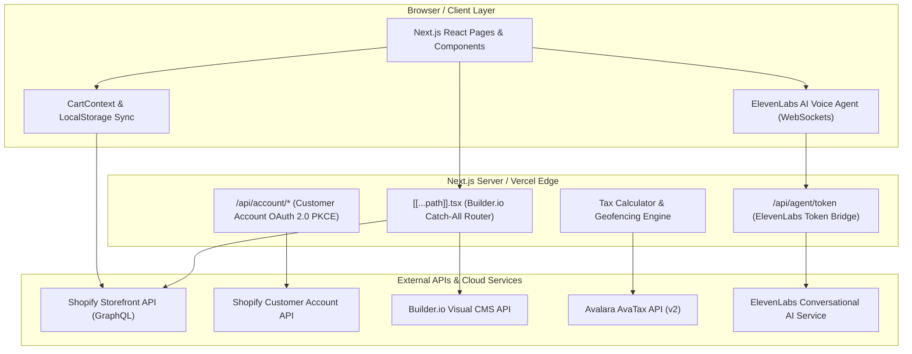

# System Architecture & Development Best Practices

This document provides a comprehensive reference for the architecture, design principles, subsystem integrations, and development best practices of the **DisplayCellPros** headless e-commerce storefront.

---

## 1. Executive Summary & Core Stack

The DisplayCellPros storefront is a modern, high-performance headless e-commerce application built with Next.js, Shopify, and Builder.io.

* **Frontend Framework**: Next.js 16 (Pages Router, Node 24 runtime environment).
* **E-Commerce Backend**: Shopify Storefront API (GraphQL) & Shopify Customer Account API (OAuth 2.0 PKCE).
* **Visual CMS & Content Management**: Builder.io (headless visual CMS with custom dynamic React block registration).
* **Conversational AI**: ElevenLabs Conversational AI Agent integration (`@elevenlabs/client` with WebSockets & Audio Worklets).
* **Tax Engine & Compliance**: Custom Tribal Tax Exemption engine (`lib/tax-calculator.ts`) integrating Avalara AvaTax API v2 and AIANA geofencing.

---

## 2. System Architecture Diagram



---

## 3. Key Subsystems & Directory Structure

```text
.
├── pages/                    # Next.js Pages Router routes
│   ├── [[...path]].tsx       # Catch-all page router resolving Builder.io CMS content
│   ├── api/account/          # Customer Account API OAuth 2.0 PKCE authentication flow
│   ├── api/agent/token.ts    # ElevenLabs AI token generation endpoint
│   ├── products/[handle].tsx # Native PDP (Product Detail Page) route
│   └── collections/[handle].tsx # Native Collection listing route
├── components/               # React UI components
│   ├── ElevenLabsAgent.jsx   # AI voice agent floating assistant & state machine
│   ├── VoicePulseAvatar.jsx  # Audio reactive visualizer avatar
│   ├── cart/                 # Cart Drawer, Item items, and checkout trigger
│   ├── common/               # FAQ Accordion, Breadcrumbs, ScrollToTop
│   └── search/               # Predictive search & Shopify syntax chips
├── blocks/                   # Custom Builder.io visual blocks
│   ├── ProductGrid/          # Product list grid block
│   ├── ProductView/          # Product details block
│   └── CollectionView/       # Collection box block
├── services/                 # API clients and integrations
│   ├── shopify.ts            # Storefront GraphQL fetcher & queries
│   └── shopify-customer-account.ts # OAuth 2.0 PKCE state manager
├── lib/                      # Business logic, tax engine, utilities
│   ├── cart-storage.ts       # Centralized localStorage keys & schema
│   ├── tax-calculator.ts     # Avalara AvaTax & Tribal Exemption logic
│   ├── geofencing.ts         # AIANA / Tribal reservation boundary checks
│   ├── shopify-search-syntax.ts # Search grammar parser & validator
│   └── elevenlabs-activity.ts# Activity pulse keeper for voice agent sessions
├── config/                   # Centralized runtime configuration
│   ├── shopify.ts            # Environment resolution for Shopify keys
│   └── seo.ts                # SEO metadata & structured JSON-LD schemas
└── builder-registry.tsx      # Registration manifest for Builder.io visual components
```

---

## 4. Authentication & Security Architecture

### 4.1 Headless Customer Accounts (OAuth 2.0 + PKCE)
Buyer authentication bypasses legacy password login and utilizes Shopify's modern Customer Account API:
* **Protocol**: OAuth 2.0 authorization code flow with Proof Key for Code Exchange (PKCE).
* **Endpoints**: Located in `pages/api/account/` (`login.ts`, `callback.ts`, `logout.ts`).
* **Security Controls**:
  * Mandatory state verification cookies with `SameSite=Lax`, `HttpOnly`, and `Secure`.
  * Open redirect sanitization via `services/shopify-customer-account.ts#sanitizeRedirectUrl` to prevent SSRF and unvalidated external redirects.
  * Runtime enforcement of `SHOPIFY_CUSTOMER_ACCOUNT_API_CLIENT_ID` and `SHOPIFY_CUSTOMER_ACCOUNT_API_SHOP_ID`.

### 4.2 Content Security Policy & Secret Protection
* **CSP Enforcement**: Headers configured in `next.config.js` allow necessary script sources (`unsafe-eval` for WebGL/Audio Worklets, Builder.io SDKs, and ElevenLabs WebSocket endpoints).
* **Secret Isolation**: Private Shopify Storefront Access Tokens (`shpat_`) must never be exposed to browser bundles. `npm run check:secrets` enforces this via automated AST scanning.

---

## 5. Tax Engine & Tribal Exemption Subsystem

The storefront provides specialized sales tax exemption processing for qualified Native American / Tribal Member transactions on reservation land:
* **AvaTax Entity Use Code**: Uses Avalara Entity Use Code **'C'** (Tribal Member Exemption).
* **Dual Qualification Standard**:
  1. Verified enrolled tribal status (`isTribalMember: true`).
  2. Address verified within designated reservation boundaries (`geofencing.ts` spatial intersection).
* **Remittance & Self-Administration**: Automatically flags self-administered tribal tax jurisdictions and provides remittance instructions where applicable.

---

## 6. Conversational Voice AI (`ElevenLabsAgent.jsx`)

The storefront integrates an intelligent, real-time AI voice assistant powered by ElevenLabs:
* **Audio Processing**: High-performance WebSocket communication backed by custom Web Audio API AudioWorklets.
* **Resilient Connection Flow**:
  * Backoff token acquisition via `fetchVoiceTokenWithBackoff` with exponential backoff and jitter.
  * Audio worklet fallback verification via `resolveWorkletUrl` to prevent broken browser audio node creation.
* **Activity Tracking**: Uses `createActivityKeeper` (`lib/elevenlabs-activity.ts`) to manage session keep-alive pulses and emit global activity events.

---

## 7. Developer Best Practices & Pre-Commit Quality Checks

### 7.1 Pre-check Pipeline
Before opening a Pull Request or deploying, run the complete validation suite:
```bash
npm run precheck && npm run test:a11y && npm run build
```
This suite executes:
1. `check:node-version` (Verifies Node `24.x`).
2. `check:ci-integrity` (Validates lockfile sync).
3. `check:typecheck` (`tsc --noEmit`).
4. `check:lint` (`next lint`).
5. `check:secrets` (Scans for accidental token leaks).
6. `check:customer-account-auth-health` (Guards OAuth PKCE configuration).

### 7.2 Code Style & Conventions
* **TypeScript**: Enforce strict types for data models in `services/` and `lib/`.
* **Component Architecture**: Keep UI components modular, clean, and styled using Tailwind CSS classes.
* **JSDoc/TSDoc Documentation**: All exported functions, schemas, interfaces, and custom hooks must include structured documentation detailing parameters, return types, and side effects.
