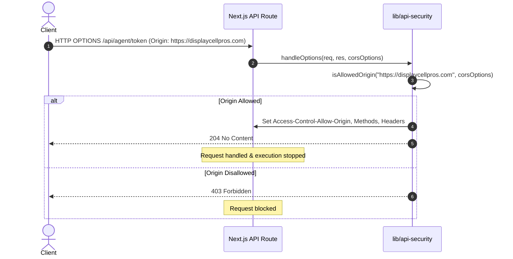
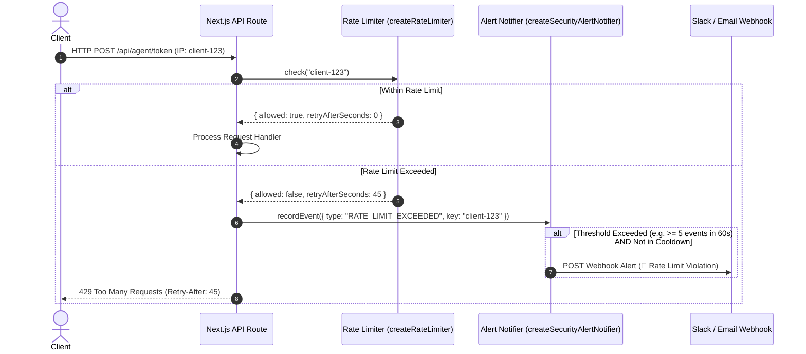

# API Security Architecture & Middleware Guide (`lib/api-security`)

This document provides technical architecture details, sequence diagrams, and onboarding documentation for the security middleware implemented in `lib/api-security/index.ts`.

---

## 🏗️ Architecture Overview

The API Security module provides a layered defense mechanism for Next.js API routes:

1. **Origin Verification & CORS Management**: Validates incoming `Origin` headers against explicit whitelists, local development environments, and preview domains (`*.run.app`).
2. **OPTIONS Preflight Handling**: Intercepts `OPTIONS` HTTP requests before handler execution and responds with appropriate CORS headers or `403 Forbidden`.
3. **In-Memory Rate Limiting**: Enforces rate limits per client identifier with a sliding window reset mechanism.
4. **Input Bounding & Validation**: Sanitizes and bounds input strings (`readBoundedString`) and integers (`readBoundedInteger`).
5. **OpenTelemetry Telemetry Tracking**: Measures request duration, status codes, and HTTP metadata with OTLP export support.
6. **Automated Security Alerting**: Aggregates security events (e.g., rate limit breaches, CORS violations) and dispatches threshold alerts to Slack, Email, or custom webhooks with cooldown suppression.

---

## 🔄 Sequence Diagrams

### 1. CORS & Preflight Request Handling Flow



---

### 2. Request Rate Limiting & Security Alerting Flow



---

## 🛠️ Middleware Functions Reference

### `isAllowedOrigin(origin, options)`
- **Purpose**: Checks if an origin URL is allowed.
- **Allowed Rules**:
  - Exact match in `options.allowedOrigins`
  - `http://localhost:3000` or `http://127.0.0.1:3000` if `allowLocalhost` is `true`.
  - Subdomains matching `*.run.app` if `allowRunApp` is `true`.

### `applyCors(res, origin, options)`
- **Purpose**: Attaches `Access-Control-Allow-Origin` and `Vary: Origin` headers to the response object if valid.

### `handleOptions(req, res, options)`
- **Purpose**: Intercepts `OPTIONS` HTTP preflight requests, sets appropriate preflight headers, and terminates with `204` or `403`.

### `createRateLimiter(options)`
- **Purpose**: Constructs an in-memory sliding window rate limiter.
- **Config**: `{ windowMs: number, maxRequests: number }`.

### `createRequestTracker(config)`
- **Purpose**: Wraps API routes to track latency, status codes, and HTTP metadata with OpenTelemetry OTLP exporter support.

### `createSecurityAlertNotifier(config)`
- **Purpose**: Tracks security violation events (`RATE_LIMIT_EXCEEDED`, `CORS_VIOLATION`, `UNAUTHORIZED_ACCESS`) and sends notifications when threshold counts are breached.
- **Config**: `{ thresholdCount, windowMs, cooldownMs, slackWebhookUrl, emailEndpointUrl, onAlert }`.

---

## 🚀 Quick Start Example

```ts
import {
  handleOptions,
  applyCors,
  createRateLimiter,
  createSecurityAlertNotifier,
  createRequestTracker,
  AllowedOriginsOptions
} from '@/lib/api-security';
import type { NextApiRequest, NextApiResponse } from 'next';

const corsOptions: AllowedOriginsOptions = {
  allowedOrigins: ['https://displaycellpros.com'],
  allowLocalhost: process.env.NODE_ENV !== 'production',
  allowRunApp: true,
};

const limiter = createRateLimiter({ windowMs: 60_000, maxRequests: 20 });
const alertNotifier = createSecurityAlertNotifier({ thresholdCount: 5, windowMs: 60_000 });
const tracker = createRequestTracker({ serviceName: 'token-api' });

export default async function handler(req: NextApiRequest, res: NextApiResponse) {
  // 1. Telemetry Tracking
  const recordMetrics = tracker.trackRequest(req, res);

  // 2. CORS Preflight
  if (handleOptions(req, res, corsOptions)) return;
  applyCors(res, req.headers.origin, corsOptions);

  // 3. Rate Limiting
  const clientKey = (req.headers['x-forwarded-for'] as string) || req.socket.remoteAddress || 'unknown';
  const limit = limiter.check(clientKey);

  if (!limit.allowed) {
    alertNotifier.recordEvent({
      type: 'RATE_LIMIT_EXCEEDED',
      key: clientKey,
      details: { path: req.url },
    });

    res.setHeader('Retry-After', String(limit.retryAfterSeconds));
    recordMetrics();
    return res.status(429).json({ error: 'Too many requests' });
  }

  // 4. Endpoint Logic
  res.status(200).json({ success: true });
  recordMetrics();
}
```

---

## 🧪 Testing

Run the full API security test suite:

```bash
npx jest lib/api-security/__tests__/api-security.test.js
```
